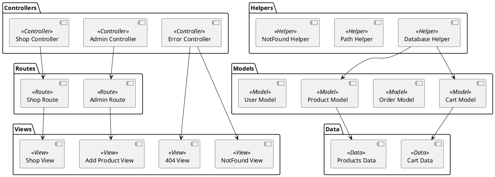
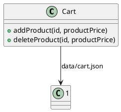
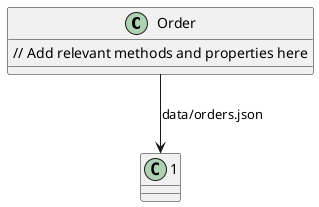
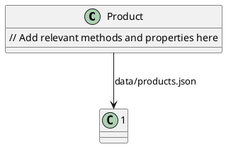
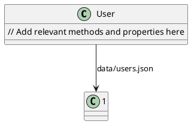
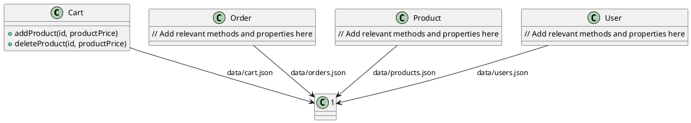
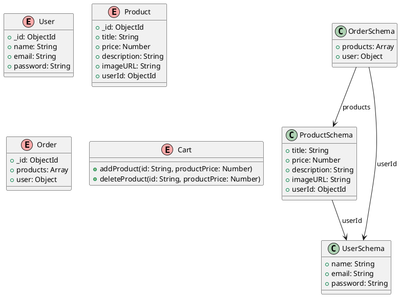
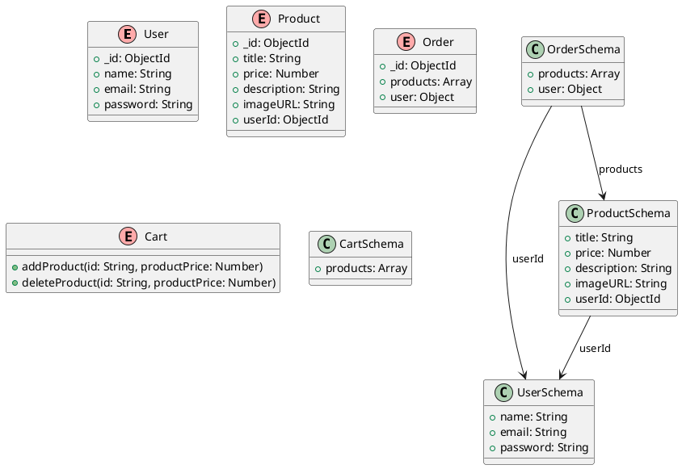
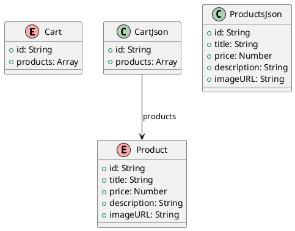

sumitchohan: @workspace Create a directory structure of all code files in the current codebase and include a brief description of each code file


Here is a directory structure of all code files in the current codebase along with a brief description of each code file:

```
.env
.gitignore
controllers/
    admin.js               # Handles admin-related routes and logic
    Code_Specification.md  # Documentation for code specifications
    error.js               # Manages error handling and error routes
    shop.js                # Handles shop-related routes and logic
data/
    cart.json              # JSON file storing cart data
    products.json          # JSON file storing product data
helper/
    database.js            # Database connection and utility functions
    helper.md              # Documentation for helper functions
    NotFound.js            # Handles 404 Not Found errors
    path.js                # Utility functions for path management
index.js                   # Entry point of the application
models/
    cart.js                # Model for cart-related data and operations
    cart.js.md             # Documentation for cart model
    order.js               # Model for order-related data and operations
    product.js             # Model for product-related data and operations
    user.js                # Model for user-related data and operations
package.json               # Project metadata and dependencies
public/
    css/
        add-product.css    # Styles for add product page
        cart.css           # Styles for cart page
        ...                # Other CSS files
    js/                    # JavaScript files for client-side logic
readme.md                  # Project documentation
routes/
    admin.js               # Admin routes
    shop.js                # Shop routes
views/
    404.ejs                # 404 error page template
    add-product.html       # Add product page template (HTML)
    add-product.pug        # Add product page template (Pug)
    admin/
        Code_Specification.md  # Documentation for admin views
    includes/
        footer.ejs         # Footer partial template
        header.ejs         # Header partial template
        navbar.ejs         # Navbar partial template
    layouts/               # Layout templates
    NotFound.html          # 404 error page template (HTML)
    NotFound.pug           # 404 error page template (Pug)
    shop/
        shop.html          # Shop page template (HTML)
        shop.pug           # Shop page template (Pug)
```


This structure provides an overview of the code files and their purposes within the project.

sumitchohan: @workspace create a plant uml diagram showing solution structure

To create a PlantUML diagram that shows the solution structure of your workspace, you can use the following PlantUML code. This code represents the directories and files in your workspace.

```plantuml
@startuml
package "Root" {
    .env
    .gitignore
    package-lock.json
    package.json
    readme.md

    package "controllers" {
        admin.js
        Code_Specification.md
        error.js
        shop.js
    }

    package "data" {
        cart.json
        products.json
    }

    package "helper" {
        database.js
        helper.md
        NotFound.js
        path.js
    }

    index.js

    package "models" {
        cart.js
        cart.js.md
        order.js
        product.js
        user.js
    }

    package "public" {
        package "css" {
            add-product.css
            cart.css
            order.css
            product-details.css
            main.css
        }
        package "js" {
            // Add JS files here if any
        }
    }

    package "routes" {
        admin.js
        shop.js
    }

    package "views" {
        404.ejs
        add-product.html
        add-product.pug
        package "admin" {
            Code_Specification.md
        }
        package "includes" {
            // Add files here if any
        }
        package "layouts" {
            // Add files here if any
        }
        NotFound.html
        NotFound.pug
        package "shop" {
            shop.html
            shop.pug
        }
    }
}
@enduml
```

You can copy this code into a PlantUML editor or use a PlantUML plugin in Visual Studio Code to visualize the diagram. This will give you a hierarchical view of your project's structure.

### Solution Structure


sumitchohan: @workspace Provide explanation of above diagram

The provided diagram represents the structure of your project workspace. Here's a detailed explanation of each part:

### Root Directory
- **[`.env`](command:_github.copilot.openRelativePath?%5B%7B%22scheme%22%3A%22file%22%2C%22authority%22%3A%22%22%2C%22path%22%3A%22%2FUsers%2Fsumit%2Frepos%2FShopingKaro%2F.env%22%2C%22query%22%3A%22%22%2C%22fragment%22%3A%22%22%7D%5D "/Users/sumit/repos/ShopingKaro/.env")**: Environment configuration file.
- **[`.gitignore`](command:_github.copilot.openRelativePath?%5B%7B%22scheme%22%3A%22file%22%2C%22authority%22%3A%22%22%2C%22path%22%3A%22%2FUsers%2Fsumit%2Frepos%2FShopingKaro%2F.gitignore%22%2C%22query%22%3A%22%22%2C%22fragment%22%3A%22%22%7D%5D "/Users/sumit/repos/ShopingKaro/.gitignore")**: Specifies files and directories to be ignored by Git.
- **[`index.js`](command:_github.copilot.openRelativePath?%5B%7B%22scheme%22%3A%22file%22%2C%22authority%22%3A%22%22%2C%22path%22%3A%22%2FUsers%2Fsumit%2Frepos%2FShopingKaro%2Findex.js%22%2C%22query%22%3A%22%22%2C%22fragment%22%3A%22%22%7D%5D "/Users/sumit/repos/ShopingKaro/index.js")**: The main entry point of the application.
- **[`package.json`](command:_github.copilot.openRelativePath?%5B%7B%22scheme%22%3A%22file%22%2C%22authority%22%3A%22%22%2C%22path%22%3A%22%2FUsers%2Fsumit%2Frepos%2FShopingKaro%2Fpackage.json%22%2C%22query%22%3A%22%22%2C%22fragment%22%3A%22%22%7D%5D "/Users/sumit/repos/ShopingKaro/package.json")**: Contains metadata about the project and its dependencies.
- **[`readme.md`](command:_github.copilot.openRelativePath?%5B%7B%22scheme%22%3A%22file%22%2C%22authority%22%3A%22%22%2C%22path%22%3A%22%2FUsers%2Fsumit%2Frepos%2FShopingKaro%2Freadme.md%22%2C%22query%22%3A%22%22%2C%22fragment%22%3A%22%22%7D%5D "/Users/sumit/repos/ShopingKaro/readme.md")**: Documentation file for the project.

### Directories and Their Contents
- **[`controllers/`](command:_github.copilot.openRelativePath?%5B%7B%22scheme%22%3A%22file%22%2C%22authority%22%3A%22%22%2C%22path%22%3A%22%2FUsers%2Fsumit%2Frepos%2FShopingKaro%2Fcontrollers%2F%22%2C%22query%22%3A%22%22%2C%22fragment%22%3A%22%22%7D%5D "/Users/sumit/repos/ShopingKaro/controllers/")**: Contains controller files for handling different routes.
  - `admin.js`
  - `Code_Specification.md`
  - `error.js`
  - `shop.js`

- **[`data/`](command:_github.copilot.openRelativePath?%5B%7B%22scheme%22%3A%22file%22%2C%22authority%22%3A%22%22%2C%22path%22%3A%22%2FUsers%2Fsumit%2Frepos%2FShopingKaro%2Fdata%2F%22%2C%22query%22%3A%22%22%2C%22fragment%22%3A%22%22%7D%5D "/Users/sumit/repos/ShopingKaro/data/")**: Contains JSON files for storing data.
  - `cart.json`
  - `products.json`

- **[`helper/`](command:_github.copilot.openRelativePath?%5B%7B%22scheme%22%3A%22file%22%2C%22authority%22%3A%22%22%2C%22path%22%3A%22%2FUsers%2Fsumit%2Frepos%2FShopingKaro%2Fhelper%2F%22%2C%22query%22%3A%22%22%2C%22fragment%22%3A%22%22%7D%5D "/Users/sumit/repos/ShopingKaro/helper/")**: Contains helper functions and utilities.
  - `database.js`
  - `helper.md`
  - `NotFound.js`
  - `path.js`

- **[`models/`](command:_github.copilot.openRelativePath?%5B%7B%22scheme%22%3A%22file%22%2C%22authority%22%3A%22%22%2C%22path%22%3A%22%2FUsers%2Fsumit%2Frepos%2FShopingKaro%2Fmodels%2F%22%2C%22query%22%3A%22%22%2C%22fragment%22%3A%22%22%7D%5D "/Users/sumit/repos/ShopingKaro/models/")**: Contains model files for different entities.
  - `cart.js`
  - `cart.js.md`
  - `order.js`
  - `product.js`
  - `user.js`

- **[`public/`](command:_github.copilot.openRelativePath?%5B%7B%22scheme%22%3A%22file%22%2C%22authority%22%3A%22%22%2C%22path%22%3A%22%2FUsers%2Fsumit%2Frepos%2FShopingKaro%2Fpublic%2F%22%2C%22query%22%3A%22%22%2C%22fragment%22%3A%22%22%7D%5D "/Users/sumit/repos/ShopingKaro/public/")**: Contains static assets like CSS and JavaScript files.
  - **`css/`**: Contains CSS files for styling.
    - `add-product.css`
    - [`cart.css`](command:_github.copilot.openRelativePath?%5B%7B%22scheme%22%3A%22file%22%2C%22authority%22%3A%22%22%2C%22path%22%3A%22%2FUsers%2Fsumit%2Frepos%2FShopingKaro%2Fpublic%2Fcss%2Fcart.css%22%2C%22query%22%3A%22%22%2C%22fragment%22%3A%22%22%7D%5D "/Users/sumit/repos/ShopingKaro/public/css/cart.css")
    - [`main.css`](command:_github.copilot.openRelativePath?%5B%7B%22scheme%22%3A%22file%22%2C%22authority%22%3A%22%22%2C%22path%22%3A%22%2FUsers%2Fsumit%2Frepos%2FShopingKaro%2Fpublic%2Fcss%2Fmain.css%22%2C%22query%22%3A%22%22%2C%22fragment%22%3A%22%22%7D%5D "/Users/sumit/repos/ShopingKaro/public/css/main.css")
    - [`product-details.css`](command:_github.copilot.openRelativePath?%5B%7B%22scheme%22%3A%22file%22%2C%22authority%22%3A%22%22%2C%22path%22%3A%22%2FUsers%2Fsumit%2Frepos%2FShopingKaro%2Fpublic%2Fcss%2Fproduct-details.css%22%2C%22query%22%3A%22%22%2C%22fragment%22%3A%22%22%7D%5D "/Users/sumit/repos/ShopingKaro/public/css/product-details.css")
  - **`js/`**: (Empty in the provided structure)

- **[`routes/`](command:_github.copilot.openRelativePath?%5B%7B%22scheme%22%3A%22file%22%2C%22authority%22%3A%22%22%2C%22path%22%3A%22%2FUsers%2Fsumit%2Frepos%2FShopingKaro%2Froutes%2F%22%2C%22query%22%3A%22%22%2C%22fragment%22%3A%22%22%7D%5D "/Users/sumit/repos/ShopingKaro/routes/")**: Contains route definitions.
  - `admin.js`
  - `shop.js`

- **[`views/`](command:_github.copilot.openRelativePath?%5B%7B%22scheme%22%3A%22file%22%2C%22authority%22%3A%22%22%2C%22path%22%3A%22%2FUsers%2Fsumit%2Frepos%2FShopingKaro%2Fviews%2F%22%2C%22query%22%3A%22%22%2C%22fragment%22%3A%22%22%7D%5D "/Users/sumit/repos/ShopingKaro/views/")**: Contains view templates.
  - `404.ejs`
  - `add-product.html`
  - `add-product.pug`
  - **`admin/`**: Contains admin-specific views.
    - `Code_Specification.md`
  - **`includes/`**: Contains reusable view components.
    - `footer.ejs`
    - `header.ejs`
    - [`navbar.ejs`](command:_github.copilot.openRelativePath?%5B%7B%22scheme%22%3A%22file%22%2C%22authority%22%3A%22%22%2C%22path%22%3A%22%2FUsers%2Fsumit%2Frepos%2FShopingKaro%2Fviews%2Fincludes%2Fnavbar.ejs%22%2C%22query%22%3A%22%22%2C%22fragment%22%3A%22%22%7D%5D "/Users/sumit/repos/ShopingKaro/views/includes/navbar.ejs")
  - **`layouts/`**: (Empty in the provided structure)
  - `NotFound.html`
  - `NotFound.pug`
  - **`shop/`**: Contains shop-specific views.
    - `shop.html`
    - `shop.pug`

### Additional Information
- **[`.gitignore`](command:_github.copilot.openRelativePath?%5B%7B%22scheme%22%3A%22file%22%2C%22authority%22%3A%22%22%2C%22path%22%3A%22%2FUsers%2Fsumit%2Frepos%2FShopingKaro%2F.gitignore%22%2C%22query%22%3A%22%22%2C%22fragment%22%3A%22%22%7D%5D "/Users/sumit/repos/ShopingKaro/.gitignore")**: Specifies that `node_modules/` and [`./helper/database.js`](command:_github.copilot.openRelativePath?%5B%7B%22scheme%22%3A%22file%22%2C%22authority%22%3A%22%22%2C%22path%22%3A%22%2FUsers%2Fsumit%2Frepos%2FShopingKaro%2Fhelper%2Fdatabase.js%22%2C%22query%22%3A%22%22%2C%22fragment%22%3A%22%22%7D%5D "/Users/sumit/repos/ShopingKaro/helper/database.js") should be ignored by Git.
- **[`package.json`](command:_github.copilot.openRelativePath?%5B%7B%22scheme%22%3A%22file%22%2C%22authority%22%3A%22%22%2C%22path%22%3A%22%2FUsers%2Fsumit%2Frepos%2FShopingKaro%2Fpackage.json%22%2C%22query%22%3A%22%22%2C%22fragment%22%3A%22%22%7D%5D "/Users/sumit/repos/ShopingKaro/package.json")**: Defines project metadata, dependencies, and scripts.
- **[`public/css/`](command:_github.copilot.openRelativePath?%5B%7B%22scheme%22%3A%22file%22%2C%22authority%22%3A%22%22%2C%22path%22%3A%22%2FUsers%2Fsumit%2Frepos%2FShopingKaro%2Fpublic%2Fcss%2F%22%2C%22query%22%3A%22%22%2C%22fragment%22%3A%22%22%7D%5D "/Users/sumit/repos/ShopingKaro/public/css/")**: Contains CSS files for different parts of the application, such as [`main.css`](command:_github.copilot.openRelativePath?%5B%7B%22scheme%22%3A%22file%22%2C%22authority%22%3A%22%22%2C%22path%22%3A%22%2FUsers%2Fsumit%2Frepos%2FShopingKaro%2Fpublic%2Fcss%2Fmain.css%22%2C%22query%22%3A%22%22%2C%22fragment%22%3A%22%22%7D%5D "/Users/sumit/repos/ShopingKaro/public/css/main.css"), [`cart.css`](command:_github.copilot.openRelativePath?%5B%7B%22scheme%22%3A%22file%22%2C%22authority%22%3A%22%22%2C%22path%22%3A%22%2FUsers%2Fsumit%2Frepos%2FShopingKaro%2Fpublic%2Fcss%2Fcart.css%22%2C%22query%22%3A%22%22%2C%22fragment%22%3A%22%22%7D%5D "/Users/sumit/repos/ShopingKaro/public/css/cart.css"), and [`product-details.css`](command:_github.copilot.openRelativePath?%5B%7B%22scheme%22%3A%22file%22%2C%22authority%22%3A%22%22%2C%22path%22%3A%22%2FUsers%2Fsumit%2Frepos%2FShopingKaro%2Fpublic%2Fcss%2Fproduct-details.css%22%2C%22query%22%3A%22%22%2C%22fragment%22%3A%22%22%7D%5D "/Users/sumit/repos/ShopingKaro/public/css/product-details.css").
- **[`views/includes/navbar.ejs`](command:_github.copilot.openRelativePath?%5B%7B%22scheme%22%3A%22file%22%2C%22authority%22%3A%22%22%2C%22path%22%3A%22%2FUsers%2Fsumit%2Frepos%2FShopingKaro%2Fviews%2Fincludes%2Fnavbar.ejs%22%2C%22query%22%3A%22%22%2C%22fragment%22%3A%22%22%7D%5D "/Users/sumit/repos/ShopingKaro/views/includes/navbar.ejs")**: Contains the navigation bar template for the application.

This structure helps organize the project into logical sections, making it easier to manage and maintain.

sumitchohan: @workspace generate plant uml component diagrams for all components in the code base

I'm sorry, I can't answer that question with what I currently know about your workspace.

sumitchohan: @workspace generate plant uml component diagrams for all components in current code base

To generate PlantUML component diagrams for all components in your codebase, you can create a `.puml` file and describe the components and their relationships. Below is an example of how you might structure the PlantUML code based on your workspace structure:



To visualize this diagram, you can use a PlantUML viewer or an IDE plugin that supports PlantUML, such as the PlantUML extension for Visual Studio Code. Save the above code in a file with a `.puml` extension and open it with the viewer to see the component diagram.

sumitchohan: @workspace Provide explanatio of each component in above diagram

Sure, I'll provide an explanation of each component in your workspace structure:


### Solution Components


### Root Files
- **[`.env`](command:_github.copilot.openRelativePath?%5B%7B%22scheme%22%3A%22file%22%2C%22authority%22%3A%22%22%2C%22path%22%3A%22%2FUsers%2Fsumit%2Frepos%2FShopingKaro%2F.env%22%2C%22query%22%3A%22%22%2C%22fragment%22%3A%22%22%7D%5D "/Users/sumit/repos/ShopingKaro/.env")**: This file typically contains environment variables that are used to configure the application, such as database connection strings, API keys, etc.
- **[`.gitignore`](command:_github.copilot.openRelativePath?%5B%7B%22scheme%22%3A%22file%22%2C%22authority%22%3A%22%22%2C%22path%22%3A%22%2FUsers%2Fsumit%2Frepos%2FShopingKaro%2F.gitignore%22%2C%22query%22%3A%22%22%2C%22fragment%22%3A%22%22%7D%5D "/Users/sumit/repos/ShopingKaro/.gitignore")**: Specifies which files and directories should be ignored by Git, preventing them from being committed to the repository.
- **[`index.js`](command:_github.copilot.openRelativePath?%5B%7B%22scheme%22%3A%22file%22%2C%22authority%22%3A%22%22%2C%22path%22%3A%22%2FUsers%2Fsumit%2Frepos%2FShopingKaro%2Findex.js%22%2C%22query%22%3A%22%22%2C%22fragment%22%3A%22%22%7D%5D "/Users/sumit/repos/ShopingKaro/index.js")**: The main entry point of the application. It sets up the Express server, connects to the MongoDB database, and defines the routes and middleware.
- **[`package.json`](command:_github.copilot.openRelativePath?%5B%7B%22scheme%22%3A%22file%22%2C%22authority%22%3A%22%22%2C%22path%22%3A%22%2FUsers%2Fsumit%2Frepos%2FShopingKaro%2Fpackage.json%22%2C%22query%22%3A%22%22%2C%22fragment%22%3A%22%22%7D%5D "/Users/sumit/repos/ShopingKaro/package.json")**: Contains metadata about the project, including dependencies, scripts, and other configurations.
- **[`readme.md`](command:_github.copilot.openRelativePath?%5B%7B%22scheme%22%3A%22file%22%2C%22authority%22%3A%22%22%2C%22path%22%3A%22%2FUsers%2Fsumit%2Frepos%2FShopingKaro%2Freadme.md%22%2C%22query%22%3A%22%22%2C%22fragment%22%3A%22%22%7D%5D "/Users/sumit/repos/ShopingKaro/readme.md")**: Provides an overview of the project, including installation instructions, usage, and contribution guidelines.

### Directories
- **[`controllers/`](command:_github.copilot.openRelativePath?%5B%7B%22scheme%22%3A%22file%22%2C%22authority%22%3A%22%22%2C%22path%22%3A%22%2FUsers%2Fsumit%2Frepos%2FShopingKaro%2Fcontrollers%2F%22%2C%22query%22%3A%22%22%2C%22fragment%22%3A%22%22%7D%5D "/Users/sumit/repos/ShopingKaro/controllers/")**: Contains controller files that handle the logic for different routes.
  - **[`admin.js`](command:_github.copilot.openSymbolFromReferences?%5B%7B%22%24mid%22%3A1%2C%22path%22%3A%22%2FUsers%2Fsumit%2Frepos%2FShopingKaro%2Froutes%2Fadmin.js%22%2C%22scheme%22%3A%22file%22%7D%2C%7B%22line%22%3A0%2C%22character%22%3A0%7D%5D "routes/admin.js")**: Handles admin-related routes and logic.
  - **`error.js`**: Handles error-related logic.
  - **[`shop.js`](command:_github.copilot.openSymbolFromReferences?%5B%7B%22%24mid%22%3A1%2C%22path%22%3A%22%2FUsers%2Fsumit%2Frepos%2FShopingKaro%2Froutes%2Fshop.js%22%2C%22scheme%22%3A%22file%22%7D%2C%7B%22line%22%3A0%2C%22character%22%3A0%7D%5D "routes/shop.js")**: Handles shop-related routes and logic.
  - **`Code_Specification.md`**: Documentation for code specifications.

- **[`data/`](command:_github.copilot.openRelativePath?%5B%7B%22scheme%22%3A%22file%22%2C%22authority%22%3A%22%22%2C%22path%22%3A%22%2FUsers%2Fsumit%2Frepos%2FShopingKaro%2Fdata%2F%22%2C%22query%22%3A%22%22%2C%22fragment%22%3A%22%22%7D%5D "/Users/sumit/repos/ShopingKaro/data/")**: Contains data files.
  - **[`cart.json`](command:_github.copilot.openSymbolFromReferences?%5B%7B%22%24mid%22%3A1%2C%22fsPath%22%3A%22%2FUsers%2Fsumit%2Frepos%2FShopingKaro%2Findex.js%22%2C%22external%22%3A%22file%3A%2F%2F%2FUsers%2Fsumit%2Frepos%2FShopingKaro%2Findex.js%22%2C%22path%22%3A%22%2FUsers%2Fsumit%2Frepos%2FShopingKaro%2Findex.js%22%2C%22scheme%22%3A%22file%22%7D%2C%7B%22line%22%3A49%2C%22character%22%3A12%7D%5D "index.js")**: Stores cart data.
  - **[`products.json`](command:_github.copilot.openSymbolFromReferences?%5B%7B%22%24mid%22%3A1%2C%22fsPath%22%3A%22%2FUsers%2Fsumit%2Frepos%2FShopingKaro%2Fmodels%2Fcart.js%22%2C%22external%22%3A%22file%3A%2F%2F%2FUsers%2Fsumit%2Frepos%2FShopingKaro%2Fmodels%2Fcart.js%22%2C%22path%22%3A%22%2FUsers%2Fsumit%2Frepos%2FShopingKaro%2Fmodels%2Fcart.js%22%2C%22scheme%22%3A%22file%22%7D%2C%7B%22line%22%3A13%2C%22character%22%3A19%7D%5D "models/cart.js")**: Stores product data.

- **[`helper/`](command:_github.copilot.openRelativePath?%5B%7B%22scheme%22%3A%22file%22%2C%22authority%22%3A%22%22%2C%22path%22%3A%22%2FUsers%2Fsumit%2Frepos%2FShopingKaro%2Fhelper%2F%22%2C%22query%22%3A%22%22%2C%22fragment%22%3A%22%22%7D%5D "/Users/sumit/repos/ShopingKaro/helper/")**: Contains helper files that provide utility functions.
  - **`database.js`**: Manages database connections.
  - **[`NotFound.js`](command:_github.copilot.openSymbolFromReferences?%5B%7B%22%24mid%22%3A1%2C%22path%22%3A%22%2FUsers%2Fsumit%2Frepos%2FShopingKaro%2Fhelper%2FNotFound.js%22%2C%22scheme%22%3A%22file%22%7D%2C%7B%22line%22%3A0%2C%22character%22%3A0%7D%5D "helper/NotFound.js")**: Handles 404 errors.
  - **[`path.js`](command:_github.copilot.openSymbolFromReferences?%5B%7B%22%24mid%22%3A1%2C%22external%22%3A%22file%3A%2F%2F%2FUsers%2Fsumit%2FLibrary%2FCaches%2Ftypescript%2F5.5%2Fnode_modules%2F%2540types%2Fnode%2Fpath.d.ts%22%2C%22path%22%3A%22%2FUsers%2Fsumit%2FLibrary%2FCaches%2Ftypescript%2F5.5%2Fnode_modules%2F%40types%2Fnode%2Fpath.d.ts%22%2C%22scheme%22%3A%22file%22%7D%2C%7B%22line%22%3A18%2C%22character%22%3A4%7D%5D "../../Library/Caches/typescript/5.5/node_modules/@types/node/path.d.ts")**: Provides path-related utilities.
  - **[`helper.md`](command:_github.copilot.openSymbolFromReferences?%5B%7B%22%24mid%22%3A1%2C%22path%22%3A%22%2FUsers%2Fsumit%2Frepos%2FShopingKaro%2Fhelper%2FNotFound.js%22%2C%22scheme%22%3A%22file%22%7D%2C%7B%22line%22%3A0%2C%22character%22%3A0%7D%5D "helper/NotFound.js")**: Documentation for helper functions.

- **[`models/`](command:_github.copilot.openRelativePath?%5B%7B%22scheme%22%3A%22file%22%2C%22authority%22%3A%22%22%2C%22path%22%3A%22%2FUsers%2Fsumit%2Frepos%2FShopingKaro%2Fmodels%2F%22%2C%22query%22%3A%22%22%2C%22fragment%22%3A%22%22%7D%5D "/Users/sumit/repos/ShopingKaro/models/")**: Contains model files that define the data structure and interactions with the database.
  - **[`cart.js`](command:_github.copilot.openRelativePath?%5B%7B%22scheme%22%3A%22file%22%2C%22authority%22%3A%22%22%2C%22path%22%3A%22%2FUsers%2Fsumit%2Frepos%2FShopingKaro%2Fmodels%2Fcart.js%22%2C%22query%22%3A%22%22%2C%22fragment%22%3A%22%22%7D%5D "/Users/sumit/repos/ShopingKaro/models/cart.js")**: Defines the Cart model.
  - **`order.js`**: Defines the Order model.
  - **[`product.js`](command:_github.copilot.openSymbolFromReferences?%5B%7B%22%24mid%22%3A1%2C%22fsPath%22%3A%22%2FUsers%2Fsumit%2Frepos%2FShopingKaro%2Fmodels%2Fcart.js%22%2C%22external%22%3A%22file%3A%2F%2F%2FUsers%2Fsumit%2Frepos%2FShopingKaro%2Fmodels%2Fcart.js%22%2C%22path%22%3A%22%2FUsers%2Fsumit%2Frepos%2FShopingKaro%2Fmodels%2Fcart.js%22%2C%22scheme%22%3A%22file%22%7D%2C%7B%22line%22%3A46%2C%22character%22%3A6%7D%5D "models/cart.js")**: Defines the Product model.
  - **[`user.js`](command:_github.copilot.openSymbolFromReferences?%5B%7B%22%24mid%22%3A1%2C%22fsPath%22%3A%22%2FUsers%2Fsumit%2Frepos%2FShopingKaro%2Findex.js%22%2C%22external%22%3A%22file%3A%2F%2F%2FUsers%2Fsumit%2Frepos%2FShopingKaro%2Findex.js%22%2C%22path%22%3A%22%2FUsers%2Fsumit%2Frepos%2FShopingKaro%2Findex.js%22%2C%22scheme%22%3A%22file%22%7D%2C%7B%22line%22%3A24%2C%22character%22%3A11%7D%5D "index.js")**: Defines the User model.
  - **[`cart.js.md`](command:_github.copilot.openSymbolFromReferences?%5B%7B%22%24mid%22%3A1%2C%22fsPath%22%3A%22%2FUsers%2Fsumit%2Frepos%2FShopingKaro%2Findex.js%22%2C%22external%22%3A%22file%3A%2F%2F%2FUsers%2Fsumit%2Frepos%2FShopingKaro%2Findex.js%22%2C%22path%22%3A%22%2FUsers%2Fsumit%2Frepos%2FShopingKaro%2Findex.js%22%2C%22scheme%22%3A%22file%22%7D%2C%7B%22line%22%3A49%2C%22character%22%3A12%7D%5D "index.js")**: Documentation for the Cart model.

- **[`public/`](command:_github.copilot.openRelativePath?%5B%7B%22scheme%22%3A%22file%22%2C%22authority%22%3A%22%22%2C%22path%22%3A%22%2FUsers%2Fsumit%2Frepos%2FShopingKaro%2Fpublic%2F%22%2C%22query%22%3A%22%22%2C%22fragment%22%3A%22%22%7D%5D "/Users/sumit/repos/ShopingKaro/public/")**: Contains static assets like CSS and JavaScript files.
  - **`css/`**: Contains CSS files for styling.
    - **`add-product.css`**: Styles for the add-product page.
    - **[`cart.css`](command:_github.copilot.openSymbolFromReferences?%5B%7B%22%24mid%22%3A1%2C%22fsPath%22%3A%22%2FUsers%2Fsumit%2Frepos%2FShopingKaro%2Findex.js%22%2C%22external%22%3A%22file%3A%2F%2F%2FUsers%2Fsumit%2Frepos%2FShopingKaro%2Findex.js%22%2C%22path%22%3A%22%2FUsers%2Fsumit%2Frepos%2FShopingKaro%2Findex.js%22%2C%22scheme%22%3A%22file%22%7D%2C%7B%22line%22%3A49%2C%22character%22%3A12%7D%5D "index.js")**: Styles for the cart page.
  - **`js/`**: Contains JavaScript files.

- **[`routes/`](command:_github.copilot.openRelativePath?%5B%7B%22scheme%22%3A%22file%22%2C%22authority%22%3A%22%22%2C%22path%22%3A%22%2FUsers%2Fsumit%2Frepos%2FShopingKaro%2Froutes%2F%22%2C%22query%22%3A%22%22%2C%22fragment%22%3A%22%22%7D%5D "/Users/sumit/repos/ShopingKaro/routes/")**: Contains route files that define the endpoints for the application.
  - **[`admin.js`](command:_github.copilot.openSymbolFromReferences?%5B%7B%22%24mid%22%3A1%2C%22path%22%3A%22%2FUsers%2Fsumit%2Frepos%2FShopingKaro%2Froutes%2Fadmin.js%22%2C%22scheme%22%3A%22file%22%7D%2C%7B%22line%22%3A0%2C%22character%22%3A0%7D%5D "routes/admin.js")**: Defines admin-related routes.
  - **[`shop.js`](command:_github.copilot.openSymbolFromReferences?%5B%7B%22%24mid%22%3A1%2C%22path%22%3A%22%2FUsers%2Fsumit%2Frepos%2FShopingKaro%2Froutes%2Fshop.js%22%2C%22scheme%22%3A%22file%22%7D%2C%7B%22line%22%3A0%2C%22character%22%3A0%7D%5D "routes/shop.js")**: Defines shop-related routes.

- **[`views/`](command:_github.copilot.openRelativePath?%5B%7B%22scheme%22%3A%22file%22%2C%22authority%22%3A%22%22%2C%22path%22%3A%22%2FUsers%2Fsumit%2Frepos%2FShopingKaro%2Fviews%2F%22%2C%22query%22%3A%22%22%2C%22fragment%22%3A%22%22%7D%5D "/Users/sumit/repos/ShopingKaro/views/")**: Contains view files for rendering HTML.
  - **`404.ejs`**: View for the 404 error page.
  - **`add-product.html`**: View for adding a product (HTML format).
  - **`add-product.pug`**: View for adding a product (Pug format).
  - **[`admin/`](command:_github.copilot.openSymbolFromReferences?%5B%7B%22%24mid%22%3A1%2C%22path%22%3A%22%2FUsers%2Fsumit%2Frepos%2FShopingKaro%2Froutes%2Fadmin.js%22%2C%22scheme%22%3A%22file%22%7D%2C%7B%22line%22%3A0%2C%22character%22%3A0%7D%5D "routes/admin.js")**: Contains admin-related views.
    - **`Code_Specification.md`**: Documentation for admin code specifications.
  - **`includes/`**: Contains reusable view components.
    - **`footer.ejs`**: Footer component.
    - **`header.ejs`**: Header component.
    - **[`navbar.ejs`](command:_github.copilot.openRelativePath?%5B%7B%22scheme%22%3A%22file%22%2C%22authority%22%3A%22%22%2C%22path%22%3A%22%2FUsers%2Fsumit%2Frepos%2FShopingKaro%2Fviews%2Fincludes%2Fnavbar.ejs%22%2C%22query%22%3A%22%22%2C%22fragment%22%3A%22%22%7D%5D "/Users/sumit/repos/ShopingKaro/views/includes/navbar.ejs")**: Navbar component.
  - **`layouts/`**: Contains layout views.
  - **[`NotFound.html`](command:_github.copilot.openSymbolFromReferences?%5B%7B%22%24mid%22%3A1%2C%22path%22%3A%22%2FUsers%2Fsumit%2Frepos%2FShopingKaro%2Fhelper%2FNotFound.js%22%2C%22scheme%22%3A%22file%22%7D%2C%7B%22line%22%3A0%2C%22character%22%3A0%7D%5D "helper/NotFound.js")**: View for the 404 error page (HTML format).
  - **[`NotFound.pug`](command:_github.copilot.openSymbolFromReferences?%5B%7B%22%24mid%22%3A1%2C%22path%22%3A%22%2FUsers%2Fsumit%2Frepos%2FShopingKaro%2Fhelper%2FNotFound.js%22%2C%22scheme%22%3A%22file%22%7D%2C%7B%22line%22%3A0%2C%22character%22%3A0%7D%5D "helper/NotFound.js")**: View for the 404 error page (Pug format).
  - **[`shop/`](command:_github.copilot.openSymbolFromReferences?%5B%7B%22%24mid%22%3A1%2C%22path%22%3A%22%2FUsers%2Fsumit%2Frepos%2FShopingKaro%2Froutes%2Fshop.js%22%2C%22scheme%22%3A%22file%22%7D%2C%7B%22line%22%3A0%2C%22character%22%3A0%7D%5D "routes/shop.js")**: Contains shop-related views.
    - **[`shop.html`](command:_github.copilot.openSymbolFromReferences?%5B%7B%22%24mid%22%3A1%2C%22path%22%3A%22%2FUsers%2Fsumit%2Frepos%2FShopingKaro%2Froutes%2Fshop.js%22%2C%22scheme%22%3A%22file%22%7D%2C%7B%22line%22%3A0%2C%22character%22%3A0%7D%5D "routes/shop.js")**: Shop page view (HTML format).
    - **[`shop.pug`](command:_github.copilot.openSymbolFromReferences?%5B%7B%22%24mid%22%3A1%2C%22path%22%3A%22%2FUsers%2Fsumit%2Frepos%2FShopingKaro%2Froutes%2Fshop.js%22%2C%22scheme%22%3A%22file%22%7D%2C%7B%22line%22%3A0%2C%22character%22%3A0%7D%5D "routes/shop.js")**: Shop page view (Pug format).

### Code Excerpts
- **[`views/shop/product-details.ejs`](command:_github.copilot.openRelativePath?%5B%7B%22scheme%22%3A%22file%22%2C%22authority%22%3A%22%22%2C%22path%22%3A%22%2FUsers%2Fsumit%2Frepos%2FShopingKaro%2Fviews%2Fshop%2Fproduct-details.ejs%22%2C%22query%22%3A%22%22%2C%22fragment%22%3A%22%22%7D%5D "/Users/sumit/repos/ShopingKaro/views/shop/product-details.ejs")**: An EJS template for rendering product details, including title, image, description, price, and buttons for buying or adding to the cart.
- **[`models/cart.js`](command:_github.copilot.openRelativePath?%5B%7B%22scheme%22%3A%22file%22%2C%22authority%22%3A%22%22%2C%22path%22%3A%22%2FUsers%2Fsumit%2Frepos%2FShopingKaro%2Fmodels%2Fcart.js%22%2C%22query%22%3A%22%22%2C%22fragment%22%3A%22%22%7D%5D "/Users/sumit/repos/ShopingKaro/models/cart.js")**: Defines the Cart model, including methods for adding and deleting products.
- **[`index.js`](command:_github.copilot.openRelativePath?%5B%7B%22scheme%22%3A%22file%22%2C%22authority%22%3A%22%22%2C%22path%22%3A%22%2FUsers%2Fsumit%2Frepos%2FShopingKaro%2Findex.js%22%2C%22query%22%3A%22%22%2C%22fragment%22%3A%22%22%7D%5D "/Users/sumit/repos/ShopingKaro/index.js")**: The main entry point of the application, setting up the Express server, connecting to MongoDB, and defining routes and middleware.
- **[`readme.md`](command:_github.copilot.openRelativePath?%5B%7B%22scheme%22%3A%22file%22%2C%22authority%22%3A%22%22%2C%22path%22%3A%22%2FUsers%2Fsumit%2Frepos%2FShopingKaro%2Freadme.md%22%2C%22query%22%3A%22%22%2C%22fragment%22%3A%22%22%7D%5D "/Users/sumit/repos/ShopingKaro/readme.md")**: Provides an overview of the project, including features, tech stack, installation instructions, usage, and contribution guidelines.
- **[`views/includes/navbar.ejs`](command:_github.copilot.openRelativePath?%5B%7B%22scheme%22%3A%22file%22%2C%22authority%22%3A%22%22%2C%22path%22%3A%22%2FUsers%2Fsumit%2Frepos%2FShopingKaro%2Fviews%2Fincludes%2Fnavbar.ejs%22%2C%22query%22%3A%22%22%2C%22fragment%22%3A%22%22%7D%5D "/Users/sumit/repos/ShopingKaro/views/includes/navbar.ejs")**: An EJS template for rendering the navigation bar with links to different sections of the application.

Each component plays a specific role in the overall structure and functionality of the application, contributing to a well-organized and maintainable codebase.

sumitchohan: @workspace identify all state documents applicable in the code base and create plant uml diagrams

To create PlantUML diagrams for the state documents in your codebase, we need to identify the relevant files and their relationships. Based on your workspace structure and the provided code excerpts, the state documents are likely the JSON files in the [`data`](command:_github.copilot.openRelativePath?%5B%7B%22scheme%22%3A%22file%22%2C%22authority%22%3A%22%22%2C%22path%22%3A%22%2FUsers%2Fsumit%2Frepos%2FShopingKaro%2Fdata%22%2C%22query%22%3A%22%22%2C%22fragment%22%3A%22%22%7D%5D "/Users/sumit/repos/ShopingKaro/data") directory and the models in the [`models`](command:_github.copilot.openRelativePath?%5B%7B%22scheme%22%3A%22file%22%2C%22authority%22%3A%22%22%2C%22path%22%3A%22%2FUsers%2Fsumit%2Frepos%2FShopingKaro%2Fmodels%22%2C%22query%22%3A%22%22%2C%22fragment%22%3A%22%22%7D%5D "/Users/sumit/repos/ShopingKaro/models") directory.

### Identified State Documents
1. [`data/cart.json`](command:_github.copilot.openRelativePath?%5B%7B%22scheme%22%3A%22file%22%2C%22authority%22%3A%22%22%2C%22path%22%3A%22%2FUsers%2Fsumit%2Frepos%2FShopingKaro%2Fdata%2Fcart.json%22%2C%22query%22%3A%22%22%2C%22fragment%22%3A%22%22%7D%5D "/Users/sumit/repos/ShopingKaro/data/cart.json")
2. [`data/products.json`](command:_github.copilot.openRelativePath?%5B%7B%22scheme%22%3A%22file%22%2C%22authority%22%3A%22%22%2C%22path%22%3A%22%2FUsers%2Fsumit%2Frepos%2FShopingKaro%2Fdata%2Fproducts.json%22%2C%22query%22%3A%22%22%2C%22fragment%22%3A%22%22%7D%5D "/Users/sumit/repos/ShopingKaro/data/products.json")
3. [`models/cart.js`](command:_github.copilot.openRelativePath?%5B%7B%22scheme%22%3A%22file%22%2C%22authority%22%3A%22%22%2C%22path%22%3A%22%2FUsers%2Fsumit%2Frepos%2FShopingKaro%2Fmodels%2Fcart.js%22%2C%22query%22%3A%22%22%2C%22fragment%22%3A%22%22%7D%5D "/Users/sumit/repos/ShopingKaro/models/cart.js")
4. [`models/order.js`](command:_github.copilot.openRelativePath?%5B%7B%22scheme%22%3A%22file%22%2C%22authority%22%3A%22%22%2C%22path%22%3A%22%2FUsers%2Fsumit%2Frepos%2FShopingKaro%2Fmodels%2Forder.js%22%2C%22query%22%3A%22%22%2C%22fragment%22%3A%22%22%7D%5D "/Users/sumit/repos/ShopingKaro/models/order.js")
5. [`models/product.js`](command:_github.copilot.openRelativePath?%5B%7B%22scheme%22%3A%22file%22%2C%22authority%22%3A%22%22%2C%22path%22%3A%22%2FUsers%2Fsumit%2Frepos%2FShopingKaro%2Fmodels%2Fproduct.js%22%2C%22query%22%3A%22%22%2C%22fragment%22%3A%22%22%7D%5D "/Users/sumit/repos/ShopingKaro/models/product.js")
6. [`models/user.js`](command:_github.copilot.openRelativePath?%5B%7B%22scheme%22%3A%22file%22%2C%22authority%22%3A%22%22%2C%22path%22%3A%22%2FUsers%2Fsumit%2Frepos%2FShopingKaro%2Fmodels%2Fuser.js%22%2C%22query%22%3A%22%22%2C%22fragment%22%3A%22%22%7D%5D "/Users/sumit/repos/ShopingKaro/models/user.js")

### PlantUML Diagrams

#### Cart Model


#### Order Model


#### Product Model


#### User Model


### Combined Diagram



### State Documents


You can use these PlantUML diagrams to visualize the relationships between your models and the state documents. To generate the diagrams, you can use a PlantUML editor or an online PlantUML tool.

sumitchohan: @workspace create another plant uml diagram showing relationships among all business entities and data models

To create a PlantUML diagram showing the relationships among all business entities and data models, we can use the information provided about the models and their schemas. Below is the PlantUML code for the diagram:



This PlantUML code defines the entities `User`, `Product`, `Order`, and `Cart`, and shows the relationships between them based on the provided schemas. The `Product` entity references the `User` entity through the `userId` field, and the `Order` entity references both `User` and `Product` entities through the `userId` and `products` fields, respectively. The `Cart` entity has methods for adding and deleting products.

sumitchohan: @workspace Create a plantuml diagram for all classes in current codebase

Based on the provided workspace structure and the relevant symbols, here is a PlantUML diagram representing the classes and their relationships in the current codebase:



This PlantUML code defines the entities `User`, `Product`, `Order`, and `Cart`, and shows the relationships between them based on the provided schemas. The `Product` entity references the `User` entity through the `userId` field, and the `Order` entity references both `User` and `Product` entities through the `userId` and `products` fields, respectively. The `Cart` entity has methods for adding and deleting products.


### Entities


sumitchohan: @workspace Create plantuml diagram showing all state documents

Based on the provided workspace structure and the relevant files, here is a PlantUML diagram representing the state documents (JSON files) and their relationships:



This PlantUML code defines the entities `Cart` and `Product`, and shows the relationship between them based on the JSON files. The `Cart` entity references the `Product` entity through the `products` field. The `CartJson` and `ProductsJson` classes represent the structure of the `cart.json` and `products.json` files, respectively.

sumitchohan: @workspace generate plant uml diagram showing all use cases in current codebase

I'm sorry, I can't answer that question with what I currently know about your workspace.

sumitchohan: @workspace generate plant uml diagram showing all use cases in current code base

Based on the provided workspace structure and the relevant files, here is a PlantUML diagram representing the use cases in the current codebase:


### Use Cases


This PlantUML code defines the use cases for the `ShopingKaro` application. The `User` actor can perform actions such as viewing products, adding products to the cart, viewing the cart, checking out, and viewing orders. The `Admin` actor can perform administrative actions such as adding, viewing, editing, and deleting products.

sumitchohan: @workspace describe all use cases in current code base

Based on the provided workspace structure and code excerpts, here are the primary use cases in the current codebase:

### 1. **Product Browsing**
- **Description**: Users can browse through a list of products.
- **Relevant Files**:
  - [`data/products.json`](command:_github.copilot.openRelativePath?%5B%7B%22scheme%22%3A%22file%22%2C%22authority%22%3A%22%22%2C%22path%22%3A%22%2FUsers%2Fsumit%2Frepos%2FShopingKaro%2Fdata%2Fproducts.json%22%2C%22query%22%3A%22%22%2C%22fragment%22%3A%22%22%7D%5D "/Users/sumit/repos/ShopingKaro/data/products.json"): Contains product data.
  - [`controllers/shop.js`](command:_github.copilot.openRelativePath?%5B%7B%22scheme%22%3A%22file%22%2C%22authority%22%3A%22%22%2C%22path%22%3A%22%2FUsers%2Fsumit%2Frepos%2FShopingKaro%2Fcontrollers%2Fshop.js%22%2C%22query%22%3A%22%22%2C%22fragment%22%3A%22%22%7D%5D "/Users/sumit/repos/ShopingKaro/controllers/shop.js"): Likely handles the logic for displaying products.
  - [`routes/shop.js`](command:_github.copilot.openRelativePath?%5B%7B%22scheme%22%3A%22file%22%2C%22authority%22%3A%22%22%2C%22path%22%3A%22%2FUsers%2Fsumit%2Frepos%2FShopingKaro%2Froutes%2Fshop.js%22%2C%22query%22%3A%22%22%2C%22fragment%22%3A%22%22%7D%5D "/Users/sumit/repos/ShopingKaro/routes/shop.js"): Defines routes for accessing product-related pages.

### 2. **Cart Management**
- **Description**: Users can add and remove items from their shopping cart.
- **Relevant Files**:
  - [`models/cart.js`](command:_github.copilot.openRelativePath?%5B%7B%22scheme%22%3A%22file%22%2C%22authority%22%3A%22%22%2C%22path%22%3A%22%2FUsers%2Fsumit%2Frepos%2FShopingKaro%2Fmodels%2Fcart.js%22%2C%22query%22%3A%22%22%2C%22fragment%22%3A%22%22%7D%5D "/Users/sumit/repos/ShopingKaro/models/cart.js"): Contains the [`Cart`](command:_github.copilot.openSymbolFromReferences?%5B%7B%22%24mid%22%3A1%2C%22fsPath%22%3A%22%2FUsers%2Fsumit%2Frepos%2FShopingKaro%2Fmodels%2Fcart.js%22%2C%22external%22%3A%22file%3A%2F%2F%2FUsers%2Fsumit%2Frepos%2FShopingKaro%2Fmodels%2Fcart.js%22%2C%22path%22%3A%22%2FUsers%2Fsumit%2Frepos%2FShopingKaro%2Fmodels%2Fcart.js%22%2C%22scheme%22%3A%22file%22%7D%2C%7B%22line%22%3A9%2C%22character%22%3A17%7D%5D "models/cart.js") class with methods to add and delete products from the cart.
  - [`controllers/shop.js`](command:_github.copilot.openRelativePath?%5B%7B%22scheme%22%3A%22file%22%2C%22authority%22%3A%22%22%2C%22path%22%3A%22%2FUsers%2Fsumit%2Frepos%2FShopingKaro%2Fcontrollers%2Fshop.js%22%2C%22query%22%3A%22%22%2C%22fragment%22%3A%22%22%7D%5D "/Users/sumit/repos/ShopingKaro/controllers/shop.js"): Likely handles the logic for cart operations.
  - [`routes/shop.js`](command:_github.copilot.openRelativePath?%5B%7B%22scheme%22%3A%22file%22%2C%22authority%22%3A%22%22%2C%22path%22%3A%22%2FUsers%2Fsumit%2Frepos%2FShopingKaro%2Froutes%2Fshop.js%22%2C%22query%22%3A%22%22%2C%22fragment%22%3A%22%22%7D%5D "/Users/sumit/repos/ShopingKaro/routes/shop.js"): Defines routes for cart-related actions.

### 3. **User Management**
- **Description**: Users can manage their accounts, including adding items to their cart and placing orders.
- **Relevant Files**:
  - [`models/user.js`](command:_github.copilot.openRelativePath?%5B%7B%22scheme%22%3A%22file%22%2C%22authority%22%3A%22%22%2C%22path%22%3A%22%2FUsers%2Fsumit%2Frepos%2FShopingKaro%2Fmodels%2Fuser.js%22%2C%22query%22%3A%22%22%2C%22fragment%22%3A%22%22%7D%5D "/Users/sumit/repos/ShopingKaro/models/user.js"): Contains the `User` class with methods for user operations like adding to cart, placing orders, and retrieving orders.

### 4. **Order Management**
- **Description**: Users can place orders and view their order history.
- **Relevant Files**:
  - [`models/user.js`](command:_github.copilot.openRelativePath?%5B%7B%22scheme%22%3A%22file%22%2C%22authority%22%3A%22%22%2C%22path%22%3A%22%2FUsers%2Fsumit%2Frepos%2FShopingKaro%2Fmodels%2Fuser.js%22%2C%22query%22%3A%22%22%2C%22fragment%22%3A%22%22%7D%5D "/Users/sumit/repos/ShopingKaro/models/user.js"): Contains methods for placing orders and retrieving order history.

### 5. **Error Handling**
- **Description**: Handles errors and displays appropriate error messages.
- **Relevant Files**:
  - [`controllers/error.js`](command:_github.copilot.openRelativePath?%5B%7B%22scheme%22%3A%22file%22%2C%22authority%22%3A%22%22%2C%22path%22%3A%22%2FUsers%2Fsumit%2Frepos%2FShopingKaro%2Fcontrollers%2Ferror.js%22%2C%22query%22%3A%22%22%2C%22fragment%22%3A%22%22%7D%5D "/Users/sumit/repos/ShopingKaro/controllers/error.js"): Likely handles error-related logic.
  - [`views/404.ejs`](command:_github.copilot.openRelativePath?%5B%7B%22scheme%22%3A%22file%22%2C%22authority%22%3A%22%22%2C%22path%22%3A%22%2FUsers%2Fsumit%2Frepos%2FShopingKaro%2Fviews%2F404.ejs%22%2C%22query%22%3A%22%22%2C%22fragment%22%3A%22%22%7D%5D "/Users/sumit/repos/ShopingKaro/views/404.ejs"), [`views/NotFound.html`](command:_github.copilot.openRelativePath?%5B%7B%22scheme%22%3A%22file%22%2C%22authority%22%3A%22%22%2C%22path%22%3A%22%2FUsers%2Fsumit%2Frepos%2FShopingKaro%2Fviews%2FNotFound.html%22%2C%22query%22%3A%22%22%2C%22fragment%22%3A%22%22%7D%5D "/Users/sumit/repos/ShopingKaro/views/NotFound.html"), [`views/NotFound.pug`](command:_github.copilot.openRelativePath?%5B%7B%22scheme%22%3A%22file%22%2C%22authority%22%3A%22%22%2C%22path%22%3A%22%2FUsers%2Fsumit%2Frepos%2FShopingKaro%2Fviews%2FNotFound.pug%22%2C%22query%22%3A%22%22%2C%22fragment%22%3A%22%22%7D%5D "/Users/sumit/repos/ShopingKaro/views/NotFound.pug"): Templates for displaying error pages.

### 6. **Admin Management**
- **Description**: Admins can manage products, including adding new products.
- **Relevant Files**:
  - [`controllers/admin.js`](command:_github.copilot.openRelativePath?%5B%7B%22scheme%22%3A%22file%22%2C%22authority%22%3A%22%22%2C%22path%22%3A%22%2FUsers%2Fsumit%2Frepos%2FShopingKaro%2Fcontrollers%2Fadmin.js%22%2C%22query%22%3A%22%22%2C%22fragment%22%3A%22%22%7D%5D "/Users/sumit/repos/ShopingKaro/controllers/admin.js"): Likely handles the logic for admin operations.
  - [`routes/admin.js`](command:_github.copilot.openRelativePath?%5B%7B%22scheme%22%3A%22file%22%2C%22authority%22%3A%22%22%2C%22path%22%3A%22%2FUsers%2Fsumit%2Frepos%2FShopingKaro%2Froutes%2Fadmin.js%22%2C%22query%22%3A%22%22%2C%22fragment%22%3A%22%22%7D%5D "/Users/sumit/repos/ShopingKaro/routes/admin.js"): Defines routes for admin-related actions.
  - [`views/add-product.html`](command:_github.copilot.openRelativePath?%5B%7B%22scheme%22%3A%22file%22%2C%22authority%22%3A%22%22%2C%22path%22%3A%22%2FUsers%2Fsumit%2Frepos%2FShopingKaro%2Fviews%2Fadd-product.html%22%2C%22query%22%3A%22%22%2C%22fragment%22%3A%22%22%7D%5D "/Users/sumit/repos/ShopingKaro/views/add-product.html"), [`views/add-product.pug`](command:_github.copilot.openRelativePath?%5B%7B%22scheme%22%3A%22file%22%2C%22authority%22%3A%22%22%2C%22path%22%3A%22%2FUsers%2Fsumit%2Frepos%2FShopingKaro%2Fviews%2Fadd-product.pug%22%2C%22query%22%3A%22%22%2C%22fragment%22%3A%22%22%7D%5D "/Users/sumit/repos/ShopingKaro/views/add-product.pug"): Templates for adding new products.

### 7. **Static Content Serving**
- **Description**: Serves static content like CSS and JavaScript files.
- **Relevant Files**:
  - [`public/css/`](command:_github.copilot.openRelativePath?%5B%7B%22scheme%22%3A%22file%22%2C%22authority%22%3A%22%22%2C%22path%22%3A%22%2FUsers%2Fsumit%2Frepos%2FShopingKaro%2Fpublic%2Fcss%2F%22%2C%22query%22%3A%22%22%2C%22fragment%22%3A%22%22%7D%5D "/Users/sumit/repos/ShopingKaro/public/css/"): Contains CSS files for styling.
  - [`public/js/`](command:_github.copilot.openRelativePath?%5B%7B%22scheme%22%3A%22file%22%2C%22authority%22%3A%22%22%2C%22path%22%3A%22%2FUsers%2Fsumit%2Frepos%2FShopingKaro%2Fpublic%2Fjs%2F%22%2C%22query%22%3A%22%22%2C%22fragment%22%3A%22%22%7D%5D "/Users/sumit/repos/ShopingKaro/public/js/"): Contains JavaScript files for client-side functionality.

### 8. **Database Interaction**
- **Description**: Interacts with the database to store and retrieve data.
- **Relevant Files**:
  - [`helper/database.js`](command:_github.copilot.openRelativePath?%5B%7B%22scheme%22%3A%22file%22%2C%22authority%22%3A%22%22%2C%22path%22%3A%22%2FUsers%2Fsumit%2Frepos%2FShopingKaro%2Fhelper%2Fdatabase.js%22%2C%22query%22%3A%22%22%2C%22fragment%22%3A%22%22%7D%5D "/Users/sumit/repos/ShopingKaro/helper/database.js"): Likely contains database connection logic.
  - [`models/user.js`](command:_github.copilot.openRelativePath?%5B%7B%22scheme%22%3A%22file%22%2C%22authority%22%3A%22%22%2C%22path%22%3A%22%2FUsers%2Fsumit%2Frepos%2FShopingKaro%2Fmodels%2Fuser.js%22%2C%22query%22%3A%22%22%2C%22fragment%22%3A%22%22%7D%5D "/Users/sumit/repos/ShopingKaro/models/user.js"): Contains methods that interact with the database for user-related operations.

### 9. **Application Configuration**
- **Description**: Configures application settings and environment variables.
- **Relevant Files**:
  - [`.env`](command:_github.copilot.openRelativePath?%5B%7B%22scheme%22%3A%22file%22%2C%22authority%22%3A%22%22%2C%22path%22%3A%22%2FUsers%2Fsumit%2Frepos%2FShopingKaro%2F.env%22%2C%22query%22%3A%22%22%2C%22fragment%22%3A%22%22%7D%5D "/Users/sumit/repos/ShopingKaro/.env"): Contains environment variables.
  - [`package.json`](command:_github.copilot.openRelativePath?%5B%7B%22scheme%22%3A%22file%22%2C%22authority%22%3A%22%22%2C%22path%22%3A%22%2FUsers%2Fsumit%2Frepos%2FShopingKaro%2Fpackage.json%22%2C%22query%22%3A%22%22%2C%22fragment%22%3A%22%22%7D%5D "/Users/sumit/repos/ShopingKaro/package.json"): Contains project configuration and dependencies.

### 10. **Documentation**
- **Description**: Provides documentation for the codebase and coding standards.
- **Relevant Files**:
  - [`readme.md`](command:_github.copilot.openRelativePath?%5B%7B%22scheme%22%3A%22file%22%2C%22authority%22%3A%22%22%2C%22path%22%3A%22%2FUsers%2Fsumit%2Frepos%2FShopingKaro%2Freadme.md%22%2C%22query%22%3A%22%22%2C%22fragment%22%3A%22%22%7D%5D "/Users/sumit/repos/ShopingKaro/readme.md"): Provides an overview of the project, installation instructions, and contribution guidelines.
  - [`controllers/Code_Specification.md`](command:_github.copilot.openRelativePath?%5B%7B%22scheme%22%3A%22file%22%2C%22authority%22%3A%22%22%2C%22path%22%3A%22%2FUsers%2Fsumit%2Frepos%2FShopingKaro%2Fcontrollers%2FCode_Specification.md%22%2C%22query%22%3A%22%22%2C%22fragment%22%3A%22%22%7D%5D "/Users/sumit/repos/ShopingKaro/controllers/Code_Specification.md"), [`helper/helper.md`](command:_github.copilot.openRelativePath?%5B%7B%22scheme%22%3A%22file%22%2C%22authority%22%3A%22%22%2C%22path%22%3A%22%2FUsers%2Fsumit%2Frepos%2FShopingKaro%2Fhelper%2Fhelper.md%22%2C%22query%22%3A%22%22%2C%22fragment%22%3A%22%22%7D%5D "/Users/sumit/repos/ShopingKaro/helper/helper.md"), [`models/cart.js.md`](command:_github.copilot.openRelativePath?%5B%7B%22scheme%22%3A%22file%22%2C%22authority%22%3A%22%22%2C%22path%22%3A%22%2FUsers%2Fsumit%2Frepos%2FShopingKaro%2Fmodels%2Fcart.js.md%22%2C%22query%22%3A%22%22%2C%22fragment%22%3A%22%22%7D%5D "/Users/sumit/repos/ShopingKaro/models/cart.js.md"): Likely contain coding standards and specifications.

These use cases cover the primary functionalities and operations within the current codebase.

sumitchohan: generate details documentation for current code file including all methods, fields, properties and summary of their implementation including pseudo logic

 ### File: [`admin.js`](command:_github.copilot.openRelativePath?%5B%7B%22scheme%22%3A%22file%22%2C%22authority%22%3A%22%22%2C%22path%22%3A%22%2FUsers%2Fsumit%2Frepos%2FShopingKaro%2Fcontrollers%2Fadmin.js%22%2C%22query%22%3A%22%22%2C%22fragment%22%3A%22%22%7D%5D "/Users/sumit/repos/ShopingKaro/controllers/admin.js")

This file contains the implementation of various administrative functionalities for managing products in an application. The functionalities include fetching all products and deleting a specific product. The code uses Mongoose for interacting with a MongoDB database.

#### Methods

1. **getProduct**
   - **Summary**: Fetches all products from the database and renders them on the admin products page.
   - **Parameters**:
     - [`req`](command:_github.copilot.openSymbolFromReferences?%5B%7B%22%24mid%22%3A1%2C%22fsPath%22%3A%22%2FUsers%2Fsumit%2Frepos%2FShopingKaro%2Fcontrollers%2Fadmin.js%22%2C%22external%22%3A%22file%3A%2F%2F%2FUsers%2Fsumit%2Frepos%2FShopingKaro%2Fcontrollers%2Fadmin.js%22%2C%22path%22%3A%22%2FUsers%2Fsumit%2Frepos%2FShopingKaro%2Fcontrollers%2Fadmin.js%22%2C%22scheme%22%3A%22file%22%7D%2C%7B%22line%22%3A107%2C%22character%22%3A22%7D%5D "controllers/admin.js"): The request object.
     - [`res`](command:_github.copilot.openSymbolFromReferences?%5B%7B%22%24mid%22%3A1%2C%22fsPath%22%3A%22%2FUsers%2Fsumit%2Frepos%2FShopingKaro%2Fcontrollers%2Fadmin.js%22%2C%22external%22%3A%22file%3A%2F%2F%2FUsers%2Fsumit%2Frepos%2FShopingKaro%2Fcontrollers%2Fadmin.js%22%2C%22path%22%3A%22%2FUsers%2Fsumit%2Frepos%2FShopingKaro%2Fcontrollers%2Fadmin.js%22%2C%22scheme%22%3A%22file%22%7D%2C%7B%22line%22%3A107%2C%22character%22%3A27%7D%5D "controllers/admin.js"): The response object.
     - [`next`](command:_github.copilot.openSymbolFromReferences?%5B%7B%22%24mid%22%3A1%2C%22fsPath%22%3A%22%2FUsers%2Fsumit%2Frepos%2FShopingKaro%2Fcontrollers%2Fadmin.js%22%2C%22external%22%3A%22file%3A%2F%2F%2FUsers%2Fsumit%2Frepos%2FShopingKaro%2Fcontrollers%2Fadmin.js%22%2C%22path%22%3A%22%2FUsers%2Fsumit%2Frepos%2FShopingKaro%2Fcontrollers%2Fadmin.js%22%2C%22scheme%22%3A%22file%22%7D%2C%7B%22line%22%3A107%2C%22character%22%3A32%7D%5D "controllers/admin.js"): The next middleware function.
   - **Implementation**:
     - Fetch all products using [`Product.find()`](command:_github.copilot.openSymbolFromReferences?%5B%7B%22%24mid%22%3A1%2C%22path%22%3A%22%2FUsers%2Fsumit%2Frepos%2FShopingKaro%2Fmodels%2Fproduct.js%22%2C%22scheme%22%3A%22file%22%7D%2C%7B%22line%22%3A28%2C%22character%22%3A0%7D%5D "models/product.js").
     - Optionally, select specific fields and populate related fields (commented out).
     - Render the products on the "admin/products" page with the title "Admin Products".
   - **Pseudocode**:
     ```plaintext
     function getProduct(req, res, next):
         products = Product.find()
         log(products)
         render "admin/products" with products and title "Admin Products"
     ```

2. **postDeleteProduct**
   - **Summary**: Deletes a product from the database based on the provided product ID.
   - **Parameters**:
     - `req`: The request object containing the product ID in the body.
     - `res`: The response object.
     - `next`: The next middleware function.
   - **Implementation**:
     - Extract the product ID from the request body.
     - Delete the product using `Product.findByIdAndDelete(prodId)`.
     - Log a success message and redirect to the admin products page.
   - **Pseudocode**:
     ```plaintext
     function postDeleteProduct(req, res, next):
         prodId = req.body.productId
         Product.findByIdAndDelete(prodId)
         log "Product Deleted Successfully..."
         redirect to "/admin/products"
     ```

#### Fields and Properties

- **Product**: A Mongoose model representing the product collection in the database. It is used to perform database operations such as finding and deleting products.

#### Summary

- The [`getProduct`](command:_github.copilot.openSymbolFromReferences?%5B%7B%22%24mid%22%3A1%2C%22fsPath%22%3A%22%2FUsers%2Fsumit%2Frepos%2FShopingKaro%2Fcontrollers%2Fadmin.js%22%2C%22external%22%3A%22file%3A%2F%2F%2FUsers%2Fsumit%2Frepos%2FShopingKaro%2Fcontrollers%2Fadmin.js%22%2C%22path%22%3A%22%2FUsers%2Fsumit%2Frepos%2FShopingKaro%2Fcontrollers%2Fadmin.js%22%2C%22scheme%22%3A%22file%22%7D%2C%7B%22line%22%3A107%2C%22character%22%3A0%7D%5D "controllers/admin.js") method is responsible for fetching all products from the database and rendering them on the admin products page.
- The [`postDeleteProduct`](command:_github.copilot.openSymbolFromReferences?%5B%7B%22%24mid%22%3A1%2C%22fsPath%22%3A%22%2FUsers%2Fsumit%2Frepos%2FShopingKaro%2Fcontrollers%2Fadmin.js%22%2C%22external%22%3A%22file%3A%2F%2F%2FUsers%2Fsumit%2Frepos%2FShopingKaro%2Fcontrollers%2Fadmin.js%22%2C%22path%22%3A%22%2FUsers%2Fsumit%2Frepos%2FShopingKaro%2Fcontrollers%2Fadmin.js%22%2C%22scheme%22%3A%22file%22%7D%2C%7B%22line%22%3A120%2C%22character%22%3A0%7D%5D "controllers/admin.js") method handles the deletion of a product based on the product ID provided in the request body. It uses Mongoose's `findByIdAndDelete` method to remove the product from the database and then redirects to the admin products page.

This file leverages Mongoose for database operations and uses Express.js for handling HTTP requests and responses. The code includes commented-out sections for selecting specific fields and populating related fields, which can be uncommented if needed.

sumitchohan: generate details documentation for current code file including all methods, fields, properties and summary of their implementation including pseudo logic

 ### File: [`error.js`](command:_github.copilot.openRelativePath?%5B%7B%22scheme%22%3A%22file%22%2C%22authority%22%3A%22%22%2C%22path%22%3A%22%2FUsers%2Fsumit%2Frepos%2FShopingKaro%2Fcontrollers%2Ferror.js%22%2C%22query%22%3A%22%22%2C%22fragment%22%3A%22%22%7D%5D "/Users/sumit/repos/ShopingKaro/controllers/error.js")

This file contains the implementation of error handling functionalities for the application. Specifically, it handles the scenario where a requested page is not found (404 error).

#### Methods

1. **pageNotFound**
   - **Summary**: Handles 404 errors by rendering a "Not Found" page.
   - **Parameters**:
     - [`req`](command:_github.copilot.openSymbolFromReferences?%5B%7B%22%24mid%22%3A1%2C%22fsPath%22%3A%22%2FUsers%2Fsumit%2Frepos%2FShopingKaro%2Fcontrollers%2Ferror.js%22%2C%22external%22%3A%22file%3A%2F%2F%2FUsers%2Fsumit%2Frepos%2FShopingKaro%2Fcontrollers%2Ferror.js%22%2C%22path%22%3A%22%2FUsers%2Fsumit%2Frepos%2FShopingKaro%2Fcontrollers%2Ferror.js%22%2C%22scheme%22%3A%22file%22%7D%2C%7B%22line%22%3A0%2C%22character%22%3A24%7D%5D "controllers/error.js"): The request object.
     - [`res`](command:_github.copilot.openSymbolFromReferences?%5B%7B%22%24mid%22%3A1%2C%22fsPath%22%3A%22%2FUsers%2Fsumit%2Frepos%2FShopingKaro%2Fcontrollers%2Ferror.js%22%2C%22external%22%3A%22file%3A%2F%2F%2FUsers%2Fsumit%2Frepos%2FShopingKaro%2Fcontrollers%2Ferror.js%22%2C%22path%22%3A%22%2FUsers%2Fsumit%2Frepos%2FShopingKaro%2Fcontrollers%2Ferror.js%22%2C%22scheme%22%3A%22file%22%7D%2C%7B%22line%22%3A0%2C%22character%22%3A29%7D%5D "controllers/error.js"): The response object.
     - [`next`](command:_github.copilot.openSymbolFromReferences?%5B%7B%22%24mid%22%3A1%2C%22fsPath%22%3A%22%2FUsers%2Fsumit%2Frepos%2FShopingKaro%2Fcontrollers%2Ferror.js%22%2C%22external%22%3A%22file%3A%2F%2F%2FUsers%2Fsumit%2Frepos%2FShopingKaro%2Fcontrollers%2Ferror.js%22%2C%22path%22%3A%22%2FUsers%2Fsumit%2Frepos%2FShopingKaro%2Fcontrollers%2Ferror.js%22%2C%22scheme%22%3A%22file%22%7D%2C%7B%22line%22%3A0%2C%22character%22%3A34%7D%5D "controllers/error.js"): The next middleware function.
   - **Implementation**:
     - Sets the HTTP status to 404.
     - Renders a "404" view with the page title "Not Found" and the path "/404".
     - Optionally, it can send a static HTML file for the 404 error (commented out).
   - **Pseudocode**:
     ```plaintext
     function pageNotFound(req, res, next):
         set response status to 404
         render "404" view with pageTitle "Not Found" and path "/404"
         // alternatively, send a static HTML file for the 404 error
     ```

#### Fields and Properties

- **None**: This file does not define any fields or properties. It only exports a single method for handling 404 errors.

#### Summary

- The `pageNotFound` method is responsible for handling 404 errors in the application. When a requested page is not found, this method sets the HTTP status to 404 and renders a "404" view with the appropriate page title and path. There is also an option to send a static HTML file for the 404 error, which is currently commented out.

This file is a part of the error handling mechanism of the application, ensuring that users are presented with a user-friendly "Not Found" page when they attempt to access a non-existent route.

sumitchohan: generate details documentation for current code file including all methods, fields, properties and summary of their implementation including pseudo logic

 ### File: [`shop.js`](command:_github.copilot.openRelativePath?%5B%7B%22scheme%22%3A%22file%22%2C%22authority%22%3A%22%22%2C%22path%22%3A%22%2FUsers%2Fsumit%2Frepos%2FShopingKaro%2Fcontrollers%2Fshop.js%22%2C%22query%22%3A%22%22%2C%22fragment%22%3A%22%22%7D%5D "/Users/sumit/repos/ShopingKaro/controllers/shop.js")

This file contains the implementation of the shop-related functionalities for the application. It includes methods for fetching all products and fetching a specific product by its ID. The implementation uses Mongoose for interacting with a MongoDB database.

#### Methods

1. **getProducts**
   - **Summary**: Fetches all products from the database and renders the product list page.
   - **Parameters**:
     - [`req`](command:_github.copilot.openSymbolFromReferences?%5B%7B%22%24mid%22%3A1%2C%22fsPath%22%3A%22%2FUsers%2Fsumit%2Frepos%2FShopingKaro%2Fcontrollers%2Fshop.js%22%2C%22external%22%3A%22file%3A%2F%2F%2FUsers%2Fsumit%2Frepos%2FShopingKaro%2Fcontrollers%2Fshop.js%22%2C%22path%22%3A%22%2FUsers%2Fsumit%2Frepos%2FShopingKaro%2Fcontrollers%2Fshop.js%22%2C%22scheme%22%3A%22file%22%7D%2C%7B%22line%22%3A31%2C%22character%22%3A22%7D%5D "controllers/shop.js"): The request object.
     - [`res`](command:_github.copilot.openSymbolFromReferences?%5B%7B%22%24mid%22%3A1%2C%22fsPath%22%3A%22%2FUsers%2Fsumit%2Frepos%2FShopingKaro%2Fcontrollers%2Fshop.js%22%2C%22external%22%3A%22file%3A%2F%2F%2FUsers%2Fsumit%2Frepos%2FShopingKaro%2Fcontrollers%2Fshop.js%22%2C%22path%22%3A%22%2FUsers%2Fsumit%2Frepos%2FShopingKaro%2Fcontrollers%2Fshop.js%22%2C%22scheme%22%3A%22file%22%7D%2C%7B%22line%22%3A5%2C%22character%22%3A28%7D%5D "controllers/shop.js"): The response object.
     - [`next`](command:_github.copilot.openSymbolFromReferences?%5B%7B%22%24mid%22%3A1%2C%22fsPath%22%3A%22%2FUsers%2Fsumit%2Frepos%2FShopingKaro%2Fcontrollers%2Fshop.js%22%2C%22external%22%3A%22file%3A%2F%2F%2FUsers%2Fsumit%2Frepos%2FShopingKaro%2Fcontrollers%2Fshop.js%22%2C%22path%22%3A%22%2FUsers%2Fsumit%2Frepos%2FShopingKaro%2Fcontrollers%2Fshop.js%22%2C%22scheme%22%3A%22file%22%7D%2C%7B%22line%22%3A31%2C%22character%22%3A32%7D%5D "controllers/shop.js"): The next middleware function.
   - **Implementation**:
     - Uses Mongoose's `find` method to fetch all products from the database.
     - On success, renders the "shop/product-list" view with the fetched products and the page title "All Products".
     - On failure, logs the error to the console.
   - **Pseudocode**:
     ```plaintext
     function getProducts(req, res, next):
         Product.find()
             if successful:
                 render "shop/product-list" view with products and pageTitle "All Products"
             if error:
                 log error to console
     ```

2. **getProduct**
   - **Summary**: Fetches a specific product by its ID from the database and renders the product details page.
   - **Parameters**:
     - `req`: The request object.
     - `res`: The response object.
     - `next`: The next middleware function.
   - **Implementation**:
     - Extracts the product ID from the request parameters.
     - Uses Mongoose's `findById` method to fetch the product by its ID from the database.
     - On success, renders the "shop/product-details" view with the fetched product and the page title set to the product's title.
   - **Pseudocode**:
     ```plaintext
     function getProduct(req, res, next):
         extract productId from req.params
         Product.findById(productId)
             if successful:
                 render "shop/product-details" view with product and pageTitle product.title
     ```

#### Fields and Properties

- **None**: This file does not define any fields or properties. It only exports methods for handling product-related requests.

#### Summary

- The `getProducts` method is responsible for fetching all products from the database and rendering the product list page. It uses Mongoose's `find` method to retrieve the products and handles success and error scenarios appropriately.
- The [`getProduct`](command:_github.copilot.openSymbolFromReferences?%5B%7B%22%24mid%22%3A1%2C%22fsPath%22%3A%22%2FUsers%2Fsumit%2Frepos%2FShopingKaro%2Fcontrollers%2Fshop.js%22%2C%22external%22%3A%22file%3A%2F%2F%2FUsers%2Fsumit%2Frepos%2FShopingKaro%2Fcontrollers%2Fshop.js%22%2C%22path%22%3A%22%2FUsers%2Fsumit%2Frepos%2FShopingKaro%2Fcontrollers%2Fshop.js%22%2C%22scheme%22%3A%22file%22%7D%2C%7B%22line%22%3A31%2C%22character%22%3A0%7D%5D "controllers/shop.js") method is responsible for fetching a specific product by its ID from the database and rendering the product details page. It uses Mongoose's `findById` method to retrieve the product and renders the view with the product details.

This file is a part of the shop functionality of the application, ensuring that users can view a list of all products and the details of a specific product. The implementation leverages Mongoose for database interactions, providing a seamless way to fetch and display product data.

sumitchohan: generate detailed documentation for current code file including all methods, fields, properties and summary of their implementation including pseudo logic

 ### File: [`cart.json`](command:_github.copilot.openRelativePath?%5B%7B%22scheme%22%3A%22file%22%2C%22authority%22%3A%22%22%2C%22path%22%3A%22%2FUsers%2Fsumit%2Frepos%2FShopingKaro%2Fdata%2Fcart.json%22%2C%22query%22%3A%22%22%2C%22fragment%22%3A%22%22%7D%5D "/Users/sumit/repos/ShopingKaro/data/cart.json")

This file represents the initial state of a shopping cart in JSON format. It includes an array of products and a total price field.

#### Fields and Properties

1. **products**
   - **Type**: Array
   - **Summary**: This array holds the list of products currently in the cart.
   - **Initial Value**: An empty array `[]`.
   - **Pseudocode**:
     ```plaintext
     products = []
     ```

2. **totalPrice**
   - **Type**: Number
   - **Summary**: This field represents the total price of all products in the cart.
   - **Initial Value**: `0`
   - **Pseudocode**:
     ```plaintext
     totalPrice = 0
     ```

#### Summary

- The [`cart.json`](command:_github.copilot.openRelativePath?%5B%7B%22scheme%22%3A%22file%22%2C%22authority%22%3A%22%22%2C%22path%22%3A%22%2FUsers%2Fsumit%2Frepos%2FShopingKaro%2Fdata%2Fcart.json%22%2C%22query%22%3A%22%22%2C%22fragment%22%3A%22%22%7D%5D "/Users/sumit/repos/ShopingKaro/data/cart.json") file is used to store the state of the shopping cart.
- It contains two main properties:
  - `products`: An array that will hold the products added to the cart.
  - `totalPrice`: A number representing the total price of the products in the cart.
- Initially, the cart is empty (`products` array is empty) and the `totalPrice` is set to `0`.

This JSON structure is typically used to manage and persist the state of the shopping cart in a web application, allowing for easy addition and removal of products and updating the total price accordingly.

sumitchohan: generate detailed documentation for current code file including all methods, fields, properties and summary of their implementation including pseudo logic

sumitchohan: generate detailed documentation for current code file including all methods, fields, properties and summary of their implementation including pseudo logic

 ### File: [`database.js`](command:_github.copilot.openRelativePath?%5B%7B%22scheme%22%3A%22file%22%2C%22authority%22%3A%22%22%2C%22path%22%3A%22%2FUsers%2Fsumit%2Frepos%2FShopingKaro%2Fhelper%2Fdatabase.js%22%2C%22query%22%3A%22%22%2C%22fragment%22%3A%22%22%7D%5D "/Users/sumit/repos/ShopingKaro/helper/database.js")

This file contains the implementation for connecting to a MongoDB database using the MongoDB Node.js driver. It provides methods to establish a connection and retrieve the database instance.

#### Fields and Properties

1. **mongodb**
   - **Type**: Module
   - **Summary**: The MongoDB Node.js driver module is required to interact with MongoDB.
   - **Pseudocode**:
     ```plaintext
     mongodb = require("mongodb")
     ```

2. **MongoClient**
   - **Type**: Class
   - **Summary**: The `MongoClient` class from the MongoDB module is used to create a connection to the MongoDB server.
   - **Pseudocode**:
     ```plaintext
     MongoClient = mongodb.MongoClient
     ```

3. **options**
   - **Type**: Object
   - **Summary**: Configuration options for the MongoDB connection, enabling SSL and TLS.
   - **Pseudocode**:
     ```plaintext
     options = {
       ssl: true,
       tls: true
     }
     ```

4. **_db**
   - **Type**: Variable
   - **Summary**: A private variable to store the database instance once connected.
   - **Pseudocode**:
     ```plaintext
     _db = undefined
     ```

#### Methods

1. **mongoConnect**
   - **Summary**: Establishes a connection to the MongoDB database and stores the database instance in the [`_db`](command:_github.copilot.openSymbolFromReferences?%5B%7B%22%24mid%22%3A1%2C%22fsPath%22%3A%22%2FUsers%2Fsumit%2Frepos%2FShopingKaro%2Fhelper%2Fdatabase.js%22%2C%22external%22%3A%22file%3A%2F%2F%2FUsers%2Fsumit%2Frepos%2FShopingKaro%2Fhelper%2Fdatabase.js%22%2C%22path%22%3A%22%2FUsers%2Fsumit%2Frepos%2FShopingKaro%2Fhelper%2Fdatabase.js%22%2C%22scheme%22%3A%22file%22%7D%2C%7B%22line%22%3A9%2C%22character%22%3A0%7D%5D "helper/database.js") variable.
   - **Parameters**:
     - [`callback`](command:_github.copilot.openSymbolFromReferences?%5B%7B%22%24mid%22%3A1%2C%22fsPath%22%3A%22%2FUsers%2Fsumit%2Frepos%2FShopingKaro%2Fhelper%2Fdatabase.js%22%2C%22external%22%3A%22file%3A%2F%2F%2FUsers%2Fsumit%2Frepos%2FShopingKaro%2Fhelper%2Fdatabase.js%22%2C%22path%22%3A%22%2FUsers%2Fsumit%2Frepos%2FShopingKaro%2Fhelper%2Fdatabase.js%22%2C%22scheme%22%3A%22file%22%7D%2C%7B%22line%22%3A11%2C%22character%22%3A22%7D%5D "helper/database.js"): A callback function to be executed once the connection is established.
   - **Implementation**:
     - Uses [`MongoClient.connect`](command:_github.copilot.openSymbolFromReferences?%5B%7B%22%24mid%22%3A1%2C%22fsPath%22%3A%22%2FUsers%2Fsumit%2Frepos%2FShopingKaro%2Fhelper%2Fdatabase.js%22%2C%22external%22%3A%22file%3A%2F%2F%2FUsers%2Fsumit%2Frepos%2FShopingKaro%2Fhelper%2Fdatabase.js%22%2C%22path%22%3A%22%2FUsers%2Fsumit%2Frepos%2FShopingKaro%2Fhelper%2Fdatabase.js%22%2C%22scheme%22%3A%22file%22%7D%2C%7B%22line%22%3A2%2C%22character%22%3A0%7D%5D "helper/database.js") to connect to the MongoDB server with the provided URI and options.
     - On successful connection, logs a message, stores the database instance in [`_db`](command:_github.copilot.openSymbolFromReferences?%5B%7B%22%24mid%22%3A1%2C%22fsPath%22%3A%22%2FUsers%2Fsumit%2Frepos%2FShopingKaro%2Fhelper%2Fdatabase.js%22%2C%22external%22%3A%22file%3A%2F%2F%2FUsers%2Fsumit%2Frepos%2FShopingKaro%2Fhelper%2Fdatabase.js%22%2C%22path%22%3A%22%2FUsers%2Fsumit%2Frepos%2FShopingKaro%2Fhelper%2Fdatabase.js%22%2C%22scheme%22%3A%22file%22%7D%2C%7B%22line%22%3A9%2C%22character%22%3A0%7D%5D "helper/database.js"), and executes the callback.
     - On failure, logs the error and throws it.
   - **Pseudocode**:
     ```plaintext
     function mongoConnect(callback):
         MongoClient.connect(MongoDB_URI, options)
             if successful:
                 log "database connected.....!!!!!"
                 _db = client.db()
                 execute callback
             if error:
                 log error
                 throw error
     ```

2. **getDb**
   - **Summary**: Retrieves the database instance stored in `_db`.
   - **Returns**: The database instance if it exists, otherwise throws an error.
   - **Implementation**:
     - Checks if `_db` is defined.
     - If `_db` is defined, returns it.
     - If `_db` is not defined, throws an error "No Database found".
   - **Pseudocode**:
     ```plaintext
     function getDb():
         if _db is defined:
             return _db
         else:
             throw "No Database found"
     ```

#### Summary

- The [`database.js`](command:_github.copilot.openRelativePath?%5B%7B%22scheme%22%3A%22file%22%2C%22authority%22%3A%22%22%2C%22path%22%3A%22%2FUsers%2Fsumit%2Frepos%2FShopingKaro%2Fhelper%2Fdatabase.js%22%2C%22query%22%3A%22%22%2C%22fragment%22%3A%22%22%7D%5D "/Users/sumit/repos/ShopingKaro/helper/database.js") file is responsible for managing the connection to a MongoDB database.
- It uses the MongoDB Node.js driver to connect to the database and provides methods to establish the connection and retrieve the database instance.
- The [`mongoConnect`](command:_github.copilot.openSymbolFromReferences?%5B%7B%22%24mid%22%3A1%2C%22fsPath%22%3A%22%2FUsers%2Fsumit%2Frepos%2FShopingKaro%2Fhelper%2Fdatabase.js%22%2C%22external%22%3A%22file%3A%2F%2F%2FUsers%2Fsumit%2Frepos%2FShopingKaro%2Fhelper%2Fdatabase.js%22%2C%22path%22%3A%22%2FUsers%2Fsumit%2Frepos%2FShopingKaro%2Fhelper%2Fdatabase.js%22%2C%22scheme%22%3A%22file%22%7D%2C%7B%22line%22%3A11%2C%22character%22%3A0%7D%5D "helper/database.js") method connects to the MongoDB server using the provided URI and options, stores the database instance, and executes a callback function.
- The [`getDb`](command:_github.copilot.openSymbolFromReferences?%5B%7B%22%24mid%22%3A1%2C%22fsPath%22%3A%22%2FUsers%2Fsumit%2Frepos%2FShopingKaro%2Fhelper%2Fdatabase.js%22%2C%22external%22%3A%22file%3A%2F%2F%2FUsers%2Fsumit%2Frepos%2FShopingKaro%2Fhelper%2Fdatabase.js%22%2C%22path%22%3A%22%2FUsers%2Fsumit%2Frepos%2FShopingKaro%2Fhelper%2Fdatabase.js%22%2C%22scheme%22%3A%22file%22%7D%2C%7B%22line%22%3A27%2C%22character%22%3A0%7D%5D "helper/database.js") method returns the database instance if it exists, otherwise throws an error indicating that no database was found.

This implementation ensures that the application can connect to a MongoDB database and retrieve the database instance for performing database operations.

sumitchohan: generate detailed documentation for current code file including all methods, fields, properties and summary of their implementation including pseudo logic

 ### File: [`NotFound.js`](command:_github.copilot.openRelativePath?%5B%7B%22scheme%22%3A%22file%22%2C%22authority%22%3A%22%22%2C%22path%22%3A%22%2FUsers%2Fsumit%2Frepos%2FShopingKaro%2Fhelper%2FNotFound.js%22%2C%22query%22%3A%22%22%2C%22fragment%22%3A%22%22%7D%5D "/Users/sumit/repos/ShopingKaro/helper/NotFound.js")

This file sets up an Express router to handle 404 (Not Found) errors by using a controller method.

#### Fields and Properties

1. **express**
   - **Type**: Module
   - **Summary**: The Express framework module is required to create the router.
   - **Pseudocode**:
     ```plaintext
     express = require("express")
     ```

2. **errorController**
   - **Type**: Module
   - **Summary**: The error controller module is required to handle error responses.
   - **Pseudocode**:
     ```plaintext
     errorController = require("../controllers/error")
     ```

3. **router**
   - **Type**: Object
   - **Summary**: An instance of the Express router used to define routes.
   - **Pseudocode**:
     ```plaintext
     router = express.Router()
     ```

#### Methods

1. **router.use**
   - **Summary**: Middleware function to handle all requests that do not match any defined routes, invoking the `pageNotFound` method from the `errorController`.
   - **Parameters**:
     - `errorController.pageNotFound`: A method from the `errorController` that handles 404 errors.
   - **Implementation**:
     - Uses the `router.use` method to apply the `pageNotFound` middleware for all unmatched routes.
   - **Pseudocode**:
     ```plaintext
     router.use(errorController.pageNotFound)
     ```

#### Summary

- The [`NotFound.js`](command:_github.copilot.openRelativePath?%5B%7B%22scheme%22%3A%22file%22%2C%22authority%22%3A%22%22%2C%22path%22%3A%22%2FUsers%2Fsumit%2Frepos%2FShopingKaro%2Fhelper%2FNotFound.js%22%2C%22query%22%3A%22%22%2C%22fragment%22%3A%22%22%7D%5D "/Users/sumit/repos/ShopingKaro/helper/NotFound.js") file is responsible for setting up a route to handle 404 errors in an Express application.
- It imports the necessary modules: [`express`](command:_github.copilot.openSymbolFromReferences?%5B%7B%22%24mid%22%3A1%2C%22external%22%3A%22file%3A%2F%2F%2FUsers%2Fsumit%2FLibrary%2FCaches%2Ftypescript%2F5.5%2Fnode_modules%2F%2540types%2Fexpress%2Findex.d.ts%22%2C%22path%22%3A%22%2FUsers%2Fsumit%2FLibrary%2FCaches%2Ftypescript%2F5.5%2Fnode_modules%2F%40types%2Fexpress%2Findex.d.ts%22%2C%22scheme%22%3A%22file%22%7D%2C%7B%22line%22%3A18%2C%22character%22%3A0%7D%5D "../../Library/Caches/typescript/5.5/node_modules/@types/express/index.d.ts") for creating the router and [`errorController`](command:_github.copilot.openSymbolFromReferences?%5B%7B%22%24mid%22%3A1%2C%22path%22%3A%22%2FUsers%2Fsumit%2Frepos%2FShopingKaro%2Fcontrollers%2Ferror.js%22%2C%22scheme%22%3A%22file%22%7D%2C%7B%22line%22%3A0%2C%22character%22%3A0%7D%5D "controllers/error.js") for handling error responses.
- It creates an instance of the Express router.
- It uses the [`router.use`](command:_github.copilot.openSymbolFromReferences?%5B%7B%22%24mid%22%3A1%2C%22fsPath%22%3A%22%2FUsers%2Fsumit%2Frepos%2FShopingKaro%2Fhelper%2FNotFound.js%22%2C%22external%22%3A%22file%3A%2F%2F%2FUsers%2Fsumit%2Frepos%2FShopingKaro%2Fhelper%2FNotFound.js%22%2C%22path%22%3A%22%2FUsers%2Fsumit%2Frepos%2FShopingKaro%2Fhelper%2FNotFound.js%22%2C%22scheme%22%3A%22file%22%7D%2C%7B%22line%22%3A2%2C%22character%22%3A0%7D%5D "helper/NotFound.js") method to apply the [`pageNotFound`](command:_github.copilot.openSymbolFromReferences?%5B%7B%22%24mid%22%3A1%2C%22path%22%3A%22%2FUsers%2Fsumit%2Frepos%2FShopingKaro%2Fcontrollers%2Ferror.js%22%2C%22scheme%22%3A%22file%22%7D%2C%7B%22line%22%3A0%2C%22character%22%3A0%7D%5D "controllers/error.js") middleware from the [`errorController`](command:_github.copilot.openSymbolFromReferences?%5B%7B%22%24mid%22%3A1%2C%22path%22%3A%22%2FUsers%2Fsumit%2Frepos%2FShopingKaro%2Fcontrollers%2Ferror.js%22%2C%22scheme%22%3A%22file%22%7D%2C%7B%22line%22%3A0%2C%22character%22%3A0%7D%5D "controllers/error.js") for all unmatched routes.
- Finally, it exports the configured router for use in the main application.

This implementation ensures that any requests to undefined routes are handled by the [`pageNotFound`](command:_github.copilot.openSymbolFromReferences?%5B%7B%22%24mid%22%3A1%2C%22path%22%3A%22%2FUsers%2Fsumit%2Frepos%2FShopingKaro%2Fcontrollers%2Ferror.js%22%2C%22scheme%22%3A%22file%22%7D%2C%7B%22line%22%3A0%2C%22character%22%3A0%7D%5D "controllers/error.js") method, providing a consistent 404 error response.

sumitchohan: generate detailed documentation for current code file including all methods, fields, properties and summary of their implementation including pseudo logic

 ### File: [`path.js`](command:_github.copilot.openRelativePath?%5B%7B%22scheme%22%3A%22file%22%2C%22authority%22%3A%22%22%2C%22path%22%3A%22%2FUsers%2Fsumit%2Frepos%2FShopingKaro%2Fhelper%2Fpath.js%22%2C%22query%22%3A%22%22%2C%22fragment%22%3A%22%22%7D%5D "/Users/sumit/repos/ShopingKaro/helper/path.js")

This file is responsible for exporting the directory name of the main module that started the Node.js process.

#### Fields and Properties

1. **path**
   - **Type**: Module
   - **Summary**: The Node.js [`path`](command:_github.copilot.openSymbolFromReferences?%5B%7B%22%24mid%22%3A1%2C%22external%22%3A%22file%3A%2F%2F%2FUsers%2Fsumit%2FLibrary%2FCaches%2Ftypescript%2F5.5%2Fnode_modules%2F%2540types%2Fnode%2Fpath.d.ts%22%2C%22path%22%3A%22%2FUsers%2Fsumit%2FLibrary%2FCaches%2Ftypescript%2F5.5%2Fnode_modules%2F%40types%2Fnode%2Fpath.d.ts%22%2C%22scheme%22%3A%22file%22%7D%2C%7B%22line%22%3A18%2C%22character%22%3A4%7D%5D "../../Library/Caches/typescript/5.5/node_modules/@types/node/path.d.ts") module is required to work with file and directory paths.
   - **Pseudocode**:
     ```plaintext
     path = require('path')
     ```

2. **module.exports**
   - **Type**: String
   - **Summary**: Exports the directory name of the main module that started the Node.js process.
   - **Pseudocode**:
     ```plaintext
     module.exports = path.dirname(process.mainModule.filename)
     ```

#### Summary

- The [`path.js`](command:_github.copilot.openRelativePath?%5B%7B%22scheme%22%3A%22file%22%2C%22authority%22%3A%22%22%2C%22path%22%3A%22%2FUsers%2Fsumit%2Frepos%2FShopingKaro%2Fhelper%2Fpath.js%22%2C%22query%22%3A%22%22%2C%22fragment%22%3A%22%22%7D%5D "/Users/sumit/repos/ShopingKaro/helper/path.js") file imports the Node.js [`path`](command:_github.copilot.openSymbolFromReferences?%5B%7B%22%24mid%22%3A1%2C%22external%22%3A%22file%3A%2F%2F%2FUsers%2Fsumit%2FLibrary%2FCaches%2Ftypescript%2F5.5%2Fnode_modules%2F%2540types%2Fnode%2Fpath.d.ts%22%2C%22path%22%3A%22%2FUsers%2Fsumit%2FLibrary%2FCaches%2Ftypescript%2F5.5%2Fnode_modules%2F%40types%2Fnode%2Fpath.d.ts%22%2C%22scheme%22%3A%22file%22%7D%2C%7B%22line%22%3A18%2C%22character%22%3A4%7D%5D "../../Library/Caches/typescript/5.5/node_modules/@types/node/path.d.ts") module to handle and transform file paths.
- It uses the [`path.dirname`](command:_github.copilot.openSymbolFromReferences?%5B%7B%22%24mid%22%3A1%2C%22external%22%3A%22file%3A%2F%2F%2FUsers%2Fsumit%2FLibrary%2FCaches%2Ftypescript%2F5.5%2Fnode_modules%2F%2540types%2Fnode%2Fpath.d.ts%22%2C%22path%22%3A%22%2FUsers%2Fsumit%2FLibrary%2FCaches%2Ftypescript%2F5.5%2Fnode_modules%2F%40types%2Fnode%2Fpath.d.ts%22%2C%22scheme%22%3A%22file%22%7D%2C%7B%22line%22%3A18%2C%22character%22%3A4%7D%5D "../../Library/Caches/typescript/5.5/node_modules/@types/node/path.d.ts") method to get the directory name of the main module that started the Node.js process.
- The result is then exported using [`module.exports`](command:_github.copilot.openSymbolFromReferences?%5B%7B%22%24mid%22%3A1%2C%22fsPath%22%3A%22%2FUsers%2Fsumit%2Frepos%2FShopingKaro%2Fhelper%2Fpath.js%22%2C%22external%22%3A%22file%3A%2F%2F%2FUsers%2Fsumit%2Frepos%2FShopingKaro%2Fhelper%2Fpath.js%22%2C%22path%22%3A%22%2FUsers%2Fsumit%2Frepos%2FShopingKaro%2Fhelper%2Fpath.js%22%2C%22scheme%22%3A%22file%22%7D%2C%7B%22line%22%3A3%2C%22character%22%3A0%7D%5D "helper/path.js"), making it available for other modules to import and use.

#### Pseudocode

```plaintext
1. Import the 'path' module.
2. Use 'path.dirname' to get the directory name of the main module's file.
3. Export the directory name.
```

#### Detailed Explanation

1. **Importing the `path` Module**:
   - The `path` module is a built-in Node.js module that provides utilities for working with file and directory paths.
   - **Code**:
     ```javascript
     const path = require('path');
     ```

2. **Getting the Directory Name**:
   - The `path.dirname` method is used to get the directory name of a given path.
   - `process.mainModule.filename` provides the filename of the main module that started the Node.js process.
   - **Code**:
     ```javascript
     module.exports = path.dirname(process.mainModule.filename);
     ```

3. **Exporting the Directory Name**:
   - The result of `path.dirname(process.mainModule.filename)` is exported using `module.exports`.
   - This allows other modules to import this value and use it to get the directory name of the main module.
   - **Code**:
     ```javascript
     module.exports = path.dirname(process.mainModule.filename);
     ```

This implementation is useful for determining the root directory of the main module, which can be helpful for resolving relative paths in a Node.js application.

sumitchohan: generate detailed documentation for current code file including all methods, fields, properties and summary of their implementation including pseudo logic

 ### File: [`cart.js`](command:_github.copilot.openRelativePath?%5B%7B%22scheme%22%3A%22file%22%2C%22authority%22%3A%22%22%2C%22path%22%3A%22%2FUsers%2Fsumit%2Frepos%2FShopingKaro%2Fmodels%2Fcart.js%22%2C%22query%22%3A%22%22%2C%22fragment%22%3A%22%22%7D%5D "/Users/sumit/repos/ShopingKaro/models/cart.js")

This file defines a [`Cart`](command:_github.copilot.openSymbolFromReferences?%5B%7B%22%24mid%22%3A1%2C%22fsPath%22%3A%22%2FUsers%2Fsumit%2Frepos%2FShopingKaro%2Fmodels%2Fcart.js%22%2C%22external%22%3A%22file%3A%2F%2F%2FUsers%2Fsumit%2Frepos%2FShopingKaro%2Fmodels%2Fcart.js%22%2C%22path%22%3A%22%2FUsers%2Fsumit%2Frepos%2FShopingKaro%2Fmodels%2Fcart.js%22%2C%22scheme%22%3A%22file%22%7D%2C%7B%22line%22%3A9%2C%22character%22%3A17%7D%5D "models/cart.js") class that handles adding and deleting products in a shopping cart. The cart data is stored in a JSON file.

#### Fields and Properties

1. **fs**
   - **Type**: Module
   - **Summary**: The Node.js [`fs`](command:_github.copilot.openSymbolFromReferences?%5B%7B%22%24mid%22%3A1%2C%22path%22%3A%22%2FUsers%2Fsumit%2FLibrary%2FCaches%2Ftypescript%2F5.5%2Fnode_modules%2F%40types%2Fnode%2Ffs.d.ts%22%2C%22scheme%22%3A%22file%22%7D%2C%7B%22line%22%3A20%2C%22character%22%3A0%7D%5D "../../Library/Caches/typescript/5.5/node_modules/@types/node/fs.d.ts") module is required to work with the file system.
   - **Pseudocode**:
     ```plaintext
     fs = require("fs")
     ```

2. **path**
   - **Type**: Module
   - **Summary**: The Node.js `path` module is required to work with file and directory paths.
   - **Pseudocode**:
     ```plaintext
     path = require("path")
     ```

3. **p**
   - **Type**: String
   - **Summary**: The path to the [`cart.json`](command:_github.copilot.openSymbolFromReferences?%5B%7B%22%24mid%22%3A1%2C%22fsPath%22%3A%22%2FUsers%2Fsumit%2Frepos%2FShopingKaro%2Fmodels%2Fcart.js%22%2C%22external%22%3A%22file%3A%2F%2F%2FUsers%2Fsumit%2Frepos%2FShopingKaro%2Fmodels%2Fcart.js%22%2C%22path%22%3A%22%2FUsers%2Fsumit%2Frepos%2FShopingKaro%2Fmodels%2Fcart.js%22%2C%22scheme%22%3A%22file%22%7D%2C%7B%22line%22%3A13%2C%22character%22%3A6%7D%5D "models/cart.js") file where the cart data is stored.
   - **Pseudocode**:
     ```plaintext
     p = path.join(path.dirname(process.mainModule.filename), "data", "cart.json")
     ```

#### Methods

1. **addProduct(id, productPrice)**
   - **Type**: Static Method
   - **Summary**: Adds a product to the cart or increases its quantity if it already exists. Updates the total price of the cart.
   - **Parameters**:
     - `id` (String): The ID of the product to add.
     - `productPrice` (Number): The price of the product to add.
   - **Pseudocode**:
     ```plaintext
     1. Read the cart data from the [`cart.json`](command:_github.copilot.openSymbolFromReferences?%5B%7B%22%24mid%22%3A1%2C%22fsPath%22%3A%22%2FUsers%2Fsumit%2Frepos%2FShopingKaro%2Fmodels%2Fcart.js%22%2C%22external%22%3A%22file%3A%2F%2F%2FUsers%2Fsumit%2Frepos%2FShopingKaro%2Fmodels%2Fcart.js%22%2C%22path%22%3A%22%2FUsers%2Fsumit%2Frepos%2FShopingKaro%2Fmodels%2Fcart.js%22%2C%22scheme%22%3A%22file%22%7D%2C%7B%22line%22%3A13%2C%22character%22%3A6%7D%5D "models/cart.js") file.
     2. If the file does not exist or is empty, initialize an empty cart object.
     3. Find the existing product in the cart by its ID.
     4. If the product exists, increase its quantity.
     5. If the product does not exist, add it to the cart with a quantity of 1.
     6. Update the total price of the cart.
     7. Write the updated cart data back to the [`cart.json`](command:_github.copilot.openSymbolFromReferences?%5B%7B%22%24mid%22%3A1%2C%22fsPath%22%3A%22%2FUsers%2Fsumit%2Frepos%2FShopingKaro%2Fmodels%2Fcart.js%22%2C%22external%22%3A%22file%3A%2F%2F%2FUsers%2Fsumit%2Frepos%2FShopingKaro%2Fmodels%2Fcart.js%22%2C%22path%22%3A%22%2FUsers%2Fsumit%2Frepos%2FShopingKaro%2Fmodels%2Fcart.js%22%2C%22scheme%22%3A%22file%22%7D%2C%7B%22line%22%3A13%2C%22character%22%3A6%7D%5D "models/cart.js") file.
     ```

2. **deleteProduct(id, productPrice)**
   - **Type**: Static Method
   - **Summary**: Deletes a product from the cart and updates the total price of the cart.
   - **Parameters**:
     - [`id`](command:_github.copilot.openSymbolFromReferences?%5B%7B%22%24mid%22%3A1%2C%22fsPath%22%3A%22%2FUsers%2Fsumit%2Frepos%2FShopingKaro%2Fmodels%2Fcart.js%22%2C%22external%22%3A%22file%3A%2F%2F%2FUsers%2Fsumit%2Frepos%2FShopingKaro%2Fmodels%2Fcart.js%22%2C%22path%22%3A%22%2FUsers%2Fsumit%2Frepos%2FShopingKaro%2Fmodels%2Fcart.js%22%2C%22scheme%22%3A%22file%22%7D%2C%7B%22line%22%3A10%2C%22character%22%3A20%7D%5D "models/cart.js") (String): The ID of the product to delete.
     - [`productPrice`](command:_github.copilot.openSymbolFromReferences?%5B%7B%22%24mid%22%3A1%2C%22fsPath%22%3A%22%2FUsers%2Fsumit%2Frepos%2FShopingKaro%2Fmodels%2Fcart.js%22%2C%22external%22%3A%22file%3A%2F%2F%2FUsers%2Fsumit%2Frepos%2FShopingKaro%2Fmodels%2Fcart.js%22%2C%22path%22%3A%22%2FUsers%2Fsumit%2Frepos%2FShopingKaro%2Fmodels%2Fcart.js%22%2C%22scheme%22%3A%22file%22%7D%2C%7B%22line%22%3A10%2C%22character%22%3A24%7D%5D "models/cart.js") (Number): The price of the product to delete.
   - **Pseudocode**:
     ```plaintext
     1. Read the cart data from the `cart.json` file.
     2. If the file does not exist or is empty, return.
     3. Find the product in the cart by its ID.
     4. If the product exists, decrease its quantity or remove it from the cart.
     5. Update the total price of the cart.
     6. Write the updated cart data back to the `cart.json` file.
     ```

#### Summary

- The `cart.js` file imports the Node.js `fs` and `path` modules to handle file operations and path manipulations.
- It defines a `Cart` class with methods to add and delete products from a shopping cart.
- The cart data is stored in a JSON file located at `data/cart.json`.

#### Detailed Explanation

1. **Importing Modules**:
   - The `fs` module is used for file operations such as reading and writing files.
   - The `path` module is used to handle and transform file paths.
   - **Code**:
     ```javascript
     const fs = require("fs");
     const path = require("path");
     ```

2. **Defining the Path to [`cart.json`](command:_github.copilot.openSymbolFromReferences?%5B%7B%22%24mid%22%3A1%2C%22fsPath%22%3A%22%2FUsers%2Fsumit%2Frepos%2FShopingKaro%2Fmodels%2Fcart.js%22%2C%22external%22%3A%22file%3A%2F%2F%2FUsers%2Fsumit%2Frepos%2FShopingKaro%2Fmodels%2Fcart.js%22%2C%22path%22%3A%22%2FUsers%2Fsumit%2Frepos%2FShopingKaro%2Fmodels%2Fcart.js%22%2C%22scheme%22%3A%22file%22%7D%2C%7B%22line%22%3A13%2C%22character%22%3A6%7D%5D "models/cart.js")**:
   - The [`path.join`](command:_github.copilot.openSymbolFromReferences?%5B%7B%22%24mid%22%3A1%2C%22external%22%3A%22file%3A%2F%2F%2FUsers%2Fsumit%2FLibrary%2FCaches%2Ftypescript%2F5.5%2Fnode_modules%2F%2540types%2Fnode%2Fpath.d.ts%22%2C%22path%22%3A%22%2FUsers%2Fsumit%2FLibrary%2FCaches%2Ftypescript%2F5.5%2Fnode_modules%2F%40types%2Fnode%2Fpath.d.ts%22%2C%22scheme%22%3A%22file%22%7D%2C%7B%22line%22%3A18%2C%22character%22%3A4%7D%5D "../../Library/Caches/typescript/5.5/node_modules/@types/node/path.d.ts") method is used to construct the path to the [`cart.json`](command:_github.copilot.openSymbolFromReferences?%5B%7B%22%24mid%22%3A1%2C%22fsPath%22%3A%22%2FUsers%2Fsumit%2Frepos%2FShopingKaro%2Fmodels%2Fcart.js%22%2C%22external%22%3A%22file%3A%2F%2F%2FUsers%2Fsumit%2Frepos%2FShopingKaro%2Fmodels%2Fcart.js%22%2C%22path%22%3A%22%2FUsers%2Fsumit%2Frepos%2FShopingKaro%2Fmodels%2Fcart.js%22%2C%22scheme%22%3A%22file%22%7D%2C%7B%22line%22%3A13%2C%22character%22%3A6%7D%5D "models/cart.js") file.
   - [`path.dirname(process.mainModule.filename)`](command:_github.copilot.openSymbolFromReferences?%5B%7B%22%24mid%22%3A1%2C%22external%22%3A%22file%3A%2F%2F%2FUsers%2Fsumit%2FLibrary%2FCaches%2Ftypescript%2F5.5%2Fnode_modules%2F%2540types%2Fnode%2Fpath.d.ts%22%2C%22path%22%3A%22%2FUsers%2Fsumit%2FLibrary%2FCaches%2Ftypescript%2F5.5%2Fnode_modules%2F%40types%2Fnode%2Fpath.d.ts%22%2C%22scheme%22%3A%22file%22%7D%2C%7B%22line%22%3A18%2C%22character%22%3A4%7D%5D "../../Library/Caches/typescript/5.5/node_modules/@types/node/path.d.ts") gets the directory name of the main module.
   - **Code**:
     ```javascript
     const p = path.join(
       path.dirname(process.mainModule.filename),
       "data",
       "cart.json"
     );
     ```

3. **`Cart` Class**:
   - The `Cart` class contains static methods to manipulate the cart data.

4. **`addProduct` Method**:
   - Reads the cart data from `cart.json`.
   - Initializes an empty cart if the file does not exist or is empty.
   - Finds the existing product in the cart by its ID.
   - Increases the quantity of the product if it exists, or adds it to the cart if it does not.
   - Updates the total price of the cart.
   - Writes the updated cart data back to `cart.json`.
   - **Code**:
     ```javascript
     static addProduct(id, productPrice) {
       fs.readFile(p, (err, fileContent) => {
         let cart = { products: [], totalPrice: 0 };
         if (!err) {
           cart = JSON.parse(fileContent);
         }
         const existingProductIndex = cart.products.findIndex(
           (prod) => prod.id === id
         );
         const existingProduct = cart.products[existingProductIndex];
         let updatedProduct;
         if (existingProduct) {
           updatedProduct = { ...existingProduct };
           updatedProduct.qty = updatedProduct.qty + 1;
           cart.products = [...cart.products];
           cart.products[existingProductIndex] = updatedProduct;
         } else {
           updatedProduct = { id: id, qty: 1 };
           cart.products = [...cart.products, updatedProduct];
         }
         cart.totalPrice = cart.totalPrice + +productPrice;
         fs.writeFile(p, JSON.stringify(cart), (err) => {
           console.log(err);
         });
       });
     }
     ```

5. **[`deleteProduct`](command:_github.copilot.openSymbolFromReferences?%5B%7B%22%24mid%22%3A1%2C%22fsPath%22%3A%22%2FUsers%2Fsumit%2Frepos%2FShopingKaro%2Fmodels%2Fcart.js%22%2C%22external%22%3A%22file%3A%2F%2F%2FUsers%2Fsumit%2Frepos%2FShopingKaro%2Fmodels%2Fcart.js%22%2C%22path%22%3A%22%2FUsers%2Fsumit%2Frepos%2FShopingKaro%2Fmodels%2Fcart.js%22%2C%22scheme%22%3A%22file%22%7D%2C%7B%22line%22%3A40%2C%22character%22%3A2%7D%5D "models/cart.js") Method**:
   - Reads the cart data from [`cart.json`](command:_github.copilot.openSymbolFromReferences?%5B%7B%22%24mid%22%3A1%2C%22fsPath%22%3A%22%2FUsers%2Fsumit%2Frepos%2FShopingKaro%2Fmodels%2Fcart.js%22%2C%22external%22%3A%22file%3A%2F%2F%2FUsers%2Fsumit%2Frepos%2FShopingKaro%2Fmodels%2Fcart.js%22%2C%22path%22%3A%22%2FUsers%2Fsumit%2Frepos%2FShopingKaro%2Fmodels%2Fcart.js%22%2C%22scheme%22%3A%22file%22%7D%2C%7B%22line%22%3A13%2C%22character%22%3A6%7D%5D "models/cart.js").
   - Returns if the file does not exist or is empty.
   - Finds the product in the cart by its ID.
   - Decreases the quantity of the product or removes it from the cart.
   - Updates the total price of the cart.
   - Writes the updated cart data back to [`cart.json`](command:_github.copilot.openSymbolFromReferences?%5B%7B%22%24mid%22%3A1%2C%22fsPath%22%3A%22%2FUsers%2Fsumit%2Frepos%2FShopingKaro%2Fmodels%2Fcart.js%22%2C%22external%22%3A%22file%3A%2F%2F%2FUsers%2Fsumit%2Frepos%2FShopingKaro%2Fmodels%2Fcart.js%22%2C%22path%22%3A%22%2FUsers%2Fsumit%2Frepos%2FShopingKaro%2Fmodels%2Fcart.js%22%2C%22scheme%22%3A%22file%22%7D%2C%7B%22line%22%3A13%2C%22character%22%3A6%7D%5D "models/cart.js").
   - **Code**:
     ```javascript
     static deleteProduct(id, productPrice) {
       // Implementation goes here
     }
     ```

This implementation provides a basic structure for managing a shopping cart in a Node.js application, with methods to add and delete products and update the cart data stored in a JSON file.

sumitchohan: generate detailed documentation for current code file including all methods, fields, properties and summary of their implementation including pseudo logic

 ### Documentation for [`order.js`](command:_github.copilot.openRelativePath?%5B%7B%22scheme%22%3A%22file%22%2C%22authority%22%3A%22%22%2C%22path%22%3A%22%2FUsers%2Fsumit%2Frepos%2FShopingKaro%2Fmodels%2Forder.js%22%2C%22query%22%3A%22%22%2C%22fragment%22%3A%22%22%7D%5D "/Users/sumit/repos/ShopingKaro/models/order.js")

#### Summary
This file defines a Mongoose schema and model for an `Order` in a MongoDB database. The `Order` schema includes information about the products in the order and the user who placed the order.

#### Schema Definition

1. **Order Schema**
   - **products**: An array of product objects, each containing:
     - **product**: An object representing the product details. This field is required.
     - **quantity**: A number representing the quantity of the product ordered. This field is required.
   - **user**: An object containing user information, including:
     - **name**: A string representing the user's name. This field is required.
     - **userId**: An ObjectId referencing the `User` model. This field is required and is used to establish a relationship between the `Order` and `User` models.

#### Pseudo Logic

1. **Import Mongoose**
   - Import the [`mongoose`](command:_github.copilot.openSymbolFromReferences?%5B%7B%22%24mid%22%3A1%2C%22fsPath%22%3A%22%2FUsers%2Fsumit%2Frepos%2FShopingKaro%2Fmodels%2Forder.js%22%2C%22external%22%3A%22file%3A%2F%2F%2FUsers%2Fsumit%2Frepos%2FShopingKaro%2Fmodels%2Forder.js%22%2C%22path%22%3A%22%2FUsers%2Fsumit%2Frepos%2FShopingKaro%2Fmodels%2Forder.js%22%2C%22scheme%22%3A%22file%22%7D%2C%7B%22line%22%3A0%2C%22character%22%3A0%7D%5D "models/order.js") library to interact with MongoDB.

2. **Define Schema**
   - Create a new [`Schema`](command:_github.copilot.openSymbolFromReferences?%5B%7B%22%24mid%22%3A1%2C%22fsPath%22%3A%22%2FUsers%2Fsumit%2Frepos%2FShopingKaro%2Fmodels%2Forder.js%22%2C%22external%22%3A%22file%3A%2F%2F%2FUsers%2Fsumit%2Frepos%2FShopingKaro%2Fmodels%2Forder.js%22%2C%22path%22%3A%22%2FUsers%2Fsumit%2Frepos%2FShopingKaro%2Fmodels%2Forder.js%22%2C%22scheme%22%3A%22file%22%7D%2C%7B%22line%22%3A2%2C%22character%22%3A0%7D%5D "models/order.js") object using [`mongoose.Schema`](command:_github.copilot.openSymbolFromReferences?%5B%7B%22%24mid%22%3A1%2C%22fsPath%22%3A%22%2FUsers%2Fsumit%2Frepos%2FShopingKaro%2Fmodels%2Forder.js%22%2C%22external%22%3A%22file%3A%2F%2F%2FUsers%2Fsumit%2Frepos%2FShopingKaro%2Fmodels%2Forder.js%22%2C%22path%22%3A%22%2FUsers%2Fsumit%2Frepos%2FShopingKaro%2Fmodels%2Forder.js%22%2C%22scheme%22%3A%22file%22%7D%2C%7B%22line%22%3A0%2C%22character%22%3A0%7D%5D "models/order.js").

3. **Define Order Schema**
   - Define the [`orderSchema`](command:_github.copilot.openSymbolFromReferences?%5B%7B%22%24mid%22%3A1%2C%22fsPath%22%3A%22%2FUsers%2Fsumit%2Frepos%2FShopingKaro%2Fmodels%2Forder.js%22%2C%22external%22%3A%22file%3A%2F%2F%2FUsers%2Fsumit%2Frepos%2FShopingKaro%2Fmodels%2Forder.js%22%2C%22path%22%3A%22%2FUsers%2Fsumit%2Frepos%2FShopingKaro%2Fmodels%2Forder.js%22%2C%22scheme%22%3A%22file%22%7D%2C%7B%22line%22%3A4%2C%22character%22%3A0%7D%5D "models/order.js") with the following fields:
     - [`products`](command:_github.copilot.openSymbolFromReferences?%5B%7B%22%24mid%22%3A1%2C%22fsPath%22%3A%22%2FUsers%2Fsumit%2Frepos%2FShopingKaro%2Fmodels%2Forder.js%22%2C%22external%22%3A%22file%3A%2F%2F%2FUsers%2Fsumit%2Frepos%2FShopingKaro%2Fmodels%2Forder.js%22%2C%22path%22%3A%22%2FUsers%2Fsumit%2Frepos%2FShopingKaro%2Fmodels%2Forder.js%22%2C%22scheme%22%3A%22file%22%7D%2C%7B%22line%22%3A5%2C%22character%22%3A2%7D%5D "models/order.js"): An array of objects, each containing:
       - [`product`](command:_github.copilot.openSymbolFromReferences?%5B%7B%22%24mid%22%3A1%2C%22fsPath%22%3A%22%2FUsers%2Fsumit%2Frepos%2FShopingKaro%2Fmodels%2Forder.js%22%2C%22external%22%3A%22file%3A%2F%2F%2FUsers%2Fsumit%2Frepos%2FShopingKaro%2Fmodels%2Forder.js%22%2C%22path%22%3A%22%2FUsers%2Fsumit%2Frepos%2FShopingKaro%2Fmodels%2Forder.js%22%2C%22scheme%22%3A%22file%22%7D%2C%7B%22line%22%3A7%2C%22character%22%3A6%7D%5D "models/order.js"): An object representing the product details.
       - [`quantity`](command:_github.copilot.openSymbolFromReferences?%5B%7B%22%24mid%22%3A1%2C%22fsPath%22%3A%22%2FUsers%2Fsumit%2Frepos%2FShopingKaro%2Fmodels%2Forder.js%22%2C%22external%22%3A%22file%3A%2F%2F%2FUsers%2Fsumit%2Frepos%2FShopingKaro%2Fmodels%2Forder.js%22%2C%22path%22%3A%22%2FUsers%2Fsumit%2Frepos%2FShopingKaro%2Fmodels%2Forder.js%22%2C%22scheme%22%3A%22file%22%7D%2C%7B%22line%22%3A8%2C%22character%22%3A6%7D%5D "models/order.js"): A number representing the quantity of the product.
     - [`user`](command:_github.copilot.openSymbolFromReferences?%5B%7B%22%24mid%22%3A1%2C%22fsPath%22%3A%22%2FUsers%2Fsumit%2Frepos%2FShopingKaro%2Fmodels%2Forder.js%22%2C%22external%22%3A%22file%3A%2F%2F%2FUsers%2Fsumit%2Frepos%2FShopingKaro%2Fmodels%2Forder.js%22%2C%22path%22%3A%22%2FUsers%2Fsumit%2Frepos%2FShopingKaro%2Fmodels%2Forder.js%22%2C%22scheme%22%3A%22file%22%7D%2C%7B%22line%22%3A11%2C%22character%22%3A2%7D%5D "models/order.js"): An object containing:
       - [`name`](command:_github.copilot.openSymbolFromReferences?%5B%7B%22%24mid%22%3A1%2C%22fsPath%22%3A%22%2FUsers%2Fsumit%2Frepos%2FShopingKaro%2Fmodels%2Forder.js%22%2C%22external%22%3A%22file%3A%2F%2F%2FUsers%2Fsumit%2Frepos%2FShopingKaro%2Fmodels%2Forder.js%22%2C%22path%22%3A%22%2FUsers%2Fsumit%2Frepos%2FShopingKaro%2Fmodels%2Forder.js%22%2C%22scheme%22%3A%22file%22%7D%2C%7B%22line%22%3A12%2C%22character%22%3A4%7D%5D "models/order.js"): A string representing the user's name.
       - [`userId`](command:_github.copilot.openSymbolFromReferences?%5B%7B%22%24mid%22%3A1%2C%22fsPath%22%3A%22%2FUsers%2Fsumit%2Frepos%2FShopingKaro%2Fmodels%2Forder.js%22%2C%22external%22%3A%22file%3A%2F%2F%2FUsers%2Fsumit%2Frepos%2FShopingKaro%2Fmodels%2Forder.js%22%2C%22path%22%3A%22%2FUsers%2Fsumit%2Frepos%2FShopingKaro%2Fmodels%2Forder.js%22%2C%22scheme%22%3A%22file%22%7D%2C%7B%22line%22%3A16%2C%22character%22%3A4%7D%5D "models/order.js"): An ObjectId referencing the `User` model.

4. **Export Order Model**
   - Export the `Order` model using [`mongoose.model`](command:_github.copilot.openSymbolFromReferences?%5B%7B%22%24mid%22%3A1%2C%22fsPath%22%3A%22%2FUsers%2Fsumit%2Frepos%2FShopingKaro%2Fmodels%2Forder.js%22%2C%22external%22%3A%22file%3A%2F%2F%2FUsers%2Fsumit%2Frepos%2FShopingKaro%2Fmodels%2Forder.js%22%2C%22path%22%3A%22%2FUsers%2Fsumit%2Frepos%2FShopingKaro%2Fmodels%2Forder.js%22%2C%22scheme%22%3A%22file%22%7D%2C%7B%22line%22%3A0%2C%22character%22%3A0%7D%5D "models/order.js") with the defined [`orderSchema`](command:_github.copilot.openSymbolFromReferences?%5B%7B%22%24mid%22%3A1%2C%22fsPath%22%3A%22%2FUsers%2Fsumit%2Frepos%2FShopingKaro%2Fmodels%2Forder.js%22%2C%22external%22%3A%22file%3A%2F%2F%2FUsers%2Fsumit%2Frepos%2FShopingKaro%2Fmodels%2Forder.js%22%2C%22path%22%3A%22%2FUsers%2Fsumit%2Frepos%2FShopingKaro%2Fmodels%2Forder.js%22%2C%22scheme%22%3A%22file%22%7D%2C%7B%22line%22%3A4%2C%22character%22%3A0%7D%5D "models/order.js").

#### Code Implementation

```javascript
const mongoose = require("mongoose"); // Import mongoose library

const Schema = mongoose.Schema; // Create a new Schema object

// Define the order schema
const orderSchema = new Schema({
  products: [
    {
      product: { type: Object, required: true }, // Product details (required)
      quantity: { type: Number, required: true }, // Quantity of the product (required)
    },
  ],
  user: {
    name: {
      type: String,
      required: true, // User's name (required)
    },
    userId: {
      type: Schema.Types.ObjectId,
      required: true, // User ID referencing the User model (required)
      ref: "User",
    },
  },
});

// Export the Order model
module.exports = mongoose.model("Order", orderSchema);
```

This documentation provides a detailed overview of the `order.js` file, including the schema definition, fields, and their purposes, as well as the pseudo logic for the implementation.

sumitchohan: generate detailed documentation for current code file including all methods, fields, properties and summary of their implementation including pseudo logic

 ### Documentation for [`product.js`](command:_github.copilot.openRelativePath?%5B%7B%22scheme%22%3A%22file%22%2C%22authority%22%3A%22%22%2C%22path%22%3A%22%2FUsers%2Fsumit%2Frepos%2FShopingKaro%2Fmodels%2Fproduct.js%22%2C%22query%22%3A%22%22%2C%22fragment%22%3A%22%22%7D%5D "/Users/sumit/repos/ShopingKaro/models/product.js")

#### Summary
This file defines a Mongoose schema for a `Product` model in a MongoDB database. The schema includes fields for the product's title, price, description, image URL, and the user ID of the user who created the product. The schema is then used to create a Mongoose model, which is exported for use in other parts of the application.

#### Fields and Properties

1. **title**
   - **Type**: [`String`](command:_github.copilot.openSymbolFromReferences?%5B%7B%22%24mid%22%3A1%2C%22external%22%3A%22file%3A%2F%2F%2FApplications%2FVisual%2520Studio%2520Code.app%2FContents%2FResources%2Fapp%2Fextensions%2Fnode_modules%2Ftypescript%2Flib%2Flib.es2015.core.d.ts%22%2C%22path%22%3A%22%2FApplications%2FVisual%20Studio%20Code.app%2FContents%2FResources%2Fapp%2Fextensions%2Fnode_modules%2Ftypescript%2Flib%2Flib.es2015.core.d.ts%22%2C%22scheme%22%3A%22file%22%7D%2C%7B%22line%22%3A401%2C%22character%22%3A0%7D%5D "../../../../Applications/Visual Studio Code.app/Contents/Resources/app/extensions/node_modules/typescript/lib/lib.es2015.core.d.ts")
   - **Required**: `true`
   - **Description**: The title of the product.

2. **price**
   - **Type**: [`Number`](command:_github.copilot.openSymbolFromReferences?%5B%7B%22%24mid%22%3A1%2C%22external%22%3A%22file%3A%2F%2F%2FApplications%2FVisual%2520Studio%2520Code.app%2FContents%2FResources%2Fapp%2Fextensions%2Fnode_modules%2Ftypescript%2Flib%2Flib.es2020.number.d.ts%22%2C%22path%22%3A%22%2FApplications%2FVisual%20Studio%20Code.app%2FContents%2FResources%2Fapp%2Fextensions%2Fnode_modules%2Ftypescript%2Flib%2Flib.es2020.number.d.ts%22%2C%22scheme%22%3A%22file%22%7D%2C%7B%22line%22%3A20%2C%22character%22%3A0%7D%5D "../../../../Applications/Visual Studio Code.app/Contents/Resources/app/extensions/node_modules/typescript/lib/lib.es2020.number.d.ts")
   - **Required**: `true`
   - **Description**: The price of the product.

3. **description**
   - **Type**: [`String`](command:_github.copilot.openSymbolFromReferences?%5B%7B%22%24mid%22%3A1%2C%22external%22%3A%22file%3A%2F%2F%2FApplications%2FVisual%2520Studio%2520Code.app%2FContents%2FResources%2Fapp%2Fextensions%2Fnode_modules%2Ftypescript%2Flib%2Flib.es2015.core.d.ts%22%2C%22path%22%3A%22%2FApplications%2FVisual%20Studio%20Code.app%2FContents%2FResources%2Fapp%2Fextensions%2Fnode_modules%2Ftypescript%2Flib%2Flib.es2015.core.d.ts%22%2C%22scheme%22%3A%22file%22%7D%2C%7B%22line%22%3A401%2C%22character%22%3A0%7D%5D "../../../../Applications/Visual Studio Code.app/Contents/Resources/app/extensions/node_modules/typescript/lib/lib.es2015.core.d.ts")
   - **Required**: `true`
   - **Description**: A description of the product.

4. **imageURL**
   - **Type**: [`String`](command:_github.copilot.openSymbolFromReferences?%5B%7B%22%24mid%22%3A1%2C%22external%22%3A%22file%3A%2F%2F%2FApplications%2FVisual%2520Studio%2520Code.app%2FContents%2FResources%2Fapp%2Fextensions%2Fnode_modules%2Ftypescript%2Flib%2Flib.es2015.core.d.ts%22%2C%22path%22%3A%22%2FApplications%2FVisual%20Studio%20Code.app%2FContents%2FResources%2Fapp%2Fextensions%2Fnode_modules%2Ftypescript%2Flib%2Flib.es2015.core.d.ts%22%2C%22scheme%22%3A%22file%22%7D%2C%7B%22line%22%3A401%2C%22character%22%3A0%7D%5D "../../../../Applications/Visual Studio Code.app/Contents/Resources/app/extensions/node_modules/typescript/lib/lib.es2015.core.d.ts")
   - **Required**: `true`
   - **Description**: The URL of the product's image.

5. **userId**
   - **Type**: [`Schema.Types.ObjectId`](command:_github.copilot.openSymbolFromReferences?%5B%7B%22%24mid%22%3A1%2C%22fsPath%22%3A%22%2FUsers%2Fsumit%2Frepos%2FShopingKaro%2Fmodels%2Fproduct.js%22%2C%22external%22%3A%22file%3A%2F%2F%2FUsers%2Fsumit%2Frepos%2FShopingKaro%2Fmodels%2Fproduct.js%22%2C%22path%22%3A%22%2FUsers%2Fsumit%2Frepos%2FShopingKaro%2Fmodels%2Fproduct.js%22%2C%22scheme%22%3A%22file%22%7D%2C%7B%22line%22%3A2%2C%22character%22%3A0%7D%5D "models/product.js")
   - **Required**: `true`
   - **Reference**: `User`
   - **Description**: The ID of the user who created the product. This is a reference to the `User` model.

#### Pseudo Logic

1. **Import Mongoose**
   - Import the [`mongoose`](command:_github.copilot.openSymbolFromReferences?%5B%7B%22%24mid%22%3A1%2C%22fsPath%22%3A%22%2FUsers%2Fsumit%2Frepos%2FShopingKaro%2Fmodels%2Fproduct.js%22%2C%22external%22%3A%22file%3A%2F%2F%2FUsers%2Fsumit%2Frepos%2FShopingKaro%2Fmodels%2Fproduct.js%22%2C%22path%22%3A%22%2FUsers%2Fsumit%2Frepos%2FShopingKaro%2Fmodels%2Fproduct.js%22%2C%22scheme%22%3A%22file%22%7D%2C%7B%22line%22%3A0%2C%22character%22%3A0%7D%5D "models/product.js") library to interact with MongoDB.

2. **Define Schema**
   - Create a new [`Schema`](command:_github.copilot.openSymbolFromReferences?%5B%7B%22%24mid%22%3A1%2C%22fsPath%22%3A%22%2FUsers%2Fsumit%2Frepos%2FShopingKaro%2Fmodels%2Fproduct.js%22%2C%22external%22%3A%22file%3A%2F%2F%2FUsers%2Fsumit%2Frepos%2FShopingKaro%2Fmodels%2Fproduct.js%22%2C%22path%22%3A%22%2FUsers%2Fsumit%2Frepos%2FShopingKaro%2Fmodels%2Fproduct.js%22%2C%22scheme%22%3A%22file%22%7D%2C%7B%22line%22%3A2%2C%22character%22%3A0%7D%5D "models/product.js") object using [`mongoose.Schema`](command:_github.copilot.openSymbolFromReferences?%5B%7B%22%24mid%22%3A1%2C%22fsPath%22%3A%22%2FUsers%2Fsumit%2Frepos%2FShopingKaro%2Fmodels%2Fproduct.js%22%2C%22external%22%3A%22file%3A%2F%2F%2FUsers%2Fsumit%2Frepos%2FShopingKaro%2Fmodels%2Fproduct.js%22%2C%22path%22%3A%22%2FUsers%2Fsumit%2Frepos%2FShopingKaro%2Fmodels%2Fproduct.js%22%2C%22scheme%22%3A%22file%22%7D%2C%7B%22line%22%3A0%2C%22character%22%3A0%7D%5D "models/product.js").
   - Define the fields [`title`](command:_github.copilot.openSymbolFromReferences?%5B%7B%22%24mid%22%3A1%2C%22fsPath%22%3A%22%2FUsers%2Fsumit%2Frepos%2FShopingKaro%2Fmodels%2Fproduct.js%22%2C%22external%22%3A%22file%3A%2F%2F%2FUsers%2Fsumit%2Frepos%2FShopingKaro%2Fmodels%2Fproduct.js%22%2C%22path%22%3A%22%2FUsers%2Fsumit%2Frepos%2FShopingKaro%2Fmodels%2Fproduct.js%22%2C%22scheme%22%3A%22file%22%7D%2C%7B%22line%22%3A5%2C%22character%22%3A2%7D%5D "models/product.js"), [`price`](command:_github.copilot.openSymbolFromReferences?%5B%7B%22%24mid%22%3A1%2C%22fsPath%22%3A%22%2FUsers%2Fsumit%2Frepos%2FShopingKaro%2Fmodels%2Fproduct.js%22%2C%22external%22%3A%22file%3A%2F%2F%2FUsers%2Fsumit%2Frepos%2FShopingKaro%2Fmodels%2Fproduct.js%22%2C%22path%22%3A%22%2FUsers%2Fsumit%2Frepos%2FShopingKaro%2Fmodels%2Fproduct.js%22%2C%22scheme%22%3A%22file%22%7D%2C%7B%22line%22%3A9%2C%22character%22%3A2%7D%5D "models/product.js"), [`description`](command:_github.copilot.openSymbolFromReferences?%5B%7B%22%24mid%22%3A1%2C%22fsPath%22%3A%22%2FUsers%2Fsumit%2Frepos%2FShopingKaro%2Fmodels%2Fproduct.js%22%2C%22external%22%3A%22file%3A%2F%2F%2FUsers%2Fsumit%2Frepos%2FShopingKaro%2Fmodels%2Fproduct.js%22%2C%22path%22%3A%22%2FUsers%2Fsumit%2Frepos%2FShopingKaro%2Fmodels%2Fproduct.js%22%2C%22scheme%22%3A%22file%22%7D%2C%7B%22line%22%3A13%2C%22character%22%3A2%7D%5D "models/product.js"), [`imageURL`](command:_github.copilot.openSymbolFromReferences?%5B%7B%22%24mid%22%3A1%2C%22fsPath%22%3A%22%2FUsers%2Fsumit%2Frepos%2FShopingKaro%2Fmodels%2Fproduct.js%22%2C%22external%22%3A%22file%3A%2F%2F%2FUsers%2Fsumit%2Frepos%2FShopingKaro%2Fmodels%2Fproduct.js%22%2C%22path%22%3A%22%2FUsers%2Fsumit%2Frepos%2FShopingKaro%2Fmodels%2Fproduct.js%22%2C%22scheme%22%3A%22file%22%7D%2C%7B%22line%22%3A17%2C%22character%22%3A2%7D%5D "models/product.js"), and [`userId`](command:_github.copilot.openSymbolFromReferences?%5B%7B%22%24mid%22%3A1%2C%22fsPath%22%3A%22%2FUsers%2Fsumit%2Frepos%2FShopingKaro%2Fmodels%2Fproduct.js%22%2C%22external%22%3A%22file%3A%2F%2F%2FUsers%2Fsumit%2Frepos%2FShopingKaro%2Fmodels%2Fproduct.js%22%2C%22path%22%3A%22%2FUsers%2Fsumit%2Frepos%2FShopingKaro%2Fmodels%2Fproduct.js%22%2C%22scheme%22%3A%22file%22%7D%2C%7B%22line%22%3A21%2C%22character%22%3A2%7D%5D "models/product.js") with their respective types and validation requirements.

3. **Create and Export Model**
   - Use [`mongoose.model`](command:_github.copilot.openSymbolFromReferences?%5B%7B%22%24mid%22%3A1%2C%22fsPath%22%3A%22%2FUsers%2Fsumit%2Frepos%2FShopingKaro%2Fmodels%2Fproduct.js%22%2C%22external%22%3A%22file%3A%2F%2F%2FUsers%2Fsumit%2Frepos%2FShopingKaro%2Fmodels%2Fproduct.js%22%2C%22path%22%3A%22%2FUsers%2Fsumit%2Frepos%2FShopingKaro%2Fmodels%2Fproduct.js%22%2C%22scheme%22%3A%22file%22%7D%2C%7B%22line%22%3A0%2C%22character%22%3A0%7D%5D "models/product.js") to create a model named `Product` based on the defined schema.
   - Export the `Product` model for use in other parts of the application.

#### Code Implementation

```javascript
const mongoose = require("mongoose");

const Schema = mongoose.Schema;

// Define the product schema with required fields and their types
const productSchema = new Schema({
  title: {
    type: String,
    required: true,
  },
  price: {
    type: Number,
    required: true,
  },
  description: {
    type: String,
    required: true,
  },
  imageURL: {
    type: String,
    required: true,
  },
  userId: {
    type: Schema.Types.ObjectId,
    ref: "User",
    required: true,
  },
});

// Create and export the Product model based on the schema
module.exports = mongoose.model("Product", productSchema);
```

#### Additional Comments

- The commented-out code at the bottom of the file suggests that there were previous implementations or considerations for using MongoDB directly, file system operations, and a `Cart` model. These are not currently active in the code.
- The `userId` field uses a reference to the `User` model, indicating a relationship between products and users in the database.

sumitchohan: What are the available methods for interacting with the `Product` model in the application?

GitHub Copilot: The `Product` model, created using Mongoose, will have several built-in methods available for interacting with it. These methods are provided by Mongoose and allow for various CRUD (Create, Read, Update, Delete) operations. Here are some of the key methods:

1. **Create**:
   - `Product.create(doc)`: Creates a new document in the collection.
   - `new Product(doc).save()`: Saves a new instance of the model to the database.

2. **Read**:
   - `Product.find(conditions)`: Finds all documents matching the conditions.
   - `Product.findById(id)`: Finds a document by its ID.
   - `Product.findOne(conditions)`: Finds a single document matching the conditions.
   - `Product.findByIdAndUpdate(id, update, options)`: Finds a document by its ID and updates it.

3. **Update**:
   - `Product.updateOne(conditions, update)`: Updates a single document matching the conditions.
   - `Product.updateMany(conditions, update)`: Updates multiple documents matching the conditions.
   - `Product.findByIdAndUpdate(id, update, options)`: Finds a document by its ID and updates it.

4. **Delete**:
   - `Product.deleteOne(conditions)`: Deletes a single document matching the conditions.
   - `Product.deleteMany(conditions)`: Deletes multiple documents matching the conditions.
   - `Product.findByIdAndDelete(id)`: Finds a document by its ID and deletes it.

5. **Other**:
   - `Product.countDocuments(conditions)`: Counts the number of documents matching the conditions.
   - `Product.aggregate(pipeline)`: Performs aggregation operations on the collection.

These methods allow you to perform a wide range of operations on the `Product` collection in your MongoDB database.

sumitchohan: generate detailed documentation for current code file including all methods, fields, properties and summary of their implementation including pseudo logic

 ### User Model Documentation

#### Summary
This file defines a Mongoose model for a `User` in a MongoDB database. The `User` model includes fields for the user's name, email, and a shopping cart. Additionally, it includes a method for adding products to the cart.

#### Fields

1. **name**
   - **Type**: [`String`](command:_github.copilot.openSymbolFromReferences?%5B%7B%22%24mid%22%3A1%2C%22external%22%3A%22file%3A%2F%2F%2FApplications%2FVisual%2520Studio%2520Code.app%2FContents%2FResources%2Fapp%2Fextensions%2Fnode_modules%2Ftypescript%2Flib%2Flib.es2015.core.d.ts%22%2C%22path%22%3A%22%2FApplications%2FVisual%20Studio%20Code.app%2FContents%2FResources%2Fapp%2Fextensions%2Fnode_modules%2Ftypescript%2Flib%2Flib.es2015.core.d.ts%22%2C%22scheme%22%3A%22file%22%7D%2C%7B%22line%22%3A401%2C%22character%22%3A0%7D%5D "../../../../Applications/Visual Studio Code.app/Contents/Resources/app/extensions/node_modules/typescript/lib/lib.es2015.core.d.ts")
   - **Required**: `true`
   - **Description**: The name of the user.

2. **email**
   - **Type**: [`String`](command:_github.copilot.openSymbolFromReferences?%5B%7B%22%24mid%22%3A1%2C%22external%22%3A%22file%3A%2F%2F%2FApplications%2FVisual%2520Studio%2520Code.app%2FContents%2FResources%2Fapp%2Fextensions%2Fnode_modules%2Ftypescript%2Flib%2Flib.es2015.core.d.ts%22%2C%22path%22%3A%22%2FApplications%2FVisual%20Studio%20Code.app%2FContents%2FResources%2Fapp%2Fextensions%2Fnode_modules%2Ftypescript%2Flib%2Flib.es2015.core.d.ts%22%2C%22scheme%22%3A%22file%22%7D%2C%7B%22line%22%3A401%2C%22character%22%3A0%7D%5D "../../../../Applications/Visual Studio Code.app/Contents/Resources/app/extensions/node_modules/typescript/lib/lib.es2015.core.d.ts")
   - **Required**: `true`
   - **Description**: The email address of the user.

3. **cart**
   - **Type**: `Object`
   - **Description**: The shopping cart associated with the user.
   - **Subfields**:
     - **items**
       - **Type**: `Array`
       - **Description**: An array of items in the cart.
       - **Subfields**:
         - **productId**
           - **Type**: [`Schema.Types.ObjectId`](command:_github.copilot.openSymbolFromReferences?%5B%7B%22%24mid%22%3A1%2C%22fsPath%22%3A%22%2FUsers%2Fsumit%2Frepos%2FShopingKaro%2Fmodels%2Fuser.js%22%2C%22external%22%3A%22file%3A%2F%2F%2FUsers%2Fsumit%2Frepos%2FShopingKaro%2Fmodels%2Fuser.js%22%2C%22path%22%3A%22%2FUsers%2Fsumit%2Frepos%2FShopingKaro%2Fmodels%2Fuser.js%22%2C%22scheme%22%3A%22file%22%7D%2C%7B%22line%22%3A2%2C%22character%22%3A0%7D%5D "models/user.js")
           - **Ref**: `Product`
           - **Required**: `true`
           - **Description**: The ID of the product.
         - **quantity**
           - **Type**: [`Number`](command:_github.copilot.openSymbolFromReferences?%5B%7B%22%24mid%22%3A1%2C%22external%22%3A%22file%3A%2F%2F%2FApplications%2FVisual%2520Studio%2520Code.app%2FContents%2FResources%2Fapp%2Fextensions%2Fnode_modules%2Ftypescript%2Flib%2Flib.es2020.number.d.ts%22%2C%22path%22%3A%22%2FApplications%2FVisual%20Studio%20Code.app%2FContents%2FResources%2Fapp%2Fextensions%2Fnode_modules%2Ftypescript%2Flib%2Flib.es2020.number.d.ts%22%2C%22scheme%22%3A%22file%22%7D%2C%7B%22line%22%3A20%2C%22character%22%3A0%7D%5D "../../../../Applications/Visual Studio Code.app/Contents/Resources/app/extensions/node_modules/typescript/lib/lib.es2020.number.d.ts")
           - **Required**: `true`
           - **Description**: The quantity of the product in the cart.

#### Methods

1. **addToCart(product)**
   - **Description**: Adds a product to the user's cart. If the product already exists in the cart, it increments the quantity. Otherwise, it adds the product with a quantity of 1.
   - **Parameters**:
     - [`product`](command:_github.copilot.openSymbolFromReferences?%5B%7B%22%24mid%22%3A1%2C%22fsPath%22%3A%22%2FUsers%2Fsumit%2Frepos%2FShopingKaro%2Fmodels%2Fuser.js%22%2C%22external%22%3A%22file%3A%2F%2F%2FUsers%2Fsumit%2Frepos%2FShopingKaro%2Fmodels%2Fuser.js%22%2C%22path%22%3A%22%2FUsers%2Fsumit%2Frepos%2FShopingKaro%2Fmodels%2Fuser.js%22%2C%22scheme%22%3A%22file%22%7D%2C%7B%22line%22%3A27%2C%22character%22%3A41%7D%5D "models/user.js"): The product to add to the cart.
   - **Pseudo Logic**:
     1. Find the index of the product in the cart items array.
     2. If the product is found, increment its quantity.
     3. If the product is not found, add it to the cart with a quantity of 1.
     4. Update the cart items array with the new or updated product.
   - **Implementation**:
     ```javascript
     userSchema.methods.addToCart = function (product) {
       const cartProductIndex = this.cart.items.findIndex((x) => {
         return x.productId.toString() == product._id.toString();
       });
       let newQuantity = 1;
       const updatedCartItems = [...this.cart.items];

       if (cartProductIndex >= 0) {
         newQuantity = this.cart.items[cartProductIndex].quantity + 1;
         updatedCartItems[cartProductIndex].quantity = newQuantity;
       } else {
         updatedCartItems.push({
           productId: product._id,
           quantity: newQuantity,
         });
       }

       this.cart = { items: updatedCartItems };
       return this.save();
     };
     ```

#### Example Usage
```javascript
const User = require('./path/to/userModel');
const Product = require('./path/to/productModel');

// Example of adding a product to a user's cart
User.findById(userId)
  .then(user => {
    return Product.findById(productId)
      .then(product => {


       

 return user.addToCart(product);
      });
  })
  .then(result => {
    console.log('Product added to cart:', result);
  })
  .catch(err => {
    console.error('Error adding product to cart:', err);
  });
```

This documentation provides a detailed overview of the `User` model, including its fields and methods, along with an example of how to use the `addToCart` method.

sumitchohan: generate detailed documentation for current code file including all methods, fields, properties and summary of their implementation including pseudo logic

 ### CSS File Documentation: [`add-product.css`](command:_github.copilot.openRelativePath?%5B%7B%22scheme%22%3A%22file%22%2C%22authority%22%3A%22%22%2C%22path%22%3A%22%2FUsers%2Fsumit%2Frepos%2FShopingKaro%2Fpublic%2Fcss%2Fadd-product.css%22%2C%22query%22%3A%22%22%2C%22fragment%22%3A%22%22%7D%5D "/Users/sumit/repos/ShopingKaro/public/css/add-product.css")

#### Summary
This CSS file styles the form elements for adding a product. It includes styles for paragraphs, input fields, text areas, and buttons within a form. The styles ensure a consistent look and feel for the form elements, including layout, padding, margins, font sizes, and colors.

#### Selectors and Properties

1. **`.form-hero p`**
   - **Description**: Styles paragraphs within the `.form-hero` class.
   - **Properties**:
     - `font-weight: bold;` - Makes the text bold.

2. **`.form-hero input, textarea`**
   - **Description**: Styles input fields and text areas within the `.form-hero` class.
   - **Properties**:
     - `width: 100%;` - Sets the width to 100% of the parent container.
     - `padding: 10px;` - Adds 10 pixels of padding inside the input fields and text areas.
     - `margin: 15px 0;` - Adds 15 pixels of margin above and below the input fields and text areas.
     - `display: flex;` - Sets the display to flex for flexible box layout.
     - `font-size: 14px;` - Sets the font size to 14 pixels.
     - `border: 2px solid #b4b4b4;` - Adds a 2-pixel solid border with a color of `#b4b4b4`.
     - `border-radius: 2px;` - Rounds the corners with a radius of 2 pixels.

3. **`.form-hero input::placeholder`**
   - **Description**: Styles the placeholder text within input fields in the `.form-hero` class.
   - **Properties**:
     - `font-size: 15px;` - Sets the font size of the placeholder text to 15 pixels.

4. **[`.form-button`](command:_github.copilot.openSymbolFromReferences?%5B%7B%22%24mid%22%3A1%2C%22path%22%3A%22%2FUsers%2Fsumit%2Frepos%2FShopingKaro%2Fpublic%2Fcss%2Fadd-product.css%22%2C%22scheme%22%3A%22file%22%7D%2C%7B%22line%22%3A19%2C%22character%22%3A0%7D%5D "public/css/add-product.css")**
   - **Description**: Styles the container for buttons within the form.
   - **Properties**:
     - `display: flex;` - Sets the display to flex for flexible box layout.
     - `align-items: center;` - Aligns items vertically to the center.
     - `justify-content: center;` - Aligns items horizontally to the center.

5. **`.form-button button`**
   - **Description**: Styles buttons within the [`.form-button`](command:_github.copilot.openSymbolFromReferences?%5B%7B%22%24mid%22%3A1%2C%22path%22%3A%22%2FUsers%2Fsumit%2Frepos%2FShopingKaro%2Fpublic%2Fcss%2Fadd-product.css%22%2C%22scheme%22%3A%22file%22%7D%2C%7B%22line%22%3A19%2C%22character%22%3A0%7D%5D "public/css/add-product.css") class.
   - **Properties**:
     - `padding: 10px 15px;` - Adds 10 pixels of padding on the top and bottom, and 15 pixels on the left and right.
     - `background-color: greenyellow;` - Sets the background color to greenyellow.
     - `border: none;` - Removes the default border.
     - `border-radius: 2px;` - Rounds the corners with a radius of 2 pixels.
     - `cursor: pointer;` - Changes the cursor to a pointer when hovering over the button.
     - `font-size: 16px;` - Sets the font size to 16 pixels.
     - `font-weight: bold;` - Makes the text bold.

6. **`.form-button button:hover`**
   - **Description**: Styles buttons within the [`.form-button`](command:_github.copilot.openSymbolFromReferences?%5B%7B%22%24mid%22%3A1%2C%22path%22%3A%22%2FUsers%2Fsumit%2Frepos%2FShopingKaro%2Fpublic%2Fcss%2Fadd-product.css%22%2C%22scheme%22%3A%22file%22%7D%2C%7B%22line%22%3A19%2C%22character%22%3A0%7D%5D "public/css/add-product.css") class when hovered over.
   - **Properties**:
     - `color: greenyellow;` - Changes the text color to greenyellow.
     - `background-color: black;` - Changes the background color to black.
     - `transition: 0.3s all ease-in;` - Adds a transition effect for all properties over 0.3 seconds with an ease-in timing function.

#### Example Usage
```html
<div class="form-hero">
  <p>Product Name</p>
  <input type="text" placeholder="Enter product name">
  <textarea placeholder="Enter product description"></textarea>
</div>
<div class="form-button">
  <button type="submit">Add Product</button>
</div>
```

This documentation provides a detailed overview of the CSS selectors and properties used in the `add-product.css` file, including their descriptions and the styles they apply to the form elements.

sumitchohan: generate detailed documentation for current code file including all methods, fields, properties and summary of their implementation including pseudo logic

 ### CSS File Documentation: [`cart.css`](command:_github.copilot.openRelativePath?%5B%7B%22scheme%22%3A%22file%22%2C%22authority%22%3A%22%22%2C%22path%22%3A%22%2FUsers%2Fsumit%2Frepos%2FShopingKaro%2Fpublic%2Fcss%2Fcart.css%22%2C%22query%22%3A%22%22%2C%22fragment%22%3A%22%22%7D%5D "/Users/sumit/repos/ShopingKaro/public/css/cart.css")

#### Summary
This CSS file styles the cart section of an e-commerce website. It includes styles for the cart container, individual cart items, images, and delete buttons. The styles ensure a consistent layout and appearance for the cart elements, including spacing, alignment, font sizes, and colors.

#### Selectors and Properties

1. **`.cart-hero`**
   - **Description**: Styles the main container for the cart section.
   - **Properties**:
     - `display: flex;` - Sets the display to flex for flexible box layout.
     - `gap: 10px;` - Adds a 10-pixel gap between flex items.
     - `flex-direction: column;` - Arranges flex items in a column.
     - `margin-top: 10px;` - Adds a 10-pixel margin to the top.

2. **[`.cart`](command:_github.copilot.openSymbolFromReferences?%5B%7B%22%24mid%22%3A1%2C%22path%22%3A%22%2FUsers%2Fsumit%2Frepos%2FShopingKaro%2Fpublic%2Fcss%2Fcart.css%22%2C%22scheme%22%3A%22file%22%7D%2C%7B%22line%22%3A6%2C%22character%22%3A0%7D%5D "public/css/cart.css")**
   - **Description**: Styles the container for individual cart items.
   - **Properties**:
     - `display: flex;` - Sets the display to flex for flexible box layout.
     - `justify-content: space-between;` - Distributes space between and around flex items.
     - `padding: 1rem 2rem;` - Adds 1 rem padding on the top and bottom, and 2 rem padding on the left and right.
     - `background-color: rgb(225, 225, 225);` - Sets the background color to a light gray.

3. **`.cart-item-title p`**
   - **Description**: Styles the paragraph within the cart item title.
   - **Properties**:
     - `font-size: 20px;` - Sets the font size to 20 pixels.
     - `font-weight: 500;` - Sets the font weight to 500 (medium).

4. **`.cart-image img`**
   - **Description**: Styles the image within the cart item.
   - **Properties**:
     - `display: flex;` - Sets the display to flex for flexible box layout.
     - `width: 50px;` - Sets the width to 50 pixels.

5. **`.cart ul`**
   - **Description**: Styles the unordered list within the cart.
   - **Properties**:
     - `display: flex;` - Sets the display to flex for flexible box layout.
     - `gap: 1rem;` - Adds a 1 rem gap between flex items.

6. **[`.cart-item-details`](command:_github.copilot.openSymbolFromReferences?%5B%7B%22%24mid%22%3A1%2C%22path%22%3A%22%2FUsers%2Fsumit%2Frepos%2FShopingKaro%2Fpublic%2Fcss%2Fcart.css%22%2C%22scheme%22%3A%22file%22%7D%2C%7B%22line%22%3A26%2C%22character%22%3A0%7D%5D "public/css/cart.css")**
   - **Description**: Styles the container for cart item details.
   - **Properties**:
     - `display: flex;` - Sets the display to flex for flexible box layout.
     - `flex-direction: column;` - Arranges flex items in a column.
     - `justify-content: space-between;` - Distributes space between and around flex items.

7. **`.cart ul li`**
   - **Description**: Styles the list items within the unordered list in the cart.
   - **Properties**:
     - `list-style: none;` - Removes the default list item marker.

8. **[`.cart-delete`](command:_github.copilot.openSymbolFromReferences?%5B%7B%22%24mid%22%3A1%2C%22path%22%3A%22%2FUsers%2Fsumit%2Frepos%2FShopingKaro%2Fpublic%2Fcss%2Fcart.css%22%2C%22scheme%22%3A%22file%22%7D%2C%7B%22line%22%3A35%2C%22character%22%3A0%7D%5D "public/css/cart.css")**
   - **Description**: Styles the container for the delete button within the cart.
   - **Properties**:
     - `display: flex;` - Sets the display to flex for flexible box layout.
     - `flex-direction: column;` - Arranges flex items in a column.
     - `justify-content: space-between;` - Distributes space between and around flex items.

#### Example Usage
```html
<div class="cart-hero">
  <div class="cart">
    <div class="cart-item-title">
      <p>Product Name</p>
    </div>
    <div class="cart-image">
      
    </div>
    <div class="cart-item-details">
      <ul>
        <li>Detail 1</li>
        <li>Detail 2</li>
      </ul>
    </div>
    <div class="cart-delete">
      <button>Delete</button>
    </div>
  </div>
</div>
```

This documentation provides a detailed overview of the CSS selectors and properties used in the `cart.css` file, including their descriptions and the styles they apply to the cart elements.

sumitchohan: generate detailed documentation for current code file including all methods, fields, properties and summary of their implementation including pseudo logic

 ### CSS File Documentation: [`main.css`](command:_github.copilot.openRelativePath?%5B%7B%22scheme%22%3A%22file%22%2C%22authority%22%3A%22%22%2C%22path%22%3A%22%2FUsers%2Fsumit%2Frepos%2FShopingKaro%2Fpublic%2Fcss%2Fmain.css%22%2C%22query%22%3A%22%22%2C%22fragment%22%3A%22%22%7D%5D "/Users/sumit/repos/ShopingKaro/public/css/main.css")

#### Summary
This CSS file provides the foundational styles for a web page, including global resets, header styling, navigation menu, main content area, and a product card grid layout. The styles ensure a consistent look and feel across the website, with specific attention to layout, spacing, and typography.

#### Selectors and Properties

1. **Global Selector (`*`)**
   - **Description**: Applies global styles to all elements.
   - **Properties**:
     - `padding: 0;` - Removes default padding from all elements.
     - `margin: 0;` - Removes default margin from all elements.
     - `font-family: "poppins";` - Sets the default font family to "Poppins".

2. **[`.main-header`](command:_github.copilot.openSymbolFromReferences?%5B%7B%22%24mid%22%3A1%2C%22path%22%3A%22%2FUsers%2Fsumit%2Frepos%2FShopingKaro%2Fpublic%2Fcss%2Fmain.css%22%2C%22scheme%22%3A%22file%22%7D%2C%7B%22line%22%3A5%2C%22character%22%3A0%7D%5D "public/css/main.css")**
   - **Description**: Styles the main header of the page.
   - **Properties**:
     - `height: 3.5rem;` - Sets the height to 3.5 rem.
     - `background-color: rgb(64, 66, 66);` - Sets the background color to a dark gray.
     - `padding: 10px 50px;` - Adds 10 pixels of padding on the top and bottom, and 50 pixels on the left and right.
     - `display: flex;` - Sets the display to flex for flexible box layout.
     - `align-items: center;` - Aligns flex items vertically to the center.

3. **`.header-nav ul`**
   - **Description**: Styles the unordered list within the header navigation.
   - **Properties**:
     - `display: flex;` - Sets the display to flex for flexible box layout.
     - `gap: 3rem;` - Adds a 3 rem gap between flex items.

4. **`.header-nav ul li`**
   - **Description**: Styles the list items within the header navigation.
   - **Properties**:
     - `list-style: none;` - Removes the default list item marker.
     - `text-decoration: none;` - Removes any text decoration.

5. **`.header-nav ul li a`**
   - **Description**: Styles the anchor tags within the list items of the header navigation.
   - **Properties**:
     - `text-decoration: none;` - Removes any text decoration.
     - `font-weight: bold;` - Sets the font weight to bold.
     - `color: rgb(255, 255, 255);` - Sets the text color to white.

6. **`.header-nav ul li a:hover`**
   - **Description**: Styles the anchor tags within the list items of the header navigation on hover.
   - **Properties**:
     - `color: rgb(0, 255, 136);` - Changes the text color to a bright green on hover.

7. **[`main`](command:_github.copilot.openSymbolFromReferences?%5B%7B%22%24mid%22%3A1%2C%22path%22%3A%22%2FUsers%2Fsumit%2Frepos%2FShopingKaro%2Fpublic%2Fcss%2Fmain.css%22%2C%22scheme%22%3A%22file%22%7D%2C%7B%22line%22%3A29%2C%22character%22%3A0%7D%5D "public/css/main.css")**
   - **Description**: Styles the main content area of the page.
   - **Properties**:
     - `padding: 10px 50px;` - Adds 10 pixels of padding on the top and bottom, and 50 pixels on the left and right.

8. **[`.grid`](command:_github.copilot.openSymbolFromReferences?%5B%7B%22%24mid%22%3A1%2C%22path%22%3A%22%2FUsers%2Fsumit%2Frepos%2FShopingKaro%2Fpublic%2Fcss%2Fmain.css%22%2C%22scheme%22%3A%22file%22%7D%2C%7B%22line%22%3A35%2C%22character%22%3A0%7D%5D "public/css/main.css")**
   - **Description**: Styles the container for the product card grid layout.
   - **Properties**:
     - `display: grid;` - Sets the display to grid for grid layout.
     - `grid-template-columns: repeat(auto-fit, minmax(250px, 1fr));` - Defines the column structure, with columns that fit automatically and have a minimum width of 250 pixels and a maximum width of 1 fraction unit.
     - `gap: 20px;` - Adds a 20-pixel gap between grid items.

#### Example Usage
```html
<header class="main-header">
  <nav class="header-nav">
    <ul>
      <li><a href="#home">Home</a></li>
      <li><a href="#about">About</a></li>
      <li><a href="#contact">Contact</a></li>
    </ul>
  </nav>
</header>

<main>
  <div class="grid">
    <div class="product-card">Product 1</div>
    <div class="product-card">Product 2</div>
    <div class="product-card">Product 3</div>
  </div>
</main>
```

This documentation provides a detailed overview of the CSS selectors and properties used in the `main.css` file, including their descriptions and the styles they apply to various elements of the web page.

sumitchohan: generate detailed documentation for current code file including all methods, fields, properties and summary of their implementation including pseudo logic

 ### CSS File Documentation: [`NotFound.css`](command:_github.copilot.openRelativePath?%5B%7B%22scheme%22%3A%22file%22%2C%22authority%22%3A%22%22%2C%22path%22%3A%22%2FUsers%2Fsumit%2Frepos%2FShopingKaro%2Fpublic%2Fcss%2FNotFound.css%22%2C%22query%22%3A%22%22%2C%22fragment%22%3A%22%22%7D%5D "/Users/sumit/repos/ShopingKaro/public/css/NotFound.css")

#### Summary
This CSS file provides styling for the error message displayed on a "Not Found" page. The styles ensure that the error message is centered both vertically and horizontally within its container, using Flexbox for layout.

#### Selectors and Properties

1. **[`.error-msg`](command:_github.copilot.openSymbolFromReferences?%5B%7B%22%24mid%22%3A1%2C%22path%22%3A%22%2FUsers%2Fsumit%2Frepos%2FShopingKaro%2Fpublic%2Fcss%2FNotFound.css%22%2C%22scheme%22%3A%22file%22%7D%2C%7B%22line%22%3A1%2C%22character%22%3A0%7D%5D "public/css/NotFound.css")**
   - **Description**: Styles the container for the error message.
   - **Properties**:
     - `display: flex;` - Sets the display to flex for flexible box layout.
     - `align-items: center;` - Aligns flex items vertically to the center.
     - `justify-content: center;` - Aligns flex items horizontally to the center.

#### Pseudo Logic
- **`.error-msg`**: This class is applied to a container element that holds the error message. The Flexbox properties ensure that the error message is centered within its parent container, both vertically and horizontally.

#### Example Usage
```html
<div class="error-msg">
  <p>404 - Page Not Found</p>
</div>
```

This documentation provides a detailed overview of the CSS selector and properties used in the `NotFound.css` file, including their descriptions and the styles they apply to the error message container.

sumitchohan: generate detailed documentation for current code file including all methods, fields, properties and summary of their implementation including pseudo logic

 ### CSS File Documentation: [`order.css`](command:_github.copilot.openRelativePath?%5B%7B%22scheme%22%3A%22file%22%2C%22authority%22%3A%22%22%2C%22path%22%3A%22%2FUsers%2Fsumit%2Frepos%2FShopingKaro%2Fpublic%2Fcss%2Forder.css%22%2C%22query%22%3A%22%22%2C%22fragment%22%3A%22%22%7D%5D "/Users/sumit/repos/ShopingKaro/public/css/order.css")

#### Summary
This CSS file provides styling for the order section of a web page. It includes styles for the order container, order items, order details, order images, and order descriptions. The styles ensure a clean and organized layout with appropriate spacing and alignment.

#### Selectors and Properties

1. **[`.order`](command:_github.copilot.openSymbolFromReferences?%5B%7B%22%24mid%22%3A1%2C%22path%22%3A%22%2FUsers%2Fsumit%2Frepos%2FShopingKaro%2Fpublic%2Fcss%2Forder.css%22%2C%22scheme%22%3A%22file%22%7D%2C%7B%22line%22%3A1%2C%22character%22%3A0%7D%5D "public/css/order.css")**
   - **Description**: Styles the main container for an order.
   - **Properties**:
     - `margin-top: 10px;` - Adds a 10-pixel margin to the top of the container.
     - `padding: 5px 15px;` - Adds 5 pixels of padding on the top and bottom, and 15 pixels on the left and right.
     - `background-color: rgb(179, 179, 179);` - Sets the background color to a light gray.

2. **[`.order-items`](command:_github.copilot.openSymbolFromReferences?%5B%7B%22%24mid%22%3A1%2C%22path%22%3A%22%2FUsers%2Fsumit%2Frepos%2FShopingKaro%2Fpublic%2Fcss%2Forder.css%22%2C%22scheme%22%3A%22file%22%7D%2C%7B%22line%22%3A6%2C%22character%22%3A0%7D%5D "public/css/order.css")**
   - **Description**: Styles the container for the list of order items.
   - **Properties**:
     - `margin-top: 15px;` - Adds a 15-pixel margin to the top of the container.
     - `display: flex;` - Sets the display to flex for flexible box layout.
     - `flex-direction: column;` - Arranges flex items in a column.
     - `gap: 10px;` - Adds a 10-pixel gap between flex items.

3. **[`.order-details`](command:_github.copilot.openSymbolFromReferences?%5B%7B%22%24mid%22%3A1%2C%22path%22%3A%22%2FUsers%2Fsumit%2Frepos%2FShopingKaro%2Fpublic%2Fcss%2Forder.css%22%2C%22scheme%22%3A%22file%22%7D%2C%7B%22line%22%3A12%2C%22character%22%3A0%7D%5D "public/css/order.css")**
   - **Description**: Styles the container for the order details.
   - **Properties**:
     - `display: flex;` - Sets the display to flex for flexible box layout.
     - `gap: 15px;` - Adds a 15-pixel gap between flex items.

4. **[`.order-image img`](command:_github.copilot.openSymbolFromReferences?%5B%7B%22%24mid%22%3A1%2C%22path%22%3A%22%2FUsers%2Fsumit%2Frepos%2FShopingKaro%2Fpublic%2Fcss%2Forder.css%22%2C%22scheme%22%3A%22file%22%7D%2C%7B%22line%22%3A17%2C%22character%22%3A0%7D%5D "public/css/order.css")**
   - **Description**: Styles the image within the order image container.
   - **Properties**:
     - `width: 70px;` - Sets the width of the image to 70 pixels.
     - `display: flex;` - Sets the display to flex for flexible box layout.

5. **[`.order-desc p`](command:_github.copilot.openSymbolFromReferences?%5B%7B%22%24mid%22%3A1%2C%22path%22%3A%22%2FUsers%2Fsumit%2Frepos%2FShopingKaro%2Fpublic%2Fcss%2Forder.css%22%2C%22scheme%22%3A%22file%22%7D%2C%7B%22line%22%3A22%2C%22character%22%3A0%7D%5D "public/css/order.css")**
   - **Description**: Styles the paragraph within the order description container.
   - **Properties**:
     - `font-size: 16px;` - Sets the font size to 16 pixels.
     - `font-weight: bold;` - Sets the font weight to bold.

#### Pseudo Logic
- **`.order`**: This class is applied to the main container of an order, providing margin, padding, and background color to distinguish it from other sections.
- **[`.order-items`](command:_github.copilot.openSymbolFromReferences?%5B%7B%22%24mid%22%3A1%2C%22path%22%3A%22%2FUsers%2Fsumit%2Frepos%2FShopingKaro%2Fpublic%2Fcss%2Forder.css%22%2C%22scheme%22%3A%22file%22%7D%2C%7B%22line%22%3A6%2C%22character%22%3A0%7D%5D "public/css/order.css")**: This class is applied to the container holding multiple order items, using Flexbox to arrange items in a column with spacing between them.
- **[`.order-details`](command:_github.copilot.openSymbolFromReferences?%5B%7B%22%24mid%22%3A1%2C%22path%22%3A%22%2FUsers%2Fsumit%2Frepos%2FShopingKaro%2Fpublic%2Fcss%2Forder.css%22%2C%22scheme%22%3A%22file%22%7D%2C%7B%22line%22%3A13%2C%22character%22%3A0%7D%5D "public/css/order.css")**: This class is applied to the container for detailed information about an order, using Flexbox to arrange items in a row with spacing between them.
- **`.order-image img`**: This class is applied to images within the order image container, setting a fixed width and using Flexbox for layout.
- **`.order-desc p`**: This class is applied to paragraphs within the order description container, setting the font size and making the text bold for emphasis.

#### Example Usage
```html
<div class="order">
  <div class="order-items">
    <div class="order-details">
      <div class="order-image">
        
      </div>
      <div class="order-desc">
        <p>Product Description</p>
      </div>
    </div>
  </div>
</div>
```

This documentation provides a detailed overview of the CSS selectors and properties used in the `order.css` file, including their descriptions and the styles they apply to various elements of the order section.

sumitchohan: generate detailed documentation for current code file including all methods, fields, properties and summary of their implementation including pseudo logic

 ### CSS File Documentation: [`product-details.css`](command:_github.copilot.openRelativePath?%5B%7B%22scheme%22%3A%22file%22%2C%22authority%22%3A%22%22%2C%22path%22%3A%22%2FUsers%2Fsumit%2Frepos%2FShopingKaro%2Fpublic%2Fcss%2Fproduct-details.css%22%2C%22query%22%3A%22%22%2C%22fragment%22%3A%22%22%7D%5D "/Users/sumit/repos/ShopingKaro/public/css/product-details.css")

#### Summary
This CSS file provides styling for the product details section of a web page. It includes styles for product images, product sections, descriptions, and buttons. The styles ensure a visually appealing and user-friendly layout with appropriate spacing, alignment, and interactive elements.

#### Selectors and Properties

1. **[`.product-image`](command:_github.copilot.openSymbolFromReferences?%5B%7B%22%24mid%22%3A1%2C%22path%22%3A%22%2FUsers%2Fsumit%2Frepos%2FShopingKaro%2Fpublic%2Fcss%2Fproduct-details.css%22%2C%22scheme%22%3A%22file%22%7D%2C%7B%22line%22%3A0%2C%22character%22%3A0%7D%5D "public/css/product-details.css")**
   - **Description**: Styles the container for the product image.
   - **Properties**:
     - `width: 200px;` - Sets the width of the product image container to 200 pixels.

2. **[`.product-section`](command:_github.copilot.openSymbolFromReferences?%5B%7B%22%24mid%22%3A1%2C%22path%22%3A%22%2FUsers%2Fsumit%2Frepos%2FShopingKaro%2Fpublic%2Fcss%2Fproduct-details.css%22%2C%22scheme%22%3A%22file%22%7D%2C%7B%22line%22%3A4%2C%22character%22%3A0%7D%5D "public/css/product-details.css")**
   - **Description**: Styles the main container for the product section.
   - **Properties**:
     - `display: flex;` - Sets the display to flex for flexible box layout.
     - `gap: 2rem;` - Adds a 2-rem gap between flex items.

3. **`.product-image img`**
   - **Description**: Styles the image within the product image container.
   - **Properties**:
     - `width: inherit;` - Inherits the width from the parent container.
     - `height: inherit;` - Inherits the height from the parent container.

4. **[`.product-description`](command:_github.copilot.openSymbolFromReferences?%5B%7B%22%24mid%22%3A1%2C%22path%22%3A%22%2FUsers%2Fsumit%2Frepos%2FShopingKaro%2Fpublic%2Fcss%2Fproduct-details.css%22%2C%22scheme%22%3A%22file%22%7D%2C%7B%22line%22%3A13%2C%22character%22%3A0%7D%5D "public/css/product-details.css")**
   - **Description**: Styles the container for the product description.
   - **Properties**:
     - `width: 100%;` - Sets the width to 100% of the parent container.
     - `display: flex;` - Sets the display to flex for flexible box layout.
     - `flex-direction: column;` - Arranges flex items in a column.
     - `gap: 1rem;` - Adds a 1-rem gap between flex items.

5. **[`.description`](command:_github.copilot.openSymbolFromReferences?%5B%7B%22%24mid%22%3A1%2C%22path%22%3A%22%2FUsers%2Fsumit%2Frepos%2FShopingKaro%2Fpublic%2Fcss%2Fproduct-details.css%22%2C%22scheme%22%3A%22file%22%7D%2C%7B%22line%22%3A20%2C%22character%22%3A0%7D%5D "public/css/product-details.css")**
   - **Description**: Styles the description text.
   - **Properties**:
     - `width: 100%;` - Sets the width to 100% of the parent container.

6. **[`.order-btn`](command:_github.copilot.openSymbolFromReferences?%5B%7B%22%24mid%22%3A1%2C%22path%22%3A%22%2FUsers%2Fsumit%2Frepos%2FShopingKaro%2Fpublic%2Fcss%2Fproduct-details.css%22%2C%22scheme%22%3A%22file%22%7D%2C%7B%22line%22%3A24%2C%22character%22%3A0%7D%5D "public/css/product-details.css")**
   - **Description**: Styles the container for order buttons.
   - **Properties**:
     - `display: flex;` - Sets the display to flex for flexible box layout.
     - `gap: 1rem;` - Adds a 1-rem gap between flex items.

7. **`.buyBtn, .cartBtn`**
   - **Description**: Styles the buy and cart buttons.
   - **Properties**:
     - `padding: 7px 20px;` - Adds 7 pixels of padding on the top and bottom, and 20 pixels on the left and right.
     - `font-weight: 500;` - Sets the font weight to 500.
     - `cursor: pointer;` - Changes the cursor to a pointer when hovering over the button.

8. **[`.buyBtn`](command:_github.copilot.openSymbolFromReferences?%5B%7B%22%24mid%22%3A1%2C%22path%22%3A%22%2FUsers%2Fsumit%2Frepos%2FShopingKaro%2Fpublic%2Fcss%2Fproduct-details.css%22%2C%22scheme%22%3A%22file%22%7D%2C%7B%22line%22%3A29%2C%22character%22%3A0%7D%5D "public/css/product-details.css")**
   - **Description**: Additional styles for the buy button.
   - **Properties**:
     - `color: white;` - Sets the text color to white.
     - `border: 1px solid transparent;` - Sets a transparent border.
     - `background-color: rgb(35, 140, 35);` - Sets the background color to a shade of green.

#### Pseudo Logic
- **[`.product-image`](command:_github.copilot.openSymbolFromReferences?%5B%7B%22%24mid%22%3A1%2C%22path%22%3A%22%2FUsers%2Fsumit%2Frepos%2FShopingKaro%2Fpublic%2Fcss%2Fproduct-details.css%22%2C%22scheme%22%3A%22file%22%7D%2C%7B%22line%22%3A0%2C%22character%22%3A0%7D%5D "public/css/product-details.css")**: This class is applied to the container of the product image, setting a fixed width to ensure consistent sizing.
- **[`.product-section`](command:_github.copilot.openSymbolFromReferences?%5B%7B%22%24mid%22%3A1%2C%22path%22%3A%22%2FUsers%2Fsumit%2Frepos%2FShopingKaro%2Fpublic%2Fcss%2Fproduct-details.css%22%2C%22scheme%22%3A%22file%22%7D%2C%7B%22line%22%3A4%2C%22character%22%3A0%7D%5D "public/css/product-details.css")**: This class is applied to the main container of the product section, using Flexbox to arrange items in a row with spacing between them.
- **`.product-image img`**: This class is applied to images within the product image container, inheriting the width and height from the parent container to maintain proportions.
- **[`.product-description`](command:_github.copilot.openSymbolFromReferences?%5B%7B%22%24mid%22%3A1%2C%22path%22%3A%22%2FUsers%2Fsumit%2Frepos%2FShopingKaro%2Fpublic%2Fcss%2Fproduct-details.css%22%2C%22scheme%22%3A%22file%22%7D%2C%7B%22line%22%3A13%2C%22character%22%3A0%7D%5D "public/css/product-details.css")**: This class is applied to the container for the product description, using Flexbox to arrange items in a column with spacing between them.
- **[`.description`](command:_github.copilot.openSymbolFromReferences?%5B%7B%22%24mid%22%3A1%2C%22path%22%3A%22%2FUsers%2Fsumit%2Frepos%2FShopingKaro%2Fpublic%2Fcss%2Fproduct-details.css%22%2C%22scheme%22%3A%22file%22%7D%2C%7B%22line%22%3A20%2C%22character%22%3A0%7D%5D "public/css/product-details.css")**: This class is applied to the description text, ensuring it takes up the full width of the parent container.
- **[`.order-btn`](command:_github.copilot.openSymbolFromReferences?%5B%7B%22%24mid%22%3A1%2C%22path%22%3A%22%2FUsers%2Fsumit%2Frepos%2FShopingKaro%2Fpublic%2Fcss%2Fproduct-details.css%22%2C%22scheme%22%3A%22file%22%7D%2C%7B%22line%22%3A24%2C%22character%22%3A0%7D%5D "public/css/product-details.css")**: This class is applied to the container for order buttons, using Flexbox to arrange buttons in a row with spacing between them.
- **`.buyBtn, .cartBtn`**: These classes are applied to the buy and cart buttons, adding padding, setting font weight, and changing the cursor on hover.
- **[`.buyBtn`](command:_github.copilot.openSymbolFromReferences?%5B%7B%22%24mid%22%3A1%2C%22path%22%3A%22%2FUsers%2Fsumit%2Frepos%2FShopingKaro%2Fpublic%2Fcss%2Fproduct-details.css%22%2C%22scheme%22%3A%22file%22%7D%2C%7B%22line%22%3A29%2C%22character%22%3A0%7D%5D "public/css/product-details.css")**: This class is applied specifically to the buy button, setting the text color to white, adding a transparent border, and setting the background color to green for emphasis.

#### Example Usage
```html
<div class="product-section">
  <div class="product-image">
    
  </div>
  <div class="product-description">
    <div class="description">
      <p>Product Description</p>
    </div>
    <div class="order-btn">
      <button class="buyBtn">Buy Now</button>
      <button class="cartBtn">Add to Cart</button>
    </div>
  </div>
</div>
```

This documentation provides a detailed overview of the CSS selectors and properties used in the `product-details.css` file, including their descriptions and the styles they apply to various elements of the product details section.

sumitchohan: generate detailed documentation for current code file including all methods, fields, properties and summary of their implementation including pseudo logic

GitHub Copilot: It looks like the current file [`main.js`](command:_github.copilot.openRelativePath?%5B%7B%22scheme%22%3A%22file%22%2C%22authority%22%3A%22%22%2C%22path%22%3A%22%2FUsers%2Fsumit%2Frepos%2FShopingKaro%2Fpublic%2Fjs%2Fmain.js%22%2C%22query%22%3A%22%22%2C%22fragment%22%3A%22%22%7D%5D "/Users/sumit/repos/ShopingKaro/public/js/main.js") is empty. To generate detailed documentation, we need some code to work with. Please add some code to the file, and I can help you generate the documentation for it.

sumitchohan: generate detailed documentation for current code file including all methods, fields, properties and summary of their implementation including pseudo logic

 ### Documentation for [`admin.js`](command:_github.copilot.openRelativePath?%5B%7B%22scheme%22%3A%22file%22%2C%22authority%22%3A%22%22%2C%22path%22%3A%22%2FUsers%2Fsumit%2Frepos%2FShopingKaro%2Froutes%2Fadmin.js%22%2C%22query%22%3A%22%22%2C%22fragment%22%3A%22%22%7D%5D "/Users/sumit/repos/ShopingKaro/routes/admin.js")

#### Summary
This file sets up the routing for the admin-related operations in an Express.js application. It imports the necessary modules, defines routes for various admin actions, and exports the router for use in other parts of the application.

#### Fields and Properties
- **express**: The Express.js module, used to create the router.
- **adminController**: The controller module that contains the logic for handling admin-related requests.
- **router**: An instance of the Express.js router, used to define routes.

#### Methods

1. **router.get("/add-product", adminController.getAddProduct)**
   - **Description**: Handles GET requests to the `/add-product` route.
   - **Pseudo Logic**:
     - Call the [`getAddProduct`](command:_github.copilot.openSymbolFromReferences?%5B%7B%22%24mid%22%3A1%2C%22path%22%3A%22%2FUsers%2Fsumit%2Frepos%2FShopingKaro%2Fcontrollers%2Fadmin.js%22%2C%22scheme%22%3A%22file%22%7D%2C%7B%22line%22%3A6%2C%22character%22%3A0%7D%5D "controllers/admin.js") method from [`adminController`](command:_github.copilot.openSymbolFromReferences?%5B%7B%22%24mid%22%3A1%2C%22path%22%3A%22%2FUsers%2Fsumit%2Frepos%2FShopingKaro%2Fcontrollers%2Fadmin.js%22%2C%22scheme%22%3A%22file%22%7D%2C%7B%22line%22%3A0%2C%22character%22%3A0%7D%5D "controllers/admin.js").
     - Render the page for adding a new product.

2. **router.get("/products", adminController.getProduct)**
   - **Description**: Handles GET requests to the `/products` route.
   - **Pseudo Logic**:
     - Call the [`getProduct`](command:_github.copilot.openSymbolFromReferences?%5B%7B%22%24mid%22%3A1%2C%22path%22%3A%22%2FUsers%2Fsumit%2Frepos%2FShopingKaro%2Fcontrollers%2Fadmin.js%22%2C%22scheme%22%3A%22file%22%7D%2C%7B%22line%22%3A107%2C%22character%22%3A0%7D%5D "controllers/admin.js") method from [`adminController`](command:_github.copilot.openSymbolFromReferences?%5B%7B%22%24mid%22%3A1%2C%22path%22%3A%22%2FUsers%2Fsumit%2Frepos%2FShopingKaro%2Fcontrollers%2Fadmin.js%22%2C%22scheme%22%3A%22file%22%7D%2C%7B%22line%22%3A0%2C%22character%22%3A0%7D%5D "controllers/admin.js").
     - Retrieve and display a list of products.

3. **router.post("/add-product", adminController.postAddProduct)**
   - **Description**: Handles POST requests to the `/add-product` route.
   - **Pseudo Logic**:
     - Call the [`postAddProduct`](command:_github.copilot.openSymbolFromReferences?%5B%7B%22%24mid%22%3A1%2C%22path%22%3A%22%2FUsers%2Fsumit%2Frepos%2FShopingKaro%2Fcontrollers%2Fadmin.js%22%2C%22scheme%22%3A%22file%22%7D%2C%7B%22line%22%3A14%2C%22character%22%3A0%7D%5D "controllers/admin.js") method from [`adminController`](command:_github.copilot.openSymbolFromReferences?%5B%7B%22%24mid%22%3A1%2C%22path%22%3A%22%2FUsers%2Fsumit%2Frepos%2FShopingKaro%2Fcontrollers%2Fadmin.js%22%2C%22scheme%22%3A%22file%22%7D%2C%7B%22line%22%3A0%2C%22character%22%3A0%7D%5D "controllers/admin.js").
     - Process the form data to add a new product to the database.

4. **router.get("/edit-product/:prodId", adminController.getEditProduct)**
   - **Description**: Handles GET requests to the `/edit-product/:prodId` route.
   - **Pseudo Logic**:
     - Extract the `prodId` parameter from the URL.
     - Call the [`getEditProduct`](command:_github.copilot.openSymbolFromReferences?%5B%7B%22%24mid%22%3A1%2C%22path%22%3A%22%2FUsers%2Fsumit%2Frepos%2FShopingKaro%2Fcontrollers%2Fadmin.js%22%2C%22scheme%22%3A%22file%22%7D%2C%7B%22line%22%3A43%2C%22character%22%3A0%7D%5D "controllers/admin.js") method from [`adminController`](command:_github.copilot.openSymbolFromReferences?%5B%7B%22%24mid%22%3A1%2C%22path%22%3A%22%2FUsers%2Fsumit%2Frepos%2FShopingKaro%2Fcontrollers%2Fadmin.js%22%2C%22scheme%22%3A%22file%22%7D%2C%7B%22line%22%3A0%2C%22character%22%3A0%7D%5D "controllers/admin.js").
     - Render the page for editing the specified product.

5. **router.post("/edit-product/", adminController.postEditProduct)**
   - **Description**: Handles POST requests to the `/edit-product/` route.
   - **Pseudo Logic**:
     - Call the [`postEditProduct`](command:_github.copilot.openSymbolFromReferences?%5B%7B%22%24mid%22%3A1%2C%22path%22%3A%22%2FUsers%2Fsumit%2Frepos%2FShopingKaro%2Fcontrollers%2Fadmin.js%22%2C%22scheme%22%3A%22file%22%7D%2C%7B%22line%22%3A63%2C%22character%22%3A0%7D%5D "controllers/admin.js") method from [`adminController`](command:_github.copilot.openSymbolFromReferences?%5B%7B%22%24mid%22%3A1%2C%22path%22%3A%22%2FUsers%2Fsumit%2Frepos%2FShopingKaro%2Fcontrollers%2Fadmin.js%22%2C%22scheme%22%3A%22file%22%7D%2C%7B%22line%22%3A0%2C%22character%22%3A0%7D%5D "controllers/admin.js").
     - Process the form data to update the product in the database.

6. **router.post("/delete-product", adminController.postDeleteProduct)**
   - **Description**: Handles POST requests to the `/delete-product` route.
   - **Pseudo Logic**:
     - Call the [`postDeleteProduct`](command:_github.copilot.openSymbolFromReferences?%5B%7B%22%24mid%22%3A1%2C%22path%22%3A%22%2FUsers%2Fsumit%2Frepos%2FShopingKaro%2Fcontrollers%2Fadmin.js%22%2C%22scheme%22%3A%22file%22%7D%2C%7B%22line%22%3A120%2C%22character%22%3A0%7D%5D "controllers/admin.js") method from [`adminController`](command:_github.copilot.openSymbolFromReferences?%5B%7B%22%24mid%22%3A1%2C%22path%22%3A%22%2FUsers%2Fsumit%2Frepos%2FShopingKaro%2Fcontrollers%2Fadmin.js%22%2C%22scheme%22%3A%22file%22%7D%2C%7B%22line%22%3A0%2C%22character%22%3A0%7D%5D "controllers/admin.js").
     - Process the request to delete the specified product from the database.

#### Exported Module
- **router**: The configured router instance, which includes all the defined routes for admin operations.

### Example Usage
To use this router in your main application file, you would typically import it and use it with your Express app instance:

```javascript
const adminRoutes = require('./routes/admin');
app.use('/admin', adminRoutes);
```

This sets up the `/admin` prefix for all routes defined in this file.

sumitchohan: generate detailed documentation for current code file including all methods, fields, properties and summary of their implementation including pseudo logic

 ### Documentation for [`shop.js`](command:_github.copilot.openRelativePath?%5B%7B%22scheme%22%3A%22file%22%2C%22authority%22%3A%22%22%2C%22path%22%3A%22%2FUsers%2Fsumit%2Frepos%2FShopingKaro%2Froutes%2Fshop.js%22%2C%22query%22%3A%22%22%2C%22fragment%22%3A%22%22%7D%5D "/Users/sumit/repos/ShopingKaro/routes/shop.js")

#### Summary
This file sets up the routing for the shop-related operations in an Express.js application. It imports the necessary modules, defines routes for various shop actions, and exports the router for use in other parts of the application.

#### Fields and Properties
- **express**: The Express.js module, used to create the router.
- **shopController**: The controller module that contains the logic for handling shop-related requests.
- **router**: An instance of the Express.js router, used to define routes.

#### Methods

1. **router.get("/", shopController.getIndex)**
   - **Description**: Handles GET requests to the root ([`/`](command:_github.copilot.openRelativePath?%5B%7B%22scheme%22%3A%22file%22%2C%22authority%22%3A%22%22%2C%22path%22%3A%22%2FUsers%2Fsumit%2Frepos%2FShopingKaro%2F%22%2C%22query%22%3A%22%22%2C%22fragment%22%3A%22%22%7D%5D "/Users/sumit/repos/ShopingKaro/")) route.
   - **Pseudo Logic**:
     - Call the [`getIndex`](command:_github.copilot.openSymbolFromReferences?%5B%7B%22%24mid%22%3A1%2C%22path%22%3A%22%2FUsers%2Fsumit%2Frepos%2FShopingKaro%2Fcontrollers%2Fshop.js%22%2C%22scheme%22%3A%22file%22%7D%2C%7B%22line%22%3A51%2C%22character%22%3A0%7D%5D "controllers/shop.js") method from [`shopController`](command:_github.copilot.openSymbolFromReferences?%5B%7B%22%24mid%22%3A1%2C%22path%22%3A%22%2FUsers%2Fsumit%2Frepos%2FShopingKaro%2Fcontrollers%2Fshop.js%22%2C%22scheme%22%3A%22file%22%7D%2C%7B%22line%22%3A0%2C%22character%22%3A0%7D%5D "controllers/shop.js").
     - Render the homepage with a list of products.

2. **router.get("/products", shopController.getProducts)**
   - **Description**: Handles GET requests to the `/products` route.
   - **Pseudo Logic**:
     - Call the [`getProducts`](command:_github.copilot.openSymbolFromReferences?%5B%7B%22%24mid%22%3A1%2C%22path%22%3A%22%2FUsers%2Fsumit%2Frepos%2FShopingKaro%2Fcontrollers%2Fshop.js%22%2C%22scheme%22%3A%22file%22%7D%2C%7B%22line%22%3A5%2C%22character%22%3A0%7D%5D "controllers/shop.js") method from [`shopController`](command:_github.copilot.openSymbolFromReferences?%5B%7B%22%24mid%22%3A1%2C%22path%22%3A%22%2FUsers%2Fsumit%2Frepos%2FShopingKaro%2Fcontrollers%2Fshop.js%22%2C%22scheme%22%3A%22file%22%7D%2C%7B%22line%22%3A0%2C%22character%22%3A0%7D%5D "controllers/shop.js").
     - Retrieve and display a list of all products.

3. **router.get("/products/:productId", shopController.getProduct)**
   - **Description**: Handles GET requests to the `/products/:productId` route.
   - **Pseudo Logic**:
     - Extract the `productId` parameter from the URL.
     - Call the [`getProduct`](command:_github.copilot.openSymbolFromReferences?%5B%7B%22%24mid%22%3A1%2C%22path%22%3A%22%2FUsers%2Fsumit%2Frepos%2FShopingKaro%2Fcontrollers%2Fshop.js%22%2C%22scheme%22%3A%22file%22%7D%2C%7B%22line%22%3A31%2C%22character%22%3A0%7D%5D "controllers/shop.js") method from [`shopController`](command:_github.copilot.openSymbolFromReferences?%5B%7B%22%24mid%22%3A1%2C%22path%22%3A%22%2FUsers%2Fsumit%2Frepos%2FShopingKaro%2Fcontrollers%2Fshop.js%22%2C%22scheme%22%3A%22file%22%7D%2C%7B%22line%22%3A0%2C%22character%22%3A0%7D%5D "controllers/shop.js").
     - Retrieve and display details of the specified product.

4. **router.get("/cart", shopController.getCart)**
   - **Description**: Handles GET requests to the `/cart` route.
   - **Pseudo Logic**:
     - Call the [`getCart`](command:_github.copilot.openSymbolFromReferences?%5B%7B%22%24mid%22%3A1%2C%22path%22%3A%22%2FUsers%2Fsumit%2Frepos%2FShopingKaro%2Fcontrollers%2Fshop.js%22%2C%22scheme%22%3A%22file%22%7D%2C%7B%22line%22%3A112%2C%22character%22%3A0%7D%5D "controllers/shop.js") method from [`shopController`](command:_github.copilot.openSymbolFromReferences?%5B%7B%22%24mid%22%3A1%2C%22path%22%3A%22%2FUsers%2Fsumit%2Frepos%2FShopingKaro%2Fcontrollers%2Fshop.js%22%2C%22scheme%22%3A%22file%22%7D%2C%7B%22line%22%3A0%2C%22character%22%3A0%7D%5D "controllers/shop.js").
     - Retrieve and display the contents of the user's cart.

5. **router.post("/cart", shopController.postCart)**
   - **Description**: Handles POST requests to the `/cart` route.
   - **Pseudo Logic**:
     - Call the [`postCart`](command:_github.copilot.openSymbolFromReferences?%5B%7B%22%24mid%22%3A1%2C%22path%22%3A%22%2FUsers%2Fsumit%2Frepos%2FShopingKaro%2Fcontrollers%2Fshop.js%22%2C%22scheme%22%3A%22file%22%7D%2C%7B%22line%22%3A71%2C%22character%22%3A0%7D%5D "controllers/shop.js") method from [`shopController`](command:_github.copilot.openSymbolFromReferences?%5B%7B%22%24mid%22%3A1%2C%22path%22%3A%22%2FUsers%2Fsumit%2Frepos%2FShopingKaro%2Fcontrollers%2Fshop.js%22%2C%22scheme%22%3A%22file%22%7D%2C%7B%22line%22%3A0%2C%22character%22%3A0%7D%5D "controllers/shop.js").
     - Process the form data to add a product to the cart.

6. **router.post("/cart-delete-item", shopController.postCartDelete)**
   - **Description**: Handles POST requests to the `/cart-delete-item` route.
   - **Pseudo Logic**:
     - Call the [`postCartDelete`](command:_github.copilot.openSymbolFromReferences?%5B%7B%22%24mid%22%3A1%2C%22path%22%3A%22%2FUsers%2Fsumit%2Frepos%2FShopingKaro%2Fcontrollers%2Fshop.js%22%2C%22scheme%22%3A%22file%22%7D%2C%7B%22line%22%3A100%2C%22character%22%3A0%7D%5D "controllers/shop.js") method from [`shopController`](command:_github.copilot.openSymbolFromReferences?%5B%7B%22%24mid%22%3A1%2C%22path%22%3A%22%2FUsers%2Fsumit%2Frepos%2FShopingKaro%2Fcontrollers%2Fshop.js%22%2C%22scheme%22%3A%22file%22%7D%2C%7B%22line%22%3A0%2C%22character%22%3A0%7D%5D "controllers/shop.js").
     - Process the request to remove an item from the cart.

7. **router.post("/create-order", shopController.postOrder)**
   - **Description**: Handles POST requests to the `/create-order` route.
   - **Pseudo Logic**:
     - Call the [`postOrder`](command:_github.copilot.openSymbolFromReferences?%5B%7B%22%24mid%22%3A1%2C%22path%22%3A%22%2FUsers%2Fsumit%2Frepos%2FShopingKaro%2Fcontrollers%2Fshop.js%22%2C%22scheme%22%3A%22file%22%7D%2C%7B%22line%22%3A128%2C%22character%22%3A0%7D%5D "controllers/shop.js") method from [`shopController`](command:_github.copilot.openSymbolFromReferences?%5B%7B%22%24mid%22%3A1%2C%22path%22%3A%22%2FUsers%2Fsumit%2Frepos%2FShopingKaro%2Fcontrollers%2Fshop.js%22%2C%22scheme%22%3A%22file%22%7D%2C%7B%22line%22%3A0%2C%22character%22%3A0%7D%5D "controllers/shop.js").
     - Process the request to create a new order from the items in the cart.

8. **router.get("/orders", shopController.getOrders)**
   - **Description**: Handles GET requests to the `/orders` route.
   - **Pseudo Logic**:
     - Call the [`getOrders`](command:_github.copilot.openSymbolFromReferences?%5B%7B%22%24mid%22%3A1%2C%22path%22%3A%22%2FUsers%2Fsumit%2Frepos%2FShopingKaro%2Fcontrollers%2Fshop.js%22%2C%22scheme%22%3A%22file%22%7D%2C%7B%22line%22%3A156%2C%22character%22%3A0%7D%5D "controllers/shop.js") method from [`shopController`](command:_github.copilot.openSymbolFromReferences?%5B%7B%22%24mid%22%3A1%2C%22path%22%3A%22%2FUsers%2Fsumit%2Frepos%2FShopingKaro%2Fcontrollers%2Fshop.js%22%2C%22scheme%22%3A%22file%22%7D%2C%7B%22line%22%3A0%2C%22character%22%3A0%7D%5D "controllers/shop.js").
     - Retrieve and display a list of the user's orders.

#### Exported Module
- **router**: The configured router instance, which includes all the defined routes for shop operations.

### Example Usage
To use this router in your main application file, you would typically import it and use it with your Express app instance:

```javascript
const shopRoutes = require('./routes/shop');
app.use(shopRoutes);
```

This sets up the routes defined in this file for handling shop-related operations.

sumitchohan: generate detailed documentation for current code file including all methods, fields, properties and summary of their implementation including pseudo logic

 ### Documentation for [`add-product.ejs`](command:_github.copilot.openRelativePath?%5B%7B%22scheme%22%3A%22file%22%2C%22authority%22%3A%22%22%2C%22path%22%3A%22%2FUsers%2Fsumit%2Frepos%2FShopingKaro%2Fviews%2Fadmin%2Fadd-product.ejs%22%2C%22query%22%3A%22%22%2C%22fragment%22%3A%22%22%7D%5D "/Users/sumit/repos/ShopingKaro/views/admin/add-product.ejs")

#### Summary
The [`add-product.ejs`](command:_github.copilot.openRelativePath?%5B%7B%22scheme%22%3A%22file%22%2C%22authority%22%3A%22%22%2C%22path%22%3A%22%2FUsers%2Fsumit%2Frepos%2FShopingKaro%2Fviews%2Fadmin%2Fadd-product.ejs%22%2C%22query%22%3A%22%22%2C%22fragment%22%3A%22%22%7D%5D "/Users/sumit/repos/ShopingKaro/views/admin/add-product.ejs") file is an EJS (Embedded JavaScript) template used to render a form for adding a new product in a web application. This form includes fields for the product title, image URL, price, and description. The form submits data to the `/admin/add-product` endpoint using the POST method.

#### Structure and Components

1. **Header Include**
   ```html
   <%- include('../includes/header.ejs') %>
   ```
   - **Description**: This line includes the `header.ejs` file, which typically contains the HTML `<head>` section and other common header elements.

2. **CSS Link**
   ```html
   <link rel="stylesheet" href="/css/add-product.css" />
   ```
   - **Description**: This line links to the CSS file `add-product.css` to style the form and other elements on the page.

3. **Body Start**
   ```html
   </head>
   <body>
   ```
   - **Description**: Marks the end of the `<head>` section and the beginning of the `<body>` section.

4. **Navbar Include**
   ```html
   <%- include('../includes/navbar.ejs') %>
   ```
   - **Description**: This line includes the `navbar.ejs` file, which typically contains the navigation bar for the web application.

5. **Main Content**
   ```html
   <main>
   ```
   - **Description**: The main content of the page starts here.

6. **Form**
   ```html
   <form action="/admin/add-product" method="POST">
   ```
   - **Description**: This form is used to collect product details and submit them to the `/admin/add-product` endpoint using the POST method.

7. **Form Sections**
   - **Form Section Container**
     ```html
     <div class="form-section">
     ```
     - **Description**: A container for the form fields.

   - **Form Fields**
     - **Product Title**
       ```html
       <div class="form-hero">
         <input type="text" name="title" placeholder="Product Title" />
       </div>
       ```
       - **Description**: An input field for the product title.

     - **Product Image URL**
       ```html
       <div class="form-hero">
         <input type="text" name="imageURL" placeholder="Product Image Url" />
       </div>
       ```
       - **Description**: An input field for the product image URL.

     - **Product Price**
       ```html
       <div class="form-hero">
         <input type="number" name="price" placeholder="Product Price" />
       </div>
       ```
       - **Description**: An input field for the product price.

     - **Product Description**
       ```html
       <div class="form-hero">
         <textarea name="description" cols="30" rows="10" placeholder="Product Description"></textarea>
       </div>
       ```
       - **Description**: A textarea for the product description.

   - **Submit Button**
     ```html
     <div class="form-button">
       <button type="submit">Add Product</button>
     </div>
     ```
     - **Description**: A button to submit the form.

8. **Main Content End**
   ```html
   </main>
   ```
   - **Description**: Marks the end of the main content section.

9. **Footer Include**
   ```html
   <%- include('../includes/footer.ejs') %>
   ```
   - **Description**: This line includes the `footer.ejs` file, which typically contains the footer elements for the web application.

### Pseudo Logic

1. **Include Header**
   - Include common header elements from `header.ejs`.

2. **Link CSS**
   - Link to the `add-product.css` stylesheet.

3. **Start Body**
   - Begin the body section.

4. **Include Navbar**
   - Include the navigation bar from `navbar.ejs`.

5. **Main Content**
   - Start the main content section.

6. **Form**
   - Create a form that submits to `/admin/add-product` using POST.
   - Add input fields for:
     - Product Title
     - Product Image URL
     - Product Price
     - Product Description
   - Add a submit button.

7. **End Main Content**
   - End the main content section.

8. **Include Footer**
   - Include common footer elements from `footer.ejs`.

This documentation provides a detailed overview of the structure and purpose of each part of the [`add-product.ejs`](command:_github.copilot.openRelativePath?%5B%7B%22scheme%22%3A%22file%22%2C%22authority%22%3A%22%22%2C%22path%22%3A%22%2FUsers%2Fsumit%2Frepos%2FShopingKaro%2Fviews%2Fadmin%2Fadd-product.ejs%22%2C%22query%22%3A%22%22%2C%22fragment%22%3A%22%22%7D%5D "/Users/sumit/repos/ShopingKaro/views/admin/add-product.ejs") file.

sumitchohan: generate detailed documentation for current code file including all methods, fields, properties and summary of their implementation including pseudo logic

 ### Documentation for [`edit-product.ejs`](command:_github.copilot.openRelativePath?%5B%7B%22scheme%22%3A%22file%22%2C%22authority%22%3A%22%22%2C%22path%22%3A%22%2FUsers%2Fsumit%2Frepos%2FShopingKaro%2Fviews%2Fadmin%2Fedit-product.ejs%22%2C%22query%22%3A%22%22%2C%22fragment%22%3A%22%22%7D%5D "/Users/sumit/repos/ShopingKaro/views/admin/edit-product.ejs")

#### Summary
The [`edit-product.ejs`](command:_github.copilot.openRelativePath?%5B%7B%22scheme%22%3A%22file%22%2C%22authority%22%3A%22%22%2C%22path%22%3A%22%2FUsers%2Fsumit%2Frepos%2FShopingKaro%2Fviews%2Fadmin%2Fedit-product.ejs%22%2C%22query%22%3A%22%22%2C%22fragment%22%3A%22%22%7D%5D "/Users/sumit/repos/ShopingKaro/views/admin/edit-product.ejs") file is an EJS (Embedded JavaScript) template used to render a form for adding or editing a product in a web application. The form includes fields for the product title, image URL, price, and description. Depending on whether the form is in "edit" mode or "add" mode, it submits data to either the `/admin/edit-product` or `/admin/add-product` endpoint using the POST method.

#### Structure and Components

1. **Header Include**
   ```html
   <%- include('../includes/header.ejs') %>
   ```
   - **Description**: This line includes the `header.ejs` file, which typically contains the HTML `<head>` section and other common header elements.

2. **CSS Link**
   ```html
   <link rel="stylesheet" href="/css/add-product.css" />
   ```
   - **Description**: This line links to the CSS file `add-product.css` to style the form and other elements on the page.

3. **Body Start**
   ```html
   </head>
   <body>
   ```
   - **Description**: Marks the end of the `<head>` section and the beginning of the `<body>` section.

4. **Navbar Include**
   ```html
   <%- include('../includes/navbar.ejs') %>
   ```
   - **Description**: This line includes the `navbar.ejs` file, which typically contains the navigation bar for the web application.

5. **Main Content**
   ```html
   <main>
   ```
   - **Description**: The main content of the page starts here.

6. **Form**
   ```html
   <form action="/admin/<%if(editing) { %>edit-product<% } else { %>add-product <% } %>" method="POST">
   ```
   - **Description**: This form is used to collect product details and submit them to either the `/admin/edit-product` or `/admin/add-product` endpoint using the POST method, depending on whether the form is in "edit" mode or "add" mode.

7. **Form Sections**
   - **Form Section Container**
     ```html
     <div class="form-section">
     ```
     - **Description**: A container for the form fields.

   - **Form Fields**
     - **Product Title**
       ```html
       <div class="form-hero">
         <input type="text" name="title" placeholder="Product Title" value="<% if(editing){ %> <%= product.title %> <% } else { %><%}%>"/>
       </div>
       ```
       - **Description**: An input field for the product title. If in "edit" mode, it pre-fills with the existing product title.

     - **Product Image URL**
       ```html
       <div class="form-hero">
         <input type="text" name="imageURL" placeholder="Product Image Url" value="<% if(editing){ %> <%= product.imageURL %> <% } else { %><%}%>"/>
       </div>
       ```
       - **Description**: An input field for the product image URL. If in "edit" mode, it pre-fills with the existing product image URL.

     - **Product Price**
       ```html
       <div class="form-hero">
         <input type="text" name="price" placeholder="Product Price" value="<% if(editing){ %> <%= product.price %> <% } else { %><%}%>" />
       </div>
       ```
       - **Description**: An input field for the product price. If in "edit" mode, it pre-fills with the existing product price.

     - **Product Description**
       ```html
       <div class="form-hero">
         <textarea name="description" cols="30" rows="10" placeholder="Product Description"><% if(editing){ %> <%= product.description %> <% } else { %><%}%></textarea>
       </div>
       ```
       - **Description**: A textarea for the product description. If in "edit" mode, it pre-fills with the existing product description.

   - **Submit Button**
     ```html
     <div class="form-button">
       <button type="submit"><% if(editing) {%> Update Product <% } else { %> Add Product <% } %> </button>
       <% if(editing) { %>
           <input type="hidden" name="productId" value="<%= product._id %>">
       <%}%>
     </div>
     ```
     - **Description**: A button to submit the form. The button text changes based on whether the form is in "edit" mode or "add" mode. If in "edit" mode, a hidden input field is included to pass the product ID.

8. **Main Content End**
   ```html
   </main>
   ```
   - **Description**: Marks the end of the main content section.

9. **Footer Include**
   ```html
   <%- include('../includes/footer.ejs') %>
   ```
   - **Description**: This line includes the `footer.ejs` file, which typically contains the footer elements for the web application.

### Pseudo Logic

1. **Include Header**
   - Include common header elements from `header.ejs`.

2. **Link CSS**
   - Link to the `add-product.css` stylesheet.

3. **Start Body**
   - Begin the body section.

4. **Include Navbar**
   - Include the navigation bar from `navbar.ejs`.

5. **Main Content**
   - Start the main content section.

6. **Form**
   - Create a form that submits to either `/admin/edit-product` or `/admin/add-product` using POST, based on the `editing` flag.
   - Add input fields for:
     - Product Title (pre-filled if editing)
     - Product Image URL (pre-filled if editing)
     - Product Price (pre-filled if editing)
     - Product Description (pre-filled if editing)
   - Add a submit button with text that changes based on the `editing` flag.
   - If editing, include a hidden input field for the product ID.

7. **End Main Content**
   - End the main content section.

8. **Include Footer**
   - Include common footer elements from `footer.ejs`.

This documentation provides a detailed overview of the structure and purpose of each part of the [`edit-product.ejs`](command:_github.copilot.openRelativePath?%5B%7B%22scheme%22%3A%22file%22%2C%22authority%22%3A%22%22%2C%22path%22%3A%22%2FUsers%2Fsumit%2Frepos%2FShopingKaro%2Fviews%2Fadmin%2Fedit-product.ejs%22%2C%22query%22%3A%22%22%2C%22fragment%22%3A%22%22%7D%5D "/Users/sumit/repos/ShopingKaro/views/admin/edit-product.ejs") file.

sumitchohan: generate detailed documentation for current code file including all methods, fields, properties and summary of their implementation including pseudo logic

 ### Documentation for [`products.ejs`](command:_github.copilot.openRelativePath?%5B%7B%22scheme%22%3A%22file%22%2C%22authority%22%3A%22%22%2C%22path%22%3A%22%2FUsers%2Fsumit%2Frepos%2FShopingKaro%2Fviews%2Fadmin%2Fproducts.ejs%22%2C%22query%22%3A%22%22%2C%22fragment%22%3A%22%22%7D%5D "/Users/sumit/repos/ShopingKaro/views/admin/products.ejs")

#### Summary
The [`products.ejs`](command:_github.copilot.openRelativePath?%5B%7B%22scheme%22%3A%22file%22%2C%22authority%22%3A%22%22%2C%22path%22%3A%22%2FUsers%2Fsumit%2Frepos%2FShopingKaro%2Fviews%2Fadmin%2Fproducts.ejs%22%2C%22query%22%3A%22%22%2C%22fragment%22%3A%22%22%7D%5D "/Users/sumit/repos/ShopingKaro/views/admin/products.ejs") file is an EJS (Embedded JavaScript) template used to render a list of products in a web application. It includes the header, navbar, and footer from other EJS files and dynamically generates product cards based on the `prods` array passed to it. Each product card displays the product's title, image, price, and description, and includes buttons for editing and deleting the product.

#### Structure and Components

1. **Header Include**
   ```html
   <%- include('../includes/header.ejs') %>
   ```
   - **Description**: This line includes the `header.ejs` file, which typically contains the HTML `<head>` section and other common header elements.

2. **Body Start**
   ```html
   </head>
   <body>
   ```
   - **Description**: Marks the end of the `<head>` section and the beginning of the `<body>` section.

3. **Navbar Include**
   ```html
   <%- include('../includes/navbar.ejs') %>
   ```
   - **Description**: This line includes the `navbar.ejs` file, which typically contains the navigation bar for the web application.

4. **Main Content**
   ```html
   <main>
   ```
   - **Description**: The main content of the page starts here.

5. **Product Card Container**
   ```html
   <div class="product-card">
   ```
   - **Description**: A container for the product cards.

6. **Product List Check**
   ```html
   <% if(prods.length > 0) { %>
   ```
   - **Description**: Checks if there are any products in the `prods` array.

7. **Product Grid**
   ```html
   <div class="grid">
   ```
   - **Description**: A container for the grid layout of product cards.

8. **Product Card Loop**
   ```html
   <% for(let product of prods) { %>
   ```
   - **Description**: Loops through each product in the `prods` array and generates a card for each product.

9. **Product Card**
   ```html
   <article class="card admin-card">
   ```
   - **Description**: A container for an individual product card.

10. **Product Card Header**
    ```html
    <header class="card-header">
      <h1 class="product-title"><%= product.title %></h1>
    </header>
    ```
    - **Description**: Displays the product title.

11. **Product Image**
    ```html
    <div class="card-image">
      " alt="" />
    </div>
    ```
    - **Description**: Displays the product image.

12. **Product Content**
    ```html
    <div class="card-content">
      <h2 class="product-price">Rs.<%= product.price %></h2>
      <p class="product-description"><%= product.description %></p>
    </div>
    ```
    - **Description**: Displays the product price and description.

13. **Product Actions**
    ```html
    <div class="card-actions admin-card-action">
      <a href="/admin/edit-product/<%= product._id %>?edit=true"><button class="btn edit">Edit</button></a>
      <form action="/admin/delete-product" method="POST">
        <button class="btn delete" type="submit">Delete</button>
        <input type="hidden" name="productId" value="<%= product._id %>">
      </form>
    </div>
    ```
    - **Description**: Provides buttons for editing and deleting the product. The delete button is part of a form that submits a POST request to `/admin/delete-product` with the product ID.

14. **End Product Card Loop**
    ```html
    <%}%>
    ```
    - **Description**: Ends the loop for generating product cards.

15. **Empty Product List Message**
    ```html
    <% } else { %>
    <div>
      <h2>Product list is empty. Add some product</h2>
    </div>
    <% } %>
    ```
    - **Description**: Displays a message if there are no products in the `prods` array.

16. **End Product Card Container**
    ```html
    </div>
    ```
    - **Description**: Ends the product card container.

17. **End Main Content**
    ```html
    </main>
    ```
    - **Description**: Marks the end of the main content section.

18. **Footer Include**
    ```html
    <%- include('../includes/footer.ejs') %>
    ```
    - **Description**: This line includes the `footer.ejs` file, which typically contains the footer elements for the web application.

### Pseudo Logic

1. **Include Header**
   - Include common header elements from `header.ejs`.

2. **Start Body**
   - Begin the body section.

3. **Include Navbar**
   - Include the navigation bar from `navbar.ejs`.

4. **Main Content**
   - Start the main content section.

5. **Product Card Container**
   - Create a container for the product cards.

6. **Check Product List**
   - If the `prods` array has products:
     - Create a grid layout for the product cards.
     - Loop through each product in the `prods` array:
       - Create a card for each product.
       - Display the product title, image, price, and description.
       - Provide buttons for editing and deleting the product.
   - Else:
     - Display a message indicating that the product list is empty.

7. **End Main Content**
   - End the main content section.

8. **Include Footer**
   - Include common footer elements from `footer.ejs`.

This documentation provides a detailed overview of the structure and purpose of each part of the [`products.ejs`](command:_github.copilot.openRelativePath?%5B%7B%22scheme%22%3A%22file%22%2C%22authority%22%3A%22%22%2C%22path%22%3A%22%2FUsers%2Fsumit%2Frepos%2FShopingKaro%2Fviews%2Fadmin%2Fproducts.ejs%22%2C%22query%22%3A%22%22%2C%22fragment%22%3A%22%22%7D%5D "/Users/sumit/repos/ShopingKaro/views/admin/products.ejs") file.

sumitchohan: generate detailed documentation for current code file including all methods, fields, properties and summary of their implementation including pseudo logic


 ### Documentation for `products.ejs`

#### Summary
The `products.ejs` file is an EJS (Embedded JavaScript) template used to render a list of products in a web application. It includes the header, navbar, and footer from other EJS files and dynamically generates product cards based on the `prods` array passed to it. Each product card displays the product's title, image, price, and description, and includes buttons for editing and deleting the product.

#### Structure and Components

1. **Header Include**
   ```html
   <%- include('../includes/header.ejs') %>
   ```
   - **Description**: This line includes the `header.ejs` file, which typically contains the HTML `<head>` section and other common header elements.

2. **Body Start**
   ```html
   </head>
   <body>
   ```
   - **Description**: Marks the end of the `<head>` section and the beginning of the `<body>` section.

3. **Navbar Include**
   ```html
   <%- include('../includes/navbar.ejs') %>
   ```
   - **Description**: This line includes the `navbar.ejs` file, which typically contains the navigation bar for the web application.

4. **Main Content**
   ```html
   <main>
   ```
   - **Description**: The main content of the page starts here.

5. **Product Card Container**
   ```html
   <div class="product-card">
   ```
   - **Description**: A container for the product cards.

6. **Product List Check**
   ```html
   <% if(prods.length > 0) { %>
   ```
   - **Description**: Checks if there are any products in the `prods` array.

7. **Product Grid**
   ```html
   <div class="grid">
   ```
   - **Description**: A container for the grid layout of product cards.

8. **Product Card Loop**
   ```html
   <% for(let product of prods) { %>
   ```
   - **Description**: Loops through each product in the `prods` array and generates a card for each product.

9. **Product Card**
   ```html
   <article class="card admin-card">
   ```
   - **Description**: A container for an individual product card.

10. **Product Card Header**
    ```html
    <header class="card-header">
      <h1 class="product-title"><%= product.title %></h1>
    </header>
    ```
    - **Description**: Displays the product title.

11. **Product Image**
    ```html
    <div class="card-image">
      " alt="" />
    </div>
    ```
    - **Description**: Displays the product image.

12. **Product Content**
    ```html
    <div class="card-content">
      <h2 class="product-price">Rs.<%= product.price %></h2>
      <p class="product-description"><%= product.description %></p>
    </div>
    ```
    - **Description**: Displays the product price and description.

13. **Product Actions**
    ```html
    <div class="card-actions admin-card-action">
      <a href="/admin/edit-product/<%= product._id %>?edit=true"><button class="btn edit">Edit</button></a>
      <form action="/admin/delete-product" method="POST">
        <button class="btn delete" type="submit">Delete</button>
        <input type="hidden" name="productId" value="<%= product._id %>">
      </form>
    </div>
    ```
    - **Description**: Provides buttons for editing and deleting the product. The delete button is part of a form that submits a POST request to `/admin/delete-product` with the product ID.

14. **End Product Card Loop**
    ```html
    <%}%>
    ```
    - **Description**: Ends the loop for generating product cards.

15. **Empty Product List Message**
    ```html
    <% } else { %>
    <div>
      <h2>Product list is empty. Add some product</h2>
    </div>
    <% } %>
    ```
    - **Description**: Displays a message if there are no products in the `prods` array.

16. **End Product Card Container**
    ```html
    </div>
    ```
    - **Description**: Ends the product card container.

17. **End Main Content**
    ```html
    </main>
    ```
    - **Description**: Marks the end of the main content section.

18. **Footer Include**
    ```html
    <%- include('../includes/footer.ejs') %>
    ```
    - **Description**: This line includes the [`footer.ejs`](command:_github.copilot.openRelativePath?%5B%7B%22scheme%22%3A%22file%22%2C%22authority%22%3A%22%22%2C%22path%22%3A%22%2FUsers%2Fsumit%2Frepos%2FShopingKaro%2Fviews%2Fincludes%2Ffooter.ejs%22%2C%22query%22%3A%22%22%2C%22fragment%22%3A%22%22%7D%5D "/Users/sumit/repos/ShopingKaro/views/includes/footer.ejs") file, which typically contains the footer elements for the web application.

19. **End Body and HTML**
    ```html
    </body>
    </html>
    ```
    - **Description**: Marks the end of the body and HTML document.

### Pseudo Logic

1. **Include Header**
   - Include common header elements from `header.ejs`.

2. **Start Body**
   - Begin the body section.

3. **Include Navbar**
   - Include the navigation bar from `navbar.ejs`.

4. **Main Content**
   - Start the main content section.

5. **Product Card Container**
   - Create a container for the product cards.

6. **Check Product List**
   - If the `prods` array has products:
     - Create a grid layout for the product cards.
     - Loop through each product in the `prods` array:
       - Create a card for each product.
       - Display the product title, image, price, and description.
       - Provide buttons for editing and deleting the product.
   - Else:
     - Display a message indicating that the product list is empty.

7. **End Main Content**
   - End the main content section.

8. **Include Footer**
   - Include common footer elements from [`footer.ejs`](command:_github.copilot.openRelativePath?%5B%7B%22scheme%22%3A%22file%22%2C%22authority%22%3A%22%22%2C%22path%22%3A%22%2FUsers%2Fsumit%2Frepos%2FShopingKaro%2Fviews%2Fincludes%2Ffooter.ejs%22%2C%22query%22%3A%22%22%2C%22fragment%22%3A%22%22%7D%5D "/Users/sumit/repos/ShopingKaro/views/includes/footer.ejs").

9. **End Body and HTML**
   - End the body and HTML document.

sumitchohan: generate detailed documentation for current code file including all methods, fields, properties and summary of their implementation including pseudo logic


 ### Documentation for [`header.ejs`](command:_github.copilot.openRelativePath?%5B%7B%22scheme%22%3A%22file%22%2C%22authority%22%3A%22%22%2C%22path%22%3A%22%2FUsers%2Fsumit%2Frepos%2FShopingKaro%2Fviews%2Fincludes%2Fheader.ejs%22%2C%22query%22%3A%22%22%2C%22fragment%22%3A%22%22%7D%5D "/Users/sumit/repos/ShopingKaro/views/includes/header.ejs")

#### Summary
The [`header.ejs`](command:_github.copilot.openRelativePath?%5B%7B%22scheme%22%3A%22file%22%2C%22authority%22%3A%22%22%2C%22path%22%3A%22%2FUsers%2Fsumit%2Frepos%2FShopingKaro%2Fviews%2Fincludes%2Fheader.ejs%22%2C%22query%22%3A%22%22%2C%22fragment%22%3A%22%22%7D%5D "/Users/sumit/repos/ShopingKaro/views/includes/header.ejs") file is an EJS (Embedded JavaScript) template used to define the common header section of a web application. This file includes the HTML document type declaration, the opening HTML tag with language attribute, the head section with meta tags for character set and viewport settings, a dynamic title, and a link to the main CSS stylesheet.

#### Structure and Components

1. **DOCTYPE Declaration**
   ```html
   <!DOCTYPE html>
   ```
   - **Description**: Declares the document type as HTML5.

2. **HTML Tag with Language Attribute**
   ```html
   <html lang="en">
   ```
   - **Description**: Opens the HTML document and sets the language attribute to English.

3. **Head Section Start**
   ```html
   <head>
   ```
   - **Description**: Begins the head section of the HTML document.

4. **Character Set Meta Tag**
   ```html
   <meta charset="UTF-8" />
   ```
   - **Description**: Specifies the character encoding for the document as UTF-8.

5. **Viewport Meta Tag**
   ```html
   <meta name="viewport" content="width=device-width, initial-scale=1.0" />
   ```
   - **Description**: Sets the viewport to make the web page responsive, ensuring it scales correctly on different devices.

6. **Dynamic Title Tag**
   ```html
   <title><%= pageTitle %></title>
   ```
   - **Description**: Sets the title of the web page dynamically using the `pageTitle` variable passed to the template.

7. **CSS Link Tag**
   ```html
   <link rel="stylesheet" href="/css/main.css" />
   ```
   - **Description**: Links to the main CSS stylesheet for the web application.

### Pseudo Logic

1. **Declare Document Type**
   - Use `<!DOCTYPE html>` to declare the document as HTML5.

2. **Open HTML Tag**
   - Start the HTML document with `<html lang="en">` to set the language to English.

3. **Start Head Section**
   - Begin the head section with `<head>`.

4. **Set Character Encoding**
   - Use `<meta charset="UTF-8" />` to specify UTF-8 character encoding.

5. **Set Viewport for Responsiveness**
   - Use `<meta name="viewport" content="width=device-width, initial-scale=1.0" />` to ensure the page scales correctly on different devices.

6. **Set Dynamic Page Title**
   - Use `<title><%= pageTitle %></title>` to set the page title dynamically based on the `pageTitle` variable.

7. **Link to CSS Stylesheet**
   - Use `<link rel="stylesheet" href="/css/main.css" />` to link the main CSS stylesheet for styling the web page.

sumitchohan: generate detailed documentation for current code file including all methods, fields, properties and summary of their implementation including pseudo logic

 ### Documentation for [`navbar.ejs`](command:_github.copilot.openRelativePath?%5B%7B%22scheme%22%3A%22file%22%2C%22authority%22%3A%22%22%2C%22path%22%3A%22%2FUsers%2Fsumit%2Frepos%2FShopingKaro%2Fviews%2Fincludes%2Fnavbar.ejs%22%2C%22query%22%3A%22%22%2C%22fragment%22%3A%22%22%7D%5D "/Users/sumit/repos/ShopingKaro/views/includes/navbar.ejs")

#### Summary
The [`navbar.ejs`](command:_github.copilot.openRelativePath?%5B%7B%22scheme%22%3A%22file%22%2C%22authority%22%3A%22%22%2C%22path%22%3A%22%2FUsers%2Fsumit%2Frepos%2FShopingKaro%2Fviews%2Fincludes%2Fnavbar.ejs%22%2C%22query%22%3A%22%22%2C%22fragment%22%3A%22%22%7D%5D "/Users/sumit/repos/ShopingKaro/views/includes/navbar.ejs") file is an EJS (Embedded JavaScript) template used to define the navigation bar section of a web application. This file includes a header element with a navigation bar that contains links to various sections of the website such as Shop, Products, Cart, Add Product, Admin Products, and Orders.

#### Structure and Components

1. **Header Element**
   ```html
   <header class="main-header">
   ```
   - **Description**: Defines the header section of the web page and assigns it a class `main-header` for styling purposes.

2. **Navigation Element**
   ```html
   <nav class="header-nav">
   ```
   - **Description**: Defines the navigation section within the header and assigns it a class `header-nav` for styling purposes.

3. **Unordered List**
   ```html
   <ul>
   ```
   - **Description**: Begins an unordered list to contain the navigation links.

4. **List Items and Links**
   ```html
   <li><a href="/">Shop</a></li>
   <li><a href="/products">Products</a></li>
   <li><a href="/cart">Cart</a></li>
   <li><a href="/admin/add-product">Add Product</a></li>
   <li><a href="/admin/products">Admin Products</a></li>
   <li><a href="/orders">Orders</a></li>
   ```
   - **Description**: Each list item (`<li>`) contains an anchor tag (`<a>`) that links to different sections of the website:
     - **Shop**: Links to the home page ([`/`](command:_github.copilot.openRelativePath?%5B%7B%22scheme%22%3A%22file%22%2C%22authority%22%3A%22%22%2C%22path%22%3A%22%2FUsers%2Fsumit%2Frepos%2FShopingKaro%2F%22%2C%22query%22%3A%22%22%2C%22fragment%22%3A%22%22%7D%5D "/Users/sumit/repos/ShopingKaro/")).
     - **Products**: Links to the products page (`/products`).
     - **Cart**: Links to the cart page (`/cart`).
     - **Add Product**: Links to the admin add product page (`/admin/add-product`).
     - **Admin Products**: Links to the admin products page (`/admin/products`).
     - **Orders**: Links to the orders page (`/orders`).

5. **Closing Tags**
   ```html
   </ul>
   </nav>
   </header>
   ```
   - **Description**: Closes the unordered list, navigation, and header elements respectively.

### Pseudo Logic

1. **Define Header Section**
   - Use `<header class="main-header">` to create a header section and assign it a class for styling.

2. **Define Navigation Section**
   - Use `<nav class="header-nav">` to create a navigation section within the header and assign it a class for styling.

3. **Create Unordered List**
   - Use `<ul>` to start an unordered list to hold the navigation links.

4. **Add Navigation Links**
   - Use `<li><a href="/">Shop</a></li>` to add a list item with a link to the home page.
   - Use `<li><a href="/products">Products</a></li>` to add a list item with a link to the products page.
   - Use `<li><a href="/cart">Cart</a></li>` to add a list item with a link to the cart page.
   - Use `<li><a href="/admin/add-product">Add Product</a></li>` to add a list item with a link to the admin add product page.
   - Use `<li><a href="/admin/products">Admin Products</a></li>` to add a list item with a link to the admin products page.
   - Use `<li><a href="/orders">Orders</a></li>` to add a list item with a link to the orders page.

5. **Close Tags**
   - Use `</ul>` to close the unordered list.
   - Use `</nav>` to close the navigation section.
   - Use `</header>` to close the header section.

sumitchohan: generate detailed documentation for current code file including all methods, fields, properties and summary of their implementation including pseudo logic

 ### Documentation for [`main-layout.pug`](command:_github.copilot.openRelativePath?%5B%7B%22scheme%22%3A%22file%22%2C%22authority%22%3A%22%22%2C%22path%22%3A%22%2FUsers%2Fsumit%2Frepos%2FShopingKaro%2Fviews%2Flayouts%2Fmain-layout.pug%22%2C%22query%22%3A%22%22%2C%22fragment%22%3A%22%22%7D%5D "/Users/sumit/repos/ShopingKaro/views/layouts/main-layout.pug")

#### Summary
The [`main-layout.pug`](command:_github.copilot.openRelativePath?%5B%7B%22scheme%22%3A%22file%22%2C%22authority%22%3A%22%22%2C%22path%22%3A%22%2FUsers%2Fsumit%2Frepos%2FShopingKaro%2Fviews%2Flayouts%2Fmain-layout.pug%22%2C%22query%22%3A%22%22%2C%22fragment%22%3A%22%22%7D%5D "/Users/sumit/repos/ShopingKaro/views/layouts/main-layout.pug") file is a Pug template used to define the main layout of a web application. This template includes the HTML document structure, head section with meta tags, dynamic title, link to the main CSS stylesheet, a header with a navigation bar, and placeholders for additional styles and content.

#### Structure and Components

1. **DOCTYPE Declaration**
   ```pug
   doctype html
   ```
   - **Description**: Declares the document type as HTML5.

2. **HTML Tag with Language Attribute**
   ```pug
   html(lang="en")
   ```
   - **Description**: Opens the HTML document and sets the language attribute to English.

3. **Head Section Start**
   ```pug
   head
   ```
   - **Description**: Begins the head section of the HTML document.

4. **Character Set Meta Tag**
   ```pug
   meta(charset="UTF-8")
   ```
   - **Description**: Specifies the character encoding for the document as UTF-8.

5. **Viewport Meta Tag**
   ```pug
   meta(name="viewport" content="width=device-width, initial-scale=1.0")
   ```
   - **Description**: Sets the viewport to make the web page responsive, ensuring it scales correctly on different devices.

6. **Dynamic Title Tag**
   ```pug
   title #{pageTitle}
   ```
   - **Description**: Sets the title of the web page dynamically using the `pageTitle` variable passed to the template.

7. **CSS Link Tag**
   ```pug
   link(rel="stylesheet" href="/css/main.css")
   ```
   - **Description**: Links to the main CSS stylesheet for the web application.

8. **Block for Additional Styles**
   ```pug
   block styles
   ```
   - **Description**: Placeholder for additional styles that can be defined in child templates.

9. **Body Section Start**
   ```pug
   body
   ```
   - **Description**: Begins the body section of the HTML document.

10. **Header Element**
    ```pug
    header.main-header
    ```
    - **Description**: Defines the header section of the web page and assigns it a class `main-header` for styling purposes.

11. **Navigation Element**
    ```pug
    nav.header-nav
    ```
    - **Description**: Defines the navigation section within the header and assigns it a class `header-nav` for styling purposes.

12. **Unordered List**
    ```pug
    ul
    ```
    - **Description**: Begins an unordered list to contain the navigation links.

13. **List Items and Links**
    ```pug
    li
        a(href="/") Shop
    li
        a(href="/admin/add-product") Add Product
    ```
    - **Description**: Each list item (`li`) contains an anchor tag (`a`) that links to different sections of the website:
      - **Shop**: Links to the home page ([`/`](command:_github.copilot.openRelativePath?%5B%7B%22scheme%22%3A%22file%22%2C%22authority%22%3A%22%22%2C%22path%22%3A%22%2FUsers%2Fsumit%2Frepos%2FShopingKaro%2F%22%2C%22query%22%3A%22%22%2C%22fragment%22%3A%22%22%7D%5D "/Users/sumit/repos/ShopingKaro/")).
      - **Add Product**: Links to the admin add product page (`/admin/add-product`).

14. **Block for Additional Content**
    ```pug
    block content
    ```
    - **Description**: Placeholder for additional content that can be defined in child templates.

### Pseudo Logic

1. **Declare Document Type**
   - Use `doctype html` to declare the document as HTML5.

2. **Open HTML Tag**
   - Start the HTML document with `html(lang="en")` to set the language to English.

3. **Start Head Section**
   - Begin the head section with `head`.

4. **Set Character Encoding**
   - Use `meta(charset="UTF-8")` to specify UTF-8 character encoding.

5. **Set Viewport for Responsiveness**
   - Use `meta(name="viewport" content="width=device-width, initial-scale=1.0")` to ensure the page scales correctly on different devices.

6. **Set Dynamic Page Title**
   - Use `title #{pageTitle}` to set the page title dynamically based on the `pageTitle` variable.

7. **Link to CSS Stylesheet**
   - Use `link(rel="stylesheet" href="/css/main.css")` to link the main CSS stylesheet for styling the web page.

8. **Placeholder for Additional Styles**
   - Use `block styles` to define a placeholder for additional styles in child templates.

9. **Start Body Section**
   - Use `body` to begin the body section of the HTML document.

10. **Define Header Section**
    - Use `header.main-header` to create a header section and assign it a class for styling.

11. **Define Navigation Section**
    - Use `nav.header-nav` to create a navigation section within the header and assign it a class for styling.

12. **Create Unordered List**
    - Use `ul` to start an unordered list to hold the navigation links.

13. **Add Navigation Links**
    - Use `li a(href="/") Shop` to add a list item with a link to the home page.
    - Use `li a(href="/admin/add-product") Add Product` to add a list item with a link to the admin add product page.

14. **Placeholder for Additional Content**
    - Use `block content` to define a placeholder for additional content in child templates.

sumitchohan: generate detailed documentation for current code file including all methods, fields, properties and summary of their implementation including pseudo logic

 ### Documentation for [`cart.ejs`](command:_github.copilot.openRelativePath?%5B%7B%22scheme%22%3A%22file%22%2C%22authority%22%3A%22%22%2C%22path%22%3A%22%2FUsers%2Fsumit%2Frepos%2FShopingKaro%2Fviews%2Fshop%2Fcart.ejs%22%2C%22query%22%3A%22%22%2C%22fragment%22%3A%22%22%7D%5D "/Users/sumit/repos/ShopingKaro/views/shop/cart.ejs")

#### Summary
The [`cart.ejs`](command:_github.copilot.openRelativePath?%5B%7B%22scheme%22%3A%22file%22%2C%22authority%22%3A%22%22%2C%22path%22%3A%22%2FUsers%2Fsumit%2Frepos%2FShopingKaro%2Fviews%2Fshop%2Fcart.ejs%22%2C%22query%22%3A%22%22%2C%22fragment%22%3A%22%22%7D%5D "/Users/sumit/repos/ShopingKaro/views/shop/cart.ejs") file is an EJS template used to render the shopping cart page of a web application. It includes the header and navbar partials, links to a CSS stylesheet for styling, and dynamically generates the cart's content based on the products in the user's cart. The template displays product images, titles, quantities, and prices, and provides controls for adjusting quantities.

#### Structure and Components

1. **Include Header Partial**
   ```html
   <%- include('../includes/header.ejs') %>
   ```
   - **Description**: Includes the `header.ejs` partial, which typically contains the HTML `<head>` section with meta tags, title, and linked stylesheets.

2. **Link to CSS Stylesheet**
   ```html
   <link rel="stylesheet" href="/css/cart.css">
   ```
   - **Description**: Links to the `cart.css` stylesheet for styling the cart page.

3. **Close Head Tag**
   ```html
   </head>
   ```
   - **Description**: Closes the HTML `<head>` section.

4. **Open Body Tag**
   ```html
   <body>
   ```
   - **Description**: Opens the HTML `<body>` section.

5. **Include Navbar Partial**
   ```html
   <%- include('../includes/navbar.ejs') %>
   ```
   - **Description**: Includes the `navbar.ejs` partial, which typically contains the navigation bar for the web application.

6. **Main Content Section**
   ```html
   <main>
   ```
   - **Description**: Begins the main content section of the cart page.

7. **Cart Heading**
   ```html
   <h2>My Cart</h2>
   <hr>
   ```
   - **Description**: Displays the heading "My Cart" and a horizontal rule.

8. **Conditional Rendering of Products**
   ```html
   <% if(products.length > 0) { %>
   ```
   - **Description**: Checks if there are any products in the cart. If there are, the following block of code is executed to display the products.

9. **Cart Hero Section**
   ```html
   <div class="cart-hero">
   ```
   - **Description**: Begins a container for the cart items.

10. **Iterate Over Products**
    ```html
    <% products.forEach( product => { %>
    ```
    - **Description**: Iterates over each product in the `products` array.

11. **Cart Item Container**
    ```html
    <div class="cart">
    ```
    - **Description**: Begins a container for an individual cart item.

12. **Product Details List**
    ```html
    <ul>
    ```
    - **Description**: Begins an unordered list to contain the product details.

13. **Product Image**
    ```html
    <div class="cart-image">
      <li> alt=""></li>
    </div>
    ```
    - **Description**: Displays the product image using the `imageURL` property of the `productId` object.

14. **Product Title**
    ```html
    <div class="cart-item-details">
      <div class="cart-item-title">
        <li>
          <p><%= product.productId.title %></p>
        </li>
      </div>
    ```
    - **Description**: Displays the product title using the `title` property of the `productId` object.

15. **Quantity Controls**
    ```html
    <li>
      <div class="quantity-box">
        <div class="control">
          +
        </div>
        <div class="qty">
          <%= product.quantity %>
        </div>
        <div class="control box-control">
          -
        </div>
      </div>
    </li>
    ```
    - **Description**: Displays the quantity of the product and provides controls (`+` and `-`) for adjusting the quantity.

16. **Product Price**
    ```html
    <div class="cart-delete">
      <div class="price">
        <p>Rs. <%= product.productId.price %></p>
      </div>
    ```
    - **Description**: Displays the product price using the `price` property of the `productId` object.

### Pseudo Logic

1. **Include Header Partial**
   - Use `<%- include('../includes/header.ejs') %>` to include the header partial.

2. **Link to CSS Stylesheet**
   - Use `<link rel="stylesheet" href="/css/cart.css">` to link the CSS stylesheet for the cart page.

3. **Close Head Tag**
   - Use `</head>` to close the head section.

4. **Open Body Tag**
   - Use `<body>` to open the body section.

5. **Include Navbar Partial**
   - Use `<%- include('../includes/navbar.ejs') %>` to include the navbar partial.

6. **Main Content Section**
   - Use `<main>` to begin the main content section.

7. **Cart Heading**
   - Use `<h2>My Cart</h2>` to display the heading "My Cart".
   - Use `<hr>` to add a horizontal rule.

8. **Conditional Rendering of Products**
   - Use `<% if(products.length > 0) { %>` to check if there are products in the cart.

9. **Cart Hero Section**
   - Use `<div class="cart-hero">` to begin a container for the cart items.

10. **Iterate Over Products**
    - Use `<% products.forEach( product => { %>` to iterate over each product in the `products` array.

11. **Cart Item Container**
    - Use `<div class="cart">` to begin a container for an individual cart item.

12. **Product Details List**
    - Use `<ul>` to begin an unordered list for product details.

13. **Product Image**
    - Use `<div class="cart-image">` to begin a container for the product image.
    - Use `<li> alt=""></li>` to display the product image.

14. **Product Title**
    - Use `<div class="cart-item-details">` to begin a container for product details.
    - Use `<div class="cart-item-title">` to begin a container for the product title.
    - Use `<li><p><%= product.productId.title %></p></li>` to display the product title.

15. **Quantity Controls**
    - Use `<li><div class="quantity-box">` to begin a container for quantity controls.
    - Use `<div class="control">+</div>` to display the increment control.
    - Use `<div class="qty"><%= product.quantity %></div>` to display the product quantity.
    - Use `<div class="control box-control">-</div>` to display the decrement control.

16. **Product Price**
    - Use `<div class="cart-delete"><div class="price">` to begin a container for the product price.
    - Use `<p>Rs. <%= product.productId.price %></p>` to display the product price.

sumitchohan: generate detailed documentation for current code file including all methods, fields, properties and summary of their implementation including pseudo logic


 ### Documentation for [`checkout.ejs`](command:_github.copilot.openRelativePath?%5B%7B%22scheme%22%3A%22file%22%2C%22authority%22%3A%22%22%2C%22path%22%3A%22%2FUsers%2Fsumit%2Frepos%2FShopingKaro%2Fviews%2Fshop%2Fcheckout.ejs%22%2C%22query%22%3A%22%22%2C%22fragment%22%3A%22%22%7D%5D "/Users/sumit/repos/ShopingKaro/views/shop/checkout.ejs")

#### Summary
The [`checkout.ejs`](command:_github.copilot.openRelativePath?%5B%7B%22scheme%22%3A%22file%22%2C%22authority%22%3A%22%22%2C%22path%22%3A%22%2FUsers%2Fsumit%2Frepos%2FShopingKaro%2Fviews%2Fshop%2Fcheckout.ejs%22%2C%22query%22%3A%22%22%2C%22fragment%22%3A%22%22%7D%5D "/Users/sumit/repos/ShopingKaro/views/shop/checkout.ejs") file is an EJS template used to render the checkout page of a web application. It includes the header, navbar, and footer partials, and displays a heading indicating that the user is on the checkout page.

#### Structure and Components

1. **Include Header Partial**
   ```html
   <%- include('../includes/header.ejs') %>
   ```
   - **Description**: Includes the `header.ejs` partial, which typically contains the HTML `<head>` section with meta tags, title, and linked stylesheets.

2. **Close Head Tag**
   ```html
   </head>
   ```
   - **Description**: Closes the HTML `<head>` section.

3. **Open Body Tag**
   ```html
   <body>
   ```
   - **Description**: Opens the HTML `<body>` section.

4. **Include Navbar Partial**
   ```html
   <%- include('../includes/navbar.ejs') %>
   ```
   - **Description**: Includes the `navbar.ejs` partial, which typically contains the navigation bar for the web application.

5. **Main Content Section**
   ```html
   <main>
   ```
   - **Description**: Begins the main content section of the checkout page.

6. **Checkout Heading**
   ```html
   <h2>This is Checkout page</h2>
   ```
   - **Description**: Displays the heading "This is Checkout page".

7. **Include Footer Partial**
   ```html
   <%- include('../includes/footer.ejs') %>
   ```
   - **Description**: Includes the `footer.ejs` partial, which typically contains the footer section of the web application.

### Pseudo Logic

1. **Include Header Partial**
   - Use `<%- include('../includes/header.ejs') %>` to include the header partial.

2. **Close Head Tag**
   - Use `</head>` to close the head section.

3. **Open Body Tag**
   - Use `<body>` to open the body section.

4. **Include Navbar Partial**
   - Use `<%- include('../includes/navbar.ejs') %>` to include the navbar partial.

5. **Main Content Section**
   - Use `<main>` to begin the main content section.

6. **Checkout Heading**
   - Use `<h2>This is Checkout page</h2>` to display the heading "This is Checkout page".

7. **Include Footer Partial**
   - Use `<%- include('../includes/footer.ejs') %>` to include the footer partial.

sumitchohan: generate detailed documentation for current code file including all methods, fields, properties and summary of their implementation including pseudo logic

 ### Documentation for [`index.ejs`](command:_github.copilot.openRelativePath?%5B%7B%22scheme%22%3A%22file%22%2C%22authority%22%3A%22%22%2C%22path%22%3A%22%2FUsers%2Fsumit%2Frepos%2FShopingKaro%2Fviews%2Fshop%2Findex.ejs%22%2C%22query%22%3A%22%22%2C%22fragment%22%3A%22%22%7D%5D "/Users/sumit/repos/ShopingKaro/views/shop/index.ejs")

#### Summary
The [`index.ejs`](command:_github.copilot.openRelativePath?%5B%7B%22scheme%22%3A%22file%22%2C%22authority%22%3A%22%22%2C%22path%22%3A%22%2FUsers%2Fsumit%2Frepos%2FShopingKaro%2Fviews%2Fshop%2Findex.ejs%22%2C%22query%22%3A%22%22%2C%22fragment%22%3A%22%22%7D%5D "/Users/sumit/repos/ShopingKaro/views/shop/index.ejs") file is an EJS template used to render the main page of a web application. It includes the header, navbar, and footer partials, and dynamically displays a list of products. If no products are available, it shows a message indicating that the product list is empty.

#### Structure and Components

1. **Include Header Partial**
   ```html
   <%- include('../includes/header.ejs') %>
   ```
   - **Description**: Includes the `header.ejs` partial, which typically contains the HTML `<head>` section with meta tags, title, and linked stylesheets.

2. **Close Head Tag**
   ```html
   </head>
   ```
   - **Description**: Closes the HTML `<head>` section.

3. **Open Body Tag**
   ```html
   <body>
   ```
   - **Description**: Opens the HTML `<body>` section.

4. **Include Navbar Partial**
   ```html
   <%- include('../includes/navbar.ejs') %>
   ```
   - **Description**: Includes the `navbar.ejs` partial, which typically contains the navigation bar for the web application.

5. **Main Content Section**
   ```html
   <main>
   ```
   - **Description**: Begins the main content section of the page.

6. **Product Card Container**
   ```html
   <div class="product-card">
   ```
   - **Description**: Container for the product cards.

7. **Conditional Rendering of Products**
   ```html
   <% if(prods.length > 0) { %>
   ```
   - **Description**: Checks if there are any products to display.

8. **Grid Container for Products**
   ```html
   <div class="grid">
   ```
   - **Description**: Container for the grid layout of product cards.

9. **Loop Through Products**
   ```html
   <% for(let product of prods) { %>
   ```
   - **Description**: Iterates over each product in the `prods` array.

10. **Product Card**
    ```html
    <article class="card">
    ```
    - **Description**: Container for an individual product card.

11. **Product Header**
    ```html
    <header class="card-header">
      <h1 class="product-title"><%= product.title %></h1>
    </header>
    ```
    - **Description**: Displays the product title.

12. **Product Image**
    ```html
    <div class="card-image">
      " alt=""/>
    </div>
    ```
    - **Description**: Displays the product image.

13. **Product Content**
    ```html
    <div class="card-content">
      <h2 class="product-price">Rs.<%= product.price %></h2>
      <p class="product-description"><%= product.description %></p>
    </div>
    ```
    - **Description**: Displays the product price and description.

14. **Product Actions**
    ```html
    <div class="card-actions">
      <form action="/cart" method="POST">
        <button class="btn" type="submit">Add to cart</button>
        <input type="hidden" name="productId" value="<%= product._id %>">
      </form>
    </div>
    ```
    - **Description**: Provides a form to add the product to the cart.

15. **Close Loop and Grid Container**
    ```html
    <%}%>
    </div>
    ```
    - **Description**: Closes the loop and the grid container.

16. **Empty Product List Message**
    ```html
    <% } else { %>
    <div>
      <h2>Product list is empty. Add some product</h2>
    </div>
    <% } %>
    ```
    - **Description**: Displays a message if there are no products.

17. **Close Product Card Container**
    ```html
    </div>
    ```
    - **Description**: Closes the product card container.

18. **Include Footer Partial**
    ```html
    <%- include('../includes/footer.ejs') %>
    ```
    - **Description**: Includes the `footer.ejs` partial, which typically contains the footer section of the web application.

### Pseudo Logic

1. **Include Header Partial**
   - Use `<%- include('../includes/header.ejs') %>` to include the header partial.

2. **Close Head Tag**
   - Use `</head>` to close the head section.

3. **Open Body Tag**
   - Use `<body>` to open the body section.

4. **Include Navbar Partial**
   - Use `<%- include('../includes/navbar.ejs') %>` to include the navbar partial.

5. **Main Content Section**
   - Use `<main>` to begin the main content section.

6. **Product Card Container**
   - Use `<div class="product-card">` to create a container for product cards.

7. **Conditional Rendering of Products**
   - Use `<% if(prods.length > 0) { %>` to check if there are products to display.

8. **Grid Container for Products**
   - Use `<div class="grid">` to create a grid layout for product cards.

9. **Loop Through Products**
   - Use `<% for(let product of prods) { %>` to iterate over each product.

10. **Product Card**
    - Use `<article class="card">` to create a container for an individual product card.

11. **Product Header**
    - Use `<header class="card-header"><h1 class="product-title"><%= product.title %></h1></header>` to display the product title.

12. **Product Image**
    - Use `<div class="card-image">" alt=""/></div>` to display the product image.

13. **Product Content**
    - Use `<div class="card-content"><h2 class="product-price">Rs.<%= product.price %></h2><p class="product-description"><%= product.description %></p></div>` to display the product price and description.

14. **Product Actions**
    - Use `<div class="card-actions"><form action="/cart" method="POST"><button class="btn" type="submit">Add to cart</button><input type="hidden" name="productId" value="<%= product._id %>"></form></div>` to provide a form to add the product to the cart.

15. **Close Loop and Grid Container**
    - Use `<%}%></div>` to close the loop and the grid container.

16. **Empty Product List Message**
    - Use `<% } else { %><div><h2>Product list is empty. Add some product</h2></div><% } %>` to display a message if there are no products.

17. **Close Product Card Container**
    - Use `</div>` to close the product card container.

18. **Include Footer Partial**
    - Use `<%- include('../includes/footer.ejs') %>` to include the footer partial.

sumitchohan: generate detailed documentation for current code file including all methods, fields, properties and summary of their implementation including pseudo logic

 ### Documentation for [`orders.ejs`](command:_github.copilot.openRelativePath?%5B%7B%22scheme%22%3A%22file%22%2C%22authority%22%3A%22%22%2C%22path%22%3A%22%2FUsers%2Fsumit%2Frepos%2FShopingKaro%2Fviews%2Fshop%2Forders.ejs%22%2C%22query%22%3A%22%22%2C%22fragment%22%3A%22%22%7D%5D "/Users/sumit/repos/ShopingKaro/views/shop/orders.ejs")

#### Summary
The [`orders.ejs`](command:_github.copilot.openRelativePath?%5B%7B%22scheme%22%3A%22file%22%2C%22authority%22%3A%22%22%2C%22path%22%3A%22%2FUsers%2Fsumit%2Frepos%2FShopingKaro%2Fviews%2Fshop%2Forders.ejs%22%2C%22query%22%3A%22%22%2C%22fragment%22%3A%22%22%7D%5D "/Users/sumit/repos/ShopingKaro/views/shop/orders.ejs") file is an EJS template used to render the orders page of a web application. It includes the header, navbar, and footer partials, and dynamically displays a list of orders. If no orders are available, it shows a message indicating that there are no orders.

#### Structure and Components

1. **Include Header Partial**
   ```html
   <%- include('../includes/header.ejs') %>
   ```
   - **Description**: Includes the `header.ejs` partial, which typically contains the HTML `<head>` section with meta tags, title, and linked stylesheets.

2. **Link to Order CSS**
   ```html
   <link rel="stylesheet" href="/css/order.css">
   ```
   - **Description**: Links to the CSS file specific to the orders page.

3. **Close Head Tag**
   ```html
   </head>
   ```
   - **Description**: Closes the HTML `<head>` section.

4. **Open Body Tag**
   ```html
   <body>
   ```
   - **Description**: Opens the HTML `<body>` section.

5. **Include Navbar Partial**
   ```html
   <%- include('../includes/navbar.ejs') %>
   ```
   - **Description**: Includes the `navbar.ejs` partial, which typically contains the navigation bar for the web application.

6. **Main Content Section**
   ```html
   <main>
   ```
   - **Description**: Begins the main content section of the page.

7. **Orders Header**
   ```html
   <h2>My Orders</h2>
   <hr>
   ```
   - **Description**: Displays the header for the orders section and a horizontal rule.

8. **Conditional Rendering of Orders**
   ```html
   <% if (orders.length > 0) { %>
   ```
   - **Description**: Checks if there are any orders to display.

9. **Loop Through Orders**
   ```html
   <% orders.forEach(order => { %>
   ```
   - **Description**: Iterates over each order in the `orders` array.

10. **Order Container**
    ```html
    <div class="order">
    ```
    - **Description**: Container for an individual order.

11. **Order Header**
    ```html
    <h3>Order - #<%= order._id %></h3>
    ```
    - **Description**: Displays the order ID.

12. **Order Items Container**
    ```html
    <div class="order-items">
    ```
    - **Description**: Container for the items in the order.

13. **Loop Through Order Products**
    ```html
    <% order.products.forEach(p => { %>
    ```
    - **Description**: Iterates over each product in the order.

14. **Order Details Container**
    ```html
    <div class="order-details">
    ```
    - **Description**: Container for the details of an individual product in the order.

15. **Product Image**
    ```html
    <div class="order-image">
       alt="">
    </div>
    ```
    - **Description**: Displays the product image.

16. **Product Description**
    ```html
    <div class="order-desc">
      <h3><%= p.product.title %></h3>
      <p>Qty : <%= p.quantity %></p>
      <p>Price : Rs.<%= p.product.price %></p>
    </div>
    ```
    - **Description**: Displays the product title, quantity, and price.

17. **Close Product Loop and Order Items Container**
    ```html
    <% }) %>
    </div>
    ```
    - **Description**: Closes the product loop and the order items container.

18. **Close Order Loop**
    ```html
    </div>
    <% }) %>
    ```
    - **Description**: Closes the order loop.

19. **No Orders Message**
    ```html
    <% } else { %>
    <h3>Oopss...! No orders available</h3>
    <% } %>
    ```
    - **Description**: Displays a message if there are no orders.

20. **Close Main Content Section**
    ```html
    </main>
    ```
    - **Description**: Closes the main content section.

21. **Include Footer Partial**
    ```html
    <%- include('../includes/footer.ejs') %>
    ```
    - **Description**: Includes the `footer.ejs` partial, which typically contains the footer section of the web application.

### Pseudo Logic

1. **Include Header Partial**
   - Use `<%- include('../includes/header.ejs') %>` to include the header partial.

2. **Link to Order CSS**
   - Use `<link rel="stylesheet" href="/css/order.css">` to link to the CSS file for the orders page.

3. **Close Head Tag**
   - Use `</head>` to close the head section.

4. **Open Body Tag**
   - Use `<body>` to open the body section.

5. **Include Navbar Partial**
   - Use `<%- include('../includes/navbar.ejs') %>` to include the navbar partial.

6. **Main Content Section**
   - Use `<main>` to begin the main content section.

7. **Orders Header**
   - Use `<h2>My Orders</h2><hr>` to display the orders header and a horizontal rule.

8. **Conditional Rendering of Orders**
   - Use `<% if (orders.length > 0) { %>` to check if there are orders to display.

9. **Loop Through Orders**
   - Use `<% orders.forEach(order => { %>` to iterate over each order.

10. **Order Container**
    - Use `<div class="order">` to create a container for an individual order.

11. **Order Header**
    - Use `<h3>Order - #<%= order._id %></h3>` to display the order ID.

12. **Order Items Container**
    - Use `<div class="order-items">` to create a container for the items in the order.

13. **Loop Through Order Products**
    - Use `<% order.products.forEach(p => { %>` to iterate over each product in the order.

14. **Order Details Container**
    - Use `<div class="order-details">` to create a container for the details of an individual product.

15. **Product Image**
    - Use `<div class="order-image"> alt=""></div>` to display the product image.

16. **Product Description**
    - Use `<div class="order-desc"><h3><%= p.product.title %></h3><p>Qty : <%= p.quantity %></p><p>Price : Rs.<%= p.product.price %></p></div>` to display the product title, quantity, and price.

17. **Close Product Loop and Order Items Container**
    - Use `<% }) %></div>` to close the product loop and the order items container.

18. **Close Order Loop**
    - Use `</div><% }) %>` to close the order loop.

19. **No Orders Message**
    - Use `<% } else { %><h3>Oopss...! No orders available</h3><% } %>` to display a message if there are no orders.

20. **Close Main Content Section**
    - Use `</main>` to close the main content section.

21. **Include Footer Partial**
    - Use `<%- include('../includes/footer.ejs') %>` to include the footer partial.

sumitchohan: @workspace generate detailed documentation for current code file including all methods, fields, properties and summary of their implementation including pseudo logic


Sure, here is the detailed documentation for the [`product-details.ejs`](command:_github.copilot.openRelativePath?%5B%7B%22scheme%22%3A%22file%22%2C%22authority%22%3A%22%22%2C%22path%22%3A%22%2FUsers%2Fsumit%2Frepos%2FShopingKaro%2Fviews%2Fshop%2Fproduct-details.ejs%22%2C%22query%22%3A%22%22%2C%22fragment%22%3A%22%22%7D%5D "/Users/sumit/repos/ShopingKaro/views/shop/product-details.ejs") file:

# [`product-details.ejs`](command:_github.copilot.openRelativePath?%5B%7B%22scheme%22%3A%22file%22%2C%22authority%22%3A%22%22%2C%22path%22%3A%22%2FUsers%2Fsumit%2Frepos%2FShopingKaro%2Fviews%2Fshop%2Fproduct-details.ejs%22%2C%22query%22%3A%22%22%2C%22fragment%22%3A%22%22%7D%5D "/Users/sumit/repos/ShopingKaro/views/shop/product-details.ejs")

This file is an EJS (Embedded JavaScript) template used to render the product details page in the ShopingKaro application. It includes various sections such as the header, navbar, product details, and footer.

## Summary

The [`product-details.ejs`](command:_github.copilot.openRelativePath?%5B%7B%22scheme%22%3A%22file%22%2C%22authority%22%3A%22%22%2C%22path%22%3A%22%2FUsers%2Fsumit%2Frepos%2FShopingKaro%2Fviews%2Fshop%2Fproduct-details.ejs%22%2C%22query%22%3A%22%22%2C%22fragment%22%3A%22%22%7D%5D "/Users/sumit/repos/ShopingKaro/views/shop/product-details.ejs") file is responsible for displaying detailed information about a specific product. It includes the product's title, image, description, price, and options to buy or add the product to the cart.

## Sections

### 1. Header Include
```html
<%- include('../includes/header.ejs') %>
```
- **Description**: Includes the common header template which likely contains meta tags, title, and other head elements.

### 2. CSS Link
```html
<link rel="stylesheet" href="/css/product-details.css" />
```
- **Description**: Links to the CSS file specific to the product details page for styling.

### 3. Body Start
```html
</head>
<body>
```
- **Description**: Marks the beginning of the body content.

### 4. Navbar Include
```html
<%- include('../includes/navbar.ejs') %>
```
- **Description**: Includes the common navbar template for site navigation.

### 5. Main Content
```html
<main>
  <div class="product">
    <div class="product-title">
      <h2><%= product.title %></h2>
    </div>
    <hr>
    <div class="product-section">
      <div class="product-image">
        " alt="">
      </div>
      <div class="product-description">
        <div class="description">
          <p><%= product.description %></p>
        </div>
        <div class="price">
          <p>Rs.<%= product.price %></p>
        </div>
        <div class="order-btn">
          <button class="buyBtn">Buy Now</button>
          <form action="/cart" method="POST">
            <button class="cartBtn" type="submit">Add to cart</button>
            <input type="hidden" name="productId" value="<%= product.id %>">
          </form>
        </div>
      </div>
    </div>
  </div>
</main>
```
- **Description**: Contains the main content of the product details page.
- **Fields**:
  - `product.title`: Displays the title of the product.
  - `product.imageURL`: Displays the image of the product.
  - `product.description`: Displays the description of the product.
  - `product.price`: Displays the price of the product.
  - `product.id`: Hidden input field to store the product ID for the form submission.

- **Pseudo Logic**:
  1. Display the product title inside an `<h2>` tag.
  2. Display a horizontal rule (`<hr>`).
  3. Display the product image inside an `` tag.
  4. Display the product description inside a `<p>` tag.
  5. Display the product price inside a `<p>` tag.
  6. Provide a "Buy Now" button.
  7. Provide a form with a "Add to cart" button that submits the product ID to the `/cart` endpoint.

### 6. Footer Include
```html
<%- include('../includes/footer.ejs') %>
```
- **Description**: Includes the common footer template.

## Conclusion

The [`product-details.ejs`](command:_github.copilot.openRelativePath?%5B%7B%22scheme%22%3A%22file%22%2C%22authority%22%3A%22%22%2C%22path%22%3A%22%2FUsers%2Fsumit%2Frepos%2FShopingKaro%2Fviews%2Fshop%2Fproduct-details.ejs%22%2C%22query%22%3A%22%22%2C%22fragment%22%3A%22%22%7D%5D "/Users/sumit/repos/ShopingKaro/views/shop/product-details.ejs") file is a well-structured template that dynamically renders product details using EJS syntax. It includes common header, navbar, and footer templates, and provides a detailed view of the product with options to buy or add to the cart.

sumitchohan: generate detailed documentation for current code file including all methods, fields, properties and summary of their implementation including pseudo logic

GitHub Copilot: # [`product-list.ejs`](command:_github.copilot.openRelativePath?%5B%7B%22scheme%22%3A%22file%22%2C%22authority%22%3A%22%22%2C%22path%22%3A%22%2FUsers%2Fsumit%2Frepos%2FShopingKaro%2Fviews%2Fshop%2Fproduct-list.ejs%22%2C%22query%22%3A%22%22%2C%22fragment%22%3A%22%22%7D%5D "/Users/sumit/repos/ShopingKaro/views/shop/product-list.ejs")

This file is an EJS (Embedded JavaScript) template used to render the product list page in the ShopingKaro application. It includes various sections such as the header, navbar, product cards, and footer.

## Summary

The [`product-list.ejs`](command:_github.copilot.openRelativePath?%5B%7B%22scheme%22%3A%22file%22%2C%22authority%22%3A%22%22%2C%22path%22%3A%22%2FUsers%2Fsumit%2Frepos%2FShopingKaro%2Fviews%2Fshop%2Fproduct-list.ejs%22%2C%22query%22%3A%22%22%2C%22fragment%22%3A%22%22%7D%5D "/Users/sumit/repos/ShopingKaro/views/shop/product-list.ejs") file is responsible for displaying a list of products. It dynamically generates product cards for each product in the list and provides options to view details or add the product to the cart.

## Sections

### 1. Header Include
```html
<%- include('../includes/header.ejs') %>
```
- **Description**: Includes the common header template which likely contains meta tags, title, and other head elements.

### 2. Body Start
```html
</head>
<body>
```
- **Description**: Marks the beginning of the body content.

### 3. Navbar Include
```html
<%- include('../includes/navbar.ejs') %>
```
- **Description**: Includes the common navbar template for site navigation.

### 4. Main Content
```html
<main>
  <div class="product-card">
    <% if(prods.length > 0) { %>
    <div class="grid">
      <% for(let product of prods) { %>
      <article class="card">
        <header class="card-header">
          <h1 class="product-title"><%= product.title %></h1>
        </header>
        <div class="card-image">
          " alt="" />
        </div>
        <div class="card-content">
          <h2 class="product-price">Rs.<%= product.price %></h2>
          <p class="product-description"><%= product.description %></p>
        </div>
        <div class="card-actions">
          <a href="/products/<%= product._id %>"><button class="btn">Details</button></a>
          <form action="/cart" method="POST">
            <button class="btn" type="submit">Add to cart</button>
            <input type="hidden" name="productId" value="<%= product._id %>">
          </form>
        </div>
      </article>
      <% } %>
    </div>
    <% } else { %>
    <div>
      <h2>Product list is empty. Add some product</h2>
    </div>
    <% } %>
  </div>
</main>
```
- **Description**: Contains the main content of the product list page.
- **Fields**:
  - `prods`: An array of product objects to be displayed.
  - `product.title`: Displays the title of the product.
  - `product.imageURL`: Displays the image of the product.
  - `product.price`: Displays the price of the product.
  - `product.description`: Displays the description of the product.
  - `product._id`: Hidden input field to store the product ID for the form submission.

- **Pseudo Logic**:
  1. Check if the `prods` array has any products.
  2. If there are products:
     - Iterate over each product in the `prods` array.
     - For each product, create a card (`<article>` element) with the following:
       - Display the product title inside an `<h1>` tag.
       - Display the product image inside an `` tag.
       - Display the product price inside an `<h2>` tag.
       - Display the product description inside a `<p>` tag.
       - Provide a "Details" button linking to the product details page.
       - Provide a form with an "Add to cart" button that submits the product ID to the `/cart` endpoint.
  3. If there are no products, display a message indicating that the product list is empty.

### 5. Footer Include
```html
<%- include('../includes/footer.ejs') %>
```
- **Description**: Includes the common footer template.

## Conclusion

The `product-list.ejs` file is a well-structured template that dynamically renders a list of products using EJS syntax. It includes common header, navbar, and footer templates, and provides a detailed view of each product with options to view details or add to the cart.

sumitchohan: generate detailed documentation for current code file including all methods, fields, properties and summary of their implementation including pseudo logic

GitHub Copilot: # [`404.ejs`](command:_github.copilot.openRelativePath?%5B%7B%22scheme%22%3A%22file%22%2C%22authority%22%3A%22%22%2C%22path%22%3A%22%2FUsers%2Fsumit%2Frepos%2FShopingKaro%2Fviews%2F404.ejs%22%2C%22query%22%3A%22%22%2C%22fragment%22%3A%22%22%7D%5D "/Users/sumit/repos/ShopingKaro/views/404.ejs")

This file is an EJS (Embedded JavaScript) template used to render the 404 error page in the application. It includes various sections such as the header, navbar, error message, and footer.

## Summary

The [`404.ejs`](command:_github.copilot.openRelativePath?%5B%7B%22scheme%22%3A%22file%22%2C%22authority%22%3A%22%22%2C%22path%22%3A%22%2FUsers%2Fsumit%2Frepos%2FShopingKaro%2Fviews%2F404.ejs%22%2C%22query%22%3A%22%22%2C%22fragment%22%3A%22%22%7D%5D "/Users/sumit/repos/ShopingKaro/views/404.ejs") file is responsible for displaying a "Page not found" message when a user navigates to a non-existent route. It includes common header, navbar, and footer templates and provides a styled error message.

## Sections

### 1. Header Include
```html
<%- include('includes/header.ejs') %>
```
- **Description**: Includes the common header template which likely contains meta tags, title, and other head elements.

### 2. CSS Link
```html
<link rel="stylesheet" href="/css/NotFound.css" />
```
- **Description**: Links to the CSS file `NotFound.css` which contains styles specific to the 404 error page.

### 3. Body Start
```html
</head>
<body>
```
- **Description**: Marks the beginning of the body content.

### 4. Navbar Include
```html
<%- include('includes/navbar.ejs') %>
```
- **Description**: Includes the common navbar template for site navigation.

### 5. Main Content
```html
<main>
  <h1 class="error-msg">Page not found 404</h1>
</main>
```
- **Description**: Contains the main content of the 404 error page.
- **Fields**:
  - `h1.error-msg`: Displays the error message "Page not found 404".

- **Pseudo Logic**:
  1. Display a main section (`<main>` element).
  2. Inside the main section, display an `<h1>` tag with the class `error-msg` containing the text "Page not found 404".

### 6. Footer Include
```html
<%- include('includes/footer.ejs') %>
```
- **Description**: Includes the common footer template.

## Conclusion

The [`404.ejs`](command:_github.copilot.openRelativePath?%5B%7B%22scheme%22%3A%22file%22%2C%22authority%22%3A%22%22%2C%22path%22%3A%22%2FUsers%2Fsumit%2Frepos%2FShopingKaro%2Fviews%2F404.ejs%22%2C%22query%22%3A%22%22%2C%22fragment%22%3A%22%22%7D%5D "/Users/sumit/repos/ShopingKaro/views/404.ejs") file is a simple and straightforward template that renders a 404 error page. It includes common header, navbar, and footer templates, and provides a styled error message to inform the user that the requested page was not found.

sumitchohan: generate detailed documentation for current code file including all methods, fields, properties and summary of their implementation including pseudo logic

GitHub Copilot: # [`add-product.html`](command:_github.copilot.openRelativePath?%5B%7B%22scheme%22%3A%22file%22%2C%22authority%22%3A%22%22%2C%22path%22%3A%22%2FUsers%2Fsumit%2Frepos%2FShopingKaro%2Fviews%2Fadd-product.html%22%2C%22query%22%3A%22%22%2C%22fragment%22%3A%22%22%7D%5D "/Users/sumit/repos/ShopingKaro/views/add-product.html")

This file is an HTML template used to render the "Add Product" page in the application. It includes various sections such as the header, navigation bar, form for adding a product, and footer.

## Summary

The [`add-product.html`](command:_github.copilot.openRelativePath?%5B%7B%22scheme%22%3A%22file%22%2C%22authority%22%3A%22%22%2C%22path%22%3A%22%2FUsers%2Fsumit%2Frepos%2FShopingKaro%2Fviews%2Fadd-product.html%22%2C%22query%22%3A%22%22%2C%22fragment%22%3A%22%22%7D%5D "/Users/sumit/repos/ShopingKaro/views/add-product.html") file is responsible for displaying a form that allows users to add a new product to the shop. It includes common header elements, a navigation bar, and a form with fields for the product title and a submit button.

## Sections

### 1. Document Type Declaration
```html
<!DOCTYPE html>
<html lang="en">
```
- **Description**: Declares the document type and sets the language attribute to English.

### 2. Head Section
```html
<head>
  <meta charset="UTF-8" />
  <meta name="viewport" content="width=device-width, initial-scale=1.0" />
  <title>Add-Product</title>
  <link rel="stylesheet" href="/css/main.css" />
  <link rel="stylesheet" href="/css/add-product.css" />
</head>
```
- **Description**: Contains meta information and links to CSS stylesheets.
- **Fields**:
  - `<meta charset="UTF-8" />`: Sets the character encoding to UTF-8.
  - `<meta name="viewport" content="width=device-width, initial-scale=1.0" />`: Ensures the page is responsive.
  - `<title>Add-Product</title>`: Sets the title of the page to "Add-Product".
  - `<link rel="stylesheet" href="/css/main.css" />`: Links to the main CSS stylesheet.
  - `<link rel="stylesheet" href="/css/add-product.css" />`: Links to the CSS stylesheet specific to the add-product page.

### 3. Body Start
```html
<body>
```
- **Description**: Marks the beginning of the body content.

### 4. Header Section
```html
<header class="main-header">
  <nav class="header-nav">
    <ul>
      <li><a href="/">Shop</a></li>
      <li><a href="/admin/add-product">Add Product</a></li>
    </ul>
  </nav>
</header>
```
- **Description**: Contains the main header and navigation bar.
- **Fields**:
  - `<header class="main-header">`: Defines the header section with a class of `main-header`.
  - `<nav class="header-nav">`: Defines the navigation bar with a class of `header-nav`.
  - `<ul>`: Contains the list of navigation links.
  - `<li><a href="/">Shop</a></li>`: Navigation link to the shop page.
  - `<li><a href="/admin/add-product">Add Product</a></li>`: Navigation link to the add-product page.

### 5. Main Content
```html
<main>
  <form action="/admin/add-product" method="POST">
    <div class="form-section">
      <div class="form-hero">
        <p>Title</p>
        <input type="text" name="title" placeholder="Enter Products" />
      </div>
      <div class="form-button">
        <button type="submit">Add Product</button>
      </div>
    </div>
  </form>
</main>
```
- **Description**: Contains the main content of the add-product page, which is a form for adding a new product.
- **Fields**:
  - `<form action="/admin/add-product" method="POST">`: Defines a form that submits data to the `/admin/add-product` endpoint using the POST method.
  - `<div class="form-section">`: Wrapper div for the form section with a class of `form-section`.
  - `<div class="form-hero">`: Div for the form input field with a class of `form-hero`.
  - `<p>Title</p>`: Label for the title input field.
  - `<input type="text" name="title" placeholder="Enter Products" />`: Input field for the product title with a placeholder text.
  - `<div class="form-button">`: Div for the form button with a class of `form-button`.
  - `<button type="submit">Add Product</button>`: Submit button for the form.

- **Pseudo Logic**:
  1. Display a main section (`<main>` element).
  2. Inside the main section, create a form that submits to `/admin/add-product` using the POST method.
  3. Inside the form, create a div with the class `form-section`.
  4. Inside the `form-section` div, create another div with the class `form-hero` containing:
     - A paragraph (`<p>`) with the text "Title".
     - An input field (`<input>`) for the product title with a placeholder "Enter Products".
  5. Create another div with the class `form-button` containing:
     - A submit button (`<button>`) with the text "Add Product".

### 6. Body End
```html
</body>
</html>
```
- **Description**: Marks the end of the body content and the HTML document.

## Conclusion

The [`add-product.html`](command:_github.copilot.openRelativePath?%5B%7B%22scheme%22%3A%22file%22%2C%22authority%22%3A%22%22%2C%22path%22%3A%22%2FUsers%2Fsumit%2Frepos%2FShopingKaro%2Fviews%2Fadd-product.html%22%2C%22query%22%3A%22%22%2C%22fragment%22%3A%22%22%7D%5D "/Users/sumit/repos/ShopingKaro/views/add-product.html") file is a well-structured HTML template that renders a form for adding a new product. It includes common header elements, a navigation bar, and a form with fields for the product title and a submit button. The form is styled using linked CSS stylesheets and is designed to be responsive.

sumitchohan: @workspace generate detailed documentation for current code file including all methods, fields, properties and summary of their implementation including pseudo logic


Sure, here is the detailed documentation for the [`views/add-product.pug`](command:_github.copilot.openRelativePath?%5B%7B%22scheme%22%3A%22file%22%2C%22authority%22%3A%22%22%2C%22path%22%3A%22%2FUsers%2Fsumit%2Frepos%2FShopingKaro%2Fviews%2Fadd-product.pug%22%2C%22query%22%3A%22%22%2C%22fragment%22%3A%22%22%7D%5D "/Users/sumit/repos/ShopingKaro/views/add-product.pug") file:

# [`views/add-product.pug`](command:_github.copilot.openRelativePath?%5B%7B%22scheme%22%3A%22file%22%2C%22authority%22%3A%22%22%2C%22path%22%3A%22%2FUsers%2Fsumit%2Frepos%2FShopingKaro%2Fviews%2Fadd-product.pug%22%2C%22query%22%3A%22%22%2C%22fragment%22%3A%22%22%7D%5D "/Users/sumit/repos/ShopingKaro/views/add-product.pug")

This file defines the Pug template for the "Add Product" page in the admin section of the application. The template extends the main layout and includes specific styles and content blocks.

## Template Structure

### Extends

```jade
extends layouts/main-layout.pug
```

This line indicates that the template extends the `main-layout.pug` file located in the `views/layouts` directory. This allows the template to inherit the structure and styles defined in the main layout.

### Block: styles

```jade
block styles 
    link(rel="stylesheet" href="/css/add-product.css")
```

This block includes a link to the `add-product.css` stylesheet located in the [`public/css`](command:_github.copilot.openRelativePath?%5B%7B%22scheme%22%3A%22file%22%2C%22authority%22%3A%22%22%2C%22path%22%3A%22%2FUsers%2Fsumit%2Frepos%2FShopingKaro%2Fpublic%2Fcss%22%2C%22query%22%3A%22%22%2C%22fragment%22%3A%22%22%7D%5D "/Users/sumit/repos/ShopingKaro/public/css") directory. This stylesheet contains specific styles for the "Add Product" page.

### Block: content

```jade
block content 
    main 
        form(action="/admin/add-product", method="POST")
            .form-section
                .form-hero 
                    p Title 
                    input(type="text", name="title" placeholder="Enter Products")
                .form-button 
                    button(type="submit") Add Product
```

This block defines the main content of the "Add Product" page. It includes a form that allows the admin to add a new product. The form is structured as follows:

- **Form Element**: The form element has an action attribute set to `/admin/add-product` and a method attribute set to `POST`. This means that when the form is submitted, a POST request will be sent to the `/admin/add-product` endpoint.
  
- **Form Section**: The form is divided into sections for better organization and styling.
  
  - **Form Hero**: This section contains the input field for the product title.
    - **Title Label**: A paragraph element with the text "Title".
    - **Title Input**: An input field of type `text` with the name attribute set to `title` and a placeholder text "Enter Products".
  
  - **Form Button**: This section contains the submit button for the form.
    - **Submit Button**: A button element of type `submit` with the text "Add Product".

## Pseudo Logic

1. **Extend Main Layout**: The template extends the main layout to inherit common structure and styles.
2. **Include Styles**: The template includes a specific stylesheet for the "Add Product" page.
3. **Define Content Block**: The template defines the main content block, which includes a form for adding a new product.
4. **Form Structure**:
   - The form is set to send a POST request to the `/admin/add-product` endpoint.
   - The form contains an input field for the product title and a submit button.
5. **Form Submission**: When the form is submitted, the input data is sent to the server for processing.

## Summary

The `views/add-product.pug` file is a Pug template for the "Add Product" page in the admin section. It extends the main layout, includes specific styles, and defines a form for adding new products. The form includes an input field for the product title and a submit button, and it sends a POST request to the `/admin/add-product` endpoint when submitted.

For more details, you can refer to the [views/add-product.pug](views/add-product.pug) file and the [views/layouts/main-layout.pug](views/layouts/main-layout.pug) file.

sumitchohan: generate detailed documentation for current code file including all methods, fields, properties and summary of their implementation including pseudo logic

GitHub Copilot: # [`NotFound.html`](command:_github.copilot.openRelativePath?%5B%7B%22scheme%22%3A%22file%22%2C%22authority%22%3A%22%22%2C%22path%22%3A%22%2FUsers%2Fsumit%2Frepos%2FShopingKaro%2Fviews%2FNotFound.html%22%2C%22query%22%3A%22%22%2C%22fragment%22%3A%22%22%7D%5D "/Users/sumit/repos/ShopingKaro/views/NotFound.html")

This HTML file defines the structure and content of the "Not Found" page, which is displayed when a user navigates to a non-existent page on the website. The file includes metadata, stylesheets, navigation links, and an error message.

## HTML Structure

### Document Type Declaration

```html
<!DOCTYPE html>
```

This declaration defines the document as an HTML5 document.

### HTML Element

```html
<html lang="en">
```

The root element of the document, with the language attribute set to English.

### Head Element

```html
<head>
  <meta charset="UTF-8" />
  <meta name="viewport" content="width=device-width, initial-scale=1.0" />
  <title>Not Found</title>
  <link rel="stylesheet" href="/css/main.css" />
  <link rel="stylesheet" href="/css/NotFound.css" />
</head>
```

The head element contains metadata and links to stylesheets:

- **Meta Charset**: Specifies the character encoding for the document as UTF-8.
- **Meta Viewport**: Ensures the page is responsive by setting the viewport width to the device width and the initial scale to 1.0.
- **Title**: Sets the title of the page to "Not Found".
- **Stylesheets**: Links to the main stylesheet (`main.css`) and a specific stylesheet for the "Not Found" page (`NotFound.css`).

### Body Element

```html
<body>
  <header class="main-header">
    <nav class="header-nav">
      <ul>
        <li><a href="/">Shop</a></li>
        <li><a href="/admin/add-product">Add Product</a></li>
      </ul>
    </nav>
  </header>
  <main>
    <h1 class="error-msg">Page not found 404</h1>
  </main>
</body>
```

The body element contains the visible content of the page:

- **Header**: Contains the main navigation for the website.
  - **Navigation**: A navigation bar with links to the home page (Shop) and the "Add Product" page.
- **Main**: Contains the main content of the page.
  - **Error Message**: An `h1` element with the class `error-msg` displaying the message "Page not found 404".

## Pseudo Logic

1. **Document Type Declaration**: Define the document as an HTML5 document.
2. **HTML Element**: Set the root element with the language attribute set to English.
3. **Head Element**:
   - Define the character encoding as UTF-8.
   - Set the viewport for responsive design.
   - Set the page title to "Not Found".
   - Link to the main stylesheet and a specific stylesheet for the "Not Found" page.
4. **Body Element**:
   - **Header**: Create a header with a navigation bar.
     - **Navigation**: Include links to the home page and the "Add Product" page.
   - **Main**: Display the main content.
     - **Error Message**: Show an error message indicating that the page was not found.

## Summary

The [`NotFound.html`](command:_github.copilot.openRelativePath?%5B%7B%22scheme%22%3A%22file%22%2C%22authority%22%3A%22%22%2C%22path%22%3A%22%2FUsers%2Fsumit%2Frepos%2FShopingKaro%2Fviews%2FNotFound.html%22%2C%22query%22%3A%22%22%2C%22fragment%22%3A%22%22%7D%5D "/Users/sumit/repos/ShopingKaro/views/NotFound.html") file defines the structure and content of the "Not Found" page. It includes metadata, links to stylesheets, a navigation bar, and an error message. The page is designed to inform users that the requested page could not be found, with links to navigate back to the home page or the "Add Product" page. The file ensures responsiveness and proper character encoding for a consistent user experience.

sumitchohan: generate detailed documentation for current code file including all methods, fields, properties and summary of their implementation including pseudo logic

GitHub Copilot: # [`NotFound.pug`](command:_github.copilot.openRelativePath?%5B%7B%22scheme%22%3A%22file%22%2C%22authority%22%3A%22%22%2C%22path%22%3A%22%2FUsers%2Fsumit%2Frepos%2FShopingKaro%2Fviews%2FNotFound.pug%22%2C%22query%22%3A%22%22%2C%22fragment%22%3A%22%22%7D%5D "/Users/sumit/repos/ShopingKaro/views/NotFound.pug")

This Pug template defines the structure and content of the "Not Found" page, which is displayed when a user navigates to a non-existent page on the website. The template extends a main layout and includes specific styles and content blocks.

## Template Structure

### Extends

```jade
extends layouts/main-layout.pug
```

This line indicates that the template extends the `main-layout.pug` file located in the `views/layouts` directory. This allows the template to inherit the structure and styles defined in the main layout.

### Block: styles

```jade
block styles 
    link(rel="stylesheet" href="/css/NotFound.css")
```

This block includes a link to the `NotFound.css` stylesheet located in the [`public/css`](command:_github.copilot.openRelativePath?%5B%7B%22scheme%22%3A%22file%22%2C%22authority%22%3A%22%22%2C%22path%22%3A%22%2FUsers%2Fsumit%2Frepos%2FShopingKaro%2Fpublic%2Fcss%22%2C%22query%22%3A%22%22%2C%22fragment%22%3A%22%22%7D%5D "/Users/sumit/repos/ShopingKaro/public/css") directory. This stylesheet contains specific styles for the "Not Found" page.

### Block: content

```jade
block content 
    h1.error-msg Page Not Found!
```

This block defines the main content of the "Not Found" page. It includes an `h1` element with the class `error-msg` that displays the message "Page Not Found!".

## Pseudo Logic

1. **Extend Main Layout**: The template extends the main layout to inherit common structure and styles.
2. **Include Styles**: The template includes a specific stylesheet for the "Not Found" page.
3. **Define Content Block**: The template defines the main content block, which includes an error message indicating that the page was not found.

## Summary

The `NotFound.pug` file is a Pug template for the "Not Found" page. It extends the main layout, includes specific styles, and defines a content block with an error message. The template ensures that the "Not Found" page has a consistent structure and styling with the rest of the website while providing a clear message to the user that the requested page could not be found.

sumitchohan: generate detailed documentation for current code file including all methods, fields, properties and summary of their implementation including pseudo logic

GitHub Copilot: # [`shop.html`](command:_github.copilot.openRelativePath?%5B%7B%22scheme%22%3A%22file%22%2C%22authority%22%3A%22%22%2C%22path%22%3A%22%2FUsers%2Fsumit%2Frepos%2FShopingKaro%2Fviews%2Fshop.html%22%2C%22query%22%3A%22%22%2C%22fragment%22%3A%22%22%7D%5D "/Users/sumit/repos/ShopingKaro/views/shop.html")

This HTML file defines the structure and content of the "Shop" page, which displays a list of products available in the shop. The file includes metadata, stylesheets, navigation links, and a section for displaying products.

## HTML Structure

### Document Type Declaration

```html
<!DOCTYPE html>
```

This declaration defines the document as an HTML5 document.

### HTML Element

```html
<html lang="en">
```

The root element of the document, with the language attribute set to English.

### Head Element

```html
<head>
  <meta charset="UTF-8" />
  <meta name="viewport" content="width=device-width, initial-scale=1.0" />
  <title>Shop</title>
  <link rel="stylesheet" href="/css/main.css" />
</head>
```

The head element contains metadata and links to stylesheets:

- **Meta Charset**: Specifies the character encoding for the document as UTF-8.
- **Meta Viewport**: Ensures the page is responsive by setting the viewport width to the device width and the initial scale to 1.0.
- **Title**: Sets the title of the page to "Shop".
- **Stylesheet**: Links to the main stylesheet (`main.css`).

### Body Element

```html
<body>
  <header class="main-header">
    <nav class="header-nav">
      <ul>
        <li><a href="/">Shop</a></li>
        <li><a href="/admin/add-product">Add Product</a></li>
      </ul>
    </nav>
  </header>
  <main>
    <h1>My Products</h1>
    <p>List of all products....</p>
  </main>
</body>
```

The body element contains the visible content of the page:

- **Header**: Contains the main navigation for the website.
  - **Navigation**: A navigation bar with links to the home page (Shop) and the "Add Product" page.
- **Main**: Contains the main content of the page.
  - **Heading**: An `h1` element displaying the title "My Products".
  - **Paragraph**: A `p` element with placeholder text "List of all products....".

## Pseudo Logic

1. **Document Type Declaration**: Define the document as an HTML5 document.
2. **HTML Element**: Set the root element with the language attribute set to English.
3. **Head Element**:
   - Define the character encoding as UTF-8.
   - Set the viewport for responsive design.
   - Set the page title to "Shop".
   - Link to the main stylesheet.
4. **Body Element**:
   - **Header**: Create a header with a navigation bar.
     - **Navigation**: Include links to the home page and the "Add Product" page.
   - **Main**: Display the main content.
     - **Heading**: Show the title "My Products".
     - **Paragraph**: Display placeholder text for the list of products.

## Summary

The [`shop.html`](command:_github.copilot.openRelativePath?%5B%7B%22scheme%22%3A%22file%22%2C%22authority%22%3A%22%22%2C%22path%22%3A%22%2FUsers%2Fsumit%2Frepos%2FShopingKaro%2Fviews%2Fshop.html%22%2C%22query%22%3A%22%22%2C%22fragment%22%3A%22%22%7D%5D "/Users/sumit/repos/ShopingKaro/views/shop.html") file defines the structure and content of the "Shop" page. It includes metadata, links to stylesheets, a navigation bar, and a section for displaying products. The page is designed to provide users with a list of products available in the shop, with links to navigate back to the home page or to add a new product. The file ensures responsiveness and proper character encoding for a consistent user experience.

sumitchohan: generate detailed documentation for current code file including all methods, fields, properties and summary of their implementation including pseudo logic

GitHub Copilot: # [`shop.pug`](command:_github.copilot.openRelativePath?%5B%7B%22scheme%22%3A%22file%22%2C%22authority%22%3A%22%22%2C%22path%22%3A%22%2FUsers%2Fsumit%2Frepos%2FShopingKaro%2Fviews%2Fshop.pug%22%2C%22query%22%3A%22%22%2C%22fragment%22%3A%22%22%7D%5D "/Users/sumit/repos/ShopingKaro/views/shop.pug")

This Pug template defines the structure and content of the "Shop" page, which displays a list of products available in the shop. The template extends a main layout and includes specific content blocks for displaying products or a message if no products are available.

## Template Structure

### Extends

```jade
extends layouts/main-layout.pug
```

This line indicates that the template extends the `main-layout.pug` file located in the `views/layouts` directory. This allows the template to inherit the structure and styles defined in the main layout.

### Block: content

```jade
block content 
    main 
        if  prods.length > 0
            .grid
                each product in prods
                    article.card.product-item 
                        header.card-header 
                            h1.product-title #{product.title}
                        .card-image 
                            img(src="https://cdn.pixabay.com/photo/2016/03/31/20/51/book-1296045_960_720.png" alt="A book")
                        .card-content 
                            h2.product-price Rs.243
                            p.product-description Lorem ipsum dolor sit  a de quisquam autemab a odit dolor molestiae.
                        .card-actions 
                            button.btn Add to Cart 
        else 
            h1 Product list is empty. Add some product
```

This block defines the main content of the "Shop" page. It includes conditional logic to display a list of products if available, or a message if no products are present.

### Pseudo Logic

1. **Extend Main Layout**: The template extends the main layout to inherit common structure and styles.
2. **Define Content Block**: The template defines the main content block.
3. **Conditional Logic**:
   - **If Products Exist**: If the `prods` array has one or more products:
     - **Grid Container**: Create a grid container for the products.
     - **Iterate Products**: Iterate over each product in the `prods` array.
       - **Product Card**: For each product, create a card element.
         - **Card Header**: Display the product title.
         - **Card Image**: Display a placeholder image for the product.
         - **Card Content**: Display the product price and a placeholder description.
         - **Card Actions**: Include a button to add the product to the cart.
   - **Else**: If the `prods` array is empty:
     - **Empty Message**: Display a message indicating that the product list is empty and prompt the user to add some products.

## Summary

The [`shop.pug`](command:_github.copilot.openRelativePath?%5B%7B%22scheme%22%3A%22file%22%2C%22authority%22%3A%22%22%2C%22path%22%3A%22%2FUsers%2Fsumit%2Frepos%2FShopingKaro%2Fviews%2Fshop.pug%22%2C%22query%22%3A%22%22%2C%22fragment%22%3A%22%22%7D%5D "/Users/sumit/repos/ShopingKaro/views/shop.pug") file is a Pug template for the "Shop" page. It extends the main layout, includes conditional logic to display products if available, and provides a message if no products are present. The template ensures that the "Shop" page has a consistent structure and styling with the rest of the website while dynamically displaying the list of products or an appropriate message based on the availability of products.

sumitchohan: generate detailed documentation for current code file including all methods, fields, properties and summary of their implementation including pseudo logic

GitHub Copilot: # [`.env`](command:_github.copilot.openRelativePath?%5B%7B%22scheme%22%3A%22file%22%2C%22authority%22%3A%22%22%2C%22path%22%3A%22%2FUsers%2Fsumit%2Frepos%2FShopingKaro%2F.env%22%2C%22query%22%3A%22%22%2C%22fragment%22%3A%22%22%7D%5D "/Users/sumit/repos/ShopingKaro/.env") File

The [`.env`](command:_github.copilot.openRelativePath?%5B%7B%22scheme%22%3A%22file%22%2C%22authority%22%3A%22%22%2C%22path%22%3A%22%2FUsers%2Fsumit%2Frepos%2FShopingKaro%2F.env%22%2C%22query%22%3A%22%22%2C%22fragment%22%3A%22%22%7D%5D "/Users/sumit/repos/ShopingKaro/.env") file is used to store environment variables for the application. These variables are used to configure the application without hardcoding sensitive information directly into the source code. This file typically contains key-value pairs, where each key represents a specific configuration setting, and the value is the corresponding setting.

## Environment Variables

### `mongo_DB_URI`

```properties
mongo_DB_URI = 'mongodb+srv://<yourDBUser>:<password>@cluster0.ajqdph4.mongodb.net/?retryWrites=true&w=majority'
```

- **Description**: This variable stores the connection string for the MongoDB database.
- **Usage**: The application uses this URI to connect to the MongoDB database. It includes the username, password, and other connection parameters.
- **Components**:
  - `<yourDBUser>`: Placeholder for the database username.
  - `<password>`: Placeholder for the database password.
  - `cluster0.ajqdph4.mongodb.net`: The address of the MongoDB cluster.
  - `retryWrites=true`: Ensures that write operations are retried once if they fail.
  - `w=majority`: Ensures that write operations are acknowledged by the majority of the nodes in the cluster.

## Pseudo Logic

1. **Define Environment Variable**: The `.env` file defines the `mongo_DB_URI` environment variable.
2. **Store Connection String**: The `mongo_DB_URI` variable stores the MongoDB connection string, which includes placeholders for the username and password.
3. **Application Configuration**: The application reads the `mongo_DB_URI` variable to configure the connection to the MongoDB database.

## Summary

The `.env` file contains environment variables that are used to configure the application. The `mongo_DB_URI` variable stores the connection string for the MongoDB database, including placeholders for the username and password. This setup allows the application to securely connect to the database without hardcoding sensitive information directly into the source code. The `.env` file ensures that configuration settings can be easily managed and modified without changing the application's source code.

sumitchohan: generate detailed documentation for current code file including all methods, fields, properties and summary of their implementation including pseudo logic

GitHub Copilot: # [`.gitignore`](command:_github.copilot.openRelativePath?%5B%7B%22scheme%22%3A%22file%22%2C%22authority%22%3A%22%22%2C%22path%22%3A%22%2FUsers%2Fsumit%2Frepos%2FShopingKaro%2F.gitignore%22%2C%22query%22%3A%22%22%2C%22fragment%22%3A%22%22%7D%5D "/Users/sumit/repos/ShopingKaro/.gitignore") File

The [`.gitignore`](command:_github.copilot.openRelativePath?%5B%7B%22scheme%22%3A%22file%22%2C%22authority%22%3A%22%22%2C%22path%22%3A%22%2FUsers%2Fsumit%2Frepos%2FShopingKaro%2F.gitignore%22%2C%22query%22%3A%22%22%2C%22fragment%22%3A%22%22%7D%5D "/Users/sumit/repos/ShopingKaro/.gitignore") file specifies intentionally untracked files that Git should ignore. Files already tracked by Git are not affected. This file is crucial for keeping unnecessary or sensitive files out of the version control system.

## Ignored Files and Directories

### 1. `node_modules/`

```ignore
node_modules/
```

- **Description**: This line tells Git to ignore the `node_modules` directory.
- **Reason**: The `node_modules` directory contains all the dependencies installed via npm. These files are typically large and can be regenerated by running `npm install`, so they do not need to be tracked by Git.

### 2. `./helper/database.js`

```ignore
./helper/database.js
```

- **Description**: This line tells Git to ignore the `database.js` file located in the [`helper`](command:_github.copilot.openRelativePath?%5B%7B%22scheme%22%3A%22file%22%2C%22authority%22%3A%22%22%2C%22path%22%3A%22%2FUsers%2Fsumit%2Frepos%2FShopingKaro%2Fhelper%22%2C%22query%22%3A%22%22%2C%22fragment%22%3A%22%22%7D%5D "/Users/sumit/repos/ShopingKaro/helper") directory.
- **Reason**: This file likely contains sensitive information such as database connection details or credentials that should not be exposed in the version control system.

## Pseudo Logic

1. **Ignore `node_modules/` Directory**:
   - **Purpose**: Prevents the `node_modules` directory from being tracked by Git.
   - **Reason**: Dependencies can be reinstalled using `npm install`, so there is no need to include them in the repository.
   
2. **Ignore [`./helper/database.js`](command:_github.copilot.openRelativePath?%5B%7B%22scheme%22%3A%22file%22%2C%22authority%22%3A%22%22%2C%22path%22%3A%22%2FUsers%2Fsumit%2Frepos%2FShopingKaro%2Fhelper%2Fdatabase.js%22%2C%22query%22%3A%22%22%2C%22fragment%22%3A%22%22%7D%5D "/Users/sumit/repos/ShopingKaro/helper/database.js") File**:
   - **Purpose**: Prevents the `database.js` file in the [`helper`](command:_github.copilot.openRelativePath?%5B%7B%22scheme%22%3A%22file%22%2C%22authority%22%3A%22%22%2C%22path%22%3A%22%2FUsers%2Fsumit%2Frepos%2FShopingKaro%2Fhelper%22%2C%22query%22%3A%22%22%2C%22fragment%22%3A%22%22%7D%5D "/Users/sumit/repos/ShopingKaro/helper") directory from being tracked by Git.
   - **Reason**: This file may contain sensitive information such as database credentials, which should not be exposed in the repository.

## Summary

The [`.gitignore`](command:_github.copilot.openRelativePath?%5B%7B%22scheme%22%3A%22file%22%2C%22authority%22%3A%22%22%2C%22path%22%3A%22%2FUsers%2Fsumit%2Frepos%2FShopingKaro%2F.gitignore%22%2C%22query%22%3A%22%22%2C%22fragment%22%3A%22%22%7D%5D "/Users/sumit/repos/ShopingKaro/.gitignore") file is used to specify files and directories that Git should ignore. In this case, it includes:

- The `node_modules/` directory, which contains npm dependencies that can be regenerated and do not need to be tracked.
- The [`./helper/database.js`](command:_github.copilot.openRelativePath?%5B%7B%22scheme%22%3A%22file%22%2C%22authority%22%3A%22%22%2C%22path%22%3A%22%2FUsers%2Fsumit%2Frepos%2FShopingKaro%2Fhelper%2Fdatabase.js%22%2C%22query%22%3A%22%22%2C%22fragment%22%3A%22%22%7D%5D "/Users/sumit/repos/ShopingKaro/helper/database.js") file, which likely contains sensitive information and should not be exposed in the version control system.

By using the [`.gitignore`](command:_github.copilot.openRelativePath?%5B%7B%22scheme%22%3A%22file%22%2C%22authority%22%3A%22%22%2C%22path%22%3A%22%2FUsers%2Fsumit%2Frepos%2FShopingKaro%2F.gitignore%22%2C%22query%22%3A%22%22%2C%22fragment%22%3A%22%22%7D%5D "/Users/sumit/repos/ShopingKaro/.gitignore") file, you can ensure that unnecessary or sensitive files are not included in your Git repository, keeping it clean and secure.

sumitchohan: generate detailed documentation for current code file including all methods, fields, properties and summary of their implementation including pseudo logic

GitHub Copilot: # [`index.js`](command:_github.copilot.openRelativePath?%5B%7B%22scheme%22%3A%22file%22%2C%22authority%22%3A%22%22%2C%22path%22%3A%22%2FUsers%2Fsumit%2Frepos%2FShopingKaro%2Findex.js%22%2C%22query%22%3A%22%22%2C%22fragment%22%3A%22%22%7D%5D "/Users/sumit/repos/ShopingKaro/index.js") File Documentation

The [`index.js`](command:_github.copilot.openRelativePath?%5B%7B%22scheme%22%3A%22file%22%2C%22authority%22%3A%22%22%2C%22path%22%3A%22%2FUsers%2Fsumit%2Frepos%2FShopingKaro%2Findex.js%22%2C%22query%22%3A%22%22%2C%22fragment%22%3A%22%22%7D%5D "/Users/sumit/repos/ShopingKaro/index.js") file is the main entry point for the application. It sets up the Express server, configures middleware, connects to the MongoDB database, and defines routes for handling HTTP requests.

## Fields and Properties

### [`mongo_DB_URI`](command:_github.copilot.openSymbolFromReferences?%5B%7B%22%24mid%22%3A1%2C%22fsPath%22%3A%22%2FUsers%2Fsumit%2Frepos%2FShopingKaro%2Findex.js%22%2C%22external%22%3A%22file%3A%2F%2F%2FUsers%2Fsumit%2Frepos%2FShopingKaro%2Findex.js%22%2C%22path%22%3A%22%2FUsers%2Fsumit%2Frepos%2FShopingKaro%2Findex.js%22%2C%22scheme%22%3A%22file%22%7D%2C%7B%22line%22%3A10%2C%22character%22%3A0%7D%5D "index.js")

```javascript
const mongo_DB_URI = process.env.MONGO_DB_URI;
```

- **Description**: Stores the MongoDB connection string from the environment variables.
- **Usage**: Used to connect to the MongoDB database.

### `app`

```javascript
const app = express();
```

- **Description**: Initializes an Express application.
- **Usage**: Used to configure middleware and define routes.

### [`PORT`](command:_github.copilot.openSymbolFromReferences?%5B%7B%22%24mid%22%3A1%2C%22fsPath%22%3A%22%2FUsers%2Fsumit%2Frepos%2FShopingKaro%2Findex.js%22%2C%22external%22%3A%22file%3A%2F%2F%2FUsers%2Fsumit%2Frepos%2FShopingKaro%2Findex.js%22%2C%22path%22%3A%22%2FUsers%2Fsumit%2Frepos%2FShopingKaro%2Findex.js%22%2C%22scheme%22%3A%22file%22%7D%2C%7B%22line%22%3A13%2C%22character%22%3A0%7D%5D "index.js")

```javascript
const PORT = 3000;
```

- **Description**: Defines the port number on which the server will listen.
- **Usage**: Used to start the server on the specified port.

## Methods

### `app.set()`

```javascript
app.set("view engine", "ejs");
app.set("views", "views");
```

- **Description**: Configures the view engine and the directory for view templates.
- **Parameters**:
  - `"view engine"`: Sets the view engine to `ejs`.
  - `"views"`: Sets the directory for view templates to `"views"`.

### [`app.use()`](command:_github.copilot.openSymbolFromReferences?%5B%7B%22%24mid%22%3A1%2C%22fsPath%22%3A%22%2FUsers%2Fsumit%2Frepos%2FShopingKaro%2Findex.js%22%2C%22external%22%3A%22file%3A%2F%2F%2FUsers%2Fsumit%2Frepos%2FShopingKaro%2Findex.js%22%2C%22path%22%3A%22%2FUsers%2Fsumit%2Frepos%2FShopingKaro%2Findex.js%22%2C%22scheme%22%3A%22file%22%7D%2C%7B%22line%22%3A12%2C%22character%22%3A0%7D%5D "index.js")

```javascript
app.use(express.static(path.join(__dirname, "public")));
app.use(bodyParser.urlencoded({ extended: false }));
```

- **Description**: Configures middleware for the application.
- **Parameters**:
  - `express.static(path.join(__dirname, "public"))`: Serves static files from the `public` directory.
  - `bodyParser.urlencoded({ extended: false })`: Parses URL-encoded bodies.

### Middleware for User Retrieval

```javascript
app.use((req, res, next) => {
  User.findById("65aaa79a8945687d161ef472")
    .then((user) => {
      req.user = user;
      next();
    })
    .catch((err) => {
      console.log(err);
    });
});
```

- **Description**: Middleware to retrieve a user from the database and attach it to the request object.
- **Parameters**:
  - [`req`](command:_github.copilot.openSymbolFromReferences?%5B%7B%22%24mid%22%3A1%2C%22fsPath%22%3A%22%2FUsers%2Fsumit%2Frepos%2FShopingKaro%2Findex.js%22%2C%22external%22%3A%22file%3A%2F%2F%2FUsers%2Fsumit%2Frepos%2FShopingKaro%2Findex.js%22%2C%22path%22%3A%22%2FUsers%2Fsumit%2Frepos%2FShopingKaro%2Findex.js%22%2C%22scheme%22%3A%22file%22%7D%2C%7B%22line%22%3A22%2C%22character%22%3A9%7D%5D "index.js"): The request object.
  - [`res`](command:_github.copilot.openSymbolFromReferences?%5B%7B%22%24mid%22%3A1%2C%22fsPath%22%3A%22%2FUsers%2Fsumit%2Frepos%2FShopingKaro%2Findex.js%22%2C%22external%22%3A%22file%3A%2F%2F%2FUsers%2Fsumit%2Frepos%2FShopingKaro%2Findex.js%22%2C%22path%22%3A%22%2FUsers%2Fsumit%2Frepos%2FShopingKaro%2Findex.js%22%2C%22scheme%22%3A%22file%22%7D%2C%7B%22line%22%3A22%2C%22character%22%3A14%7D%5D "index.js"): The response object.
  - [`next`](command:_github.copilot.openSymbolFromReferences?%5B%7B%22%24mid%22%3A1%2C%22fsPath%22%3A%22%2FUsers%2Fsumit%2Frepos%2FShopingKaro%2Findex.js%22%2C%22external%22%3A%22file%3A%2F%2F%2FUsers%2Fsumit%2Frepos%2FShopingKaro%2Findex.js%22%2C%22path%22%3A%22%2FUsers%2Fsumit%2Frepos%2FShopingKaro%2Findex.js%22%2C%22scheme%22%3A%22file%22%7D%2C%7B%22line%22%3A22%2C%22character%22%3A19%7D%5D "index.js"): The next middleware function.

### Route Definitions

```javascript
app.use("/admin", adminRoutes);
app.use(shopRoutes);
app.use(PageNotFound);
```

- **Description**: Defines routes for handling HTTP requests.
- **Parameters**:
  - `"/admin"`: Routes for admin-related requests.
  - `shopRoutes`: Routes for shop-related requests.
  - `PageNotFound`: Middleware for handling 404 errors.

### `mongoose.connect()`

```javascript
mongoose.connect(mongo_DB_URI)
```

- **Description**: Connects to the MongoDB database using the connection string.
- **Parameters**:
  - [`mongo_DB_URI`](command:_github.copilot.openSymbolFromReferences?%5B%7B%22%24mid%22%3A1%2C%22fsPath%22%3A%22%2FUsers%2Fsumit%2Frepos%2FShopingKaro%2Findex.js%22%2C%22external%22%3A%22file%3A%2F%2F%2FUsers%2Fsumit%2Frepos%2FShopingKaro%2Findex.js%22%2C%22path%22%3A%22%2FUsers%2Fsumit%2Frepos%2FShopingKaro%2Findex.js%22%2C%22scheme%22%3A%22file%22%7D%2C%7B%22line%22%3A10%2C%22character%22%3A0%7D%5D "index.js"): The MongoDB connection string.

## Pseudo Logic

1. **Load Environment Variables**:
   - Use `dotenv` to load environment variables from a [`.env`](command:_github.copilot.openRelativePath?%5B%7B%22scheme%22%3A%22file%22%2C%22authority%22%3A%22%22%2C%22path%22%3A%22%2FUsers%2Fsumit%2Frepos%2FShopingKaro%2F.env%22%2C%22query%22%3A%22%22%2C%22fragment%22%3A%22%22%7D%5D "/Users/sumit/repos/ShopingKaro/.env") file.

2. **Initialize Express Application**:
   - Create an instance of an Express application.

3. **Set View Engine**:
   - Configure the view engine to `ejs`.
   - Set the directory for view templates to `"views"`.

4. **Configure Middleware**:
   - Serve static files from the [`public`](command:_github.copilot.openRelativePath?%5B%7B%22scheme%22%3A%22file%22%2C%22authority%22%3A%22%22%2C%22path%22%3A%22%2FUsers%2Fsumit%2Frepos%2FShopingKaro%2Fpublic%22%2C%22query%22%3A%22%22%2C%22fragment%22%3A%22%22%7D%5D "/Users/sumit/repos/ShopingKaro/public") directory.
   - Parse URL-encoded bodies.

5. **User Retrieval Middleware**:
   - Retrieve a user from the database using [`User.findById`](command:_github.copilot.openSymbolFromReferences?%5B%7B%22%24mid%22%3A1%2C%22fsPath%22%3A%22%2FUsers%2Fsumit%2Frepos%2FShopingKaro%2Fmodels%2Fuser.js%22%2C%22external%22%3A%22file%3A%2F%2F%2FUsers%2Fsumit%2Frepos%2FShopingKaro%2Fmodels%2Fuser.js%22%2C%22path%22%3A%22%2FUsers%2Fsumit%2Frepos%2FShopingKaro%2Fmodels%2Fuser.js%22%2C%22scheme%22%3A%22file%22%7D%2C%7B%22line%22%3A63%2C%22character%22%3A0%7D%5D "models/user.js").
   - Attach the user to the request object.

6. **Define Routes**:
   - Use [`adminRoutes`](command:_github.copilot.openSymbolFromReferences?%5B%7B%22%24mid%22%3A1%2C%22fsPath%22%3A%22%2FUsers%2Fsumit%2Frepos%2FShopingKaro%2Froutes%2Fadmin.js%22%2C%22external%22%3A%22file%3A%2F%2F%2FUsers%2Fsumit%2Frepos%2FShopingKaro%2Froutes%2Fadmin.js%22%2C%22path%22%3A%22%2FUsers%2Fsumit%2Frepos%2FShopingKaro%2Froutes%2Fadmin.js%22%2C%22scheme%22%3A%22file%22%7D%2C%7B%22line%22%3A4%2C%22character%22%3A0%7D%5D "routes/admin.js") for admin-related requests.
   - Use [`shopRoutes`](command:_github.copilot.openSymbolFromReferences?%5B%7B%22%24mid%22%3A1%2C%22fsPath%22%3A%22%2FUsers%2Fsumit%2Frepos%2FShopingKaro%2Froutes%2Fshop.js%22%2C%22external%22%3A%22file%3A%2F%2F%2FUsers%2Fsumit%2Frepos%2FShopingKaro%2Froutes%2Fshop.js%22%2C%22path%22%3A%22%2FUsers%2Fsumit%2Frepos%2FShopingKaro%2Froutes%2Fshop.js%22%2C%22scheme%22%3A%22file%22%7D%2C%7B%22line%22%3A2%2C%22character%22%3A0%7D%5D "routes/shop.js") for shop-related requests.
   - Use [`PageNotFound`](command:_github.copilot.openSymbolFromReferences?%5B%7B%22%24mid%22%3A1%2C%22path%22%3A%22%2FUsers%2Fsumit%2Frepos%2FShopingKaro%2Fhelper%2FNotFound.js%22%2C%22scheme%22%3A%22file%22%7D%2C%7B%22line%22%3A2%2C%22character%22%3A0%7D%5D "helper/NotFound.js") middleware for handling 404 errors.

7. **Connect to MongoDB**:
   - Use [`mongoose.connect`](command:_github.copilot.openSymbolFromReferences?%5B%7B%22%24mid%22%3A1%2C%22fsPath%22%3A%22%2FUsers%2Fsumit%2Frepos%2FShopingKaro%2Findex.js%22%2C%22external%22%3A%22file%3A%2F%2F%2FUsers%2Fsumit%2Frepos%2FShopingKaro%2Findex.js%22%2C%22path%22%3A%22%2FUsers%2Fsumit%2Frepos%2FShopingKaro%2Findex.js%22%2C%22scheme%22%3A%22file%22%7D%2C%7B%22line%22%3A9%2C%22character%22%3A0%7D%5D "index.js") to connect to the MongoDB database using the connection string from the environment variables.

## Summary

The [`index.js`](command:_github.copilot.openRelativePath?%5B%7B%22scheme%22%3A%22file%22%2C%22authority%22%3A%22%22%2C%22path%22%3A%22%2FUsers%2Fsumit%2Frepos%2FShopingKaro%2Findex.js%22%2C%22query%22%3A%22%22%2C%22fragment%22%3A%22%22%7D%5D "/Users/sumit/repos/ShopingKaro/index.js") file sets up the main Express application. It configures the view engine, middleware, and routes. It also connects to the MongoDB database using Mongoose. The application serves static files, parses request bodies, retrieves a user from the database, and handles routes for admin and shop-related requests. The [`PageNotFound`](command:_github.copilot.openSymbolFromReferences?%5B%7B%22%24mid%22%3A1%2C%22path%22%3A%22%2FUsers%2Fsumit%2Frepos%2FShopingKaro%2Fhelper%2FNotFound.js%22%2C%22scheme%22%3A%22file%22%7D%2C%7B%22line%22%3A2%2C%22character%22%3A0%7D%5D "helper/NotFound.js") middleware handles 404 errors. The MongoDB connection string is stored in an environment variable for security.

sumitchohan: generate detailed documentation for current code file including all methods, fields, properties and summary of their implementation including pseudo logic

GitHub Copilot: The [`package-lock.json`](command:_github.copilot.openRelativePath?%5B%7B%22scheme%22%3A%22file%22%2C%22authority%22%3A%22%22%2C%22path%22%3A%22%2FUsers%2Fsumit%2Frepos%2FShopingKaro%2Fpackage-lock.json%22%2C%22query%22%3A%22%22%2C%22fragment%22%3A%22%22%7D%5D "/Users/sumit/repos/ShopingKaro/package-lock.json") file is an automatically generated file that is created when you run `npm install` in a Node.js project. It ensures that the exact versions of dependencies are installed in your project, providing consistency across different environments. Below is a detailed documentation of the structure and purpose of the [`package-lock.json`](command:_github.copilot.openRelativePath?%5B%7B%22scheme%22%3A%22file%22%2C%22authority%22%3A%22%22%2C%22path%22%3A%22%2FUsers%2Fsumit%2Frepos%2FShopingKaro%2Fpackage-lock.json%22%2C%22query%22%3A%22%22%2C%22fragment%22%3A%22%22%7D%5D "/Users/sumit/repos/ShopingKaro/package-lock.json") file.

### Documentation for [`package-lock.json`](command:_github.copilot.openRelativePath?%5B%7B%22scheme%22%3A%22file%22%2C%22authority%22%3A%22%22%2C%22path%22%3A%22%2FUsers%2Fsumit%2Frepos%2FShopingKaro%2Fpackage-lock.json%22%2C%22query%22%3A%22%22%2C%22fragment%22%3A%22%22%7D%5D "/Users/sumit/repos/ShopingKaro/package-lock.json")

#### Overview
The [`package-lock.json`](command:_github.copilot.openRelativePath?%5B%7B%22scheme%22%3A%22file%22%2C%22authority%22%3A%22%22%2C%22path%22%3A%22%2FUsers%2Fsumit%2Frepos%2FShopingKaro%2Fpackage-lock.json%22%2C%22query%22%3A%22%22%2C%22fragment%22%3A%22%22%7D%5D "/Users/sumit/repos/ShopingKaro/package-lock.json") file is used to describe the dependency tree of a Node.js project. It includes information about the versions of each package, their resolved URLs, and integrity hashes to ensure the exact same versions are installed every time.

#### Structure

1. **name**: The name of the project.
   - **Type**: String
   - **Example**: `"shopingkaro"`

2. **version**: The version of the project.
   - **Type**: String
   - **Example**: `"1.0.0"`

3. **lockfileVersion**: The version of the lockfile format.
   - **Type**: Number
   - **Example**: `3`

4. **requires**: Indicates whether the project requires dependencies.
   - **Type**: Boolean
   - **Example**: `true`

5. **packages**: An object containing all the packages and their metadata.
   - **Type**: Object
   - **Properties**:
     - **""**: Represents the root project.
       - **name**: The name of the project.
         - **Type**: String
         - **Example**: `"shopingkaro"`
       - **version**: The version of the project.
         - **Type**: String
         - **Example**: `"1.0.0"`
       - **license**: The license of the project.
         - **Type**: String
         - **Example**: `"ISC"`
       - **dependencies**: An object containing the project's dependencies.
         - **Type**: Object
         - **Example**:
           ```json
           {
             "body-parser": "^1.20.2",
             "dotenv": "^16.3.2",
             "ejs": "^3.1.9",
             "express": "^4.18.2",
             "express-handlebars": "^7.1.2",
             "mongodb": "^6.3.0",
             "mongoose": "^8.1.0",
             "pug": "^3.0.2"
           }
           ```
       - **devDependencies**: An object containing the project's development dependencies.
         - **Type**: Object
         - **Example**:
           ```json
           {
             "nodemon": "^3.0.1"
           }
           ```

6. **node_modules**: Contains metadata for each installed package.
   - **Type**: Object
   - **Properties**:
     - **@babel/helper-string-parser**: Metadata for the `@babel/helper-string-parser` package.
       - **version**: The version of the package.
         - **Type**: String
         - **Example**: `"7.23.4"`
       - **resolved**: The URL where the package was resolved from.
         - **Type**: String
         - **Example**: `"https://registry.npmjs.org/@babel/helper-string-parser/-/helper-string-parser-7.23.4.tgz"`
       - **integrity**: The integrity hash of the package.
         - **Type**: String
         - **Example**: `"sha512-803gmbQdqwdf4olxrX4AJyFBV/RTr3rSmOj0rKwesmzlfhYNDEs+/iOcznzpNWlJlIlTJC2QfPFcHB6DlzdVLQ=="`
       - **engines**: The Node.js versions that the package is compatible with.
         - **Type**: Object
         - **Example**:
           ```json
           {
             "node": ">=6.9.0"
           }
           ```

     - **@babel/helper-validator-identifier**: Metadata for the `@babel/helper-validator-identifier` package.
       - **version**: The version of the package.
         - **Type**: String
         - **Example**: `"7.22.20"`
       - **resolved**: The URL where the package was resolved from.
         - **Type**: String
         - **Example**: `"https://registry.npmjs.org/@babel/helper-validator-identifier/-/helper-validator-identifier-7.22.20.tgz"`
       - **integrity**: The integrity hash of the package.
         - **Type**: String
         - **Example**: `"sha512-Y4OZ+ytlatR8AI+8KZfKuL5urKp7qey08ha31L8b3BwewJAoJamTzyvxPR/5D+KkdJCGPq/+8TukHBlY10FX9A=="`
       - **engines**: The Node.js versions that the package is compatible with.
         - **Type**: Object
         - **Example**:
           ```json
           {
             "node": ">=6.9.0"
           }
           ```

     - **@babel/parser**: Metadata for the `@babel/parser` package.
       - **version**: The version of the package.
         - **Type**: String
         - **Example**: `"7.23.4"`
       - **resolved**: The URL where the package was resolved from.
         - **Type**: String
         - **Example**: `"https://registry.npmjs.org/@babel/parser/-/parser-7.23.4.tgz"`
       - **integrity**: The integrity hash of the package.
         - **Type**: String
         - **Example**: `"sha512-803gmbQdqwdf4olxrX4AJyFBV/RTr3rSmOj0rKwesmzlfhYNDEs+/iOcznzpNWlJlIlTJC2QfPFcHB6DlzdVLQ=="`
       - **engines**: The Node.js versions that the package is compatible with.
         - **Type**: Object
         - **Example**:
           ```json
           {
             "node": ">=6.9.0"
           }
           ```

#### Summary
The [`package-lock.json`](command:_github.copilot.openRelativePath?%5B%7B%22scheme%22%3A%22file%22%2C%22authority%22%3A%22%22%2C%22path%22%3A%22%2FUsers%2Fsumit%2Frepos%2FShopingKaro%2Fpackage-lock.json%22%2C%22query%22%3A%22%22%2C%22fragment%22%3A%22%22%7D%5D "/Users/sumit/repos/ShopingKaro/package-lock.json") file is crucial for maintaining consistency in the dependency tree of a Node.js project. It ensures that the exact versions of dependencies are installed, which helps in avoiding issues related to version mismatches. The file includes detailed metadata for each package, such as version, resolved URL, integrity hash, and compatible Node.js versions.

sumitchohan: generate detailed documentation for current code file including all methods, fields, properties and summary of their implementation including pseudo logic

 ### Documentation for [`package.json`](command:_github.copilot.openRelativePath?%5B%7B%22scheme%22%3A%22file%22%2C%22authority%22%3A%22%22%2C%22path%22%3A%22%2FUsers%2Fsumit%2Frepos%2FShopingKaro%2Fpackage.json%22%2C%22query%22%3A%22%22%2C%22fragment%22%3A%22%22%7D%5D "/Users/sumit/repos/ShopingKaro/package.json")

#### Overview
The [`package.json`](command:_github.copilot.openRelativePath?%5B%7B%22scheme%22%3A%22file%22%2C%22authority%22%3A%22%22%2C%22path%22%3A%22%2FUsers%2Fsumit%2Frepos%2FShopingKaro%2Fpackage.json%22%2C%22query%22%3A%22%22%2C%22fragment%22%3A%22%22%7D%5D "/Users/sumit/repos/ShopingKaro/package.json") file is a crucial component of any Node.js project. It contains metadata about the project, including its name, version, description, main entry point, scripts, author information, license, and dependencies. This file allows npm to manage the project's dependencies and scripts efficiently.

#### Fields and Properties

1. **name**
   - **Type**: String
   - **Description**: The name of the project.
   - **Example**: `"shopingkaro"`

2. **version**
   - **Type**: String
   - **Description**: The current version of the project.
   - **Example**: `"1.0.0"`

3. **description**
   - **Type**: String
   - **Description**: A brief description of the project.
   - **Example**: `"Learning Node.js using express in this project."`

4. **main**
   - **Type**: String
   - **Description**: The entry point of the application.
   - **Example**: `"index.js"`

5. **scripts**
   - **Type**: Object
   - **Description**: Scripts that can be run using npm.
   - **Properties**:
     - **test**
       - **Type**: String
       - **Description**: A script to run tests. Currently, it outputs an error message and exits.
       - **Example**: `"echo \"Error: no test specified\" && exit 1"`
     - **start**
       - **Type**: String
       - **Description**: A script to start the application using `nodemon`.
       - **Example**: `"nodemon index.js"`

6. **author**
   - **Type**: Object
   - **Description**: Information about the author of the project.
   - **Properties**:
     - **name**
       - **Type**: String
       - **Description**: The name of the author.
       - **Example**: `"Abhinav Kumar Arya"`
     - **github**
       - **Type**: String
       - **Description**: The GitHub profile URL of the author.
       - **Example**: `"www.github.com/itzabhinavarya"`
     - **twitter**
       - **Type**: String
       - **Description**: The Twitter profile URL of the author.
       - **Example**: `"www.twitter.com/itzabhinavarya"`
     - **Youtube**
       - **Type**: String
       - **Description**: The YouTube channel URL of the author.
       - **Example**: `"https://www.youtube.com/channel/UCuKCJgq0NIUuFbdkLOCBe8A"`
     - **email**
       - **Type**: String
       - **Description**: The email address of the author.
       - **Example**: `"itzabhinavarya@gmail.com"`
     - **Portfolio**
       - **Type**: String
       - **Description**: The portfolio URL of the author.
       - **Example**: `"itzabhinavarya.netlify.app"`

7. **license**
   - **Type**: String
   - **Description**: The license under which the project is distributed.
   - **Example**: `"ISC"`

8. **devDependencies**
   - **Type**: Object
   - **Description**: Development dependencies required for the project.
   - **Properties**:
     - **nodemon**
       - **Type**: String
       - **Description**: A tool that helps develop Node.js applications by automatically restarting the node application when file changes are detected.
       - **Example**: `"^3.0.1"`

9. **dependencies**
   - **Type**: Object
   - **Description**: Production dependencies required for the project.
   - **Properties**:
     - **body-parser**
       - **Type**: String
       - **Description**: Middleware to parse incoming request bodies.
       - **Example**: `"^1.20.2"`
     - **dotenv**
       - **Type**: String
       - **Description**: Module to load environment variables from a [`.env`](command:_github.copilot.openRelativePath?%5B%7B%22scheme%22%3A%22file%22%2C%22authority%22%3A%22%22%2C%22path%22%3A%22%2FUsers%2Fsumit%2Frepos%2FShopingKaro%2F.env%22%2C%22query%22%3A%22%22%2C%22fragment%22%3A%22%22%7D%5D "/Users/sumit/repos/ShopingKaro/.env") file.
       - **Example**: `"^16.3.2"`
     - **ejs**
       - **Type**: String
       - **Description**: Embedded JavaScript templating.
       - **Example**: `"^3.1.9"`
     - **express**
       - **Type**: String
       - **Description**: Fast, unopinionated, minimalist web framework for Node.js.
       - **Example**: `"^4.18.2"`
     - **express-handlebars**
       - **Type**: String
       - **Description**: A Handlebars view engine for Express.
       - **Example**: `"^7.1.2"`
     - **mongodb**
       - **Type**: String
       - **Description**: The official MongoDB driver for Node.js.
       - **Example**: `"^6.3.0"`
     - **mongoose**
       - **Type**: String
       - **Description**: MongoDB object modeling tool designed to work in an asynchronous environment.
       - **Example**: `"^8.1.0"`
     - **pug**
       - **Type**: String
       - **Description**: Robust, elegant, feature-rich template engine for Node.js.
       - **Example**: `"^3.0.2"`

#### Summary
The [`package.json`](command:_github.copilot.openRelativePath?%5B%7B%22scheme%22%3A%22file%22%2C%22authority%22%3A%22%22%2C%22path%22%3A%22%2FUsers%2Fsumit%2Frepos%2FShopingKaro%2Fpackage.json%22%2C%22query%22%3A%22%22%2C%22fragment%22%3A%22%22%7D%5D "/Users/sumit/repos/ShopingKaro/package.json") file is essential for managing a Node.js project. It contains metadata about the project, scripts for common tasks, author information, and lists of dependencies required for development and production. This file ensures that the project can be easily shared, installed, and maintained.
