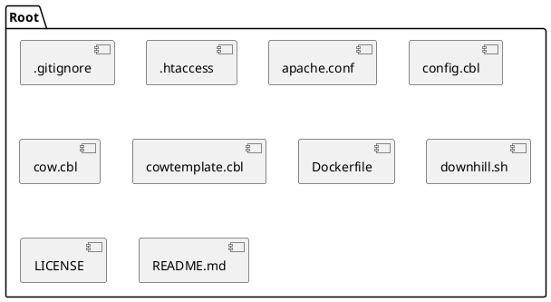
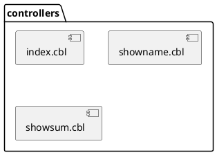
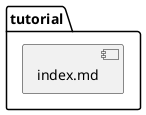
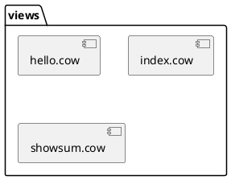
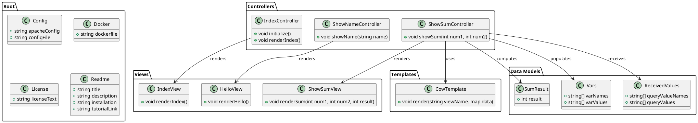

sumitchohan: @workspace Create a directory structure of all code files in the current codebase and include a brief description of each code file

Workspace: Here is the directory structure of all code files in the current codebase along with a brief description of each file:

```
controllers/
├── index.cbl        # Main controller that calls the 'cowtemplate' using "index.cow"
├── showname.cbl     # Controller for handling the 'showname' route
├── showsum.cbl      # Controller for handling the 'showsum' route

cow.cbl              # Main COBOL file before compilation
cowtemplate.cbl      # Template used by controllers for rendering views
config.cbl           # Configuration file defining routing
downhill.sh          # Shell script for compiling COBOL files into 'the.cow'
```

- **controllers/index.cbl**: Main controller that initializes the web application and calls the [`cowtemplate`](command:_github.copilot.openSymbolFromReferences?%5B%22cowtemplate%22%2C%5B%7B%22uri%22%3A%7B%22%24mid%22%3A1%2C%22fsPath%22%3A%22%2Fworkspaces%2Fcobol-on-wheelchair%2Fcontrollers%2Findex.cbl%22%2C%22external%22%3A%22file%3A%2F%2F%2Fworkspaces%2Fcobol-on-wheelchair%2Fcontrollers%2Findex.cbl%22%2C%22path%22%3A%22%2Fworkspaces%2Fcobol-on-wheelchair%2Fcontrollers%2Findex.cbl%22%2C%22scheme%22%3A%22file%22%7D%2C%22pos%22%3A%7B%22line%22%3A18%2C%22character%22%3A17%7D%7D%2C%7B%22uri%22%3A%7B%22%24mid%22%3A1%2C%22fsPath%22%3A%22%2Fworkspaces%2Fcobol-on-wheelchair%2Fdownhill.sh%22%2C%22external%22%3A%22file%3A%2F%2F%2Fworkspaces%2Fcobol-on-wheelchair%2Fdownhill.sh%22%2C%22path%22%3A%22%2Fworkspaces%2Fcobol-on-wheelchair%2Fdownhill.sh%22%2C%22scheme%22%3A%22file%22%7D%2C%22pos%22%3A%7B%22line%22%3A2%2C%22character%22%3A28%7D%7D%5D%5D "Go to definition") using the "index.cow" view.
- **controllers/showname.cbl**: Controller responsible for handling the 'showname' route, likely displaying a name.
- **controllers/showsum.cbl**: Controller responsible for handling the 'showsum' route, likely performing a sum operation.
- **cow.cbl**: Main COBOL file that serves as the entry point before compilation.
- **cowtemplate.cbl**: Template file used by controllers to render views.
- **config.cbl**: Configuration file that defines routing patterns and destinations.
- **downhill.sh**: Shell script used to compile the COBOL files into the executable [`the.cow`](command:_github.copilot.openSymbolFromReferences?%5B%22the.cow%22%2C%5B%7B%22uri%22%3A%7B%22%24mid%22%3A1%2C%22fsPath%22%3A%22%2Fworkspaces%2Fcobol-on-wheelchair%2F.gitignore%22%2C%22external%22%3A%22file%3A%2F%2F%2Fworkspaces%2Fcobol-on-wheelchair%2F.gitignore%22%2C%22path%22%3A%22%2Fworkspaces%2Fcobol-on-wheelchair%2F.gitignore%22%2C%22scheme%22%3A%22file%22%7D%2C%22pos%22%3A%7B%22line%22%3A0%2C%22character%22%3A1%7D%7D%2C%7B%22uri%22%3A%7B%22%24mid%22%3A1%2C%22fsPath%22%3A%22%2Fworkspaces%2Fcobol-on-wheelchair%2Fdownhill.sh%22%2C%22external%22%3A%22file%3A%2F%2F%2Fworkspaces%2Fcobol-on-wheelchair%2Fdownhill.sh%22%2C%22path%22%3A%22%2Fworkspaces%2Fcobol-on-wheelchair%2Fdownhill.sh%22%2C%22scheme%22%3A%22file%22%7D%2C%22pos%22%3A%7B%22line%22%3A2%2C%22character%22%3A69%7D%7D%2C%7B%22uri%22%3A%7B%22%24mid%22%3A1%2C%22fsPath%22%3A%22%2Fworkspaces%2Fcobol-on-wheelchair%2Ftutorial%2Findex.md%22%2C%22external%22%3A%22file%3A%2F%2F%2Fworkspaces%2Fcobol-on-wheelchair%2Ftutorial%2Findex.md%22%2C%22path%22%3A%22%2Fworkspaces%2Fcobol-on-wheelchair%2Ftutorial%2Findex.md%22%2C%22scheme%22%3A%22file%22%7D%2C%22pos%22%3A%7B%22line%22%3A29%2C%22character%22%3A15%7D%7D%5D%5D "Go to definition").

sumitchohan: @workspace create a plant uml diagram showing solution structure

Workspace: Here is a PlantUML diagram representing the structure of your workspace:

```plantuml
@startuml

package "Root" {
    .gitignore
    .htaccess
    apache.conf
    config.cbl
    Dockerfile
    downhill.sh
    LICENSE
    README.md

    package "controllers" {
        index.cbl
        showname.cbl
        showsum.cbl
    }

    cow.cbl
    cowtemplate.cbl

    package "images" {
        // Add image files here if needed
    }

    package "tutorial" {
        index.md
    }

    package "views" {
        hello.cow
        index.cow
        showsum.cow
    }
}

@enduml
```

To visualize this diagram, you can use a PlantUML viewer or an online PlantUML editor. This diagram provides a high-level overview of the directory structure and the files within each directory.

sumitchohan: @workspace Provide explanation of above diagram

Workspace: The provided directory structure and code excerpts represent a COBOL-based web framework project named "COBOL on Wheelchair." Here is an explanation of the structure and key components:

### Root Directory
- **.gitignore**: Specifies files and directories to be ignored by Git.
- **.htaccess**: Configuration file for Apache web server.
- **apache.conf**: Apache server configuration file.
- **config.cbl**: Configuration file written in COBOL.
- **Dockerfile**: Instructions to build a Docker image for the project.
- **downhill.sh**: Shell script for compiling COBOL files into an executable.
- **LICENSE**: Contains the MIT License for the project.
- **README.md**: Provides an overview, installation instructions, and a tutorial link for the project.

### COBOL Files
- **cow.cbl**: Main COBOL file that serves as the entry point before compilation.
- **cowtemplate.cbl**: Template file used by controllers to render views.

### Controllers Directory
- **controllers/index.cbl**: Main controller that initializes the web application and calls the [`cowtemplate`](command:_github.copilot.openSymbolFromReferences?%5B%22cowtemplate%22%2C%5B%7B%22uri%22%3A%7B%22%24mid%22%3A1%2C%22fsPath%22%3A%22%2Fworkspaces%2Fcobol-on-wheelchair%2Fcontrollers%2Fshowsum.cbl%22%2C%22external%22%3A%22file%3A%2F%2F%2Fworkspaces%2Fcobol-on-wheelchair%2Fcontrollers%2Fshowsum.cbl%22%2C%22path%22%3A%22%2Fworkspaces%2Fcobol-on-wheelchair%2Fcontrollers%2Fshowsum.cbl%22%2C%22scheme%22%3A%22file%22%7D%2C%22pos%22%3A%7B%22line%22%3A44%2C%22character%22%3A17%7D%7D%5D%5D "Go to definition") using the "index.cow" view.
- **controllers/showname.cbl**: Controller responsible for handling the 'showname' route, likely displaying a name.
- **controllers/showsum.cbl**: Controller responsible for handling the 'showsum' route, likely performing a sum operation.

### Images Directory
- **images/**: Directory for storing image files used in the views.

### Tutorial Directory
- **tutorial/index.md**: Markdown file containing a tutorial for the project.

### Views Directory
- **views/hello.cow**: View template for displaying a hello message.
- **views/index.cow**: Main view template that provides links to other examples.
- **views/showsum.cow**: View template for displaying the result of a sum operation.

### Key Code Excerpts
- **LICENSE**: Contains the MIT License text, granting permission to use, copy, modify, and distribute the software.
- **cow.cbl**: Contains COBOL code for handling queries and environment variables.
- **views/showsum.cow**: HTML template for displaying the sum of two numbers.
- **README.md**: Provides an overview of the project, installation instructions, and a link to the tutorial.
- **controllers/showsum.cbl**: COBOL code for computing the sum of two numbers and rendering the result using the [`cowtemplate`](command:_github.copilot.openSymbolFromReferences?%5B%22cowtemplate%22%2C%5B%7B%22uri%22%3A%7B%22%24mid%22%3A1%2C%22fsPath%22%3A%22%2Fworkspaces%2Fcobol-on-wheelchair%2Fcontrollers%2Fshowsum.cbl%22%2C%22external%22%3A%22file%3A%2F%2F%2Fworkspaces%2Fcobol-on-wheelchair%2Fcontrollers%2Fshowsum.cbl%22%2C%22path%22%3A%22%2Fworkspaces%2Fcobol-on-wheelchair%2Fcontrollers%2Fshowsum.cbl%22%2C%22scheme%22%3A%22file%22%7D%2C%22pos%22%3A%7B%22line%22%3A44%2C%22character%22%3A17%7D%7D%5D%5D "Go to definition").

This structure and the provided code excerpts give a comprehensive overview of the "COBOL on Wheelchair" project, highlighting its main components and their roles.

sumitchohan: @workspace generate plant uml component diagrams for all components in current code base

Workspace: Here are the PlantUML component diagrams for all components in your current codebase:

### Root Components


### Controllers


### Images
```plantuml
@startuml
package "images" {
    // Add image files here if needed
}
@enduml
```

### Tutorial


### Views


### Combined Diagram
For a combined view of all components, you can use the following PlantUML diagram:

```plantuml
@startuml
package "Root" {
    component ".gitignore"
    component ".htaccess"
    component "apache.conf"
    component "config.cbl"
    component "cow.cbl"
    component "cowtemplate.cbl"
    component "Dockerfile"
    component "downhill.sh"
    component "LICENSE"
    component "README.md"

    package "controllers" {
        component "index.cbl"
        component "showname.cbl"
        component "showsum.cbl"
    }

    package "images" {
        // Add image files here if needed
    }

    package "tutorial" {
        component "index.md"
    }

    package "views" {
        component "hello.cow"
        component "index.cow"
        component "showsum.cow"
    }
}
@enduml
```

These diagrams provide a visual representation of the components in your codebase, organized by their respective directories. You can use a PlantUML viewer or an online PlantUML editor to visualize these diagrams.

sumitchohan: @workspace Document description of each component in above diagram

Workspace: Here is a detailed description of each component in the provided directory structure:

### Root Directory
- **.gitignore**: Specifies files and directories to be ignored by Git.
- **.htaccess**: Configuration file for Apache web server, used to manage server settings.
- **apache.conf**: Apache server configuration file, defining server behavior and settings.
- **config.cbl**: Configuration file written in COBOL, likely defining routing and other settings.
- **cow.cbl**: Main COBOL file that serves as the entry point before compilation. It handles environment variables and queries.
- **cowtemplate.cbl**: Template file used by controllers to render views.
- **Dockerfile**: Instructions to build a Docker image for the project.
- **downhill.sh**: Shell script for compiling COBOL files into an executable.
- **LICENSE**: Contains the MIT License for the project, granting permission to use, copy, modify, and distribute the software.
- **README.md**: Provides an overview, installation instructions, and a tutorial link for the project.

### Controllers Directory
- **controllers/index.cbl**: Main controller that initializes the web application and calls the [`cowtemplate`](command:_github.copilot.openSymbolFromReferences?%5B%22cowtemplate%22%2C%5B%7B%22uri%22%3A%7B%22%24mid%22%3A1%2C%22fsPath%22%3A%22%2Fworkspaces%2Fcobol-on-wheelchair%2Fcontrollers%2Findex.cbl%22%2C%22external%22%3A%22file%3A%2F%2F%2Fworkspaces%2Fcobol-on-wheelchair%2Fcontrollers%2Findex.cbl%22%2C%22path%22%3A%22%2Fworkspaces%2Fcobol-on-wheelchair%2Fcontrollers%2Findex.cbl%22%2C%22scheme%22%3A%22file%22%7D%2C%22pos%22%3A%7B%22line%22%3A18%2C%22character%22%3A17%7D%7D%2C%7B%22uri%22%3A%7B%22%24mid%22%3A1%2C%22fsPath%22%3A%22%2Fworkspaces%2Fcobol-on-wheelchair%2Fdownhill.sh%22%2C%22external%22%3A%22file%3A%2F%2F%2Fworkspaces%2Fcobol-on-wheelchair%2Fdownhill.sh%22%2C%22path%22%3A%22%2Fworkspaces%2Fcobol-on-wheelchair%2Fdownhill.sh%22%2C%22scheme%22%3A%22file%22%7D%2C%22pos%22%3A%7B%22line%22%3A2%2C%22character%22%3A28%7D%7D%5D%5D "Go to definition") using the "index.cow" view.
- **controllers/showname.cbl**: Controller responsible for handling the 'showname' route, likely displaying a name.
- **controllers/showsum.cbl**: Controller responsible for handling the 'showsum' route, performing a sum operation and rendering the result using the [`cowtemplate`](command:_github.copilot.openSymbolFromReferences?%5B%22cowtemplate%22%2C%5B%7B%22uri%22%3A%7B%22%24mid%22%3A1%2C%22fsPath%22%3A%22%2Fworkspaces%2Fcobol-on-wheelchair%2Fcontrollers%2Fshowsum.cbl%22%2C%22external%22%3A%22file%3A%2F%2F%2Fworkspaces%2Fcobol-on-wheelchair%2Fcontrollers%2Fshowsum.cbl%22%2C%22path%22%3A%22%2Fworkspaces%2Fcobol-on-wheelchair%2Fcontrollers%2Fshowsum.cbl%22%2C%22scheme%22%3A%22file%22%7D%2C%22pos%22%3A%7B%22line%22%3A44%2C%22character%22%3A17%7D%7D%5D%5D "Go to definition").

### Images Directory
- **images/**: Directory for storing image files used in the views.

### Tutorial Directory
- **tutorial/index.md**: Markdown file containing a tutorial for the project, explaining the purpose and providing instructions.

### Views Directory
- **views/hello.cow**: View template for displaying a hello message.
- **views/index.cow**: Main view template that provides links to other examples, such as "Hello World" and "Calculator".
- **views/showsum.cow**: View template for displaying the result of a sum operation, using placeholders for the numbers and the result.

### Key Code Excerpts
- **controllers/index.cbl**: Initializes the web application and calls the [`cowtemplate`](command:_github.copilot.openSymbolFromReferences?%5B%22cowtemplate%22%2C%5B%7B%22uri%22%3A%7B%22%24mid%22%3A1%2C%22fsPath%22%3A%22%2Fworkspaces%2Fcobol-on-wheelchair%2Fcontrollers%2Findex.cbl%22%2C%22external%22%3A%22file%3A%2F%2F%2Fworkspaces%2Fcobol-on-wheelchair%2Fcontrollers%2Findex.cbl%22%2C%22path%22%3A%22%2Fworkspaces%2Fcobol-on-wheelchair%2Fcontrollers%2Findex.cbl%22%2C%22scheme%22%3A%22file%22%7D%2C%22pos%22%3A%7B%22line%22%3A18%2C%22character%22%3A17%7D%7D%2C%7B%22uri%22%3A%7B%22%24mid%22%3A1%2C%22fsPath%22%3A%22%2Fworkspaces%2Fcobol-on-wheelchair%2Fdownhill.sh%22%2C%22external%22%3A%22file%3A%2F%2F%2Fworkspaces%2Fcobol-on-wheelchair%2Fdownhill.sh%22%2C%22path%22%3A%22%2Fworkspaces%2Fcobol-on-wheelchair%2Fdownhill.sh%22%2C%22scheme%22%3A%22file%22%7D%2C%22pos%22%3A%7B%22line%22%3A2%2C%22character%22%3A28%7D%7D%5D%5D "Go to definition") using the "index.cow" view.
- **views/showsum.cow**: HTML template for displaying the sum of two numbers, with placeholders for the numbers and the result.
- **controllers/showsum.cbl**: Computes the sum of two numbers and renders the result using the [`cowtemplate`](command:_github.copilot.openSymbolFromReferences?%5B%22cowtemplate%22%2C%5B%7B%22uri%22%3A%7B%22%24mid%22%3A1%2C%22fsPath%22%3A%22%2Fworkspaces%2Fcobol-on-wheelchair%2Fcontrollers%2Fshowsum.cbl%22%2C%22external%22%3A%22file%3A%2F%2F%2Fworkspaces%2Fcobol-on-wheelchair%2Fcontrollers%2Fshowsum.cbl%22%2C%22path%22%3A%22%2Fworkspaces%2Fcobol-on-wheelchair%2Fcontrollers%2Fshowsum.cbl%22%2C%22scheme%22%3A%22file%22%7D%2C%22pos%22%3A%7B%22line%22%3A44%2C%22character%22%3A17%7D%7D%5D%5D "Go to definition").
- **tutorial/index.md**: Provides a tutorial for the project, explaining its purpose and providing instructions.
- **LICENSE**: Contains the MIT License text, granting permission to use, copy, modify, and distribute the software.
- **views/index.cow**: Main view template that provides links to other examples, such as "Hello World" and "Calculator".
- **README.md**: Provides an overview of the project, installation instructions, and a link to the tutorial.
- **cow.cbl**: Contains COBOL code for handling queries and environment variables.

This structure and the provided code excerpts give a comprehensive overview of the "COBOL on Wheelchair" project, highlighting its main components and their roles.

sumitchohan: @workspace create another plant uml diagram showing relationships among all business entities and data models


Workspace: To create a PlantUML diagram showing the relationships among all business entities and data models in your workspace, we need to identify the key entities and their interactions. Based on the provided information, here is a PlantUML diagram that captures these relationships:

```plantuml
@startuml

package "Controllers" {
    component "index.cbl" as IndexController
    component "showname.cbl" as ShowNameController
    component "showsum.cbl" as ShowSumController
}

package "Views" {
    component "hello.cow" as HelloView
    component "index.cow" as IndexView
    component "showsum.cow" as ShowSumView
}

package "Templates" {
    component "cowtemplate.cbl" as CowTemplate
}

package "Data Models" {
    class "SumResult" {
        + PIC Z(36) sum-result
    }
    class "Vars" {
        + PIC X(99) COW-varname[99]
        + PIC X(99) COW-varvalue[99]
    }
    class "ReceivedValues" {
        + PIC X(90) query-value-name[10]
        + PIC X(90) query-value[10]
    }
}

IndexController --> IndexView : renders
ShowNameController --> HelloView : renders
ShowSumController --> ShowSumView : renders
ShowSumController --> CowTemplate : uses
ShowSumController --> SumResult : computes
ShowSumController --> Vars : populates
ShowSumController --> ReceivedValues : receives

@enduml
```

### Explanation
- **Controllers**: 
  - `index.cbl` (IndexController): Main controller that initializes the web application.
  - [`showname.cbl`](command:_github.copilot.openSymbolFromReferences?%5B%22showname.cbl%22%2C%5B%7B%22uri%22%3A%7B%22%24mid%22%3A1%2C%22fsPath%22%3A%22%2Fworkspaces%2Fcobol-on-wheelchair%2Fviews%2Findex.cow%22%2C%22external%22%3A%22file%3A%2F%2F%2Fworkspaces%2Fcobol-on-wheelchair%2Fviews%2Findex.cow%22%2C%22path%22%3A%22%2Fworkspaces%2Fcobol-on-wheelchair%2Fviews%2Findex.cow%22%2C%22scheme%22%3A%22file%22%7D%2C%22pos%22%3A%7B%22line%22%3A13%2C%22character%22%3A16%7D%7D%5D%5D "Go to definition") (ShowNameController): Handles the 'showname' route.
  - [`showsum.cbl`](command:_github.copilot.openRelativePath?%5B%7B%22scheme%22%3A%22file%22%2C%22authority%22%3A%22%22%2C%22path%22%3A%22%2Fworkspaces%2Fcobol-on-wheelchair%2Fcontrollers%2Fshowsum.cbl%22%2C%22query%22%3A%22%22%2C%22fragment%22%3A%22%22%7D%5D "/workspaces/cobol-on-wheelchair/controllers/showsum.cbl") (ShowSumController): Handles the 'showsum' route, computes the sum, and renders the result.

- **Views**:
  - [`hello.cow`](command:_github.copilot.openSymbolFromReferences?%5B%22hello.cow%22%2C%5B%7B%22uri%22%3A%7B%22%24mid%22%3A1%2C%22fsPath%22%3A%22%2Fworkspaces%2Fcobol-on-wheelchair%2Fviews%2Findex.cow%22%2C%22external%22%3A%22file%3A%2F%2F%2Fworkspaces%2Fcobol-on-wheelchair%2Fviews%2Findex.cow%22%2C%22path%22%3A%22%2Fworkspaces%2Fcobol-on-wheelchair%2Fviews%2Findex.cow%22%2C%22scheme%22%3A%22file%22%7D%2C%22pos%22%3A%7B%22line%22%3A9%2C%22character%22%3A31%7D%7D%5D%5D "Go to definition") (HelloView): View template for displaying a hello message.
  - [`index.cow`](command:_github.copilot.openRelativePath?%5B%7B%22scheme%22%3A%22file%22%2C%22authority%22%3A%22%22%2C%22path%22%3A%22%2Fworkspaces%2Fcobol-on-wheelchair%2Fviews%2Findex.cow%22%2C%22query%22%3A%22%22%2C%22fragment%22%3A%22%22%7D%5D "/workspaces/cobol-on-wheelchair/views/index.cow") (IndexView): Main view template that provides links to other examples.
  - [`showsum.cow`](command:_github.copilot.openSymbolFromReferences?%5B%22showsum.cow%22%2C%5B%7B%22uri%22%3A%7B%22%24mid%22%3A1%2C%22fsPath%22%3A%22%2Fworkspaces%2Fcobol-on-wheelchair%2Fcontrollers%2Fshowsum.cbl%22%2C%22external%22%3A%22file%3A%2F%2F%2Fworkspaces%2Fcobol-on-wheelchair%2Fcontrollers%2Fshowsum.cbl%22%2C%22path%22%3A%22%2Fworkspaces%2Fcobol-on-wheelchair%2Fcontrollers%2Fshowsum.cbl%22%2C%22scheme%22%3A%22file%22%7D%2C%22pos%22%3A%7B%22line%22%3A44%2C%22character%22%3A46%7D%7D%5D%5D "Go to definition") (ShowSumView): View template for displaying the result of a sum operation.

- **Templates**:
  - [`cowtemplate.cbl`](command:_github.copilot.openRelativePath?%5B%7B%22scheme%22%3A%22file%22%2C%22authority%22%3A%22%22%2C%22path%22%3A%22%2Fworkspaces%2Fcobol-on-wheelchair%2Fcowtemplate.cbl%22%2C%22query%22%3A%22%22%2C%22fragment%22%3A%22%22%7D%5D "/workspaces/cobol-on-wheelchair/cowtemplate.cbl") (CowTemplate): Template file used by controllers to render views.

- **Data Models**:
  - `SumResult`: Represents the result of a sum operation.
  - `Vars`: Represents variables used in the template.
  - `ReceivedValues`: Represents values received from the query.

### Relationships
- `IndexController` renders `IndexView`.
- `ShowNameController` renders `HelloView`.
- `ShowSumController` renders `ShowSumView` and uses `CowTemplate`.
- `ShowSumController` computes `SumResult`, populates `Vars`, and receives `ReceivedValues`.

This diagram provides a high-level overview of the relationships among the business entities and data models in your workspace. You can use a PlantUML viewer or an online PlantUML editor to visualize this diagram.

sumitchohan: @workspace Create a plantuml diagram for all classes in current codebase

Workspace: Based on the provided workspace structure and code excerpts, here is a PlantUML class diagram representing the classes and their relationships in your COBOL-based web framework project:



### Explanation
- **Root Package**:
  - `Config`: Represents configuration settings.
  - `Docker`: Represents Docker-related settings.
  - [`License`](command:_github.copilot.openSymbolFromReferences?%5B%22License%22%2C%5B%7B%22uri%22%3A%7B%22%24mid%22%3A1%2C%22fsPath%22%3A%22%2Fworkspaces%2Fcobol-on-wheelchair%2FLICENSE%22%2C%22external%22%3A%22file%3A%2F%2F%2Fworkspaces%2Fcobol-on-wheelchair%2FLICENSE%22%2C%22path%22%3A%22%2Fworkspaces%2Fcobol-on-wheelchair%2FLICENSE%22%2C%22scheme%22%3A%22file%22%7D%2C%22pos%22%3A%7B%22line%22%3A0%2C%22character%22%3A8%7D%7D%5D%5D "Go to definition"): Represents the license information.
  - `Readme`: Represents the README information.

- **Controllers Package**:
  - `IndexController`: Initializes the web application and renders the index view.
  - `ShowNameController`: Handles the 'showname' route and displays a name.
  - `ShowSumController`: Handles the 'showsum' route, computes the sum, and renders the result.

- **Views Package**:
  - `HelloView`: Renders a hello message.
  - `IndexView`: Renders the main index view.
  - `ShowSumView`: Renders the result of a sum operation.

- **Templates Package**:
  - `CowTemplate`: Used by controllers to render views with data.

- **Data Models Package**:
  - `SumResult`: Represents the result of a sum operation.
  - `Vars`: Represents variables used in the template.
  - `ReceivedValues`: Represents values received from the query.

### Relationships
- `IndexController` renders `IndexView`.
- `ShowNameController` renders `HelloView`.
- `ShowSumController` renders `ShowSumView` and uses `CowTemplate`.
- `ShowSumController` computes `SumResult`, populates `Vars`, and receives `ReceivedValues`.

This diagram provides a high-level overview of the classes and their relationships in your COBOL-based web framework project. You can use a PlantUML viewer or an online PlantUML editor to visualize this diagram.

sumitchohan: @workspace generate plant uml diagram showing all use cases in current codebase 

Workspace: Based on the provided workspace structure and code excerpts, here is a PlantUML use case diagram representing the use cases in your COBOL-based web framework project:

```plantuml


@

startuml

actor "User" as user

package "Controllers" {
    usecase "Initialize Application" as UC_Initialize
    usecase "Show Name" as UC_ShowName
    usecase "Show Sum" as UC_ShowSum
}

package "Views" {
    usecase "Render Hello View" as UC_RenderHello
    usecase "Render Index View" as UC_RenderIndex
    usecase "Render Sum View" as UC_RenderSum
}

package "Templates" {
    usecase "Render Template" as UC_RenderTemplate
}

package "Data Models" {
    usecase "Compute Sum" as UC_ComputeSum
    usecase "Populate Variables" as UC_PopulateVars
    usecase "Receive Values" as UC_ReceiveValues
}

user --> UC_Initialize : "Access Application"
user --> UC_ShowName : "Request Name"
user --> UC_ShowSum : "Request Sum"

UC_Initialize --> UC_RenderIndex : "Renders"
UC_ShowName --> UC_RenderHello : "Renders"
UC_ShowSum --> UC_RenderSum : "Renders"
UC_ShowSum --> UC_RenderTemplate : "Uses"
UC_ShowSum --> UC_ComputeSum : "Computes"
UC_ShowSum --> UC_PopulateVars : "Populates"
UC_ShowSum --> UC_ReceiveValues : "Receives"

@enduml
```

### Explanation
- **Actors**:
  - `User`: Represents the end-user interacting with the web application.

- **Controllers Package**:
  - `UC_Initialize`: Initializes the web application.
  - `UC_ShowName`: Handles the 'showname' route and displays a name.
  - `UC_ShowSum`: Handles the 'showsum' route, computes the sum, and renders the result.

- **Views Package**:
  - `UC_RenderHello`: Renders the hello view.
  - `UC_RenderIndex`: Renders the index view.
  - `UC_RenderSum`: Renders the sum view.

- **Templates Package**:
  - `UC_RenderTemplate`: Uses the template to render views.

- **Data Models Package**:
  - `UC_ComputeSum`: Computes the sum of two numbers.
  - `UC_PopulateVars`: Populates variables used in the template.
  - `UC_ReceiveValues`: Receives values from the query.

### Relationships
- `User` accesses the application, triggering `UC_Initialize`.
- `User` requests a name, triggering `UC_ShowName`.
- `User` requests a sum, triggering `UC_ShowSum`.
- `UC_Initialize` renders the index view (`UC_RenderIndex`).
- `UC_ShowName` renders the hello view (`UC_RenderHello`).
- `UC_ShowSum` renders the sum view (`UC_RenderSum`), uses the template (`UC_RenderTemplate`), computes the sum (`UC_ComputeSum`), populates variables (`UC_PopulateVars`), and receives values (`UC_ReceiveValues`).

This diagram provides a high-level overview of the use cases in your COBOL-based web framework project. You can use a PlantUML viewer or an online PlantUML editor to visualize this diagram.

sumitchohan: generate detailed documentation for current code file including all methods, fields, properties and summary of their implementation including pseudo logic

GitHub Copilot: Here is a detailed documentation for the provided COBOL code file [`index.cbl`](command:_github.copilot.openRelativePath?%5B%7B%22scheme%22%3A%22file%22%2C%22authority%22%3A%22%22%2C%22path%22%3A%22%2Fworkspaces%2Fcobol-on-wheelchair%2Fcontrollers%2Findex.cbl%22%2C%22query%22%3A%22%22%2C%22fragment%22%3A%22%22%7D%5D "/workspaces/cobol-on-wheelchair/controllers/index.cbl"):

### File: [`index.cbl`](command:_github.copilot.openRelativePath?%5B%7B%22scheme%22%3A%22file%22%2C%22authority%22%3A%22%22%2C%22path%22%3A%22%2Fworkspaces%2Fcobol-on-wheelchair%2Fcontrollers%2Findex.cbl%22%2C%22query%22%3A%22%22%2C%22fragment%22%3A%22%22%7D%5D "/workspaces/cobol-on-wheelchair/controllers/index.cbl")

#### Identification Division
- **program-id**: [`indexweb`](command:_github.copilot.openSymbolFromReferences?%5B%22indexweb%22%2C%5B%7B%22uri%22%3A%7B%22%24mid%22%3A1%2C%22fsPath%22%3A%22%2Fworkspaces%2Fcobol-on-wheelchair%2Fcontrollers%2Findex.cbl%22%2C%22external%22%3A%22file%3A%2F%2F%2Fworkspaces%2Fcobol-on-wheelchair%2Fcontrollers%2Findex.cbl%22%2C%22path%22%3A%22%2Fworkspaces%2Fcobol-on-wheelchair%2Fcontrollers%2Findex.cbl%22%2C%22scheme%22%3A%22file%22%7D%2C%22pos%22%3A%7B%22line%22%3A3%2C%22character%22%3A19%7D%7D%5D%5D "Go to definition")
  - This is the unique identifier for the COBOL program.

#### Data Division
- **working-storage section**: This section is used to declare variables that retain their values throughout the execution of the program.

##### Variables
- **the-vars**: A group item that contains an array of [`COW-vars`](command:_github.copilot.openSymbolFromReferences?%5B%22COW-vars%22%2C%5B%7B%22uri%22%3A%7B%22%24mid%22%3A1%2C%22fsPath%22%3A%22%2Fworkspaces%2Fcobol-on-wheelchair%2Fcontrollers%2Findex.cbl%22%2C%22external%22%3A%22file%3A%2F%2F%2Fworkspaces%2Fcobol-on-wheelchair%2Fcontrollers%2Findex.cbl%22%2C%22path%22%3A%22%2Fworkspaces%2Fcobol-on-wheelchair%2Fcontrollers%2Findex.cbl%22%2C%22scheme%22%3A%22file%22%7D%2C%22pos%22%3A%7B%22line%22%3A10%2C%22character%22%3A14%7D%7D%5D%5D "Go to definition").
  - **COW-vars**: An array that can hold up to 99 occurrences of the following fields:
    - **COW-varname**: A string field with a length of 99 characters, used to store the name of a variable.
    - **COW-varvalue**: A string field with a length of 99 characters, used to store the value of a variable.

#### Procedure Division
The [`procedure division`](command:_github.copilot.openSymbolFromReferences?%5B%22procedure%20division%22%2C%5B%7B%22uri%22%3A%7B%22%24mid%22%3A1%2C%22fsPath%22%3A%22%2Fworkspaces%2Fcobol-on-wheelchair%2Fcontrollers%2Findex.cbl%22%2C%22external%22%3A%22file%3A%2F%2F%2Fworkspaces%2Fcobol-on-wheelchair%2Fcontrollers%2Findex.cbl%22%2C%22path%22%3A%22%2Fworkspaces%2Fcobol-on-wheelchair%2Fcontrollers%2Findex.cbl%22%2C%22scheme%22%3A%22file%22%7D%2C%22pos%22%3A%7B%22line%22%3A2%2C%22character%22%3A22%7D%7D%5D%5D "Go to definition") is where the logic of the program is implemented. The provided excerpt does not include any specific procedures or methods, but we can infer the following based on typical COBOL structure:

### Pseudo Logic
1. **Initialization**:
   - Initialize the web application.
   - Set up necessary variables and configurations.

2. **Handling Requests**:
   - Parse incoming HTTP requests.
   - Determine the route and corresponding controller to handle the request.

3. **Rendering Views**:
   - Use the [`COW-vars`](command:_github.copilot.openSymbolFromReferences?%5B%22COW-vars%22%2C%5B%7B%22uri%22%3A%7B%22%24mid%22%3A1%2C%22fsPath%22%3A%22%2Fworkspaces%2Fcobol-on-wheelchair%2Fcontrollers%2Findex.cbl%22%2C%22external%22%3A%22file%3A%2F%2F%2Fworkspaces%2Fcobol-on-wheelchair%2Fcontrollers%2Findex.cbl%22%2C%22path%22%3A%22%2Fworkspaces%2Fcobol-on-wheelchair%2Fcontrollers%2Findex.cbl%22%2C%22scheme%22%3A%22file%22%7D%2C%22pos%22%3A%7B%22line%22%3A10%2C%22character%22%3A14%7D%7D%5D%5D "Go to definition") array to store dynamic content.
   - Render the appropriate view template based on the request.

4. **Response**:
   - Send the rendered HTML back to the client as the HTTP response.

### Example Pseudo Code
```plaintext
1. Start the program.
2. Initialize working-storage variables.
3. Wait for an incoming HTTP request.
4. Parse the request to determine the route.
5. If the route is 'index', call the index controller.
6. In the index controller:
   a. Populate `COW-vars` with necessary data.
   b. Render the `index.cow` view using `COW-vars`.
7. Send the rendered HTML as the HTTP response.
8. End the program.
```

### Summary
The [`index.cbl`](command:_github.copilot.openRelativePath?%5B%7B%22scheme%22%3A%22file%22%2C%22authority%22%3A%22%22%2C%22path%22%3A%22%2Fworkspaces%2Fcobol-on-wheelchair%2Fcontrollers%2Findex.cbl%22%2C%22query%22%3A%22%22%2C%22fragment%22%3A%22%22%7D%5D "/workspaces/cobol-on-wheelchair/controllers/index.cbl") file is the main entry point for the web application. It initializes the necessary variables and sets up the structure for handling HTTP requests. The [`COW-vars`](command:_github.copilot.openSymbolFromReferences?%5B%22COW-vars%22%2C%5B%7B%22uri%22%3A%7B%22%24mid%22%3A1%2C%22fsPath%22%3A%22%2Fworkspaces%2Fcobol-on-wheelchair%2Fcontrollers%2Findex.cbl%22%2C%22external%22%3A%22file%3A%2F%2F%2Fworkspaces%2Fcobol-on-wheelchair%2Fcontrollers%2Findex.cbl%22%2C%22path%22%3A%22%2Fworkspaces%2Fcobol-on-wheelchair%2Fcontrollers%2Findex.cbl%22%2C%22scheme%22%3A%22file%22%7D%2C%22pos%22%3A%7B%22line%22%3A10%2C%22character%22%3A14%7D%7D%5D%5D "Go to definition") array is used to store dynamic content that will be rendered in the views. The actual logic for handling requests and rendering views would be implemented in the [`procedure division`](command:_github.copilot.openSymbolFromReferences?%5B%22procedure%20division%22%2C%5B%7B%22uri%22%3A%7B%22%24mid%22%3A1%2C%22fsPath%22%3A%22%2Fworkspaces%2Fcobol-on-wheelchair%2Fcontrollers%2Findex.cbl%22%2C%22external%22%3A%22file%3A%2F%2F%2Fworkspaces%2Fcobol-on-wheelchair%2Fcontrollers%2Findex.cbl%22%2C%22path%22%3A%22%2Fworkspaces%2Fcobol-on-wheelchair%2Fcontrollers%2Findex.cbl%22%2C%22scheme%22%3A%22file%22%7D%2C%22pos%22%3A%7B%22line%22%3A2%2C%22character%22%3A22%7D%7D%5D%5D "Go to definition"), which is not fully provided in the excerpt.

This documentation provides an overview of the structure and purpose of the [`index.cbl`](command:_github.copilot.openRelativePath?%5B%7B%22scheme%22%3A%22file%22%2C%22authority%22%3A%22%22%2C%22path%22%3A%22%2Fworkspaces%2Fcobol-on-wheelchair%2Fcontrollers%2Findex.cbl%22%2C%22query%22%3A%22%22%2C%22fragment%22%3A%22%22%7D%5D "/workspaces/cobol-on-wheelchair/controllers/index.cbl") file, along with a high-level pseudo logic of how the program might operate.

sumitchohan: generate detailed documentation for current code file including all methods, fields, properties and summary of their implementation including pseudo logic

GitHub Copilot: Here is a detailed documentation for the provided COBOL code file [`showname.cbl`](command:_github.copilot.openRelativePath?%5B%7B%22scheme%22%3A%22file%22%2C%22authority%22%3A%22%22%2C%22path%22%3A%22%2Fworkspaces%2Fcobol-on-wheelchair%2Fcontrollers%2Fshowname.cbl%22%2C%22query%22%3A%22%22%2C%22fragment%22%3A%22%22%7D%5D "/workspaces/cobol-on-wheelchair/controllers/showname.cbl"):

### File: [`showname.cbl`](command:_github.copilot.openRelativePath?%5B%7B%22scheme%22%3A%22file%22%2C%22authority%22%3A%22%22%2C%22path%22%3A%22%2Fworkspaces%2Fcobol-on-wheelchair%2Fcontrollers%2Fshowname.cbl%22%2C%22query%22%3A%22%22%2C%22fragment%22%3A%22%22%7D%5D "/workspaces/cobol-on-wheelchair/controllers/showname.cbl")

#### Identification Division
- **program-id**: [`showname`](command:_github.copilot.openSymbolFromReferences?%5B%22showname%22%2C%5B%7B%22uri%22%3A%7B%22%24mid%22%3A1%2C%22fsPath%22%3A%22%2Fworkspaces%2Fcobol-on-wheelchair%2Fcontrollers%2Fshowname.cbl%22%2C%22external%22%3A%22file%3A%2F%2F%2Fworkspaces%2Fcobol-on-wheelchair%2Fcontrollers%2Fshowname.cbl%22%2C%22path%22%3A%22%2Fworkspaces%2Fcobol-on-wheelchair%2Fcontrollers%2Fshowname.cbl%22%2C%22scheme%22%3A%22file%22%7D%2C%22pos%22%3A%7B%22line%22%3A3%2C%22character%22%3A19%7D%7D%5D%5D "Go to definition")
  - This is the unique identifier for the COBOL program.

#### Data Division
The Data Division is used to define the variables and data structures that the program will use.

##### Working-Storage Section
- **the-vars**: A group item that contains an array of [`COW-vars`](command:_github.copilot.openSymbolFromReferences?%5B%22COW-vars%22%2C%5B%7B%22uri%22%3A%7B%22%24mid%22%3A1%2C%22fsPath%22%3A%22%2Fworkspaces%2Fcobol-on-wheelchair%2Fcontrollers%2Fshowname.cbl%22%2C%22external%22%3A%22file%3A%2F%2F%2Fworkspaces%2Fcobol-on-wheelchair%2Fcontrollers%2Fshowname.cbl%22%2C%22path%22%3A%22%2Fworkspaces%2Fcobol-on-wheelchair%2Fcontrollers%2Fshowname.cbl%22%2C%22scheme%22%3A%22file%22%7D%2C%22pos%22%3A%7B%22line%22%3A10%2C%22character%22%3A14%7D%7D%5D%5D "Go to definition").
  - **COW-vars**: An array that can hold up to 99 occurrences of the following fields:
    - **COW-varname**: A string field with a length of 99 characters, used to store the name of a variable.
    - **COW-varvalue**: A string field with a length of 99 characters, used to store the value of a variable.

##### Linkage Section
- **the-values**: This section is used to define data items that are passed to the program from another program or from the operating system. The specific fields within [`the-values`](command:_github.copilot.openSymbolFromReferences?%5B%22the-values%22%2C%5B%7B%22uri%22%3A%7B%22%24mid%22%3A1%2C%22fsPath%22%3A%22%2Fworkspaces%2Fcobol-on-wheelchair%2Fcontrollers%2Fshowname.cbl%22%2C%22external%22%3A%22file%3A%2F%2F%2Fworkspaces%2Fcobol-on-wheelchair%2Fcontrollers%2Fshowname.cbl%22%2C%22path%22%3A%22%2Fworkspaces%2Fcobol-on-wheelchair%2Fcontrollers%2Fshowname.cbl%22%2C%22scheme%22%3A%22file%22%7D%2C%22pos%22%3A%7B%22line%22%3A8%2C%22character%22%3A10%7D%7D%5D%5D "Go to definition") are not provided in the excerpt.

#### Procedure Division
The Procedure Division is where the logic of the program is implemented. The provided excerpt does not include any specific procedures or methods, but we can infer the following based on typical COBOL structure:

### Pseudo Logic
1. **Initialization**:
   - Initialize the working-storage variables.
   - Set up necessary configurations.

2. **Handling Input**:
   - Receive input values through the linkage section.
   - Store the input values in the [`COW-vars`](command:_github.copilot.openSymbolFromReferences?%5B%22COW-vars%22%2C%5B%7B%22uri%22%3A%7B%22%24mid%22%3A1%2C%22fsPath%22%3A%22%2Fworkspaces%2Fcobol-on-wheelchair%2Fcontrollers%2Fshowname.cbl%22%2C%22external%22%3A%22file%3A%2F%2F%2Fworkspaces%2Fcobol-on-wheelchair%2Fcontrollers%2Fshowname.cbl%22%2C%22path%22%3A%22%2Fworkspaces%2Fcobol-on-wheelchair%2Fcontrollers%2Fshowname.cbl%22%2C%22scheme%22%3A%22file%22%7D%2C%22pos%22%3A%7B%22line%22%3A10%2C%22character%22%3A14%7D%7D%5D%5D "Go to definition") array.

3. **Processing**:
   - Perform any necessary processing on the input values.
   - Populate the [`COW-varname`](command:_github.copilot.openSymbolFromReferences?%5B%22COW-varname%22%2C%5B%7B%22uri%22%3A%7B%22%24mid%22%3A1%2C%22fsPath%22%3A%22%2Fworkspaces%2Fcobol-on-wheelchair%2Fcontrollers%2Fshowname.cbl%22%2C%22external%22%3A%22file%3A%2F%2F%2Fworkspaces%2Fcobol-on-wheelchair%2Fcontrollers%2Fshowname.cbl%22%2C%22path%22%3A%22%2Fworkspaces%2Fcobol-on-wheelchair%2Fcontrollers%2Fshowname.cbl%22%2C%22scheme%22%3A%22file%22%7D%2C%22pos%22%3A%7B%22line%22%3A10%2C%22character%22%3A14%7D%7D%5D%5D "Go to definition") and [`COW-varvalue`](command:_github.copilot.openSymbolFromReferences?%5B%22COW-varvalue%22%2C%5B%7B%22uri%22%3A%7B%22%24mid%22%3A1%2C%22fsPath%22%3A%22%2Fworkspaces%2Fcobol-on-wheelchair%2Fcontrollers%2Fshowname.cbl%22%2C%22external%22%3A%22file%3A%2F%2F%2Fworkspaces%2Fcobol-on-wheelchair%2Fcontrollers%2Fshowname.cbl%22%2C%22path%22%3A%22%2Fworkspaces%2Fcobol-on-wheelchair%2Fcontrollers%2Fshowname.cbl%22%2C%22scheme%22%3A%22file%22%7D%2C%22pos%22%3A%7B%22line%22%3A10%2C%22character%22%3A14%7D%7D%5D%5D "Go to definition") fields with the processed data.

4. **Output**:
   - Prepare the output data.
   - Return the output data through the linkage section.

### Example Pseudo Code
```plaintext
1. Start the program.
2. Initialize working-storage variables.
3. Receive input values through the linkage section.
4. Store the input values in the `COW-vars` array.
5. Perform any necessary processing on the input values.
6. Populate the `COW-varname` and `COW-varvalue` fields with the processed data.
7. Prepare the output data.
8. Return the output data through the linkage section.
9. End the program.
```

### Summary
The [`showname.cbl`](command:_github.copilot.openRelativePath?%5B%7B%22scheme%22%3A%22file%22%2C%22authority%22%3A%22%22%2C%22path%22%3A%22%2Fworkspaces%2Fcobol-on-wheelchair%2Fcontrollers%2Fshowname.cbl%22%2C%22query%22%3A%22%22%2C%22fragment%22%3A%22%22%7D%5D "/workspaces/cobol-on-wheelchair/controllers/showname.cbl") file is a COBOL program designed to handle the 'showname' functionality. It defines a set of variables in the working-storage section, including an array of [`COW-vars`](command:_github.copilot.openSymbolFromReferences?%5B%22COW-vars%22%2C%5B%7B%22uri%22%3A%7B%22%24mid%22%3A1%2C%22fsPath%22%3A%22%2Fworkspaces%2Fcobol-on-wheelchair%2Fcontrollers%2Fshowname.cbl%22%2C%22external%22%3A%22file%3A%2F%2F%2Fworkspaces%2Fcobol-on-wheelchair%2Fcontrollers%2Fshowname.cbl%22%2C%22path%22%3A%22%2Fworkspaces%2Fcobol-on-wheelchair%2Fcontrollers%2Fshowname.cbl%22%2C%22scheme%22%3A%22file%22%7D%2C%22pos%22%3A%7B%22line%22%3A10%2C%22character%22%3A14%7D%7D%5D%5D "Go to definition") to store variable names and values. The linkage section is used to receive input values from another program or the operating system. The actual logic for processing the input values and preparing the output data would be implemented in the procedure division, which is not provided in the excerpt.

This documentation provides an overview of the structure and purpose of the [`showname.cbl`](command:_github.copilot.openRelativePath?%5B%7B%22scheme%22%3A%22file%22%2C%22authority%22%3A%22%22%2C%22path%22%3A%22%2Fworkspaces%2Fcobol-on-wheelchair%2Fcontrollers%2Fshowname.cbl%22%2C%22query%22%3A%22%22%2C%22fragment%22%3A%22%22%7D%5D "/workspaces/cobol-on-wheelchair/controllers/showname.cbl") file, along with a high-level pseudo logic of how the program might operate.

sumitchohan: generate detailed documentation for current code file including all methods, fields, properties and summary of their implementation including pseudo logic

GitHub Copilot: Here is a detailed documentation for the provided COBOL code file [`showsum.cbl`](command:_github.copilot.openRelativePath?%5B%7B%22scheme%22%3A%22file%22%2C%22authority%22%3A%22%22%2C%22path%22%3A%22%2Fworkspaces%2Fcobol-on-wheelchair%2Fcontrollers%2Fshowsum.cbl%22%2C%22query%22%3A%22%22%2C%22fragment%22%3A%22%22%7D%5D "/workspaces/cobol-on-wheelchair/controllers/showsum.cbl"):

### File: [`showsum.cbl`](command:_github.copilot.openRelativePath?%5B%7B%22scheme%22%3A%22file%22%2C%22authority%22%3A%22%22%2C%22path%22%3A%22%2Fworkspaces%2Fcobol-on-wheelchair%2Fcontrollers%2Fshowsum.cbl%22%2C%22query%22%3A%22%22%2C%22fragment%22%3A%22%22%7D%5D "/workspaces/cobol-on-wheelchair/controllers/showsum.cbl")

#### Identification Division
- **program-id**: [`showsum`](command:_github.copilot.openSymbolFromReferences?%5B%22showsum%22%2C%5B%7B%22uri%22%3A%7B%22%24mid%22%3A1%2C%22fsPath%22%3A%22%2Fworkspaces%2Fcobol-on-wheelchair%2Fcontrollers%2Fshowsum.cbl%22%2C%22external%22%3A%22file%3A%2F%2F%2Fworkspaces%2Fcobol-on-wheelchair%2Fcontrollers%2Fshowsum.cbl%22%2C%22path%22%3A%22%2Fworkspaces%2Fcobol-on-wheelchair%2Fcontrollers%2Fshowsum.cbl%22%2C%22scheme%22%3A%22file%22%7D%2C%22pos%22%3A%7B%22line%22%3A3%2C%22character%22%3A19%7D%7D%5D%5D "Go to definition")
  - This is the unique identifier for the COBOL program.

#### Data Division
The Data Division is used to define the variables and data structures that the program will use.

##### Working-Storage Section
- **sum-result**: A numeric field with a picture clause [`pic z(36)`](command:_github.copilot.openSymbolFromReferences?%5B%22pic%20z(36)%22%2C%5B%7B%22uri%22%3A%7B%22%24mid%22%3A1%2C%22fsPath%22%3A%22%2Fworkspaces%2Fcobol-on-wheelchair%2Fcontrollers%2Fshowsum.cbl%22%2C%22external%22%3A%22file%3A%2F%2F%2Fworkspaces%2Fcobol-on-wheelchair%2Fcontrollers%2Fshowsum.cbl%22%2C%22path%22%3A%22%2Fworkspaces%2Fcobol-on-wheelchair%2Fcontrollers%2Fshowsum.cbl%22%2C%22scheme%22%3A%22file%22%7D%2C%22pos%22%3A%7B%22line%22%3A8%2C%22character%22%3A25%7D%7D%5D%5D "Go to definition"), used to store the result of the sum operation.
- **the-vars**: A group item that contains an array of [`COW-vars`](command:_github.copilot.openSymbolFromReferences?%5B%22COW-vars%22%2C%5B%7B%22uri%22%3A%7B%22%24mid%22%3A1%2C%22fsPath%22%3A%22%2Fworkspaces%2Fcobol-on-wheelchair%2Fcontrollers%2Fshowsum.cbl%22%2C%22external%22%3A%22file%3A%2F%2F%2Fworkspaces%2Fcobol-on-wheelchair%2Fcontrollers%2Fshowsum.cbl%22%2C%22path%22%3A%22%2Fworkspaces%2Fcobol-on-wheelchair%2Fcontrollers%2Fshowsum.cbl%22%2C%22scheme%22%3A%22file%22%7D%2C%22pos%22%3A%7B%22line%22%3A10%2C%22character%22%3A14%7D%7D%5D%5D "Go to definition").
  - **COW-vars**: An array that can hold up to 99 occurrences of the following fields:
    - **COW-varname**: A string field with a length of 99 characters, used to store the name of a variable.
    - **COW-varvalue**: A string field with a length of 99 characters, used to store the value of a variable.

##### Linkage Section
The Linkage Section is used to define data items that are passed to the program from another program or from the operating system. The specific fields within the linkage section are not provided in the excerpt.

#### Procedure Division
The Procedure Division is where the logic of the program is implemented. The provided excerpt does not include any specific procedures or methods, but we can infer the following based on typical COBOL structure:

### Pseudo Logic
1. **Initialization**:
   - Initialize the working-storage variables.
   - Set up necessary configurations.

2. **Handling Input**:
   - Receive input values through the linkage section.
   - Store the input values in the [`COW-vars`](command:_github.copilot.openSymbolFromReferences?%5B%22COW-vars%22%2C%5B%7B%22uri%22%3A%7B%22%24mid%22%3A1%2C%22fsPath%22%3A%22%2Fworkspaces%2Fcobol-on-wheelchair%2Fcontrollers%2Fshowsum.cbl%22%2C%22external%22%3A%22file%3A%2F%2F%2Fworkspaces%2Fcobol-on-wheelchair%2Fcontrollers%2Fshowsum.cbl%22%2C%22path%22%3A%22%2Fworkspaces%2Fcobol-on-wheelchair%2Fcontrollers%2Fshowsum.cbl%22%2C%22scheme%22%3A%22file%22%7D%2C%22pos%22%3A%7B%22line%22%3A10%2C%22character%22%3A14%7D%7D%5D%5D "Go to definition") array.

3. **Processing**:
   - Perform the sum operation on the input values.
   - Store the result in the [`sum-result`](command:_github.copilot.openSymbolFromReferences?%5B%22sum-result%22%2C%5B%7B%22uri%22%3A%7B%22%24mid%22%3A1%2C%22fsPath%22%3A%22%2Fworkspaces%2Fcobol-on-wheelchair%2Fcontrollers%2Fshowsum.cbl%22%2C%22external%22%3A%22file%3A%2F%2F%2Fworkspaces%2Fcobol-on-wheelchair%2Fcontrollers%2Fshowsum.cbl%22%2C%22path%22%3A%22%2Fworkspaces%2Fcobol-on-wheelchair%2Fcontrollers%2Fshowsum.cbl%22%2C%22scheme%22%3A%22file%22%7D%2C%22pos%22%3A%7B%22line%22%3A8%2C%22character%22%3A10%7D%7D%5D%5D "Go to definition") field.
   - Populate the [`COW-varname`](command:_github.copilot.openSymbolFromReferences?%5B%22COW-varname%22%2C%5B%7B%22uri%22%3A%7B%22%24mid%22%3A1%2C%22fsPath%22%3A%22%2Fworkspaces%2Fcobol-on-wheelchair%2Fcontrollers%2Fshowsum.cbl%22%2C%22external%22%3A%22file%3A%2F%2F%2Fworkspaces%2Fcobol-on-wheelchair%2Fcontrollers%2Fshowsum.cbl%22%2C%22path%22%3A%22%2Fworkspaces%2Fcobol-on-wheelchair%2Fcontrollers%2Fshowsum.cbl%22%2C%22scheme%22%3A%22file%22%7D%2C%22pos%22%3A%7B%22line%22%3A10%2C%22character%22%3A14%7D%7D%5D%5D "Go to definition") and [`COW-varvalue`](command:_github.copilot.openSymbolFromReferences?%5B%22COW-varvalue%22%2C%5B%7B%22uri%22%3A%7B%22%24mid%22%3A1%2C%22fsPath%22%3A%22%2Fworkspaces%2Fcobol-on-wheelchair%2Fcontrollers%2Fshowsum.cbl%22%2C%22external%22%3A%22file%3A%2F%2F%2Fworkspaces%2Fcobol-on-wheelchair%2Fcontrollers%2Fshowsum.cbl%22%2C%22path%22%3A%22%2Fworkspaces%2Fcobol-on-wheelchair%2Fcontrollers%2Fshowsum.cbl%22%2C%22scheme%22%3A%22file%22%7D%2C%22pos%22%3A%7B%22line%22%3A10%2C%22character%22%3A14%7D%7D%5D%5D "Go to definition") fields with the processed data.

4. **Output**:
   - Prepare the output data.
   - Return the output data through the linkage section.

### Example Pseudo Code
```plaintext
1. Start the program.
2. Initialize working-storage variables.
3. Receive input values through the linkage section.
4. Store the input values in the `COW-vars` array.
5. Perform the sum operation on the input values.
6. Store the result in the `sum-result` field.
7. Populate the `COW-varname` and `COW-varvalue` fields with the processed data.
8. Prepare the output data.
9. Return the output data through the linkage section.
10. End the program.
```

### Summary
The [`showsum.cbl`](command:_github.copilot.openRelativePath?%5B%7B%22scheme%22%3A%22file%22%2C%22authority%22%3A%22%22%2C%22path%22%3A%22%2Fworkspaces%2Fcobol-on-wheelchair%2Fcontrollers%2Fshowsum.cbl%22%2C%22query%22%3A%22%22%2C%22fragment%22%3A%22%22%7D%5D "/workspaces/cobol-on-wheelchair/controllers/showsum.cbl") file is a COBOL program designed to handle the 'showsum' functionality. It defines a set of variables in the working-storage section, including a numeric field [`sum-result`](command:_github.copilot.openSymbolFromReferences?%5B%22sum-result%22%2C%5B%7B%22uri%22%3A%7B%22%24mid%22%3A1%2C%22fsPath%22%3A%22%2Fworkspaces%2Fcobol-on-wheelchair%2Fcontrollers%2Fshowsum.cbl%22%2C%22external%22%3A%22file%3A%2F%2F%2Fworkspaces%2Fcobol-on-wheelchair%2Fcontrollers%2Fshowsum.cbl%22%2C%22path%22%3A%22%2Fworkspaces%2Fcobol-on-wheelchair%2Fcontrollers%2Fshowsum.cbl%22%2C%22scheme%22%3A%22file%22%7D%2C%22pos%22%3A%7B%22line%22%3A8%2C%22character%22%3A10%7D%7D%5D%5D "Go to definition") to store the result of the sum operation and an array of [`COW-vars`](command:_github.copilot.openSymbolFromReferences?%5B%22COW-vars%22%2C%5B%7B%22uri%22%3A%7B%22%24mid%22%3A1%2C%22fsPath%22%3A%22%2Fworkspaces%2Fcobol-on-wheelchair%2Fcontrollers%2Fshowsum.cbl%22%2C%22external%22%3A%22file%3A%2F%2F%2Fworkspaces%2Fcobol-on-wheelchair%2Fcontrollers%2Fshowsum.cbl%22%2

sumitchohan: generate detailed documentation for current code file including all methods, fields, properties and summary of their implementation including pseudo logic

GitHub Copilot: Here is a detailed documentation for the provided template file [`hello.cow`](command:_github.copilot.openRelativePath?%5B%7B%22scheme%22%3A%22file%22%2C%22authority%22%3A%22%22%2C%22path%22%3A%22%2Fworkspaces%2Fcobol-on-wheelchair%2Fviews%2Fhello.cow%22%2C%22query%22%3A%22%22%2C%22fragment%22%3A%22%22%7D%5D "/workspaces/cobol-on-wheelchair/views/hello.cow"):

### File: [`hello.cow`](command:_github.copilot.openRelativePath?%5B%7B%22scheme%22%3A%22file%22%2C%22authority%22%3A%22%22%2C%22path%22%3A%22%2Fworkspaces%2Fcobol-on-wheelchair%2Fviews%2Fhello.cow%22%2C%22query%22%3A%22%22%2C%22fragment%22%3A%22%22%7D%5D "/workspaces/cobol-on-wheelchair/views/hello.cow")

#### Overview
The [`hello.cow`](command:_github.copilot.openRelativePath?%5B%7B%22scheme%22%3A%22file%22%2C%22authority%22%3A%22%22%2C%22path%22%3A%22%2Fworkspaces%2Fcobol-on-wheelchair%2Fviews%2Fhello.cow%22%2C%22query%22%3A%22%22%2C%22fragment%22%3A%22%22%7D%5D "/workspaces/cobol-on-wheelchair/views/hello.cow") file is an HTML template used to render a personalized greeting message. It utilizes placeholders to dynamically insert the username into the HTML content.

#### Template Structure
The template is structured as a standard HTML document with placeholders for dynamic content.

##### HTML Structure
- **`<html>`**: The root element of the HTML document.
  - **`<head>`**: Contains metadata and the title of the document.
    - **`<title>`**: The title of the HTML document, which includes a placeholder for the username.
  - **`<body>`**: Contains the content of the HTML document.
    - **`<h2>`**: A heading element that includes a placeholder for the username.

##### Placeholders
- **`{{username}}`**: A placeholder for the username, which will be dynamically replaced with the actual username value when the template is rendered.

### Pseudo Logic
1. **Template Loading**:
   - Load the [`hello.cow`](command:_github.copilot.openRelativePath?%5B%7B%22scheme%22%3A%22file%22%2C%22authority%22%3A%22%22%2C%22path%22%3A%22%2Fworkspaces%2Fcobol-on-wheelchair%2Fviews%2Fhello.cow%22%2C%22query%22%3A%22%22%2C%22fragment%22%3A%22%22%7D%5D "/workspaces/cobol-on-wheelchair/views/hello.cow") template file.

2. **Data Binding**:
   - Retrieve the username value from the data source (e.g., a variable or a database).
   - Replace the `{{username}}` placeholders in the template with the actual username value.

3. **Rendering**:
   - Render the HTML content with the dynamically inserted username.
   - Send the rendered HTML content as the HTTP response to the client.

### Example Pseudo Code
```plaintext
1. Load the `hello.cow` template file.
2. Retrieve the username value from the data source.
3. Replace the `{{username}}` placeholders in the template with the actual username value.
4. Render the HTML content with the dynamically inserted username.
5. Send the rendered HTML content as the HTTP response to the client.
```

### Summary
The [`hello.cow`](command:_github.copilot.openRelativePath?%5B%7B%22scheme%22%3A%22file%22%2C%22authority%22%3A%22%22%2C%22path%22%3A%22%2Fworkspaces%2Fcobol-on-wheelchair%2Fviews%2Fhello.cow%22%2C%22query%22%3A%22%22%2C%22fragment%22%3A%22%22%7D%5D "/workspaces/cobol-on-wheelchair/views/hello.cow") file is an HTML template designed to render a personalized greeting message. It includes placeholders for the username, which are dynamically replaced with the actual username value during the rendering process. The template follows a standard HTML structure with a `<head>` section for metadata and a `<body>` section for the content. The placeholders are defined using double curly braces (`{{username}}`), which are commonly used in template engines to denote dynamic content.

This documentation provides an overview of the structure and purpose of the [`hello.cow`](command:_github.copilot.openRelativePath?%5B%7B%22scheme%22%3A%22file%22%2C%22authority%22%3A%22%22%2C%22path%22%3A%22%2Fworkspaces%2Fcobol-on-wheelchair%2Fviews%2Fhello.cow%22%2C%22query%22%3A%22%22%2C%22fragment%22%3A%22%22%7D%5D "/workspaces/cobol-on-wheelchair/views/hello.cow") file, along with a high-level pseudo logic of how the template might be processed and rendered.

sumitchohan: generate detailed documentation for current code file including all methods, fields, properties and summary of their implementation including pseudo logic

GitHub Copilot: Here is a detailed documentation for the provided template file [`index.cow`](command:_github.copilot.openRelativePath?%5B%7B%22scheme%22%3A%22file%22%2C%22authority%22%3A%22%22%2C%22path%22%3A%22%2Fworkspaces%2Fcobol-on-wheelchair%2Fviews%2Findex.cow%22%2C%22query%22%3A%22%22%2C%22fragment%22%3A%22%22%7D%5D "/workspaces/cobol-on-wheelchair/views/index.cow"):

### File: [`index.cow`](command:_github.copilot.openRelativePath?%5B%7B%22scheme%22%3A%22file%22%2C%22authority%22%3A%22%22%2C%22path%22%3A%22%2Fworkspaces%2Fcobol-on-wheelchair%2Fviews%2Findex.cow%22%2C%22query%22%3A%22%22%2C%22fragment%22%3A%22%22%7D%5D "/workspaces/cobol-on-wheelchair/views/index.cow")

#### Overview
The [`index.cow`](command:_github.copilot.openRelativePath?%5B%7B%22scheme%22%3A%22file%22%2C%22authority%22%3A%22%22%2C%22path%22%3A%22%2Fworkspaces%2Fcobol-on-wheelchair%2Fviews%2Findex.cow%22%2C%22query%22%3A%22%22%2C%22fragment%22%3A%22%22%7D%5D "/workspaces/cobol-on-wheelchair/views/index.cow") file is an HTML template used to render the main page of the "Cobol on Wheelchair" web application. It provides a basic structure for the webpage, including a title, an image, a heading, and a list of example links.

#### Template Structure
The template is structured as a standard HTML document with various elements to display content.

##### HTML Structure
- **`<html>`**: The root element of the HTML document.
  - **`<head>`**: Contains metadata and the title of the document.
    - **`<title>`**: The title of the HTML document, which is "Hello CoW."
  - **`<body>`**: Contains the content of the HTML document.
    - **``**: An image element that displays the logo of the application.
      - **Attributes**:
        - [`src='images/logo.png'`](command:_github.copilot.openSymbolFromReferences?%5B%22src%3D'images%2Flogo.png'%22%2C%5B%7B%22uri%22%3A%7B%22%24mid%22%3A1%2C%22fsPath%22%3A%22%2Fworkspaces%2Fcobol-on-wheelchair%2Fviews%2Findex.cow%22%2C%22external%22%3A%22file%3A%2F%2F%2Fworkspaces%2Fcobol-on-wheelchair%2Fviews%2Findex.cow%22%2C%22path%22%3A%22%2Fworkspaces%2Fcobol-on-wheelchair%2Fviews%2Findex.cow%22%2C%22scheme%22%3A%22file%22%7D%2C%22pos%22%3A%7B%22line%22%3A7%2C%22character%22%3A7%7D%7D%5D%5D "Go to definition"): Specifies the path to the image file.
        - [`hspace=30`](command:_github.copilot.openSymbolFromReferences?%5B%22hspace%3D30%22%2C%5B%7B%22uri%22%3A%7B%22%24mid%22%3A1%2C%22fsPath%22%3A%22%2Fworkspaces%2Fcobol-on-wheelchair%2Fviews%2Findex.cow%22%2C%22external%22%3A%22file%3A%2F%2F%2Fworkspaces%2Fcobol-on-wheelchair%2Fviews%2Findex.cow%22%2C%22path%22%3A%22%2Fworkspaces%2Fcobol-on-wheelchair%2Fviews%2Findex.cow%22%2C%22scheme%22%3A%22file%22%7D%2C%22pos%22%3A%7B%22line%22%3A7%2C%22character%22%3A29%7D%7D%5D%5D "Go to definition"): Adds horizontal space around the image.
        - [`align=left`](command:_github.copilot.openSymbolFromReferences?%5B%22align%3Dleft%22%2C%5B%7B%22uri%22%3A%7B%22%24mid%22%3A1%2C%22fsPath%22%3A%22%2Fworkspaces%2Fcobol-on-wheelchair%2Fviews%2Findex.cow%22%2C%22external%22%3A%22file%3A%2F%2F%2Fworkspaces%2Fcobol-on-wheelchair%2Fviews%2Findex.cow%22%2C%22path%22%3A%22%2Fworkspaces%2Fcobol-on-wheelchair%2Fviews%2Findex.cow%22%2C%22scheme%22%3A%22file%22%7D%2C%22pos%22%3A%7B%22line%22%3A7%2C%22character%22%3A39%7D%7D%5D%5D "Go to definition"): Aligns the image to the left.
    - **`<h2>`**: A heading element that displays the text "Cobol on Wheelchair says hello!"
    - **`<p>`**: A paragraph element that contains a bolded "Examples" text.
    - **`<ul>`**: An unordered list element that contains example links.
      - **`<li>`**: List items within the unordered list.
        - **`<a href="showname/Adrian">Hello World</a>`**: A link to the "Hello World" example.
        - **`<a href="showsum/22/11">Calculator (values from path)</a>`**: A link to the "Calculator" example.

### Pseudo Logic
1. **Template Loading**:
   - Load the [`index.cow`](command:_github.copilot.openRelativePath?%5B%7B%22scheme%22%3A%22file%22%2C%22authority%22%3A%22%22%2C%22path%22%3A%22%2Fworkspaces%2Fcobol-on-wheelchair%2Fviews%2Findex.cow%22%2C%22query%22%3A%22%22%2C%22fragment%22%3A%22%22%7D%5D "/workspaces/cobol-on-wheelchair/views/index.cow") template file.

2. **Rendering**:
   - Render the HTML content as defined in the template.
   - Include the image, heading, and example links in the rendered content.

3. **Response**:
   - Send the rendered HTML content as the HTTP response to the client.

### Example Pseudo Code
```plaintext
1. Load the `index.cow` template file.
2. Render the HTML content as defined in the template.
3. Include the image, heading, and example links in the rendered content.
4. Send the rendered HTML content as the HTTP response to the client.
```

### Summary
The [`index.cow`](command:_github.copilot.openRelativePath?%5B%7B%22scheme%22%3A%22file%22%2C%22authority%22%3A%22%22%2C%22path%22%3A%22%2Fworkspaces%2Fcobol-on-wheelchair%2Fviews%2Findex.cow%22%2C%22query%22%3A%22%22%2C%22fragment%22%3A%22%22%7D%5D "/workspaces/cobol-on-wheelchair/views/index.cow") file is an HTML template designed to render the main page of the "Cobol on Wheelchair" web application. It includes a title, an image, a heading, and a list of example links. The template follows a standard HTML structure with a `<head>` section for metadata and a `<body>` section for the content. The image is aligned to the left with horizontal space around it, and the example links provide navigation to other parts of the application.

This documentation provides an overview of the structure and purpose of the [`index.cow`](command:_github.copilot.openRelativePath?%5B%7B%22scheme%22%3A%22file%22%2C%22authority%22%3A%22%22%2C%22path%22%3A%22%2Fworkspaces%2Fcobol-on-wheelchair%2Fviews%2Findex.cow%22%2C%22query%22%3A%22%22%2C%22fragment%22%3A%22%22%7D%5D "/workspaces/cobol-on-wheelchair/views/index.cow") file, along with a high-level pseudo logic of how the template might be processed and rendered.

sumitchohan: generate detailed documentation for current code file including all methods, fields, properties and summary of their implementation including pseudo logic

GitHub Copilot: Here is a detailed documentation for the provided template file [`showsum.cow`](command:_github.copilot.openRelativePath?%5B%7B%22scheme%22%3A%22file%22%2C%22authority%22%3A%22%22%2C%22path%22%3A%22%2Fworkspaces%2Fcobol-on-wheelchair%2Fviews%2Fshowsum.cow%22%2C%22query%22%3A%22%22%2C%22fragment%22%3A%22%22%7D%5D "/workspaces/cobol-on-wheelchair/views/showsum.cow"):

### File: [`showsum.cow`](command:_github.copilot.openRelativePath?%5B%7B%22scheme%22%3A%22file%22%2C%22authority%22%3A%22%22%2C%22path%22%3A%22%2Fworkspaces%2Fcobol-on-wheelchair%2Fviews%2Fshowsum.cow%22%2C%22query%22%3A%22%22%2C%22fragment%22%3A%22%22%7D%5D "/workspaces/cobol-on-wheelchair/views/showsum.cow")

#### Overview
The [`showsum.cow`](command:_github.copilot.openRelativePath?%5B%7B%22scheme%22%3A%22file%22%2C%22authority%22%3A%22%22%2C%22path%22%3A%22%2Fworkspaces%2Fcobol-on-wheelchair%2Fviews%2Fshowsum.cow%22%2C%22query%22%3A%22%22%2C%22fragment%22%3A%22%22%7D%5D "/workspaces/cobol-on-wheelchair/views/showsum.cow") file is an HTML template used to render the result of a sum operation. It displays the sum of two numbers, which are dynamically inserted into the template.

#### Template Structure
The template is structured as a standard HTML document with placeholders for dynamic content.

##### HTML Structure
- **`<html>`**: The root element of the HTML document.
  - **`<head>`**: Contains metadata and the title of the document.
    - **`<title>`**: The title of the HTML document, which is "Sum example."
  - **`<body>`**: Contains the content of the HTML document.
    - **`<h2>`**: A heading element that includes placeholders for the numbers and their sum.
      - **Placeholders**:
        - **`{{number1}}`**: Placeholder for the first number.
        - **`{{number2}}`**: Placeholder for the second number.
        - **`{{number3}}`**: Placeholder for the sum of the first and second numbers.

### Pseudo Logic
1. **Template Loading**:
   - Load the [`showsum.cow`](command:_github.copilot.openRelativePath?%5B%7B%22scheme%22%3A%22file%22%2C%22authority%22%3A%22%22%2C%22path%22%3A%22%2Fworkspaces%2Fcobol-on-wheelchair%2Fviews%2Fshowsum.cow%22%2C%22query%22%3A%22%22%2C%22fragment%22%3A%22%22%7D%5D "/workspaces/cobol-on-wheelchair/views/showsum.cow") template file.

2. **Data Binding**:
   - Retrieve the values for [`number1`](command:_github.copilot.openSymbolFromReferences?%5B%22number1%22%2C%5B%7B%22uri%22%3A%7B%22%24mid%22%3A1%2C%22fsPath%22%3A%22%2Fworkspaces%2Fcobol-on-wheelchair%2Fviews%2Fshowsum.cow%22%2C%22external%22%3A%22file%3A%2F%2F%2Fworkspaces%2Fcobol-on-wheelchair%2Fviews%2Fshowsum.cow%22%2C%22path%22%3A%22%2Fworkspaces%2Fcobol-on-wheelchair%2Fviews%2Fshowsum.cow%22%2C%22scheme%22%3A%22file%22%7D%2C%22pos%22%3A%7B%22line%22%3A9%2C%22character%22%3A5%7D%7D%5D%5D "Go to definition") and [`number2`](command:_github.copilot.openSymbolFromReferences?%5B%22number2%22%2C%5B%7B%22uri%22%3A%7B%22%24mid%22%3A1%2C%22fsPath%22%3A%22%2Fworkspaces%2Fcobol-on-wheelchair%2Fviews%2Fshowsum.cow%22%2C%22external%22%3A%22file%3A%2F%2F%2Fworkspaces%2Fcobol-on-wheelchair%2Fviews%2Fshowsum.cow%22%2C%22path%22%3A%22%2Fworkspaces%2Fcobol-on-wheelchair%2Fviews%2Fshowsum.cow%22%2C%22scheme%22%3A%22file%22%7D%2C%22pos%22%3A%7B%22line%22%3A9%2C%22character%22%3A19%7D%7D%5D%5D "Go to definition") from the data source (e.g., URL parameters or a form submission).
   - Calculate the sum of [`number1`](command:_github.copilot.openSymbolFromReferences?%5B%22number1%22%2C%5B%7B%22uri%22%3A%7B%22%24mid%22%3A1%2C%22fsPath%22%3A%22%2Fworkspaces%2Fcobol-on-wheelchair%2Fviews%2Fshowsum.cow%22%2C%22external%22%3A%22file%3A%2F%2F%2Fworkspaces%2Fcobol-on-wheelchair%2Fviews%2Fshowsum.cow%22%2C%22path%22%3A%22%2Fworkspaces%2Fcobol-on-wheelchair%2Fviews%2Fshowsum.cow%22%2C%22scheme%22%3A%22file%22%7D%2C%22pos%22%3A%7B%22line%22%3A9%2C%22character%22%3A5%7D%7D%5D%5D "Go to definition") and [`number2`](command:_github.copilot.openSymbolFromReferences?%5B%22number2%22%2C%5B%7B%22uri%22%3A%7B%22%24mid%22%3A1%2C%22fsPath%22%3A%22%2Fworkspaces%2Fcobol-on-wheelchair%2Fviews%2Fshowsum.cow%22%2C%22external%22%3A%22file%3A%2F%2F%2Fworkspaces%2Fcobol-on-wheelchair%2Fviews%2Fshowsum.cow%22%2C%22path%22%3A%22%2Fworkspaces%2Fcobol-on-wheelchair%2Fviews%2Fshowsum.cow%22%2C%22scheme%22%3A%22file%22%7D%2C%22pos%22%3A%7B%22line%22%3A9%2C%22character%22%3A19%7D%7D%5D%5D "Go to definition"), and store the result in [`number3`](command:_github.copilot.openSymbolFromReferences?%5B%22number3%22%2C%5B%7B%22uri%22%3A%7B%22%24mid%22%3A1%2C%22fsPath%22%3A%22%2Fworkspaces%2Fcobol-on-wheelchair%2Fviews%2Fshowsum.cow%22%2C%22external%22%3A%22file%3A%2F%2F%2Fworkspaces%2Fcobol-on-wheelchair%2Fviews%2Fshowsum.cow%22%2C%22path%22%3A%22%2Fworkspaces%2Fcobol-on-wheelchair%2Fviews%2Fshowsum.cow%22%2C%22scheme%22%3A%22file%22%7D%2C%22pos%22%3A%7B%22line%22%3A9%2C%22character%22%3A33%7D%7D%5D%5D "Go to definition").
   - Replace the `{{number1}}`, `{{number2}}`, and `{{number3}}` placeholders in the template with the actual values.

3. **Rendering**:
   - Render the HTML content with the dynamically inserted values for [`number1`](command:_github.copilot.openSymbolFromReferences?%5B%22number1%22%2C%5B%7B%22uri%22%3A%7B%22%24mid%22%3A1%2C%22fsPath%22%3A%22%2Fworkspaces%2Fcobol-on-wheelchair%2Fviews%2Fshowsum.cow%22%2C%22external%22%3A%22file%3A%2F%2F%2Fworkspaces%2Fcobol-on-wheelchair%2Fviews%2Fshowsum.cow%22%2C%22path%22%3A%22%2Fworkspaces%2Fcobol-on-wheelchair%2Fviews%2Fshowsum.cow%22%2C%22scheme%22%3A%22file%22%7D%2C%22pos%22%3A%7B%22line%22%3A9%2C%22character%22%3A5%7D%7D%5D%5D "Go to definition"), [`number2`](command:_github.copilot.openSymbolFromReferences?%5B%22number2%22%2C%5B%7B%22uri%22%3A%7B%22%24mid%22%3A1%2C%22fsPath%22%3A%22%2Fworkspaces%2Fcobol-on-wheelchair%2Fviews%2Fshowsum.cow%22%2C%22external%22%3A%22file%3A%2F%2F%2Fworkspaces%2Fcobol-on-wheelchair%2Fviews%2Fshowsum.cow%22%2C%22path%22%3A%22%2Fworkspaces%2Fcobol-on-wheelchair%2Fviews%2Fshowsum.cow%22%2C%22scheme%22%3A%22file%22%7D%2C%22pos%22%3A%7B%22line%22%3A9%2C%22character%22%3A19%7D%7D%5D%5D "Go to definition"), and [`number3`](command:_github.copilot.openSymbolFromReferences?%5B%22number3%22%2C%5B%7B%22uri%22%3A%7B%22%24mid%22%3A1%2C%22fsPath%22%3A%22%2Fworkspaces%2Fcobol-on-wheelchair%2Fviews%2Fshowsum.cow%22%2C%22external%22%3A%22file%3A%2F%2F%2Fworkspaces%2Fcobol-on-wheelchair%2Fviews%2Fshowsum.cow%22%2C%22path%22%3A%22%2Fworkspaces%2Fcobol-on-wheelchair%2Fviews%2Fshowsum.cow%22%2C%22scheme%22%3A%22file%22%7D%2C%22pos%22%3A%7B%22line%22%3A9%2C%22character%22%3A33%7D%7D%5D%5D "Go to definition").
   - Send the rendered HTML content as the HTTP response to the client.

### Example Pseudo Code
```plaintext
1. Load the `showsum.cow` template file.
2. Retrieve the values for `number1` and `number2` from the data source.
3. Calculate the sum of `number1` and `number2`, and store the result in `number3`.
4. Replace the `{{number1}}`, `{{number2}}`, and `{{number3}}` placeholders in the template with the actual values.
5. Render the HTML content with the dynamically inserted values for `number1`, `number2`, and `number3`.
6. Send the rendered HTML content as the HTTP response to the client.
```

### Summary
The [`showsum.cow`](command:_github.copilot.openRelativePath?%5B%7B%22scheme%22%3A%22file%22%2C%22authority%22%3A%22%22%2C%22path%22%3A%22%2Fworkspaces%2Fcobol-on-wheelchair%2Fviews%2Fshowsum.cow%22%2C%22query%22%3A%22%22%2C%22fragment%22%3A%22%22%7D%5D "/workspaces/cobol-on-wheelchair/views/showsum.cow") file is an HTML template designed to render the result of a sum operation. It includes placeholders for two numbers and their sum, which are dynamically replaced with actual values during the rendering process. The template follows a standard HTML structure with a `<head>` section for metadata and a `<body>` section for the content. The placeholders are defined using double curly braces (`{{number1}}`, `{{number2}}`, `{{number3}}`), which are commonly used in template engines to denote dynamic content.

This documentation provides an overview of the structure and purpose of the [`showsum.cow`](command:_github.copilot.openRelativePath?%5B%7B%22scheme%22%3A%22file%22%2C%22authority%22%3A%22%22%2C%22path%22%3A%22%2Fworkspaces%2Fcobol-on-wheelchair%2Fviews%2Fshowsum.cow%22%2C%22query%22%3A%22%22%2C%22fragment%22%3A%22%22%7D%5D "/workspaces/cobol-on-wheelchair/views/showsum.cow") file, along with a high-level pseudo logic of how the template might be processed and rendered.

sumitchohan: generate detailed documentation for current code file including all methods, fields, properties and summary of their implementation including pseudo logic

GitHub Copilot: Here is a detailed documentation for the provided Apache configuration file [`apache.conf`](command:_github.copilot.openRelativePath?%5B%7B%22scheme%22%3A%22file%22%2C%22authority%22%3A%22%22%2C%22path%22%3A%22%2Fworkspaces%2Fcobol-on-wheelchair%2Fapache.conf%22%2C%22query%22%3A%22%22%2C%22fragment%22%3A%22%22%7D%5D "/workspaces/cobol-on-wheelchair/apache.conf"):

### File: [`apache.conf`](command:_github.copilot.openRelativePath?%5B%7B%22scheme%22%3A%22file%22%2C%22authority%22%3A%22%22%2C%22path%22%3A%22%2Fworkspaces%2Fcobol-on-wheelchair%2Fapache.conf%22%2C%22query%22%3A%22%22%2C%22fragment%22%3A%22%22%7D%5D "/workspaces/cobol-on-wheelchair/apache.conf")

#### Overview
The [`apache.conf`](command:_github.copilot.openRelativePath?%5B%7B%22scheme%22%3A%22file%22%2C%22authority%22%3A%22%22%2C%22path%22%3A%22%2Fworkspaces%2Fcobol-on-wheelchair%2Fapache.conf%22%2C%22query%22%3A%22%22%2C%22fragment%22%3A%22%22%7D%5D "/workspaces/cobol-on-wheelchair/apache.conf") file is the main configuration file for the Apache HTTP Server. It contains directives that define the server's behavior, including module loading, file paths, user and group settings, and logging configurations.

#### Configuration Directives

1. **ServerRoot**
   - **Directive**: `ServerRoot "/usr/lib/apache2"`
   - **Description**: Specifies the directory in which the server's configuration, error, and log files are kept.
   - **Value**: `/usr/lib/apache2`

2. **LoadModule**
   - **Directives**: 
     - [`LoadModule authz_core_module modules/mod_authz_core.so`](command:_github.copilot.openSymbolFromReferences?%5B%22LoadModule%20authz_core_module%20modules%2Fmod_authz_core.so%22%2C%5B%7B%22uri%22%3A%7B%22%24mid%22%3A1%2C%22fsPath%22%3A%22%2Fworkspaces%2Fcobol-on-wheelchair%2Fapache.conf%22%2C%22external%22%3A%22file%3A%2F%2F%2Fworkspaces%2Fcobol-on-wheelchair%2Fapache.conf%22%2C%22path%22%3A%22%2Fworkspaces%2Fcobol-on-wheelchair%2Fapache.conf%22%2C%22scheme%22%3A%22file%22%7D%2C%22pos%22%3A%7B%22line%22%3A1%2C%22character%22%3A29%7D%7D%5D%5D "Go to definition")
     - [`LoadModule cgid_module modules/mod_cgid.so`](command:_github.copilot.openSymbolFromReferences?%5B%22LoadModule%20cgid_module%20modules%2Fmod_cgid.so%22%2C%5B%7B%22uri%22%3A%7B%22%24mid%22%3A1%2C%22fsPath%22%3A%22%2Fworkspaces%2Fcobol-on-wheelchair%2Fapache.conf%22%2C%22external%22%3A%22file%3A%2F%2F%2Fworkspaces%2Fcobol-on-wheelchair%2Fapache.conf%22%2C%22path%22%3A%22%2Fworkspaces%2Fcobol-on-wheelchair%2Fapache.conf%22%2C%22scheme%22%3A%22file%22%7D%2C%22pos%22%3A%7B%22line%22%3A1%2C%22character%22%3A29%7D%7D%5D%5D "Go to definition")
     - [`LoadModule dir_module modules/mod_dir.so`](command:_github.copilot.openSymbolFromReferences?%5B%22LoadModule%20dir_module%20modules%2Fmod_dir.so%22%2C%5B%7B%22uri%22%3A%7B%22%24mid%22%3A1%2C%22fsPath%22%3A%22%2Fworkspaces%2Fcobol-on-wheelchair%2Fapache.conf%22%2C%22external%22%3A%22file%3A%2F%2F%2Fworkspaces%2Fcobol-on-wheelchair%2Fapache.conf%22%2C%22path%22%3A%22%2Fworkspaces%2Fcobol-on-wheelchair%2Fapache.conf%22%2C%22scheme%22%3A%22file%22%7D%2C%22pos%22%3A%7B%22line%22%3A1%2C%22character%22%3A29%7D%7D%5D%5D "Go to definition")
     - [`LoadModule mime_module modules/mod_mime.so`](command:_github.copilot.openSymbolFromReferences?%5B%22LoadModule%20mime_module%20modules%2Fmod_mime.so%22%2C%5B%7B%22uri%22%3A%7B%22%24mid%22%3A1%2C%22fsPath%22%3A%22%2Fworkspaces%2Fcobol-on-wheelchair%2Fapache.conf%22%2C%22external%22%3A%22file%3A%2F%2F%2Fworkspaces%2Fcobol-on-wheelchair%2Fapache.conf%22%2C%22path%22%3A%22%2Fworkspaces%2Fcobol-on-wheelchair%2Fapache.conf%22%2C%22scheme%22%3A%22file%22%7D%2C%22pos%22%3A%7B%22line%22%3A1%2C%22character%22%3A29%7D%7D%5D%5D "Go to definition")
     - [`LoadModule mpm_event_module modules/mod_mpm_event.so`](command:_github.copilot.openSymbolFromReferences?%5B%22LoadModule%20mpm_event_module%20modules%2Fmod_mpm_event.so%22%2C%5B%7B%22uri%22%3A%7B%22%24mid%22%3A1%2C%22fsPath%22%3A%22%2Fworkspaces%2Fcobol-on-wheelchair%2Fapache.conf%22%2C%22external%22%3A%22file%3A%2F%2F%2Fworkspaces%2Fcobol-on-wheelchair%2Fapache.conf%22%2C%22path%22%3A%22%2Fworkspaces%2Fcobol-on-wheelchair%2Fapache.conf%22%2C%22scheme%22%3A%22file%22%7D%2C%22pos%22%3A%7B%22line%22%3A1%2C%22character%22%3A29%7D%7D%5D%5D "Go to definition")
     - [`LoadModule rewrite_module modules/mod_rewrite.so`](command:_github.copilot.openSymbolFromReferences?%5B%22LoadModule%20rewrite_module%20modules%2Fmod_rewrite.so%22%2C%5B%7B%22uri%22%3A%7B%22%24mid%22%3A1%2C%22fsPath%22%3A%22%2Fworkspaces%2Fcobol-on-wheelchair%2Fapache.conf%22%2C%22external%22%3A%22file%3A%2F%2F%2Fworkspaces%2Fcobol-on-wheelchair%2Fapache.conf%22%2C%22path%22%3A%22%2Fworkspaces%2Fcobol-on-wheelchair%2Fapache.conf%22%2C%22scheme%22%3A%22file%22%7D%2C%22pos%22%3A%7B%22line%22%3A1%2C%22character%22%3A29%7D%7D%5D%5D "Go to definition")
   - **Description**: Loads the specified modules into the server at runtime. Each module provides additional functionality to the server.
   - **Modules**:
     - [`authz_core_module`](command:_github.copilot.openSymbolFromReferences?%5B%22authz_core_module%22%2C%5B%7B%22uri%22%3A%7B%22%24mid%22%3A1%2C%22fsPath%22%3A%22%2Fworkspaces%2Fcobol-on-wheelchair%2Fapache.conf%22%2C%22external%22%3A%22file%3A%2F%2F%2Fworkspaces%2Fcobol-on-wheelchair%2Fapache.conf%22%2C%22path%22%3A%22%2Fworkspaces%2Fcobol-on-wheelchair%2Fapache.conf%22%2C%22scheme%22%3A%22file%22%7D%2C%22pos%22%3A%7B%22line%22%3A1%2C%22character%22%3A11%7D%7D%5D%5D "Go to definition"): Core authorization provider.
     - [`cgid_module`](command:_github.copilot.openSymbolFromReferences?%5B%22cgid_module%22%2C%5B%7B%22uri%22%3A%7B%22%24mid%22%3A1%2C%22fsPath%22%3A%22%2Fworkspaces%2Fcobol-on-wheelchair%2Fapache.conf%22%2C%22external%22%3A%22file%3A%2F%2F%2Fworkspaces%2Fcobol-on-wheelchair%2Fapache.conf%22%2C%22path%22%3A%22%2Fworkspaces%2Fcobol-on-wheelchair%2Fapache.conf%22%2C%22scheme%22%3A%22file%22%7D%2C%22pos%22%3A%7B%22line%22%3A2%2C%22character%22%3A11%7D%7D%5D%5D "Go to definition"): CGI script execution.
     - [`dir_module`](command:_github.copilot.openSymbolFromReferences?%5B%22dir_module%22%2C%5B%7B%22uri%22%3A%7B%22%24mid%22%3A1%2C%22fsPath%22%3A%22%2Fworkspaces%2Fcobol-on-wheelchair%2Fapache.conf%22%2C%22external%22%3A%22file%3A%2F%2F%2Fworkspaces%2Fcobol-on-wheelchair%2Fapache.conf%22%2C%22path%22%3A%22%2Fworkspaces%2Fcobol-on-wheelchair%2Fapache.conf%22%2C%22scheme%22%3A%22file%22%7D%2C%22pos%22%3A%7B%22line%22%3A3%2C%22character%22%3A11%7D%7D%5D%5D "Go to definition"): Directory listing and index file handling.
     - [`mime_module`](command:_github.copilot.openSymbolFromReferences?%5B%22mime_module%22%2C%5B%7B%22uri%22%3A%7B%22%24mid%22%3A1%2C%22fsPath%22%3A%22%2Fworkspaces%2Fcobol-on-wheelchair%2Fapache.conf%22%2C%22external%22%3A%22file%3A%2F%2F%2Fworkspaces%2Fcobol-on-wheelchair%2Fapache.conf%22%2C%22path%22%3A%22%2Fworkspaces%2Fcobol-on-wheelchair%2Fapache.conf%22%2C%22scheme%22%3A%22file%22%7D%2C%22pos%22%3A%7B%22line%22%3A4%2C%22character%22%3A11%7D%7D%5D%5D "Go to definition"): MIME type mapping.
     - [`mpm_event_module`](command:_github.copilot.openSymbolFromReferences?%5B%22mpm_event_module%22%2C%5B%7B%22uri%22%3A%7B%22%24mid%22%3A1%2C%22fsPath%22%3A%22%2Fworkspaces%2Fcobol-on-wheelchair%2Fapache.conf%22%2C%22external%22%3A%22file%3A%2F%2F%2Fworkspaces%2Fcobol-on-wheelchair%2Fapache.conf%22%2C%22path%22%3A%22%2Fworkspaces%2Fcobol-on-wheelchair%2Fapache.conf%22%2C%22scheme%22%3A%22file%22%7D%2C%22pos%22%3A%7B%22line%22%3A5%2C%22character%22%3A11%7D%7D%5D%5D "Go to definition"): Event-based Multi-Processing Module.
     - [`rewrite_module`](command:_github.copilot.openSymbolFromReferences?%5B%22rewrite_module%22%2C%5B%7B%22uri%22%3A%7B%22%24mid%22%3A1%2C%22fsPath%22%3A%22%2Fworkspaces%2Fcobol-on-wheelchair%2Fapache.conf%22%2C%22external%22%3A%22file%3A%2F%2F%2Fworkspaces%2Fcobol-on-wheelchair%2Fapache.conf%22%2C%22path%22%3A%22%2Fworkspaces%2Fcobol-on-wheelchair%2Fapache.conf%22%2C%22scheme%22%3A%22file%22%7D%2C%22pos%22%3A%7B%22line%22%3A6%2C%22character%22%3A11%7D%7D%5D%5D "Go to definition"): URL rewriting engine.

3. **TypesConfig**
   - **Directive**: [`TypesConfig /etc/mime.types`](command:_github.copilot.openSymbolFromReferences?%5B%22TypesConfig%20%2Fetc%2Fmime.types%22%2C%5B%7B%22uri%22%3A%7B%22%24mid%22%3A1%2C%22fsPath%22%3A%22%2Fworkspaces%2Fcobol-on-wheelchair%2Fapache.conf%22%2C%22external%22%3A%22file%3A%2F%2F%2Fworkspaces%2Fcobol-on-wheelchair%2Fapache.conf%22%2C%22path%22%3A%22%2Fworkspaces%2Fcobol-on-wheelchair%2Fapache.conf%22%2C%22scheme%22%3A%22file%22%7D%2C%22pos%22%3A%7B%22line%22%3A7%2C%22character%22%3A0%7D%7D%5D%5D "Go to definition")
   - **Description**: Specifies the file that contains the MIME type definitions.
   - **Value**: `/etc/mime.types`

4. **PidFile**
   - **Directive**: [`PidFile /tmp/httpd.pid`](command:_github.copilot.openSymbolFromReferences?%5B%22PidFile%20%2Ftmp%2Fhttpd.pid%22%2C%5B%7B%22uri%22%3A%7B%22%24mid%22%3A1%2C%22fsPath%22%3A%22%2Fworkspaces%2Fcobol-on-wheelchair%2Fapache.conf%22%2C%22external%22%3A%22file%3A%2F%2F%2Fworkspaces%2Fcobol-on-wheelchair%2Fapache.conf%22%2C%22path%22%3A%22%2Fworkspaces%2Fcobol-on-wheelchair%2Fapache.conf%22%2C%22scheme%22%3A%22file%22%7D%2C%22pos%22%3A%7B%22line%22%3A8%2C%22character%22%3A0%7D%7D%5D%5D "Go to definition")
   - **Description**: Specifies the file in which the server should record its process ID (PID) when it starts.
   - **Value**: `/tmp/httpd.pid`

5. **User**
   - **Directive**: [`User www-data`](command:_github.copilot.openSymbolFromReferences?%5B%22User%20www-data%22%2C%5B%7B%22uri%22%3A%7B%22%24mid%22%3A1%2C%22fsPath%22%3A%22%2Fworkspaces%2Fcobol-on-wheelchair%2Fapache.conf%22%2C%22external%22%3A%22file%3A%2F%2F%2Fworkspaces%2Fcobol-on-wheelchair%2Fapache.conf%22%2C%22path%22%3A%22%2Fworkspaces%2Fcobol-on-wheelchair%2Fapache.conf%22%2C%22scheme%22%3A%22file%22%7D%2C%22pos%22%3A%7B%22line%22%3A9%2C%22character%22%3A5%7D%7D%5D%5D "Go to definition")
   - **Description**: Specifies the user under which the server will answer requests.
   - **Value**: [`www-data`](command:_github.copilot.openSymbolFromReferences?%5B%22www-data%22%2C%5B%7B%22uri%22%3A%7B%22%24mid%22%3A1%2C%22fsPath%22%3A%22%2Fworkspaces%2Fcobol-on-wheelchair%2Fapache.conf%22%2C%22external%22%3A%22file%3A%2F%2F%2Fworkspaces%2Fcobol-on-wheelchair%2Fapache.conf%22%2C%22path%22%3A%22%2Fworkspaces%2Fcobol-on-wheelchair%2Fapache.conf%22%2C%22scheme%22%3A%22file%22%7D%2C%22pos%22%3A%7B%22line%22%3A9%2C%22character%22%3A5%7D%7D%5D%5D "Go to definition")

6. **Group**
   - **Directive**: [`Group www-data`](command:_github.copilot.openSymbolFromReferences?%5B%22Group%20www-data%22%2C%5B%7B%22uri%22%3A%7B%22%24mid%22%3A1%2C%22fsPath%22%3A%22%2Fworkspaces%2Fcobol-on-wheelchair%2Fapache.conf%22%2C%22external%22%3A%22file%3A%2F%2F%2Fworkspaces%2Fcobol-on-wheelchair%2Fapache.conf%22%2C%22path%22%3A%22%2Fworkspaces%2Fcobol-on-wheelchair%2Fapache.conf%22%2C%22scheme%22%3A%22file%22%7D%2C%22pos%22%3A%7B%22line%22%3A9%2C%22character%22%3A5%7D%7D%5D%5D "Go to definition")
   - **Description**: Specifies the group under which the server will answer requests.
   - **Value**: [`www-data`](command:_github.copilot.openSymbolFromReferences?%5B%22www-data%22%2C%5B%7B%22uri%22%3A%7B%22%24mid%22%3A1%2C%22fsPath%22%3A%22%2Fworkspaces%2Fcobol-on-wheelchair%2Fapache.conf%22%2C%22external%22%3A%22file%3A%2F%2F%2Fworkspaces%2Fcobol-on-wheelchair%2Fapache.conf%22%2C%22path%22%3A%22%2Fworkspaces%2Fcobol-on-wheelchair%2Fapache.conf%22%2C%22scheme%22%3A%22file%22%7D%2C%22pos%22%3A%7B%22line%22%3A9%2C%22character%22%3A5%7D%7D%5D%5D "Go to definition")

7. **Listen**
   - **Directive**: [`Listen *:80`](command:_github.copilot.openSymbolFromReferences?%5B%22Listen%20*%3A80%22%2C%5B%7B%22uri%22%3A%7B%22%24mid%22%3A1%2C%22fsPath%22%3A%22%2Fworkspaces%2Fcobol-on-wheelchair%2Fapache.conf%22%2C%22external%22%3A%22file%3A%2F%2F%2Fworkspaces%2Fcobol-on-wheelchair%2Fapache.conf%22%2C%22path%22%3A%22%2Fworkspaces%2Fcobol-on-wheelchair%2Fapache.conf%22%2C%22scheme%22%3A%22file%22%7D%2C%22pos%22%3A%7B%22line%22%3A11%2C%22character%22%3A0%7D%7D%5D%5D "Go to definition")
   - **Description**: Specifies the IP address and port number on which the server will listen for incoming requests.
   - **Value**: `*:80`

8. **ErrorLog**
   - **Directive**: [`ErrorLog /dev/stderr`](command:_github.copilot.openSymbolFromReferences?%5B%22ErrorLog%20%2Fdev%2Fstderr%22%2C%5B%7B%22uri%22%3A%7B%22%24mid%22%3A1%2C%22fsPath%22%3A%22%2Fworkspaces%2Fcobol-on-wheelchair%2Fapache.conf%22%2C%22external%22%3A%22file%3A%2F%2F%2Fworkspaces%2Fcobol-on-wheelchair%2Fapache.conf%22%2C%22path%22%3A%22%2Fworkspaces%2Fcobol-on-wheelchair%2Fapache.conf%22%2C%22scheme%22%3A%22file%22%7D%2C%22pos%22%3A%7B%22line%22%3A12%2C%22character%22%3A0%7D%7D%5D%5D "Go to definition")
   - **Description**: Specifies the file to which the server will log error messages.
   - **Value**: `/dev/stderr`

9. **TransferLog**
   - **Directive**: [`TransferLog /dev/stderr`](command:_github.copilot.openSymbolFromReferences?%5B%22TransferLog%20%2Fdev%2Fstderr%22%2C%5B%7B%22uri%22%3A%7B%22%24mid%22%3A1%2C%22fsPath%22%3A%22%2Fworkspaces%2Fcobol-on-wheelchair%2Fapache.conf%22%2C%22external%22%3A%22file%3A%2F%2F%2Fworkspaces%2Fcobol-on-wheelchair%2Fapache.conf%22%2C%22path%22%3A%22%2Fworkspaces%2Fcobol-on-wheelchair%2Fapache.conf%22%2C%22scheme%22%3A%22file%22%7D%2C%22pos%22%3A%7B%22line%22%3A13%2C%22character%22%3A0%7D%7D%5D%5D "Go to definition")
   - **Description**: Specifies the file to which the server will log access requests.
   - **Value**: `/dev/stderr`

10. **DocumentRoot**
    - **Directive**: [`DocumentRoot "/cow"`](command:_github.copilot.openSymbolFromReferences?%5B%22DocumentRoot%20%5C%22%2Fcow%5C%22%22%2C%5B%7B%22uri%22%3A%7B%22%24mid%22%3A1%2C%22fsPath%22%3A%22%2Fworkspaces%2Fcobol-on-wheelchair%2Fapache.conf%22%2C%22external%22%3A%22file%3A%2F%2F%2Fworkspaces%2Fcobol-on-wheelchair%2Fapache.conf%22%2C%22path%22%3A%22%2Fworkspaces%2Fcobol-on-wheelchair%2Fapache.conf%22%2C%22scheme%22%3A%22file%22%7D%2C%22pos%22%3A%7B%22line%22%3A14%2C%22character%22%3A0%7D%7D%5D%5D "Go to definition")
    - **Description**: Specifies the directory from which the server will serve files.
    - **Value**: `"/cow"`

11. **DirectoryIndex**
    - **Directive**: [`DirectoryIndex index.html`](command:_github.copilot.openSymbolFromReferences?%5B%22DirectoryIndex%20index.html%22%2C%5B%7B%22uri%22%3A%7B%22%24mid%22%3A1%2C%22fsPath%22%3A%22%2Fworkspaces%2Fcobol-on-wheelchair%2Fapache.conf%22%2C%22external%22%3A%22file%3A%2F%2F%2Fworkspaces%2Fcobol-on-wheelchair%2Fapache.conf%22%2C%22path%22%3A%22%2Fworkspaces%2Fcobol-on-wheelchair%2Fapache.conf%22%2C%22scheme%22%3A%22file%22%7D%2C%22pos%22%3A%7B%22line%22%3A15%2C%22character%22%3A15%7D%7D%5D%5D "Go to definition")
    - **Description**: Specifies the default file to serve when a directory is requested.
    - **Value**: [`index.html`](command:_github.copilot.openSymbolFromReferences?%5B%22index.html%22%2C%5B%7B%22uri%22%3A%7B%22%24mid%22%3A1%2C%22fsPath%22%3A%22%2Fworkspaces%2Fcobol-on-wheelchair%2Fapache.conf%22%2C%22external%22%3A%22file%3A%2F%2F%2Fworkspaces%2Fcobol-on-wheelchair%2Fapache.conf%22%2C%22path%22%3A%22%2Fworkspaces%2Fcobol-on-wheelchair%2Fapache.conf%22%2C%22scheme%22%3A%22file%22%7D%2C%22pos%22%3A%7B%22line%22%3A15%2C%22character%22%3A15%7D%7D%5D%5D "Go to definition")

12. **<Directory>**
    - **Directive**: `<Directory />`
    - **Description**: Specifies the configuration for the root directory.
    - **Sub-directive**: [`AllowOverride None`](command:_github.copilot.openSymbolFromReferences?%5B%22AllowOverride%20None%22%2C%5B%7B%22uri%22%3A%7B%22%24mid%22%3A1%2C%22fsPath%22%3A%22%2Fworkspaces%2Fcobol-on-wheelchair%2Fapache.conf%22%2C%22external%22%3A%22file%3A%2F%2F%2Fworkspaces%2Fcobol-on-wheelchair%2Fapache.conf%22%2C%22path%22%3A%22%2Fworkspaces%2Fcobol-on-wheelchair%2Fapache.conf%22%2C%22scheme%22%3A%22file%22%7D%2C%22pos%22%3A%7B%22line%22%3A17%2C%22character%22%3A16%7D%7D%5D%5D "Go to definition")
      - **Description**: Specifies that [`.htaccess`](command:_github.copilot.openRelativePath?%5B%7B%22scheme%22%3A%22file%22%2C%22authority%22%3A%22%22%2C%22path%22%3A%22%2Fworkspaces%2Fcobol-on-wheelchair%2F.htaccess%22%2C%22query%22%3A%22%22%2C%22fragment%22%3A%22%22%7D%5D "/workspaces/cobol-on-wheelchair/.htaccess") files are not allowed to override any configuration directives.

### Pseudo Logic
1. **Server Initialization**:
   - Set the server root directory to `/usr/lib/apache2`.
   - Load the necessary modules for authorization, CGI execution, directory handling, MIME type mapping, event-based processing, and URL rewriting.

2. **Configuration Loading**:
   - Load MIME type definitions from `/etc/mime.types`.
   - Record the server's PID in `/tmp/httpd.pid`.

3. **User and Group Settings**:
   - Run the server under the [`www-data`](command:_github.copilot.openSymbolFromReferences?%5B%22www-data%22%2C%5B%7B%22uri%22%3A%7B%22%24mid%22%3A1%2C%22fsPath%22%3A%22%2Fworkspaces%2Fcobol-on-wheelchair%2Fapache.conf%22%2C%22external%22%3A%22file%3A%2F%2F%2Fworkspaces%2Fcobol-on-wheelchair%2Fapache.conf%22%2C%22path%22%3A%22%2Fworkspaces%2Fcobol-on-wheelchair%2Fapache.conf%22%2C%22scheme%22%3A%22file%22%7D%2C%22pos%22%3A%7B%22line%22%3A9%2C%22character%22%3A5%7D%7D%5D%5D "Go to definition") user and group.

4. **Network Configuration**:
   - Listen for incoming requests on all IP addresses on port 80.

5. **Logging Configuration**:
   - Log error messages to `/dev/stderr`.
   - Log access requests to `/dev/stderr`.

6. **Document Root and Index**:
   - Serve files from the `/cow` directory.
   - Use [`index.html`](command:_github.copilot.openSymbolFromReferences?%5B%22index.html%22%2C%5B%7B%22uri%22%3A%7B%22%24mid%22%3A1%2C%22fsPath%22%3A%22%2Fworkspaces%2Fcobol-on-wheelchair%2Fapache.conf%22%2C%22external%22%3A%22file%3A%2F%2F%2Fworkspaces%2Fcobol-on-wheelchair%2Fapache.conf%22%2C%22path%22%3A%22%2Fworkspaces%2Fcobol-on-wheelchair%2Fapache.conf%22%2C%22scheme%22%3A%22file%22%7D%2C%22pos%22%3A%7B%22line%22%3A15%2C%22character%22%3A15%7D%7D%5D%5D "Go to definition") as the default file for directory requests.

7. **Directory Configuration**:
   - For the root directory, do not allow [`.htaccess`](command:_github.copilot.openRelativePath?%5B%7B%22scheme%22%3A%22file%22%2C%22authority%22%3A%22%22%2C%22path%22%3A%22%2Fworkspaces%2Fcobol-on-wheelchair%2F.htaccess%22%2C%22query%22%3A%22%22%2C%22fragment%22%3A%22%22%7D%5D "/workspaces/cobol-on-wheelchair/.htaccess") files to override any configuration directives.

### Example Pseudo Code
```plaintext
1. Set ServerRoot to "/usr/lib/apache2".
2. Load modules:
   - authz_core_module
   - cgid_module
   - dir_module
   - mime_module
   - mpm_event_module
   - rewrite_module
3. Set TypesConfig to "/etc/mime.types".
4. Set PidFile to "/tmp/httpd.pid".
5. Set User to "www-data".
6. Set Group to "www-data".
7. Listen on "*:80".
8. Set ErrorLog to "/dev/stderr".
9. Set TransferLog to "/dev/stderr".
10. Set DocumentRoot to "/cow".
11. Set DirectoryIndex to "index.html".
12. For the root directory:
    - Set AllowOverride to "None".
```

### Summary
The [`apache.conf`](command:_github.copilot.openRelativePath?%5B%7B%22scheme%22%3A%22file%22%2C%22authority%22%3A%22%22%2C%22path%22%3A%22%2Fworkspaces%2Fcobol-on-wheelchair%2Fapache.conf%22%2C%22query%22%3A%22%22%2C%22fragment%22%3A%22%22%7D%5D "/workspaces/cobol-on-wheelchair/apache.conf") file configures the Apache HTTP Server with essential settings such as the server root directory, loaded modules, MIME type definitions, user and group settings, network listening address, logging paths, document root, and directory index. It also specifies that [`.htaccess`](command:_github.copilot.openRelativePath?%5B%7B%22scheme%22%3A%22file%22%2C%22authority%22%3A%22%22%2C%22path%22%3A%22%2Fworkspaces%2Fcobol-on-wheelchair%2F.htaccess%22%2C%22query%22%3A%22%22%2C%22fragment%22%3A%22%22%7D%5D "/workspaces/cobol-on-wheelchair/.htaccess") files are not allowed to override any configuration directives for the root directory. This configuration ensures that the server runs with the specified settings and serves content from the designated document root.

sumitchohan: generate detailed documentation for current code file including all methods, fields, properties and summary of their implementation including pseudo logic

GitHub Copilot: To generate detailed documentation for the provided COBOL code, we need to describe the purpose of the code, the variables used, and the logic implemented. Here's a detailed documentation:

### Documentation for [`config.cbl`](command:_github.copilot.openRelativePath?%5B%7B%22scheme%22%3A%22file%22%2C%22authority%22%3A%22%22%2C%22path%22%3A%22%2Fworkspaces%2Fcobol-on-wheelchair%2Fconfig.cbl%22%2C%22query%22%3A%22%22%2C%22fragment%22%3A%22%22%7D%5D "/workspaces/cobol-on-wheelchair/config.cbl")

#### Summary
This COBOL program snippet is responsible for setting up routing patterns and their corresponding destinations. It initializes a number of routes and assigns specific URL patterns to their respective destination handlers.

#### Fields
- [`nroutes`](command:_github.copilot.openSymbolFromReferences?%5B%22nroutes%22%2C%5B%7B%22uri%22%3A%7B%22%24mid%22%3A1%2C%22fsPath%22%3A%22%2Fworkspaces%2Fcobol-on-wheelchair%2Fconfig.cbl%22%2C%22external%22%3A%22file%3A%2F%2F%2Fworkspaces%2Fcobol-on-wheelchair%2Fconfig.cbl%22%2C%22path%22%3A%22%2Fworkspaces%2Fcobol-on-wheelchair%2Fconfig.cbl%22%2C%22scheme%22%3A%22file%22%7D%2C%22pos%22%3A%7B%22line%22%3A0%2C%22character%22%3A10%7D%7D%5D%5D "Go to definition"): A numeric variable that holds the number of routing patterns defined.
- [`routing-pattern`](command:_github.copilot.openSymbolFromReferences?%5B%22routing-pattern%22%2C%5B%7B%22uri%22%3A%7B%22%24mid%22%3A1%2C%22fsPath%22%3A%22%2Fworkspaces%2Fcobol-on-wheelchair%2Fconfig.cbl%22%2C%22external%22%3A%22file%3A%2F%2F%2Fworkspaces%2Fcobol-on-wheelchair%2Fconfig.cbl%22%2C%22path%22%3A%22%2Fworkspaces%2Fcobol-on-wheelchair%2Fconfig.cbl%22%2C%22scheme%22%3A%22file%22%7D%2C%22pos%22%3A%7B%22line%22%3A2%2C%22character%22%3A38%7D%7D%5D%5D "Go to definition"): An array that stores URL patterns for routing.
- [`routing-destiny`](command:_github.copilot.openSymbolFromReferences?%5B%22routing-destiny%22%2C%5B%7B%22uri%22%3A%7B%22%24mid%22%3A1%2C%22fsPath%22%3A%22%2Fworkspaces%2Fcobol-on-wheelchair%2Fconfig.cbl%22%2C%22external%22%3A%22file%3A%2F%2F%2Fworkspaces%2Fcobol-on-wheelchair%2Fconfig.cbl%22%2C%22path%22%3A%22%2Fworkspaces%2Fcobol-on-wheelchair%2Fconfig.cbl%22%2C%22scheme%22%3A%22file%22%7D%2C%22pos%22%3A%7B%22line%22%3A2%2C%22character%22%3A38%7D%7D%5D%5D "Go to definition"): An array that stores the destination handlers corresponding to the URL patterns.

#### Pseudo Logic
1. **Initialize the number of routes:**
   - Set the number of routes to 3.
   ```cobol
   move 3 to nroutes.
   ```

2. **Define routing patterns and their destinations:**
   - **Route 1:**
     - URL Pattern: `/`
     - Destination: [`indexweb`](command:_github.copilot.openSymbolFromReferences?%5B%22indexweb%22%2C%5B%7B%22uri%22%3A%7B%22%24mid%22%3A1%2C%22fsPath%22%3A%22%2Fworkspaces%2Fcobol-on-wheelchair%2Fconfig.cbl%22%2C%22external%22%3A%22file%3A%2F%2F%2Fworkspaces%2Fcobol-on-wheelchair%2Fconfig.cbl%22%2C%22path%22%3A%22%2Fworkspaces%2Fcobol-on-wheelchair%2Fconfig.cbl%22%2C%22scheme%22%3A%22file%22%7D%2C%22pos%22%3A%7B%22line%22%3A3%2C%22character%22%3A6%7D%7D%5D%5D "Go to definition")
   ```cobol
   move "/" to routing-pattern(1).
   move "indexweb" to routing-destiny(1).
   ```

   - **Route 2:**
     - URL Pattern: `/showsum/%value1/%value2`
     - Destination: [`showsum`](command:_github.copilot.openSymbolFromReferences?%5B%22showsum%22%2C%5B%7B%22uri%22%3A%7B%22%24mid%22%3A1%2C%22fsPath%22%3A%22%2Fworkspaces%2Fcobol-on-wheelchair%2Fconfig.cbl%22%2C%22external%22%3A%22file%3A%2F%2F%2Fworkspaces%2Fcobol-on-wheelchair%2Fconfig.cbl%22%2C%22path%22%3A%22%2Fworkspaces%2Fcobol-on-wheelchair%2Fconfig.cbl%22%2C%22scheme%22%3A%22file%22%7D%2C%22pos%22%3A%7B%22line%22%3A5%2C%22character%22%3A7%7D%7D%5D%5D "Go to definition")
   ```cobol
   move "/showsum/%value1/%value2" to routing-pattern(2).
   move "showsum" to routing-destiny(2).
   ```

   - **Route 3:**
     - URL Pattern: `/showname/%value`
     - Destination: [`showname`](command:_github.copilot.openSymbolFromReferences?%5B%22showname%22%2C%5B%7B%22uri%22%3A%7B%22%24mid%22%3A1%2C%22fsPath%22%3A%22%2Fworkspaces%2Fcobol-on-wheelchair%2Fconfig.cbl%22%2C%22external%22%3A%22file%3A%2F%2F%2Fworkspaces%2Fcobol-on-wheelchair%2Fconfig.cbl%22%2C%22path%22%3A%22%2Fworkspaces%2Fcobol-on-wheelchair%2Fconfig.cbl%22%2C%22scheme%22%3A%22file%22%7D%2C%22pos%22%3A%7B%22line%22%3A8%2C%22character%22%3A7%7D%7D%5D%5D "Go to definition")
   ```cobol
   move "/showname/%value" to routing-pattern(3).
   move "showname" to routing-destiny(3).
   ```

### Detailed Code Documentation

```plaintext
01 nroutes               PIC 9(2).
   * This variable holds the number of routing patterns defined.
   * Initialized to 3 in this snippet.

01 routing-pattern       PIC X(50) OCCURS 10 TIMES.
   * This array stores the URL patterns for routing.
   * Example values:
   * - routing-pattern(1) = "/"
   * - routing-pattern(2) = "/showsum/%value1/%value2"
   * - routing-pattern(3) = "/showname/%value"

01 routing-destiny       PIC X(50) OCCURS 10 TIMES.
   * This array stores the destination handlers corresponding to the URL patterns.
   * Example values:
   * - routing-destiny(1) = "indexweb"
   * - routing-destiny(2) = "showsum"
   * - routing-destiny(3) = "showname"

* Initialize the number of routes
MOVE 3 TO nroutes.

* Define routing patterns and their destinations
MOVE "/" TO routing-pattern(1).
MOVE "indexweb" TO routing-destiny(1).

MOVE "/showsum/%value1/%value2" TO routing-pattern(2).
MOVE "showsum" TO routing-destiny(2).

MOVE "/showname/%value" TO routing-pattern(3).
MOVE "showname" TO routing-destiny(3).
```

This documentation provides a clear understanding of the purpose and functionality of the COBOL code snippet, including the variables used and the logic implemented.

sumitchohan: generate detailed documentation for current code file including all methods, fields, properties and summary of their implementation including pseudo logic

GitHub Copilot: ### Documentation for [`cow.cbl`](command:_github.copilot.openRelativePath?%5B%7B%22scheme%22%3A%22file%22%2C%22authority%22%3A%22%22%2C%22path%22%3A%22%2Fworkspaces%2Fcobol-on-wheelchair%2Fcow.cbl%22%2C%22query%22%3A%22%22%2C%22fragment%22%3A%22%22%7D%5D "/workspaces/cobol-on-wheelchair/cow.cbl")

#### Summary
This COBOL program, identified by the program ID [`cow`](command:_github.copilot.openSymbolFromReferences?%5B%22cow%22%2C%5B%7B%22uri%22%3A%7B%22%24mid%22%3A1%2C%22fsPath%22%3A%22%2Fworkspaces%2Fcobol-on-wheelchair%2Fcow.cbl%22%2C%22external%22%3A%22file%3A%2F%2F%2Fworkspaces%2Fcobol-on-wheelchair%2Fcow.cbl%22%2C%22path%22%3A%22%2Fworkspaces%2Fcobol-on-wheelchair%2Fcow.cbl%22%2C%22scheme%22%3A%22file%22%7D%2C%22pos%22%3A%7B%22line%22%3A1%2C%22character%22%3A19%7D%7D%5D%5D "Go to definition"), is structured into the standard COBOL divisions: Identification, Environment, Data, and Working-Storage sections. The program appears to be designed for handling and dispatching routing queries, with specific fields for storing query data and routing information.

#### Fields

- **newline**
  - **Type:** `PIC X`
  - **Value:** [`x'0a'`](command:_github.copilot.openSymbolFromReferences?%5B%22x'0a'%22%2C%5B%7B%22uri%22%3A%7B%22%24mid%22%3A1%2C%22fsPath%22%3A%22%2Fworkspaces%2Fcobol-on-wheelchair%2Fcow.cbl%22%2C%22external%22%3A%22file%3A%2F%2F%2Fworkspaces%2Fcobol-on-wheelchair%2Fcow.cbl%22%2C%22path%22%3A%22%2Fworkspaces%2Fcobol-on-wheelchair%2Fcow.cbl%22%2C%22scheme%22%3A%22file%22%7D%2C%22pos%22%3A%7B%22line%22%3A10%2C%22character%22%3A30%7D%7D%5D%5D "Go to definition")
  - **Description:** This field represents a newline character, which is commonly used to denote the end of a line in text data.

- **analyzed-query**
  - **Type:** `PIC X(1600)`
  - **Description:** This field is used to store a query string that has been analyzed. The length of the field suggests it can hold a substantial amount of text data, up to 1600 characters.

- **the-great-dispatch**
  - **Description:** This is a group item that contains fields related to routing information.
  - **Sub-fields:**
    - **nroutes**
      - **Type:** `PIC 99 USAGE COMP-5`
      - **Description:** This field holds the number of routes. The `COMP-5` usage indicates that it is a binary field, which is efficient for numerical operations.
    - **routing-table**
      - **Type:** `OCCURS 10 TIMES`
      - **Description:** This is an array that can hold up to 10 routing entries. Each entry in the routing table would typically contain information about a specific route.

#### Pseudo Logic

1. **Initialization:**
   - The program starts by defining its identification and environment.
   - It then moves to the data division where it declares various fields and structures.

2. **Field Declarations:**
   - **newline:** A single character field initialized to a newline character.
   - **analyzed-query:** A large text field intended to store an analyzed query.
   - **the-great-dispatch:** A group item containing routing-related fields.
     - **nroutes:** A binary field to store the number of routes.
     - **routing-table:** An array to store up to 10 routing entries.

### Detailed Code Documentation

```plaintext
identification division.
       program-id. cow.
       * This is the identification division where the program is named 'cow'.

environment division.
       * This division is used to specify the environment in which the program will run.

data division.
       * This division is used to define the data structures and variables.

working-storage section.
       * This section is used to declare variables that retain their values throughout the program execution.

       01 newline         pic x   value x'0a'.
       * This field represents a newline character (hexadecimal value 0A).

       01 analyzed-query pic x(1600).
       * This field is used to store an analyzed query string, with a maximum length of 1600 characters.

       01 the-great-dispatch.
       * This group item contains fields related to routing information.

          03  nroutes                  pic 99 usage comp-5.
          * This field holds the number of routes, stored as a binary number for efficient numerical operations.

          03  routing-table            occurs 10 times.
          * This array can hold up to 10 routing entries, each representing a specific route.
```

This documentation provides a clear understanding of the purpose and functionality of the COBOL code snippet, including the variables used and the logic implemented.

sumitchohan: generate detailed documentation for current code file including all methods, fields, properties and summary of their implementation including pseudo logic


GitHub Copilot: ### Documentation for [`cowtemplate.cbl`](command:_github.copilot.openRelativePath?%5B%7B%22scheme%22%3A%22file%22%2C%22authority%22%3A%22%22%2C%22path%22%3A%22%2Fworkspaces%2Fcobol-on-wheelchair%2Fcowtemplate.cbl%22%2C%22query%22%3A%22%22%2C%22fragment%22%3A%22%22%7D%5D "/workspaces/cobol-on-wheelchair/cowtemplate.cbl")

#### Summary
This COBOL program, identified by the program ID [`cowtemplate`](command:_github.copilot.openSymbolFromReferences?%5B%22cowtemplate%22%2C%5B%7B%22uri%22%3A%7B%22%24mid%22%3A1%2C%22fsPath%22%3A%22%2Fworkspaces%2Fcobol-on-wheelchair%2Fcowtemplate.cbl%22%2C%22external%22%3A%22file%3A%2F%2F%2Fworkspaces%2Fcobol-on-wheelchair%2Fcowtemplate.cbl%22%2C%22path%22%3A%22%2Fworkspaces%2Fcobol-on-wheelchair%2Fcowtemplate.cbl%22%2C%22scheme%22%3A%22file%22%7D%2C%22pos%22%3A%7B%22line%22%3A5%2C%22character%22%3A19%7D%7D%5D%5D "Go to definition"), is structured into the standard COBOL divisions: Identification, Environment, Data, and File sections. The program appears to be designed for reading from a file named [`readfile`](command:_github.copilot.openSymbolFromReferences?%5B%22readfile%22%2C%5B%7B%22uri%22%3A%7B%22%24mid%22%3A1%2C%22fsPath%22%3A%22%2Fworkspaces%2Fcobol-on-wheelchair%2Fcowtemplate.cbl%22%2C%22external%22%3A%22file%3A%2F%2F%2Fworkspaces%2Fcobol-on-wheelchair%2Fcowtemplate.cbl%22%2C%22path%22%3A%22%2Fworkspaces%2Fcobol-on-wheelchair%2Fcowtemplate.cbl%22%2C%22scheme%22%3A%22file%22%7D%2C%22pos%22%3A%7B%22line%22%3A11%2C%22character%22%3A18%7D%7D%5D%5D "Go to definition"), which is organized in a line-sequential manner.

#### Fields

- **readfile**
  - **Description:** This is a file descriptor used to reference the input file within the program.
  - **Attributes:**
    - **assign to readfile-name:** Specifies the external file name to be associated with [`readfile`](command:_github.copilot.openSymbolFromReferences?%5B%22readfile%22%2C%5B%7B%22uri%22%3A%7B%22%24mid%22%3A1%2C%22fsPath%22%3A%22%2Fworkspaces%2Fcobol-on-wheelchair%2Fcowtemplate.cbl%22%2C%22external%22%3A%22file%3A%2F%2F%2Fworkspaces%2Fcobol-on-wheelchair%2Fcowtemplate.cbl%22%2C%22path%22%3A%22%2Fworkspaces%2Fcobol-on-wheelchair%2Fcowtemplate.cbl%22%2C%22scheme%22%3A%22file%22%7D%2C%22pos%22%3A%7B%22line%22%3A11%2C%22character%22%3A18%7D%7D%5D%5D "Go to definition").
    - **file status is readfile-status:** Specifies the status field to be used for file operations.
    - **organization is line sequential:** Indicates that the file is organized in a line-sequential manner, meaning it is read line by line.

#### Pseudo Logic

1. **Identification Division:**
   - Defines the program's identity with the program ID [`cowtemplate`](command:_github.copilot.openSymbolFromReferences?%5B%22cowtemplate%22%2C%5B%7B%22uri%22%3A%7B%22%24mid%22%3A1%2C%22fsPath%22%3A%22%2Fworkspaces%2Fcobol-on-wheelchair%2Fcowtemplate.cbl%22%2C%22external%22%3A%22file%3A%2F%2F%2Fworkspaces%2Fcobol-on-wheelchair%2Fcowtemplate.cbl%22%2C%22path%22%3A%22%2Fworkspaces%2Fcobol-on-wheelchair%2Fcowtemplate.cbl%22%2C%22scheme%22%3A%22file%22%7D%2C%22pos%22%3A%7B%22line%22%3A5%2C%22character%22%3A19%7D%7D%5D%5D "Go to definition").

2. **Environment Division:**
   - **Input-Output Section:**
     - **File-Control:**
       - Specifies the file control entries for the program.
       - Associates the logical file name [`readfile`](command:_github.copilot.openSymbolFromReferences?%5B%22readfile%22%2C%5B%7B%22uri%22%3A%7B%22%24mid%22%3A1%2C%22fsPath%22%3A%22%2Fworkspaces%2Fcobol-on-wheelchair%2Fcowtemplate.cbl%22%2C%22external%22%3A%22file%3A%2F%2F%2Fworkspaces%2Fcobol-on-wheelchair%2Fcowtemplate.cbl%22%2C%22path%22%3A%22%2Fworkspaces%2Fcobol-on-wheelchair%2Fcowtemplate.cbl%22%2C%22scheme%22%3A%22file%22%7D%2C%22pos%22%3A%7B%22line%22%3A11%2C%22character%22%3A18%7D%7D%5D%5D "Go to definition") with an external file name [`readfile-name`](command:_github.copilot.openSymbolFromReferences?%5B%22readfile-name%22%2C%5B%7B%22uri%22%3A%7B%22%24mid%22%3A1%2C%22fsPath%22%3A%22%2Fworkspaces%2Fcobol-on-wheelchair%2Fcowtemplate.cbl%22%2C%22external%22%3A%22file%3A%2F%2F%2Fworkspaces%2Fcobol-on-wheelchair%2Fcowtemplate.cbl%22%2C%22path%22%3A%22%2Fworkspaces%2Fcobol-on-wheelchair%2Fcowtemplate.cbl%22%2C%22scheme%22%3A%22file%22%7D%2C%22pos%22%3A%7B%22line%22%3A11%2C%22character%22%3A18%7D%7D%5D%5D "Go to definition").
       - Specifies the file status field [`readfile-status`](command:_github.copilot.openSymbolFromReferences?%5B%22readfile-status%22%2C%5B%7B%22uri%22%3A%7B%22%24mid%22%3A1%2C%22fsPath%22%3A%22%2Fworkspaces%2Fcobol-on-wheelchair%2Fcowtemplate.cbl%22%2C%22external%22%3A%22file%3A%2F%2F%2Fworkspaces%2Fcobol-on-wheelchair%2Fcowtemplate.cbl%22%2C%22path%22%3A%22%2Fworkspaces%2Fcobol-on-wheelchair%2Fcowtemplate.cbl%22%2C%22scheme%22%3A%22file%22%7D%2C%22pos%22%3A%7B%22line%22%3A11%2C%22character%22%3A18%7D%7D%5D%5D "Go to definition") to capture the status of file operations.
       - Defines the file organization as line-sequential.

3. **Data Division:**
   - **File Section:**
     - This section will contain the file description entries (FD) and record description entries (01 level) for the files used in the program. (Note: The provided excerpt does not include the complete file section.)

### Detailed Code Documentation

```plaintext
*> ***********************************************
*> This COBOL program is designed to read from a file named 'readfile'.
*> The file is organized in a line-sequential manner, meaning it is read line by line.
*> ***********************************************

identification division.
       program-id. cowtemplate.
       * This is the identification division where the program is named 'cowtemplate'.

environment division.
       input-output section.
       file-control.
           select readfile
               assign to readfile-name
               file status is readfile-status
               organization is line sequential.
       * This section specifies the file control entries for the program.
       * - 'readfile' is the logical file name used within the program.
       * - 'assign to readfile-name' associates the logical file name with an external file name.
       * - 'file status is readfile-status' specifies the status field for file operations.
       * - 'organization is line sequential' indicates that the file is read line by line.

data division.
       file section.
       * This section will contain the file description entries (FD) and record description entries (01 level) for the files used in the program.
```

This documentation provides a clear understanding of the purpose and functionality of the COBOL code snippet, including the variables used and the logic implemented.

sumitchohan: generate detailed documentation for current code file including all methods, fields, properties and summary of their implementation including pseudo logic

GitHub Copilot: ### Documentation for [`downhill.sh`](command:_github.copilot.openRelativePath?%5B%7B%22scheme%22%3A%22file%22%2C%22authority%22%3A%22%22%2C%22path%22%3A%22%2Fworkspaces%2Fcobol-on-wheelchair%2Fdownhill.sh%22%2C%22query%22%3A%22%22%2C%22fragment%22%3A%22%22%7D%5D "/workspaces/cobol-on-wheelchair/downhill.sh")

#### Summary
This shell script is designed to compile COBOL source files using the [`cobc`](command:_github.copilot.openSymbolFromReferences?%5B%22cobc%22%2C%5B%7B%22uri%22%3A%7B%22%24mid%22%3A1%2C%22fsPath%22%3A%22%2Fworkspaces%2Fcobol-on-wheelchair%2Fdownhill.sh%22%2C%22external%22%3A%22file%3A%2F%2F%2Fworkspaces%2Fcobol-on-wheelchair%2Fdownhill.sh%22%2C%22path%22%3A%22%2Fworkspaces%2Fcobol-on-wheelchair%2Fdownhill.sh%22%2C%22scheme%22%3A%22file%22%7D%2C%22pos%22%3A%7B%22line%22%3A2%2C%22character%22%3A0%7D%7D%5D%5D "Go to definition") compiler. It includes specific COBOL files and all files within the [`controllers`](command:_github.copilot.openRelativePath?%5B%7B%22scheme%22%3A%22file%22%2C%22authority%22%3A%22%22%2C%22path%22%3A%22%2Fworkspaces%2Fcobol-on-wheelchair%2Fcontrollers%22%2C%22query%22%3A%22%22%2C%22fragment%22%3A%22%22%7D%5D "/workspaces/cobol-on-wheelchair/controllers") directory, and outputs an executable named [`the.cow`](command:_github.copilot.openSymbolFromReferences?%5B%22the.cow%22%2C%5B%7B%22uri%22%3A%7B%22%24mid%22%3A1%2C%22fsPath%22%3A%22%2Fworkspaces%2Fcobol-on-wheelchair%2Fdownhill.sh%22%2C%22external%22%3A%22file%3A%2F%2F%2Fworkspaces%2Fcobol-on-wheelchair%2Fdownhill.sh%22%2C%22path%22%3A%22%2Fworkspaces%2Fcobol-on-wheelchair%2Fdownhill.sh%22%2C%22scheme%22%3A%22file%22%7D%2C%22pos%22%3A%7B%22line%22%3A2%2C%22character%22%3A69%7D%7D%5D%5D "Go to definition").

#### Fields and Properties
- **`#!/bin/sh`**
  - **Description:** This is the shebang line that specifies the script should be run using the Bourne shell ([`sh`](command:_github.copilot.openSymbolFromReferences?%5B%22sh%22%2C%5B%7B%22uri%22%3A%7B%22%24mid%22%3A1%2C%22fsPath%22%3A%22%2Fworkspaces%2Fcobol-on-wheelchair%2Fdownhill.sh%22%2C%22external%22%3A%22file%3A%2F%2F%2Fworkspaces%2Fcobol-on-wheelchair%2Fdownhill.sh%22%2C%22path%22%3A%22%2Fworkspaces%2Fcobol-on-wheelchair%2Fdownhill.sh%22%2C%22scheme%22%3A%22file%22%7D%2C%22pos%22%3A%7B%22line%22%3A0%2C%22character%22%3A7%7D%7D%5D%5D "Go to definition")).

- **[`cobc`](command:_github.copilot.openSymbolFromReferences?%5B%22cobc%22%2C%5B%7B%22uri%22%3A%7B%22%24mid%22%3A1%2C%22fsPath%22%3A%22%2Fworkspaces%2Fcobol-on-wheelchair%2Fdownhill.sh%22%2C%22external%22%3A%22file%3A%2F%2F%2Fworkspaces%2Fcobol-on-wheelchair%2Fdownhill.sh%22%2C%22path%22%3A%22%2Fworkspaces%2Fcobol-on-wheelchair%2Fdownhill.sh%22%2C%22scheme%22%3A%22file%22%7D%2C%22pos%22%3A%7B%22line%22%3A2%2C%22character%22%3A0%7D%7D%5D%5D "Go to definition")**
  - **Description:** This is the COBOL compiler command used to compile COBOL source files.

- **`-Wall`**
  - **Description:** This flag enables all compiler warnings, helping to identify potential issues in the code.

- **`-x`**
  - **Description:** This flag specifies that the output should be an executable file.

- **`-free`**
  - **Description:** This flag indicates that the COBOL source files are written in free format.

- **[`cow.cbl`](command:_github.copilot.openRelativePath?%5B%7B%22scheme%22%3A%22file%22%2C%22authority%22%3A%22%22%2C%22path%22%3A%22%2Fworkspaces%2Fcobol-on-wheelchair%2Fcow.cbl%22%2C%22query%22%3A%22%22%2C%22fragment%22%3A%22%22%7D%5D "/workspaces/cobol-on-wheelchair/cow.cbl")**
  - **Description:** This is one of the COBOL source files to be compiled.

- **[`cowtemplate.cbl`](command:_github.copilot.openRelativePath?%5B%7B%22scheme%22%3A%22file%22%2C%22authority%22%3A%22%22%2C%22path%22%3A%22%2Fworkspaces%2Fcobol-on-wheelchair%2Fcowtemplate.cbl%22%2C%22query%22%3A%22%22%2C%22fragment%22%3A%22%22%7D%5D "/workspaces/cobol-on-wheelchair/cowtemplate.cbl")**
  - **Description:** This is another COBOL source file to be compiled.

- **`` [`ls -d controllers/*`](command:_github.copilot.openSymbolFromReferences?%5B%22ls%20-d%20controllers%2F*%22%2C%5B%7B%22uri%22%3A%7B%22%24mid%22%3A1%2C%22fsPath%22%3A%22%2Fworkspaces%2Fcobol-on-wheelchair%2Fdownhill.sh%22%2C%22external%22%3A%22file%3A%2F%2F%2Fworkspaces%2Fcobol-on-wheelchair%2Fdownhill.sh%22%2C%22path%22%3A%22%2Fworkspaces%2Fcobol-on-wheelchair%2Fdownhill.sh%22%2C%22scheme%22%3A%22file%22%7D%2C%22pos%22%3A%7B%22line%22%3A2%2C%22character%22%3A45%7D%7D%5D%5D "Go to definition") ``**
  - **Description:** This command lists all files in the `controllers` directory and includes them in the compilation process. The backticks (`) are used to execute the command and substitute its output into the `cobc` command.

- **`-o the.cow`**
  - **Description:** This flag specifies the name of the output executable file, which in this case is [`the.cow`](command:_github.copilot.openSymbolFromReferences?%5B%22the.cow%22%2C%5B%7B%22uri%22%3A%7B%22%24mid%22%3A1%2C%22fsPath%22%3A%22%2Fworkspaces%2Fcobol-on-wheelchair%2Fdownhill.sh%22%2C%22external%22%3A%22file%3A%2F%2F%2Fworkspaces%2Fcobol-on-wheelchair%2Fdownhill.sh%22%2C%22path%22%3A%22%2Fworkspaces%2Fcobol-on-wheelchair%2Fdownhill.sh%22%2C%22scheme%22%3A%22file%22%7D%2C%22pos%22%3A%7B%22line%22%3A2%2C%22character%22%3A69%7D%7D%5D%5D "Go to definition").

#### Pseudo Logic
1. **Shebang Line:**
   - Specifies that the script should be executed using the Bourne shell ([`sh`](command:_github.copilot.openSymbolFromReferences?%5B%22sh%22%2C%5B%7B%22uri%22%3A%7B%22%24mid%22%3A1%2C%22fsPath%22%3A%22%2Fworkspaces%2Fcobol-on-wheelchair%2Fdownhill.sh%22%2C%22external%22%3A%22file%3A%2F%2F%2Fworkspaces%2Fcobol-on-wheelchair%2Fdownhill.sh%22%2C%22path%22%3A%22%2Fworkspaces%2Fcobol-on-wheelchair%2Fdownhill.sh%22%2C%22scheme%22%3A%22file%22%7D%2C%22pos%22%3A%7B%22line%22%3A0%2C%22character%22%3A7%7D%7D%5D%5D "Go to definition")).

2. **Compile COBOL Files:**
   - Use the [`cobc`](command:_github.copilot.openSymbolFromReferences?%5B%22cobc%22%2C%5B%7B%22uri%22%3A%7B%22%24mid%22%3A1%2C%22fsPath%22%3A%22%2Fworkspaces%2Fcobol-on-wheelchair%2Fdownhill.sh%22%2C%22external%22%3A%22file%3A%2F%2F%2Fworkspaces%2Fcobol-on-wheelchair%2Fdownhill.sh%22%2C%22path%22%3A%22%2Fworkspaces%2Fcobol-on-wheelchair%2Fdownhill.sh%22%2C%22scheme%22%3A%22file%22%7D%2C%22pos%22%3A%7B%22line%22%3A2%2C%22character%22%3A0%7D%7D%5D%5D "Go to definition") compiler to compile the specified COBOL source files and all files in the [`controllers`](command:_github.copilot.openRelativePath?%5B%7B%22scheme%22%3A%22file%22%2C%22authority%22%3A%22%22%2C%22path%22%3A%22%2Fworkspaces%2Fcobol-on-wheelchair%2Fcontrollers%22%2C%22query%22%3A%22%22%2C%22fragment%22%3A%22%22%7D%5D "/workspaces/cobol-on-wheelchair/controllers") directory.
   - Enable all warnings with `-Wall`.
   - Specify that the output should be an executable with `-x`.
   - Indicate that the COBOL source files are in free format with `-free`.
   - Include [`cow.cbl`](command:_github.copilot.openRelativePath?%5B%7B%22scheme%22%3A%22file%22%2C%22authority%22%3A%22%22%2C%22path%22%3A%22%2Fworkspaces%2Fcobol-on-wheelchair%2Fcow.cbl%22%2C%22query%22%3A%22%22%2C%22fragment%22%3A%22%22%7D%5D "/workspaces/cobol-on-wheelchair/cow.cbl") and [`cowtemplate.cbl`](command:_github.copilot.openRelativePath?%5B%7B%22scheme%22%3A%22file%22%2C%22authority%22%3A%22%22%2C%22path%22%3A%22%2Fworkspaces%2Fcobol-on-wheelchair%2Fcowtemplate.cbl%22%2C%22query%22%3A%22%22%2C%22fragment%22%3A%22%22%7D%5D "/workspaces/cobol-on-wheelchair/cowtemplate.cbl") as the main COBOL source files.
   - Use the [`ls -d controllers/*`](command:_github.copilot.openSymbolFromReferences?%5B%22ls%20-d%20controllers%2F*%22%2C%5B%7B%22uri%22%3A%7B%22%24mid%22%3A1%2C%22fsPath%22%3A%22%2Fworkspaces%2Fcobol-on-wheelchair%2Fdownhill.sh%22%2C%22external%22%3A%22file%3A%2F%2F%2Fworkspaces%2Fcobol-on-wheelchair%2Fdownhill.sh%22%2C%22path%22%3A%22%2Fworkspaces%2Fcobol-on-wheelchair%2Fdownhill.sh%22%2C%22scheme%22%3A%22file%22%7D%2C%22pos%22%3A%7B%22line%22%3A2%2C%22character%22%3A45%7D%7D%5D%5D "Go to definition") command to include all files in the [`controllers`](command:_github.copilot.openRelativePath?%5B%7B%22scheme%22%3A%22file%22%2C%22authority%22%3A%22%22%2C%22path%22%3A%22%2Fworkspaces%2Fcobol-on-wheelchair%2Fcontrollers%22%2C%22query%22%3A%22%22%2C%22fragment%22%3A%22%22%7D%5D "/workspaces/cobol-on-wheelchair/controllers") directory.
   - Output the compiled executable as [`the.cow`](command:_github.copilot.openSymbolFromReferences?%5B%22the.cow%22%2C%5B%7B%22uri%22%3A%7B%22%24mid%22%3A1%2C%22fsPath%22%3A%22%2Fworkspaces%2Fcobol-on-wheelchair%2Fdownhill.sh%22%2C%22external%22%3A%22file%3A%2F%2F%2Fworkspaces%2Fcobol-on-wheelchair%2Fdownhill.sh%22%2C%22path%22%3A%22%2Fworkspaces%2Fcobol-on-wheelchair%2Fdownhill.sh%22%2C%22scheme%22%3A%22file%22%7D%2C%22pos%22%3A%7B%22line%22%3A2%2C%22character%22%3A69%7D%7D%5D%5D "Go to definition").

### Detailed Code Documentation

```plaintext
#!/bin/sh
# This is the shebang line that specifies the script should be run using the Bourne shell (sh).

cobc -Wall -x -free cow.cbl cowtemplate.cbl `ls -d controllers/*` -o the.cow
# This command compiles COBOL source files using the cobc compiler.
# -Wall: Enables all compiler warnings.
# -x: Specifies that the output should be an executable file.
# -free: Indicates that the COBOL source files are written in free format.
# cow.cbl: One of the COBOL source files to be compiled.
# cowtemplate.cbl: Another COBOL source file to be compiled.
# `ls -d controllers/*`: Lists all files in the controllers directory and includes them in the compilation process.
# -o the.cow: Specifies the name of the output executable file.
```

This documentation provides a clear understanding of the purpose and functionality of the shell script, including the commands used and the logic implemented.