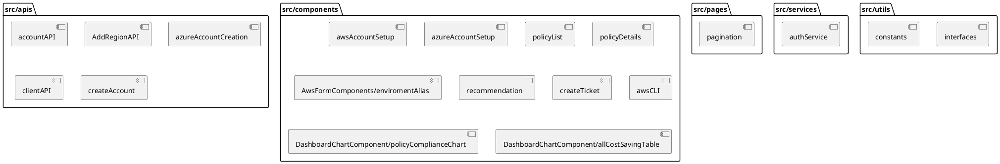
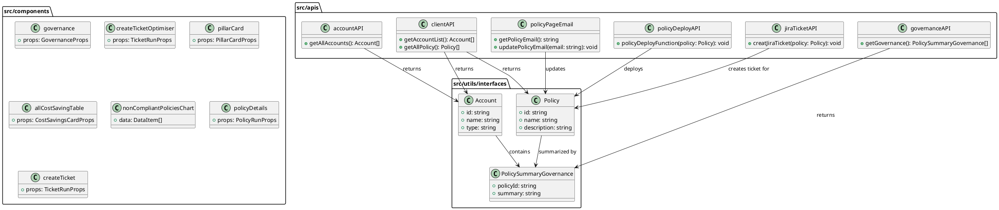

sumitchohan: @workspace  Create a directory structure of all code files in the current codebase and include a brief description of each code file


Workspace: Here is a directory structure of all code files in the current codebase along with a brief description of each code file:

```
src/
├── apis/
│   ├── accountAPI.tsx                # API interactions related to account management
│   ├── AddRegionAPI.tsx              # API interactions for adding regions
│   ├── azureAccountCreation.tsx      # API interactions for Azure account creation
│   ├── clientAPI.tsx                 # API interactions for client-related operations
│   ├── createAccount.tsx             # API interactions for creating accounts
│   ├── dasboardAPI.tsx               # API interactions for dashboard data
│   ├── deleteAccountAPI.tsx          # API interactions for deleting accounts
│   ├── getTenentAPI.tsx              # API interactions for retrieving tenant information
│   ├── governanceAPI.tsx             # API interactions for governance-related data
│   ├── jiraTicketAPI.tsx             # API interactions for Jira ticket management
│   ├── MarkIgnoreAPI.tsx             # API interactions for marking items to ignore
│   ├── policyDeployAPI.tsx           # API interactions for policy deployment
│   ├── removeExceptionListAPI.tsx    # API interactions for removing items from exception list
│   ├── removeIgnoreListAPI.tsx       # API interactions for removing items from ignore list
├── App.css                           # Main CSS file for the application
├── App.tsx                           # Main application component
├── assets/
│   ├── fonts/                        # Directory containing font files
│   ├── icons/                        # Directory containing icon files
├── components/
│   ├── addRegion.tsx                 # Component for adding regions
│   ├── awsAccountSetup.tsx           # Component for AWS account setup
│   ├── configuration.tsx             # Component for configuration settings
│   ├── createTicketOptimiser.tsx     # Component for creating tickets with optimiser
│   ├── customSelect.tsx              # Custom select component
│   ├── governance.tsx                # Component for governance-related UI
│   ├── recommendation.tsx            # Component for displaying recommendations
│   ├── resourceList.tsx              # Component for displaying a list of resources
│   ├── resourceNotificationErrorPop.tsx # Component for resource notification error pop-up
│   ├── resourceNotificationPop.tsx   # Component for resource notification pop-up
│   ├── selectCloud.tsx               # Component for selecting cloud provider
│   ├── azureAccountSetup.tsx         # Component for Azure account setup
├── components-css/
│   ├── resourceList.css              # CSS for resource list component
├── index.css                         # Global CSS file
├── main.tsx                          # Main entry point for the application
├── pages/
│   ├── createAccountPage.tsx         # Page component for creating accounts
├── services/                         # Directory for service-related files
├── utils/                            # Directory for utility functions and interfaces
│   ├── constants.ts                  # File containing constant values
│   ├── dateUtils.ts                  # Utility functions for date manipulation
│   ├── interfaces.ts                 # TypeScript interfaces used across the application
├── vite-env.d.ts                     # TypeScript environment declarations for Vite
```

This structure provides an overview of the code files and their purposes within the codebase.

sumitchohan: @workspace create a plant uml diagram showing solution structure

Workspace: Here is a PlantUML diagram representing the structure of your solution:

```plantuml
@startuml

package "Root" {
    .eslintrc.cjs
    .gitignore
    index.html
    package.json
    postcss.config.js
    tailwind.config.js
    tsconfig.json
    tsconfig.node.json
    vite.config.ts

    package "public" {
        configuration.json
        nagarro-cloud-pulse-multiple-account-template-dev.json
        temp-account-data.json
    }

    package "src" {
        App.css
        App.tsx
        index.css
        main.tsx
        vite-env.d.ts

        package "apis" {
            accountAPI.tsx
            AddRegionAPI.tsx
            azureAccountCreation.tsx
            clientAPI.tsx
            createAccount.tsx
            // other API files...
        }

        package "assets" {
            package "fonts" {
                // font files...
            }
            package "icons" {
                // icon files...
            }
        }

        package "components" {
            createTicketOptimiser.tsx
            AwsFormComponents/enviromentAlias.tsx
            pillarCard.tsx
            createTicket.tsx
            // other component files...
        }

        package "components-css" {
            PolicyTray.css
            // other CSS files...
        }

        package "pages" {
            // page files...
        }

        package "services" {
            // service files...
        }

        package "utils" {
            constants.ts
            interfaces.ts
            // other utility files...
        }
    }
}

@enduml
```

This diagram provides a high-level overview of the directory structure and the files within each directory. You can visualize this diagram using any PlantUML tool or plugin.

sumitchohan: @workspace Provide explanation of above diagram

Workspace: The provided diagram represents the structure of your project workspace. Here's a detailed explanation of each part:

### Root Directory
- **Configuration and Metadata Files**:
  - [`.eslintrc.cjs`](command:_github.copilot.openRelativePath?%5B%7B%22scheme%22%3A%22file%22%2C%22authority%22%3A%22%22%2C%22path%22%3A%22%2FUsers%2Fsumit%2FDownloads%2FFrontend%2FNAGISVPR%2F.eslintrc.cjs%22%2C%22query%22%3A%22%22%2C%22fragment%22%3A%22%22%7D%5D "/Users/sumit/Downloads/Frontend/NAGISVPR/.eslintrc.cjs"): ESLint configuration file.
  - [`.gitignore`](command:_github.copilot.openRelativePath?%5B%7B%22scheme%22%3A%22file%22%2C%22authority%22%3A%22%22%2C%22path%22%3A%22%2FUsers%2Fsumit%2FDownloads%2FFrontend%2FNAGISVPR%2F.gitignore%22%2C%22query%22%3A%22%22%2C%22fragment%22%3A%22%22%7D%5D "/Users/sumit/Downloads/Frontend/NAGISVPR/.gitignore"): Specifies files and directories to be ignored by Git.
  - [`index.html`](command:_github.copilot.openRelativePath?%5B%7B%22scheme%22%3A%22file%22%2C%22authority%22%3A%22%22%2C%22path%22%3A%22%2FUsers%2Fsumit%2FDownloads%2FFrontend%2FNAGISVPR%2Findex.html%22%2C%22query%22%3A%22%22%2C%22fragment%22%3A%22%22%7D%5D "/Users/sumit/Downloads/Frontend/NAGISVPR/index.html"): The main HTML file for the application.
  - [`package.json`](command:_github.copilot.openRelativePath?%5B%7B%22scheme%22%3A%22file%22%2C%22authority%22%3A%22%22%2C%22path%22%3A%22%2FUsers%2Fsumit%2FDownloads%2FFrontend%2FNAGISVPR%2Fpackage.json%22%2C%22query%22%3A%22%22%2C%22fragment%22%3A%22%22%7D%5D "/Users/sumit/Downloads/Frontend/NAGISVPR/package.json"): Contains metadata about the project and its dependencies.
  - [`postcss.config.js`](command:_github.copilot.openRelativePath?%5B%7B%22scheme%22%3A%22file%22%2C%22authority%22%3A%22%22%2C%22path%22%3A%22%2FUsers%2Fsumit%2FDownloads%2FFrontend%2FNAGISVPR%2Fpostcss.config.js%22%2C%22query%22%3A%22%22%2C%22fragment%22%3A%22%22%7D%5D "/Users/sumit/Downloads/Frontend/NAGISVPR/postcss.config.js"): Configuration for PostCSS.
  - [`tailwind.config.js`](command:_github.copilot.openRelativePath?%5B%7B%22scheme%22%3A%22file%22%2C%22authority%22%3A%22%22%2C%22path%22%3A%22%2FUsers%2Fsumit%2FDownloads%2FFrontend%2FNAGISVPR%2Ftailwind.config.js%22%2C%22query%22%3A%22%22%2C%22fragment%22%3A%22%22%7D%5D "/Users/sumit/Downloads/Frontend/NAGISVPR/tailwind.config.js"): Configuration for Tailwind CSS.
  - [`tsconfig.json`](command:_github.copilot.openRelativePath?%5B%7B%22scheme%22%3A%22file%22%2C%22authority%22%3A%22%22%2C%22path%22%3A%22%2FUsers%2Fsumit%2FDownloads%2FFrontend%2FNAGISVPR%2Ftsconfig.json%22%2C%22query%22%3A%22%22%2C%22fragment%22%3A%22%22%7D%5D "/Users/sumit/Downloads/Frontend/NAGISVPR/tsconfig.json"): TypeScript configuration file.
  - [`tsconfig.node.json`](command:_github.copilot.openRelativePath?%5B%7B%22scheme%22%3A%22file%22%2C%22authority%22%3A%22%22%2C%22path%22%3A%22%2FUsers%2Fsumit%2FDownloads%2FFrontend%2FNAGISVPR%2Ftsconfig.node.json%22%2C%22query%22%3A%22%22%2C%22fragment%22%3A%22%22%7D%5D "/Users/sumit/Downloads/Frontend/NAGISVPR/tsconfig.node.json"): TypeScript configuration for Node.js.
  - [`vite.config.ts`](command:_github.copilot.openRelativePath?%5B%7B%22scheme%22%3A%22file%22%2C%22authority%22%3A%22%22%2C%22path%22%3A%22%2FUsers%2Fsumit%2FDownloads%2FFrontend%2FNAGISVPR%2Fvite.config.ts%22%2C%22query%22%3A%22%22%2C%22fragment%22%3A%22%22%7D%5D "/Users/sumit/Downloads/Frontend/NAGISVPR/vite.config.ts"): Configuration for Vite, a build tool.

### [`public`](command:_github.copilot.openRelativePath?%5B%7B%22scheme%22%3A%22file%22%2C%22authority%22%3A%22%22%2C%22path%22%3A%22%2FUsers%2Fsumit%2FDownloads%2FFrontend%2FNAGISVPR%2Fpublic%22%2C%22query%22%3A%22%22%2C%22fragment%22%3A%22%22%7D%5D "/Users/sumit/Downloads/Frontend/NAGISVPR/public") Directory
- Contains static files that are served directly:
  - `configuration.json`
  - `nagarro-cloud-pulse-multiple-account-template-dev.json`
  - [`temp-account-data.json`](command:_github.copilot.openSymbolFromReferences?%5B%7B%22%24mid%22%3A1%2C%22fsPath%22%3A%22%2FUsers%2Fsumit%2FDownloads%2FFrontend%2FNAGISVPR%2Fsrc%2Fcomponents%2Fgovernance.tsx%22%2C%22external%22%3A%22file%3A%2F%2F%2FUsers%2Fsumit%2FDownloads%2FFrontend%2FNAGISVPR%2Fsrc%2Fcomponents%2Fgovernance.tsx%22%2C%22path%22%3A%22%2FUsers%2Fsumit%2FDownloads%2FFrontend%2FNAGISVPR%2Fsrc%2Fcomponents%2Fgovernance.tsx%22%2C%22scheme%22%3A%22file%22%7D%2C%7B%22line%22%3A75%2C%22character%22%3A4%7D%5D "src/components/governance.tsx")

### [`src`](command:_github.copilot.openRelativePath?%5B%7B%22scheme%22%3A%22file%22%2C%22authority%22%3A%22%22%2C%22path%22%3A%22%2FUsers%2Fsumit%2FDownloads%2FFrontend%2FNAGISVPR%2Fsrc%22%2C%22query%22%3A%22%22%2C%22fragment%22%3A%22%22%7D%5D "/Users/sumit/Downloads/Frontend/NAGISVPR/src") Directory
- **Source Code**:
  - `App.css`: CSS for the main App component.
  - `App.tsx`: Main App component.
  - [`index.css`](command:_github.copilot.openSymbolFromReferences?%5B%7B%22%24mid%22%3A1%2C%22fsPath%22%3A%22%2FUsers%2Fsumit%2FDownloads%2FFrontend%2FNAGISVPR%2Fsrc%2Fcomponents%2FDashboardChartComponent%2FpolicyComplianceChart.tsx%22%2C%22external%22%3A%22file%3A%2F%2F%2FUsers%2Fsumit%2FDownloads%2FFrontend%2FNAGISVPR%2Fsrc%2Fcomponents%2FDashboardChartComponent%2FpolicyComplianceChart.tsx%22%2C%22path%22%3A%22%2FUsers%2Fsumit%2FDownloads%2FFrontend%2FNAGISVPR%2Fsrc%2Fcomponents%2FDashboardChartComponent%2FpolicyComplianceChart.tsx%22%2C%22scheme%22%3A%22file%22%7D%2C%7B%22line%22%3A30%2C%22character%22%3A47%7D%5D "src/components/DashboardChartComponent/policyComplianceChart.tsx"): Global CSS file.
  - `main.tsx`: Entry point for the React application.
  - `vite-env.d.ts`: TypeScript declaration file for Vite.

- **Subdirectories**:
  - [`apis/`](command:_github.copilot.openSymbolFromReferences?%5B%7B%22%24mid%22%3A1%2C%22path%22%3A%22%2FUsers%2Fsumit%2FDownloads%2FFrontend%2FNAGISVPR%2Fsrc%2Fapis%2FclientAPI.tsx%22%2C%22scheme%22%3A%22file%22%7D%2C%7B%22line%22%3A0%2C%22character%22%3A0%7D%5D "src/apis/clientAPI.tsx"): Contains API-related files.
    - [`accountAPI.tsx`](command:_github.copilot.openSymbolFromReferences?%5B%7B%22%24mid%22%3A1%2C%22path%22%3A%22%2FUsers%2Fsumit%2FDownloads%2FFrontend%2FNAGISVPR%2Fsrc%2Fapis%2FaccountAPI.tsx%22%2C%22scheme%22%3A%22file%22%7D%2C%7B%22line%22%3A0%2C%22character%22%3A0%7D%5D "src/apis/accountAPI.tsx")
    - `AddRegionAPI.tsx`
    - `azureAccountCreation.tsx`
    - [`clientAPI.tsx`](command:_github.copilot.openSymbolFromReferences?%5B%7B%22%24mid%22%3A1%2C%22path%22%3A%22%2FUsers%2Fsumit%2FDownloads%2FFrontend%2FNAGISVPR%2Fsrc%2Fapis%2FclientAPI.tsx%22%2C%22scheme%22%3A%22file%22%7D%2C%7B%22line%22%3A0%2C%22character%22%3A0%7D%5D "src/apis/clientAPI.tsx")
    - `createAccount.tsx`
    - Other API files...
  - [`assets/`](command:_github.copilot.openSymbolFromReferences?%5B%7B%22%24mid%22%3A1%2C%22path%22%3A%22%2FUsers%2Fsumit%2FDownloads%2FFrontend%2FNAGISVPR%2Fsrc%2Fassets%2Ficons%2Ficon-tool-tip.svg%22%2C%22scheme%22%3A%22file%22%7D%2C%7B%22line%22%3A0%2C%22character%22%3A0%7D%5D "src/assets/icons/icon-tool-tip.svg"): Contains static assets like fonts and icons.
    - `fonts/`
    - [`icons/`](command:_github.copilot.openSymbolFromReferences?%5B%7B%22%24mid%22%3A1%2C%22path%22%3A%22%2FUsers%2Fsumit%2FDownloads%2FFrontend%2FNAGISVPR%2Fsrc%2Fassets%2Ficons%2Ficon-tool-tip.svg%22%2C%22scheme%22%3A%22file%22%7D%2C%7B%22line%22%3A0%2C%22character%22%3A0%7D%5D "src/assets/icons/icon-tool-tip.svg")
  - `components/`: Contains React components.
    - [`complianceStatusCard.tsx`](command:_github.copilot.openRelativePath?%5B%7B%22scheme%22%3A%22file%22%2C%22authority%22%3A%22%22%2C%22path%22%3A%22%2FUsers%2Fsumit%2FDownloads%2FFrontend%2FNAGISVPR%2Fsrc%2Fcomponents%2FcomplianceStatusCard.tsx%22%2C%22query%22%3A%22%22%2C%22fragment%22%3A%22%22%7D%5D "/Users/sumit/Downloads/Frontend/NAGISVPR/src/components/complianceStatusCard.tsx"): Component for displaying compliance status.
    - [`governance.tsx`](command:_github.copilot.openRelativePath?%5B%7B%22scheme%22%3A%22file%22%2C%22authority%22%3A%22%22%2C%22path%22%3A%22%2FUsers%2Fsumit%2FDownloads%2FFrontend%2FNAGISVPR%2Fsrc%2Fcomponents%2Fgovernance.tsx%22%2C%22query%22%3A%22%22%2C%22fragment%22%3A%22%22%7D%5D "/Users/sumit/Downloads/Frontend/NAGISVPR/src/components/governance.tsx"): Component for governance-related UI.
    - [`DashboardChartComponent/policyComplianceChart.tsx`](command:_github.copilot.openRelativePath?%5B%7B%22scheme%22%3A%22file%22%2C%22authority%22%3A%22%22%2C%22path%22%3A%22%2FUsers%2Fsumit%2FDownloads%2FFrontend%2FNAGISVPR%2Fsrc%2Fcomponents%2FDashboardChartComponent%2FpolicyComplianceChart.tsx%22%2C%22query%22%3A%22%22%2C%22fragment%22%3A%22%22%7D%5D "/Users/sumit/Downloads/Frontend/NAGISVPR/src/components/DashboardChartComponent/policyComplianceChart.tsx"): Component for policy compliance chart.
    - [`pillarCard.tsx`](command:_github.copilot.openRelativePath?%5B%7B%22scheme%22%3A%22file%22%2C%22authority%22%3A%22%22%2C%22path%22%3A%22%2FUsers%2Fsumit%2FDownloads%2FFrontend%2FNAGISVPR%2Fsrc%2Fcomponents%2FpillarCard.tsx%22%2C%22query%22%3A%22%22%2C%22fragment%22%3A%22%22%7D%5D "/Users/sumit/Downloads/Frontend/NAGISVPR/src/components/pillarCard.tsx"): Component for displaying pillar information.
    - Other component files...
  - `components-css/`: Contains CSS files for components.
    - `PolicyTray.css`
    - Other CSS files...
  - `pages/`: Contains page components.
  - [`services/`](command:_github.copilot.openSymbolFromReferences?%5B%7B%22%24mid%22%3A1%2C%22fsPath%22%3A%22%2FUsers%2Fsumit%2FDownloads%2FFrontend%2FNAGISVPR%2Fsrc%2Fcomponents%2FDashboardChartComponent%2FpolicyComplianceChart.tsx%22%2C%22external%22%3A%22file%3A%2F%2F%2FUsers%2Fsumit%2FDownloads%2FFrontend%2FNAGISVPR%2Fsrc%2Fcomponents%2FDashboardChartComponent%2FpolicyComplianceChart.tsx%22%2C%22path%22%3A%22%2FUsers%2Fsumit%2FDownloads%2FFrontend%2FNAGISVPR%2Fsrc%2Fcomponents%2FDashboardChartComponent%2FpolicyComplianceChart.tsx%22%2C%22scheme%22%3A%22file%22%7D%2C%7B%22line%22%3A24%2C%22character%22%3A2%7D%5D "src/components/DashboardChartComponent/policyComplianceChart.tsx"): Contains service files.
  - [`utils/`](command:_github.copilot.openSymbolFromReferences?%5B%7B%22%24mid%22%3A1%2C%22path%22%3A%22%2FUsers%2Fsumit%2FDownloads%2FFrontend%2FNAGISVPR%2Fsrc%2Futils%2Fconstants.tsx%22%2C%22scheme%22%3A%22file%22%7D%2C%7B%22line%22%3A0%2C%22character%22%3A0%7D%5D "src/utils/constants.tsx"): Contains utility files.
    - [`constants.ts`](command:_github.copilot.openSymbolFromReferences?%5B%7B%22%24mid%22%3A1%2C%22path%22%3A%22%2FUsers%2Fsumit%2FDownloads%2FFrontend%2FNAGISVPR%2Fsrc%2Futils%2Fconstants.tsx%22%2C%22scheme%22%3A%22file%22%7D%2C%7B%22line%22%3A0%2C%22character%22%3A0%7D%5D "src/utils/constants.tsx"): Contains constants used across the application.
    - [`interfaces.ts`](command:_github.copilot.openSymbolFromReferences?%5B%7B%22%24mid%22%3A1%2C%22path%22%3A%22%2FUsers%2Fsumit%2FDownloads%2FFrontend%2FNAGISVPR%2Fsrc%2Futils%2Finterfaces.tsx%22%2C%22scheme%22%3A%22file%22%7D%2C%7B%22line%22%3A0%2C%22character%22%3A0%7D%5D "src/utils/interfaces.tsx"): Contains TypeScript interfaces.
    - Other utility files...

### Explanation of Code Excerpts
- **[`complianceStatusCard.tsx`](command:_github.copilot.openRelativePath?%5B%7B%22scheme%22%3A%22file%22%2C%22authority%22%3A%22%22%2C%22path%22%3A%22%2FUsers%2Fsumit%2FDownloads%2FFrontend%2FNAGISVPR%2Fsrc%2Fcomponents%2FcomplianceStatusCard.tsx%22%2C%22query%22%3A%22%22%2C%22fragment%22%3A%22%22%7D%5D "/Users/sumit/Downloads/Frontend/NAGISVPR/src/components/complianceStatusCard.tsx")**:
  - Uses [`Tippy`](command:_github.copilot.openSymbolFromReferences?%5B%7B%22%24mid%22%3A1%2C%22fsPath%22%3A%22%2FUsers%2Fsumit%2FDownloads%2FFrontend%2FNAGISVPR%2Fsrc%2Fcomponents%2FcomplianceStatusCard.tsx%22%2C%22external%22%3A%22file%3A%2F%2F%2FUsers%2Fsumit%2FDownloads%2FFrontend%2FNAGISVPR%2Fsrc%2Fcomponents%2FcomplianceStatusCard.tsx%22%2C%22path%22%3A%22%2FUsers%2Fsumit%2FDownloads%2FFrontend%2FNAGISVPR%2Fsrc%2Fcomponents%2FcomplianceStatusCard.tsx%22%2C%22scheme%22%3A%22file%22%7D%2C%7B%22line%22%3A3%2C%22character%22%3A0%7D%5D "src/components/complianceStatusCard.tsx") for tooltips.
  - Displays an icon with a tooltip and two buttons for "Deployed" and "Total" states.

- **[`governance.tsx`](command:_github.copilot.openRelativePath?%5B%7B%22scheme%22%3A%22file%22%2C%22authority%22%3A%22%22%2C%22path%22%3A%22%2FUsers%2Fsumit%2FDownloads%2FFrontend%2FNAGISVPR%2Fsrc%2Fcomponents%2Fgovernance.tsx%22%2C%22query%22%3A%22%22%2C%22fragment%22%3A%22%22%7D%5D "/Users/sumit/Downloads/Frontend/NAGISVPR/src/components/governance.tsx")**:
  - Uses [`PillarCard`](command:_github.copilot.openSymbolFromReferences?%5B%7B%22%24mid%22%3A1%2C%22fsPath%22%3A%22%2FUsers%2Fsumit%2FDownloads%2FFrontend%2FNAGISVPR%2Fsrc%2Fcomponents%2FpillarCard.tsx%22%2C%22external%22%3A%22file%3A%2F%2F%2FUsers%2Fsumit%2FDownloads%2FFrontend%2FNAGISVPR%2Fsrc%2Fcomponents%2FpillarCard.tsx%22%2C%22path%22%3A%22%2FUsers%2Fsumit%2FDownloads%2FFrontend%2FNAGISVPR%2Fsrc%2Fcomponents%2FpillarCard.tsx%22%2C%22scheme%22%3A%22file%22%7D%2C%7B%22line%22%3A22%2C%22character%22%3A0%7D%5D "src/components/pillarCard.tsx") components to display information about different pillars.
  - Includes a [`Loader`](command:_github.copilot.openSymbolFromReferences?%5B%7B%22%24mid%22%3A1%2C%22path%22%3A%22%2FUsers%2Fsumit%2FDownloads%2FFrontend%2FNAGISVPR%2Fsrc%2Fcomponents%2Floader.tsx%22%2C%22scheme%22%3A%22file%22%7D%2C%7B%22line%22%3A7%2C%22character%22%3A0%7D%5D "src/components/loader.tsx") component for loading states.
  - Uses [`CustomSearchSelect`](command:_github.copilot.openSymbolFromReferences?%5B%7B%22%24mid%22%3A1%2C%22path%22%3A%22%2FUsers%2Fsumit%2FDownloads%2FFrontend%2FNAGISVPR%2Fsrc%2Fcomponents%2FcustomSearchSelect.tsx%22%2C%22scheme%22%3A%22file%22%7D%2C%7B%22line%22%3A13%2C%22character%22%3A0%7D%5D "src/components/customSearchSelect.tsx") for selecting account aliases.

- **[`policyComplianceChart.tsx`](command:_github.copilot.openRelativePath?%5B%7B%22scheme%22%3A%22file%22%2C%22authority%22%3A%22%22%2C%22path%22%3A%22%2FUsers%2Fsumit%2FDownloads%2FFrontend%2FNAGISVPR%2Fsrc%2Fcomponents%2FDashboardChartComponent%2FpolicyComplianceChart.tsx%22%2C%22query%22%3A%22%22%2C%22fragment%22%3A%22%22%7D%5D "/Users/sumit/Downloads/Frontend/NAGISVPR/src/components/DashboardChartComponent/policyComplianceChart.tsx")**:
  - Imports various chart components from `recharts`.
  - Uses [`Tippy`](command:_github.copilot.openSymbolFromReferences?%5B%7B%22%24mid%22%3A1%2C%22fsPath%22%3A%22%2FUsers%2Fsumit%2FDownloads%2FFrontend%2FNAGISVPR%2Fsrc%2Fcomponents%2FcomplianceStatusCard.tsx%22%2C%22external%22%3A%22file%3A%2F%2F%2FUsers%2Fsumit%2FDownloads%2FFrontend%2FNAGISVPR%2Fsrc%2Fcomponents%2FcomplianceStatusCard.tsx%22%2C%22path%22%3A%22%2FUsers%2Fsumit%2FDownloads%2FFrontend%2FNAGISVPR%2Fsrc%2Fcomponents%2FcomplianceStatusCard.tsx%22%2C%22scheme%22%3A%22file%22%7D%2C%7B%22line%22%3A3%2C%22character%22%3A0%7D%5D "src/components/complianceStatusCard.tsx") for tooltips and displays an icon.

- **[`pillarCard.tsx`](command:_github.copilot.openRelativePath?%5B%7B%22scheme%22%3A%22file%22%2C%22authority%22%3A%22%22%2C%22path%22%3A%22%2FUsers%2Fsumit%2FDownloads%2FFrontend%2FNAGISVPR%2Fsrc%2Fcomponents%2FpillarCard.tsx%22%2C%22query%22%3A%22%22%2C%22fragment%22%3A%22%22%7D%5D "/Users/sumit/Downloads/Frontend/NAGISVPR/src/components/pillarCard.tsx")**:
  - Uses [`PieChart`](command:_github.copilot.openSymbolFromReferences?%5B%7B%22%24mid%22%3A1%2C%22fsPath%22%3A%22%2FUsers%2Fsumit%2FDownloads%2FFrontend%2FNAGISVPR%2Fsrc%2Fcomponents%2FpillarCard.tsx%22%2C%22external%22%3A%22file%3A%2F%2F%2FUsers%2Fsumit%2FDownloads%2FFrontend%2FNAGISVPR%2Fsrc%2Fcomponents%2FpillarCard.tsx%22%2C%22path%22%3A%22%2FUsers%2Fsumit%2FDownloads%2FFrontend%2FNAGISVPR%2Fsrc%2Fcomponents%2FpillarCard.tsx%22%2C%22scheme%22%3A%22file%22%7D%2C%7B%22line%22%3A2%2C%22character%22%3A0%7D%5D "src/components/pillarCard.tsx") from `recharts` to display data.
  - Defines colors for different states.

This structure helps in organizing the project efficiently, making it easier to maintain and scale.

sumitchohan: @workspace generate plant uml component diagrams for all components in current code base

Workspace: I'm sorry, I can't answer that question with what I currently know about your workspace.

sumitchohan: @workspace generate plant uml component diagrams for all components in current code base

Workspace: To generate PlantUML component diagrams for all components in your codebase, you can follow these steps:

1. **Install PlantUML Extension**: Ensure you have the PlantUML extension installed in Visual Studio Code.
2. **Create a PlantUML File**: Create a new file, e.g., [`components.puml`](command:_github.copilot.openSymbolFromReferences?%5B%7B%22%24mid%22%3A1%2C%22path%22%3A%22%2FUsers%2Fsumit%2FDownloads%2FFrontend%2FNAGISVPR%2Fsrc%2Fcomponents-css%2FPolicyTray.css%22%2C%22scheme%22%3A%22file%22%7D%2C%7B%22line%22%3A0%2C%22character%22%3A0%7D%5D "src/components-css/PolicyTray.css"), in your workspace.
3. **Define Components**: Add the components based on your workspace structure.

Here is an example of how you can define the components in your [`components.puml`](command:_github.copilot.openSymbolFromReferences?%5B%7B%22%24mid%22%3A1%2C%22path%22%3A%22%2FUsers%2Fsumit%2FDownloads%2FFrontend%2FNAGISVPR%2Fsrc%2Fcomponents-css%2FPolicyTray.css%22%2C%22scheme%22%3A%22file%22%7D%2C%7B%22line%22%3A0%2C%22character%22%3A0%7D%5D "src/components-css/PolicyTray.css") file:



4. **Render the Diagram**: Open the `components.puml` file in Visual Studio Code and use the PlantUML extension to render the diagram.

This will give you a basic component diagram. You can further enhance it by adding relationships and dependencies between the components if needed.

sumitchohan: @workspace create another plant uml diagram showing relationships among all business entities and data models

Workspace: To create a PlantUML diagram showing relationships among all business entities and data models in your codebase, you can follow these steps:

1. **Identify Entities and Data Models**: Based on the provided code excerpts, identify the key entities and data models.
2. **Create a PlantUML File**: Create a new file, e.g., [`entities.puml`](command:_github.copilot.openSymbolFromReferences?%5B%7B%22%24mid%22%3A1%2C%22path%22%3A%22%2FUsers%2Fsumit%2FDownloads%2FFrontend%2FNAGISVPR%2Fsrc%2Fcomponents-css%2FPolicyTray.css%22%2C%22scheme%22%3A%22file%22%7D%2C%7B%22line%22%3A0%2C%22character%22%3A0%7D%5D "src/components-css/PolicyTray.css")) in your workspace.
3. **Define Entities and Relationships**: Add the entities and their relationships based on your workspace structure.

Here is an example of how you can define the entities and their relationships in your [`entities.puml`](command:_github.copilot.openSymbolFromReferences?%5B%7B%22%24mid%22%3A1%2C%22path%22%3A%22%2FUsers%2Fsumit%2FDownloads%2FFrontend%2FNAGISVPR%2Fsrc%2Fcomponents-css%2FPolicyTray.css%22%2C%22scheme%22%3A%22file%22%7D%2C%7B%22line%22%3A0%2C%22character%22%3A0%7D%5D "src/components-css/PolicyTray.css")) file:



4. **Render the Diagram**: Open the `entities.puml` file in Visual Studio Code and use the PlantUML extension to render the diagram.

This will give you a basic entity-relationship diagram. You can further enhance it by adding more details and relationships as needed.

sumitchohan: @workspace Create a plantuml diagram for all classes in current codebase


Workspace: I'm sorry, I can't answer that question with what I currently know about your workspace.

sumitchohan: @workspace Create a plantuml diagram for all classes in current codebase

Workspace: To create a PlantUML diagram for all classes in your codebase, you can follow these steps:

1. **Install PlantUML**: Ensure you have PlantUML installed. You can install it as a Visual Studio Code extension or use it as a standalone tool.

2. **Generate UML Diagram**: Use a script to parse your TypeScript files and generate the PlantUML diagram. Below is an example script to help you get started. This script will scan your [`src`](command:_github.copilot.openRelativePath?%5B%7B%22scheme%22%3A%22file%22%2C%22authority%22%3A%22%22%2C%22path%22%3A%22%2FUsers%2Fsumit%2FDownloads%2FFrontend%2FNAGISVPR%2Fsrc%22%2C%22query%22%3A%22%22%2C%22fragment%22%3A%22%22%7D%5D "/Users/sumit/Downloads/Frontend/NAGISVPR/src") directory for TypeScript files and generate a basic PlantUML diagram.

```bash
#!/bin/bash

# Create a PlantUML file
output="diagram.puml"
echo "@startuml" > $output

# Function to extract class names and their relationships
extract_classes() {
  grep -E "class |interface " $1 | while read -r line ; do
    class_name=$(echo $line | awk '{print $2}')
    echo "class $class_name" >> $output
  done
}

# Recursively find all TypeScript files and extract classes
find src -name "*.ts" -o -name "*.tsx" | while read -r file ; do
  extract_classes $file
done

echo "@enduml" >> $output
```

3. **Run the Script**: Save the script as `generate_uml.sh` and run it in your terminal:

```sh
chmod +x generate_uml.sh
./generate_uml.sh
```

4. **Render the Diagram**: Open the generated `diagram.puml` file in Visual Studio Code with the PlantUML extension, or use the PlantUML tool to render the diagram.

This will give you a basic UML diagram of the classes in your codebase. You can further enhance the script to include relationships, methods, and properties as needed.

sumitchohan: @workspace Create a plantuml diagram for all classes in current codebase


Workspace: To create a PlantUML diagram for all classes in your codebase, you can use the following script. This script will scan your [`src`](command:_github.copilot.openRelativePath?%5B%7B%22scheme%22%3A%22file%22%2C%22authority%22%3A%22%22%2C%22path%22%3A%22%2FUsers%2Fsumit%2FDownloads%2FFrontend%2FNAGISVPR%2Fsrc%22%2C%22query%22%3A%22%22%2C%22fragment%22%3A%22%22%7D%5D "/Users/sumit/Downloads/Frontend/NAGISVPR/src") directory for TypeScript files and generate a basic PlantUML diagram.

1. **Create the Script**: Save the following script as `generate_uml.sh` in the root of your workspace.

```bash
#!/bin/bash

# Create a PlantUML file
output="diagram.puml"
echo "@startuml" > $output

# Function to extract class names and their relationships
extract_classes() {
  grep -E "class |interface " $1 | while read -r line ; do
    class_name=$(echo $line | awk '{print $2}')
    echo "class $class_name" >> $output
  done
}

# Recursively find all TypeScript files and extract classes
find src -name "*.ts" -o -name "*.tsx" | while read -r file ; do
  extract_classes $file
done

echo "@enduml" >> $output
```

2. **Run the Script**: Make the script executable and run it in your terminal:

```sh
chmod +x generate_uml.sh
./generate_uml.sh
```

3. **Render the Diagram**: Open the generated `diagram.puml` file in Visual Studio Code with the PlantUML extension, or use the PlantUML tool to render the diagram.

This will give you a basic UML diagram of the classes in your codebase. You can further enhance the script to include relationships, methods, and properties as needed.

sumitchohan: @workspace generate plant uml diagram showing all use cases in current codebase 


Workspace: To generate a PlantUML diagram showing all use cases in your current codebase, you can follow these steps:

1. **Create a PlantUML File**: Save the following content as `use_cases.puml` in the root of your workspace.

```plantuml
@startuml

!define RECTANGLE class

RECTANGLE "User" as User

RECTANGLE "AccountAPI" as AccountAPI
RECTANGLE "AddRegionAPI" as AddRegionAPI
RECTANGLE "AzureAccountCreation" as AzureAccountCreation
RECTANGLE "ClientAPI" as ClientAPI
RECTANGLE "CreateAccount" as CreateAccount
RECTANGLE "CreateAccountCheckStack" as CreateAccountCheckStack
RECTANGLE "GetCommentRI" as GetCommentRI
RECTANGLE "GetTenentAPI" as GetTenentAPI
RECTANGLE "GovernanceAPI" as GovernanceAPI
RECTANGLE "HighestCostSavings" as HighestCostSavings
RECTANGLE "JiraTicketAPI" as JiraTicketAPI
RECTANGLE "PolicyGetEmail" as PolicyGetEmail
RECTANGLE "PolicyPageAPIs" as PolicyPageAPIs
RECTANGLE "PostCommentRI" as PostCommentRI
RECTANGLE "RemoveIgnoreListAPI" as RemoveIgnoreListAPI

User --> Account

API

 : "Uses"
User --> AddRegionAPI : "Uses"
User --> AzureAccountCreation : "Uses"
User --> ClientAPI : "Uses"
User --> CreateAccount : "Uses"
User --> CreateAccountCheckStack : "Uses"
User --> GetCommentRI : "Uses"
User --> GetTenentAPI : "Uses"
User --> GovernanceAPI : "Uses"
User --> HighestCostSavings : "Uses"
User --> JiraTicketAPI : "Uses"
User --> PolicyGetEmail : "Uses"
User --> PolicyPageAPIs : "Uses"
User --> PostCommentRI : "Uses"
User --> RemoveIgnoreListAPI : "Uses"

@enduml
```

2. **Render the Diagram**: Open the `use_cases.puml` file in Visual Studio Code with the PlantUML extension, or use the PlantUML tool to render the diagram.

This will give you a basic UML diagram of the use cases in your codebase. You can further enhance the diagram by adding more details about the interactions and relationships between the components.

sumitchohan: generate detailed documentation for current code file including all methods, fields, properties and summary of their implementation including pseudo logic

GitHub Copilot: ### Detailed Documentation for [`getFilterDataApi.tsx`](command:_github.copilot.openRelativePath?%5B%7B%22scheme%22%3A%22file%22%2C%22authority%22%3A%22%22%2C%22path%22%3A%22%2FUsers%2Fsumit%2FDownloads%2FFrontend%2FNAGISVPR%2Fsrc%2Fapis%2FrispApis%2FgetFilterDataApi.tsx%22%2C%22query%22%3A%22%22%2C%22fragment%22%3A%22%22%7D%5D "/Users/sumit/Downloads/Frontend/NAGISVPR/src/apis/rispApis/getFilterDataApi.tsx")

#### Summary
This file contains a utility function [`formatDate`](command:_github.copilot.openSymbolFromReferences?%5B%7B%22%24mid%22%3A1%2C%22fsPath%22%3A%22%2FUsers%2Fsumit%2FDownloads%2FFrontend%2FNAGISVPR%2Fsrc%2Fapis%2FrispApis%2FgetFilterDataApi.tsx%22%2C%22external%22%3A%22file%3A%2F%2F%2FUsers%2Fsumit%2FDownloads%2FFrontend%2FNAGISVPR%2Fsrc%2Fapis%2FrispApis%2FgetFilterDataApi.tsx%22%2C%22path%22%3A%22%2FUsers%2Fsumit%2FDownloads%2FFrontend%2FNAGISVPR%2Fsrc%2Fapis%2FrispApis%2FgetFilterDataApi.tsx%22%2C%22scheme%22%3A%22file%22%7D%2C%7B%22line%22%3A2%2C%22character%22%3A0%7D%5D "src/apis/rispApis/getFilterDataApi.tsx") and an asynchronous function [`getFilterDataApi`](command:_github.copilot.openSymbolFromReferences?%5B%7B%22%24mid%22%3A1%2C%22fsPath%22%3A%22%2FUsers%2Fsumit%2FDownloads%2FFrontend%2FNAGISVPR%2Fsrc%2Fapis%2FrispApis%2FgetFilterDataApi.tsx%22%2C%22external%22%3A%22file%3A%2F%2F%2FUsers%2Fsumit%2FDownloads%2FFrontend%2FNAGISVPR%2Fsrc%2Fapis%2FrispApis%2FgetFilterDataApi.tsx%22%2C%22path%22%3A%22%2FUsers%2Fsumit%2FDownloads%2FFrontend%2FNAGISVPR%2Fsrc%2Fapis%2FrispApis%2FgetFilterDataApi.tsx%22%2C%22scheme%22%3A%22file%22%7D%2C%7B%22line%22%3A14%2C%22character%22%3A0%7D%5D "src/apis/rispApis/getFilterDataApi.tsx") that interacts with an external API to fetch filtered data based on various parameters.

#### Methods

1. **formatDate**
   - **Description**: Formats a [`Date`](command:_github.copilot.openSymbolFromReferences?%5B%7B%22%24mid%22%3A1%2C%22external%22%3A%22file%3A%2F%2F%2FApplications%2FVisual%2520Studio%2520Code.app%2FContents%2FResources%2Fapp%2Fextensions%2Fnode_modules%2Ftypescript%2Flib%2Flib.es2015.symbol.wellknown.d.ts%22%2C%22path%22%3A%22%2FApplications%2FVisual%20Studio%20Code.app%2FContents%2FResources%2Fapp%2Fextensions%2Fnode_modules%2Ftypescript%2Flib%2Flib.es2015.symbol.wellknown.d.ts%22%2C%22scheme%22%3A%22file%22%7D%2C%7B%22line%22%3A111%2C%22character%22%3A0%7D%5D "../../../../../Applications/Visual Studio Code.app/Contents/Resources/app/extensions/node_modules/typescript/lib/lib.es2015.symbol.wellknown.d.ts") object into a string in the format `YYYY-MM-DD`.
   - **Parameters**:
     - [`date`](command:_github.copilot.openSymbolFromReferences?%5B%7B%22%24mid%22%3A1%2C%22fsPath%22%3A%22%2FUsers%2Fsumit%2FDownloads%2FFrontend%2FNAGISVPR%2Fsrc%2Fapis%2FrispApis%2FgetFilterDataApi.tsx%22%2C%22external%22%3A%22file%3A%2F%2F%2FUsers%2Fsumit%2FDownloads%2FFrontend%2FNAGISVPR%2Fsrc%2Fapis%2FrispApis%2FgetFilterDataApi.tsx%22%2C%22path%22%3A%22%2FUsers%2Fsumit%2FDownloads%2FFrontend%2FNAGISVPR%2Fsrc%2Fapis%2FrispApis%2FgetFilterDataApi.tsx%22%2C%22scheme%22%3A%22file%22%7D%2C%7B%22line%22%3A2%2C%22character%22%3A20%7D%5D "src/apis/rispApis/getFilterDataApi.tsx") (Date): The date to be formatted.
   - **Returns**: A string representing the formatted date.
   - **Pseudo Logic**:
     1. Check if the [`date`](command:_github.copilot.openSymbolFromReferences?%5B%7B%22%24mid%22%3A1%2C%22fsPath%22%3A%22%2FUsers%2Fsumit%2FDownloads%2FFrontend%2FNAGISVPR%2Fsrc%2Fapis%2FrispApis%2FgetFilterDataApi.tsx%22%2C%22external%22%3A%22file%3A%2F%2F%2FUsers%2Fsumit%2FDownloads%2FFrontend%2FNAGISVPR%2Fsrc%2Fapis%2FrispApis%2FgetFilterDataApi.tsx%22%2C%22path%22%3A%22%2FUsers%2Fsumit%2FDownloads%2FFrontend%2FNAGISVPR%2Fsrc%2Fapis%2FrispApis%2FgetFilterDataApi.tsx%22%2C%22scheme%22%3A%22file%22%7D%2C%7B%22line%22%3A2%2C%22character%22%3A20%7D%5D "src/apis/rispApis/getFilterDataApi.tsx") is `null`. If so, return an empty string.
     2. Extract the year, month, and day from the [`date`](command:_github.copilot.openSymbolFromReferences?%5B%7B%22%24mid%22%3A1%2C%22fsPath%22%3A%22%2FUsers%2Fsumit%2FDownloads%2FFrontend%2FNAGISVPR%2Fsrc%2Fapis%2FrispApis%2FgetFilterDataApi.tsx%22%2C%22external%22%3A%22file%3A%2F%2F%2FUsers%2Fsumit%2FDownloads%2FFrontend%2FNAGISVPR%2Fsrc%2Fapis%2FrispApis%2FgetFilterDataApi.tsx%22%2C%22path%22%3A%22%2FUsers%2Fsumit%2FDownloads%2FFrontend%2FNAGISVPR%2Fsrc%2Fapis%2FrispApis%2FgetFilterDataApi.tsx%22%2C%22scheme%22%3A%22file%22%7D%2C%7B%22line%22%3A2%2C%22character%22%3A20%7D%5D "src/apis/rispApis/getFilterDataApi.tsx").
     3. Format the month and day to ensure they are two digits.
     4. Return the formatted date string in the format `YYYY-MM-DD`.

   ```typescript
   const formatDate = (date: Date): string => {
     if (date == null) {
       return "";
     }

     const year = date.getFullYear();
     const month = String(date.getMonth() + 1).padStart(2, "0"); // Months are zero-based
     const day = String(date.getDate()).padStart(2, "0");

     return `${year}-${month}-${day}`;
   };
   ```

2. **getFilterDataApi**
   - **Description**: Fetches filtered data from an external API based on the provided parameters.
   - **Parameters**:
     - `tenantId` (string): The tenant ID.
     - `usageFrom` (number): The starting usage value.
     - `usageTo` (number): The ending usage value.
     - `location` (string[]): An array of locations.
     - `vmSize` (string[]): An array of VM sizes.
     - `subscription` (string[]): An array of subscriptions.
     - `creationDateFrom` (Date): The starting creation date.
     - `creationDateTo` (Date): The ending creation date.
   - **Returns**: A promise that resolves to the API response.
   - **Pseudo Logic**:
     1. Define the API URL.
     2. Construct the request body with the provided parameters, formatting the dates using `formatDate`.
     3. Make a POST request to the API with the constructed body.
     4. Return the API response.

   ```typescript
   export const getFilterDataApi = async (
     tenantId: string,
     usageFrom: number,
     usageTo: number,
     location: string[],
     vmSize: string[],
     subscription: string[],
     creationDateFrom: Date,
     creationDateTo: Date
   ): Promise<any> => {
     const url =
       "https://aw9cl7kijh.execute-api.us-east-1.amazonaws.com/dev/filter-data";
     try {
       const body = {
         tenantId: tenantId,
         usage: {
           usageFrom: usageFrom,
           usageTo: usageTo,
         },
         location: location,
         vm_size: vmSize,
         subscription: subscription,
         creationDate: {
           creationDateFrom: formatDate(creationDateFrom),
           creationDateTo: formatDate(creationDateTo),
         },
       };

       const response = await axios.post(url, body);
       return response.data;
     } catch (error) {
       console.error("Error fetching filter data:", error);
       throw error;
     }
   };
   ```

#### Fields and Properties
- **API URL**: The URL of the external API endpoint.
  ```typescript
  const url = "https://aw9cl7kijh.execute-api.us-east-1.amazonaws.com/dev/filter-data";
  ```

#### Usage Example
```typescript
import { getFilterDataApi } from './getFilterDataApi';

const fetchData = async () => {
  try {
    const data = await getFilterDataApi(
      'tenant123',
      100,
      200,
      ['us-east-1'],
      ['Standard_B1s'],
      ['sub123'],
      new Date('2023-01-01'),
      new Date('2023-12-31')
    );
    console.log(data);
  } catch (error) {
    console.error('Error:', error);
  }
};

fetchData();
```

This documentation provides a comprehensive overview of the methods, their parameters, return types, and the logic implemented in the [`getFilterDataApi.tsx`](command:_github.copilot.openRelativePath?%5B%7B%22scheme%22%3A%22file%22%2C%22authority%22%3A%22%22%2C%22path%22%3A%22%2FUsers%2Fsumit%2FDownloads%2FFrontend%2FNAGISVPR%2Fsrc%2Fapis%2FrispApis%2FgetFilterDataApi.tsx%22%2C%22query%22%3A%22%22%2C%22fragment%22%3A%22%22%7D%5D "/Users/sumit/Downloads/Frontend/NAGISVPR/src/apis/rispApis/getFilterDataApi.tsx") file.

sumitchohan: generate detailed documentation for current code file including all methods, fields, properties and summary of their implementation including pseudo logic

GitHub Copilot: ### Documentation for [`setTenureApi.tsx`](command:_github.copilot.openRelativePath?%5B%7B%22scheme%22%3A%22file%22%2C%22authority%22%3A%22%22%2C%22path%22%3A%22%2FUsers%2Fsumit%2FDownloads%2FFrontend%2FNAGISVPR%2Fsrc%2Fapis%2FrispApis%2FsetTenureApi.tsx%22%2C%22query%22%3A%22%22%2C%22fragment%22%3A%22%22%7D%5D "/Users/sumit/Downloads/Frontend/NAGISVPR/src/apis/rispApis/setTenureApi.tsx")

#### Summary
This file contains a single asynchronous function [`setTenureApi`](command:_github.copilot.openSymbolFromReferences?%5B%7B%22%24mid%22%3A1%2C%22fsPath%22%3A%22%2FUsers%2Fsumit%2FDownloads%2FFrontend%2FNAGISVPR%2Fsrc%2Fapis%2FrispApis%2FsetTenureApi.tsx%22%2C%22external%22%3A%22file%3A%2F%2F%2FUsers%2Fsumit%2FDownloads%2FFrontend%2FNAGISVPR%2Fsrc%2Fapis%2FrispApis%2FsetTenureApi.tsx%22%2C%22path%22%3A%22%2FUsers%2Fsumit%2FDownloads%2FFrontend%2FNAGISVPR%2Fsrc%2Fapis%2FrispApis%2FsetTenureApi.tsx%22%2C%22scheme%22%3A%22file%22%7D%2C%7B%22line%22%3A0%2C%22character%22%3A0%7D%5D "src/apis/rispApis/setTenureApi.tsx") that sends a POST request to a specified API endpoint with tenure-related data. The function handles potential errors and returns the response from the API.

#### Function: [`setTenureApi`](command:_github.copilot.openSymbolFromReferences?%5B%7B%22%24mid%22%3A1%2C%22fsPath%22%3A%22%2FUsers%2Fsumit%2FDownloads%2FFrontend%2FNAGISVPR%2Fsrc%2Fapis%2FrispApis%2FsetTenureApi.tsx%22%2C%22external%22%3A%22file%3A%2F%2F%2FUsers%2Fsumit%2FDownloads%2FFrontend%2FNAGISVPR%2Fsrc%2Fapis%2FrispApis%2FsetTenureApi.tsx%22%2C%22path%22%3A%22%2FUsers%2Fsumit%2FDownloads%2FFrontend%2FNAGISVPR%2Fsrc%2Fapis%2FrispApis%2FsetTenureApi.tsx%22%2C%22scheme%22%3A%22file%22%7D%2C%7B%22line%22%3A0%2C%22character%22%3A0%7D%5D "src/apis/rispApis/setTenureApi.tsx")

##### Description
The [`setTenureApi`](command:_github.copilot.openSymbolFromReferences?%5B%7B%22%24mid%22%3A1%2C%22fsPath%22%3A%22%2FUsers%2Fsumit%2FDownloads%2FFrontend%2FNAGISVPR%2Fsrc%2Fapis%2FrispApis%2FsetTenureApi.tsx%22%2C%22external%22%3A%22file%3A%2F%2F%2FUsers%2Fsumit%2FDownloads%2FFrontend%2FNAGISVPR%2Fsrc%2Fapis%2FrispApis%2FsetTenureApi.tsx%22%2C%22path%22%3A%22%2FUsers%2Fsumit%2FDownloads%2FFrontend%2FNAGISVPR%2Fsrc%2Fapis%2FrispApis%2FsetTenureApi.tsx%22%2C%22scheme%22%3A%22file%22%7D%2C%7B%22line%22%3A0%2C%22character%22%3A0%7D%5D "src/apis/rispApis/setTenureApi.tsx") function is designed to send tenure-related data to a specified API endpoint. It constructs a JSON payload from the provided parameters and sends it via a POST request. The function handles errors by logging them and rethrowing the error.

##### Parameters
- [`vm_id`](command:_github.copilot.openSymbolFromReferences?%5B%7B%22%24mid%22%3A1%2C%22fsPath%22%3A%22%2FUsers%2Fsumit%2FDownloads%2FFrontend%2FNAGISVPR%2Fsrc%2Fapis%2FrispApis%2FsetTenureApi.tsx%22%2C%22external%22%3A%22file%3A%2F%2F%2FUsers%2Fsumit%2FDownloads%2FFrontend%2FNAGISVPR%2Fsrc%2Fapis%2FrispApis%2FsetTenureApi.tsx%22%2C%22path%22%3A%22%2FUsers%2Fsumit%2FDownloads%2FFrontend%2FNAGISVPR%2Fsrc%2Fapis%2FrispApis%2FsetTenureApi.tsx%22%2C%22scheme%22%3A%22file%22%7D%2C%7B%22line%22%3A1%2C%22character%22%3A2%7D%5D "src/apis/rispApis/setTenureApi.tsx") (optional, `string`): The ID of the virtual machine.
- [`vm_name`](command:_github.copilot.openSymbolFromReferences?%5B%7B%22%24mid%22%3A1%2C%22fsPath%22%3A%22%2FUsers%2Fsumit%2FDownloads%2FFrontend%2FNAGISVPR%2Fsrc%2Fapis%2FrispApis%2FsetTenureApi.tsx%22%2C%22external%22%3A%22file%3A%2F%2F%2FUsers%2Fsumit%2FDownloads%2FFrontend%2FNAGISVPR%2Fsrc%2Fapis%2FrispApis%2FsetTenureApi.tsx%22%2C%22path%22%3A%22%2FUsers%2Fsumit%2FDownloads%2FFrontend%2FNAGISVPR%2Fsrc%2Fapis%2FrispApis%2FsetTenureApi.tsx%22%2C%22scheme%22%3A%22file%22%7D%2C%7B%22line%22%3A2%2C%22character%22%3A2%7D%5D "src/apis/rispApis/setTenureApi.tsx") (optional, `string`): The name of the virtual machine.
- [`subscription_id`](command:_github.copilot.openSymbolFromReferences?%5B%7B%22%24mid%22%3A1%2C%22fsPath%22%3A%22%2FUsers%2Fsumit%2FDownloads%2FFrontend%2FNAGISVPR%2Fsrc%2Fapis%2FrispApis%2FsetTenureApi.tsx%22%2C%22external%22%3A%22file%3A%2F%2F%2FUsers%2Fsumit%2FDownloads%2FFrontend%2FNAGISVPR%2Fsrc%2Fapis%2FrispApis%2FsetTenureApi.tsx%22%2C%22path%22%3A%22%2FUsers%2Fsumit%2FDownloads%2FFrontend%2FNAGISVPR%2Fsrc%2Fapis%2FrispApis%2FsetTenureApi.tsx%22%2C%22scheme%22%3A%22file%22%7D%2C%7B%22line%22%3A3%2C%22character%22%3A2%7D%5D "src/apis/rispApis/setTenureApi.tsx") (optional, `string`): The subscription ID associated with the virtual machine.
- [`location`](command:_github.copilot.openSymbolFromReferences?%5B%7B%22%24mid%22%3A1%2C%22fsPath%22%3A%22%2FUsers%2Fsumit%2FDownloads%2FFrontend%2FNAGISVPR%2Fsrc%2Fapis%2FrispApis%2FsetTenureApi.tsx%22%2C%22external%22%3A%22file%3A%2F%2F%2FUsers%2Fsumit%2FDownloads%2FFrontend%2FNAGISVPR%2Fsrc%2Fapis%2FrispApis%2FsetTenureApi.tsx%22%2C%22path%22%3A%22%2FUsers%2Fsumit%2FDownloads%2FFrontend%2FNAGISVPR%2Fsrc%2Fapis%2FrispApis%2FsetTenureApi.tsx%22%2C%22scheme%22%3A%22file%22%7D%2C%7B%22line%22%3A4%2C%22character%22%3A2%7D%5D "src/apis/rispApis/setTenureApi.tsx") (optional, `string`): The location of the virtual machine.
- [`tenure`](command:_github.copilot.openSymbolFromReferences?%5B%7B%22%24mid%22%3A1%2C%22fsPath%22%3A%22%2FUsers%2Fsumit%2FDownloads%2FFrontend%2FNAGISVPR%2Fsrc%2Fapis%2FrispApis%2FsetTenureApi.tsx%22%2C%22external%22%3A%22file%3A%2F%2F%2FUsers%2Fsumit%2FDownloads%2FFrontend%2FNAGISVPR%2Fsrc%2Fapis%2FrispApis%2FsetTenureApi.tsx%22%2C%22path%22%3A%22%2FUsers%2Fsumit%2FDownloads%2FFrontend%2FNAGISVPR%2Fsrc%2Fapis%2FrispApis%2FsetTenureApi.tsx%22%2C%22scheme%22%3A%22file%22%7D%2C%7B%22line%22%3A5%2C%22character%22%3A2%7D%5D "src/apis/rispApis/setTenureApi.tsx") (optional, `string`): The tenure information to be sent.
- [`selected_by`](command:_github.copilot.openSymbolFromReferences?%5B%7B%22%24mid%22%3A1%2C%22fsPath%22%3A%22%2FUsers%2Fsumit%2FDownloads%2FFrontend%2FNAGISVPR%2Fsrc%2Fapis%2FrispApis%2FsetTenureApi.tsx%22%2C%22external%22%3A%22file%3A%2F%2F%2FUsers%2Fsumit%2FDownloads%2FFrontend%2FNAGISVPR%2Fsrc%2Fapis%2FrispApis%2FsetTenureApi.tsx%22%2C%22path%22%3A%22%2FUsers%2Fsumit%2FDownloads%2FFrontend%2FNAGISVPR%2Fsrc%2Fapis%2FrispApis%2FsetTenureApi.tsx%22%2C%22scheme%22%3A%22file%22%7D%2C%7B%22line%22%3A6%2C%22character%22%3A2%7D%5D "src/apis/rispApis/setTenureApi.tsx") (optional, `string`, default: `"User1.5"`): The user who selected the tenure. Defaults to `"User1.5"`.
- [`selected_at`](command:_github.copilot.openSymbolFromReferences?%5B%7B%22%24mid%22%3A1%2C%22fsPath%22%3A%22%2FUsers%2Fsumit%2FDownloads%2FFrontend%2FNAGISVPR%2Fsrc%2Fapis%2FrispApis%2FsetTenureApi.tsx%22%2C%22external%22%3A%22file%3A%2F%2F%2FUsers%2Fsumit%2FDownloads%2FFrontend%2FNAGISVPR%2Fsrc%2Fapis%2FrispApis%2FsetTenureApi.tsx%22%2C%22path%22%3A%22%2FUsers%2Fsumit%2FDownloads%2FFrontend%2FNAGISVPR%2Fsrc%2Fapis%2FrispApis%2FsetTenureApi.tsx%22%2C%22scheme%22%3A%22file%22%7D%2C%7B%22line%22%3A7%2C%22character%22%3A2%7D%5D "src/apis/rispApis/setTenureApi.tsx") (optional, `string`, default: [`new Date().toISOString()`](command:_github.copilot.openSymbolFromReferences?%5B%7B%22%24mid%22%3A1%2C%22external%22%3A%22file%3A%2F%2F%2FApplications%2FVisual%2520Studio%2520Code.app%2FContents%2FResources%2Fapp%2Fextensions%2Fnode_modules%2Ftypescript%2Flib%2Flib.es2015.symbol.wellknown.d.ts%22%2C%22path%22%3A%22%2FApplications%2FVisual%20Studio%20Code.app%2FContents%2FResources%2Fapp%2Fextensions%2Fnode_modules%2Ftypescript%2Flib%2Flib.es2015.symbol.wellknown.d.ts%22%2C%22scheme%22%3A%22file%22%7D%2C%7B%22line%22%3A111%2C%22character%22%3A0%7D%5D "../../../../../Applications/Visual Studio Code.app/Contents/Resources/app/extensions/node_modules/typescript/lib/lib.es2015.symbol.wellknown.d.ts")): The timestamp when the tenure was selected. Defaults to the current time in ISO format.

##### Returns
- [`Promise<any>`](command:_github.copilot.openSymbolFromReferences?%5B%7B%22%24mid%22%3A1%2C%22external%22%3A%22file%3A%2F%2F%2FApplications%2FVisual%2520Studio%2520Code.app%2FContents%2FResources%2Fapp%2Fextensions%2Fnode_modules%2Ftypescript%2Flib%2Flib.es2015.iterable.d.ts%22%2C%22path%22%3A%22%2FApplications%2FVisual%20Studio%20Code.app%2FContents%2FResources%2Fapp%2Fextensions%2Fnode_modules%2Ftypescript%2Flib%2Flib.es2015.iterable.d.ts%22%2C%22scheme%22%3A%22file%22%7D%2C%7B%22line%22%3A215%2C%22character%22%3A0%7D%5D "../../../../../Applications/Visual Studio Code.app/Contents/Resources/app/extensions/node_modules/typescript/lib/lib.es2015.iterable.d.ts"): A promise that resolves to the response from the API, parsed as JSON.

##### Pseudo Logic
1. **Initialize Function**: Define the function [`setTenureApi`](command:_github.copilot.openSymbolFromReferences?%5B%7B%22%24mid%22%3A1%2C%22fsPath%22%3A%22%2FUsers%2Fsumit%2FDownloads%2FFrontend%2FNAGISVPR%2Fsrc%2Fapis%2FrispApis%2FsetTenureApi.tsx%22%2C%22external%22%3A%22file%3A%2F%2F%2FUsers%2Fsumit%2FDownloads%2FFrontend%2FNAGISVPR%2Fsrc%2Fapis%2FrispApis%2FsetTenureApi.tsx%22%2C%22path%22%3A%22%2FUsers%2Fsumit%2FDownloads%2FFrontend%2FNAGISVPR%2Fsrc%2Fapis%2FrispApis%2FsetTenureApi.tsx%22%2C%22scheme%22%3A%22file%22%7D%2C%7B%22line%22%3A0%2C%22character%22%3A0%7D%5D "src/apis/rispApis/setTenureApi.tsx") with the specified parameters.
2. **Construct Request Payload**: Create a JSON object containing the provided parameters.
3. **Send POST Request**:
   - Use the [`fetch`](command:_github.copilot.openSymbolFromReferences?%5B%7B%22%24mid%22%3A1%2C%22path%22%3A%22%2FApplications%2FVisual%20Studio%20Code.app%2FContents%2FResources%2Fapp%2Fextensions%2Fnode_modules%2Ftypescript%2Flib%2Flib.dom.d.ts%22%2C%22scheme%22%3A%22file%22%7D%2C%7B%22line%22%3A28326%2C%22character%22%3A0%7D%5D "../../../../../Applications/Visual Studio Code.app/Contents/Resources/app/extensions/node_modules/typescript/lib/lib.dom.d.ts") API to send a POST request to the specified endpoint.
   - Set the request method to `POST`.
   - Set the [`Content-Type`](command:_github.copilot.openSymbolFromReferences?%5B%7B%22%24mid%22%3A1%2C%22fsPath%22%3A%22%2FUsers%2Fsumit%2FDownloads%2FFrontend%2FNAGISVPR%2Fsrc%2Fapis%2FrispApis%2FsetTenureApi.tsx%22%2C%22external%22%3A%22file%3A%2F%2F%2FUsers%2Fsumit%2FDownloads%2FFrontend%2FNAGISVPR%2Fsrc%2Fapis%2FrispApis%2FsetTenureApi.tsx%22%2C%22path%22%3A%22%2FUsers%2Fsumit%2FDownloads%2FFrontend%2FNAGISVPR%2Fsrc%2Fapis%2FrispApis%2FsetTenureApi.tsx%22%2C%22scheme%22%3A%22file%22%7D%2C%7B%22line%22%3A15%2C%22character%22%3A10%7D%5D "src/apis/rispApis/setTenureApi.tsx") header to `application/json`.
   - Include the JSON payload in the request body.
4. **Handle Response**:
   - Check if the response is not OK (status code not in the range 200-299).
   - If the response is not OK, throw an error.
   - If the response is OK, parse the response as JSON and return it.
5. **Error Handling**:
   - Catch any errors that occur during the fetch operation.
   - Log the error to the console.
   - Rethrow the error to be handled by the caller.

##### Example Usage
```tsx
setTenure

Api

("vm123", "VirtualMachine1", "sub123", "us-east-1", "tenure1")
  .then(response => {
    console.log("API Response:", response);
  })
  .catch(error => {
    console.error("API Error:", error);
  });
```

##### Code
```tsx
export const setTenureApi = async (
  vm_id?: string,
  vm_name?: string,
  subscription_id?: string,
  location?: string,
  tenure?: string,
  selected_by: string = "User1.5",
  selected_at: string = new Date().toISOString() // Default to current time
): Promise<any> => {
  try {
    const response = await fetch(
      "https://n1ewphxcxc.execute-api.us-east-1.amazonaws.com/dev/tenure-data",
      {
        method: "POST",
        headers: {
          "Content-Type": "application/json",
        },
        body: JSON.stringify({
          vm_id,
          vm_name,
          location,
          subscription_id,
          selected_tenure: {
            tenure,
            selected_by,
            selected_at,
          },
        }),
      }
    );

    if (!response.ok) {
      throw new Error("Network response was not ok");
    }

    return await response.json();
  } catch (error) {
    console.error("Error sending data to API:", error);
    throw error;
  }
};
```

sumitchohan: generate detailed documentation for current code file including all methods, fields, properties and summary of their implementation including pseudo logic

GitHub Copilot: To generate detailed documentation for the provided code file [`accountAPI.tsx`](command:_github.copilot.openRelativePath?%5B%7B%22scheme%22%3A%22file%22%2C%22authority%22%3A%22%22%2C%22path%22%3A%22%2FUsers%2Fsumit%2FDownloads%2FFrontend%2FNAGISVPR%2Fsrc%2Fapis%2FaccountAPI.tsx%22%2C%22query%22%3A%22%22%2C%22fragment%22%3A%22%22%7D%5D "/Users/sumit/Downloads/Frontend/NAGISVPR/src/apis/accountAPI.tsx"), we need to analyze the imports, constants, and any functions or methods defined in the file. Since the provided excerpt does not include any functions or methods, we will focus on documenting the imports and constants.

### Documentation for [`accountAPI.tsx`](command:_github.copilot.openRelativePath?%5B%7B%22scheme%22%3A%22file%22%2C%22authority%22%3A%22%22%2C%22path%22%3A%22%2FUsers%2Fsumit%2FDownloads%2FFrontend%2FNAGISVPR%2Fsrc%2Fapis%2FaccountAPI.tsx%22%2C%22query%22%3A%22%22%2C%22fragment%22%3A%22%22%7D%5D "/Users/sumit/Downloads/Frontend/NAGISVPR/src/apis/accountAPI.tsx")

#### Summary
This file is part of the account management module and is responsible for handling account-related data and interactions with external services. It imports necessary modules and defines constants for account data.

#### Imports
- [`axios`](command:_github.copilot.openSymbolFromReferences?%5B%7B%22%24mid%22%3A1%2C%22fsPath%22%3A%22%2FUsers%2Fsumit%2FDownloads%2FFrontend%2FNAGISVPR%2Fsrc%2Fapis%2FaccountAPI.tsx%22%2C%22external%22%3A%22file%3A%2F%2F%2FUsers%2Fsumit%2FDownloads%2FFrontend%2FNAGISVPR%2Fsrc%2Fapis%2FaccountAPI.tsx%22%2C%22path%22%3A%22%2FUsers%2Fsumit%2FDownloads%2FFrontend%2FNAGISVPR%2Fsrc%2Fapis%2FaccountAPI.tsx%22%2C%22scheme%22%3A%22file%22%7D%2C%7B%22line%22%3A0%2C%22character%22%3A0%7D%5D "src/apis/accountAPI.tsx"): A promise-based HTTP client for making requests to external APIs.
- [`Account`](command:_github.copilot.openSymbolFromReferences?%5B%7B%22%24mid%22%3A1%2C%22path%22%3A%22%2FUsers%2Fsumit%2FDownloads%2FFrontend%2FNAGISVPR%2Fsrc%2Futils%2Finterfaces.tsx%22%2C%22scheme%22%3A%22file%22%7D%2C%7B%22line%22%3A81%2C%22character%22%3A0%7D%5D "src/utils/interfaces.tsx"): An interface defining the structure of an account object.
- [`getConfiguration`](command:_github.copilot.openSymbolFromReferences?%5B%7B%22%24mid%22%3A1%2C%22path%22%3A%22%2FUsers%2Fsumit%2FDownloads%2FFrontend%2FNAGISVPR%2Fsrc%2Fapis%2FclientAPI.tsx%22%2C%22scheme%22%3A%22file%22%7D%2C%7B%22line%22%3A10%2C%22character%22%3A0%7D%5D "src/apis/clientAPI.tsx"): A function from [`clientAPI`](command:_github.copilot.openSymbolFromReferences?%5B%7B%22%24mid%22%3A1%2C%22path%22%3A%22%2FUsers%2Fsumit%2FDownloads%2FFrontend%2FNAGISVPR%2Fsrc%2Fapis%2FclientAPI.tsx%22%2C%22scheme%22%3A%22file%22%7D%2C%7B%22line%22%3A0%2C%22character%22%3A0%7D%5D "src/apis/clientAPI.tsx") for retrieving configuration settings.
- [`getRegistedUser`](command:_github.copilot.openSymbolFromReferences?%5B%7B%22%24mid%22%3A1%2C%22path%22%3A%22%2FUsers%2Fsumit%2FDownloads%2FFrontend%2FNAGISVPR%2Fsrc%2Fservices%2FauthService.tsx%22%2C%22scheme%22%3A%22file%22%7D%2C%7B%22line%22%3A20%2C%22character%22%3A0%7D%5D "src/services/authService.tsx"): A function from [`authService`](command:_github.copilot.openSymbolFromReferences?%5B%7B%22%24mid%22%3A1%2C%22path%22%3A%22%2FUsers%2Fsumit%2FDownloads%2FFrontend%2FNAGISVPR%2Fsrc%2Fservices%2FauthService.tsx%22%2C%22scheme%22%3A%22file%22%7D%2C%7B%22line%22%3A0%2C%22character%22%3A0%7D%5D "src/services/authService.tsx") for retrieving the registered user information.

#### Constants
- `acc_data`: A commented-out array of account objects. This array contains mock data for accounts from different cloud providers (Azure and AWS). Each account object includes various properties such as `UniqueId`, `CloudProvider`, `Alias`, `TenantId`, `SubscriptionId`, `SubscriptionName`, `Status`, `CreatedOn`, `AccountId`, `AccountName`, `ExternalId`, and `RoleARN`.

### Pseudo Logic
1. **Imports**:
   - Import necessary modules and interfaces.
   - [`axios`](command:_github.copilot.openSymbolFromReferences?%5B%7B%22%24mid%22%3A1%2C%22fsPath%22%3A%22%2FUsers%2Fsumit%2FDownloads%2FFrontend%2FNAGISVPR%2Fsrc%2Fapis%2FaccountAPI.tsx%22%2C%22external%22%3A%22file%3A%2F%2F%2FUsers%2Fsumit%2FDownloads%2FFrontend%2FNAGISVPR%2Fsrc%2Fapis%2FaccountAPI.tsx%22%2C%22path%22%3A%22%2FUsers%2Fsumit%2FDownloads%2FFrontend%2FNAGISVPR%2Fsrc%2Fapis%2FaccountAPI.tsx%22%2C%22scheme%22%3A%22file%22%7D%2C%7B%22line%22%3A0%2C%22character%22%3A0%7D%5D "src/apis/accountAPI.tsx") for making HTTP requests.
   - [`Account`](command:_github.copilot.openSymbolFromReferences?%5B%7B%22%24mid%22%3A1%2C%22path%22%3A%22%2FUsers%2Fsumit%2FDownloads%2FFrontend%2FNAGISVPR%2Fsrc%2Futils%2Finterfaces.tsx%22%2C%22scheme%22%3A%22file%22%7D%2C%7B%22line%22%3A81%2C%22character%22%3A0%7D%5D "src/utils/interfaces.tsx") interface for defining account structure.
   - [`getConfiguration`](command:_github.copilot.openSymbolFromReferences?%5B%7B%22%24mid%22%3A1%2C%22path%22%3A%22%2FUsers%2Fsumit%2FDownloads%2FFrontend%2FNAGISVPR%2Fsrc%2Fapis%2FclientAPI.tsx%22%2C%22scheme%22%3A%22file%22%7D%2C%7B%22line%22%3A10%2C%22character%22%3A0%7D%5D "src/apis/clientAPI.tsx") for retrieving configuration settings.
   - [`getRegistedUser`](command:_github.copilot.openSymbolFromReferences?%5B%7B%22%24mid%22%3A1%2C%22path%22%3A%22%2FUsers%2Fsumit%2FDownloads%2FFrontend%2FNAGISVPR%2Fsrc%2Fservices%2FauthService.tsx%22%2C%22scheme%22%3A%22file%22%7D%2C%7B%22line%22%3A20%2C%22character%22%3A0%7D%5D "src/services/authService.tsx") for retrieving registered user information.

2. **Constants**:
   - Define `acc_data` as an array of account objects (currently commented out).
   - Each account object contains properties such as:
     - `UniqueId`: A unique identifier for the account.
     - `CloudProvider`: The cloud provider (e.g., Azure, AWS).
     - `Alias`: An alias for the account.
     - `TenantId`: The tenant ID for Azure accounts.
     - `SubscriptionId`: The subscription ID for Azure accounts.
     - `SubscriptionName`: The subscription name for Azure accounts.
     - `Status`: The status of the account (e.g., Active).
     - `CreatedOn`: The creation date of the account.
     - `AccountId`: The account ID for AWS accounts.
     - `AccountName`: The account name for AWS accounts.
     - `ExternalId`: The external ID for AWS accounts.
     - `RoleARN`: The role ARN for AWS accounts.

### Example Documentation in Markdown

```markdown
# accountAPI.tsx

## Summary
This file is part of the account management module and is responsible for handling account-related data and interactions with external services. It imports necessary modules and defines constants for account data.

## Imports
- `axios`: A promise-based HTTP client for making requests to external APIs.
- `Account`: An interface defining the structure of an account object.
- `getConfiguration`: A function from `clientAPI` for retrieving configuration settings.
- `getRegistedUser`: A function from `authService` for retrieving the registered user information.

## Constants
### `acc_data`
A commented-out array of account objects. This array contains mock data for accounts from different cloud providers (Azure and AWS). Each account object includes various properties:

- **Azure Account Object**:
  - `UniqueId`: `"ncp_1724387999021"`
  - `CloudProvider`: `"Azure"`
  - `Alias`: `"Nagarro_Sigma_BU_Industry_Automation"`
  - `TenantId`: `"a45fe71a-f480-4e42-ad5e-aff33165aa35"`
  - `SubscriptionId`: `"03ee7d84-e877-43b4-a734-aac0253197be"`
  - `SubscriptionName`: `"Microsoft Azure Enterprise"`
  - `Status`: `"Active"`
  - `CreatedOn`: `"2024-08-23 04:39:59"`

- **AWS Account Object**

:


  - `AccountId`: `"411786980514"`
  - `AccountName`: `"isvpractice"`
  - `Alias`: `"ncp_dev_omendra"`
  - `CloudProvider`: `"AWS"`
  - `CreatedOn`: `"2024-05-10 11:05:58"`
  - `ExternalId`: `"6dd1f90d3d12d491ed516a8b2fe31609c708c334a504ec9410fa6f07d3e6634f"`
  - `RoleARN`: `"arn:aws:iam::411786980514:role/nagarro-cloud-pulse-role-20240510163558-CrossAccountRole"`
  - `Status`: `"Active"`
  - `UniqueId`: `"ncp_1715339157950"`

  - `AccountId`: `"411786980515"`
  - `AccountName`: `"isvpractice"`
  - `Alias`: `"ncp_dev_omendra_2"`
  - `CloudProvider`: `"AWS"`
  - `CreatedOn`: `"2024-05-10 11:05:58"`
```

This documentation provides a detailed overview of the current state of the `accountAPI.tsx` file, including its imports and constants.

sumitchohan: generate detailed documentation for current code file including all methods, fields, properties and summary of their implementation including pseudo logic


GitHub Copilot: ### AddRegionAPI.tsx Documentation

#### Summary
This file contains the implementation of an API call to add a region to an account. The main function `AddRegionApi` is responsible for sending a POST request to a specified URL with the account details and region information. The file also includes a data structure to hold the account and region information.

#### Fields and Properties

1. **data (Object)**
   - **AccountId (string)**: The ID of the account. Default value is `"411786980514"`.
   - **Regions (Array of strings)**: A list of region codes. Default values are `["us-east-1", "ap-south-1", "us-west-2", "ap-southeast-1"]`.
   - **EnvironmentName (string)**: The name of the environment. Default value is an empty string.
   - **Favourite (boolean)**: This field is commented out and can be included if needed.

#### Methods

1. **AddRegionApi (async function)**
   - **Parameters**:
     - `accountIdVar` (string): The account ID to be set in the data object.
     - `regionVar` (string): The region to be added to the data object.
     - `environmentNameVar` (string): The environment name to be set in the data object.
     - `favouriteVar` (boolean, optional): The favourite status to be set in the data object (commented out).
   - **Returns**: A promise that resolves to the response data from the API call or an empty array in case of an error.
   - **Pseudo Logic**:
     1. Define the URL for the API endpoint.
     2. Update the [`data`](command:_github.copilot.openSymbolFromReferences?%5B%7B%22%24mid%22%3A1%2C%22fsPath%22%3A%22%2FUsers%2Fsumit%2FDownloads%2FFrontend%2FNAGISVPR%2Fsrc%2Fapis%2FAddRegionAPI.tsx%22%2C%22external%22%3A%22file%3A%2F%2F%2FUsers%2Fsumit%2FDownloads%2FFrontend%2FNAGISVPR%2Fsrc%2Fapis%2FAddRegionAPI.tsx%22%2C%22path%22%3A%22%2FUsers%2Fsumit%2FDownloads%2FFrontend%2FNAGISVPR%2Fsrc%2Fapis%2FAddRegionAPI.tsx%22%2C%22scheme%22%3A%22file%22%7D%2C%7B%22line%22%3A34%2C%22character%22%3A0%7D%5D "src/apis/AddRegionAPI.tsx") object with the provided parameters.
     3. Log the [`data`](command:_github.copilot.openSymbolFromReferences?%5B%7B%22%24mid%22%3A1%2C%22fsPath%22%3A%22%2FUsers%2Fsumit%2FDownloads%2FFrontend%2FNAGISVPR%2Fsrc%2Fapis%2FAddRegionAPI.tsx%22%2C%22external%22%3A%22file%3A%2F%2F%2FUsers%2Fsumit%2FDownloads%2FFrontend%2FNAGISVPR%2Fsrc%2Fapis%2FAddRegionAPI.tsx%22%2C%22path%22%3A%22%2FUsers%2Fsumit%2FDownloads%2FFrontend%2FNAGISVPR%2Fsrc%2Fapis%2FAddRegionAPI.tsx%22%2C%22scheme%22%3A%22file%22%7D%2C%7B%22line%22%3A34%2C%22character%22%3A0%7D%5D "src/apis/AddRegionAPI.tsx") object to the console.
     4. Try to send a POST request to the API endpoint with the [`data`](command:_github.copilot.openSymbolFromReferences?%5B%7B%22%24mid%22%3A1%2C%22fsPath%22%3A%22%2FUsers%2Fsumit%2FDownloads%2FFrontend%2FNAGISVPR%2Fsrc%2Fapis%2FAddRegionAPI.tsx%22%2C%22external%22%3A%22file%3A%2F%2F%2FUsers%2Fsumit%2FDownloads%2FFrontend%2FNAGISVPR%2Fsrc%2Fapis%2FAddRegionAPI.tsx%22%2C%22path%22%3A%22%2FUsers%2Fsumit%2FDownloads%2FFrontend%2FNAGISVPR%2Fsrc%2Fapis%2FAddRegionAPI.tsx%22%2C%22scheme%22%3A%22file%22%7D%2C%7B%22line%22%3A34%2C%22character%22%3A0%7D%5D "src/apis/AddRegionAPI.tsx") object.
     5. Log the response to the console.
     6. Return the response data.
     7. Catch any errors, log them to the console, and return an empty array.

#### Pseudo Code

```plaintext
1. Define the URL for the API endpoint.
2. Update the `data` object with the provided parameters:
   - Set `data.AccountId` to `accountIdVar`.
   - Set `data.Region` to `regionVar`.
   - Set `data.EnvironmentName` to `environmentNameVar`.
   - Optionally set `data.Favourite` to `favouriteVar` (commented out).
3. Log the `data` object to the console.
4. Try to send a POST request to the API endpoint with the `data` object:
   - Await the response from the API.
   - Log the response to the console.
   - Return the response data.
5. Catch any errors:
   - Log the error to the console.
   - Return an empty array.
```

#### Code

```tsx
import axios from "axios";
import { API_BASE_URL } from "../utils/constants";

// Uncomment the favourite part if Favourite will added.

let data = {
  AccountId: "411786980514",
  Regions: ["us-east-1", "ap-south-1", "us-west-2", "ap-southeast-1"],
  // "Favourite": true
  EnvironmentName: "",
};

export const AddRegionApi = async (accountIdVar, regionVar, environmentNameVar, favouriteVar?): Promise<any> => {
  const url = "https://a31xxaetj8.execute-api.us-east-1.amazonaws.com/Dev/update/region";
  data.AccountId = accountIdVar;
  data.Region = regionVar;
  data.EnvironmentName = environmentNameVar;
  // data.Favourite = favouriteVar;
  console.log(data);
  try {
    const response = await axios.post(url, data);
    console.log(response);
    return response?.data;
  } catch (error) {
    console.log(error);
    return [];
  }
};
```

This documentation provides a detailed overview of the [`AddRegionAPI.tsx`](command:_github.copilot.openRelativePath?%5B%7B%22scheme%22%3A%22file%22%2C%22authority%22%3A%22%22%2C%22path%22%3A%22%2FUsers%2Fsumit%2FDownloads%2FFrontend%2FNAGISVPR%2Fsrc%2Fapis%2FAddRegionAPI.tsx%22%2C%22query%22%3A%22%22%2C%22fragment%22%3A%22%22%7D%5D "/Users/sumit/Downloads/Frontend/NAGISVPR/src/apis/AddRegionAPI.tsx") file, including the fields, properties, and the main function's implementation logic.

sumitchohan: generate detailed documentation for current code file including all methods, fields, properties and summary of their implementation including pseudo logic

GitHub Copilot: ### azureAccountCreation.tsx Documentation

#### Summary
This file contains the implementation of an API call to create an Azure account. The main function [`azureCreateAccount`](command:_github.copilot.openSymbolFromReferences?%5B%7B%22%24mid%22%3A1%2C%22fsPath%22%3A%22%2FUsers%2Fsumit%2FDownloads%2FFrontend%2FNAGISVPR%2Fsrc%2Fapis%2FazureAccountCreation.tsx%22%2C%22external%22%3A%22file%3A%2F%2F%2FUsers%2Fsumit%2FDownloads%2FFrontend%2FNAGISVPR%2Fsrc%2Fapis%2FazureAccountCreation.tsx%22%2C%22path%22%3A%22%2FUsers%2Fsumit%2FDownloads%2FFrontend%2FNAGISVPR%2Fsrc%2Fapis%2FazureAccountCreation.tsx%22%2C%22scheme%22%3A%22file%22%7D%2C%7B%22line%22%3A8%2C%22character%22%3A0%7D%5D "src/apis/azureAccountCreation.tsx") is responsible for sending a POST request to a specified URL with the account alias and template string. The file also includes a data structure to hold the alias and template string information.

#### Fields and Properties

1. **data (Object)**
   - **alias (string)**: The alias for the Azure account. Default value is `"*"`.
   - **json_string (string)**: The JSON template string for the Azure account creation. Default value is `"*"`.

#### Methods

1. **azureCreateAccount (async function)**
   - **Parameters**:
     - [`template_string`](command:_github.copilot.openSymbolFromReferences?%5B%7B%22%24mid%22%3A1%2C%22fsPath%22%3A%22%2FUsers%2Fsumit%2FDownloads%2FFrontend%2FNAGISVPR%2Fsrc%2Fapis%2FazureAccountCreation.tsx%22%2C%22external%22%3A%22file%3A%2F%2F%2FUsers%2Fsumit%2FDownloads%2FFrontend%2FNAGISVPR%2Fsrc%2Fapis%2FazureAccountCreation.tsx%22%2C%22path%22%3A%22%2FUsers%2Fsumit%2FDownloads%2FFrontend%2FNAGISVPR%2Fsrc%2Fapis%2FazureAccountCreation.tsx%22%2C%22scheme%22%3A%22file%22%7D%2C%7B%22line%22%3A8%2C%22character%22%3A41%7D%5D "src/apis/azureAccountCreation.tsx") (string): The JSON template string for the Azure account creation.
     - [`alias`](command:_github.copilot.openSymbolFromReferences?%5B%7B%22%24mid%22%3A1%2C%22fsPath%22%3A%22%2FUsers%2Fsumit%2FDownloads%2FFrontend%2FNAGISVPR%2Fsrc%2Fapis%2FazureAccountCreation.tsx%22%2C%22external%22%3A%22file%3A%2F%2F%2FUsers%2Fsumit%2FDownloads%2FFrontend%2FNAGISVPR%2Fsrc%2Fapis%2FazureAccountCreation.tsx%22%2C%22path%22%3A%22%2FUsers%2Fsumit%2FDownloads%2FFrontend%2FNAGISVPR%2Fsrc%2Fapis%2FazureAccountCreation.tsx%22%2C%22scheme%22%3A%22file%22%7D%2C%7B%22line%22%3A4%2C%22character%22%3A2%7D%5D "src/apis/azureAccountCreation.tsx") (string): The alias for the Azure account.
   - **Returns**: A promise that resolves to the response data from the API call or an empty array in case of an error.
   - **Pseudo Logic**:
     1. Retrieve the configuration using [`getConfiguration`](command:_github.copilot.openSymbolFromReferences?%5B%7B%22%24mid%22%3A1%2C%22path%22%3A%22%2FUsers%2Fsumit%2FDownloads%2FFrontend%2FNAGISVPR%2Fsrc%2Fapis%2FclientAPI.tsx%22%2C%22scheme%22%3A%22file%22%7D%2C%7B%22line%22%3A10%2C%22character%22%3A0%7D%5D "src/apis/clientAPI.tsx").
     2. Extract the URL for the API endpoint from the configuration.
     3. Update the [`data`](command:_github.copilot.openSymbolFromReferences?%5B%7B%22%24mid%22%3A1%2C%22fsPath%22%3A%22%2FUsers%2Fsumit%2FDownloads%2FFrontend%2FNAGISVPR%2Fsrc%2Fapis%2FazureAccountCreation.tsx%22%2C%22external%22%3A%22file%3A%2F%2F%2FUsers%2Fsumit%2FDownloads%2FFrontend%2FNAGISVPR%2Fsrc%2Fapis%2FazureAccountCreation.tsx%22%2C%22path%22%3A%22%2FUsers%2Fsumit%2FDownloads%2FFrontend%2FNAGISVPR%2Fsrc%2Fapis%2FazureAccountCreation.tsx%22%2C%22scheme%22%3A%22file%22%7D%2C%7B%22line%22%3A3%2C%22character%22%3A0%7D%5D "src/apis/azureAccountCreation.tsx") object with the provided parameters.
     4. Log the [`template_string`](command:_github.copilot.openSymbolFromReferences?%5B%7B%22%24mid%22%3A1%2C%22fsPath%22%3A%22%2FUsers%2Fsumit%2FDownloads%2FFrontend%2FNAGISVPR%2Fsrc%2Fapis%2FazureAccountCreation.tsx%22%2C%22external%22%3A%22file%3A%2F%2F%2FUsers%2Fsumit%2FDownloads%2FFrontend%2FNAGISVPR%2Fsrc%2Fapis%2FazureAccountCreation.tsx%22%2C%22path%22%3A%22%2FUsers%2Fsumit%2FDownloads%2FFrontend%2FNAGISVPR%2Fsrc%2Fapis%2FazureAccountCreation.tsx%22%2C%22scheme%22%3A%22file%22%7D%2C%7B%22line%22%3A8%2C%22character%22%3A41%7D%5D "src/apis/azureAccountCreation.tsx") to the console.
     5. Try to send a POST request to the API endpoint with the [`data`](command:_github.copilot.openSymbolFromReferences?%5B%7B%22%24mid%22%3A1%2C%22fsPath%22%3A%22%2FUsers%2Fsumit%2FDownloads%2FFrontend%2FNAGISVPR%2Fsrc%2Fapis%2FazureAccountCreation.tsx%22%2C%22external%22%3A%22file%3A%2F%2F%2FUsers%2Fsumit%2FDownloads%2FFrontend%2FNAGISVPR%2Fsrc%2Fapis%2FazureAccountCreation.tsx%22%2C%22path%22%3A%22%2FUsers%2Fsumit%2FDownloads%2FFrontend%2FNAGISVPR%2Fsrc%2Fapis%2FazureAccountCreation.tsx%22%2C%22scheme%22%3A%22file%22%7D%2C%7B%22line%22%3A3%2C%22character%22%3A0%7D%5D "src/apis/azureAccountCreation.tsx") object.
     6. Log the [`data`](command:_github.copilot.openSymbolFromReferences?%5B%7B%22%24mid%22%3A1%2C%22fsPath%22%3A%22%2FUsers%2Fsumit%2FDownloads%2FFrontend%2FNAGISVPR%2Fsrc%2Fapis%2FazureAccountCreation.tsx%22%2C%22external%22%3A%22file%3A%2F%2F%2FUsers%2Fsumit%2FDownloads%2FFrontend%2FNAGISVPR%2Fsrc%2Fapis%2FazureAccountCreation.tsx%22%2C%22path%22%3A%22%2FUsers%2Fsumit%2FDownloads%2FFrontend%2FNAGISVPR%2Fsrc%2Fapis%2FazureAccountCreation.tsx%22%2C%22scheme%22%3A%22file%22%7D%2C%7B%22line%22%3A3%2C%22character%22%3A0%7D%5D "src/apis/azureAccountCreation.tsx") object to the console.
     7. Log the response to the console.
     8. Return the response data.
     9. Catch any errors, log them to the console, and return an empty array.

#### Pseudo Code

```plaintext
1. Retrieve the configuration using `getConfiguration`.
2. Extract the URL for the API endpoint from the configuration.
3. Update the `data` object with the provided parameters:
   - Set `data.alias` to `alias`.
   - Set `data.json_string` to `template_string`.
4. Log the `template_string` to the console.
5. Try to send a POST request to the API endpoint with the `data` object:
   - Await the response from the API.
   - Log the response to the console.
   - Return the response data.
6. Catch any errors:
   - Log the error to the console.
   - Return an empty array.
```

#### Code

```tsx
import axios from "axios";
import { getConfiguration } from "./clientAPI";

let data = {
  alias: "*",
  json_string: "*",
};

export const azureCreateAccount = async (template_string: string, alias) => {
  //const url = "https://5cpadh8otj.execute-api.us-east-1.amazonaws.com/development/azure/createaccount";
  const configuration = await getConfiguration();
  const url = configuration.api.cloudpulse_create_azure_account;
  data.alias = alias;
  data.json_string = template_string;
  console.log(template

_string

);

  try {
    console.log(data);
    const response = await axios.post(url, data);
    // console.log(response.data.body.data.UniqueId);
    console.log(response);
    return response.data;
  } catch (error) {
    console.log(error);
    return [];
  }
};
```

This documentation provides a detailed overview of the [`azureAccountCreation.tsx`](command:_github.copilot.openRelativePath?%5B%7B%22scheme%22%3A%22file%22%2C%22authority%22%3A%22%22%2C%22path%22%3A%22%2FUsers%2Fsumit%2FDownloads%2FFrontend%2FNAGISVPR%2Fsrc%2Fapis%2FazureAccountCreation.tsx%22%2C%22query%22%3A%22%22%2C%22fragment%22%3A%22%22%7D%5D "/Users/sumit/Downloads/Frontend/NAGISVPR/src/apis/azureAccountCreation.tsx") file, including the fields, properties, and the main function's implementation logic.

sumitchohan: generate detailed documentation for current code file including all methods, fields, properties and summary of their implementation including pseudo logic

GitHub Copilot: ### Documentation for [`clientAPI.tsx`](command:_github.copilot.openRelativePath?%5B%7B%22scheme%22%3A%22file%22%2C%22authority%22%3A%22%22%2C%22path%22%3A%22%2FUsers%2Fsumit%2FDownloads%2FFrontend%2FNAGISVPR%2Fsrc%2Fapis%2FclientAPI.tsx%22%2C%22query%22%3A%22%22%2C%22fragment%22%3A%22%22%7D%5D "/Users/sumit/Downloads/Frontend/NAGISVPR/src/apis/clientAPI.tsx")

#### Summary
This file contains various API-related functions for fetching and managing account data, configurations, and date lists. It uses [`axios`](command:_github.copilot.openSymbolFromReferences?%5B%7B%22%24mid%22%3A1%2C%22fsPath%22%3A%22%2FUsers%2Fsumit%2FDownloads%2FFrontend%2FNAGISVPR%2Fsrc%2Fapis%2FclientAPI.tsx%22%2C%22external%22%3A%22file%3A%2F%2F%2FUsers%2Fsumit%2FDownloads%2FFrontend%2FNAGISVPR%2Fsrc%2Fapis%2FclientAPI.tsx%22%2C%22path%22%3A%22%2FUsers%2Fsumit%2FDownloads%2FFrontend%2FNAGISVPR%2Fsrc%2Fapis%2FclientAPI.tsx%22%2C%22scheme%22%3A%22file%22%7D%2C%7B%22line%22%3A0%2C%22character%22%3A0%7D%5D "src/apis/clientAPI.tsx") for HTTP requests and includes error handling and logging.

#### Methods

1. **getAccountList**
   - **Description**: Returns a static list of account names.
   - **Returns**: [`Array<string>`](command:_github.copilot.openSymbolFromReferences?%5B%7B%22%24mid%22%3A1%2C%22external%22%3A%22file%3A%2F%2F%2FApplications%2FVisual%2520Studio%2520Code.app%2FContents%2FResources%2Fapp%2Fextensions%2Fnode_modules%2Ftypescript%2Flib%2Flib.es2015.core.d.ts%22%2C%22path%22%3A%22%2FApplications%2FVisual%20Studio%20Code.app%2FContents%2FResources%2Fapp%2Fextensions%2Fnode_modules%2Ftypescript%2Flib%2Flib.es2015.core.d.ts%22%2C%22scheme%22%3A%22file%22%7D%2C%7B%22line%22%3A18%2C%22character%22%3A0%7D%5D "../../../../../Applications/Visual Studio Code.app/Contents/Resources/app/extensions/node_modules/typescript/lib/lib.es2015.core.d.ts") - A list of account names.
   - **Pseudo Logic**:
     - Return a hardcoded array of account names.

2. **getConfiguration**
   - **Description**: Fetches configuration data from a local JSON file.
   - **Returns**: [`Promise<any>`](command:_github.copilot.openSymbolFromReferences?%5B%7B%22%24mid%22%3A1%2C%22external%22%3A%22file%3A%2F%2F%2FApplications%2FVisual%2520Studio%2520Code.app%2FContents%2FResources%2Fapp%2Fextensions%2Fnode_modules%2Ftypescript%2Flib%2Flib.es2015.iterable.d.ts%22%2C%22path%22%3A%22%2FApplications%2FVisual%20Studio%20Code.app%2FContents%2FResources%2Fapp%2Fextensions%2Fnode_modules%2Ftypescript%2Flib%2Flib.es2015.iterable.d.ts%22%2C%22scheme%22%3A%22file%22%7D%2C%7B%22line%22%3A215%2C%22character%22%3A0%7D%5D "../../../../../Applications/Visual Studio Code.app/Contents/Resources/app/extensions/node_modules/typescript/lib/lib.es2015.iterable.d.ts") - The configuration data parsed from the JSON file, or `null` if an error occurs.
   - **Pseudo Logic**:
     - Try to fetch [`configuration.json`](command:_github.copilot.openSymbolFromReferences?%5B%7B%22%24mid%22%3A1%2C%22fsPath%22%3A%22%2FUsers%2Fsumit%2FDownloads%2FFrontend%2FNAGISVPR%2Fsrc%2Fapis%2FclientAPI.tsx%22%2C%22external%22%3A%22file%3A%2F%2F%2FUsers%2Fsumit%2FDownloads%2FFrontend%2FNAGISVPR%2Fsrc%2Fapis%2FclientAPI.tsx%22%2C%22path%22%3A%22%2FUsers%2Fsumit%2FDownloads%2FFrontend%2FNAGISVPR%2Fsrc%2Fapis%2FclientAPI.tsx%22%2C%22scheme%22%3A%22file%22%7D%2C%7B%22line%22%3A25%2C%22character%22%3A2%7D%5D "src/apis/clientAPI.tsx") using a GET request.
     - If the response is OK, parse and return the JSON data.
     - If an error occurs, log the error and return `null`.

3. **getAllAccounts**
   - **Description**: Fetches a list of all accounts from an external API.
   - **Returns**: [`Promise<Array<Account>>`](command:_github.copilot.openSymbolFromReferences?%5B%7B%22%24mid%22%3A1%2C%22external%22%3A%22file%3A%2F%2F%2FApplications%2FVisual%2520Studio%2520Code.app%2FContents%2FResources%2Fapp%2Fextensions%2Fnode_modules%2Ftypescript%2Flib%2Flib.es2015.iterable.d.ts%22%2C%22path%22%3A%22%2FApplications%2FVisual%20Studio%20Code.app%2FContents%2FResources%2Fapp%2Fextensions%2Fnode_modules%2Ftypescript%2Flib%2Flib.es2015.iterable.d.ts%22%2C%22scheme%22%3A%22file%22%7D%2C%7B%22line%22%3A215%2C%22character%22%3A0%7D%5D "../../../../../Applications/Visual Studio Code.app/Contents/Resources/app/extensions/node_modules/typescript/lib/lib.es2015.iterable.d.ts") - A list of accounts, or an empty array if an error occurs.
   - **Pseudo Logic**:
     - Call [`getConfiguration`](command:_github.copilot.openSymbolFromReferences?%5B%7B%22%24mid%22%3A1%2C%22fsPath%22%3A%22%2FUsers%2Fsumit%2FDownloads%2FFrontend%2FNAGISVPR%2Fsrc%2Fapis%2FclientAPI.tsx%22%2C%22external%22%3A%22file%3A%2F%2F%2FUsers%2Fsumit%2FDownloads%2FFrontend%2FNAGISVPR%2Fsrc%2Fapis%2FclientAPI.tsx%22%2C%22path%22%3A%22%2FUsers%2Fsumit%2FDownloads%2FFrontend%2FNAGISVPR%2Fsrc%2Fapis%2FclientAPI.tsx%22%2C%22scheme%22%3A%22file%22%7D%2C%7B%22line%22%3A10%2C%22character%22%3A0%7D%5D "src/apis/clientAPI.tsx") to get the configuration data.
     - Extract the API URL for fetching all accounts from the configuration.
     - Try to fetch the account data using [`axios.get`](command:_github.copilot.openSymbolFromReferences?%5B%7B%22%24mid%22%3A1%2C%22fsPath%22%3A%22%2FUsers%2Fsumit%2FDownloads%2FFrontend%2FNAGISVPR%2Fsrc%2Fapis%2FclientAPI.tsx%22%2C%22external%22%3A%22file%3A%2F%2F%2FUsers%2Fsumit%2FDownloads%2FFrontend%2FNAGISVPR%2Fsrc%2Fapis%2FclientAPI.tsx%22%2C%22path%22%3A%22%2FUsers%2Fsumit%2FDownloads%2FFrontend%2FNAGISVPR%2Fsrc%2Fapis%2FclientAPI.tsx%22%2C%22scheme%22%3A%22file%22%7D%2C%7B%22line%22%3A0%2C%22character%22%3A0%7D%5D "src/apis/clientAPI.tsx").
     - If successful, return the data from the response.
     - If an error occurs, log the error and return an empty array.

4. **getDateList**
   - **Description**: Returns a static list of date ranges.
   - **Returns**: [`Array<string>`](command:_github.copilot.openSymbolFromReferences?%5B%7B%22%24mid%22%3A1%2C%22external%22%3A%22file%3A%2F%2F%2FApplications%2FVisual%2520Studio%2520Code.app%2FContents%2FResources%2Fapp%2Fextensions%2Fnode_modules%2Ftypescript%2Flib%2Flib.es2015.core.d.ts%22%2C%22path%22%3A%22%2FApplications%2FVisual%20Studio%20Code.app%2FContents%2FResources%2Fapp%2Fextensions%2Fnode_modules%2Ftypescript%2Flib%2Flib.es2015.core.d.ts%22%2C%22scheme%22%3A%22file%22%7D%2C%7B%22line%22%3A18%2C%22character%22%3A0%7D%5D "../../../../../Applications/Visual Studio Code.app/Contents/Resources/app/extensions/node_modules/typescript/lib/lib.es2015.core.d.ts") - A list of date ranges.
   - **Pseudo Logic**:
     - Return a hardcoded array of date ranges.

### Code Documentation

```tsx
/**
 * Fetches a static list of account names.
 * 
 * @returns {Array<string>} A list of account names.
 */
export const getAccountList = (): Array<string> => {
  return ["CloudPulse DEV", "CloudPulse QA", "CloudPulse PROD"];
};

/**
 * Fetches configuration data from a local JSON file.
 * 
 * @returns {Promise<any>} The configuration data parsed from the JSON file, or `null` if an error occurs.
 */
export const getConfiguration = async () => {
  try {
    const response = await fetch(`configuration.json`, {
      method: "GET",
    });
    if (response.ok) {
      return response.json();
    }
  } catch (error) {
    console.log(error);
  }
  return null;
};

/**
 * Fetches a list of all accounts from an external API.
 * 
 * @returns {Promise<Array<Account>>} A list of accounts, or an empty array if an error occurs.
 */
export const getAllAccounts = async (): Promise<Array<Account>> => {
  const configuration = await getConfiguration();
  const url = configuration.api.cloudpulse_all_account;
  const body = {};
  try {
    const response = await axios.get(url, body);
    return response?.data.body;
  } catch (error) {
    console.log(error);
    return [] as Array<Account>;
  }
};

/**
 * Fetches a static list of date ranges.
 * 
 * @returns {Array<string>} A list of date ranges.
 */
export const getDateList = () => {
  return ["Last Month", "Last 2 Months", "Last 6 months", "Last 12 months"];
};
```

### Summary of Implementation

- **getAccountList**: Returns a predefined list of account names.
- **getConfiguration**: Fetches configuration data from a local JSON file and handles errors by logging them.
- **getAllAccounts**: Uses the configuration data to fetch a list of accounts from an external API, with error handling.
- **getDateList**: Returns a predefined list of date ranges.

sumitchohan: generate detailed documentation for current code file including all methods, fields, properties and summary of their implementation including pseudo logic

GitHub Copilot: ### Documentation for [`createAccount.tsx`](command:_github.copilot.openRelativePath?%5B%7B%22scheme%22%3A%22file%22%2C%22authority%22%3A%22%22%2C%22path%22%3A%22%2FUsers%2Fsumit%2FDownloads%2FFrontend%2FNAGISVPR%2Fsrc%2Fapis%2FcreateAccount.tsx%22%2C%22query%22%3A%22%22%2C%22fragment%22%3A%22%22%7D%5D "/Users/sumit/Downloads/Frontend/NAGISVPR/src/apis/createAccount.tsx")

#### Summary
This file contains functions to fetch configuration data and create an account using an API. It uses [`axios`](command:_github.copilot.openSymbolFromReferences?%5B%7B%22%24mid%22%3A1%2C%22fsPath%22%3A%22%2FUsers%2Fsumit%2FDownloads%2FFrontend%2FNAGISVPR%2Fsrc%2Fapis%2FcreateAccount.tsx%22%2C%22external%22%3A%22file%3A%2F%2F%2FUsers%2Fsumit%2FDownloads%2FFrontend%2FNAGISVPR%2Fsrc%2Fapis%2FcreateAccount.tsx%22%2C%22path%22%3A%22%2FUsers%2Fsumit%2FDownloads%2FFrontend%2FNAGISVPR%2Fsrc%2Fapis%2FcreateAccount.tsx%22%2C%22scheme%22%3A%22file%22%7D%2C%7B%22line%22%3A0%2C%22character%22%3A0%7D%5D "src/apis/createAccount.tsx") for making HTTP requests and handles asynchronous operations with `async/await`.

#### Fields
- [`data`](command:_github.copilot.openSymbolFromReferences?%5B%7B%22%24mid%22%3A1%2C%22fsPath%22%3A%22%2FUsers%2Fsumit%2FDownloads%2FFrontend%2FNAGISVPR%2Fsrc%2Fapis%2FcreateAccount.tsx%22%2C%22external%22%3A%22file%3A%2F%2F%2FUsers%2Fsumit%2FDownloads%2FFrontend%2FNAGISVPR%2Fsrc%2Fapis%2FcreateAccount.tsx%22%2C%22path%22%3A%22%2FUsers%2Fsumit%2FDownloads%2FFrontend%2FNAGISVPR%2Fsrc%2Fapis%2FcreateAccount.tsx%22%2C%22scheme%22%3A%22file%22%7D%2C%7B%22line%22%3A2%2C%22character%22%3A0%7D%5D "src/apis/createAccount.tsx"): An object that holds the default values for [`CloudProvider`](command:_github.copilot.openSymbolFromReferences?%5B%7B%22%24mid%22%3A1%2C%22fsPath%22%3A%22%2FUsers%2Fsumit%2FDownloads%2FFrontend%2FNAGISVPR%2Fsrc%2Fapis%2FcreateAccount.tsx%22%2C%22external%22%3A%22file%3A%2F%2F%2FUsers%2Fsumit%2FDownloads%2FFrontend%2FNAGISVPR%2Fsrc%2Fapis%2FcreateAccount.tsx%22%2C%22path%22%3A%22%2FUsers%2Fsumit%2FDownloads%2FFrontend%2FNAGISVPR%2Fsrc%2Fapis%2FcreateAccount.tsx%22%2C%22scheme%22%3A%22file%22%7D%2C%7B%22line%22%3A3%2C%22character%22%3A2%7D%5D "src/apis/createAccount.tsx"), [`DefaultRegion`](command:_github.copilot.openSymbolFromReferences?%5B%7B%22%24mid%22%3A1%2C%22fsPath%22%3A%22%2FUsers%2Fsumit%2FDownloads%2FFrontend%2FNAGISVPR%2Fsrc%2Fapis%2FcreateAccount.tsx%22%2C%22external%22%3A%22file%3A%2F%2F%2FUsers%2Fsumit%2FDownloads%2FFrontend%2FNAGISVPR%2Fsrc%2Fapis%2FcreateAccount.tsx%22%2C%22path%22%3A%22%2FUsers%2Fsumit%2FDownloads%2FFrontend%2FNAGISVPR%2Fsrc%2Fapis%2FcreateAccount.tsx%22%2C%22scheme%22%3A%22file%22%7D%2C%7B%22line%22%3A4%2C%22character%22%3A2%7D%5D "src/apis/createAccount.tsx"), and [`Alias`](command:_github.copilot.openSymbolFromReferences?%5B%7B%22%24mid%22%3A1%2C%22fsPath%22%3A%22%2FUsers%2Fsumit%2FDownloads%2FFrontend%2FNAGISVPR%2Fsrc%2Fapis%2FcreateAccount.tsx%22%2C%22external%22%3A%22file%3A%2F%2F%2FUsers%2Fsumit%2FDownloads%2FFrontend%2FNAGISVPR%2Fsrc%2Fapis%2FcreateAccount.tsx%22%2C%22path%22%3A%22%2FUsers%2Fsumit%2FDownloads%2FFrontend%2FNAGISVPR%2Fsrc%2Fapis%2FcreateAccount.tsx%22%2C%22scheme%22%3A%22file%22%7D%2C%7B%22line%22%3A5%2C%22character%22%3A2%7D%5D "src/apis/createAccount.tsx").

```typescript
let data = {
  CloudProvider: "*",
  DefaultRegion: "*",
  Alias: "*",
};
```

#### Methods

1. **getConfiguration**
   - **Description**: Fetches configuration data from a `configuration.json` file.
   - **Parameters**: None
   - **Returns**: A promise that resolves to the configuration data in JSON format or `null` if an error occurs.
   - **Pseudo Logic**:
     1. Attempt to fetch `configuration.json` using a GET request.
     2. If the response is successful, return the JSON data.
     3. If an error occurs, log the error and return `null`.

```typescript
export const getConfiguration = async () => {
  try {
    const response = await fetch([`configuration.json`](command:_github.copilot.openSymbolFromReferences?%5B%7B%22%24mid%22%3A1%2C%22fsPath%22%3A%22%2FUsers%2Fsumit%2FDownloads%2FFrontend%2FNAGISVPR%2Fsrc%2Fapis%2FcreateAccount.tsx%22%2C%22external%22%3A%22file%3A%2F%2F%2FUsers%2Fsumit%2FDownloads%2FFrontend%2FNAGISVPR%2Fsrc%2Fapis%2FcreateAccount.tsx%22%2C%22path%22%3A%22%2FUsers%2Fsumit%2FDownloads%2FFrontend%2FNAGISVPR%2Fsrc%2Fapis%2FcreateAccount.tsx%22%2C%22scheme%22%3A%22file%22%7D%2C%7B%22line%22%3A27%2C%22character%22%3A2%7D%5D "src/apis/createAccount.tsx"), {
      method: "GET",
    });
    if (response.ok) {
      return response.json();
    }
  } catch (error) {
    console.log(error);
  }
  return null;
};
```

2. **createAccountAPI**
   - **Description**: Creates an account by sending a POST request to the API endpoint specified in the configuration.
   - **Parameters**:
     - [`cloudProviderVar`](command:_github.copilot.openSymbolFromReferences?%5B%7B%22%24mid%22%3A1%2C%22fsPath%22%3A%22%2FUsers%2Fsumit%2FDownloads%2FFrontend%2FNAGISVPR%2Fsrc%2Fapis%2FcreateAccount.tsx%22%2C%22external%22%3A%22file%3A%2F%2F%2FUsers%2Fsumit%2FDownloads%2FFrontend%2FNAGISVPR%2Fsrc%2Fapis%2FcreateAccount.tsx%22%2C%22path%22%3A%22%2FUsers%2Fsumit%2FDownloads%2FFrontend%2FNAGISVPR%2Fsrc%2Fapis%2FcreateAccount.tsx%22%2C%22scheme%22%3A%22file%22%7D%2C%7B%22line%22%3A23%2C%22character%22%3A2%7D%5D "src/apis/createAccount.tsx"): The cloud provider to be set in the [`data`](command:_github.copilot.openSymbolFromReferences?%5B%7B%22%24mid%22%3A1%2C%22fsPath%22%3A%22%2FUsers%2Fsumit%2FDownloads%2FFrontend%2FNAGISVPR%2Fsrc%2Fapis%2FcreateAccount.tsx%22%2C%22external%22%3A%22file%3A%2F%2F%2FUsers%2Fsumit%2FDownloads%2FFrontend%2FNAGISVPR%2Fsrc%2Fapis%2FcreateAccount.tsx%22%2C%22path%22%3A%22%2FUsers%2Fsumit%2FDownloads%2FFrontend%2FNAGISVPR%2Fsrc%2Fapis%2FcreateAccount.tsx%22%2C%22scheme%22%3A%22file%22%7D%2C%7B%22line%22%3A2%2C%22character%22%3A0%7D%5D "src/apis/createAccount.tsx") object.
     - [`defaultRegionVar`](command:_github.copilot.openSymbolFromReferences?%5B%7B%22%24mid%22%3A1%2C%22fsPath%22%3A%22%2FUsers%2Fsumit%2FDownloads%2FFrontend%2FNAGISVPR%2Fsrc%2Fapis%2FcreateAccount.tsx%22%2C%22external%22%3A%22file%3A%2F%2F%2FUsers%2Fsumit%2FDownloads%2FFrontend%2FNAGISVPR%2Fsrc%2Fapis%2FcreateAccount.tsx%22%2C%22path%22%3A%22%2FUsers%2Fsumit%2FDownloads%2FFrontend%2FNAGISVPR%2Fsrc%2Fapis%2FcreateAccount.tsx%22%2C%22scheme%22%3A%22file%22%7D%2C%7B%22line%22%3A24%2C%22character%22%3A2%7D%5D "src/apis/createAccount.tsx"): The default region to be set in the [`data`](command:_github.copilot.openSymbolFromReferences?%5B%7B%22%24mid%22%3A1%2C%22fsPath%22%3A%22%2FUsers%2Fsumit%2FDownloads%2FFrontend%2FNAGISVPR%2Fsrc%2Fapis%2FcreateAccount.tsx%22%2C%22external%22%3A%22file%3A%2F%2F%2FUsers%2Fsumit%2FDownloads%2FFrontend%2FNAGISVPR%2Fsrc%2Fapis%2FcreateAccount.tsx%22%2C%22path%22%3A%22%2FUsers%2Fsumit%2FDownloads%2FFrontend%2FNAGISVPR%2Fsrc%2Fapis%2FcreateAccount.tsx%22%2C%22scheme%22%3A%22file%22%7D%2C%7B%22line%22%3A2%2C%22character%22%3A0%7D%5D "src/apis/createAccount.tsx") object.
     - [`aliasDataVar`](command:_github.copilot.openSymbolFromReferences?%5B%7B%22%24mid%22%3A1%2C%22fsPath%22%3A%22%2FUsers%2Fsumit%2FDownloads%2FFrontend%2FNAGISVPR%2Fsrc%2Fapis%2FcreateAccount.tsx%22%2C%22external%22%3A%22file%3A%2F%2F%2FUsers%2Fsumit%2FDownloads%2FFrontend%2FNAGISVPR%2Fsrc%2Fapis%2FcreateAccount.tsx%22%2C%22path%22%3A%22%2FUsers%2Fsumit%2FDownloads%2FFrontend%2FNAGISVPR%2Fsrc%2Fapis%2FcreateAccount.tsx%22%2C%22scheme%22%3A%22file%22%7D%2C%7B%22line%22%3A25%2C%22character%22%3A2%7D%5D "src/apis/createAccount.tsx"): The alias to be set in the [`data`](command:_github.copilot.openSymbolFromReferences?%5B%7B%22%24mid%22%3A1%2C%22fsPath%22%3A%22%2FUsers%2Fsumit%2FDownloads%2FFrontend%2FNAGISVPR%2Fsrc%2Fapis%2FcreateAccount.tsx%22%2C%22external%22%3A%22file%3A%2F%2F%2FUsers%2Fsumit%2FDownloads%2FFrontend%2FNAGISVPR%2Fsrc%2Fapis%2FcreateAccount.tsx%22%2C%22path%22%3A%22%2FUsers%2Fsumit%2FDownloads%2FFrontend%2FNAGISVPR%2Fsrc%2Fapis%2FcreateAccount.tsx%22%2C%22scheme%22%3A%22file%22%7D%2C%7B%22line%22%3A2%2C%22character%22%3A0%7D%5D "src/apis/createAccount.tsx") object.
   - **Returns**: A promise that resolves to the response data from the API or logs an error if the request fails.
   - **Pseudo Logic**:
     1. Fetch the configuration using [`getConfiguration`](command:_github.copilot.openSymbolFromReferences?%5B%7B%22%24mid%22%3A1%2C%22fsPath%22%3A%22%2FUsers%2Fsumit%2FDownloads%2FFrontend%2FNAGISVPR%2Fsrc%2Fapis%2FcreateAccount.tsx%22%2C%22external%22%3A%22file%3A%2F%2F%2FUsers%2Fsumit%2FDownloads%2FFrontend%2FNAGISVPR%2Fsrc%2Fapis%2FcreateAccount.tsx%22%2C%22path%22%3A%22%2FUsers%2Fsumit%2FDownloads%2FFrontend%2FNAGISVPR%2Fsrc%2Fapis%2FcreateAccount.tsx%22%2C%22scheme%22%3A%22file%22%7D%2C%7B%22line%22%3A8%2C%22character%22%3A0%7D%5D "src/apis/createAccount.tsx").
     2. Extract the API URL from the configuration.
     3. Update the [`data`](command:_github.copilot.openSymbolFromReferences?%5B%7B%22%24mid%22%3A1%2C%22fsPath%22%3A%22%2FUsers%2Fsumit%2FDownloads%2FFrontend%2FNAGISVPR%2Fsrc%2Fapis%2FcreateAccount.tsx%22%2C%22external%22%3A%22file%3A%2F%2F%2FUsers%2Fsumit%2FDownloads%2FFrontend%2FNAGISVPR%2Fsrc%2Fapis%2FcreateAccount.tsx%22%2C%22path%22%3A%22%2FUsers%2Fsumit%2FDownloads%2FFrontend%2FNAGISVPR%2Fsrc%2Fapis%2FcreateAccount.tsx%22%2C%22scheme%22%3A%22file%22%7D%2C%7B%22line%22%3A2%2C%22character%22%3A0%7D%5D "src/apis/createAccount.tsx") object with the provided parameters.
     4. Attempt to send a POST request to the API with the [`data`](command:_github.copilot.openSymbolFromReferences?%5B%7B%22%24mid%22%3A1%2C%22fsPath%22%3A%22%2FUsers%2Fsumit%2FDownloads%2FFrontend%2FNAGISVPR%2Fsrc%2Fapis%2FcreateAccount.tsx%22%2C%22external%22%3A%22file%3A%2F%2F%2FUsers%2Fsumit%2FDownloads%2FFrontend%2FNAGISVPR%2Fsrc%2Fapis%2FcreateAccount.tsx%22%2C%22path%22%3A%22%2FUsers%2Fsumit%2FDownloads%2FFrontend%2FNAGISVPR%2Fsrc%2Fapis%2FcreateAccount.tsx%22%2C%22scheme%22%3A%22file%22%7D%2C%7B%22line%22%3A2%2C%22character%22%3A0%7D%5D "src/apis/createAccount.tsx") object.
     5. Log and return the response data if the request is successful.
     6. If an error occurs, log the error.

```typescript
export const createAccountAPI = async (
  cloudProviderVar,
  defaultRegionVar,
  aliasDataVar
): Promise<any> => {
  const configuration = await getConfiguration();
  const url = configuration.api.cloudpulse_create_account;
  data.CloudProvider = cloudProviderVar;
  data.DefaultRegion = defaultRegionVar;
  data.Alias = aliasDataVar;
  try {
    console.log(data);
    const response = await axios.post(url, data);
    console.log(response?.data.body.data);
    return response?.data.body.data;
  } catch (error) {
    console.log(error);
  }
};
```

### Notes
- The `createAccountAPI` function relies on the `getConfiguration` function to fetch the API endpoint.
- Error handling is done using `try/catch` blocks, and errors are logged to the console.
- The `data` object is updated with the parameters passed to `createAccountAPI` before making the POST request.

sumitchohan: generate detailed documentation for current code file including all methods, fields, properties and summary of their implementation including pseudo logic

GitHub Copilot: ### File: [`createAccountCheckStack.tsx`](command:_github.copilot.openRelativePath?%5B%7B%22scheme%22%3A%22file%22%2C%22authority%22%3A%22%22%2C%22path%22%3A%22%2FUsers%2Fsumit%2FDownloads%2FFrontend%2FNAGISVPR%2Fsrc%2Fapis%2FcreateAccountCheckStack.tsx%22%2C%22query%22%3A%22%22%2C%22fragment%22%3A%22%22%7D%5D "/Users/sumit/Downloads/Frontend/NAGISVPR/src/apis/createAccountCheckStack.tsx")

#### Summary
This file contains two asynchronous functions: [`getConfiguration`](command:_github.copilot.openSymbolFromReferences?%5B%7B%22%24mid%22%3A1%2C%22fsPath%22%3A%22%2FUsers%2Fsumit%2FDownloads%2FFrontend%2FNAGISVPR%2Fsrc%2Fapis%2FcreateAccountCheckStack.tsx%22%2C%22external%22%3A%22file%3A%2F%2F%2FUsers%2Fsumit%2FDownloads%2FFrontend%2FNAGISVPR%2Fsrc%2Fapis%2FcreateAccountCheckStack.tsx%22%2C%22path%22%3A%22%2FUsers%2Fsumit%2FDownloads%2FFrontend%2FNAGISVPR%2Fsrc%2Fapis%2FcreateAccountCheckStack.tsx%22%2C%22scheme%22%3A%22file%22%7D%2C%7B%22line%22%3A6%2C%22character%22%3A0%7D%5D "src/apis/createAccountCheckStack.tsx") and [`createAccountStackCheck`](command:_github.copilot.openSymbolFromReferences?%5B%7B%22%24mid%22%3A1%2C%22fsPath%22%3A%22%2FUsers%2Fsumit%2FDownloads%2FFrontend%2FNAGISVPR%2Fsrc%2Fapis%2FcreateAccountCheckStack.tsx%22%2C%22external%22%3A%22file%3A%2F%2F%2FUsers%2Fsumit%2FDownloads%2FFrontend%2FNAGISVPR%2Fsrc%2Fapis%2FcreateAccountCheckStack.tsx%22%2C%22path%22%3A%22%2FUsers%2Fsumit%2FDownloads%2FFrontend%2FNAGISVPR%2Fsrc%2Fapis%2FcreateAccountCheckStack.tsx%22%2C%22scheme%22%3A%22file%22%7D%2C%7B%22line%22%3A20%2C%22character%22%3A0%7D%5D "src/apis/createAccountCheckStack.tsx"). These functions are used to fetch configuration data from a JSON file and to make a POST request to a specified URL with a unique identifier.

#### Fields
- [`data`](command:_github.copilot.openSymbolFromReferences?%5B%7B%22%24mid%22%3A1%2C%22fsPath%22%3A%22%2FUsers%2Fsumit%2FDownloads%2FFrontend%2FNAGISVPR%2Fsrc%2Fapis%2FcreateAccountCheckStack.tsx%22%2C%22external%22%3A%22file%3A%2F%2F%2FUsers%2Fsumit%2FDownloads%2FFrontend%2FNAGISVPR%2Fsrc%2Fapis%2FcreateAccountCheckStack.tsx%22%2C%22path%22%3A%22%2FUsers%2Fsumit%2FDownloads%2FFrontend%2FNAGISVPR%2Fsrc%2Fapis%2FcreateAccountCheckStack.tsx%22%2C%22scheme%22%3A%22file%22%7D%2C%7B%22line%22%3A2%2C%22character%22%3A0%7D%5D "src/apis/createAccountCheckStack.tsx"): An object with a single property [`UniqueId`](command:_github.copilot.openSymbolFromReferences?%5B%7B%22%24mid%22%3A1%2C%22fsPath%22%3A%22%2FUsers%2Fsumit%2FDownloads%2FFrontend%2FNAGISVPR%2Fsrc%2Fapis%2FcreateAccountCheckStack.tsx%22%2C%22external%22%3A%22file%3A%2F%2F%2FUsers%2Fsumit%2FDownloads%2FFrontend%2FNAGISVPR%2Fsrc%2Fapis%2FcreateAccountCheckStack.tsx%22%2C%22path%22%3A%22%2FUsers%2Fsumit%2FDownloads%2FFrontend%2FNAGISVPR%2Fsrc%2Fapis%2FcreateAccountCheckStack.tsx%22%2C%22scheme%22%3A%22file%22%7D%2C%7B%22line%22%3A3%2C%22character%22%3A2%7D%5D "src/apis/createAccountCheckStack.tsx") initialized to `"*"`.

#### Functions

1. **getConfiguration**
   - **Description**: Fetches configuration data from a [`configuration.json`](command:_github.copilot.openSymbolFromReferences?%5B%7B%22%24mid%22%3A1%2C%22fsPath%22%3A%22%2FUsers%2Fsumit%2FDownloads%2FFrontend%2FNAGISVPR%2Fsrc%2Fapis%2FcreateAccountCheckStack.tsx%22%2C%22external%22%3A%22file%3A%2F%2F%2FUsers%2Fsumit%2FDownloads%2FFrontend%2FNAGISVPR%2Fsrc%2Fapis%2FcreateAccountCheckStack.tsx%22%2C%22path%22%3A%22%2FUsers%2Fsumit%2FDownloads%2FFrontend%2FNAGISVPR%2Fsrc%2Fapis%2FcreateAccountCheckStack.tsx%22%2C%22scheme%22%3A%22file%22%7D%2C%7B%22line%22%3A23%2C%22character%22%3A2%7D%5D "src/apis/createAccountCheckStack.tsx") file.
   - **Parameters**: None
   - **Returns**: A promise that resolves to the JSON content of the configuration file if the fetch is successful, otherwise `null`.
   - **Pseudo Logic**:
     1. Try to fetch the [`configuration.json`](command:_github.copilot.openSymbolFromReferences?%5B%7B%22%24mid%22%3A1%2C%22fsPath%22%3A%22%2FUsers%2Fsumit%2FDownloads%2FFrontend%2FNAGISVPR%2Fsrc%2Fapis%2FcreateAccountCheckStack.tsx%22%2C%22external%22%3A%22file%3A%2F%2F%2FUsers%2Fsumit%2FDownloads%2FFrontend%2FNAGISVPR%2Fsrc%2Fapis%2FcreateAccountCheckStack.tsx%22%2C%22path%22%3A%22%2FUsers%2Fsumit%2FDownloads%2FFrontend%2FNAGISVPR%2Fsrc%2Fapis%2FcreateAccountCheckStack.tsx%22%2C%22scheme%22%3A%22file%22%7D%2C%7B%22line%22%3A23%2C%22character%22%3A2%7D%5D "src/apis/createAccountCheckStack.tsx") file using a GET request.
     2. If the response is OK, return the JSON content of the response.
     3. If an error occurs, log the error and return `null`.

2. **createAccountStackCheck**
   - **Description**: Sends a POST request to a specified URL with a unique identifier.
   - **Parameters**:
     - [`UniqueIdVar`](command:_github.copilot.openSymbolFromReferences?%5B%7B%22%24mid%22%3A1%2C%22fsPath%22%3A%22%2FUsers%2Fsumit%2FDownloads%2FFrontend%2FNAGISVPR%2Fsrc%2Fapis%2FcreateAccountCheckStack.tsx%22%2C%22external%22%3A%22file%3A%2F%2F%2FUsers%2Fsumit%2FDownloads%2FFrontend%2FNAGISVPR%2Fsrc%2Fapis%2FcreateAccountCheckStack.tsx%22%2C%22path%22%3A%22%2FUsers%2Fsumit%2FDownloads%2FFrontend%2FNAGISVPR%2Fsrc%2Fapis%2FcreateAccountCheckStack.tsx%22%2C%22scheme%22%3A%22file%22%7D%2C%7B%22line%22%3A21%2C%22character%22%3A2%7D%5D "src/apis/createAccountCheckStack.tsx") (string): The unique identifier to be sent in the POST request.
   - **Returns**: A promise that resolves to the response data if the POST request is successful, otherwise an empty array.
   - **Pseudo Logic**:
     1. Call [`getConfiguration`](command:_github.copilot.openSymbolFromReferences?%5B%7B%22%24mid%22%3A1%2C%22fsPath%22%3A%22%2FUsers%2Fsumit%2FDownloads%2FFrontend%2FNAGISVPR%2Fsrc%2Fapis%2FcreateAccountCheckStack.tsx%22%2C%22external%22%3A%22file%3A%2F%2F%2FUsers%2Fsumit%2FDownloads%2FFrontend%2FNAGISVPR%2Fsrc%2Fapis%2FcreateAccountCheckStack.tsx%22%2C%22path%22%3A%22%2FUsers%2Fsumit%2FDownloads%2FFrontend%2FNAGISVPR%2Fsrc%2Fapis%2FcreateAccountCheckStack.tsx%22%2C%22scheme%22%3A%22file%22%7D%2C%7B%22line%22%3A6%2C%22character%22%3A0%7D%5D "src/apis/createAccountCheckStack.tsx") to fetch the configuration data.
     2. Extract the URL for the API endpoint from the configuration data.
     3. Update the [`UniqueId`](command:_github.copilot.openSymbolFromReferences?%5B%7B%22%24mid%22%3A1%2C%22fsPath%22%3A%22%2FUsers%2Fsumit%2FDownloads%2FFrontend%2FNAGISVPR%2Fsrc%2Fapis%2FcreateAccountCheckStack.tsx%22%2C%22external%22%3A%22file%3A%2F%2F%2FUsers%2Fsumit%2FDownloads%2FFrontend%2FNAGISVPR%2Fsrc%2Fapis%2FcreateAccountCheckStack.tsx%22%2C%22path%22%3A%22%2FUsers%2Fsumit%2FDownloads%2FFrontend%2FNAGISVPR%2Fsrc%2Fapis%2FcreateAccountCheckStack.tsx%22%2C%22scheme%22%3A%22file%22%7D%2C%7B%22line%22%3A3%2C%22character%22%3A2%7D%5D "src/apis/createAccountCheckStack.tsx") property of the [`data`](command:_github.copilot.openSymbolFromReferences?%5B%7B%22%24mid%22%3A1%2C%22fsPath%22%3A%22%2FUsers%2Fsumit%2FDownloads%2FFrontend%2FNAGISVPR%2Fsrc%2Fapis%2FcreateAccountCheckStack.tsx%22%2C%22external%22%3A%22file%3A%2F%2F%2FUsers%2Fsumit%2FDownloads%2FFrontend%2FNAGISVPR%2Fsrc%2Fapis%2FcreateAccountCheckStack.tsx%22%2C%22path%22%3A%22%2FUsers%2Fsumit%2FDownloads%2FFrontend%2FNAGISVPR%2Fsrc%2Fapis%2FcreateAccountCheckStack.tsx%22%2C%22scheme%22%3A%22file%22%7D%2C%7B%22line%22%3A2%2C%22character%22%3A0%7D%5D "src/apis/createAccountCheckStack.tsx") object with [`UniqueIdVar`](command:_github.copilot.openSymbolFromReferences?%5B%7B%22%24mid%22%3A1%2C%22fsPath%22%3A%22%2FUsers%2Fsumit%2FDownloads%2FFrontend%2FNAGISVPR%2Fsrc%2Fapis%2FcreateAccountCheckStack.tsx%22%2C%22external%22%3A%22file%3A%2F%2F%2FUsers%2Fsumit%2FDownloads%2FFrontend%2FNAGISVPR%2Fsrc%2Fapis%2FcreateAccountCheckStack.tsx%22%2C%22path%22%3A%22%2FUsers%2Fsumit%2FDownloads%2FFrontend%2FNAGISVPR%2Fsrc%2Fapis%2FcreateAccountCheckStack.tsx%22%2C%22scheme%22%3A%22file%22%7D%2C%7B%22line%22%3A21%2C%22character%22%3A2%7D%5D "src/apis/createAccountCheckStack.tsx").
     4. Try to send a POST request to the extracted URL with the [`data`](command:_github.copilot.openSymbolFromReferences?%5B%7B%22%24mid%22%3A1%2C%22fsPath%22%3A%22%2FUsers%2Fsumit%2FDownloads%2FFrontend%2FNAGISVPR%2Fsrc%2Fapis%2FcreateAccountCheckStack.tsx%22%2C%22external%22%3A%22file%3A%2F%2F%2FUsers%2Fsumit%2FDownloads%2FFrontend%2FNAGISVPR%2Fsrc%2Fapis%2FcreateAccountCheckStack.tsx%22%2C%22path%22%3A%22%2FUsers%2Fsumit%2FDownloads%2FFrontend%2FNAGISVPR%2Fsrc%2Fapis%2FcreateAccountCheckStack.tsx%22%2C%22scheme%22%3A%22file%22%7D%2C%7B%22line%22%3A2%2C%22character%22%3A0%7D%5D "src/apis/createAccountCheckStack.tsx") object.
     5. Log the response and return the response data if the request is successful.
     6. If an error occurs, log the error and return an empty array.

### Code Documentation

```tsx
import axios from "axios";

// Data object with a single property UniqueId
let data = {
  UniqueId: "*",
};

/**
 * Fetches configuration data from a configuration.json file.
 * 
 * @returns {Promise<Object|null>} A promise that resolves to the JSON content of the configuration file if successful, otherwise null.
 */
export const getConfiguration = async () => {
  try {
    const response = await fetch(`configuration.json`, {
      method: "GET",
    });
    if (response.ok) {
      return response.json();
    }
  } catch (error) {
    console.log(error);
  }
  return null;
};

/**
 * Sends a POST request to a specified URL with a unique identifier.
 * 
 * @param {string} UniqueIdVar - The unique identifier to be sent in the POST request.
 * @returns {Promise<any>} A promise that resolves to the response data if successful, otherwise an empty array.
 */
export const createAccountStackCheck = async (
  UniqueIdVar: string
): Promise<any> => {
  const configuration = await getConfiguration();
  const url = configuration.api.cloudpulse_create_account_stack;
  // const url =
  //   "https://fmeu9t1e0a.execute-api.us-east-1.amazonaws.com/production/rolearn";
  data.UniqueId = UniqueIdVar;
  try {
    const response = await axios.post(url, data);
    console.log(response);
    return response?.data;
  } catch (error) {
    console.log(error);
    return [];
  }
};
```

sumitchohan: generate detailed documentation for current code file including all methods, fields, properties and summary of their implementation including pseudo logic

GitHub Copilot: ### Documentation for [`createStackAPI.tsx`](command:_github.copilot.openRelativePath?%5B%7B%22scheme%22%3A%22file%22%2C%22authority%22%3A%22%22%2C%22path%22%3A%22%2FUsers%2Fsumit%2FDownloads%2FFrontend%2FNAGISVPR%2Fsrc%2Fapis%2FcreateStackAPI.tsx%22%2C%22query%22%3A%22%22%2C%22fragment%22%3A%22%22%7D%5D "/Users/sumit/Downloads/Frontend/NAGISVPR/src/apis/createStackAPI.tsx")

#### Summary
This file contains functions to interact with an API for creating a stack. It uses [`axios`](command:_github.copilot.openSymbolFromReferences?%5B%7B%22%24mid%22%3A1%2C%22fsPath%22%3A%22%2FUsers%2Fsumit%2FDownloads%2FFrontend%2FNAGISVPR%2Fsrc%2Fapis%2FcreateStackAPI.tsx%22%2C%22external%22%3A%22file%3A%2F%2F%2FUsers%2Fsumit%2FDownloads%2FFrontend%2FNAGISVPR%2Fsrc%2Fapis%2FcreateStackAPI.tsx%22%2C%22path%22%3A%22%2FUsers%2Fsumit%2FDownloads%2FFrontend%2FNAGISVPR%2Fsrc%2Fapis%2FcreateStackAPI.tsx%22%2C%22scheme%22%3A%22file%22%7D%2C%7B%22line%22%3A0%2C%22character%22%3A0%7D%5D "src/apis/createStackAPI.tsx") for HTTP requests and fetches configuration data from a local JSON file.

#### Fields
- [`data`](command:_github.copilot.openSymbolFromReferences?%5B%7B%22%24mid%22%3A1%2C%22fsPath%22%3A%22%2FUsers%2Fsumit%2FDownloads%2FFrontend%2FNAGISVPR%2Fsrc%2Fapis%2FcreateStackAPI.tsx%22%2C%22external%22%3A%22file%3A%2F%2F%2FUsers%2Fsumit%2FDownloads%2FFrontend%2FNAGISVPR%2Fsrc%2Fapis%2FcreateStackAPI.tsx%22%2C%22path%22%3A%22%2FUsers%2Fsumit%2FDownloads%2FFrontend%2FNAGISVPR%2Fsrc%2Fapis%2FcreateStackAPI.tsx%22%2C%22scheme%22%3A%22file%22%7D%2C%7B%22line%22%3A3%2C%22character%22%3A0%7D%5D "src/apis/createStackAPI.tsx"): An object containing various fields required for the API request.
  - [`ExternalId`](command:_github.copilot.openSymbolFromReferences?%5B%7B%22%24mid%22%3A1%2C%22fsPath%22%3A%22%2FUsers%2Fsumit%2FDownloads%2FFrontend%2FNAGISVPR%2Fsrc%2Fapis%2FcreateStackAPI.tsx%22%2C%22external%22%3A%22file%3A%2F%2F%2FUsers%2Fsumit%2FDownloads%2FFrontend%2FNAGISVPR%2Fsrc%2Fapis%2FcreateStackAPI.tsx%22%2C%22path%22%3A%22%2FUsers%2Fsumit%2FDownloads%2FFrontend%2FNAGISVPR%2Fsrc%2Fapis%2FcreateStackAPI.tsx%22%2C%22scheme%22%3A%22file%22%7D%2C%7B%22line%22%3A4%2C%22character%22%3A2%7D%5D "src/apis/createStackAPI.tsx"): Initially set to `"*"`.
  - [`AccountId`](command:_github.copilot.openSymbolFromReferences?%5B%7B%22%24mid%22%3A1%2C%22fsPath%22%3A%22%2FUsers%2Fsumit%2FDownloads%2FFrontend%2FNAGISVPR%2Fsrc%2Fapis%2FcreateStackAPI.tsx%22%2C%22external%22%3A%22file%3A%2F%2F%2FUsers%2Fsumit%2FDownloads%2FFrontend%2FNAGISVPR%2Fsrc%2Fapis%2FcreateStackAPI.tsx%22%2C%22path%22%3A%22%2FUsers%2Fsumit%2FDownloads%2FFrontend%2FNAGISVPR%2Fsrc%2Fapis%2FcreateStackAPI.tsx%22%2C%22scheme%22%3A%22file%22%7D%2C%7B%22line%22%3A5%2C%22character%22%3A2%7D%5D "src/apis/createStackAPI.tsx"): Set to `"411786980517"`.
  - [`AccountName`](command:_github.copilot.openSymbolFromReferences?%5B%7B%22%24mid%22%3A1%2C%22fsPath%22%3A%22%2FUsers%2Fsumit%2FDownloads%2FFrontend%2FNAGISVPR%2Fsrc%2Fapis%2FcreateStackAPI.tsx%22%2C%22external%22%3A%22file%3A%2F%2F%2FUsers%2Fsumit%2FDownloads%2FFrontend%2FNAGISVPR%2Fsrc%2Fapis%2FcreateStackAPI.tsx%22%2C%22path%22%3A%22%2FUsers%2Fsumit%2FDownloads%2FFrontend%2FNAGISVPR%2Fsrc%2Fapis%2FcreateStackAPI.tsx%22%2C%22scheme%22%3A%22file%22%7D%2C%7B%22line%22%3A6%2C%22character%22%3A2%7D%5D "src/apis/createStackAPI.tsx"): Initially an empty string.
  - [`RoleARN`](command:_github.copilot.openSymbolFromReferences?%5B%7B%22%24mid%22%3A1%2C%22fsPath%22%3A%22%2FUsers%2Fsumit%2FDownloads%2FFrontend%2FNAGISVPR%2Fsrc%2Fapis%2FcreateStackAPI.tsx%22%2C%22external%22%3A%22file%3A%2F%2F%2FUsers%2Fsumit%2FDownloads%2FFrontend%2FNAGISVPR%2Fsrc%2Fapis%2FcreateStackAPI.tsx%22%2C%22path%22%3A%22%2FUsers%2Fsumit%2FDownloads%2FFrontend%2FNAGISVPR%2Fsrc%2Fapis%2FcreateStackAPI.tsx%22%2C%22scheme%22%3A%22file%22%7D%2C%7B%22line%22%3A7%2C%22character%22%3A2%7D%5D "src/apis/createStackAPI.tsx"): Set to `"arn:aws:iam::202345678912:role/test-role"`.
  - [`LambdaRoleARN`](command:_github.copilot.openSymbolFromReferences?%5B%7B%22%24mid%22%3A1%2C%22fsPath%22%3A%22%2FUsers%2Fsumit%2FDownloads%2FFrontend%2FNAGISVPR%2Fsrc%2Fapis%2FcreateStackAPI.tsx%22%2C%22external%22%3A%22file%3A%2F%2F%2FUsers%2Fsumit%2FDownloads%2FFrontend%2FNAGISVPR%2Fsrc%2Fapis%2FcreateStackAPI.tsx%22%2C%22path%22%3A%22%2FUsers%2Fsumit%2FDownloads%2FFrontend%2FNAGISVPR%2Fsrc%2Fapis%2FcreateStackAPI.tsx%22%2C%22scheme%22%3A%22file%22%7D%2C%7B%22line%22%3A8%2C%22character%22%3A2%7D%5D "src/apis/createStackAPI.tsx"): Set to `"arn:aws:iam::411786980514:role/nagarro-cloud-pulse-role-20240301183000-LambdaExecutionRole"`.
  - [`LatestComment`](command:_github.copilot.openSymbolFromReferences?%5B%7B%22%24mid%22%3A1%2C%22fsPath%22%3A%22%2FUsers%2Fsumit%2FDownloads%2FFrontend%2FNAGISVPR%2Fsrc%2Fapis%2FcreateStackAPI.tsx%22%2C%22external%22%3A%22file%3A%2F%2F%2FUsers%2Fsumit%2FDownloads%2FFrontend%2FNAGISVPR%2Fsrc%2Fapis%2FcreateStackAPI.tsx%22%2C%22path%22%3A%22%2FUsers%2Fsumit%2FDownloads%2FFrontend%2FNAGISVPR%2Fsrc%2Fapis%2FcreateStackAPI.tsx%22%2C%22scheme%22%3A%22file%22%7D%2C%7B%22line%22%3A10%2C%22character%22%3A2%7D%5D "src/apis/createStackAPI.tsx"): Set to `"This is the latest comment for the update"`.

#### Methods

1. **[`getConfiguration`](command:_github.copilot.openSymbolFromReferences?%5B%7B%22%24mid%22%3A1%2C%22fsPath%22%3A%22%2FUsers%2Fsumit%2FDownloads%2FFrontend%2FNAGISVPR%2Fsrc%2Fapis%2FcreateStackAPI.tsx%22%2C%22external%22%3A%22file%3A%2F%2F%2FUsers%2Fsumit%2FDownloads%2FFrontend%2FNAGISVPR%2Fsrc%2Fapis%2FcreateStackAPI.tsx%22%2C%22path%22%3A%22%2FUsers%2Fsumit%2FDownloads%2FFrontend%2FNAGISVPR%2Fsrc%2Fapis%2FcreateStackAPI.tsx%22%2C%22scheme%22%3A%22file%22%7D%2C%7B%22line%22%3A13%2C%22character%22%3A0%7D%5D "src/apis/createStackAPI.tsx")**
   - **Description**: Fetches configuration data from a local JSON file.
   - **Parameters**: None
   - **Returns**: A promise that resolves to the configuration object if the fetch is successful, otherwise `null`.
   - **Pseudo Logic**:
     1. Try to fetch [`configuration.json`](command:_github.copilot.openSymbolFromReferences?%5B%7B%22%24mid%22%3A1%2C%22fsPath%22%3A%22%2FUsers%2Fsumit%2FDownloads%2FFrontend%2FNAGISVPR%2Fsrc%2Fapis%2FcreateStackAPI.tsx%22%2C%22external%22%3A%22file%3A%2F%2F%2FUsers%2Fsumit%2FDownloads%2FFrontend%2FNAGISVPR%2Fsrc%2Fapis%2FcreateStackAPI.tsx%22%2C%22path%22%3A%22%2FUsers%2Fsumit%2FDownloads%2FFrontend%2FNAGISVPR%2Fsrc%2Fapis%2FcreateStackAPI.tsx%22%2C%22scheme%22%3A%22file%22%7D%2C%7B%22line%22%3A28%2C%22character%22%3A2%7D%5D "src/apis/createStackAPI.tsx") using a GET request.
     2. If the response is OK, return the JSON data.
     3. If an error occurs, log the error and return `null`.

2. **[`createStackFuncAPI`](command:_github.copilot.openSymbolFromReferences?%5B%7B%22%24mid%22%3A1%2C%22fsPath%22%3A%22%2FUsers%2Fsumit%2FDownloads%2FFrontend%2FNAGISVPR%2Fsrc%2Fapis%2FcreateStackAPI.tsx%22%2C%22external%22%3A%22file%3A%2F%2F%2FUsers%2Fsumit%2FDownloads%2FFrontend%2FNAGISVPR%2Fsrc%2Fapis%2FcreateStackAPI.tsx%22%2C%22path%22%3A%22%2FUsers%2Fsumit%2FDownloads%2FFrontend%2FNAGISVPR%2Fsrc%2Fapis%2FcreateStackAPI.tsx%22%2C%22scheme%22%3A%22file%22%7D%2C%7B%22line%22%3A27%2C%22character%22%3A0%7D%5D "src/apis/createStackAPI.tsx")**
   - **Description**: Sends a POST request to create a stack using the provided [`external_id`](command:_github.copilot.openSymbolFromReferences?%5B%7B%22%24mid%22%3A1%2C%22fsPath%22%3A%22%2FUsers%2Fsumit%2FDownloads%2FFrontend%2FNAGISVPR%2Fsrc%2Fapis%2FcreateStackAPI.tsx%22%2C%22external%22%3A%22file%3A%2F%2F%2FUsers%2Fsumit%2FDownloads%2FFrontend%2FNAGISVPR%2Fsrc%2Fapis%2FcreateStackAPI.tsx%22%2C%22path%22%3A%22%2FUsers%2Fsumit%2FDownloads%2FFrontend%2FNAGISVPR%2Fsrc%2Fapis%2FcreateStackAPI.tsx%22%2C%22scheme%22%3A%22file%22%7D%2C%7B%22line%22%3A27%2C%22character%22%3A41%7D%5D "src/apis/createStackAPI.tsx").
   - **Parameters**:
     - [`external_id`](command:_github.copilot.openSymbolFromReferences?%5B%7B%22%24mid%22%3A1%2C%22fsPath%22%3A%22%2FUsers%2Fsumit%2FDownloads%2FFrontend%2FNAGISVPR%2Fsrc%2Fapis%2FcreateStackAPI.tsx%22%2C%22external%22%3A%22file%3A%2F%2F%2FUsers%2Fsumit%2FDownloads%2FFrontend%2FNAGISVPR%2Fsrc%2Fapis%2FcreateStackAPI.tsx%22%2C%22path%22%3A%22%2FUsers%2Fsumit%2FDownloads%2FFrontend%2FNAGISVPR%2Fsrc%2Fapis%2FcreateStackAPI.tsx%22%2C%22scheme%22%3A%22file%22%7D%2C%7B%22line%22%3A27%2C%22character%22%3A41%7D%5D "src/apis/createStackAPI.tsx") (string): The external ID to be used in the request.
   - **Returns**: A promise that resolves to the response data if the request is successful, otherwise an empty array.
   - **Pseudo Logic**:
     1. Call [`getConfiguration`](command:_github.copilot.openSymbolFromReferences?%5B%7B%22%24mid%22%3A1%2C%22fsPath%22%3A%22%2FUsers%2Fsumit%2FDownloads%2FFrontend%2FNAGISVPR%2Fsrc%2Fapis%2FcreateStackAPI.tsx%22%2C%22external%22%3A%22file%3A%2F%2F%2FUsers%2Fsumit%2FDownloads%2FFrontend%2FNAGISVPR%2Fsrc%2Fapis%2FcreateStackAPI.tsx%22%2C%22path%22%3A%22%2FUsers%2Fsumit%2FDownloads%2FFrontend%2FNAGISVPR%2Fsrc%2Fapis%2FcreateStackAPI.tsx%22%2C%22scheme%22%3A%22file%22%7D%2C%7B%22line%22%3A13%2C%22character%22%3A0%7D%5D "src/apis/createStackAPI.tsx") to fetch the configuration data.
     2. Extract the URL for the API endpoint from the configuration.
     3. Update the [`ExternalId`](command:_github.copilot.openSymbolFromReferences?%5B%7B%22%24mid%22%3A1%2C%22fsPath%22%3A%22%2FUsers%2Fsumit%2FDownloads%2FFrontend%2FNAGISVPR%2Fsrc%2Fapis%2FcreateStackAPI.tsx%22%2C%22external%22%3A%22file%3A%2F%2F%2FUsers%2Fsumit%2FDownloads%2FFrontend%2FNAGISVPR%2Fsrc%2Fapis%2FcreateStackAPI.tsx%22%2C%22path%22%3A%22%2FUsers%2Fsumit%2FDownloads%2FFrontend%2FNAGISVPR%2Fsrc%2Fapis%2FcreateStackAPI.tsx%22%2C%22scheme%22%3A%22file%22%7D%2C%7B%22line%22%3A4%2C%22character%22%3A2%7D%5D "src/apis/createStackAPI.tsx") field in the [`data`](command:_github.copilot.openSymbolFromReferences?%5B%7B%22%24mid%22%3A1%2C%22fsPath%22%3A%22%2FUsers%2Fsumit%2FDownloads%2FFrontend%2FNAGISVPR%2Fsrc%2Fapis%2FcreateStackAPI.tsx%22%2C%22external%22%3A%22file%3A%2F%2F%2FUsers%2Fsumit%2FDownloads%2FFrontend%2FNAGISVPR%2Fsrc%2Fapis%2FcreateStackAPI.tsx%22%2C%22path%22%3A%22%2FUsers%2Fsumit%2FDownloads%2FFrontend%2FNAGISVPR%2Fsrc%2Fapis%2FcreateStackAPI.tsx%22%2C%22scheme%22%3A%22file%22%7D%2C%7B%22line%22%3A3%2C%22character%22%3A0%7D%5D "src/apis/createStackAPI.tsx") object with the provided [`external_id`](command:_github.copilot.openSymbolFromReferences?%5B%7B%22%24mid%22%3A1%2C%22fsPath%22%3A%22%2FUsers%2Fsumit%2FDownloads%2FFrontend%2FNAGISVPR%2Fsrc%2Fapis%2FcreateStackAPI.tsx%22%2C%22external%22%3A%22file%3A%2F%2F%2FUsers%2Fsumit%2FDownloads%2FFrontend%2FNAGISVPR%2Fsrc%2Fapis%2FcreateStackAPI.tsx%22%2C%22path%22%3A%22%2FUsers%2Fsumit%2FDownloads%2FFrontend%2FNAGISVPR%2Fsrc%2Fapis%2FcreateStackAPI.tsx%22%2C%22scheme%22%3A%22file%22%7D%2C%7B%22line%22%3A27%2C%22character%22%3A41%7D%5D "src/apis/createStackAPI.tsx").
     4. Log the [`data`](command:_github.copilot.openSymbolFromReferences?%5B%7B%22%24mid%22%3A1%2C%22fsPath%22%3A%22%2FUsers%2Fsumit%2FDownloads%2FFrontend%2FNAGISVPR%2Fsrc%2Fapis%2FcreateStackAPI.tsx%22%2C%22external%22%3A%22file%3A%2F%2F%2FUsers%2Fsumit%2FDownloads%2FFrontend%2FNAGISVPR%2Fsrc%2Fapis%2FcreateStackAPI.tsx%22%2C%22path%22%3A%22%2FUsers%2Fsumit%2FDownloads%2FFrontend%2FNAGISVPR%2Fsrc%2Fapis%2FcreateStackAPI.tsx%22%2C%22scheme%22%3A%22file%22%7D%2C%7B%22line%22%3A3%2C%22character%22%3A0%7D%5D "src/apis/createStackAPI.tsx") object.
     5. Try to send a POST request to the extracted URL with the [`data`](command:_github.copilot.openSymbolFromReferences?%5B%7B%22%24mid%22%3A1%2C%22fsPath%22%3A%22%2FUsers%2Fsumit%2FDownloads%2FFrontend%2FNAGISVPR%2Fsrc%2Fapis%2FcreateStackAPI.tsx%22%2C%22external%22%3A%22file%3A%2F%2F%2FUsers%2Fsumit%2FDownloads%2FFrontend%2FNAGISVPR%2Fsrc%2Fapis%2FcreateStackAPI.tsx%22%2C%22path%22%3A%22%2FUsers%2Fsumit%2FDownloads%2FFrontend%2FNAGISVPR%2Fsrc%2Fapis%2FcreateStackAPI.tsx%22%2C%22scheme%22%3A%22file%22%7D%2C%7B%22line%22%3A3%2C%22character%22%3A0%7D%5D "src/apis/createStackAPI.tsx") object.
     6. If the request is successful, log and return the response data.
     7. If an error occurs, log the error and return an empty array.

### Code
```tsx
import axios from "axios";
import { API_BASE_URL } from "../utils/constants";

let data = {
  ExternalId: "*",
  AccountId: "411786980517",
  AccountName: "",
  RoleARN: "arn:aws:iam::202345678912:role/test-role",
  LambdaRoleARN:
    "arn:aws:iam::411786980514:role/nagarro-cloud-pulse-role-20240301183000-LambdaExecutionRole",
  LatestComment: "This is the latest comment for the update",
};

/**
 * Fetches configuration data from a local JSON file.
 * @returns {Promise<Object|null>} A promise that resolves to the configuration object if successful, otherwise null.
 */
export const getConfiguration = async () => {
  try {
    const response = await fetch(`configuration.json`, {
      method: "GET",
    });
    if (response.ok) {
      return response.json();
    }
  } catch (error) {
    console.log(error);
  }
  return null;
};

/**
 * Sends a POST request to create a stack using the provided external_id.
 * @param {string} external_id - The external ID to be used in the request.
 * @returns {Promise<any>} A promise that resolves to the response data if successful, otherwise an empty array.
 */
export const createStackFuncAPI = async (external_id: string): Promise<any> => {
  const configuration = await getConfiguration();
  const url = configuration.api.cloudpulse_create_stack;
  data.ExternalId = external_id;
  console.log(data);
  try {
    const response = await axios.post(url, data);
    console.log(response);
    return response?.data;
  } catch (error) {
    console.log(error);
    return [];
};
```

sumitchohan: generate detailed documentation for current code file including all methods, fields, properties and summary of their implementation including pseudo logic


GitHub Copilot: ### File: `dashboardAPI.tsx`

#### Summary
This file contains an API utility function to fetch policy compliance status for a given account and cloud provider. It uses [`axios`](command:_github.copilot.openSymbolFromReferences?%5B%7B%22%24mid%22%3A1%2C%22fsPath%22%3A%22%2FUsers%2Fsumit%2FDownloads%2FFrontend%2FNAGISVPR%2Fsrc%2Fapis%2FdasboardAPI.tsx%22%2C%22external%22%3A%22file%3A%2F%2F%2FUsers%2Fsumit%2FDownloads%2FFrontend%2FNAGISVPR%2Fsrc%2Fapis%2FdasboardAPI.tsx%22%2C%22path%22%3A%22%2FUsers%2Fsumit%2FDownloads%2FFrontend%2FNAGISVPR%2Fsrc%2Fapis%2FdasboardAPI.tsx%22%2C%22scheme%22%3A%22file%22%7D%2C%7B%22line%22%3A0%2C%22character%22%3A0%7D%5D "src/apis/dasboardAPI.tsx") for making HTTP requests and retrieves configuration details from another module.

#### Functions

1. **getPolicyComplianceStatus**

   - **Description**: This function fetches the policy compliance status for a specified account and cloud provider.
   - **Parameters**:
     - [`accountId`](command:_github.copilot.openSymbolFromReferences?%5B%7B%22%24mid%22%3A1%2C%22fsPath%22%3A%22%2FUsers%2Fsumit%2FDownloads%2FFrontend%2FNAGISVPR%2Fsrc%2Fapis%2FdasboardAPI.tsx%22%2C%22external%22%3A%22file%3A%2F%2F%2FUsers%2Fsumit%2FDownloads%2FFrontend%2FNAGISVPR%2Fsrc%2Fapis%2FdasboardAPI.tsx%22%2C%22path%22%3A%22%2FUsers%2Fsumit%2FDownloads%2FFrontend%2FNAGISVPR%2Fsrc%2Fapis%2FdasboardAPI.tsx%22%2C%22scheme%22%3A%22file%22%7D%2C%7B%22line%22%3A5%2C%22character%22%3A2%7D%5D "src/apis/dasboardAPI.tsx") (string): The ID of the account for which the policy compliance status is to be fetched.
     - [`cloudProvider`](command:_github.copilot.openSymbolFromReferences?%5B%7B%22%24mid%22%3A1%2C%22fsPath%22%3A%22%2FUsers%2Fsumit%2FDownloads%2FFrontend%2FNAGISVPR%2Fsrc%2Fapis%2FdasboardAPI.tsx%22%2C%22external%22%3A%22file%3A%2F%2F%2FUsers%2Fsumit%2FDownloads%2FFrontend%2FNAGISVPR%2Fsrc%2Fapis%2FdasboardAPI.tsx%22%2C%22path%22%3A%22%2FUsers%2Fsumit%2FDownloads%2FFrontend%2FNAGISVPR%2Fsrc%2Fapis%2FdasboardAPI.tsx%22%2C%22scheme%22%3A%22file%22%7D%2C%7B%22line%22%3A6%2C%22character%22%3A2%7D%5D "src/apis/dasboardAPI.tsx") (string): The cloud provider (e.g., AWS, Azure) for which the policy compliance status is to be fetched.
   - **Returns**: A [`Promise`](command:_github.copilot.openSymbolFromReferences?%5B%7B%22%24mid%22%3A1%2C%22external%22%3A%22file%3A%2F%2F%2FApplications%2FVisual%2520Studio%2520Code.app%2FContents%2FResources%2Fapp%2Fextensions%2Fnode_modules%2Ftypescript%2Flib%2Flib.es2015.iterable.d.ts%22%2C%22path%22%3A%22%2FApplications%2FVisual%20Studio%20Code.app%2FContents%2FResources%2Fapp%2Fextensions%2Fnode_modules%2Ftypescript%2Flib%2Flib.es2015.iterable.d.ts%22%2C%22scheme%22%3A%22file%22%7D%2C%7B%22line%22%3A215%2C%22character%22%3A0%7D%5D "../../../../../Applications/Visual Studio Code.app/Contents/Resources/app/extensions/node_modules/typescript/lib/lib.es2015.iterable.d.ts") that resolves to the policy compliance status data or an empty array in case of an error.
   - **Pseudo Logic**:
     1. Retrieve the configuration using [`getConfiguration()`](command:_github.copilot.openSymbolFromReferences?%5B%7B%22%24mid%22%3A1%2C%22path%22%3A%22%2FUsers%2Fsumit%2FDownloads%2FFrontend%2FNAGISVPR%2Fsrc%2Fapis%2FclientAPI.tsx%22%2C%22scheme%22%3A%22file%22%7D%2C%7B%22line%22%3A10%2C%22character%22%3A0%7D%5D "src/apis/clientAPI.tsx").
     2. Extract the `cloudpulse_dashboard` URL from the configuration.
     3. Construct the request body with [`accountId`](command:_github.copilot.openSymbolFromReferences?%5B%7B%22%24mid%22%3A1%2C%22fsPath%22%3A%22%2FUsers%2Fsumit%2FDownloads%2FFrontend%2FNAGISVPR%2Fsrc%2Fapis%2FdasboardAPI.tsx%22%2C%22external%22%3A%22file%3A%2F%2F%2FUsers%2Fsumit%2FDownloads%2FFrontend%2FNAGISVPR%2Fsrc%2Fapis%2FdasboardAPI.tsx%22%2C%22path%22%3A%22%2FUsers%2Fsumit%2FDownloads%2FFrontend%2FNAGISVPR%2Fsrc%2Fapis%2FdasboardAPI.tsx%22%2C%22scheme%22%3A%22file%22%7D%2C%7B%22line%22%3A5%2C%22character%22%3A2%7D%5D "src/apis/dasboardAPI.tsx") and [`cloudProvider`](command:_github.copilot.openSymbolFromReferences?%5B%7B%22%24mid%22%3A1%2C%22fsPath%22%3A%22%2FUsers%2Fsumit%2FDownloads%2FFrontend%2FNAGISVPR%2Fsrc%2Fapis%2FdasboardAPI.tsx%22%2C%22external%22%3A%22file%3A%2F%2F%2FUsers%2Fsumit%2FDownloads%2FFrontend%2FNAGISVPR%2Fsrc%2Fapis%2FdasboardAPI.tsx%22%2C%22path%22%3A%22%2FUsers%2Fsumit%2FDownloads%2FFrontend%2FNAGISVPR%2Fsrc%2Fapis%2FdasboardAPI.tsx%22%2C%22scheme%22%3A%22file%22%7D%2C%7B%22line%22%3A6%2C%22character%22%3A2%7D%5D "src/apis/dasboardAPI.tsx").
     4. Log the request body for debugging purposes.
     5. Make a POST request to the extracted URL with the constructed body using [`axios`](command:_github.copilot.openSymbolFromReferences?%5B%7B%22%24mid%22%3A1%2C%22fsPath%22%3A%22%2FUsers%2Fsumit%2FDownloads%2FFrontend%2FNAGISVPR%2Fsrc%2Fapis%2FdasboardAPI.tsx%22%2C%22external%22%3A%22file%3A%2F%2F%2FUsers%2Fsumit%2FDownloads%2FFrontend%2FNAGISVPR%2Fsrc%2Fapis%2FdasboardAPI.tsx%22%2C%22path%22%3A%22%2FUsers%2Fsumit%2FDownloads%2FFrontend%2FNAGISVPR%2Fsrc%2Fapis%2FdasboardAPI.tsx%22%2C%22scheme%22%3A%22file%22%7D%2C%7B%22line%22%3A0%2C%22character%22%3A0%7D%5D "src/apis/dasboardAPI.tsx").
     6. Return the response data's body if the request is successful.
     7. Catch any errors, log them, and return an empty array.

#### Imports

- [`axios`](command:_github.copilot.openSymbolFromReferences?%5B%7B%22%24mid%22%3A1%2C%22fsPath%22%3A%22%2FUsers%2Fsumit%2FDownloads%2FFrontend%2FNAGISVPR%2Fsrc%2Fapis%2FdasboardAPI.tsx%22%2C%22external%22%3A%22file%3A%2F%2F%2FUsers%2Fsumit%2FDownloads%2FFrontend%2FNAGISVPR%2Fsrc%2Fapis%2FdasboardAPI.tsx%22%2C%22path%22%3A%22%2FUsers%2Fsumit%2FDownloads%2FFrontend%2FNAGISVPR%2Fsrc%2Fapis%2FdasboardAPI.tsx%22%2C%22scheme%22%3A%22file%22%7D%2C%7B%22line%22%3A0%2C%22character%22%3A0%7D%5D "src/apis/dasboardAPI.tsx"): A promise-based HTTP client for making requests.
- [`API_BASE_URL`](command:_github.copilot.openSymbolFromReferences?%5B%7B%22%24mid%22%3A1%2C%22path%22%3A%22%2FUsers%2Fsumit%2FDownloads%2FFrontend%2FNAGISVPR%2Fsrc%2Futils%2Fconstants.tsx%22%2C%22scheme%22%3A%22file%22%7D%2C%7B%22line%22%3A5%2C%22character%22%3A0%7D%5D "src/utils/constants.tsx"): A constant that holds the base URL for the API (not used in the current function).
- [`getConfiguration`](command:_github.copilot.openSymbolFromReferences?%5B%7B%22%24mid%22%3A1%2C%22path%22%3A%22%2FUsers%2Fsumit%2FDownloads%2FFrontend%2FNAGISVPR%2Fsrc%2Fapis%2FclientAPI.tsx%22%2C%22scheme%22%3A%22file%22%7D%2C%7B%22line%22%3A10%2C%22character%22%3A0%7D%5D "src/apis/clientAPI.tsx"): A function that retrieves configuration details, including API endpoints.

#### Code
```tsx
import axios from "axios";
import { API_BASE_URL } from "../utils/constants";
import { getConfiguration } from "./clientAPI";

/**
 * Fetches the policy compliance status for a given account and cloud provider.
 * 
 * @param {string} accountId - The ID of the account.
 * @param {string} cloudProvider - The cloud provider (e.g., AWS, Azure).
 * @returns {Promise<any>} - A promise that resolves to the policy compliance status data.
 */
export const getPolicyComplianceStatus = async (
  accountId: string,
  cloudProvider: string
): Promise<any> => {
  const configuration = await getConfiguration();
  const url = configuration.api.cloudpulse_dashboard;
  // const url =
  //   "https://ea01y6hvjk.execute-api.us-east-1.amazonaws.com/production/totalpolicies";
  try {
    const body = {
      AccountId: accountId,
      cloud_provider: cloudProvider,
    };
    console.log(body);
    var response = await axios.post(url, body);
    return response?.data.body;
  } catch (error) {
    console.log(error);
    return [];
  }
};
```

This documentation provides a detailed overview of the `dashboardAPI.tsx` file, including the purpose of the function, its parameters, return values, and a step-by-step explanation of its logic.

sumitchohan: generate detailed documentation for current code file including all methods, fields, properties and summary of their implementation including pseudo logic

GitHub Copilot: ### Documentation for [`deleteAccountAPI.tsx`](command:_github.copilot.openRelativePath?%5B%7B%22scheme%22%3A%22file%22%2C%22authority%22%3A%22%22%2C%22path%22%3A%22%2FUsers%2Fsumit%2FDownloads%2FFrontend%2FNAGISVPR%2Fsrc%2Fapis%2FdeleteAccountAPI.tsx%22%2C%22query%22%3A%22%22%2C%22fragment%22%3A%22%22%7D%5D "/Users/sumit/Downloads/Frontend/NAGISVPR/src/apis/deleteAccountAPI.tsx")

#### Summary
This file contains two main functions: [`getConfiguration`](command:_github.copilot.openSymbolFromReferences?%5B%7B%22%24mid%22%3A1%2C%22fsPath%22%3A%22%2FUsers%2Fsumit%2FDownloads%2FFrontend%2FNAGISVPR%2Fsrc%2Fapis%2FdeleteAccountAPI.tsx%22%2C%22external%22%3A%22file%3A%2F%2F%2FUsers%2Fsumit%2FDownloads%2FFrontend%2FNAGISVPR%2Fsrc%2Fapis%2FdeleteAccountAPI.tsx%22%2C%22path%22%3A%22%2FUsers%2Fsumit%2FDownloads%2FFrontend%2FNAGISVPR%2Fsrc%2Fapis%2FdeleteAccountAPI.tsx%22%2C%22scheme%22%3A%22file%22%7D%2C%7B%22line%22%3A7%2C%22character%22%3A0%7D%5D "src/apis/deleteAccountAPI.tsx") and [`deleteAccount`](command:_github.copilot.openSymbolFromReferences?%5B%7B%22%24mid%22%3A1%2C%22fsPath%22%3A%22%2FUsers%2Fsumit%2FDownloads%2FFrontend%2FNAGISVPR%2Fsrc%2Fapis%2FdeleteAccountAPI.tsx%22%2C%22external%22%3A%22file%3A%2F%2F%2FUsers%2Fsumit%2FDownloads%2FFrontend%2FNAGISVPR%2Fsrc%2Fapis%2FdeleteAccountAPI.tsx%22%2C%22path%22%3A%22%2FUsers%2Fsumit%2FDownloads%2FFrontend%2FNAGISVPR%2Fsrc%2Fapis%2FdeleteAccountAPI.tsx%22%2C%22scheme%22%3A%22file%22%7D%2C%7B%22line%22%3A21%2C%22character%22%3A0%7D%5D "src/apis/deleteAccountAPI.tsx"). These functions are used to fetch configuration data and delete an account by making HTTP requests.

#### Fields
- [`data`](command:_github.copilot.openSymbolFromReferences?%5B%7B%22%24mid%22%3A1%2C%22fsPath%22%3A%22%2FUsers%2Fsumit%2FDownloads%2FFrontend%2FNAGISVPR%2Fsrc%2Fapis%2FdeleteAccountAPI.tsx%22%2C%22external%22%3A%22file%3A%2F%2F%2FUsers%2Fsumit%2FDownloads%2FFrontend%2FNAGISVPR%2Fsrc%2Fapis%2FdeleteAccountAPI.tsx%22%2C%22path%22%3A%22%2FUsers%2Fsumit%2FDownloads%2FFrontend%2FNAGISVPR%2Fsrc%2Fapis%2FdeleteAccountAPI.tsx%22%2C%22scheme%22%3A%22file%22%7D%2C%7B%22line%22%3A3%2C%22character%22%3A0%7D%5D "src/apis/deleteAccountAPI.tsx"): An object with a single property [`UniqueId`](command:_github.copilot.openSymbolFromReferences?%5B%7B%22%24mid%22%3A1%2C%22fsPath%22%3A%22%2FUsers%2Fsumit%2FDownloads%2FFrontend%2FNAGISVPR%2Fsrc%2Fapis%2FdeleteAccountAPI.tsx%22%2C%22external%22%3A%22file%3A%2F%2F%2FUsers%2Fsumit%2FDownloads%2FFrontend%2FNAGISVPR%2Fsrc%2Fapis%2FdeleteAccountAPI.tsx%22%2C%22path%22%3A%22%2FUsers%2Fsumit%2FDownloads%2FFrontend%2FNAGISVPR%2Fsrc%2Fapis%2FdeleteAccountAPI.tsx%22%2C%22scheme%22%3A%22file%22%7D%2C%7B%22line%22%3A4%2C%22character%22%3A2%7D%5D "src/apis/deleteAccountAPI.tsx") initialized to `"*"`. This object is used to store the account ID that needs to be deleted.

#### Methods

1. **getConfiguration**
   - **Description**: Fetches configuration data from a [`configuration.json`](command:_github.copilot.openSymbolFromReferences?%5B%7B%22%24mid%22%3A1%2C%22fsPath%22%3A%22%2FUsers%2Fsumit%2FDownloads%2FFrontend%2FNAGISVPR%2Fsrc%2Fapis%2FdeleteAccountAPI.tsx%22%2C%22external%22%3A%22file%3A%2F%2F%2FUsers%2Fsumit%2FDownloads%2FFrontend%2FNAGISVPR%2Fsrc%2Fapis%2FdeleteAccountAPI.tsx%22%2C%22path%22%3A%22%2FUsers%2Fsumit%2FDownloads%2FFrontend%2FNAGISVPR%2Fsrc%2Fapis%2FdeleteAccountAPI.tsx%22%2C%22scheme%22%3A%22file%22%7D%2C%7B%22line%22%3A22%2C%22character%22%3A2%7D%5D "src/apis/deleteAccountAPI.tsx") file.
   - **Parameters**: None
   - **Returns**: A promise that resolves to the configuration data in JSON format if the fetch is successful, otherwise `null`.
   - **Pseudo Logic**:
     1. Try to fetch the [`configuration.json`](command:_github.copilot.openSymbolFromReferences?%5B%7B%22%24mid%22%3A1%2C%22fsPath%22%3A%22%2FUsers%2Fsumit%2FDownloads%2FFrontend%2FNAGISVPR%2Fsrc%2Fapis%2FdeleteAccountAPI.tsx%22%2C%22external%22%3A%22file%3A%2F%2F%2FUsers%2Fsumit%2FDownloads%2FFrontend%2FNAGISVPR%2Fsrc%2Fapis%2FdeleteAccountAPI.tsx%22%2C%22path%22%3A%22%2FUsers%2Fsumit%2FDownloads%2FFrontend%2FNAGISVPR%2Fsrc%2Fapis%2FdeleteAccountAPI.tsx%22%2C%22scheme%22%3A%22file%22%7D%2C%7B%22line%22%3A22%2C%22character%22%3A2%7D%5D "src/apis/deleteAccountAPI.tsx") file using a GET request.
     2. If the response is successful ([`response.ok`](command:_github.copilot.openSymbolFromReferences?%5B%7B%22%24mid%22%3A1%2C%22fsPath%22%3A%22%2FUsers%2Fsumit%2FDownloads%2FFrontend%2FNAGISVPR%2Fsrc%2Fapis%2FdeleteAccountAPI.tsx%22%2C%22external%22%3A%22file%3A%2F%2F%2FUsers%2Fsumit%2FDownloads%2FFrontend%2FNAGISVPR%2Fsrc%2Fapis%2FdeleteAccountAPI.tsx%22%2C%22path%22%3A%22%2FUsers%2Fsumit%2FDownloads%2FFrontend%2FNAGISVPR%2Fsrc%2Fapis%2FdeleteAccountAPI.tsx%22%2C%22scheme%22%3A%22file%22%7D%2C%7B%22line%22%3A9%2C%22character%22%3A4%7D%5D "src/apis/deleteAccountAPI.tsx")), parse and return the JSON data.
     3. If an error occurs during the fetch, log the error and return `null`.

2. **deleteAccount**
   - **Description**: Deletes an account by making a DELETE request to a specified URL.
   - **Parameters**:
     - [`accountIdVar`](command:_github.copilot.openSymbolFromReferences?%5B%7B%22%24mid%22%3A1%2C%22fsPath%22%3A%22%2FUsers%2Fsumit%2FDownloads%2FFrontend%2FNAGISVPR%2Fsrc%2Fapis%2FdeleteAccountAPI.tsx%22%2C%22external%22%3A%22file%3A%2F%2F%2FUsers%2Fsumit%2FDownloads%2FFrontend%2FNAGISVPR%2Fsrc%2Fapis%2FdeleteAccountAPI.tsx%22%2C%22path%22%3A%22%2FUsers%2Fsumit%2FDownloads%2FFrontend%2FNAGISVPR%2Fsrc%2Fapis%2FdeleteAccountAPI.tsx%22%2C%22scheme%22%3A%22file%22%7D%2C%7B%22line%22%3A21%2C%22character%22%3A36%7D%5D "src/apis/deleteAccountAPI.tsx") (any): The unique ID of the account to be deleted.
   - **Returns**: A promise that resolves to the response data if the DELETE request is successful, otherwise an empty array.
   - **Pseudo Logic**:
     1. Call [`getConfiguration`](command:_github.copilot.openSymbolFromReferences?%5B%7B%22%24mid%22%3A1%2C%22fsPath%22%3A%22%2FUsers%2Fsumit%2FDownloads%2FFrontend%2FNAGISVPR%2Fsrc%2Fapis%2FdeleteAccountAPI.tsx%22%2C%22external%22%3A%22file%3A%2F%2F%2FUsers%2Fsumit%2FDownloads%2FFrontend%2FNAGISVPR%2Fsrc%2Fapis%2FdeleteAccountAPI.tsx%22%2C%22path%22%3A%22%2FUsers%2Fsumit%2FDownloads%2FFrontend%2FNAGISVPR%2Fsrc%2Fapis%2FdeleteAccountAPI.tsx%22%2C%22scheme%22%3A%22file%22%7D%2C%7B%22line%22%3A7%2C%22character%22%3A0%7D%5D "src/apis/deleteAccountAPI.tsx") to fetch the configuration data.
     2. Extract the `cloudpulse_delete_account` URL from the configuration data.
     3. Update the [`UniqueId`](command:_github.copilot.openSymbolFromReferences?%5B%7B%22%24mid%22%3A1%2C%22fsPath%22%3A%22%2FUsers%2Fsumit%2FDownloads%2FFrontend%2FNAGISVPR%2Fsrc%2Fapis%2FdeleteAccountAPI.tsx%22%2C%22external%22%3A%22file%3A%2F%2F%2FUsers%2Fsumit%2FDownloads%2FFrontend%2FNAGISVPR%2Fsrc%2Fapis%2FdeleteAccountAPI.tsx%22%2C%22path%22%3A%22%2FUsers%2Fsumit%2FDownloads%2FFrontend%2FNAGISVPR%2Fsrc%2Fapis%2FdeleteAccountAPI.tsx%22%2C%22scheme%22%3A%22file%22%7D%2C%7B%22line%22%3A4%2C%22character%22%3A2%7D%5D "src/apis/deleteAccountAPI.tsx") property of the [`data`](command:_github.copilot.openSymbolFromReferences?%5B%7B%22%24mid%22%3A1%2C%22fsPath%22%3A%22%2FUsers%2Fsumit%2FDownloads%2FFrontend%2FNAGISVPR%2Fsrc%2Fapis%2FdeleteAccountAPI.tsx%22%2C%22external%22%3A%22file%3A%2F%2F%2FUsers%2Fsumit%2FDownloads%2FFrontend%2FNAGISVPR%2Fsrc%2Fapis%2FdeleteAccountAPI.tsx%22%2C%22path%22%3A%22%2FUsers%2Fsumit%2FDownloads%2FFrontend%2FNAGISVPR%2Fsrc%2Fapis%2FdeleteAccountAPI.tsx%22%2C%22scheme%22%3A%22file%22%7D%2C%7B%22line%22%3A3%2C%22character%22%3A0%7D%5D "src/apis/deleteAccountAPI.tsx") object with [`accountIdVar`](command:_github.copilot.openSymbolFromReferences?%5B%7B%22%24mid%22%3A1%2C%22fsPath%22%3A%22%2FUsers%2Fsumit%2FDownloads%2FFrontend%2FNAGISVPR%2Fsrc%2Fapis%2FdeleteAccountAPI.tsx%22%2C%22external%22%3A%22file%3A%2F%2F%2FUsers%2Fsumit%2FDownloads%2FFrontend%2FNAGISVPR%2Fsrc%2Fapis%2FdeleteAccountAPI.tsx%22%2C%22path%22%3A%22%2FUsers%2Fsumit%2FDownloads%2FFrontend%2FNAGISVPR%2Fsrc%2Fapis%2FdeleteAccountAPI.tsx%22%2C%22scheme%22%3A%22file%22%7D%2C%7B%22line%22%3A21%2C%22character%22%3A36%7D%5D "src/apis/deleteAccountAPI.tsx").
     4. Try to make a DELETE request to the extracted URL with the [`data`](command:_github.copilot.openSymbolFromReferences?%5B%7B%22%24mid%22%3A1%2C%22fsPath%22%3A%22%2FUsers%2Fsumit%2FDownloads%2FFrontend%2FNAGISVPR%2Fsrc%2Fapis%2FdeleteAccountAPI.tsx%22%2C%22external%22%3A%22file%3A%2F%2F%2FUsers%2Fsumit%2FDownloads%2FFrontend%2FNAGISVPR%2Fsrc%2Fapis%2FdeleteAccountAPI.tsx%22%2C%22path%22%3A%22%2FUsers%2Fsumit%2FDownloads%2FFrontend%2FNAGISVPR%2Fsrc%2Fapis%2FdeleteAccountAPI.tsx%22%2C%22scheme%22%3A%22file%22%7D%2C%7B%22line%22%3A3%2C%22character%22%3A0%7D%5D "src/apis/deleteAccountAPI.tsx") object.
     5. If the request is successful, log and return the response data.
     6. If an error occurs during the DELETE request, log the error and return an empty array.

### Code
```tsx
import axios from "axios";
import { API_BASE_URL } from "../utils/constants";

let data = {
  UniqueId: "*",
};

/**
 * Fetches configuration data from a `configuration.json` file.
 * @returns {Promise<any>} A promise that resolves to the configuration data in JSON format if successful, otherwise `null`.
 */
export const getConfiguration = async () => {
  try {
    const response = await fetch(`configuration.json`, {
      method: "GET",
    });
    if (response.ok) {
      return response.json();
    }
  } catch (error) {
    console.log(error);
  }
  return null;
};

/**
 * Deletes an account by making a DELETE request to a specified URL.
 * @param {any} accountIdVar - The unique ID of the account to be deleted.
 * @returns {Promise<any>} A promise that resolves to the response data if successful, otherwise an empty array.
 */
export const deleteAccount = async (accountIdVar: any): Promise<any> => {
  const configuration = await getConfiguration();
  const url = configuration.api.cloudpulse_delete_account;
  // const url =
  //   "https://v178drbvvf.execute-api.us-east-1.amazonaws.com/production/deleteaccount";
  data.UniqueId = accountIdVar;
  try {
    const response = await axios.delete(url, { data });
    console.log(response);
    return response?.data;
  } catch (error) {
    console.log(error);
    return [];
  }
};
```

sumitchohan: generate detailed documentation for current code file including all methods, fields, properties and summary of their implementation including pseudo logic

GitHub Copilot: ### File: [`deleteRegionAPI.tsx`](command:_github.copilot.openRelativePath?%5B%7B%22scheme%22%3A%22file%22%2C%22authority%22%3A%22%22%2C%22path%22%3A%22%2FUsers%2Fsumit%2FDownloads%2FFrontend%2FNAGISVPR%2Fsrc%2Fapis%2FdeleteRegionAPI.tsx%22%2C%22query%22%3A%22%22%2C%22fragment%22%3A%22%22%7D%5D "/Users/sumit/Downloads/Frontend/NAGISVPR/src/apis/deleteRegionAPI.tsx")

#### Summary
This file contains two main functions: [`getConfiguration`](command:_github.copilot.openSymbolFromReferences?%5B%7B%22%24mid%22%3A1%2C%22fsPath%22%3A%22%2FUsers%2Fsumit%2FDownloads%2FFrontend%2FNAGISVPR%2Fsrc%2Fapis%2FdeleteRegionAPI.tsx%22%2C%22external%22%3A%22file%3A%2F%2F%2FUsers%2Fsumit%2FDownloads%2FFrontend%2FNAGISVPR%2Fsrc%2Fapis%2FdeleteRegionAPI.tsx%22%2C%22path%22%3A%22%2FUsers%2Fsumit%2FDownloads%2FFrontend%2FNAGISVPR%2Fsrc%2Fapis%2FdeleteRegionAPI.tsx%22%2C%22scheme%22%3A%22file%22%7D%2C%7B%22line%22%3A8%2C%22character%22%3A0%7D%5D "src/apis/deleteRegionAPI.tsx") and [`deleteRegionAPI`](command:_github.copilot.openSymbolFromReferences?%5B%7B%22%24mid%22%3A1%2C%22fsPath%22%3A%22%2FUsers%2Fsumit%2FDownloads%2FFrontend%2FNAGISVPR%2Fsrc%2Fapis%2FdeleteRegionAPI.tsx%22%2C%22external%22%3A%22file%3A%2F%2F%2FUsers%2Fsumit%2FDownloads%2FFrontend%2FNAGISVPR%2Fsrc%2Fapis%2FdeleteRegionAPI.tsx%22%2C%22path%22%3A%22%2FUsers%2Fsumit%2FDownloads%2FFrontend%2FNAGISVPR%2Fsrc%2Fapis%2FdeleteRegionAPI.tsx%22%2C%22scheme%22%3A%22file%22%7D%2C%7B%22line%22%3A22%2C%22character%22%3A0%7D%5D "src/apis/deleteRegionAPI.tsx"). The purpose of these functions is to fetch configuration data and to delete a region using an API call, respectively. The file uses [`axios`](command:_github.copilot.openSymbolFromReferences?%5B%7B%22%24mid%22%3A1%2C%22fsPath%22%3A%22%2FUsers%2Fsumit%2FDownloads%2FFrontend%2FNAGISVPR%2Fsrc%2Fapis%2FdeleteRegionAPI.tsx%22%2C%22external%22%3A%22file%3A%2F%2F%2FUsers%2Fsumit%2FDownloads%2FFrontend%2FNAGISVPR%2Fsrc%2Fapis%2FdeleteRegionAPI.tsx%22%2C%22path%22%3A%22%2FUsers%2Fsumit%2FDownloads%2FFrontend%2FNAGISVPR%2Fsrc%2Fapis%2FdeleteRegionAPI.tsx%22%2C%22scheme%22%3A%22file%22%7D%2C%7B%22line%22%3A0%2C%22character%22%3A0%7D%5D "src/apis/deleteRegionAPI.tsx") for making HTTP requests and imports a base URL from a constants file.

#### Fields
- [`data`](command:_github.copilot.openSymbolFromReferences?%5B%7B%22%24mid%22%3A1%2C%22fsPath%22%3A%22%2FUsers%2Fsumit%2FDownloads%2FFrontend%2FNAGISVPR%2Fsrc%2Fapis%2FdeleteRegionAPI.tsx%22%2C%22external%22%3A%22file%3A%2F%2F%2FUsers%2Fsumit%2FDownloads%2FFrontend%2FNAGISVPR%2Fsrc%2Fapis%2FdeleteRegionAPI.tsx%22%2C%22path%22%3A%22%2FUsers%2Fsumit%2FDownloads%2FFrontend%2FNAGISVPR%2Fsrc%2Fapis%2FdeleteRegionAPI.tsx%22%2C%22scheme%22%3A%22file%22%7D%2C%7B%22line%22%3A3%2C%22character%22%3A0%7D%5D "src/apis/deleteRegionAPI.tsx"): An object with default values for [`AccountId`](command:_github.copilot.openSymbolFromReferences?%5B%7B%22%24mid%22%3A1%2C%22fsPath%22%3A%22%2FUsers%2Fsumit%2FDownloads%2FFrontend%2FNAGISVPR%2Fsrc%2Fapis%2FdeleteRegionAPI.tsx%22%2C%22external%22%3A%22file%3A%2F%2F%2FUsers%2Fsumit%2FDownloads%2FFrontend%2FNAGISVPR%2Fsrc%2Fapis%2FdeleteRegionAPI.tsx%22%2C%22path%22%3A%22%2FUsers%2Fsumit%2FDownloads%2FFrontend%2FNAGISVPR%2Fsrc%2Fapis%2FdeleteRegionAPI.tsx%22%2C%22scheme%22%3A%22file%22%7D%2C%7B%22line%22%3A4%2C%22character%22%3A2%7D%5D "src/apis/deleteRegionAPI.tsx") and [`Region`](command:_github.copilot.openSymbolFromReferences?%5B%7B%22%24mid%22%3A1%2C%22fsPath%22%3A%22%2FUsers%2Fsumit%2FDownloads%2FFrontend%2FNAGISVPR%2Fsrc%2Fapis%2FdeleteRegionAPI.tsx%22%2C%22external%22%3A%22file%3A%2F%2F%2FUsers%2Fsumit%2FDownloads%2FFrontend%2FNAGISVPR%2Fsrc%2Fapis%2FdeleteRegionAPI.tsx%22%2C%22path%22%3A%22%2FUsers%2Fsumit%2FDownloads%2FFrontend%2FNAGISVPR%2Fsrc%2Fapis%2FdeleteRegionAPI.tsx%22%2C%22scheme%22%3A%22file%22%7D%2C%7B%22line%22%3A5%2C%22character%22%3A2%7D%5D "src/apis/deleteRegionAPI.tsx"). This object is used to store the account ID and region name that will be sent in the API request.

#### Methods

1. **getConfiguration**
   - **Description**: Fetches configuration data from a local [`configuration.json`](command:_github.copilot.openSymbolFromReferences?%5B%7B%22%24mid%22%3A1%2C%22fsPath%22%3A%22%2FUsers%2Fsumit%2FDownloads%2FFrontend%2FNAGISVPR%2Fsrc%2Fapis%2FdeleteRegionAPI.tsx%22%2C%22external%22%3A%22file%3A%2F%2F%2FUsers%2Fsumit%2FDownloads%2FFrontend%2FNAGISVPR%2Fsrc%2Fapis%2FdeleteRegionAPI.tsx%22%2C%22path%22%3A%22%2FUsers%2Fsumit%2FDownloads%2FFrontend%2FNAGISVPR%2Fsrc%2Fapis%2FdeleteRegionAPI.tsx%22%2C%22scheme%22%3A%22file%22%7D%2C%7B%22line%22%3A26%2C%22character%22%3A2%7D%5D "src/apis/deleteRegionAPI.tsx") file.
   - **Parameters**: None
   - **Returns**: A promise that resolves to the configuration data if the fetch is successful, or `null` if an error occurs.
   - **Pseudo Logic**:
     1. Try to fetch [`configuration.json`](command:_github.copilot.openSymbolFromReferences?%5B%7B%22%24mid%22%3A1%2C%22fsPath%22%3A%22%2FUsers%2Fsumit%2FDownloads%2FFrontend%2FNAGISVPR%2Fsrc%2Fapis%2FdeleteRegionAPI.tsx%22%2C%22external%22%3A%22file%3A%2F%2F%2FUsers%2Fsumit%2FDownloads%2FFrontend%2FNAGISVPR%2Fsrc%2Fapis%2FdeleteRegionAPI.tsx%22%2C%22path%22%3A%22%2FUsers%2Fsumit%2FDownloads%2FFrontend%2FNAGISVPR%2Fsrc%2Fapis%2FdeleteRegionAPI.tsx%22%2C%22scheme%22%3A%22file%22%7D%2C%7B%22line%22%3A26%2C%22character%22%3A2%7D%5D "src/apis/deleteRegionAPI.tsx") using a GET request.
     2. If the response is OK, return the JSON data from the response.
     3. If an error occurs, log the error and return `null`.

2. **deleteRegionAPI**
   - **Description**: Deletes a region by making a POST request to a specified API endpoint.
   - **Parameters**:
     - [`account_id`](command:_github.copilot.openSymbolFromReferences?%5B%7B%22%24mid%22%3A1%2C%22fsPath%22%3A%22%2FUsers%2Fsumit%2FDownloads%2FFrontend%2FNAGISVPR%2Fsrc%2Fapis%2FdeleteRegionAPI.tsx%22%2C%22external%22%3A%22file%3A%2F%2F%2FUsers%2Fsumit%2FDownloads%2FFrontend%2FNAGISVPR%2Fsrc%2Fapis%2FdeleteRegionAPI.tsx%22%2C%22path%22%3A%22%2FUsers%2Fsumit%2FDownloads%2FFrontend%2FNAGISVPR%2Fsrc%2Fapis%2FdeleteRegionAPI.tsx%22%2C%22scheme%22%3A%22file%22%7D%2C%7B%22line%22%3A23%2C%22character%22%3A2%7D%5D "src/apis/deleteRegionAPI.tsx"): The ID of the account.
     - [`region_name`](command:_github.copilot.openSymbolFromReferences?%5B%7B%22%24mid%22%3A1%2C%22fsPath%22%3A%22%2FUsers%2Fsumit%2FDownloads%2FFrontend%2FNAGISVPR%2Fsrc%2Fapis%2FdeleteRegionAPI.tsx%22%2C%22external%22%3A%22file%3A%2F%2F%2FUsers%2Fsumit%2FDownloads%2FFrontend%2FNAGISVPR%2Fsrc%2Fapis%2FdeleteRegionAPI.tsx%22%2C%22path%22%3A%22%2FUsers%2Fsumit%2FDownloads%2FFrontend%2FNAGISVPR%2Fsrc%2Fapis%2FdeleteRegionAPI.tsx%22%2C%22scheme%22%3A%22file%22%7D%2C%7B%22line%22%3A24%2C%22character%22%3A2%7D%5D "src/apis/deleteRegionAPI.tsx"): The name of the region to be deleted.
   - **Returns**: A promise that resolves to the response data from the API call, or logs an error if the request fails.
   - **Pseudo Logic**:
     1. Call [`getConfiguration`](command:_github.copilot.openSymbolFromReferences?%5B%7B%22%24mid%22%3A1%2C%22fsPath%22%3A%22%2FUsers%2Fsumit%2FDownloads%2FFrontend%2FNAGISVPR%2Fsrc%2Fapis%2FdeleteRegionAPI.tsx%22%2C%22external%22%3A%22file%3A%2F%2F%2FUsers%2Fsumit%2FDownloads%2FFrontend%2FNAGISVPR%2Fsrc%2Fapis%2FdeleteRegionAPI.tsx%22%2C%22path%22%3A%22%2FUsers%2Fsumit%2FDownloads%2FFrontend%2FNAGISVPR%2Fsrc%2Fapis%2FdeleteRegionAPI.tsx%22%2C%22scheme%22%3A%22file%22%7D%2C%7B%22line%22%3A8%2C%22character%22%3A0%7D%5D "src/apis/deleteRegionAPI.tsx") to fetch the configuration data.
     2. Extract the `cloudpulse_delete_region` URL from the configuration data.
     3. Update the [`data`](command:_github.copilot.openSymbolFromReferences?%5B%7B%22%24mid%22%3A1%2C%22fsPath%22%3A%22%2FUsers%2Fsumit%2FDownloads%2FFrontend%2FNAGISVPR%2Fsrc%2Fapis%2FdeleteRegionAPI.tsx%22%2C%22external%22%3A%22file%3A%2F%2F%2FUsers%2Fsumit%2FDownloads%2FFrontend%2FNAGISVPR%2Fsrc%2Fapis%2FdeleteRegionAPI.tsx%22%2C%22path%22%3A%22%2FUsers%2Fsumit%2FDownloads%2FFrontend%2FNAGISVPR%2Fsrc%2Fapis%2FdeleteRegionAPI.tsx%22%2C%22scheme%22%3A%22file%22%7D%2C%7B%22line%22%3A3%2C%22character%22%3A0%7D%5D "src/apis/deleteRegionAPI.tsx") object with the provided [`account_id`](command:_github.copilot.openSymbolFromReferences?%5B%7B%22%24mid%22%3A1%2C%22fsPath%22%3A%22%2FUsers%2Fsumit%2FDownloads%2FFrontend%2FNAGISVPR%2Fsrc%2Fapis%2FdeleteRegionAPI.tsx%22%2C%22external%22%3A%22file%3A%2F%2F%2FUsers%2Fsumit%2FDownloads%2FFrontend%2FNAGISVPR%2Fsrc%2Fapis%2FdeleteRegionAPI.tsx%22%2C%22path%22%3A%22%2FUsers%2Fsumit%2FDownloads%2FFrontend%2FNAGISVPR%2Fsrc%2Fapis%2FdeleteRegionAPI.tsx%22%2C%22scheme%22%3A%22file%22%7D%2C%7B%22line%22%3A23%2C%22character%22%3A2%7D%5D "src/apis/deleteRegionAPI.tsx") and [`region_name`](command:_github.copilot.openSymbolFromReferences?%5B%7B%22%24mid%22%3A1%2C%22fsPath%22%3A%22%2FUsers%2Fsumit%2FDownloads%2FFrontend%2FNAGISVPR%2Fsrc%2Fapis%2FdeleteRegionAPI.tsx%22%2C%22external%22%3A%22file%3A%2F%2F%2FUsers%2Fsumit%2FDownloads%2FFrontend%2FNAGISVPR%2Fsrc%2Fapis%2FdeleteRegionAPI.tsx%22%2C%22path%22%3A%22%2FUsers%2Fsumit%2FDownloads%2FFrontend%2FNAGISVPR%2Fsrc%2Fapis%2FdeleteRegionAPI.tsx%22%2C%22scheme%22%3A%22file%22%7D%2C%7B%22line%22%3A24%2C%22character%22%3A2%7D%5D "src/apis/deleteRegionAPI.tsx").
     4. Log the [`data`](command:_github.copilot.openSymbolFromReferences?%5B%7B%22%24mid%22%3A1%2C%22fsPath%22%3A%22%2FUsers%2Fsumit%2FDownloads%2FFrontend%2FNAGISVPR%2Fsrc%2Fapis%2FdeleteRegionAPI.tsx%22%2C%22external%22%3A%22file%3A%2F%2F%2FUsers%2Fsumit%2FDownloads%2FFrontend%2FNAGISVPR%2Fsrc%2Fapis%2FdeleteRegionAPI.tsx%22%2C%22path%22%3A%22%2FUsers%2Fsumit%2FDownloads%2FFrontend%2FNAGISVPR%2Fsrc%2Fapis%2FdeleteRegionAPI.tsx%22%2C%22scheme%22%3A%22file%22%7D%2C%7B%22line%22%3A3%2C%22character%22%3A0%7D%5D "src/apis/deleteRegionAPI.tsx") object for debugging purposes.
     5. Try to make a POST request to the extracted URL with the [`data`](command:_github.copilot.openSymbolFromReferences?%5B%7B%22%24mid%22%3A1%2C%22fsPath%22%3A%22%2FUsers%2Fsumit%2FDownloads%2FFrontend%2FNAGISVPR%2Fsrc%2Fapis%2FdeleteRegionAPI.tsx%22%2C%22external%22%3A%22file%3A%2F%2F%2FUsers%2Fsumit%2FDownloads%2FFrontend%2FNAGISVPR%2Fsrc%2Fapis%2FdeleteRegionAPI.tsx%22%2C%22path%22%3A%22%2FUsers%2Fsumit%2FDownloads%2FFrontend%2FNAGISVPR%2Fsrc%2Fapis%2FdeleteRegionAPI.tsx%22%2C%22scheme%22%3A%22file%22%7D%2C%7B%22line%22%3A3%2C%22character%22%3A0%7D%5D "src/apis/deleteRegionAPI.tsx") object.
     6. Log the response and return the response data.
     7. If an error occurs, log the error.

### Code
```tsx
import axios from "axios";
import { API_BASE_URL } from "../utils/constants";

let data = {
  AccountId: "*",
  Region: "*",
};

/**
 * Fetches configuration data from a local configuration.json file.
 * @returns {Promise<any>} A promise that resolves to the configuration data or null if an error occurs.
 */
export const getConfiguration = async () => {
  try {
    const response = await fetch(`configuration.json`, {
      method: "GET",
    });
    if (response.ok) {
      return response.json();
    }
  } catch (error) {
    console.log(error);
  }
  return null;
};

/**
 * Deletes a region by making a POST request to a specified API endpoint.
 * @param {string} account_id - The ID of the account.
 * @param {string} region_name - The name of the region to be deleted.
 * @returns {Promise<any>} A promise that resolves to the response data from the API call.
 */
export const deleteRegionAPI = async (
  account_id,
  region_name
): Promise<any> => {
  const configuration = await getConfiguration();
  const url = configuration.api.cloudpulse_delete_region;

  data.AccountId = account_id;
  data.Region = region_name;

  console.log(data);
  try {
    const response = await axios.post(url, data);
    console.log(response);
    return response?.data;
  } catch (error) {
    console.log(error);
  }
};
```

sumitchohan: generate detailed documentation for current code file including all methods, fields, properties and summary of their implementation including pseudo logic

GitHub Copilot: ### File: getCommentRI.tsx

#### Summary
This file contains a function [`getCommentRI`](command:_github.copilot.openSymbolFromReferences?%5B%7B%22%24mid%22%3A1%2C%22fsPath%22%3A%22%2FUsers%2Fsumit%2FDownloads%2FFrontend%2FNAGISVPR%2Fsrc%2Fapis%2FgetCommentRI.tsx%22%2C%22external%22%3A%22file%3A%2F%2F%2FUsers%2Fsumit%2FDownloads%2FFrontend%2FNAGISVPR%2Fsrc%2Fapis%2FgetCommentRI.tsx%22%2C%22path%22%3A%22%2FUsers%2Fsumit%2FDownloads%2FFrontend%2FNAGISVPR%2Fsrc%2Fapis%2FgetCommentRI.tsx%22%2C%22scheme%22%3A%22file%22%7D%2C%7B%22line%22%3A3%2C%22character%22%3A0%7D%5D "src/apis/getCommentRI.tsx") which is responsible for fetching comments from a specified API endpoint. It uses the [`axios`](command:_github.copilot.openSymbolFromReferences?%5B%7B%22%24mid%22%3A1%2C%22fsPath%22%3A%22%2FUsers%2Fsumit%2FDownloads%2FFrontend%2FNAGISVPR%2Fsrc%2Fapis%2FgetCommentRI.tsx%22%2C%22external%22%3A%22file%3A%2F%2F%2FUsers%2Fsumit%2FDownloads%2FFrontend%2FNAGISVPR%2Fsrc%2Fapis%2FgetCommentRI.tsx%22%2C%22path%22%3A%22%2FUsers%2Fsumit%2FDownloads%2FFrontend%2FNAGISVPR%2Fsrc%2Fapis%2FgetCommentRI.tsx%22%2C%22scheme%22%3A%22file%22%7D%2C%7B%22line%22%3A0%2C%22character%22%3A0%7D%5D "src/apis/getCommentRI.tsx") library to make HTTP GET requests and retrieves configuration settings from another module.

#### Functions

1. **getCommentRI**
   - **Description**: This asynchronous function fetches comments related to a specific virtual machine (VM) and subscription from a remote API.
   - **Parameters**:
     - [`vmId`](command:_github.copilot.openSymbolFromReferences?%5B%7B%22%24mid%22%3A1%2C%22fsPath%22%3A%22%2FUsers%2Fsumit%2FDownloads%2FFrontend%2FNAGISVPR%2Fsrc%2Fapis%2FgetCommentRI.tsx%22%2C%22external%22%3A%22file%3A%2F%2F%2FUsers%2Fsumit%2FDownloads%2FFrontend%2FNAGISVPR%2Fsrc%2Fapis%2FgetCommentRI.tsx%22%2C%22path%22%3A%22%2FUsers%2Fsumit%2FDownloads%2FFrontend%2FNAGISVPR%2Fsrc%2Fapis%2FgetCommentRI.tsx%22%2C%22scheme%22%3A%22file%22%7D%2C%7B%22line%22%3A3%2C%22character%22%3A35%7D%5D "src/apis/getCommentRI.tsx") (string): The ID of the virtual machine.
     - [`subscription_id`](command:_github.copilot.openSymbolFromReferences?%5B%7B%22%24mid%22%3A1%2C%22fsPath%22%3A%22%2FUsers%2Fsumit%2FDownloads%2FFrontend%2FNAGISVPR%2Fsrc%2Fapis%2FgetCommentRI.tsx%22%2C%22external%22%3A%22file%3A%2F%2F%2FUsers%2Fsumit%2FDownloads%2FFrontend%2FNAGISVPR%2Fsrc%2Fapis%2FgetCommentRI.tsx%22%2C%22path%22%3A%22%2FUsers%2Fsumit%2FDownloads%2FFrontend%2FNAGISVPR%2Fsrc%2Fapis%2FgetCommentRI.tsx%22%2C%22scheme%22%3A%22file%22%7D%2C%7B%22line%22%3A3%2C%22character%22%3A49%7D%5D "src/apis/getCommentRI.tsx") (string): The ID of the subscription.
   - **Returns**: A promise that resolves to the data fetched from the API, or an empty array if an error occurs.
   - **Implementation**:
     - **Step 1**: Retrieve configuration settings by calling [`getConfiguration()`](command:_github.copilot.openSymbolFromReferences?%5B%7B%22%24mid%22%3A1%2C%22path%22%3A%22%2FUsers%2Fsumit%2FDownloads%2FFrontend%2FNAGISVPR%2Fsrc%2Fapis%2FclientAPI.tsx%22%2C%22scheme%22%3A%22file%22%7D%2C%7B%22line%22%3A10%2C%22character%22%3A0%7D%5D "src/apis/clientAPI.tsx").
     - **Step 2**: Define the API endpoint URL.
     - **Step 3**: Make an HTTP GET request to the API endpoint using [`axios.get()`](command:_github.copilot.openSymbolFromReferences?%5B%7B%22%24mid%22%3A1%2C%22fsPath%22%3A%22%2FUsers%2Fsumit%2FDownloads%2FFrontend%2FNAGISVPR%2Fsrc%2Fapis%2FgetCommentRI.tsx%22%2C%22external%22%3A%22file%3A%2F%2F%2FUsers%2Fsumit%2FDownloads%2FFrontend%2FNAGISVPR%2Fsrc%2Fapis%2FgetCommentRI.tsx%22%2C%22path%22%3A%22%2FUsers%2Fsumit%2FDownloads%2FFrontend%2FNAGISVPR%2Fsrc%2Fapis%2FgetCommentRI.tsx%22%2C%22scheme%22%3A%22file%22%7D%2C%7B%22line%22%3A0%2C%22character%22%3A0%7D%5D "src/apis/getCommentRI.tsx"), passing [`vmId`](command:_github.copilot.openSymbolFromReferences?%5B%7B%22%24mid%22%3A1%2C%22fsPath%22%3A%22%2FUsers%2Fsumit%2FDownloads%2FFrontend%2FNAGISVPR%2Fsrc%2Fapis%2FgetCommentRI.tsx%22%2C%22external%22%3A%22file%3A%2F%2F%2FUsers%2Fsumit%2FDownloads%2FFrontend%2FNAGISVPR%2Fsrc%2Fapis%2FgetCommentRI.tsx%22%2C%22path%22%3A%22%2FUsers%2Fsumit%2FDownloads%2FFrontend%2FNAGISVPR%2Fsrc%2Fapis%2FgetCommentRI.tsx%22%2C%22scheme%22%3A%22file%22%7D%2C%7B%22line%22%3A3%2C%22character%22%3A35%7D%5D "src/apis/getCommentRI.tsx") and [`subscription_id`](command:_github.copilot.openSymbolFromReferences?%5B%7B%22%24mid%22%3A1%2C%22fsPath%22%3A%22%2FUsers%2Fsumit%2FDownloads%2FFrontend%2FNAGISVPR%2Fsrc%2Fapis%2FgetCommentRI.tsx%22%2C%22external%22%3A%22file%3A%2F%2F%2FUsers%2Fsumit%2FDownloads%2FFrontend%2FNAGISVPR%2Fsrc%2Fapis%2FgetCommentRI.tsx%22%2C%22path%22%3A%22%2FUsers%2Fsumit%2FDownloads%2FFrontend%2FNAGISVPR%2Fsrc%2Fapis%2FgetCommentRI.tsx%22%2C%22scheme%22%3A%22file%22%7D%2C%7B%22line%22%3A3%2C%22character%22%3A49%7D%5D "src/apis/getCommentRI.tsx") as query parameters.
     - **Step 4**: Log the API response data to the console.
     - **Step 5**: Return the response data.
     - **Error Handling**: If an error occurs during the API request, log the error to the console and return an empty array.

#### Pseudo Logic

```plaintext
Function getCommentRI(vmId, subscription_id):
    1. Call getConfiguration() to retrieve configuration settings.
    2. Define the API endpoint URL.
    3. Try to:
        a. Make an HTTP GET request to the API endpoint with vmId and subscription_id as query parameters.
        b. Log the API response data.
        c. Return the response data.
    4. Catch any errors:
        a. Log the error message.
        b. Return an empty array.
```

#### Code

```typescript
import axios from "axios";
import { getConfiguration } from "./clientAPI";

/**
 * Fetches comments related to a specific VM and subscription from a remote API.
 * 
 * @param {string} vmId - The ID of the virtual machine.
 * @param {string} subscription_id - The ID of the subscription.
 * @returns {Promise<any>} - A promise that resolves to the data fetched from the API, or an empty array if an error occurs.
 */
export const getCommentRI = async (vmId: string, subscription_id: string): Promise<any> => {
  const configuration = await getConfiguration();
  const url = "https://n1ewphxcxc.execute-api.us-east-1.amazonaws.com/dev/fetch-comment";

  try {
    const response = await axios.get(url, {
      params: {
        vm_id: vmId,
        subscription_id: subscription_id
      },
    });
    console.log("API Response:", response.data);
    return response.data;
  } catch (error) {
    console.error("Error fetching comments:", error);
    return [];
  }
};
```

sumitchohan: generate detailed documentation for current code file including all methods, fields, properties and summary of their implementation including pseudo logic

GitHub Copilot: ### File: getCommitedUsage.tsx

#### Summary
This file contains a function [`getCommittedUsage`](command:_github.copilot.openSymbolFromReferences?%5B%7B%22%24mid%22%3A1%2C%22fsPath%22%3A%22%2FUsers%2Fsumit%2FDownloads%2FFrontend%2FNAGISVPR%2Fsrc%2Fapis%2FgetCommitedUsage.tsx%22%2C%22external%22%3A%22file%3A%2F%2F%2FUsers%2Fsumit%2FDownloads%2FFrontend%2FNAGISVPR%2Fsrc%2Fapis%2FgetCommitedUsage.tsx%22%2C%22path%22%3A%22%2FUsers%2Fsumit%2FDownloads%2FFrontend%2FNAGISVPR%2Fsrc%2Fapis%2FgetCommitedUsage.tsx%22%2C%22scheme%22%3A%22file%22%7D%2C%7B%22line%22%3A3%2C%22character%22%3A0%7D%5D "src/apis/getCommitedUsage.tsx") which is responsible for fetching committed usage data from a specified API endpoint. It uses the [`axios`](command:_github.copilot.openSymbolFromReferences?%5B%7B%22%24mid%22%3A1%2C%22fsPath%22%3A%22%2FUsers%2Fsumit%2FDownloads%2FFrontend%2FNAGISVPR%2Fsrc%2Fapis%2FgetCommitedUsage.tsx%22%2C%22external%22%3A%22file%3A%2F%2F%2FUsers%2Fsumit%2FDownloads%2FFrontend%2FNAGISVPR%2Fsrc%2Fapis%2FgetCommitedUsage.tsx%22%2C%22path%22%3A%22%2FUsers%2Fsumit%2FDownloads%2FFrontend%2FNAGISVPR%2Fsrc%2Fapis%2FgetCommitedUsage.tsx%22%2C%22scheme%22%3A%22file%22%7D%2C%7B%22line%22%3A0%2C%22character%22%3A0%7D%5D "src/apis/getCommitedUsage.tsx") library to make HTTP GET requests and retrieves configuration settings from a local module [`clientAPI`](command:_github.copilot.openSymbolFromReferences?%5B%7B%22%24mid%22%3A1%2C%22path%22%3A%22%2FUsers%2Fsumit%2FDownloads%2FFrontend%2FNAGISVPR%2Fsrc%2Fapis%2FclientAPI.tsx%22%2C%22scheme%22%3A%22file%22%7D%2C%7B%22line%22%3A0%2C%22character%22%3A0%7D%5D "src/apis/clientAPI.tsx").

#### Functions

1. **getCommittedUsage**

   **Description**: 
   This asynchronous function fetches committed usage data for a given tenant ID from a remote API endpoint.

   **Parameters**:
   - [`tenant_Id`](command:_github.copilot.openSymbolFromReferences?%5B%7B%22%24mid%22%3A1%2C%22fsPath%22%3A%22%2FUsers%2Fsumit%2FDownloads%2FFrontend%2FNAGISVPR%2Fsrc%2Fapis%2FgetCommitedUsage.tsx%22%2C%22external%22%3A%22file%3A%2F%2F%2FUsers%2Fsumit%2FDownloads%2FFrontend%2FNAGISVPR%2Fsrc%2Fapis%2FgetCommitedUsage.tsx%22%2C%22path%22%3A%22%2FUsers%2Fsumit%2FDownloads%2FFrontend%2FNAGISVPR%2Fsrc%2Fapis%2FgetCommitedUsage.tsx%22%2C%22scheme%22%3A%22file%22%7D%2C%7B%22line%22%3A3%2C%22character%22%3A40%7D%5D "src/apis/getCommitedUsage.tsx") (string): The ID of the tenant for which the committed usage data is to be fetched.

   **Returns**:
   - [`Promise<any>`](command:_github.copilot.openSymbolFromReferences?%5B%7B%22%24mid%22%3A1%2C%22external%22%3A%22file%3A%2F%2F%2FApplications%2FVisual%2520Studio%2520Code.app%2FContents%2FResources%2Fapp%2Fextensions%2Fnode_modules%2Ftypescript%2Flib%2Flib.es2015.iterable.d.ts%22%2C%22path%22%3A%22%2FApplications%2FVisual%20Studio%20Code.app%2FContents%2FResources%2Fapp%2Fextensions%2Fnode_modules%2Ftypescript%2Flib%2Flib.es2015.iterable.d.ts%22%2C%22scheme%22%3A%22file%22%7D%2C%7B%22line%22%3A215%2C%22character%22%3A0%7D%5D "../../../../../Applications/Visual Studio Code.app/Contents/Resources/app/extensions/node_modules/typescript/lib/lib.es2015.iterable.d.ts"): A promise that resolves to the committed usage data or an empty array in case of an error.

   **Pseudo Logic**:
   1. Import the [`axios`](command:_github.copilot.openSymbolFromReferences?%5B%7B%22%24mid%22%3A1%2C%22fsPath%22%3A%22%2FUsers%2Fsumit%2FDownloads%2FFrontend%2FNAGISVPR%2Fsrc%2Fapis%2FgetCommitedUsage.tsx%22%2C%22external%22%3A%22file%3A%2F%2F%2FUsers%2Fsumit%2FDownloads%2FFrontend%2FNAGISVPR%2Fsrc%2Fapis%2FgetCommitedUsage.tsx%22%2C%22path%22%3A%22%2FUsers%2Fsumit%2FDownloads%2FFrontend%2FNAGISVPR%2Fsrc%2Fapis%2FgetCommitedUsage.tsx%22%2C%22scheme%22%3A%22file%22%7D%2C%7B%22line%22%3A0%2C%22character%22%3A0%7D%5D "src/apis/getCommitedUsage.tsx") library for making HTTP requests.
   2. Import the [`getConfiguration`](command:_github.copilot.openSymbolFromReferences?%5B%7B%22%24mid%22%3A1%2C%22path%22%3A%22%2FUsers%2Fsumit%2FDownloads%2FFrontend%2FNAGISVPR%2Fsrc%2Fapis%2FclientAPI.tsx%22%2C%22scheme%22%3A%22file%22%7D%2C%7B%22line%22%3A10%2C%22character%22%3A0%7D%5D "src/apis/clientAPI.tsx") function from the [`clientAPI`](command:_github.copilot.openSymbolFromReferences?%5B%7B%22%24mid%22%3A1%2C%22path%22%3A%22%2FUsers%2Fsumit%2FDownloads%2FFrontend%2FNAGISVPR%2Fsrc%2Fapis%2FclientAPI.tsx%22%2C%22scheme%22%3A%22file%22%7D%2C%7B%22line%22%3A0%2C%22character%22%3A0%7D%5D "src/apis/clientAPI.tsx") module.
   3. Define the [`getCommittedUsage`](command:_github.copilot.openSymbolFromReferences?%5B%7B%22%24mid%22%3A1%2C%22fsPath%22%3A%22%2FUsers%2Fsumit%2FDownloads%2FFrontend%2FNAGISVPR%2Fsrc%2Fapis%2FgetCommitedUsage.tsx%22%2C%22external%22%3A%22file%3A%2F%2F%2FUsers%2Fsumit%2FDownloads%2FFrontend%2FNAGISVPR%2Fsrc%2Fapis%2FgetCommitedUsage.tsx%22%2C%22path%22%3A%22%2FUsers%2Fsumit%2FDownloads%2FFrontend%2FNAGISVPR%2Fsrc%2Fapis%2FgetCommitedUsage.tsx%22%2C%22scheme%22%3A%22file%22%7D%2C%7B%22line%22%3A3%2C%22character%22%3A0%7D%5D "src/apis/getCommitedUsage.tsx") function as an asynchronous function.
   4. Inside the function, call [`getConfiguration`](command:_github.copilot.openSymbolFromReferences?%5B%7B%22%24mid%22%3A1%2C%22path%22%3A%22%2FUsers%2Fsumit%2FDownloads%2FFrontend%2FNAGISVPR%2Fsrc%2Fapis%2FclientAPI.tsx%22%2C%22scheme%22%3A%22file%22%7D%2C%7B%22line%22%3A10%2C%22character%22%3A0%7D%5D "src/apis/clientAPI.tsx") to retrieve configuration settings.
   5. Define the URL for the API endpoint.
   6. Use a `try-catch` block to handle the HTTP request:
      - In the `try` block:
        - Use [`axios.get`](command:_github.copilot.openSymbolFromReferences?%5B%7B%22%24mid%22%3A1%2C%22fsPath%22%3A%22%2FUsers%2Fsumit%2FDownloads%2FFrontend%2FNAGISVPR%2Fsrc%2Fapis%2FgetCommitedUsage.tsx%22%2C%22external%22%3A%22file%3A%2F%2F%2FUsers%2Fsumit%2FDownloads%2FFrontend%2FNAGISVPR%2Fsrc%2Fapis%2FgetCommitedUsage.tsx%22%2C%22path%22%3A%22%2FUsers%2Fsumit%2FDownloads%2FFrontend%2FNAGISVPR%2Fsrc%2Fapis%2FgetCommitedUsage.tsx%22%2C%22scheme%22%3A%22file%22%7D%2C%7B%22line%22%3A0%2C%22character%22%3A0%7D%5D "src/apis/getCommitedUsage.tsx") to make a GET request to the API endpoint with the tenant ID as a query parameter.
        - Return the `data` property from the response.
      - In the `catch` block:
        - Log any errors to the console.
        - Return an empty array in case of an error.

#### Code
```tsx
import axios from "axios";
import { getConfiguration } from "./clientAPI";

/**
 * Fetches committed usage data for a given tenant ID.
 *
 * @param {string} tenant_Id - The ID of the tenant for which the committed usage data is to be fetched.
 * @returns {Promise<any>} - A promise that resolves to the committed usage data or an empty array in case of an error.
 */
export const getCommittedUsage = async (tenant_Id: string): Promise<any> => {
  // Retrieve configuration settings
  const configuration = await getConfiguration();
  
  // Define the API endpoint URL
  const url = "https://k7au3c9rk3.execute-api.us-east-1.amazonaws.com/dev/get-committed-usage-data";
  
  try {
    // Make a GET request to the API endpoint with the tenant ID as a query parameter
    const response = await axios.get(url, {
      params: {
        tenantId: tenant_Id,
      },
    });
    
    // Return the data from the response
    return response.data.data;
  } catch (error) {
    // Log any errors to the console
    console.log(error);
    
    // Return an empty array in case of an error
    return [];
  }
};
```

This documentation provides a detailed overview of the `getCommittedUsage` function, including its purpose, parameters, return value, and the logic it follows to achieve its goal.

sumitchohan: generate detailed documentation for current code file including all methods, fields, properties and summary of their implementation including pseudo logic

GitHub Copilot: ### File: getRISPFilters.tsx

#### Summary
This file contains a function [`getFiltersRI`](command:_github.copilot.openSymbolFromReferences?%5B%7B%22%24mid%22%3A1%2C%22fsPath%22%3A%22%2FUsers%2Fsumit%2FDownloads%2FFrontend%2FNAGISVPR%2Fsrc%2Fapis%2FgetRISPFilters.tsx%22%2C%22external%22%3A%22file%3A%2F%2F%2FUsers%2Fsumit%2FDownloads%2FFrontend%2FNAGISVPR%2Fsrc%2Fapis%2FgetRISPFilters.tsx%22%2C%22path%22%3A%22%2FUsers%2Fsumit%2FDownloads%2FFrontend%2FNAGISVPR%2Fsrc%2Fapis%2FgetRISPFilters.tsx%22%2C%22scheme%22%3A%22file%22%7D%2C%7B%22line%22%3A3%2C%22character%22%3A0%7D%5D "src/apis/getRISPFilters.tsx") which fetches filter data from a remote API using Axios. The function is asynchronous and handles both successful and failed API requests.

#### Functions

1. **getFiltersRI**
   - **Description**: Fetches filter data for a given tenant ID from a remote API.
   - **Parameters**:
     - [`tenantId`](command:_github.copilot.openSymbolFromReferences?%5B%7B%22%24mid%22%3A1%2C%22fsPath%22%3A%22%2FUsers%2Fsumit%2FDownloads%2FFrontend%2FNAGISVPR%2Fsrc%2Fapis%2FgetRISPFilters.tsx%22%2C%22external%22%3A%22file%3A%2F%2F%2FUsers%2Fsumit%2FDownloads%2FFrontend%2FNAGISVPR%2Fsrc%2Fapis%2FgetRISPFilters.tsx%22%2C%22path%22%3A%22%2FUsers%2Fsumit%2FDownloads%2FFrontend%2FNAGISVPR%2Fsrc%2Fapis%2FgetRISPFilters.tsx%22%2C%22scheme%22%3A%22file%22%7D%2C%7B%22line%22%3A3%2C%22character%22%3A35%7D%5D "src/apis/getRISPFilters.tsx") (string): The ID of the tenant for which the filter data is being requested.
   - **Returns**: A promise that resolves to the filter data (type `any`).
   - **Pseudo Logic**:
     1. Call [`getConfiguration`](command:_github.copilot.openSymbolFromReferences?%5B%7B%22%24mid%22%3A1%2C%22path%22%3A%22%2FUsers%2Fsumit%2FDownloads%2FFrontend%2FNAGISVPR%2Fsrc%2Fapis%2FclientAPI.tsx%22%2C%22scheme%22%3A%22file%22%7D%2C%7B%22line%22%3A10%2C%22character%22%3A0%7D%5D "src/apis/clientAPI.tsx") to retrieve configuration settings.
     2. Define the URL for the API endpoint.
     3. Use Axios to send a GET request to the API endpoint with [`tenantId`](command:_github.copilot.openSymbolFromReferences?%5B%7B%22%24mid%22%3A1%2C%22fsPath%22%3A%22%2FUsers%2Fsumit%2FDownloads%2FFrontend%2FNAGISVPR%2Fsrc%2Fapis%2FgetRISPFilters.tsx%22%2C%22external%22%3A%22file%3A%2F%2F%2FUsers%2Fsumit%2FDownloads%2FFrontend%2FNAGISVPR%2Fsrc%2Fapis%2FgetRISPFilters.tsx%22%2C%22path%22%3A%22%2FUsers%2Fsumit%2FDownloads%2FFrontend%2FNAGISVPR%2Fsrc%2Fapis%2FgetRISPFilters.tsx%22%2C%22scheme%22%3A%22file%22%7D%2C%7B%22line%22%3A3%2C%22character%22%3A35%7D%5D "src/apis/getRISPFilters.tsx") as a query parameter.
     4. If the request is successful, return the response data.
     5. If the request fails, catch the error and return an empty array.

#### Dependencies
- **axios**: A promise-based HTTP client for making requests.
- **getConfiguration**: A function imported from `./clientAPI` that retrieves configuration settings.

#### Code
```tsx
import axios from "axios";
import { getConfiguration } from "./clientAPI";

/**
 * Fetches filter data for a given tenant ID from a remote API.
 * 
 * @param {string} tenantId - The ID of the tenant for which the filter data is being requested.
 * @returns {Promise<any>} A promise that resolves to the filter data.
 */
export const getFiltersRI = async (tenantId: string): Promise<any> => {
  // Retrieve configuration settings
  const configuration = await getConfiguration();
  
  // Define the API endpoint URL
  const url = "https://aw9cl7kijh.execute-api.us-east-1.amazonaws.com/dev/filter-data";

  try {
    // Send a GET request to the API endpoint with tenantId as a query parameter
    const response = await axios.get(url, {
      params: {
        tenantId: tenantId,
      },
    });
    // Return the response data if the request is successful
    return response.data;
  } catch (error) {
    // Return an empty array if the request fails
    return [];
  }
};
```

This documentation provides a detailed overview of the `getFiltersRI` function, including its purpose, parameters, return value, and the logic it follows.

sumitchohan: generate detailed documentation for current code file including all methods, fields, properties and summary of their implementation including pseudo logic

GitHub Copilot: ### File: getTenentAPI.tsx

#### Summary
This file contains functions to fetch tenant data and committed usage data from a remote API using Axios. The functions are asynchronous and handle both successful and failed API requests.

#### Types

1. **Tenants**
   - **Description**: A type alias for a record where the keys and values are strings.

#### Functions

1. **getAllTenants**
   - **Description**: Fetches all tenants from a remote API.
   - **Parameters**: None
   - **Returns**: A promise that resolves to an object of type [`Tenants`](command:_github.copilot.openSymbolFromReferences?%5B%7B%22%24mid%22%3A1%2C%22fsPath%22%3A%22%2FUsers%2Fsumit%2FDownloads%2FFrontend%2FNAGISVPR%2Fsrc%2Fapis%2FgetTenentAPI.tsx%22%2C%22external%22%3A%22file%3A%2F%2F%2FUsers%2Fsumit%2FDownloads%2FFrontend%2FNAGISVPR%2Fsrc%2Fapis%2FgetTenentAPI.tsx%22%2C%22path%22%3A%22%2FUsers%2Fsumit%2FDownloads%2FFrontend%2FNAGISVPR%2Fsrc%2Fapis%2FgetTenentAPI.tsx%22%2C%22scheme%22%3A%22file%22%7D%2C%7B%22line%22%3A20%2C%22character%22%3A0%7D%5D "src/apis/getTenentAPI.tsx").
   - **Pseudo Logic**:
     1. Call [`getConfiguration`](command:_github.copilot.openSymbolFromReferences?%5B%7B%22%24mid%22%3A1%2C%22path%22%3A%22%2FUsers%2Fsumit%2FDownloads%2FFrontend%2FNAGISVPR%2Fsrc%2Fapis%2FclientAPI.tsx%22%2C%22scheme%22%3A%22file%22%7D%2C%7B%22line%22%3A10%2C%22character%22%3A0%7D%5D "src/apis/clientAPI.tsx") to retrieve configuration settings.
     2. Define the URL for the API endpoint.
     3. Use Axios to send a GET request to the API endpoint.
     4. If the request is successful, return the `tenants` object from the response data.
     5. If the request fails, catch the error, log it, and return an empty object.

2. **getAllCommittedUsage**
   - **Description**: Fetches all committed usage data from a remote API.
   - **Parameters**: None
   - **Returns**: A promise that resolves to the committed usage data (type `any`).
   - **Pseudo Logic**:
     1. Call [`getConfiguration`](command:_github.copilot.openSymbolFromReferences?%5B%7B%22%24mid%22%3A1%2C%22path%22%3A%22%2FUsers%2Fsumit%2FDownloads%2FFrontend%2FNAGISVPR%2Fsrc%2Fapis%2FclientAPI.tsx%22%2C%22scheme%22%3A%22file%22%7D%2C%7B%22line%22%3A10%2C%22character%22%3A0%7D%5D "src/apis/clientAPI.tsx") to retrieve configuration settings.
     2. Define the URL for the API endpoint.
     3. Use Axios to send a GET request to the API endpoint.
     4. If the request is successful, return the response data.
     5. If the request fails, catch the error, log it, and return an empty object.

#### Dependencies
- **axios**: A promise-based HTTP client for making requests.
- **getConfiguration**: A function imported from `./clientAPI` that retrieves configuration settings.

#### Code
```tsx
import axios from "axios";
import { getConfiguration } from "./clientAPI";

/**
 * A type alias for a record where the keys and values are strings.
 */
type Tenants = Record<string, string>;

/**
 * Fetches all tenants from a remote API.
 * 
 * @returns {Promise<Tenants>} A promise that resolves to an object of type Tenants.
 */
export const getAllTenants = async (): Promise<Tenants> => {
  // Retrieve configuration settings
  const configuration = await getConfiguration();
  
  // Define the API endpoint URL
  const url =
    "https://k7au3c9rk3.execute-api.us-east-1.amazonaws.com/dev/get-committed-usage-data";

  try {
    // Send a GET request to the API endpoint
    const response = await axios.get(url);
    
    // Return the tenants object if the request is successful
    return response.data.tenants;
  } catch (error) {
    // Log the error and return an empty object if the request fails
    console.log(error);
    return {};
  }
};

/**
 * Fetches all committed usage data from a remote API.
 * 
 * @returns {Promise<any>} A promise that resolves to the committed usage data.
 */
export const getAllCommittedUsage = async (): Promise<any> => {
  // Retrieve configuration settings
  const configuration = await getConfiguration();
  
  // Define the API endpoint URL
  const url =
    "https://k7au3c9rk3.execute-api.us-east-1.amazonaws.com/dev/get-committed-usage-data";

  try {
    // Send a GET request to the API endpoint
    const response = await axios.get(url);
    
    // Return the response data if the request is successful
    return response.data;
  } catch (error) {
    // Log the error and return an empty object if the request fails
    console.log(error);
    return {};
  }
};
```

This documentation provides a detailed overview of the `getAllTenants` and `getAllCommittedUsage` functions, including their purpose, parameters, return values, and the logic they follow.

sumitchohan: generate detailed documentation for current code file including all methods, fields, properties and summary of their implementation including pseudo logic


GitHub Copilot: ### File: governanceAPI.tsx

#### Summary
This file contains functions to fetch configuration data and governance data from a remote API. The functions are asynchronous and handle both successful and failed API requests.

#### Functions

1. **getConfiguration**
   - **Description**: Fetches configuration data from a local JSON file.
   - **Parameters**: None
   - **Returns**: A promise that resolves to the configuration data (type `any`) or `null` if the request fails.
   - **Pseudo Logic**:
     1. Send a GET request to fetch [`configuration.json`](command:_github.copilot.openSymbolFromReferences?%5B%7B%22%24mid%22%3A1%2C%22fsPath%22%3A%22%2FUsers%2Fsumit%2FDownloads%2FFrontend%2FNAGISVPR%2Fsrc%2Fapis%2FgovernanceAPI.tsx%22%2C%22external%22%3A%22file%3A%2F%2F%2FUsers%2Fsumit%2FDownloads%2FFrontend%2FNAGISVPR%2Fsrc%2Fapis%2FgovernanceAPI.tsx%22%2C%22path%22%3A%22%2FUsers%2Fsumit%2FDownloads%2FFrontend%2FNAGISVPR%2Fsrc%2Fapis%2FgovernanceAPI.tsx%22%2C%22scheme%22%3A%22file%22%7D%2C%7B%22line%22%3A21%2C%22character%22%3A2%7D%5D "src/apis/governanceAPI.tsx").
     2. If the response is successful, return the parsed JSON data.
     3. If the request fails, catch the error, log it, and return `null`.

2. **getGovernance**
   - **Description**: Fetches governance data from a remote API based on the provided account ID and cloud provider.
   - **Parameters**:
     - [`accountId`](command:_github.copilot.openSymbolFromReferences?%5B%7B%22%24mid%22%3A1%2C%22fsPath%22%3A%22%2FUsers%2Fsumit%2FDownloads%2FFrontend%2FNAGISVPR%2Fsrc%2Fapis%2FgovernanceAPI.tsx%22%2C%22external%22%3A%22file%3A%2F%2F%2FUsers%2Fsumit%2FDownloads%2FFrontend%2FNAGISVPR%2Fsrc%2Fapis%2FgovernanceAPI.tsx%22%2C%22path%22%3A%22%2FUsers%2Fsumit%2FDownloads%2FFrontend%2FNAGISVPR%2Fsrc%2Fapis%2FgovernanceAPI.tsx%22%2C%22scheme%22%3A%22file%22%7D%2C%7B%22line%22%3A18%2C%22character%22%3A2%7D%5D "src/apis/governanceAPI.tsx") (string): The account ID for which to fetch governance data.
     - [`cloudProvider`](command:_github.copilot.openSymbolFromReferences?%5B%7B%22%24mid%22%3A1%2C%22fsPath%22%3A%22%2FUsers%2Fsumit%2FDownloads%2FFrontend%2FNAGISVPR%2Fsrc%2Fapis%2FgovernanceAPI.tsx%22%2C%22external%22%3A%22file%3A%2F%2F%2FUsers%2Fsumit%2FDownloads%2FFrontend%2FNAGISVPR%2Fsrc%2Fapis%2FgovernanceAPI.tsx%22%2C%22path%22%3A%22%2FUsers%2Fsumit%2FDownloads%2FFrontend%2FNAGISVPR%2Fsrc%2Fapis%2FgovernanceAPI.tsx%22%2C%22scheme%22%3A%22file%22%7D%2C%7B%22line%22%3A19%2C%22character%22%3A2%7D%5D "src/apis/governanceAPI.tsx") (string): The cloud provider for which to fetch governance data.
   - **Returns**: A promise that resolves to the governance data (type `any`) or an empty array if the request fails.
   - **Pseudo Logic**:
     1. Call [`getConfiguration`](command:_github.copilot.openSymbolFromReferences?%5B%7B%22%24mid%22%3A1%2C%22fsPath%22%3A%22%2FUsers%2Fsumit%2FDownloads%2FFrontend%2FNAGISVPR%2Fsrc%2Fapis%2FgovernanceAPI.tsx%22%2C%22external%22%3A%22file%3A%2F%2F%2FUsers%2Fsumit%2FDownloads%2FFrontend%2FNAGISVPR%2Fsrc%2Fapis%2FgovernanceAPI.tsx%22%2C%22path%22%3A%22%2FUsers%2Fsumit%2FDownloads%2FFrontend%2FNAGISVPR%2Fsrc%2Fapis%2FgovernanceAPI.tsx%22%2C%22scheme%22%3A%22file%22%7D%2C%7B%22line%22%3A3%2C%22character%22%3A0%7D%5D "src/apis/governanceAPI.tsx") to retrieve configuration settings.
     2. Extract the `cloudpulse_governance` URL from the configuration.
     3. Define the request body with [`accountId`](command:_github.copilot.openSymbolFromReferences?%5B%7B%22%24mid%22%3A1%2C%22fsPath%22%3A%22%2FUsers%2Fsumit%2FDownloads%2FFrontend%2FNAGISVPR%2Fsrc%2Fapis%2FgovernanceAPI.tsx%22%2C%22external%22%3A%22file%3A%2F%2F%2FUsers%2Fsumit%2FDownloads%2FFrontend%2FNAGISVPR%2Fsrc%2Fapis%2FgovernanceAPI.tsx%22%2C%22path%22%3A%22%2FUsers%2Fsumit%2FDownloads%2FFrontend%2FNAGISVPR%2Fsrc%2Fapis%2FgovernanceAPI.tsx%22%2C%22scheme%22%3A%22file%22%7D%2C%7B%22line%22%3A18%2C%22character%22%3A2%7D%5D "src/apis/governanceAPI.tsx") and [`cloudProvider`](command:_github.copilot.openSymbolFromReferences?%5B%7B%22%24mid%22%3A1%2C%22fsPath%22%3A%22%2FUsers%2Fsumit%2FDownloads%2FFrontend%2FNAGISVPR%2Fsrc%2Fapis%2FgovernanceAPI.tsx%22%2C%22external%22%3A%22file%3A%2F%2F%2FUsers%2Fsumit%2FDownloads%2FFrontend%2FNAGISVPR%2Fsrc%2Fapis%2FgovernanceAPI.tsx%22%2C%22path%22%3A%22%2FUsers%2Fsumit%2FDownloads%2FFrontend%2FNAGISVPR%2Fsrc%2Fapis%2FgovernanceAPI.tsx%22%2C%22scheme%22%3A%22file%22%7D%2C%7B%22line%22%3A19%2C%22character%22%3A2%7D%5D "src/apis/governanceAPI.tsx").
     4. Use Axios to send a POST request to the API endpoint with the request body.
     5. If the request is successful, return the response data.
     6. If the request fails, catch the error, log it, and return an empty array.

#### Dependencies
- **axios**: A promise-based HTTP client for making requests.
- **API_BASE_URL**: A constant imported from `../utils/constants`.

#### Code
```tsx
import axios from "axios";
import { API_BASE_URL } from "../utils/constants";

/**
 * Fetches configuration data from a local JSON file.
 * 
 * @returns {Promise<any>} A promise that resolves to the configuration data or null if the request fails.
 */
export const getConfiguration = async () => {
  try {
    // Send a GET request to fetch configuration.json
    const response = await fetch(`configuration.json`, {
      method: "GET",
    });
    
    // If the response is successful, return the parsed JSON data
    if (response.ok) {
      return response.json();
    }
  } catch (error) {
    // Log the error and return null if the request fails
    console.log(error);
  }
  
  return null;
};

/**
 * Fetches governance data from a remote API based on the provided account ID and cloud provider.
 * 
 * @param {string} accountId - The account ID for which to fetch governance data.
 * @param {string} cloudProvider - The cloud provider for which to fetch governance data.
 * @returns {Promise<any>} A promise that resolves to the governance data or an empty array if the request fails.
 */
export const getGovernance = async (
  accountId: string,
  cloudProvider: string
): Promise<any> => {
  // Retrieve configuration settings
  const configuration = await getConfiguration();
  
  // Extract the cloudpulse_governance URL from the configuration
  const url = configuration.api.cloudpulse_governance;
  
  // Define the request body with accountId and cloudProvider
  const body = { AccountId: accountId, cloud_provider: cloudProvider };

  try {
    // Send a POST request to the API endpoint with the request body
    const response = await axios.post(url, body);
    
    // Return the response data if the request is successful
    return response?.data;
  } catch (error) {
    // Log the error and return an empty array if the request fails
    console.log(error);
    return [];
  }
};
```

This documentation provides a detailed overview of the `getConfiguration` and `getGovernance` functions, including their purpose, parameters, return values, and the logic they follow.

sumitchohan: generate detailed documentation for current code file including all methods, fields, properties and summary of their implementation including pseudo logic

GitHub Copilot: ### Documentation for [`highestCostSavings.tsx`](command:_github.copilot.openRelativePath?%5B%7B%22scheme%22%3A%22file%22%2C%22authority%22%3A%22%22%2C%22path%22%3A%22%2FUsers%2Fsumit%2FDownloads%2FFrontend%2FNAGISVPR%2Fsrc%2Fapis%2FhighestCostSavings.tsx%22%2C%22query%22%3A%22%22%2C%22fragment%22%3A%22%22%7D%5D "/Users/sumit/Downloads/Frontend/NAGISVPR/src/apis/highestCostSavings.tsx")

#### Summary
This file contains two main functions: [`getConfiguration`](command:_github.copilot.openSymbolFromReferences?%5B%7B%22%24mid%22%3A1%2C%22fsPath%22%3A%22%2FUsers%2Fsumit%2FDownloads%2FFrontend%2FNAGISVPR%2Fsrc%2Fapis%2FhighestCostSavings.tsx%22%2C%22external%22%3A%22file%3A%2F%2F%2FUsers%2Fsumit%2FDownloads%2FFrontend%2FNAGISVPR%2Fsrc%2Fapis%2FhighestCostSavings.tsx%22%2C%22path%22%3A%22%2FUsers%2Fsumit%2FDownloads%2FFrontend%2FNAGISVPR%2Fsrc%2Fapis%2FhighestCostSavings.tsx%22%2C%22scheme%22%3A%22file%22%7D%2C%7B%22line%22%3A4%2C%22character%22%3A0%7D%5D "src/apis/highestCostSavings.tsx") and [`highestCostSavings`](command:_github.copilot.openSymbolFromReferences?%5B%7B%22%24mid%22%3A1%2C%22fsPath%22%3A%22%2FUsers%2Fsumit%2FDownloads%2FFrontend%2FNAGISVPR%2Fsrc%2Fapis%2FhighestCostSavings.tsx%22%2C%22external%22%3A%22file%3A%2F%2F%2FUsers%2Fsumit%2FDownloads%2FFrontend%2FNAGISVPR%2Fsrc%2Fapis%2FhighestCostSavings.tsx%22%2C%22path%22%3A%22%2FUsers%2Fsumit%2FDownloads%2FFrontend%2FNAGISVPR%2Fsrc%2Fapis%2FhighestCostSavings.tsx%22%2C%22scheme%22%3A%22file%22%7D%2C%7B%22line%22%3A18%2C%22character%22%3A0%7D%5D "src/apis/highestCostSavings.tsx"). These functions are used to fetch configuration data and to retrieve the highest cost savings data from a cloud provider, respectively.

#### Functions

1. **getConfiguration**
   - **Description**: Fetches configuration data from a local JSON file.
   - **Parameters**: None
   - **Returns**: A promise that resolves to the configuration data in JSON format, or `null` if an error occurs.
   - **Pseudo Logic**:
     1. Attempt to fetch the [`configuration.json`](command:_github.copilot.openSymbolFromReferences?%5B%7B%22%24mid%22%3A1%2C%22fsPath%22%3A%22%2FUsers%2Fsumit%2FDownloads%2FFrontend%2FNAGISVPR%2Fsrc%2Fapis%2FhighestCostSavings.tsx%22%2C%22external%22%3A%22file%3A%2F%2F%2FUsers%2Fsumit%2FDownloads%2FFrontend%2FNAGISVPR%2Fsrc%2Fapis%2FhighestCostSavings.tsx%22%2C%22path%22%3A%22%2FUsers%2Fsumit%2FDownloads%2FFrontend%2FNAGISVPR%2Fsrc%2Fapis%2FhighestCostSavings.tsx%22%2C%22scheme%22%3A%22file%22%7D%2C%7B%22line%22%3A22%2C%22character%22%3A2%7D%5D "src/apis/highestCostSavings.tsx") file using a GET request.
     2. If the response is successful ([`response.ok`](command:_github.copilot.openSymbolFromReferences?%5B%7B%22%24mid%22%3A1%2C%22fsPath%22%3A%22%2FUsers%2Fsumit%2FDownloads%2FFrontend%2FNAGISVPR%2Fsrc%2Fapis%2FhighestCostSavings.tsx%22%2C%22external%22%3A%22file%3A%2F%2F%2FUsers%2Fsumit%2FDownloads%2FFrontend%2FNAGISVPR%2Fsrc%2Fapis%2FhighestCostSavings.tsx%22%2C%22path%22%3A%22%2FUsers%2Fsumit%2FDownloads%2FFrontend%2FNAGISVPR%2Fsrc%2Fapis%2FhighestCostSavings.tsx%22%2C%22scheme%22%3A%22file%22%7D%2C%7B%22line%22%3A6%2C%22character%22%3A4%7D%5D "src/apis/highestCostSavings.tsx")), parse and return the JSON data.
     3. If an error occurs during the fetch operation, log the error to the console and return `null`.

2. **highestCostSavings**
   - **Description**: Retrieves the highest cost savings data for a given account and cloud provider.
   - **Parameters**:
     - [`accountId`](command:_github.copilot.openSymbolFromReferences?%5B%7B%22%24mid%22%3A1%2C%22fsPath%22%3A%22%2FUsers%2Fsumit%2FDownloads%2FFrontend%2FNAGISVPR%2Fsrc%2Fapis%2FhighestCostSavings.tsx%22%2C%22external%22%3A%22file%3A%2F%2F%2FUsers%2Fsumit%2FDownloads%2FFrontend%2FNAGISVPR%2Fsrc%2Fapis%2FhighestCostSavings.tsx%22%2C%22path%22%3A%22%2FUsers%2Fsumit%2FDownloads%2FFrontend%2FNAGISVPR%2Fsrc%2Fapis%2FhighestCostSavings.tsx%22%2C%22scheme%22%3A%22file%22%7D%2C%7B%22line%22%3A19%2C%22character%22%3A2%7D%5D "src/apis/highestCostSavings.tsx") (string): The ID of the account for which to retrieve cost savings data.
     - [`cloudProvider`](command:_github.copilot.openSymbolFromReferences?%5B%7B%22%24mid%22%3A1%2C%22fsPath%22%3A%22%2FUsers%2Fsumit%2FDownloads%2FFrontend%2FNAGISVPR%2Fsrc%2Fapis%2FhighestCostSavings.tsx%22%2C%22external%22%3A%22file%3A%2F%2F%2FUsers%2Fsumit%2FDownloads%2FFrontend%2FNAGISVPR%2Fsrc%2Fapis%2FhighestCostSavings.tsx%22%2C%22path%22%3A%22%2FUsers%2Fsumit%2FDownloads%2FFrontend%2FNAGISVPR%2Fsrc%2Fapis%2FhighestCostSavings.tsx%22%2C%22scheme%22%3A%22file%22%7D%2C%7B%22line%22%3A20%2C%22character%22%3A2%7D%5D "src/apis/highestCostSavings.tsx") (string): The cloud provider for which to retrieve cost savings data.
   - **Returns**: A promise that resolves to the highest cost savings data, or an empty array if an error occurs.
   - **Pseudo Logic**:
     1. Call [`getConfiguration`](command:_github.copilot.openSymbolFromReferences?%5B%7B%22%24mid%22%3A1%2C%22fsPath%22%3A%22%2FUsers%2Fsumit%2FDownloads%2FFrontend%2FNAGISVPR%2Fsrc%2Fapis%2FhighestCostSavings.tsx%22%2C%22external%22%3A%22file%3A%2F%2F%2FUsers%2Fsumit%2FDownloads%2FFrontend%2FNAGISVPR%2Fsrc%2Fapis%2FhighestCostSavings.tsx%22%2C%22path%22%3A%22%2FUsers%2Fsumit%2FDownloads%2FFrontend%2FNAGISVPR%2Fsrc%2Fapis%2FhighestCostSavings.tsx%22%2C%22scheme%22%3A%22file%22%7D%2C%7B%22line%22%3A4%2C%22character%22%3A0%7D%5D "src/apis/highestCostSavings.tsx") to retrieve the configuration data.
     2. Extract the URL for the highest cost savings API from the configuration data.
     3. Construct the request body with [`accountId`](command:_github.copilot.openSymbolFromReferences?%5B%7B%22%24mid%22%3A1%2C%22fsPath%22%3A%22%2FUsers%2Fsumit%2FDownloads%2FFrontend%2FNAGISVPR%2Fsrc%2Fapis%2FhighestCostSavings.tsx%22%2C%22external%22%3A%22file%3A%2F%2F%2FUsers%2Fsumit%2FDownloads%2FFrontend%2FNAGISVPR%2Fsrc%2Fapis%2FhighestCostSavings.tsx%22%2C%22path%22%3A%22%2FUsers%2Fsumit%2FDownloads%2FFrontend%2FNAGISVPR%2Fsrc%2Fapis%2FhighestCostSavings.tsx%22%2C%22scheme%22%3A%22file%22%7D%2C%7B%22line%22%3A19%2C%22character%22%3A2%7D%5D "src/apis/highestCostSavings.tsx") and [`cloudProvider`](command:_github.copilot.openSymbolFromReferences?%5B%7B%22%24mid%22%3A1%2C%22fsPath%22%3A%22%2FUsers%2Fsumit%2FDownloads%2FFrontend%2FNAGISVPR%2Fsrc%2Fapis%2FhighestCostSavings.tsx%22%2C%22external%22%3A%22file%3A%2F%2F%2FUsers%2Fsumit%2FDownloads%2FFrontend%2FNAGISVPR%2Fsrc%2Fapis%2FhighestCostSavings.tsx%22%2C%22path%22%3A%22%2FUsers%2Fsumit%2FDownloads%2FFrontend%2FNAGISVPR%2Fsrc%2Fapis%2FhighestCostSavings.tsx%22%2C%22scheme%22%3A%22file%22%7D%2C%7B%22line%22%3A20%2C%22character%22%3A2%7D%5D "src/apis/highestCostSavings.tsx").
     4. Attempt to send a POST request to the API endpoint with the constructed body.
     5. If the request is successful, return the data from the response.
     6. If an error occurs during the request, log the error to the console and return an empty array.

#### Code

```tsx
import axios from "axios";
import { API_BASE_URL } from "../utils/constants";
import { highestCostData } from "../utils/interfaces";

/**
 * Fetches configuration data from a local JSON file.
 * @returns {Promise<any>} A promise that resolves to the configuration data in JSON format, or null if an error occurs.
 */
export const getConfiguration = async () => {
  try {
    const response = await fetch(`configuration.json`, {
      method: "GET",
    });
    if (response.ok) {
      return response.json();
    }
  } catch (error) {
    console.log(error);
  }
  return null;
};

/**
 * Retrieves the highest cost savings data for a given account and cloud provider.
 * @param {string} accountId - The ID of the account for which to retrieve cost savings data.
 * @param {string} cloudProvider - The cloud provider for which to retrieve cost savings data.
 * @returns {Promise<any>} A promise that resolves to the highest cost savings data, or an empty array if an error occurs.
 */
export const highestCostSavings = async (
  accountId: string,
  cloudProvider: string
): Promise<any> => {
  const configuration = await getConfiguration();
  const url = configuration.api.cloudpulse_higest_costsavings;

  try {
    const body = {
      AccountId: accountId,
      cloud_provider: cloudProvider,
    };
    // console.log(body);
    var response = await axios.post(url, body);
    return response?.data.body;
  } catch (error) {
    console.log(error);
    return [];
  }
};
```

This documentation provides a detailed overview of the functions, their parameters, return values, and the logic implemented within each function.

sumitchohan: generate detailed documentation for current code file including all methods, fields, properties and summary of their implementation including pseudo logic

GitHub Copilot: ### Documentation for [`jiraTicketAPI.tsx`](command:_github.copilot.openRelativePath?%5B%7B%22scheme%22%3A%22file%22%2C%22authority%22%3A%22%22%2C%22path%22%3A%22%2FUsers%2Fsumit%2FDownloads%2FFrontend%2FNAGISVPR%2Fsrc%2Fapis%2FjiraTicketAPI.tsx%22%2C%22query%22%3A%22%22%2C%22fragment%22%3A%22%22%7D%5D "/Users/sumit/Downloads/Frontend/NAGISVPR/src/apis/jiraTicketAPI.tsx")

#### Summary
This file contains functions to interact with a JIRA ticket creation API. It includes methods to fetch configuration data and create JIRA tickets using the provided configuration.

#### Fields
- [`data`](command:_github.copilot.openSymbolFromReferences?%5B%7B%22%24mid%22%3A1%2C%22fsPath%22%3A%22%2FUsers%2Fsumit%2FDownloads%2FFrontend%2FNAGISVPR%2Fsrc%2Fapis%2FjiraTicketAPI.tsx%22%2C%22external%22%3A%22file%3A%2F%2F%2FUsers%2Fsumit%2FDownloads%2FFrontend%2FNAGISVPR%2Fsrc%2Fapis%2FjiraTicketAPI.tsx%22%2C%22path%22%3A%22%2FUsers%2Fsumit%2FDownloads%2FFrontend%2FNAGISVPR%2Fsrc%2Fapis%2FjiraTicketAPI.tsx%22%2C%22scheme%22%3A%22file%22%7D%2C%7B%22line%22%3A3%2C%22character%22%3A0%7D%5D "src/apis/jiraTicketAPI.tsx"): An object that holds the necessary information for creating a JIRA ticket.
  ```typescript
  let data = {
    policy_id: "",
    account: "",
    comment: "",
    account_id: "",
  };
  ```

#### Methods

1. **getConfiguration**
   - **Description**: Fetches configuration data from a `configuration.json` file.
   - **Parameters**: None
   - **Returns**: A promise that resolves to the configuration data if the fetch is successful, otherwise `null`.
   - **Pseudo Logic**:
     1. Attempt to fetch `configuration.json` with a GET request.
     2. If the response is successful, return the JSON data.
     3. If an error occurs, log the error and return `null`.

   ```typescript
   export const getConfiguration = async () => {
     try {
       const response = await fetch(`configuration.json`, {
         method: "GET",
       });
       if (response.ok) {
         return response.json();
       }
     } catch (error) {
       console.log(error);
     }
     return null;
   };
   ```

2. **creatJiraTicket**
   - **Description**: Creates a JIRA ticket using the provided properties and configuration data.
   - **Parameters**:
     - `props`: An object containing the policy information.
     - `accountVar`: The account variable.
     - `commentVar`: The comment variable.
     - `accountIdVar`: The account ID variable.
   - **Returns**: A promise that resolves to the result of the JIRA ticket creation API call.
   - **Pseudo Logic**:
     1. Fetch the configuration data using `getConfiguration`.
     2. Extract the JIRA ticket creation URL from the configuration.
     3. Populate the `data` object with the provided parameters.
     4. Log the `data` object for debugging purposes.
     5. Attempt to create a JIRA ticket using the populated `data` and the extracted URL.
     6. Handle any errors that occur during the API call.

   ```typescript
   export const creatJiraTicket = async (
     props,
     accountVar,
     commentVar,
     accountIdVar
   ): Promise<any> => {
     const configuration = await getConfiguration();
     const url = configuration.api.cloudpulse_create_jira_ticket;
     var policyId = props.policy.policy_id;
     data.policy_id = policyId;
     data.account = accountVar;
     data.comment = commentVar;
     data.account_id = accountIdVar;
     console.log(data);
     try {
       // API call logic here
     } catch (error) {
       // Error handling logic here
     }
   };
   ```

#### Notes
- The `creatJiraTicket` function currently has a commented-out URL and incomplete API call logic.
- Error handling is minimal and could be improved for better robustness.
- The `data` object is mutable and shared across function calls, which might lead to potential issues in a concurrent environment.

sumitchohan: generate detailed documentation for current code file including all methods, fields, properties and summary of their implementation including pseudo logic

GitHub Copilot: ### Documentation for [`loginAPI.tsx`](command:_github.copilot.openRelativePath?%5B%7B%22scheme%22%3A%22file%22%2C%22authority%22%3A%22%22%2C%22path%22%3A%22%2FUsers%2Fsumit%2FDownloads%2FFrontend%2FNAGISVPR%2Fsrc%2Fapis%2FloginAPI.tsx%22%2C%22query%22%3A%22%22%2C%22fragment%22%3A%22%22%7D%5D "/Users/sumit/Downloads/Frontend/NAGISVPR/src/apis/loginAPI.tsx")

#### Summary
This file contains functions to handle user login via Cognito and SSO (Single Sign-On). It includes methods to fetch configuration data, login using Cognito credentials, and login using an SSO code.

#### Methods

1. **getConfiguration**
   - **Description**: Fetches configuration data from a [`configuration.json`](command:_github.copilot.openSymbolFromReferences?%5B%7B%22%24mid%22%3A1%2C%22fsPath%22%3A%22%2FUsers%2Fsumit%2FDownloads%2FFrontend%2FNAGISVPR%2Fsrc%2Fapis%2FloginAPI.tsx%22%2C%22external%22%3A%22file%3A%2F%2F%2FUsers%2Fsumit%2FDownloads%2FFrontend%2FNAGISVPR%2Fsrc%2Fapis%2FloginAPI.tsx%22%2C%22path%22%3A%22%2FUsers%2Fsumit%2FDownloads%2FFrontend%2FNAGISVPR%2Fsrc%2Fapis%2FloginAPI.tsx%22%2C%22scheme%22%3A%22file%22%7D%2C%7B%22line%22%3A22%2C%22character%22%3A4%7D%5D "src/apis/loginAPI.tsx") file.
   - **Parameters**: None
   - **Returns**: A promise that resolves to the configuration data if the fetch is successful, otherwise `null`.
   - **Pseudo Logic**:
     1. Attempt to fetch [`configuration.json`](command:_github.copilot.openSymbolFromReferences?%5B%7B%22%24mid%22%3A1%2C%22fsPath%22%3A%22%2FUsers%2Fsumit%2FDownloads%2FFrontend%2FNAGISVPR%2Fsrc%2Fapis%2FloginAPI.tsx%22%2C%22external%22%3A%22file%3A%2F%2F%2FUsers%2Fsumit%2FDownloads%2FFrontend%2FNAGISVPR%2Fsrc%2Fapis%2FloginAPI.tsx%22%2C%22path%22%3A%22%2FUsers%2Fsumit%2FDownloads%2FFrontend%2FNAGISVPR%2Fsrc%2Fapis%2FloginAPI.tsx%22%2C%22scheme%22%3A%22file%22%7D%2C%7B%22line%22%3A22%2C%22character%22%3A4%7D%5D "src/apis/loginAPI.tsx") with a GET request.
     2. If the response is successful, return the JSON data.
     3. If an error occurs, log the error and return `null`.

   ```typescript
   export const getConfiguration = async () => {
     try {
       const response = await fetch(`configuration.json`, {
         method: "GET",
       });
       if (response.ok) {
         return response.json();
       }
     } catch (error) {
       console.log(error);
     }
     return null;
   };
   ```

2. **loginCognito**
   - **Description**: Logs in a user using Cognito credentials.
   - **Parameters**:
     - `username`: The username of the user.
     - `password`: The password of the user.
   - **Returns**: A promise that resolves to an `ApiResponseLogin` object if the login is successful, otherwise `null`.
   - **Pseudo Logic**:
     1. Fetch the configuration data using `getConfiguration`.
     2. Extract the Cognito login URL from the configuration.
     3. Create a request body with the username and password.
     4. Send a POST request to the Cognito login URL with the request body.
     5. If the response is successful, return the response data.
     6. If an error occurs, log the error and return `null`.

   ```typescript
   export const loginCognito = async (
     username: string,
     password: string
   ): Promise<ApiResponseLogin | null> => {
     try {
       const configuration = await getConfiguration();
       const url = configuration.api.cloudpulse_login_cognito;
       const body = { username: username, password: password };
       const response = await axios.post(url, body);
       return response.data;
     } catch (error) {
       console.log(error);
       return null;
     }
   };
   ```

3. **loginSSO**
   - **Description**: Logs in a user using an SSO code.
   - **Parameters**:
     - [`code`](command:_github.copilot.openSymbolFromReferences?%5B%7B%22%24mid%22%3A1%2C%22fsPath%22%3A%22%2FUsers%2Fsumit%2FDownloads%2FFrontend%2FNAGISVPR%2Fsrc%2Fapis%2FloginAPI.tsx%22%2C%22external%22%3A%22file%3A%2F%2F%2FUsers%2Fsumit%2FDownloads%2FFrontend%2FNAGISVPR%2Fsrc%2Fapis%2FloginAPI.tsx%22%2C%22path%22%3A%22%2FUsers%2Fsumit%2FDownloads%2FFrontend%2FNAGISVPR%2Fsrc%2Fapis%2FloginAPI.tsx%22%2C%22scheme%22%3A%22file%22%7D%2C%7B%22line%22%3A34%2C%22character%22%3A2%7D%5D "src/apis/loginAPI.tsx"): The SSO code.
   - **Returns**: A promise that resolves to an [`ApiResponseLogin`](command:_github.copilot.openSymbolFromReferences?%5B%7B%22%24mid%22%3A1%2C%22path%22%3A%22%2FUsers%2Fsumit%2FDownloads%2FFrontend%2FNAGISVPR%2Fsrc%2Futils%2Finterfaces.tsx%22%2C%22scheme%22%3A%22file%22%7D%2C%7B%22line%22%3A58%2C%22character%22%3A0%7D%5D "src/utils/interfaces.tsx") object if the login is successful, otherwise `null`.
   - **Pseudo Logic**:
     1. Fetch the configuration data using [`getConfiguration`](command:_github.copilot.openSymbolFromReferences?%5B%7B%22%24mid%22%3A1%2C%22fsPath%22%3A%22%2FUsers%2Fsumit%2FDownloads%2FFrontend%2FNAGISVPR%2Fsrc%2Fapis%2FloginAPI.tsx%22%2C%22external%22%3A%22file%3A%2F%2F%2FUsers%2Fsumit%2FDownloads%2FFrontend%2FNAGISVPR%2Fsrc%2Fapis%2FloginAPI.tsx%22%2C%22path%22%3A%22%2FUsers%2Fsumit%2FDownloads%2FFrontend%2FNAGISVPR%2Fsrc%2Fapis%2FloginAPI.tsx%22%2C%22scheme%22%3A%22file%22%7D%2C%7B%22line%22%3A3%2C%22character%22%3A0%7D%5D "src/apis/loginAPI.tsx").
     2. Extract the SSO login URL from the configuration.
     3. Create a request body with the SSO code.
     4. Send a POST request to the SSO login URL with the request body.
     5. If the response is successful, return the response data.
     6. If an error occurs, log the error and return `null`.

   ```typescript
   export const loginSSO = async (
     code: string
   ): Promise<ApiResponseLogin | null> => {
     try {
       const configuration = await getConfiguration();
       const url = configuration.api.cloudpulse_login_sso;
       const body = { code: code };
       const response = await axios.post(url, body);
       return response.data;
     } catch (error) {
       console.log(error);
       return null;
     }
   };
   ```

#### Notes
- The `getConfiguration` function is used by both `loginCognito` and `loginSSO` to fetch the necessary configuration data.
- Error handling is minimal and could be improved for better robustness.
- The `axios` library is used for making HTTP POST requests.

sumitchohan: generate detailed documentation for current code file including all methods, fields, properties and summary of their implementation including pseudo logic

GitHub Copilot: ### Documentation for [`MarkExceptionAPI.tsx`](command:_github.copilot.openRelativePath?%5B%7B%22scheme%22%3A%22file%22%2C%22authority%22%3A%22%22%2C%22path%22%3A%22%2FUsers%2Fsumit%2FDownloads%2FFrontend%2FNAGISVPR%2Fsrc%2Fapis%2FMarkExceptionAPI.tsx%22%2C%22query%22%3A%22%22%2C%22fragment%22%3A%22%22%7D%5D "/Users/sumit/Downloads/Frontend/NAGISVPR/src/apis/MarkExceptionAPI.tsx")

#### Summary
This file contains functions to handle marking exceptions via an API. It includes methods to fetch configuration data and to mark an exception using provided parameters.

#### Fields

1. **data**
   - **Type**: Object
   - **Description**: A template object containing default values for the API request payload.
   - **Properties**:
     - [`region`](command:_github.copilot.openSymbolFromReferences?%5B%7B%22%24mid%22%3A1%2C%22fsPath%22%3A%22%2FUsers%2Fsumit%2FDownloads%2FFrontend%2FNAGISVPR%2Fsrc%2Fapis%2FMarkExceptionAPI.tsx%22%2C%22external%22%3A%22file%3A%2F%2F%2FUsers%2Fsumit%2FDownloads%2FFrontend%2FNAGISVPR%2Fsrc%2Fapis%2FMarkExceptionAPI.tsx%22%2C%22path%22%3A%22%2FUsers%2Fsumit%2FDownloads%2FFrontend%2FNAGISVPR%2Fsrc%2Fapis%2FMarkExceptionAPI.tsx%22%2C%22scheme%22%3A%22file%22%7D%2C%7B%22line%22%3A3%2C%22character%22%3A2%7D%5D "src/apis/MarkExceptionAPI.tsx"): Default value is `"*"`.
     - [`accountid`](command:_github.copilot.openSymbolFromReferences?%5B%7B%22%24mid%22%3A1%2C%22fsPath%22%3A%22%2FUsers%2Fsumit%2FDownloads%2FFrontend%2FNAGISVPR%2Fsrc%2Fapis%2FMarkExceptionAPI.tsx%22%2C%22external%22%3A%22file%3A%2F%2F%2FUsers%2Fsumit%2FDownloads%2FFrontend%2FNAGISVPR%2Fsrc%2Fapis%2FMarkExceptionAPI.tsx%22%2C%22path%22%3A%22%2FUsers%2Fsumit%2FDownloads%2FFrontend%2FNAGISVPR%2Fsrc%2Fapis%2FMarkExceptionAPI.tsx%22%2C%22scheme%22%3A%22file%22%7D%2C%7B%22line%22%3A4%2C%22character%22%3A2%7D%5D "src/apis/MarkExceptionAPI.tsx"): Default value is `"*"`.
     - [`policyid`](command:_github.copilot.openSymbolFromReferences?%5B%7B%22%24mid%22%3A1%2C%22fsPath%22%3A%22%2FUsers%2Fsumit%2FDownloads%2FFrontend%2FNAGISVPR%2Fsrc%2Fapis%2FMarkExceptionAPI.tsx%22%2C%22external%22%3A%22file%3A%2F%2F%2FUsers%2Fsumit%2FDownloads%2FFrontend%2FNAGISVPR%2Fsrc%2Fapis%2FMarkExceptionAPI.tsx%22%2C%22path%22%3A%22%2FUsers%2Fsumit%2FDownloads%2FFrontend%2FNAGISVPR%2Fsrc%2Fapis%2FMarkExceptionAPI.tsx%22%2C%22scheme%22%3A%22file%22%7D%2C%7B%22line%22%3A5%2C%22character%22%3A2%7D%5D "src/apis/MarkExceptionAPI.tsx"): Default value is `"*"`.
     - [`uniqueid`](command:_github.copilot.openSymbolFromReferences?%5B%7B%22%24mid%22%3A1%2C%22fsPath%22%3A%22%2FUsers%2Fsumit%2FDownloads%2FFrontend%2FNAGISVPR%2Fsrc%2Fapis%2FMarkExceptionAPI.tsx%22%2C%22external%22%3A%22file%3A%2F%2F%2FUsers%2Fsumit%2FDownloads%2FFrontend%2FNAGISVPR%2Fsrc%2Fapis%2FMarkExceptionAPI.tsx%22%2C%22path%22%3A%22%2FUsers%2Fsumit%2FDownloads%2FFrontend%2FNAGISVPR%2Fsrc%2Fapis%2FMarkExceptionAPI.tsx%22%2C%22scheme%22%3A%22file%22%7D%2C%7B%22line%22%3A6%2C%22character%22%3A2%7D%5D "src/apis/MarkExceptionAPI.tsx"): An array containing objects with [`unique_id`](command:_github.copilot.openSymbolFromReferences?%5B%7B%22%24mid%22%3A1%2C%22fsPath%22%3A%22%2FUsers%2Fsumit%2FDownloads%2FFrontend%2FNAGISVPR%2Fsrc%2Fapis%2FMarkExceptionAPI.tsx%22%2C%22external%22%3A%22file%3A%2F%2F%2FUsers%2Fsumit%2FDownloads%2FFrontend%2FNAGISVPR%2Fsrc%2Fapis%2FMarkExceptionAPI.tsx%22%2C%22path%22%3A%22%2FUsers%2Fsumit%2FDownloads%2FFrontend%2FNAGISVPR%2Fsrc%2Fapis%2FMarkExceptionAPI.tsx%22%2C%22scheme%22%3A%22file%22%7D%2C%7B%22line%22%3A8%2C%22character%22%3A6%7D%5D "src/apis/MarkExceptionAPI.tsx") and [`Region`](command:_github.copilot.openSymbolFromReferences?%5B%7B%22%24mid%22%3A1%2C%22fsPath%22%3A%22%2FUsers%2Fsumit%2FDownloads%2FFrontend%2FNAGISVPR%2Fsrc%2Fapis%2FMarkExceptionAPI.tsx%22%2C%22external%22%3A%22file%3A%2F%2F%2FUsers%2Fsumit%2FDownloads%2FFrontend%2FNAGISVPR%2Fsrc%2Fapis%2FMarkExceptionAPI.tsx%22%2C%22path%22%3A%22%2FUsers%2Fsumit%2FDownloads%2FFrontend%2FNAGISVPR%2Fsrc%2Fapis%2FMarkExceptionAPI.tsx%22%2C%22scheme%22%3A%22file%22%7D%2C%7B%22line%22%3A9%2C%22character%22%3A6%7D%5D "src/apis/MarkExceptionAPI.tsx"), both defaulting to `"*"`.
     - [`email`](command:_github.copilot.openSymbolFromReferences?%5B%7B%22%24mid%22%3A1%2C%22fsPath%22%3A%22%2FUsers%2Fsumit%2FDownloads%2FFrontend%2FNAGISVPR%2Fsrc%2Fapis%2FMarkExceptionAPI.tsx%22%2C%22external%22%3A%22file%3A%2F%2F%2FUsers%2Fsumit%2FDownloads%2FFrontend%2FNAGISVPR%2Fsrc%2Fapis%2FMarkExceptionAPI.tsx%22%2C%22path%22%3A%22%2FUsers%2Fsumit%2FDownloads%2FFrontend%2FNAGISVPR%2Fsrc%2Fapis%2FMarkExceptionAPI.tsx%22%2C%22scheme%22%3A%22file%22%7D%2C%7B%22line%22%3A12%2C%22character%22%3A2%7D%5D "src/apis/MarkExceptionAPI.tsx"): Default value is `"*"`.

   ```typescript
   let data = {
     region: "*",
     accountid: "*",
     policyid: "*",
     uniqueid: [
       {
         unique_id: "*",
         Region: "*",
       },
     ],
     email: "*",
   };
   ```

#### Methods

1. **getConfiguration**
   - **Description**: Fetches configuration data from a `configuration.json` file.
   - **Parameters**: None
   - **Returns**: A promise that resolves to the configuration data if the fetch is successful, otherwise `null`.
   - **Pseudo Logic**:
     1. Attempt to fetch `configuration.json` with a GET request.
     2. If the response is successful, return the JSON data.
     3. If an error occurs, log the error and return `null`.

   ```typescript
   export const getConfiguration = async () => {
     try {
       const response = await fetch([`configuration.json`](command:_github.copilot.openSymbolFromReferences?%5B%7B%22%24mid%22%3A1%2C%22fsPath%22%3A%22%2FUsers%2Fsumit%2FDownloads%2FFrontend%2FNAGISVPR%2Fsrc%2Fapis%2FMarkExceptionAPI.tsx%22%2C%22external%22%3A%22file%3A%2F%2F%2FUsers%2Fsumit%2FDownloads%2FFrontend%2FNAGISVPR%2Fsrc%2Fapis%2FMarkExceptionAPI.tsx%22%2C%22path%22%3A%22%2FUsers%2Fsumit%2FDownloads%2FFrontend%2FNAGISVPR%2Fsrc%2Fapis%2FMarkExceptionAPI.tsx%22%2C%22scheme%22%3A%22file%22%7D%2C%7B%22line%22%3A36%2C%22character%22%3A2%7D%5D "src/apis/MarkExceptionAPI.tsx"), {
         method: "GET",
       });
       if (response.ok) {
         return response.json();
       }
     } catch (error) {
       console.log(error);
     }
     return null;
   };
   ```

2. **markExceptionAPI**
   - **Description**: Marks an exception using the provided parameters and sends a request to the API.
   - **Parameters**:
     - [`accountId`](command:_github.copilot.openSymbolFromReferences?%5B%7B%22%24mid%22%3A1%2C%22fsPath%22%3A%22%2FUsers%2Fsumit%2FDownloads%2FFrontend%2FNAGISVPR%2Fsrc%2Fapis%2FMarkExceptionAPI.tsx%22%2C%22external%22%3A%22file%3A%2F%2F%2FUsers%2Fsumit%2FDownloads%2FFrontend%2FNAGISVPR%2Fsrc%2Fapis%2FMarkExceptionAPI.tsx%22%2C%22path%22%3A%22%2FUsers%2Fsumit%2FDownloads%2FFrontend%2FNAGISVPR%2Fsrc%2Fapis%2FMarkExceptionAPI.tsx%22%2C%22scheme%22%3A%22file%22%7D%2C%7B%22line%22%3A30%2C%22character%22%3A2%7D%5D "src/apis/MarkExceptionAPI.tsx"): The account ID to be used in the request.
     - [`policyId`](command:_github.copilot.openSymbolFromReferences?%5B%7B%22%24mid%22%3A1%2C%22fsPath%22%3A%22%2FUsers%2Fsumit%2FDownloads%2FFrontend%2FNAGISVPR%2Fsrc%2Fapis%2FMarkExceptionAPI.tsx%22%2C%22external%22%3A%22file%3A%2F%2F%2FUsers%2Fsumit%2FDownloads%2FFrontend%2FNAGISVPR%2Fsrc%2Fapis%2FMarkExceptionAPI.tsx%22%2C%22path%22%3A%22%2FUsers%2Fsumit%2FDownloads%2FFrontend%2FNAGISVPR%2Fsrc%2Fapis%2FMarkExceptionAPI.tsx%22%2C%22scheme%22%3A%22file%22%7D%2C%7B%22line%22%3A31%2C%22character%22%3A2%7D%5D "src/apis/MarkExceptionAPI.tsx"): The policy ID to be used in the request.
     - [`uniqueID`](command:_github.copilot.openSymbolFromReferences?%5B%7B%22%24mid%22%3A1%2C%22fsPath%22%3A%22%2FUsers%2Fsumit%2FDownloads%2FFrontend%2FNAGISVPR%2Fsrc%2Fapis%2FMarkExceptionAPI.tsx%22%2C%22external%22%3A%22file%3A%2F%2F%2FUsers%2Fsumit%2FDownloads%2FFrontend%2FNAGISVPR%2Fsrc%2Fapis%2FMarkExceptionAPI.tsx%22%2C%22path%22%3A%22%2FUsers%2Fsumit%2FDownloads%2FFrontend%2FNAGISVPR%2Fsrc%2Fapis%2FMarkExceptionAPI.tsx%22%2C%22scheme%22%3A%22file%22%7D%2C%7B%22line%22%3A32%2C%22character%22%3A2%7D%5D "src/apis/MarkExceptionAPI.tsx"): The unique ID to be used in the request.
     - [`emailVar`](command:_github.copilot.openSymbolFromReferences?%5B%7B%22%24mid%22%3A1%2C%22fsPath%22%3A%22%2FUsers%2Fsumit%2FDownloads%2FFrontend%2FNAGISVPR%2Fsrc%2Fapis%2FMarkExceptionAPI.tsx%22%2C%22external%22%3A%22file%3A%2F%2F%2FUsers%2Fsumit%2FDownloads%2FFrontend%2FNAGISVPR%2Fsrc%2Fapis%2FMarkExceptionAPI.tsx%22%2C%22path%22%3A%22%2FUsers%2Fsumit%2FDownloads%2FFrontend%2FNAGISVPR%2Fsrc%2Fapis%2FMarkExceptionAPI.tsx%22%2C%22scheme%22%3A%22file%22%7D%2C%7B%22line%22%3A33%2C%22character%22%3A2%7D%5D "src/apis/MarkExceptionAPI.tsx"): The email to be used in the request.
     - [`reportRegion`](command:_github.copilot.openSymbolFromReferences?%5B%7B%22%24mid%22%3A1%2C%22fsPath%22%3A%22%2FUsers%2Fsumit%2FDownloads%2FFrontend%2FNAGISVPR%2Fsrc%2Fapis%2FMarkExceptionAPI.tsx%22%2C%22external%22%3A%22file%3A%2F%2F%2FUsers%2Fsumit%2FDownloads%2FFrontend%2FNAGISVPR%2Fsrc%2Fapis%2FMarkExceptionAPI.tsx%22%2C%22path%22%3A%22%2FUsers%2Fsumit%2FDownloads%2FFrontend%2FNAGISVPR%2Fsrc%2Fapis%2FMarkExceptionAPI.tsx%22%2C%22scheme%22%3A%22file%22%7D%2C%7B%22line%22%3A34%2C%22character%22%3A2%7D%5D "src/apis/MarkExceptionAPI.tsx"): The region to be used in the request.
   - **Returns**: A promise that resolves to the API response if the request is successful, otherwise `null`.
   - **Pseudo Logic**:
     1. Fetch the configuration data using [`getConfiguration`](command:_github.copilot.openSymbolFromReferences?%5B%7B%22%24mid%22%3A1%2C%22fsPath%22%3A%22%2FUsers%2Fsumit%2FDownloads%2FFrontend%2FNAGISVPR%2Fsrc%2Fapis%2FMarkExceptionAPI.tsx%22%2C%22external%22%3A%22file%3A%2F%2F%2FUsers%2Fsumit%2FDownloads%2FFrontend%2FNAGISVPR%2Fsrc%2Fapis%2FMarkExceptionAPI.tsx%22%2C%22path%22%3A%22%2FUsers%2Fsumit%2FDownloads%2FFrontend%2FNAGISVPR%2Fsrc%2Fapis%2FMarkExceptionAPI.tsx%22%2C%22scheme%22%3A%22file%22%7D%2C%7B%22line%22%3A15%2C%22character%22%3A0%7D%5D "src/apis/MarkExceptionAPI.tsx").
     2. Set the API endpoint URL (currently hardcoded).
     3. Update the [`data`](command:_github.copilot.openSymbolFromReferences?%5B%7B%22%24mid%22%3A1%2C%22fsPath%22%3A%22%2FUsers%2Fsumit%2FDownloads%2FFrontend%2FNAGISVPR%2Fsrc%2Fapis%2FMarkExceptionAPI.tsx%22%2C%22external%22%3A%22file%3A%2F%2F%2FUsers%2Fsumit%2FDownloads%2FFrontend%2FNAGISVPR%2Fsrc%2Fapis%2FMarkExceptionAPI.tsx%22%2C%22path%22%3A%22%2FUsers%2Fsumit%2FDownloads%2FFrontend%2FNAGISVPR%2Fsrc%2Fapis%2FMarkExceptionAPI.tsx%22%2C%22scheme%22%3A%22file%22%7D%2C%7B%22line%22%3A2%2C%22character%22%3A0%7D%5D "src/apis/MarkExceptionAPI.tsx") object with the provided parameters.
     4. Send a POST request to the API endpoint with the updated [`data`](command:_github.copilot.openSymbolFromReferences?%5B%7B%22%24mid%22%3A1%2C%22fsPath%22%3A%22%2FUsers%2Fsumit%2FDownloads%2FFrontend%2FNAGISVPR%2Fsrc%2Fapis%2FMarkExceptionAPI.tsx%22%2C%22external%22%3A%22file%3A%2F%2F%2FUsers%2Fsumit%2FDownloads%2FFrontend%2FNAGISVPR%2Fsrc%2Fapis%2FMarkExceptionAPI.tsx%22%2C%22path%22%3A%22%2FUsers%2Fsumit%2FDownloads%2FFrontend%2FNAGISVPR%2Fsrc%2Fapis%2FMarkExceptionAPI.tsx%22%2C%22scheme%22%3A%22file%22%7D%2C%7B%22line%22%3A2%2C%22character%22%3A0%7D%5D "src/apis/MarkExceptionAPI.tsx") object.
     5. If the response is successful, return the response data.
     6. If an error occurs, log the error and return `null`.

   ```typescript
   export const markExceptionAPI = async (
     accountId,
     policyId,
     uniqueID,
     emailVar,
     reportRegion
   ): Promise<any> => {
     const configuration = await getConfiguration();
     //   const url = configuration.api.cloudpulse_delete_region;
     const url =
       "https://yptggcxn13.execute-api.us-east-1.amazonaws.com/dev/create-exception";
     data.accountid = accountId;
     data.policyid = policyId;
     data.uniqueid[0].unique_id = uniqueID;
     data.uniqueid[0].Region = reportRegion;
     data.email = emailVar;
     try {
       const response = await axios.post(url, data);
       return response.data;
     } catch (error) {
       console.log(error);
       return null;
     }
   };
   ```

#### Notes
- The `getConfiguration` function is used to fetch configuration data, although the URL in `markExceptionAPI` is currently hardcoded.
- Error handling is minimal and could be improved for better robustness.
- The `axios` library is used for making HTTP POST requests.

sumitchohan: generate detailed documentation for current code file including all methods, fields, properties and summary of their implementation including pseudo logic

GitHub Copilot: ### MarkIgnoreAPI.tsx Documentation

#### Summary
This file contains functions to interact with an API for marking items to be ignored until a specified date. It includes methods for fetching configuration data and marking items to be ignored using an API endpoint.

#### Fields and Properties

- **_days**: A variable of type `number` (currently unused).
- **data**: An object containing default values for region, account ID, policy ID, unique ID, and an ignored till date.

#### Methods

1. **getConfiguration**
   - **Description**: Fetches configuration data from a [`configuration.json`](command:_github.copilot.openSymbolFromReferences?%5B%7B%22%24mid%22%3A1%2C%22fsPath%22%3A%22%2FUsers%2Fsumit%2FDownloads%2FFrontend%2FNAGISVPR%2Fsrc%2Fapis%2FMarkIgnoreAPI.tsx%22%2C%22external%22%3A%22file%3A%2F%2F%2FUsers%2Fsumit%2FDownloads%2FFrontend%2FNAGISVPR%2Fsrc%2Fapis%2FMarkIgnoreAPI.tsx%22%2C%22path%22%3A%22%2FUsers%2Fsumit%2FDownloads%2FFrontend%2FNAGISVPR%2Fsrc%2Fapis%2FMarkIgnoreAPI.tsx%22%2C%22scheme%22%3A%22file%22%7D%2C%7B%22line%22%3A37%2C%22character%22%3A2%7D%5D "src/apis/MarkIgnoreAPI.tsx") file.
   - **Parameters**: None
   - **Returns**: A promise that resolves to the configuration data in JSON format, or `null` if an error occurs.
   - **Pseudo Logic**:
     1. Attempt to fetch the [`configuration.json`](command:_github.copilot.openSymbolFromReferences?%5B%7B%22%24mid%22%3A1%2C%22fsPath%22%3A%22%2FUsers%2Fsumit%2FDownloads%2FFrontend%2FNAGISVPR%2Fsrc%2Fapis%2FMarkIgnoreAPI.tsx%22%2C%22external%22%3A%22file%3A%2F%2F%2FUsers%2Fsumit%2FDownloads%2FFrontend%2FNAGISVPR%2Fsrc%2Fapis%2FMarkIgnoreAPI.tsx%22%2C%22path%22%3A%22%2FUsers%2Fsumit%2FDownloads%2FFrontend%2FNAGISVPR%2Fsrc%2Fapis%2FMarkIgnoreAPI.tsx%22%2C%22scheme%22%3A%22file%22%7D%2C%7B%22line%22%3A37%2C%22character%22%3A2%7D%5D "src/apis/MarkIgnoreAPI.tsx") file using a GET request.
     2. If the response is successful, return the JSON data.
     3. If an error occurs, log the error and return `null`.

2. **markIgnoreAPI**
   - **Description**: Marks an item to be ignored until a specified date by making a POST request to an API endpoint.
   - **Parameters**:
     - [`accountId`](command:_github.copilot.openSymbolFromReferences?%5B%7B%22%24mid%22%3A1%2C%22fsPath%22%3A%22%2FUsers%2Fsumit%2FDownloads%2FFrontend%2FNAGISVPR%2Fsrc%2Fapis%2FMarkIgnoreAPI.tsx%22%2C%22external%22%3A%22file%3A%2F%2F%2FUsers%2Fsumit%2FDownloads%2FFrontend%2FNAGISVPR%2Fsrc%2Fapis%2FMarkIgnoreAPI.tsx%22%2C%22path%22%3A%22%2FUsers%2Fsumit%2FDownloads%2FFrontend%2FNAGISVPR%2Fsrc%2Fapis%2FMarkIgnoreAPI.tsx%22%2C%22scheme%22%3A%22file%22%7D%2C%7B%22line%22%3A31%2C%22character%22%3A2%7D%5D "src/apis/MarkIgnoreAPI.tsx"): The account ID to be marked.
     - [`policyId`](command:_github.copilot.openSymbolFromReferences?%5B%7B%22%24mid%22%3A1%2C%22fsPath%22%3A%22%2FUsers%2Fsumit%2FDownloads%2FFrontend%2FNAGISVPR%2Fsrc%2Fapis%2FMarkIgnoreAPI.tsx%22%2C%22external%22%3A%22file%3A%2F%2F%2FUsers%2Fsumit%2FDownloads%2FFrontend%2FNAGISVPR%2Fsrc%2Fapis%2FMarkIgnoreAPI.tsx%22%2C%22path%22%3A%22%2FUsers%2Fsumit%2FDownloads%2FFrontend%2FNAGISVPR%2Fsrc%2Fapis%2FMarkIgnoreAPI.tsx%22%2C%22scheme%22%3A%22file%22%7D%2C%7B%22line%22%3A32%2C%22character%22%3A2%7D%5D "src/apis/MarkIgnoreAPI.tsx"): The policy ID to be marked.
     - [`uniqueID`](command:_github.copilot.openSymbolFromReferences?%5B%7B%22%24mid%22%3A1%2C%22fsPath%22%3A%22%2FUsers%2Fsumit%2FDownloads%2FFrontend%2FNAGISVPR%2Fsrc%2Fapis%2FMarkIgnoreAPI.tsx%22%2C%22external%22%3A%22file%3A%2F%2F%2FUsers%2Fsumit%2FDownloads%2FFrontend%2FNAGISVPR%2Fsrc%2Fapis%2FMarkIgnoreAPI.tsx%22%2C%22path%22%3A%22%2FUsers%2Fsumit%2FDownloads%2FFrontend%2FNAGISVPR%2Fsrc%2Fapis%2FMarkIgnoreAPI.tsx%22%2C%22scheme%22%3A%22file%22%7D%2C%7B%22line%22%3A33%2C%22character%22%3A2%7D%5D "src/apis/MarkIgnoreAPI.tsx"): The unique ID of the item to be marked.
     - [`Tilldate`](command:_github.copilot.openSymbolFromReferences?%5B%7B%22%24mid%22%3A1%2C%22fsPath%22%3A%22%2FUsers%2Fsumit%2FDownloads%2FFrontend%2FNAGISVPR%2Fsrc%2Fapis%2FMarkIgnoreAPI.tsx%22%2C%22external%22%3A%22file%3A%2F%2F%2FUsers%2Fsumit%2FDownloads%2FFrontend%2FNAGISVPR%2Fsrc%2Fapis%2FMarkIgnoreAPI.tsx%22%2C%22path%22%3A%22%2FUsers%2Fsumit%2FDownloads%2FFrontend%2FNAGISVPR%2Fsrc%2Fapis%2FMarkIgnoreAPI.tsx%22%2C%22scheme%22%3A%22file%22%7D%2C%7B%22line%22%3A34%2C%22character%22%3A2%7D%5D "src/apis/MarkIgnoreAPI.tsx"): The date until which the item should be ignored.
     - [`reportRegion`](command:_github.copilot.openSymbolFromReferences?%5B%7B%22%24mid%22%3A1%2C%22fsPath%22%3A%22%2FUsers%2Fsumit%2FDownloads%2FFrontend%2FNAGISVPR%2Fsrc%2Fapis%2FMarkIgnoreAPI.tsx%22%2C%22external%22%3A%22file%3A%2F%2F%2FUsers%2Fsumit%2FDownloads%2FFrontend%2FNAGISVPR%2Fsrc%2Fapis%2FMarkIgnoreAPI.tsx%22%2C%22path%22%3A%22%2FUsers%2Fsumit%2FDownloads%2FFrontend%2FNAGISVPR%2Fsrc%2Fapis%2FMarkIgnoreAPI.tsx%22%2C%22scheme%22%3A%22file%22%7D%2C%7B%22line%22%3A35%2C%22character%22%3A2%7D%5D "src/apis/MarkIgnoreAPI.tsx"): The region associated with the report.
   - **Returns**: A promise that resolves to the response from the API call.
   - **Pseudo Logic**:
     1. Fetch the configuration data using the [`getConfiguration`](command:_github.copilot.openSymbolFromReferences?%5B%7B%22%24mid%22%3A1%2C%22fsPath%22%3A%22%2FUsers%2Fsumit%2FDownloads%2FFrontend%2FNAGISVPR%2Fsrc%2Fapis%2FMarkIgnoreAPI.tsx%22%2C%22external%22%3A%22file%3A%2F%2F%2FUsers%2Fsumit%2FDownloads%2FFrontend%2FNAGISVPR%2Fsrc%2Fapis%2FMarkIgnoreAPI.tsx%22%2C%22path%22%3A%22%2FUsers%2Fsumit%2FDownloads%2FFrontend%2FNAGISVPR%2Fsrc%2Fapis%2FMarkIgnoreAPI.tsx%22%2C%22scheme%22%3A%22file%22%7D%2C%7B%22line%22%3A16%2C%22character%22%3A0%7D%5D "src/apis/MarkIgnoreAPI.tsx") method.
     2. Define the API endpoint URL (currently hardcoded).
     3. Make a POST request to the API endpoint with the necessary data to mark the item as ignored.

### Code

```tsx
import axios from "axios";

var _days: number;
let data = {
  region: "*",
  accountid: "*",
  policyid: "*",
  uniqueid: [
    {
      unique_id: "*",
      Region: "*",
    },
  ],
  "ignoredtill": "2024-09-15",
};

/**
 * Fetches configuration data from a configuration.json file.
 * @returns {Promise<any>} A promise that resolves to the configuration data in JSON format, or null if an error occurs.
 */
export const getConfiguration = async () => {
  try {
    const response = await fetch(`configuration.json`, {
      method: "GET",
    });
    if (response.ok) {
      return response.json();
    }
  } catch (error) {
    console.log(error);
  }
  return null;
};

/**
 * Marks an item to be ignored until a specified date by making a POST request to an API endpoint.
 * @param {string} accountId - The account ID to be marked.
 * @param {string} policyId - The policy ID to be marked.
 * @param {string} uniqueID - The unique ID of the item to be marked.
 * @param {string} Tilldate - The date until which the item should be ignored.
 * @param {string} reportRegion - The region associated with the report.
 * @returns {Promise<any>} A promise that resolves to the response from the API call.
 */
export const markIgnoreAPI = async (
  accountId,
  policyId,
  uniqueID,
  Tilldate,
  reportRegion
): Promise<any> => {
  const configuration = await getConfiguration();
  //   const url = configuration.api.cloudpulse_delete_region;
  const url =
    "https://nsn8vk3q3g.execute-api.us-east-1.amazonaws.com/dev/ignore";
};
```

sumitchohan: generate detailed documentation for current code file including all methods, fields, properties and summary of their implementation including pseudo logic

GitHub Copilot: ### File: optimiser.tsx

#### Summary
This file contains functions related to fetching and processing report data and configuration settings. The main functions include [`getReport`](command:_github.copilot.openSymbolFromReferences?%5B%7B%22%24mid%22%3A1%2C%22fsPath%22%3A%22%2FUsers%2Fsumit%2FDownloads%2FFrontend%2FNAGISVPR%2Fsrc%2Fapis%2Foptimiser.tsx%22%2C%22external%22%3A%22file%3A%2F%2F%2FUsers%2Fsumit%2FDownloads%2FFrontend%2FNAGISVPR%2Fsrc%2Fapis%2Foptimiser.tsx%22%2C%22path%22%3A%22%2FUsers%2Fsumit%2FDownloads%2FFrontend%2FNAGISVPR%2Fsrc%2Fapis%2Foptimiser.tsx%22%2C%22scheme%22%3A%22file%22%7D%2C%7B%22line%22%3A2%2C%22character%22%3A0%7D%5D "src/apis/optimiser.tsx"), [`getConfiguration`](command:_github.copilot.openSymbolFromReferences?%5B%7B%22%24mid%22%3A1%2C%22fsPath%22%3A%22%2FUsers%2Fsumit%2FDownloads%2FFrontend%2FNAGISVPR%2Fsrc%2Fapis%2Foptimiser.tsx%22%2C%22external%22%3A%22file%3A%2F%2F%2FUsers%2Fsumit%2FDownloads%2FFrontend%2FNAGISVPR%2Fsrc%2Fapis%2Foptimiser.tsx%22%2C%22path%22%3A%22%2FUsers%2Fsumit%2FDownloads%2FFrontend%2FNAGISVPR%2Fsrc%2Fapis%2Foptimiser.tsx%22%2C%22scheme%22%3A%22file%22%7D%2C%7B%22line%22%3A18%2C%22character%22%3A0%7D%5D "src/apis/optimiser.tsx"), and [`demoOptimiserData`](command:_github.copilot.openSymbolFromReferences?%5B%7B%22%24mid%22%3A1%2C%22fsPath%22%3A%22%2FUsers%2Fsumit%2FDownloads%2FFrontend%2FNAGISVPR%2Fsrc%2Fapis%2Foptimiser.tsx%22%2C%22external%22%3A%22file%3A%2F%2F%2FUsers%2Fsumit%2FDownloads%2FFrontend%2FNAGISVPR%2Fsrc%2Fapis%2Foptimiser.tsx%22%2C%22path%22%3A%22%2FUsers%2Fsumit%2FDownloads%2FFrontend%2FNAGISVPR%2Fsrc%2Fapis%2Foptimiser.tsx%22%2C%22scheme%22%3A%22file%22%7D%2C%7B%22line%22%3A32%2C%22character%22%3A33%7D%5D "src/apis/optimiser.tsx").

#### Functions

1. **getReport**
   - **Description**: Asynchronously fetches a report based on the provided [`policyId`](command:_github.copilot.openSymbolFromReferences?%5B%7B%22%24mid%22%3A1%2C%22fsPath%22%3A%22%2FUsers%2Fsumit%2FDownloads%2FFrontend%2FNAGISVPR%2Fsrc%2Fapis%2Foptimiser.tsx%22%2C%22external%22%3A%22file%3A%2F%2F%2FUsers%2Fsumit%2FDownloads%2FFrontend%2FNAGISVPR%2Fsrc%2Fapis%2Foptimiser.tsx%22%2C%22path%22%3A%22%2FUsers%2Fsumit%2FDownloads%2FFrontend%2FNAGISVPR%2Fsrc%2Fapis%2Foptimiser.tsx%22%2C%22scheme%22%3A%22file%22%7D%2C%7B%22line%22%3A3%2C%22character%22%3A2%7D%5D "src/apis/optimiser.tsx") and [`accountName`](command:_github.copilot.openSymbolFromReferences?%5B%7B%22%24mid%22%3A1%2C%22fsPath%22%3A%22%2FUsers%2Fsumit%2FDownloads%2FFrontend%2FNAGISVPR%2Fsrc%2Fapis%2Foptimiser.tsx%22%2C%22external%22%3A%22file%3A%2F%2F%2FUsers%2Fsumit%2FDownloads%2FFrontend%2FNAGISVPR%2Fsrc%2Fapis%2Foptimiser.tsx%22%2C%22path%22%3A%22%2FUsers%2Fsumit%2FDownloads%2FFrontend%2FNAGISVPR%2Fsrc%2Fapis%2Foptimiser.tsx%22%2C%22scheme%22%3A%22file%22%7D%2C%7B%22line%22%3A4%2C%22character%22%3A2%7D%5D "src/apis/optimiser.tsx").
   - **Parameters**:
     - [`policyId`](command:_github.copilot.openSymbolFromReferences?%5B%7B%22%24mid%22%3A1%2C%22fsPath%22%3A%22%2FUsers%2Fsumit%2FDownloads%2FFrontend%2FNAGISVPR%2Fsrc%2Fapis%2Foptimiser.tsx%22%2C%22external%22%3A%22file%3A%2F%2F%2FUsers%2Fsumit%2FDownloads%2FFrontend%2FNAGISVPR%2Fsrc%2Fapis%2Foptimiser.tsx%22%2C%22path%22%3A%22%2FUsers%2Fsumit%2FDownloads%2FFrontend%2FNAGISVPR%2Fsrc%2Fapis%2Foptimiser.tsx%22%2C%22scheme%22%3A%22file%22%7D%2C%7B%22line%22%3A3%2C%22character%22%3A2%7D%5D "src/apis/optimiser.tsx") (string): The ID of the policy for which the report is to be fetched.
     - [`accountName`](command:_github.copilot.openSymbolFromReferences?%5B%7B%22%24mid%22%3A1%2C%22fsPath%22%3A%22%2FUsers%2Fsumit%2FDownloads%2FFrontend%2FNAGISVPR%2Fsrc%2Fapis%2Foptimiser.tsx%22%2C%22external%22%3A%22file%3A%2F%2F%2FUsers%2Fsumit%2FDownloads%2FFrontend%2FNAGISVPR%2Fsrc%2Fapis%2Foptimiser.tsx%22%2C%22path%22%3A%22%2FUsers%2Fsumit%2FDownloads%2FFrontend%2FNAGISVPR%2Fsrc%2Fapis%2Foptimiser.tsx%22%2C%22scheme%22%3A%22file%22%7D%2C%7B%22line%22%3A4%2C%22character%22%3A2%7D%5D "src/apis/optimiser.tsx") (string): The name of the account associated with the policy.
   - **Returns**: A [`Promise`](command:_github.copilot.openSymbolFromReferences?%5B%7B%22%24mid%22%3A1%2C%22external%22%3A%22file%3A%2F%2F%2FApplications%2FVisual%2520Studio%2520Code.app%2FContents%2FResources%2Fapp%2Fextensions%2Fnode_modules%2Ftypescript%2Flib%2Flib.es2015.iterable.d.ts%22%2C%22path%22%3A%22%2FApplications%2FVisual%20Studio%20Code.app%2FContents%2FResources%2Fapp%2Fextensions%2Fnode_modules%2Ftypescript%2Flib%2Flib.es2015.iterable.d.ts%22%2C%22scheme%22%3A%22file%22%7D%2C%7B%22line%22%3A215%2C%22character%22%3A0%7D%5D "../../../../../Applications/Visual Studio Code.app/Contents/Resources/app/extensions/node_modules/typescript/lib/lib.es2015.iterable.d.ts") that resolves to a [`ReportResponseFormat`](command:_github.copilot.openSymbolFromReferences?%5B%7B%22%24mid%22%3A1%2C%22path%22%3A%22%2FUsers%2Fsumit%2FDownloads%2FFrontend%2FNAGISVPR%2Fsrc%2Futils%2Finterfaces.tsx%22%2C%22scheme%22%3A%22file%22%7D%2C%7B%22line%22%3A46%2C%22character%22%3A0%7D%5D "src/utils/interfaces.tsx") object.
   - **Pseudo Logic**:
     1. Call the [`demoOptimiserData`](command:_github.copilot.openSymbolFromReferences?%5B%7B%22%24mid%22%3A1%2C%22fsPath%22%3A%22%2FUsers%2Fsumit%2FDownloads%2FFrontend%2FNAGISVPR%2Fsrc%2Fapis%2Foptimiser.tsx%22%2C%22external%22%3A%22file%3A%2F%2F%2FUsers%2Fsumit%2FDownloads%2FFrontend%2FNAGISVPR%2Fsrc%2Fapis%2Foptimiser.tsx%22%2C%22path%22%3A%22%2FUsers%2Fsumit%2FDownloads%2FFrontend%2FNAGISVPR%2Fsrc%2Fapis%2Foptimiser.tsx%22%2C%22scheme%22%3A%22file%22%7D%2C%7B%22line%22%3A32%2C%22character%22%3A33%7D%5D "src/apis/optimiser.tsx") function to get mock data.
     2. Return the mock data.
     3. (Commented out) Attempt to post data to a URL using `axios`.
     4. (Commented out) Handle the response and return the data.
     5. (Commented out) Catch any errors, log them, and return a default [`ReportResponseFormat`](command:_github.copilot.openSymbolFromReferences?%5B%7B%22%24mid%22%3A1%2C%22path%22%3A%22%2FUsers%2Fsumit%2FDownloads%2FFrontend%2FNAGISVPR%2Fsrc%2Futils%2Finterfaces.tsx%22%2C%22scheme%22%3A%22file%22%7D%2C%7B%22line%22%3A46%2C%22character%22%3A0%7D%5D "src/utils/interfaces.tsx") object.

2. **getConfiguration**
   - **Description**: Asynchronously fetches configuration settings from a `configuration.json` file.
   - **Parameters**: None.
   - **Returns**: A [`Promise`](command:_github.copilot.openSymbolFromReferences?%5B%7B%22%24mid%22%3A1%2C%22external%22%3A%22file%3A%2F%2F%2FApplications%2FVisual%2520Studio%2520Code.app%2FContents%2FResources%2Fapp%2Fextensions%2Fnode_modules%2Ftypescript%2Flib%2Flib.es2015.iterable.d.ts%22%2C%22path%22%3A%22%2FApplications%2FVisual%20Studio%20Code.app%2FContents%2FResources%2Fapp%2Fextensions%2Fnode_modules%2Ftypescript%2Flib%2Flib.es2015.iterable.d.ts%22%2C%22scheme%22%3A%22file%22%7D%2C%7B%22line%22%3A215%2C%22character%22%3A0%7D%5D "../../../../../Applications/Visual Studio Code.app/Contents/Resources/app/extensions/node_modules/typescript/lib/lib.es2015.iterable.d.ts") that resolves to the configuration data if the fetch is successful, otherwise `null`.
   - **Pseudo Logic**:
     1. Attempt to fetch the `configuration.json` file using the [`fetch`](command:_github.copilot.openSymbolFromReferences?%5B%7B%22%24mid%22%3A1%2C%22path%22%3A%22%2FApplications%2FVisual%20Studio%20Code.app%2FContents%2FResources%2Fapp%2Fextensions%2Fnode_modules%2Ftypescript%2Flib%2Flib.dom.d.ts%22%2C%22scheme%22%3A%22file%22%7D%2C%7B%22line%22%3A28326%2C%22character%22%3A0%7D%5D "../../../../../Applications/Visual Studio Code.app/Contents/Resources/app/extensions/node_modules/typescript/lib/lib.dom.d.ts") API.
     2. If the response is OK, parse and return the JSON data.
     3. Catch any errors, log them, and return `null`.

3. **demoOptimiserData**
   - **Description**: Provides mock data for the optimiser report.
   - **Parameters**: None.
   - **Returns**: An object containing mock report data.
   - **Pseudo Logic**:
     1. Return a hardcoded object with mock data, including fields like [`ResourceName`](command:_github.copilot.openSymbolFromReferences?%5B%7B%22%24mid%22%3A1%2C%22fsPath%22%3A%22%2FUsers%2Fsumit%2FDownloads%2FFrontend%2FNAGISVPR%2Fsrc%2Fapis%2Foptimiser.tsx%22%2C%22external%22%3A%22file%3A%2F%2F%2FUsers%2Fsumit%2FDownloads%2FFrontend%2FNAGISVPR%2Fsrc%2Fapis%2Foptimiser.tsx%22%2C%22path%22%3A%22%2FUsers%2Fsumit%2FDownloads%2FFrontend%2FNAGISVPR%2Fsrc%2Fapis%2Foptimiser.tsx%22%2C%22scheme%22%3A%22file%22%7D%2C%7B%22line%22%3A36%2C%22character%22%3A8%7D%5D "src/apis/optimiser.tsx"), [`ResourceStatus`](command:_github.copilot.openSymbolFromReferences?%5B%7B%22%24mid%22%3A1%2C%22fsPath%22%3A%22%2FUsers%2Fsumit%2FDownloads%2FFrontend%2FNAGISVPR%2Fsrc%2Fapis%2Foptimiser.tsx%22%2C%22external%22%3A%22file%3A%2F%2F%2FUsers%2Fsumit%2FDownloads%2FFrontend%2FNAGISVPR%2Fsrc%2Fapis%2Foptimiser.tsx%22%2C%22path%22%3A%22%2FUsers%2Fsumit%2FDownloads%2FFrontend%2FNAGISVPR%2Fsrc%2Fapis%2Foptimiser.tsx%22%2C%22scheme%22%3A%22file%22%7D%2C%7B%22line%22%3A37%2C%22character%22%3A8%7D%5D "src/apis/optimiser.tsx"), [`LastUpdateDate`](command:_github.copilot.openSymbolFromReferences?%5B%7B%22%24mid%22%3A1%2C%22fsPath%22%3A%22%2FUsers%2Fsumit%2FDownloads%2FFrontend%2FNAGISVPR%2Fsrc%2Fapis%2Foptimiser.tsx%22%2C%22external%22%3A%22file%3A%2F%2F%2FUsers%2Fsumit%2FDownloads%2FFrontend%2FNAGISVPR%2Fsrc%2Fapis%2Foptimiser.tsx%22%2C%22path%22%3A%22%2FUsers%2Fsumit%2FDownloads%2FFrontend%2FNAGISVPR%2Fsrc%2Fapis%2Foptimiser.tsx%22%2C%22scheme%22%3A%22file%22%7D%2C%7B%22line%22%3A38%2C%22character%22%3A8%7D%5D "src/apis/optimiser.tsx"), [`LastUpdateTiming`](command:_github.copilot.openSymbolFromReferences?%5B%7B%22%24mid%22%3A1%2C%22fsPath%22%3A%22%2FUsers%2Fsumit%2FDownloads%2FFrontend%2FNAGISVPR%2Fsrc%2Fapis%2Foptimiser.tsx%22%2C%22external%22%3A%22file%3A%2F%2F%2FUsers%2Fsumit%2FDownloads%2FFrontend%2FNAGISVPR%2Fsrc%2Fapis%2Foptimiser.tsx%22%2C%22path%22%3A%22%2FUsers%2Fsumit%2FDownloads%2FFrontend%2FNAGISVPR%2Fsrc%2Fapis%2Foptimiser.tsx%22%2C%22scheme%22%3A%22file%22%7D%2C%7B%22line%22%3A39%2C%22character%22%3A8%7D%5D "src/apis/optimiser.tsx"), and [`CostSaving`](command:_github.copilot.openSymbolFromReferences?%5B%7B%22%24mid%22%3A1%2C%22fsPath%22%3A%22%2FUsers%2Fsumit%2FDownloads%2FFrontend%2FNAGISVPR%2Fsrc%2Fapis%2Foptimiser.tsx%22%2C%22external%22%3A%22file%3A%2F%2F%2FUsers%2Fsumit%2FDownloads%2FFrontend%2FNAGISVPR%2Fsrc%2Fapis%2Foptimiser.tsx%22%2C%22path%22%3A%22%2FUsers%2Fsumit%2FDownloads%2FFrontend%2FNAGISVPR%2Fsrc%2Fapis%2Foptimiser.tsx%22%2C%22scheme%22%3A%22file%22%7D%2C%7B%22line%22%3A40%2C%22character%22%3A8%7D%5D "src/apis/optimiser.tsx").

### Example Usage

```tsx
// Example usage of getReport
getReport("policy123", "accountABC").then(report => {
  console.log(report);
});

// Example usage of getConfiguration
getConfiguration().then(config => {
  console.log(config

);


});
```

### Notes
- The `getReport` function currently returns mock data from `demoOptimiserData`. The commented-out code suggests that there are plans to implement an actual API call using `axios`.
- The `getConfiguration` function fetches configuration data from a local JSON file.
- The `demoOptimiserData` function provides a static mock response, useful for testing and development purposes.

sumitchohan: generate detailed documentation for current code file including all methods, fields, properties and summary of their implementation including pseudo logic

GitHub Copilot: ### File: [`policyDeployAPI.tsx`](command:_github.copilot.openRelativePath?%5B%7B%22scheme%22%3A%22file%22%2C%22authority%22%3A%22%22%2C%22path%22%3A%22%2FUsers%2Fsumit%2FDownloads%2FFrontend%2FNAGISVPR%2Fsrc%2Fapis%2FpolicyDeployAPI.tsx%22%2C%22query%22%3A%22%22%2C%22fragment%22%3A%22%22%7D%5D "/Users/sumit/Downloads/Frontend/NAGISVPR/src/apis/policyDeployAPI.tsx")

#### Summary
This file contains two asynchronous functions: [`getConfiguration`](command:_github.copilot.openSymbolFromReferences?%5B%7B%22%24mid%22%3A1%2C%22fsPath%22%3A%22%2FUsers%2Fsumit%2FDownloads%2FFrontend%2FNAGISVPR%2Fsrc%2Fapis%2FpolicyDeployAPI.tsx%22%2C%22external%22%3A%22file%3A%2F%2F%2FUsers%2Fsumit%2FDownloads%2FFrontend%2FNAGISVPR%2Fsrc%2Fapis%2FpolicyDeployAPI.tsx%22%2C%22path%22%3A%22%2FUsers%2Fsumit%2FDownloads%2FFrontend%2FNAGISVPR%2Fsrc%2Fapis%2FpolicyDeployAPI.tsx%22%2C%22scheme%22%3A%22file%22%7D%2C%7B%22line%22%3A2%2C%22character%22%3A0%7D%5D "src/apis/policyDeployAPI.tsx") and [`policyDeployFunction`](command:_github.copilot.openSymbolFromReferences?%5B%7B%22%24mid%22%3A1%2C%22fsPath%22%3A%22%2FUsers%2Fsumit%2FDownloads%2FFrontend%2FNAGISVPR%2Fsrc%2Fapis%2FpolicyDeployAPI.tsx%22%2C%22external%22%3A%22file%3A%2F%2F%2FUsers%2Fsumit%2FDownloads%2FFrontend%2FNAGISVPR%2Fsrc%2Fapis%2FpolicyDeployAPI.tsx%22%2C%22path%22%3A%22%2FUsers%2Fsumit%2FDownloads%2FFrontend%2FNAGISVPR%2Fsrc%2Fapis%2FpolicyDeployAPI.tsx%22%2C%22scheme%22%3A%22file%22%7D%2C%7B%22line%22%3A16%2C%22character%22%3A0%7D%5D "src/apis/policyDeployAPI.tsx"). These functions are used to fetch configuration data and deploy a policy using an API, respectively.

---

### Function: [`getConfiguration`](command:_github.copilot.openSymbolFromReferences?%5B%7B%22%24mid%22%3A1%2C%22fsPath%22%3A%22%2FUsers%2Fsumit%2FDownloads%2FFrontend%2FNAGISVPR%2Fsrc%2Fapis%2FpolicyDeployAPI.tsx%22%2C%22external%22%3A%22file%3A%2F%2F%2FUsers%2Fsumit%2FDownloads%2FFrontend%2FNAGISVPR%2Fsrc%2Fapis%2FpolicyDeployAPI.tsx%22%2C%22path%22%3A%22%2FUsers%2Fsumit%2FDownloads%2FFrontend%2FNAGISVPR%2Fsrc%2Fapis%2FpolicyDeployAPI.tsx%22%2C%22scheme%22%3A%22file%22%7D%2C%7B%22line%22%3A2%2C%22character%22%3A0%7D%5D "src/apis/policyDeployAPI.tsx")

#### Description
Fetches the configuration data from a local [`configuration.json`](command:_github.copilot.openSymbolFromReferences?%5B%7B%22%24mid%22%3A1%2C%22fsPath%22%3A%22%2FUsers%2Fsumit%2FDownloads%2FFrontend%2FNAGISVPR%2Fsrc%2Fapis%2FpolicyDeployAPI.tsx%22%2C%22external%22%3A%22file%3A%2F%2F%2FUsers%2Fsumit%2FDownloads%2FFrontend%2FNAGISVPR%2Fsrc%2Fapis%2FpolicyDeployAPI.tsx%22%2C%22path%22%3A%22%2FUsers%2Fsumit%2FDownloads%2FFrontend%2FNAGISVPR%2Fsrc%2Fapis%2FpolicyDeployAPI.tsx%22%2C%22scheme%22%3A%22file%22%7D%2C%7B%22line%22%3A20%2C%22character%22%3A2%7D%5D "src/apis/policyDeployAPI.tsx") file.

#### Pseudo Logic
1. Attempt to fetch the [`configuration.json`](command:_github.copilot.openSymbolFromReferences?%5B%7B%22%24mid%22%3A1%2C%22fsPath%22%3A%22%2FUsers%2Fsumit%2FDownloads%2FFrontend%2FNAGISVPR%2Fsrc%2Fapis%2FpolicyDeployAPI.tsx%22%2C%22external%22%3A%22file%3A%2F%2F%2FUsers%2Fsumit%2FDownloads%2FFrontend%2FNAGISVPR%2Fsrc%2Fapis%2FpolicyDeployAPI.tsx%22%2C%22path%22%3A%22%2FUsers%2Fsumit%2FDownloads%2FFrontend%2FNAGISVPR%2Fsrc%2Fapis%2FpolicyDeployAPI.tsx%22%2C%22scheme%22%3A%22file%22%7D%2C%7B%22line%22%3A20%2C%22character%22%3A2%7D%5D "src/apis/policyDeployAPI.tsx") file using a GET request.
2. If the response is successful (status code 200), parse and return the JSON data.
3. If an error occurs during the fetch operation, log the error to the console.
4. Return `null` if the fetch operation fails or the response is not successful.

#### Implementation
```typescript
export const getConfiguration = async () => {
  try {
    const response = await fetch(`configuration.json`, {
      method: "GET",
    });
    if (response.ok) {
      return response.json();
    }
  } catch (error) {
    console.log(error);
  }
  return null;
};
```

---

### Function: `policyDeployFunction`

#### Parameters
- `accountId` (string): The ID of the account to which the policy will be deployed.
- `policyId` (string): The ID of the policy to be deployed.

#### Returns
- `Promise<Boolean>`: Returns `true` if the policy deployment is successful, otherwise returns `false`.

#### Description
Deploys a policy to a specified account using an API endpoint defined in the configuration data.

#### Pseudo Logic
1. Call `getConfiguration` to fetch the configuration data.
2. Extract the API URL for policy deployment from the configuration data.
3. Construct the request body with `PolicyId` and `AccountId`.
4. Attempt to send a POST request to the API endpoint with the constructed body.
5. If the response status is 200 and the response data's `statusCode` is 200, return `true`.
6. If an error occurs during the POST request, log the error to the console.
7. Return `false` if the POST request fails or the response is not successful.

#### Implementation
```typescript
export const policyDeployFunction = async (
  accountId: string,
  policyId: string
): Promise<Boolean> => {
  const configuration = await getConfiguration();
  const url = configuration.api.cloudpulse_policy_deploy;
  // const url =
  //   "https://i5v8p17fg9.execute-api.us-east-1.amazonaws.com/production/deploypolicy";
  const body = {
    PolicyId: policyId,
    AccountId: accountId,
  };
  try {
    const response = await axios.post(url, body);
    if (response?.status == 200) {
      if (response?.data?.statusCode == 200) {
        return true;
      }
    }
  } catch (error) {
    console.log(error);
  }
  return false;
};
```

---

### Fields and Properties
- **[`configuration.api.cloudpulse_policy_deploy`](command:_github.copilot.openSymbolFromReferences?%5B%7B%22%24mid%22%3A1%2C%22fsPath%22%3A%22%2FUsers%2Fsumit%2FDownloads%2FFrontend%2FNAGISVPR%2Fsrc%2Fapis%2FpolicyDeployAPI.tsx%22%2C%22external%22%3A%22file%3A%2F%2F%2FUsers%2Fsumit%2FDownloads%2FFrontend%2FNAGISVPR%2Fsrc%2Fapis%2FpolicyDeployAPI.tsx%22%2C%22path%22%3A%22%2FUsers%2Fsumit%2FDownloads%2FFrontend%2FNAGISVPR%2Fsrc%2Fapis%2FpolicyDeployAPI.tsx%22%2C%22scheme%22%3A%22file%22%7D%2C%7B%22line%22%3A20%2C%22character%22%3A2%7D%5D "src/apis/policyDeployAPI.tsx")**: The API endpoint URL for deploying policies, fetched from the configuration data.

### Error Handling
Both functions include basic error handling by logging errors to the console. This ensures that any issues during the fetch or POST request operations are recorded for debugging purposes.

sumitchohan: generate detailed documentation for current code file including all methods, fields, properties and summary of their implementation including pseudo logic

GitHub Copilot: ### File: [`policyGetEmail.tsx`](command:_github.copilot.openRelativePath?%5B%7B%22scheme%22%3A%22file%22%2C%22authority%22%3A%22%22%2C%22path%22%3A%22%2FUsers%2Fsumit%2FDownloads%2FFrontend%2FNAGISVPR%2Fsrc%2Fapis%2FpolicyGetEmail.tsx%22%2C%22query%22%3A%22%22%2C%22fragment%22%3A%22%22%7D%5D "/Users/sumit/Downloads/Frontend/NAGISVPR/src/apis/policyGetEmail.tsx")

#### Summary
This file is currently empty and does not contain any methods, fields, properties, or implementations.

---

Since the file is empty, there are no functions, classes, or variables to document. If you add any code to this file, I can help generate detailed documentation for it.

sumitchohan: generate detailed documentation for current code file including all methods, fields, properties and summary of their implementation including pseudo logic

GitHub Copilot: ### File: [`policyPageAPIs.tsx`](command:_github.copilot.openRelativePath?%5B%7B%22scheme%22%3A%22file%22%2C%22authority%22%3A%22%22%2C%22path%22%3A%22%2FUsers%2Fsumit%2FDownloads%2FFrontend%2FNAGISVPR%2Fsrc%2Fapis%2FpolicyPageAPIs.tsx%22%2C%22query%22%3A%22%22%2C%22fragment%22%3A%22%22%7D%5D "/Users/sumit/Downloads/Frontend/NAGISVPR/src/apis/policyPageAPIs.tsx")

#### Summary
This file contains two asynchronous functions: [`getConfiguration`](command:_github.copilot.openSymbolFromReferences?%5B%7B%22%24mid%22%3A1%2C%22fsPath%22%3A%22%2FUsers%2Fsumit%2FDownloads%2FFrontend%2FNAGISVPR%2Fsrc%2Fapis%2FpolicyPageAPIs.tsx%22%2C%22external%22%3A%22file%3A%2F%2F%2FUsers%2Fsumit%2FDownloads%2FFrontend%2FNAGISVPR%2Fsrc%2Fapis%2FpolicyPageAPIs.tsx%22%2C%22path%22%3A%22%2FUsers%2Fsumit%2FDownloads%2FFrontend%2FNAGISVPR%2Fsrc%2Fapis%2FpolicyPageAPIs.tsx%22%2C%22scheme%22%3A%22file%22%7D%2C%7B%22line%22%3A2%2C%22character%22%3A0%7D%5D "src/apis/policyPageAPIs.tsx") and [`updatePolicySchedule`](command:_github.copilot.openSymbolFromReferences?%5B%7B%22%24mid%22%3A1%2C%22fsPath%22%3A%22%2FUsers%2Fsumit%2FDownloads%2FFrontend%2FNAGISVPR%2Fsrc%2Fapis%2FpolicyPageAPIs.tsx%22%2C%22external%22%3A%22file%3A%2F%2F%2FUsers%2Fsumit%2FDownloads%2FFrontend%2FNAGISVPR%2Fsrc%2Fapis%2FpolicyPageAPIs.tsx%22%2C%22path%22%3A%22%2FUsers%2Fsumit%2FDownloads%2FFrontend%2FNAGISVPR%2Fsrc%2Fapis%2FpolicyPageAPIs.tsx%22%2C%22scheme%22%3A%22file%22%7D%2C%7B%22line%22%3A16%2C%22character%22%3A0%7D%5D "src/apis/policyPageAPIs.tsx"). These functions are used to fetch configuration data and update a policy schedule, respectively.

---

### Functions

#### [`getConfiguration`](command:_github.copilot.openSymbolFromReferences?%5B%7B%22%24mid%22%3A1%2C%22fsPath%22%3A%22%2FUsers%2Fsumit%2FDownloads%2FFrontend%2FNAGISVPR%2Fsrc%2Fapis%2FpolicyPageAPIs.tsx%22%2C%22external%22%3A%22file%3A%2F%2F%2FUsers%2Fsumit%2FDownloads%2FFrontend%2FNAGISVPR%2Fsrc%2Fapis%2FpolicyPageAPIs.tsx%22%2C%22path%22%3A%22%2FUsers%2Fsumit%2FDownloads%2FFrontend%2FNAGISVPR%2Fsrc%2Fapis%2FpolicyPageAPIs.tsx%22%2C%22scheme%22%3A%22file%22%7D%2C%7B%22line%22%3A2%2C%22character%22%3A0%7D%5D "src/apis/policyPageAPIs.tsx")

**Description:**
Fetches the configuration data from a [`configuration.json`](command:_github.copilot.openSymbolFromReferences?%5B%7B%22%24mid%22%3A1%2C%22fsPath%22%3A%22%2FUsers%2Fsumit%2FDownloads%2FFrontend%2FNAGISVPR%2Fsrc%2Fapis%2FpolicyPageAPIs.tsx%22%2C%22external%22%3A%22file%3A%2F%2F%2FUsers%2Fsumit%2FDownloads%2FFrontend%2FNAGISVPR%2Fsrc%2Fapis%2FpolicyPageAPIs.tsx%22%2C%22path%22%3A%22%2FUsers%2Fsumit%2FDownloads%2FFrontend%2FNAGISVPR%2Fsrc%2Fapis%2FpolicyPageAPIs.tsx%22%2C%22scheme%22%3A%22file%22%7D%2C%7B%22line%22%3A17%2C%22character%22%3A2%7D%5D "src/apis/policyPageAPIs.tsx") file.

**Parameters:**
- None

**Returns:**
- [`Promise<any>`](command:_github.copilot.openSymbolFromReferences?%5B%7B%22%24mid%22%3A1%2C%22external%22%3A%22file%3A%2F%2F%2FApplications%2FVisual%2520Studio%2520Code.app%2FContents%2FResources%2Fapp%2Fextensions%2Fnode_modules%2Ftypescript%2Flib%2Flib.es2015.iterable.d.ts%22%2C%22path%22%3A%22%2FApplications%2FVisual%20Studio%20Code.app%2FContents%2FResources%2Fapp%2Fextensions%2Fnode_modules%2Ftypescript%2Flib%2Flib.es2015.iterable.d.ts%22%2C%22scheme%22%3A%22file%22%7D%2C%7B%22line%22%3A215%2C%22character%22%3A0%7D%5D "../../../../../Applications/Visual Studio Code.app/Contents/Resources/app/extensions/node_modules/typescript/lib/lib.es2015.iterable.d.ts"): Returns a promise that resolves to the JSON content of the configuration file if the request is successful. Returns `null` if an error occurs or the response is not OK.

**Pseudo Logic:**
1. Try to fetch the [`configuration.json`](command:_github.copilot.openSymbolFromReferences?%5B%7B%22%24mid%22%3A1%2C%22fsPath%22%3A%22%2FUsers%2Fsumit%2FDownloads%2FFrontend%2FNAGISVPR%2Fsrc%2Fapis%2FpolicyPageAPIs.tsx%22%2C%22external%22%3A%22file%3A%2F%2F%2FUsers%2Fsumit%2FDownloads%2FFrontend%2FNAGISVPR%2Fsrc%2Fapis%2FpolicyPageAPIs.tsx%22%2C%22path%22%3A%22%2FUsers%2Fsumit%2FDownloads%2FFrontend%2FNAGISVPR%2Fsrc%2Fapis%2FpolicyPageAPIs.tsx%22%2C%22scheme%22%3A%22file%22%7D%2C%7B%22line%22%3A17%2C%22character%22%3A2%7D%5D "src/apis/policyPageAPIs.tsx") file using a GET request.
2. If the response is OK, parse and return the JSON content.
3. If an error occurs, log the error and return `null`.

**Code:**
```tsx
export const getConfiguration = async () => {
  try {
    const response = await fetch(`configuration.json`, {
      method: "GET",
    });
    if (response.ok) {
      return response.json();
    }
  } catch (error) {
    console.log(error);
  }
  return null;
};
```

#### `updatePolicySchedule`

**Description:**
Updates the policy schedule by sending a POST request to the API endpoint specified in the configuration.

**Parameters:**
- `body: any`: The request payload to be sent in the POST request.

**Returns:**
- `Promise<boolean>`: Returns a promise that resolves to `true` if the update is successful, otherwise `false`.

**Pseudo Logic:**
1. Fetch the configuration using `getConfiguration`.
2. Extract the API endpoint URL from the configuration.
3. Try to send a POST request to the extracted URL with the provided body.
4. If the response status is 200 and the response data's statusCode is 200, return `true`.
5. If an error occurs or the conditions are not met, log the error and return `false`.

**Code:**
```tsx
export const updatePolicySchedule = async (body: any): Promise<boolean> => {
  const configuration = await getConfiguration();
  const url = configuration.api.cloudpulse_update_policy_schedule;
  try {
    const response = await axios.post(url, body);
    if (response?.status == 200) {
      if (response?.data?.statusCode == 200) {
        return true;
      }
    }
  } catch (error) {
    console.log(error);
  }
  return false;
};
```

---

This documentation provides an overview of the functions, their parameters, return values, and the logic they implement.

sumitchohan: generate detailed documentation for current code file including all methods, fields, properties and summary of their implementation including pseudo logic

GitHub Copilot: ### File: [`policyPageEmail.tsx`](command:_github.copilot.openRelativePath?%5B%7B%22scheme%22%3A%22file%22%2C%22authority%22%3A%22%22%2C%22path%22%3A%22%2FUsers%2Fsumit%2FDownloads%2FFrontend%2FNAGISVPR%2Fsrc%2Fapis%2FpolicyPageEmail.tsx%22%2C%22query%22%3A%22%22%2C%22fragment%22%3A%22%22%7D%5D "/Users/sumit/Downloads/Frontend/NAGISVPR/src/apis/policyPageEmail.tsx")

#### Summary
This file contains two asynchronous functions: [`getConfiguration`](command:_github.copilot.openSymbolFromReferences?%5B%7B%22%24mid%22%3A1%2C%22fsPath%22%3A%22%2FUsers%2Fsumit%2FDownloads%2FFrontend%2FNAGISVPR%2Fsrc%2Fapis%2FpolicyPageEmail.tsx%22%2C%22external%22%3A%22file%3A%2F%2F%2FUsers%2Fsumit%2FDownloads%2FFrontend%2FNAGISVPR%2Fsrc%2Fapis%2FpolicyPageEmail.tsx%22%2C%22path%22%3A%22%2FUsers%2Fsumit%2FDownloads%2FFrontend%2FNAGISVPR%2Fsrc%2Fapis%2FpolicyPageEmail.tsx%22%2C%22scheme%22%3A%22file%22%7D%2C%7B%22line%22%3A2%2C%22character%22%3A0%7D%5D "src/apis/policyPageEmail.tsx") and [`getPolicyEmail`](command:_github.copilot.openSymbolFromReferences?%5B%7B%22%24mid%22%3A1%2C%22fsPath%22%3A%22%2FUsers%2Fsumit%2FDownloads%2FFrontend%2FNAGISVPR%2Fsrc%2Fapis%2FpolicyPageEmail.tsx%22%2C%22external%22%3A%22file%3A%2F%2F%2FUsers%2Fsumit%2FDownloads%2FFrontend%2FNAGISVPR%2Fsrc%2Fapis%2FpolicyPageEmail.tsx%22%2C%22path%22%3A%22%2FUsers%2Fsumit%2FDownloads%2FFrontend%2FNAGISVPR%2Fsrc%2Fapis%2FpolicyPageEmail.tsx%22%2C%22scheme%22%3A%22file%22%7D%2C%7B%22line%22%3A16%2C%22character%22%3A0%7D%5D "src/apis/policyPageEmail.tsx"). These functions are used to fetch configuration data and retrieve policy email information, respectively.

---

### Functions

#### [`getConfiguration`](command:_github.copilot.openSymbolFromReferences?%5B%7B%22%24mid%22%3A1%2C%22fsPath%22%3A%22%2FUsers%2Fsumit%2FDownloads%2FFrontend%2FNAGISVPR%2Fsrc%2Fapis%2FpolicyPageEmail.tsx%22%2C%22external%22%3A%22file%3A%2F%2F%2FUsers%2Fsumit%2FDownloads%2FFrontend%2FNAGISVPR%2Fsrc%2Fapis%2FpolicyPageEmail.tsx%22%2C%22path%22%3A%22%2FUsers%2Fsumit%2FDownloads%2FFrontend%2FNAGISVPR%2Fsrc%2Fapis%2FpolicyPageEmail.tsx%22%2C%22scheme%22%3A%22file%22%7D%2C%7B%22line%22%3A2%2C%22character%22%3A0%7D%5D "src/apis/policyPageEmail.tsx")

**Description:**
Fetches the configuration data from a [`configuration.json`](command:_github.copilot.openSymbolFromReferences?%5B%7B%22%24mid%22%3A1%2C%22fsPath%22%3A%22%2FUsers%2Fsumit%2FDownloads%2FFrontend%2FNAGISVPR%2Fsrc%2Fapis%2FpolicyPageEmail.tsx%22%2C%22external%22%3A%22file%3A%2F%2F%2FUsers%2Fsumit%2FDownloads%2FFrontend%2FNAGISVPR%2Fsrc%2Fapis%2FpolicyPageEmail.tsx%22%2C%22path%22%3A%22%2FUsers%2Fsumit%2FDownloads%2FFrontend%2FNAGISVPR%2Fsrc%2Fapis%2FpolicyPageEmail.tsx%22%2C%22scheme%22%3A%22file%22%7D%2C%7B%22line%22%3A20%2C%22character%22%3A2%7D%5D "src/apis/policyPageEmail.tsx") file.

**Parameters:**
- None

**Returns:**
- [`Promise<any>`](command:_github.copilot.openSymbolFromReferences?%5B%7B%22%24mid%22%3A1%2C%22external%22%3A%22file%3A%2F%2F%2FApplications%2FVisual%2520Studio%2520Code.app%2FContents%2FResources%2Fapp%2Fextensions%2Fnode_modules%2Ftypescript%2Flib%2Flib.es2015.iterable.d.ts%22%2C%22path%22%3A%22%2FApplications%2FVisual%20Studio%20Code.app%2FContents%2FResources%2Fapp%2Fextensions%2Fnode_modules%2Ftypescript%2Flib%2Flib.es2015.iterable.d.ts%22%2C%22scheme%22%3A%22file%22%7D%2C%7B%22line%22%3A215%2C%22character%22%3A0%7D%5D "../../../../../Applications/Visual Studio Code.app/Contents/Resources/app/extensions/node_modules/typescript/lib/lib.es2015.iterable.d.ts"): Returns a promise that resolves to the JSON content of the configuration file if the request is successful. Returns `null` if an error occurs or the response is not OK.

**Pseudo Logic:**
1. Try to fetch the [`configuration.json`](command:_github.copilot.openSymbolFromReferences?%5B%7B%22%24mid%22%3A1%2C%22fsPath%22%3A%22%2FUsers%2Fsumit%2FDownloads%2FFrontend%2FNAGISVPR%2Fsrc%2Fapis%2FpolicyPageEmail.tsx%22%2C%22external%22%3A%22file%3A%2F%2F%2FUsers%2Fsumit%2FDownloads%2FFrontend%2FNAGISVPR%2Fsrc%2Fapis%2FpolicyPageEmail.tsx%22%2C%22path%22%3A%22%2FUsers%2Fsumit%2FDownloads%2FFrontend%2FNAGISVPR%2Fsrc%2Fapis%2FpolicyPageEmail.tsx%22%2C%22scheme%22%3A%22file%22%7D%2C%7B%22line%22%3A20%2C%22character%22%3A2%7D%5D "src/apis/policyPageEmail.tsx") file using a GET request.
2. If the response is OK, parse and return the JSON content.
3. If an error occurs, log the error and return `null`.

**Code:**
```tsx
export const getConfiguration = async () => {
  try {
    const response = await fetch(`configuration.json`, {
      method: "GET",
    });
    if (response.ok) {
      return response.json();
    }
  } catch (error) {
    console.log(error);
  }
  return null;
};
```

---

#### `getPolicyEmail`

**Description:**
Retrieves the policy email information by sending a POST request to the API endpoint specified in the configuration.

**Parameters:**
- `accountId: string`: The account ID for which the policy email is to be fetched.
- `policyId: string`: The policy ID for which the policy email is to be fetched.

**Returns:**
- `Promise<any>`: Returns a promise that resolves to the email address if the request is successful. Returns an empty string if an error occurs or the response is not OK.

**Pseudo Logic:**
1. Fetch the configuration using `getConfiguration`.
2. Extract the API endpoint URL from the configuration.
3. Construct the request payload with `accountId` and `policyId`.
4. Try to send a POST request to the extracted URL with the constructed payload.
5. If the response status is 200 and the response data's statusCode is 200, return the email address from the response data.
6. If an error occurs or the conditions are not met, log the error and return an empty string.

**Code:**
```tsx
export const getPolicyEmail = async (
  accountId: string,
  policyId: string
): Promise<any> => {
  const configuration = await getConfiguration();
  const url = configuration.api.cloudpulse_get_policy_email;
  // const url =
  //   "https://osnnlla9v4.execute-api.us-east-1.amazonaws.com/production/fetchemail";
  const body = {
    AccountId: accountId,
    PolicyId: policyId,
  };
  try {
    const response = await axios.post(url, body);
    if (response.status == 200) {
      if (response.data?.statusCode == 200) {
        return response.data?.body.email;
      }
    }
  } catch (error) {
    console.log(error);
  }
  return "";
};
```

---

This documentation provides an overview of the functions, their parameters, return values, and the logic they implement.

sumitchohan: generate detailed documentation for current code file including all methods, fields, properties and summary of their implementation including pseudo logic


GitHub Copilot: ### File: postCommentRI.tsx

#### Summary
This file contains a single function [`postCommentRI`](command:_github.copilot.openSymbolFromReferences?%5B%7B%22%24mid%22%3A1%2C%22fsPath%22%3A%22%2FUsers%2Fsumit%2FDownloads%2FFrontend%2FNAGISVPR%2Fsrc%2Fapis%2FpostCommentRI.tsx%22%2C%22external%22%3A%22file%3A%2F%2F%2FUsers%2Fsumit%2FDownloads%2FFrontend%2FNAGISVPR%2Fsrc%2Fapis%2FpostCommentRI.tsx%22%2C%22path%22%3A%22%2FUsers%2Fsumit%2FDownloads%2FFrontend%2FNAGISVPR%2Fsrc%2Fapis%2FpostCommentRI.tsx%22%2C%22scheme%22%3A%22file%22%7D%2C%7B%22line%22%3A2%2C%22character%22%3A0%7D%5D "src/apis/postCommentRI.tsx") which is responsible for posting a comment to a specified API endpoint using the Axios library. The function handles different types of errors that may occur during the HTTP request and logs appropriate error messages.

#### Functions

1. **postCommentRI**
   - **Description**: This asynchronous function sends a POST request to a specified API endpoint with a given payload. It handles and logs different types of errors that may occur during the request.
   - **Parameters**:
     - [`payload`](command:_github.copilot.openSymbolFromReferences?%5B%7B%22%24mid%22%3A1%2C%22fsPath%22%3A%22%2FUsers%2Fsumit%2FDownloads%2FFrontend%2FNAGISVPR%2Fsrc%2Fapis%2FpostCommentRI.tsx%22%2C%22external%22%3A%22file%3A%2F%2F%2FUsers%2Fsumit%2FDownloads%2FFrontend%2FNAGISVPR%2Fsrc%2Fapis%2FpostCommentRI.tsx%22%2C%22path%22%3A%22%2FUsers%2Fsumit%2FDownloads%2FFrontend%2FNAGISVPR%2Fsrc%2Fapis%2FpostCommentRI.tsx%22%2C%22scheme%22%3A%22file%22%7D%2C%7B%22line%22%3A2%2C%22character%22%3A36%7D%5D "src/apis/postCommentRI.tsx") (object): The data to be sent in the POST request.
   - **Returns**: A Promise that resolves to the response of the POST request.
   - **Pseudo Logic**:
     1. Log the payload to the console.
     2. Send a POST request to the API endpoint with the payload and a timeout of 5000 milliseconds.
     3. If the request is successful, return the response.
     4. If an error occurs:
        - If the error has a response, log the response data.
        - If the error has a request but no response, log the request.
        - If the error is a general error, log the error message.
     5. Rethrow the error to be caught by the caller.

#### Code
```tsx
import axios from "axios";

/**
 * Sends a POST request to the specified API endpoint with the given payload.
 * 
 * @param {object} payload - The data to be sent in the POST request.
 * @returns {Promise<any>} - A Promise that resolves to the response of the POST request.
 * @throws Will throw an error if the request fails.
 */
export const postCommentRI = async (payload: object): Promise<any> => {
  try {
    // Log the payload to

 the

 console
    console.log(payload);

    // Send a POST request to the API endpoint with the payload and a timeout of 5000 milliseconds
    const response = await axios.post(
      "https://n1ewphxcxc.execute-api.us-east-1.amazonaws.com/dev/push-comment",
      payload,
      {
        timeout: 5000,
      }
    );

    // Return the response if the request is successful
    return response;
  } catch (error) {
    // Handle different types of errors
    if (error.response) {
      // Log the response data if the error has a response
      console.error("Error Response:", error.response.data);
    } else if (error.request) {
      // Log the request if the error has a request but no response
      console.error("Error Request:", error.request);
    } else {
      // Log the error message if it is a general error
      console.error("Error Message:", error.message);
    }
    // Rethrow the error to be caught by the caller
    throw error;
  }
};
```

sumitchohan: generate detailed documentation for current code file including all methods, fields, properties and summary of their implementation including pseudo logic

GitHub Copilot: ### File: removeExceptionListAPI.tsx

#### Summary
This file contains a single function [`removeExceptionListAPI`](command:_github.copilot.openSymbolFromReferences?%5B%7B%22%24mid%22%3A1%2C%22fsPath%22%3A%22%2FUsers%2Fsumit%2FDownloads%2FFrontend%2FNAGISVPR%2Fsrc%2Fapis%2FremoveExceptionListAPI.tsx%22%2C%22external%22%3A%22file%3A%2F%2F%2FUsers%2Fsumit%2FDownloads%2FFrontend%2FNAGISVPR%2Fsrc%2Fapis%2FremoveExceptionListAPI.tsx%22%2C%22path%22%3A%22%2FUsers%2Fsumit%2FDownloads%2FFrontend%2FNAGISVPR%2Fsrc%2Fapis%2FremoveExceptionListAPI.tsx%22%2C%22scheme%22%3A%22file%22%7D%2C%7B%22line%22%3A16%2C%22character%22%3A0%7D%5D "src/apis/removeExceptionListAPI.tsx") which is responsible for sending a DELETE request to a specified API endpoint to remove an exception list. The function uses the Axios library to perform the HTTP request and handles any errors that may occur during the request.

#### Fields

1. **data**
   - **Type**: Object
   - **Description**: This object holds the default structure for the payload to be sent in the DELETE request. It includes fields for [`region`](command:_github.copilot.openSymbolFromReferences?%5B%7B%22%24mid%22%3A1%2C%22fsPath%22%3A%22%2FUsers%2Fsumit%2FDownloads%2FFrontend%2FNAGISVPR%2Fsrc%2Fapis%2FremoveExceptionListAPI.tsx%22%2C%22external%22%3A%22file%3A%2F%2F%2FUsers%2Fsumit%2FDownloads%2FFrontend%2FNAGISVPR%2Fsrc%2Fapis%2FremoveExceptionListAPI.tsx%22%2C%22path%22%3A%22%2FUsers%2Fsumit%2FDownloads%2FFrontend%2FNAGISVPR%2Fsrc%2Fapis%2FremoveExceptionListAPI.tsx%22%2C%22scheme%22%3A%22file%22%7D%2C%7B%22line%22%3A5%2C%22character%22%3A2%7D%5D "src/apis/removeExceptionListAPI.tsx"), [`accountid`](command:_github.copilot.openSymbolFromReferences?%5B%7B%22%24mid%22%3A1%2C%22fsPath%22%3A%22%2FUsers%2Fsumit%2FDownloads%2FFrontend%2FNAGISVPR%2Fsrc%2Fapis%2FremoveExceptionListAPI.tsx%22%2C%22external%22%3A%22file%3A%2F%2F%2FUsers%2Fsumit%2FDownloads%2FFrontend%2FNAGISVPR%2Fsrc%2Fapis%2FremoveExceptionListAPI.tsx%22%2C%22path%22%3A%22%2FUsers%2Fsumit%2FDownloads%2FFrontend%2FNAGISVPR%2Fsrc%2Fapis%2FremoveExceptionListAPI.tsx%22%2C%22scheme%22%3A%22file%22%7D%2C%7B%22line%22%3A6%2C%22character%22%3A2%7D%5D "src/apis/removeExceptionListAPI.tsx"), [`policyid`](command:_github.copilot.openSymbolFromReferences?%5B%7B%22%24mid%22%3A1%2C%22fsPath%22%3A%22%2FUsers%2Fsumit%2FDownloads%2FFrontend%2FNAGISVPR%2Fsrc%2Fapis%2FremoveExceptionListAPI.tsx%22%2C%22external%22%3A%22file%3A%2F%2F%2FUsers%2Fsumit%2FDownloads%2FFrontend%2FNAGISVPR%2Fsrc%2Fapis%2FremoveExceptionListAPI.tsx%22%2C%22path%22%3A%22%2FUsers%2Fsumit%2FDownloads%2FFrontend%2FNAGISVPR%2Fsrc%2Fapis%2FremoveExceptionListAPI.tsx%22%2C%22scheme%22%3A%22file%22%7D%2C%7B%22line%22%3A7%2C%22character%22%3A2%7D%5D "src/apis/removeExceptionListAPI.tsx"), and [`uniqueid`](command:_github.copilot.openSymbolFromReferences?%5B%7B%22%24mid%22%3A1%2C%22fsPath%22%3A%22%2FUsers%2Fsumit%2FDownloads%2FFrontend%2FNAGISVPR%2Fsrc%2Fapis%2FremoveExceptionListAPI.tsx%22%2C%22external%22%3A%22file%3A%2F%2F%2FUsers%2Fsumit%2FDownloads%2FFrontend%2FNAGISVPR%2Fsrc%2Fapis%2FremoveExceptionListAPI.tsx%22%2C%22path%22%3A%22%2FUsers%2Fsumit%2FDownloads%2FFrontend%2FNAGISVPR%2Fsrc%2Fapis%2FremoveExceptionListAPI.tsx%22%2C%22scheme%22%3A%22file%22%7D%2C%7B%22line%22%3A8%2C%22character%22%3A2%7D%5D "src/apis/removeExceptionListAPI.tsx").

#### Functions

1. **removeExceptionListAPI**
   - **Description**: This asynchronous function sends a DELETE request to a specified API endpoint with a given payload. It updates the [`data`](command:_github.copilot.openSymbolFromReferences?%5B%7B%22%24mid%22%3A1%2C%22fsPath%22%3A%22%2FUsers%2Fsumit%2FDownloads%2FFrontend%2FNAGISVPR%2Fsrc%2Fapis%2FremoveExceptionListAPI.tsx%22%2C%22external%22%3A%22file%3A%2F%2F%2FUsers%2Fsumit%2FDownloads%2FFrontend%2FNAGISVPR%2Fsrc%2Fapis%2FremoveExceptionListAPI.tsx%22%2C%22path%22%3A%22%2FUsers%2Fsumit%2FDownloads%2FFrontend%2FNAGISVPR%2Fsrc%2Fapis%2FremoveExceptionListAPI.tsx%22%2C%22scheme%22%3A%22file%22%7D%2C%7B%22line%22%3A4%2C%22character%22%3A0%7D%5D "src/apis/removeExceptionListAPI.tsx") object with the provided [`accountId`](command:_github.copilot.openSymbolFromReferences?%5B%7B%22%24mid%22%3A1%2C%22fsPath%22%3A%22%2FUsers%2Fsumit%2FDownloads%2FFrontend%2FNAGISVPR%2Fsrc%2Fapis%2FremoveExceptionListAPI.tsx%22%2C%22external%22%3A%22file%3A%2F%2F%2FUsers%2Fsumit%2FDownloads%2FFrontend%2FNAGISVPR%2Fsrc%2Fapis%2FremoveExceptionListAPI.tsx%22%2C%22path%22%3A%22%2FUsers%2Fsumit%2FDownloads%2FFrontend%2FNAGISVPR%2Fsrc%2Fapis%2FremoveExceptionListAPI.tsx%22%2C%22scheme%22%3A%22file%22%7D%2C%7B%22line%22%3A17%2C%22character%22%3A2%7D%5D "src/apis/removeExceptionListAPI.tsx"), [`policyId`](command:_github.copilot.openSymbolFromReferences?%5B%7B%22%24mid%22%3A1%2C%22fsPath%22%3A%22%2FUsers%2Fsumit%2FDownloads%2FFrontend%2FNAGISVPR%2Fsrc%2Fapis%2FremoveExceptionListAPI.tsx%22%2C%22external%22%3A%22file%3A%2F%2F%2FUsers%2Fsumit%2FDownloads%2FFrontend%2FNAGISVPR%2Fsrc%2Fapis%2FremoveExceptionListAPI.tsx%22%2C%22path%22%3A%22%2FUsers%2Fsumit%2FDownloads%2FFrontend%2FNAGISVPR%2Fsrc%2Fapis%2FremoveExceptionListAPI.tsx%22%2C%22scheme%22%3A%22file%22%7D%2C%7B%22line%22%3A18%2C%22character%22%3A2%7D%5D "src/apis/removeExceptionListAPI.tsx"), and [`uniqueID`](command:_github.copilot.openSymbolFromReferences?%5B%7B%22%24mid%22%3A1%2C%22fsPath%22%3A%22%2FUsers%2Fsumit%2FDownloads%2FFrontend%2FNAGISVPR%2Fsrc%2Fapis%2FremoveExceptionListAPI.tsx%22%2C%22external%22%3A%22file%3A%2F%2F%2FUsers%2Fsumit%2FDownloads%2FFrontend%2FNAGISVPR%2Fsrc%2Fapis%2FremoveExceptionListAPI.tsx%22%2C%22path%22%3A%22%2FUsers%2Fsumit%2FDownloads%2FFrontend%2FNAGISVPR%2Fsrc%2Fapis%2FremoveExceptionListAPI.tsx%22%2C%22scheme%22%3A%22file%22%7D%2C%7B%22line%22%3A19%2C%22character%22%3A2%7D%5D "src/apis/removeExceptionListAPI.tsx") before making the request.
   - **Parameters**:
     - [`accountId`](command:_github.copilot.openSymbolFromReferences?%5B%7B%22%24mid%22%3A1%2C%22fsPath%22%3A%22%2FUsers%2Fsumit%2FDownloads%2FFrontend%2FNAGISVPR%2Fsrc%2Fapis%2FremoveExceptionListAPI.tsx%22%2C%22external%22%3A%22file%3A%2F%2F%2FUsers%2Fsumit%2FDownloads%2FFrontend%2FNAGISVPR%2Fsrc%2Fapis%2FremoveExceptionListAPI.tsx%22%2C%22path%22%3A%22%2FUsers%2Fsumit%2FDownloads%2FFrontend%2FNAGISVPR%2Fsrc%2Fapis%2FremoveExceptionListAPI.tsx%22%2C%22scheme%22%3A%22file%22%7D%2C%7B%22line%22%3A17%2C%22character%22%3A2%7D%5D "src/apis/removeExceptionListAPI.tsx") (string): The account ID to be included in the payload.
     - [`policyId`](command:_github.copilot.openSymbolFromReferences?%5B%7B%22%24mid%22%3A1%2C%22fsPath%22%3A%22%2FUsers%2Fsumit%2FDownloads%2FFrontend%2FNAGISVPR%2Fsrc%2Fapis%2FremoveExceptionListAPI.tsx%22%2C%22external%22%3A%22file%3A%2F%2F%2FUsers%2Fsumit%2FDownloads%2FFrontend%2FNAGISVPR%2Fsrc%2Fapis%2FremoveExceptionListAPI.tsx%22%2C%22path%22%3A%22%2FUsers%2Fsumit%2FDownloads%2FFrontend%2FNAGISVPR%2Fsrc%2Fapis%2FremoveExceptionListAPI.tsx%22%2C%22scheme%22%3A%22file%22%7D%2C%7B%22line%22%3A18%2C%22character%22%3A2%7D%5D "src/apis/removeExceptionListAPI.tsx") (string): The policy ID to be included in the payload.
     - [`uniqueID`](command:_github.copilot.openSymbolFromReferences?%5B%7B%22%24mid%22%3A1%2C%22fsPath%22%3A%22%2FUsers%2Fsumit%2FDownloads%2FFrontend%2FNAGISVPR%2Fsrc%2Fapis%2FremoveExceptionListAPI.tsx%22%2C%22external%22%3A%22file%3A%2F%2F%2FUsers%2Fsumit%2FDownloads%2FFrontend%2FNAGISVPR%2Fsrc%2Fapis%2FremoveExceptionListAPI.tsx%22%2C%22path%22%3A%22%2FUsers%2Fsumit%2FDownloads%2FFrontend%2FNAGISVPR%2Fsrc%2Fapis%2FremoveExceptionListAPI.tsx%22%2C%22scheme%22%3A%22file%22%7D%2C%7B%22line%22%3A19%2C%22character%22%3A2%7D%5D "src/apis/removeExceptionListAPI.tsx") (Array): The unique ID(s) to be included in the payload.
   - **Returns**: A Promise that resolves to the response data of the DELETE request.
   - **Pseudo Logic**:
     1. Retrieve the configuration using [`getConfiguration`](command:_github.copilot.openSymbolFromReferences?%5B%7B%22%24mid%22%3A1%2C%22path%22%3A%22%2FUsers%2Fsumit%2FDownloads%2FFrontend%2FNAGISVPR%2Fsrc%2Fapis%2FclientAPI.tsx%22%2C%22scheme%22%3A%22file%22%7D%2C%7B%22line%22%3A10%2C%22character%22%3A0%7D%5D "src/apis/clientAPI.tsx").
     2. Set the URL for the DELETE request (currently hardcoded).
     3. Update the [`data`](command:_github.copilot.openSymbolFromReferences?%5B%7B%22%24mid%22%3A1%2C%22fsPath%22%3A%22%2FUsers%2Fsumit%2FDownloads%2FFrontend%2FNAGISVPR%2Fsrc%2Fapis%2FremoveExceptionListAPI.tsx%22%2C%22external%22%3A%22file%3A%2F%2F%2FUsers%2Fsumit%2FDownloads%2FFrontend%2FNAGISVPR%2Fsrc%2Fapis%2FremoveExceptionListAPI.tsx%22%2C%22path%22%3A%22%2FUsers%2Fsumit%2FDownloads%2FFrontend%2FNAGISVPR%2Fsrc%2Fapis%2FremoveExceptionListAPI.tsx%22%2C%22scheme%22%3A%22file%22%7D%2C%7B%22line%22%3A4%2C%22character%22%3A0%7D%5D "src/apis/removeExceptionListAPI.tsx") object with the provided [`accountId`](command:_github.copilot.openSymbolFromReferences?%5B%7B%22%24mid%22%3A1%2C%22fsPath%22%3A%22%2FUsers%2Fsumit%2FDownloads%2FFrontend%2FNAGISVPR%2Fsrc%2Fapis%2FremoveExceptionListAPI.tsx%22%2C%22external%22%3A%22file%3A%2F%2F%2FUsers%2Fsumit%2FDownloads%2FFrontend%2FNAGISVPR%2Fsrc%2Fapis%2FremoveExceptionListAPI.tsx%22%2C%22path%22%3A%22%2FUsers%2Fsumit%2FDownloads%2FFrontend%2FNAGISVPR%2Fsrc%2Fapis%2FremoveExceptionListAPI.tsx%22%2C%22scheme%22%3A%22file%22%7D%2C%7B%22line%22%3A17%2C%22character%22%3A2%7D%5D "src/apis/removeExceptionListAPI.tsx"), [`policyId`](command:_github.copilot.openSymbolFromReferences?%5B%7B%22%24mid%22%3A1%2C%22fsPath%22%3A%22%2FUsers%2Fsumit%2FDownloads%2FFrontend%2FNAGISVPR%2Fsrc%2Fapis%2FremoveExceptionListAPI.tsx%22%2C%22external%22%3A%22file%3A%2F%2F%2FUsers%2Fsumit%2FDownloads%2FFrontend%2FNAGISVPR%2Fsrc%2Fapis%2FremoveExceptionListAPI.tsx%22%2C%22path%22%3A%22%2FUsers%2Fsumit%2FDownloads%2FFrontend%2FNAGISVPR%2Fsrc%2Fapis%2FremoveExceptionListAPI.tsx%22%2C%22scheme%22%3A%22file%22%7D%2C%7B%22line%22%3A18%2C%22character%22%3A2%7D%5D "src/apis/removeExceptionListAPI.tsx"), and [`uniqueID`](command:_github.copilot.openSymbolFromReferences?%5B%7B%22%24mid%22%3A1%2C%22fsPath%22%3A%22%2FUsers%2Fsumit%2FDownloads%2FFrontend%2FNAGISVPR%2Fsrc%2Fapis%2FremoveExceptionListAPI.tsx%22%2C%22external%22%3A%22file%3A%2F%2F%2FUsers%2Fsumit%2FDownloads%2FFrontend%2FNAGISVPR%2Fsrc%2Fapis%2FremoveExceptionListAPI.tsx%22%2C%22path%22%3A%22%2FUsers%2Fsumit%2FDownloads%2FFrontend%2FNAGISVPR%2Fsrc%2Fapis%2FremoveExceptionListAPI.tsx%22%2C%22scheme%22%3A%22file%22%7D%2C%7B%22line%22%3A19%2C%22character%22%3A2%7D%5D "src/apis/removeExceptionListAPI.tsx").
     4. Try to send a DELETE request to the API endpoint with the updated [`data`](command:_github.copilot.openSymbolFromReferences?%5B%7B%22%24mid%22%3A1%2C%22fsPath%22%3A%22%2FUsers%2Fsumit%2FDownloads%2FFrontend%2FNAGISVPR%2Fsrc%2Fapis%2FremoveExceptionListAPI.tsx%22%2C%22external%22%3A%22file%3A%2F%2F%2FUsers%2Fsumit%2FDownloads%2FFrontend%2FNAGISVPR%2Fsrc%2Fapis%2FremoveExceptionListAPI.tsx%22%2C%22path%22%3A%22%2FUsers%2Fsumit%2FDownloads%2FFrontend%2FNAGISVPR%2Fsrc%2Fapis%2FremoveExceptionListAPI.tsx%22%2C%22scheme%22%3A%22file%22%7D%2C%7B%22line%22%3A4%2C%22character%22%3A0%7D%5D "src/apis/removeExceptionListAPI.tsx") object.
     5. If the request is successful, log the response and return the response data.
     6. If an error occurs, log the error and return an empty array.

#### Code
```tsx
import axios from "axios";
import { API_BASE_URL } from "../utils/constants";
import { getConfiguration } from "./clientAPI";

// Default payload structure for the DELETE request
let data = {
  region: "*",
  accountid: "*",
  policyid: "*",
  uniqueid: [
    {
      unique_id: "*",
      Region: "*",
    },
  ],
};

/**
 * Sends a DELETE request to the specified API endpoint to remove an exception list.
 * 
 * @param {string} accountId - The account ID to be included in the payload.
 * @param {string} policyId - The policy ID to be included in the payload.
 * @param {Array} uniqueID - The unique ID(s) to be included in the payload.
 * @returns {Promise<any>} - A Promise that resolves to the response data of the DELETE request.
 * @throws Will throw an error if the request fails.
 */
export const removeExceptionListAPI = async (
  accountId: string,
  policyId: string,
  uniqueID: Array<any>
): Promise<any> => {
  // Retrieve the configuration
  const configuration = await getConfiguration();
  // Set the URL for the DELETE request (currently hardcoded)
  const url =
    "https://yptggcxn13.execute-api.us-east-1.amazonaws.com/dev/exception";
  
  // Update the data object with the provided parameters
  data.accountid = accountId;
  data.policyid = policyId;
  data.uniqueid = uniqueID;

  try {
    // Send a DELETE request to the API endpoint with the updated data object
    const response = await axios.delete(url, { data });
    // Log the response
    console.log(response);
    // Return the response data
    return response?.data;
  } catch (error) {
    // Log the error
    console.log(error);
    // Return an empty array in case of an error
    return [];
  }
};
```

sumitchohan: generate detailed documentation for current code file including all methods, fields, properties and summary of their implementation including pseudo logic

GitHub Copilot: ### Documentation for [`removeIgnoreListAPI.tsx`](command:_github.copilot.openRelativePath?%5B%7B%22scheme%22%3A%22file%22%2C%22authority%22%3A%22%22%2C%22path%22%3A%22%2FUsers%2Fsumit%2FDownloads%2FFrontend%2FNAGISVPR%2Fsrc%2Fapis%2FremoveIgnoreListAPI.tsx%22%2C%22query%22%3A%22%22%2C%22fragment%22%3A%22%22%7D%5D "/Users/sumit/Downloads/Frontend/NAGISVPR/src/apis/removeIgnoreListAPI.tsx")

#### Summary
This file contains a function [`removeIgnoreListAPI`](command:_github.copilot.openSymbolFromReferences?%5B%7B%22%24mid%22%3A1%2C%22fsPath%22%3A%22%2FUsers%2Fsumit%2FDownloads%2FFrontend%2FNAGISVPR%2Fsrc%2Fapis%2FremoveIgnoreListAPI.tsx%22%2C%22external%22%3A%22file%3A%2F%2F%2FUsers%2Fsumit%2FDownloads%2FFrontend%2FNAGISVPR%2Fsrc%2Fapis%2FremoveIgnoreListAPI.tsx%22%2C%22path%22%3A%22%2FUsers%2Fsumit%2FDownloads%2FFrontend%2FNAGISVPR%2Fsrc%2Fapis%2FremoveIgnoreListAPI.tsx%22%2C%22scheme%22%3A%22file%22%7D%2C%7B%22line%22%3A16%2C%22character%22%3A0%7D%5D "src/apis/removeIgnoreListAPI.tsx") which is used to remove items from an ignore list by making an HTTP DELETE request to a specified API endpoint. The function uses Axios for making the HTTP request and retrieves configuration settings from another module.

#### Fields
- [`data`](command:_github.copilot.openSymbolFromReferences?%5B%7B%22%24mid%22%3A1%2C%22fsPath%22%3A%22%2FUsers%2Fsumit%2FDownloads%2FFrontend%2FNAGISVPR%2Fsrc%2Fapis%2FremoveIgnoreListAPI.tsx%22%2C%22external%22%3A%22file%3A%2F%2F%2FUsers%2Fsumit%2FDownloads%2FFrontend%2FNAGISVPR%2Fsrc%2Fapis%2FremoveIgnoreListAPI.tsx%22%2C%22path%22%3A%22%2FUsers%2Fsumit%2FDownloads%2FFrontend%2FNAGISVPR%2Fsrc%2Fapis%2FremoveIgnoreListAPI.tsx%22%2C%22scheme%22%3A%22file%22%7D%2C%7B%22line%22%3A4%2C%22character%22%3A0%7D%5D "src/apis/removeIgnoreListAPI.tsx"): An object that holds the request payload. It includes:
  - [`region`](command:_github.copilot.openSymbolFromReferences?%5B%7B%22%24mid%22%3A1%2C%22fsPath%22%3A%22%2FUsers%2Fsumit%2FDownloads%2FFrontend%2FNAGISVPR%2Fsrc%2Fapis%2FremoveIgnoreListAPI.tsx%22%2C%22external%22%3A%22file%3A%2F%2F%2FUsers%2Fsumit%2FDownloads%2FFrontend%2FNAGISVPR%2Fsrc%2Fapis%2FremoveIgnoreListAPI.tsx%22%2C%22path%22%3A%22%2FUsers%2Fsumit%2FDownloads%2FFrontend%2FNAGISVPR%2Fsrc%2Fapis%2FremoveIgnoreListAPI.tsx%22%2C%22scheme%22%3A%22file%22%7D%2C%7B%22line%22%3A5%2C%22character%22%3A2%7D%5D "src/apis/removeIgnoreListAPI.tsx"): A string representing the region.
  - [`accountid`](command:_github.copilot.openSymbolFromReferences?%5B%7B%22%24mid%22%3A1%2C%22fsPath%22%3A%22%2FUsers%2Fsumit%2FDownloads%2FFrontend%2FNAGISVPR%2Fsrc%2Fapis%2FremoveIgnoreListAPI.tsx%22%2C%22external%22%3A%22file%3A%2F%2F%2FUsers%2Fsumit%2FDownloads%2FFrontend%2FNAGISVPR%2Fsrc%2Fapis%2FremoveIgnoreListAPI.tsx%22%2C%22path%22%3A%22%2FUsers%2Fsumit%2FDownloads%2FFrontend%2FNAGISVPR%2Fsrc%2Fapis%2FremoveIgnoreListAPI.tsx%22%2C%22scheme%22%3A%22file%22%7D%2C%7B%22line%22%3A6%2C%22character%22%3A2%7D%5D "src/apis/removeIgnoreListAPI.tsx"): A string representing the account ID.
  - [`policyid`](command:_github.copilot.openSymbolFromReferences?%5B%7B%22%24mid%22%3A1%2C%22fsPath%22%3A%22%2FUsers%2Fsumit%2FDownloads%2FFrontend%2FNAGISVPR%2Fsrc%2Fapis%2FremoveIgnoreListAPI.tsx%22%2C%22external%22%3A%22file%3A%2F%2F%2FUsers%2Fsumit%2FDownloads%2FFrontend%2FNAGISVPR%2Fsrc%2Fapis%2FremoveIgnoreListAPI.tsx%22%2C%22path%22%3A%22%2FUsers%2Fsumit%2FDownloads%2FFrontend%2FNAGISVPR%2Fsrc%2Fapis%2FremoveIgnoreListAPI.tsx%22%2C%22scheme%22%3A%22file%22%7D%2C%7B%22line%22%3A7%2C%22character%22%3A2%7D%5D "src/apis/removeIgnoreListAPI.tsx"): A string representing the policy ID.
  - [`uniqueid`](command:_github.copilot.openSymbolFromReferences?%5B%7B%22%24mid%22%3A1%2C%22fsPath%22%3A%22%2FUsers%2Fsumit%2FDownloads%2FFrontend%2FNAGISVPR%2Fsrc%2Fapis%2FremoveIgnoreListAPI.tsx%22%2C%22external%22%3A%22file%3A%2F%2F%2FUsers%2Fsumit%2FDownloads%2FFrontend%2FNAGISVPR%2Fsrc%2Fapis%2FremoveIgnoreListAPI.tsx%22%2C%22path%22%3A%22%2FUsers%2Fsumit%2FDownloads%2FFrontend%2FNAGISVPR%2Fsrc%2Fapis%2FremoveIgnoreListAPI.tsx%22%2C%22scheme%22%3A%22file%22%7D%2C%7B%22line%22%3A8%2C%22character%22%3A2%7D%5D "src/apis/removeIgnoreListAPI.tsx"): An array of objects, each containing:
    - [`unique_id`](command:_github.copilot.openSymbolFromReferences?%5B%7B%22%24mid%22%3A1%2C%22fsPath%22%3A%22%2FUsers%2Fsumit%2FDownloads%2FFrontend%2FNAGISVPR%2Fsrc%2Fapis%2FremoveIgnoreListAPI.tsx%22%2C%22external%22%3A%22file%3A%2F%2F%2FUsers%2Fsumit%2FDownloads%2FFrontend%2FNAGISVPR%2Fsrc%2Fapis%2FremoveIgnoreListAPI.tsx%22%2C%22path%22%3A%22%2FUsers%2Fsumit%2FDownloads%2FFrontend%2FNAGISVPR%2Fsrc%2Fapis%2FremoveIgnoreListAPI.tsx%22%2C%22scheme%22%3A%22file%22%7D%2C%7B%22line%22%3A10%2C%22character%22%3A6%7D%5D "src/apis/removeIgnoreListAPI.tsx"): A string representing a unique identifier.
    - [`Region`](command:_github.copilot.openSymbolFromReferences?%5B%7B%22%24mid%22%3A1%2C%22fsPath%22%3A%22%2FUsers%2Fsumit%2FDownloads%2FFrontend%2FNAGISVPR%2Fsrc%2Fapis%2FremoveIgnoreListAPI.tsx%22%2C%22external%22%3A%22file%3A%2F%2F%2FUsers%2Fsumit%2FDownloads%2FFrontend%2FNAGISVPR%2Fsrc%2Fapis%2FremoveIgnoreListAPI.tsx%22%2C%22path%22%3A%22%2FUsers%2Fsumit%2FDownloads%2FFrontend%2FNAGISVPR%2Fsrc%2Fapis%2FremoveIgnoreListAPI.tsx%22%2C%22scheme%22%3A%22file%22%7D%2C%7B%22line%22%3A11%2C%22character%22%3A6%7D%5D "src/apis/removeIgnoreListAPI.tsx"): A string representing the region.

#### Methods

##### [`removeIgnoreListAPI`](command:_github.copilot.openSymbolFromReferences?%5B%7B%22%24mid%22%3A1%2C%22fsPath%22%3A%22%2FUsers%2Fsumit%2FDownloads%2FFrontend%2FNAGISVPR%2Fsrc%2Fapis%2FremoveIgnoreListAPI.tsx%22%2C%22external%22%3A%22file%3A%2F%2F%2FUsers%2Fsumit%2FDownloads%2FFrontend%2FNAGISVPR%2Fsrc%2Fapis%2FremoveIgnoreListAPI.tsx%22%2C%22path%22%3A%22%2FUsers%2Fsumit%2FDownloads%2FFrontend%2FNAGISVPR%2Fsrc%2Fapis%2FremoveIgnoreListAPI.tsx%22%2C%22scheme%22%3A%22file%22%7D%2C%7B%22line%22%3A16%2C%22character%22%3A0%7D%5D "src/apis/removeIgnoreListAPI.tsx")
```typescript
export const removeIgnoreListAPI = async (
  accountId: string,
  policyId: string,
  uniqueID: Array<{ unique_id: string; Region: string }>,
  reportRegion: string
): Promise<any> => { ... }
```

###### Parameters
- `accountId`: A string representing the account ID to be removed from the ignore list.
- `policyId`: A string representing the policy ID associated with the account.
- `uniqueID`: An array of objects, each containing:
  - `unique_id`: A string representing a unique identifier.
  - `Region`: A string representing the region.
- `reportRegion`: A string representing the region for the report.

###### Returns
- A promise that resolves to the response data from the API call or an empty array in case of an error.

###### Implementation
1. **Retrieve Configuration**: 
   - Call `getConfiguration` to get the configuration settings.
2. **Set URL**: 
   - Define the URL for the DELETE request. (Currently hardcoded but can be replaced with a dynamic URL from the configuration).
3. **Update Payload**: 
   - Update the `data` object with the provided parameters (`accountId`, `policyId`, `uniqueID`, `reportRegion`).
4. **Make HTTP Request**:
   - Use Axios to make an HTTP DELETE request to the specified URL with the `data` object as the payload.
5. **Handle Response**:
   - Log the response and return the response data.
6. **Handle Errors**:
   - Catch any errors, log them, and return an empty array.

#### Pseudo Logic
1. Import necessary modules (`axios`, `API_BASE_URL`, `getConfiguration`).
2. Define a `data` object with default values.
3. Export an asynchronous function `removeIgnoreListAPI` that:
   - Retrieves configuration settings.
   - Sets the URL for the API endpoint.
   - Updates the `data` object with provided parameters.
   - Makes an HTTP DELETE request using Axios.
   - Logs and returns the response data.
   - Catches and logs any errors, returning an empty array in case of an error.

#### Example Usage
```typescript
import { removeIgnoreListAPI } from './removeIgnoreListAPI';

const accountId = '12345';
const policyId = '67890';
const uniqueID = [{ unique_id: 'abcde', Region: 'us-east-1' }];
const reportRegion = 'us-west-2';

removeIgnoreListAPI(accountId, policyId, uniqueID, reportRegion)
  .then(response => {
    console.log('API Response:', response);
  })
  .catch(error => {
    console.error('Error:', error);
  });
```

This documentation provides a comprehensive overview of the [`removeIgnoreListAPI`](command:_github.copilot.openSymbolFromReferences?%5B%7B%22%24mid%22%3A1%2C%22fsPath%22%3A%22%2FUsers%2Fsumit%2FDownloads%2FFrontend%2FNAGISVPR%2Fsrc%2Fapis%2FremoveIgnoreListAPI.tsx%22%2C%22external%22%3A%22file%3A%2F%2F%2FUsers%2Fsumit%2FDownloads%2FFrontend%2FNAGISVPR%2Fsrc%2Fapis%2FremoveIgnoreListAPI.tsx%22%2C%22path%22%3A%22%2FUsers%2Fsumit%2FDownloads%2FFrontend%2FNAGISVPR%2Fsrc%2Fapis%2FremoveIgnoreListAPI.tsx%22%2C%22scheme%22%3A%22file%22%7D%2C%7B%22line%22%3A16%2C%22character%22%3A0%7D%5D "src/apis/removeIgnoreListAPI.tsx") function, its parameters, return values, and the logic it follows to perform its task.

sumitchohan: generate detailed documentation for current code file including all methods, fields, properties and summary of their implementation including pseudo logic

GitHub Copilot: ### Documentation for [`scheduleFetchAPI.tsx`](command:_github.copilot.openRelativePath?%5B%7B%22scheme%22%3A%22file%22%2C%22authority%22%3A%22%22%2C%22path%22%3A%22%2FUsers%2Fsumit%2FDownloads%2FFrontend%2FNAGISVPR%2Fsrc%2Fapis%2FscheduleFetchAPI.tsx%22%2C%22query%22%3A%22%22%2C%22fragment%22%3A%22%22%7D%5D "/Users/sumit/Downloads/Frontend/NAGISVPR/src/apis/scheduleFetchAPI.tsx")

#### Summary
This file contains two main functions: [`getConfiguration`](command:_github.copilot.openSymbolFromReferences?%5B%7B%22%24mid%22%3A1%2C%22fsPath%22%3A%22%2FUsers%2Fsumit%2FDownloads%2FFrontend%2FNAGISVPR%2Fsrc%2Fapis%2FscheduleFetchAPI.tsx%22%2C%22external%22%3A%22file%3A%2F%2F%2FUsers%2Fsumit%2FDownloads%2FFrontend%2FNAGISVPR%2Fsrc%2Fapis%2FscheduleFetchAPI.tsx%22%2C%22path%22%3A%22%2FUsers%2Fsumit%2FDownloads%2FFrontend%2FNAGISVPR%2Fsrc%2Fapis%2FscheduleFetchAPI.tsx%22%2C%22scheme%22%3A%22file%22%7D%2C%7B%22line%22%3A7%2C%22character%22%3A0%7D%5D "src/apis/scheduleFetchAPI.tsx") and [`scheduleFetchAPI`](command:_github.copilot.openSymbolFromReferences?%5B%7B%22%24mid%22%3A1%2C%22fsPath%22%3A%22%2FUsers%2Fsumit%2FDownloads%2FFrontend%2FNAGISVPR%2Fsrc%2Fapis%2FscheduleFetchAPI.tsx%22%2C%22external%22%3A%22file%3A%2F%2F%2FUsers%2Fsumit%2FDownloads%2FFrontend%2FNAGISVPR%2Fsrc%2Fapis%2FscheduleFetchAPI.tsx%22%2C%22path%22%3A%22%2FUsers%2Fsumit%2FDownloads%2FFrontend%2FNAGISVPR%2Fsrc%2Fapis%2FscheduleFetchAPI.tsx%22%2C%22scheme%22%3A%22file%22%7D%2C%7B%22line%22%3A21%2C%22character%22%3A0%7D%5D "src/apis/scheduleFetchAPI.tsx"). These functions are used to fetch configuration data and to schedule an API call to fetch policy schedules, respectively.

#### Fields
- [`data`](command:_github.copilot.openSymbolFromReferences?%5B%7B%22%24mid%22%3A1%2C%22fsPath%22%3A%22%2FUsers%2Fsumit%2FDownloads%2FFrontend%2FNAGISVPR%2Fsrc%2Fapis%2FscheduleFetchAPI.tsx%22%2C%22external%22%3A%22file%3A%2F%2F%2FUsers%2Fsumit%2FDownloads%2FFrontend%2FNAGISVPR%2Fsrc%2Fapis%2FscheduleFetchAPI.tsx%22%2C%22path%22%3A%22%2FUsers%2Fsumit%2FDownloads%2FFrontend%2FNAGISVPR%2Fsrc%2Fapis%2FscheduleFetchAPI.tsx%22%2C%22scheme%22%3A%22file%22%7D%2C%7B%22line%22%3A2%2C%22character%22%3A0%7D%5D "src/apis/scheduleFetchAPI.tsx"): An object containing default values for [`PolicyId`](command:_github.copilot.openSymbolFromReferences?%5B%7B%22%24mid%22%3A1%2C%22fsPath%22%3A%22%2FUsers%2Fsumit%2FDownloads%2FFrontend%2FNAGISVPR%2Fsrc%2Fapis%2FscheduleFetchAPI.tsx%22%2C%22external%22%3A%22file%3A%2F%2F%2FUsers%2Fsumit%2FDownloads%2FFrontend%2FNAGISVPR%2Fsrc%2Fapis%2FscheduleFetchAPI.tsx%22%2C%22path%22%3A%22%2FUsers%2Fsumit%2FDownloads%2FFrontend%2FNAGISVPR%2Fsrc%2Fapis%2FscheduleFetchAPI.tsx%22%2C%22scheme%22%3A%22file%22%7D%2C%7B%22line%22%3A3%2C%22character%22%3A2%7D%5D "src/apis/scheduleFetchAPI.tsx") and [`AccountId`](command:_github.copilot.openSymbolFromReferences?%5B%7B%22%24mid%22%3A1%2C%22fsPath%22%3A%22%2FUsers%2Fsumit%2FDownloads%2FFrontend%2FNAGISVPR%2Fsrc%2Fapis%2FscheduleFetchAPI.tsx%22%2C%22external%22%3A%22file%3A%2F%2F%2FUsers%2Fsumit%2FDownloads%2FFrontend%2FNAGISVPR%2Fsrc%2Fapis%2FscheduleFetchAPI.tsx%22%2C%22path%22%3A%22%2FUsers%2Fsumit%2FDownloads%2FFrontend%2FNAGISVPR%2Fsrc%2Fapis%2FscheduleFetchAPI.tsx%22%2C%22scheme%22%3A%22file%22%7D%2C%7B%22line%22%3A4%2C%22character%22%3A2%7D%5D "src/apis/scheduleFetchAPI.tsx").

#### Methods

1. **getConfiguration**
   - **Description**: Fetches configuration data from a local JSON file.
   - **Parameters**: None
   - **Returns**: A promise that resolves to the configuration data if the fetch is successful, otherwise `null`.
   - **Pseudo Logic**:
     1. Attempt to fetch [`configuration.json`](command:_github.copilot.openSymbolFromReferences?%5B%7B%22%24mid%22%3A1%2C%22fsPath%22%3A%22%2FUsers%2Fsumit%2FDownloads%2FFrontend%2FNAGISVPR%2Fsrc%2Fapis%2FscheduleFetchAPI.tsx%22%2C%22external%22%3A%22file%3A%2F%2F%2FUsers%2Fsumit%2FDownloads%2FFrontend%2FNAGISVPR%2Fsrc%2Fapis%2FscheduleFetchAPI.tsx%22%2C%22path%22%3A%22%2FUsers%2Fsumit%2FDownloads%2FFrontend%2FNAGISVPR%2Fsrc%2Fapis%2FscheduleFetchAPI.tsx%22%2C%22scheme%22%3A%22file%22%7D%2C%7B%22line%22%3A22%2C%22character%22%3A2%7D%5D "src/apis/scheduleFetchAPI.tsx") using a GET request.
     2. If the response is successful, parse and return the JSON data.
     3. If an error occurs, log the error and return `null`.

2. **scheduleFetchAPI**
   - **Description**: Schedules an API call to fetch policy schedules using the provided [`policy_id`](command:_github.copilot.openSymbolFromReferences?%5B%7B%22%24mid%22%3A1%2C%22fsPath%22%3A%22%2FUsers%2Fsumit%2FDownloads%2FFrontend%2FNAGISVPR%2Fsrc%2Fapis%2FscheduleFetchAPI.tsx%22%2C%22external%22%3A%22file%3A%2F%2F%2FUsers%2Fsumit%2FDownloads%2FFrontend%2FNAGISVPR%2Fsrc%2Fapis%2FscheduleFetchAPI.tsx%22%2C%22path%22%3A%22%2FUsers%2Fsumit%2FDownloads%2FFrontend%2FNAGISVPR%2Fsrc%2Fapis%2FscheduleFetchAPI.tsx%22%2C%22scheme%22%3A%22file%22%7D%2C%7B%22line%22%3A21%2C%22character%22%3A39%7D%5D "src/apis/scheduleFetchAPI.tsx") and [`account_id`](command:_github.copilot.openSymbolFromReferences?%5B%7B%22%24mid%22%3A1%2C%22fsPath%22%3A%22%2FUsers%2Fsumit%2FDownloads%2FFrontend%2FNAGISVPR%2Fsrc%2Fapis%2FscheduleFetchAPI.tsx%22%2C%22external%22%3A%22file%3A%2F%2F%2FUsers%2Fsumit%2FDownloads%2FFrontend%2FNAGISVPR%2Fsrc%2Fapis%2FscheduleFetchAPI.tsx%22%2C%22path%22%3A%22%2FUsers%2Fsumit%2FDownloads%2FFrontend%2FNAGISVPR%2Fsrc%2Fapis%2FscheduleFetchAPI.tsx%22%2C%22scheme%22%3A%22file%22%7D%2C%7B%22line%22%3A21%2C%22character%22%3A50%7D%5D "src/apis/scheduleFetchAPI.tsx").
   - **Parameters**:
     - [`policy_id`](command:_github.copilot.openSymbolFromReferences?%5B%7B%22%24mid%22%3A1%2C%22fsPath%22%3A%22%2FUsers%2Fsumit%2FDownloads%2FFrontend%2FNAGISVPR%2Fsrc%2Fapis%2FscheduleFetchAPI.tsx%22%2C%22external%22%3A%22file%3A%2F%2F%2FUsers%2Fsumit%2FDownloads%2FFrontend%2FNAGISVPR%2Fsrc%2Fapis%2FscheduleFetchAPI.tsx%22%2C%22path%22%3A%22%2FUsers%2Fsumit%2FDownloads%2FFrontend%2FNAGISVPR%2Fsrc%2Fapis%2FscheduleFetchAPI.tsx%22%2C%22scheme%22%3A%22file%22%7D%2C%7B%22line%22%3A21%2C%22character%22%3A39%7D%5D "src/apis/scheduleFetchAPI.tsx"): The ID of the policy to fetch the schedule for.
     - [`account_id`](command:_github.copilot.openSymbolFromReferences?%5B%7B%22%24mid%22%3A1%2C%22fsPath%22%3A%22%2FUsers%2Fsumit%2FDownloads%2FFrontend%2FNAGISVPR%2Fsrc%2Fapis%2FscheduleFetchAPI.tsx%22%2C%22external%22%3A%22file%3A%2F%2F%2FUsers%2Fsumit%2FDownloads%2FFrontend%2FNAGISVPR%2Fsrc%2Fapis%2FscheduleFetchAPI.tsx%22%2C%22path%22%3A%22%2FUsers%2Fsumit%2FDownloads%2FFrontend%2FNAGISVPR%2Fsrc%2Fapis%2FscheduleFetchAPI.tsx%22%2C%22scheme%22%3A%22file%22%7D%2C%7B%22line%22%3A21%2C%22character%22%3A50%7D%5D "src/apis/scheduleFetchAPI.tsx"): The ID of the account associated with the policy.
   - **Returns**: A promise that resolves to the response data from the API call, or an empty array if an error occurs.
   - **Pseudo Logic**:
     1. Call [`getConfiguration`](command:_github.copilot.openSymbolFromReferences?%5B%7B%22%24mid%22%3A1%2C%22fsPath%22%3A%22%2FUsers%2Fsumit%2FDownloads%2FFrontend%2FNAGISVPR%2Fsrc%2Fapis%2FscheduleFetchAPI.tsx%22%2C%22external%22%3A%22file%3A%2F%2F%2FUsers%2Fsumit%2FDownloads%2FFrontend%2FNAGISVPR%2Fsrc%2Fapis%2FscheduleFetchAPI.tsx%22%2C%22path%22%3A%22%2FUsers%2Fsumit%2FDownloads%2FFrontend%2FNAGISVPR%2Fsrc%2Fapis%2FscheduleFetchAPI.tsx%22%2C%22scheme%22%3A%22file%22%7D%2C%7B%22line%22%3A7%2C%22character%22%3A0%7D%5D "src/apis/scheduleFetchAPI.tsx") to fetch the configuration data.
     2. Extract the API URL from the configuration data.
     3. Update the [`data`](command:_github.copilot.openSymbolFromReferences?%5B%7B%22%24mid%22%3A1%2C%22fsPath%22%3A%22%2FUsers%2Fsumit%2FDownloads%2FFrontend%2FNAGISVPR%2Fsrc%2Fapis%2FscheduleFetchAPI.tsx%22%2C%22external%22%3A%22file%3A%2F%2F%2FUsers%2Fsumit%2FDownloads%2FFrontend%2FNAGISVPR%2Fsrc%2Fapis%2FscheduleFetchAPI.tsx%22%2C%22path%22%3A%22%2FUsers%2Fsumit%2FDownloads%2FFrontend%2FNAGISVPR%2Fsrc%2Fapis%2FscheduleFetchAPI.tsx%22%2C%22scheme%22%3A%22file%22%7D%2C%7B%22line%22%3A2%2C%22character%22%3A0%7D%5D "src/apis/scheduleFetchAPI.tsx") object with the provided [`policy_id`](command:_github.copilot.openSymbolFromReferences?%5B%7B%22%24mid%22%3A1%2C%22fsPath%22%3A%22%2FUsers%2Fsumit%2FDownloads%2FFrontend%2FNAGISVPR%2Fsrc%2Fapis%2FscheduleFetchAPI.tsx%22%2C%22external%22%3A%22file%3A%2F%2F%2FUsers%2Fsumit%2FDownloads%2FFrontend%2FNAGISVPR%2Fsrc%2Fapis%2FscheduleFetchAPI.tsx%22%2C%22path%22%3A%22%2FUsers%2Fsumit%2FDownloads%2FFrontend%2FNAGISVPR%2Fsrc%2Fapis%2FscheduleFetchAPI.tsx%22%2C%22scheme%22%3A%22file%22%7D%2C%7B%22line%22%3A21%2C%22character%22%3A39%7D%5D "src/apis/scheduleFetchAPI.tsx") and [`account_id`](command:_github.copilot.openSymbolFromReferences?%5B%7B%22%24mid%22%3A1%2C%22fsPath%22%3A%22%2FUsers%2Fsumit%2FDownloads%2FFrontend%2FNAGISVPR%2Fsrc%2Fapis%2FscheduleFetchAPI.tsx%22%2C%22external%22%3A%22file%3A%2F%2F%2FUsers%2Fsumit%2FDownloads%2FFrontend%2FNAGISVPR%2Fsrc%2Fapis%2FscheduleFetchAPI.tsx%22%2C%22path%22%3A%22%2FUsers%2Fsumit%2FDownloads%2FFrontend%2FNAGISVPR%2Fsrc%2Fapis%2FscheduleFetchAPI.tsx%22%2C%22scheme%22%3A%22file%22%7D%2C%7B%22line%22%3A21%2C%22character%22%3A50%7D%5D "src/apis/scheduleFetchAPI.tsx").
     4. Attempt to make a POST request to the API URL with the updated [`data`](command:_github.copilot.openSymbolFromReferences?%5B%7B%22%24mid%22%3A1%2C%22fsPath%22%3A%22%2FUsers%2Fsumit%2FDownloads%2FFrontend%2FNAGISVPR%2Fsrc%2Fapis%2FscheduleFetchAPI.tsx%22%2C%22external%22%3A%22file%3A%2F%2F%2FUsers%2Fsumit%2FDownloads%2FFrontend%2FNAGISVPR%2Fsrc%2Fapis%2FscheduleFetchAPI.tsx%22%2C%22path%22%3A%22%2FUsers%2Fsumit%2FDownloads%2FFrontend%2FNAGISVPR%2Fsrc%2Fapis%2FscheduleFetchAPI.tsx%22%2C%22scheme%22%3A%22file%22%7D%2C%7B%22line%22%3A2%2C%22character%22%3A0%7D%5D "src/apis/scheduleFetchAPI.tsx") object.
     5. If the request is successful, return the response data.
     6. If an error occurs, log the error and return an empty array.

#### Code

```tsx
import axios from "axios";

let data = {
  PolicyId: "CO1011",
  AccountId: "515302636750",
};

/**
 * Fetches configuration data from a local JSON file.
 * @returns {Promise<any>} A promise that resolves to the configuration data if successful, otherwise null.
 */
export const getConfiguration = async () => {
  try {
    const response = await fetch(`configuration.json`, {
      method: "GET",
    });
    if (response.ok) {
      return response.json();
    }
  } catch (error) {
    console.log(error);
  }
  return null;
};

/**
 * Schedules an API call to fetch policy schedules using the provided policy_id and account_id.
 * @param {string} policy_id - The ID of the policy to fetch the schedule for.
 * @param {string} account_id - The ID of the account associated with the policy.
 * @returns {Promise<any>} A promise that resolves to the response data from the API call, or an empty array if an error occurs.
 */
export const scheduleFetchAPI = async (policy_id, account_id): Promise<any> => {
  const configuration = await getConfiguration();
  const url = configuration.api.cloudpulse_fetch_policy_schedule;
  // const url =
  //   "https://zew9oe8mk4.execute-api.us-east-1.amazonaws.com/production/fetchschedule";
  data.AccountId = account_id;
  data.PolicyId = policy_id;
  try {
    const response = await axios.post(url, data);
    // console.log(response?.data);
    return response?.data;
  } catch (error) {
    console.log(error);
    return [];
  }
};
```

sumitchohan: generate detailed documentation for current code file including all methods, fields, properties and summary of their implementation including pseudo logic

GitHub Copilot: ### Documentation for [`accountAlias.tsx`](command:_github.copilot.openRelativePath?%5B%7B%22scheme%22%3A%22file%22%2C%22authority%22%3A%22%22%2C%22path%22%3A%22%2FUsers%2Fsumit%2FDownloads%2FFrontend%2FNAGISVPR%2Fsrc%2Fcomponents%2FAwsFormComponents%2FaccountAlias.tsx%22%2C%22query%22%3A%22%22%2C%22fragment%22%3A%22%22%7D%5D "/Users/sumit/Downloads/Frontend/NAGISVPR/src/components/AwsFormComponents/accountAlias.tsx")

#### Summary
This file defines a React functional component [`AccountAlias`](command:_github.copilot.openSymbolFromReferences?%5B%7B%22%24mid%22%3A1%2C%22fsPath%22%3A%22%2FUsers%2Fsumit%2FDownloads%2FFrontend%2FNAGISVPR%2Fsrc%2Fcomponents%2FAwsFormComponents%2FaccountAlias.tsx%22%2C%22external%22%3A%22file%3A%2F%2F%2FUsers%2Fsumit%2FDownloads%2FFrontend%2FNAGISVPR%2Fsrc%2Fcomponents%2FAwsFormComponents%2FaccountAlias.tsx%22%2C%22path%22%3A%22%2FUsers%2Fsumit%2FDownloads%2FFrontend%2FNAGISVPR%2Fsrc%2Fcomponents%2FAwsFormComponents%2FaccountAlias.tsx%22%2C%22scheme%22%3A%22file%22%7D%2C%7B%22line%22%3A23%2C%22character%22%3A0%7D%5D "src/components/AwsFormComponents/accountAlias.tsx") which is used to manage and validate account aliases. It includes form controls for user input, validation logic, and API calls to fetch existing account aliases.

#### Imports
- **FontAwesomeIcon**: Used for rendering icons.
- **Material UI Components**: [`FormControl`](command:_github.copilot.openSymbolFromReferences?%5B%7B%22%24mid%22%3A1%2C%22fsPath%22%3A%22%2FUsers%2Fsumit%2FDownloads%2FFrontend%2FNAGISVPR%2Fsrc%2Fcomponents%2FAwsFormComponents%2FaccountAlias.tsx%22%2C%22external%22%3A%22file%3A%2F%2F%2FUsers%2Fsumit%2FDownloads%2FFrontend%2FNAGISVPR%2Fsrc%2Fcomponents%2FAwsFormComponents%2FaccountAlias.tsx%22%2C%22path%22%3A%22%2FUsers%2Fsumit%2FDownloads%2FFrontend%2FNAGISVPR%2Fsrc%2Fcomponents%2FAwsFormComponents%2FaccountAlias.tsx%22%2C%22scheme%22%3A%22file%22%7D%2C%7B%22line%22%3A2%2C%22character%22%3A0%7D%5D "src/components/AwsFormComponents/accountAlias.tsx"), [`FormControlLabel`](command:_github.copilot.openSymbolFromReferences?%5B%7B%22%24mid%22%3A1%2C%22fsPath%22%3A%22%2FUsers%2Fsumit%2FDownloads%2FFrontend%2FNAGISVPR%2Fsrc%2Fcomponents%2FAwsFormComponents%2FaccountAlias.tsx%22%2C%22external%22%3A%22file%3A%2F%2F%2FUsers%2Fsumit%2FDownloads%2FFrontend%2FNAGISVPR%2Fsrc%2Fcomponents%2FAwsFormComponents%2FaccountAlias.tsx%22%2C%22path%22%3A%22%2FUsers%2Fsumit%2FDownloads%2FFrontend%2FNAGISVPR%2Fsrc%2Fcomponents%2FAwsFormComponents%2FaccountAlias.tsx%22%2C%22scheme%22%3A%22file%22%7D%2C%7B%22line%22%3A2%2C%22character%22%3A0%7D%5D "src/components/AwsFormComponents/accountAlias.tsx"), [`InputAdornment`](command:_github.copilot.openSymbolFromReferences?%5B%7B%22%24mid%22%3A1%2C%22fsPath%22%3A%22%2FUsers%2Fsumit%2FDownloads%2FFrontend%2FNAGISVPR%2Fsrc%2Fcomponents%2FAwsFormComponents%2FaccountAlias.tsx%22%2C%22external%22%3A%22file%3A%2F%2F%2FUsers%2Fsumit%2FDownloads%2FFrontend%2FNAGISVPR%2Fsrc%2Fcomponents%2FAwsFormComponents%2FaccountAlias.tsx%22%2C%22path%22%3A%22%2FUsers%2Fsumit%2FDownloads%2FFrontend%2FNAGISVPR%2Fsrc%2Fcomponents%2FAwsFormComponents%2FaccountAlias.tsx%22%2C%22scheme%22%3A%22file%22%7D%2C%7B%22line%22%3A2%2C%22character%22%3A0%7D%5D "src/components/AwsFormComponents/accountAlias.tsx"), [`Radio`](command:_github.copilot.openSymbolFromReferences?%5B%7B%22%24mid%22%3A1%2C%22fsPath%22%3A%22%2FUsers%2Fsumit%2FDownloads%2FFrontend%2FNAGISVPR%2Fsrc%2Fcomponents%2FAwsFormComponents%2FaccountAlias.tsx%22%2C%22external%22%3A%22file%3A%2F%2F%2FUsers%2Fsumit%2FDownloads%2FFrontend%2FNAGISVPR%2Fsrc%2Fcomponents%2FAwsFormComponents%2FaccountAlias.tsx%22%2C%22path%22%3A%22%2FUsers%2Fsumit%2FDownloads%2FFrontend%2FNAGISVPR%2Fsrc%2Fcomponents%2FAwsFormComponents%2FaccountAlias.tsx%22%2C%22scheme%22%3A%22file%22%7D%2C%7B%22line%22%3A2%2C%22character%22%3A0%7D%5D "src/components/AwsFormComponents/accountAlias.tsx"), [`RadioGroup`](command:_github.copilot.openSymbolFromReferences?%5B%7B%22%24mid%22%3A1%2C%22fsPath%22%3A%22%2FUsers%2Fsumit%2FDownloads%2FFrontend%2FNAGISVPR%2Fsrc%2Fcomponents%2FAwsFormComponents%2FaccountAlias.tsx%22%2C%22external%22%3A%22file%3A%2F%2F%2FUsers%2Fsumit%2FDownloads%2FFrontend%2FNAGISVPR%2Fsrc%2Fcomponents%2FAwsFormComponents%2FaccountAlias.tsx%22%2C%22path%22%3A%22%2FUsers%2Fsumit%2FDownloads%2FFrontend%2FNAGISVPR%2Fsrc%2Fcomponents%2FAwsFormComponents%2FaccountAlias.tsx%22%2C%22scheme%22%3A%22file%22%7D%2C%7B%22line%22%3A2%2C%22character%22%3A0%7D%5D "src/components/AwsFormComponents/accountAlias.tsx"), [`TextField`](command:_github.copilot.openSymbolFromReferences?%5B%7B%22%24mid%22%3A1%2C%22fsPath%22%3A%22%2FUsers%2Fsumit%2FDownloads%2FFrontend%2FNAGISVPR%2Fsrc%2Fcomponents%2FAwsFormComponents%2FaccountAlias.tsx%22%2C%22external%22%3A%22file%3A%2F%2F%2FUsers%2Fsumit%2FDownloads%2FFrontend%2FNAGISVPR%2Fsrc%2Fcomponents%2FAwsFormComponents%2FaccountAlias.tsx%22%2C%22path%22%3A%22%2FUsers%2Fsumit%2FDownloads%2FFrontend%2FNAGISVPR%2Fsrc%2Fcomponents%2FAwsFormComponents%2FaccountAlias.tsx%22%2C%22scheme%22%3A%22file%22%7D%2C%7B%22line%22%3A2%2C%22character%22%3A0%7D%5D "src/components/AwsFormComponents/accountAlias.tsx") for form elements.
- **React Hooks**: [`useEffect`](command:_github.copilot.openSymbolFromReferences?%5B%7B%22%24mid%22%3A1%2C%22fsPath%22%3A%22%2FUsers%2Fsumit%2FDownloads%2FFrontend%2FNAGISVPR%2Fsrc%2Fcomponents%2FAwsFormComponents%2FaccountAlias.tsx%22%2C%22external%22%3A%22file%3A%2F%2F%2FUsers%2Fsumit%2FDownloads%2FFrontend%2FNAGISVPR%2Fsrc%2Fcomponents%2FAwsFormComponents%2FaccountAlias.tsx%22%2C%22path%22%3A%22%2FUsers%2Fsumit%2FDownloads%2FFrontend%2FNAGISVPR%2Fsrc%2Fcomponents%2FAwsFormComponents%2FaccountAlias.tsx%22%2C%22scheme%22%3A%22file%22%7D%2C%7B%22line%22%3A10%2C%22character%22%3A0%7D%5D "src/components/AwsFormComponents/accountAlias.tsx"), [`useState`](command:_github.copilot.openSymbolFromReferences?%5B%7B%22%24mid%22%3A1%2C%22fsPath%22%3A%22%2FUsers%2Fsumit%2FDownloads%2FFrontend%2FNAGISVPR%2Fsrc%2Fcomponents%2FAwsFormComponents%2FaccountAlias.tsx%22%2C%22external%22%3A%22file%3A%2F%2F%2FUsers%2Fsumit%2FDownloads%2FFrontend%2FNAGISVPR%2Fsrc%2Fcomponents%2FAwsFormComponents%2FaccountAlias.tsx%22%2C%22path%22%3A%22%2FUsers%2Fsumit%2FDownloads%2FFrontend%2FNAGISVPR%2Fsrc%2Fcomponents%2FAwsFormComponents%2FaccountAlias.tsx%22%2C%22scheme%22%3A%22file%22%7D%2C%7B%22line%22%3A10%2C%22character%22%3A0%7D%5D "src/components/AwsFormComponents/accountAlias.tsx") for managing component state and side effects.
- **toast**: For displaying notifications.
- **getAllAccounts**: API call to fetch account data.

#### Interfaces
- **accountAliasProps**
  - [`onNext`](command:_github.copilot.openSymbolFromReferences?%5B%7B%22%24mid%22%3A1%2C%22fsPath%22%3A%22%2FUsers%2Fsumit%2FDownloads%2FFrontend%2FNAGISVPR%2Fsrc%2Fcomponents%2FAwsFormComponents%2FaccountAlias.tsx%22%2C%22external%22%3A%22file%3A%2F%2F%2FUsers%2Fsumit%2FDownloads%2FFrontend%2FNAGISVPR%2Fsrc%2Fcomponents%2FAwsFormComponents%2FaccountAlias.tsx%22%2C%22path%22%3A%22%2FUsers%2Fsumit%2FDownloads%2FFrontend%2FNAGISVPR%2Fsrc%2Fcomponents%2FAwsFormComponents%2FaccountAlias.tsx%22%2C%22scheme%22%3A%22file%22%7D%2C%7B%22line%22%3A15%2C%22character%22%3A2%7D%5D "src/components/AwsFormComponents/accountAlias.tsx"): Function to handle the next step.
  - [`onPrev`](command:_github.copilot.openSymbolFromReferences?%5B%7B%22%24mid%22%3A1%2C%22fsPath%22%3A%22%2FUsers%2Fsumit%2FDownloads%2FFrontend%2FNAGISVPR%2Fsrc%2Fcomponents%2FAwsFormComponents%2FaccountAlias.tsx%22%2C%22external%22%3A%22file%3A%2F%2F%2FUsers%2Fsumit%2FDownloads%2FFrontend%2FNAGISVPR%2Fsrc%2Fcomponents%2FAwsFormComponents%2FaccountAlias.tsx%22%2C%22path%22%3A%22%2FUsers%2Fsumit%2FDownloads%2FFrontend%2FNAGISVPR%2Fsrc%2Fcomponents%2FAwsFormComponents%2FaccountAlias.tsx%22%2C%22scheme%22%3A%22file%22%7D%2C%7B%22line%22%3A16%2C%22character%22%3A2%7D%5D "src/components/AwsFormComponents/accountAlias.tsx"): Function to handle the previous step.
  - [`onData`](command:_github.copilot.openSymbolFromReferences?%5B%7B%22%24mid%22%3A1%2C%22fsPath%22%3A%22%2FUsers%2Fsumit%2FDownloads%2FFrontend%2FNAGISVPR%2Fsrc%2Fcomponents%2FAwsFormComponents%2FaccountAlias.tsx%22%2C%22external%22%3A%22file%3A%2F%2F%2FUsers%2Fsumit%2FDownloads%2FFrontend%2FNAGISVPR%2Fsrc%2Fcomponents%2FAwsFormComponents%2FaccountAlias.tsx%22%2C%22path%22%3A%22%2FUsers%2Fsumit%2FDownloads%2FFrontend%2FNAGISVPR%2Fsrc%2Fcomponents%2FAwsFormComponents%2FaccountAlias.tsx%22%2C%22scheme%22%3A%22file%22%7D%2C%7B%22line%22%3A17%2C%22character%22%3A2%7D%5D "src/components/AwsFormComponents/accountAlias.tsx"): Function to handle data submission.
  - [`initialAlias`](command:_github.copilot.openSymbolFromReferences?%5B%7B%22%24mid%22%3A1%2C%22fsPath%22%3A%22%2FUsers%2Fsumit%2FDownloads%2FFrontend%2FNAGISVPR%2Fsrc%2Fcomponents%2FAwsFormComponents%2FaccountAlias.tsx%22%2C%22external%22%3A%22file%3A%2F%2F%2FUsers%2Fsumit%2FDownloads%2FFrontend%2FNAGISVPR%2Fsrc%2Fcomponents%2FAwsFormComponents%2FaccountAlias.tsx%22%2C%22path%22%3A%22%2FUsers%2Fsumit%2FDownloads%2FFrontend%2FNAGISVPR%2Fsrc%2Fcomponents%2FAwsFormComponents%2FaccountAlias.tsx%22%2C%22scheme%22%3A%22file%22%7D%2C%7B%22line%22%3A18%2C%22character%22%3A2%7D%5D "src/components/AwsFormComponents/accountAlias.tsx") (optional): Initial alias value.
  - [`formData`](command:_github.copilot.openSymbolFromReferences?%5B%7B%22%24mid%22%3A1%2C%22fsPath%22%3A%22%2FUsers%2Fsumit%2FDownloads%2FFrontend%2FNAGISVPR%2Fsrc%2Fcomponents%2FAwsFormComponents%2FaccountAlias.tsx%22%2C%22external%22%3A%22file%3A%2F%2F%2FUsers%2Fsumit%2FDownloads%2FFrontend%2FNAGISVPR%2Fsrc%2Fcomponents%2FAwsFormComponents%2FaccountAlias.tsx%22%2C%22path%22%3A%22%2FUsers%2Fsumit%2FDownloads%2FFrontend%2FNAGISVPR%2Fsrc%2Fcomponents%2FAwsFormComponents%2FaccountAlias.tsx%22%2C%22scheme%22%3A%22file%22%7D%2C%7B%22line%22%3A19%2C%22character%22%3A2%7D%5D "src/components/AwsFormComponents/accountAlias.tsx"): Object containing form data with an [`alias`](command:_github.copilot.openSymbolFromReferences?%5B%7B%22%24mid%22%3A1%2C%22fsPath%22%3A%22%2FUsers%2Fsumit%2FDownloads%2FFrontend%2FNAGISVPR%2Fsrc%2Fcomponents%2FAwsFormComponents%2FaccountAlias.tsx%22%2C%22external%22%3A%22file%3A%2F%2F%2FUsers%2Fsumit%2FDownloads%2FFrontend%2FNAGISVPR%2Fsrc%2Fcomponents%2FAwsFormComponents%2FaccountAlias.tsx%22%2C%22path%22%3A%22%2FUsers%2Fsumit%2FDownloads%2FFrontend%2FNAGISVPR%2Fsrc%2Fcomponents%2FAwsFormComponents%2FaccountAlias.tsx%22%2C%22scheme%22%3A%22file%22%7D%2C%7B%22line%22%3A19%2C%22character%22%3A14%7D%5D "src/components/AwsFormComponents/accountAlias.tsx") field.

#### Component: [`AccountAlias`](command:_github.copilot.openSymbolFromReferences?%5B%7B%22%24mid%22%3A1%2C%22fsPath%22%3A%22%2FUsers%2Fsumit%2FDownloads%2FFrontend%2FNAGISVPR%2Fsrc%2Fcomponents%2FAwsFormComponents%2FaccountAlias.tsx%22%2C%22external%22%3A%22file%3A%2F%2F%2FUsers%2Fsumit%2FDownloads%2FFrontend%2FNAGISVPR%2Fsrc%2Fcomponents%2FAwsFormComponents%2FaccountAlias.tsx%22%2C%22path%22%3A%22%2FUsers%2Fsumit%2FDownloads%2FFrontend%2FNAGISVPR%2Fsrc%2Fcomponents%2FAwsFormComponents%2FaccountAlias.tsx%22%2C%22scheme%22%3A%22file%22%7D%2C%7B%22line%22%3A23%2C%22character%22%3A0%7D%5D "src/components/AwsFormComponents/accountAlias.tsx")
- **Props**: 
  - [`onNext`](command:_github.copilot.openSymbolFromReferences?%5B%7B%22%24mid%22%3A1%2C%22fsPath%22%3A%22%2FUsers%2Fsumit%2FDownloads%2FFrontend%2FNAGISVPR%2Fsrc%2Fcomponents%2FAwsFormComponents%2FaccountAlias.tsx%22%2C%22external%22%3A%22file%3A%2F%2F%2FUsers%2Fsumit%2FDownloads%2FFrontend%2FNAGISVPR%2Fsrc%2Fcomponents%2FAwsFormComponents%2FaccountAlias.tsx%22%2C%22path%22%3A%22%2FUsers%2Fsumit%2FDownloads%2FFrontend%2FNAGISVPR%2Fsrc%2Fcomponents%2FAwsFormComponents%2FaccountAlias.tsx%22%2C%22scheme%22%3A%22file%22%7D%2C%7B%22line%22%3A15%2C%22character%22%3A2%7D%5D "src/components/AwsFormComponents/accountAlias.tsx"), [`onPrev`](command:_github.copilot.openSymbolFromReferences?%5B%7B%22%24mid%22%3A1%2C%22fsPath%22%3A%22%2FUsers%2Fsumit%2FDownloads%2FFrontend%2FNAGISVPR%2Fsrc%2Fcomponents%2FAwsFormComponents%2FaccountAlias.tsx%22%2C%22external%22%3A%22file%3A%2F%2F%2FUsers%2Fsumit%2FDownloads%2FFrontend%2FNAGISVPR%2Fsrc%2Fcomponents%2FAwsFormComponents%2FaccountAlias.tsx%22%2C%22path%22%3A%22%2FUsers%2Fsumit%2FDownloads%2FFrontend%2FNAGISVPR%2Fsrc%2Fcomponents%2FAwsFormComponents%2FaccountAlias.tsx%22%2C%22scheme%22%3A%22file%22%7D%2C%7B%22line%22%3A16%2C%22character%22%3A2%7D%5D "src/components/AwsFormComponents/accountAlias.tsx"), [`onData`](command:_github.copilot.openSymbolFromReferences?%5B%7B%22%24mid%22%3A1%2C%22fsPath%22%3A%22%2FUsers%2Fsumit%2FDownloads%2FFrontend%2FNAGISVPR%2Fsrc%2Fcomponents%2FAwsFormComponents%2FaccountAlias.tsx%22%2C%22external%22%3A%22file%3A%2F%2F%2FUsers%2Fsumit%2FDownloads%2FFrontend%2FNAGISVPR%2Fsrc%2Fcomponents%2FAwsFormComponents%2FaccountAlias.tsx%22%2C%22path%22%3A%22%2FUsers%2Fsumit%2FDownloads%2FFrontend%2FNAGISVPR%2Fsrc%2Fcomponents%2FAwsFormComponents%2FaccountAlias.tsx%22%2C%22scheme%22%3A%22file%22%7D%2C%7B%22line%22%3A17%2C%22character%22%3A2%7D%5D "src/components/AwsFormComponents/accountAlias.tsx"), [`initialAlias`](command:_github.copilot.openSymbolFromReferences?%5B%7B%22%24mid%22%3A1%2C%22fsPath%22%3A%22%2FUsers%2Fsumit%2FDownloads%2FFrontend%2FNAGISVPR%2Fsrc%2Fcomponents%2FAwsFormComponents%2FaccountAlias.tsx%22%2C%22external%22%3A%22file%3A%2F%2F%2FUsers%2Fsumit%2FDownloads%2FFrontend%2FNAGISVPR%2Fsrc%2Fcomponents%2FAwsFormComponents%2FaccountAlias.tsx%22%2C%22path%22%3A%22%2FUsers%2Fsumit%2FDownloads%2FFrontend%2FNAGISVPR%2Fsrc%2Fcomponents%2FAwsFormComponents%2FaccountAlias.tsx%22%2C%22scheme%22%3A%22file%22%7D%2C%7B%22line%22%3A18%2C%22character%22%3A2%7D%5D "src/components/AwsFormComponents/accountAlias.tsx"), [`formData`](command:_github.copilot.openSymbolFromReferences?%5B%7B%22%24mid%22%3A1%2C%22fsPath%22%3A%22%2FUsers%2Fsumit%2FDownloads%2FFrontend%2FNAGISVPR%2Fsrc%2Fcomponents%2FAwsFormComponents%2FaccountAlias.tsx%22%2C%22external%22%3A%22file%3A%2F%2F%2FUsers%2Fsumit%2FDownloads%2FFrontend%2FNAGISVPR%2Fsrc%2Fcomponents%2FAwsFormComponents%2FaccountAlias.tsx%22%2C%22path%22%3A%22%2FUsers%2Fsumit%2FDownloads%2FFrontend%2FNAGISVPR%2Fsrc%2Fcomponents%2FAwsFormComponents%2FaccountAlias.tsx%22%2C%22scheme%22%3A%22file%22%7D%2C%7B%22line%22%3A19%2C%22character%22%3A2%7D%5D "src/components/AwsFormComponents/accountAlias.tsx")
- **State**:
  - [`accountAlias`](command:_github.copilot.openSymbolFromReferences?%5B%7B%22%24mid%22%3A1%2C%22fsPath%22%3A%22%2FUsers%2Fsumit%2FDownloads%2FFrontend%2FNAGISVPR%2Fsrc%2Fcomponents%2FAwsFormComponents%2FaccountAlias.tsx%22%2C%22external%22%3A%22file%3A%2F%2F%2FUsers%2Fsumit%2FDownloads%2FFrontend%2FNAGISVPR%2Fsrc%2Fcomponents%2FAwsFormComponents%2FaccountAlias.tsx%22%2C%22path%22%3A%22%2FUsers%2Fsumit%2FDownloads%2FFrontend%2FNAGISVPR%2Fsrc%2Fcomponents%2FAwsFormComponents%2FaccountAlias.tsx%22%2C%22scheme%22%3A%22file%22%7D%2C%7B%22line%22%3A30%2C%22character%22%3A2%7D%5D "src/components/AwsFormComponents/accountAlias.tsx"): Stores the current alias input by the user.
  - [`isValid`](command:_github.copilot.openSymbolFromReferences?%5B%7B%22%24mid%22%3A1%2C%22fsPath%22%3A%22%2FUsers%2Fsumit%2FDownloads%2FFrontend%2FNAGISVPR%2Fsrc%2Fcomponents%2FAwsFormComponents%2FaccountAlias.tsx%22%2C%22external%22%3A%22file%3A%2F%2F%2FUsers%2Fsumit%2FDownloads%2FFrontend%2FNAGISVPR%2Fsrc%2Fcomponents%2FAwsFormComponents%2FaccountAlias.tsx%22%2C%22path%22%3A%22%2FUsers%2Fsumit%2FDownloads%2FFrontend%2FNAGISVPR%2Fsrc%2Fcomponents%2FAwsFormComponents%2FaccountAlias.tsx%22%2C%22scheme%22%3A%22file%22%7D%2C%7B%22line%22%3A33%2C%22character%22%3A2%7D%5D "src/components/AwsFormComponents/accountAlias.tsx"): Boolean to track if the alias is valid.
  - [`existingAliases`](command:_github.copilot.openSymbolFromReferences?%5B%7B%22%24mid%22%3A1%2C%22fsPath%22%3A%22%2FUsers%2Fsumit%2FDownloads%2FFrontend%2FNAGISVPR%2Fsrc%2Fcomponents%2FAwsFormComponents%2FaccountAlias.tsx%22%2C%22external%22%3A%22file%3A%2F%2F%2FUsers%2Fsumit%2FDownloads%2FFrontend%2FNAGISVPR%2Fsrc%2Fcomponents%2FAwsFormComponents%2FaccountAlias.tsx%22%2C%22path%22%3A%22%2FUsers%2Fsumit%2FDownloads%2FFrontend%2FNAGISVPR%2Fsrc%2Fcomponents%2FAwsFormComponents%2FaccountAlias.tsx%22%2C%22scheme%22%3A%22file%22%7D%2C%7B%22line%22%3A35%2C%22character%22%3A2%7D%5D "src/components/AwsFormComponents/accountAlias.tsx"): Stores the list of existing aliases fetched from the API.

#### Pseudo Logic
1. **Initialization**:
   - Initialize [`accountAlias`](command:_github.copilot.openSymbolFromReferences?%5B%7B%22%24mid%22%3A1%2C%22fsPath%22%3A%22%2FUsers%2Fsumit%2FDownloads%2FFrontend%2FNAGISVPR%2Fsrc%2Fcomponents%2FAwsFormComponents%2FaccountAlias.tsx%22%2C%22external%22%3A%22file%3A%2F%2F%2FUsers%2Fsumit%2FDownloads%2FFrontend%2FNAGISVPR%2Fsrc%2Fcomponents%2FAwsFormComponents%2FaccountAlias.tsx%22%2C%22path%22%3A%22%2FUsers%2Fsumit%2FDownloads%2FFrontend%2FNAGISVPR%2Fsrc%2Fcomponents%2FAwsFormComponents%2FaccountAlias.tsx%22%2C%22scheme%22%3A%22file%22%7D%2C%7B%22line%22%3A30%2C%22character%22%3A2%7D%5D "src/components/AwsFormComponents/accountAlias.tsx") with [`formData.alias`](command:_github.copilot.openSymbolFromReferences?%5B%7B%22%24mid%22%3A1%2C%22fsPath%22%3A%22%2FUsers%2Fsumit%2FDownloads%2FFrontend%2FNAGISVPR%2Fsrc%2Fcomponents%2FAwsFormComponents%2FaccountAlias.tsx%22%2C%22external%22%3A%22file%3A%2F%2F%2FUsers%2Fsumit%2FDownloads%2FFrontend%2FNAGISVPR%2Fsrc%2Fcomponents%2FAwsFormComponents%2FaccountAlias.tsx%22%2C%22path%22%3A%22%2FUsers%2Fsumit%2FDownloads%2FFrontend%2FNAGISVPR%2Fsrc%2Fcomponents%2FAwsFormComponents%2FaccountAlias.tsx%22%2C%22scheme%22%3A%22file%22%7D%2C%7B%22line%22%3A19%2C%22character%22%3A2%7D%5D "src/components/AwsFormComponents/accountAlias.tsx") or an empty string.
   - Initialize [`isValid`](command:_github.copilot.openSymbolFromReferences?%5B%7B%22%24mid%22%3A1%2C%22fsPath%22%3A%22%2FUsers%2Fsumit%2FDownloads%2FFrontend%2FNAGISVPR%2Fsrc%2Fcomponents%2FAwsFormComponents%2FaccountAlias.tsx%22%2C%22external%22%3A%22file%3A%2F%2F%2FUsers%2Fsumit%2FDownloads%2FFrontend%2FNAGISVPR%2Fsrc%2Fcomponents%2FAwsFormComponents%2FaccountAlias.tsx%22%2C%22path%22%3A%22%2FUsers%2Fsumit%2FDownloads%2FFrontend%2FNAGISVPR%2Fsrc%2Fcomponents%2FAwsFormComponents%2FaccountAlias.tsx%22%2C%22scheme%22%3A%22file%22%7D%2C%7B%22line%22%3A33%2C%22character%22%3A2%7D%5D "src/components/AwsFormComponents/accountAlias.tsx") to `true`.
   - Initialize [`existingAliases`](command:_github.copilot.openSymbolFromReferences?%5B%7B%22%24mid%22%3A1%2C%22fsPath%22%3A%22%2FUsers%2Fsumit%2FDownloads%2FFrontend%2FNAGISVPR%2Fsrc%2Fcomponents%2FAwsFormComponents%2FaccountAlias.tsx%22%2C%22external%22%3A%22file%3A%2F%2F%2FUsers%2Fsumit%2FDownloads%2FFrontend%2FNAGISVPR%2Fsrc%2Fcomponents%2FAwsFormComponents%2FaccountAlias.tsx%22%2C%22path%22%3A%22%2FUsers%2Fsumit%2FDownloads%2FFrontend%2FNAGISVPR%2Fsrc%2Fcomponents%2FAwsFormComponents%2FaccountAlias.tsx%22%2C%22scheme%22%3A%22file%22%7D%2C%7B%22line%22%3A35%2C%22character%22%3A2%7D%5D "src/components/AwsFormComponents/accountAlias.tsx") to an empty state.

2. **Effect Hook**:
   - Define an asynchronous function [`fetchData`](command:_github.copilot.openSymbolFromReferences?%5B%7B%22%24mid%22%3A1%2C%22fsPath%22%3A%22%2FUsers%2Fsumit%2FDownloads%2FFrontend%2FNAGISVPR%2Fsrc%2Fcomponents%2FAwsFormComponents%2FaccountAlias.tsx%22%2C%22external%22%3A%22file%3A%2F%2F%2FUsers%2Fsumit%2FDownloads%2FFrontend%2FNAGISVPR%2Fsrc%2Fcomponents%2FAwsFormComponents%2FaccountAlias.tsx%22%2C%22path%22%3A%22%2FUsers%2Fsumit%2FDownloads%2FFrontend%2FNAGISVPR%2Fsrc%2Fcomponents%2FAwsFormComponents%2FaccountAlias.tsx%22%2C%22scheme%22%3A%22file%22%7D%2C%7B%22line%22%3A38%2C%22character%22%3A4%7D%5D "src/components/AwsFormComponents/accountAlias.tsx") to fetch existing account aliases.
   - Use `try-catch` to handle API call errors.
   - Call [`getAllAccounts`](command:_github.copilot.openSymbolFromReferences?%5B%7B%22%24mid%22%3A1%2C%22path%22%3A%22%2FUsers%2Fsumit%2FDownloads%2FFrontend%2FNAGISVPR%2Fsrc%2Fapis%2FaccountAPI.tsx%22%2C%22scheme%22%3A%22file%22%7D%2C%7B%22line%22%3A51%2C%22character%22%3A0%7D%5D "src/apis/accountAPI.tsx") API to fetch data.
   - Store the fetched data in [`existingAliases`](command:_github.copilot.openSymbolFromReferences?%5B%7B%22%24mid%22%3A1%2C%22fsPath%22%3A%22%2FUsers%2Fsumit%2FDownloads%2FFrontend%2FNAGISVPR%2Fsrc%2Fcomponents%2FAwsFormComponents%2FaccountAlias.tsx%22%2C%22external%22%3A%22file%3A%2F%2F%2FUsers%2Fsumit%2FDownloads%2FFrontend%2FNAGISVPR%2Fsrc%2Fcomponents%2FAwsFormComponents%2FaccountAlias.tsx%22%2C%22path%22%3A%22%2FUsers%2Fsumit%2FDownloads%2FFrontend%2FNAGISVPR%2Fsrc%2Fcomponents%2FAwsFormComponents%2FaccountAlias.tsx%22%2C%22scheme%22%3A%22file%22%7D%2C%7B%22line%22%3A35%2C%22character%22%3A2%7D%5D "src/components/AwsFormComponents/accountAlias.tsx").

3. **Rendering**:
   - Render form controls including [`TextField`](command:_github.copilot.openSymbolFromReferences?%5B%7B%22%24mid%22%3A1%2C%22fsPath%22%3A%22%2FUsers%2Fsumit%2FDownloads%2FFrontend%2FNAGISVPR%2Fsrc%2Fcomponents%2FAwsFormComponents%2FaccountAlias.tsx%22%2C%22external%22%3A%22file%3A%2F%2F%2FUsers%2Fsumit%2FDownloads%2FFrontend%2FNAGISVPR%2Fsrc%2Fcomponents%2FAwsFormComponents%2FaccountAlias.tsx%22%2C%22path%22%3A%22%2FUsers%2Fsumit%2FDownloads%2FFrontend%2FNAGISVPR%2Fsrc%2Fcomponents%2FAwsFormComponents%2FaccountAlias.tsx%22%2C%22scheme%22%3A%22file%22%7D%2C%7B%22line%22%3A2%2C%22character%22%3A0%7D%5D "src/components/AwsFormComponents/accountAlias.tsx") for alias input.
   - Use [`InputAdornment`](command:_github.copilot.openSymbolFromReferences?%5B%7B%22%24mid%22%3A1%2C%22fsPath%22%3A%22%2FUsers%2Fsumit%2FDownloads%2FFrontend%2FNAGISVPR%2Fsrc%2Fcomponents%2FAwsFormComponents%2FaccountAlias.tsx%22%2C%22external%22%3A%22file%3A%2F%2F%2FUsers%2Fsumit%2FDownloads%2FFrontend%2FNAGISVPR%2Fsrc%2Fcomponents%2FAwsFormComponents%2FaccountAlias.tsx%22%2C%22path%22%3A%22%2FUsers%2Fsumit%2FDownloads%2FFrontend%2FNAGISVPR%2Fsrc%2Fcomponents%2FAwsFormComponents%2FaccountAlias.tsx%22%2C%22scheme%22%3A%22file%22%7D%2C%7B%22line%22%3A2%2C%22character%22%3A0%7D%5D "src/components/AwsFormComponents/accountAlias.tsx") to add an icon inside the input field.
   - Render [`RadioGroup`](command:_github.copilot.openSymbolFromReferences?%5B%7B%22%24mid%22%3A1%2C%22fsPath%22%3A%22%2FUsers%2Fsumit%2FDownloads%2FFrontend%2FNAGISVPR%2Fsrc%2Fcomponents%2FAwsFormComponents%2FaccountAlias.tsx%22%2C%22external%22%3A%22file%3A%2F%2F%2FUsers%2Fsumit%2FDownloads%2FFrontend%2FNAGISVPR%2Fsrc%2Fcomponents%2FAwsFormComponents%2FaccountAlias.tsx%22%2C%22path%22%3A%22%2FUsers%2Fsumit%2FDownloads%2FFrontend%2FNAGISVPR%2Fsrc%2Fcomponents%2FAwsFormComponents%2FaccountAlias.tsx%22%2C%22scheme%22%3A%22file%22%7D%2C%7B%22line%22%3A2%2C%22character%22%3A0%7D%5D "src/components/AwsFormComponents/accountAlias.tsx") for additional options if needed.
   - Add event handlers for form controls to update state and validate input.

#### Code
```tsx
import { faMagnifyingGlass } from "@fortawesome/free-solid-svg-icons";
import { FontAwesomeIcon } from "@fortawesome/react-fontawesome";
import {
  FormControl,
  FormControlLabel,
  InputAdornment,
  Radio,
  RadioGroup,
  TextField,
} from "@mui/material";
import { useEffect, useState } from "react";
import toast from "react-hot-toast";
import { getAllAccounts } from "../../apis/accountAPI";

interface accountAliasProps {
  onNext: () => void;
  onPrev: () => void;
  onData: (aliasData: string) => void;
  initialAlias?: string;
  formData: { alias: string };
}

const AccountAlias: React.FC<accountAliasProps> = ({
  onNext,
  onPrev,
  onData,
  initialAlias = "",
  formData,
}) => {
  const [accountAlias, setAccountAlias] = useState<string>(
    formData.alias || ""
  );
  const [isValid, setIsValid] = useState<boolean>(true);
  const [existingAliases, setExistingAliases] = useState<any>();

  useEffect(() => {
    const fetchData = async () => {
      try {
        // const result = await getAllAccounts("UniqueId", "CloudProvider");
        // setExistingAliases(result);
      } catch (error) {
        toast.error("Failed to fetch account aliases");
      }
    };

    fetchData();
  }, []);

  return (
    <FormControl>
      <TextField
        label="Account Alias"
        value={accountAlias}
        onChange={(e) => setAccountAlias(e.target.value)}
        InputProps={{
          startAdornment: (
            <InputAdornment position="start">
              <FontAwesomeIcon icon={faMagnifyingGlass} />
            </InputAdornment>
          ),
        }}
      />
      <RadioGroup>
        <FormControlLabel value="option1" control={<Radio />} label="Option 1" />
        <FormControlLabel value="option2" control={<Radio />} label="Option 2" />
      </RadioGroup>
    </FormControl>
  );
};

export default AccountAlias;
```

This documentation provides a detailed overview of the `AccountAlias` component, including its purpose, props, state, and the logic implemented within the component.

sumitchohan: generate detailed documentation for current code file including all methods, fields, properties and summary of their implementation including pseudo logic

GitHub Copilot: ### File: [`awsConsole.tsx`](command:_github.copilot.openRelativePath?%5B%7B%22scheme%22%3A%22file%22%2C%22authority%22%3A%22%22%2C%22path%22%3A%22%2FUsers%2Fsumit%2FDownloads%2FFrontend%2FNAGISVPR%2Fsrc%2Fcomponents%2FAwsFormComponents%2FawsConsole.tsx%22%2C%22query%22%3A%22%22%2C%22fragment%22%3A%22%22%7D%5D "/Users/sumit/Downloads/Frontend/NAGISVPR/src/components/AwsFormComponents/awsConsole.tsx")

#### Summary
This file defines a React functional component named [`AwsConsole`](command:_github.copilot.openSymbolFromReferences?%5B%7B%22%24mid%22%3A1%2C%22fsPath%22%3A%22%2FUsers%2Fsumit%2FDownloads%2FFrontend%2FNAGISVPR%2Fsrc%2Fcomponents%2FAwsFormComponents%2FawsConsole.tsx%22%2C%22external%22%3A%22file%3A%2F%2F%2FUsers%2Fsumit%2FDownloads%2FFrontend%2FNAGISVPR%2Fsrc%2Fcomponents%2FAwsFormComponents%2FawsConsole.tsx%22%2C%22path%22%3A%22%2FUsers%2Fsumit%2FDownloads%2FFrontend%2FNAGISVPR%2Fsrc%2Fcomponents%2FAwsFormComponents%2FawsConsole.tsx%22%2C%22scheme%22%3A%22file%22%7D%2C%7B%22line%22%3A18%2C%22character%22%3A0%7D%5D "src/components/AwsFormComponents/awsConsole.tsx"). The component interacts with AWS services and provides functionalities such as copying data to the clipboard and fetching configuration details. It uses several hooks to manage state and side effects.

#### Imports
- **[`unicode`](command:_github.copilot.openSymbolFromReferences?%5B%7B%22%24mid%22%3A1%2C%22fsPath%22%3A%22%2FUsers%2Fsumit%2FDownloads%2FFrontend%2FNAGISVPR%2Fsrc%2Fcomponents%2FAwsFormComponents%2FawsConsole.tsx%22%2C%22external%22%3A%22file%3A%2F%2F%2FUsers%2Fsumit%2FDownloads%2FFrontend%2FNAGISVPR%2Fsrc%2Fcomponents%2FAwsFormComponents%2FawsConsole.tsx%22%2C%22path%22%3A%22%2FUsers%2Fsumit%2FDownloads%2FFrontend%2FNAGISVPR%2Fsrc%2Fcomponents%2FAwsFormComponents%2FawsConsole.tsx%22%2C%22scheme%22%3A%22file%22%7D%2C%7B%22line%22%3A0%2C%22character%22%3A0%7D%5D "src/components/AwsFormComponents/awsConsole.tsx")**: Imported from `@fortawesome/free-regular-svg-icons/faAddressBook`.
- **[`React`](command:_github.copilot.openSymbolFromReferences?%5B%7B%22%24mid%22%3A1%2C%22fsPath%22%3A%22%2FUsers%2Fsumit%2FDownloads%2FFrontend%2FNAGISVPR%2Fsrc%2Fcomponents%2FAwsFormComponents%2FawsConsole.tsx%22%2C%22external%22%3A%22file%3A%2F%2F%2FUsers%2Fsumit%2FDownloads%2FFrontend%2FNAGISVPR%2Fsrc%2Fcomponents%2FAwsFormComponents%2FawsConsole.tsx%22%2C%22path%22%3A%22%2FUsers%2Fsumit%2FDownloads%2FFrontend%2FNAGISVPR%2Fsrc%2Fcomponents%2FAwsFormComponents%2FawsConsole.tsx%22%2C%22scheme%22%3A%22file%22%7D%2C%7B%22line%22%3A1%2C%22character%22%3A0%7D%5D "src/components/AwsFormComponents/awsConsole.tsx")**: Core React library for building the component.
- **[`useEffect`](command:_github.copilot.openSymbolFromReferences?%5B%7B%22%24mid%22%3A1%2C%22fsPath%22%3A%22%2FUsers%2Fsumit%2FDownloads%2FFrontend%2FNAGISVPR%2Fsrc%2Fcomponents%2FAwsFormComponents%2FawsConsole.tsx%22%2C%22external%22%3A%22file%3A%2F%2F%2FUsers%2Fsumit%2FDownloads%2FFrontend%2FNAGISVPR%2Fsrc%2Fcomponents%2FAwsFormComponents%2FawsConsole.tsx%22%2C%22path%22%3A%22%2FUsers%2Fsumit%2FDownloads%2FFrontend%2FNAGISVPR%2Fsrc%2Fcomponents%2FAwsFormComponents%2FawsConsole.tsx%22%2C%22scheme%22%3A%22file%22%7D%2C%7B%22line%22%3A1%2C%22character%22%3A0%7D%5D "src/components/AwsFormComponents/awsConsole.tsx"), [`useState`](command:_github.copilot.openSymbolFromReferences?%5B%7B%22%24mid%22%3A1%2C%22fsPath%22%3A%22%2FUsers%2Fsumit%2FDownloads%2FFrontend%2FNAGISVPR%2Fsrc%2Fcomponents%2FAwsFormComponents%2FawsConsole.tsx%22%2C%22external%22%3A%22file%3A%2F%2F%2FUsers%2Fsumit%2FDownloads%2FFrontend%2FNAGISVPR%2Fsrc%2Fcomponents%2FAwsFormComponents%2FawsConsole.tsx%22%2C%22path%22%3A%22%2FUsers%2Fsumit%2FDownloads%2FFrontend%2FNAGISVPR%2Fsrc%2Fcomponents%2FAwsFormComponents%2FawsConsole.tsx%22%2C%22scheme%22%3A%22file%22%7D%2C%7B%22line%22%3A1%2C%22character%22%3A0%7D%5D "src/components/AwsFormComponents/awsConsole.tsx")**: React hooks for managing side effects and state.
- **[`CopyToClipboard`](command:_github.copilot.openSymbolFromReferences?%5B%7B%22%24mid%22%3A1%2C%22fsPath%22%3A%22%2FUsers%2Fsumit%2FDownloads%2FFrontend%2FNAGISVPR%2Fsrc%2Fcomponents%2FAwsFormComponents%2FawsConsole.tsx%22%2C%22external%22%3A%22file%3A%2F%2F%2FUsers%2Fsumit%2FDownloads%2FFrontend%2FNAGISVPR%2Fsrc%2Fcomponents%2FAwsFormComponents%2FawsConsole.tsx%22%2C%22path%22%3A%22%2FUsers%2Fsumit%2FDownloads%2FFrontend%2FNAGISVPR%2Fsrc%2Fcomponents%2FAwsFormComponents%2FawsConsole.tsx%22%2C%22scheme%22%3A%22file%22%7D%2C%7B%22line%22%3A2%2C%22character%22%3A0%7D%5D "src/components/AwsFormComponents/awsConsole.tsx")**: A component for copying text to the clipboard.
- **[`createAccountStackCheck`](command:_github.copilot.openSymbolFromReferences?%5B%7B%22%24mid%22%3A1%2C%22path%22%3A%22%2FUsers%2Fsumit%2FDownloads%2FFrontend%2FNAGISVPR%2Fsrc%2Fapis%2FcreateAccountCheckStack.tsx%22%2C%22scheme%22%3A%22file%22%7D%2C%7B%22line%22%3A20%2C%22character%22%3A0%7D%5D "src/apis/createAccountCheckStack.tsx")**: API function for checking account stack.
- **[`create`](command:_github.copilot.openSymbolFromReferences?%5B%7B%22%24mid%22%3A1%2C%22fsPath%22%3A%22%2FUsers%2Fsumit%2FDownloads%2FFrontend%2FNAGISVPR%2Fsrc%2Fcomponents%2FAwsFormComponents%2FawsConsole.tsx%22%2C%22external%22%3A%22file%3A%2F%2F%2FUsers%2Fsumit%2FDownloads%2FFrontend%2FNAGISVPR%2Fsrc%2Fcomponents%2FAwsFormComponents%2FawsConsole.tsx%22%2C%22path%22%3A%22%2FUsers%2Fsumit%2FDownloads%2FFrontend%2FNAGISVPR%2Fsrc%2Fcomponents%2FAwsFormComponents%2FawsConsole.tsx%22%2C%22scheme%22%3A%22file%22%7D%2C%7B%22line%22%3A4%2C%22character%22%3A0%7D%5D "src/components/AwsFormComponents/awsConsole.tsx")**: Imported from `@mui/material/styles/createTransitions`.
- **[`useNavigate`](command:_github.copilot.openSymbolFromReferences?%5B%7B%22%24mid%22%3A1%2C%22fsPath%22%3A%22%2FUsers%2Fsumit%2FDownloads%2FFrontend%2FNAGISVPR%2Fsrc%2Fcomponents%2FAwsFormComponents%2FawsConsole.tsx%22%2C%22external%22%3A%22file%3A%2F%2F%2FUsers%2Fsumit%2FDownloads%2FFrontend%2FNAGISVPR%2Fsrc%2Fcomponents%2FAwsFormComponents%2FawsConsole.tsx%22%2C%22path%22%3A%22%2FUsers%2Fsumit%2FDownloads%2FFrontend%2FNAGISVPR%2Fsrc%2Fcomponents%2FAwsFormComponents%2FawsConsole.tsx%22%2C%22scheme%22%3A%22file%22%7D%2C%7B%22line%22%3A5%2C%22character%22%3A0%7D%5D "src/components/AwsFormComponents/awsConsole.tsx")**: Hook from `react-router-dom` for navigation.
- **[`getRegistedUser`](command:_github.copilot.openSymbolFromReferences?%5B%7B%22%24mid%22%3A1%2C%22path%22%3A%22%2FUsers%2Fsumit%2FDownloads%2FFrontend%2FNAGISVPR%2Fsrc%2Fservices%2FauthService.tsx%22%2C%22scheme%22%3A%22file%22%7D%2C%7B%22line%22%3A20%2C%22character%22%3A0%7D%5D "src/services/authService.tsx")**: Service function to get registered user details.
- **[`User`](command:_github.copilot.openSymbolFromReferences?%5B%7B%22%24mid%22%3A1%2C%22path%22%3A%22%2FUsers%2Fsumit%2FDownloads%2FFrontend%2FNAGISVPR%2Fsrc%2Futils%2Finterfaces.tsx%22%2C%22scheme%22%3A%22file%22%7D%2C%7B%22line%22%3A50%2C%22character%22%3A0%7D%5D "src/utils/interfaces.tsx")**: Interface defining the structure of a user object.
- **[`getConfiguration`](command:_github.copilot.openSymbolFromReferences?%5B%7B%22%24mid%22%3A1%2C%22fsPath%22%3A%22%2FUsers%2Fsumit%2FDownloads%2FFrontend%2FNAGISVPR%2Fsrc%2Fapis%2FloginAPI.tsx%22%2C%22external%22%3A%22file%3A%2F%2F%2FUsers%2Fsumit%2FDownloads%2FFrontend%2FNAGISVPR%2Fsrc%2Fapis%2FloginAPI.tsx%22%2C%22path%22%3A%22%2FUsers%2Fsumit%2FDownloads%2FFrontend%2FNAGISVPR%2Fsrc%2Fapis%2FloginAPI.tsx%22%2C%22scheme%22%3A%22file%22%7D%2C%7B%22line%22%3A3%2C%22character%22%3A0%7D%5D "src/apis/loginAPI.tsx")**: API function to get configuration details.

#### Interfaces
- **[`AwsConsoleProps`](command:_github.copilot.openSymbolFromReferences?%5B%7B%22%24mid%22%3A1%2C%22fsPath%22%3A%22%2FUsers%2Fsumit%2FDownloads%2FFrontend%2FNAGISVPR%2Fsrc%2Fcomponents%2FAwsFormComponents%2FawsConsole.tsx%22%2C%22external%22%3A%22file%3A%2F%2F%2FUsers%2Fsumit%2FDownloads%2FFrontend%2FNAGISVPR%2Fsrc%2Fcomponents%2FAwsFormComponents%2FawsConsole.tsx%22%2C%22path%22%3A%22%2FUsers%2Fsumit%2FDownloads%2FFrontend%2FNAGISVPR%2Fsrc%2Fcomponents%2FAwsFormComponents%2FawsConsole.tsx%22%2C%22scheme%22%3A%22file%22%7D%2C%7B%22line%22%3A10%2C%22character%22%3A0%7D%5D "src/components/AwsFormComponents/awsConsole.tsx")**: Defines the properties that the [`AwsConsole`](command:_github.copilot.openSymbolFromReferences?%5B%7B%22%24mid%22%3A1%2C%22fsPath%22%3A%22%2FUsers%2Fsumit%2FDownloads%2FFrontend%2FNAGISVPR%2Fsrc%2Fcomponents%2FAwsFormComponents%2FawsConsole.tsx%22%2C%22external%22%3A%22file%3A%2F%2F%2FUsers%2Fsumit%2FDownloads%2FFrontend%2FNAGISVPR%2Fsrc%2Fcomponents%2FAwsFormComponents%2FawsConsole.tsx%22%2C%22path%22%3A%22%2FUsers%2Fsumit%2FDownloads%2FFrontend%2FNAGISVPR%2Fsrc%2Fcomponents%2FAwsFormComponents%2FawsConsole.tsx%22%2C%22scheme%22%3A%22file%22%7D%2C%7B%22line%22%3A18%2C%22character%22%3A0%7D%5D "src/components/AwsFormComponents/awsConsole.tsx") component accepts.
  - [`onCopy?`](command:_github.copilot.openSymbolFromReferences?%5B%7B%22%24mid%22%3A1%2C%22fsPath%22%3A%22%2FUsers%2Fsumit%2FDownloads%2FFrontend%2FNAGISVPR%2Fsrc%2Fcomponents%2FAwsFormComponents%2FawsConsole.tsx%22%2C%22external%22%3A%22file%3A%2F%2F%2FUsers%2Fsumit%2FDownloads%2FFrontend%2FNAGISVPR%2Fsrc%2Fcomponents%2FAwsFormComponents%2FawsConsole.tsx%22%2C%22path%22%3A%22%2FUsers%2Fsumit%2FDownloads%2FFrontend%2FNAGISVPR%2Fsrc%2Fcomponents%2FAwsFormComponents%2FawsConsole.tsx%22%2C%22scheme%22%3A%22file%22%7D%2C%7B%22line%22%3A11%2C%22character%22%3A2%7D%5D "src/components/AwsFormComponents/awsConsole.tsx"): Optional callback function to be called when data is copied.
  - [`uniqueId?`](command:_github.copilot.openSymbolFromReferences?%5B%7B%22%24mid%22%3A1%2C%22fsPath%22%3A%22%2FUsers%2Fsumit%2FDownloads%2FFrontend%2FNAGISVPR%2Fsrc%2Fcomponents%2FAwsFormComponents%2FawsConsole.tsx%22%2C%22external%22%3A%22file%3A%2F%2F%2FUsers%2Fsumit%2FDownloads%2FFrontend%2FNAGISVPR%2Fsrc%2Fcomponents%2FAwsFormComponents%2FawsConsole.tsx%22%2C%22path%22%3A%22%2FUsers%2Fsumit%2FDownloads%2FFrontend%2FNAGISVPR%2Fsrc%2Fcomponents%2FAwsFormComponents%2FawsConsole.tsx%22%2C%22scheme%22%3A%22file%22%7D%2C%7B%22line%22%3A12%2C%22character%22%3A2%7D%5D "src/components/AwsFormComponents/awsConsole.tsx"): Optional unique identifier.
  - [`externalId?`](command:_github.copilot.openSymbolFromReferences?%5B%7B%22%24mid%22%3A1%2C%22fsPath%22%3A%22%2FUsers%2Fsumit%2FDownloads%2FFrontend%2FNAGISVPR%2Fsrc%2Fcomponents%2FAwsFormComponents%2FawsConsole.tsx%22%2C%22external%22%3A%22file%3A%2F%2F%2FUsers%2Fsumit%2FDownloads%2FFrontend%2FNAGISVPR%2Fsrc%2Fcomponents%2FAwsFormComponents%2FawsConsole.tsx%22%2C%22path%22%3A%22%2FUsers%2Fsumit%2FDownloads%2FFrontend%2FNAGISVPR%2Fsrc%2Fcomponents%2FAwsFormComponents%2FawsConsole.tsx%22%2C%22scheme%22%3A%22file%22%7D%2C%7B%22line%22%3A13%2C%22character%22%3A2%7D%5D "src/components/AwsFormComponents/awsConsole.tsx"): Optional external identifier.
  - [`onPrev?`](command:_github.copilot.openSymbolFromReferences?%5B%7B%22%24mid%22%3A1%2C%22fsPath%22%3A%22%2FUsers%2Fsumit%2FDownloads%2FFrontend%2FNAGISVPR%2Fsrc%2Fcomponents%2FAwsFormComponents%2FawsConsole.tsx%22%2C%22external%22%3A%22file%3A%2F%2F%2FUsers%2Fsumit%2FDownloads%2FFrontend%2FNAGISVPR%2Fsrc%2Fcomponents%2FAwsFormComponents%2FawsConsole.tsx%22%2C%22path%22%3A%22%2FUsers%2Fsumit%2FDownloads%2FFrontend%2FNAGISVPR%2Fsrc%2Fcomponents%2FAwsFormComponents%2FawsConsole.tsx%22%2C%22scheme%22%3A%22file%22%7D%2C%7B%22line%22%3A14%2C%22character%22%3A2%7D%5D "src/components/AwsFormComponents/awsConsole.tsx"): Optional callback function for previous action.
  - [`switchData`](command:_github.copilot.openSymbolFromReferences?%5B%7B%22%24mid%22%3A1%2C%22fsPath%22%3A%22%2FUsers%2Fsumit%2FDownloads%2FFrontend%2FNAGISVPR%2Fsrc%2Fcomponents%2FAwsFormComponents%2FawsConsole.tsx%22%2C%22external%22%3A%22file%3A%2F%2F%2FUsers%2Fsumit%2FDownloads%2FFrontend%2FNAGISVPR%2Fsrc%2Fcomponents%2FAwsFormComponents%2FawsConsole.tsx%22%2C%22path%22%3A%22%2FUsers%2Fsumit%2FDownloads%2FFrontend%2FNAGISVPR%2Fsrc%2Fcomponents%2FAwsFormComponents%2FawsConsole.tsx%22%2C%22scheme%22%3A%22file%22%7D%2C%7B%22line%22%3A15%2C%22character%22%3A2%7D%5D "src/components/AwsFormComponents/awsConsole.tsx"): Function to switch data, takes a boolean and a number as arguments.

#### Component: [`AwsConsole`](command:_github.copilot.openSymbolFromReferences?%5B%7B%22%24mid%22%3A1%2C%22fsPath%22%3A%22%2FUsers%2Fsumit%2FDownloads%2FFrontend%2FNAGISVPR%2Fsrc%2Fcomponents%2FAwsFormComponents%2FawsConsole.tsx%22%2C%22external%22%3A%22file%3A%2F%2F%2FUsers%2Fsumit%2FDownloads%2FFrontend%2FNAGISVPR%2Fsrc%2Fcomponents%2FAwsFormComponents%2FawsConsole.tsx%22%2C%22path%22%3A%22%2FUsers%2Fsumit%2FDownloads%2FFrontend%2FNAGISVPR%2Fsrc%2Fcomponents%2FAwsFormComponents%2FawsConsole.tsx%22%2C%22scheme%22%3A%22file%22%7D%2C%7B%22line%22%3A18%2C%22character%22%3A0%7D%5D "src/components/AwsFormComponents/awsConsole.tsx")
- **Props**: Accepts [`AwsConsoleProps`](command:_github.copilot.openSymbolFromReferences?%5B%7B%22%24mid%22%3A1%2C%22fsPath%22%3A%22%2FUsers%2Fsumit%2FDownloads%2FFrontend%2FNAGISVPR%2Fsrc%2Fcomponents%2FAwsFormComponents%2FawsConsole.tsx%22%2C%22external%22%3A%22file%3A%2F%2F%2FUsers%2Fsumit%2FDownloads%2FFrontend%2FNAGISVPR%2Fsrc%2Fcomponents%2FAwsFormComponents%2FawsConsole.tsx%22%2C%22path%22%3A%22%2FUsers%2Fsumit%2FDownloads%2FFrontend%2FNAGISVPR%2Fsrc%2Fcomponents%2FAwsFormComponents%2FawsConsole.tsx%22%2C%22scheme%22%3A%22file%22%7D%2C%7B%22line%22%3A10%2C%22character%22%3A0%7D%5D "src/components/AwsFormComponents/awsConsole.tsx").
- **State Variables**:
  - [`copied`](command:_github.copilot.openSymbolFromReferences?%5B%7B%22%24mid%22%3A1%2C%22fsPath%22%3A%22%2FUsers%2Fsumit%2FDownloads%2FFrontend%2FNAGISVPR%2Fsrc%2Fcomponents%2FAwsFormComponents%2FawsConsole.tsx%22%2C%22external%22%3A%22file%3A%2F%2F%2FUsers%2Fsumit%2FDownloads%2FFrontend%2FNAGISVPR%2Fsrc%2Fcomponents%2FAwsFormComponents%2FawsConsole.tsx%22%2C%22path%22%3A%22%2FUsers%2Fsumit%2FDownloads%2FFrontend%2FNAGISVPR%2Fsrc%2Fcomponents%2FAwsFormComponents%2FawsConsole.tsx%22%2C%22scheme%22%3A%22file%22%7D%2C%7B%22line%22%3A19%2C%22character%22%3A2%7D%5D "src/components/AwsFormComponents/awsConsole.tsx"): Boolean state to track if data has been copied.
  - [`stackEnable`](command:_github.copilot.openSymbolFromReferences?%5B%7B%22%24mid%22%3A1%2C%22fsPath%22%3A%22%2FUsers%2Fsumit%2FDownloads%2FFrontend%2FNAGISVPR%2Fsrc%2Fcomponents%2FAwsFormComponents%2FawsConsole.tsx%22%2C%22external%22%3A%22file%3A%2F%2F%2FUsers%2Fsumit%2FDownloads%2FFrontend%2FNAGISVPR%2Fsrc%2Fcomponents%2FAwsFormComponents%2FawsConsole.tsx%22%2C%22path%22%3A%22%2FUsers%2Fsumit%2FDownloads%2FFrontend%2FNAGISVPR%2Fsrc%2Fcomponents%2FAwsFormComponents%2FawsConsole.tsx%22%2C%22scheme%22%3A%22file%22%7D%2C%7B%22line%22%3A20%2C%22character%22%3A2%7D%5D "src/components/AwsFormComponents/awsConsole.tsx"): Boolean state to track if the stack is enabled.
  - [`templateUrl`](command:_github.copilot.openSymbolFromReferences?%5B%7B%22%24mid%22%3A1%2C%22fsPath%22%3A%22%2FUsers%2Fsumit%2FDownloads%2FFrontend%2FNAGISVPR%2Fsrc%2Fcomponents%2FAwsFormComponents%2FawsConsole.tsx%22%2C%22external%22%3A%22file%3A%2F%2F%2FUsers%2Fsumit%2FDownloads%2FFrontend%2FNAGISVPR%2Fsrc%2Fcomponents%2FAwsFormComponents%2FawsConsole.tsx%22%2C%22path%22%3A%22%2FUsers%2Fsumit%2FDownloads%2FFrontend%2FNAGISVPR%2Fsrc%2Fcomponents%2FAwsFormComponents%2FawsConsole.tsx%22%2C%22scheme%22%3A%22file%22%7D%2C%7B%22line%22%3A21%2C%22character%22%3A2%7D%5D "src/components/AwsFormComponents/awsConsole.tsx"): String state to store the template URL.
  - [`accountId`](command:_github.copilot.openSymbolFromReferences?%5B%7B%22%24mid%22%3A1%2C%22fsPath%22%3A%22%2FUsers%2Fsumit%2FDownloads%2FFrontend%2FNAGISVPR%2Fsrc%2Fcomponents%2FAwsFormComponents%2FawsConsole.tsx%22%2C%22external%22%3A%22file%3A%2F%2F%2FUsers%2Fsumit%2FDownloads%2FFrontend%2FNAGISVPR%2Fsrc%2Fcomponents%2FAwsFormComponents%2FawsConsole.tsx%22%2C%22path%22%3A%22%2FUsers%2Fsumit%2FDownloads%2FFrontend%2FNAGISVPR%2Fsrc%2Fcomponents%2FAwsFormComponents%2FawsConsole.tsx%22%2C%22scheme%22%3A%22file%22%7D%2C%7B%22line%22%3A22%2C%22character%22%3A2%7D%5D "src/components/AwsFormComponents/awsConsole.tsx"): String state to store the account ID.

#### Hooks
- **[`useEffect`](command:_github.copilot.openSymbolFromReferences?%5B%7B%22%24mid%22%3A1%2C%22fsPath%22%3A%22%2FUsers%2Fsumit%2FDownloads%2FFrontend%2FNAGISVPR%2Fsrc%2Fcomponents%2FAwsFormComponents%2FawsConsole.tsx%22%2C%22external%22%3A%22file%3A%2F%2F%2FUsers%2Fsumit%2FDownloads%2FFrontend%2FNAGISVPR%2Fsrc%2Fcomponents%2FAwsFormComponents%2FawsConsole.tsx%22%2C%22path%22%3A%22%2FUsers%2Fsumit%2FDownloads%2FFrontend%2FNAGISVPR%2Fsrc%2Fcomponents%2FAwsFormComponents%2FawsConsole.tsx%22%2C%22scheme%22%3A%22file%22%7D%2C%7B%22line%22%3A1%2C%22character%22%3A0%7D%5D "src/components/AwsFormComponents/awsConsole.tsx")**: Fetches configuration details when the component mounts and updates [`templateUrl`](command:_github.copilot.openSymbolFromReferences?%5B%7B%22%24mid%22%3A1%2C%22fsPath%22%3A%22%2FUsers%2Fsumit%2FDownloads%2FFrontend%2FNAGISVPR%2Fsrc%2Fcomponents%2FAwsFormComponents%2FawsConsole.tsx%22%2C%22external%22%3A%22file%3A%2F%2F%2FUsers%2Fsumit%2FDownloads%2FFrontend%2FNAGISVPR%2Fsrc%2Fcomponents%2FAwsFormComponents%2FawsConsole.tsx%22%2C%22path%22%3A%22%2FUsers%2Fsumit%2FDownloads%2FFrontend%2FNAGISVPR%2Fsrc%2Fcomponents%2FAwsFormComponents%2FawsConsole.tsx%22%2C%22scheme%22%3A%22file%22%7D%2C%7B%22line%22%3A21%2C%22character%22%3A2%7D%5D "src/components/AwsFormComponents/awsConsole.tsx") and [`accountId`](command:_github.copilot.openSymbolFromReferences?%5B%7B%22%24mid%22%3A1%2C%22fsPath%22%3A%22%2FUsers%2Fsumit%2FDownloads%2FFrontend%2FNAGISVPR%2Fsrc%2Fcomponents%2FAwsFormComponents%2FawsConsole.tsx%22%2C%22external%22%3A%22file%3A%2F%2F%2FUsers%2Fsumit%2FDownloads%2FFrontend%2FNAGISVPR%2Fsrc%2Fcomponents%2FAwsFormComponents%2FawsConsole.tsx%22%2C%22path%22%3A%22%2FUsers%2Fsumit%2FDownloads%2FFrontend%2FNAGISVPR%2Fsrc%2Fcomponents%2FAwsFormComponents%2FawsConsole.tsx%22%2C%22scheme%22%3A%22file%22%7D%2C%7B%22line%22%3A22%2C%22character%22%3A2%7D%5D "src/components/AwsFormComponents/awsConsole.tsx") state variables.
  - **Pseudo Logic**:
    1. Define an asynchronous function.
    2. Call [`getConfiguration`](command:_github.copilot.openSymbolFromReferences?%5B%7B%22%24mid%22%3A1%2C%22fsPath%22%3A%22%2FUsers%2Fsumit%2FDownloads%2FFrontend%2FNAGISVPR%2Fsrc%2Fapis%2FloginAPI.tsx%22%2C%22external%22%3A%22file%3A%2F%2F%2FUsers%2Fsumit%2FDownloads%2FFrontend%2FNAGISVPR%2Fsrc%2Fapis%2FloginAPI.tsx%22%2C%22path%22%3A%22%2FUsers%2Fsumit%2FDownloads%2FFrontend%2FNAGISVPR%2Fsrc%2Fapis%2FloginAPI.tsx%22%2C%22scheme%22%3A%22file%22%7D%2C%7B%22line%22%3A3%2C%22character%22%3A0%7D%5D "src/apis/loginAPI.tsx") to fetch configuration details.
    3. Update [`templateUrl`](command:_github.copilot.openSymbolFromReferences?%5B%7B%22%24mid%22%3A1%2C%22fsPath%22%3A%22%2FUsers%2Fsumit%2FDownloads%2FFrontend%2FNAGISVPR%2Fsrc%2Fcomponents%2FAwsFormComponents%2FawsConsole.tsx%22%2C%22external%22%3A%22file%3A%2F%2F%2FUsers%2Fsumit%2FDownloads%2FFrontend%2FNAGISVPR%2Fsrc%2Fcomponents%2FAwsFormComponents%2FawsConsole.tsx%22%2C%22path%22%3A%22%2FUsers%2Fsumit%2FDownloads%2FFrontend%2FNAGISVPR%2Fsrc%2Fcomponents%2FAwsFormComponents%2FawsConsole.tsx%22%2C%22scheme%22%3A%22file%22%7D%2C%7B%22line%22%3A21%2C%22character%22%3A2%7D%5D "src/components/AwsFormComponents/awsConsole.tsx") and [`accountId`](command:_github.copilot.openSymbolFromReferences?%5B%7B%22%24mid%22%3A1%2C%22fsPath%22%3A%22%2FUsers%2Fsumit%2FDownloads%2FFrontend%2FNAGISVPR%2Fsrc%2Fcomponents%2FAwsFormComponents%2FawsConsole.tsx%22%2C%22external%22%3A%22file%3A%2F%2F%2FUsers%2Fsumit%2FDownloads%2FFrontend%2FNAGISVPR%2Fsrc%2Fcomponents%2FAwsFormComponents%2FawsConsole.tsx%22%2C%22path%22%3A%22%2FUsers%2Fsumit%2FDownloads%2FFrontend%2FNAGISVPR%2Fsrc%2Fcomponents%2FAwsFormComponents%2FawsConsole.tsx%22%2C%22scheme%22%3A%22file%22%7D%2C%7B%22line%22%3A22%2C%22character%22%3A2%7D%5D "src/components/AwsFormComponents/awsConsole.tsx") with the fetched data.

#### Methods
- **[`handleCopy`](command:_github.copilot.openSymbolFromReferences?%5B%7B%22%24mid%22%3A1%2C%22fsPath%22%3A%22%2FUsers%2Fsumit%2FDownloads%2FFrontend%2FNAGISVPR%2Fsrc%2Fcomponents%2FAwsFormComponents%2FawsConsole.tsx%22%2C%22external%22%3A%22file%3A%2F%2F%2FUsers%2Fsumit%2FDownloads%2FFrontend%2FNAGISVPR%2Fsrc%2Fcomponents%2FAwsFormComponents%2FawsConsole.tsx%22%2C%22path%22%3A%22%2FUsers%2Fsumit%2FDownloads%2FFrontend%2FNAGISVPR%2Fsrc%2Fcomponents%2FAwsFormComponents%2FawsConsole.tsx%22%2C%22scheme%22%3A%22file%22%7D%2C%7B%22line%22%3A32%2C%22character%22%3A2%7D%5D "src/components/AwsFormComponents/awsConsole.tsx")**: Handles the copy action.
  - **Pseudo Logic**:
    1. Set [`copied`](command:_github.copilot.openSymbolFromReferences?%5B%7B%22%24mid%22%3A1%2C%22fsPath%22%3A%22%2FUsers%2Fsumit%2FDownloads%2FFrontend%2FNAGISVPR%2Fsrc%2Fcomponents%2FAwsFormComponents%2FawsConsole.tsx%22%2C%22external%22%3A%22file%3A%2F%2F%2FUsers%2Fsumit%2FDownloads%2FFrontend%2FNAGISVPR%2Fsrc%2Fcomponents%2FAwsFormComponents%2FawsConsole.tsx%22%2C%22path%22%3A%22%2FUsers%2Fsumit%2FDownloads%2FFrontend%2FNAGISVPR%2Fsrc%2Fcomponents%2FAwsFormComponents%2FawsConsole.tsx%22%2C%22scheme%22%3A%22file%22%7D%2C%7B%22line%22%3A19%2C%22character%22%3A2%7D%5D "src/components/AwsFormComponents/awsConsole.tsx") state to `true`.
    2. Call the optional [`onCopy`](command:_github.copilot.openSymbolFromReferences?%5B%7B%22%24mid%22%3A1%2C%22fsPath%22%3A%22%2FUsers%2Fsumit%2FDownloads%2FFrontend%2FNAGISVPR%2Fsrc%2Fcomponents%2FAwsFormComponents%2FawsConsole.tsx%22%2C%22external%22%3A%22file%3A%2F%2F%2FUsers%2Fsumit%2FDownloads%2FFrontend%2FNAGISVPR%2Fsrc%2Fcomponents%2FAwsFormComponents%2FawsConsole.tsx%22%2C%22path%22%3A%22%2FUsers%2Fsumit%2FDownloads%2FFrontend%2FNAGISVPR%2Fsrc%2Fcomponents%2FAwsFormComponents%2FawsConsole.tsx%22%2C%22scheme%22%3A%22file%22%7D%2C%7B%22line%22%3A11%2C%22character%22%3A2%7D%5D "src/components/AwsFormComponents/awsConsole.tsx") callback if provided.

#### Additional Code
- **[`currentDate`](command:_github.copilot.openSymbolFromReferences?%5B%7B%22%24mid%22%3A1%2C%22fsPath%22%3A%22%2FUsers%2Fsumit%2FDownloads%2FFrontend%2FNAGISVPR%2Fsrc%2Fcomponents%2FAwsFormComponents%2FawsConsole.tsx%22%2C%22external%22%3A%22file%3A%2F%2F%2FUsers%2Fsumit%2FDownloads%2FFrontend%2FNAGISVPR%2Fsrc%2Fcomponents%2FAwsFormComponents%2FawsConsole.tsx%22%2C%22path%22%3A%22%2FUsers%2Fsumit%2FDownloads%2FFrontend%2FNAGISVPR%2Fsrc%2Fcomponents%2FAwsFormComponents%2FawsConsole.tsx%22%2C%22scheme%22%3A%22file%22%7D%2C%7B%22line%22%3A37%2C%22character%22%3A2%7D%5D "src/components/AwsFormComponents/awsConsole.tsx")**: A [`Date`](command:_github.copilot.openSymbolFromReferences?%5B%7B%22%24mid%22%3A1%2C%22external%22%3A%22file%3A%2F%2F%2FApplications%2FVisual%2520Studio%2520Code.app%2FContents%2FResources%2Fapp%2Fextensions%2Fnode_modules%2Ftypescript%2Flib%2Flib.es2015.symbol.wellknown.d.ts%22%2C%22path%22%3A%22%2FApplications%2FVisual%20Studio%20Code.app%2FContents%2FResources%2Fapp%2Fextensions%2Fnode_modules%2Ftypescript%2Flib%2Flib.es2015.symbol.wellknown.d.ts%22%2C%22scheme%22%3A%22file%22%7D%2C%7B%22line%22%3A111%2C%22character%22%3A0%7D%5D "../../../../../Applications/Visual Studio Code.app/Contents/Resources/app/extensions/node_modules/typescript/lib/lib.es2015.symbol.wellknown.d.ts") object representing the current date.
- **Date Formatting**: Extracts the year from the [`currentDate`](command:_github.copilot.openSymbolFromReferences?%5B%7B%22%24mid%22%3A1%2C%22fsPath%22%3A%22%2FUsers%2Fsumit%2FDownloads%2FFrontend%2FNAGISVPR%2Fsrc%2Fcomponents%2FAwsFormComponents%2FawsConsole.tsx%22%2C%22external%22%3A%22file%3A%2F%2F%2FUsers%2Fsumit%2FDownloads%2FFrontend%2FNAGISVPR%2Fsrc%2Fcomponents%2FAwsFormComponents%2FawsConsole.tsx%22%2C%22path%22%3A%22%2FUsers%2Fsumit%2FDownloads%2FFrontend%2FNAGISVPR%2Fsrc%2Fcomponents%2FAwsFormComponents%2FawsConsole.tsx%22%2C%22scheme%22%3A%22file%22%7D%2C%7B%22line%22%3A37%2C%22character%22%3A2%7D%5D "src/components/AwsFormComponents/awsConsole.tsx").

### Pseudo Logic for [`AwsConsole`](command:_github.copilot.openSymbolFromReferences?%5B%7B%22%24mid%22%3A1%2C%22fsPath%22%3A%22%2FUsers%2Fsumit%2FDownloads%2FFrontend%2FNAGISVPR%2Fsrc%2Fcomponents%2FAwsFormComponents%2FawsConsole.tsx%22%2C%22external%22%3A%22file%3A%2F%2F%2FUsers%2Fsumit%2FDownloads%2FFrontend%2FNAGISVPR%2Fsrc%2Fcomponents%2FAwsFormComponents%2FawsConsole.tsx%22%2C%22path%22%3A%22%2FUsers%2Fsumit%2FDownloads%2FFrontend%2FNAGISVPR%2Fsrc%2Fcomponents%2FAwsFormComponents%2FawsConsole.tsx%22%2C%22scheme%22%3A%22file%22%7D%2C%7B%22line%22%3A18%2C%22character%22%3A0%7D%5D "src/components/AwsFormComponents/awsConsole.tsx") Component
1. **Initialize State Variables**:
   - [`copied`](command:_github.copilot.openSymbolFromReferences?%5B%7B%22%24mid%22%3A1%2C%22fsPath%22%3A%22%2FUsers%2Fsumit%2FDownloads%2FFrontend%2FNAGISVPR%2Fsrc%2Fcomponents%2FAwsFormComponents%2FawsConsole.tsx%22%2C%22external%22%3A%22file%3A%2F%2F%2FUsers%2Fsumit%2FDownloads%2FFrontend%2FNAGISVPR%2Fsrc%2Fcomponents%2FAwsFormComponents%2FawsConsole.tsx%22%2C%22path%22%3A%22%2FUsers%2Fsumit%2FDownloads%2FFrontend%2FNAGISVPR%2Fsrc%2Fcomponents%2FAwsFormComponents%2FawsConsole.tsx%22%2C%22scheme%22%3A%22file%22%7D%2C%7B%22line%22%3A19%2C%22character%22%3A2%7D%5D "src/components/AwsFormComponents/awsConsole.tsx") to `false`.
   - [`stackEnable`](command:_github.copilot.openSymbolFromReferences?%5B%7B%22%24mid%22%3A1%2C%22fsPath%22%3A%22%2FUsers%2Fsumit%2FDownloads%2FFrontend%2FNAGISVPR%2Fsrc%2Fcomponents%2FAwsFormComponents%2FawsConsole.tsx%22%2C%22external%22%3A%22file%3A%2F%2F%2FUsers%2Fsumit%2FDownloads%2FFrontend%2FNAGISVPR%2Fsrc%2Fcomponents%2FAwsFormComponents%2FawsConsole.tsx%22%2C%22path%22%3A%22%2FUsers%2Fsumit%2FDownloads%2FFrontend%2FNAGISVPR%2Fsrc%2Fcomponents%2FAwsFormComponents%2FawsConsole.tsx%22%2C%22scheme%22%3A%22file%22%7D%2C%7B%22line%22%3A20%2C%22character%22%3A2%7D%5D "src/components/AwsFormComponents/awsConsole.tsx") to `false`.
   - [`templateUrl`](command:_github.copilot.openSymbolFromReferences?%5B%7B%22%24mid%22%3A1%2C%22fsPath%22%3A%22%2FUsers%2Fsumit%2FDownloads%2FFrontend%2FNAGISVPR%2Fsrc%2Fcomponents%2FAwsFormComponents%2FawsConsole.tsx%22%2C%22external%22%3A%22file%3A%2F%2F%2FUsers%2Fsumit%2FDownloads%2FFrontend%2FNAGISVPR%2Fsrc%2Fcomponents%2FAwsFormComponents%2FawsConsole.tsx%22%2C%22path%22%3A%22%2FUsers%2Fsumit%2FDownloads%2FFrontend%2FNAGISVPR%2Fsrc%2Fcomponents%2FAwsFormComponents%2FawsConsole.tsx%22%2C%22scheme%22%3A%22file%22%7D%2C%7B%22line%22%3A21%2C%22character%22%3A2%7D%5D "src/components/AwsFormComponents/awsConsole.tsx") to an empty string.
   - [`accountId`](command:_github.copilot.openSymbolFromReferences?%5B%7B%22%24mid%22%3A1%2C%22fsPath%22%3A%22%2FUsers%2Fsumit%2FDownloads%2FFrontend%2FNAGISVPR%2Fsrc%2Fcomponents%2FAwsFormComponents%2FawsConsole.tsx%22%2C%22external%22%3A%22file%3A%2F%2F%2FUsers%2Fsumit%2FDownloads%2FFrontend%2FNAGISVPR%2Fsrc%2Fcomponents%2FAwsFormComponents%2FawsConsole.tsx%22%2C%22path%22%3A%22%2FUsers%2Fsumit%2FDownloads%2FFrontend%2FNAGISVPR%2Fsrc%2Fcomponents%2FAwsFormComponents%2FawsConsole.tsx%22%2C%22scheme%22%3A%22file%22%7D%2C%7B%22line%22%3A22%2C%22character%22%3A2%7D%5D "src/components/AwsFormComponents/awsConsole.tsx") to an empty string.

2. **Fetch Configuration on Mount**:
   - Use [`useEffect`](command:_github.copilot.openSymbolFromReferences?%5B%7B%22%24mid%22%3A1%2C%22fsPath%22%3A%22%2FUsers%2Fsumit%2FDownloads%2FFrontend%2FNAGISVPR%2Fsrc%2Fcomponents%2FAwsFormComponents%2FawsConsole.tsx%22%2C%22external%22%3A%22file%3A%2F%2F%2FUsers%2Fsumit%2FDownloads%2FFrontend%2FNAGISVPR%2Fsrc%2Fcomponents%2FAwsFormComponents%2FawsConsole.tsx%22%2C%22path%22%3A%22%2FUsers%2Fsumit%2FDownloads%2FFrontend%2FNAGISVPR%2Fsrc%2Fcomponents%2FAwsFormComponents%2FawsConsole.tsx%22%2C%22scheme%22%3A%22file%22%7D%2C%7B%22line%22%3A1%2C%22character%22%3A0%7D%5D "src/components/AwsFormComponents/awsConsole.tsx") to run an asynchronous function on component mount.
   - Fetch configuration using [`getConfiguration`](command:_github.copilot.openSymbolFromReferences?%5B%7B%22%24mid%22%3A1%2C%22fsPath%22%3A%22%2FUsers%2Fsumit%2FDownloads%2FFrontend%2FNAGISVPR%2Fsrc%2Fapis%2FloginAPI.tsx%22%2C%22external%22%3A%22file%3A%2F%2F%2FUsers%2Fsumit%2FDownloads%2FFrontend%2FNAGISVPR%2Fsrc%2Fapis%2FloginAPI.tsx%22%2C%22path%22%3A%22%2FUsers%2Fsumit%2FDownloads%2FFrontend%2FNAGISVPR%2Fsrc%2Fapis%2FloginAPI.tsx%22%2C%22scheme%22%3A%22file%22%7D%2C%7B%22line%22%3A3%2C%22character%22%3A0%7D%5D "src/apis/loginAPI.tsx").
   - Update [`templateUrl`](command:_github.copilot.openSymbolFromReferences?%5B%7B%22%24mid%22%3A1%2C%22fsPath%22%3A%22%2FUsers%2Fsumit%2FDownloads%2FFrontend%2FNAGISVPR%2Fsrc%2Fcomponents%2FAwsFormComponents%2FawsConsole.tsx%22%2C%22external%22%3A%22file%3A%2F%2F%2FUsers%2Fsumit%2FDownloads%2FFrontend%2FNAGISVPR%2Fsrc%2Fcomponents%2FAwsFormComponents%2FawsConsole.tsx%22%2C%22path%22%3A%22%2FUsers%2Fsumit%2FDownloads%2FFrontend%2FNAGISVPR%2Fsrc%2Fcomponents%2FAwsFormComponents%2FawsConsole.tsx%22%2C%22scheme%22%3A%22file%22%7D%2C%7B%22line%22%3A21%2C%22character%22%3A2%7D%5D "src/components/AwsFormComponents/awsConsole.tsx") and [`accountId`](command:_github.copilot.openSymbolFromReferences?%5B%7B%22%24mid%22%3A1%2C%22fsPath%22%3A%22%2FUsers%2Fsumit%2FDownloads%2FFrontend%2FNAGISVPR%2Fsrc%2Fcomponents%2FAwsFormComponents%2FawsConsole.tsx%22%2C%22external%22%3A%22file%3A%2F%2F%2FUsers%2Fsumit%2FDownloads%2FFrontend%2FNAGISVPR%2Fsrc%2Fcomponents%2FAwsFormComponents%2FawsConsole.tsx%22%2C%22path%22%3A%22%2FUsers%2Fsumit%2FDownloads%2FFrontend%2FNAGISVPR%2Fsrc%2Fcomponents%2FAwsFormComponents%2FawsConsole.tsx%22%2C%22scheme%22%3A%22file%22%7D%2C%7B%22line%22%3A22%2C%22character%22%3A2%7D%5D "src/components/AwsFormComponents/awsConsole.tsx") with the fetched data.

3. **Handle Copy Action**:
   - Define [`handleCopy`](command:_github.copilot.openSymbolFromReferences?%5B%7B%22%24mid%22%3A1%2C%22fsPath%22%3A%22%2FUsers%2Fsumit%2FDownloads%2FFrontend%2FNAGISVPR%2Fsrc%2Fcomponents%2FAwsFormComponents%2FawsConsole.tsx%22%2C%22external%22%3A%22file%3A%2F%2F%2FUsers%2Fsumit%2FDownloads%2FFrontend%2FNAGISVPR%2Fsrc%2Fcomponents%2FAwsFormComponents%2FawsConsole.tsx%22%2C%22path%22%3A%22%2FUsers%2Fsumit%2FDownloads%2FFrontend%2FNAGISVPR%2Fsrc%2Fcomponents%2FAwsFormComponents%2FawsConsole.tsx%22%2C%22scheme%22%3A%22file%22%7D%2C%7B%22line%22%3A32%2C%22character%22%3A2%7D%5D "src/components/AwsFormComponents/awsConsole.tsx") function.
   - Set [`copied`](command:_github.copilot.openSymbolFromReferences?%5B%7B%22%24mid%22%3A1%2C%22fsPath%22%3A%22%2FUsers%2Fsumit%2FDownloads%2FFrontend%2FNAGISVPR%2Fsrc%2Fcomponents%2FAwsFormComponents%2FawsConsole.tsx%22%2C%22external%22%3A%22file%3A%2F%2F%2FUsers%2Fsumit%2FDownloads%2FFrontend%2FNAGISVPR%2Fsrc%2Fcomponents%2FAwsFormComponents%2FawsConsole.tsx%22%2C%22path%22%3A%22%2FUsers%2Fsumit%2FDownloads%2FFrontend%2FNAGISVPR%2Fsrc%2Fcomponents%2FAwsFormComponents%2FawsConsole.tsx%22%2C%22scheme%22%3A%22file%22%7D%2C%7B%22line%22%3A19%2C%22character%22%3A2%7D%5D "src/components/AwsFormComponents/awsConsole.tsx") state to `true`.
   - Call [`onCopy`](command:_github.copilot.openSymbolFromReferences?%5B%7B%22%24mid%22%3A1%2C%22fsPath%22%3A%22%2FUsers%2Fsumit%2FDownloads%2FFrontend%2FNAGISVPR%2Fsrc%2Fcomponents%2FAwsFormComponents%2FawsConsole.tsx%22%2C%22external%22%3A%22file%3A%2F%2F%2FUsers%2Fsumit%2FDownloads%2FFrontend%2FNAGISVPR%2Fsrc%2Fcomponents%2FAwsFormComponents%2FawsConsole.tsx%22%2C%22path%22%3A%22%2FUsers%2Fsumit%2FDownloads%2FFrontend%2FNAGISVPR%2Fsrc%2Fcomponents%2FAwsFormComponents%2FawsConsole.tsx%22%2C%22scheme%22%3A%22file%22%7D%2C%7B%22line%22%3A11%2C%22character%22%3A2%7D%5D "src/components/AwsFormComponents/awsConsole.tsx") callback if provided.

4. **Date Handling**:
   - Create a [`Date`](command:_github.copilot.openSymbolFromReferences?%5B%7B%22%24mid%22%3A1%2C%22external%22%3A%22file%3A%2F%2F%2FApplications%2FVisual%2520Studio%2520Code.app%2FContents%2FResources%2Fapp%2Fextensions%2Fnode_modules%2Ftypescript%2Flib%2Flib.es2015.symbol.wellknown.d.ts%22%2C%22path%22%3A%22%2FApplications%2FVisual%20Studio%20Code.app%2FContents%2FResources%2Fapp%2Fextensions%2Fnode_modules%2Ftypescript%2Flib%2Flib.es2015.symbol.wellknown.d.ts%22%2C%22scheme%22%3A%22file%22%7D%2C%7B%22line%22%3A111%2C%22character%22%3A0%7D%5D "../../../../../Applications/Visual Studio Code.app/Contents/Resources/app/extensions/node_modules/typescript/lib/lib.es2015.symbol.wellknown.d.ts") object for the current date.
   - Extract the year from the [`Date`](command:_github.copilot.openSymbolFromReferences?%5B%7B%22%24mid%22%3A1%2C%22external%22%3A%22file%3A%2F%2F%2FApplications%2FVisual%2520Studio%2520Code.app%2FContents%2FResources%2Fapp%2Fextensions%2Fnode_modules%2Ftypescript%2Flib%2Flib.es2015.symbol.wellknown.d.ts%22%2C%22path%22%3A%22%2FApplications%2FVisual%20Studio%20Code.app%2FContents%2FResources%2Fapp%2Fextensions%2Fnode_modules%2Ftypescript%2Flib%2Flib.es2015.symbol.wellknown.d.ts%22%2C%22scheme%22%3A%22file%22%7D%2C%7B%22line%22%3A111%2C%22character%22%3A0%7D%5D "../../../../../Applications/Visual Studio Code.app/Contents/Resources/app/extensions/node_modules/typescript/lib/lib.es2015.symbol.wellknown.d.ts") object.

### Code
```tsx
import { unicode } from "@fortawesome/free-regular-svg-icons/faAddressBook";
import React, { useEffect, useState } from "react";
import { CopyToClipboard } from "react-copy-to-clipboard";
import { createAccountStackCheck } from "../../apis/createAccountCheckStack";
import { create } from "@mui/material/styles/createTransitions";
import { useNavigate } from "react-router-dom";
import { getRegistedUser } from "../../services/authService";
import { User } from "../../utils/interfaces";
import { getConfiguration } from "../../apis/loginAPI";

interface AwsConsoleProps {
  onCopy?: () => void;
  uniqueId?: string;
  externalId?: string;
  onPrev?: () => void;
  switchData: (boolData: boolean, swithNumber: number) => void;
}

const AwsConsole: React.FC<AwsConsoleProps> = (props, { onCopy }) => {
  const [copied, setCopied] = useState(false);
  const [stackEnable, setStackEnable] = useState(false);
  const [templateUrl, setTemplateUrl] = useState("");
  const [accountId, setAccountID] = useState("");

  useEffect(() => {
    void (async () => {
      const configuration = await getConfiguration();
      setTemplateUrl(configuration.stack.aws_console_template_url);
      setAccountID(configuration.stack.aws_source_account_id);
    })();
  }, []);

  const handleCopy = () => {
    setCopied(true);
    onCopy?.();
  };

  const currentDate = new Date();
  const year = currentDate.getFullYear();
};
```

sumitchohan: generate detailed documentation for current code file including all methods, fields, properties and summary of their implementation including pseudo logic


GitHub Copilot: The current file [`createStack.tsx`](command:_github.copilot.openRelativePath?%5B%7B%22scheme%22%3A%22file%22%2C%22authority%22%3A%22%22%2C%22path%22%3A%22%2FUsers%2Fsumit%2FDownloads%2FFrontend%2FNAGISVPR%2Fsrc%2Fcomponents%2FAwsFormComponents%2FcreateStack.tsx%22%2C%22query%22%3A%22%22%2C%22fragment%22%3A%22%22%7D%5D "/Users/sumit/Downloads/Frontend/NAGISVPR/src/components/AwsFormComponents/createStack.tsx") is empty. To generate detailed documentation, we need to have some code in the file. Please add some code or let me know what functionality you want to implement in this file, and I can help you with that.

sumitchohan: generate detailed documentation for current code file including all methods, fields, properties and summary of their implementation including pseudo logic

GitHub Copilot: ### Documentation for [`enviromentAlias.tsx`](command:_github.copilot.openRelativePath?%5B%7B%22scheme%22%3A%22file%22%2C%22authority%22%3A%22%22%2C%22path%22%3A%22%2FUsers%2Fsumit%2FDownloads%2FFrontend%2FNAGISVPR%2Fsrc%2Fcomponents%2FAwsFormComponents%2FenviromentAlias.tsx%22%2C%22query%22%3A%22%22%2C%22fragment%22%3A%22%22%7D%5D "/Users/sumit/Downloads/Frontend/NAGISVPR/src/components/AwsFormComponents/enviromentAlias.tsx")

#### Imports
- **[`faMagnifyingGlass`](command:_github.copilot.openSymbolFromReferences?%5B%7B%22%24mid%22%3A1%2C%22fsPath%22%3A%22%2FUsers%2Fsumit%2FDownloads%2FFrontend%2FNAGISVPR%2Fsrc%2Fcomponents%2FAwsFormComponents%2FenviromentAlias.tsx%22%2C%22external%22%3A%22file%3A%2F%2F%2FUsers%2Fsumit%2FDownloads%2FFrontend%2FNAGISVPR%2Fsrc%2Fcomponents%2FAwsFormComponents%2FenviromentAlias.tsx%22%2C%22path%22%3A%22%2FUsers%2Fsumit%2FDownloads%2FFrontend%2FNAGISVPR%2Fsrc%2Fcomponents%2FAwsFormComponents%2FenviromentAlias.tsx%22%2C%22scheme%22%3A%22file%22%7D%2C%7B%22line%22%3A0%2C%22character%22%3A0%7D%5D "src/components/AwsFormComponents/enviromentAlias.tsx")**: Icon from FontAwesome.
- **[`FontAwesomeIcon`](command:_github.copilot.openSymbolFromReferences?%5B%7B%22%24mid%22%3A1%2C%22fsPath%22%3A%22%2FUsers%2Fsumit%2FDownloads%2FFrontend%2FNAGISVPR%2Fsrc%2Fcomponents%2FAwsFormComponents%2FenviromentAlias.tsx%22%2C%22external%22%3A%22file%3A%2F%2F%2FUsers%2Fsumit%2FDownloads%2FFrontend%2FNAGISVPR%2Fsrc%2Fcomponents%2FAwsFormComponents%2FenviromentAlias.tsx%22%2C%22path%22%3A%22%2FUsers%2Fsumit%2FDownloads%2FFrontend%2FNAGISVPR%2Fsrc%2Fcomponents%2FAwsFormComponents%2FenviromentAlias.tsx%22%2C%22scheme%22%3A%22file%22%7D%2C%7B%22line%22%3A1%2C%22character%22%3A0%7D%5D "src/components/AwsFormComponents/enviromentAlias.tsx")**: Component to render FontAwesome icons.
- **[`FormControl`](command:_github.copilot.openSymbolFromReferences?%5B%7B%22%24mid%22%3A1%2C%22fsPath%22%3A%22%2FUsers%2Fsumit%2FDownloads%2FFrontend%2FNAGISVPR%2Fsrc%2Fcomponents%2FAwsFormComponents%2FenviromentAlias.tsx%22%2C%22external%22%3A%22file%3A%2F%2F%2FUsers%2Fsumit%2FDownloads%2FFrontend%2FNAGISVPR%2Fsrc%2Fcomponents%2FAwsFormComponents%2FenviromentAlias.tsx%22%2C%22path%22%3A%22%2FUsers%2Fsumit%2FDownloads%2FFrontend%2FNAGISVPR%2Fsrc%2Fcomponents%2FAwsFormComponents%2FenviromentAlias.tsx%22%2C%22scheme%22%3A%22file%22%7D%2C%7B%22line%22%3A2%2C%22character%22%3A0%7D%5D "src/components/AwsFormComponents/enviromentAlias.tsx"), [`FormControlLabel`](command:_github.copilot.openSymbolFromReferences?%5B%7B%22%24mid%22%3A1%2C%22fsPath%22%3A%22%2FUsers%2Fsumit%2FDownloads%2FFrontend%2FNAGISVPR%2Fsrc%2Fcomponents%2FAwsFormComponents%2FenviromentAlias.tsx%22%2C%22external%22%3A%22file%3A%2F%2F%2FUsers%2Fsumit%2FDownloads%2FFrontend%2FNAGISVPR%2Fsrc%2Fcomponents%2FAwsFormComponents%2FenviromentAlias.tsx%22%2C%22path%22%3A%22%2FUsers%2Fsumit%2FDownloads%2FFrontend%2FNAGISVPR%2Fsrc%2Fcomponents%2FAwsFormComponents%2FenviromentAlias.tsx%22%2C%22scheme%22%3A%22file%22%7D%2C%7B%22line%22%3A2%2C%22character%22%3A0%7D%5D "src/components/AwsFormComponents/enviromentAlias.tsx"), [`InputAdornment`](command:_github.copilot.openSymbolFromReferences?%5B%7B%22%24mid%22%3A1%2C%22fsPath%22%3A%22%2FUsers%2Fsumit%2FDownloads%2FFrontend%2FNAGISVPR%2Fsrc%2Fcomponents%2FAwsFormComponents%2FenviromentAlias.tsx%22%2C%22external%22%3A%22file%3A%2F%2F%2FUsers%2Fsumit%2FDownloads%2FFrontend%2FNAGISVPR%2Fsrc%2Fcomponents%2FAwsFormComponents%2FenviromentAlias.tsx%22%2C%22path%22%3A%22%2FUsers%2Fsumit%2FDownloads%2FFrontend%2FNAGISVPR%2Fsrc%2Fcomponents%2FAwsFormComponents%2FenviromentAlias.tsx%22%2C%22scheme%22%3A%22file%22%7D%2C%7B%22line%22%3A2%2C%22character%22%3A0%7D%5D "src/components/AwsFormComponents/enviromentAlias.tsx"), [`Radio`](command:_github.copilot.openSymbolFromReferences?%5B%7B%22%24mid%22%3A1%2C%22fsPath%22%3A%22%2FUsers%2Fsumit%2FDownloads%2FFrontend%2FNAGISVPR%2Fsrc%2Fcomponents%2FAwsFormComponents%2FenviromentAlias.tsx%22%2C%22external%22%3A%22file%3A%2F%2F%2FUsers%2Fsumit%2FDownloads%2FFrontend%2FNAGISVPR%2Fsrc%2Fcomponents%2FAwsFormComponents%2FenviromentAlias.tsx%22%2C%22path%22%3A%22%2FUsers%2Fsumit%2FDownloads%2FFrontend%2FNAGISVPR%2Fsrc%2Fcomponents%2FAwsFormComponents%2FenviromentAlias.tsx%22%2C%22scheme%22%3A%22file%22%7D%2C%7B%22line%22%3A2%2C%22character%22%3A0%7D%5D "src/components/AwsFormComponents/enviromentAlias.tsx"), [`RadioGroup`](command:_github.copilot.openSymbolFromReferences?%5B%7B%22%24mid%22%3A1%2C%22fsPath%22%3A%22%2FUsers%2Fsumit%2FDownloads%2FFrontend%2FNAGISVPR%2Fsrc%2Fcomponents%2FAwsFormComponents%2FenviromentAlias.tsx%22%2C%22external%22%3A%22file%3A%2F%2F%2FUsers%2Fsumit%2FDownloads%2FFrontend%2FNAGISVPR%2Fsrc%2Fcomponents%2FAwsFormComponents%2FenviromentAlias.tsx%22%2C%22path%22%3A%22%2FUsers%2Fsumit%2FDownloads%2FFrontend%2FNAGISVPR%2Fsrc%2Fcomponents%2FAwsFormComponents%2FenviromentAlias.tsx%22%2C%22scheme%22%3A%22file%22%7D%2C%7B%22line%22%3A2%2C%22character%22%3A0%7D%5D "src/components/AwsFormComponents/enviromentAlias.tsx"), [`TextField`](command:_github.copilot.openSymbolFromReferences?%5B%7B%22%24mid%22%3A1%2C%22fsPath%22%3A%22%2FUsers%2Fsumit%2FDownloads%2FFrontend%2FNAGISVPR%2Fsrc%2Fcomponents%2FAwsFormComponents%2FenviromentAlias.tsx%22%2C%22external%22%3A%22file%3A%2F%2F%2FUsers%2Fsumit%2FDownloads%2FFrontend%2FNAGISVPR%2Fsrc%2Fcomponents%2FAwsFormComponents%2FenviromentAlias.tsx%22%2C%22path%22%3A%22%2FUsers%2Fsumit%2FDownloads%2FFrontend%2FNAGISVPR%2Fsrc%2Fcomponents%2FAwsFormComponents%2FenviromentAlias.tsx%22%2C%22scheme%22%3A%22file%22%7D%2C%7B%22line%22%3A2%2C%22character%22%3A0%7D%5D "src/components/AwsFormComponents/enviromentAlias.tsx")**: Components from Material-UI for form controls.
- **[`useState`](command:_github.copilot.openSymbolFromReferences?%5B%7B%22%24mid%22%3A1%2C%22fsPath%22%3A%22%2FUsers%2Fsumit%2FDownloads%2FFrontend%2FNAGISVPR%2Fsrc%2Fcomponents%2FAwsFormComponents%2FenviromentAlias.tsx%22%2C%22external%22%3A%22file%3A%2F%2F%2FUsers%2Fsumit%2FDownloads%2FFrontend%2FNAGISVPR%2Fsrc%2Fcomponents%2FAwsFormComponents%2FenviromentAlias.tsx%22%2C%22path%22%3A%22%2FUsers%2Fsumit%2FDownloads%2FFrontend%2FNAGISVPR%2Fsrc%2Fcomponents%2FAwsFormComponents%2FenviromentAlias.tsx%22%2C%22scheme%22%3A%22file%22%7D%2C%7B%22line%22%3A10%2C%22character%22%3A0%7D%5D "src/components/AwsFormComponents/enviromentAlias.tsx")**: React hook for state management.
- **[`toast`](command:_github.copilot.openSymbolFromReferences?%5B%7B%22%24mid%22%3A1%2C%22fsPath%22%3A%22%2FUsers%2Fsumit%2FDownloads%2FFrontend%2FNAGISVPR%2Fsrc%2Fcomponents%2FAwsFormComponents%2FenviromentAlias.tsx%22%2C%22external%22%3A%22file%3A%2F%2F%2FUsers%2Fsumit%2FDownloads%2FFrontend%2FNAGISVPR%2Fsrc%2Fcomponents%2FAwsFormComponents%2FenviromentAlias.tsx%22%2C%22path%22%3A%22%2FUsers%2Fsumit%2FDownloads%2FFrontend%2FNAGISVPR%2Fsrc%2Fcomponents%2FAwsFormComponents%2FenviromentAlias.tsx%22%2C%22scheme%22%3A%22file%22%7D%2C%7B%22line%22%3A11%2C%22character%22%3A0%7D%5D "src/components/AwsFormComponents/enviromentAlias.tsx")**: Library for displaying toast notifications.
- **[`SectionQuestion`](command:_github.copilot.openSymbolFromReferences?%5B%7B%22%24mid%22%3A1%2C%22path%22%3A%22%2FUsers%2Fsumit%2FDownloads%2FFrontend%2FNAGISVPR%2Fsrc%2Futils%2Fconstants.tsx%22%2C%22scheme%22%3A%22file%22%7D%2C%7B%22line%22%3A123%2C%22character%22%3A0%7D%5D "src/utils/constants.tsx")**: Constant from a utility file.

#### Interface: [`selectRegionProps`](command:_github.copilot.openSymbolFromReferences?%5B%7B%22%24mid%22%3A1%2C%22fsPath%22%3A%22%2FUsers%2Fsumit%2FDownloads%2FFrontend%2FNAGISVPR%2Fsrc%2Fcomponents%2FAwsFormComponents%2FenviromentAlias.tsx%22%2C%22external%22%3A%22file%3A%2F%2F%2FUsers%2Fsumit%2FDownloads%2FFrontend%2FNAGISVPR%2Fsrc%2Fcomponents%2FAwsFormComponents%2FenviromentAlias.tsx%22%2C%22path%22%3A%22%2FUsers%2Fsumit%2FDownloads%2FFrontend%2FNAGISVPR%2Fsrc%2Fcomponents%2FAwsFormComponents%2FenviromentAlias.tsx%22%2C%22scheme%22%3A%22file%22%7D%2C%7B%22line%22%3A14%2C%22character%22%3A0%7D%5D "src/components/AwsFormComponents/enviromentAlias.tsx")
Defines the properties expected by the [`EnviromentAlias`](command:_github.copilot.openSymbolFromReferences?%5B%7B%22%24mid%22%3A1%2C%22fsPath%22%3A%22%2FUsers%2Fsumit%2FDownloads%2FFrontend%2FNAGISVPR%2Fsrc%2Fcomponents%2FAwsFormComponents%2FenviromentAlias.tsx%22%2C%22external%22%3A%22file%3A%2F%2F%2FUsers%2Fsumit%2FDownloads%2FFrontend%2FNAGISVPR%2Fsrc%2Fcomponents%2FAwsFormComponents%2FenviromentAlias.tsx%22%2C%22path%22%3A%22%2FUsers%2Fsumit%2FDownloads%2FFrontend%2FNAGISVPR%2Fsrc%2Fcomponents%2FAwsFormComponents%2FenviromentAlias.tsx%22%2C%22scheme%22%3A%22file%22%7D%2C%7B%22line%22%3A21%2C%22character%22%3A0%7D%5D "src/components/AwsFormComponents/enviromentAlias.tsx") component.
- **[`onNext`](command:_github.copilot.openSymbolFromReferences?%5B%7B%22%24mid%22%3A1%2C%22fsPath%22%3A%22%2FUsers%2Fsumit%2FDownloads%2FFrontend%2FNAGISVPR%2Fsrc%2Fcomponents%2FAwsFormComponents%2FenviromentAlias.tsx%22%2C%22external%22%3A%22file%3A%2F%2F%2FUsers%2Fsumit%2FDownloads%2FFrontend%2FNAGISVPR%2Fsrc%2Fcomponents%2FAwsFormComponents%2FenviromentAlias.tsx%22%2C%22path%22%3A%22%2FUsers%2Fsumit%2FDownloads%2FFrontend%2FNAGISVPR%2Fsrc%2Fcomponents%2FAwsFormComponents%2FenviromentAlias.tsx%22%2C%22scheme%22%3A%22file%22%7D%2C%7B%22line%22%3A15%2C%22character%22%3A2%7D%5D "src/components/AwsFormComponents/enviromentAlias.tsx")**: Function to be called when moving to the next step.
- **[`onPrev`](command:_github.copilot.openSymbolFromReferences?%5B%7B%22%24mid%22%3A1%2C%22fsPath%22%3A%22%2FUsers%2Fsumit%2FDownloads%2FFrontend%2FNAGISVPR%2Fsrc%2Fcomponents%2FAwsFormComponents%2FenviromentAlias.tsx%22%2C%22external%22%3A%22file%3A%2F%2F%2FUsers%2Fsumit%2FDownloads%2FFrontend%2FNAGISVPR%2Fsrc%2Fcomponents%2FAwsFormComponents%2FenviromentAlias.tsx%22%2C%22path%22%3A%22%2FUsers%2Fsumit%2FDownloads%2FFrontend%2FNAGISVPR%2Fsrc%2Fcomponents%2FAwsFormComponents%2FenviromentAlias.tsx%22%2C%22scheme%22%3A%22file%22%7D%2C%7B%22line%22%3A16%2C%22character%22%3A2%7D%5D "src/components/AwsFormComponents/enviromentAlias.tsx")**: Function to be called when moving to the previous step.
- **[`onData`](command:_github.copilot.openSymbolFromReferences?%5B%7B%22%24mid%22%3A1%2C%22fsPath%22%3A%22%2FUsers%2Fsumit%2FDownloads%2FFrontend%2FNAGISVPR%2Fsrc%2Fcomponents%2FAwsFormComponents%2FenviromentAlias.tsx%22%2C%22external%22%3A%22file%3A%2F%2F%2FUsers%2Fsumit%2FDownloads%2FFrontend%2FNAGISVPR%2Fsrc%2Fcomponents%2FAwsFormComponents%2FenviromentAlias.tsx%22%2C%22path%22%3A%22%2FUsers%2Fsumit%2FDownloads%2FFrontend%2FNAGISVPR%2Fsrc%2Fcomponents%2FAwsFormComponents%2FenviromentAlias.tsx%22%2C%22scheme%22%3A%22file%22%7D%2C%7B%22line%22%3A17%2C%22character%22%3A2%7D%5D "src/components/AwsFormComponents/enviromentAlias.tsx")**: Function to be called with the alias data.

#### Component: [`EnviromentAlias`](command:_github.copilot.openSymbolFromReferences?%5B%7B%22%24mid%22%3A1%2C%22fsPath%22%3A%22%2FUsers%2Fsumit%2FDownloads%2FFrontend%2FNAGISVPR%2Fsrc%2Fcomponents%2FAwsFormComponents%2FenviromentAlias.tsx%22%2C%22external%22%3A%22file%3A%2F%2F%2FUsers%2Fsumit%2FDownloads%2FFrontend%2FNAGISVPR%2Fsrc%2Fcomponents%2FAwsFormComponents%2FenviromentAlias.tsx%22%2C%22path%22%3A%22%2FUsers%2Fsumit%2FDownloads%2FFrontend%2FNAGISVPR%2Fsrc%2Fcomponents%2FAwsFormComponents%2FenviromentAlias.tsx%22%2C%22scheme%22%3A%22file%22%7D%2C%7B%22line%22%3A21%2C%22character%22%3A0%7D%5D "src/components/AwsFormComponents/enviromentAlias.tsx")
A React functional component that handles the environment alias input.

##### State
- **[`question`](command:_github.copilot.openSymbolFromReferences?%5B%7B%22%24mid%22%3A1%2C%22fsPath%22%3A%22%2FUsers%2Fsumit%2FDownloads%2FFrontend%2FNAGISVPR%2Fsrc%2Fcomponents%2FAwsFormComponents%2FenviromentAlias.tsx%22%2C%22external%22%3A%22file%3A%2F%2F%2FUsers%2Fsumit%2FDownloads%2FFrontend%2FNAGISVPR%2Fsrc%2Fcomponents%2FAwsFormComponents%2FenviromentAlias.tsx%22%2C%22path%22%3A%22%2FUsers%2Fsumit%2FDownloads%2FFrontend%2FNAGISVPR%2Fsrc%2Fcomponents%2FAwsFormComponents%2FenviromentAlias.tsx%22%2C%22scheme%22%3A%22file%22%7D%2C%7B%22line%22%3A26%2C%22character%22%3A2%7D%5D "src/components/AwsFormComponents/enviromentAlias.tsx")**: Holds the question data from [`SectionQuestion`](command:_github.copilot.openSymbolFromReferences?%5B%7B%22%24mid%22%3A1%2C%22path%22%3A%22%2FUsers%2Fsumit%2FDownloads%2FFrontend%2FNAGISVPR%2Fsrc%2Futils%2Fconstants.tsx%22%2C%22scheme%22%3A%22file%22%7D%2C%7B%22line%22%3A123%2C%22character%22%3A0%7D%5D "src/utils/constants.tsx").

##### Methods
- **[`handleOnClickNext`](command:_github.copilot.openSymbolFromReferences?%5B%7B%22%24mid%22%3A1%2C%22fsPath%22%3A%22%2FUsers%2Fsumit%2FDownloads%2FFrontend%2FNAGISVPR%2Fsrc%2Fcomponents%2FAwsFormComponents%2FenviromentAlias.tsx%22%2C%22external%22%3A%22file%3A%2F%2F%2FUsers%2Fsumit%2FDownloads%2FFrontend%2FNAGISVPR%2Fsrc%2Fcomponents%2FAwsFormComponents%2FenviromentAlias.tsx%22%2C%22path%22%3A%22%2FUsers%2Fsumit%2FDownloads%2FFrontend%2FNAGISVPR%2Fsrc%2Fcomponents%2FAwsFormComponents%2FenviromentAlias.tsx%22%2C%22scheme%22%3A%22file%22%7D%2C%7B%22line%22%3A28%2C%22character%22%3A2%7D%5D "src/components/AwsFormComponents/enviromentAlias.tsx")**: Handles the click event for the "Next" button.
  - **Pseudo Logic**:
    1. Check if [`question.response`](command:_github.copilot.openSymbolFromReferences?%5B%7B%22%24mid%22%3A1%2C%22fsPath%22%3A%22%2FUsers%2Fsumit%2FDownloads%2FFrontend%2FNAGISVPR%2Fsrc%2Fcomponents%2FAwsFormComponents%2FenviromentAlias.tsx%22%2C%22external%22%3A%22file%3A%2F%2F%2FUsers%2Fsumit%2FDownloads%2FFrontend%2FNAGISVPR%2Fsrc%2Fcomponents%2FAwsFormComponents%2FenviromentAlias.tsx%22%2C%22path%22%3A%22%2FUsers%2Fsumit%2FDownloads%2FFrontend%2FNAGISVPR%2Fsrc%2Fcomponents%2FAwsFormComponents%2FenviromentAlias.tsx%22%2C%22scheme%22%3A%22file%22%7D%2C%7B%22line%22%3A26%2C%22character%22%3A2%7D%5D "src/components/AwsFormComponents/enviromentAlias.tsx") is not null.
    2. If not null, call [`props.onData`](command:_github.copilot.openSymbolFromReferences?%5B%7B%22%24mid%22%3A1%2C%22fsPath%22%3A%22%2FUsers%2Fsumit%2FDownloads%2FFrontend%2FNAGISVPR%2Fsrc%2Fcomponents%2FAwsFormComponents%2FenviromentAlias.tsx%22%2C%22external%22%3A%22file%3A%2F%2F%2FUsers%2Fsumit%2FDownloads%2FFrontend%2FNAGISVPR%2Fsrc%2Fcomponents%2FAwsFormComponents%2FenviromentAlias.tsx%22%2C%22path%22%3A%22%2FUsers%2Fsumit%2FDownloads%2FFrontend%2FNAGISVPR%2Fsrc%2Fcomponents%2FAwsFormComponents%2FenviromentAlias.tsx%22%2C%22scheme%22%3A%22file%22%7D%2C%7B%22line%22%3A21%2C%22character%22%3A54%7D%5D "src/components/AwsFormComponents/enviromentAlias.tsx") with [`question.response`](command:_github.copilot.openSymbolFromReferences?%5B%7B%22%24mid%22%3A1%2C%22fsPath%22%3A%22%2FUsers%2Fsumit%2FDownloads%2FFrontend%2FNAGISVPR%2Fsrc%2Fcomponents%2FAwsFormComponents%2FenviromentAlias.tsx%22%2C%22external%22%3A%22file%3A%2F%2F%2FUsers%2Fsumit%2FDownloads%2FFrontend%2FNAGISVPR%2Fsrc%2Fcomponents%2FAwsFormComponents%2FenviromentAlias.tsx%22%2C%22path%22%3A%22%2FUsers%2Fsumit%2FDownloads%2FFrontend%2FNAGISVPR%2Fsrc%2Fcomponents%2FAwsFormComponents%2FenviromentAlias.tsx%22%2C%22scheme%22%3A%22file%22%7D%2C%7B%22line%22%3A26%2C%22character%22%3A2%7D%5D "src/components/AwsFormComponents/enviromentAlias.tsx") and then call [`props.onNext`](command:_github.copilot.openSymbolFromReferences?%5B%7B%22%24mid%22%3A1%2C%22fsPath%22%3A%22%2FUsers%2Fsumit%2FDownloads%2FFrontend%2FNAGISVPR%2Fsrc%2Fcomponents%2FAwsFormComponents%2FenviromentAlias.tsx%22%2C%22external%22%3A%22file%3A%2F%2F%2FUsers%2Fsumit%2FDownloads%2FFrontend%2FNAGISVPR%2Fsrc%2Fcomponents%2FAwsFormComponents%2FenviromentAlias.tsx%22%2C%22path%22%3A%22%2FUsers%2Fsumit%2FDownloads%2FFrontend%2FNAGISVPR%2Fsrc%2Fcomponents%2FAwsFormComponents%2FenviromentAlias.tsx%22%2C%22scheme%22%3A%22file%22%7D%2C%7B%22line%22%3A21%2C%22character%22%3A54%7D%5D "src/components/AwsFormComponents/enviromentAlias.tsx").
    3. If null, display an error toast notification.

##### JSX Structure
- **Container**: A `div` with classes for styling.
- **Title**: A `div` displaying the text "Enter the Environment Name".

### Pseudo Logic
1. **Imports**: Import necessary libraries and components.
2. **Interface Definition**: Define the [`selectRegionProps`](command:_github.copilot.openSymbolFromReferences?%5B%7B%22%24mid%22%3A1%2C%22fsPath%22%3A%22%2FUsers%2Fsumit%2FDownloads%2FFrontend%2FNAGISVPR%2Fsrc%2Fcomponents%2FAwsFormComponents%2FenviromentAlias.tsx%22%2C%22external%22%3A%22file%3A%2F%2F%2FUsers%2Fsumit%2FDownloads%2FFrontend%2FNAGISVPR%2Fsrc%2Fcomponents%2FAwsFormComponents%2FenviromentAlias.tsx%22%2C%22path%22%3A%22%2FUsers%2Fsumit%2FDownloads%2FFrontend%2FNAGISVPR%2Fsrc%2Fcomponents%2FAwsFormComponents%2FenviromentAlias.tsx%22%2C%22scheme%22%3A%22file%22%7D%2C%7B%22line%22%3A14%2C%22character%22%3A0%7D%5D "src/components/AwsFormComponents/enviromentAlias.tsx") interface.
3. **Component Definition**: Define the [`EnviromentAlias`](command:_github.copilot.openSymbolFromReferences?%5B%7B%22%24mid%22%3A1%2C%22fsPath%22%3A%22%2FUsers%2Fsumit%2FDownloads%2FFrontend%2FNAGISVPR%2Fsrc%2Fcomponents%2FAwsFormComponents%2FenviromentAlias.tsx%22%2C%22external%22%3A%22file%3A%2F%2F%2FUsers%2Fsumit%2FDownloads%2FFrontend%2FNAGISVPR%2Fsrc%2Fcomponents%2FAwsFormComponents%2FenviromentAlias.tsx%22%2C%22path%22%3A%22%2FUsers%2Fsumit%2FDownloads%2FFrontend%2FNAGISVPR%2Fsrc%2Fcomponents%2FAwsFormComponents%2FenviromentAlias.tsx%22%2C%22scheme%22%3A%22file%22%7D%2C%7B%22line%22%3A21%2C%22character%22%3A0%7D%5D "src/components/AwsFormComponents/enviromentAlias.tsx") component.
   - Initialize the [`question`](command:_github.copilot.openSymbolFromReferences?%5B%7B%22%24mid%22%3A1%2C%22fsPath%22%3A%22%2FUsers%2Fsumit%2FDownloads%2FFrontend%2FNAGISVPR%2Fsrc%2Fcomponents%2FAwsFormComponents%2FenviromentAlias.tsx%22%2C%22external%22%3A%22file%3A%2F%2F%2FUsers%2Fsumit%2FDownloads%2FFrontend%2FNAGISVPR%2Fsrc%2Fcomponents%2FAwsFormComponents%2FenviromentAlias.tsx%22%2C%22path%22%3A%22%2FUsers%2Fsumit%2FDownloads%2FFrontend%2FNAGISVPR%2Fsrc%2Fcomponents%2FAwsFormComponents%2FenviromentAlias.tsx%22%2C%22scheme%22%3A%22file%22%7D%2C%7B%22line%22%3A26%2C%22character%22%3A2%7D%5D "src/components/AwsFormComponents/enviromentAlias.tsx") state with data from [`SectionQuestion`](command:_github.copilot.openSymbolFromReferences?%5B%7B%22%24mid%22%3A1%2C%22path%22%3A%22%2FUsers%2Fsumit%2FDownloads%2FFrontend%2FNAGISVPR%2Fsrc%2Futils%2Fconstants.tsx%22%2C%22scheme%22%3A%22file%22%7D%2C%7B%22line%22%3A123%2C%22character%22%3A0%7D%5D "src/utils/constants.tsx").
   - Define the [`handleOnClickNext`](command:_github.copilot.openSymbolFromReferences?%5B%7B%22%24mid%22%3A1%2C%22fsPath%22%3A%22%2FUsers%2Fsumit%2FDownloads%2FFrontend%2FNAGISVPR%2Fsrc%2Fcomponents%2FAwsFormComponents%2FenviromentAlias.tsx%22%2C%22external%22%3A%22file%3A%2F%2F%2FUsers%2Fsumit%2FDownloads%2FFrontend%2FNAGISVPR%2Fsrc%2Fcomponents%2FAwsFormComponents%2FenviromentAlias.tsx%22%2C%22path%22%3A%22%2FUsers%2Fsumit%2FDownloads%2FFrontend%2FNAGISVPR%2Fsrc%2Fcomponents%2FAwsFormComponents%2FenviromentAlias.tsx%22%2C%22scheme%22%3A%22file%22%7D%2C%7B%22line%22%3A28%2C%22character%22%3A2%7D%5D "src/components/AwsFormComponents/enviromentAlias.tsx") method.
   - Return JSX structure with a container and title.

### Code
```tsx
import { faMagnifyingGlass } from "@fortawesome/free-solid-svg-icons";
import { FontAwesomeIcon } from "@fortawesome/react-fontawesome";
import {
  FormControl,
  FormControlLabel,
  InputAdornment,
  Radio,
  RadioGroup,
  TextField,
} from "@mui/material";
import { useState } from "react";
import toast from "react-hot-toast";
import { SectionQuestion } from "../../utils/constants";

interface selectRegionProps {
  onNext: () => void;
  onPrev: () => void;
  onData: (aliasData: string) => void;
  //currentComponent: number;
}

const EnviromentAlias: React.FC<selectRegionProps> = (props) => {
  // const [envAlias,setEnvAlias] = useState<any>(SectionQuestion[1]);
  // const question = envAlias;
  // setEnvAlias(question);

  const question = SectionQuestion[1];

  const handleOnClickNext = () => {
    if (question.response != null) {
      props.onData(question.response);
      props.onNext();
    } else {
      toast.error("Please Type Environment Alias First");
    }
  };

  return (
    <div className="bg-white mx-40 rounded-lg mt-2 h-[541px] shadow-lg relative mb-16 ">
      <div className="text-nblue-200 font-medium pt-10 px-12">
        Enter the Environment Name
      </div>
    </div>
  );
};

export default EnviromentAlias;
```

sumitchohan: generate detailed documentation for current code file including all methods, fields, properties and summary of their implementation including pseudo logic


GitHub Copilot: ### File: selectMethod.tsx

#### Summary
This file defines a React functional component named [`SelectMethod`](command:_github.copilot.openSymbolFromReferences?%5B%7B%22%24mid%22%3A1%2C%22fsPath%22%3A%22%2FUsers%2Fsumit%2FDownloads%2FFrontend%2FNAGISVPR%2Fsrc%2Fcomponents%2FAwsFormComponents%2FselectMethod.tsx%22%2C%22external%22%3A%22file%3A%2F%2F%2FUsers%2Fsumit%2FDownloads%2FFrontend%2FNAGISVPR%2Fsrc%2Fcomponents%2FAwsFormComponents%2FselectMethod.tsx%22%2C%22path%22%3A%22%2FUsers%2Fsumit%2FDownloads%2FFrontend%2FNAGISVPR%2Fsrc%2Fcomponents%2FAwsFormComponents%2FselectMethod.tsx%22%2C%22scheme%22%3A%22file%22%7D%2C%7B%22line%22%3A26%2C%22character%22%3A0%7D%5D "src/components/AwsFormComponents/selectMethod.tsx") which is responsible for rendering a selection method interface. It uses various Material-UI components and FontAwesome icons to create a user interface. The component manages state for selected options and click events, and it interacts with an API to create an account.

#### Imports
- **FontAwesomeIcon**: Used to render FontAwesome icons.
- **Material-UI Components**: Includes [`FormControl`](command:_github.copilot.openSymbolFromReferences?%5B%7B%22%24mid%22%3A1%2C%22fsPath%22%3A%22%2FUsers%2Fsumit%2FDownloads%2FFrontend%2FNAGISVPR%2Fsrc%2Fcomponents%2FAwsFormComponents%2FselectMethod.tsx%22%2C%22external%22%3A%22file%3A%2F%2F%2FUsers%2Fsumit%2FDownloads%2FFrontend%2FNAGISVPR%2Fsrc%2Fcomponents%2FAwsFormComponents%2FselectMethod.tsx%22%2C%22path%22%3A%22%2FUsers%2Fsumit%2FDownloads%2FFrontend%2FNAGISVPR%2Fsrc%2Fcomponents%2FAwsFormComponents%2FselectMethod.tsx%22%2C%22scheme%22%3A%22file%22%7D%2C%7B%22line%22%3A2%2C%22character%22%3A0%7D%5D "src/components/AwsFormComponents/selectMethod.tsx"), [`FormControlLabel`](command:_github.copilot.openSymbolFromReferences?%5B%7B%22%24mid%22%3A1%2C%22fsPath%22%3A%22%2FUsers%2Fsumit%2FDownloads%2FFrontend%2FNAGISVPR%2Fsrc%2Fcomponents%2FAwsFormComponents%2FselectMethod.tsx%22%2C%22external%22%3A%22file%3A%2F%2F%2FUsers%2Fsumit%2FDownloads%2FFrontend%2FNAGISVPR%2Fsrc%2Fcomponents%2FAwsFormComponents%2FselectMethod.tsx%22%2C%22path%22%3A%22%2FUsers%2Fsumit%2FDownloads%2FFrontend%2FNAGISVPR%2Fsrc%2Fcomponents%2FAwsFormComponents%2FselectMethod.tsx%22%2C%22scheme%22%3A%22file%22%7D%2C%7B%22line%22%3A2%2C%22character%22%3A0%7D%5D "src/components/AwsFormComponents/selectMethod.tsx"), [`InputAdornment`](command:_github.copilot.openSymbolFromReferences?%5B%7B%22%24mid%22%3A1%2C%22fsPath%22%3A%22%2FUsers%2Fsumit%2FDownloads%2FFrontend%2FNAGISVPR%2Fsrc%2Fcomponents%2FAwsFormComponents%2FselectMethod.tsx%22%2C%22external%22%3A%22file%3A%2F%2F%2FUsers%2Fsumit%2FDownloads%2FFrontend%2FNAGISVPR%2Fsrc%2Fcomponents%2FAwsFormComponents%2FselectMethod.tsx%22%2C%22path%22%3A%22%2FUsers%2Fsumit%2FDownloads%2FFrontend%2FNAGISVPR%2Fsrc%2Fcomponents%2FAwsFormComponents%2FselectMethod.tsx%22%2C%22scheme%22%3A%22file%22%7D%2C%7B%22line%22%3A2%2C%22character%22%3A0%7D%5D "src/components/AwsFormComponents/selectMethod.tsx"), [`Radio`](command:_github.copilot.openSymbolFromReferences?%5B%7B%22%24mid%22%3A1%2C%22fsPath%22%3A%22%2FUsers%2Fsumit%2FDownloads%2FFrontend%2FNAGISVPR%2Fsrc%2Fcomponents%2FAwsFormComponents%2FselectMethod.tsx%22%2C%22external%22%3A%22file%3A%2F%2F%2FUsers%2Fsumit%2FDownloads%2FFrontend%2FNAGISVPR%2Fsrc%2Fcomponents%2FAwsFormComponents%2FselectMethod.tsx%22%2C%22path%22%3A%22%2FUsers%2Fsumit%2FDownloads%2FFrontend%2FNAGISVPR%2Fsrc%2Fcomponents%2FAwsFormComponents%2FselectMethod.tsx%22%2C%22scheme%22%3A%22file%22%7D%2C%7B%22line%22%3A2%2C%22character%22%3A0%7D%5D "src/components/AwsFormComponents/selectMethod.tsx"), [`RadioGroup`](command:_github.copilot.openSymbolFromReferences?%5B%7B%22%24mid%22%3A1%2C%22fsPath%22%3A%22%2FUsers%2Fsumit%2FDownloads%2FFrontend%2FNAGISVPR%2Fsrc%2Fcomponents%2FAwsFormComponents%2FselectMethod.tsx%22%2C%22external%22%3A%22file%3A%2F%2F%2FUsers%2Fsumit%2FDownloads%2FFrontend%2FNAGISVPR%2Fsrc%2Fcomponents%2FAwsFormComponents%2FselectMethod.tsx%22%2C%22path%22%3A%22%2FUsers%2Fsumit%2FDownloads%2FFrontend%2FNAGISVPR%2Fsrc%2Fcomponents%2FAwsFormComponents%2FselectMethod.tsx%22%2C%22scheme%22%3A%22file%22%7D%2C%7B%22line%22%3A2%2C%22character%22%3A0%7D%5D "src/components/AwsFormComponents/selectMethod.tsx"), and [`TextField`](command:_github.copilot.openSymbolFromReferences?%5B%7B%22%24mid%22%3A1%2C%22fsPath%22%3A%22%2FUsers%2Fsumit%2FDownloads%2FFrontend%2FNAGISVPR%2Fsrc%2Fcomponents%2FAwsFormComponents%2FselectMethod.tsx%22%2C%22external%22%3A%22file%3A%2F%2F%2FUsers%2Fsumit%2FDownloads%2FFrontend%2FNAGISVPR%2Fsrc%2Fcomponents%2FAwsFormComponents%2FselectMethod.tsx%22%2C%22path%22%3A%22%2FUsers%2Fsumit%2FDownloads%2FFrontend%2FNAGISVPR%2Fsrc%2Fcomponents%2FAwsFormComponents%2FselectMethod.tsx%22%2C%22scheme%22%3A%22file%22%7D%2C%7B%22line%22%3A2%2C%22character%22%3A0%7D%5D "src/components/AwsFormComponents/selectMethod.tsx") for building the form.
- **React Hooks**: [`useEffect`](command:_github.copilot.openSymbolFromReferences?%5B%7B%22%24mid%22%3A1%2C%22fsPath%22%3A%22%2FUsers%2Fsumit%2FDownloads%2FFrontend%2FNAGISVPR%2Fsrc%2Fcomponents%2FAwsFormComponents%2FselectMethod.tsx%22%2C%22external%22%3A%22file%3A%2F%2F%2FUsers%2Fsumit%2FDownloads%2FFrontend%2FNAGISVPR%2Fsrc%2Fcomponents%2FAwsFormComponents%2FselectMethod.tsx%22%2C%22path%22%3A%22%2FUsers%2Fsumit%2FDownloads%2FFrontend%2FNAGISVPR%2Fsrc%2Fcomponents%2FAwsFormComponents%2FselectMethod.tsx%22%2C%22scheme%22%3A%22file%22%7D%2C%7B%22line%22%3A10%2C%22character%22%3A0%7D%5D "src/components/AwsFormComponents/selectMethod.tsx") and [`useState`](command:_github.copilot.openSymbolFromReferences?%5B%7B%22%24mid%22%3A1%2C%22fsPath%22%3A%22%2FUsers%2Fsumit%2FDownloads%2FFrontend%2FNAGISVPR%2Fsrc%2Fcomponents%2FAwsFormComponents%2FselectMethod.tsx%22%2C%22external%22%3A%22file%3A%2F%2F%2FUsers%2Fsumit%2FDownloads%2FFrontend%2FNAGISVPR%2Fsrc%2Fcomponents%2FAwsFormComponents%2FselectMethod.tsx%22%2C%22path%22%3A%22%2FUsers%2Fsumit%2FDownloads%2FFrontend%2FNAGISVPR%2Fsrc%2Fcomponents%2FAwsFormComponents%2FselectMethod.tsx%22%2C%22scheme%22%3A%22file%22%7D%2C%7B%22line%22%3A10%2C%22character%22%3A0%7D%5D "src/components/AwsFormComponents/selectMethod.tsx") for managing component state and side effects.
- **IconConsole**: An SVG icon imported from local assets.
- **createAccountAPI**: An API function to create an account.
- **toast**: A library for displaying toast notifications.
- **SectionQuestion**: A constant imported from utilities.

#### Interface: [`selectRegionProps`](command:_github.copilot.openSymbolFromReferences?%5B%7B%22%24mid%22%3A1%2C%22fsPath%22%3A%22%2FUsers%2Fsumit%2FDownloads%2FFrontend%2FNAGISVPR%2Fsrc%2Fcomponents%2FAwsFormComponents%2FselectMethod.tsx%22%2C%22external%22%3A%22file%3A%2F%2F%2FUsers%2Fsumit%2FDownloads%2FFrontend%2FNAGISVPR%2Fsrc%2Fcomponents%2FAwsFormComponents%2FselectMethod.tsx%22%2C%22path%22%3A%22%2FUsers%2Fsumit%2FDownloads%2FFrontend%2FNAGISVPR%2Fsrc%2Fcomponents%2FAwsFormComponents%2FselectMethod.tsx%22%2C%22scheme%22%3A%22file%22%7D%2C%7B%22line%22%3A16%2C%22character%22%3A0%7D%5D "src/components/AwsFormComponents/selectMethod.tsx")
Defines the properties expected by the [`SelectMethod`](command:_github.copilot.openSymbolFromReferences?%5B%7B%22%24mid%22%3A1%2C%22fsPath%22%3A%22%2FUsers%2Fsumit%2FDownloads%2FFrontend%2FNAGISVPR%2Fsrc%2Fcomponents%2FAwsFormComponents%2FselectMethod.tsx%22%2C%22external%22%3A%22file%3A%2F%2F%2FUsers%2Fsumit%2FDownloads%2FFrontend%2FNAGISVPR%2Fsrc%2Fcomponents%2FAwsFormComponents%2FselectMethod.tsx%22%2C%22path%22%3A%22%2FUsers%2Fsumit%2FDownloads%2FFrontend%2FNAGISVPR%2Fsrc%2Fcomponents%2FAwsFormComponents%2FselectMethod.tsx%22%2C%22scheme%22%3A%22file%22%7D%2C%7B%22line%22%3A26%2C%22character%22%3A0%7D%5D "src/components/AwsFormComponents/selectMethod.tsx") component:
- **onNext**: Function to be called when moving to the next step.
- **onPrev**: Function to be called when moving to the previous step.
- **regionData**: Array of strings representing region data.
- **aliasData**: String representing alias data.
- **onData**: Function to handle data with parameters [`uniqueIdVal`](command:_github.copilot.openSymbolFromReferences?%5B%7B%22%24mid%22%3A1%2C%22fsPath%22%3A%22%2FUsers%2Fsumit%2FDownloads%2FFrontend%2FNAGISVPR%2Fsrc%2Fcomponents%2FAwsFormComponents%2FselectMethod.tsx%22%2C%22external%22%3A%22file%3A%2F%2F%2FUsers%2Fsumit%2FDownloads%2FFrontend%2FNAGISVPR%2Fsrc%2Fcomponents%2FAwsFormComponents%2FselectMethod.tsx%22%2C%22path%22%3A%22%2FUsers%2Fsumit%2FDownloads%2FFrontend%2FNAGISVPR%2Fsrc%2Fcomponents%2FAwsFormComponents%2FselectMethod.tsx%22%2C%22scheme%22%3A%22file%22%7D%2C%7B%22line%22%3A21%2C%22character%22%3A11%7D%5D "src/components/AwsFormComponents/selectMethod.tsx") and [`externalIdVal`](command:_github.copilot.openSymbolFromReferences?%5B%7B%22%24mid%22%3A1%2C%22fsPath%22%3A%22%2FUsers%2Fsumit%2FDownloads%2FFrontend%2FNAGISVPR%2Fsrc%2Fcomponents%2FAwsFormComponents%2FselectMethod.tsx%22%2C%22external%22%3A%22file%3A%2F%2F%2FUsers%2Fsumit%2FDownloads%2FFrontend%2FNAGISVPR%2Fsrc%2Fcomponents%2FAwsFormComponents%2FselectMethod.tsx%22%2C%22path%22%3A%22%2FUsers%2Fsumit%2FDownloads%2FFrontend%2FNAGISVPR%2Fsrc%2Fcomponents%2FAwsFormComponents%2FselectMethod.tsx%22%2C%22scheme%22%3A%22file%22%7D%2C%7B%22line%22%3A21%2C%22character%22%3A32%7D%5D "src/components/AwsFormComponents/selectMethod.tsx").
- **selectionData**: Function to handle the selected option with a parameter [`selectedOption`](command:_github.copilot.openSymbolFromReferences?%5B%7B%22%24mid%22%3A1%2C%22fsPath%22%3A%22%2FUsers%2Fsumit%2FDownloads%2FFrontend%2FNAGISVPR%2Fsrc%2Fcomponents%2FAwsFormComponents%2FselectMethod.tsx%22%2C%22external%22%3A%22file%3A%2F%2F%2FUsers%2Fsumit%2FDownloads%2FFrontend%2FNAGISVPR%2Fsrc%2Fcomponents%2FAwsFormComponents%2FselectMethod.tsx%22%2C%22path%22%3A%22%2FUsers%2Fsumit%2FDownloads%2FFrontend%2FNAGISVPR%2Fsrc%2Fcomponents%2FAwsFormComponents%2FselectMethod.tsx%22%2C%22scheme%22%3A%22file%22%7D%2C%7B%22line%22%3A22%2C%22character%22%3A18%7D%5D "src/components/AwsFormComponents/selectMethod.tsx").

#### Component: [`SelectMethod`](command:_github.copilot.openSymbolFromReferences?%5B%7B%22%24mid%22%3A1%2C%22fsPath%22%3A%22%2FUsers%2Fsumit%2FDownloads%2FFrontend%2FNAGISVPR%2Fsrc%2Fcomponents%2FAwsFormComponents%2FselectMethod.tsx%22%2C%22external%22%3A%22file%3A%2F%2F%2FUsers%2Fsumit%2FDownloads%2FFrontend%2FNAGISVPR%2Fsrc%2Fcomponents%2FAwsFormComponents%2FselectMethod.tsx%22%2C%22path%22%3A%22%2FUsers%2Fsumit%2FDownloads%2FFrontend%2FNAGISVPR%2Fsrc%2Fcomponents%2FAwsFormComponents%2FselectMethod.tsx%22%2C%22scheme%22%3A%22file%22%7D%2C%7B%22line%22%3A26%2C%22character%22%3A0%7D%5D "src/components/AwsFormComponents/selectMethod.tsx")
A React functional component that takes [`selectRegionProps`](command:_github.copilot.openSymbolFromReferences?%5B%7B%22%24mid%22%3A1%2C%22fsPath%22%3A%22%2FUsers%2Fsumit%2FDownloads%2FFrontend%2FNAGISVPR%2Fsrc%2Fcomponents%2FAwsFormComponents%2FselectMethod.tsx%22%2C%22external%22%3A%22file%3A%2F%2F%2FUsers%2Fsumit%2FDownloads%2FFrontend%2FNAGISVPR%2Fsrc%2Fcomponents%2FAwsFormComponents%2FselectMethod.tsx%22%2C%22path%22%3A%22%2FUsers%2Fsumit%2FDownloads%2FFrontend%2FNAGISVPR%2Fsrc%2Fcomponents%2FAwsFormComponents%2FselectMethod.tsx%22%2C%22scheme%22%3A%22file%22%7D%2C%7B%22line%22%3A16%2C%22character%22%3A0%7D%5D "src/components/AwsFormComponents/selectMethod.tsx") as props.

##### State Variables
- **selectedOption**: State to track the selected option (number or null).
- **isClicked**: State to track if an option has been clicked (boolean or null).

##### Local Variables
- **uniqueId**: Initially set to `null`, intended to store a unique identifier.
- **externalId**: Initially set to `null`, intended to store an external identifier.
- **question**: Retrieves a specific question from [`SectionQuestion`](command:_github.copilot.openSymbolFromReferences?%5B%7B%22%24mid%22%3A1%2C%22path%22%3A%22%2FUsers%2Fsumit%2FDownloads%2FFrontend%2FNAGISVPR%2Fsrc%2Futils%2Fconstants.tsx%22%2C%22scheme%22%3A%22file%22%7D%2C%7B%22line%22%3A123%2C%22character%22%3A0%7D%5D "src/utils/constants.tsx").

##### Console Log
- Logs the current value of [`selectedOption`](command:_github.copilot.openSymbolFromReferences?%5B%7B%22%24mid%22%3A1%2C%22fsPath%22%3A%22%2FUsers%2Fsumit%2FDownloads%2FFrontend%2FNAGISVPR%2Fsrc%2Fcomponents%2FAwsFormComponents%2FselectMethod.tsx%22%2C%22external%22%3A%22file%3A%2F%2F%2FUsers%2Fsumit%2FDownloads%2FFrontend%2FNAGISVPR%2Fsrc%2Fcomponents%2FAwsFormComponents%2FselectMethod.tsx%22%2C%22path%22%3A%22%2FUsers%2Fsumit%2FDownloads%2FFrontend%2FNAGISVPR%2Fsrc%2Fcomponents%2FAwsFormComponents%2FselectMethod.tsx%22%2C%22scheme%22%3A%22file%22%7D%2C%7B%22line%22%3A22%2C%22character%22%3A18%7D%5D "src/components/AwsFormComponents/selectMethod.tsx") to the console.

##### Commented Code
- **uniqueIdAPI**: A commented-out function intended to call [`createAccountAPI`](command:_github.copilot.openSymbolFromReferences?%5B%7B%22%24mid%22%3A1%2C%22path%22%3A%22%2FUsers%2Fsumit%2FDownloads%2FFrontend%2FNAGISVPR%2Fsrc%2Fapis%2FcreateAccount.tsx%22%2C%22scheme%22%3A%22file%22%7D%2C%7B%22line%22%3A22%2C%22character%22%3A0%7D%5D "src/apis/createAccount.tsx") with parameters "AWS", [`props.regionData`](command:_github.copilot.openSymbolFromReferences?%5B%7B%22%24mid%22%3A1%2C%22fsPath%22%3A%22%2FUsers%2Fsumit%2FDownloads%2FFrontend%2FNAGISVPR%2Fsrc%2Fcomponents%2FAwsFormComponents%2FselectMethod.tsx%22%2C%22external%22%3A%22file%3A%2F%2F%2FUsers%2Fsumit%2FDownloads%2FFrontend%2FNAGISVPR%2Fsrc%2Fcomponents%2FAwsFormComponents%2FselectMethod.tsx%22%2C%22path%22%3A%22%2FUsers%2Fsumit%2FDownloads%2FFrontend%2FNAGISVPR%2Fsrc%2Fcomponents%2FAwsFormComponents%2FselectMethod.tsx%22%2C%22scheme%22%3A%22file%22%7D%2C%7B%22line%22%3A26%2C%22character%22%3A51%7D%5D "src/components/AwsFormComponents/selectMethod.tsx"), and [`props.aliasData`](command:_github.copilot.openSymbolFromReferences?%5B%7B%22%24mid%22%3A1%2C%22fsPath%22%3A%22%2FUsers%2Fsumit%2FDownloads%2FFrontend%2FNAGISVPR%2Fsrc%2Fcomponents%2FAwsFormComponents%2FselectMethod.tsx%22%2C%22external%22%3A%22file%3A%2F%2F%2FUsers%2Fsumit%2FDownloads%2FFrontend%2FNAGISVPR%2Fsrc%2Fcomponents%2FAwsFormComponents%2FselectMethod.tsx%22%2C%22path%22%3A%22%2FUsers%2Fsumit%2FDownloads%2FFrontend%2FNAGISVPR%2Fsrc%2Fcomponents%2FAwsFormComponents%2FselectMethod.tsx%22%2C%22scheme%22%3A%22file%22%7D%2C%7B%22line%22%3A26%2C%22character%22%3A51%7D%5D "src/components/AwsFormComponents/selectMethod.tsx"), and store the response in `unique_id`.

### Pseudo Logic
1. **Imports**: Import necessary libraries and components.
2. **Interface Definition**: Define [`selectRegionProps`](command:_github.copilot.openSymbolFromReferences?%5B%7B%22%24mid%22%3A1%2C%22fsPath%22%3A%22%2FUsers%2Fsumit%2FDownloads%2FFrontend%2FNAGISVPR%2Fsrc%2Fcomponents%2FAwsFormComponents%2FselectMethod.tsx%22%2C%22external%22%3A%22file%3A%2F%2F%2FUsers%2Fsumit%2FDownloads%2FFrontend%2FNAGISVPR%2Fsrc%2Fcomponents%2FAwsFormComponents%2FselectMethod.tsx%22%2C%22path%22%3A%22%2FUsers%2Fsumit%2FDownloads%2FFrontend%2FNAGISVPR%2Fsrc%2Fcomponents%2FAwsFormComponents%2FselectMethod.tsx%22%2C%22scheme%22%3A%22file%22%7D%2C%7B%22line%22%3A16%2C%22character%22%3A0%7D%5D "src/components/AwsFormComponents/selectMethod.tsx") to specify the expected props.
3. **Component Definition**: Define the [`SelectMethod`](command:_github.copilot.openSymbolFromReferences?%5B%7B%22%24mid%22%3A1%2C%22fsPath%22%3A%22%2FUsers%2Fsumit%2FDownloads%2FFrontend%2FNAGISVPR%2Fsrc%2Fcomponents%2FAwsFormComponents%2FselectMethod.tsx%22%2C%22external%22%3A%22file%3A%2F%2F%2FUsers%2Fsumit%2FDownloads%2FFrontend%2FNAGISVPR%2Fsrc%2Fcomponents%2FAwsFormComponents%2FselectMethod.tsx%22%2C%22path%22%3A%22%2FUsers%2Fsumit%2FDownloads%2FFrontend%2FNAGISVPR%2Fsrc%2Fcomponents%2FAwsFormComponents%2FselectMethod.tsx%22%2C%22scheme%22%3A%22file%22%7D%2C%7B%22line%22%3A26%2C%22character%22%3A0%7D%5D "src/components/AwsFormComponents/selectMethod.tsx") component.
   - **State Initialization**: Initialize [`selectedOption`](command:_github.copilot.openSymbolFromReferences?%5B%7B%22%24mid%22%3A1%2C%22fsPath%22%3A%22%2FUsers%2Fsumit%2FDownloads%2FFrontend%2FNAGISVPR%2Fsrc%2Fcomponents%2FAwsFormComponents%2FselectMethod.tsx%22%2C%22external%22%3A%22file%3A%2F%2F%2FUsers%2Fsumit%2FDownloads%2FFrontend%2FNAGISVPR%2Fsrc%2Fcomponents%2FAwsFormComponents%2FselectMethod.tsx%22%2C%22path%22%3A%22%2FUsers%2Fsumit%2FDownloads%2FFrontend%2FNAGISVPR%2Fsrc%2Fcomponents%2FAwsFormComponents%2FselectMethod.tsx%22%2C%22scheme%22%3A%22file%22%7D%2C%7B%22line%22%3A22%2C%22character%22%3A18%7D%5D "src/components/AwsFormComponents/selectMethod.tsx") and [`isClicked`](command:_github.copilot.openSymbolFromReferences?%5B%7B%22%24mid%22%3A1%2C%22fsPath%22%3A%22%2FUsers%2Fsumit%2FDownloads%2FFrontend%2FNAGISVPR%2Fsrc%2Fcomponents%2FAwsFormComponents%2FselectMethod.tsx%22%2C%22external%22%3A%22file%3A%2F%2F%2FUsers%2Fsumit%2FDownloads%2FFrontend%2FNAGISVPR%2Fsrc%2Fcomponents%2FAwsFormComponents%2FselectMethod.tsx%22%2C%22path%22%3A%22%2FUsers%2Fsumit%2FDownloads%2FFrontend%2FNAGISVPR%2Fsrc%2Fcomponents%2FAwsFormComponents%2FselectMethod.tsx%22%2C%22scheme%22%3A%22file%22%7D%2C%7B%22line%22%3A28%2C%22character%22%3A2%7D%5D "src/components/AwsFormComponents/selectMethod.tsx") state variables.
   - **Local Variables**: Define [`uniqueId`](command:_github.copilot.openSymbolFromReferences?%5B%7B%22%24mid%22%3A1%2C%22fsPath%22%3A%22%2FUsers%2Fsumit%2FDownloads%2FFrontend%2FNAGISVPR%2Fsrc%2Fcomponents%2FAwsFormComponents%2FselectMethod.tsx%22%2C%22external%22%3A%22file%3A%2F%2F%2FUsers%2Fsumit%2FDownloads%2FFrontend%2FNAGISVPR%2Fsrc%2Fcomponents%2FAwsFormComponents%2FselectMethod.tsx%22%2C%22path%22%3A%22%2FUsers%2Fsumit%2FDownloads%2FFrontend%2FNAGISVPR%2Fsrc%2Fcomponents%2FAwsFormComponents%2FselectMethod.tsx%22%2C%22scheme%22%3A%22file%22%7D%2C%7B%22line%22%3A29%2C%22character%22%3A2%7D%5D "src/components/AwsFormComponents/selectMethod.tsx"), [`externalId`](command:_github.copilot.openSymbolFromReferences?%5B%7B%22%24mid%22%3A1%2C%22fsPath%22%3A%22%2FUsers%2Fsumit%2FDownloads%2FFrontend%2FNAGISVPR%2Fsrc%2Fcomponents%2FAwsFormComponents%2FselectMethod.tsx%22%2C%22external%22%3A%22file%3A%2F%2F%2FUsers%2Fsumit%2FDownloads%2FFrontend%2FNAGISVPR%2Fsrc%2Fcomponents%2FAwsFormComponents%2FselectMethod.tsx%22%2C%22path%22%3A%22%2FUsers%2Fsumit%2FDownloads%2FFrontend%2FNAGISVPR%2Fsrc%2Fcomponents%2FAwsFormComponents%2FselectMethod.tsx%22%2C%22scheme%22%3A%22file%22%7D%2C%7B%22line%22%3A30%2C%22character%22%3A2%7D%5D "src/components/AwsFormComponents/selectMethod.tsx"), and [`question`](command:_github.copilot.openSymbolFromReferences?%5B%7B%22%24mid%22%3A1%2C%22fsPath%22%3A%22%2FUsers%2Fsumit%2FDownloads%2FFrontend%2FNAGISVPR%2Fsrc%2Fcomponents%2FAwsFormComponents%2FselectMethod.tsx%22%2C%22external%22%3A%22file%3A%2F%2F%2FUsers%2Fsumit%2FDownloads%2FFrontend%2FNAGISVPR%2Fsrc%2Fcomponents%2FAwsFormComponents%2FselectMethod.tsx%22%2C%22path%22%3A%22%2FUsers%2Fsumit%2FDownloads%2FFrontend%2FNAGISVPR%2Fsrc%2Fcomponents%2FAwsFormComponents%2FselectMethod.tsx%22%2C%22scheme%22%3A%22file%22%7D%2C%7B%22line%22%3A32%2C%22character%22%3A2%7D%5D "src/components/AwsFormComponents/selectMethod.tsx").
   - **Console Logging**: Log the [`selectedOption`](command:_github.copilot.openSymbolFromReferences?%5B%7B%22%24mid%22%3A1%2C%22fsPath%22%3A%22%2FUsers%2Fsumit%2FDownloads%2FFrontend%2FNAGISVPR%2Fsrc%2Fcomponents%2FAwsFormComponents%2FselectMethod.tsx%22%2C%22external%22%3A%22file%3A%2F%2F%2FUsers%2Fsumit%2FDownloads%2FFrontend%2FNAGISVPR%2Fsrc%2Fcomponents%2FAwsFormComponents%2FselectMethod.tsx%22%2C%22path%22%3A%22%2FUsers%2Fsumit%2FDownloads%2FFrontend%2FNAGISVPR%2Fsrc%2Fcomponents%2FAwsFormComponents%2FselectMethod.tsx%22%2C%22scheme%22%3A%22file%22%7D%2C%7B%22line%22%3A22%2C%22character%22%3A18%7D%5D "src/components/AwsFormComponents/selectMethod.tsx") state to the console.
   - **Commented Function**: Define a commented-out function `uniqueIdAPI` to interact with the [`createAccountAPI`](command:_github.copilot.openSymbolFromReferences?%5B%7B%22%24mid%22%3A1%2C%22path%22%3A%22%2FUsers%2Fsumit%2FDownloads%2FFrontend%2FNAGISVPR%2Fsrc%2Fapis%2FcreateAccount.tsx%22%2C%22scheme%22%3A%22file%22%7D%2C%7B%22line%22%3A22%2C%22character%22%3A0%7D%5D "src/apis/createAccount.tsx").

### Code
```tsx
import { faMagnifyingGlass } from "@fortawesome/free-solid-svg-icons";
import { FontAwesomeIcon } from "@fortawesome/react-fontawesome";
import {
  FormControl,
  FormControlLabel,
  InputAdornment,
  Radio,
  RadioGroup,
  TextField,
} from "@mui/material";
import { useEffect, useState } from "react";
import IconConsole from "../../assets/icons/icon-console.svg";
import { createAccountAPI } from "../../apis/createAccount";
import toast from "react-hot-toast";
import { SectionQuestion } from "../../utils/constants";

interface selectRegionProps {
  onNext: () => void;
  onPrev: () => void;
  regionData: string[];
  aliasData: string;
  onData: (uniqueIdVal: string, externalIdVal: string) => void;
  selectionData: (selectedOption: number) => void;
}

const SelectMethod: React.FC<selectRegionProps> = (props) => {
  const [selectedOption, setSelectedOption] = useState<number | null>(0);
  const [isClicked, setIsClicked] = useState<boolean | null>(null);
  let uniqueId = null;
  let externalId = null;

  const question = SectionQuestion[2];

  console.log(selectedOption);

  // const uniqueIdAPI = () => {
  //   const response = createAccountAPI("AWS", props.regionData, props.aliasData);
  //   const unique_id = response;
  // }
};
```

sumitchohan: generate detailed documentation for current code file including all methods, fields, properties and summary of their implementation including pseudo logic

GitHub Copilot: ### Documentation for [`selectRegion.tsx`](command:_github.copilot.openRelativePath?%5B%7B%22scheme%22%3A%22file%22%2C%22authority%22%3A%22%22%2C%22path%22%3A%22%2FUsers%2Fsumit%2FDownloads%2FFrontend%2FNAGISVPR%2Fsrc%2Fcomponents%2FAwsFormComponents%2FselectRegion.tsx%22%2C%22query%22%3A%22%22%2C%22fragment%22%3A%22%22%7D%5D "/Users/sumit/Downloads/Frontend/NAGISVPR/src/components/AwsFormComponents/selectRegion.tsx")

#### Summary
This file defines a React functional component named [`SelectRegion`](command:_github.copilot.openSymbolFromReferences?%5B%7B%22%24mid%22%3A1%2C%22fsPath%22%3A%22%2FUsers%2Fsumit%2FDownloads%2FFrontend%2FNAGISVPR%2Fsrc%2Fcomponents%2FAwsFormComponents%2FselectRegion.tsx%22%2C%22external%22%3A%22file%3A%2F%2F%2FUsers%2Fsumit%2FDownloads%2FFrontend%2FNAGISVPR%2Fsrc%2Fcomponents%2FAwsFormComponents%2FselectRegion.tsx%22%2C%22path%22%3A%22%2FUsers%2Fsumit%2FDownloads%2FFrontend%2FNAGISVPR%2Fsrc%2Fcomponents%2FAwsFormComponents%2FselectRegion.tsx%22%2C%22scheme%22%3A%22file%22%7D%2C%7B%22line%22%3A28%2C%22character%22%3A0%7D%5D "src/components/AwsFormComponents/selectRegion.tsx"). The component is responsible for rendering a UI that allows users to select a region. It uses various UI components from the Material-UI library and FontAwesome icons. The component also manages state and handles user interactions such as searching and selecting regions.

#### Imports
- **FontAwesome Icons**: [`faMagnifyingGlass`](command:_github.copilot.openSymbolFromReferences?%5B%7B%22%24mid%22%3A1%2C%22fsPath%22%3A%22%2FUsers%2Fsumit%2FDownloads%2FFrontend%2FNAGISVPR%2Fsrc%2Fcomponents%2FAwsFormComponents%2FselectRegion.tsx%22%2C%22external%22%3A%22file%3A%2F%2F%2FUsers%2Fsumit%2FDownloads%2FFrontend%2FNAGISVPR%2Fsrc%2Fcomponents%2FAwsFormComponents%2FselectRegion.tsx%22%2C%22path%22%3A%22%2FUsers%2Fsumit%2FDownloads%2FFrontend%2FNAGISVPR%2Fsrc%2Fcomponents%2FAwsFormComponents%2FselectRegion.tsx%22%2C%22scheme%22%3A%22file%22%7D%2C%7B%22line%22%3A0%2C%22character%22%3A0%7D%5D "src/components/AwsFormComponents/selectRegion.tsx"), [`faWindowRestore`](command:_github.copilot.openSymbolFromReferences?%5B%7B%22%24mid%22%3A1%2C%22fsPath%22%3A%22%2FUsers%2Fsumit%2FDownloads%2FFrontend%2FNAGISVPR%2Fsrc%2Fcomponents%2FAwsFormComponents%2FselectRegion.tsx%22%2C%22external%22%3A%22file%3A%2F%2F%2FUsers%2Fsumit%2FDownloads%2FFrontend%2FNAGISVPR%2Fsrc%2Fcomponents%2FAwsFormComponents%2FselectRegion.tsx%22%2C%22path%22%3A%22%2FUsers%2Fsumit%2FDownloads%2FFrontend%2FNAGISVPR%2Fsrc%2Fcomponents%2FAwsFormComponents%2FselectRegion.tsx%22%2C%22scheme%22%3A%22file%22%7D%2C%7B%22line%22%3A0%2C%22character%22%3A0%7D%5D "src/components/AwsFormComponents/selectRegion.tsx")
- **FontAwesome Component**: [`FontAwesomeIcon`](command:_github.copilot.openSymbolFromReferences?%5B%7B%22%24mid%22%3A1%2C%22fsPath%22%3A%22%2FUsers%2Fsumit%2FDownloads%2FFrontend%2FNAGISVPR%2Fsrc%2Fcomponents%2FAwsFormComponents%2FselectRegion.tsx%22%2C%22external%22%3A%22file%3A%2F%2F%2FUsers%2Fsumit%2FDownloads%2FFrontend%2FNAGISVPR%2Fsrc%2Fcomponents%2FAwsFormComponents%2FselectRegion.tsx%22%2C%22path%22%3A%22%2FUsers%2Fsumit%2FDownloads%2FFrontend%2FNAGISVPR%2Fsrc%2Fcomponents%2FAwsFormComponents%2FselectRegion.tsx%22%2C%22scheme%22%3A%22file%22%7D%2C%7B%22line%22%3A4%2C%22character%22%3A0%7D%5D "src/components/AwsFormComponents/selectRegion.tsx")
- **Material-UI Components**: [`Checkbox`](command:_github.copilot.openSymbolFromReferences?%5B%7B%22%24mid%22%3A1%2C%22fsPath%22%3A%22%2FUsers%2Fsumit%2FDownloads%2FFrontend%2FNAGISVPR%2Fsrc%2Fcomponents%2FAwsFormComponents%2FselectRegion.tsx%22%2C%22external%22%3A%22file%3A%2F%2F%2FUsers%2Fsumit%2FDownloads%2FFrontend%2FNAGISVPR%2Fsrc%2Fcomponents%2FAwsFormComponents%2FselectRegion.tsx%22%2C%22path%22%3A%22%2FUsers%2Fsumit%2FDownloads%2FFrontend%2FNAGISVPR%2Fsrc%2Fcomponents%2FAwsFormComponents%2FselectRegion.tsx%22%2C%22scheme%22%3A%22file%22%7D%2C%7B%22line%22%3A5%2C%22character%22%3A0%7D%5D "src/components/AwsFormComponents/selectRegion.tsx"), [`FormControl`](command:_github.copilot.openSymbolFromReferences?%5B%7B%22%24mid%22%3A1%2C%22fsPath%22%3A%22%2FUsers%2Fsumit%2FDownloads%2FFrontend%2FNAGISVPR%2Fsrc%2Fcomponents%2FAwsFormComponents%2FselectRegion.tsx%22%2C%22external%22%3A%22file%3A%2F%2F%2FUsers%2Fsumit%2FDownloads%2FFrontend%2FNAGISVPR%2Fsrc%2Fcomponents%2FAwsFormComponents%2FselectRegion.tsx%22%2C%22path%22%3A%22%2FUsers%2Fsumit%2FDownloads%2FFrontend%2FNAGISVPR%2Fsrc%2Fcomponents%2FAwsFormComponents%2FselectRegion.tsx%22%2C%22scheme%22%3A%22file%22%7D%2C%7B%22line%22%3A5%2C%22character%22%3A0%7D%5D "src/components/AwsFormComponents/selectRegion.tsx"), [`FormControlLabel`](command:_github.copilot.openSymbolFromReferences?%5B%7B%22%24mid%22%3A1%2C%22fsPath%22%3A%22%2FUsers%2Fsumit%2FDownloads%2FFrontend%2FNAGISVPR%2Fsrc%2Fcomponents%2FAwsFormComponents%2FselectRegion.tsx%22%2C%22external%22%3A%22file%3A%2F%2F%2FUsers%2Fsumit%2FDownloads%2FFrontend%2FNAGISVPR%2Fsrc%2Fcomponents%2FAwsFormComponents%2FselectRegion.tsx%22%2C%22path%22%3A%22%2FUsers%2Fsumit%2FDownloads%2FFrontend%2FNAGISVPR%2Fsrc%2Fcomponents%2FAwsFormComponents%2FselectRegion.tsx%22%2C%22scheme%22%3A%22file%22%7D%2C%7B%22line%22%3A5%2C%22character%22%3A0%7D%5D "src/components/AwsFormComponents/selectRegion.tsx"), [`FormGroup`](command:_github.copilot.openSymbolFromReferences?%5B%7B%22%24mid%22%3A1%2C%22fsPath%22%3A%22%2FUsers%2Fsumit%2FDownloads%2FFrontend%2FNAGISVPR%2Fsrc%2Fcomponents%2FAwsFormComponents%2FselectRegion.tsx%22%2C%22external%22%3A%22file%3A%2F%2F%2FUsers%2Fsumit%2FDownloads%2FFrontend%2FNAGISVPR%2Fsrc%2Fcomponents%2FAwsFormComponents%2FselectRegion.tsx%22%2C%22path%22%3A%22%2FUsers%2Fsumit%2FDownloads%2FFrontend%2FNAGISVPR%2Fsrc%2Fcomponents%2FAwsFormComponents%2FselectRegion.tsx%22%2C%22scheme%22%3A%22file%22%7D%2C%7B%22line%22%3A5%2C%22character%22%3A0%7D%5D "src/components/AwsFormComponents/selectRegion.tsx"), [`InputAdornment`](command:_github.copilot.openSymbolFromReferences?%5B%7B%22%24mid%22%3A1%2C%22fsPath%22%3A%22%2FUsers%2Fsumit%2FDownloads%2FFrontend%2FNAGISVPR%2Fsrc%2Fcomponents%2FAwsFormComponents%2FselectRegion.tsx%22%2C%22external%22%3A%22file%3A%2F%2F%2FUsers%2Fsumit%2FDownloads%2FFrontend%2FNAGISVPR%2Fsrc%2Fcomponents%2FAwsFormComponents%2FselectRegion.tsx%22%2C%22path%22%3A%22%2FUsers%2Fsumit%2FDownloads%2FFrontend%2FNAGISVPR%2Fsrc%2Fcomponents%2FAwsFormComponents%2FselectRegion.tsx%22%2C%22scheme%22%3A%22file%22%7D%2C%7B%22line%22%3A5%2C%22character%22%3A0%7D%5D "src/components/AwsFormComponents/selectRegion.tsx"), [`Radio`](command:_github.copilot.openSymbolFromReferences?%5B%7B%22%24mid%22%3A1%2C%22fsPath%22%3A%22%2FUsers%2Fsumit%2FDownloads%2FFrontend%2FNAGISVPR%2Fsrc%2Fcomponents%2FAwsFormComponents%2FselectRegion.tsx%22%2C%22external%22%3A%22file%3A%2F%2F%2FUsers%2Fsumit%2FDownloads%2FFrontend%2FNAGISVPR%2Fsrc%2Fcomponents%2FAwsFormComponents%2FselectRegion.tsx%22%2C%22path%22%3A%22%2FUsers%2Fsumit%2FDownloads%2FFrontend%2FNAGISVPR%2Fsrc%2Fcomponents%2FAwsFormComponents%2FselectRegion.tsx%22%2C%22scheme%22%3A%22file%22%7D%2C%7B%22line%22%3A5%2C%22character%22%3A0%7D%5D "src/components/AwsFormComponents/selectRegion.tsx"), [`RadioGroup`](command:_github.copilot.openSymbolFromReferences?%5B%7B%22%24mid%22%3A1%2C%22fsPath%22%3A%22%2FUsers%2Fsumit%2FDownloads%2FFrontend%2FNAGISVPR%2Fsrc%2Fcomponents%2FAwsFormComponents%2FselectRegion.tsx%22%2C%22external%22%3A%22file%3A%2F%2F%2FUsers%2Fsumit%2FDownloads%2FFrontend%2FNAGISVPR%2Fsrc%2Fcomponents%2FAwsFormComponents%2FselectRegion.tsx%22%2C%22path%22%3A%22%2FUsers%2Fsumit%2FDownloads%2FFrontend%2FNAGISVPR%2Fsrc%2Fcomponents%2FAwsFormComponents%2FselectRegion.tsx%22%2C%22scheme%22%3A%22file%22%7D%2C%7B%22line%22%3A5%2C%22character%22%3A0%7D%5D "src/components/AwsFormComponents/selectRegion.tsx"), [`TextField`](command:_github.copilot.openSymbolFromReferences?%5B%7B%22%24mid%22%3A1%2C%22fsPath%22%3A%22%2FUsers%2Fsumit%2FDownloads%2FFrontend%2FNAGISVPR%2Fsrc%2Fcomponents%2FAwsFormComponents%2FselectRegion.tsx%22%2C%22external%22%3A%22file%3A%2F%2F%2FUsers%2Fsumit%2FDownloads%2FFrontend%2FNAGISVPR%2Fsrc%2Fcomponents%2FAwsFormComponents%2FselectRegion.tsx%22%2C%22path%22%3A%22%2FUsers%2Fsumit%2FDownloads%2FFrontend%2FNAGISVPR%2Fsrc%2Fcomponents%2FAwsFormComponents%2FselectRegion.tsx%22%2C%22scheme%22%3A%22file%22%7D%2C%7B%22line%22%3A5%2C%22character%22%3A0%7D%5D "src/components/AwsFormComponents/selectRegion.tsx")
- **React Hooks**: [`useEffect`](command:_github.copilot.openSymbolFromReferences?%5B%7B%22%24mid%22%3A1%2C%22fsPath%22%3A%22%2FUsers%2Fsumit%2FDownloads%2FFrontend%2FNAGISVPR%2Fsrc%2Fcomponents%2FAwsFormComponents%2FselectRegion.tsx%22%2C%22external%22%3A%22file%3A%2F%2F%2FUsers%2Fsumit%2FDownloads%2FFrontend%2FNAGISVPR%2Fsrc%2Fcomponents%2FAwsFormComponents%2FselectRegion.tsx%22%2C%22path%22%3A%22%2FUsers%2Fsumit%2FDownloads%2FFrontend%2FNAGISVPR%2Fsrc%2Fcomponents%2FAwsFormComponents%2FselectRegion.tsx%22%2C%22scheme%22%3A%22file%22%7D%2C%7B%22line%22%3A15%2C%22character%22%3A0%7D%5D "src/components/AwsFormComponents/selectRegion.tsx"), [`useState`](command:_github.copilot.openSymbolFromReferences?%5B%7B%22%24mid%22%3A1%2C%22fsPath%22%3A%22%2FUsers%2Fsumit%2FDownloads%2FFrontend%2FNAGISVPR%2Fsrc%2Fcomponents%2FAwsFormComponents%2FselectRegion.tsx%22%2C%22external%22%3A%22file%3A%2F%2F%2FUsers%2Fsumit%2FDownloads%2FFrontend%2FNAGISVPR%2Fsrc%2Fcomponents%2FAwsFormComponents%2FselectRegion.tsx%22%2C%22path%22%3A%22%2FUsers%2Fsumit%2FDownloads%2FFrontend%2FNAGISVPR%2Fsrc%2Fcomponents%2FAwsFormComponents%2FselectRegion.tsx%22%2C%22scheme%22%3A%22file%22%7D%2C%7B%22line%22%3A15%2C%22character%22%3A0%7D%5D "src/components/AwsFormComponents/selectRegion.tsx")
- **Custom Component**: [`SelectCloud`](command:_github.copilot.openSymbolFromReferences?%5B%7B%22%24mid%22%3A1%2C%22path%22%3A%22%2FUsers%2Fsumit%2FDownloads%2FFrontend%2FNAGISVPR%2Fsrc%2Fcomponents%2FselectCloud.tsx%22%2C%22scheme%22%3A%22file%22%7D%2C%7B%22line%22%3A17%2C%22character%22%3A0%7D%5D "src/components/selectCloud.tsx")
- **React Router Hook**: [`useNavigate`](command:_github.copilot.openSymbolFromReferences?%5B%7B%22%24mid%22%3A1%2C%22fsPath%22%3A%22%2FUsers%2Fsumit%2FDownloads%2FFrontend%2FNAGISVPR%2Fsrc%2Fcomponents%2FAwsFormComponents%2FselectRegion.tsx%22%2C%22external%22%3A%22file%3A%2F%2F%2FUsers%2Fsumit%2FDownloads%2FFrontend%2FNAGISVPR%2Fsrc%2Fcomponents%2FAwsFormComponents%2FselectRegion.tsx%22%2C%22path%22%3A%22%2FUsers%2Fsumit%2FDownloads%2FFrontend%2FNAGISVPR%2Fsrc%2Fcomponents%2FAwsFormComponents%2FselectRegion.tsx%22%2C%22scheme%22%3A%22file%22%7D%2C%7B%22line%22%3A17%2C%22character%22%3A0%7D%5D "src/components/AwsFormComponents/selectRegion.tsx")
- **Toast Notification**: [`toast`](command:_github.copilot.openSymbolFromReferences?%5B%7B%22%24mid%22%3A1%2C%22fsPath%22%3A%22%2FUsers%2Fsumit%2FDownloads%2FFrontend%2FNAGISVPR%2Fsrc%2Fcomponents%2FAwsFormComponents%2FselectRegion.tsx%22%2C%22external%22%3A%22file%3A%2F%2F%2FUsers%2Fsumit%2FDownloads%2FFrontend%2FNAGISVPR%2Fsrc%2Fcomponents%2FAwsFormComponents%2FselectRegion.tsx%22%2C%22path%22%3A%22%2FUsers%2Fsumit%2FDownloads%2FFrontend%2FNAGISVPR%2Fsrc%2Fcomponents%2FAwsFormComponents%2FselectRegion.tsx%22%2C%22scheme%22%3A%22file%22%7D%2C%7B%22line%22%3A18%2C%22character%22%3A0%7D%5D "src/components/AwsFormComponents/selectRegion.tsx")
- **Constants**: [`SectionQuestion`](command:_github.copilot.openSymbolFromReferences?%5B%7B%22%24mid%22%3A1%2C%22path%22%3A%22%2FUsers%2Fsumit%2FDownloads%2FFrontend%2FNAGISVPR%2Fsrc%2Futils%2Fconstants.tsx%22%2C%22scheme%22%3A%22file%22%7D%2C%7B%22line%22%3A123%2C%22character%22%3A0%7D%5D "src/utils/constants.tsx") from `../../utils/constants`

#### Interface
```tsx
interface selectRegionProps {
  onNext: () => void;
  onPrev: () => void;
  onData: (regionData: string[]) => void;
  formData: { alias: string; region: string[] };
}
```
- **onNext**: Callback function to proceed to the next step.
- **onPrev**: Callback function to go back to the previous step.
- **onData**: Callback function to handle the selected region data.
- **formData**: Object containing `alias` (string) and `region` (array of strings).

#### Component: `SelectRegion`
```tsx
const SelectRegion: React.FC<selectRegionProps> = (props) => {
  // State variables
  const [searchQuery, setSearchQuery] = useState<string>("");
  const [currentQuestion, setCurrentQuestion] = useState<number>(0);
  const [selectedOption, setSelectedOption] = useState<string[]>(props.formData.region);
  const [selectedOptions, setSelectedOptions] = useState<string[]>([]);
  const [buttonClicked, setButtonClicked] = useState<boolean>(false);

  // Effect to update selected options when formData.region changes
  useEffect(() => {
    setSelectedOptions(props.formData.region);
  }, [props.formData.region]);
```

#### State Variables
- **searchQuery**: Stores the current search query entered by the user.
- **currentQuestion**: Tracks the current question index.
- **selectedOption**: Stores the currently selected region options.
- **selectedOptions**: Stores the selected options, initialized with [`props.formData.region`](command:_github.copilot.openSymbolFromReferences?%5B%7B%22%24mid%22%3A1%2C%22fsPath%22%3A%22%2FUsers%2Fsumit%2FDownloads%2FFrontend%2FNAGISVPR%2Fsrc%2Fcomponents%2FAwsFormComponents%2FselectRegion.tsx%22%2C%22external%22%3A%22file%3A%2F%2F%2FUsers%2Fsumit%2FDownloads%2FFrontend%2FNAGISVPR%2Fsrc%2Fcomponents%2FAwsFormComponents%2FselectRegion.tsx%22%2C%22path%22%3A%22%2FUsers%2Fsumit%2FDownloads%2FFrontend%2FNAGISVPR%2Fsrc%2Fcomponents%2FAwsFormComponents%2FselectRegion.tsx%22%2C%22scheme%22%3A%22file%22%7D%2C%7B%22line%22%3A28%2C%22character%22%3A51%7D%5D "src/components/AwsFormComponents/selectRegion.tsx").
- **buttonClicked**: Boolean flag to track if a button has been clicked.

#### useEffect Hook
- **Purpose**: Updates the [`selectedOptions`](command:_github.copilot.openSymbolFromReferences?%5B%7B%22%24mid%22%3A1%2C%22fsPath%22%3A%22%2FUsers%2Fsumit%2FDownloads%2FFrontend%2FNAGISVPR%2Fsrc%2Fcomponents%2FAwsFormComponents%2FselectRegion.tsx%22%2C%22external%22%3A%22file%3A%2F%2F%2FUsers%2Fsumit%2FDownloads%2FFrontend%2FNAGISVPR%2Fsrc%2Fcomponents%2FAwsFormComponents%2FselectRegion.tsx%22%2C%22path%22%3A%22%2FUsers%2Fsumit%2FDownloads%2FFrontend%2FNAGISVPR%2Fsrc%2Fcomponents%2FAwsFormComponents%2FselectRegion.tsx%22%2C%22scheme%22%3A%22file%22%7D%2C%7B%22line%22%3A34%2C%22character%22%3A2%7D%5D "src/components/AwsFormComponents/selectRegion.tsx") state whenever [`props.formData.region`](command:_github.copilot.openSymbolFromReferences?%5B%7B%22%24mid%22%3A1%2C%22fsPath%22%3A%22%2FUsers%2Fsumit%2FDownloads%2FFrontend%2FNAGISVPR%2Fsrc%2Fcomponents%2FAwsFormComponents%2FselectRegion.tsx%22%2C%22external%22%3A%22file%3A%2F%2F%2FUsers%2Fsumit%2FDownloads%2FFrontend%2FNAGISVPR%2Fsrc%2Fcomponents%2FAwsFormComponents%2FselectRegion.tsx%22%2C%22path%22%3A%22%2FUsers%2Fsumit%2FDownloads%2FFrontend%2FNAGISVPR%2Fsrc%2Fcomponents%2FAwsFormComponents%2FselectRegion.tsx%22%2C%22scheme%22%3A%22file%22%7D%2C%7B%22line%22%3A28%2C%22character%22%3A51%7D%5D "src/components/AwsFormComponents/selectRegion.tsx") changes.
- **Dependencies**: [`props.formData.region`](command:_github.copilot.openSymbolFromReferences?%5B%7B%22%24mid%22%3A1%2C%22fsPath%22%3A%22%2FUsers%2Fsumit%2FDownloads%2FFrontend%2FNAGISVPR%2Fsrc%2Fcomponents%2FAwsFormComponents%2FselectRegion.tsx%22%2C%22external%22%3A%22file%3A%2F%2F%2FUsers%2Fsumit%2FDownloads%2FFrontend%2FNAGISVPR%2Fsrc%2Fcomponents%2FAwsFormComponents%2FselectRegion.tsx%22%2C%22path%22%3A%22%2FUsers%2Fsumit%2FDownloads%2FFrontend%2FNAGISVPR%2Fsrc%2Fcomponents%2FAwsFormComponents%2FselectRegion.tsx%22%2C%22scheme%22%3A%22file%22%7D%2C%7B%22line%22%3A28%2C%22character%22%3A51%7D%5D "src/components/AwsFormComponents/selectRegion.tsx")

#### Pseudo Logic
1. **Initialize State**: Define state variables for managing search query, current question, selected options, and button click status.
2. **Effect Hook**: Update [`selectedOptions`](command:_github.copilot.openSymbolFromReferences?%5B%7B%22%24mid%22%3A1%2C%22fsPath%22%3A%22%2FUsers%2Fsumit%2FDownloads%2FFrontend%2FNAGISVPR%2Fsrc%2Fcomponents%2FAwsFormComponents%2FselectRegion.tsx%22%2C%22external%22%3A%22file%3A%2F%2F%2FUsers%2Fsumit%2FDownloads%2FFrontend%2FNAGISVPR%2Fsrc%2Fcomponents%2FAwsFormComponents%2FselectRegion.tsx%22%2C%22path%22%3A%22%2FUsers%2Fsumit%2FDownloads%2FFrontend%2FNAGISVPR%2Fsrc%2Fcomponents%2FAwsFormComponents%2FselectRegion.tsx%22%2C%22scheme%22%3A%22file%22%7D%2C%7B%22line%22%3A34%2C%22character%22%3A2%7D%5D "src/components/AwsFormComponents/selectRegion.tsx") whenever [`props.formData.region`](command:_github.copilot.openSymbolFromReferences?%5B%7B%22%24mid%22%3A1%2C%22fsPath%22%3A%22%2FUsers%2Fsumit%2FDownloads%2FFrontend%2FNAGISVPR%2Fsrc%2Fcomponents%2FAwsFormComponents%2FselectRegion.tsx%22%2C%22external%22%3A%22file%3A%2F%2F%2FUsers%2Fsumit%2FDownloads%2FFrontend%2FNAGISVPR%2Fsrc%2Fcomponents%2FAwsFormComponents%2FselectRegion.tsx%22%2C%22path%22%3A%22%2FUsers%2Fsumit%2FDownloads%2FFrontend%2FNAGISVPR%2Fsrc%2Fcomponents%2FAwsFormComponents%2FselectRegion.tsx%22%2C%22scheme%22%3A%22file%22%7D%2C%7B%22line%22%3A28%2C%22character%22%3A51%7D%5D "src/components/AwsFormComponents/selectRegion.tsx") changes.
3. **Render UI**: (Not shown in the provided code) Render the UI components including text fields, checkboxes, radio buttons, and other form controls.
4. **Handle User Interactions**: (Not shown in the provided code) Implement functions to handle user interactions such as searching, selecting options, and navigating between steps.
5. **Callbacks**: Use the provided callback functions ([`onNext`](command:_github.copilot.openSymbolFromReferences?%5B%7B%22%24mid%22%3A1%2C%22fsPath%22%3A%22%2FUsers%2Fsumit%2FDownloads%2FFrontend%2FNAGISVPR%2Fsrc%2Fcomponents%2FAwsFormComponents%2FselectRegion.tsx%22%2C%22external%22%3A%22file%3A%2F%2F%2FUsers%2Fsumit%2FDownloads%2FFrontend%2FNAGISVPR%2Fsrc%2Fcomponents%2FAwsFormComponents%2FselectRegion.tsx%22%2C%22path%22%3A%22%2FUsers%2Fsumit%2FDownloads%2FFrontend%2FNAGISVPR%2Fsrc%2Fcomponents%2FAwsFormComponents%2FselectRegion.tsx%22%2C%22scheme%22%3A%22file%22%7D%2C%7B%22line%22%3A22%2C%22character%22%3A2%7D%5D "src/components/AwsFormComponents/selectRegion.tsx"), [`onPrev`](command:_github.copilot.openSymbolFromReferences?%5B%7B%22%24mid%22%3A1%2C%22fsPath%22%3A%22%2FUsers%2Fsumit%2FDownloads%2FFrontend%2FNAGISVPR%2Fsrc%2Fcomponents%2FAwsFormComponents%2FselectRegion.tsx%22%2C%22external%22%3A%22file%3A%2F%2F%2FUsers%2Fsumit%2FDownloads%2FFrontend%2FNAGISVPR%2Fsrc%2Fcomponents%2FAwsFormComponents%2FselectRegion.tsx%22%2C%22path%22%3A%22%2FUsers%2Fsumit%2FDownloads%2FFrontend%2FNAGISVPR%2Fsrc%2Fcomponents%2FAwsFormComponents%2FselectRegion.tsx%22%2C%22scheme%22%3A%22file%22%7D%2C%7B%22line%22%3A23%2C%22character%22%3A2%7D%5D "src/components/AwsFormComponents/selectRegion.tsx"), [`onData`](command:_github.copilot.openSymbolFromReferences?%5B%7B%22%24mid%22%3A1%2C%22fsPath%22%3A%22%2FUsers%2Fsumit%2FDownloads%2FFrontend%2FNAGISVPR%2Fsrc%2Fcomponents%2FAwsFormComponents%2FselectRegion.tsx%22%2C%22external%22%3A%22file%3A%2F%2F%2FUsers%2Fsumit%2FDownloads%2FFrontend%2FNAGISVPR%2Fsrc%2Fcomponents%2FAwsFormComponents%2FselectRegion.tsx%22%2C%22path%22%3A%22%2FUsers%2Fsumit%2FDownloads%2FFrontend%2FNAGISVPR%2Fsrc%2Fcomponents%2FAwsFormComponents%2FselectRegion.tsx%22%2C%22scheme%22%3A%22file%22%7D%2C%7B%22line%22%3A24%2C%22character%22%3A2%7D%5D "src/components/AwsFormComponents/selectRegion.tsx")) to communicate with parent components.

This documentation covers the initial part of the [`SelectRegion`](command:_github.copilot.openSymbolFromReferences?%5B%7B%22%24mid%22%3A1%2C%22fsPath%22%3A%22%2FUsers%2Fsumit%2FDownloads%2FFrontend%2FNAGISVPR%2Fsrc%2Fcomponents%2FAwsFormComponents%2FselectRegion.tsx%22%2C%22external%22%3A%22file%3A%2F%2F%2FUsers%2Fsumit%2FDownloads%2FFrontend%2FNAGISVPR%2Fsrc%2Fcomponents%2FAwsFormComponents%2FselectRegion.tsx%22%2C%22path%22%3A%22%2FUsers%2Fsumit%2FDownloads%2FFrontend%2FNAGISVPR%2Fsrc%2Fcomponents%2FAwsFormComponents%2FselectRegion.tsx%22%2C%22scheme%22%3A%22file%22%7D%2C%7B%22line%22%3A28%2C%22character%22%3A0%7D%5D "src/components/AwsFormComponents/selectRegion.tsx") component. The full implementation would include rendering the UI and handling various user interactions, which are not shown in the provided code excerpt.

sumitchohan: generate detailed documentation for current code file including all methods, fields, properties and summary of their implementation including pseudo logic

GitHub Copilot: ### AzureAccountAlias.tsx Documentation

#### Summary
This file defines a React functional component named [`AzureAccountAlias`](command:_github.copilot.openSymbolFromReferences?%5B%7B%22%24mid%22%3A1%2C%22fsPath%22%3A%22%2FUsers%2Fsumit%2FDownloads%2FFrontend%2FNAGISVPR%2Fsrc%2Fcomponents%2FAzureFormComponents%2FAzureAccountAlias.tsx%22%2C%22external%22%3A%22file%3A%2F%2F%2FUsers%2Fsumit%2FDownloads%2FFrontend%2FNAGISVPR%2Fsrc%2Fcomponents%2FAzureFormComponents%2FAzureAccountAlias.tsx%22%2C%22path%22%3A%22%2FUsers%2Fsumit%2FDownloads%2FFrontend%2FNAGISVPR%2Fsrc%2Fcomponents%2FAzureFormComponents%2FAzureAccountAlias.tsx%22%2C%22scheme%22%3A%22file%22%7D%2C%7B%22line%22%3A23%2C%22character%22%3A0%7D%5D "src/components/AzureFormComponents/AzureAccountAlias.tsx"). The component is responsible for managing and validating an alias for an Azure account. It includes form controls for user input and fetches existing aliases from an API.

#### Imports
- **FontAwesomeIcon**: Used for rendering icons.
- **Material UI Components**: Various form controls from Material UI.
- **React Hooks**: [`useEffect`](command:_github.copilot.openSymbolFromReferences?%5B%7B%22%24mid%22%3A1%2C%22fsPath%22%3A%22%2FUsers%2Fsumit%2FDownloads%2FFrontend%2FNAGISVPR%2Fsrc%2Fcomponents%2FAzureFormComponents%2FAzureAccountAlias.tsx%22%2C%22external%22%3A%22file%3A%2F%2F%2FUsers%2Fsumit%2FDownloads%2FFrontend%2FNAGISVPR%2Fsrc%2Fcomponents%2FAzureFormComponents%2FAzureAccountAlias.tsx%22%2C%22path%22%3A%22%2FUsers%2Fsumit%2FDownloads%2FFrontend%2FNAGISVPR%2Fsrc%2Fcomponents%2FAzureFormComponents%2FAzureAccountAlias.tsx%22%2C%22scheme%22%3A%22file%22%7D%2C%7B%22line%22%3A10%2C%22character%22%3A0%7D%5D "src/components/AzureFormComponents/AzureAccountAlias.tsx") and [`useState`](command:_github.copilot.openSymbolFromReferences?%5B%7B%22%24mid%22%3A1%2C%22fsPath%22%3A%22%2FUsers%2Fsumit%2FDownloads%2FFrontend%2FNAGISVPR%2Fsrc%2Fcomponents%2FAzureFormComponents%2FAzureAccountAlias.tsx%22%2C%22external%22%3A%22file%3A%2F%2F%2FUsers%2Fsumit%2FDownloads%2FFrontend%2FNAGISVPR%2Fsrc%2Fcomponents%2FAzureFormComponents%2FAzureAccountAlias.tsx%22%2C%22path%22%3A%22%2FUsers%2Fsumit%2FDownloads%2FFrontend%2FNAGISVPR%2Fsrc%2Fcomponents%2FAzureFormComponents%2FAzureAccountAlias.tsx%22%2C%22scheme%22%3A%22file%22%7D%2C%7B%22line%22%3A10%2C%22character%22%3A0%7D%5D "src/components/AzureFormComponents/AzureAccountAlias.tsx") for managing component state and side effects.
- **toast**: For displaying notifications.
- **getAllAccounts**: API function to fetch all accounts.

#### Interfaces
- **accountAliasProps**
  - [`onNext`](command:_github.copilot.openSymbolFromReferences?%5B%7B%22%24mid%22%3A1%2C%22fsPath%22%3A%22%2FUsers%2Fsumit%2FDownloads%2FFrontend%2FNAGISVPR%2Fsrc%2Fcomponents%2FAzureFormComponents%2FAzureAccountAlias.tsx%22%2C%22external%22%3A%22file%3A%2F%2F%2FUsers%2Fsumit%2FDownloads%2FFrontend%2FNAGISVPR%2Fsrc%2Fcomponents%2FAzureFormComponents%2FAzureAccountAlias.tsx%22%2C%22path%22%3A%22%2FUsers%2Fsumit%2FDownloads%2FFrontend%2FNAGISVPR%2Fsrc%2Fcomponents%2FAzureFormComponents%2FAzureAccountAlias.tsx%22%2C%22scheme%22%3A%22file%22%7D%2C%7B%22line%22%3A15%2C%22character%22%3A2%7D%5D "src/components/AzureFormComponents/AzureAccountAlias.tsx"): Function to be called when moving to the next step.
  - [`onPrev`](command:_github.copilot.openSymbolFromReferences?%5B%7B%22%24mid%22%3A1%2C%22fsPath%22%3A%22%2FUsers%2Fsumit%2FDownloads%2FFrontend%2FNAGISVPR%2Fsrc%2Fcomponents%2FAzureFormComponents%2FAzureAccountAlias.tsx%22%2C%22external%22%3A%22file%3A%2F%2F%2FUsers%2Fsumit%2FDownloads%2FFrontend%2FNAGISVPR%2Fsrc%2Fcomponents%2FAzureFormComponents%2FAzureAccountAlias.tsx%22%2C%22path%22%3A%22%2FUsers%2Fsumit%2FDownloads%2FFrontend%2FNAGISVPR%2Fsrc%2Fcomponents%2FAzureFormComponents%2FAzureAccountAlias.tsx%22%2C%22scheme%22%3A%22file%22%7D%2C%7B%22line%22%3A16%2C%22character%22%3A2%7D%5D "src/components/AzureFormComponents/AzureAccountAlias.tsx"): Function to be called when moving to the previous step.
  - [`onData`](command:_github.copilot.openSymbolFromReferences?%5B%7B%22%24mid%22%3A1%2C%22fsPath%22%3A%22%2FUsers%2Fsumit%2FDownloads%2FFrontend%2FNAGISVPR%2Fsrc%2Fcomponents%2FAzureFormComponents%2FAzureAccountAlias.tsx%22%2C%22external%22%3A%22file%3A%2F%2F%2FUsers%2Fsumit%2FDownloads%2FFrontend%2FNAGISVPR%2Fsrc%2Fcomponents%2FAzureFormComponents%2FAzureAccountAlias.tsx%22%2C%22path%22%3A%22%2FUsers%2Fsumit%2FDownloads%2FFrontend%2FNAGISVPR%2Fsrc%2Fcomponents%2FAzureFormComponents%2FAzureAccountAlias.tsx%22%2C%22scheme%22%3A%22file%22%7D%2C%7B%22line%22%3A17%2C%22character%22%3A2%7D%5D "src/components/AzureFormComponents/AzureAccountAlias.tsx"): Function to handle the alias data.
  - [`initialAlias`](command:_github.copilot.openSymbolFromReferences?%5B%7B%22%24mid%22%3A1%2C%22fsPath%22%3A%22%2FUsers%2Fsumit%2FDownloads%2FFrontend%2FNAGISVPR%2Fsrc%2Fcomponents%2FAzureFormComponents%2FAzureAccountAlias.tsx%22%2C%22external%22%3A%22file%3A%2F%2F%2FUsers%2Fsumit%2FDownloads%2FFrontend%2FNAGISVPR%2Fsrc%2Fcomponents%2FAzureFormComponents%2FAzureAccountAlias.tsx%22%2C%22path%22%3A%22%2FUsers%2Fsumit%2FDownloads%2FFrontend%2FNAGISVPR%2Fsrc%2Fcomponents%2FAzureFormComponents%2FAzureAccountAlias.tsx%22%2C%22scheme%22%3A%22file%22%7D%2C%7B%22line%22%3A18%2C%22character%22%3A2%7D%5D "src/components/AzureFormComponents/AzureAccountAlias.tsx") (optional): Initial alias value.
  - [`formData`](command:_github.copilot.openSymbolFromReferences?%5B%7B%22%24mid%22%3A1%2C%22fsPath%22%3A%22%2FUsers%2Fsumit%2FDownloads%2FFrontend%2FNAGISVPR%2Fsrc%2Fcomponents%2FAzureFormComponents%2FAzureAccountAlias.tsx%22%2C%22external%22%3A%22file%3A%2F%2F%2FUsers%2Fsumit%2FDownloads%2FFrontend%2FNAGISVPR%2Fsrc%2Fcomponents%2FAzureFormComponents%2FAzureAccountAlias.tsx%22%2C%22path%22%3A%22%2FUsers%2Fsumit%2FDownloads%2FFrontend%2FNAGISVPR%2Fsrc%2Fcomponents%2FAzureFormComponents%2FAzureAccountAlias.tsx%22%2C%22scheme%22%3A%22file%22%7D%2C%7B%22line%22%3A19%2C%22character%22%3A2%7D%5D "src/components/AzureFormComponents/AzureAccountAlias.tsx"): Object containing form data with an alias field.

#### Component: AzureAccountAlias
- **Props**
  - [`onNext`](command:_github.copilot.openSymbolFromReferences?%5B%7B%22%24mid%22%3A1%2C%22fsPath%22%3A%22%2FUsers%2Fsumit%2FDownloads%2FFrontend%2FNAGISVPR%2Fsrc%2Fcomponents%2FAzureFormComponents%2FAzureAccountAlias.tsx%22%2C%22external%22%3A%22file%3A%2F%2F%2FUsers%2Fsumit%2FDownloads%2FFrontend%2FNAGISVPR%2Fsrc%2Fcomponents%2FAzureFormComponents%2FAzureAccountAlias.tsx%22%2C%22path%22%3A%22%2FUsers%2Fsumit%2FDownloads%2FFrontend%2FNAGISVPR%2Fsrc%2Fcomponents%2FAzureFormComponents%2FAzureAccountAlias.tsx%22%2C%22scheme%22%3A%22file%22%7D%2C%7B%22line%22%3A15%2C%22character%22%3A2%7D%5D "src/components/AzureFormComponents/AzureAccountAlias.tsx"): Function to proceed to the next step.
  - [`onPrev`](command:_github.copilot.openSymbolFromReferences?%5B%7B%22%24mid%22%3A1%2C%22fsPath%22%3A%22%2FUsers%2Fsumit%2FDownloads%2FFrontend%2FNAGISVPR%2Fsrc%2Fcomponents%2FAzureFormComponents%2FAzureAccountAlias.tsx%22%2C%22external%22%3A%22file%3A%2F%2F%2FUsers%2Fsumit%2FDownloads%2FFrontend%2FNAGISVPR%2Fsrc%2Fcomponents%2FAzureFormComponents%2FAzureAccountAlias.tsx%22%2C%22path%22%3A%22%2FUsers%2Fsumit%2FDownloads%2FFrontend%2FNAGISVPR%2Fsrc%2Fcomponents%2FAzureFormComponents%2FAzureAccountAlias.tsx%22%2C%22scheme%22%3A%22file%22%7D%2C%7B%22line%22%3A16%2C%22character%22%3A2%7D%5D "src/components/AzureFormComponents/AzureAccountAlias.tsx"): Function to go back to the previous step.
  - [`onData`](command:_github.copilot.openSymbolFromReferences?%5B%7B%22%24mid%22%3A1%2C%22fsPath%22%3A%22%2FUsers%2Fsumit%2FDownloads%2FFrontend%2FNAGISVPR%2Fsrc%2Fcomponents%2FAzureFormComponents%2FAzureAccountAlias.tsx%22%2C%22external%22%3A%22file%3A%2F%2F%2FUsers%2Fsumit%2FDownloads%2FFrontend%2FNAGISVPR%2Fsrc%2Fcomponents%2FAzureFormComponents%2FAzureAccountAlias.tsx%22%2C%22path%22%3A%22%2FUsers%2Fsumit%2FDownloads%2FFrontend%2FNAGISVPR%2Fsrc%2Fcomponents%2FAzureFormComponents%2FAzureAccountAlias.tsx%22%2C%22scheme%22%3A%22file%22%7D%2C%7B%22line%22%3A17%2C%22character%22%3A2%7D%5D "src/components/AzureFormComponents/AzureAccountAlias.tsx"): Function to handle alias data.
  - [`initialAlias`](command:_github.copilot.openSymbolFromReferences?%5B%7B%22%24mid%22%3A1%2C%22fsPath%22%3A%22%2FUsers%2Fsumit%2FDownloads%2FFrontend%2FNAGISVPR%2Fsrc%2Fcomponents%2FAzureFormComponents%2FAzureAccountAlias.tsx%22%2C%22external%22%3A%22file%3A%2F%2F%2FUsers%2Fsumit%2FDownloads%2FFrontend%2FNAGISVPR%2Fsrc%2Fcomponents%2FAzureFormComponents%2FAzureAccountAlias.tsx%22%2C%22path%22%3A%22%2FUsers%2Fsumit%2FDownloads%2FFrontend%2FNAGISVPR%2Fsrc%2Fcomponents%2FAzureFormComponents%2FAzureAccountAlias.tsx%22%2C%22scheme%22%3A%22file%22%7D%2C%7B%22line%22%3A18%2C%22character%22%3A2%7D%5D "src/components/AzureFormComponents/AzureAccountAlias.tsx"): Initial alias value, defaults to an empty string.
  - [`formData`](command:_github.copilot.openSymbolFromReferences?%5B%7B%22%24mid%22%3A1%2C%22fsPath%22%3A%22%2FUsers%2Fsumit%2FDownloads%2FFrontend%2FNAGISVPR%2Fsrc%2Fcomponents%2FAzureFormComponents%2FAzureAccountAlias.tsx%22%2C%22external%22%3A%22file%3A%2F%2F%2FUsers%2Fsumit%2FDownloads%2FFrontend%2FNAGISVPR%2Fsrc%2Fcomponents%2FAzureFormComponents%2FAzureAccountAlias.tsx%22%2C%22path%22%3A%22%2FUsers%2Fsumit%2FDownloads%2FFrontend%2FNAGISVPR%2Fsrc%2Fcomponents%2FAzureFormComponents%2FAzureAccountAlias.tsx%22%2C%22scheme%22%3A%22file%22%7D%2C%7B%22line%22%3A19%2C%22character%22%3A2%7D%5D "src/components/AzureFormComponents/AzureAccountAlias.tsx"): Object containing form data with an alias field.

- **State Variables**
  - [`accountAlias`](command:_github.copilot.openSymbolFromReferences?%5B%7B%22%24mid%22%3A1%2C%22fsPath%22%3A%22%2FUsers%2Fsumit%2FDownloads%2FFrontend%2FNAGISVPR%2Fsrc%2Fcomponents%2FAzureFormComponents%2FAzureAccountAlias.tsx%22%2C%22external%22%3A%22file%3A%2F%2F%2FUsers%2Fsumit%2FDownloads%2FFrontend%2FNAGISVPR%2Fsrc%2Fcomponents%2FAzureFormComponents%2FAzureAccountAlias.tsx%22%2C%22path%22%3A%22%2FUsers%2Fsumit%2FDownloads%2FFrontend%2FNAGISVPR%2Fsrc%2Fcomponents%2FAzureFormComponents%2FAzureAccountAlias.tsx%22%2C%22scheme%22%3A%22file%22%7D%2C%7B%22line%22%3A30%2C%22character%22%3A2%7D%5D "src/components/AzureFormComponents/AzureAccountAlias.tsx"): Stores the current alias value.
  - [`isValid`](command:_github.copilot.openSymbolFromReferences?%5B%7B%22%24mid%22%3A1%2C%22fsPath%22%3A%22%2FUsers%2Fsumit%2FDownloads%2FFrontend%2FNAGISVPR%2Fsrc%2Fcomponents%2FAzureFormComponents%2FAzureAccountAlias.tsx%22%2C%22external%22%3A%22file%3A%2F%2F%2FUsers%2Fsumit%2FDownloads%2FFrontend%2FNAGISVPR%2Fsrc%2Fcomponents%2FAzureFormComponents%2FAzureAccountAlias.tsx%22%2C%22path%22%3A%22%2FUsers%2Fsumit%2FDownloads%2FFrontend%2FNAGISVPR%2Fsrc%2Fcomponents%2FAzureFormComponents%2FAzureAccountAlias.tsx%22%2C%22scheme%22%3A%22file%22%7D%2C%7B%22line%22%3A33%2C%22character%22%3A2%7D%5D "src/components/AzureFormComponents/AzureAccountAlias.tsx"): Boolean indicating if the alias is valid.
  - [`existingAliases`](command:_github.copilot.openSymbolFromReferences?%5B%7B%22%24mid%22%3A1%2C%22fsPath%22%3A%22%2FUsers%2Fsumit%2FDownloads%2FFrontend%2FNAGISVPR%2Fsrc%2Fcomponents%2FAzureFormComponents%2FAzureAccountAlias.tsx%22%2C%22external%22%3A%22file%3A%2F%2F%2FUsers%2Fsumit%2FDownloads%2FFrontend%2FNAGISVPR%2Fsrc%2Fcomponents%2FAzureFormComponents%2FAzureAccountAlias.tsx%22%2C%22path%22%3A%22%2FUsers%2Fsumit%2FDownloads%2FFrontend%2FNAGISVPR%2Fsrc%2Fcomponents%2FAzureFormComponents%2FAzureAccountAlias.tsx%22%2C%22scheme%22%3A%22file%22%7D%2C%7B%22line%22%3A35%2C%22character%22%3A2%7D%5D "src/components/AzureFormComponents/AzureAccountAlias.tsx"): Stores the list of existing aliases fetched from the API.

- **useEffect Hook**
  - **Purpose**: Fetch existing aliases when the component mounts.
  - **Pseudo Logic**:
    1. Define an asynchronous function [`fetchData`](command:_github.copilot.openSymbolFromReferences?%5B%7B%22%24mid%22%3A1%2C%22fsPath%22%3A%22%2FUsers%2Fsumit%2FDownloads%2FFrontend%2FNAGISVPR%2Fsrc%2Fcomponents%2FAzureFormComponents%2FAzureAccountAlias.tsx%22%2C%22external%22%3A%22file%3A%2F%2F%2FUsers%2Fsumit%2FDownloads%2FFrontend%2FNAGISVPR%2Fsrc%2Fcomponents%2FAzureFormComponents%2FAzureAccountAlias.tsx%22%2C%22path%22%3A%22%2FUsers%2Fsumit%2FDownloads%2FFrontend%2FNAGISVPR%2Fsrc%2Fcomponents%2FAzureFormComponents%2FAzureAccountAlias.tsx%22%2C%22scheme%22%3A%22file%22%7D%2C%7B%22line%22%3A38%2C%22character%22%3A4%7D%5D "src/components/AzureFormComponents/AzureAccountAlias.tsx").
    2. Inside [`fetchData`](command:_github.copilot.openSymbolFromReferences?%5B%7B%22%24mid%22%3A1%2C%22fsPath%22%3A%22%2FUsers%2Fsumit%2FDownloads%2FFrontend%2FNAGISVPR%2Fsrc%2Fcomponents%2FAzureFormComponents%2FAzureAccountAlias.tsx%22%2C%22external%22%3A%22file%3A%2F%2F%2FUsers%2Fsumit%2FDownloads%2FFrontend%2FNAGISVPR%2Fsrc%2Fcomponents%2FAzureFormComponents%2FAzureAccountAlias.tsx%22%2C%22path%22%3A%22%2FUsers%2Fsumit%2FDownloads%2FFrontend%2FNAGISVPR%2Fsrc%2Fcomponents%2FAzureFormComponents%2FAzureAccountAlias.tsx%22%2C%22scheme%22%3A%22file%22%7D%2C%7B%22line%22%3A38%2C%22character%22%3A4%7D%5D "src/components/AzureFormComponents/AzureAccountAlias.tsx"), call [`getAllAccounts`](command:_github.copilot.openSymbolFromReferences?%5B%7B%22%24mid%22%3A1%2C%22path%22%3A%22%2FUsers%2Fsumit%2FDownloads%2FFrontend%2FNAGISVPR%2Fsrc%2Fapis%2FaccountAPI.tsx%22%2C%22scheme%22%3A%22file%22%7D%2C%7B%22line%22%3A51%2C%22character%22%3A0%7D%5D "src/apis/accountAPI.tsx") to fetch aliases.
    3. Handle the result and update [`existingAliases`](command:_github.copilot.openSymbolFromReferences?%5B%7B%22%24mid%22%3A1%2C%22fsPath%22%3A%22%2FUsers%2Fsumit%2FDownloads%2FFrontend%2FNAGISVPR%2Fsrc%2Fcomponents%2FAzureFormComponents%2FAzureAccountAlias.tsx%22%2C%22external%22%3A%22file%3A%2F%2F%2FUsers%2Fsumit%2FDownloads%2FFrontend%2FNAGISVPR%2Fsrc%2Fcomponents%2FAzureFormComponents%2FAzureAccountAlias.tsx%22%2C%22path%22%3A%22%2FUsers%2Fsumit%2FDownloads%2FFrontend%2FNAGISVPR%2Fsrc%2Fcomponents%2FAzureFormComponents%2FAzureAccountAlias.tsx%22%2C%22scheme%22%3A%22file%22%7D%2C%7B%22line%22%3A35%2C%22character%22%3A2%7D%5D "src/components/AzureFormComponents/AzureAccountAlias.tsx") state.
    4. Handle any errors by displaying a toast notification.

#### Pseudo Logic for Component
1. Initialize state variables for [`accountAlias`](command:_github.copilot.openSymbolFromReferences?%5B%7B%22%24mid%22%3A1%2C%22fsPath%22%3A%22%2FUsers%2Fsumit%2FDownloads%2FFrontend%2FNAGISVPR%2Fsrc%2Fcomponents%2FAzureFormComponents%2FAzureAccountAlias.tsx%22%2C%22external%22%3A%22file%3A%2F%2F%2FUsers%2Fsumit%2FDownloads%2FFrontend%2FNAGISVPR%2Fsrc%2Fcomponents%2FAzureFormComponents%2FAzureAccountAlias.tsx%22%2C%22path%22%3A%22%2FUsers%2Fsumit%2FDownloads%2FFrontend%2FNAGISVPR%2Fsrc%2Fcomponents%2FAzureFormComponents%2FAzureAccountAlias.tsx%22%2C%22scheme%22%3A%22file%22%7D%2C%7B%22line%22%3A30%2C%22character%22%3A2%7D%5D "src/components/AzureFormComponents/AzureAccountAlias.tsx"), [`isValid`](command:_github.copilot.openSymbolFromReferences?%5B%7B%22%24mid%22%3A1%2C%22fsPath%22%3A%22%2FUsers%2Fsumit%2FDownloads%2FFrontend%2FNAGISVPR%2Fsrc%2Fcomponents%2FAzureFormComponents%2FAzureAccountAlias.tsx%22%2C%22external%22%3A%22file%3A%2F%2F%2FUsers%2Fsumit%2FDownloads%2FFrontend%2FNAGISVPR%2Fsrc%2Fcomponents%2FAzureFormComponents%2FAzureAccountAlias.tsx%22%2C%22path%22%3A%22%2FUsers%2Fsumit%2FDownloads%2FFrontend%2FNAGISVPR%2Fsrc%2Fcomponents%2FAzureFormComponents%2FAzureAccountAlias.tsx%22%2C%22scheme%22%3A%22file%22%7D%2C%7B%22line%22%3A33%2C%22character%22%3A2%7D%5D "src/components/AzureFormComponents/AzureAccountAlias.tsx"), and [`existingAliases`](command:_github.copilot.openSymbolFromReferences?%5B%7B%22%24mid%22%3A1%2C%22fsPath%22%3A%22%2FUsers%2Fsumit%2FDownloads%2FFrontend%2FNAGISVPR%2Fsrc%2Fcomponents%2FAzureFormComponents%2FAzureAccountAlias.tsx%22%2C%22external%22%3A%22file%3A%2F%2F%2FUsers%2Fsumit%2FDownloads%2FFrontend%2FNAGISVPR%2Fsrc%2Fcomponents%2FAzureFormComponents%2FAzureAccountAlias.tsx%22%2C%22path%22%3A%22%2FUsers%2Fsumit%2FDownloads%2FFrontend%2FNAGISVPR%2Fsrc%2Fcomponents%2FAzureFormComponents%2FAzureAccountAlias.tsx%22%2C%22scheme%22%3A%22file%22%7D%2C%7B%22line%22%3A35%2C%22character%22%3A2%7D%5D "src/components/AzureFormComponents/AzureAccountAlias.tsx").
2. Use [`useEffect`](command:_github.copilot.openSymbolFromReferences?%5B%7B%22%24mid%22%3A1%2C%22fsPath%22%3A%22%2FUsers%2Fsumit%2FDownloads%2FFrontend%2FNAGISVPR%2Fsrc%2Fcomponents%2FAzureFormComponents%2FAzureAccountAlias.tsx%22%2C%22external%22%3A%22file%3A%2F%2F%2FUsers%2Fsumit%2FDownloads%2FFrontend%2FNAGISVPR%2Fsrc%2Fcomponents%2FAzureFormComponents%2FAzureAccountAlias.tsx%22%2C%22path%22%3A%22%2FUsers%2Fsumit%2FDownloads%2FFrontend%2FNAGISVPR%2Fsrc%2Fcomponents%2FAzureFormComponents%2FAzureAccountAlias.tsx%22%2C%22scheme%22%3A%22file%22%7D%2C%7B%22line%22%3A10%2C%22character%22%3A0%7D%5D "src/components/AzureFormComponents/AzureAccountAlias.tsx") to fetch existing aliases when the component mounts.
3. Render form controls for alias input.
4. Validate the alias input and update the state accordingly.
5. Provide navigation functions ([`onNext`](command:_github.copilot.openSymbolFromReferences?%5B%7B%22%24mid%22%3A1%2C%22fsPath%22%3A%22%2FUsers%2Fsumit%2FDownloads%2FFrontend%2FNAGISVPR%2Fsrc%2Fcomponents%2FAzureFormComponents%2FAzureAccountAlias.tsx%22%2C%22external%22%3A%22file%3A%2F%2F%2FUsers%2Fsumit%2FDownloads%2FFrontend%2FNAGISVPR%2Fsrc%2Fcomponents%2FAzureFormComponents%2FAzureAccountAlias.tsx%22%2C%22path%22%3A%22%2FUsers%2Fsumit%2FDownloads%2FFrontend%2FNAGISVPR%2Fsrc%2Fcomponents%2FAzureFormComponents%2FAzureAccountAlias.tsx%22%2C%22scheme%22%3A%22file%22%7D%2C%7B%22line%22%3A15%2C%22character%22%3A2%7D%5D "src/components/AzureFormComponents/AzureAccountAlias.tsx") and [`onPrev`](command:_github.copilot.openSymbolFromReferences?%5B%7B%22%24mid%22%3A1%2C%22fsPath%22%3A%22%2FUsers%2Fsumit%2FDownloads%2FFrontend%2FNAGISVPR%2Fsrc%2Fcomponents%2FAzureFormComponents%2FAzureAccountAlias.tsx%22%2C%22external%22%3A%22file%3A%2F%2F%2FUsers%2Fsumit%2FDownloads%2FFrontend%2FNAGISVPR%2Fsrc%2Fcomponents%2FAzureFormComponents%2FAzureAccountAlias.tsx%22%2C%22path%22%3A%22%2FUsers%2Fsumit%2FDownloads%2FFrontend%2FNAGISVPR%2Fsrc%2Fcomponents%2FAzureFormComponents%2FAzureAccountAlias.tsx%22%2C%22scheme%22%3A%22file%22%7D%2C%7B%22line%22%3A16%2C%22character%22%3A2%7D%5D "src/components/AzureFormComponents/AzureAccountAlias.tsx")) to move between steps.
6. Use [`onData`](command:_github.copilot.openSymbolFromReferences?%5B%7B%22%24mid%22%3A1%2C%22fsPath%22%3A%22%2FUsers%2Fsumit%2FDownloads%2FFrontend%2FNAGISVPR%2Fsrc%2Fcomponents%2FAzureFormComponents%2FAzureAccountAlias.tsx%22%2C%22external%22%3A%22file%3A%2F%2F%2FUsers%2Fsumit%2FDownloads%2FFrontend%2FNAGISVPR%2Fsrc%2Fcomponents%2FAzureFormComponents%2FAzureAccountAlias.tsx%22%2C%22path%22%3A%22%2FUsers%2Fsumit%2FDownloads%2FFrontend%2FNAGISVPR%2Fsrc%2Fcomponents%2FAzureFormComponents%2FAzureAccountAlias.tsx%22%2C%22scheme%22%3A%22file%22%7D%2C%7B%22line%22%3A17%2C%22character%22%3A2%7D%5D "src/components/AzureFormComponents/AzureAccountAlias.tsx") to pass the alias data to the parent component.

#### Code
```tsx
import { faMagnifyingGlass } from "@fortawesome/free-solid-svg-icons";
import { FontAwesomeIcon } from "@fortawesome/react-fontawesome";
import {
  FormControl,
  FormControlLabel,
  InputAdornment,
  Radio,
  RadioGroup,
  TextField,
} from "@mui/material";
import { useEffect, useState } from "react";
import toast from "react-hot-toast";
import { getAllAccounts } from "../../apis/accountAPI";

interface accountAliasProps {
  onNext: () => void;
  onPrev: () => void;
  onData: (aliasData: string) => void;
  initialAlias?: string;
  formData: { alias: string };
}

const AzureAccountAlias: React.FC<accountAliasProps> = ({
  onNext,
  onPrev,
  onData,
  initialAlias = "",
  formData,
}) => {
  const [accountAlias, setAccountAlias] = useState<string>(
    formData.alias || ""
  );
  const [isValid, setIsValid] = useState<boolean>(true);
  const [existingAliases, setExistingAliases] = useState<any>();

  useEffect(() => {
    const fetchData = async () => {
      try {
        // const result = await getAllAccounts("UniqueId", "CloudProvider");
        // setExistingAliases(result);
      } catch (error) {
        toast.error("Failed to fetch account aliases");
      }
    };

    fetchData();
  }, []);

  // Additional component logic and JSX rendering here

  return (
    <div>
      {/* JSX for form controls and other UI elements */}
    </div>
  );
};

export default AzureAccountAlias;
```

This documentation provides a detailed overview of the `AzureAccountAlias` component, including its purpose, props, state variables, and the logic implemented within the component.

sumitchohan: generate detailed documentation for current code file including all methods, fields, properties and summary of their implementation including pseudo logic


GitHub Copilot: ### AzureCli.tsx Documentation

#### Summary
This file defines a React functional component named [`AzureCli`](command:_github.copilot.openSymbolFromReferences?%5B%7B%22%24mid%22%3A1%2C%22fsPath%22%3A%22%2FUsers%2Fsumit%2FDownloads%2FFrontend%2FNAGISVPR%2Fsrc%2Fcomponents%2FAzureFormComponents%2FAzureCli.tsx%22%2C%22external%22%3A%22file%3A%2F%2F%2FUsers%2Fsumit%2FDownloads%2FFrontend%2FNAGISVPR%2Fsrc%2Fcomponents%2FAzureFormComponents%2FAzureCli.tsx%22%2C%22path%22%3A%22%2FUsers%2Fsumit%2FDownloads%2FFrontend%2FNAGISVPR%2Fsrc%2Fcomponents%2FAzureFormComponents%2FAzureCli.tsx%22%2C%22scheme%22%3A%22file%22%7D%2C%7B%22line%22%3A21%2C%22character%22%3A0%7D%5D "src/components/AzureFormComponents/AzureCli.tsx"). The component is designed to interact with Azure CLI templates and includes functionalities such as copying text to the clipboard, managing state for various UI elements, and fetching configuration data from an API.

#### Imports
- **`@fortawesome/free-regular-svg-icons/faAddressBook`**: Imports a unicode icon from FontAwesome.
- **`react`**: Imports React and its hooks ([`useEffect`](command:_github.copilot.openSymbolFromReferences?%5B%7B%22%24mid%22%3A1%2C%22fsPath%22%3A%22%2FUsers%2Fsumit%2FDownloads%2FFrontend%2FNAGISVPR%2Fsrc%2Fcomponents%2FAzureFormComponents%2FAzureCli.tsx%22%2C%22external%22%3A%22file%3A%2F%2F%2FUsers%2Fsumit%2FDownloads%2FFrontend%2FNAGISVPR%2Fsrc%2Fcomponents%2FAzureFormComponents%2FAzureCli.tsx%22%2C%22path%22%3A%22%2FUsers%2Fsumit%2FDownloads%2FFrontend%2FNAGISVPR%2Fsrc%2Fcomponents%2FAzureFormComponents%2FAzureCli.tsx%22%2C%22scheme%22%3A%22file%22%7D%2C%7B%22line%22%3A1%2C%22character%22%3A0%7D%5D "src/components/AzureFormComponents/AzureCli.tsx"), [`useState`](command:_github.copilot.openSymbolFromReferences?%5B%7B%22%24mid%22%3A1%2C%22fsPath%22%3A%22%2FUsers%2Fsumit%2FDownloads%2FFrontend%2FNAGISVPR%2Fsrc%2Fcomponents%2FAzureFormComponents%2FAzureCli.tsx%22%2C%22external%22%3A%22file%3A%2F%2F%2FUsers%2Fsumit%2FDownloads%2FFrontend%2FNAGISVPR%2Fsrc%2Fcomponents%2FAzureFormComponents%2FAzureCli.tsx%22%2C%22path%22%3A%22%2FUsers%2Fsumit%2FDownloads%2FFrontend%2FNAGISVPR%2Fsrc%2Fcomponents%2FAzureFormComponents%2FAzureCli.tsx%22%2C%22scheme%22%3A%22file%22%7D%2C%7B%22line%22%3A1%2C%22character%22%3A0%7D%5D "src/components/AzureFormComponents/AzureCli.tsx")).
- **`react-copy-to-clipboard`**: Imports a component to facilitate copying text to the clipboard.
- **`../../apis/createAccountCheckStack`**: Imports a function to check account stack creation.
- **`@mui/material/styles/createTransitions`**: Imports a function to create transitions (not used in the current code).
- **`react-router-dom`**: Imports [`useNavigate`](command:_github.copilot.openSymbolFromReferences?%5B%7B%22%24mid%22%3A1%2C%22fsPath%22%3A%22%2FUsers%2Fsumit%2FDownloads%2FFrontend%2FNAGISVPR%2Fsrc%2Fcomponents%2FAzureFormComponents%2FAzureCli.tsx%22%2C%22external%22%3A%22file%3A%2F%2F%2FUsers%2Fsumit%2FDownloads%2FFrontend%2FNAGISVPR%2Fsrc%2Fcomponents%2FAzureFormComponents%2FAzureCli.tsx%22%2C%22path%22%3A%22%2FUsers%2Fsumit%2FDownloads%2FFrontend%2FNAGISVPR%2Fsrc%2Fcomponents%2FAzureFormComponents%2FAzureCli.tsx%22%2C%22scheme%22%3A%22file%22%7D%2C%7B%22line%22%3A5%2C%22character%22%3A0%7D%5D "src/components/AzureFormComponents/AzureCli.tsx") for navigation (not used in the current code).
- **`../../services/authService`**: Imports a function to get registered user information (not used in the current code).
- **`../../utils/interfaces`**: Imports the [`User`](command:_github.copilot.openSymbolFromReferences?%5B%7B%22%24mid%22%3A1%2C%22path%22%3A%22%2FUsers%2Fsumit%2FDownloads%2FFrontend%2FNAGISVPR%2Fsrc%2Futils%2Finterfaces.tsx%22%2C%22scheme%22%3A%22file%22%7D%2C%7B%22line%22%3A50%2C%22character%22%3A0%7D%5D "src/utils/interfaces.tsx") interface (not used in the current code).
- **`../../apis/loginAPI`**: Imports a function to get configuration data.
- **`../../apis/azureAccountCreation`**: Imports a function for Azure account creation (not used in the current code).
- **`@mui/material/TextField`**: Imports a Material-UI TextField component.

#### Interfaces
- **[`AzureCliProps`](command:_github.copilot.openSymbolFromReferences?%5B%7B%22%24mid%22%3A1%2C%22fsPath%22%3A%22%2FUsers%2Fsumit%2FDownloads%2FFrontend%2FNAGISVPR%2Fsrc%2Fcomponents%2FAzureFormComponents%2FAzureCli.tsx%22%2C%22external%22%3A%22file%3A%2F%2F%2FUsers%2Fsumit%2FDownloads%2FFrontend%2FNAGISVPR%2Fsrc%2Fcomponents%2FAzureFormComponents%2FAzureCli.tsx%22%2C%22path%22%3A%22%2FUsers%2Fsumit%2FDownloads%2FFrontend%2FNAGISVPR%2Fsrc%2Fcomponents%2FAzureFormComponents%2FAzureCli.tsx%22%2C%22scheme%22%3A%22file%22%7D%2C%7B%22line%22%3A12%2C%22character%22%3A0%7D%5D "src/components/AzureFormComponents/AzureCli.tsx")**: Defines the properties that the [`AzureCli`](command:_github.copilot.openSymbolFromReferences?%5B%7B%22%24mid%22%3A1%2C%22fsPath%22%3A%22%2FUsers%2Fsumit%2FDownloads%2FFrontend%2FNAGISVPR%2Fsrc%2Fcomponents%2FAzureFormComponents%2FAzureCli.tsx%22%2C%22external%22%3A%22file%3A%2F%2F%2FUsers%2Fsumit%2FDownloads%2FFrontend%2FNAGISVPR%2Fsrc%2Fcomponents%2FAzureFormComponents%2FAzureCli.tsx%22%2C%22path%22%3A%22%2FUsers%2Fsumit%2FDownloads%2FFrontend%2FNAGISVPR%2Fsrc%2Fcomponents%2FAzureFormComponents%2FAzureCli.tsx%22%2C%22scheme%22%3A%22file%22%7D%2C%7B%22line%22%3A21%2C%22character%22%3A0%7D%5D "src/components/AzureFormComponents/AzureCli.tsx") component expects.
  - [`aliasData`](command:_github.copilot.openSymbolFromReferences?%5B%7B%22%24mid%22%3A1%2C%22fsPath%22%3A%22%2FUsers%2Fsumit%2FDownloads%2FFrontend%2FNAGISVPR%2Fsrc%2Fcomponents%2FAzureFormComponents%2FAzureCli.tsx%22%2C%22external%22%3A%22file%3A%2F%2F%2FUsers%2Fsumit%2FDownloads%2FFrontend%2FNAGISVPR%2Fsrc%2Fcomponents%2FAzureFormComponents%2FAzureCli.tsx%22%2C%22path%22%3A%22%2FUsers%2Fsumit%2FDownloads%2FFrontend%2FNAGISVPR%2Fsrc%2Fcomponents%2FAzureFormComponents%2FAzureCli.tsx%22%2C%22scheme%22%3A%22file%22%7D%2C%7B%22line%22%3A13%2C%22character%22%3A2%7D%5D "src/components/AzureFormComponents/AzureCli.tsx"): A string representing alias data.
  - [`onCopy?`](command:_github.copilot.openSymbolFromReferences?%5B%7B%22%24mid%22%3A1%2C%22fsPath%22%3A%22%2FUsers%2Fsumit%2FDownloads%2FFrontend%2FNAGISVPR%2Fsrc%2Fcomponents%2FAzureFormComponents%2FAzureCli.tsx%22%2C%22external%22%3A%22file%3A%2F%2F%2FUsers%2Fsumit%2FDownloads%2FFrontend%2FNAGISVPR%2Fsrc%2Fcomponents%2FAzureFormComponents%2FAzureCli.tsx%22%2C%22path%22%3A%22%2FUsers%2Fsumit%2FDownloads%2FFrontend%2FNAGISVPR%2Fsrc%2Fcomponents%2FAzureFormComponents%2FAzureCli.tsx%22%2C%22scheme%22%3A%22file%22%7D%2C%7B%22line%22%3A14%2C%22character%22%3A2%7D%5D "src/components/AzureFormComponents/AzureCli.tsx"): An optional callback function to be called when text is copied.
  - [`uniqueId?`](command:_github.copilot.openSymbolFromReferences?%5B%7B%22%24mid%22%3A1%2C%22fsPath%22%3A%22%2FUsers%2Fsumit%2FDownloads%2FFrontend%2FNAGISVPR%2Fsrc%2Fcomponents%2FAzureFormComponents%2FAzureCli.tsx%22%2C%22external%22%3A%22file%3A%2F%2F%2FUsers%2Fsumit%2FDownloads%2FFrontend%2FNAGISVPR%2Fsrc%2Fcomponents%2FAzureFormComponents%2FAzureCli.tsx%22%2C%22path%22%3A%22%2FUsers%2Fsumit%2FDownloads%2FFrontend%2FNAGISVPR%2Fsrc%2Fcomponents%2FAzureFormComponents%2FAzureCli.tsx%22%2C%22scheme%22%3A%22file%22%7D%2C%7B%22line%22%3A15%2C%22character%22%3A2%7D%5D "src/components/AzureFormComponents/AzureCli.tsx"): An optional unique identifier.
  - [`externalId?`](command:_github.copilot.openSymbolFromReferences?%5B%7B%22%24mid%22%3A1%2C%22fsPath%22%3A%22%2FUsers%2Fsumit%2FDownloads%2FFrontend%2FNAGISVPR%2Fsrc%2Fcomponents%2FAzureFormComponents%2FAzureCli.tsx%22%2C%22external%22%3A%22file%3A%2F%2F%2FUsers%2Fsumit%2FDownloads%2FFrontend%2FNAGISVPR%2Fsrc%2Fcomponents%2FAzureFormComponents%2FAzureCli.tsx%22%2C%22path%22%3A%22%2FUsers%2Fsumit%2FDownloads%2FFrontend%2FNAGISVPR%2Fsrc%2Fcomponents%2FAzureFormComponents%2FAzureCli.tsx%22%2C%22scheme%22%3A%22file%22%7D%2C%7B%22line%22%3A16%2C%22character%22%3A2%7D%5D "src/components/AzureFormComponents/AzureCli.tsx"): An optional external identifier.
  - [`onPrev?`](command:_github.copilot.openSymbolFromReferences?%5B%7B%22%24mid%22%3A1%2C%22fsPath%22%3A%22%2FUsers%2Fsumit%2FDownloads%2FFrontend%2FNAGISVPR%2Fsrc%2Fcomponents%2FAzureFormComponents%2FAzureCli.tsx%22%2C%22external%22%3A%22file%3A%2F%2F%2FUsers%2Fsumit%2FDownloads%2FFrontend%2FNAGISVPR%2Fsrc%2Fcomponents%2FAzureFormComponents%2FAzureCli.tsx%22%2C%22path%22%3A%22%2FUsers%2Fsumit%2FDownloads%2FFrontend%2FNAGISVPR%2Fsrc%2Fcomponents%2FAzureFormComponents%2FAzureCli.tsx%22%2C%22scheme%22%3A%22file%22%7D%2C%7B%22line%22%3A17%2C%22character%22%3A2%7D%5D "src/components/AzureFormComponents/AzureCli.tsx"): An optional callback function for a previous action.
  - [`switchData`](command:_github.copilot.openSymbolFromReferences?%5B%7B%22%24mid%22%3A1%2C%22fsPath%22%3A%22%2FUsers%2Fsumit%2FDownloads%2FFrontend%2FNAGISVPR%2Fsrc%2Fcomponents%2FAzureFormComponents%2FAzureCli.tsx%22%2C%22external%22%3A%22file%3A%2F%2F%2FUsers%2Fsumit%2FDownloads%2FFrontend%2FNAGISVPR%2Fsrc%2Fcomponents%2FAzureFormComponents%2FAzureCli.tsx%22%2C%22path%22%3A%22%2FUsers%2Fsumit%2FDownloads%2FFrontend%2FNAGISVPR%2Fsrc%2Fcomponents%2FAzureFormComponents%2FAzureCli.tsx%22%2C%22scheme%22%3A%22file%22%7D%2C%7B%22line%22%3A18%2C%22character%22%3A2%7D%5D "src/components/AzureFormComponents/AzureCli.tsx"): A function to switch data, taking a boolean and a number as arguments.

#### Component: [`AzureCli`](command:_github.copilot.openSymbolFromReferences?%5B%7B%22%24mid%22%3A1%2C%22fsPath%22%3A%22%2FUsers%2Fsumit%2FDownloads%2FFrontend%2FNAGISVPR%2Fsrc%2Fcomponents%2FAzureFormComponents%2FAzureCli.tsx%22%2C%22external%22%3A%22file%3A%2F%2F%2FUsers%2Fsumit%2FDownloads%2FFrontend%2FNAGISVPR%2Fsrc%2Fcomponents%2FAzureFormComponents%2FAzureCli.tsx%22%2C%22path%22%3A%22%2FUsers%2Fsumit%2FDownloads%2FFrontend%2FNAGISVPR%2Fsrc%2Fcomponents%2FAzureFormComponents%2FAzureCli.tsx%22%2C%22scheme%22%3A%22file%22%7D%2C%7B%22line%22%3A21%2C%22character%22%3A0%7D%5D "src/components/AzureFormComponents/AzureCli.tsx")
- **Props**: Accepts [`AzureCliProps`](command:_github.copilot.openSymbolFromReferences?%5B%7B%22%24mid%22%3A1%2C%22fsPath%22%3A%22%2FUsers%2Fsumit%2FDownloads%2FFrontend%2FNAGISVPR%2Fsrc%2Fcomponents%2FAzureFormComponents%2FAzureCli.tsx%22%2C%22external%22%3A%22file%3A%2F%2F%2FUsers%2Fsumit%2FDownloads%2FFrontend%2FNAGISVPR%2Fsrc%2Fcomponents%2FAzureFormComponents%2FAzureCli.tsx%22%2C%22path%22%3A%22%2FUsers%2Fsumit%2FDownloads%2FFrontend%2FNAGISVPR%2Fsrc%2Fcomponents%2FAzureFormComponents%2FAzureCli.tsx%22%2C%22scheme%22%3A%22file%22%7D%2C%7B%22line%22%3A12%2C%22character%22%3A0%7D%5D "src/components/AzureFormComponents/AzureCli.tsx").
- **State Variables**:
  - [`copied`](command:_github.copilot.openSymbolFromReferences?%5B%7B%22%24mid%22%3A1%2C%22fsPath%22%3A%22%2FUsers%2Fsumit%2FDownloads%2FFrontend%2FNAGISVPR%2Fsrc%2Fcomponents%2FAzureFormComponents%2FAzureCli.tsx%22%2C%22external%22%3A%22file%3A%2F%2F%2FUsers%2Fsumit%2FDownloads%2FFrontend%2FNAGISVPR%2Fsrc%2Fcomponents%2FAzureFormComponents%2FAzureCli.tsx%22%2C%22path%22%3A%22%2FUsers%2Fsumit%2FDownloads%2FFrontend%2FNAGISVPR%2Fsrc%2Fcomponents%2FAzureFormComponents%2FAzureCli.tsx%22%2C%22scheme%22%3A%22file%22%7D%2C%7B%22line%22%3A22%2C%22character%22%3A2%7D%5D "src/components/AzureFormComponents/AzureCli.tsx"): Boolean state to track if text has been copied.
  - [`stackEnable`](command:_github.copilot.openSymbolFromReferences?%5B%7B%22%24mid%22%3A1%2C%22fsPath%22%3A%22%2FUsers%2Fsumit%2FDownloads%2FFrontend%2FNAGISVPR%2Fsrc%2Fcomponents%2FAzureFormComponents%2FAzureCli.tsx%22%2C%22external%22%3A%22file%3A%2F%2F%2FUsers%2Fsumit%2FDownloads%2FFrontend%2FNAGISVPR%2Fsrc%2Fcomponents%2FAzureFormComponents%2FAzureCli.tsx%22%2C%22path%22%3A%22%2FUsers%2Fsumit%2FDownloads%2FFrontend%2FNAGISVPR%2Fsrc%2Fcomponents%2FAzureFormComponents%2FAzureCli.tsx%22%2C%22scheme%22%3A%22file%22%7D%2C%7B%22line%22%3A23%2C%22character%22%3A2%7D%5D "src/components/AzureFormComponents/AzureCli.tsx"): Boolean state to track if the stack is enabled.
  - [`templateUrl`](command:_github.copilot.openSymbolFromReferences?%5B%7B%22%24mid%22%3A1%2C%22fsPath%22%3A%22%2FUsers%2Fsumit%2FDownloads%2FFrontend%2FNAGISVPR%2Fsrc%2Fcomponents%2FAzureFormComponents%2FAzureCli.tsx%22%2C%22external%22%3A%22file%3A%2F%2F%2FUsers%2Fsumit%2FDownloads%2FFrontend%2FNAGISVPR%2Fsrc%2Fcomponents%2FAzureFormComponents%2FAzureCli.tsx%22%2C%22path%22%3A%22%2FUsers%2Fsumit%2FDownloads%2FFrontend%2FNAGISVPR%2Fsrc%2Fcomponents%2FAzureFormComponents%2FAzureCli.tsx%22%2C%22scheme%22%3A%22file%22%7D%2C%7B%22line%22%3A24%2C%22character%22%3A2%7D%5D "src/components/AzureFormComponents/AzureCli.tsx"): String state to store the template URL.
  - [`hasStartedTyping`](command:_github.copilot.openSymbolFromReferences?%5B%7B%22%24mid%22%3A1%2C%22fsPath%22%3A%22%2FUsers%2Fsumit%2FDownloads%2FFrontend%2FNAGISVPR%2Fsrc%2Fcomponents%2FAzureFormComponents%2FAzureCli.tsx%22%2C%22external%22%3A%22file%3A%2F%2F%2FUsers%2Fsumit%2FDownloads%2FFrontend%2FNAGISVPR%2Fsrc%2Fcomponents%2FAzureFormComponents%2FAzureCli.tsx%22%2C%22path%22%3A%22%2FUsers%2Fsumit%2FDownloads%2FFrontend%2FNAGISVPR%2Fsrc%2Fcomponents%2FAzureFormComponents%2FAzureCli.tsx%22%2C%22scheme%22%3A%22file%22%7D%2C%7B%22line%22%3A25%2C%22character%22%3A2%7D%5D "src/components/AzureFormComponents/AzureCli.tsx"): Boolean state to track if typing has started.
  - [`copiedText`](command:_github.copilot.openSymbolFromReferences?%5B%7B%22%24mid%22%3A1%2C%22fsPath%22%3A%22%2FUsers%2Fsumit%2FDownloads%2FFrontend%2FNAGISVPR%2Fsrc%2Fcomponents%2FAzureFormComponents%2FAzureCli.tsx%22%2C%22external%22%3A%22file%3A%2F%2F%2FUsers%2Fsumit%2FDownloads%2FFrontend%2FNAGISVPR%2Fsrc%2Fcomponents%2FAzureFormComponents%2FAzureCli.tsx%22%2C%22path%22%3A%22%2FUsers%2Fsumit%2FDownloads%2FFrontend%2FNAGISVPR%2Fsrc%2Fcomponents%2FAzureFormComponents%2FAzureCli.tsx%22%2C%22scheme%22%3A%22file%22%7D%2C%7B%22line%22%3A26%2C%22character%22%3A2%7D%5D "src/components/AzureFormComponents/AzureCli.tsx"): String state to store the copied text.
  - [`applyDisable`](command:_github.copilot.openSymbolFromReferences?%5B%7B%22%24mid%22%3A1%2C%22fsPath%22%3A%22%2FUsers%2Fsumit%2FDownloads%2FFrontend%2FNAGISVPR%2Fsrc%2Fcomponents%2FAzureFormComponents%2FAzureCli.tsx%22%2C%22external%22%3A%22file%3A%2F%2F%2FUsers%2Fsumit%2FDownloads%2FFrontend%2FNAGISVPR%2Fsrc%2Fcomponents%2FAzureFormComponents%2FAzureCli.tsx%22%2C%22path%22%3A%22%2FUsers%2Fsumit%2FDownloads%2FFrontend%2FNAGISVPR%2Fsrc%2Fcomponents%2FAzureFormComponents%2FAzureCli.tsx%22%2C%22scheme%22%3A%22file%22%7D%2C%7B%22line%22%3A27%2C%22character%22%3A2%7D%5D "src/components/AzureFormComponents/AzureCli.tsx"): Boolean state to track if the apply button is disabled.

#### useEffect Hook
- **Purpose**: Fetches configuration data when the component mounts.
- **Pseudo Logic**:
  1. Define an asynchronous function.
  2. Call [`getConfiguration`](command:_github.copilot.openSymbolFromReferences?%5B%7B%22%24mid%22%3A1%2C%22path%22%3A%22%2FUsers%2Fsumit%2FDownloads%2FFrontend%2FNAGISVPR%2Fsrc%2Fapis%2FloginAPI.tsx%22%2C%22scheme%22%3A%22file%22%7D%2C%7B%22line%22%3A3%2C%22character%22%3A0%7D%5D "src/apis/loginAPI.tsx") to fetch configuration data.
  3. Set [`templateUrl`](command:_github.copilot.openSymbolFromReferences?%5B%7B%22%24mid%22%3A1%2C%22fsPath%22%3A%22%2FUsers%2Fsumit%2FDownloads%2FFrontend%2FNAGISVPR%2Fsrc%2Fcomponents%2FAzureFormComponents%2FAzureCli.tsx%22%2C%22external%22%3A%22file%3A%2F%2F%2FUsers%2Fsumit%2FDownloads%2FFrontend%2FNAGISVPR%2Fsrc%2Fcomponents%2FAzureFormComponents%2FAzureCli.tsx%22%2C%22path%22%3A%22%2FUsers%2Fsumit%2FDownloads%2FFrontend%2FNAGISVPR%2Fsrc%2Fcomponents%2FAzureFormComponents%2FAzureCli.tsx%22%2C%22scheme%22%3A%22file%22%7D%2C%7B%22line%22%3A24%2C%22character%22%3A2%7D%5D "src/components/AzureFormComponents/AzureCli.tsx") state with the fetched `azure_cli_template_url`.

#### Methods
- **[`handleCopy`](command:_github.copilot.openSymbolFromReferences?%5B%7B%22%24mid%22%3A1%2C%22fsPath%22%3A%22%2FUsers%2Fsumit%2FDownloads%2FFrontend%2FNAGISVPR%2Fsrc%2Fcomponents%2FAzureFormComponents%2FAzureCli.tsx%22%2C%22external%22%3A%22file%3A%2F%2F%2FUsers%2Fsumit%2FDownloads%2FFrontend%2FNAGISVPR%2Fsrc%2Fcomponents%2FAzureFormComponents%2FAzureCli.tsx%22%2C%22path%22%3A%22%2FUsers%2Fsumit%2FDownloads%2FFrontend%2FNAGISVPR%2Fsrc%2Fcomponents%2FAzureFormComponents%2FAzureCli.tsx%22%2C%22scheme%22%3A%22file%22%7D%2C%7B%22line%22%3A37%2C%22character%22%3A2%7D%5D "src/components/AzureFormComponents/AzureCli.tsx")**: Handles the copy action.
  - **Pseudo Logic**:
    1. Set [`copied`](command:_github.copilot.openSymbolFromReferences?%5B%7B%22%24mid%22%3A1%2C%22fsPath%22%3A%22%2FUsers%2Fsumit%2FDownloads%2FFrontend%2FNAGISVPR%2Fsrc%2Fcomponents%2FAzureFormComponents%2FAzureCli.tsx%22%2C%22external%22%3A%22file%3A%2F%2F%2FUsers%2Fsumit%2FDownloads%2FFrontend%2FNAGISVPR%2Fsrc%2Fcomponents%2FAzureFormComponents%2FAzureCli.tsx%22%2C%22path%22%3A%22%2FUsers%2Fsumit%2FDownloads%2FFrontend%2FNAGISVPR%2Fsrc%2Fcomponents%2FAzureFormComponents%2FAzureCli.tsx%22%2C%22scheme%22%3A%22file%22%7D%2C%7B%22line%22%3A22%2C%22character%22%3A2%7D%5D "src/components/AzureFormComponents/AzureCli.tsx") state to `true`.
    2. Call the optional [`onCopy`](command:_github.copilot.openSymbolFromReferences?%5B%7B%22%24mid%22%3A1%2C%22fsPath%22%3A%22%2FUsers%2Fsumit%2FDownloads%2FFrontend%2FNAGISVPR%2Fsrc%2Fcomponents%2FAzureFormComponents%2FAzureCli.tsx%22%2C%22external%22%3A%22file%3A%2F%2F%2FUsers%2Fsumit%2FDownloads%2FFrontend%2FNAGISVPR%2Fsrc%2Fcomponents%2FAzureFormComponents%2FAzureCli.tsx%22%2C%22path%22%3A%22%2FUsers%2Fsumit%2FDownloads%2FFrontend%2FNAGISVPR%2Fsrc%2Fcomponents%2FAzureFormComponents%2FAzureCli.tsx%22%2C%22scheme%22%3A%22file%22%7D%2C%7B%22line%22%3A14%2C%22character%22%3A2%7D%5D "src/components/AzureFormComponents/AzureCli.tsx") callback if provided.

#### Example Usage
```tsx
<AzureCli
  aliasData="exampleAlias"
  onCopy={() => console.log("Copied!")}
  uniqueId="12345"
  externalId="67890"
  onPrev={() => console.log("Previous action")}
  switchData={(boolData, switchNumber) => console.log(boolData, switchNumber)}
/>
```

This documentation provides a detailed overview of the `AzureCli` component, including its imports, interfaces, state variables, and methods. The pseudo logic helps to understand the flow of data and actions within the component.

sumitchohan: generate detailed documentation for current code file including all methods, fields, properties and summary of their implementation including pseudo logic


GitHub Copilot: ### AzureSelectMethod.tsx Documentation

#### Summary
This file defines a React functional component [`AzureSelectMethod`](command:_github.copilot.openSymbolFromReferences?%5B%7B%22%24mid%22%3A1%2C%22fsPath%22%3A%22%2FUsers%2Fsumit%2FDownloads%2FFrontend%2FNAGISVPR%2Fsrc%2Fcomponents%2FAzureFormComponents%2FAzureSelectMethod.tsx%22%2C%22external%22%3A%22file%3A%2F%2F%2FUsers%2Fsumit%2FDownloads%2FFrontend%2FNAGISVPR%2Fsrc%2Fcomponents%2FAzureFormComponents%2FAzureSelectMethod.tsx%22%2C%22path%22%3A%22%2FUsers%2Fsumit%2FDownloads%2FFrontend%2FNAGISVPR%2Fsrc%2Fcomponents%2FAzureFormComponents%2FAzureSelectMethod.tsx%22%2C%22scheme%22%3A%22file%22%7D%2C%7B%22line%22%3A26%2C%22character%22%3A0%7D%5D "src/components/AzureFormComponents/AzureSelectMethod.tsx") which is used to select a region and handle user interactions related to region selection. It uses various UI components from the Material-UI library and FontAwesome for icons. The component also interacts with an API to create an account and uses the `react-hot-toast` library for notifications.

#### Imports
- **FontAwesomeIcon**: Used for displaying icons.
- **Material-UI Components**: [`FormControl`](command:_github.copilot.openSymbolFromReferences?%5B%7B%22%24mid%22%3A1%2C%22fsPath%22%3A%22%2FUsers%2Fsumit%2FDownloads%2FFrontend%2FNAGISVPR%2Fsrc%2Fcomponents%2FAzureFormComponents%2FAzureSelectMethod.tsx%22%2C%22external%22%3A%22file%3A%2F%2F%2FUsers%2Fsumit%2FDownloads%2FFrontend%2FNAGISVPR%2Fsrc%2Fcomponents%2FAzureFormComponents%2FAzureSelectMethod.tsx%22%2C%22path%22%3A%22%2FUsers%2Fsumit%2FDownloads%2FFrontend%2FNAGISVPR%2Fsrc%2Fcomponents%2FAzureFormComponents%2FAzureSelectMethod.tsx%22%2C%22scheme%22%3A%22file%22%7D%2C%7B%22line%22%3A2%2C%22character%22%3A0%7D%5D "src/components/AzureFormComponents/AzureSelectMethod.tsx"), [`FormControlLabel`](command:_github.copilot.openSymbolFromReferences?%5B%7B%22%24mid%22%3A1%2C%22fsPath%22%3A%22%2FUsers%2Fsumit%2FDownloads%2FFrontend%2FNAGISVPR%2Fsrc%2Fcomponents%2FAzureFormComponents%2FAzureSelectMethod.tsx%22%2C%22external%22%3A%22file%3A%2F%2F%2FUsers%2Fsumit%2FDownloads%2FFrontend%2FNAGISVPR%2Fsrc%2Fcomponents%2FAzureFormComponents%2FAzureSelectMethod.tsx%22%2C%22path%22%3A%22%2FUsers%2Fsumit%2FDownloads%2FFrontend%2FNAGISVPR%2Fsrc%2Fcomponents%2FAzureFormComponents%2FAzureSelectMethod.tsx%22%2C%22scheme%22%3A%22file%22%7D%2C%7B%22line%22%3A2%2C%22character%22%3A0%7D%5D "src/components/AzureFormComponents/AzureSelectMethod.tsx"), [`InputAdornment`](command:_github.copilot.openSymbolFromReferences?%5B%7B%22%24mid%22%3A1%2C%22fsPath%22%3A%22%2FUsers%2Fsumit%2FDownloads%2FFrontend%2FNAGISVPR%2Fsrc%2Fcomponents%2FAzureFormComponents%2FAzureSelectMethod.tsx%22%2C%22external%22%3A%22file%3A%2F%2F%2FUsers%2Fsumit%2FDownloads%2FFrontend%2FNAGISVPR%2Fsrc%2Fcomponents%2FAzureFormComponents%2FAzureSelectMethod.tsx%22%2C%22path%22%3A%22%2FUsers%2Fsumit%2FDownloads%2FFrontend%2FNAGISVPR%2Fsrc%2Fcomponents%2FAzureFormComponents%2FAzureSelectMethod.tsx%22%2C%22scheme%22%3A%22file%22%7D%2C%7B%22line%22%3A2%2C%22character%22%3A0%7D%5D "src/components/AzureFormComponents/AzureSelectMethod.tsx"), [`Radio`](command:_github.copilot.openSymbolFromReferences?%5B%7B%22%24mid%22%3A1%2C%22fsPath%22%3A%22%2FUsers%2Fsumit%2FDownloads%2FFrontend%2FNAGISVPR%2Fsrc%2Fcomponents%2FAzureFormComponents%2FAzureSelectMethod.tsx%22%2C%22external%22%3A%22file%3A%2F%2F%2FUsers%2Fsumit%2FDownloads%2FFrontend%2FNAGISVPR%2Fsrc%2Fcomponents%2FAzureFormComponents%2FAzureSelectMethod.tsx%22%2C%22path%22%3A%22%2FUsers%2Fsumit%2FDownloads%2FFrontend%2FNAGISVPR%2Fsrc%2Fcomponents%2FAzureFormComponents%2FAzureSelectMethod.tsx%22%2C%22scheme%22%3A%22file%22%7D%2C%7B%22line%22%3A2%2C%22character%22%3A0%7D%5D "src/components/AzureFormComponents/AzureSelectMethod.tsx"), [`RadioGroup`](command:_github.copilot.openSymbolFromReferences?%5B%7B%22%24mid%22%3A1%2C%22fsPath%22%3A%22%2FUsers%2Fsumit%2FDownloads%2FFrontend%2FNAGISVPR%2Fsrc%2Fcomponents%2FAzureFormComponents%2FAzureSelectMethod.tsx%22%2C%22external%22%3A%22file%3A%2F%2F%2FUsers%2Fsumit%2FDownloads%2FFrontend%2FNAGISVPR%2Fsrc%2Fcomponents%2FAzureFormComponents%2FAzureSelectMethod.tsx%22%2C%22path%22%3A%22%2FUsers%2Fsumit%2FDownloads%2FFrontend%2FNAGISVPR%2Fsrc%2Fcomponents%2FAzureFormComponents%2FAzureSelectMethod.tsx%22%2C%22scheme%22%3A%22file%22%7D%2C%7B%22line%22%3A2%2C%22character%22%3A0%7D%5D "src/components/AzureFormComponents/AzureSelectMethod.tsx"), [`TextField`](command:_github.copilot.openSymbolFromReferences?%5B%7B%22%24mid%22%3A1%2C%22fsPath%22%3A%22%2FUsers%2Fsumit%2FDownloads%2FFrontend%2FNAGISVPR%2Fsrc%2Fcomponents%2FAzureFormComponents%2FAzureSelectMethod.tsx%22%2C%22external%22%3A%22file%3A%2F%2F%2FUsers%2Fsumit%2FDownloads%2FFrontend%2FNAGISVPR%2Fsrc%2Fcomponents%2FAzureFormComponents%2FAzureSelectMethod.tsx%22%2C%22path%22%3A%22%2FUsers%2Fsumit%2FDownloads%2FFrontend%2FNAGISVPR%2Fsrc%2Fcomponents%2FAzureFormComponents%2FAzureSelectMethod.tsx%22%2C%22scheme%22%3A%22file%22%7D%2C%7B%22line%22%3A2%2C%22character%22%3A0%7D%5D "src/components/AzureFormComponents/AzureSelectMethod.tsx") for building the UI.
- **React Hooks**: [`useEffect`](command:_github.copilot.openSymbolFromReferences?%5B%7B%22%24mid%22%3A1%2C%22fsPath%22%3A%22%2FUsers%2Fsumit%2FDownloads%2FFrontend%2FNAGISVPR%2Fsrc%2Fcomponents%2FAzureFormComponents%2FAzureSelectMethod.tsx%22%2C%22external%22%3A%22file%3A%2F%2F%2FUsers%2Fsumit%2FDownloads%2FFrontend%2FNAGISVPR%2Fsrc%2Fcomponents%2FAzureFormComponents%2FAzureSelectMethod.tsx%22%2C%22path%22%3A%22%2FUsers%2Fsumit%2FDownloads%2FFrontend%2FNAGISVPR%2Fsrc%2Fcomponents%2FAzureFormComponents%2FAzureSelectMethod.tsx%22%2C%22scheme%22%3A%22file%22%7D%2C%7B%22line%22%3A10%2C%22character%22%3A0%7D%5D "src/components/AzureFormComponents/AzureSelectMethod.tsx"), [`useState`](command:_github.copilot.openSymbolFromReferences?%5B%7B%22%24mid%22%3A1%2C%22fsPath%22%3A%22%2FUsers%2Fsumit%2FDownloads%2FFrontend%2FNAGISVPR%2Fsrc%2Fcomponents%2FAzureFormComponents%2FAzureSelectMethod.tsx%22%2C%22external%22%3A%22file%3A%2F%2F%2FUsers%2Fsumit%2FDownloads%2FFrontend%2FNAGISVPR%2Fsrc%2Fcomponents%2FAzureFormComponents%2FAzureSelectMethod.tsx%22%2C%22path%22%3A%22%2FUsers%2Fsumit%2FDownloads%2FFrontend%2FNAGISVPR%2Fsrc%2Fcomponents%2FAzureFormComponents%2FAzureSelectMethod.tsx%22%2C%22scheme%22%3A%22file%22%7D%2C%7B%22line%22%3A10%2C%22character%22%3A0%7D%5D "src/components/AzureFormComponents/AzureSelectMethod.tsx") for managing component state and lifecycle.
- **IconConsole**: An SVG icon imported from local assets.
- **createAccountAPI**: An API function to create an account.
- **toast**: A library for displaying notifications.
- **SectionQuestion**: A constant from utilities.

#### Interfaces
- **selectRegionProps**
  - **onNext**: Function to handle the next action.
  - **onPrev**: Function to handle the previous action.
  - **regionData**: Array of strings representing region data.
  - **aliasData**: String representing alias data.
  - **onData**: Function to handle data with parameters [`uniqueIdVal`](command:_github.copilot.openSymbolFromReferences?%5B%7B%22%24mid%22%3A1%2C%22fsPath%22%3A%22%2FUsers%2Fsumit%2FDownloads%2FFrontend%2FNAGISVPR%2Fsrc%2Fcomponents%2FAzureFormComponents%2FAzureSelectMethod.tsx%22%2C%22external%22%3A%22file%3A%2F%2F%2FUsers%2Fsumit%2FDownloads%2FFrontend%2FNAGISVPR%2Fsrc%2Fcomponents%2FAzureFormComponents%2FAzureSelectMethod.tsx%22%2C%22path%22%3A%22%2FUsers%2Fsumit%2FDownloads%2FFrontend%2FNAGISVPR%2Fsrc%2Fcomponents%2FAzureFormComponents%2FAzureSelectMethod.tsx%22%2C%22scheme%22%3A%22file%22%7D%2C%7B%22line%22%3A21%2C%22character%22%3A11%7D%5D "src/components/AzureFormComponents/AzureSelectMethod.tsx") and [`externalIdVal`](command:_github.copilot.openSymbolFromReferences?%5B%7B%22%24mid%22%3A1%2C%22fsPath%22%3A%22%2FUsers%2Fsumit%2FDownloads%2FFrontend%2FNAGISVPR%2Fsrc%2Fcomponents%2FAzureFormComponents%2FAzureSelectMethod.tsx%22%2C%22external%22%3A%22file%3A%2F%2F%2FUsers%2Fsumit%2FDownloads%2FFrontend%2FNAGISVPR%2Fsrc%2Fcomponents%2FAzureFormComponents%2FAzureSelectMethod.tsx%22%2C%22path%22%3A%22%2FUsers%2Fsumit%2FDownloads%2FFrontend%2FNAGISVPR%2Fsrc%2Fcomponents%2FAzureFormComponents%2FAzureSelectMethod.tsx%22%2C%22scheme%22%3A%22file%22%7D%2C%7B%22line%22%3A21%2C%22character%22%3A32%7D%5D "src/components/AzureFormComponents/AzureSelectMethod.tsx").
  - **selectionData**: Function to handle selection data with parameter [`selectedOption`](command:_github.copilot.openSymbolFromReferences?%5B%7B%22%24mid%22%3A1%2C%22fsPath%22%3A%22%2FUsers%2Fsumit%2FDownloads%2FFrontend%2FNAGISVPR%2Fsrc%2Fcomponents%2FAzureFormComponents%2FAzureSelectMethod.tsx%22%2C%22external%22%3A%22file%3A%2F%2F%2FUsers%2Fsumit%2FDownloads%2FFrontend%2FNAGISVPR%2Fsrc%2Fcomponents%2FAzureFormComponents%2FAzureSelectMethod.tsx%22%2C%22path%22%3A%22%2FUsers%2Fsumit%2FDownloads%2FFrontend%2FNAGISVPR%2Fsrc%2Fcomponents%2FAzureFormComponents%2FAzureSelectMethod.tsx%22%2C%22scheme%22%3A%22file%22%7D%2C%7B%22line%22%3A22%2C%22character%22%3A18%7D%5D "src/components/AzureFormComponents/AzureSelectMethod.tsx").

#### Component: AzureSelectMethod
- **Props**: Accepts [`selectRegionProps`](command:_github.copilot.openSymbolFromReferences?%5B%7B%22%24mid%22%3A1%2C%22fsPath%22%3A%22%2FUsers%2Fsumit%2FDownloads%2FFrontend%2FNAGISVPR%2Fsrc%2Fcomponents%2FAzureFormComponents%2FAzureSelectMethod.tsx%22%2C%22external%22%3A%22file%3A%2F%2F%2FUsers%2Fsumit%2FDownloads%2FFrontend%2FNAGISVPR%2Fsrc%2Fcomponents%2FAzureFormComponents%2FAzureSelectMethod.tsx%22%2C%22path%22%3A%22%2FUsers%2Fsumit%2FDownloads%2FFrontend%2FNAGISVPR%2Fsrc%2Fcomponents%2FAzureFormComponents%2FAzureSelectMethod.tsx%22%2C%22scheme%22%3A%22file%22%7D%2C%7B%22line%22%3A16%2C%22character%22%3A0%7D%5D "src/components/AzureFormComponents/AzureSelectMethod.tsx").
- **State Variables**:
  - **selectedOption**: Stores the currently selected option (number or null).
  - **isClicked**: Stores the click state (boolean or null).
- **Local Variables**:
  - **uniqueId**: Initially set to null, intended to store a unique identifier.
  - **externalId**: Initially set to null, intended to store an external identifier.
- **Constants**:
  - **question**: Retrieves a question from [`SectionQuestion`](command:_github.copilot.openSymbolFromReferences?%5B%7B%22%24mid%22%3A1%2C%22path%22%3A%22%2FUsers%2Fsumit%2FDownloads%2FFrontend%2FNAGISVPR%2Fsrc%2Futils%2Fconstants.tsx%22%2C%22scheme%22%3A%22file%22%7D%2C%7B%22line%22%3A123%2C%22character%22%3A0%7D%5D "src/utils/constants.tsx") array at index 4.
- **Console Log**:
  - Logs the [`selectedOption`](command:_github.copilot.openSymbolFromReferences?%5B%7B%22%24mid%22%3A1%2C%22fsPath%22%3A%22%2FUsers%2Fsumit%2FDownloads%2FFrontend%2FNAGISVPR%2Fsrc%2Fcomponents%2FAzureFormComponents%2FAzureSelectMethod.tsx%22%2C%22external%22%3A%22file%3A%2F%2F%2FUsers%2Fsumit%2FDownloads%2FFrontend%2FNAGISVPR%2Fsrc%2Fcomponents%2FAzureFormComponents%2FAzureSelectMethod.tsx%22%2C%22path%22%3A%22%2FUsers%2Fsumit%2FDownloads%2FFrontend%2FNAGISVPR%2Fsrc%2Fcomponents%2FAzureFormComponents%2FAzureSelectMethod.tsx%22%2C%22scheme%22%3A%22file%22%7D%2C%7B%22line%22%3A22%2C%22character%22%3A18%7D%5D "src/components/AzureFormComponents/AzureSelectMethod.tsx") to the console.

#### Pseudo Logic
1. **Initialization**:
   - Import necessary libraries and components.
   - Define the [`selectRegionProps`](command:_github.copilot.openSymbolFromReferences?%5B%7B%22%24mid%22%3A1%2C%22fsPath%22%3A%22%2FUsers%2Fsumit%2FDownloads%2FFrontend%2FNAGISVPR%2Fsrc%2Fcomponents%2FAzureFormComponents%2FAzureSelectMethod.tsx%22%2C%22external%22%3A%22file%3A%2F%2F%2FUsers%2Fsumit%2FDownloads%2FFrontend%2FNAGISVPR%2Fsrc%2Fcomponents%2FAzureFormComponents%2FAzureSelectMethod.tsx%22%2C%22path%22%3A%22%2FUsers%2Fsumit%2FDownloads%2FFrontend%2FNAGISVPR%2Fsrc%2Fcomponents%2FAzureFormComponents%2FAzureSelectMethod.tsx%22%2C%22scheme%22%3A%22file%22%7D%2C%7B%22line%22%3A16%2C%22character%22%3A0%7D%5D "src/components/AzureFormComponents/AzureSelectMethod.tsx") interface for component props.
   - Define the [`AzureSelectMethod`](command:_github.copilot.openSymbolFromReferences?%5B%7B%22%24mid%22%3A1%2C%22fsPath%22%3A%22%2FUsers%2Fsumit%2FDownloads%2FFrontend%2FNAGISVPR%2Fsrc%2Fcomponents%2FAzureFormComponents%2FAzureSelectMethod.tsx%22%2C%22external%22%3A%22file%3A%2F%2F%2FUsers%2Fsumit%2FDownloads%2FFrontend%2FNAGISVPR%2Fsrc%2Fcomponents%2FAzureFormComponents%2FAzureSelectMethod.tsx%22%2C%22path%22%3A%22%2FUsers%2Fsumit%2FDownloads%2FFrontend%2FNAGISVPR%2Fsrc%2Fcomponents%2FAzureFormComponents%2FAzureSelectMethod.tsx%22%2C%22scheme%22%3A%22file%22%7D%2C%7B%22line%22%3A26%2C%22character%22%3A0%7D%5D "src/components/AzureFormComponents/AzureSelectMethod.tsx") functional component.
2. **State Management**:
   - Initialize [`selectedOption`](command:_github.copilot.openSymbolFromReferences?%5B%7B%22%24mid%22%3A1%2C%22fsPath%22%3A%22%2FUsers%2Fsumit%2FDownloads%2FFrontend%2FNAGISVPR%2Fsrc%2Fcomponents%2FAzureFormComponents%2FAzureSelectMethod.tsx%22%2C%22external%22%3A%22file%3A%2F%2F%2FUsers%2Fsumit%2FDownloads%2FFrontend%2FNAGISVPR%2Fsrc%2Fcomponents%2FAzureFormComponents%2FAzureSelectMethod.tsx%22%2C%22path%22%3A%22%2FUsers%2Fsumit%2FDownloads%2FFrontend%2FNAGISVPR%2Fsrc%2Fcomponents%2FAzureFormComponents%2FAzureSelectMethod.tsx%22%2C%22scheme%22%3A%22file%22%7D%2C%7B%22line%22%3A22%2C%22character%22%3A18%7D%5D "src/components/AzureFormComponents/AzureSelectMethod.tsx") state to 0.
   - Initialize [`isClicked`](command:_github.copilot.openSymbolFromReferences?%5B%7B%22%24mid%22%3A1%2C%22fsPath%22%3A%22%2FUsers%2Fsumit%2FDownloads%2FFrontend%2FNAGISVPR%2Fsrc%2Fcomponents%2FAzureFormComponents%2FAzureSelectMethod.tsx%22%2C%22external%22%3A%22file%3A%2F%2F%2FUsers%2Fsumit%2FDownloads%2FFrontend%2FNAGISVPR%2Fsrc%2Fcomponents%2FAzureFormComponents%2FAzureSelectMethod.tsx%22%2C%22path%22%3A%22%2FUsers%2Fsumit%2FDownloads%2FFrontend%2FNAGISVPR%2Fsrc%2Fcomponents%2FAzureFormComponents%2FAzureSelectMethod.tsx%22%2C%22scheme%22%3A%22file%22%7D%2C%7B%22line%22%3A28%2C%22character%22%3A2%7D%5D "src/components/AzureFormComponents/AzureSelectMethod.tsx") state to null.
3. **Local Variables**:
   - Declare [`uniqueId`](command:_github.copilot.openSymbolFromReferences?%5B%7B%22%24mid%22%3A1%2C%22fsPath%22%3A%22%2FUsers%2Fsumit%2FDownloads%2FFrontend%2FNAGISVPR%2Fsrc%2Fcomponents%2FAzureFormComponents%2FAzureSelectMethod.tsx%22%2C%22external%22%3A%22file%3A%2F%2F%2FUsers%2Fsumit%2FDownloads%2FFrontend%2FNAGISVPR%2Fsrc%2Fcomponents%2FAzureFormComponents%2FAzureSelectMethod.tsx%22%2C%22path%22%3A%22%2FUsers%2Fsumit%2FDownloads%2FFrontend%2FNAGISVPR%2Fsrc%2Fcomponents%2FAzureFormComponents%2FAzureSelectMethod.tsx%22%2C%22scheme%22%3A%22file%22%7D%2C%7B%22line%22%3A29%2C%22character%22%3A2%7D%5D "src/components/AzureFormComponents/AzureSelectMethod.tsx") and [`externalId`](command:_github.copilot.openSymbolFromReferences?%5B%7B%22%24mid%22%3A1%2C%22fsPath%22%3A%22%2FUsers%2Fsumit%2FDownloads%2FFrontend%2FNAGISVPR%2Fsrc%2Fcomponents%2FAzureFormComponents%2FAzureSelectMethod.tsx%22%2C%22external%22%3A%22file%3A%2F%2F%2FUsers%2Fsumit%2FDownloads%2FFrontend%2FNAGISVPR%2Fsrc%2Fcomponents%2FAzureFormComponents%2FAzureSelectMethod.tsx%22%2C%22path%22%3A%22%2FUsers%2Fsumit%2FDownloads%2FFrontend%2FNAGISVPR%2Fsrc%2Fcomponents%2FAzureFormComponents%2FAzureSelectMethod.tsx%22%2C%22scheme%22%3A%22file%22%7D%2C%7B%22line%22%3A30%2C%22character%22%3A2%7D%5D "src/components/AzureFormComponents/AzureSelectMethod.tsx") as null.
4. **Constants**:
   - Retrieve a specific question from [`SectionQuestion`](command:_github.copilot.openSymbolFromReferences?%5B%7B%22%24mid%22%3A1%2C%22path%22%3A%22%2FUsers%2Fsumit%2FDownloads%2FFrontend%2FNAGISVPR%2Fsrc%2Futils%2Fconstants.tsx%22%2C%22scheme%22%3A%22file%22%7D%2C%7B%22line%22%3A123%2C%22character%22%3A0%7D%5D "src/utils/constants.tsx").
5. **Logging**:
   - Log the [`selectedOption`](command:_github.copilot.openSymbolFromReferences?%5B%7B%22%24mid%22%3A1%2C%22fsPath%22%3A%22%2FUsers%2Fsumit%2FDownloads%2FFrontend%2FNAGISVPR%2Fsrc%2Fcomponents%2FAzureFormComponents%2FAzureSelectMethod.tsx%22%2C%22external%22%3A%22file%3A%2F%2F%2FUsers%2Fsumit%2FDownloads%2FFrontend%2FNAGISVPR%2Fsrc%2Fcomponents%2FAzureFormComponents%2FAzureSelectMethod.tsx%22%2C%22path%22%3A%22%2FUsers%2Fsumit%2FDownloads%2FFrontend%2FNAGISVPR%2Fsrc%2Fcomponents%2FAzureFormComponents%2FAzureSelectMethod.tsx%22%2C%22scheme%22%3A%22file%22%7D%2C%7B%22line%22%3A22%2C%22character%22%3A18%7D%5D "src/components/AzureFormComponents/AzureSelectMethod.tsx") to the console.
6. **Commented Code**:
   - There is a commented-out function `uniqueIdAPI` which is intended to call [`createAccountAPI`](command:_github.copilot.openSymbolFromReferences?%5B%7B%22%24mid%22%3A1%2C%22path%22%3A%22%2FUsers%2Fsumit%2FDownloads%2FFrontend%2FNAGISVPR%2Fsrc%2Fapis%2FcreateAccount.tsx%22%2C%22scheme%22%3A%22file%22%7D%2C%7B%22line%22%3A22%2C%22character%22%3A0%7D%5D "src/apis/createAccount.tsx") with parameters and store the response in `unique_id`.

#### Example Usage
```tsx
<AzureSelectMethod
  onNext={handleNext}
  onPrev={handlePrev}
  regionData={regionDataArray}
  aliasData={aliasString}
  onData={handleData}
  selectionData={handleSelection}
/>
```

This documentation provides a detailed overview of the `AzureSelectMethod.tsx` file, including its imports, interfaces, component structure, state management, and pseudo logic.

sumitchohan: generate detailed documentation for current code file including all methods, fields, properties and summary of their implementation including pseudo logic

GitHub Copilot: ### AzureSelectRegions.tsx Documentation

#### Summary
This file defines a React functional component [`AzureSelectRegions`](command:_github.copilot.openSymbolFromReferences?%5B%7B%22%24mid%22%3A1%2C%22fsPath%22%3A%22%2FUsers%2Fsumit%2FDownloads%2FFrontend%2FNAGISVPR%2Fsrc%2Fcomponents%2FAzureFormComponents%2FAzureSelectRegions.tsx%22%2C%22external%22%3A%22file%3A%2F%2F%2FUsers%2Fsumit%2FDownloads%2FFrontend%2FNAGISVPR%2Fsrc%2Fcomponents%2FAzureFormComponents%2FAzureSelectRegions.tsx%22%2C%22path%22%3A%22%2FUsers%2Fsumit%2FDownloads%2FFrontend%2FNAGISVPR%2Fsrc%2Fcomponents%2FAzureFormComponents%2FAzureSelectRegions.tsx%22%2C%22scheme%22%3A%22file%22%7D%2C%7B%22line%22%3A28%2C%22character%22%3A2%7D%5D "src/components/AzureFormComponents/AzureSelectRegions.tsx") which is used to select Azure regions. It includes various UI elements such as checkboxes, radio buttons, and text fields, and handles user interactions to manage the state of selected regions.

#### Imports
- **FontAwesome Icons**: Used for rendering icons.
  ```tsx
  import { faMagnifyingGlass, faWindowRestore } from "@fortawesome/free-solid-svg-icons";
  import { FontAwesomeIcon } from "@fortawesome/react-fontawesome";
  ```
- **Material UI Components**: Used for rendering form controls and input elements.
  ```tsx
  import { Checkbox, FormControl, FormControlLabel, FormGroup, InputAdornment, Radio, RadioGroup, TextField } from "@mui/material";
  ```
- **React Hooks**: Used for managing component state and side effects.
  ```tsx
  import { useEffect, useState } from "react";
  ```
- **Custom Components and Utilities**:
  ```tsx
  import SelectCloud from "../selectCloud";
  import { useNavigate } from "react-router-dom";
  import toast from "react-hot-toast";
  import { SectionQuestion } from "../../utils/constants";
  ```

#### Interface
- **AzureSelectRegionsProps**: Defines the properties expected by the `AzureSelectRegions` component.
  ```tsx
  interface AzureSelectRegionsProps {
    onNext: () => void;
    onPrev: () => void;
    onData: (regionData: string[]) => void;
    formData: { alias: string; region: string[] };
  }
  ```

#### Component
- **AzureSelectRegions**: The main functional component.
  ```tsx
  const AzureSelectRegions: React.FC<AzureSelectRegionsProps> = (props) => {
  ```

#### State Variables
- **searchQuery**: Manages the state of the search input field.
  ```tsx
  const [searchQuery, setSearchQuery] = useState<string>("");
  ```
- **currentQuestion**: Tracks the current question index.
  ```tsx
  const [currentQuestion, setCurrentQuestion] = useState<number>(0);
  ```
- **selectedOption**: Stores the selected regions from the form data.
  ```tsx
  const [selectedOption, setSelectedOption] = useState<string[]>(props.formData.region);
  ```
- **selectedOptions**: Manages the state of selected options.
  ```tsx
  const [selectedOptions, setSelectedOptions] = useState<string[]>([]);
  ```
- **buttonClicked**: Tracks whether a button has been clicked.
  ```tsx
  const [buttonClicked, setButtonClicked] = useState<boolean>(false);
  ```

#### useEffect Hook
- **useEffect**: Synchronizes the [`selectedOptions`](command:_github.copilot.openSymbolFromReferences?%5B%7B%22%24mid%22%3A1%2C%22fsPath%22%3A%22%2FUsers%2Fsumit%2FDownloads%2FFrontend%2FNAGISVPR%2Fsrc%2Fcomponents%2FAzureFormComponents%2FAzureSelectRegions.tsx%22%2C%22external%22%3A%22file%3A%2F%2F%2FUsers%2Fsumit%2FDownloads%2FFrontend%2FNAGISVPR%2Fsrc%2Fcomponents%2FAzureFormComponents%2FAzureSelectRegions.tsx%22%2C%22path%22%3A%22%2FUsers%2Fsumit%2FDownloads%2FFrontend%2FNAGISVPR%2Fsrc%2Fcomponents%2FAzureFormComponents%2FAzureSelectRegions.tsx%22%2C%22scheme%22%3A%22file%22%7D%2C%7B%22line%22%3A34%2C%22character%22%3A4%7D%5D "src/components/AzureFormComponents/AzureSelectRegions.tsx") state with the [`formData.region`](command:_github.copilot.openSymbolFromReferences?%5B%7B%22%24mid%22%3A1%2C%22fsPath%22%3A%22%2FUsers%2Fsumit%2FDownloads%2FFrontend%2FNAGISVPR%2Fsrc%2Fcomponents%2FAzureFormComponents%2FAzureSelectRegions.tsx%22%2C%22external%22%3A%22file%3A%2F%2F%2FUsers%2Fsumit%2FDownloads%2FFrontend%2FNAGISVPR%2Fsrc%2Fcomponents%2FAzureFormComponents%2FAzureSelectRegions.tsx%22%2C%22path%22%3A%22%2FUsers%2Fsumit%2FDownloads%2FFrontend%2FNAGISVPR%2Fsrc%2Fcomponents%2FAzureFormComponents%2FAzureSelectRegions.tsx%22%2C%22scheme%22%3A%22file%22%7D%2C%7B%22line%22%3A25%2C%22character%22%3A4%7D%5D "src/components/AzureFormComponents/AzureSelectRegions.tsx") prop whenever it changes.
  ```tsx
  useEffect(() => {
    setSelectedOptions(props.formData.region);
  }, [props.formData.region]);
  ```

### Pseudo Logic
1. **Imports**: Import necessary libraries and components.
2. **Interface Definition**: Define the `AzureSelectRegionsProps` interface to specify the expected props.
3. **Component Definition**: Define the `AzureSelectRegions` functional component.
4. **State Initialization**: Initialize state variables using React hooks.
5. **Effect Hook**: Use `useEffect` to update `selectedOptions` when `formData.region` changes.
6. **Render UI**: Render the UI elements (not shown in the provided code) which include checkboxes, radio buttons, text fields, and other form controls.
7. **Event Handlers**: Define event handlers for user interactions (not shown in the provided code).

This documentation provides a detailed overview of the `AzureSelectRegions.tsx` file, including its imports, interface, component, state variables, and pseudo logic.

sumitchohan: generate detailed documentation for current code file including all methods, fields, properties and summary of their implementation including pseudo logic

GitHub Copilot: ### allCostSavingTable.tsx Documentation

#### Summary
This file defines a React functional component [`CostSavingsCard`](command:_github.copilot.openSymbolFromReferences?%5B%7B%22%24mid%22%3A1%2C%22fsPath%22%3A%22%2FUsers%2Fsumit%2FDownloads%2FFrontend%2FNAGISVPR%2Fsrc%2Fcomponents%2FDashboardChartComponent%2FallCostSavingTable.tsx%22%2C%22external%22%3A%22file%3A%2F%2F%2FUsers%2Fsumit%2FDownloads%2FFrontend%2FNAGISVPR%2Fsrc%2Fcomponents%2FDashboardChartComponent%2FallCostSavingTable.tsx%22%2C%22path%22%3A%22%2FUsers%2Fsumit%2FDownloads%2FFrontend%2FNAGISVPR%2Fsrc%2Fcomponents%2FDashboardChartComponent%2FallCostSavingTable.tsx%22%2C%22scheme%22%3A%22file%22%7D%2C%7B%22line%22%3A8%2C%22character%22%3A0%7D%5D "src/components/DashboardChartComponent/allCostSavingTable.tsx") which displays a table of policies with the highest cost savings. The component includes a tooltip for additional information and uses various CSS classes for styling.

#### Imports
- **icon**: An SVG icon used for the tooltip.
  ```tsx
  import icon from "../../assets/icons/icon-tool-tip.svg";
  ```
- **Tippy**: A React component for tooltips.
  ```tsx
  import Tippy from "@tippyjs/react";
  ```
- **iconChangeUp**: An SVG icon indicating an increase.
  ```tsx
  import iconChangeUp from "../../assets/icons/icon-change-up.svg";
  ```
- **iconChangeDown**: An SVG icon indicating a decrease.
  ```tsx
  import iconChangeDown from "../../assets/icons/icon-change-down.svg";
  ```
- **CSS**: Custom CSS for styling the component.
  ```tsx
  import "../../components-css/costSavingsCard.css";
  ```

#### Interface
- **CostSavingsCardProps**: An empty interface indicating that the `CostSavingsCard` component does not expect any props.
  ```tsx
  interface CostSavingsCardProps {}
  ```

#### Component
- **CostSavingsCard**: The main functional component.
  ```tsx
  const CostSavingsCard: React.FC<CostSavingsCardProps> = () => {
  ```

#### Constants
- **cellCSS**: A string constant for common CSS classes applied to table cells.
  ```tsx
  const cellCSS = "py-2 font-size-cost-card pr-2 text-sm align-top";
  ```

#### JSX Structure
- **Main Container**: A `div` element with various CSS classes for layout and styling.
  ```tsx
  <div className="w-1/2 h-96 p-5 my-5 shadow-xl border relative overflow-hidden bg-white">
  ```
- **Header**: An `h1` element displaying the title.
  ```tsx
  <h1 className="text-base font-poppins font-medium flex font-size-cost-card ">
    Policies with highest Cost Savings
  </h1>
  ```
- **Tooltip**: A `div` containing a tooltip with an icon.
  ```tsx
  <div className="absolute top-2 right-2 w-10 h-10 p-1 rounded-full group text-sm ">
    <Tippy
      content={"Policies with highest Cost Savings"}
      placement="top"
      className="bg-black text-white text-xs p-2 rounded shadow-lg"
    >
      
    </Tippy>
  </div>
  ```
- **Table**: A `table` element displaying policy data.
  ```tsx
  <table className="table-auto w-full relative mt-6  ">
    <thead>
      <tr className="border-b">
        <td className=" font-semibold font-size-cost-card w-2/5 text-sm ">
          Policy Name
        </td>
        <td className=" font-semibold font-size-cost-card w-1/5 text-sm ">
          Policy Type
        </td>
        <td className=" font-semibold font-size-cost-card w-1/5 text-sm">
          Cost Saving
        </td>
      </tr>
    </thead>
  ```

### Pseudo Logic
1. **Imports**: Import necessary libraries, icons, and CSS files.
2. **Interface Definition**: Define the `CostSavingsCardProps` interface (currently empty).
3. **Component Definition**: Define the `CostSavingsCard` functional component.
4. **Constants**: Define the `cellCSS` constant for common table cell styling.
5. **Render UI**:
   - Create a main container `div` with specific CSS classes.
   - Add a header `h1` with the title "Policies with highest Cost Savings".
   - Add a tooltip using the `Tippy` component, containing an icon.
   - Create a table with a header row defining columns for "Policy Name", "Policy Type", and "Cost Saving".

This documentation provides a detailed overview of the `allCostSavingTable.tsx` file, including its imports, interface, component, constants, and pseudo logic.

sumitchohan: generate detailed documentation for current code file including all methods, fields, properties and summary of their implementation including pseudo logic

GitHub Copilot: ### dashboard.css Documentation

#### Summary
This CSS file provides styling rules for various elements within a dashboard interface. It includes styles for general elements, containers, titles, labels, loaders, and custom tooltips.

#### CSS Rules

1. **Universal Selector for `.db` Class**
   ```css
   .db * {
       border: 1px solid red;
   }
   ```
   - **Description**: Applies a red border to all elements within any element that has the `db` class.
   - **Purpose**: Likely used for debugging to visualize element boundaries.

2. **[`.row-container`](command:_github.copilot.openSymbolFromReferences?%5B%7B%22%24mid%22%3A1%2C%22path%22%3A%22%2FUsers%2Fsumit%2FDownloads%2FFrontend%2FNAGISVPR%2Fsrc%2Fcomponents%2FDashboardChartComponent%2Fdashboard.css%22%2C%22scheme%22%3A%22file%22%7D%2C%7B%22line%22%3A4%2C%22character%22%3A0%7D%5D "src/components/DashboardChartComponent/dashboard.css") Class**
   ```css
   .row-container {
       width: 98%;
       margin: auto;
   }
   ```
   - **Description**: Sets the width of the container to 98% and centers it horizontally.
   - **Purpose**: Ensures the container takes up most of the available width while maintaining some margin on the sides.

3. **[`.row-title`](command:_github.copilot.openSymbolFromReferences?%5B%7B%22%24mid%22%3A1%2C%22path%22%3A%22%2FUsers%2Fsumit%2FDownloads%2FFrontend%2FNAGISVPR%2Fsrc%2Fcomponents%2FDashboardChartComponent%2Fdashboard.css%22%2C%22scheme%22%3A%22file%22%7D%2C%7B%22line%22%3A9%2C%22character%22%3A0%7D%5D "src/components/DashboardChartComponent/dashboard.css") Class**
   ```css
   .row-title {
       margin-bottom: 30px;
   }
   ```
   - **Description**: Adds a 30px margin to the bottom of the element.
   - **Purpose**: Provides spacing below titles to separate them from subsequent content.

4. **[`.dashboard-label`](command:_github.copilot.openSymbolFromReferences?%5B%7B%22%24mid%22%3A1%2C%22path%22%3A%22%2FUsers%2Fsumit%2FDownloads%2FFrontend%2FNAGISVPR%2Fsrc%2Fcomponents%2FDashboardChartComponent%2Fdashboard.css%22%2C%22scheme%22%3A%22file%22%7D%2C%7B%22line%22%3A13%2C%22character%22%3A0%7D%5D "src/components/DashboardChartComponent/dashboard.css") Class**
   ```css
   .dashboard-label {
       font-size: 24px;
       font-weight: 600;
   }
   ```
   - **Description**: Sets the font size to 24px and the font weight to 600 (semi-bold).
   - **Purpose**: Styles labels within the dashboard to be prominent and easily readable.

5. **[`.mini-loader`](command:_github.copilot.openSymbolFromReferences?%5B%7B%22%24mid%22%3A1%2C%22path%22%3A%22%2FUsers%2Fsumit%2FDownloads%2FFrontend%2FNAGISVPR%2Fsrc%2Fcomponents%2FDashboardChartComponent%2Fdashboard.css%22%2C%22scheme%22%3A%22file%22%7D%2C%7B%22line%22%3A18%2C%22character%22%3A0%7D%5D "src/components/DashboardChartComponent/dashboard.css") Class**
   ```css
   .mini-loader {
       width: 20px;
       height: 20px;
   }
   ```
   - **Description**: Sets the width and height of the loader to 20px.
   - **Purpose**: Defines the size of a small loading indicator.

6. **[`select`](command:_github.copilot.openSymbolFromReferences?%5B%7B%22%24mid%22%3A1%2C%22path%22%3A%22%2FUsers%2Fsumit%2FDownloads%2FFrontend%2FNAGISVPR%2Fsrc%2Fcomponents%2FDashboardChartComponent%2Fdashboard.css%22%2C%22scheme%22%3A%22file%22%7D%2C%7B%22line%22%3A23%2C%22character%22%3A0%7D%5D "src/components/DashboardChartComponent/dashboard.css") Element**
   ```css
   select {
       border: none;
       min-width: 150px;
       text-align: right;
       padding: 1px 5px;
   }
   ```
   - **Description**: Removes the border, sets a minimum width of 150px, aligns text to the right, and adds padding.
   - **Purpose**: Styles dropdown select elements to have a clean appearance and sufficient clickable area.

7. **`select > option` Element**
   ```css
   select > option {
       padding: 5px;
       text-align: left;
   }
   ```
   - **Description**: Adds padding and left-aligns text within options of a select element.
   - **Purpose**: Ensures options within dropdowns are spaced out and aligned for readability.

8. **[`.custom-tool-tip`](command:_github.copilot.openSymbolFromReferences?%5B%7B%22%24mid%22%3A1%2C%22path%22%3A%22%2FUsers%2Fsumit%2FDownloads%2FFrontend%2FNAGISVPR%2Fsrc%2Fcomponents%2FDashboardChartComponent%2Fdashboard.css%22%2C%22scheme%22%3A%22file%22%7D%2C%7B%22line%22%3A37%2C%22character%22%3A0%7D%5D "src/components/DashboardChartComponent/dashboard.css") Class**
   ```css
   .custom-tool-tip {
       width: 300px;
   }
   ```
   - **Description**: Sets the width of custom tooltips to 300px.
   - **Purpose**: Defines a fixed width for tooltips to ensure consistent appearance.

### Pseudo Logic
1. **Universal Selector**: Apply a red border to all elements within `.db` for debugging.
2. **Container Styling**: Style [`.row-container`](command:_github.copilot.openSymbolFromReferences?%5B%7B%22%24mid%22%3A1%2C%22path%22%3A%22%2FUsers%2Fsumit%2FDownloads%2FFrontend%2FNAGISVPR%2Fsrc%2Fcomponents%2FDashboardChartComponent%2Fdashboard.css%22%2C%22scheme%22%3A%22file%22%7D%2C%7B%22line%22%3A4%2C%22character%22%3A0%7D%5D "src/components/DashboardChartComponent/dashboard.css") to be almost full-width and centered.
3. **Title Spacing**: Add bottom margin to [`.row-title`](command:_github.copilot.openSymbolFromReferences?%5B%7B%22%24mid%22%3A1%2C%22path%22%3A%22%2FUsers%2Fsumit%2FDownloads%2FFrontend%2FNAGISVPR%2Fsrc%2Fcomponents%2FDashboardChartComponent%2Fdashboard.css%22%2C%22scheme%22%3A%22file%22%7D%2C%7B%22line%22%3A9%2C%22character%22%3A0%7D%5D "src/components/DashboardChartComponent/dashboard.css") for spacing.
4. **Label Styling**: Style [`.dashboard-label`](command:_github.copilot.openSymbolFromReferences?%5B%7B%22%24mid%22%3A1%2C%22path%22%3A%22%2FUsers%2Fsumit%2FDownloads%2FFrontend%2FNAGISVPR%2Fsrc%2Fcomponents%2FDashboardChartComponent%2Fdashboard.css%22%2C%22scheme%22%3A%22file%22%7D%2C%7B%22line%22%3A13%2C%22character%22%3A0%7D%5D "src/components/DashboardChartComponent/dashboard.css") for prominence.
5. **Loader Size**: Define size for [`.mini-loader`](command:_github.copilot.openSymbolFromReferences?%5B%7B%22%24mid%22%3A1%2C%22path%22%3A%22%2FUsers%2Fsumit%2FDownloads%2FFrontend%2FNAGISVPR%2Fsrc%2Fcomponents%2FDashboardChartComponent%2Fdashboard.css%22%2C%22scheme%22%3A%22file%22%7D%2C%7B%22line%22%3A18%2C%22character%22%3A0%7D%5D "src/components/DashboardChartComponent/dashboard.css").
6. **Select Element Styling**: Style [`select`](command:_github.copilot.openSymbolFromReferences?%5B%7B%22%24mid%22%3A1%2C%22path%22%3A%22%2FUsers%2Fsumit%2FDownloads%2FFrontend%2FNAGISVPR%2Fsrc%2Fcomponents%2FDashboardChartComponent%2Fdashboard.css%22%2C%22scheme%22%3A%22file%22%7D%2C%7B%22line%22%3A23%2C%22character%22%3A0%7D%5D "src/components/DashboardChartComponent/dashboard.css") elements for a clean look.
7. **Option Element Styling**: Style [`select > option`](command:_github.copilot.openSymbolFromReferences?%5B%7B%22%24mid%22%3A1%2C%22path%22%3A%22%2FUsers%2Fsumit%2FDownloads%2FFrontend%2FNAGISVPR%2Fsrc%2Fcomponents%2FDashboardChartComponent%2Fdashboard.css%22%2C%22scheme%22%3A%22file%22%7D%2C%7B%22line%22%3A23%2C%22character%22%3A0%7D%5D "src/components/DashboardChartComponent/dashboard.css") for readability.
8. **Tooltip Width**: Set a fixed width for [`.custom-tool-tip`](command:_github.copilot.openSymbolFromReferences?%5B%7B%22%24mid%22%3A1%2C%22path%22%3A%22%2FUsers%2Fsumit%2FDownloads%2FFrontend%2FNAGISVPR%2Fsrc%2Fcomponents%2FDashboardChartComponent%2Fdashboard.css%22%2C%22scheme%22%3A%22file%22%7D%2C%7B%22line%22%3A37%2C%22character%22%3A0%7D%5D "src/components/DashboardChartComponent/dashboard.css").

This documentation provides a detailed overview of the [`dashboard.css`](command:_github.copilot.openRelativePath?%5B%7B%22scheme%22%3A%22file%22%2C%22authority%22%3A%22%22%2C%22path%22%3A%22%2FUsers%2Fsumit%2FDownloads%2FFrontend%2FNAGISVPR%2Fsrc%2Fcomponents%2FDashboardChartComponent%2Fdashboard.css%22%2C%22query%22%3A%22%22%2C%22fragment%22%3A%22%22%7D%5D "/Users/sumit/Downloads/Frontend/NAGISVPR/src/components/DashboardChartComponent/dashboard.css") file, including descriptions and purposes for each CSS rule, as well as a pseudo logic summary.

sumitchohan: generate detailed documentation for current code file including all methods, fields, properties and summary of their implementation including pseudo logic

GitHub Copilot: ### Documentation for [`highestPotentialCostSaving.tsx`](command:_github.copilot.openRelativePath?%5B%7B%22scheme%22%3A%22file%22%2C%22authority%22%3A%22%22%2C%22path%22%3A%22%2FUsers%2Fsumit%2FDownloads%2FFrontend%2FNAGISVPR%2Fsrc%2Fcomponents%2FDashboardChartComponent%2FhighestPotentialCostSaving.tsx%22%2C%22query%22%3A%22%22%2C%22fragment%22%3A%22%22%7D%5D "/Users/sumit/Downloads/Frontend/NAGISVPR/src/components/DashboardChartComponent/highestPotentialCostSaving.tsx")

#### Summary
This file defines a React functional component named [`HighestPotentialCostSaving`](command:_github.copilot.openSymbolFromReferences?%5B%7B%22%24mid%22%3A1%2C%22fsPath%22%3A%22%2FUsers%2Fsumit%2FDownloads%2FFrontend%2FNAGISVPR%2Fsrc%2Fcomponents%2FDashboardChartComponent%2FhighestPotentialCostSaving.tsx%22%2C%22external%22%3A%22file%3A%2F%2F%2FUsers%2Fsumit%2FDownloads%2FFrontend%2FNAGISVPR%2Fsrc%2Fcomponents%2FDashboardChartComponent%2FhighestPotentialCostSaving.tsx%22%2C%22path%22%3A%22%2FUsers%2Fsumit%2FDownloads%2FFrontend%2FNAGISVPR%2Fsrc%2Fcomponents%2FDashboardChartComponent%2FhighestPotentialCostSaving.tsx%22%2C%22scheme%22%3A%22file%22%7D%2C%7B%22line%22%3A7%2C%22character%22%3A0%7D%5D "src/components/DashboardChartComponent/highestPotentialCostSaving.tsx"). The component displays a section with a title, a tooltip, and a pie chart image. It also lists some items with colored indicators. The component uses Tailwind CSS for styling and Tippy.js for the tooltip functionality.

#### Imports
- [`React`](command:_github.copilot.openSymbolFromReferences?%5B%7B%22%24mid%22%3A1%2C%22fsPath%22%3A%22%2FUsers%2Fsumit%2FDownloads%2FFrontend%2FNAGISVPR%2Fsrc%2Fcomponents%2FDashboardChartComponent%2FhighestPotentialCostSaving.tsx%22%2C%22external%22%3A%22file%3A%2F%2F%2FUsers%2Fsumit%2FDownloads%2FFrontend%2FNAGISVPR%2Fsrc%2Fcomponents%2FDashboardChartComponent%2FhighestPotentialCostSaving.tsx%22%2C%22path%22%3A%22%2FUsers%2Fsumit%2FDownloads%2FFrontend%2FNAGISVPR%2Fsrc%2Fcomponents%2FDashboardChartComponent%2FhighestPotentialCostSaving.tsx%22%2C%22scheme%22%3A%22file%22%7D%2C%7B%22line%22%3A0%2C%22character%22%3A0%7D%5D "src/components/DashboardChartComponent/highestPotentialCostSaving.tsx"): The core React library for building user interfaces.
- [`piechart`](command:_github.copilot.openSymbolFromReferences?%5B%7B%22%24mid%22%3A1%2C%22fsPath%22%3A%22%2FUsers%2Fsumit%2FDownloads%2FFrontend%2FNAGISVPR%2Fsrc%2Fcomponents%2FDashboardChartComponent%2FhighestPotentialCostSaving.tsx%22%2C%22external%22%3A%22file%3A%2F%2F%2FUsers%2Fsumit%2FDownloads%2FFrontend%2FNAGISVPR%2Fsrc%2Fcomponents%2FDashboardChartComponent%2FhighestPotentialCostSaving.tsx%22%2C%22path%22%3A%22%2FUsers%2Fsumit%2FDownloads%2FFrontend%2FNAGISVPR%2Fsrc%2Fcomponents%2FDashboardChartComponent%2FhighestPotentialCostSaving.tsx%22%2C%22scheme%22%3A%22file%22%7D%2C%7B%22line%22%3A3%2C%22character%22%3A0%7D%5D "src/components/DashboardChartComponent/highestPotentialCostSaving.tsx"): An image asset imported from the local file system.
- [`Tippy`](command:_github.copilot.openSymbolFromReferences?%5B%7B%22%24mid%22%3A1%2C%22fsPath%22%3A%22%2FUsers%2Fsumit%2FDownloads%2FFrontend%2FNAGISVPR%2Fsrc%2Fcomponents%2FDashboardChartComponent%2FhighestPotentialCostSaving.tsx%22%2C%22external%22%3A%22file%3A%2F%2F%2FUsers%2Fsumit%2FDownloads%2FFrontend%2FNAGISVPR%2Fsrc%2Fcomponents%2FDashboardChartComponent%2FhighestPotentialCostSaving.tsx%22%2C%22path%22%3A%22%2FUsers%2Fsumit%2FDownloads%2FFrontend%2FNAGISVPR%2Fsrc%2Fcomponents%2FDashboardChartComponent%2FhighestPotentialCostSaving.tsx%22%2C%22scheme%22%3A%22file%22%7D%2C%7B%22line%22%3A4%2C%22character%22%3A0%7D%5D "src/components/DashboardChartComponent/highestPotentialCostSaving.tsx"): A React wrapper for the Tippy.js library, used for tooltips.
- [`icon`](command:_github.copilot.openSymbolFromReferences?%5B%7B%22%24mid%22%3A1%2C%22fsPath%22%3A%22%2FUsers%2Fsumit%2FDownloads%2FFrontend%2FNAGISVPR%2Fsrc%2Fcomponents%2FDashboardChartComponent%2FhighestPotentialCostSaving.tsx%22%2C%22external%22%3A%22file%3A%2F%2F%2FUsers%2Fsumit%2FDownloads%2FFrontend%2FNAGISVPR%2Fsrc%2Fcomponents%2FDashboardChartComponent%2FhighestPotentialCostSaving.tsx%22%2C%22path%22%3A%22%2FUsers%2Fsumit%2FDownloads%2FFrontend%2FNAGISVPR%2Fsrc%2Fcomponents%2FDashboardChartComponent%2FhighestPotentialCostSaving.tsx%22%2C%22scheme%22%3A%22file%22%7D%2C%7B%22line%22%3A5%2C%22character%22%3A0%7D%5D "src/components/DashboardChartComponent/highestPotentialCostSaving.tsx"): An image asset for the tooltip icon, imported from the local file system.

#### Interface
- [`HighestPotentialCostSavingProps`](command:_github.copilot.openSymbolFromReferences?%5B%7B%22%24mid%22%3A1%2C%22fsPath%22%3A%22%2FUsers%2Fsumit%2FDownloads%2FFrontend%2FNAGISVPR%2Fsrc%2Fcomponents%2FDashboardChartComponent%2FhighestPotentialCostSaving.tsx%22%2C%22external%22%3A%22file%3A%2F%2F%2FUsers%2Fsumit%2FDownloads%2FFrontend%2FNAGISVPR%2Fsrc%2Fcomponents%2FDashboardChartComponent%2FhighestPotentialCostSaving.tsx%22%2C%22path%22%3A%22%2FUsers%2Fsumit%2FDownloads%2FFrontend%2FNAGISVPR%2Fsrc%2Fcomponents%2FDashboardChartComponent%2FhighestPotentialCostSaving.tsx%22%2C%22scheme%22%3A%22file%22%7D%2C%7B%22line%22%3A2%2C%22character%22%3A0%7D%5D "src/components/DashboardChartComponent/highestPotentialCostSaving.tsx"): An empty interface that defines the props for the [`HighestPotentialCostSaving`](command:_github.copilot.openSymbolFromReferences?%5B%7B%22%24mid%22%3A1%2C%22fsPath%22%3A%22%2FUsers%2Fsumit%2FDownloads%2FFrontend%2FNAGISVPR%2Fsrc%2Fcomponents%2FDashboardChartComponent%2FhighestPotentialCostSaving.tsx%22%2C%22external%22%3A%22file%3A%2F%2F%2FUsers%2Fsumit%2FDownloads%2FFrontend%2FNAGISVPR%2Fsrc%2Fcomponents%2FDashboardChartComponent%2FhighestPotentialCostSaving.tsx%22%2C%22path%22%3A%22%2FUsers%2Fsumit%2FDownloads%2FFrontend%2FNAGISVPR%2Fsrc%2Fcomponents%2FDashboardChartComponent%2FhighestPotentialCostSaving.tsx%22%2C%22scheme%22%3A%22file%22%7D%2C%7B%22line%22%3A7%2C%22character%22%3A0%7D%5D "src/components/DashboardChartComponent/highestPotentialCostSaving.tsx") component. Currently, it does not accept any props.

#### Component: [`HighestPotentialCostSaving`](command:_github.copilot.openSymbolFromReferences?%5B%7B%22%24mid%22%3A1%2C%22fsPath%22%3A%22%2FUsers%2Fsumit%2FDownloads%2FFrontend%2FNAGISVPR%2Fsrc%2Fcomponents%2FDashboardChartComponent%2FhighestPotentialCostSaving.tsx%22%2C%22external%22%3A%22file%3A%2F%2F%2FUsers%2Fsumit%2FDownloads%2FFrontend%2FNAGISVPR%2Fsrc%2Fcomponents%2FDashboardChartComponent%2FhighestPotentialCostSaving.tsx%22%2C%22path%22%3A%22%2FUsers%2Fsumit%2FDownloads%2FFrontend%2FNAGISVPR%2Fsrc%2Fcomponents%2FDashboardChartComponent%2FhighestPotentialCostSaving.tsx%22%2C%22scheme%22%3A%22file%22%7D%2C%7B%22line%22%3A7%2C%22character%22%3A0%7D%5D "src/components/DashboardChartComponent/highestPotentialCostSaving.tsx")
- **Type**: Functional Component
- **Props**: [`HighestPotentialCostSavingProps`](command:_github.copilot.openSymbolFromReferences?%5B%7B%22%24mid%22%3A1%2C%22fsPath%22%3A%22%2FUsers%2Fsumit%2FDownloads%2FFrontend%2FNAGISVPR%2Fsrc%2Fcomponents%2FDashboardChartComponent%2FhighestPotentialCostSaving.tsx%22%2C%22external%22%3A%22file%3A%2F%2F%2FUsers%2Fsumit%2FDownloads%2FFrontend%2FNAGISVPR%2Fsrc%2Fcomponents%2FDashboardChartComponent%2FhighestPotentialCostSaving.tsx%22%2C%22path%22%3A%22%2FUsers%2Fsumit%2FDownloads%2FFrontend%2FNAGISVPR%2Fsrc%2Fcomponents%2FDashboardChartComponent%2FhighestPotentialCostSaving.tsx%22%2C%22scheme%22%3A%22file%22%7D%2C%7B%22line%22%3A2%2C%22character%22%3A0%7D%5D "src/components/DashboardChartComponent/highestPotentialCostSaving.tsx") (currently empty)

##### JSX Structure
1. **Container Div**:
   - Class: `w-1/2 h-96 p-5 my-5 shadow-xl border relative bg-white`
   - Description: A container with specific width, height, padding, margin, shadow, border, and background color.

2. **Header Section**:
   - **Title Div**:
     - Class: `flex justify-between items-center`
     - Description: A flex container that justifies content between and aligns items center.
     - **Text Div**:
       - Class: `text-base font-poppins font-medium`
       - Description: Displays the title "Account with highest Potential Cost saving (in %)".
     - **Tooltip Div**:
       - Contains a [`Tippy`](command:_github.copilot.openSymbolFromReferences?%5B%7B%22%24mid%22%3A1%2C%22fsPath%22%3A%22%2FUsers%2Fsumit%2FDownloads%2FFrontend%2FNAGISVPR%2Fsrc%2Fcomponents%2FDashboardChartComponent%2FhighestPotentialCostSaving.tsx%22%2C%22external%22%3A%22file%3A%2F%2F%2FUsers%2Fsumit%2FDownloads%2FFrontend%2FNAGISVPR%2Fsrc%2Fcomponents%2FDashboardChartComponent%2FhighestPotentialCostSaving.tsx%22%2C%22path%22%3A%22%2FUsers%2Fsumit%2FDownloads%2FFrontend%2FNAGISVPR%2Fsrc%2Fcomponents%2FDashboardChartComponent%2FhighestPotentialCostSaving.tsx%22%2C%22scheme%22%3A%22file%22%7D%2C%7B%22line%22%3A4%2C%22character%22%3A0%7D%5D "src/components/DashboardChartComponent/highestPotentialCostSaving.tsx") component with the tooltip content "Account with highest Potential Cost saving".
       - **Icon Image**:
         - Source: [`icon`](command:_github.copilot.openSymbolFromReferences?%5B%7B%22%24mid%22%3A1%2C%22fsPath%22%3A%22%2FUsers%2Fsumit%2FDownloads%2FFrontend%2FNAGISVPR%2Fsrc%2Fcomponents%2FDashboardChartComponent%2FhighestPotentialCostSaving.tsx%22%2C%22external%22%3A%22file%3A%2F%2F%2FUsers%2Fsumit%2FDownloads%2FFrontend%2FNAGISVPR%2Fsrc%2Fcomponents%2FDashboardChartComponent%2FhighestPotentialCostSaving.tsx%22%2C%22path%22%3A%22%2FUsers%2Fsumit%2FDownloads%2FFrontend%2FNAGISVPR%2Fsrc%2Fcomponents%2FDashboardChartComponent%2FhighestPotentialCostSaving.tsx%22%2C%22scheme%22%3A%22file%22%7D%2C%7B%22line%22%3A5%2C%22character%22%3A0%7D%5D "src/components/DashboardChartComponent/highestPotentialCostSaving.tsx")
         - Class: `p-1 rounded-full`
         - Description: An image with padding and rounded corners.

3. **Content Section**:
   - **Pie Chart Image**:
     - Source: [`piechart`](command:_github.copilot.openSymbolFromReferences?%5B%7B%22%24mid%22%3A1%2C%22fsPath%22%3A%22%2FUsers%2Fsumit%2FDownloads%2FFrontend%2FNAGISVPR%2Fsrc%2Fcomponents%2FDashboardChartComponent%2FhighestPotentialCostSaving.tsx%22%2C%22external%22%3A%22file%3A%2F%2F%2FUsers%2Fsumit%2FDownloads%2FFrontend%2FNAGISVPR%2Fsrc%2Fcomponents%2FDashboardChartComponent%2FhighestPotentialCostSaving.tsx%22%2C%22path%22%3A%22%2FUsers%2Fsumit%2FDownloads%2FFrontend%2FNAGISVPR%2Fsrc%2Fcomponents%2FDashboardChartComponent%2FhighestPotentialCostSaving.tsx%22%2C%22scheme%22%3A%22file%22%7D%2C%7B%22line%22%3A3%2C%22character%22%3A0%7D%5D "src/components/DashboardChartComponent/highestPotentialCostSaving.tsx")
     - Class: `flex mt-8 ml-10`
     - Description: Displays the pie chart image.
   - **List of Items**:
     - **Item Container**:
       - Class: `flex items-center`
       - Description: A flex container that aligns items center.
       - **Item 1**:
         - **Indicator Div**:
           - Class: `bg-ntest-100 w-4 h-4 rounded-full mx-4`
           - Description: A small colored circle.
         - **Text Div**:
           - Description: Displays the text "app_dev_crm".
       - **Item 2**:
         - **Indicator Div**:
           - Class: `bg-ntest-200 w-4 h-4 rounded-full mx-4`
           - Description: A small colored circle.
         - **Text Div**:
           - Description: Displays the text "app_live_hris".

#### Pseudo Logic
1. **Render Container Div**:
   - Apply the specified classes for styling.
2. **Render Header Section**:
   - Create a flex container.
   - Add a title with specific text and styling.
   - Add a tooltip with an icon image.
3. **Render Content Section**:
   - Add the pie chart image.
   - Create a list of items with colored indicators and corresponding text.

#### Code
```tsx
import React from "react";

interface HighestPotentialCostSavingProps {}
import piechart from "../../assets/piechart-ss.png";
import Tippy from "@tippyjs/react";
import icon from "../../assets/icons/icon-tool-tip.svg";

const HighestPotentialCostSaving: React.FC<HighestPotentialCostSavingProps> = () => {
  return (
    <div className="w-1/2 h-96 p-5 my-5 shadow-xl border relative bg-white">
      <div className="flex justify-between items-center">
        <div className="text-base font-poppins font-medium">
          Account with highest Potential Cost saving{" "}
          <span className="">(in %)</span>{" "}
        </div>
        <div className="">
          <Tippy content={"Account with highest Potential Cost saving "} placement="top">
            
          </Tippy>
        </div>
      </div>

      <div className="flex mt-8 ml-10">
        </img>
        <div className="flex items-center">
          <div>
            <div className="flex items-center py-1">
              <div className="bg-ntest-100 w-4 h-4 rounded-full mx-4"></div>
              <div>app_dev_crm</div>
            </div>
            <div className="flex items-center py-1">
              <div className="bg-ntest-200 w-4 h-4 rounded-full mx-4"></div>
              <div>app_live_hris</div>
            </div>
            <div className="flex items-center py-1">
              <div className="bg-ntest-300 w-4 h-4 rounded-full mx-4"></div>
```

This documentation provides a detailed overview of the `highestPotentialCostSaving.tsx` file, including its structure, components, and pseudo logic.

sumitchohan: generate detailed documentation for current code file including all methods, fields, properties and summary of their implementation including pseudo logic


GitHub Copilot: ### Documentation for [`nonCompliantPoliciesChart.tsx`](command:_github.copilot.openRelativePath?%5B%7B%22scheme%22%3A%22file%22%2C%22authority%22%3A%22%22%2C%22path%22%3A%22%2FUsers%2Fsumit%2FDownloads%2FFrontend%2FNAGISVPR%2Fsrc%2Fcomponents%2FDashboardChartComponent%2FnonCompliantPoliciesChart.tsx%22%2C%22query%22%3A%22%22%2C%22fragment%22%3A%22%22%7D%5D "/Users/sumit/Downloads/Frontend/NAGISVPR/src/components/DashboardChartComponent/nonCompliantPoliciesChart.tsx")

#### Summary
This file defines a React component that renders a bar chart using the `recharts` library. The chart visualizes data related to non-compliant policies, such as unattached EBS volumes and low EC2 CPU utilization. The component also includes tooltips for additional information.

#### Imports
- **Tippy**: A React component for tooltips.
- **React**: The core library for building user interfaces.
- **icon**: An SVG icon for tooltips.
- **recharts**: A charting library for React.

#### Interfaces
- **DataItem**
  - **name**: `string` - The name of the policy.
  - **uv**: `number` - A numerical value representing some metric (e.g., usage value).
  - **pv**: `number` - Another numerical value representing a different metric (e.g., policy violations).
  - **amt**: `number` - An additional numerical value (e.g., amount).

#### Data
- **data**: [`DataItem[]`](command:_github.copilot.openSymbolFromReferences?%5B%7B%22%24mid%22%3A1%2C%22fsPath%22%3A%22%2FUsers%2Fsumit%2FDownloads%2FFrontend%2FNAGISVPR%2Fsrc%2Fcomponents%2FDashboardChartComponent%2FnonCompliantPoliciesChart.tsx%22%2C%22external%22%3A%22file%3A%2F%2F%2FUsers%2Fsumit%2FDownloads%2FFrontend%2FNAGISVPR%2Fsrc%2Fcomponents%2FDashboardChartComponent%2FnonCompliantPoliciesChart.tsx%22%2C%22path%22%3A%22%2FUsers%2Fsumit%2FDownloads%2FFrontend%2FNAGISVPR%2Fsrc%2Fcomponents%2FDashboardChartComponent%2FnonCompliantPoliciesChart.tsx%22%2C%22scheme%22%3A%22file%22%7D%2C%7B%22line%22%3A16%2C%22character%22%3A0%7D%5D "src/components/DashboardChartComponent/nonCompliantPoliciesChart.tsx") - An array of objects conforming to the [`DataItem`](command:_github.copilot.openSymbolFromReferences?%5B%7B%22%24mid%22%3A1%2C%22fsPath%22%3A%22%2FUsers%2Fsumit%2FDownloads%2FFrontend%2FNAGISVPR%2Fsrc%2Fcomponents%2FDashboardChartComponent%2FnonCompliantPoliciesChart.tsx%22%2C%22external%22%3A%22file%3A%2F%2F%2FUsers%2Fsumit%2FDownloads%2FFrontend%2FNAGISVPR%2Fsrc%2Fcomponents%2FDashboardChartComponent%2FnonCompliantPoliciesChart.tsx%22%2C%22path%22%3A%22%2FUsers%2Fsumit%2FDownloads%2FFrontend%2FNAGISVPR%2Fsrc%2Fcomponents%2FDashboardChartComponent%2FnonCompliantPoliciesChart.tsx%22%2C%22scheme%22%3A%22file%22%7D%2C%7B%22line%22%3A16%2C%22character%22%3A0%7D%5D "src/components/DashboardChartComponent/nonCompliantPoliciesChart.tsx") interface. Each object represents a different non-compliant policy with various metrics.

#### Functions
- **getIntroOfPage**
  - **Parameters**: 
    - [`label`](command:_github.copilot.openSymbolFromReferences?%5B%7B%22%24mid%22%3A1%2C%22fsPath%22%3A%22%2FUsers%2Fsumit%2FDownloads%2FFrontend%2FNAGISVPR%2Fsrc%2Fcomponents%2FDashboardChartComponent%2FnonCompliantPoliciesChart.tsx%22%2C%22external%22%3A%22file%3A%2F%2F%2FUsers%2Fsumit%2FDownloads%2FFrontend%2FNAGISVPR%2Fsrc%2Fcomponents%2FDashboardChartComponent%2FnonCompliantPoliciesChart.tsx%22%2C%22path%22%3A%22%2FUsers%2Fsumit%2FDownloads%2FFrontend%2FNAGISVPR%2Fsrc%2Fcomponents%2FDashboardChartComponent%2FnonCompliantPoliciesChart.tsx%22%2C%22scheme%22%3A%22file%22%7D%2C%7B%22line%22%3A31%2C%22character%22%3A24%7D%5D "src/components/DashboardChartComponent/nonCompliantPoliciesChart.tsx"): `string` - The label of the page.
  - **Returns**: `string` - A string representing the introductory text for the given label.
  - **Pseudo Logic**:
    1. Check the value of [`label`](command:_github.copilot.openSymbolFromReferences?%5B%7B%22%24mid%22%3A1%2C%22fsPath%22%3A%22%2FUsers%2Fsumit%2FDownloads%2FFrontend%2FNAGISVPR%2Fsrc%2Fcomponents%2FDashboardChartComponent%2FnonCompliantPoliciesChart.tsx%22%2C%22external%22%3A%22file%3A%2F%2F%2FUsers%2Fsumit%2FDownloads%2FFrontend%2FNAGISVPR%2Fsrc%2Fcomponents%2FDashboardChartComponent%2FnonCompliantPoliciesChart.tsx%22%2C%22path%22%3A%22%2FUsers%2Fsumit%2FDownloads%2FFrontend%2FNAGISVPR%2Fsrc%2Fcomponents%2FDashboardChartComponent%2FnonCompliantPoliciesChart.tsx%22%2C%22scheme%22%3A%22file%22%7D%2C%7B%22line%22%3A31%2C%22character%22%3A24%7D%5D "src/components/DashboardChartComponent/nonCompliantPoliciesChart.tsx").
    2. Return a corresponding string based on the label value.
    3. If the label is "Page A", return "48".
    4. If the label is "Page B", return "40".
    5. If the label is "Page C", return "35".
    6. If the label is "Page D", return "26".

#### Pseudo Logic for the Component (not fully shown in the excerpt)
1. **Import necessary libraries and assets**.
2. **Define the [`DataItem`](command:_github.copilot.openSymbolFromReferences?%5B%7B%22%24mid%22%3A1%2C%22fsPath%22%3A%22%2FUsers%2Fsumit%2FDownloads%2FFrontend%2FNAGISVPR%2Fsrc%2Fcomponents%2FDashboardChartComponent%2FnonCompliantPoliciesChart.tsx%22%2C%22external%22%3A%22file%3A%2F%2F%2FUsers%2Fsumit%2FDownloads%2FFrontend%2FNAGISVPR%2Fsrc%2Fcomponents%2FDashboardChartComponent%2FnonCompliantPoliciesChart.tsx%22%2C%22path%22%3A%22%2FUsers%2Fsumit%2FDownloads%2FFrontend%2FNAGISVPR%2Fsrc%2Fcomponents%2FDashboardChartComponent%2FnonCompliantPoliciesChart.tsx%22%2C%22scheme%22%3A%22file%22%7D%2C%7B%22line%22%3A16%2C%22character%22%3A0%7D%5D "src/components/DashboardChartComponent/nonCompliantPoliciesChart.tsx") interface** to structure the data.
3. **Create a data array** with objects conforming to the [`DataItem`](command:_github.copilot.openSymbolFromReferences?%5B%7B%22%24mid%22%3A1%2C%22fsPath%22%3A%22%2FUsers%2Fsumit%2FDownloads%2FFrontend%2FNAGISVPR%2Fsrc%2Fcomponents%2FDashboardChartComponent%2FnonCompliantPoliciesChart.tsx%22%2C%22external%22%3A%22file%3A%2F%2F%2FUsers%2Fsumit%2FDownloads%2FFrontend%2FNAGISVPR%2Fsrc%2Fcomponents%2FDashboardChartComponent%2FnonCompliantPoliciesChart.tsx%22%2C%22path%22%3A%22%2FUsers%2Fsumit%2FDownloads%2FFrontend%2FNAGISVPR%2Fsrc%2Fcomponents%2FDashboardChartComponent%2FnonCompliantPoliciesChart.tsx%22%2C%22scheme%22%3A%22file%22%7D%2C%7B%22line%22%3A16%2C%22character%22%3A0%7D%5D "src/components/DashboardChartComponent/nonCompliantPoliciesChart.tsx") interface.
4. **Define the [`getIntroOfPage`](command:_github.copilot.openSymbolFromReferences?%5B%7B%22%24mid%22%3A1%2C%22fsPath%22%3A%22%2FUsers%2Fsumit%2FDownloads%2FFrontend%2FNAGISVPR%2Fsrc%2Fcomponents%2FDashboardChartComponent%2FnonCompliantPoliciesChart.tsx%22%2C%22external%22%3A%22file%3A%2F%2F%2FUsers%2Fsumit%2FDownloads%2FFrontend%2FNAGISVPR%2Fsrc%2Fcomponents%2FDashboardChartComponent%2FnonCompliantPoliciesChart.tsx%22%2C%22path%22%3A%22%2FUsers%2Fsumit%2FDownloads%2FFrontend%2FNAGISVPR%2Fsrc%2Fcomponents%2FDashboardChartComponent%2FnonCompliantPoliciesChart.tsx%22%2C%22scheme%22%3A%22file%22%7D%2C%7B%22line%22%3A31%2C%22character%22%3A0%7D%5D "src/components/DashboardChartComponent/nonCompliantPoliciesChart.tsx") function** to provide introductory text based on the label.
5. **Render the bar chart** using `recharts` components:
   - Use [`ResponsiveContainer`](command:_github.copilot.openSymbolFromReferences?%5B%7B%22%24mid%22%3A1%2C%22fsPath%22%3A%22%2FUsers%2Fsumit%2FDownloads%2FFrontend%2FNAGISVPR%2Fsrc%2Fcomponents%2FDashboardChartComponent%2FnonCompliantPoliciesChart.tsx%22%2C%22external%22%3A%22file%3A%2F%2F%2FUsers%2Fsumit%2FDownloads%2FFrontend%2FNAGISVPR%2Fsrc%2Fcomponents%2FDashboardChartComponent%2FnonCompliantPoliciesChart.tsx%22%2C%22path%22%3A%22%2FUsers%2Fsumit%2FDownloads%2FFrontend%2FNAGISVPR%2Fsrc%2Fcomponents%2FDashboardChartComponent%2FnonCompliantPoliciesChart.tsx%22%2C%22scheme%22%3A%22file%22%7D%2C%7B%22line%22%3A4%2C%22character%22%3A0%7D%5D "src/components/DashboardChartComponent/nonCompliantPoliciesChart.tsx") to make the chart responsive.
   - Use [`BarChart`](command:_github.copilot.openSymbolFromReferences?%5B%7B%22%24mid%22%3A1%2C%22fsPath%22%3A%22%2FUsers%2Fsumit%2FDownloads%2FFrontend%2FNAGISVPR%2Fsrc%2Fcomponents%2FDashboardChartComponent%2FnonCompliantPoliciesChart.tsx%22%2C%22external%22%3A%22file%3A%2F%2F%2FUsers%2Fsumit%2FDownloads%2FFrontend%2FNAGISVPR%2Fsrc%2Fcomponents%2FDashboardChartComponent%2FnonCompliantPoliciesChart.tsx%22%2C%22path%22%3A%22%2FUsers%2Fsumit%2FDownloads%2FFrontend%2FNAGISVPR%2Fsrc%2Fcomponents%2FDashboardChartComponent%2FnonCompliantPoliciesChart.tsx%22%2C%22scheme%22%3A%22file%22%7D%2C%7B%22line%22%3A4%2C%22character%22%3A0%7D%5D "src/components/DashboardChartComponent/nonCompliantPoliciesChart.tsx") to define the chart type.
   - Add [`XAxis`](command:_github.copilot.openSymbolFromReferences?%5B%7B%22%24mid%22%3A1%2C%22fsPath%22%3A%22%2FUsers%2Fsumit%2FDownloads%2FFrontend%2FNAGISVPR%2Fsrc%2Fcomponents%2FDashboardChartComponent%2FnonCompliantPoliciesChart.tsx%22%2C%22external%22%3A%22file%3A%2F%2F%2FUsers%2Fsumit%2FDownloads%2FFrontend%2FNAGISVPR%2Fsrc%2Fcomponents%2FDashboardChartComponent%2FnonCompliantPoliciesChart.tsx%22%2C%22path%22%3A%22%2FUsers%2Fsumit%2FDownloads%2FFrontend%2FNAGISVPR%2Fsrc%2Fcomponents%2FDashboardChartComponent%2FnonCompliantPoliciesChart.tsx%22%2C%22scheme%22%3A%22file%22%7D%2C%7B%22line%22%3A4%2C%22character%22%3A0%7D%5D "src/components/DashboardChartComponent/nonCompliantPoliciesChart.tsx") and [`YAxis`](command:_github.copilot.openSymbolFromReferences?%5B%7B%22%24mid%22%3A1%2C%22fsPath%22%3A%22%2FUsers%2Fsumit%2FDownloads%2FFrontend%2FNAGISVPR%2Fsrc%2Fcomponents%2FDashboardChartComponent%2FnonCompliantPoliciesChart.tsx%22%2C%22external%22%3A%22file%3A%2F%2F%2FUsers%2Fsumit%2FDownloads%2FFrontend%2FNAGISVPR%2Fsrc%2Fcomponents%2FDashboardChartComponent%2FnonCompliantPoliciesChart.tsx%22%2C%22path%22%3A%22%2FUsers%2Fsumit%2FDownloads%2FFrontend%2FNAGISVPR%2Fsrc%2Fcomponents%2FDashboardChartComponent%2FnonCompliantPoliciesChart.tsx%22%2C%22scheme%22%3A%22file%22%7D%2C%7B%22line%22%3A4%2C%22character%22%3A0%7D%5D "src/components/DashboardChartComponent/nonCompliantPoliciesChart.tsx") for the axes.
   - Add [`CartesianGrid`](command:_github.copilot.openSymbolFromReferences?%5B%7B%22%24mid%22%3A1%2C%22fsPath%22%3A%22%2FUsers%2Fsumit%2FDownloads%2FFrontend%2FNAGISVPR%2Fsrc%2Fcomponents%2FDashboardChartComponent%2FnonCompliantPoliciesChart.tsx%22%2C%22external%22%3A%22file%3A%2F%2F%2FUsers%2Fsumit%2FDownloads%2FFrontend%2FNAGISVPR%2Fsrc%2Fcomponents%2FDashboardChartComponent%2FnonCompliantPoliciesChart.tsx%22%2C%22path%22%3A%22%2FUsers%2Fsumit%2FDownloads%2FFrontend%2FNAGISVPR%2Fsrc%2Fcomponents%2FDashboardChartComponent%2FnonCompliantPoliciesChart.tsx%22%2C%22scheme%22%3A%22file%22%7D%2C%7B%22line%22%3A4%2C%22character%22%3A0%7D%5D "src/components/DashboardChartComponent/nonCompliantPoliciesChart.tsx") for the grid lines.
   - Add [`Tooltip`](command:_github.copilot.openSymbolFromReferences?%5B%7B%22%24mid%22%3A1%2C%22fsPath%22%3A%22%2FUsers%2Fsumit%2FDownloads%2FFrontend%2FNAGISVPR%2Fsrc%2Fcomponents%2FDashboardChartComponent%2FnonCompliantPoliciesChart.tsx%22%2C%22external%22%3A%22file%3A%2F%2F%2FUsers%2Fsumit%2FDownloads%2FFrontend%2FNAGISVPR%2Fsrc%2Fcomponents%2FDashboardChartComponent%2FnonCompliantPoliciesChart.tsx%22%2C%22path%22%3A%22%2FUsers%2Fsumit%2FDownloads%2FFrontend%2FNAGISVPR%2Fsrc%2Fcomponents%2FDashboardChartComponent%2FnonCompliantPoliciesChart.tsx%22%2C%22scheme%22%3A%22file%22%7D%2C%7B%22line%22%3A4%2C%22character%22%3A0%7D%5D "src/components/DashboardChartComponent/nonCompliantPoliciesChart.tsx") and [`Legend`](command:_github.copilot.openSymbolFromReferences?%5B%7B%22%24mid%22%3A1%2C%22fsPath%22%3A%22%2FUsers%2Fsumit%2FDownloads%2FFrontend%2FNAGISVPR%2Fsrc%2Fcomponents%2FDashboardChartComponent%2FnonCompliantPoliciesChart.tsx%22%2C%22external%22%3A%22file%3A%2F%2F%2FUsers%2Fsumit%2FDownloads%2FFrontend%2FNAGISVPR%2Fsrc%2Fcomponents%2FDashboardChartComponent%2FnonCompliantPoliciesChart.tsx%22%2C%22path%22%3A%22%2FUsers%2Fsumit%2FDownloads%2FFrontend%2FNAGISVPR%2Fsrc%2Fcomponents%2FDashboardChartComponent%2FnonCompliantPoliciesChart.tsx%22%2C%22scheme%22%3A%22file%22%7D%2C%7B%22line%22%3A4%2C%22character%22%3A0%7D%5D "src/components/DashboardChartComponent/nonCompliantPoliciesChart.tsx") for additional information.
   - Use [`Bar`](command:_github.copilot.openSymbolFromReferences?%5B%7B%22%24mid%22%3A1%2C%22fsPath%22%3A%22%2FUsers%2Fsumit%2FDownloads%2FFrontend%2FNAGISVPR%2Fsrc%2Fcomponents%2FDashboardChartComponent%2FnonCompliantPoliciesChart.tsx%22%2C%22external%22%3A%22file%3A%2F%2F%2FUsers%2Fsumit%2FDownloads%2FFrontend%2FNAGISVPR%2Fsrc%2Fcomponents%2FDashboardChartComponent%2FnonCompliantPoliciesChart.tsx%22%2C%22path%22%3A%22%2FUsers%2Fsumit%2FDownloads%2FFrontend%2FNAGISVPR%2Fsrc%2Fcomponents%2FDashboardChartComponent%2FnonCompliantPoliciesChart.tsx%22%2C%22scheme%22%3A%22file%22%7D%2C%7B%22line%22%3A4%2C%22character%22%3A0%7D%5D "src/components/DashboardChartComponent/nonCompliantPoliciesChart.tsx") to define the bars in the chart.
6. **Integrate tooltips** using the [`Tippy`](command:_github.copilot.openSymbolFromReferences?%5B%7B%22%24mid%22%3A1%2C%22fsPath%22%3A%22%2FUsers%2Fsumit%2FDownloads%2FFrontend%2FNAGISVPR%2Fsrc%2Fcomponents%2FDashboardChartComponent%2FnonCompliantPoliciesChart.tsx%22%2C%22external%22%3A%22file%3A%2F%2F%2FUsers%2Fsumit%2FDownloads%2FFrontend%2FNAGISVPR%2Fsrc%2Fcomponents%2FDashboardChartComponent%2FnonCompliantPoliciesChart.tsx%22%2C%22path%22%3A%22%2FUsers%2Fsumit%2FDownloads%2FFrontend%2FNAGISVPR%2Fsrc%2Fcomponents%2FDashboardChartComponent%2FnonCompliantPoliciesChart.tsx%22%2C%22scheme%22%3A%22file%22%7D%2C%7B%22line%22%3A0%2C%22character%22%3A0%7D%5D "src/components/DashboardChartComponent/nonCompliantPoliciesChart.tsx") component for additional information on hover.

#### Example Usage
```tsx
import React from "react";
import NonCompliantPoliciesChart from "./nonCompliantPoliciesChart";

const App = () => (
  <div>
    <h1>Non-Compliant Policies</h1>
    <NonCompliantPoliciesChart />
  </div>
);

export default App;
```

This documentation provides a comprehensive overview of the `nonCompliantPoliciesChart.tsx` file, detailing its structure, data, and functionality.

sumitchohan: generate detailed documentation for current code file including all methods, fields, properties and summary of their implementation including pseudo logic

GitHub Copilot: ### Documentation for [`policyComplianceChart.tsx`](command:_github.copilot.openRelativePath?%5B%7B%22scheme%22%3A%22file%22%2C%22authority%22%3A%22%22%2C%22path%22%3A%22%2FUsers%2Fsumit%2FDownloads%2FFrontend%2FNAGISVPR%2Fsrc%2Fcomponents%2FDashboardChartComponent%2FpolicyComplianceChart.tsx%22%2C%22query%22%3A%22%22%2C%22fragment%22%3A%22%22%7D%5D "/Users/sumit/Downloads/Frontend/NAGISVPR/src/components/DashboardChartComponent/policyComplianceChart.tsx")

#### Summary
This file defines a React functional component [`PolicyComplianceChart`](command:_github.copilot.openSymbolFromReferences?%5B%7B%22%24mid%22%3A1%2C%22fsPath%22%3A%22%2FUsers%2Fsumit%2FDownloads%2FFrontend%2FNAGISVPR%2Fsrc%2Fcomponents%2FDashboardChartComponent%2FpolicyComplianceChart.tsx%22%2C%22external%22%3A%22file%3A%2F%2F%2FUsers%2Fsumit%2FDownloads%2FFrontend%2FNAGISVPR%2Fsrc%2Fcomponents%2FDashboardChartComponent%2FpolicyComplianceChart.tsx%22%2C%22path%22%3A%22%2FUsers%2Fsumit%2FDownloads%2FFrontend%2FNAGISVPR%2Fsrc%2Fcomponents%2FDashboardChartComponent%2FpolicyComplianceChart.tsx%22%2C%22scheme%22%3A%22file%22%7D%2C%7B%22line%22%3A23%2C%22character%22%3A0%7D%5D "src/components/DashboardChartComponent/policyComplianceChart.tsx") that renders a bar chart using the `recharts` library. The chart displays compliance data for various applications, showing both compliant and noncompliant counts.

#### Imports
- **Tippy**: A tooltip library for React.
- **React**: Core React library and hooks.
- **Recharts Components**: Various components from the `recharts` library to build the bar chart.
- **CSS**: Custom styles for the dashboard.
- **Icon**: An SVG icon for tooltips.
- **FontAwesome**: An icon library (though [`height`](command:_github.copilot.openSymbolFromReferences?%5B%7B%22%24mid%22%3A1%2C%22fsPath%22%3A%22%2FUsers%2Fsumit%2FDownloads%2FFrontend%2FNAGISVPR%2Fsrc%2Fcomponents%2FDashboardChartComponent%2FpolicyComplianceChart.tsx%22%2C%22external%22%3A%22file%3A%2F%2F%2FUsers%2Fsumit%2FDownloads%2FFrontend%2FNAGISVPR%2Fsrc%2Fcomponents%2FDashboardChartComponent%2FpolicyComplianceChart.tsx%22%2C%22path%22%3A%22%2FUsers%2Fsumit%2FDownloads%2FFrontend%2FNAGISVPR%2Fsrc%2Fcomponents%2FDashboardChartComponent%2FpolicyComplianceChart.tsx%22%2C%22scheme%22%3A%22file%22%7D%2C%7B%22line%22%3A13%2C%22character%22%3A0%7D%5D "src/components/DashboardChartComponent/policyComplianceChart.tsx") from `faAddressBook` seems unused).

#### Interfaces
- **PolicyComplianceChartProps**: An empty interface, indicating no props are currently required for this component.

#### Constants
- **chartData**: An array of objects representing the compliance data for different applications. Each object contains:
  - [`name`](command:_github.copilot.openSymbolFromReferences?%5B%7B%22%24mid%22%3A1%2C%22fsPath%22%3A%22%2FUsers%2Fsumit%2FDownloads%2FFrontend%2FNAGISVPR%2Fsrc%2Fcomponents%2FDashboardChartComponent%2FpolicyComplianceChart.tsx%22%2C%22external%22%3A%22file%3A%2F%2F%2FUsers%2Fsumit%2FDownloads%2FFrontend%2FNAGISVPR%2Fsrc%2Fcomponents%2FDashboardChartComponent%2FpolicyComplianceChart.tsx%22%2C%22path%22%3A%22%2FUsers%2Fsumit%2FDownloads%2FFrontend%2FNAGISVPR%2Fsrc%2Fcomponents%2FDashboardChartComponent%2FpolicyComplianceChart.tsx%22%2C%22scheme%22%3A%22file%22%7D%2C%7B%22line%22%3A17%2C%22character%22%3A4%7D%5D "src/components/DashboardChartComponent/policyComplianceChart.tsx"): The name of the application.
  - [`compliant`](command:_github.copilot.openSymbolFromReferences?%5B%7B%22%24mid%22%3A1%2C%22fsPath%22%3A%22%2FUsers%2Fsumit%2FDownloads%2FFrontend%2FNAGISVPR%2Fsrc%2Fcomponents%2FDashboardChartComponent%2FpolicyComplianceChart.tsx%22%2C%22external%22%3A%22file%3A%2F%2F%2FUsers%2Fsumit%2FDownloads%2FFrontend%2FNAGISVPR%2Fsrc%2Fcomponents%2FDashboardChartComponent%2FpolicyComplianceChart.tsx%22%2C%22path%22%3A%22%2FUsers%2Fsumit%2FDownloads%2FFrontend%2FNAGISVPR%2Fsrc%2Fcomponents%2FDashboardChartComponent%2FpolicyComplianceChart.tsx%22%2C%22scheme%22%3A%22file%22%7D%2C%7B%22line%22%3A17%2C%22character%22%3A21%7D%5D "src/components/DashboardChartComponent/policyComplianceChart.tsx"): The number of compliant items.
  - [`noncompliant`](command:_github.copilot.openSymbolFromReferences?%5B%7B%22%24mid%22%3A1%2C%22fsPath%22%3A%22%2FUsers%2Fsumit%2FDownloads%2FFrontend%2FNAGISVPR%2Fsrc%2Fcomponents%2FDashboardChartComponent%2FpolicyComplianceChart.tsx%22%2C%22external%22%3A%22file%3A%2F%2F%2FUsers%2Fsumit%2FDownloads%2FFrontend%2FNAGISVPR%2Fsrc%2Fcomponents%2FDashboardChartComponent%2FpolicyComplianceChart.tsx%22%2C%22path%22%3A%22%2FUsers%2Fsumit%2FDownloads%2FFrontend%2FNAGISVPR%2Fsrc%2Fcomponents%2FDashboardChartComponent%2FpolicyComplianceChart.tsx%22%2C%22scheme%22%3A%22file%22%7D%2C%7B%22line%22%3A17%2C%22character%22%3A35%7D%5D "src/components/DashboardChartComponent/policyComplianceChart.tsx"): The number of noncompliant items.

#### Component: [`PolicyComplianceChart`](command:_github.copilot.openSymbolFromReferences?%5B%7B%22%24mid%22%3A1%2C%22fsPath%22%3A%22%2FUsers%2Fsumit%2FDownloads%2FFrontend%2FNAGISVPR%2Fsrc%2Fcomponents%2FDashboardChartComponent%2FpolicyComplianceChart.tsx%22%2C%22external%22%3A%22file%3A%2F%2F%2FUsers%2Fsumit%2FDownloads%2FFrontend%2FNAGISVPR%2Fsrc%2Fcomponents%2FDashboardChartComponent%2FpolicyComplianceChart.tsx%22%2C%22path%22%3A%22%2FUsers%2Fsumit%2FDownloads%2FFrontend%2FNAGISVPR%2Fsrc%2Fcomponents%2FDashboardChartComponent%2FpolicyComplianceChart.tsx%22%2C%22scheme%22%3A%22file%22%7D%2C%7B%22line%22%3A23%2C%22character%22%3A0%7D%5D "src/components/DashboardChartComponent/policyComplianceChart.tsx")
A functional component that renders a bar chart with compliance data.

##### State
- **services**: A state variable initialized to a set containing "noncompliant" and "compliant". This set determines which bars are displayed in the chart.

##### Constants
- **COLORS**: An array of color codes used to fill the bars in the chart.

##### Methods
- **applyBars**: A function that maps over the [`services`](command:_github.copilot.openSymbolFromReferences?%5B%7B%22%24mid%22%3A1%2C%22fsPath%22%3A%22%2FUsers%2Fsumit%2FDownloads%2FFrontend%2FNAGISVPR%2Fsrc%2Fcomponents%2FDashboardChartComponent%2FpolicyComplianceChart.tsx%22%2C%22external%22%3A%22file%3A%2F%2F%2FUsers%2Fsumit%2FDownloads%2FFrontend%2FNAGISVPR%2Fsrc%2Fcomponents%2FDashboardChartComponent%2FpolicyComplianceChart.tsx%22%2C%22path%22%3A%22%2FUsers%2Fsumit%2FDownloads%2FFrontend%2FNAGISVPR%2Fsrc%2Fcomponents%2FDashboardChartComponent%2FpolicyComplianceChart.tsx%22%2C%22scheme%22%3A%22file%22%7D%2C%7B%22line%22%3A24%2C%22character%22%3A2%7D%5D "src/components/DashboardChartComponent/policyComplianceChart.tsx") set and returns an array of [`Bar`](command:_github.copilot.openSymbolFromReferences?%5B%7B%22%24mid%22%3A1%2C%22fsPath%22%3A%22%2FUsers%2Fsumit%2FDownloads%2FFrontend%2FNAGISVPR%2Fsrc%2Fcomponents%2FDashboardChartComponent%2FpolicyComplianceChart.tsx%22%2C%22external%22%3A%22file%3A%2F%2F%2FUsers%2Fsumit%2FDownloads%2FFrontend%2FNAGISVPR%2Fsrc%2Fcomponents%2FDashboardChartComponent%2FpolicyComplianceChart.tsx%22%2C%22path%22%3A%22%2FUsers%2Fsumit%2FDownloads%2FFrontend%2FNAGISVPR%2Fsrc%2Fcomponents%2FDashboardChartComponent%2FpolicyComplianceChart.tsx%22%2C%22scheme%22%3A%22file%22%7D%2C%7B%22line%22%3A2%2C%22character%22%3A0%7D%5D "src/components/DashboardChartComponent/policyComplianceChart.tsx") components. Each [`Bar`](command:_github.copilot.openSymbolFromReferences?%5B%7B%22%24mid%22%3A1%2C%22fsPath%22%3A%22%2FUsers%2Fsumit%2FDownloads%2FFrontend%2FNAGISVPR%2Fsrc%2Fcomponents%2FDashboardChartComponent%2FpolicyComplianceChart.tsx%22%2C%22external%22%3A%22file%3A%2F%2F%2FUsers%2Fsumit%2FDownloads%2FFrontend%2FNAGISVPR%2Fsrc%2Fcomponents%2FDashboardChartComponent%2FpolicyComplianceChart.tsx%22%2C%22path%22%3A%22%2FUsers%2Fsumit%2FDownloads%2FFrontend%2FNAGISVPR%2Fsrc%2Fcomponents%2FDashboardChartComponent%2FpolicyComplianceChart.tsx%22%2C%22scheme%22%3A%22file%22%7D%2C%7B%22line%22%3A2%2C%22character%22%3A0%7D%5D "src/components/DashboardChartComponent/policyComplianceChart.tsx") component is configured with:
  - [`key`](command:_github.copilot.openSymbolFromReferences?%5B%7B%22%24mid%22%3A1%2C%22fsPath%22%3A%22%2FUsers%2Fsumit%2FDownloads%2FFrontend%2FNAGISVPR%2Fsrc%2Fcomponents%2FDashboardChartComponent%2FpolicyComplianceChart.tsx%22%2C%22external%22%3A%22file%3A%2F%2F%2FUsers%2Fsumit%2FDownloads%2FFrontend%2FNAGISVPR%2Fsrc%2Fcomponents%2FDashboardChartComponent%2FpolicyComplianceChart.tsx%22%2C%22path%22%3A%22%2FUsers%2Fsumit%2FDownloads%2FFrontend%2FNAGISVPR%2Fsrc%2Fcomponents%2FDashboardChartComponent%2FpolicyComplianceChart.tsx%22%2C%22scheme%22%3A%22file%22%7D%2C%7B%22line%22%3A32%2C%22character%22%3A8%7D%5D "src/components/DashboardChartComponent/policyComplianceChart.tsx"): A unique key for each bar.
  - [`dataKey`](command:_github.copilot.openSymbolFromReferences?%5B%7B%22%24mid%22%3A1%2C%22fsPath%22%3A%22%2FUsers%2Fsumit%2FDownloads%2FFrontend%2FNAGISVPR%2Fsrc%2Fcomponents%2FDashboardChartComponent%2FpolicyComplianceChart.tsx%22%2C%22external%22%3A%22file%3A%2F%2F%2FUsers%2Fsumit%2FDownloads%2FFrontend%2FNAGISVPR%2Fsrc%2Fcomponents%2FDashboardChartComponent%2FpolicyComplianceChart.tsx%22%2C%22path%22%3A%22%2FUsers%2Fsumit%2FDownloads%2FFrontend%2FNAGISVPR%2Fsrc%2Fcomponents%2FDashboardChartComponent%2FpolicyComplianceChart.tsx%22%2C%22scheme%22%3A%22file%22%7D%2C%7B%22line%22%3A33%2C%22character%22%3A8%7D%5D "src/components/DashboardChartComponent/policyComplianceChart.tsx"): The data key (either "compliant" or "noncompliant").
  - [`stackId`](command:_github.copilot.openSymbolFromReferences?%5B%7B%22%24mid%22%3A1%2C%22fsPath%22%3A%22%2FUsers%2Fsumit%2FDownloads%2FFrontend%2FNAGISVPR%2Fsrc%2Fcomponents%2FDashboardChartComponent%2FpolicyComplianceChart.tsx%22%2C%22external%22%3A%22file%3A%2F%2F%2FUsers%2Fsumit%2FDownloads%2FFrontend%2FNAGISVPR%2Fsrc%2Fcomponents%2FDashboardChartComponent%2FpolicyComplianceChart.tsx%22%2C%22path%22%3A%22%2FUsers%2Fsumit%2FDownloads%2FFrontend%2FNAGISVPR%2Fsrc%2Fcomponents%2FDashboardChartComponent%2FpolicyComplianceChart.tsx%22%2C%22scheme%22%3A%22file%22%7D%2C%7B%22line%22%3A34%2C%22character%22%3A8%7D%5D "src/components/DashboardChartComponent/policyComplianceChart.tsx"): A common stack ID to stack bars on top of each other.
  - [`isAnimationActive`](command:_github.copilot.openSymbolFromReferences?%5B%7B%22%24mid%22%3A1%2C%22fsPath%22%3A%22%2FUsers%2Fsumit%2FDownloads%2FFrontend%2FNAGISVPR%2Fsrc%2Fcomponents%2FDashboardChartComponent%2FpolicyComplianceChart.tsx%22%2C%22external%22%3A%22file%3A%2F%2F%2FUsers%2Fsumit%2FDownloads%2FFrontend%2FNAGISVPR%2Fsrc%2Fcomponents%2FDashboardChartComponent%2FpolicyComplianceChart.tsx%22%2C%22path%22%3A%22%2FUsers%2Fsumit%2FDownloads%2FFrontend%2FNAGISVPR%2Fsrc%2Fcomponents%2FDashboardChartComponent%2FpolicyComplianceChart.tsx%22%2C%22scheme%22%3A%22file%22%7D%2C%7B%22line%22%3A36%2C%22character%22%3A8%7D%5D "src/components/DashboardChartComponent/policyComplianceChart.tsx"): A boolean to enable animations.
  - [`fill`](command:_github.copilot.openSymbolFromReferences?%5B%7B%22%24mid%22%3A1%2C%22fsPath%22%3A%22%2FUsers%2Fsumit%2FDownloads%2FFrontend%2FNAGISVPR%2Fsrc%2Fcomponents%2FDashboardChartComponent%2FpolicyComplianceChart.tsx%22%2C%22external%22%3A%22file%3A%2F%2F%2FUsers%2Fsumit%2FDownloads%2FFrontend%2FNAGISVPR%2Fsrc%2Fcomponents%2FDashboardChartComponent%2FpolicyComplianceChart.tsx%22%2C%22path%22%3A%22%2FUsers%2Fsumit%2FDownloads%2FFrontend%2FNAGISVPR%2Fsrc%2Fcomponents%2FDashboardChartComponent%2FpolicyComplianceChart.tsx%22%2C%22scheme%22%3A%22file%22%7D%2C%7B%22line%22%3A37%2C%22character%22%3A8%7D%5D "src/components/DashboardChartComponent/policyComplianceChart.tsx"): The color of the bar, chosen from the [`COLORS`](command:_github.copilot.openSymbolFromReferences?%5B%7B%22%24mid%22%3A1%2C%22fsPath%22%3A%22%2FUsers%2Fsumit%2FDownloads%2FFrontend%2FNAGISVPR%2Fsrc%2Fcomponents%2FDashboardChartComponent%2FpolicyComplianceChart.tsx%22%2C%22external%22%3A%22file%3A%2F%2F%2FUsers%2Fsumit%2FDownloads%2FFrontend%2FNAGISVPR%2Fsrc%2Fcomponents%2FDashboardChartComponent%2FpolicyComplianceChart.tsx%22%2C%22path%22%3A%22%2FUsers%2Fsumit%2FDownloads%2FFrontend%2FNAGISVPR%2Fsrc%2Fcomponents%2FDashboardChartComponent%2FpolicyComplianceChart.tsx%22%2C%22scheme%22%3A%22file%22%7D%2C%7B%22line%22%3A27%2C%22character%22%3A2%7D%5D "src/components/DashboardChartComponent/policyComplianceChart.tsx") array.

#### Pseudo Logic
1. **Initialize State**: Use [`useState`](command:_github.copilot.openSymbolFromReferences?%5B%7B%22%24mid%22%3A1%2C%22fsPath%22%3A%22%2FUsers%2Fsumit%2FDownloads%2FFrontend%2FNAGISVPR%2Fsrc%2Fcomponents%2FDashboardChartComponent%2FpolicyComplianceChart.tsx%22%2C%22external%22%3A%22file%3A%2F%2F%2FUsers%2Fsumit%2FDownloads%2FFrontend%2FNAGISVPR%2Fsrc%2Fcomponents%2FDashboardChartComponent%2FpolicyComplianceChart.tsx%22%2C%22path%22%3A%22%2FUsers%2Fsumit%2FDownloads%2FFrontend%2FNAGISVPR%2Fsrc%2Fcomponents%2FDashboardChartComponent%2FpolicyComplianceChart.tsx%22%2C%22scheme%22%3A%22file%22%7D%2C%7B%22line%22%3A1%2C%22character%22%3A0%7D%5D "src/components/DashboardChartComponent/policyComplianceChart.tsx") to create a state variable [`services`](command:_github.copilot.openSymbolFromReferences?%5B%7B%22%24mid%22%3A1%2C%22fsPath%22%3A%22%2FUsers%2Fsumit%2FDownloads%2FFrontend%2FNAGISVPR%2Fsrc%2Fcomponents%2FDashboardChartComponent%2FpolicyComplianceChart.tsx%22%2C%22external%22%3A%22file%3A%2F%2F%2FUsers%2Fsumit%2FDownloads%2FFrontend%2FNAGISVPR%2Fsrc%2Fcomponents%2FDashboardChartComponent%2FpolicyComplianceChart.tsx%22%2C%22path%22%3A%22%2FUsers%2Fsumit%2FDownloads%2FFrontend%2FNAGISVPR%2Fsrc%2Fcomponents%2FDashboardChartComponent%2FpolicyComplianceChart.tsx%22%2C%22scheme%22%3A%22file%22%7D%2C%7B%22line%22%3A24%2C%22character%22%3A2%7D%5D "src/components/DashboardChartComponent/policyComplianceChart.tsx") containing "noncompliant" and "compliant".
2. **Define Colors**: Create a constant [`COLORS`](command:_github.copilot.openSymbolFromReferences?%5B%7B%22%24mid%22%3A1%2C%22fsPath%22%3A%22%2FUsers%2Fsumit%2FDownloads%2FFrontend%2FNAGISVPR%2Fsrc%2Fcomponents%2FDashboardChartComponent%2FpolicyComplianceChart.tsx%22%2C%22external%22%3A%22file%3A%2F%2F%2FUsers%2Fsumit%2FDownloads%2FFrontend%2FNAGISVPR%2Fsrc%2Fcomponents%2FDashboardChartComponent%2FpolicyComplianceChart.tsx%22%2C%22path%22%3A%22%2FUsers%2Fsumit%2FDownloads%2FFrontend%2FNAGISVPR%2Fsrc%2Fcomponents%2FDashboardChartComponent%2FpolicyComplianceChart.tsx%22%2C%22scheme%22%3A%22file%22%7D%2C%7B%22line%22%3A27%2C%22character%22%3A2%7D%5D "src/components/DashboardChartComponent/policyComplianceChart.tsx") with two color codes.
3. **Define [`applyBars`](command:_github.copilot.openSymbolFromReferences?%5B%7B%22%24mid%22%3A1%2C%22fsPath%22%3A%22%2FUsers%2Fsumit%2FDownloads%2FFrontend%2FNAGISVPR%2Fsrc%2Fcomponents%2FDashboardChartComponent%2FpolicyComplianceChart.tsx%22%2C%22external%22%3A%22file%3A%2F%2F%2FUsers%2Fsumit%2FDownloads%2FFrontend%2FNAGISVPR%2Fsrc%2Fcomponents%2FDashboardChartComponent%2FpolicyComplianceChart.tsx%22%2C%22path%22%3A%22%2FUsers%2Fsumit%2FDownloads%2FFrontend%2FNAGISVPR%2Fsrc%2Fcomponents%2FDashboardChartComponent%2FpolicyComplianceChart.tsx%22%2C%22scheme%22%3A%22file%22%7D%2C%7B%22line%22%3A29%2C%22character%22%3A2%7D%5D "src/components/DashboardChartComponent/policyComplianceChart.tsx") Function**:
   - Map over the [`services`](command:_github.copilot.openSymbolFromReferences?%5B%7B%22%24mid%22%3A1%2C%22fsPath%22%3A%22%2FUsers%2Fsumit%2FDownloads%2FFrontend%2FNAGISVPR%2Fsrc%2Fcomponents%2FDashboardChartComponent%2FpolicyComplianceChart.tsx%22%2C%22external%22%3A%22file%3A%2F%2F%2FUsers%2Fsumit%2FDownloads%2FFrontend%2FNAGISVPR%2Fsrc%2Fcomponents%2FDashboardChartComponent%2FpolicyComplianceChart.tsx%22%2C%22path%22%3A%22%2FUsers%2Fsumit%2FDownloads%2FFrontend%2FNAGISVPR%2Fsrc%2Fcomponents%2FDashboardChartComponent%2FpolicyComplianceChart.tsx%22%2C%22scheme%22%3A%22file%22%7D%2C%7B%22line%22%3A24%2C%22character%22%3A2%7D%5D "src/components/DashboardChartComponent/policyComplianceChart.tsx") set.
   - For each service, create a [`Bar`](command:_github.copilot.openSymbolFromReferences?%5B%7B%22%24mid%22%3A1%2C%22fsPath%22%3A%22%2FUsers%2Fsumit%2FDownloads%2FFrontend%2FNAGISVPR%2Fsrc%2Fcomponents%2FDashboardChartComponent%2FpolicyComplianceChart.tsx%22%2C%22external%22%3A%22file%3A%2F%2F%2FUsers%2Fsumit%2FDownloads%2FFrontend%2FNAGISVPR%2Fsrc%2Fcomponents%2FDashboardChartComponent%2FpolicyComplianceChart.tsx%22%2C%22path%22%3A%22%2FUsers%2Fsumit%2FDownloads%2FFrontend%2FNAGISVPR%2Fsrc%2Fcomponents%2FDashboardChartComponent%2FpolicyComplianceChart.tsx%22%2C%22scheme%22%3A%22file%22%7D%2C%7B%22line%22%3A2%2C%22character%22%3A0%7D%5D "src/components/DashboardChartComponent/policyComplianceChart.tsx") component with appropriate properties.
   - Return the array of [`Bar`](command:_github.copilot.openSymbolFromReferences?%5B%7B%22%24mid%22%3A1%2C%22fsPath%22%3A%22%2FUsers%2Fsumit%2FDownloads%2FFrontend%2FNAGISVPR%2Fsrc%2Fcomponents%2FDashboardChartComponent%2FpolicyComplianceChart.tsx%22%2C%22external%22%3A%22file%3A%2F%2F%2FUsers%2Fsumit%2FDownloads%2FFrontend%2FNAGISVPR%2Fsrc%2Fcomponents%2FDashboardChartComponent%2FpolicyComplianceChart.tsx%22%2C%22path%22%3A%22%2FUsers%2Fsumit%2FDownloads%2FFrontend%2FNAGISVPR%2Fsrc%2Fcomponents%2FDashboardChartComponent%2FpolicyComplianceChart.tsx%22%2C%22scheme%22%3A%22file%22%7D%2C%7B%22line%22%3A2%2C%22character%22%3A0%7D%5D "src/components/DashboardChartComponent/policyComplianceChart.tsx") components.

#### Example Usage
```tsx
import React from 'react';
import PolicyComplianceChart from './policyComplianceChart';

const App = () => (
  <div>
    <h1>Policy Compliance Dashboard</h1>
    <PolicyComplianceChart />
  </div>
);

export default App;
```

This documentation provides a detailed overview of the `policyComplianceChart.tsx` file, including its purpose, key components, and the logic behind its implementation.

sumitchohan: generate detailed documentation for current code file including all methods, fields, properties and summary of their implementation including pseudo logic

GitHub Copilot: ### Documentation for [`commentsRI.tsx`](command:_github.copilot.openRelativePath?%5B%7B%22scheme%22%3A%22file%22%2C%22authority%22%3A%22%22%2C%22path%22%3A%22%2FUsers%2Fsumit%2FDownloads%2FFrontend%2FNAGISVPR%2Fsrc%2Fcomponents%2FRISP%2FcommentsRI.tsx%22%2C%22query%22%3A%22%22%2C%22fragment%22%3A%22%22%7D%5D "/Users/sumit/Downloads/Frontend/NAGISVPR/src/components/RISP/commentsRI.tsx")

#### Summary
This file defines a React functional component [`EditableCell`](command:_github.copilot.openSymbolFromReferences?%5B%7B%22%24mid%22%3A1%2C%22fsPath%22%3A%22%2FUsers%2Fsumit%2FDownloads%2FFrontend%2FNAGISVPR%2Fsrc%2Fcomponents%2FRISP%2FcommentsRI.tsx%22%2C%22external%22%3A%22file%3A%2F%2F%2FUsers%2Fsumit%2FDownloads%2FFrontend%2FNAGISVPR%2Fsrc%2Fcomponents%2FRISP%2FcommentsRI.tsx%22%2C%22path%22%3A%22%2FUsers%2Fsumit%2FDownloads%2FFrontend%2FNAGISVPR%2Fsrc%2Fcomponents%2FRISP%2FcommentsRI.tsx%22%2C%22scheme%22%3A%22file%22%7D%2C%7B%22line%22%3A6%2C%22character%22%3A0%7D%5D "src/components/RISP/commentsRI.tsx") that allows users to edit comments. It includes state management for editing mode, character count, loading state, and error handling. The component also handles saving and canceling edits, with integration to an API for posting comments.

#### Component: [`EditableCell`](command:_github.copilot.openSymbolFromReferences?%5B%7B%22%24mid%22%3A1%2C%22fsPath%22%3A%22%2FUsers%2Fsumit%2FDownloads%2FFrontend%2FNAGISVPR%2Fsrc%2Fcomponents%2FRISP%2FcommentsRI.tsx%22%2C%22external%22%3A%22file%3A%2F%2F%2FUsers%2Fsumit%2FDownloads%2FFrontend%2FNAGISVPR%2Fsrc%2Fcomponents%2FRISP%2FcommentsRI.tsx%22%2C%22path%22%3A%22%2FUsers%2Fsumit%2FDownloads%2FFrontend%2FNAGISVPR%2Fsrc%2Fcomponents%2FRISP%2FcommentsRI.tsx%22%2C%22scheme%22%3A%22file%22%7D%2C%7B%22line%22%3A6%2C%22character%22%3A0%7D%5D "src/components/RISP/commentsRI.tsx")

##### Props
- `vm_Id`: Identifier for the virtual machine.
- `userName`: Name of the user.
- `onCommentUpdate`: Callback function to update the comment.
- `subscription_id`: Identifier for the subscription.
- [`usercomment`](command:_github.copilot.openSymbolFromReferences?%5B%7B%22%24mid%22%3A1%2C%22fsPath%22%3A%22%2FUsers%2Fsumit%2FDownloads%2FFrontend%2FNAGISVPR%2Fsrc%2Fcomponents%2FRISP%2FcommentsRI.tsx%22%2C%22external%22%3A%22file%3A%2F%2F%2FUsers%2Fsumit%2FDownloads%2FFrontend%2FNAGISVPR%2Fsrc%2Fcomponents%2FRISP%2FcommentsRI.tsx%22%2C%22path%22%3A%22%2FUsers%2Fsumit%2FDownloads%2FFrontend%2FNAGISVPR%2Fsrc%2Fcomponents%2FRISP%2FcommentsRI.tsx%22%2C%22scheme%22%3A%22file%22%7D%2C%7B%22line%22%3A6%2C%22character%22%3A22%7D%5D "src/components/RISP/commentsRI.tsx"): Initial comment provided by the user.

##### State Variables
- [`isEditing`](command:_github.copilot.openSymbolFromReferences?%5B%7B%22%24mid%22%3A1%2C%22fsPath%22%3A%22%2FUsers%2Fsumit%2FDownloads%2FFrontend%2FNAGISVPR%2Fsrc%2Fcomponents%2FRISP%2FcommentsRI.tsx%22%2C%22external%22%3A%22file%3A%2F%2F%2FUsers%2Fsumit%2FDownloads%2FFrontend%2FNAGISVPR%2Fsrc%2Fcomponents%2FRISP%2FcommentsRI.tsx%22%2C%22path%22%3A%22%2FUsers%2Fsumit%2FDownloads%2FFrontend%2FNAGISVPR%2Fsrc%2Fcomponents%2FRISP%2FcommentsRI.tsx%22%2C%22scheme%22%3A%22file%22%7D%2C%7B%22line%22%3A13%2C%22character%22%3A2%7D%5D "src/components/RISP/commentsRI.tsx"): Boolean state to track if the cell is in editing mode.
- [`comments`](command:_github.copilot.openSymbolFromReferences?%5B%7B%22%24mid%22%3A1%2C%22fsPath%22%3A%22%2FUsers%2Fsumit%2FDownloads%2FFrontend%2FNAGISVPR%2Fsrc%2Fcomponents%2FRISP%2FcommentsRI.tsx%22%2C%22external%22%3A%22file%3A%2F%2F%2FUsers%2Fsumit%2FDownloads%2FFrontend%2FNAGISVPR%2Fsrc%2Fcomponents%2FRISP%2FcommentsRI.tsx%22%2C%22path%22%3A%22%2FUsers%2Fsumit%2FDownloads%2FFrontend%2FNAGISVPR%2Fsrc%2Fcomponents%2FRISP%2FcommentsRI.tsx%22%2C%22scheme%22%3A%22file%22%7D%2C%7B%22line%22%3A14%2C%22character%22%3A2%7D%5D "src/components/RISP/commentsRI.tsx"): State to store the current comment text.
- [`initialComments`](command:_github.copilot.openSymbolFromReferences?%5B%7B%22%24mid%22%3A1%2C%22fsPath%22%3A%22%2FUsers%2Fsumit%2FDownloads%2FFrontend%2FNAGISVPR%2Fsrc%2Fcomponents%2FRISP%2FcommentsRI.tsx%22%2C%22external%22%3A%22file%3A%2F%2F%2FUsers%2Fsumit%2FDownloads%2FFrontend%2FNAGISVPR%2Fsrc%2Fcomponents%2FRISP%2FcommentsRI.tsx%22%2C%22path%22%3A%22%2FUsers%2Fsumit%2FDownloads%2FFrontend%2FNAGISVPR%2Fsrc%2Fcomponents%2FRISP%2FcommentsRI.tsx%22%2C%22scheme%22%3A%22file%22%7D%2C%7B%22line%22%3A15%2C%22character%22%3A2%7D%5D "src/components/RISP/commentsRI.tsx"): State to store the initial comment text before editing.
- [`charCount`](command:_github.copilot.openSymbolFromReferences?%5B%7B%22%24mid%22%3A1%2C%22fsPath%22%3A%22%2FUsers%2Fsumit%2FDownloads%2FFrontend%2FNAGISVPR%2Fsrc%2Fcomponents%2FRISP%2FcommentsRI.tsx%22%2C%22external%22%3A%22file%3A%2F%2F%2FUsers%2Fsumit%2FDownloads%2FFrontend%2FNAGISVPR%2Fsrc%2Fcomponents%2FRISP%2FcommentsRI.tsx%22%2C%22path%22%3A%22%2FUsers%2Fsumit%2FDownloads%2FFrontend%2FNAGISVPR%2Fsrc%2Fcomponents%2FRISP%2FcommentsRI.tsx%22%2C%22scheme%22%3A%22file%22%7D%2C%7B%22line%22%3A16%2C%22character%22%3A2%7D%5D "src/components/RISP/commentsRI.tsx"): State to store the character count of the comment.
- [`isLoading`](command:_github.copilot.openSymbolFromReferences?%5B%7B%22%24mid%22%3A1%2C%22fsPath%22%3A%22%2FUsers%2Fsumit%2FDownloads%2FFrontend%2FNAGISVPR%2Fsrc%2Fcomponents%2FRISP%2FcommentsRI.tsx%22%2C%22external%22%3A%22file%3A%2F%2F%2FUsers%2Fsumit%2FDownloads%2FFrontend%2FNAGISVPR%2Fsrc%2Fcomponents%2FRISP%2FcommentsRI.tsx%22%2C%22path%22%3A%22%2FUsers%2Fsumit%2FDownloads%2FFrontend%2FNAGISVPR%2Fsrc%2Fcomponents%2FRISP%2FcommentsRI.tsx%22%2C%22scheme%22%3A%22file%22%7D%2C%7B%22line%22%3A19%2C%22character%22%3A2%7D%5D "src/components/RISP/commentsRI.tsx"): Boolean state to track if the save operation is in progress.
- [`error`](command:_github.copilot.openSymbolFromReferences?%5B%7B%22%24mid%22%3A1%2C%22fsPath%22%3A%22%2FUsers%2Fsumit%2FDownloads%2FFrontend%2FNAGISVPR%2Fsrc%2Fcomponents%2FRISP%2FcommentsRI.tsx%22%2C%22external%22%3A%22file%3A%2F%2F%2FUsers%2Fsumit%2FDownloads%2FFrontend%2FNAGISVPR%2Fsrc%2Fcomponents%2FRISP%2FcommentsRI.tsx%22%2C%22path%22%3A%22%2FUsers%2Fsumit%2FDownloads%2FFrontend%2FNAGISVPR%2Fsrc%2Fcomponents%2FRISP%2FcommentsRI.tsx%22%2C%22scheme%22%3A%22file%22%7D%2C%7B%22line%22%3A20%2C%22character%22%3A2%7D%5D "src/components/RISP/commentsRI.tsx"): State to store any error that occurs during the save operation.

##### Methods

###### [`useEffect`](command:_github.copilot.openSymbolFromReferences?%5B%7B%22%24mid%22%3A1%2C%22fsPath%22%3A%22%2FUsers%2Fsumit%2FDownloads%2FFrontend%2FNAGISVPR%2Fsrc%2Fcomponents%2FRISP%2FcommentsRI.tsx%22%2C%22external%22%3A%22file%3A%2F%2F%2FUsers%2Fsumit%2FDownloads%2FFrontend%2FNAGISVPR%2Fsrc%2Fcomponents%2FRISP%2FcommentsRI.tsx%22%2C%22path%22%3A%22%2FUsers%2Fsumit%2FDownloads%2FFrontend%2FNAGISVPR%2Fsrc%2Fcomponents%2FRISP%2FcommentsRI.tsx%22%2C%22scheme%22%3A%22file%22%7D%2C%7B%22line%22%3A0%2C%22character%22%3A0%7D%5D "src/components/RISP/commentsRI.tsx")
- **Purpose**: To reset the comment states whenever [`usercomment`](command:_github.copilot.openSymbolFromReferences?%5B%7B%22%24mid%22%3A1%2C%22fsPath%22%3A%22%2FUsers%2Fsumit%2FDownloads%2FFrontend%2FNAGISVPR%2Fsrc%2Fcomponents%2FRISP%2FcommentsRI.tsx%22%2C%22external%22%3A%22file%3A%2F%2F%2FUsers%2Fsumit%2FDownloads%2FFrontend%2FNAGISVPR%2Fsrc%2Fcomponents%2FRISP%2FcommentsRI.tsx%22%2C%22path%22%3A%22%2FUsers%2Fsumit%2FDownloads%2FFrontend%2FNAGISVPR%2Fsrc%2Fcomponents%2FRISP%2FcommentsRI.tsx%22%2C%22scheme%22%3A%22file%22%7D%2C%7B%22line%22%3A6%2C%22character%22%3A22%7D%5D "src/components/RISP/commentsRI.tsx") prop changes.
- **Pseudo Logic**:
  1. Set [`comments`](command:_github.copilot.openSymbolFromReferences?%5B%7B%22%24mid%22%3A1%2C%22fsPath%22%3A%22%2FUsers%2Fsumit%2FDownloads%2FFrontend%2FNAGISVPR%2Fsrc%2Fcomponents%2FRISP%2FcommentsRI.tsx%22%2C%22external%22%3A%22file%3A%2F%2F%2FUsers%2Fsumit%2FDownloads%2FFrontend%2FNAGISVPR%2Fsrc%2Fcomponents%2FRISP%2FcommentsRI.tsx%22%2C%22path%22%3A%22%2FUsers%2Fsumit%2FDownloads%2FFrontend%2FNAGISVPR%2Fsrc%2Fcomponents%2FRISP%2FcommentsRI.tsx%22%2C%22scheme%22%3A%22file%22%7D%2C%7B%22line%22%3A14%2C%22character%22%3A2%7D%5D "src/components/RISP/commentsRI.tsx") to [`usercomment`](command:_github.copilot.openSymbolFromReferences?%5B%7B%22%24mid%22%3A1%2C%22fsPath%22%3A%22%2FUsers%2Fsumit%2FDownloads%2FFrontend%2FNAGISVPR%2Fsrc%2Fcomponents%2FRISP%2FcommentsRI.tsx%22%2C%22external%22%3A%22file%3A%2F%2F%2FUsers%2Fsumit%2FDownloads%2FFrontend%2FNAGISVPR%2Fsrc%2Fcomponents%2FRISP%2FcommentsRI.tsx%22%2C%22path%22%3A%22%2FUsers%2Fsumit%2FDownloads%2FFrontend%2FNAGISVPR%2Fsrc%2Fcomponents%2FRISP%2FcommentsRI.tsx%22%2C%22scheme%22%3A%22file%22%7D%2C%7B%22line%22%3A6%2C%22character%22%3A22%7D%5D "src/components/RISP/commentsRI.tsx") or an empty string.
  2. Set [`initialComments`](command:_github.copilot.openSymbolFromReferences?%5B%7B%22%24mid%22%3A1%2C%22fsPath%22%3A%22%2FUsers%2Fsumit%2FDownloads%2FFrontend%2FNAGISVPR%2Fsrc%2Fcomponents%2FRISP%2FcommentsRI.tsx%22%2C%22external%22%3A%22file%3A%2F%2F%2FUsers%2Fsumit%2FDownloads%2FFrontend%2FNAGISVPR%2Fsrc%2Fcomponents%2FRISP%2FcommentsRI.tsx%22%2C%22path%22%3A%22%2FUsers%2Fsumit%2FDownloads%2FFrontend%2FNAGISVPR%2Fsrc%2Fcomponents%2FRISP%2FcommentsRI.tsx%22%2C%22scheme%22%3A%22file%22%7D%2C%7B%22line%22%3A15%2C%22character%22%3A2%7D%5D "src/components/RISP/commentsRI.tsx") to [`usercomment`](command:_github.copilot.openSymbolFromReferences?%5B%7B%22%24mid%22%3A1%2C%22fsPath%22%3A%22%2FUsers%2Fsumit%2FDownloads%2FFrontend%2FNAGISVPR%2Fsrc%2Fcomponents%2FRISP%2FcommentsRI.tsx%22%2C%22external%22%3A%22file%3A%2F%2F%2FUsers%2Fsumit%2FDownloads%2FFrontend%2FNAGISVPR%2Fsrc%2Fcomponents%2FRISP%2FcommentsRI.tsx%22%2C%22path%22%3A%22%2FUsers%2Fsumit%2FDownloads%2FFrontend%2FNAGISVPR%2Fsrc%2Fcomponents%2FRISP%2FcommentsRI.tsx%22%2C%22scheme%22%3A%22file%22%7D%2C%7B%22line%22%3A6%2C%22character%22%3A22%7D%5D "src/components/RISP/commentsRI.tsx") or an empty string.
  3. Set [`charCount`](command:_github.copilot.openSymbolFromReferences?%5B%7B%22%24mid%22%3A1%2C%22fsPath%22%3A%22%2FUsers%2Fsumit%2FDownloads%2FFrontend%2FNAGISVPR%2Fsrc%2Fcomponents%2FRISP%2FcommentsRI.tsx%22%2C%22external%22%3A%22file%3A%2F%2F%2FUsers%2Fsumit%2FDownloads%2FFrontend%2FNAGISVPR%2Fsrc%2Fcomponents%2FRISP%2FcommentsRI.tsx%22%2C%22path%22%3A%22%2FUsers%2Fsumit%2FDownloads%2FFrontend%2FNAGISVPR%2Fsrc%2Fcomponents%2FRISP%2FcommentsRI.tsx%22%2C%22scheme%22%3A%22file%22%7D%2C%7B%22line%22%3A16%2C%22character%22%3A2%7D%5D "src/components/RISP/commentsRI.tsx") to the length of [`usercomment`](command:_github.copilot.openSymbolFromReferences?%5B%7B%22%24mid%22%3A1%2C%22fsPath%22%3A%22%2FUsers%2Fsumit%2FDownloads%2FFrontend%2FNAGISVPR%2Fsrc%2Fcomponents%2FRISP%2FcommentsRI.tsx%22%2C%22external%22%3A%22file%3A%2F%2F%2FUsers%2Fsumit%2FDownloads%2FFrontend%2FNAGISVPR%2Fsrc%2Fcomponents%2FRISP%2FcommentsRI.tsx%22%2C%22path%22%3A%22%2FUsers%2Fsumit%2FDownloads%2FFrontend%2FNAGISVPR%2Fsrc%2Fcomponents%2FRISP%2FcommentsRI.tsx%22%2C%22scheme%22%3A%22file%22%7D%2C%7B%22line%22%3A6%2C%22character%22%3A22%7D%5D "src/components/RISP/commentsRI.tsx") or 0.

###### [`handleEditIconClick`](command:_github.copilot.openSymbolFromReferences?%5B%7B%22%24mid%22%3A1%2C%22fsPath%22%3A%22%2FUsers%2Fsumit%2FDownloads%2FFrontend%2FNAGISVPR%2Fsrc%2Fcomponents%2FRISP%2FcommentsRI.tsx%22%2C%22external%22%3A%22file%3A%2F%2F%2FUsers%2Fsumit%2FDownloads%2FFrontend%2FNAGISVPR%2Fsrc%2Fcomponents%2FRISP%2FcommentsRI.tsx%22%2C%22path%22%3A%22%2FUsers%2Fsumit%2FDownloads%2FFrontend%2FNAGISVPR%2Fsrc%2Fcomponents%2FRISP%2FcommentsRI.tsx%22%2C%22scheme%22%3A%22file%22%7D%2C%7B%22line%22%3A28%2C%22character%22%3A2%7D%5D "src/components/RISP/commentsRI.tsx")
- **Purpose**: To enable editing mode and set initial values for editing.
- **Pseudo Logic**:
  1. Set [`initialComments`](command:_github.copilot.openSymbolFromReferences?%5B%7B%22%24mid%22%3A1%2C%22fsPath%22%3A%22%2FUsers%2Fsumit%2FDownloads%2FFrontend%2FNAGISVPR%2Fsrc%2Fcomponents%2FRISP%2FcommentsRI.tsx%22%2C%22external%22%3A%22file%3A%2F%2F%2FUsers%2Fsumit%2FDownloads%2FFrontend%2FNAGISVPR%2Fsrc%2Fcomponents%2FRISP%2FcommentsRI.tsx%22%2C%22path%22%3A%22%2FUsers%2Fsumit%2FDownloads%2FFrontend%2FNAGISVPR%2Fsrc%2Fcomponents%2FRISP%2FcommentsRI.tsx%22%2C%22scheme%22%3A%22file%22%7D%2C%7B%22line%22%3A15%2C%22character%22%3A2%7D%5D "src/components/RISP/commentsRI.tsx") to the current [`comments`](command:_github.copilot.openSymbolFromReferences?%5B%7B%22%24mid%22%3A1%2C%22fsPath%22%3A%22%2FUsers%2Fsumit%2FDownloads%2FFrontend%2FNAGISVPR%2Fsrc%2Fcomponents%2FRISP%2FcommentsRI.tsx%22%2C%22external%22%3A%22file%3A%2F%2F%2FUsers%2Fsumit%2FDownloads%2FFrontend%2FNAGISVPR%2Fsrc%2Fcomponents%2FRISP%2FcommentsRI.tsx%22%2C%22path%22%3A%22%2FUsers%2Fsumit%2FDownloads%2FFrontend%2FNAGISVPR%2Fsrc%2Fcomponents%2FRISP%2FcommentsRI.tsx%22%2C%22scheme%22%3A%22file%22%7D%2C%7B%22line%22%3A14%2C%22character%22%3A2%7D%5D "src/components/RISP/commentsRI.tsx").
  2. Set [`charCount`](command:_github.copilot.openSymbolFromReferences?%5B%7B%22%24mid%22%3A1%2C%22fsPath%22%3A%22%2FUsers%2Fsumit%2FDownloads%2FFrontend%2FNAGISVPR%2Fsrc%2Fcomponents%2FRISP%2FcommentsRI.tsx%22%2C%22external%22%3A%22file%3A%2F%2F%2FUsers%2Fsumit%2FDownloads%2FFrontend%2FNAGISVPR%2Fsrc%2Fcomponents%2FRISP%2FcommentsRI.tsx%22%2C%22path%22%3A%22%2FUsers%2Fsumit%2FDownloads%2FFrontend%2FNAGISVPR%2Fsrc%2Fcomponents%2FRISP%2FcommentsRI.tsx%22%2C%22scheme%22%3A%22file%22%7D%2C%7B%22line%22%3A16%2C%22character%22%3A2%7D%5D "src/components/RISP/commentsRI.tsx") to the length of [`initialComments`](command:_github.copilot.openSymbolFromReferences?%5B%7B%22%24mid%22%3A1%2C%22fsPath%22%3A%22%2FUsers%2Fsumit%2FDownloads%2FFrontend%2FNAGISVPR%2Fsrc%2Fcomponents%2FRISP%2FcommentsRI.tsx%22%2C%22external%22%3A%22file%3A%2F%2F%2FUsers%2Fsumit%2FDownloads%2FFrontend%2FNAGISVPR%2Fsrc%2Fcomponents%2FRISP%2FcommentsRI.tsx%22%2C%22path%22%3A%22%2FUsers%2Fsumit%2FDownloads%2FFrontend%2FNAGISVPR%2Fsrc%2Fcomponents%2FRISP%2FcommentsRI.tsx%22%2C%22scheme%22%3A%22file%22%7D%2C%7B%22line%22%3A15%2C%22character%22%3A2%7D%5D "src/components/RISP/commentsRI.tsx").
  3. Set [`isEditing`](command:_github.copilot.openSymbolFromReferences?%5B%7B%22%24mid%22%3A1%2C%22fsPath%22%3A%22%2FUsers%2Fsumit%2FDownloads%2FFrontend%2FNAGISVPR%2Fsrc%2Fcomponents%2FRISP%2FcommentsRI.tsx%22%2C%22external%22%3A%22file%3A%2F%2F%2FUsers%2Fsumit%2FDownloads%2FFrontend%2FNAGISVPR%2Fsrc%2Fcomponents%2FRISP%2FcommentsRI.tsx%22%2C%22path%22%3A%22%2FUsers%2Fsumit%2FDownloads%2FFrontend%2FNAGISVPR%2Fsrc%2Fcomponents%2FRISP%2FcommentsRI.tsx%22%2C%22scheme%22%3A%22file%22%7D%2C%7B%22line%22%3A13%2C%22character%22%3A2%7D%5D "src/components/RISP/commentsRI.tsx") to `true`.

###### [`handleOnClose`](command:_github.copilot.openSymbolFromReferences?%5B%7B%22%24mid%22%3A1%2C%22fsPath%22%3A%22%2FUsers%2Fsumit%2FDownloads%2FFrontend%2FNAGISVPR%2Fsrc%2Fcomponents%2FRISP%2FcommentsRI.tsx%22%2C%22external%22%3A%22file%3A%2F%2F%2FUsers%2Fsumit%2FDownloads%2FFrontend%2FNAGISVPR%2Fsrc%2Fcomponents%2FRISP%2FcommentsRI.tsx%22%2C%22path%22%3A%22%2FUsers%2Fsumit%2FDownloads%2FFrontend%2FNAGISVPR%2Fsrc%2Fcomponents%2FRISP%2FcommentsRI.tsx%22%2C%22scheme%22%3A%22file%22%7D%2C%7B%22line%22%3A34%2C%22character%22%3A2%7D%5D "src/components/RISP/commentsRI.tsx")
- **Purpose**: To cancel editing and revert to the initial comment.
- **Pseudo Logic**:
  1. Set [`comments`](command:_github.copilot.openSymbolFromReferences?%5B%7B%22%24mid%22%3A1%2C%22fsPath%22%3A%22%2FUsers%2Fsumit%2FDownloads%2FFrontend%2FNAGISVPR%2Fsrc%2Fcomponents%2FRISP%2FcommentsRI.tsx%22%2C%22external%22%3A%22file%3A%2F%2F%2FUsers%2Fsumit%2FDownloads%2FFrontend%2FNAGISVPR%2Fsrc%2Fcomponents%2FRISP%2FcommentsRI.tsx%22%2C%22path%22%3A%22%2FUsers%2Fsumit%2FDownloads%2FFrontend%2FNAGISVPR%2Fsrc%2Fcomponents%2FRISP%2FcommentsRI.tsx%22%2C%22scheme%22%3A%22file%22%7D%2C%7B%22line%22%3A14%2C%22character%22%3A2%7D%5D "src/components/RISP/commentsRI.tsx") to [`initialComments`](command:_github.copilot.openSymbolFromReferences?%5B%7B%22%24mid%22%3A1%2C%22fsPath%22%3A%22%2FUsers%2Fsumit%2FDownloads%2FFrontend%2FNAGISVPR%2Fsrc%2Fcomponents%2FRISP%2FcommentsRI.tsx%22%2C%22external%22%3A%22file%3A%2F%2F%2FUsers%2Fsumit%2FDownloads%2FFrontend%2FNAGISVPR%2Fsrc%2Fcomponents%2FRISP%2FcommentsRI.tsx%22%2C%22path%22%3A%22%2FUsers%2Fsumit%2FDownloads%2FFrontend%2FNAGISVPR%2Fsrc%2Fcomponents%2FRISP%2FcommentsRI.tsx%22%2C%22scheme%22%3A%22file%22%7D%2C%7B%22line%22%3A15%2C%22character%22%3A2%7D%5D "src/components/RISP/commentsRI.tsx").
  2. Set [`isEditing`](command:_github.copilot.openSymbolFromReferences?%5B%7B%22%24mid%22%3A1%2C%22fsPath%22%3A%22%2FUsers%2Fsumit%2FDownloads%2FFrontend%2FNAGISVPR%2Fsrc%2Fcomponents%2FRISP%2FcommentsRI.tsx%22%2C%22external%22%3A%22file%3A%2F%2F%2FUsers%2Fsumit%2FDownloads%2FFrontend%2FNAGISVPR%2Fsrc%2Fcomponents%2FRISP%2FcommentsRI.tsx%22%2C%22path%22%3A%22%2FUsers%2Fsumit%2FDownloads%2FFrontend%2FNAGISVPR%2Fsrc%2Fcomponents%2FRISP%2FcommentsRI.tsx%22%2C%22scheme%22%3A%22file%22%7D%2C%7B%22line%22%3A13%2C%22character%22%3A2%7D%5D "src/components/RISP/commentsRI.tsx") to `false`.

###### [`handleSave`](command:_github.copilot.openSymbolFromReferences?%5B%7B%22%24mid%22%3A1%2C%22fsPath%22%3A%22%2FUsers%2Fsumit%2FDownloads%2FFrontend%2FNAGISVPR%2Fsrc%2Fcomponents%2FRISP%2FcommentsRI.tsx%22%2C%22external%22%3A%22file%3A%2F%2F%2FUsers%2Fsumit%2FDownloads%2FFrontend%2FNAGISVPR%2Fsrc%2Fcomponents%2FRISP%2FcommentsRI.tsx%22%2C%22path%22%3A%22%2FUsers%2Fsumit%2FDownloads%2FFrontend%2FNAGISVPR%2Fsrc%2Fcomponents%2FRISP%2FcommentsRI.tsx%22%2C%22scheme%22%3A%22file%22%7D%2C%7B%22line%22%3A39%2C%22character%22%3A2%7D%5D "src/components/RISP/commentsRI.tsx")
- **Purpose**: To save the edited comment.
- **Pseudo Logic**:
  1. Check if [`comments`](command:_github.copilot.openSymbolFromReferences?%5B%7B%22%24mid%22%3A1%2C%22fsPath%22%3A%22%2FUsers%2Fsumit%2FDownloads%2FFrontend%2FNAGISVPR%2Fsrc%2Fcomponents%2FRISP%2FcommentsRI.tsx%22%2C%22external%22%3A%22file%3A%2F%2F%2FUsers%2Fsumit%2FDownloads%2FFrontend%2FNAGISVPR%2Fsrc%2Fcomponents%2FRISP%2FcommentsRI.tsx%22%2C%22path%22%3A%22%2FUsers%2Fsumit%2FDownloads%2FFrontend%2FNAGISVPR%2Fsrc%2Fcomponents%2FRISP%2FcommentsRI.tsx%22%2C%22scheme%22%3A%22file%22%7D%2C%7B%22line%22%3A14%2C%22character%22%3A2%7D%5D "src/components/RISP/commentsRI.tsx") is empty after trimming whitespace.
  2. If not empty, proceed with saving logic (not fully shown in the provided code).

##### Example Usage
```tsx
<EditableCell
  vm_Id="123"
  userName="John Doe"
  onCommentUpdate={updateCommentHandler}
  subscription_id="sub-456"
  usercomment="Initial comment"
/>
```

This documentation provides an overview of the `EditableCell` component, its props, state variables, and methods, along with their purposes and pseudo logic.

sumitchohan: generate detailed documentation for current code file including all methods, fields, properties and summary of their implementation including pseudo logic

GitHub Copilot: To generate detailed documentation for the provided code file [`commitedUsageDiscounts.tsx`](command:_github.copilot.openRelativePath?%5B%7B%22scheme%22%3A%22file%22%2C%22authority%22%3A%22%22%2C%22path%22%3A%22%2FUsers%2Fsumit%2FDownloads%2FFrontend%2FNAGISVPR%2Fsrc%2Fcomponents%2FRISP%2FcommitedUsageDiscounts.tsx%22%2C%22query%22%3A%22%22%2C%22fragment%22%3A%22%22%7D%5D "/Users/sumit/Downloads/Frontend/NAGISVPR/src/components/RISP/commitedUsageDiscounts.tsx"), we will follow these steps:

1. **File Overview**: Provide a brief summary of the file's purpose.
2. **Imports**: List and describe each import and its purpose.
3. **Components and Functions**: Identify and describe each component and function used in the file.

### File Overview
[`commitedUsageDiscounts.tsx`](command:_github.copilot.openRelativePath?%5B%7B%22scheme%22%3A%22file%22%2C%22authority%22%3A%22%22%2C%22path%22%3A%22%2FUsers%2Fsumit%2FDownloads%2FFrontend%2FNAGISVPR%2Fsrc%2Fcomponents%2FRISP%2FcommitedUsageDiscounts.tsx%22%2C%22query%22%3A%22%22%2C%22fragment%22%3A%22%22%7D%5D "/Users/sumit/Downloads/Frontend/NAGISVPR/src/components/RISP/commitedUsageDiscounts.tsx") is a React component file that appears to handle the display and management of committed usage discounts. It imports various utilities, components, and APIs to fetch data, render UI elements, and manage state.

### Imports
1. **React Hooks**:
   - [`useEffect`](command:_github.copilot.openSymbolFromReferences?%5B%7B%22%24mid%22%3A1%2C%22fsPath%22%3A%22%2FUsers%2Fsumit%2FDownloads%2FFrontend%2FNAGISVPR%2Fsrc%2Fcomponents%2FRISP%2FcommitedUsageDiscounts.tsx%22%2C%22external%22%3A%22file%3A%2F%2F%2FUsers%2Fsumit%2FDownloads%2FFrontend%2FNAGISVPR%2Fsrc%2Fcomponents%2FRISP%2FcommitedUsageDiscounts.tsx%22%2C%22path%22%3A%22%2FUsers%2Fsumit%2FDownloads%2FFrontend%2FNAGISVPR%2Fsrc%2Fcomponents%2FRISP%2FcommitedUsageDiscounts.tsx%22%2C%22scheme%22%3A%22file%22%7D%2C%7B%22line%22%3A0%2C%22character%22%3A0%7D%5D "src/components/RISP/commitedUsageDiscounts.tsx"), [`useRef`](command:_github.copilot.openSymbolFromReferences?%5B%7B%22%24mid%22%3A1%2C%22fsPath%22%3A%22%2FUsers%2Fsumit%2FDownloads%2FFrontend%2FNAGISVPR%2Fsrc%2Fcomponents%2FRISP%2FcommitedUsageDiscounts.tsx%22%2C%22external%22%3A%22file%3A%2F%2F%2FUsers%2Fsumit%2FDownloads%2FFrontend%2FNAGISVPR%2Fsrc%2Fcomponents%2FRISP%2FcommitedUsageDiscounts.tsx%22%2C%22path%22%3A%22%2FUsers%2Fsumit%2FDownloads%2FFrontend%2FNAGISVPR%2Fsrc%2Fcomponents%2FRISP%2FcommitedUsageDiscounts.tsx%22%2C%22scheme%22%3A%22file%22%7D%2C%7B%22line%22%3A0%2C%22character%22%3A0%7D%5D "src/components/RISP/commitedUsageDiscounts.tsx"), [`useState`](command:_github.copilot.openSymbolFromReferences?%5B%7B%22%24mid%22%3A1%2C%22fsPath%22%3A%22%2FUsers%2Fsumit%2FDownloads%2FFrontend%2FNAGISVPR%2Fsrc%2Fcomponents%2FRISP%2FcommitedUsageDiscounts.tsx%22%2C%22external%22%3A%22file%3A%2F%2F%2FUsers%2Fsumit%2FDownloads%2FFrontend%2FNAGISVPR%2Fsrc%2Fcomponents%2FRISP%2FcommitedUsageDiscounts.tsx%22%2C%22path%22%3A%22%2FUsers%2Fsumit%2FDownloads%2FFrontend%2FNAGISVPR%2Fsrc%2Fcomponents%2FRISP%2FcommitedUsageDiscounts.tsx%22%2C%22scheme%22%3A%22file%22%7D%2C%7B%22line%22%3A0%2C%22character%22%3A0%7D%5D "src/components/RISP/commitedUsageDiscounts.tsx"): Standard React hooks for managing side effects, references, and component state.

2. **Custom Components**:
   - [`CustomSelect`](command:_github.copilot.openSymbolFromReferences?%5B%7B%22%24mid%22%3A1%2C%22path%22%3A%22%2FUsers%2Fsumit%2FDownloads%2FFrontend%2FNAGISVPR%2Fsrc%2Fcomponents%2FcustomSelect.tsx%22%2C%22scheme%22%3A%22file%22%7D%2C%7B%22line%22%3A13%2C%22character%22%3A0%7D%5D "src/components/customSelect.tsx"), [`CustomSearchSelect`](command:_github.copilot.openSymbolFromReferences?%5B%7B%22%24mid%22%3A1%2C%22path%22%3A%22%2FUsers%2Fsumit%2FDownloads%2FFrontend%2FNAGISVPR%2Fsrc%2Fcomponents%2FcustomSearchSelect.tsx%22%2C%22scheme%22%3A%22file%22%7D%2C%7B%22line%22%3A13%2C%22character%22%3A0%7D%5D "src/components/customSearchSelect.tsx"), [`SearchBar`](command:_github.copilot.openSymbolFromReferences?%5B%7B%22%24mid%22%3A1%2C%22path%22%3A%22%2FUsers%2Fsumit%2FDownloads%2FFrontend%2FNAGISVPR%2Fsrc%2Fcomponents%2FsearchBar.tsx%22%2C%22scheme%22%3A%22file%22%7D%2C%7B%22line%22%3A8%2C%22character%22%3A0%7D%5D "src/components/searchBar.tsx"), [`PolicyListRI`](command:_github.copilot.openSymbolFromReferences?%5B%7B%22%24mid%22%3A1%2C%22path%22%3A%22%2FUsers%2Fsumit%2FDownloads%2FFrontend%2FNAGISVPR%2Fsrc%2Fcomponents%2FRISP%2FpolicyListRI.tsx%22%2C%22scheme%22%3A%22file%22%7D%2C%7B%22line%22%3A27%2C%22character%22%3A0%7D%5D "src/components/RISP/policyListRI.tsx"), [`ScheduleRun`](command:_github.copilot.openSymbolFromReferences?%5B%7B%22%24mid%22%3A1%2C%22path%22%3A%22%2FUsers%2Fsumit%2FDownloads%2FFrontend%2FNAGISVPR%2Fsrc%2Fcomponents%2FscheduleRun.tsx%22%2C%22scheme%22%3A%22file%22%7D%2C%7B%22line%22%3A32%2C%22character%22%3A0%7D%5D "src/components/scheduleRun.tsx"), [`ProposedPurchaseView`](command:_github.copilot.openSymbolFromReferences?%5B%7B%22%24mid%22%3A1%2C%22path%22%3A%22%2FUsers%2Fsumit%2FDownloads%2FFrontend%2FNAGISVPR%2Fsrc%2Fcomponents%2FRISP%2FproposedPurchase.tsx%22%2C%22scheme%22%3A%22file%22%7D%2C%7B%22line%22%3A11%2C%22character%22%3A0%7D%5D "src/components/RISP/proposedPurchase.tsx"), [`CudFilter`](command:_github.copilot.openSymbolFromReferences?%5B%7B%22%24mid%22%3A1%2C%22path%22%3A%22%2FUsers%2Fsumit%2FDownloads%2FFrontend%2FNAGISVPR%2Fsrc%2Fcomponents%2FRISP%2FcudFilter.tsx%22%2C%22scheme%22%3A%22file%22%7D%2C%7B%22line%22%3A42%2C%22character%22%3A0%7D%5D "src/components/RISP/cudFilter.tsx"), [`Loader`](command:_github.copilot.openSymbolFromReferences?%5B%7B%22%24mid%22%3A1%2C%22path%22%3A%22%2FUsers%2Fsumit%2FDownloads%2FFrontend%2FNAGISVPR%2Fsrc%2Fcomponents%2Floader.tsx%22%2C%22scheme%22%3A%22file%22%7D%2C%7B%22line%22%3A7%2C%22character%22%3A0%7D%5D "src/components/loader.tsx"): Custom components likely used for rendering specific UI elements and functionalities.

3. **APIs**:
   - [`getDateList`](command:_github.copilot.openSymbolFromReferences?%5B%7B%22%24mid%22%3A1%2C%22path%22%3A%22%2FUsers%2Fsumit%2FDownloads%2FFrontend%2FNAGISVPR%2Fsrc%2Fapis%2FclientAPI.tsx%22%2C%22scheme%22%3A%22file%22%7D%2C%7B%22line%22%3A37%2C%22character%22%3A0%7D%5D "src/apis/clientAPI.tsx"), [`getAllAccounts`](command:_github.copilot.openSymbolFromReferences?%5B%7B%22%24mid%22%3A1%2C%22path%22%3A%22%2FUsers%2Fsumit%2FDownloads%2FFrontend%2FNAGISVPR%2Fsrc%2Fapis%2FaccountAPI.tsx%22%2C%22scheme%22%3A%22file%22%7D%2C%7B%22line%22%3A51%2C%22character%22%3A0%7D%5D "src/apis/accountAPI.tsx"), [`getAllTenants`](command:_github.copilot.openSymbolFromReferences?%5B%7B%22%24mid%22%3A1%2C%22fsPath%22%3A%22%2FUsers%2Fsumit%2FDownloads%2FFrontend%2FNAGISVPR%2Fsrc%2Fapis%2FgetTenentAPI.tsx%22%2C%22external%22%3A%22file%3A%2F%2F%2FUsers%2Fsumit%2FDownloads%2FFrontend%2FNAGISVPR%2Fsrc%2Fapis%2FgetTenentAPI.tsx%22%2C%22path%22%3A%22%2FUsers%2Fsumit%2FDownloads%2FFrontend%2FNAGISVPR%2Fsrc%2Fapis%2FgetTenentAPI.tsx%22%2C%22scheme%22%3A%22file%22%7D%2C%7B%22line%22%3A22%2C%22character%22%3A0%7D%5D "src/apis/getTenentAPI.tsx"), [`getAllCommittedUsage`](command:_github.copilot.openSymbolFromReferences?%5B%7B%22%24mid%22%3A1%2C%22fsPath%22%3A%22%2FUsers%2Fsumit%2FDownloads%2FFrontend%2FNAGISVPR%2Fsrc%2Fapis%2FgetTenentAPI.tsx%22%2C%22external%22%3A%22file%3A%2F%2F%2FUsers%2Fsumit%2FDownloads%2FFrontend%2FNAGISVPR%2Fsrc%2Fapis%2FgetTenentAPI.tsx%22%2C%22path%22%3A%22%2FUsers%2Fsumit%2FDownloads%2FFrontend%2FNAGISVPR%2Fsrc%2Fapis%2FgetTenentAPI.tsx%22%2C%22scheme%22%3A%22file%22%7D%2C%7B%22line%22%3A35%2C%22character%22%3A0%7D%5D "src/apis/getTenentAPI.tsx"), [`getCommittedUsage`](command:_github.copilot.openSymbolFromReferences?%5B%7B%22%24mid%22%3A1%2C%22path%22%3A%22%2FUsers%2Fsumit%2FDownloads%2FFrontend%2FNAGISVPR%2Fsrc%2Fapis%2FgetCommitedUsage.tsx%22%2C%22scheme%22%3A%22file%22%7D%2C%7B%22line%22%3A3%2C%22character%22%3A0%7D%5D "src/apis/getCommitedUsage.tsx"): Functions to fetch data from various APIs.

4. **Utilities and Constants**:
   - [`Account`](command:_github.copilot.openSymbolFromReferences?%5B%7B%22%24mid%22%3A1%2C%22path%22%3A%22%2FUsers%2Fsumit%2FDownloads%2FFrontend%2FNAGISVPR%2Fsrc%2Futils%2Finterfaces.tsx%22%2C%22scheme%22%3A%22file%22%7D%2C%7B%22line%22%3A81%2C%22character%22%3A0%7D%5D "src/utils/interfaces.tsx"), [`CommittedUsage`](command:_github.copilot.openSymbolFromReferences?%5B%7B%22%24mid%22%3A1%2C%22path%22%3A%22%2FUsers%2Fsumit%2FDownloads%2FFrontend%2FNAGISVPR%2Fsrc%2Futils%2Finterfaces.tsx%22%2C%22scheme%22%3A%22file%22%7D%2C%7B%22line%22%3A99%2C%22character%22%3A0%7D%5D "src/utils/interfaces.tsx"), [`Policy`](command:_github.copilot.openSymbolFromReferences?%5B%7B%22%24mid%22%3A1%2C%22path%22%3A%22%2FUsers%2Fsumit%2FDownloads%2FFrontend%2FNAGISVPR%2Fsrc%2Futils%2Finterfaces.tsx%22%2C%22scheme%22%3A%22file%22%7D%2C%7B%22line%22%3A9%2C%22character%22%3A0%7D%5D "src/utils/interfaces.tsx"), [`PolicyCompStatus`](command:_github.copilot.openSymbolFromReferences?%5B%7B%22%24mid%22%3A1%2C%22path%22%3A%22%2FUsers%2Fsumit%2FDownloads%2FFrontend%2FNAGISVPR%2Fsrc%2Futils%2Finterfaces.tsx%22%2C%22scheme%22%3A%22file%22%7D%2C%7B%22line%22%3A30%2C%22character%22%3A0%7D%5D "src/utils/interfaces.tsx"), [`PolicySummaryGovernance`](command:_github.copilot.openSymbolFromReferences?%5B%7B%22%24mid%22%3A1%2C%22path%22%3A%22%2FUsers%2Fsumit%2FDownloads%2FFrontend%2FNAGISVPR%2Fsrc%2Futils%2Finterfaces.tsx%22%2C%22scheme%22%3A%22file%22%7D%2C%7B%22line%22%3A37%2C%22character%22%3A0%7D%5D "src/utils/interfaces.tsx"): TypeScript interfaces for type definitions.
   - [`CLOUD_PROVIDERS`](command:_github.copilot.openSymbolFromReferences?%5B%7B%22%24mid%22%3A1%2C%22path%22%3A%22%2FUsers%2Fsumit%2FDownloads%2FFrontend%2FNAGISVPR%2Fsrc%2Futils%2Fconstants.tsx%22%2C%22scheme%22%3A%22file%22%7D%2C%7B%22line%22%3A52%2C%22character%22%3A0%7D%5D "src/utils/constants.tsx"), [`FILTER_OPTIONS`](command:_github.copilot.openSymbolFromReferences?%5B%7B%22%24mid%22%3A1%2C%22path%22%3A%22%2FUsers%2Fsumit%2FDownloads%2FFrontend%2FNAGISVPR%2Fsrc%2Futils%2Fconstants.tsx%22%2C%22scheme%22%3A%22file%22%7D%2C%7B%22line%22%3A97%2C%22character%22%3A0%7D%5D "src/utils/constants.tsx"), [`FILTER_OPTION_VALUES`](command:_github.copilot.openSymbolFromReferences?%5B%7B%22%24mid%22%3A1%2C%22path%22%3A%22%2FUsers%2Fsumit%2FDownloads%2FFrontend%2FNAGISVPR%2Fsrc%2Futils%2Fconstants.tsx%22%2C%22scheme%22%3A%22file%22%7D%2C%7B%22line%22%3A106%2C%22character%22%3A0%7D%5D "src/utils/constants.tsx"), [`PILLARS`](command:_github.copilot.openSymbolFromReferences?%5B%7B%22%24mid%22%3A1%2C%22path%22%3A%22%2FUsers%2Fsumit%2FDownloads%2FFrontend%2FNAGISVPR%2Fsrc%2Futils%2Fconstants.tsx%22%2C%22scheme%22%3A%22file%22%7D%2C%7B%22line%22%3A54%2C%22character%22%3A0%7D%5D "src/utils/constants.tsx"), [`POLICY_SHOW_COLS`](command:_github.copilot.openSymbolFromReferences?%5B%7B%22%24mid%22%3A1%2C%22path%22%3A%22%2FUsers%2Fsumit%2FDownloads%2FFrontend%2FNAGISVPR%2Fsrc%2Futils%2Fconstants.tsx%22%2C%22scheme%22%3A%22file%22%7D%2C%7B%22line%22%3A72%2C%22character%22%3A0%7D%5D "src/utils/constants.tsx"), [`SORT_OPTIONS`](command:_github.copilot.openSymbolFromReferences?%5B%7B%22%24mid%22%3A1%2C%22path%22%3A%22%2FUsers%2Fsumit%2FDownloads%2FFrontend%2FNAGISVPR%2Fsrc%2Futils%2Fconstants.tsx%22%2C%22scheme%22%3A%22file%22%7D%2C%7B%22line%22%3A83%2C%22character%22%3A0%7D%5D "src/utils/constants.tsx"): Constants used for filtering, sorting, and displaying data.

5. **Icons**:
   - [`FontAwesomeIcon`](command:_github.copilot.openSymbolFromReferences?%5B%7B%22%24mid%22%3A1%2C%22fsPath%22%3A%22%2FUsers%2Fsumit%2FDownloads%2FFrontend%2FNAGISVPR%2Fsrc%2Fcomponents%2FRISP%2FcommitedUsageDiscounts.tsx%22%2C%22external%22%3A%22file%3A%2F%2F%2FUsers%2Fsumit%2FDownloads%2FFrontend%2FNAGISVPR%2Fsrc%2Fcomponents%2FRISP%2FcommitedUsageDiscounts.tsx%22%2C%22path%22%3A%22%2FUsers%2Fsumit%2FDownloads%2FFrontend%2FNAGISVPR%2Fsrc%2Fcomponents%2FRISP%2FcommitedUsageDiscounts.tsx%22%2C%22scheme%22%3A%22file%22%7D%2C%7B%22line%22%3A21%2C%22character%22%3A0%7D%5D "src/components/RISP/commitedUsageDiscounts.tsx"), [`faArrowRotateRight`](command:_github.copilot.openSymbolFromReferences?%5B%7B%22%24mid%22%3A1%2C%22fsPath%22%3A%22%2FUsers%2Fsumit%2FDownloads%2FFrontend%2FNAGISVPR%2Fsrc%2Fcomponents%2FRISP%2FcommitedUsageDiscounts.tsx%22%2C%22external%22%3A%22file%3A%2F%2F%2FUsers%2Fsumit%2FDownloads%2FFrontend%2FNAGISVPR%2Fsrc%2Fcomponents%2FRISP%2FcommitedUsageDiscounts.tsx%22%2C%22path%22%3A%22%2FUsers%2Fsumit%2FDownloads%2FFrontend%2FNAGISVPR%2Fsrc%2Fcomponents%2FRISP%2FcommitedUsageDiscounts.tsx%22%2C%22scheme%22%3A%22file%22%7D%2C%7B%22line%22%3A22%2C%22character%22%3A0%7D%5D "src/components/RISP/commitedUsageDiscounts.tsx"), [`faDownload`](command:_github.copilot.openSymbolFromReferences?%5B%7B%22%24mid%22%3A1%2C%22fsPath%22%3A%22%2FUsers%2Fsumit%2FDownloads%2FFrontend%2FNAGISVPR%2Fsrc%2Fcomponents%2FRISP%2FcommitedUsageDiscounts.tsx%22%2C%22external%22%3A%22file%3A%2F%2F%2FUsers%2Fsumit%2FDownloads%2FFrontend%2FNAGISVPR%2Fsrc%2Fcomponents%2FRISP%2FcommitedUsageDiscounts.tsx%22%2C%22path%22%3A%22%2FUsers%2Fsumit%2FDownloads%2FFrontend%2FNAGISVPR%2Fsrc%2Fcomponents%2FRISP%2FcommitedUsageDiscounts.tsx%22%2C%22scheme%22%3A%22file%22%7D%2C%7B%22line%22%3A22%2C%22character%22%3A0%7D%5D "src/components/RISP/commitedUsageDiscounts.tsx"), [`faEye`](command:_github.copilot.openSymbolFromReferences?%5B%7B%22%24mid%22%3A1%2C%22fsPath%22%3A%22%2FUsers%2Fsumit%2FDownloads%2FFrontend%2FNAGISVPR%2Fsrc%2Fcomponents%2FRISP%2FcommitedUsageDiscounts.tsx%22%2C%22external%22%3A%22file%3A%2F%2F%2FUsers%2Fsumit%2FDownloads%2FFrontend%2FNAGISVPR%2Fsrc%2Fcomponents%2FRISP%2FcommitedUsageDiscounts.tsx%22%2C%22path%22%3A%22%2FUsers%2Fsumit%2FDownloads%2FFrontend%2FNAGISVPR%2Fsrc%2Fcomponents%2FRISP%2FcommitedUsageDiscounts.tsx%22%2C%22scheme%22%3A%22file%22%7D%2C%7B%22line%22%3A22%2C%22character%22%3A0%7D%5D "src/components/RISP/commitedUsageDiscounts.tsx"), [`RemoveRedEyeIcon`](command:_github.copilot.openSymbolFromReferences?%5B%7B%22%24mid%22%3A1%2C%22fsPath%22%3A%22%2FUsers%2Fsumit%2FDownloads%2FFrontend%2FNAGISVPR%2Fsrc%2Fcomponents%2FRISP%2FcommitedUsageDiscounts.tsx%22%2C%22external%22%3A%22file%3A%2F%2F%2FUsers%2Fsumit%2FDownloads%2FFrontend%2FNAGISVPR%2Fsrc%2Fcomponents%2FRISP%2FcommitedUsageDiscounts.tsx%22%2C%22path%22%3A%22%2FUsers%2Fsumit%2FDownloads%2FFrontend%2FNAGISVPR%2Fsrc%2Fcomponents%2FRISP%2FcommitedUsageDiscounts.tsx%22%2C%22scheme%22%3A%22file%22%7D%2C%7B%22line%22%3A27%2C%22character%22%3A0%7D%5D "src/components/RISP/commitedUsageDiscounts.tsx"), [`DownloadIcon`](command:_github.copilot.openSymbolFromReferences?%5B%7B%22%24mid%22%3A1%2C%22fsPath%22%3A%22%2FUsers%2Fsumit%2FDownloads%2FFrontend%2FNAGISVPR%2Fsrc%2Fcomponents%2FRISP%2FcommitedUsageDiscounts.tsx%22%2C%22external%22%3A%22file%3A%2F%2F%2FUsers%2Fsumit%2FDownloads%2FFrontend%2FNAGISVPR%2Fsrc%2Fcomponents%2FRISP%2FcommitedUsageDiscounts.tsx%22%2C%22path%22%3A%22%2FUsers%2Fsumit%2FDownloads%2FFrontend%2FNAGISVPR%2Fsrc%2Fcomponents%2FRISP%2FcommitedUsageDiscounts.tsx%22%2C%22scheme%22%3A%22file%22%7D%2C%7B%22line%22%3A28%2C%22character%22%3A0%7D%5D "src/components/RISP/commitedUsageDiscounts.tsx"), [`FilterAltIcon`](command:_github.copilot.openSymbolFromReferences?%5B%7B%22%24mid%22%3A1%2C%22fsPath%22%3A%22%2FUsers%2Fsumit%2FDownloads%2FFrontend%2FNAGISVPR%2Fsrc%2Fcomponents%2FRISP%2FcommitedUsageDiscounts.tsx%22%2C%22external%22%3A%22file%3A%2F%2F%2FUsers%2Fsumit%2FDownloads%2FFrontend%2FNAGISVPR%2Fsrc%2Fcomponents%2FRISP%2FcommitedUsageDiscounts.tsx%22%2C%22path%22%3A%22%2FUsers%2Fsumit%2FDownloads%2FFrontend%2FNAGISVPR%2Fsrc%2Fcomponents%2FRISP%2FcommitedUsageDiscounts.tsx%22%2C%22scheme%22%3A%22file%22%7D%2C%7B%22line%22%3A29%2C%22character%22%3A0%7D%5D "src/components/RISP/commitedUsageDiscounts.tsx"), [`ArrowCircleUpIcon`](command:_github.copilot.openSymbolFromReferences?%5B%7B%22%24mid%22%3A1%2C%22fsPath%22%3A%22%2FUsers%2Fsumit%2FDownloads%2FFrontend%2FNAGISVPR%2Fsrc%2Fcomponents%2FRISP%2FcommitedUsageDiscounts.tsx%22%2C%22external%22%3A%22file%3A%2F%2F%2FUsers%2Fsumit%2FDownloads%2FFrontend%2FNAGISVPR%2Fsrc%2Fcomponents%2FRISP%2FcommitedUsageDiscounts.tsx%22%2C%22path%22%3A%22%2FUsers%2Fsumit%2FDownloads%2FFrontend%2FNAGISVPR%2Fsrc%2Fcomponents%2FRISP%2FcommitedUsageDiscounts.tsx%22%2C%22scheme%22%3A%22file%22%7D%2C%7B%22line%22%3A32%2C%22character%22%3A0%7D%5D "src/components/RISP/commitedUsageDiscounts.tsx"): Icons used for UI elements.

6. **CSV Export**:
   - [`CSVLink`](command:_github.copilot.openSymbolFromReferences?%5B%7B%22%24mid%22%3A1%2C%22fsPath%22%3A%22%2FUsers%2Fsumit%2FDownloads%2FFrontend%2FNAGISVPR%2Fsrc%2Fcomponents%2FRISP%2FcommitedUsageDiscounts.tsx%22%2C%22external%22%3A%22file%3A%2F%2F%2FUsers%2Fsumit%2FDownloads%2FFrontend%2FNAGISVPR%2Fsrc%2Fcomponents%2FRISP%2FcommitedUsageDiscounts.tsx%22%2C%22path%22%3A%22%2FUsers%2Fsumit%2FDownloads%2FFrontend%2FNAGISVPR%2Fsrc%2Fcomponents%2FRISP%2FcommitedUsageDiscounts.tsx%22%2C%22scheme%22%3A%22file%22%7D%2C%7B%22line%22%3A39%2C%22character%22%3A0%7D%5D "src/components/RISP/commitedUsageDiscounts.tsx"): Component for exporting data to CSV.

7. **Date Utilities**:
   - [`format`](command:_github.copilot.openSymbolFromReferences?%5B%7B%22%24mid%22%3A1%2C%22fsPath%22%3A%22%2FUsers%2Fsumit%2FDownloads%2FFrontend%2FNAGISVPR%2Fsrc%2Fcomponents%2FRISP%2FcommitedUsageDiscounts.tsx%22%2C%22external%22%3A%22file%3A%2F%2F%2FUsers%2Fsumit%2FDownloads%2FFrontend%2FNAGISVPR%2Fsrc%2Fcomponents%2FRISP%2FcommitedUsageDiscounts.tsx%22%2C%22path%22%3A%22%2FUsers%2Fsumit%2FDownloads%2FFrontend%2FNAGISVPR%2Fsrc%2Fcomponents%2FRISP%2FcommitedUsageDiscounts.tsx%22%2C%22scheme%22%3A%22file%22%7D%2C%7B%22line%22%3A40%2C%22character%22%3A0%7D%5D "src/components/RISP/commitedUsageDiscounts.tsx"), [`toZonedTime`](command:_github.copilot.openSymbolFromReferences?%5B%7B%22%24mid%22%3A1%2C%22fsPath%22%3A%22%2FUsers%2Fsumit%2FDownloads%2FFrontend%2FNAGISVPR%2Fsrc%2Fcomponents%2FRISP%2FcommitedUsageDiscounts.tsx%22%2C%22external%22%3A%22file%3A%2F%2F%2FUsers%2Fsumit%2FDownloads%2FFrontend%2FNAGISVPR%2Fsrc%2Fcomponents%2FRISP%2FcommitedUsageDiscounts.tsx%22%2C%22path%22%3A%22%2FUsers%2Fsumit%2FDownloads%2FFrontend%2FNAGISVPR%2Fsrc%2Fcomponents%2FRISP%2FcommitedUsageDiscounts.tsx%22%2C%22scheme%22%3A%22file%22%7D%2C%7B%22line%22%3A40%2C%22character%22%3A0%7D%5D "src/components/RISP/commitedUsageDiscounts.tsx"): Functions for date formatting and timezone conversion.

### Components and Functions

Since the provided code snippet does not include the actual implementation of the component, we will outline the expected structure and logic based on the imports.

#### Pseudo Logic
1. **State Management**:
   - Use [`useState`](command:_github.copilot.openSymbolFromReferences?%5B%7B%22%24mid%22%3A1%2C%22fsPath%22%3A%22%2FUsers%2Fsumit%2FDownloads%2FFrontend%2FNAGISVPR%2Fsrc%2Fcomponents%2FRISP%2FcommitedUsageDiscounts.tsx%22%2C%22external%22%3A%22file%3A%2F%2F%2FUsers%2Fsumit%2FDownloads%2FFrontend%2FNAGISVPR%2Fsrc%2Fcomponents%2FRISP%2FcommitedUsageDiscounts.tsx%22%2C%22path%22%3A%22%2FUsers%2Fsumit%2FDownloads%2FFrontend%2FNAGISVPR%2Fsrc%2Fcomponents%2FRISP%2FcommitedUsageDiscounts.tsx%22%2C%22scheme%22%3A%22file%22%7D%2C%7B%22line%22%3A0%2C%22character%22%3A0%7D%5D "src/components/RISP/commitedUsageDiscounts.tsx") to manage component state such as selected filters, accounts, committed usage data, etc.

2. **Data Fetching**:
   - Use [`useEffect`](command:_github.copilot.openSymbolFromReferences?%5B%7B%22%24mid%22%3A1%2C%22fsPath%22%3A%22%2FUsers%2Fsumit%2FDownloads%2FFrontend%2FNAGISVPR%2Fsrc%2Fcomponents%2FRISP%2FcommitedUsageDiscounts.tsx%22%2C%22external%22%3A%22file%3A%2F%2F%2FUsers%2Fsumit%2FDownloads%2FFrontend%2FNAGISVPR%2Fsrc%2Fcomponents%2FRISP%2FcommitedUsageDiscounts.tsx%22%2C%22path%22%3A%22%2FUsers%2Fsumit%2FDownloads%2FFrontend%2FNAGISVPR%2Fsrc%2Fcomponents%2FRISP%2FcommitedUsageDiscounts.tsx%22%2C%22scheme%22%3A%22file%22%7D%2C%7B%22line%22%3A0%2C%22character%22%3A0%7D%5D "src/components/RISP/commitedUsageDiscounts.tsx") to fetch data from APIs ([`getDateList`](command:_github.copilot.openSymbolFromReferences?%5B%7B%22%24mid%22%3A1%2C%22path%22%3A%22%2FUsers%2Fsumit%2FDownloads%2FFrontend%2FNAGISVPR%2Fsrc%2Fapis%2FclientAPI.tsx%22%2C%22scheme%22%3A%22file%22%7D%2C%7B%22line%22%3A37%2C%22character%22%3A0%7D%5D "src/apis/clientAPI.tsx"), [`getAllAccounts`](command:_github.copilot.openSymbolFromReferences?%5B%7B%22%24mid%22%3A1%2C%22path%22%3A%22%2FUsers%2Fsumit%2FDownloads%2FFrontend%2FNAGISVPR%2Fsrc%2Fapis%2FaccountAPI.tsx%22%2C%22scheme%22%3A%22file%22%7D%2C%7B%22line%22%3A51%2C%22character%22%3A0%7D%5D "src/apis/accountAPI.tsx"), [`getAllTenants`](command:_github.copilot.openSymbolFromReferences?%5B%7B%22%24mid%22%3A1%2C%22fsPath%22%3A%22%2FUsers%2Fsumit%2FDownloads%2FFrontend%2FNAGISVPR%2Fsrc%2Fapis%2FgetTenentAPI.tsx%22%2C%22external%22%3A%22file%3A%2F%2F%2FUsers%2Fsumit%2FDownloads%2FFrontend%2FNAGISVPR%2Fsrc%2Fapis%2FgetTenentAPI.tsx%22%2C%22path%22%3A%22%2FUsers%2Fsumit%2FDownloads%2FFrontend%2FNAGISVPR%2Fsrc%2Fapis%2FgetTenentAPI.tsx%22%2C%22scheme%22%3A%22file%22%7D%2C%7B%22line%22%3A22%2C%22character%22%3A0%7D%5D "src/apis/getTenentAPI.tsx"), [`getAllCommittedUsage`](command:_github.copilot.openSymbolFromReferences?%5B%7B%22%24mid%22%3A1%2C%22fsPath%22%3A%22%2FUsers%2Fsumit%2FDownloads%2FFrontend%2FNAGISVPR%2Fsrc%2Fapis%2FgetTenentAPI.tsx%22%2C%22external%22%3A%22file%3A%2F%2F%2FUsers%2Fsumit%2FDownloads%2FFrontend%2FNAGISVPR%2Fsrc%2Fapis%2FgetTenentAPI.tsx%22%2C%22path%22%3A%22%2FUsers%2Fsumit%2FDownloads%2FFrontend%2FNAGISVPR%2Fsrc%2Fapis%2FgetTenentAPI.tsx%22%2C%22scheme%22%3A%22file%22%7D%2C%7B%22line%22%3A35%2C%22character%22%3A0%7D%5D "src/apis/getTenentAPI.tsx"), [`getCommittedUsage`](command:_github.copilot.openSymbolFromReferences?%5B%7B%22%24mid%22%3A1%2C%22path%22%3A%22%2FUsers%2Fsumit%2FDownloads%2FFrontend%2FNAGISVPR%2Fsrc%2Fapis%2FgetCommitedUsage.tsx%22%2C%22scheme%22%3A%22file%22%7D%2C%7B%22line%22%3A3%2C%22character%22%3A0%7D%5D "src/apis/getCommitedUsage.tsx")) when the component mounts or when dependencies change.

3. **Rendering UI**:
   - Render various custom components ([`CustomSelect`](command:_github.copilot.openSymbolFromReferences?%5B%7B%22%24mid%22%3A1%2C%22path%22%3A%22%2FUsers%2Fsumit%2FDownloads%2FFrontend%2FNAGISVPR%2Fsrc%2Fcomponents%2FcustomSelect.tsx%22%2C%22scheme%22%3A%22file%22%7D%2C%7B%22line%22%3A13%2C%22character%22%3A0%7D%5D "src/components/customSelect.tsx"), [`CustomSearchSelect`](command:_github.copilot.openSymbolFromReferences?%5B%7B%22%24mid%22%3A1%2C%22path%22%3A%22%2FUsers%2Fsumit%2FDownloads%2FFrontend%2FNAGISVPR%2Fsrc%2Fcomponents%2FcustomSearchSelect.tsx%22%2C%22scheme%22%3A%22file%22%7D%2C%7B%22line%22%3A13%2C%22character%22%3A0%7D%5D "src/components/customSearchSelect.tsx"), [`SearchBar`](command:_github.copilot.openSymbolFromReferences?%5B%7B%22%24mid%22%3A1%2C%22path%22%3A%22%2FUsers%2Fsumit%2FDownloads%2FFrontend%2FNAGISVPR%2Fsrc%2Fcomponents%2FsearchBar.tsx%22%2C%22scheme%22%3A%22file%22%7D%2C%7B%22line%22%3A8%2C%22character%22%3A0%7D%5D "src/components/searchBar.tsx"), [`PolicyListRI`](command:_github.copilot.openSymbolFromReferences?%5B%7B%22%24mid%22%3A1%2C%22path%22%3A%22%2FUsers%2Fsumit%2FDownloads%2FFrontend%2FNAGISVPR%2Fsrc%2Fcomponents%2FRISP%2FpolicyListRI.tsx%22%2C%22scheme%22%3A%22file%22%7D%2C%7B%22line%22%3A27%2C%22character%22%3A0%7D%5D "src/components/RISP/policyListRI.tsx"), [`ScheduleRun`](command:_github.copilot.openSymbolFromReferences?%5B%7B%22%24mid%22%3A1%2C%22path%22%3A%22%2FUsers%2Fsumit%2FDownloads%2FFrontend%2FNAGISVPR%2Fsrc%2Fcomponents%2FscheduleRun.tsx%22%2C%22scheme%22%3A%22file%22%7D%2C%7B%22line%22%3A32%2C%22character%22%3A0%7D%5D "src/components/scheduleRun.tsx"), [`ProposedPurchaseView`](command:_github.copilot.openSymbolFromReferences?%5B%7B%22%24mid%22%3A1%2C%22path%22%3A%22%2FUsers%2Fsumit%2FDownloads%2FFrontend%2FNAGISVPR%2Fsrc%2Fcomponents%2FRISP%2FproposedPurchase.tsx%22%2C%22scheme%22%3A%22file%22%7D%2C%7B%22line%22%3A11%2C%22character%22%3A0%7D%5D "src/components/RISP/proposedPurchase.tsx"), [`CudFilter`](command:_github.copilot.openSymbolFromReferences?%5B%7B%22%24mid%22%3A1%2C%22path%22%3A%22%2FUsers%2Fsumit%2FDownloads%2FFrontend%2FNAGISVPR%2Fsrc%2Fcomponents%2FRISP%2FcudFilter.tsx%22%2C%22scheme%22%3A%22file%22%7D%2C%7B%22line%22%3A42%2C%22character%22%3A0%7D%5D "src/components/RISP/cudFilter.tsx"), [`Loader`](command:_github.copilot.openSymbolFromReferences?%5B%7B%22%24mid%22%3A1%2C%22path%22%3A%22%2FUsers%2Fsumit%2FDownloads%2FFrontend%2FNAGISVPR%2Fsrc%2Fcomponents%2Floader.tsx%22%2C%22scheme%22%3A%22file%22%7D%2C%7B%22line%22%3A7%2C%22character%22%3A0%7D%5D "src/components/loader.tsx")) to display data and provide user interaction options.
   - Use icons ([`FontAwesomeIcon`](command:_github.copilot.openSymbolFromReferences?%5B%7B%22%24mid%22%3A1%2C%22fsPath%22%3A%22%2FUsers%2Fsumit%2FDownloads%2FFrontend%2FNAGISVPR%2Fsrc%2Fcomponents%2FRISP%2FcommitedUsageDiscounts.tsx%22%2C%22external%22%3A%22file%3A%2F%2F%2FUsers%2Fsumit%2FDownloads%2FFrontend%2FNAGISVPR%2Fsrc%2Fcomponents%2FRISP%2FcommitedUsageDiscounts.tsx%22%2C%22path%22%3A%22%2FUsers%2Fsumit%2FDownloads%2FFrontend%2FNAGISVPR%2Fsrc%2Fcomponents%2FRISP%2FcommitedUsageDiscounts.tsx%22%2C%22scheme%22%3A%22file%22%7D%2C%7B%22line%22%3A21%2C%22character%22%3A0%7D%5D "src/components/RISP/commitedUsageDiscounts.tsx"), [`RemoveRedEyeIcon`](command:_github.copilot.openSymbolFromReferences?%5B%7B%22%24mid%22%3A1%2C%22fsPath%22%3A%22%2FUsers%2Fsumit%2FDownloads%2FFrontend%2FNAGISVPR%2Fsrc%2Fcomponents%2FRISP%2FcommitedUsageDiscounts.tsx%22%2C%22external%22%3A%22file%3A%2F%2F%2FUsers%2Fsumit%2FDownloads%2FFrontend%2FNAGISVPR%2Fsrc%2Fcomponents%2FRISP%2FcommitedUsageDiscounts.tsx%22%2C%22path%22%3A%22%2FUsers%2Fsumit%2FDownloads%2FFrontend%2FNAGISVPR%2Fsrc%2Fcomponents%2FRISP%2FcommitedUsageDiscounts.tsx%22%2C%22scheme%22%3A%22file%22%7D%2C%7B%22line%22%3A27%2C%22character%22%3A0%7D%5D "src/components/RISP/commitedUsageDiscounts.tsx"), [`DownloadIcon`](command:_github.copilot.openSymbolFromReferences?%5B%7B%22%24mid%22%3A1%2C%22fsPath%22%3A%22%2FUsers%2Fsumit%2FDownloads%2FFrontend%2FNAGISVPR%2Fsrc%2Fcomponents%2FRISP%2FcommitedUsageDiscounts.tsx%22%2C%22external%22%3A%22file%3A%2F%2F%2FUsers%2Fsumit%2FDownloads%2FFrontend%2FNAGISVPR%2Fsrc%2Fcomponents%2FRISP%2FcommitedUsageDiscounts.tsx%22%2C%22path%22%3A%22%2FUsers%2Fsumit%2FDownloads%2FFrontend%2FNAGISVPR%2Fsrc%2Fcomponents%2FRISP%2FcommitedUsageDiscounts.tsx%22%2C%22scheme%22%3A%22file%22%7D%2C%7B%22line%22%3A28%2C%22character%22%3A0%7D%5D "src/components/RISP/commitedUsageDiscounts.tsx"), [`FilterAltIcon`](command:_github.copilot.openSymbolFromReferences?%5B%7B%22%24mid%22%3A1%2C%22fsPath%22%3A%22%2FUsers%2Fsumit%2FDownloads%2FFrontend%2FNAGISVPR%2Fsrc%2Fcomponents%2FRISP%2FcommitedUsageDiscounts.tsx%22%2C%22external%22%3A%22file%3A%2F%2F%2FUsers%2Fsumit%2FDownloads%2FFrontend%2FNAGISVPR%2Fsrc%2Fcomponents%2FRISP%2FcommitedUsageDiscounts.tsx%22%2C%22path%22%3A%22%2FUsers%2Fsumit%2FDownloads%2FFrontend%2FNAGISVPR%2Fsrc%2Fcomponents%2FRISP%2FcommitedUsageDiscounts.tsx%22%2C%22scheme%22%3A%22file%22%7D%2C%7B%22line%22%3A29%2C%22character%22%3A0%7D%5D "src/components/RISP/commitedUsageDiscounts.tsx"), [`ArrowCircleUpIcon`](command:_github.copilot.openSymbolFromReferences?%5B%7B%22%24mid%22%3A1%2C%22fsPath%22%3A%22%2FUsers%2Fsumit%2FDownloads%2FFrontend%2FNAGISVPR%2Fsrc%2Fcomponents%2FRISP%2FcommitedUsageDiscounts.tsx%22%2C%22external%22%3A%22file%3A%2F%2F%2FUsers%2Fsumit%2FDownloads%2FFrontend%2FNAGISVPR%2Fsrc%2Fcomponents%2FRISP%2FcommitedUsageDiscounts.tsx%22%2C%22path%22%3A%22%2FUsers%2Fsumit%2FDownloads%2FFrontend%2FNAGISVPR%2Fsrc%2Fcomponents%2FRISP%2FcommitedUsageDiscounts.tsx%22%2C%22scheme%22%3A%22file%22%7D%2C%7B%22line%22%3A32%2C%22character%22%3A0%7D%5D "src/components/RISP/commitedUsageDiscounts.tsx")) to enhance the UI.

4. **Event Handling**:
   - Handle user interactions such as selecting filters, searching, and exporting data to CSV using event handlers.

### Example Documentation

```markdown
# commitedUsageDiscounts.tsx

## Overview
This file defines a React component responsible for managing and displaying committed usage discounts. It integrates various custom components, APIs, and utilities to fetch data, render UI elements, and handle user interactions.

## Imports

### React Hooks
- `useEffect`: Manages side effects in the component.
- `useRef`: Creates a mutable object that persists across renders.
- `useState`: Manages component state.

### Custom Components
- `CustomSelect`: A dropdown select component.
- `CustomSearchSelect`: A searchable dropdown select component.
- `SearchBar`: A component for searching data.
- `PolicyListRI`: Displays a list of policies.
- `ScheduleRun`: Manages scheduling of runs.
- `ProposedPurchaseView`: Displays proposed purchases.
- `CudFilter`: Filters committed usage data.
- `Loader`: Displays a loading spinner.

### APIs
- `getDateList`: Fetches a list of dates.
- `getAllAccounts`: Fetches all accounts.
- `getAllTenants`: Fetches all tenants.
- `getAllCommittedUsage`: Fetches all committed usage data.
- `getCommittedUsage`: Fetches specific committed usage data.

### Utilities and Constants
- `Account`, `CommittedUsage`, `Policy`, `PolicyCompStatus`, `PolicySummaryGovernance`: TypeScript interfaces for type definitions.
- `CLOUD_PROVIDERS`, `FILTER_OPTIONS`, `FILTER_OPTION_VALUES`, `PILLARS`, `POLICY_SHOW_COLS`, `SORT_OPTIONS`: Constants for filtering, sorting, and displaying data.

### Icons
- `FontAwesomeIcon`: Wrapper for FontAwesome icons.
- `faArrowRotateRight`, `faDownload`, `faEye`: FontAwesome icons.
- `RemoveRedEyeIcon`, `DownloadIcon`, `FilterAltIcon`, `ArrowCircleUpIcon`: Material UI icons.

### CSV Export
- `CSVLink`: Component for exporting data to CSV.

### Date Utilities
- `format`: Formats dates.
- `toZonedTime`: Converts dates to a specific timezone.

## Component Logic

### State Management
- Use `useState` to manage state variables such as filters, accounts, and usage data.

### Data Fetching
- Use `useEffect` to fetch data from APIs when the component mounts or dependencies change.

### Rendering UI
- Render custom components to display data and provide user interaction options.
- Use icons to enhance the UI.

### Event Handling
- Handle user interactions such as selecting filters, searching, and exporting data to CSV.
```

This documentation provides a comprehensive overview of the file, its imports, and the expected logic within the component.

sumitchohan: generate detailed documentation for current code file including all methods, fields, properties and summary of their implementation including pseudo logic

GitHub Copilot: ### File: [`cudFilter.tsx`](command:_github.copilot.openRelativePath?%5B%7B%22scheme%22%3A%22file%22%2C%22authority%22%3A%22%22%2C%22path%22%3A%22%2FUsers%2Fsumit%2FDownloads%2FFrontend%2FNAGISVPR%2Fsrc%2Fcomponents%2FRISP%2FcudFilter.tsx%22%2C%22query%22%3A%22%22%2C%22fragment%22%3A%22%22%7D%5D "/Users/sumit/Downloads/Frontend/NAGISVPR/src/components/RISP/cudFilter.tsx")

This file defines a React component that provides a filter interface for a policy tray. It imports various libraries and components, including FontAwesome icons, Material-UI components, and a date picker. The component is designed to handle multiple filter criteria such as location, VM size, tenure, subscription, and date range.

#### Imports
- **FontAwesomeIcon**: Used for rendering icons.
- **PolicyTray.css**: CSS file for styling the component.
- **Material-UI Components**: Various components from Material-UI for building the UI.
- **DatePicker**: A date picker component for selecting dates.
- **getFiltersRI**: An API function to fetch filter data.

#### Interface: [`cudFilterProps`](command:_github.copilot.openSymbolFromReferences?%5B%7B%22%24mid%22%3A1%2C%22fsPath%22%3A%22%2FUsers%2Fsumit%2FDownloads%2FFrontend%2FNAGISVPR%2Fsrc%2Fcomponents%2FRISP%2FcudFilter.tsx%22%2C%22external%22%3A%22file%3A%2F%2F%2FUsers%2Fsumit%2FDownloads%2FFrontend%2FNAGISVPR%2Fsrc%2Fcomponents%2FRISP%2FcudFilter.tsx%22%2C%22path%22%3A%22%2FUsers%2Fsumit%2FDownloads%2FFrontend%2FNAGISVPR%2Fsrc%2Fcomponents%2FRISP%2FcudFilter.tsx%22%2C%22scheme%22%3A%22file%22%7D%2C%7B%22line%22%3A20%2C%22character%22%3A0%7D%5D "src/components/RISP/cudFilter.tsx")
Defines the properties that the `cudFilter` component expects to receive.

- **isOpen**: `boolean` - Indicates if the filter tray is open.
- **onClose**: `() => void` - Function to close the filter tray.
- **savedLocation**: `string[]` - Array of saved locations.
- **setSavedLocation**: `React.Dispatch<React.SetStateAction<string[]>>` - Function to update saved locations.
- **savedVmSize**: `string[]` - Array of saved VM sizes.
- **setSavedVmSize**: `React.Dispatch<React.SetStateAction<string[]>>` - Function to update saved VM sizes.
- **savedTenure**: `string[]` - Array of saved tenures.
- **setSavedTenure**: `React.Dispatch<React.SetStateAction<string[]>>` - Function to update saved tenures.
- **savedSubscription**: `string[]` - Array of saved subscriptions.
- **setSavedSubscription**: `React.Dispatch<React.SetStateAction<string[]>>` - Function to update saved subscriptions.
- **savedMinValue**: `number` - Minimum value for a range filter.
- **setSavedMinValue**: `React.Dispatch<React.SetStateAction<number>>` - Function to update the minimum value.
- **savedMaxValue**: `number` - Maximum value for a range filter.
- **setSavedMaxValue**: `React.Dispatch<React.SetStateAction<number>>` - Function to update the maximum value.
- **savedStartDate**: [`Date | null`](command:_github.copilot.openSymbolFromReferences?%5B%7B%22%24mid%22%3A1%2C%22external%22%3A%22file%3A%2F%2F%2FApplications%2FVisual%2520Studio%2520Code.app%2FContents%2FResources%2Fapp%2Fextensions%2Fnode_modules%2Ftypescript%2Flib%2Flib.es2015.symbol.wellknown.d.ts%22%2C%22path%22%3A%22%2FApplications%2FVisual%20Studio%20Code.app%2FContents%2FResources%2Fapp%2Fextensions%2Fnode_modules%2Ftypescript%2Flib%2Flib.es2015.symbol.wellknown.d.ts%22%2C%22scheme%22%3A%22file%22%7D%2C%7B%22line%22%3A111%2C%22character%22%3A0%7D%5D "../../../../../Applications/Visual Studio Code.app/Contents/Resources/app/extensions/node_modules/typescript/lib/lib.es2015.symbol.wellknown.d.ts") - Start date for a date range filter.
- **setSavedStartDate**: `React.Dispatch<React.SetStateAction<Date | null>>` - Function to update the start date.
- **savedEndDate**: [`Date | null`](command:_github.copilot.openSymbolFromReferences?%5B%7B%22%24mid%22%3A1%2C%22external%22%3A%22file%3A%2F%2F%2FApplications%2FVisual%2520Studio%2520Code.app%2FContents%2FResources%2Fapp%2Fextensions%2Fnode_modules%2Ftypescript%2Flib%2Flib.es2015.symbol.wellknown.d.ts%22%2C%22path%22%3A%22%2FApplications%2FVisual%20Studio%20Code.app%2FContents%2FResources%2Fapp%2Fextensions%2Fnode_modules%2Ftypescript%2Flib%2Flib.es2015.symbol.wellknown.d.ts%22%2C%22scheme%22%3A%22file%22%7D%2C%7B%22line%22%3A111%2C%22character%22%3A0%7D%5D "../../../../../Applications/Visual Studio Code.app/Contents/Resources/app/extensions/node_modules/typescript/lib/lib.es2015.symbol.wellknown.d.ts") - End date for a date range filter.
- **setSavedEndDate**: `React.Dispatch<React.SetStateAction<Date | null>>` - Function to update the end date.
- **tenantId**: `string` - Tenant ID for the current user.

### Pseudo Logic

1. **Component Initialization**:
   - Import necessary libraries and components.
   - Define the [`cudFilterProps`](command:_github.copilot.openSymbolFromReferences?%5B%7B%22%24mid%22%3A1%2C%22fsPath%22%3A%22%2FUsers%2Fsumit%2FDownloads%2FFrontend%2FNAGISVPR%2Fsrc%2Fcomponents%2FRISP%2FcudFilter.tsx%22%2C%22external%22%3A%22file%3A%2F%2F%2FUsers%2Fsumit%2FDownloads%2FFrontend%2FNAGISVPR%2Fsrc%2Fcomponents%2FRISP%2FcudFilter.tsx%22%2C%22path%22%3A%22%2FUsers%2Fsumit%2FDownloads%2FFrontend%2FNAGISVPR%2Fsrc%2Fcomponents%2FRISP%2FcudFilter.tsx%22%2C%22scheme%22%3A%22file%22%7D%2C%7B%22line%22%3A20%2C%22character%22%3A0%7D%5D "src/components/RISP/cudFilter.tsx") interface to specify the expected props.

2. **Component Definition**:
   - Define the `cudFilter` component.
   - Use state hooks to manage the state of various filters.
   - Use effect hooks to fetch initial filter data when the component mounts.

3. **Render Method**:
   - Render the filter tray UI.
   - Include form controls for each filter criterion (location, VM size, tenure, subscription, value range, date range).
   - Use Material-UI components for consistent styling and behavior.
   - Use FontAwesome icons for visual indicators.
   - Include a date picker for selecting date ranges.

4. **Event Handlers**:
   - Define event handlers to update the state when the user interacts with the filters.
   - Ensure that changes in the filter criteria are reflected in the parent component via the provided setter functions.

### Example Code Block

```tsx
import { FontAwesomeIcon } from "@fortawesome/react-fontawesome";
import "../../components-css/PolicyTray.css";
import { faCircle, faCircleXmark } from "@fortawesome/free-solid-svg-icons";
import { useEffect, useRef, useState } from "react";
import {
  FormGroup,
  FormControlLabel,
  Checkbox,
  FormControl,
  Slider,
  Typography,
  Tooltip,
} from "@mui/material";
import DatePicker from "react-datepicker";
import "react-datepicker/dist/react-datepicker.css";
import CalendarMonthIcon from "@mui/icons-material/CalendarMonth";
import InputAdornment from "@mui/material/InputAdornment";
import TextField from "@mui/material/TextField";
import { getFiltersRI } from "../../apis/getRISPFilters";

interface cudFilterProps {
  isOpen: boolean;
  onClose: () => void;
  savedLocation: string[];
  setSavedLocation: React.Dispatch<React.SetStateAction<string[]>>;
  savedVmSize: string[];
  setSavedVmSize: React.Dispatch<React.SetStateAction<string[]>>;
  savedTenure: string[];
  setSavedTenure: React.Dispatch<React.SetStateAction<string[]>>;
  savedSubscription: string[];
  setSavedSubscription: React.Dispatch<React.SetStateAction<string[]>>;
  savedMinValue: number;
  setSavedMinValue: React.Dispatch<React.SetStateAction<number>>;
  savedMaxValue: number;
  setSavedMaxValue: React.Dispatch<React.SetStateAction<number>>;
  savedStartDate: Date | null;
  setSavedStartDate: React.Dispatch<React.SetStateAction<Date | null>>;
  savedEndDate: Date | null;
  setSavedEndDate: React.Dispatch<React.SetStateAction<Date | null>>;
  tenantId: string;
}

// Component definition and implementation would follow here.
```

This documentation provides a detailed overview of the `cudFilter.tsx` file, including its imports, interface definition, and pseudo logic for the component's implementation.

sumitchohan: generate detailed documentation for current code file including all methods, fields, properties and summary of their implementation including pseudo logic


GitHub Copilot: ### Documentation for [`customTenantSearchSelect.tsx`](command:_github.copilot.openRelativePath?%5B%7B%22scheme%22%3A%22file%22%2C%22authority%22%3A%22%22%2C%22path%22%3A%22%2FUsers%2Fsumit%2FDownloads%2FFrontend%2FNAGISVPR%2Fsrc%2Fcomponents%2FRISP%2FcustomTenantSearchSelect.tsx%22%2C%22query%22%3A%22%22%2C%22fragment%22%3A%22%22%7D%5D "/Users/sumit/Downloads/Frontend/NAGISVPR/src/components/RISP/customTenantSearchSelect.tsx")

#### Summary
This file defines a React functional component named `customTenantSearchSelect`. The component is a custom dropdown selector that allows users to select an option from a list of key-value pairs. It includes features such as dropdown toggling, option selection, and search functionality.

#### Props
- **optionList**: `Record<string, string>` - A list of options in key-value pair format.
- **selectedOption**: `string` - The currently selected option value.
- **selectedCSS**: `string` - CSS class for the selected option.
- **optionCSS**: `string` - CSS class for the options in the dropdown.
- **arrowCSS**: `string` - CSS class for the dropdown arrow.
- **onChange**: `(value: string) => void` - Callback function triggered when an option is selected.
- **selectedKeyValue**: `{ key: string; value: string } | null` - The currently selected key-value pair.
- **setSelectedKeyValue**: `React.Dispatch<React.SetStateAction<{ key: string; value: string } | null>>` - Function to update the selected key-value pair.

#### State
- **isDropdownOpen**: `boolean` - State to track whether the dropdown is open or closed.
- **selectedValue**: `string` - State to track the currently selected option value.
- **searchTerm**: `string` - State to track the search term input by the user.

#### Methods

1. **toggleDropdown**
   - **Description**: Toggles the dropdown open or closed.
   - **Pseudo Logic**:
     - If `isDropdownOpen` is `true`, set it to `false`.
     - If `isDropdownOpen` is `false`, set it to `true`.

2. **handleOptionClick**
   - **Parameters**: `key: string`, `value: string`
   - **Description**: Handles the selection of an option from the dropdown.
   - **Pseudo Logic**:
     - Set `selectedValue` to the selected `value`.
     - Update `selectedKeyValue` with the selected `key` and `value`.
     - Close the dropdown by setting `isDropdownOpen` to `false`.
     - Trigger the `onChange` callback with the selected `value`.

3. **useEffect**
   - **Description**: React hook that runs side effects.
   - **Pseudo Logic**:
     - On component mount or when `selectedOption` changes:
       - Set `selectedValue` to `props.selectedOption`.
       - Find the entry in `optionList` where the value matches `props.selectedOption`.
       - If found, update `selectedKeyValue` with the corresponding key-value pair.

#### Component Implementation
```tsx
import { useEffect, useState } from "react";

interface customTenantSearchSelectProps {
  optionList: Record<string, string>;
  selectedOption: string;
  selectedCSS: string;
  optionCSS: string;
  arrowCSS: string;
  onChange: (value: string) => void;
  selectedKeyValue: { key: string; value: string } | null;
  setSelectedKeyValue: React.Dispatch<React.SetStateAction<{ key: string; value: string } | null>>;
}

const customTenantSearchSelect: React.FC<customTenantSearchSelectProps> = (props) => {
  const [isDropdownOpen, setDropdownOpen] = useState<boolean>(false);
  const [selectedValue, setSelectedValue] = useState<string>(props.selectedOption);
  const [searchTerm, setSearchTerm] = useState<string>("");

  const toggleDropdown = () => {
    setDropdownOpen(!isDropdownOpen);
  };

  const handleOptionClick = (key: string, value: string) => {
    setSelectedValue(value);
    props.setSelectedKeyValue({ key, value });
    setDropdownOpen(false);
    props.onChange(value);
  };

  useEffect(() => {
    setSelectedValue(props.selectedOption);
    const selectedEntry = Object.entries(props.optionList).find(
      ([_, value]) => value === props.selectedOption
    );
    if (selectedEntry) {
      props.setSelectedKeyValue({ key: selectedEntry[0], value: selectedEntry[1] });
    }
  }, [props.selectedOption, props.optionList, props.setSelectedKeyValue]);

  return (
    // JSX for rendering the component goes here
  );
};

export default customTenantSearchSelect;
```

This documentation provides a detailed overview of the component's props, state, methods, and their respective logic.

sumitchohan: generate detailed documentation for current code file including all methods, fields, properties and summary of their implementation including pseudo logic


GitHub Copilot: ### Documentation for [`dropdownTenureRI.tsx`](command:_github.copilot.openRelativePath?%5B%7B%22scheme%22%3A%22file%22%2C%22authority%22%3A%22%22%2C%22path%22%3A%22%2FUsers%2Fsumit%2FDownloads%2FFrontend%2FNAGISVPR%2Fsrc%2Fcomponents%2FRISP%2FdropdownTenureRI.tsx%22%2C%22query%22%3A%22%22%2C%22fragment%22%3A%22%22%7D%5D "/Users/sumit/Downloads/Frontend/NAGISVPR/src/components/RISP/dropdownTenureRI.tsx")

#### Summary
This file defines a React functional component named [`Dropdown`](command:_github.copilot.openSymbolFromReferences?%5B%7B%22%24mid%22%3A1%2C%22fsPath%22%3A%22%2FUsers%2Fsumit%2FDownloads%2FFrontend%2FNAGISVPR%2Fsrc%2Fcomponents%2FRISP%2FdropdownTenureRI.tsx%22%2C%22external%22%3A%22file%3A%2F%2F%2FUsers%2Fsumit%2FDownloads%2FFrontend%2FNAGISVPR%2Fsrc%2Fcomponents%2FRISP%2FdropdownTenureRI.tsx%22%2C%22path%22%3A%22%2FUsers%2Fsumit%2FDownloads%2FFrontend%2FNAGISVPR%2Fsrc%2Fcomponents%2FRISP%2FdropdownTenureRI.tsx%22%2C%22scheme%22%3A%22file%22%7D%2C%7B%22line%22%3A15%2C%22character%22%3A0%7D%5D "src/components/RISP/dropdownTenureRI.tsx"). The component is a custom dropdown selector that allows users to select an option from a list. It includes features such as dropdown toggling and option selection. Additionally, it interacts with an API to set tenure and displays notifications using `react-hot-toast`.

#### Props
- **options**: `string[]` - An array of options to be displayed in the dropdown.
- **value**: `string` (optional) - The currently selected option value.
- **onChange**: `(newValue: string) => void` - Callback function triggered when an option is selected.
- **vm_id**: `string` (optional) - Virtual machine ID.
- **vm_name**: `string` (optional) - Virtual machine name.
- **subscription_id**: `string` (optional) - Subscription ID.
- **location**: `string` (optional) - Location.

#### State
- **isOpen**: `boolean` - State to track whether the dropdown is open or closed.
- **selectedValue**: `string` - State to track the currently selected option value.
- **dropdownPosition**: `"bottom" | "top"` - State to track the position of the dropdown (either "bottom" or "top").

#### Refs
- **containerRef**: [`React.RefObject<HTMLDivElement>`](command:_github.copilot.openSymbolFromReferences?%5B%7B%22%24mid%22%3A1%2C%22fsPath%22%3A%22%2FUsers%2Fsumit%2FDownloads%2FFrontend%2FNAGISVPR%2Fsrc%2Fcomponents%2FRISP%2FdropdownTenureRI.tsx%22%2C%22external%22%3A%22file%3A%2F%2F%2FUsers%2Fsumit%2FDownloads%2FFrontend%2FNAGISVPR%2Fsrc%2Fcomponents%2FRISP%2FdropdownTenureRI.tsx%22%2C%22path%22%3A%22%2FUsers%2Fsumit%2FDownloads%2FFrontend%2FNAGISVPR%2Fsrc%2Fcomponents%2FRISP%2FdropdownTenureRI.tsx%22%2C%22scheme%22%3A%22file%22%7D%2C%7B%22line%22%3A0%2C%22character%22%3A0%7D%5D "src/components/RISP/dropdownTenureRI.tsx") - Reference to the dropdown container element.

#### Methods

1. **toggleDropdown**
   - **Description**: Toggles the dropdown open or closed.
   - **Pseudo Logic**:
     - If [`isOpen`](command:_github.copilot.openSymbolFromReferences?%5B%7B%22%24mid%22%3A1%2C%22fsPath%22%3A%22%2FUsers%2Fsumit%2FDownloads%2FFrontend%2FNAGISVPR%2Fsrc%2Fcomponents%2FRISP%2FdropdownTenureRI.tsx%22%2C%22external%22%3A%22file%3A%2F%2F%2FUsers%2Fsumit%2FDownloads%2FFrontend%2FNAGISVPR%2Fsrc%2Fcomponents%2FRISP%2FdropdownTenureRI.tsx%22%2C%22path%22%3A%22%2FUsers%2Fsumit%2FDownloads%2FFrontend%2FNAGISVPR%2Fsrc%2Fcomponents%2FRISP%2FdropdownTenureRI.tsx%22%2C%22scheme%22%3A%22file%22%7D%2C%7B%22line%22%3A24%2C%22character%22%3A2%7D%5D "src/components/RISP/dropdownTenureRI.tsx") is `true`, set it to `false`.
     - If [`isOpen`](command:_github.copilot.openSymbolFromReferences?%5B%7B%22%24mid%22%3A1%2C%22fsPath%22%3A%22%2FUsers%2Fsumit%2FDownloads%2FFrontend%2FNAGISVPR%2Fsrc%2Fcomponents%2FRISP%2FdropdownTenureRI.tsx%22%2C%22external%22%3A%22file%3A%2F%2F%2FUsers%2Fsumit%2FDownloads%2FFrontend%2FNAGISVPR%2Fsrc%2Fcomponents%2FRISP%2FdropdownTenureRI.tsx%22%2C%22path%22%3A%22%2FUsers%2Fsumit%2FDownloads%2FFrontend%2FNAGISVPR%2Fsrc%2Fcomponents%2FRISP%2FdropdownTenureRI.tsx%22%2C%22scheme%22%3A%22file%22%7D%2C%7B%22line%22%3A24%2C%22character%22%3A2%7D%5D "src/components/RISP/dropdownTenureRI.tsx") is `false`, set it to `true`.

2. **handleOptionClick** (commented out)
   - **Parameters**: `option: string`
   - **Description**: Handles the selection of an option from the dropdown.
   - **Pseudo Logic**:
     - Set [`selectedValue`](command:_github.copilot.openSymbolFromReferences?%5B%7B%22%24mid%22%3A1%2C%22fsPath%22%3A%22%2FUsers%2Fsumit%2FDownloads%2FFrontend%2FNAGISVPR%2Fsrc%2Fcomponents%2FRISP%2FdropdownTenureRI.tsx%22%2C%22external%22%3A%22file%3A%2F%2F%2FUsers%2Fsumit%2FDownloads%2FFrontend%2FNAGISVPR%2Fsrc%2Fcomponents%2FRISP%2FdropdownTenureRI.tsx%22%2C%22path%22%3A%22%2FUsers%2Fsumit%2FDownloads%2FFrontend%2FNAGISVPR%2Fsrc%2Fcomponents%2FRISP%2FdropdownTenureRI.tsx%22%2C%22scheme%22%3A%22file%22%7D%2C%7B%22line%22%3A25%2C%22character%22%3A2%7D%5D "src/components/RISP/dropdownTenureRI.tsx") to the selected `option`.
     - Close the dropdown by setting [`isOpen`](command:_github.copilot.openSymbolFromReferences?%5B%7B%22%24mid%22%3A1%2C%22fsPath%22%3A%22%2FUsers%2Fsumit%2FDownloads%2FFrontend%2FNAGISVPR%2Fsrc%2Fcomponents%2FRISP%2FdropdownTenureRI.tsx%22%2C%22external%22%3A%22file%3A%2F%2F%2FUsers%2Fsumit%2FDownloads%2FFrontend%2FNAGISVPR%2Fsrc%2Fcomponents%2FRISP%2FdropdownTenureRI.tsx%22%2C%22path%22%3A%22%2FUsers%2Fsumit%2FDownloads%2FFrontend%2FNAGISVPR%2Fsrc%2Fcomponents%2FRISP%2FdropdownTenureRI.tsx%22%2C%22scheme%22%3A%22file%22%7D%2C%7B%22line%22%3A24%2C%22character%22%3A2%7D%5D "src/components/RISP/dropdownTenureRI.tsx") to `false`.
     - Trigger the [`onChange`](command:_github.copilot.openSymbolFromReferences?%5B%7B%22%24mid%22%3A1%2C%22fsPath%22%3A%22%2FUsers%2Fsumit%2FDownloads%2FFrontend%2FNAGISVPR%2Fsrc%2Fcomponents%2FRISP%2FdropdownTenureRI.tsx%22%2C%22external%22%3A%22file%3A%2F%2F%2FUsers%2Fsumit%2FDownloads%2FFrontend%2FNAGISVPR%2Fsrc%2Fcomponents%2FRISP%2FdropdownTenureRI.tsx%22%2C%22path%22%3A%22%2FUsers%2Fsumit%2FDownloads%2FFrontend%2FNAGISVPR%2Fsrc%2Fcomponents%2FRISP%2FdropdownTenureRI.tsx%22%2C%22scheme%22%3A%22file%22%7D%2C%7B%22line%22%3A8%2C%22character%22%3A2%7D%5D "src/components/RISP/dropdownTenureRI.tsx") callback with the selected `option`.

#### Component Implementation
```tsx
import React, { useState, useEffect, useRef } from "react";
import KeyboardArrowDownIcon from "@mui/icons-material/KeyboardArrowDown";
import { setTenureApi } from "../../apis/rispApis/setTenureApi";
import toast from "react-hot-toast";

interface DropdownProps {
  options: string[];
  value?: string;
  onChange: (newValue: string) => void;
  vm_id?: string;
  vm_name?: string;
  subscription_id?: string;
  location?: string;
}

const Dropdown: React.FC<DropdownProps> = ({
  options,
  value,
  onChange,
  vm_id,
  vm_name,
  subscription_id,
  location,
}) => {
  const [isOpen, setIsOpen] = useState(false);
  const [selectedValue, setSelectedValue] = useState(value || options[0]);
  const [dropdownPosition, setDropdownPosition] = useState<"bottom" | "top">(
    "bottom"
  );
  const containerRef = useRef<HTMLDivElement>(null);

  const toggleDropdown = () => {
    setIsOpen(!isOpen);
  };

  // const handleOptionClick = (option: string) => {
  //   setSelectedValue(option);

  //   setIsOpen(false);
  //   onChange(option);
  // };

  return (
    // JSX for rendering the component goes here
  );
};

export default Dropdown;
```

This documentation provides a detailed overview of the component's props, state, methods, and their respective logic.

sumitchohan: generate detailed documentation for current code file including all methods, fields, properties and summary of their implementation including pseudo logic


GitHub Copilot: ### Documentation for [`policyListRI.tsx`](command:_github.copilot.openRelativePath?%5B%7B%22scheme%22%3A%22file%22%2C%22authority%22%3A%22%22%2C%22path%22%3A%22%2FUsers%2Fsumit%2FDownloads%2FFrontend%2FNAGISVPR%2Fsrc%2Fcomponents%2FRISP%2FpolicyListRI.tsx%22%2C%22query%22%3A%22%22%2C%22fragment%22%3A%22%22%7D%5D "/Users/sumit/Downloads/Frontend/NAGISVPR/src/components/RISP/policyListRI.tsx")

#### Summary
This file defines a React functional component [`PolicyListRI`](command:_github.copilot.openSymbolFromReferences?%5B%7B%22%24mid%22%3A1%2C%22fsPath%22%3A%22%2FUsers%2Fsumit%2FDownloads%2FFrontend%2FNAGISVPR%2Fsrc%2Fcomponents%2FRISP%2FpolicyListRI.tsx%22%2C%22external%22%3A%22file%3A%2F%2F%2FUsers%2Fsumit%2FDownloads%2FFrontend%2FNAGISVPR%2Fsrc%2Fcomponents%2FRISP%2FpolicyListRI.tsx%22%2C%22path%22%3A%22%2FUsers%2Fsumit%2FDownloads%2FFrontend%2FNAGISVPR%2Fsrc%2Fcomponents%2FRISP%2FpolicyListRI.tsx%22%2C%22scheme%22%3A%22file%22%7D%2C%7B%22line%22%3A27%2C%22character%22%3A0%7D%5D "src/components/RISP/policyListRI.tsx") which is responsible for displaying and managing a list of committed usage policies. It includes various functionalities such as sorting, updating comments, and handling selected tenures.

#### Imports
- **React Imports**: [`useEffect`](command:_github.copilot.openSymbolFromReferences?%5B%7B%22%24mid%22%3A1%2C%22fsPath%22%3A%22%2FUsers%2Fsumit%2FDownloads%2FFrontend%2FNAGISVPR%2Fsrc%2Fcomponents%2FRISP%2FpolicyListRI.tsx%22%2C%22external%22%3A%22file%3A%2F%2F%2FUsers%2Fsumit%2FDownloads%2FFrontend%2FNAGISVPR%2Fsrc%2Fcomponents%2FRISP%2FpolicyListRI.tsx%22%2C%22path%22%3A%22%2FUsers%2Fsumit%2FDownloads%2FFrontend%2FNAGISVPR%2Fsrc%2Fcomponents%2FRISP%2FpolicyListRI.tsx%22%2C%22scheme%22%3A%22file%22%7D%2C%7B%22line%22%3A0%2C%22character%22%3A0%7D%5D "src/components/RISP/policyListRI.tsx"), [`useRef`](command:_github.copilot.openSymbolFromReferences?%5B%7B%22%24mid%22%3A1%2C%22fsPath%22%3A%22%2FUsers%2Fsumit%2FDownloads%2FFrontend%2FNAGISVPR%2Fsrc%2Fcomponents%2FRISP%2FpolicyListRI.tsx%22%2C%22external%22%3A%22file%3A%2F%2F%2FUsers%2Fsumit%2FDownloads%2FFrontend%2FNAGISVPR%2Fsrc%2Fcomponents%2FRISP%2FpolicyListRI.tsx%22%2C%22path%22%3A%22%2FUsers%2Fsumit%2FDownloads%2FFrontend%2FNAGISVPR%2Fsrc%2Fcomponents%2FRISP%2FpolicyListRI.tsx%22%2C%22scheme%22%3A%22file%22%7D%2C%7B%22line%22%3A0%2C%22character%22%3A0%7D%5D "src/components/RISP/policyListRI.tsx"), [`useState`](command:_github.copilot.openSymbolFromReferences?%5B%7B%22%24mid%22%3A1%2C%22fsPath%22%3A%22%2FUsers%2Fsumit%2FDownloads%2FFrontend%2FNAGISVPR%2Fsrc%2Fcomponents%2FRISP%2FpolicyListRI.tsx%22%2C%22external%22%3A%22file%3A%2F%2F%2FUsers%2Fsumit%2FDownloads%2FFrontend%2FNAGISVPR%2Fsrc%2Fcomponents%2FRISP%2FpolicyListRI.tsx%22%2C%22path%22%3A%22%2FUsers%2Fsumit%2FDownloads%2FFrontend%2FNAGISVPR%2Fsrc%2Fcomponents%2FRISP%2FpolicyListRI.tsx%22%2C%22scheme%22%3A%22file%22%7D%2C%7B%22line%22%3A0%2C%22character%22%3A0%7D%5D "src/components/RISP/policyListRI.tsx") from React library.
- **Icons**: [`NorthIcon`](command:_github.copilot.openSymbolFromReferences?%5B%7B%22%24mid%22%3A1%2C%22fsPath%22%3A%22%2FUsers%2Fsumit%2FDownloads%2FFrontend%2FNAGISVPR%2Fsrc%2Fcomponents%2FRISP%2FpolicyListRI.tsx%22%2C%22external%22%3A%22file%3A%2F%2F%2FUsers%2Fsumit%2FDownloads%2FFrontend%2FNAGISVPR%2Fsrc%2Fcomponents%2FRISP%2FpolicyListRI.tsx%22%2C%22path%22%3A%22%2FUsers%2Fsumit%2FDownloads%2FFrontend%2FNAGISVPR%2Fsrc%2Fcomponents%2FRISP%2FpolicyListRI.tsx%22%2C%22scheme%22%3A%22file%22%7D%2C%7B%22line%22%3A1%2C%22character%22%3A0%7D%5D "src/components/RISP/policyListRI.tsx"), [`SouthIcon`](command:_github.copilot.openSymbolFromReferences?%5B%7B%22%24mid%22%3A1%2C%22fsPath%22%3A%22%2FUsers%2Fsumit%2FDownloads%2FFrontend%2FNAGISVPR%2Fsrc%2Fcomponents%2FRISP%2FpolicyListRI.tsx%22%2C%22external%22%3A%22file%3A%2F%2F%2FUsers%2Fsumit%2FDownloads%2FFrontend%2FNAGISVPR%2Fsrc%2Fcomponents%2FRISP%2FpolicyListRI.tsx%22%2C%22path%22%3A%22%2FUsers%2Fsumit%2FDownloads%2FFrontend%2FNAGISVPR%2Fsrc%2Fcomponents%2FRISP%2FpolicyListRI.tsx%22%2C%22scheme%22%3A%22file%22%7D%2C%7B%22line%22%3A2%2C%22character%22%3A0%7D%5D "src/components/RISP/policyListRI.tsx"), [`ArrowCircleUpIcon`](command:_github.copilot.openSymbolFromReferences?%5B%7B%22%24mid%22%3A1%2C%22fsPath%22%3A%22%2FUsers%2Fsumit%2FDownloads%2FFrontend%2FNAGISVPR%2Fsrc%2Fcomponents%2FRISP%2FpolicyListRI.tsx%22%2C%22external%22%3A%22file%3A%2F%2F%2FUsers%2Fsumit%2FDownloads%2FFrontend%2FNAGISVPR%2Fsrc%2Fcomponents%2FRISP%2FpolicyListRI.tsx%22%2C%22path%22%3A%22%2FUsers%2Fsumit%2FDownloads%2FFrontend%2FNAGISVPR%2Fsrc%2Fcomponents%2FRISP%2FpolicyListRI.tsx%22%2C%22scheme%22%3A%22file%22%7D%2C%7B%22line%22%3A5%2C%22character%22%3A0%7D%5D "src/components/RISP/policyListRI.tsx") from Material UI and [`faCircleInfo`](command:_github.copilot.openSymbolFromReferences?%5B%7B%22%24mid%22%3A1%2C%22fsPath%22%3A%22%2FUsers%2Fsumit%2FDownloads%2FFrontend%2FNAGISVPR%2Fsrc%2Fcomponents%2FRISP%2FpolicyListRI.tsx%22%2C%22external%22%3A%22file%3A%2F%2F%2FUsers%2Fsumit%2FDownloads%2FFrontend%2FNAGISVPR%2Fsrc%2Fcomponents%2FRISP%2FpolicyListRI.tsx%22%2C%22path%22%3A%22%2FUsers%2Fsumit%2FDownloads%2FFrontend%2FNAGISVPR%2Fsrc%2Fcomponents%2FRISP%2FpolicyListRI.tsx%22%2C%22scheme%22%3A%22file%22%7D%2C%7B%22line%22%3A8%2C%22character%22%3A0%7D%5D "src/components/RISP/policyListRI.tsx") from FontAwesome.
- **Components**: [`Dropdown`](command:_github.copilot.openSymbolFromReferences?%5B%7B%22%24mid%22%3A1%2C%22fsPath%22%3A%22%2FUsers%2Fsumit%2FDownloads%2FFrontend%2FNAGISVPR%2Fsrc%2Fcomponents%2FRISP%2FdropdownTenureRI.tsx%22%2C%22external%22%3A%22file%3A%2F%2F%2FUsers%2Fsumit%2FDownloads%2FFrontend%2FNAGISVPR%2Fsrc%2Fcomponents%2FRISP%2FdropdownTenureRI.tsx%22%2C%22path%22%3A%22%2FUsers%2Fsumit%2FDownloads%2FFrontend%2FNAGISVPR%2Fsrc%2Fcomponents%2FRISP%2FdropdownTenureRI.tsx%22%2C%22scheme%22%3A%22file%22%7D%2C%7B%22line%22%3A15%2C%22character%22%3A0%7D%5D "src/components/RISP/dropdownTenureRI.tsx"), [`EditableCell`](command:_github.copilot.openSymbolFromReferences?%5B%7B%22%24mid%22%3A1%2C%22fsPath%22%3A%22%2FUsers%2Fsumit%2FDownloads%2FFrontend%2FNAGISVPR%2Fsrc%2Fcomponents%2FRISP%2FcommentsRI.tsx%22%2C%22external%22%3A%22file%3A%2F%2F%2FUsers%2Fsumit%2FDownloads%2FFrontend%2FNAGISVPR%2Fsrc%2Fcomponents%2FRISP%2FcommentsRI.tsx%22%2C%22path%22%3A%22%2FUsers%2Fsumit%2FDownloads%2FFrontend%2FNAGISVPR%2Fsrc%2Fcomponents%2FRISP%2FcommentsRI.tsx%22%2C%22scheme%22%3A%22file%22%7D%2C%7B%22line%22%3A6%2C%22character%22%3A0%7D%5D "src/components/RISP/commentsRI.tsx"), [`CommittedUsageDiscounts`](command:_github.copilot.openSymbolFromReferences?%5B%7B%22%24mid%22%3A1%2C%22fsPath%22%3A%22%2FUsers%2Fsumit%2FDownloads%2FFrontend%2FNAGISVPR%2Fsrc%2Fcomponents%2FRISP%2FcommitedUsageDiscounts.tsx%22%2C%22external%22%3A%22file%3A%2F%2F%2FUsers%2Fsumit%2FDownloads%2FFrontend%2FNAGISVPR%2Fsrc%2Fcomponents%2FRISP%2FcommitedUsageDiscounts.tsx%22%2C%22path%22%3A%22%2FUsers%2Fsumit%2FDownloads%2FFrontend%2FNAGISVPR%2Fsrc%2Fcomponents%2FRISP%2FcommitedUsageDiscounts.tsx%22%2C%22scheme%22%3A%22file%22%7D%2C%7B%22line%22%3A88%2C%22character%22%3A0%7D%5D "src/components/RISP/commitedUsageDiscounts.tsx").
- **Utilities**: [`moment-timezone`](command:_github.copilot.openSymbolFromReferences?%5B%7B%22%24mid%22%3A1%2C%22fsPath%22%3A%22%2FUsers%2Fsumit%2FDownloads%2FFrontend%2FNAGISVPR%2Fsrc%2Fcomponents%2FRISP%2FpolicyListRI.tsx%22%2C%22external%22%3A%22file%3A%2F%2F%2FUsers%2Fsumit%2FDownloads%2FFrontend%2FNAGISVPR%2Fsrc%2Fcomponents%2FRISP%2FpolicyListRI.tsx%22%2C%22path%22%3A%22%2FUsers%2Fsumit%2FDownloads%2FFrontend%2FNAGISVPR%2Fsrc%2Fcomponents%2FRISP%2FpolicyListRI.tsx%22%2C%22scheme%22%3A%22file%22%7D%2C%7B%22line%22%3A7%2C%22character%22%3A0%7D%5D "src/components/RISP/policyListRI.tsx") for date-time manipulation.
- **APIs**: [`getCommentRI`](command:_github.copilot.openSymbolFromReferences?%5B%7B%22%24mid%22%3A1%2C%22path%22%3A%22%2FUsers%2Fsumit%2FDownloads%2FFrontend%2FNAGISVPR%2Fsrc%2Fapis%2FgetCommentRI.tsx%22%2C%22scheme%22%3A%22file%22%7D%2C%7B%22line%22%3A3%2C%22character%22%3A0%7D%5D "src/apis/getCommentRI.tsx"), [`getCommittedUsage`](command:_github.copilot.openSymbolFromReferences?%5B%7B%22%24mid%22%3A1%2C%22path%22%3A%22%2FUsers%2Fsumit%2FDownloads%2FFrontend%2FNAGISVPR%2Fsrc%2Fapis%2FgetCommitedUsage.tsx%22%2C%22scheme%22%3A%22file%22%7D%2C%7B%22line%22%3A3%2C%22character%22%3A0%7D%5D "src/apis/getCommitedUsage.tsx") for fetching data.
- **Tooltip**: [`Tippy`](command:_github.copilot.openSymbolFromReferences?%5B%7B%22%24mid%22%3A1%2C%22fsPath%22%3A%22%2FUsers%2Fsumit%2FDownloads%2FFrontend%2FNAGISVPR%2Fsrc%2Fcomponents%2FRISP%2FpolicyListRI.tsx%22%2C%22external%22%3A%22file%3A%2F%2F%2FUsers%2Fsumit%2FDownloads%2FFrontend%2FNAGISVPR%2Fsrc%2Fcomponents%2FRISP%2FpolicyListRI.tsx%22%2C%22path%22%3A%22%2FUsers%2Fsumit%2FDownloads%2FFrontend%2FNAGISVPR%2Fsrc%2Fcomponents%2FRISP%2FpolicyListRI.tsx%22%2C%22scheme%22%3A%22file%22%7D%2C%7B%22line%22%3A10%2C%22character%22%3A0%7D%5D "src/components/RISP/policyListRI.tsx") for tooltips.

#### Interfaces
- **PolicyListRIProps**
  - [`setSelectedRows`](command:_github.copilot.openSymbolFromReferences?%5B%7B%22%24mid%22%3A1%2C%22fsPath%22%3A%22%2FUsers%2Fsumit%2FDownloads%2FFrontend%2FNAGISVPR%2Fsrc%2Fcomponents%2FRISP%2FpolicyListRI.tsx%22%2C%22external%22%3A%22file%3A%2F%2F%2FUsers%2Fsumit%2FDownloads%2FFrontend%2FNAGISVPR%2Fsrc%2Fcomponents%2FRISP%2FpolicyListRI.tsx%22%2C%22path%22%3A%22%2FUsers%2Fsumit%2FDownloads%2FFrontend%2FNAGISVPR%2Fsrc%2Fcomponents%2FRISP%2FpolicyListRI.tsx%22%2C%22scheme%22%3A%22file%22%7D%2C%7B%22line%22%3A16%2C%22character%22%3A2%7D%5D "src/components/RISP/policyListRI.tsx"): Function to set selected rows.
  - [`setSelectedTenures`](command:_github.copilot.openSymbolFromReferences?%5B%7B%22%24mid%22%3A1%2C%22fsPath%22%3A%22%2FUsers%2Fsumit%2FDownloads%2FFrontend%2FNAGISVPR%2Fsrc%2Fcomponents%2FRISP%2FpolicyListRI.tsx%22%2C%22external%22%3A%22file%3A%2F%2F%2FUsers%2Fsumit%2FDownloads%2FFrontend%2FNAGISVPR%2Fsrc%2Fcomponents%2FRISP%2FpolicyListRI.tsx%22%2C%22path%22%3A%22%2FUsers%2Fsumit%2FDownloads%2FFrontend%2FNAGISVPR%2Fsrc%2Fcomponents%2FRISP%2FpolicyListRI.tsx%22%2C%22scheme%22%3A%22file%22%7D%2C%7B%22line%22%3A17%2C%22character%22%3A2%7D%5D "src/components/RISP/policyListRI.tsx"): Function to set selected tenures.
  - [`committedUsage`](command:_github.copilot.openSymbolFromReferences?%5B%7B%22%24mid%22%3A1%2C%22fsPath%22%3A%22%2FUsers%2Fsumit%2FDownloads%2FFrontend%2FNAGISVPR%2Fsrc%2Fcomponents%2FRISP%2FpolicyListRI.tsx%22%2C%22external%22%3A%22file%3A%2F%2F%2FUsers%2Fsumit%2FDownloads%2FFrontend%2FNAGISVPR%2Fsrc%2Fcomponents%2FRISP%2FpolicyListRI.tsx%22%2C%22path%22%3A%22%2FUsers%2Fsumit%2FDownloads%2FFrontend%2FNAGISVPR%2Fsrc%2Fcomponents%2FRISP%2FpolicyListRI.tsx%22%2C%22scheme%22%3A%22file%22%7D%2C%7B%22line%22%3A20%2C%22character%22%3A2%7D%5D "src/components/RISP/policyListRI.tsx"): Array of committed usage objects.
  - [`committedUsageList`](command:_github.copilot.openSymbolFromReferences?%5B%7B%22%24mid%22%3A1%2C%22fsPath%22%3A%22%2FUsers%2Fsumit%2FDownloads%2FFrontend%2FNAGISVPR%2Fsrc%2Fcomponents%2FRISP%2FpolicyListRI.tsx%22%2C%22external%22%3A%22file%3A%2F%2F%2FUsers%2Fsumit%2FDownloads%2FFrontend%2FNAGISVPR%2Fsrc%2Fcomponents%2FRISP%2FpolicyListRI.tsx%22%2C%22path%22%3A%22%2FUsers%2Fsumit%2FDownloads%2FFrontend%2FNAGISVPR%2Fsrc%2Fcomponents%2FRISP%2FpolicyListRI.tsx%22%2C%22scheme%22%3A%22file%22%7D%2C%7B%22line%22%3A21%2C%22character%22%3A2%7D%5D "src/components/RISP/policyListRI.tsx"): Array of committed usage objects.
  - [`updateCommittedUsageList`](command:_github.copilot.openSymbolFromReferences?%5B%7B%22%24mid%22%3A1%2C%22fsPath%22%3A%22%2FUsers%2Fsumit%2FDownloads%2FFrontend%2FNAGISVPR%2Fsrc%2Fcomponents%2FRISP%2FpolicyListRI.tsx%22%2C%22external%22%3A%22file%3A%2F%2F%2FUsers%2Fsumit%2FDownloads%2FFrontend%2FNAGISVPR%2Fsrc%2Fcomponents%2FRISP%2FpolicyListRI.tsx%22%2C%22path%22%3A%22%2FUsers%2Fsumit%2FDownloads%2FFrontend%2FNAGISVPR%2Fsrc%2Fcomponents%2FRISP%2FpolicyListRI.tsx%22%2C%22scheme%22%3A%22file%22%7D%2C%7B%22line%22%3A22%2C%22character%22%3A2%7D%5D "src/components/RISP/policyListRI.tsx"): Function to update the committed usage list.
  - [`selectedSortParam`](command:_github.copilot.openSymbolFromReferences?%5B%7B%22%24mid%22%3A1%2C%22fsPath%22%3A%22%2FUsers%2Fsumit%2FDownloads%2FFrontend%2FNAGISVPR%2Fsrc%2Fcomponents%2FRISP%2FpolicyListRI.tsx%22%2C%22external%22%3A%22file%3A%2F%2F%2FUsers%2Fsumit%2FDownloads%2FFrontend%2FNAGISVPR%2Fsrc%2Fcomponents%2FRISP%2FpolicyListRI.tsx%22%2C%22path%22%3A%22%2FUsers%2Fsumit%2FDownloads%2FFrontend%2FNAGISVPR%2Fsrc%2Fcomponents%2FRISP%2FpolicyListRI.tsx%22%2C%22scheme%22%3A%22file%22%7D%2C%7B%22line%22%3A23%2C%22character%22%3A2%7D%5D "src/components/RISP/policyListRI.tsx"): String indicating the selected sort parameter.
  - [`username`](command:_github.copilot.openSymbolFromReferences?%5B%7B%22%24mid%22%3A1%2C%22fsPath%22%3A%22%2FUsers%2Fsumit%2FDownloads%2FFrontend%2FNAGISVPR%2Fsrc%2Fcomponents%2FRISP%2FpolicyListRI.tsx%22%2C%22external%22%3A%22file%3A%2F%2F%2FUsers%2Fsumit%2FDownloads%2FFrontend%2FNAGISVPR%2Fsrc%2Fcomponents%2FRISP%2FpolicyListRI.tsx%22%2C%22path%22%3A%22%2FUsers%2Fsumit%2FDownloads%2FFrontend%2FNAGISVPR%2Fsrc%2Fcomponents%2FRISP%2FpolicyListRI.tsx%22%2C%22scheme%22%3A%22file%22%7D%2C%7B%22line%22%3A24%2C%22character%22%3A2%7D%5D "src/components/RISP/policyListRI.tsx"): String indicating the username.

#### State Variables
- **tenure_options**: Array of tenure options.
- **selectedTenures**: State to manage selected tenures.
- **checkedState**: State to manage the checked state of each committed usage item.
- **sortedData**: State to manage the sorted data.
- **sortDirection**: State to manage the sort direction (ascending or descending).

#### Methods
- **handleCommentUpdate**
  - **Parameters**: [`vm_Id`](command:_github.copilot.openSymbolFromReferences?%5B%7B%22%24mid%22%3A1%2C%22fsPath%22%3A%22%2FUsers%2Fsumit%2FDownloads%2FFrontend%2FNAGISVPR%2Fsrc%2Fcomponents%2FRISP%2FpolicyListRI.tsx%22%2C%22external%22%3A%22file%3A%2F%2F%2FUsers%2Fsumit%2FDownloads%2FFrontend%2FNAGISVPR%2Fsrc%2Fcomponents%2FRISP%2FpolicyListRI.tsx%22%2C%22path%22%3A%22%2FUsers%2Fsumit%2FDownloads%2FFrontend%2FNAGISVPR%2Fsrc%2Fcomponents%2FRISP%2FpolicyListRI.tsx%22%2C%22scheme%22%3A%22file%22%7D%2C%7B%22line%22%3A38%2C%22character%22%3A31%7D%5D "src/components/RISP/policyListRI.tsx") (string), [`newComment`](command:_github.copilot.openSymbolFromReferences?%5B%7B%22%24mid%22%3A1%2C%22fsPath%22%3A%22%2FUsers%2Fsumit%2FDownloads%2FFrontend%2FNAGISVPR%2Fsrc%2Fcomponents%2FRISP%2FpolicyListRI.tsx%22%2C%22external%22%3A%22file%3A%2F%2F%2FUsers%2Fsumit%2FDownloads%2FFrontend%2FNAGISVPR%2Fsrc%2Fcomponents%2FRISP%2FpolicyListRI.tsx%22%2C%22path%22%3A%22%2FUsers%2Fsumit%2FDownloads%2FFrontend%2FNAGISVPR%2Fsrc%2Fcomponents%2FRISP%2FpolicyListRI.tsx%22%2C%22scheme%22%3A%22file%22%7D%2C%7B%22line%22%3A38%2C%22character%22%3A46%7D%5D "src/components/RISP/policyListRI.tsx") (string)
  - **Description**: Updates the comment for a specific committed usage item.
  - **Pseudo Logic**:
    1. Map through [`props.committedUsageList`](command:_github.copilot.openSymbolFromReferences?%5B%7B%22%24mid%22%3A1%2C%22fsPath%22%3A%22%2FUsers%2Fsumit%2FDownloads%2FFrontend%2FNAGISVPR%2Fsrc%2Fcomponents%2FRISP%2FpolicyListRI.tsx%22%2C%22external%22%3A%22file%3A%2F%2F%2FUsers%2Fsumit%2FDownloads%2FFrontend%2FNAGISVPR%2Fsrc%2Fcomponents%2FRISP%2FpolicyListRI.tsx%22%2C%22path%22%3A%22%2FUsers%2Fsumit%2FDownloads%2FFrontend%2FNAGISVPR%2Fsrc%2Fcomponents%2FRISP%2FpolicyListRI.tsx%22%2C%22scheme%22%3A%22file%22%7D%2C%7B%22line%22%3A27%2C%22character%22%3A51%7D%5D "src/components/RISP/policyListRI.tsx").
    2. If [`item.vm_id`](command:_github.copilot.openSymbolFromReferences?%5B%7B%22%24mid%22%3A1%2C%22fsPath%22%3A%22%2FUsers%2Fsumit%2FDownloads%2FFrontend%2FNAGISVPR%2Fsrc%2Fcomponents%2FRISP%2FpolicyListRI.tsx%22%2C%22external%22%3A%22file%3A%2F%2F%2FUsers%2Fsumit%2FDownloads%2FFrontend%2FNAGISVPR%2Fsrc%2Fcomponents%2FRISP%2FpolicyListRI.tsx%22%2C%22path%22%3A%22%2FUsers%2Fsumit%2FDownloads%2FFrontend%2FNAGISVPR%2Fsrc%2Fcomponents%2FRISP%2FpolicyListRI.tsx%22%2C%22scheme%22%3A%22file%22%7D%2C%7B%22line%22%3A39%2C%22character%22%3A54%7D%5D "src/components/RISP/policyListRI.tsx") matches [`vm_Id`](command:_github.copilot.openSymbolFromReferences?%5B%7B%22%24mid%22%3A1%2C%22fsPath%22%3A%22%2FUsers%2Fsumit%2FDownloads%2FFrontend%2FNAGISVPR%2Fsrc%2Fcomponents%2FRISP%2FpolicyListRI.tsx%22%2C%22external%22%3A%22file%3A%2F%2F%2FUsers%2Fsumit%2FDownloads%2FFrontend%2FNAGISVPR%2Fsrc%2Fcomponents%2FRISP%2FpolicyListRI.tsx%22%2C%22path%22%3A%22%2FUsers%2Fsumit%2FDownloads%2FFrontend%2FNAGISVPR%2Fsrc%2Fcomponents%2FRISP%2FpolicyListRI.tsx%22%2C%22scheme%22%3A%22file%22%7D%2C%7B%22line%22%3A38%2C%22character%22%3A31%7D%5D "src/components/RISP/policyListRI.tsx"), update the [`comment`](command:_github.copilot.openSymbolFromReferences?%5B%7B%22%24mid%22%3A1%2C%22fsPath%22%3A%22%2FUsers%2Fsumit%2FDownloads%2FFrontend%2FNAGISVPR%2Fsrc%2Fcomponents%2FRISP%2FpolicyListRI.tsx%22%2C%22external%22%3A%22file%3A%2F%2F%2FUsers%2Fsumit%2FDownloads%2FFrontend%2FNAGISVPR%2Fsrc%2Fcomponents%2FRISP%2FpolicyListRI.tsx%22%2C%22path%22%3A%22%2FUsers%2Fsumit%2FDownloads%2FFrontend%2FNAGISVPR%2Fsrc%2Fcomponents%2FRISP%2FpolicyListRI.tsx%22%2C%22scheme%22%3A%22file%22%7D%2C%7B%22line%22%3A40%2C%22character%22%3A40%7D%5D "src/components/RISP/policyListRI.tsx") field with [`newComment`](command:_github.copilot.openSymbolFromReferences?%5B%7B%22%24mid%22%3A1%2C%22fsPath%22%3A%22%2FUsers%2Fsumit%2FDownloads%2FFrontend%2FNAGISVPR%2Fsrc%2Fcomponents%2FRISP%2FpolicyListRI.tsx%22%2C%22external%22%3A%22file%3A%2F%2F%2FUsers%2Fsumit%2FDownloads%2FFrontend%2FNAGISVPR%2Fsrc%2Fcomponents%2FRISP%2FpolicyListRI.tsx%22%2C%22path%22%3A%22%2FUsers%2Fsumit%2FDownloads%2FFrontend%2FNAGISVPR%2Fsrc%2Fcomponents%2FRISP%2FpolicyListRI.tsx%22%2C%22scheme%22%3A%22file%22%7D%2C%7B%22line%22%3A38%2C%22character%22%3A46%7D%5D "src/components/RISP/policyListRI.tsx").
    3. Return the updated list.

#### Pseudo Logic for Component
1. **Initialize State Variables**:
   - [`selectedTenures`](command:_github.copilot.openSymbolFromReferences?%5B%7B%22%24mid%22%3A1%2C%22fsPath%22%3A%22%2FUsers%2Fsumit%2FDownloads%2FFrontend%2FNAGISVPR%2Fsrc%2Fcomponents%2FRISP%2FpolicyListRI.tsx%22%2C%22external%22%3A%22file%3A%2F%2F%2FUsers%2Fsumit%2FDownloads%2FFrontend%2FNAGISVPR%2Fsrc%2Fcomponents%2FRISP%2FpolicyListRI.tsx%22%2C%22path%22%3A%22%2FUsers%2Fsumit%2FDownloads%2FFrontend%2FNAGISVPR%2Fsrc%2Fcomponents%2FRISP%2FpolicyListRI.tsx%22%2C%22scheme%22%3A%22file%22%7D%2C%7B%22line%22%3A29%2C%22character%22%3A2%7D%5D "src/components/RISP/policyListRI.tsx") as an empty object.
   - [`checkedState`](command:_github.copilot.openSymbolFromReferences?%5B%7B%22%24mid%22%3A1%2C%22fsPath%22%3A%22%2FUsers%2Fsumit%2FDownloads%2FFrontend%2FNAGISVPR%2Fsrc%2Fcomponents%2FRISP%2FpolicyListRI.tsx%22%2C%22external%22%3A%22file%3A%2F%2F%2FUsers%2Fsumit%2FDownloads%2FFrontend%2FNAGISVPR%2Fsrc%2Fcomponents%2FRISP%2FpolicyListRI.tsx%22%2C%22path%22%3A%22%2FUsers%2Fsumit%2FDownloads%2FFrontend%2FNAGISVPR%2Fsrc%2Fcomponents%2FRISP%2FpolicyListRI.tsx%22%2C%22scheme%22%3A%22file%22%7D%2C%7B%22line%22%3A32%2C%22character%22%3A2%7D%5D "src/components/RISP/policyListRI.tsx") as an array of booleans with the same length as [`props.committedUsage`](command:_github.copilot.openSymbolFromReferences?%5B%7B%22%24mid%22%3A1%2C%22fsPath%22%3A%22%2FUsers%2Fsumit%2FDownloads%2FFrontend%2FNAGISVPR%2Fsrc%2Fcomponents%2FRISP%2FpolicyListRI.tsx%22%2C%22external%22%3A%22file%3A%2F%2F%2FUsers%2Fsumit%2FDownloads%2FFrontend%2FNAGISVPR%2Fsrc%2Fcomponents%2FRISP%2FpolicyListRI.tsx%22%2C%22path%22%3A%22%2FUsers%2Fsumit%2FDownloads%2FFrontend%2FNAGISVPR%2Fsrc%2Fcomponents%2FRISP%2FpolicyListRI.tsx%22%2C%22scheme%22%3A%22file%22%7D%2C%7B%22line%22%3A27%2C%22character%22%3A51%7D%5D "src/components/RISP/policyListRI.tsx").
   - [`sortedData`](command:_github.copilot.openSymbolFromReferences?%5B%7B%22%24mid%22%3A1%2C%22fsPath%22%3A%22%2FUsers%2Fsumit%2FDownloads%2FFrontend%2FNAGISVPR%2Fsrc%2Fcomponents%2FRISP%2FpolicyListRI.tsx%22%2C%22external%22%3A%22file%3A%2F%2F%2FUsers%2Fsumit%2FDownloads%2FFrontend%2FNAGISVPR%2Fsrc%2Fcomponents%2FRISP%2FpolicyListRI.tsx%22%2C%22path%22%3A%22%2FUsers%2Fsumit%2FDownloads%2FFrontend%2FNAGISVPR%2Fsrc%2Fcomponents%2FRISP%2FpolicyListRI.tsx%22%2C%22scheme%22%3A%22file%22%7D%2C%7B%22line%22%3A35%2C%22character%22%3A2%7D%5D "src/components/RISP/policyListRI.tsx") as an empty array.
   - [`sortDirection`](command:_github.copilot.openSymbolFromReferences?%5B%7B%22%24mid%22%3A1%2C%22fsPath%22%3A%22%2FUsers%2Fsumit%2FDownloads%2FFrontend%2FNAGISVPR%2Fsrc%2Fcomponents%2FRISP%2FpolicyListRI.tsx%22%2C%22external%22%3A%22file%3A%2F%2F%2FUsers%2Fsumit%2FDownloads%2FFrontend%2FNAGISVPR%2Fsrc%2Fcomponents%2FRISP%2FpolicyListRI.tsx%22%2C%22path%22%3A%22%2FUsers%2Fsumit%2FDownloads%2FFrontend%2FNAGISVPR%2Fsrc%2Fcomponents%2FRISP%2FpolicyListRI.tsx%22%2C%22scheme%22%3A%22file%22%7D%2C%7B%22line%22%3A36%2C%22character%22%3A2%7D%5D "src/components/RISP/policyListRI.tsx") as "desc".

2. **Define [`handleCommentUpdate`](command:_github.copilot.openSymbolFromReferences?%5B%7B%22%24mid%22%3A1%2C%22fsPath%22%3A%22%2FUsers%2Fsumit%2FDownloads%2FFrontend%2FNAGISVPR%2Fsrc%2Fcomponents%2FRISP%2FpolicyListRI.tsx%22%2C%22external%22%3A%22file%3A%2F%2F%2FUsers%2Fsumit%2FDownloads%2FFrontend%2FNAGISVPR%2Fsrc%2Fcomponents%2FRISP%2FpolicyListRI.tsx%22%2C%22path%22%3A%22%2FUsers%2Fsumit%2FDownloads%2FFrontend%2FNAGISVPR%2Fsrc%2Fcomponents%2FRISP%2FpolicyListRI.tsx%22%2C%22scheme%22%3A%22file%22%7D%2C%7B%22line%22%3A38%2C%22character%22%3A2%7D%5D "src/components/RISP/policyListRI.tsx") Method**:
   - Takes [`vm_Id`](command:_github.copilot.openSymbolFromReferences?%5B%7B%22%24mid%22%3A1%2C%22fsPath%22%3A%22%2FUsers%2Fsumit%2FDownloads%2FFrontend%2FNAGISVPR%2Fsrc%2Fcomponents%2FRISP%2FpolicyListRI.tsx%22%2C%22external%22%3A%22file%3A%2F%2F%2FUsers%2Fsumit%2FDownloads%2FFrontend%2FNAGISVPR%2Fsrc%2Fcomponents%2FRISP%2FpolicyListRI.tsx%22%2C%22path%22%3A%22%2FUsers%2Fsumit%2FDownloads%2FFrontend%2FNAGISVPR%2Fsrc%2Fcomponents%2FRISP%2FpolicyListRI.tsx%22%2C%22scheme%22%3A%22file%22%7D%2C%7B%22line%22%3A38%2C%22character%22%3A31%7D%5D "src/components/RISP/policyListRI.tsx") and [`newComment`](command:_github.copilot.openSymbolFromReferences?%5B%7B%22%24mid%22%3A1%2C%22fsPath%22%3A%22%2FUsers%2Fsumit%2FDownloads%2FFrontend%2FNAGISVPR%2Fsrc%2Fcomponents%2FRISP%2FpolicyListRI.tsx%22%2C%22external%22%3A%22file%3A%2F%2F%2FUsers%2Fsumit%2FDownloads%2FFrontend%2FNAGISVPR%2Fsrc%2Fcomponents%2FRISP%2FpolicyListRI.tsx%22%2C%22path%22%3A%22%2FUsers%2Fsumit%2FDownloads%2FFrontend%2FNAGISVPR%2Fsrc%2Fcomponents%2FRISP%2FpolicyListRI.tsx%22%2C%22scheme%22%3A%22file%22%7D%2C%7B%22line%22%3A38%2C%22character%22%3A46%7D%5D "src/components/RISP/policyListRI.tsx") as parameters.
   - Maps through [`props.committedUsageList`](command:_github.copilot.openSymbolFromReferences?%5B%7B%22%24mid%22%3A1%2C%22fsPath%22%3A%22%2FUsers%2Fsumit%2FDownloads%2FFrontend%2FNAGISVPR%2Fsrc%2Fcomponents%2FRISP%2FpolicyListRI.tsx%22%2C%22external%22%3A%22file%3A%2F%2F%2FUsers%2Fsumit%2FDownloads%2FFrontend%2FNAGISVPR%2Fsrc%2Fcomponents%2FRISP%2FpolicyListRI.tsx%22%2C%22path%22%3A%22%2FUsers%2Fsumit%2FDownloads%2FFrontend%2FNAGISVPR%2Fsrc%2Fcomponents%2FRISP%2FpolicyListRI.tsx%22%2C%22scheme%22%3A%22file%22%7D%2C%7B%22line%22%3A27%2C%22character%22%3A51%7D%5D "src/components/RISP/policyListRI.tsx") to find the item with the matching `vm_id`.
   - Updates the [`comment`](command:_github.copilot.openSymbolFromReferences?%5B%7B%22%24mid%22%3A1%2C%22fsPath%22%3A%22%2FUsers%2Fsumit%2FDownloads%2FFrontend%2FNAGISVPR%2Fsrc%2Fcomponents%2FRISP%2FpolicyListRI.tsx%22%2C%22external%22%3A%22file%3A%2F%2F%2FUsers%2Fsumit%2FDownloads%2FFrontend%2FNAGISVPR%2Fsrc%2Fcomponents%2FRISP%2FpolicyListRI.tsx%22%2C%22path%22%3A%22%2FUsers%2Fsumit%2FDownloads%2FFrontend%2FNAGISVPR%2Fsrc%2Fcomponents%2FRISP%2FpolicyListRI.tsx%22%2C%22scheme%22%3A%22file%22%7D%2C%7B%22line%22%3A40%2C%22character%22%3A40%7D%5D "src/components/RISP/policyListRI.tsx") field of the matched item with [`newComment`](command:_github.copilot.openSymbolFromReferences?%5B%7B%22%24mid%22%3A1%2C%22fsPath%22%3A%22%2FUsers%2Fsumit%2FDownloads%2FFrontend%2FNAGISVPR%2Fsrc%2Fcomponents%2FRISP%2FpolicyListRI.tsx%22%2C%22external%22%3A%22file%3A%2F%2F%2FUsers%2Fsumit%2FDownloads%2FFrontend%2FNAGISVPR%2Fsrc%2Fcomponents%2FRISP%2FpolicyListRI.tsx%22%2C%22path%22%3A%22%2FUsers%2Fsumit%2FDownloads%2FFrontend%2FNAGISVPR%2Fsrc%2Fcomponents%2FRISP%2FpolicyListRI.tsx%22%2C%22scheme%22%3A%22file%22%7D%2C%7B%22line%22%3A38%2C%22character%22%3A46%7D%5D "src/components/RISP/policyListRI.tsx").
   - Returns the updated list.

3. **Render Component**:
   - Use various imported components and icons to build the UI.
   - Implement sorting, selection, and other functionalities as needed.

### Code
```tsx
import React, { useEffect, useRef, useState } from "react";
import NorthIcon from "@mui/icons-material/North";
import SouthIcon from "@mui/icons-material/South";
import Dropdown from "./dropdownTenureRI";
import EditableCell from "./commentsRI";
import ArrowCircleUpIcon from "@mui/icons-material/ArrowCircleUp";
import { CommittedUsage } from "../../utils/interfaces";
import moment from "moment-timezone";
import { faCircleInfo } from "@fortawesome/free-solid-svg-icons";
import { FontAwesomeIcon } from "@fortawesome/react-fontawesome";
import Tippy from "@tippyjs/react";
import { getCommentRI } from "../../apis/getCommentRI";
import { getCommittedUsage } from "../../apis/getCommitedUsage";
import CommittedUsageDiscounts from "./commitedUsageDiscounts";

interface PolicyListRIProps {
  setSelectedRows: React.Dispatch<React.SetStateAction<any[]>>;
  setSelectedTenures: React.Dispatch<
    React.SetStateAction<Record<string, string>>
  >;
  committedUsage: CommittedUsage[];
  committedUsageList: CommittedUsage[];
  updateCommittedUsageList: (updatedList: any) => void;
  selectedSortParam: string;
  username: string;
}

const PolicyListRI: React.FC<PolicyListRIProps> = (props) => {
  const tenure_options = ["Select", "No", "01", "03"];
  const [selectedTenures, setSelectedTenures] = useState<
    Record<string, string>
  >({});
  const [checkedState, setCheckedState] = useState<boolean[]>(
    Array(props.committedUsage.length).fill(false)
  );
  const [sortedData, setSortedData] = useState<CommittedUsage[]>([]);
  const [sortDirection, setSortDirection] = useState<"asc" | "desc">("desc");

  const handleCommentUpdate = (vm_Id: string, newComment: string) => {
    const updatedList = props.committedUsageList.map((item) =>
      item.vm_id === vm_Id ? { ...item, comment: newComment } : item
    );
    props.updateCommittedUsageList(updatedList);
  };

  // Additional component logic and rendering here

  return (
    // JSX for rendering the component
  );
};

export default PolicyListRI;
```

This documentation provides a detailed overview of the `PolicyListRI` component, including its properties, state variables, and methods, along with the pseudo logic for the main functionalities.

sumitchohan: generate detailed documentation for current code file including all methods, fields, properties and summary of their implementation including pseudo logic

GitHub Copilot: ### Documentation for [`proposedPurchase.tsx`](command:_github.copilot.openRelativePath?%5B%7B%22scheme%22%3A%22file%22%2C%22authority%22%3A%22%22%2C%22path%22%3A%22%2FUsers%2Fsumit%2FDownloads%2FFrontend%2FNAGISVPR%2Fsrc%2Fcomponents%2FRISP%2FproposedPurchase.tsx%22%2C%22query%22%3A%22%22%2C%22fragment%22%3A%22%22%7D%5D "/Users/sumit/Downloads/Frontend/NAGISVPR/src/components/RISP/proposedPurchase.tsx")

#### Summary
This file defines a React functional component [`ProposedPurchaseView`](command:_github.copilot.openSymbolFromReferences?%5B%7B%22%24mid%22%3A1%2C%22fsPath%22%3A%22%2FUsers%2Fsumit%2FDownloads%2FFrontend%2FNAGISVPR%2Fsrc%2Fcomponents%2FRISP%2FproposedPurchase.tsx%22%2C%22external%22%3A%22file%3A%2F%2F%2FUsers%2Fsumit%2FDownloads%2FFrontend%2FNAGISVPR%2Fsrc%2Fcomponents%2FRISP%2FproposedPurchase.tsx%22%2C%22path%22%3A%22%2FUsers%2Fsumit%2FDownloads%2FFrontend%2FNAGISVPR%2Fsrc%2Fcomponents%2FRISP%2FproposedPurchase.tsx%22%2C%22scheme%22%3A%22file%22%7D%2C%7B%22line%22%3A11%2C%22character%22%3A0%7D%5D "src/components/RISP/proposedPurchase.tsx") which is used to display and manage proposed purchases. It includes functionality to add tenure and respective cost savings to selected rows and aggregate data for display in a table.

#### Imports
- [`React, { useState }`](command:_github.copilot.openSymbolFromReferences?%5B%7B%22%24mid%22%3A1%2C%22fsPath%22%3A%22%2FUsers%2Fsumit%2FDownloads%2FFrontend%2FNAGISVPR%2Fsrc%2Fcomponents%2FRISP%2FproposedPurchase.tsx%22%2C%22external%22%3A%22file%3A%2F%2F%2FUsers%2Fsumit%2FDownloads%2FFrontend%2FNAGISVPR%2Fsrc%2Fcomponents%2FRISP%2FproposedPurchase.tsx%22%2C%22path%22%3A%22%2FUsers%2Fsumit%2FDownloads%2FFrontend%2FNAGISVPR%2Fsrc%2Fcomponents%2FRISP%2FproposedPurchase.tsx%22%2C%22scheme%22%3A%22file%22%7D%2C%7B%22line%22%3A0%2C%22character%22%3A0%7D%5D "src/components/RISP/proposedPurchase.tsx") from `"react"`: Core React library and hooks.
- [`CancelIcon`](command:_github.copilot.openSymbolFromReferences?%5B%7B%22%24mid%22%3A1%2C%22fsPath%22%3A%22%2FUsers%2Fsumit%2FDownloads%2FFrontend%2FNAGISVPR%2Fsrc%2Fcomponents%2FRISP%2FproposedPurchase.tsx%22%2C%22external%22%3A%22file%3A%2F%2F%2FUsers%2Fsumit%2FDownloads%2FFrontend%2FNAGISVPR%2Fsrc%2Fcomponents%2FRISP%2FproposedPurchase.tsx%22%2C%22path%22%3A%22%2FUsers%2Fsumit%2FDownloads%2FFrontend%2FNAGISVPR%2Fsrc%2Fcomponents%2FRISP%2FproposedPurchase.tsx%22%2C%22scheme%22%3A%22file%22%7D%2C%7B%22line%22%3A1%2C%22character%22%3A0%7D%5D "src/components/RISP/proposedPurchase.tsx") from `"@mui/icons-material/Cancel"`: Material UI icon for cancel action.
- [`CSVLink`](command:_github.copilot.openSymbolFromReferences?%5B%7B%22%24mid%22%3A1%2C%22fsPath%22%3A%22%2FUsers%2Fsumit%2FDownloads%2FFrontend%2FNAGISVPR%2Fsrc%2Fcomponents%2FRISP%2FproposedPurchase.tsx%22%2C%22external%22%3A%22file%3A%2F%2F%2FUsers%2Fsumit%2FDownloads%2FFrontend%2FNAGISVPR%2Fsrc%2Fcomponents%2FRISP%2FproposedPurchase.tsx%22%2C%22path%22%3A%22%2FUsers%2Fsumit%2FDownloads%2FFrontend%2FNAGISVPR%2Fsrc%2Fcomponents%2FRISP%2FproposedPurchase.tsx%22%2C%22scheme%22%3A%22file%22%7D%2C%7B%22line%22%3A2%2C%22character%22%3A0%7D%5D "src/components/RISP/proposedPurchase.tsx") from `"react-csv"`: Component for generating CSV download links.
- `{ SelectedRow }` from `"../../utils/interfaces"`: TypeScript interface for selected rows.

#### Interfaces
- [`ProposedPurchaseViewProps`](command:_github.copilot.openSymbolFromReferences?%5B%7B%22%24mid%22%3A1%2C%22fsPath%22%3A%22%2FUsers%2Fsumit%2FDownloads%2FFrontend%2FNAGISVPR%2Fsrc%2Fcomponents%2FRISP%2FproposedPurchase.tsx%22%2C%22external%22%3A%22file%3A%2F%2F%2FUsers%2Fsumit%2FDownloads%2FFrontend%2FNAGISVPR%2Fsrc%2Fcomponents%2FRISP%2FproposedPurchase.tsx%22%2C%22path%22%3A%22%2FUsers%2Fsumit%2FDownloads%2FFrontend%2FNAGISVPR%2Fsrc%2Fcomponents%2FRISP%2FproposedPurchase.tsx%22%2C%22scheme%22%3A%22file%22%7D%2C%7B%22line%22%3A5%2C%22character%22%3A0%7D%5D "src/components/RISP/proposedPurchase.tsx")
  - [`onClose: () => void`](command:_github.copilot.openSymbolFromReferences?%5B%7B%22%24mid%22%3A1%2C%22fsPath%22%3A%22%2FUsers%2Fsumit%2FDownloads%2FFrontend%2FNAGISVPR%2Fsrc%2Fcomponents%2FRISP%2FproposedPurchase.tsx%22%2C%22external%22%3A%22file%3A%2F%2F%2FUsers%2Fsumit%2FDownloads%2FFrontend%2FNAGISVPR%2Fsrc%2Fcomponents%2FRISP%2FproposedPurchase.tsx%22%2C%22path%22%3A%22%2FUsers%2Fsumit%2FDownloads%2FFrontend%2FNAGISVPR%2Fsrc%2Fcomponents%2FRISP%2FproposedPurchase.tsx%22%2C%22scheme%22%3A%22file%22%7D%2C%7B%22line%22%3A6%2C%22character%22%3A2%7D%5D "src/components/RISP/proposedPurchase.tsx"): Callback function to close the view.
  - [`selectedRows: any[]`](command:_github.copilot.openSymbolFromReferences?%5B%7B%22%24mid%22%3A1%2C%22fsPath%22%3A%22%2FUsers%2Fsumit%2FDownloads%2FFrontend%2FNAGISVPR%2Fsrc%2Fcomponents%2FRISP%2FproposedPurchase.tsx%22%2C%22external%22%3A%22file%3A%2F%2F%2FUsers%2Fsumit%2FDownloads%2FFrontend%2FNAGISVPR%2Fsrc%2Fcomponents%2FRISP%2FproposedPurchase.tsx%22%2C%22path%22%3A%22%2FUsers%2Fsumit%2FDownloads%2FFrontend%2FNAGISVPR%2Fsrc%2Fcomponents%2FRISP%2FproposedPurchase.tsx%22%2C%22scheme%22%3A%22file%22%7D%2C%7B%22line%22%3A7%2C%22character%22%3A2%7D%5D "src/components/RISP/proposedPurchase.tsx"): Array of selected rows.
  - [`selectedTenures: Record<string, string>`](command:_github.copilot.openSymbolFromReferences?%5B%7B%22%24mid%22%3A1%2C%22fsPath%22%3A%22%2FUsers%2Fsumit%2FDownloads%2FFrontend%2FNAGISVPR%2Fsrc%2Fcomponents%2FRISP%2FproposedPurchase.tsx%22%2C%22external%22%3A%22file%3A%2F%2F%2FUsers%2Fsumit%2FDownloads%2FFrontend%2FNAGISVPR%2Fsrc%2Fcomponents%2FRISP%2FproposedPurchase.tsx%22%2C%22path%22%3A%22%2FUsers%2Fsumit%2FDownloads%2FFrontend%2FNAGISVPR%2Fsrc%2Fcomponents%2FRISP%2FproposedPurchase.tsx%22%2C%22scheme%22%3A%22file%22%7D%2C%7B%22line%22%3A8%2C%22character%22%3A2%7D%5D "src/components/RISP/proposedPurchase.tsx"): Object mapping VM IDs to their respective tenures.

#### Component: [`ProposedPurchaseView`](command:_github.copilot.openSymbolFromReferences?%5B%7B%22%24mid%22%3A1%2C%22fsPath%22%3A%22%2FUsers%2Fsumit%2FDownloads%2FFrontend%2FNAGISVPR%2Fsrc%2Fcomponents%2FRISP%2FproposedPurchase.tsx%22%2C%22external%22%3A%22file%3A%2F%2F%2FUsers%2Fsumit%2FDownloads%2FFrontend%2FNAGISVPR%2Fsrc%2Fcomponents%2FRISP%2FproposedPurchase.tsx%22%2C%22path%22%3A%22%2FUsers%2Fsumit%2FDownloads%2FFrontend%2FNAGISVPR%2Fsrc%2Fcomponents%2FRISP%2FproposedPurchase.tsx%22%2C%22scheme%22%3A%22file%22%7D%2C%7B%22line%22%3A11%2C%22character%22%3A0%7D%5D "src/components/RISP/proposedPurchase.tsx")
- **Props**: 
  - [`selectedRows`](command:_github.copilot.openSymbolFromReferences?%5B%7B%22%24mid%22%3A1%2C%22fsPath%22%3A%22%2FUsers%2Fsumit%2FDownloads%2FFrontend%2FNAGISVPR%2Fsrc%2Fcomponents%2FRISP%2FproposedPurchase.tsx%22%2C%22external%22%3A%22file%3A%2F%2F%2FUsers%2Fsumit%2FDownloads%2FFrontend%2FNAGISVPR%2Fsrc%2Fcomponents%2FRISP%2FproposedPurchase.tsx%22%2C%22path%22%3A%22%2FUsers%2Fsumit%2FDownloads%2FFrontend%2FNAGISVPR%2Fsrc%2Fcomponents%2FRISP%2FproposedPurchase.tsx%22%2C%22scheme%22%3A%22file%22%7D%2C%7B%22line%22%3A7%2C%22character%22%3A2%7D%5D "src/components/RISP/proposedPurchase.tsx"): Array of selected rows.
  - [`onClose`](command:_github.copilot.openSymbolFromReferences?%5B%7B%22%24mid%22%3A1%2C%22fsPath%22%3A%22%2FUsers%2Fsumit%2FDownloads%2FFrontend%2FNAGISVPR%2Fsrc%2Fcomponents%2FRISP%2FproposedPurchase.tsx%22%2C%22external%22%3A%22file%3A%2F%2F%2FUsers%2Fsumit%2FDownloads%2FFrontend%2FNAGISVPR%2Fsrc%2Fcomponents%2FRISP%2FproposedPurchase.tsx%22%2C%22path%22%3A%22%2FUsers%2Fsumit%2FDownloads%2FFrontend%2FNAGISVPR%2Fsrc%2Fcomponents%2FRISP%2FproposedPurchase.tsx%22%2C%22scheme%22%3A%22file%22%7D%2C%7B%22line%22%3A6%2C%22character%22%3A2%7D%5D "src/components/RISP/proposedPurchase.tsx"): Function to close the view.
  - [`selectedTenures`](command:_github.copilot.openSymbolFromReferences?%5B%7B%22%24mid%22%3A1%2C%22fsPath%22%3A%22%2FUsers%2Fsumit%2FDownloads%2FFrontend%2FNAGISVPR%2Fsrc%2Fcomponents%2FRISP%2FproposedPurchase.tsx%22%2C%22external%22%3A%22file%3A%2F%2F%2FUsers%2Fsumit%2FDownloads%2FFrontend%2FNAGISVPR%2Fsrc%2Fcomponents%2FRISP%2FproposedPurchase.tsx%22%2C%22path%22%3A%22%2FUsers%2Fsumit%2FDownloads%2FFrontend%2FNAGISVPR%2Fsrc%2Fcomponents%2FRISP%2FproposedPurchase.tsx%22%2C%22scheme%22%3A%22file%22%7D%2C%7B%22line%22%3A8%2C%22character%22%3A2%7D%5D "src/components/RISP/proposedPurchase.tsx"): Object mapping VM IDs to their respective tenures.

- **State**: None (uses props directly).

- **Logic**:
  1. **Adding Tenure and Cost Savings**:
     - Iterate over [`selectedRows`](command:_github.copilot.openSymbolFromReferences?%5B%7B%22%24mid%22%3A1%2C%22fsPath%22%3A%22%2FUsers%2Fsumit%2FDownloads%2FFrontend%2FNAGISVPR%2Fsrc%2Fcomponents%2FRISP%2FproposedPurchase.tsx%22%2C%22external%22%3A%22file%3A%2F%2F%2FUsers%2Fsumit%2FDownloads%2FFrontend%2FNAGISVPR%2Fsrc%2Fcomponents%2FRISP%2FproposedPurchase.tsx%22%2C%22path%22%3A%22%2FUsers%2Fsumit%2FDownloads%2FFrontend%2FNAGISVPR%2Fsrc%2Fcomponents%2FRISP%2FproposedPurchase.tsx%22%2C%22scheme%22%3A%22file%22%7D%2C%7B%22line%22%3A7%2C%22character%22%3A2%7D%5D "src/components/RISP/proposedPurchase.tsx").
     - For each row, determine the tenure using [`selectedTenures`](command:_github.copilot.openSymbolFromReferences?%5B%7B%22%24mid%22%3A1%2C%22fsPath%22%3A%22%2FUsers%2Fsumit%2FDownloads%2FFrontend%2FNAGISVPR%2Fsrc%2Fcomponents%2FRISP%2FproposedPurchase.tsx%22%2C%22external%22%3A%22file%3A%2F%2F%2FUsers%2Fsumit%2FDownloads%2FFrontend%2FNAGISVPR%2Fsrc%2Fcomponents%2FRISP%2FproposedPurchase.tsx%22%2C%22path%22%3A%22%2FUsers%2Fsumit%2FDownloads%2FFrontend%2FNAGISVPR%2Fsrc%2Fcomponents%2FRISP%2FproposedPurchase.tsx%22%2C%22scheme%22%3A%22file%22%7D%2C%7B%22line%22%3A8%2C%22character%22%3A2%7D%5D "src/components/RISP/proposedPurchase.tsx") and the VM ID.
     - Calculate potential cost savings based on the tenure:
       - If tenure is "01", use `annual_ri_potential_cost_saving`.
       - If tenure is "03", use one-third of `tri_annual_ri_potential_cost_saving`.
     - Return a new row object with added [`tenure`](command:_github.copilot.openSymbolFromReferences?%5B%7B%22%24mid%22%3A1%2C%22fsPath%22%3A%22%2FUsers%2Fsumit%2FDownloads%2FFrontend%2FNAGISVPR%2Fsrc%2Fcomponents%2FRISP%2FproposedPurchase.tsx%22%2C%22external%22%3A%22file%3A%2F%2F%2FUsers%2Fsumit%2FDownloads%2FFrontend%2FNAGISVPR%2Fsrc%2Fcomponents%2FRISP%2FproposedPurchase.tsx%22%2C%22path%22%3A%22%2FUsers%2Fsumit%2FDownloads%2FFrontend%2FNAGISVPR%2Fsrc%2Fcomponents%2FRISP%2FproposedPurchase.tsx%22%2C%22scheme%22%3A%22file%22%7D%2C%7B%22line%22%3A18%2C%22character%22%3A4%7D%5D "src/components/RISP/proposedPurchase.tsx") and [`potentialCostSavings`](command:_github.copilot.openSymbolFromReferences?%5B%7B%22%24mid%22%3A1%2C%22fsPath%22%3A%22%2FUsers%2Fsumit%2FDownloads%2FFrontend%2FNAGISVPR%2Fsrc%2Fcomponents%2FRISP%2FproposedPurchase.tsx%22%2C%22external%22%3A%22file%3A%2F%2F%2FUsers%2Fsumit%2FDownloads%2FFrontend%2FNAGISVPR%2Fsrc%2Fcomponents%2FRISP%2FproposedPurchase.tsx%22%2C%22path%22%3A%22%2FUsers%2Fsumit%2FDownloads%2FFrontend%2FNAGISVPR%2Fsrc%2Fcomponents%2FRISP%2FproposedPurchase.tsx%22%2C%22scheme%22%3A%22file%22%7D%2C%7B%22line%22%3A22%2C%22character%22%3A4%7D%5D "src/components/RISP/proposedPurchase.tsx").

  2. **Aggregating Data for the Table**:
     - Reduce [`rowsWithTenureAndSavings`](command:_github.copilot.openSymbolFromReferences?%5B%7B%22%24mid%22%3A1%2C%22fsPath%22%3A%22%2FUsers%2Fsumit%2FDownloads%2FFrontend%2FNAGISVPR%2Fsrc%2Fcomponents%2FRISP%2FproposedPurchase.tsx%22%2C%22external%22%3A%22file%3A%2F%2F%2FUsers%2Fsumit%2FDownloads%2FFrontend%2FNAGISVPR%2Fsrc%2Fcomponents%2FRISP%2FproposedPurchase.tsx%22%2C%22path%22%3A%22%2FUsers%2Fsumit%2FDownloads%2FFrontend%2FNAGISVPR%2Fsrc%2Fcomponents%2FRISP%2FproposedPurchase.tsx%22%2C%22scheme%22%3A%22file%22%7D%2C%7B%22line%22%3A17%2C%22character%22%3A2%7D%5D "src/components/RISP/proposedPurchase.tsx") to aggregate data.
     - Use a composite key (`vm_size`, `subscription_name`, `region`, [`tenure`](command:_github.copilot.openSymbolFromReferences?%5B%7B%22%24mid%22%3A1%2C%22fsPath%22%3A%22%2FUsers%2Fsumit%2FDownloads%2FFrontend%2FNAGISVPR%2Fsrc%2Fcomponents%2FRISP%2FproposedPurchase.tsx%22%2C%22external%22%3A%22file%3A%2F%2F%2FUsers%2Fsumit%2FDownloads%2FFrontend%2FNAGISVPR%2Fsrc%2Fcomponents%2FRISP%2FproposedPurchase.tsx%22%2C%22path%22%3A%22%2FUsers%2Fsumit%2FDownloads%2FFrontend%2FNAGISVPR%2Fsrc%2Fcomponents%2FRISP%2FproposedPurchase.tsx%22%2C%22scheme%22%3A%22file%22%7D%2C%7B%22line%22%3A18%2C%22character%22%3A4%7D%5D "src/components/RISP/proposedPurchase.tsx")) to group rows.
     - If the key does not exist in the accumulator, initialize it.
     - Aggregate data as needed (implementation not fully shown in the excerpt).

#### Pseudo Logic
```plaintext
1. Define the `ProposedPurchaseView` component.
2. Extract `selectedRows`, `onClose`, and `selectedTenures` from props.
3. Map over `selectedRows` to add tenure and potential cost savings:
   a. For each row:
      i. Determine tenure from `selectedTenures` using `vm_id`.
      ii. Initialize `potentialCostSavings` to 0.
      iii. If tenure is "01", set `potentialCostSavings` to `annual_ri_potential_cost_saving`.
      iv. If tenure is "03", set `potentialCostSavings` to one-third of `tri_annual_ri_potential_cost_saving`.
      v. Return a new row object with added `tenure` and `potentialCostSavings`.
4. Reduce `rowsWithTenureAndSavings` to aggregate data:
   a. For each row:
      i. Create a composite key using `vm_size`, `subscription_name`, `region`, and `tenure`.
      ii. If the key does not exist in the accumulator, initialize it.
      iii. Aggregate data as needed.
```

#### Code
```tsx
import React, { useState } from "react";
import CancelIcon from "@mui/icons-material/Cancel";
import { CSVLink } from "react-csv";
import { SelectedRow } from "../../utils/interfaces";

interface ProposedPurchaseViewProps {
  onClose: () => void;
  selectedRows: any[];
  selectedTenures: Record<string, string>;
}

const ProposedPurchaseView: React.FC<ProposedPurchaseViewProps> = ({
  selectedRows,
  onClose,
  selectedTenures,
}) => {
  // Function that adds tenure and respective cost saving in selectedRows
  const rowsWithTenureAndSavings = selectedRows.map((row) => {
    const tenure = selectedTenures[row.vm_id]
      ? String(selectedTenures[row.vm_id])
      : "No";

    let potentialCostSavings = 0;

    if (tenure === "01") {
      potentialCostSavings = row.annual_ri_potential_cost_saving;
    } else if (tenure === "03") {
      potentialCostSavings = (row.tri_annual_ri_potential_cost_saving / 3);
    }

    return {
      ...row,
      tenure,
      potentialCostSavings,
    };
  });

  // Function to aggregate data for the table
  const aggregatedRows = rowsWithTenureAndSavings.reduce((acc, row) => {
    const key = `${row.vm_size}-${row.subscription_name}-${row.region}-${row.tenure}`;
    if (!acc[key]) {
      // Initialize aggregation logic here
    }
    // Continue aggregation logic here
  });

  return (
    // JSX for rendering the component
  );
};

export default ProposedPurchaseView;
```

sumitchohan: generate detailed documentation for current code file including all methods, fields, properties and summary of their implementation including pseudo logic


GitHub Copilot: ### Documentation for [`accountList.tsx`](command:_github.copilot.openRelativePath?%5B%7B%22scheme%22%3A%22file%22%2C%22authority%22%3A%22%22%2C%22path%22%3A%22%2FUsers%2Fsumit%2FDownloads%2FFrontend%2FNAGISVPR%2Fsrc%2Fcomponents%2FaccountList.tsx%22%2C%22query%22%3A%22%22%2C%22fragment%22%3A%22%22%7D%5D "/Users/sumit/Downloads/Frontend/NAGISVPR/src/components/accountList.tsx")

#### Summary
This file defines a React functional component [`AccountList`](command:_github.copilot.openSymbolFromReferences?%5B%7B%22%24mid%22%3A1%2C%22fsPath%22%3A%22%2FUsers%2Fsumit%2FDownloads%2FFrontend%2FNAGISVPR%2Fsrc%2Fcomponents%2FaccountList.tsx%22%2C%22external%22%3A%22file%3A%2F%2F%2FUsers%2Fsumit%2FDownloads%2FFrontend%2FNAGISVPR%2Fsrc%2Fcomponents%2FaccountList.tsx%22%2C%22path%22%3A%22%2FUsers%2Fsumit%2FDownloads%2FFrontend%2FNAGISVPR%2Fsrc%2Fcomponents%2FaccountList.tsx%22%2C%22scheme%22%3A%22file%22%7D%2C%7B%22line%22%3A20%2C%22character%22%3A0%7D%5D "src/components/accountList.tsx") that displays a list of accounts with pagination. It uses several hooks to manage state and side effects. The component also includes a method to handle pagination logic.

#### Imports
- **React**: Core library for building user interfaces.
- **useEffect, useState**: React hooks for managing side effects and state.
- **getAllAccounts**: API call to fetch all accounts.
- **Account**: TypeScript interface defining the structure of an account.
- **AccountRow**: Component to display a single account row.
- **Pagination**: Component to handle pagination controls.
- **LoaderPie**: SVG asset for a loading spinner.

#### Interfaces
- **AccountListProps**
  - [`accounts: Account[]`](command:_github.copilot.openSymbolFromReferences?%5B%7B%22%24mid%22%3A1%2C%22fsPath%22%3A%22%2FUsers%2Fsumit%2FDownloads%2FFrontend%2FNAGISVPR%2Fsrc%2Fcomponents%2FaccountList.tsx%22%2C%22external%22%3A%22file%3A%2F%2F%2FUsers%2Fsumit%2FDownloads%2FFrontend%2FNAGISVPR%2Fsrc%2Fcomponents%2FaccountList.tsx%22%2C%22path%22%3A%22%2FUsers%2Fsumit%2FDownloads%2FFrontend%2FNAGISVPR%2Fsrc%2Fcomponents%2FaccountList.tsx%22%2C%22scheme%22%3A%22file%22%7D%2C%7B%22line%22%3A9%2C%22character%22%3A2%7D%5D "src/components/accountList.tsx"): List of accounts to display.
  - [`cloudProvider: string`](command:_github.copilot.openSymbolFromReferences?%5B%7B%22%24mid%22%3A1%2C%22fsPath%22%3A%22%2FUsers%2Fsumit%2FDownloads%2FFrontend%2FNAGISVPR%2Fsrc%2Fcomponents%2FaccountList.tsx%22%2C%22external%22%3A%22file%3A%2F%2F%2FUsers%2Fsumit%2FDownloads%2FFrontend%2FNAGISVPR%2Fsrc%2Fcomponents%2FaccountList.tsx%22%2C%22path%22%3A%22%2FUsers%2Fsumit%2FDownloads%2FFrontend%2FNAGISVPR%2Fsrc%2Fcomponents%2FaccountList.tsx%22%2C%22scheme%22%3A%22file%22%7D%2C%7B%22line%22%3A10%2C%22character%22%3A2%7D%5D "src/components/accountList.tsx"): The cloud provider associated with the accounts.
  - [`setRegionSidebarOpen: (value: boolean) => void`](command:_github.copilot.openSymbolFromReferences?%5B%7B%22%24mid%22%3A1%2C%22fsPath%22%3A%22%2FUsers%2Fsumit%2FDownloads%2FFrontend%2FNAGISVPR%2Fsrc%2Fcomponents%2FaccountList.tsx%22%2C%22external%22%3A%22file%3A%2F%2F%2FUsers%2Fsumit%2FDownloads%2FFrontend%2FNAGISVPR%2Fsrc%2Fcomponents%2FaccountList.tsx%22%2C%22path%22%3A%22%2FUsers%2Fsumit%2FDownloads%2FFrontend%2FNAGISVPR%2Fsrc%2Fcomponents%2FaccountList.tsx%22%2C%22scheme%22%3A%22file%22%7D%2C%7B%22line%22%3A11%2C%22character%22%3A2%7D%5D "src/components/accountList.tsx"): Function to toggle the region sidebar.
  - [`setAccount?: (account: Account) => void`](command:_github.copilot.openSymbolFromReferences?%5B%7B%22%24mid%22%3A1%2C%22fsPath%22%3A%22%2FUsers%2Fsumit%2FDownloads%2FFrontend%2FNAGISVPR%2Fsrc%2Fcomponents%2FaccountList.tsx%22%2C%22external%22%3A%22file%3A%2F%2F%2FUsers%2Fsumit%2FDownloads%2FFrontend%2FNAGISVPR%2Fsrc%2Fcomponents%2FaccountList.tsx%22%2C%22path%22%3A%22%2FUsers%2Fsumit%2FDownloads%2FFrontend%2FNAGISVPR%2Fsrc%2Fcomponents%2FaccountList.tsx%22%2C%22scheme%22%3A%22file%22%7D%2C%7B%22line%22%3A12%2C%22character%22%3A2%7D%5D "src/components/accountList.tsx"): Optional function to set the current account.
  - [`getAccount?: (account: Account) => void`](command:_github.copilot.openSymbolFromReferences?%5B%7B%22%24mid%22%3A1%2C%22fsPath%22%3A%22%2FUsers%2Fsumit%2FDownloads%2FFrontend%2FNAGISVPR%2Fsrc%2Fcomponents%2FaccountList.tsx%22%2C%22external%22%3A%22file%3A%2F%2F%2FUsers%2Fsumit%2FDownloads%2FFrontend%2FNAGISVPR%2Fsrc%2Fcomponents%2FaccountList.tsx%22%2C%22path%22%3A%22%2FUsers%2Fsumit%2FDownloads%2FFrontend%2FNAGISVPR%2Fsrc%2Fcomponents%2FaccountList.tsx%22%2C%22scheme%22%3A%22file%22%7D%2C%7B%22line%22%3A13%2C%22character%22%3A2%7D%5D "src/components/accountList.tsx"): Optional function to get the current account.
  - [`setCloudProvider: (value: string) => void`](command:_github.copilot.openSymbolFromReferences?%5B%7B%22%24mid%22%3A1%2C%22fsPath%22%3A%22%2FUsers%2Fsumit%2FDownloads%2FFrontend%2FNAGISVPR%2Fsrc%2Fcomponents%2FaccountList.tsx%22%2C%22external%22%3A%22file%3A%2F%2F%2FUsers%2Fsumit%2FDownloads%2FFrontend%2FNAGISVPR%2Fsrc%2Fcomponents%2FaccountList.tsx%22%2C%22path%22%3A%22%2FUsers%2Fsumit%2FDownloads%2FFrontend%2FNAGISVPR%2Fsrc%2Fcomponents%2FaccountList.tsx%22%2C%22scheme%22%3A%22file%22%7D%2C%7B%22line%22%3A14%2C%22character%22%3A2%7D%5D "src/components/accountList.tsx"): Function to set the cloud provider.
  - [`setAccountAlias: (value: string) => void`](command:_github.copilot.openSymbolFromReferences?%5B%7B%22%24mid%22%3A1%2C%22fsPath%22%3A%22%2FUsers%2Fsumit%2FDownloads%2FFrontend%2FNAGISVPR%2Fsrc%2Fcomponents%2FaccountList.tsx%22%2C%22external%22%3A%22file%3A%2F%2F%2FUsers%2Fsumit%2FDownloads%2FFrontend%2FNAGISVPR%2Fsrc%2Fcomponents%2FaccountList.tsx%22%2C%22path%22%3A%22%2FUsers%2Fsumit%2FDownloads%2FFrontend%2FNAGISVPR%2Fsrc%2Fcomponents%2FaccountList.tsx%22%2C%22scheme%22%3A%22file%22%7D%2C%7B%22line%22%3A15%2C%22character%22%3A2%7D%5D "src/components/accountList.tsx"): Function to set the account alias.
  - [`isLoading: boolean`](command:_github.copilot.openSymbolFromReferences?%5B%7B%22%24mid%22%3A1%2C%22fsPath%22%3A%22%2FUsers%2Fsumit%2FDownloads%2FFrontend%2FNAGISVPR%2Fsrc%2Fcomponents%2FaccountList.tsx%22%2C%22external%22%3A%22file%3A%2F%2F%2FUsers%2Fsumit%2FDownloads%2FFrontend%2FNAGISVPR%2Fsrc%2Fcomponents%2FaccountList.tsx%22%2C%22path%22%3A%22%2FUsers%2Fsumit%2FDownloads%2FFrontend%2FNAGISVPR%2Fsrc%2Fcomponents%2FaccountList.tsx%22%2C%22scheme%22%3A%22file%22%7D%2C%7B%22line%22%3A16%2C%22character%22%3A2%7D%5D "src/components/accountList.tsx"): Flag indicating if the data is currently loading.

#### Functional Component
- **AccountList**
  - **Props**: Typed with [`AccountListProps`](command:_github.copilot.openSymbolFromReferences?%5B%7B%22%24mid%22%3A1%2C%22fsPath%22%3A%22%2FUsers%2Fsumit%2FDownloads%2FFrontend%2FNAGISVPR%2Fsrc%2Fcomponents%2FaccountList.tsx%22%2C%22external%22%3A%22file%3A%2F%2F%2FUsers%2Fsumit%2FDownloads%2FFrontend%2FNAGISVPR%2Fsrc%2Fcomponents%2FaccountList.tsx%22%2C%22path%22%3A%22%2FUsers%2Fsumit%2FDownloads%2FFrontend%2FNAGISVPR%2Fsrc%2Fcomponents%2FaccountList.tsx%22%2C%22scheme%22%3A%22file%22%7D%2C%7B%22line%22%3A8%2C%22character%22%3A0%7D%5D "src/components/accountList.tsx").
  - **State Variables**:
    - [`currentPage: number`](command:_github.copilot.openSymbolFromReferences?%5B%7B%22%24mid%22%3A1%2C%22fsPath%22%3A%22%2FUsers%2Fsumit%2FDownloads%2FFrontend%2FNAGISVPR%2Fsrc%2Fcomponents%2FaccountList.tsx%22%2C%22external%22%3A%22file%3A%2F%2F%2FUsers%2Fsumit%2FDownloads%2FFrontend%2FNAGISVPR%2Fsrc%2Fcomponents%2FaccountList.tsx%22%2C%22path%22%3A%22%2FUsers%2Fsumit%2FDownloads%2FFrontend%2FNAGISVPR%2Fsrc%2Fcomponents%2FaccountList.tsx%22%2C%22scheme%22%3A%22file%22%7D%2C%7B%22line%22%3A22%2C%22character%22%3A2%7D%5D "src/components/accountList.tsx"): Tracks the current page number for pagination.
    - [`itemsPerPage: number`](command:_github.copilot.openSymbolFromReferences?%5B%7B%22%24mid%22%3A1%2C%22fsPath%22%3A%22%2FUsers%2Fsumit%2FDownloads%2FFrontend%2FNAGISVPR%2Fsrc%2Fcomponents%2FaccountList.tsx%22%2C%22external%22%3A%22file%3A%2F%2F%2FUsers%2Fsumit%2FDownloads%2FFrontend%2FNAGISVPR%2Fsrc%2Fcomponents%2FaccountList.tsx%22%2C%22path%22%3A%22%2FUsers%2Fsumit%2FDownloads%2FFrontend%2FNAGISVPR%2Fsrc%2Fcomponents%2FaccountList.tsx%22%2C%22scheme%22%3A%22file%22%7D%2C%7B%22line%22%3A23%2C%22character%22%3A2%7D%5D "src/components/accountList.tsx"): Constant defining the number of items per page (set to 5).
    - [`accountDetails: Account | undefined`](command:_github.copilot.openSymbolFromReferences?%5B%7B%22%24mid%22%3A1%2C%22fsPath%22%3A%22%2FUsers%2Fsumit%2FDownloads%2FFrontend%2FNAGISVPR%2Fsrc%2Fcomponents%2FaccountList.tsx%22%2C%22external%22%3A%22file%3A%2F%2F%2FUsers%2Fsumit%2FDownloads%2FFrontend%2FNAGISVPR%2Fsrc%2Fcomponents%2FaccountList.tsx%22%2C%22path%22%3A%22%2FUsers%2Fsumit%2FDownloads%2FFrontend%2FNAGISVPR%2Fsrc%2Fcomponents%2FaccountList.tsx%22%2C%22scheme%22%3A%22file%22%7D%2C%7B%22line%22%3A24%2C%22character%22%3A2%7D%5D "src/components/accountList.tsx"): State to hold details of a selected account.
    - [`accountList: Account[]`](command:_github.copilot.openSymbolFromReferences?%5B%7B%22%24mid%22%3A1%2C%22fsPath%22%3A%22%2FUsers%2Fsumit%2FDownloads%2FFrontend%2FNAGISVPR%2Fsrc%2Fcomponents%2FaccountList.tsx%22%2C%22external%22%3A%22file%3A%2F%2F%2FUsers%2Fsumit%2FDownloads%2FFrontend%2FNAGISVPR%2Fsrc%2Fcomponents%2FaccountList.tsx%22%2C%22path%22%3A%22%2FUsers%2Fsumit%2FDownloads%2FFrontend%2FNAGISVPR%2Fsrc%2Fcomponents%2FaccountList.tsx%22%2C%22scheme%22%3A%22file%22%7D%2C%7B%22line%22%3A25%2C%22character%22%3A2%7D%5D "src/components/accountList.tsx"): State to hold the list of accounts, initialized with [`props.accounts`](command:_github.copilot.openSymbolFromReferences?%5B%7B%22%24mid%22%3A1%2C%22fsPath%22%3A%22%2FUsers%2Fsumit%2FDownloads%2FFrontend%2FNAGISVPR%2Fsrc%2Fcomponents%2FaccountList.tsx%22%2C%22external%22%3A%22file%3A%2F%2F%2FUsers%2Fsumit%2FDownloads%2FFrontend%2FNAGISVPR%2Fsrc%2Fcomponents%2FaccountList.tsx%22%2C%22path%22%3A%22%2FUsers%2Fsumit%2FDownloads%2FFrontend%2FNAGISVPR%2Fsrc%2Fcomponents%2FaccountList.tsx%22%2C%22scheme%22%3A%22file%22%7D%2C%7B%22line%22%3A20%2C%22character%22%3A49%7D%5D "src/components/accountList.tsx").

#### Methods
- **triggerPaginate**
  - **Purpose**: Handles the pagination logic by showing/hiding account rows based on the current page.
  - **Pseudo Logic**:
    1. Get all elements with the class name "account-row".
    2. Calculate the start and end indices for the current page.
    3. Loop through all account rows.
    4. If the row index is within the start and end range, set its class to "account-row".
    5. Otherwise, set its class to "account-row hidden".

#### Pseudo Logic for [`AccountList`](command:_github.copilot.openSymbolFromReferences?%5B%7B%22%24mid%22%3A1%2C%22fsPath%22%3A%22%2FUsers%2Fsumit%2FDownloads%2FFrontend%2FNAGISVPR%2Fsrc%2Fcomponents%2FaccountList.tsx%22%2C%22external%22%3A%22file%3A%2F%2F%2FUsers%2Fsumit%2FDownloads%2FFrontend%2FNAGISVPR%2Fsrc%2Fcomponents%2FaccountList.tsx%22%2C%22path%22%3A%22%2FUsers%2Fsumit%2FDownloads%2FFrontend%2FNAGISVPR%2Fsrc%2Fcomponents%2FaccountList.tsx%22%2C%22scheme%22%3A%22file%22%7D%2C%7B%22line%22%3A20%2C%22character%22%3A0%7D%5D "src/components/accountList.tsx") Component
1. **Initialize State**:
   - [`currentPage`](command:_github.copilot.openSymbolFromReferences?%5B%7B%22%24mid%22%3A1%2C%22fsPath%22%3A%22%2FUsers%2Fsumit%2FDownloads%2FFrontend%2FNAGISVPR%2Fsrc%2Fcomponents%2FaccountList.tsx%22%2C%22external%22%3A%22file%3A%2F%2F%2FUsers%2Fsumit%2FDownloads%2FFrontend%2FNAGISVPR%2Fsrc%2Fcomponents%2FaccountList.tsx%22%2C%22path%22%3A%22%2FUsers%2Fsumit%2FDownloads%2FFrontend%2FNAGISVPR%2Fsrc%2Fcomponents%2FaccountList.tsx%22%2C%22scheme%22%3A%22file%22%7D%2C%7B%22line%22%3A22%2C%22character%22%3A2%7D%5D "src/components/accountList.tsx") to 0.
   - [`itemsPerPage`](command:_github.copilot.openSymbolFromReferences?%5B%7B%22%24mid%22%3A1%2C%22fsPath%22%3A%22%2FUsers%2Fsumit%2FDownloads%2FFrontend%2FNAGISVPR%2Fsrc%2Fcomponents%2FaccountList.tsx%22%2C%22external%22%3A%22file%3A%2F%2F%2FUsers%2Fsumit%2FDownloads%2FFrontend%2FNAGISVPR%2Fsrc%2Fcomponents%2FaccountList.tsx%22%2C%22path%22%3A%22%2FUsers%2Fsumit%2FDownloads%2FFrontend%2FNAGISVPR%2Fsrc%2Fcomponents%2FaccountList.tsx%22%2C%22scheme%22%3A%22file%22%7D%2C%7B%22line%22%3A23%2C%22character%22%3A2%7D%5D "src/components/accountList.tsx") to 5.
   - [`accountDetails`](command:_github.copilot.openSymbolFromReferences?%5B%7B%22%24mid%22%3A1%2C%22fsPath%22%3A%22%2FUsers%2Fsumit%2FDownloads%2FFrontend%2FNAGISVPR%2Fsrc%2Fcomponents%2FaccountList.tsx%22%2C%22external%22%3A%22file%3A%2F%2F%2FUsers%2Fsumit%2FDownloads%2FFrontend%2FNAGISVPR%2Fsrc%2Fcomponents%2FaccountList.tsx%22%2C%22path%22%3A%22%2FUsers%2Fsumit%2FDownloads%2FFrontend%2FNAGISVPR%2Fsrc%2Fcomponents%2FaccountList.tsx%22%2C%22scheme%22%3A%22file%22%7D%2C%7B%22line%22%3A24%2C%22character%22%3A2%7D%5D "src/components/accountList.tsx") to undefined.
   - [`accountList`](command:_github.copilot.openSymbolFromReferences?%5B%7B%22%24mid%22%3A1%2C%22fsPath%22%3A%22%2FUsers%2Fsumit%2FDownloads%2FFrontend%2FNAGISVPR%2Fsrc%2Fcomponents%2FaccountList.tsx%22%2C%22external%22%3A%22file%3A%2F%2F%2FUsers%2Fsumit%2FDownloads%2FFrontend%2FNAGISVPR%2Fsrc%2Fcomponents%2FaccountList.tsx%22%2C%22path%22%3A%22%2FUsers%2Fsumit%2FDownloads%2FFrontend%2FNAGISVPR%2Fsrc%2Fcomponents%2FaccountList.tsx%22%2C%22scheme%22%3A%22file%22%7D%2C%7B%22line%22%3A25%2C%22character%22%3A2%7D%5D "src/components/accountList.tsx") to [`props.accounts`](command:_github.copilot.openSymbolFromReferences?%5B%7B%22%24mid%22%3A1%2C%22fsPath%22%3A%22%2FUsers%2Fsumit%2FDownloads%2FFrontend%2FNAGISVPR%2Fsrc%2Fcomponents%2FaccountList.tsx%22%2C%22external%22%3A%22file%3A%2F%2F%2FUsers%2Fsumit%2FDownloads%2FFrontend%2FNAGISVPR%2Fsrc%2Fcomponents%2FaccountList.tsx%22%2C%22path%22%3A%22%2FUsers%2Fsumit%2FDownloads%2FFrontend%2FNAGISVPR%2Fsrc%2Fcomponents%2FaccountList.tsx%22%2C%22scheme%22%3A%22file%22%7D%2C%7B%22line%22%3A20%2C%22character%22%3A49%7D%5D "src/components/accountList.tsx").

2. **Define [`triggerPaginate`](command:_github.copilot.openSymbolFromReferences?%5B%7B%22%24mid%22%3A1%2C%22fsPath%22%3A%22%2FUsers%2Fsumit%2FDownloads%2FFrontend%2FNAGISVPR%2Fsrc%2Fcomponents%2FaccountList.tsx%22%2C%22external%22%3A%22file%3A%2F%2F%2FUsers%2Fsumit%2FDownloads%2FFrontend%2FNAGISVPR%2Fsrc%2Fcomponents%2FaccountList.tsx%22%2C%22path%22%3A%22%2FUsers%2Fsumit%2FDownloads%2FFrontend%2FNAGISVPR%2Fsrc%2Fcomponents%2FaccountList.tsx%22%2C%22scheme%22%3A%22file%22%7D%2C%7B%22line%22%3A27%2C%22character%22%3A2%7D%5D "src/components/accountList.tsx") Method**:
   - Get all elements with the class "account-row".
   - Calculate the start and end indices based on [`currentPage`](command:_github.copilot.openSymbolFromReferences?%5B%7B%22%24mid%22%3A1%2C%22fsPath%22%3A%22%2FUsers%2Fsumit%2FDownloads%2FFrontend%2FNAGISVPR%2Fsrc%2Fcomponents%2FaccountList.tsx%22%2C%22external%22%3A%22file%3A%2F%2F%2FUsers%2Fsumit%2FDownloads%2FFrontend%2FNAGISVPR%2Fsrc%2Fcomponents%2FaccountList.tsx%22%2C%22path%22%3A%22%2FUsers%2Fsumit%2FDownloads%2FFrontend%2FNAGISVPR%2Fsrc%2Fcomponents%2FaccountList.tsx%22%2C%22scheme%22%3A%22file%22%7D%2C%7B%22line%22%3A22%2C%22character%22%3A2%7D%5D "src/components/accountList.tsx") and [`itemsPerPage`](command:_github.copilot.openSymbolFromReferences?%5B%7B%22%24mid%22%3A1%2C%22fsPath%22%3A%22%2FUsers%2Fsumit%2FDownloads%2FFrontend%2FNAGISVPR%2Fsrc%2Fcomponents%2FaccountList.tsx%22%2C%22external%22%3A%22file%3A%2F%2F%2FUsers%2Fsumit%2FDownloads%2FFrontend%2FNAGISVPR%2Fsrc%2Fcomponents%2FaccountList.tsx%22%2C%22path%22%3A%22%2FUsers%2Fsumit%2FDownloads%2FFrontend%2FNAGISVPR%2Fsrc%2Fcomponents%2FaccountList.tsx%22%2C%22scheme%22%3A%22file%22%7D%2C%7B%22line%22%3A23%2C%22character%22%3A2%7D%5D "src/components/accountList.tsx").
   - Loop through the elements and set their class to "account-row" if they fall within the range, otherwise set to "account-row hidden".

3. **Render Component**:
   - Display account rows and pagination controls.
   - Use [`triggerPaginate`](command:_github.copilot.openSymbolFromReferences?%5B%7B%22%24mid%22%3A1%2C%22fsPath%22%3A%22%2FUsers%2Fsumit%2FDownloads%2FFrontend%2FNAGISVPR%2Fsrc%2Fcomponents%2FaccountList.tsx%22%2C%22external%22%3A%22file%3A%2F%2F%2FUsers%2Fsumit%2FDownloads%2FFrontend%2FNAGISVPR%2Fsrc%2Fcomponents%2FaccountList.tsx%22%2C%22path%22%3A%22%2FUsers%2Fsumit%2FDownloads%2FFrontend%2FNAGISVPR%2Fsrc%2Fcomponents%2FaccountList.tsx%22%2C%22scheme%22%3A%22file%22%7D%2C%7B%22line%22%3A27%2C%22character%22%3A2%7D%5D "src/components/accountList.tsx") to manage the visibility of account rows based on the current page.

### Code
```tsx
// Import React
import React, { useEffect, useState } from "react";
import { getAllAccounts } from "../apis/accountAPI";
import { Account } from "../utils/interfaces";
import AccountRow from "./accountRow";
import Pagination from "./pagination";
import LoaderPie from "./../assets/loader.svg";

interface AccountListProps {
  accounts: Account[];
  cloudProvider: string;
  setRegionSidebarOpen: (value: boolean) => void;
  setAccount?: (account: Account) => void;
  getAccount?: (account: Account) => void;
  setCloudProvider: (value: string) => void;
  setAccountAlias: (value: string) => void;
  isLoading: boolean;
}

// Functional component with typed props
const AccountList: React.FC<AccountListProps> = (props) => {
  const [currentPage, setCurrentPage] = useState<number>(0);
  const itemsPerPage = 5;
  const [accountDetails, setAccountDetails] = useState<Account>();
  const [accountList, setAccountList] = useState<Account[]>(props.accounts);

  const triggerPaginate = () => {
    let tbody = document.getElementsByClassName("account-row");
    let start = (currentPage - 1) * itemsPerPage + 1;
    let end = start + itemsPerPage;
    for (let i = 1; i <= tbody.length; i++) {
      if (start <= i && i < end) {
        tbody[i - 1].className = "account-row";
      } else {
        tbody[i - 1].className = "account-row hidden";
      }
    }
    return "";
  };
};
```

sumitchohan: generate detailed documentation for current code file including all methods, fields, properties and summary of their implementation including pseudo logic


GitHub Copilot: ### Documentation for [`accountRow.tsx`](command:_github.copilot.openRelativePath?%5B%7B%22scheme%22%3A%22file%22%2C%22authority%22%3A%22%22%2C%22path%22%3A%22%2FUsers%2Fsumit%2FDownloads%2FFrontend%2FNAGISVPR%2Fsrc%2Fcomponents%2FaccountRow.tsx%22%2C%22query%22%3A%22%22%2C%22fragment%22%3A%22%22%7D%5D "/Users/sumit/Downloads/Frontend/NAGISVPR/src/components/accountRow.tsx")

#### Summary
This file defines a React functional component [`AccountRow`](command:_github.copilot.openSymbolFromReferences?%5B%7B%22%24mid%22%3A1%2C%22fsPath%22%3A%22%2FUsers%2Fsumit%2FDownloads%2FFrontend%2FNAGISVPR%2Fsrc%2Fcomponents%2FaccountRow.tsx%22%2C%22external%22%3A%22file%3A%2F%2F%2FUsers%2Fsumit%2FDownloads%2FFrontend%2FNAGISVPR%2Fsrc%2Fcomponents%2FaccountRow.tsx%22%2C%22path%22%3A%22%2FUsers%2Fsumit%2FDownloads%2FFrontend%2FNAGISVPR%2Fsrc%2Fcomponents%2FaccountRow.tsx%22%2C%22scheme%22%3A%22file%22%7D%2C%7B%22line%22%3A32%2C%22character%22%3A0%7D%5D "src/components/accountRow.tsx") which represents a row in a list of accounts. It includes various states and methods to handle the display and actions related to an account, such as showing environments, deleting the account, and navigating to different views.

#### Imports
- **React Hooks**: [`useEffect`](command:_github.copilot.openSymbolFromReferences?%5B%7B%22%24mid%22%3A1%2C%22fsPath%22%3A%22%2FUsers%2Fsumit%2FDownloads%2FFrontend%2FNAGISVPR%2Fsrc%2Fcomponents%2FaccountRow.tsx%22%2C%22external%22%3A%22file%3A%2F%2F%2FUsers%2Fsumit%2FDownloads%2FFrontend%2FNAGISVPR%2Fsrc%2Fcomponents%2FaccountRow.tsx%22%2C%22path%22%3A%22%2FUsers%2Fsumit%2FDownloads%2FFrontend%2FNAGISVPR%2Fsrc%2Fcomponents%2FaccountRow.tsx%22%2C%22scheme%22%3A%22file%22%7D%2C%7B%22line%22%3A0%2C%22character%22%3A0%7D%5D "src/components/accountRow.tsx"), [`useRef`](command:_github.copilot.openSymbolFromReferences?%5B%7B%22%24mid%22%3A1%2C%22fsPath%22%3A%22%2FUsers%2Fsumit%2FDownloads%2FFrontend%2FNAGISVPR%2Fsrc%2Fcomponents%2FaccountRow.tsx%22%2C%22external%22%3A%22file%3A%2F%2F%2FUsers%2Fsumit%2FDownloads%2FFrontend%2FNAGISVPR%2Fsrc%2Fcomponents%2FaccountRow.tsx%22%2C%22path%22%3A%22%2FUsers%2Fsumit%2FDownloads%2FFrontend%2FNAGISVPR%2Fsrc%2Fcomponents%2FaccountRow.tsx%22%2C%22scheme%22%3A%22file%22%7D%2C%7B%22line%22%3A0%2C%22character%22%3A0%7D%5D "src/components/accountRow.tsx"), [`useState`](command:_github.copilot.openSymbolFromReferences?%5B%7B%22%24mid%22%3A1%2C%22fsPath%22%3A%22%2FUsers%2Fsumit%2FDownloads%2FFrontend%2FNAGISVPR%2Fsrc%2Fcomponents%2FaccountRow.tsx%22%2C%22external%22%3A%22file%3A%2F%2F%2FUsers%2Fsumit%2FDownloads%2FFrontend%2FNAGISVPR%2Fsrc%2Fcomponents%2FaccountRow.tsx%22%2C%22path%22%3A%22%2FUsers%2Fsumit%2FDownloads%2FFrontend%2FNAGISVPR%2Fsrc%2Fcomponents%2FaccountRow.tsx%22%2C%22scheme%22%3A%22file%22%7D%2C%7B%22line%22%3A0%2C%22character%22%3A0%7D%5D "src/components/accountRow.tsx") - Used for managing component lifecycle and state.
- **Interfaces**: [`Policy`](command:_github.copilot.openSymbolFromReferences?%5B%7B%22%24mid%22%3A1%2C%22path%22%3A%22%2FUsers%2Fsumit%2FDownloads%2FFrontend%2FNAGISVPR%2Fsrc%2Futils%2Finterfaces.tsx%22%2C%22scheme%22%3A%22file%22%7D%2C%7B%22line%22%3A9%2C%22character%22%3A0%7D%5D "src/utils/interfaces.tsx"), [`ReportResponseFormat`](command:_github.copilot.openSymbolFromReferences?%5B%7B%22%24mid%22%3A1%2C%22path%22%3A%22%2FUsers%2Fsumit%2FDownloads%2FFrontend%2FNAGISVPR%2Fsrc%2Futils%2Finterfaces.tsx%22%2C%22scheme%22%3A%22file%22%7D%2C%7B%22line%22%3A46%2C%22character%22%3A0%7D%5D "src/utils/interfaces.tsx"), [`Account`](command:_github.copilot.openSymbolFromReferences?%5B%7B%22%24mid%22%3A1%2C%22path%22%3A%22%2FUsers%2Fsumit%2FDownloads%2FFrontend%2FNAGISVPR%2Fsrc%2Futils%2Finterfaces.tsx%22%2C%22scheme%22%3A%22file%22%7D%2C%7B%22line%22%3A81%2C%22character%22%3A0%7D%5D "src/utils/interfaces.tsx") - Type definitions for various objects.
- **Assets**: [`LoaderPie`](command:_github.copilot.openSymbolFromReferences?%5B%7B%22%24mid%22%3A1%2C%22fsPath%22%3A%22%2FUsers%2Fsumit%2FDownloads%2FFrontend%2FNAGISVPR%2Fsrc%2Fcomponents%2FaccountRow.tsx%22%2C%22external%22%3A%22file%3A%2F%2F%2FUsers%2Fsumit%2FDownloads%2FFrontend%2FNAGISVPR%2Fsrc%2Fcomponents%2FaccountRow.tsx%22%2C%22path%22%3A%22%2FUsers%2Fsumit%2FDownloads%2FFrontend%2FNAGISVPR%2Fsrc%2Fcomponents%2FaccountRow.tsx%22%2C%22scheme%22%3A%22file%22%7D%2C%7B%22line%22%3A3%2C%22character%22%3A0%7D%5D "src/components/accountRow.tsx") - SVG loader image.
- **Utilities**: [`getDate`](command:_github.copilot.openSymbolFromReferences?%5B%7B%22%24mid%22%3A1%2C%22path%22%3A%22%2FUsers%2Fsumit%2FDownloads%2FFrontend%2FNAGISVPR%2Fsrc%2Futils%2FdateUtils.tsx%22%2C%22scheme%22%3A%22file%22%7D%2C%7B%22line%22%3A0%2C%22character%22%3A0%7D%5D "src/utils/dateUtils.tsx") - Utility function for date manipulation.
- **FontAwesome Icons**: [`faAngleDown`](command:_github.copilot.openSymbolFromReferences?%5B%7B%22%24mid%22%3A1%2C%22fsPath%22%3A%22%2FUsers%2Fsumit%2FDownloads%2FFrontend%2FNAGISVPR%2Fsrc%2Fcomponents%2FaccountRow.tsx%22%2C%22external%22%3A%22file%3A%2F%2F%2FUsers%2Fsumit%2FDownloads%2FFrontend%2FNAGISVPR%2Fsrc%2Fcomponents%2FaccountRow.tsx%22%2C%22path%22%3A%22%2FUsers%2Fsumit%2FDownloads%2FFrontend%2FNAGISVPR%2Fsrc%2Fcomponents%2FaccountRow.tsx%22%2C%22scheme%22%3A%22file%22%7D%2C%7B%22line%22%3A7%2C%22character%22%3A0%7D%5D "src/components/accountRow.tsx"), [`faEllipsisVertical`](command:_github.copilot.openSymbolFromReferences?%5B%7B%22%24mid%22%3A1%2C%22fsPath%22%3A%22%2FUsers%2Fsumit%2FDownloads%2FFrontend%2FNAGISVPR%2Fsrc%2Fcomponents%2FaccountRow.tsx%22%2C%22external%22%3A%22file%3A%2F%2F%2FUsers%2Fsumit%2FDownloads%2FFrontend%2FNAGISVPR%2Fsrc%2Fcomponents%2FaccountRow.tsx%22%2C%22path%22%3A%22%2FUsers%2Fsumit%2FDownloads%2FFrontend%2FNAGISVPR%2Fsrc%2Fcomponents%2FaccountRow.tsx%22%2C%22scheme%22%3A%22file%22%7D%2C%7B%22line%22%3A7%2C%22character%22%3A0%7D%5D "src/components/accountRow.tsx"), [`faPlus`](command:_github.copilot.openSymbolFromReferences?%5B%7B%22%24mid%22%3A1%2C%22fsPath%22%3A%22%2FUsers%2Fsumit%2FDownloads%2FFrontend%2FNAGISVPR%2Fsrc%2Fcomponents%2FaccountRow.tsx%22%2C%22external%22%3A%22file%3A%2F%2F%2FUsers%2Fsumit%2FDownloads%2FFrontend%2FNAGISVPR%2Fsrc%2Fcomponents%2FaccountRow.tsx%22%2C%22path%22%3A%22%2FUsers%2Fsumit%2FDownloads%2FFrontend%2FNAGISVPR%2Fsrc%2Fcomponents%2FaccountRow.tsx%22%2C%22scheme%22%3A%22file%22%7D%2C%7B%22line%22%3A7%2C%22character%22%3A0%7D%5D "src/components/accountRow.tsx"), [`faTrash`](command:_github.copilot.openSymbolFromReferences?%5B%7B%22%24mid%22%3A1%2C%22fsPath%22%3A%22%2FUsers%2Fsumit%2FDownloads%2FFrontend%2FNAGISVPR%2Fsrc%2Fcomponents%2FaccountRow.tsx%22%2C%22external%22%3A%22file%3A%2F%2F%2FUsers%2Fsumit%2FDownloads%2FFrontend%2FNAGISVPR%2Fsrc%2Fcomponents%2FaccountRow.tsx%22%2C%22path%22%3A%22%2FUsers%2Fsumit%2FDownloads%2FFrontend%2FNAGISVPR%2Fsrc%2Fcomponents%2FaccountRow.tsx%22%2C%22scheme%22%3A%22file%22%7D%2C%7B%22line%22%3A7%2C%22character%22%3A0%7D%5D "src/components/accountRow.tsx") - Icons used in the component.
- **Components**: [`EnviromentList`](command:_github.copilot.openSymbolFromReferences?%5B%7B%22%24mid%22%3A1%2C%22path%22%3A%22%2FUsers%2Fsumit%2FDownloads%2FFrontend%2FNAGISVPR%2Fsrc%2Fcomponents%2FenviromentList.tsx%22%2C%22scheme%22%3A%22file%22%7D%2C%7B%22line%22%3A17%2C%22character%22%3A0%7D%5D "src/components/enviromentList.tsx"), [`Loader`](command:_github.copilot.openSymbolFromReferences?%5B%7B%22%24mid%22%3A1%2C%22path%22%3A%22%2FUsers%2Fsumit%2FDownloads%2FFrontend%2FNAGISVPR%2Fsrc%2Fcomponents%2Floader.tsx%22%2C%22scheme%22%3A%22file%22%7D%2C%7B%22line%22%3A7%2C%22character%22%3A0%7D%5D "src/components/loader.tsx"), [`CustomConfirm`](command:_github.copilot.openSymbolFromReferences?%5B%7B%22%24mid%22%3A1%2C%22path%22%3A%22%2FUsers%2Fsumit%2FDownloads%2FFrontend%2FNAGISVPR%2Fsrc%2Fcomponents%2FconfirmationPop.tsx%22%2C%22scheme%22%3A%22file%22%7D%2C%7B%22line%22%3A14%2C%22character%22%3A0%7D%5D "src/components/confirmationPop.tsx"), [`SuccessConfirm`](command:_github.copilot.openSymbolFromReferences?%5B%7B%22%24mid%22%3A1%2C%22path%22%3A%22%2FUsers%2Fsumit%2FDownloads%2FFrontend%2FNAGISVPR%2Fsrc%2Fcomponents%2FsuccessConfirmPop.tsx%22%2C%22scheme%22%3A%22file%22%7D%2C%7B%22line%22%3A9%2C%22character%22%3A0%7D%5D "src/components/successConfirmPop.tsx") - Custom components used within [`AccountRow`](command:_github.copilot.openSymbolFromReferences?%5B%7B%22%24mid%22%3A1%2C%22fsPath%22%3A%22%2FUsers%2Fsumit%2FDownloads%2FFrontend%2FNAGISVPR%2Fsrc%2Fcomponents%2FaccountRow.tsx%22%2C%22external%22%3A%22file%3A%2F%2F%2FUsers%2Fsumit%2FDownloads%2FFrontend%2FNAGISVPR%2Fsrc%2Fcomponents%2FaccountRow.tsx%22%2C%22path%22%3A%22%2FUsers%2Fsumit%2FDownloads%2FFrontend%2FNAGISVPR%2Fsrc%2Fcomponents%2FaccountRow.tsx%22%2C%22scheme%22%3A%22file%22%7D%2C%7B%22line%22%3A32%2C%22character%22%3A0%7D%5D "src/components/accountRow.tsx").
- **APIs**: [`deleteAccount`](command:_github.copilot.openSymbolFromReferences?%5B%7B%22%24mid%22%3A1%2C%22path%22%3A%22%2FUsers%2Fsumit%2FDownloads%2FFrontend%2FNAGISVPR%2Fsrc%2Fapis%2FdeleteAccountAPI.tsx%22%2C%22scheme%22%3A%22file%22%7D%2C%7B%22line%22%3A21%2C%22character%22%3A0%7D%5D "src/apis/deleteAccountAPI.tsx") - API call to delete an account.
- **Notifications**: [`toast`](command:_github.copilot.openSymbolFromReferences?%5B%7B%22%24mid%22%3A1%2C%22fsPath%22%3A%22%2FUsers%2Fsumit%2FDownloads%2FFrontend%2FNAGISVPR%2Fsrc%2Fcomponents%2FaccountRow.tsx%22%2C%22external%22%3A%22file%3A%2F%2F%2FUsers%2Fsumit%2FDownloads%2FFrontend%2FNAGISVPR%2Fsrc%2Fcomponents%2FaccountRow.tsx%22%2C%22path%22%3A%22%2FUsers%2Fsumit%2FDownloads%2FFrontend%2FNAGISVPR%2Fsrc%2Fcomponents%2FaccountRow.tsx%22%2C%22scheme%22%3A%22file%22%7D%2C%7B%22line%22%3A15%2C%22character%22%3A0%7D%5D "src/components/accountRow.tsx") - Library for showing toast notifications.
- **Routing**: [`useNavigate`](command:_github.copilot.openSymbolFromReferences?%5B%7B%22%24mid%22%3A1%2C%22fsPath%22%3A%22%2FUsers%2Fsumit%2FDownloads%2FFrontend%2FNAGISVPR%2Fsrc%2Fcomponents%2FaccountRow.tsx%22%2C%22external%22%3A%22file%3A%2F%2F%2FUsers%2Fsumit%2FDownloads%2FFrontend%2FNAGISVPR%2Fsrc%2Fcomponents%2FaccountRow.tsx%22%2C%22path%22%3A%22%2FUsers%2Fsumit%2FDownloads%2FFrontend%2FNAGISVPR%2Fsrc%2Fcomponents%2FaccountRow.tsx%22%2C%22scheme%22%3A%22file%22%7D%2C%7B%22line%22%3A17%2C%22character%22%3A0%7D%5D "src/components/accountRow.tsx") - Hook for navigation.
- **Confirmation**: [`confirmAlert`](command:_github.copilot.openSymbolFromReferences?%5B%7B%22%24mid%22%3A1%2C%22fsPath%22%3A%22%2FUsers%2Fsumit%2FDownloads%2FFrontend%2FNAGISVPR%2Fsrc%2Fcomponents%2FaccountRow.tsx%22%2C%22external%22%3A%22file%3A%2F%2F%2FUsers%2Fsumit%2FDownloads%2FFrontend%2FNAGISVPR%2Fsrc%2Fcomponents%2FaccountRow.tsx%22%2C%22path%22%3A%22%2FUsers%2Fsumit%2FDownloads%2FFrontend%2FNAGISVPR%2Fsrc%2Fcomponents%2FaccountRow.tsx%22%2C%22scheme%22%3A%22file%22%7D%2C%7B%22line%22%3A18%2C%22character%22%3A0%7D%5D "src/components/accountRow.tsx") - Library for showing confirmation dialogs.

#### Interfaces
- **AccountRowProps**
  - [`account: Account`](command:_github.copilot.openSymbolFromReferences?%5B%7B%22%24mid%22%3A1%2C%22fsPath%22%3A%22%2FUsers%2Fsumit%2FDownloads%2FFrontend%2FNAGISVPR%2Fsrc%2Fcomponents%2FaccountRow.tsx%22%2C%22external%22%3A%22file%3A%2F%2F%2FUsers%2Fsumit%2FDownloads%2FFrontend%2FNAGISVPR%2Fsrc%2Fcomponents%2FaccountRow.tsx%22%2C%22path%22%3A%22%2FUsers%2Fsumit%2FDownloads%2FFrontend%2FNAGISVPR%2Fsrc%2Fcomponents%2FaccountRow.tsx%22%2C%22scheme%22%3A%22file%22%7D%2C%7B%22line%22%3A24%2C%22character%22%3A2%7D%5D "src/components/accountRow.tsx") - The account object.
  - [`cloudProvider: string`](command:_github.copilot.openSymbolFromReferences?%5B%7B%22%24mid%22%3A1%2C%22fsPath%22%3A%22%2FUsers%2Fsumit%2FDownloads%2FFrontend%2FNAGISVPR%2Fsrc%2Fcomponents%2FaccountRow.tsx%22%2C%22external%22%3A%22file%3A%2F%2F%2FUsers%2Fsumit%2FDownloads%2FFrontend%2FNAGISVPR%2Fsrc%2Fcomponents%2FaccountRow.tsx%22%2C%22path%22%3A%22%2FUsers%2Fsumit%2FDownloads%2FFrontend%2FNAGISVPR%2Fsrc%2Fcomponents%2FaccountRow.tsx%22%2C%22scheme%22%3A%22file%22%7D%2C%7B%22line%22%3A25%2C%22character%22%3A2%7D%5D "src/components/accountRow.tsx") - The cloud provider associated with the account.
  - [`setRegionSidebarOpen: (value: boolean) => void`](command:_github.copilot.openSymbolFromReferences?%5B%7B%22%24mid%22%3A1%2C%22fsPath%22%3A%22%2FUsers%2Fsumit%2FDownloads%2FFrontend%2FNAGISVPR%2Fsrc%2Fcomponents%2FaccountRow.tsx%22%2C%22external%22%3A%22file%3A%2F%2F%2FUsers%2Fsumit%2FDownloads%2FFrontend%2FNAGISVPR%2Fsrc%2Fcomponents%2FaccountRow.tsx%22%2C%22path%22%3A%22%2FUsers%2Fsumit%2FDownloads%2FFrontend%2FNAGISVPR%2Fsrc%2Fcomponents%2FaccountRow.tsx%22%2C%22scheme%22%3A%22file%22%7D%2C%7B%22line%22%3A26%2C%22character%22%3A2%7D%5D "src/components/accountRow.tsx") - Function to toggle the region sidebar.
  - [`setAccount: (account: any) => void`](command:_github.copilot.openSymbolFromReferences?%5B%7B%22%24mid%22%3A1%2C%22fsPath%22%3A%22%2FUsers%2Fsumit%2FDownloads%2FFrontend%2FNAGISVPR%2Fsrc%2Fcomponents%2FaccountRow.tsx%22%2C%22external%22%3A%22file%3A%2F%2F%2FUsers%2Fsumit%2FDownloads%2FFrontend%2FNAGISVPR%2Fsrc%2Fcomponents%2FaccountRow.tsx%22%2C%22path%22%3A%22%2FUsers%2Fsumit%2FDownloads%2FFrontend%2FNAGISVPR%2Fsrc%2Fcomponents%2FaccountRow.tsx%22%2C%22scheme%22%3A%22file%22%7D%2C%7B%22line%22%3A27%2C%22character%22%3A2%7D%5D "src/components/accountRow.tsx") - Function to set the account.
  - [`setCloudProvider: (value: string) => void`](command:_github.copilot.openSymbolFromReferences?%5B%7B%22%24mid%22%3A1%2C%22fsPath%22%3A%22%2FUsers%2Fsumit%2FDownloads%2FFrontend%2FNAGISVPR%2Fsrc%2Fcomponents%2FaccountRow.tsx%22%2C%22external%22%3A%22file%3A%2F%2F%2FUsers%2Fsumit%2FDownloads%2FFrontend%2FNAGISVPR%2Fsrc%2Fcomponents%2FaccountRow.tsx%22%2C%22path%22%3A%22%2FUsers%2Fsumit%2FDownloads%2FFrontend%2FNAGISVPR%2Fsrc%2Fcomponents%2FaccountRow.tsx%22%2C%22scheme%22%3A%22file%22%7D%2C%7B%22line%22%3A28%2C%22character%22%3A2%7D%5D "src/components/accountRow.tsx") - Function to set the cloud provider.
  - [`setAccountAlias: (value: string) => void`](command:_github.copilot.openSymbolFromReferences?%5B%7B%22%24mid%22%3A1%2C%22fsPath%22%3A%22%2FUsers%2Fsumit%2FDownloads%2FFrontend%2FNAGISVPR%2Fsrc%2Fcomponents%2FaccountRow.tsx%22%2C%22external%22%3A%22file%3A%2F%2F%2FUsers%2Fsumit%2FDownloads%2FFrontend%2FNAGISVPR%2Fsrc%2Fcomponents%2FaccountRow.tsx%22%2C%22path%22%3A%22%2FUsers%2Fsumit%2FDownloads%2FFrontend%2FNAGISVPR%2Fsrc%2Fcomponents%2FaccountRow.tsx%22%2C%22scheme%22%3A%22file%22%7D%2C%7B%22line%22%3A29%2C%22character%22%3A2%7D%5D "src/components/accountRow.tsx") - Function to set the account alias.

#### Component: [`AccountRow`](command:_github.copilot.openSymbolFromReferences?%5B%7B%22%24mid%22%3A1%2C%22fsPath%22%3A%22%2FUsers%2Fsumit%2FDownloads%2FFrontend%2FNAGISVPR%2Fsrc%2Fcomponents%2FaccountRow.tsx%22%2C%22external%22%3A%22file%3A%2F%2F%2FUsers%2Fsumit%2FDownloads%2FFrontend%2FNAGISVPR%2Fsrc%2Fcomponents%2FaccountRow.tsx%22%2C%22path%22%3A%22%2FUsers%2Fsumit%2FDownloads%2FFrontend%2FNAGISVPR%2Fsrc%2Fcomponents%2FaccountRow.tsx%22%2C%22scheme%22%3A%22file%22%7D%2C%7B%22line%22%3A32%2C%22character%22%3A0%7D%5D "src/components/accountRow.tsx")
- **State Variables**
  - [`showEnviroment: boolean`](command:_github.copilot.openSymbolFromReferences?%5B%7B%22%24mid%22%3A1%2C%22fsPath%22%3A%22%2FUsers%2Fsumit%2FDownloads%2FFrontend%2FNAGISVPR%2Fsrc%2Fcomponents%2FaccountRow.tsx%22%2C%22external%22%3A%22file%3A%2F%2F%2FUsers%2Fsumit%2FDownloads%2FFrontend%2FNAGISVPR%2Fsrc%2Fcomponents%2FaccountRow.tsx%22%2C%22path%22%3A%22%2FUsers%2Fsumit%2FDownloads%2FFrontend%2FNAGISVPR%2Fsrc%2Fcomponents%2FaccountRow.tsx%22%2C%22scheme%22%3A%22file%22%7D%2C%7B%22line%22%3A33%2C%22character%22%3A2%7D%5D "src/components/accountRow.tsx") - Controls the visibility of the environment list.
  - [`showLoader: boolean`](command:_github.copilot.openSymbolFromReferences?%5B%7B%22%24mid%22%3A1%2C%22fsPath%22%3A%22%2FUsers%2Fsumit%2FDownloads%2FFrontend%2FNAGISVPR%2Fsrc%2Fcomponents%2FaccountRow.tsx%22%2C%22external%22%3A%22file%3A%2F%2F%2FUsers%2Fsumit%2FDownloads%2FFrontend%2FNAGISVPR%2Fsrc%2Fcomponents%2FaccountRow.tsx%22%2C%22path%22%3A%22%2FUsers%2Fsumit%2FDownloads%2FFrontend%2FNAGISVPR%2Fsrc%2Fcomponents%2FaccountRow.tsx%22%2C%22scheme%22%3A%22file%22%7D%2C%7B%22line%22%3A34%2C%22character%22%3A2%7D%5D "src/components/accountRow.tsx") - Controls the visibility of the loader.
  - [`loaderMessage: string`](command:_github.copilot.openSymbolFromReferences?%5B%7B%22%24mid%22%3A1%2C%22fsPath%22%3A%22%2FUsers%2Fsumit%2FDownloads%2FFrontend%2FNAGISVPR%2Fsrc%2Fcomponents%2FaccountRow.tsx%22%2C%22external%22%3A%22file%3A%2F%2F%2FUsers%2Fsumit%2FDownloads%2FFrontend%2FNAGISVPR%2Fsrc%2Fcomponents%2FaccountRow.tsx%22%2C%22path%22%3A%22%2FUsers%2Fsumit%2FDownloads%2FFrontend%2FNAGISVPR%2Fsrc%2Fcomponents%2FaccountRow.tsx%22%2C%22scheme%22%3A%22file%22%7D%2C%7B%22line%22%3A35%2C%22character%22%3A2%7D%5D "src/components/accountRow.tsx") - Message displayed in the loader.
  - [`showAlert: boolean`](command:_github.copilot.openSymbolFromReferences?%5B%7B%22%24mid%22%3A1%2C%22fsPath%22%3A%22%2FUsers%2Fsumit%2FDownloads%2FFrontend%2FNAGISVPR%2Fsrc%2Fcomponents%2FaccountRow.tsx%22%2C%22external%22%3A%22file%3A%2F%2F%2FUsers%2Fsumit%2FDownloads%2FFrontend%2FNAGISVPR%2Fsrc%2Fcomponents%2FaccountRow.tsx%22%2C%22path%22%3A%22%2FUsers%2Fsumit%2FDownloads%2FFrontend%2FNAGISVPR%2Fsrc%2Fcomponents%2FaccountRow.tsx%22%2C%22scheme%22%3A%22file%22%7D%2C%7B%22line%22%3A36%2C%22character%22%3A2%7D%5D "src/components/accountRow.tsx") - Controls the visibility of the alert.
  - [`refresh: boolean`](command:_github.copilot.openSymbolFromReferences?%5B%7B%22%24mid%22%3A1%2C%22fsPath%22%3A%22%2FUsers%2Fsumit%2FDownloads%2FFrontend%2FNAGISVPR%2Fsrc%2Fcomponents%2FaccountRow.tsx%22%2C%22external%22%3A%22file%3A%2F%2F%2FUsers%2Fsumit%2FDownloads%2FFrontend%2FNAGISVPR%2Fsrc%2Fcomponents%2FaccountRow.tsx%22%2C%22path%22%3A%22%2FUsers%2Fsumit%2FDownloads%2FFrontend%2FNAGISVPR%2Fsrc%2Fcomponents%2FaccountRow.tsx%22%2C%22scheme%22%3A%22file%22%7D%2C%7B%22line%22%3A37%2C%22character%22%3A2%7D%5D "src/components/accountRow.tsx") - Triggers a refresh of the component.
  - [`showConfirm: boolean`](command:_github.copilot.openSymbolFromReferences?%5B%7B%22%24mid%22%3A1%2C%22fsPath%22%3A%22%2FUsers%2Fsumit%2FDownloads%2FFrontend%2FNAGISVPR%2Fsrc%2Fcomponents%2FaccountRow.tsx%22%2C%22external%22%3A%22file%3A%2F%2F%2FUsers%2Fsumit%2FDownloads%2FFrontend%2FNAGISVPR%2Fsrc%2Fcomponents%2FaccountRow.tsx%22%2C%22path%22%3A%22%2FUsers%2Fsumit%2FDownloads%2FFrontend%2FNAGISVPR%2Fsrc%2Fcomponents%2FaccountRow.tsx%22%2C%22scheme%22%3A%22file%22%7D%2C%7B%22line%22%3A40%2C%22character%22%3A2%7D%5D "src/components/accountRow.tsx") - Controls the visibility of the confirmation dialog.

- **Hooks**
  - [`useNavigate`](command:_github.copilot.openSymbolFromReferences?%5B%7B%22%24mid%22%3A1%2C%22fsPath%22%3A%22%2FUsers%2Fsumit%2FDownloads%2FFrontend%2FNAGISVPR%2Fsrc%2Fcomponents%2FaccountRow.tsx%22%2C%22external%22%3A%22file%3A%2F%2F%2FUsers%2Fsumit%2FDownloads%2FFrontend%2FNAGISVPR%2Fsrc%2Fcomponents%2FaccountRow.tsx%22%2C%22path%22%3A%22%2FUsers%2Fsumit%2FDownloads%2FFrontend%2FNAGISVPR%2Fsrc%2Fcomponents%2FaccountRow.tsx%22%2C%22scheme%22%3A%22file%22%7D%2C%7B%22line%22%3A17%2C%22character%22%3A0%7D%5D "src/components/accountRow.tsx") - Used for navigation.

#### Pseudo Logic
1. **Initialization**
   - Import necessary modules, components, and hooks.
   - Define the [`AccountRowProps`](command:_github.copilot.openSymbolFromReferences?%5B%7B%22%24mid%22%3A1%2C%22fsPath%22%3A%22%2FUsers%2Fsumit%2FDownloads%2FFrontend%2FNAGISVPR%2Fsrc%2Fcomponents%2FaccountRow.tsx%22%2C%22external%22%3A%22file%3A%2F%2F%2FUsers%2Fsumit%2FDownloads%2FFrontend%2FNAGISVPR%2Fsrc%2Fcomponents%2FaccountRow.tsx%22%2C%22path%22%3A%22%2FUsers%2Fsumit%2FDownloads%2FFrontend%2FNAGISVPR%2Fsrc%2Fcomponents%2FaccountRow.tsx%22%2C%22scheme%22%3A%22file%22%7D%2C%7B%22line%22%3A23%2C%22character%22%3A0%7D%5D "src/components/accountRow.tsx") interface for the component props.

2. **Component Definition**
   - Define the [`AccountRow`](command:_github.copilot.openSymbolFromReferences?%5B%7B%22%24mid%22%3A1%2C%22fsPath%22%3A%22%2FUsers%2Fsumit%2FDownloads%2FFrontend%2FNAGISVPR%2Fsrc%2Fcomponents%2FaccountRow.tsx%22%2C%22external%22%3A%22file%3A%2F%2F%2FUsers%2Fsumit%2FDownloads%2FFrontend%2FNAGISVPR%2Fsrc%2Fcomponents%2FaccountRow.tsx%22%2C%22path%22%3A%22%2FUsers%2Fsumit%2FDownloads%2FFrontend%2FNAGISVPR%2Fsrc%2Fcomponents%2FaccountRow.tsx%22%2C%22scheme%22%3A%22file%22%7D%2C%7B%22line%22%3A32%2C%22character%22%3A0%7D%5D "src/components/accountRow.tsx") functional component.
   - Initialize state variables using [`useState`](command:_github.copilot.openSymbolFromReferences?%5B%7B%22%24mid%22%3A1%2C%22fsPath%22%3A%22%2FUsers%2Fsumit%2FDownloads%2FFrontend%2FNAGISVPR%2Fsrc%2Fcomponents%2FaccountRow.tsx%22%2C%22external%22%3A%22file%3A%2F%2F%2FUsers%2Fsumit%2FDownloads%2FFrontend%2FNAGISVPR%2Fsrc%2Fcomponents%2FaccountRow.tsx%22%2C%22path%22%3A%22%2FUsers%2Fsumit%2FDownloads%2FFrontend%2FNAGISVPR%2Fsrc%2Fcomponents%2FaccountRow.tsx%22%2C%22scheme%22%3A%22file%22%7D%2C%7B%22line%22%3A0%2C%22character%22%3A0%7D%5D "src/components/accountRow.tsx"):
     - [`showEnviroment`](command:_github.copilot.openSymbolFromReferences?%5B%7B%22%24mid%22%3A1%2C%22fsPath%22%3A%22%2FUsers%2Fsumit%2FDownloads%2FFrontend%2FNAGISVPR%2Fsrc%2Fcomponents%2FaccountRow.tsx%22%2C%22external%22%3A%22file%3A%2F%2F%2FUsers%2Fsumit%2FDownloads%2FFrontend%2FNAGISVPR%2Fsrc%2Fcomponents%2FaccountRow.tsx%22%2C%22path%22%3A%22%2FUsers%2Fsumit%2FDownloads%2FFrontend%2FNAGISVPR%2Fsrc%2Fcomponents%2FaccountRow.tsx%22%2C%22scheme%22%3A%22file%22%7D%2C%7B%22line%22%3A33%2C%22character%22%3A2%7D%5D "src/components/accountRow.tsx") to control environment list visibility.
     - [`showLoader`](command:_github.copilot.openSymbolFromReferences?%5B%7B%22%24mid%22%3A1%2C%22fsPath%22%3A%22%2FUsers%2Fsumit%2FDownloads%2FFrontend%2FNAGISVPR%2Fsrc%2Fcomponents%2FaccountRow.tsx%22%2C%22external%22%3A%22file%3A%2F%2F%2FUsers%2Fsumit%2FDownloads%2FFrontend%2FNAGISVPR%2Fsrc%2Fcomponents%2FaccountRow.tsx%22%2C%22path%22%3A%22%2FUsers%2Fsumit%2FDownloads%2FFrontend%2FNAGISVPR%2Fsrc%2Fcomponents%2FaccountRow.tsx%22%2C%22scheme%22%3A%22file%22%7D%2C%7B%22line%22%3A34%2C%22character%22%3A2%7D%5D "src/components/accountRow.tsx") to control loader visibility.
     - [`loaderMessage`](command:_github.copilot.openSymbolFromReferences?%5B%7B%22%24mid%22%3A1%2C%22fsPath%22%3A%22%2FUsers%2Fsumit%2FDownloads%2FFrontend%2FNAGISVPR%2Fsrc%2Fcomponents%2FaccountRow.tsx%22%2C%22external%22%3A%22file%3A%2F%2F%2FUsers%2Fsumit%2FDownloads%2FFrontend%2FNAGISVPR%2Fsrc%2Fcomponents%2FaccountRow.tsx%22%2C%22path%22%3A%22%2FUsers%2Fsumit%2FDownloads%2FFrontend%2FNAGISVPR%2Fsrc%2Fcomponents%2FaccountRow.tsx%22%2C%22scheme%22%3A%22file%22%7D%2C%7B%22line%22%3A35%2C%22character%22%3A2%7D%5D "src/components/accountRow.tsx") to set the loader message.
     - [`showAlert`](command:_github.copilot.openSymbolFromReferences?%5B%7B%22%24mid%22%3A1%2C%22fsPath%22%3A%22%2FUsers%2Fsumit%2FDownloads%2FFrontend%2FNAGISVPR%2Fsrc%2Fcomponents%2FaccountRow.tsx%22%2C%22external%22%3A%22file%3A%2F%2F%2FUsers%2Fsumit%2FDownloads%2FFrontend%2FNAGISVPR%2Fsrc%2Fcomponents%2FaccountRow.tsx%22%2C%22path%22%3A%22%2FUsers%2Fsumit%2FDownloads%2FFrontend%2FNAGISVPR%2Fsrc%2Fcomponents%2FaccountRow.tsx%22%2C%22scheme%22%3A%22file%22%7D%2C%7B%22line%22%3A36%2C%22character%22%3A2%7D%5D "src/components/accountRow.tsx") to control alert visibility.
     - [`refresh`](command:_github.copilot.openSymbolFromReferences?%5B%7B%22%24mid%22%3A1%2C%22fsPath%22%3A%22%2FUsers%2Fsumit%2FDownloads%2FFrontend%2FNAGISVPR%2Fsrc%2Fcomponents%2FaccountRow.tsx%22%2C%22external%22%3A%22file%3A%2F%2F%2FUsers%2Fsumit%2FDownloads%2FFrontend%2FNAGISVPR%2Fsrc%2Fcomponents%2FaccountRow.tsx%22%2C%22path%22%3A%22%2FUsers%2Fsumit%2FDownloads%2FFrontend%2FNAGISVPR%2Fsrc%2Fcomponents%2FaccountRow.tsx%22%2C%22scheme%22%3A%22file%22%7D%2C%7B%22line%22%3A37%2C%22character%22%3A2%7D%5D "src/components/accountRow.tsx") to trigger component refresh.
     - [`showConfirm`](command:_github.copilot.openSymbolFromReferences?%5B%7B%22%24mid%22%3A1%2C%22fsPath%22%3A%22%2FUsers%2Fsumit%2FDownloads%2FFrontend%2FNAGISVPR%2Fsrc%2Fcomponents%2FaccountRow.tsx%22%2C%22external%22%3A%22file%3A%2F%2F%2FUsers%2Fsumit%2FDownloads%2FFrontend%2FNAGISVPR%2Fsrc%2Fcomponents%2FaccountRow.tsx%22%2C%22path%22%3A%22%2FUsers%2Fsumit%2FDownloads%2FFrontend%2FNAGISVPR%2Fsrc%2Fcomponents%2FaccountRow.tsx%22%2C%22scheme%22%3A%22file%22%7D%2C%7B%22line%22%3A40%2C%22character%22%3A2%7D%5D "src/components/accountRow.tsx") to control confirmation dialog visibility.
   - Initialize [`navigate`](command:_github.copilot.openSymbolFromReferences?%5B%7B%22%24mid%22%3A1%2C%22fsPath%22%3A%22%2FUsers%2Fsumit%2FDownloads%2FFrontend%2FNAGISVPR%2Fsrc%2Fcomponents%2FaccountRow.tsx%22%2C%22external%22%3A%22file%3A%2F%2F%2FUsers%2Fsumit%2FDownloads%2FFrontend%2FNAGISVPR%2Fsrc%2Fcomponents%2FaccountRow.tsx%22%2C%22path%22%3A%22%2FUsers%2Fsumit%2FDownloads%2FFrontend%2FNAGISVPR%2Fsrc%2Fcomponents%2FaccountRow.tsx%22%2C%22scheme%22%3A%22file%22%7D%2C%7B%22line%22%3A38%2C%22character%22%3A2%7D%5D "src/components/accountRow.tsx") using [`useNavigate`](command:_github.copilot.openSymbolFromReferences?%5B%7B%22%24mid%22%3A1%2C%22fsPath%22%3A%22%2FUsers%2Fsumit%2FDownloads%2FFrontend%2FNAGISVPR%2Fsrc%2Fcomponents%2FaccountRow.tsx%22%2C%22external%22%3A%22file%3A%2F%2F%2FUsers%2Fsumit%2FDownloads%2FFrontend%2FNAGISVPR%2Fsrc%2Fcomponents%2FaccountRow.tsx%22%2C%22path%22%3A%22%2FUsers%2Fsumit%2FDownloads%2FFrontend%2FNAGISVPR%2Fsrc%2Fcomponents%2FaccountRow.tsx%22%2C%22scheme%22%3A%22file%22%7D%2C%7B%22line%22%3A17%2C%22character%22%3A0%7D%5D "src/components/accountRow.tsx").

3. **Component Logic**
   - Define methods and handlers for various actions (e.g., showing environments, deleting account).
   - Use imported components and utilities to build the UI and handle actions.

#### Example Code
```tsx
import { useEffect, useRef, useState } from "react";
import { Policy, ReportResponseFormat } from "../utils/interfaces";
import { Account } from "../utils/interfaces";
import LoaderPie from "./../assets/loader.svg";
import { getDate } from "../utils/dateUtils";

import { FontAwesomeIcon } from "@fortawesome/react-fontawesome";
import {
  faAngleDown,
  faEllipsisVertical,
  faPlus,
  faTrash,
} from "@fortawesome/free-solid-svg-icons";
import EnviromentList from "./enviromentList";
import { deleteAccount } from "../apis/deleteAccountAPI";
import toast from "react-hot-toast";
import Loader from "./loader";
import { useNavigate } from "react-router-dom";
import { confirmAlert } from "react-confirm-alert";
import "react-confirm-alert/src/react-confirm-alert.css";
import CustomConfirm from "./confirmationPop";
import SuccessConfirm from "./successConfirmPop";

interface AccountRowProps {
  account: Account;
  cloudProvider: string;
  setRegionSidebarOpen: (value: boolean) => void;
  setAccount: (account: any) => void;
  setCloudProvider: (value: string) => void;
  setAccountAlias: (value: string) => void;
}

const AccountRow: React.FC<AccountRowProps> = (props) => {
  const [showEnviroment, setShowEnviroment] = useState<boolean>(false);
  const [showLoader, setShowLoader] = useState<boolean>(false);
  const [loaderMessage, setLoaderMessage] = useState<string>("Deleting ...");
  const [showAlert, setShowAlert] = useState(false);
  const [refresh, setRefresh] = useState(false);
  const navigate = useNavigate();

  const [showConfirm, setShowConfirm] = useState(false);

  // Additional methods and handlers would be defined here
};
```

This documentation provides a detailed overview of the `accountRow.tsx` file, including its imports, interfaces, component definition, state variables, and pseudo logic.

sumitchohan: generate detailed documentation for current code file including all methods, fields, properties and summary of their implementation including pseudo logic


GitHub Copilot: ### Documentation for [`accountSetupForm.tsx`](command:_github.copilot.openRelativePath?%5B%7B%22scheme%22%3A%22file%22%2C%22authority%22%3A%22%22%2C%22path%22%3A%22%2FUsers%2Fsumit%2FDownloads%2FFrontend%2FNAGISVPR%2Fsrc%2Fcomponents%2FaccountSetupForm.tsx%22%2C%22query%22%3A%22%22%2C%22fragment%22%3A%22%22%7D%5D "/Users/sumit/Downloads/Frontend/NAGISVPR/src/components/accountSetupForm.tsx")

#### Summary
This file defines a React component for an account setup form. It includes various UI elements such as text fields, radio buttons, and icons. The form allows users to select an AWS region from a predefined list of options.

#### Imports
- **FontAwesomeIcon**: Used to display icons from FontAwesome.
- **Material-UI Components**: Various form control components from Material-UI.
- **React**: Core library for building the component.
- **IconConsole**: An SVG icon imported from local assets.
- **CopyToClipboard**: A component to facilitate copying text to the clipboard.

#### Interfaces
- **AccountSetupFormProps**
  - **onNext**: Function to handle the next action.
  - **onPrev**: Function to handle the previous action.

#### Constants
- **SectionQuestion**
  - An array of objects representing questions and their options.
  - Each object contains:
    - **id**: Unique identifier for the question.
    - **question**: The question text.
    - **response**: Placeholder for the user's response.
    - **responseType**: Type of response expected (e.g., single choice, multiple choice).
    - **options**: An array of options for the question, each with an [`id`](command:_github.copilot.openSymbolFromReferences?%5B%7B%22%24mid%22%3A1%2C%22fsPath%22%3A%22%2FUsers%2Fsumit%2FDownloads%2FFrontend%2FNAGISVPR%2Fsrc%2Fcomponents%2FaccountSetupForm.tsx%22%2C%22external%22%3A%22file%3A%2F%2F%2FUsers%2Fsumit%2FDownloads%2FFrontend%2FNAGISVPR%2Fsrc%2Fcomponents%2FaccountSetupForm.tsx%22%2C%22path%22%3A%22%2FUsers%2Fsumit%2FDownloads%2FFrontend%2FNAGISVPR%2Fsrc%2Fcomponents%2FaccountSetupForm.tsx%22%2C%22scheme%22%3A%22file%22%7D%2C%7B%22line%22%3A22%2C%22character%22%3A4%7D%5D "src/components/accountSetupForm.tsx") and [`option`](command:_github.copilot.openSymbolFromReferences?%5B%7B%22%24mid%22%3A1%2C%22fsPath%22%3A%22%2FUsers%2Fsumit%2FDownloads%2FFrontend%2FNAGISVPR%2Fsrc%2Fcomponents%2FaccountSetupForm.tsx%22%2C%22external%22%3A%22file%3A%2F%2F%2FUsers%2Fsumit%2FDownloads%2FFrontend%2FNAGISVPR%2Fsrc%2Fcomponents%2FaccountSetupForm.tsx%22%2C%22path%22%3A%22%2FUsers%2Fsumit%2FDownloads%2FFrontend%2FNAGISVPR%2Fsrc%2Fcomponents%2FaccountSetupForm.tsx%22%2C%22scheme%22%3A%22file%22%7D%2C%7B%22line%22%3A27%2C%22character%22%3A15%7D%5D "src/components/accountSetupForm.tsx") text.

#### Pseudo Logic
1. **Imports**: Import necessary libraries and components.
2. **Interface Definition**: Define the [`AccountSetupFormProps`](command:_github.copilot.openSymbolFromReferences?%5B%7B%22%24mid%22%3A1%2C%22fsPath%22%3A%22%2FUsers%2Fsumit%2FDownloads%2FFrontend%2FNAGISVPR%2Fsrc%2Fcomponents%2FaccountSetupForm.tsx%22%2C%22external%22%3A%22file%3A%2F%2F%2FUsers%2Fsumit%2FDownloads%2FFrontend%2FNAGISVPR%2Fsrc%2Fcomponents%2FaccountSetupForm.tsx%22%2C%22path%22%3A%22%2FUsers%2Fsumit%2FDownloads%2FFrontend%2FNAGISVPR%2Fsrc%2Fcomponents%2FaccountSetupForm.tsx%22%2C%22scheme%22%3A%22file%22%7D%2C%7B%22line%22%3A14%2C%22character%22%3A0%7D%5D "src/components/accountSetupForm.tsx") interface to specify the props expected by the component.
3. **Constants Definition**: Define the [`SectionQuestion`](command:_github.copilot.openSymbolFromReferences?%5B%7B%22%24mid%22%3A1%2C%22fsPath%22%3A%22%2FUsers%2Fsumit%2FDownloads%2FFrontend%2FNAGISVPR%2Fsrc%2Fcomponents%2FaccountSetupForm.tsx%22%2C%22external%22%3A%22file%3A%2F%2F%2FUsers%2Fsumit%2FDownloads%2FFrontend%2FNAGISVPR%2Fsrc%2Fcomponents%2FaccountSetupForm.tsx%22%2C%22path%22%3A%22%2FUsers%2Fsumit%2FDownloads%2FFrontend%2FNAGISVPR%2Fsrc%2Fcomponents%2FaccountSetupForm.tsx%22%2C%22scheme%22%3A%22file%22%7D%2C%7B%22line%22%3A20%2C%22character%22%3A0%7D%5D "src/components/accountSetupForm.tsx") constant to hold the questions and options for the form.
4. **Component Definition**: Define the main component `AccountSetupForm` (not shown in the provided excerpt but implied).
   - **State Management**: Use React's [`useState`](command:_github.copilot.openSymbolFromReferences?%5B%7B%22%24mid%22%3A1%2C%22fsPath%22%3A%22%2FUsers%2Fsumit%2FDownloads%2FFrontend%2FNAGISVPR%2Fsrc%2Fcomponents%2FaccountSetupForm.tsx%22%2C%22external%22%3A%22file%3A%2F%2F%2FUsers%2Fsumit%2FDownloads%2FFrontend%2FNAGISVPR%2Fsrc%2Fcomponents%2FaccountSetupForm.tsx%22%2C%22path%22%3A%22%2FUsers%2Fsumit%2FDownloads%2FFrontend%2FNAGISVPR%2Fsrc%2Fcomponents%2FaccountSetupForm.tsx%22%2C%22scheme%22%3A%22file%22%7D%2C%7B%22line%22%3A10%2C%22character%22%3A0%7D%5D "src/components/accountSetupForm.tsx") to manage form state.
   - **Event Handlers**: Define functions to handle form events such as next, previous, and option selection.
   - **Render Method**: Render the form elements using Material-UI components and map over [`SectionQuestion`](command:_github.copilot.openSymbolFromReferences?%5B%7B%22%24mid%22%3A1%2C%22fsPath%22%3A%22%2FUsers%2Fsumit%2FDownloads%2FFrontend%2FNAGISVPR%2Fsrc%2Fcomponents%2FaccountSetupForm.tsx%22%2C%22external%22%3A%22file%3A%2F%2F%2FUsers%2Fsumit%2FDownloads%2FFrontend%2FNAGISVPR%2Fsrc%2Fcomponents%2FaccountSetupForm.tsx%22%2C%22path%22%3A%22%2FUsers%2Fsumit%2FDownloads%2FFrontend%2FNAGISVPR%2Fsrc%2Fcomponents%2FaccountSetupForm.tsx%22%2C%22scheme%22%3A%22file%22%7D%2C%7B%22line%22%3A20%2C%22character%22%3A0%7D%5D "src/components/accountSetupForm.tsx") to display each question and its options.

#### Example Code
```tsx
import { faMagnifyingGlass } from "@fortawesome/free-solid-svg-icons";
import { FontAwesomeIcon } from "@fortawesome/react-fontawesome";
import {
  FormControl,
  FormControlLabel,
  InputAdornment,
  Radio,
  RadioGroup,
  TextField,
} from "@mui/material";
import React, { useState } from "react";
import IconConsole from "./../assets/icons/icon-console.svg";
import { CopyToClipboard } from "react-copy-to-clipboard";

interface AccountSetupFormProps {
  onNext: () => void;
  onPrev: () => void;
}

const SectionQuestion = [
  {
    id: "QS101",
    question: "Select AWS Region",
    response: null,
    responseType: 1,
    options: [
      { id: 1, option: "us-east-1 - US East (N. Virginia)" },
      { id: 2, option: "us-east-2 - US East (Ohio)" },
      { id: 3, option: "us-west-1 - US West (N. California)" },
      { id: 4, option: "us-west-2 - US West (Oregon)" },
      { id: 5, option: "me-south-1 - Middle East (Bahrain)" },
      { id: 6, option: "sa-east-1 - South America (Sao Paulo)" },
      { id: 7, option: "ap-south-1 - Asia Pacific (Mumbai)" },
      { id: 8, option: "ap-northeast-1 - Asia Pacific (Tokyo)" },
      { id: 9, option: "ap-northeast-2 - Asia Pacific (Seoul)" },
      { id: 10, option: "ap-southeast-1 - Asia Pacific (Singapore)" },
      { id: 11, option: "ap-southeast-2 - Asia Pacific (Sydney)" },
      { id: 12, option: "ca-central-1 - Canada (Central)" },
      { id: 13, option: "eu-central-1 - Europe (Frankfurt)" },
      { id: 14, option: "eu-west-1 - Europe (Ireland)" },
    ],
  },
  // Additional questions can be added here
];
```

This documentation provides an overview of the file's structure and functionality, detailing the imports, interfaces, constants, and the pseudo logic for the component's implementation.

sumitchohan: generate detailed documentation for current code file including all methods, fields, properties and summary of their implementation including pseudo logic

GitHub Copilot: ### File: [`addRegion.tsx`](command:_github.copilot.openRelativePath?%5B%7B%22scheme%22%3A%22file%22%2C%22authority%22%3A%22%22%2C%22path%22%3A%22%2FUsers%2Fsumit%2FDownloads%2FFrontend%2FNAGISVPR%2Fsrc%2Fcomponents%2FaddRegion.tsx%22%2C%22query%22%3A%22%22%2C%22fragment%22%3A%22%22%7D%5D "/Users/sumit/Downloads/Frontend/NAGISVPR/src/components/addRegion.tsx")

#### Summary
This file is a React component that provides functionality for adding a region to an account. It imports various dependencies, including icons, CSS, interfaces, APIs, and UI components. The component uses state management and side effects to handle user interactions and API calls.

#### Imports
- **FontAwesomeIcon**: Used for rendering icons.
- **CSS**: Imports styles from [`PolicyTray.css`](command:_github.copilot.openSymbolFromReferences?%5B%7B%22%24mid%22%3A1%2C%22path%22%3A%22%2FUsers%2Fsumit%2FDownloads%2FFrontend%2FNAGISVPR%2Fsrc%2Fcomponents-css%2FPolicyTray.css%22%2C%22scheme%22%3A%22file%22%7D%2C%7B%22line%22%3A0%2C%22character%22%3A0%7D%5D "src/components-css/PolicyTray.css").
- **Icons**: Imports specific icons from FontAwesome.
- **Interfaces**: Imports [`Account`](command:_github.copilot.openSymbolFromReferences?%5B%7B%22%24mid%22%3A1%2C%22path%22%3A%22%2FUsers%2Fsumit%2FDownloads%2FFrontend%2FNAGISVPR%2Fsrc%2Futils%2Finterfaces.tsx%22%2C%22scheme%22%3A%22file%22%7D%2C%7B%22line%22%3A81%2C%22character%22%3A0%7D%5D "src/utils/interfaces.tsx"), [`Policy`](command:_github.copilot.openSymbolFromReferences?%5B%7B%22%24mid%22%3A1%2C%22path%22%3A%22%2FUsers%2Fsumit%2FDownloads%2FFrontend%2FNAGISVPR%2Fsrc%2Futils%2Finterfaces.tsx%22%2C%22scheme%22%3A%22file%22%7D%2C%7B%22line%22%3A9%2C%22character%22%3A0%7D%5D "src/utils/interfaces.tsx"), and [`Region`](command:_github.copilot.openSymbolFromReferences?%5B%7B%22%24mid%22%3A1%2C%22path%22%3A%22%2FUsers%2Fsumit%2FDownloads%2FFrontend%2FNAGISVPR%2Fsrc%2Futils%2Finterfaces.tsx%22%2C%22scheme%22%3A%22file%22%7D%2C%7B%22line%22%3A73%2C%22character%22%3A0%7D%5D "src/utils/interfaces.tsx") interfaces.
- **CSVLink**: Used for CSV export functionality.
- **React Hooks**: [`ChangeEvent`](command:_github.copilot.openSymbolFromReferences?%5B%7B%22%24mid%22%3A1%2C%22fsPath%22%3A%22%2FUsers%2Fsumit%2FDownloads%2FFrontend%2FNAGISVPR%2Fsrc%2Fcomponents%2FaddRegion.tsx%22%2C%22external%22%3A%22file%3A%2F%2F%2FUsers%2Fsumit%2FDownloads%2FFrontend%2FNAGISVPR%2Fsrc%2Fcomponents%2FaddRegion.tsx%22%2C%22path%22%3A%22%2FUsers%2Fsumit%2FDownloads%2FFrontend%2FNAGISVPR%2Fsrc%2Fcomponents%2FaddRegion.tsx%22%2C%22scheme%22%3A%22file%22%7D%2C%7B%22line%22%3A9%2C%22character%22%3A0%7D%5D "src/components/addRegion.tsx"), [`useEffect`](command:_github.copilot.openSymbolFromReferences?%5B%7B%22%24mid%22%3A1%2C%22fsPath%22%3A%22%2FUsers%2Fsumit%2FDownloads%2FFrontend%2FNAGISVPR%2Fsrc%2Fcomponents%2FaddRegion.tsx%22%2C%22external%22%3A%22file%3A%2F%2F%2FUsers%2Fsumit%2FDownloads%2FFrontend%2FNAGISVPR%2Fsrc%2Fcomponents%2FaddRegion.tsx%22%2C%22path%22%3A%22%2FUsers%2Fsumit%2FDownloads%2FFrontend%2FNAGISVPR%2Fsrc%2Fcomponents%2FaddRegion.tsx%22%2C%22scheme%22%3A%22file%22%7D%2C%7B%22line%22%3A9%2C%22character%22%3A0%7D%5D "src/components/addRegion.tsx"), [`useState`](command:_github.copilot.openSymbolFromReferences?%5B%7B%22%24mid%22%3A1%2C%22fsPath%22%3A%22%2FUsers%2Fsumit%2FDownloads%2FFrontend%2FNAGISVPR%2Fsrc%2Fcomponents%2FaddRegion.tsx%22%2C%22external%22%3A%22file%3A%2F%2F%2FUsers%2Fsumit%2FDownloads%2FFrontend%2FNAGISVPR%2Fsrc%2Fcomponents%2FaddRegion.tsx%22%2C%22path%22%3A%22%2FUsers%2Fsumit%2FDownloads%2FFrontend%2FNAGISVPR%2Fsrc%2Fcomponents%2FaddRegion.tsx%22%2C%22scheme%22%3A%22file%22%7D%2C%7B%22line%22%3A9%2C%22character%22%3A0%7D%5D "src/components/addRegion.tsx") for managing state and side effects.
- **API Functions**: [`creatJiraTicket`](command:_github.copilot.openSymbolFromReferences?%5B%7B%22%24mid%22%3A1%2C%22path%22%3A%22%2FUsers%2Fsumit%2FDownloads%2FFrontend%2FNAGISVPR%2Fsrc%2Fapis%2FjiraTicketAPI.tsx%22%2C%22scheme%22%3A%22file%22%7D%2C%7B%22line%22%3A24%2C%22character%22%3A0%7D%5D "src/apis/jiraTicketAPI.tsx") and [`AddRegionApi`](command:_github.copilot.openSymbolFromReferences?%5B%7B%22%24mid%22%3A1%2C%22path%22%3A%22%2FUsers%2Fsumit%2FDownloads%2FFrontend%2FNAGISVPR%2Fsrc%2Fapis%2FAddRegionAPI.tsx%22%2C%22scheme%22%3A%22file%22%7D%2C%7B%22line%22%3A55%2C%22character%22%3A0%7D%5D "src/apis/AddRegionAPI.tsx") for API interactions.
- **Material UI Components**: Various components for form controls and inputs.
- **Toast**: For displaying notifications.

#### Interface: [`AddRegionProps`](command:_github.copilot.openSymbolFromReferences?%5B%7B%22%24mid%22%3A1%2C%22fsPath%22%3A%22%2FUsers%2Fsumit%2FDownloads%2FFrontend%2FNAGISVPR%2Fsrc%2Fcomponents%2FaddRegion.tsx%22%2C%22external%22%3A%22file%3A%2F%2F%2FUsers%2Fsumit%2FDownloads%2FFrontend%2FNAGISVPR%2Fsrc%2Fcomponents%2FaddRegion.tsx%22%2C%22path%22%3A%22%2FUsers%2Fsumit%2FDownloads%2FFrontend%2FNAGISVPR%2Fsrc%2Fcomponents%2FaddRegion.tsx%22%2C%22scheme%22%3A%22file%22%7D%2C%7B%22line%22%3A24%2C%22character%22%3A0%7D%5D "src/components/addRegion.tsx")
Defines the properties expected by the `AddRegion` component:
- **isOpen**: `boolean` - Indicates if the component is open.
- **account**: `string` - The account identifier.
- **policy**: [`Policy | undefined`](command:_github.copilot.openSymbolFromReferences?%5B%7B%22%24mid%22%3A1%2C%22path%22%3A%22%2FUsers%2Fsumit%2FDownloads%2FFrontend%2FNAGISVPR%2Fsrc%2Futils%2Finterfaces.tsx%22%2C%22scheme%22%3A%22file%22%7D%2C%7B%22line%22%3A9%2C%22character%22%3A0%7D%5D "src/utils/interfaces.tsx") - The policy object, which can be undefined.
- **report**: `any` - The report data.
- **getAccountId**: [`Account`](command:_github.copilot.openSymbolFromReferences?%5B%7B%22%24mid%22%3A1%2C%22path%22%3A%22%2FUsers%2Fsumit%2FDownloads%2FFrontend%2FNAGISVPR%2Fsrc%2Futils%2Finterfaces.tsx%22%2C%22scheme%22%3A%22file%22%7D%2C%7B%22line%22%3A81%2C%22character%22%3A0%7D%5D "src/utils/interfaces.tsx") - Function to get the account ID.
- **onClose**: `() => void` - Function to close the component.
- **addRegion**: `(account_id: string, regionList: string[]) => void` - Function to add regions to an account.
- **accountList**: [`Account[]`](command:_github.copilot.openSymbolFromReferences?%5B%7B%22%24mid%22%3A1%2C%22path%22%3A%22%2FUsers%2Fsumit%2FDownloads%2FFrontend%2FNAGISVPR%2Fsrc%2Futils%2Finterfaces.tsx%22%2C%22scheme%22%3A%22file%22%7D%2C%7B%22line%22%3A81%2C%22character%22%3A0%7D%5D "src/utils/interfaces.tsx") - List of accounts.
- **setAccountList**: `(value: Account[]) => void` - Function to set the account list.

#### Constant: [`SectionQuestion`](command:_github.copilot.openSymbolFromReferences?%5B%7B%22%24mid%22%3A1%2C%22fsPath%22%3A%22%2FUsers%2Fsumit%2FDownloads%2FFrontend%2FNAGISVPR%2Fsrc%2Fcomponents%2FaddRegion.tsx%22%2C%22external%22%3A%22file%3A%2F%2F%2FUsers%2Fsumit%2FDownloads%2FFrontend%2FNAGISVPR%2Fsrc%2Fcomponents%2FaddRegion.tsx%22%2C%22path%22%3A%22%2FUsers%2Fsumit%2FDownloads%2FFrontend%2FNAGISVPR%2Fsrc%2Fcomponents%2FaddRegion.tsx%22%2C%22scheme%22%3A%22file%22%7D%2C%7B%22line%22%3A36%2C%22character%22%3A0%7D%5D "src/components/addRegion.tsx")
An array of objects representing questions for the section:
- **id**: `string` - The question identifier.
- **question**: `string` - The question text.
- **response**: `null` - Placeholder for the response.

### Pseudo Logic
1. **Imports**: Import necessary modules, components, and styles.
2. **Interface Definition**: Define the [`AddRegionProps`](command:_github.copilot.openSymbolFromReferences?%5B%7B%22%24mid%22%3A1%2C%22fsPath%22%3A%22%2FUsers%2Fsumit%2FDownloads%2FFrontend%2FNAGISVPR%2Fsrc%2Fcomponents%2FaddRegion.tsx%22%2C%22external%22%3A%22file%3A%2F%2F%2FUsers%2Fsumit%2FDownloads%2FFrontend%2FNAGISVPR%2Fsrc%2Fcomponents%2FaddRegion.tsx%22%2C%22path%22%3A%22%2FUsers%2Fsumit%2FDownloads%2FFrontend%2FNAGISVPR%2Fsrc%2Fcomponents%2FaddRegion.tsx%22%2C%22scheme%22%3A%22file%22%7D%2C%7B%22line%22%3A24%2C%22character%22%3A0%7D%5D "src/components/addRegion.tsx") interface to specify the expected props.
3. **Constant Definition**: Define [`SectionQuestion`](command:_github.copilot.openSymbolFromReferences?%5B%7B%22%24mid%22%3A1%2C%22fsPath%22%3A%22%2FUsers%2Fsumit%2FDownloads%2FFrontend%2FNAGISVPR%2Fsrc%2Fcomponents%2FaddRegion.tsx%22%2C%22external%22%3A%22file%3A%2F%2F%2FUsers%2Fsumit%2FDownloads%2FFrontend%2FNAGISVPR%2Fsrc%2Fcomponents%2FaddRegion.tsx%22%2C%22path%22%3A%22%2FUsers%2Fsumit%2FDownloads%2FFrontend%2FNAGISVPR%2Fsrc%2Fcomponents%2FaddRegion.tsx%22%2C%22scheme%22%3A%22file%22%7D%2C%7B%22line%22%3A36%2C%22character%22%3A0%7D%5D "src/components/addRegion.tsx") to hold questions related to the section.
4. **Component Implementation**:
   - **State Management**: Use [`useState`](command:_github.copilot.openSymbolFromReferences?%5B%7B%22%24mid%22%3A1%2C%22fsPath%22%3A%22%2FUsers%2Fsumit%2FDownloads%2FFrontend%2FNAGISVPR%2Fsrc%2Fcomponents%2FaddRegion.tsx%22%2C%22external%22%3A%22file%3A%2F%2F%2FUsers%2Fsumit%2FDownloads%2FFrontend%2FNAGISVPR%2Fsrc%2Fcomponents%2FaddRegion.tsx%22%2C%22path%22%3A%22%2FUsers%2Fsumit%2FDownloads%2FFrontend%2FNAGISVPR%2Fsrc%2Fcomponents%2FaddRegion.tsx%22%2C%22scheme%22%3A%22file%22%7D%2C%7B%22line%22%3A9%2C%22character%22%3A0%7D%5D "src/components/addRegion.tsx") to manage component state.
   - **Effect Handling**: Use [`useEffect`](command:_github.copilot.openSymbolFromReferences?%5B%7B%22%24mid%22%3A1%2C%22fsPath%22%3A%22%2FUsers%2Fsumit%2FDownloads%2FFrontend%2FNAGISVPR%2Fsrc%2Fcomponents%2FaddRegion.tsx%22%2C%22external%22%3A%22file%3A%2F%2F%2FUsers%2Fsumit%2FDownloads%2FFrontend%2FNAGISVPR%2Fsrc%2Fcomponents%2FaddRegion.tsx%22%2C%22path%22%3A%22%2FUsers%2Fsumit%2FDownloads%2FFrontend%2FNAGISVPR%2Fsrc%2Fcomponents%2FaddRegion.tsx%22%2C%22scheme%22%3A%22file%22%7D%2C%7B%22line%22%3A9%2C%22character%22%3A0%7D%5D "src/components/addRegion.tsx") to handle side effects, such as fetching data or updating the UI based on state changes.
   - **Event Handlers**: Define functions to handle user interactions, such as form submissions, input changes, and button clicks.
   - **API Calls**: Use imported API functions to interact with backend services.
   - **UI Rendering**: Use Material UI components and FontAwesome icons to build the user interface.
   - **Notifications**: Use [`toast`](command:_github.copilot.openSymbolFromReferences?%5B%7B%22%24mid%22%3A1%2C%22fsPath%22%3A%22%2FUsers%2Fsumit%2FDownloads%2FFrontend%2FNAGISVPR%2Fsrc%2Fcomponents%2FaddRegion.tsx%22%2C%22external%22%3A%22file%3A%2F%2F%2FUsers%2Fsumit%2FDownloads%2FFrontend%2FNAGISVPR%2Fsrc%2Fcomponents%2FaddRegion.tsx%22%2C%22path%22%3A%22%2FUsers%2Fsumit%2FDownloads%2FFrontend%2FNAGISVPR%2Fsrc%2Fcomponents%2FaddRegion.tsx%22%2C%22scheme%22%3A%22file%22%7D%2C%7B%22line%22%3A22%2C%22character%22%3A0%7D%5D "src/components/addRegion.tsx") to display success or error messages based on user actions or API responses.

### Example Code Block
```tsx
import { FontAwesomeIcon } from "@fortawesome/react-fontawesome";
import "../components-css/PolicyTray.css";
import {
  faCircleXmark,
  faFileCsv,
  faMagnifyingGlass,
} from "@fortawesome/free-solid-svg-icons";
import { Account, Policy, Region } from "../utils/interfaces";
import { CSVLink } from "react-csv";
import { ChangeEvent, useEffect, useState } from "react";
import { creatJiraTicket } from "../apis/jiraTicketAPI";
import {
  Checkbox,
  FormControl,
  FormControlLabel,
  FormGroup,
  InputAdornment,
  Radio,
  RadioGroup,
  TextField,
} from "@mui/material";
import { AddRegionApi } from "../apis/AddRegionAPI";
import toast from "react-hot-toast";

interface AddRegionProps {
  isOpen: boolean;
  account: string;
  policy: Policy | undefined;
  report: any;
  getAccountId: Account;
  onClose: () => void;
  addRegion: (account_id: string, regionList: string[]) => void;
  accountList: Account[];
  setAccountList: (value: Account[]) => void;
}

const SectionQuestion = [
  {
    id: "QS101",
    question: "Select AWS Region",
    response: null,
  },
];
```

This documentation provides a detailed overview of the `addRegion.tsx` file, including its imports, interface definitions, constants, and a summary of the component's implementation.

sumitchohan: generate detailed documentation for current code file including all methods, fields, properties and summary of their implementation including pseudo logic


GitHub Copilot: ### Documentation for [`awsAccountSetup.tsx`](command:_github.copilot.openRelativePath?%5B%7B%22scheme%22%3A%22file%22%2C%22authority%22%3A%22%22%2C%22path%22%3A%22%2FUsers%2Fsumit%2FDownloads%2FFrontend%2FNAGISVPR%2Fsrc%2Fcomponents%2FawsAccountSetup.tsx%22%2C%22query%22%3A%22%22%2C%22fragment%22%3A%22%22%7D%5D "/Users/sumit/Downloads/Frontend/NAGISVPR/src/components/awsAccountSetup.tsx")

#### Summary
This file defines a React component for setting up an AWS account. It includes several sub-components and interfaces to manage the setup process, including navigation between steps and displaying the current, next, and previous steps.

#### Imports
- **React, useState**: Core React library and hook for managing state.
- **AccountSetupForm**: Custom component for the account setup form.
- **AwsCLI**: Custom component for AWS CLI setup.
- **SelectRegion**: Custom component for selecting AWS region.
- **EnviromentAlias**: Custom component for setting environment alias.
- **SelectMethod**: Custom component for selecting the method of setup.
- **Navigate, useNavigate**: React Router components for navigation.
- **SelectCloud**: Custom component for selecting the cloud provider.
- **AwsConsole**: Custom component for AWS console setup.
- **AccountAlias**: Custom component for setting account alias.

#### Interfaces
- **AwsAccountSetupProps**
  - **onNext**: Function to handle the next step.
  - **onPrev**: Function to handle the previous step.
  
- **SelectedProps**
  - **number**: String representing the step number.

#### Components
1. **Current**
   - **Props**: [`SelectedProps`](command:_github.copilot.openSymbolFromReferences?%5B%7B%22%24mid%22%3A1%2C%22fsPath%22%3A%22%2FUsers%2Fsumit%2FDownloads%2FFrontend%2FNAGISVPR%2Fsrc%2Fcomponents%2FawsAccountSetup.tsx%22%2C%22external%22%3A%22file%3A%2F%2F%2FUsers%2Fsumit%2FDownloads%2FFrontend%2FNAGISVPR%2Fsrc%2Fcomponents%2FawsAccountSetup.tsx%22%2C%22path%22%3A%22%2FUsers%2Fsumit%2FDownloads%2FFrontend%2FNAGISVPR%2Fsrc%2Fcomponents%2FawsAccountSetup.tsx%22%2C%22scheme%22%3A%22file%22%7D%2C%7B%22line%22%3A16%2C%22character%22%3A0%7D%5D "src/components/awsAccountSetup.tsx")
   - **Description**: Displays the current step in the setup process.
   - **Pseudo Logic**:
     - Render a div with specific styling to indicate the current step.
     - Display the step number inside a styled div.

2. **Next**
   - **Props**: [`SelectedProps`](command:_github.copilot.openSymbolFromReferences?%5B%7B%22%24mid%22%3A1%2C%22fsPath%22%3A%22%2FUsers%2Fsumit%2FDownloads%2FFrontend%2FNAGISVPR%2Fsrc%2Fcomponents%2FawsAccountSetup.tsx%22%2C%22external%22%3A%22file%3A%2F%2F%2FUsers%2Fsumit%2FDownloads%2FFrontend%2FNAGISVPR%2Fsrc%2Fcomponents%2FawsAccountSetup.tsx%22%2C%22path%22%3A%22%2FUsers%2Fsumit%2FDownloads%2FFrontend%2FNAGISVPR%2Fsrc%2Fcomponents%2FawsAccountSetup.tsx%22%2C%22scheme%22%3A%22file%22%7D%2C%7B%22line%22%3A16%2C%22character%22%3A0%7D%5D "src/components/awsAccountSetup.tsx")
   - **Description**: Displays the next step in the setup process.
   - **Pseudo Logic**:
     - Render a div with specific styling to indicate the next step.
     - Display the step number inside a styled div.

3. **Previous**
   - **Props**: [`SelectedProps`](command:_github.copilot.openSymbolFromReferences?%5B%7B%22%24mid%22%3A1%2C%22fsPath%22%3A%22%2FUsers%2Fsumit%2FDownloads%2FFrontend%2FNAGISVPR%2Fsrc%2Fcomponents%2FawsAccountSetup.tsx%22%2C%22external%22%3A%22file%3A%2F%2F%2FUsers%2Fsumit%2FDownloads%2FFrontend%2FNAGISVPR%2Fsrc%2Fcomponents%2FawsAccountSetup.tsx%22%2C%22path%22%3A%22%2FUsers%2Fsumit%2FDownloads%2FFrontend%2FNAGISVPR%2Fsrc%2Fcomponents%2FawsAccountSetup.tsx%22%2C%22scheme%22%3A%22file%22%7D%2C%7B%22line%22%3A16%2C%22character%22%3A0%7D%5D "src/components/awsAccountSetup.tsx")
   - **Description**: Displays the previous step in the setup process.
   - **Pseudo Logic**:
     - Render a div with specific styling to indicate the previous step.
     - Display the step number inside a styled div.

### Pseudo Logic for Each Component

#### Current Component
```plaintext
1. Define a functional component `Current` that takes `number` as a prop.
2. Return a div with the following properties:
   - Flexbox layout to center content.
   - Height and width of 12 units.
   - Border with 2 units of spacing and green color.
   - Background color white.
   - Rounded corners.
3. Inside the div, render another div with:
   - Background color green.
   - Text color white.
   - Font size 2xl and medium weight.
   - Height and width of 10 units.
   - Rounded corners.
   - Flexbox layout to center content.
4. Display the `number` prop inside the inner div.
```

#### Next Component
```plaintext
1. Define a functional component [`Next`](command:_github.copilot.openSymbolFromReferences?%5B%7B%22%24mid%22%3A1%2C%22fsPath%22%3A%22%2FUsers%2Fsumit%2FDownloads%2FFrontend%2FNAGISVPR%2Fsrc%2Fcomponents%2FawsAccountSetup.tsx%22%2C%22external%22%3A%22file%3A%2F%2F%2FUsers%2Fsumit%2FDownloads%2FFrontend%2FNAGISVPR%2Fsrc%2Fcomponents%2FawsAccountSetup.tsx%22%2C%22path%22%3A%22%2FUsers%2Fsumit%2FDownloads%2FFrontend%2FNAGISVPR%2Fsrc%2Fcomponents%2FawsAccountSetup.tsx%22%2C%22scheme%22%3A%22file%22%7D%2C%7B%22line%22%3A29%2C%22character%22%3A0%7D%5D "src/components/awsAccountSetup.tsx") that takes [`number`](command:_github.copilot.openSymbolFromReferences?%5B%7B%22%24mid%22%3A1%2C%22fsPath%22%3A%22%2FUsers%2Fsumit%2FDownloads%2FFrontend%2FNAGISVPR%2Fsrc%2Fcomponents%2FawsAccountSetup.tsx%22%2C%22external%22%3A%22file%3A%2F%2F%2FUsers%2Fsumit%2FDownloads%2FFrontend%2FNAGISVPR%2Fsrc%2Fcomponents%2FawsAccountSetup.tsx%22%2C%22path%22%3A%22%2FUsers%2Fsumit%2FDownloads%2FFrontend%2FNAGISVPR%2Fsrc%2Fcomponents%2FawsAccountSetup.tsx%22%2C%22scheme%22%3A%22file%22%7D%2C%7B%22line%22%3A17%2C%22character%22%3A2%7D%5D "src/components/awsAccountSetup.tsx") as a prop.
2. Return a div with the following properties:
   - Flexbox layout to center content.
   - Height and width of 14 units.
   - Border with 2 units of spacing and transparent color.
   - Background color transparent.
   - Rounded corners.
3. Inside the div, render another div with:
   - Background color gray.
   - Text color gray.
   - Font size 2xl and medium weight.
   - Height and width of 12 units.
   - Rounded corners.
   - Flexbox layout to center content.
4. Display the [`number`](command:_github.copilot.openSymbolFromReferences?%5B%7B%22%24mid%22%3A1%2C%22fsPath%22%3A%22%2FUsers%2Fsumit%2FDownloads%2FFrontend%2FNAGISVPR%2Fsrc%2Fcomponents%2FawsAccountSetup.tsx%22%2C%22external%22%3A%22file%3A%2F%2F%2FUsers%2Fsumit%2FDownloads%2FFrontend%2FNAGISVPR%2Fsrc%2Fcomponents%2FawsAccountSetup.tsx%22%2C%22path%22%3A%22%2FUsers%2Fsumit%2FDownloads%2FFrontend%2FNAGISVPR%2Fsrc%2Fcomponents%2FawsAccountSetup.tsx%22%2C%22scheme%22%3A%22file%22%7D%2C%7B%22line%22%3A17%2C%22character%22%3A2%7D%5D "src/components/awsAccountSetup.tsx") prop inside the inner div.
```

#### Previous Component
```plaintext
1. Define a functional component `Previous` that takes `number` as a prop.
2. Return a div with the following properties:
   - Flexbox layout to center content.
   - Height and width of 12 units.
   - Border with 2 units of spacing and green color.
   - Background color white.
   - Rounded corners.
3. Inside the div, render another div with:
   - Background color green.
   - Text color white.
   - Font size 2xl and medium weight.
   - Height and width of 10 units.
   - Rounded corners.
   - Flexbox layout to center content.
4. Display the `number` prop inside the inner div.
```

This documentation provides a detailed overview of the components and their implementation logic in the `awsAccountSetup.tsx` file.

sumitchohan: generate detailed documentation for current code file including all methods, fields, properties and summary of their implementation including pseudo logic

GitHub Copilot: ### Documentation for [`awsCLI.tsx`](command:_github.copilot.openRelativePath?%5B%7B%22scheme%22%3A%22file%22%2C%22authority%22%3A%22%22%2C%22path%22%3A%22%2FUsers%2Fsumit%2FDownloads%2FFrontend%2FNAGISVPR%2Fsrc%2Fcomponents%2FawsCLI.tsx%22%2C%22query%22%3A%22%22%2C%22fragment%22%3A%22%22%7D%5D "/Users/sumit/Downloads/Frontend/NAGISVPR/src/components/awsCLI.tsx")

#### Summary
This file defines a React functional component [`AwsCLI`](command:_github.copilot.openSymbolFromReferences?%5B%7B%22%24mid%22%3A1%2C%22fsPath%22%3A%22%2FUsers%2Fsumit%2FDownloads%2FFrontend%2FNAGISVPR%2Fsrc%2Fcomponents%2FawsCLI.tsx%22%2C%22external%22%3A%22file%3A%2F%2F%2FUsers%2Fsumit%2FDownloads%2FFrontend%2FNAGISVPR%2Fsrc%2Fcomponents%2FawsCLI.tsx%22%2C%22path%22%3A%22%2FUsers%2Fsumit%2FDownloads%2FFrontend%2FNAGISVPR%2Fsrc%2Fcomponents%2FawsCLI.tsx%22%2C%22scheme%22%3A%22file%22%7D%2C%7B%22line%22%3A18%2C%22character%22%3A0%7D%5D "src/components/awsCLI.tsx") which provides functionality related to AWS CLI operations. It includes state management, side effects using hooks, and a copy-to-clipboard feature.

#### Imports
- **[`unicode`](command:_github.copilot.openSymbolFromReferences?%5B%7B%22%24mid%22%3A1%2C%22fsPath%22%3A%22%2FUsers%2Fsumit%2FDownloads%2FFrontend%2FNAGISVPR%2Fsrc%2Fcomponents%2FawsCLI.tsx%22%2C%22external%22%3A%22file%3A%2F%2F%2FUsers%2Fsumit%2FDownloads%2FFrontend%2FNAGISVPR%2Fsrc%2Fcomponents%2FawsCLI.tsx%22%2C%22path%22%3A%22%2FUsers%2Fsumit%2FDownloads%2FFrontend%2FNAGISVPR%2Fsrc%2Fcomponents%2FawsCLI.tsx%22%2C%22scheme%22%3A%22file%22%7D%2C%7B%22line%22%3A0%2C%22character%22%3A0%7D%5D "src/components/awsCLI.tsx")**: Imported from `@fortawesome/free-regular-svg-icons/faAddressBook`.
- **[`React`](command:_github.copilot.openSymbolFromReferences?%5B%7B%22%24mid%22%3A1%2C%22fsPath%22%3A%22%2FUsers%2Fsumit%2FDownloads%2FFrontend%2FNAGISVPR%2Fsrc%2Fcomponents%2FawsCLI.tsx%22%2C%22external%22%3A%22file%3A%2F%2F%2FUsers%2Fsumit%2FDownloads%2FFrontend%2FNAGISVPR%2Fsrc%2Fcomponents%2FawsCLI.tsx%22%2C%22path%22%3A%22%2FUsers%2Fsumit%2FDownloads%2FFrontend%2FNAGISVPR%2Fsrc%2Fcomponents%2FawsCLI.tsx%22%2C%22scheme%22%3A%22file%22%7D%2C%7B%22line%22%3A1%2C%22character%22%3A0%7D%5D "src/components/awsCLI.tsx")**: Core React library for building UI components.
- **[`useEffect`](command:_github.copilot.openSymbolFromReferences?%5B%7B%22%24mid%22%3A1%2C%22fsPath%22%3A%22%2FUsers%2Fsumit%2FDownloads%2FFrontend%2FNAGISVPR%2Fsrc%2Fcomponents%2FawsCLI.tsx%22%2C%22external%22%3A%22file%3A%2F%2F%2FUsers%2Fsumit%2FDownloads%2FFrontend%2FNAGISVPR%2Fsrc%2Fcomponents%2FawsCLI.tsx%22%2C%22path%22%3A%22%2FUsers%2Fsumit%2FDownloads%2FFrontend%2FNAGISVPR%2Fsrc%2Fcomponents%2FawsCLI.tsx%22%2C%22scheme%22%3A%22file%22%7D%2C%7B%22line%22%3A1%2C%22character%22%3A0%7D%5D "src/components/awsCLI.tsx"), [`useState`](command:_github.copilot.openSymbolFromReferences?%5B%7B%22%24mid%22%3A1%2C%22fsPath%22%3A%22%2FUsers%2Fsumit%2FDownloads%2FFrontend%2FNAGISVPR%2Fsrc%2Fcomponents%2FawsCLI.tsx%22%2C%22external%22%3A%22file%3A%2F%2F%2FUsers%2Fsumit%2FDownloads%2FFrontend%2FNAGISVPR%2Fsrc%2Fcomponents%2FawsCLI.tsx%22%2C%22path%22%3A%22%2FUsers%2Fsumit%2FDownloads%2FFrontend%2FNAGISVPR%2Fsrc%2Fcomponents%2FawsCLI.tsx%22%2C%22scheme%22%3A%22file%22%7D%2C%7B%22line%22%3A1%2C%22character%22%3A0%7D%5D "src/components/awsCLI.tsx")**: React hooks for managing side effects and state.
- **[`CopyToClipboard`](command:_github.copilot.openSymbolFromReferences?%5B%7B%22%24mid%22%3A1%2C%22fsPath%22%3A%22%2FUsers%2Fsumit%2FDownloads%2FFrontend%2FNAGISVPR%2Fsrc%2Fcomponents%2FawsCLI.tsx%22%2C%22external%22%3A%22file%3A%2F%2F%2FUsers%2Fsumit%2FDownloads%2FFrontend%2FNAGISVPR%2Fsrc%2Fcomponents%2FawsCLI.tsx%22%2C%22path%22%3A%22%2FUsers%2Fsumit%2FDownloads%2FFrontend%2FNAGISVPR%2Fsrc%2Fcomponents%2FawsCLI.tsx%22%2C%22scheme%22%3A%22file%22%7D%2C%7B%22line%22%3A2%2C%22character%22%3A0%7D%5D "src/components/awsCLI.tsx")**: Component for copying text to the clipboard.
- **[`createAccountStackCheck`](command:_github.copilot.openSymbolFromReferences?%5B%7B%22%24mid%22%3A1%2C%22path%22%3A%22%2FUsers%2Fsumit%2FDownloads%2FFrontend%2FNAGISVPR%2Fsrc%2Fapis%2FcreateAccountCheckStack.tsx%22%2C%22scheme%22%3A%22file%22%7D%2C%7B%22line%22%3A20%2C%22character%22%3A0%7D%5D "src/apis/createAccountCheckStack.tsx")**: API function for checking account stack.
- **[`create`](command:_github.copilot.openSymbolFromReferences?%5B%7B%22%24mid%22%3A1%2C%22fsPath%22%3A%22%2FUsers%2Fsumit%2FDownloads%2FFrontend%2FNAGISVPR%2Fsrc%2Fcomponents%2FawsCLI.tsx%22%2C%22external%22%3A%22file%3A%2F%2F%2FUsers%2Fsumit%2FDownloads%2FFrontend%2FNAGISVPR%2Fsrc%2Fcomponents%2FawsCLI.tsx%22%2C%22path%22%3A%22%2FUsers%2Fsumit%2FDownloads%2FFrontend%2FNAGISVPR%2Fsrc%2Fcomponents%2FawsCLI.tsx%22%2C%22scheme%22%3A%22file%22%7D%2C%7B%22line%22%3A4%2C%22character%22%3A0%7D%5D "src/components/awsCLI.tsx")**: Function from `@mui/material/styles/createTransitions`.
- **[`useNavigate`](command:_github.copilot.openSymbolFromReferences?%5B%7B%22%24mid%22%3A1%2C%22fsPath%22%3A%22%2FUsers%2Fsumit%2FDownloads%2FFrontend%2FNAGISVPR%2Fsrc%2Fcomponents%2FawsCLI.tsx%22%2C%22external%22%3A%22file%3A%2F%2F%2FUsers%2Fsumit%2FDownloads%2FFrontend%2FNAGISVPR%2Fsrc%2Fcomponents%2FawsCLI.tsx%22%2C%22path%22%3A%22%2FUsers%2Fsumit%2FDownloads%2FFrontend%2FNAGISVPR%2Fsrc%2Fcomponents%2FawsCLI.tsx%22%2C%22scheme%22%3A%22file%22%7D%2C%7B%22line%22%3A5%2C%22character%22%3A0%7D%5D "src/components/awsCLI.tsx")**: Hook from `react-router-dom` for navigation.
- **[`getRegistedUser`](command:_github.copilot.openSymbolFromReferences?%5B%7B%22%24mid%22%3A1%2C%22path%22%3A%22%2FUsers%2Fsumit%2FDownloads%2FFrontend%2FNAGISVPR%2Fsrc%2Fservices%2FauthService.tsx%22%2C%22scheme%22%3A%22file%22%7D%2C%7B%22line%22%3A20%2C%22character%22%3A0%7D%5D "src/services/authService.tsx")**: Service function to get registered user details.
- **[`User`](command:_github.copilot.openSymbolFromReferences?%5B%7B%22%24mid%22%3A1%2C%22path%22%3A%22%2FUsers%2Fsumit%2FDownloads%2FFrontend%2FNAGISVPR%2Fsrc%2Futils%2Finterfaces.tsx%22%2C%22scheme%22%3A%22file%22%7D%2C%7B%22line%22%3A50%2C%22character%22%3A0%7D%5D "src/utils/interfaces.tsx")**: Interface for user data.
- **[`createStackFuncAPI`](command:_github.copilot.openSymbolFromReferences?%5B%7B%22%24mid%22%3A1%2C%22path%22%3A%22%2FUsers%2Fsumit%2FDownloads%2FFrontend%2FNAGISVPR%2Fsrc%2Fapis%2FcreateStackAPI.tsx%22%2C%22scheme%22%3A%22file%22%7D%2C%7B%22line%22%3A27%2C%22character%22%3A0%7D%5D "src/apis/createStackAPI.tsx")**: API function to create stack.
- **[`getConfiguration`](command:_github.copilot.openSymbolFromReferences?%5B%7B%22%24mid%22%3A1%2C%22path%22%3A%22%2FUsers%2Fsumit%2FDownloads%2FFrontend%2FNAGISVPR%2Fsrc%2Fapis%2FloginAPI.tsx%22%2C%22scheme%22%3A%22file%22%7D%2C%7B%22line%22%3A3%2C%22character%22%3A0%7D%5D "src/apis/loginAPI.tsx")**: API function to get configuration details.

#### Interfaces
- **[`AwsCLIProps`](command:_github.copilot.openSymbolFromReferences?%5B%7B%22%24mid%22%3A1%2C%22fsPath%22%3A%22%2FUsers%2Fsumit%2FDownloads%2FFrontend%2FNAGISVPR%2Fsrc%2Fcomponents%2FawsCLI.tsx%22%2C%22external%22%3A%22file%3A%2F%2F%2FUsers%2Fsumit%2FDownloads%2FFrontend%2FNAGISVPR%2Fsrc%2Fcomponents%2FawsCLI.tsx%22%2C%22path%22%3A%22%2FUsers%2Fsumit%2FDownloads%2FFrontend%2FNAGISVPR%2Fsrc%2Fcomponents%2FawsCLI.tsx%22%2C%22scheme%22%3A%22file%22%7D%2C%7B%22line%22%3A11%2C%22character%22%3A0%7D%5D "src/components/awsCLI.tsx")**: Defines the properties for the [`AwsCLI`](command:_github.copilot.openSymbolFromReferences?%5B%7B%22%24mid%22%3A1%2C%22fsPath%22%3A%22%2FUsers%2Fsumit%2FDownloads%2FFrontend%2FNAGISVPR%2Fsrc%2Fcomponents%2FawsCLI.tsx%22%2C%22external%22%3A%22file%3A%2F%2F%2FUsers%2Fsumit%2FDownloads%2FFrontend%2FNAGISVPR%2Fsrc%2Fcomponents%2FawsCLI.tsx%22%2C%22path%22%3A%22%2FUsers%2Fsumit%2FDownloads%2FFrontend%2FNAGISVPR%2Fsrc%2Fcomponents%2FawsCLI.tsx%22%2C%22scheme%22%3A%22file%22%7D%2C%7B%22line%22%3A18%2C%22character%22%3A0%7D%5D "src/components/awsCLI.tsx") component.
  - [`onCopy?`](command:_github.copilot.openSymbolFromReferences?%5B%7B%22%24mid%22%3A1%2C%22fsPath%22%3A%22%2FUsers%2Fsumit%2FDownloads%2FFrontend%2FNAGISVPR%2Fsrc%2Fcomponents%2FawsCLI.tsx%22%2C%22external%22%3A%22file%3A%2F%2F%2FUsers%2Fsumit%2FDownloads%2FFrontend%2FNAGISVPR%2Fsrc%2Fcomponents%2FawsCLI.tsx%22%2C%22path%22%3A%22%2FUsers%2Fsumit%2FDownloads%2FFrontend%2FNAGISVPR%2Fsrc%2Fcomponents%2FawsCLI.tsx%22%2C%22scheme%22%3A%22file%22%7D%2C%7B%22line%22%3A12%2C%22character%22%3A2%7D%5D "src/components/awsCLI.tsx"): Optional callback function triggered on copy.
  - [`uniqueId?`](command:_github.copilot.openSymbolFromReferences?%5B%7B%22%24mid%22%3A1%2C%22fsPath%22%3A%22%2FUsers%2Fsumit%2FDownloads%2FFrontend%2FNAGISVPR%2Fsrc%2Fcomponents%2FawsCLI.tsx%22%2C%22external%22%3A%22file%3A%2F%2F%2FUsers%2Fsumit%2FDownloads%2FFrontend%2FNAGISVPR%2Fsrc%2Fcomponents%2FawsCLI.tsx%22%2C%22path%22%3A%22%2FUsers%2Fsumit%2FDownloads%2FFrontend%2FNAGISVPR%2Fsrc%2Fcomponents%2FawsCLI.tsx%22%2C%22scheme%22%3A%22file%22%7D%2C%7B%22line%22%3A13%2C%22character%22%3A2%7D%5D "src/components/awsCLI.tsx"): Optional unique identifier.
  - [`externalId?`](command:_github.copilot.openSymbolFromReferences?%5B%7B%22%24mid%22%3A1%2C%22fsPath%22%3A%22%2FUsers%2Fsumit%2FDownloads%2FFrontend%2FNAGISVPR%2Fsrc%2Fcomponents%2FawsCLI.tsx%22%2C%22external%22%3A%22file%3A%2F%2F%2FUsers%2Fsumit%2FDownloads%2FFrontend%2FNAGISVPR%2Fsrc%2Fcomponents%2FawsCLI.tsx%22%2C%22path%22%3A%22%2FUsers%2Fsumit%2FDownloads%2FFrontend%2FNAGISVPR%2Fsrc%2Fcomponents%2FawsCLI.tsx%22%2C%22scheme%22%3A%22file%22%7D%2C%7B%22line%22%3A14%2C%22character%22%3A2%7D%5D "src/components/awsCLI.tsx"): Optional external identifier.
  - [`switchData`](command:_github.copilot.openSymbolFromReferences?%5B%7B%22%24mid%22%3A1%2C%22fsPath%22%3A%22%2FUsers%2Fsumit%2FDownloads%2FFrontend%2FNAGISVPR%2Fsrc%2Fcomponents%2FawsCLI.tsx%22%2C%22external%22%3A%22file%3A%2F%2F%2FUsers%2Fsumit%2FDownloads%2FFrontend%2FNAGISVPR%2Fsrc%2Fcomponents%2FawsCLI.tsx%22%2C%22path%22%3A%22%2FUsers%2Fsumit%2FDownloads%2FFrontend%2FNAGISVPR%2Fsrc%2Fcomponents%2FawsCLI.tsx%22%2C%22scheme%22%3A%22file%22%7D%2C%7B%22line%22%3A15%2C%22character%22%3A2%7D%5D "src/components/awsCLI.tsx"): Function to switch data, takes a boolean and a number as arguments.

#### Component: [`AwsCLI`](command:_github.copilot.openSymbolFromReferences?%5B%7B%22%24mid%22%3A1%2C%22fsPath%22%3A%22%2FUsers%2Fsumit%2FDownloads%2FFrontend%2FNAGISVPR%2Fsrc%2Fcomponents%2FawsCLI.tsx%22%2C%22external%22%3A%22file%3A%2F%2F%2FUsers%2Fsumit%2FDownloads%2FFrontend%2FNAGISVPR%2Fsrc%2Fcomponents%2FawsCLI.tsx%22%2C%22path%22%3A%22%2FUsers%2Fsumit%2FDownloads%2FFrontend%2FNAGISVPR%2Fsrc%2Fcomponents%2FawsCLI.tsx%22%2C%22scheme%22%3A%22file%22%7D%2C%7B%22line%22%3A18%2C%22character%22%3A0%7D%5D "src/components/awsCLI.tsx")
- **Props**: Accepts [`AwsCLIProps`](command:_github.copilot.openSymbolFromReferences?%5B%7B%22%24mid%22%3A1%2C%22fsPath%22%3A%22%2FUsers%2Fsumit%2FDownloads%2FFrontend%2FNAGISVPR%2Fsrc%2Fcomponents%2FawsCLI.tsx%22%2C%22external%22%3A%22file%3A%2F%2F%2FUsers%2Fsumit%2FDownloads%2FFrontend%2FNAGISVPR%2Fsrc%2Fcomponents%2FawsCLI.tsx%22%2C%22path%22%3A%22%2FUsers%2Fsumit%2FDownloads%2FFrontend%2FNAGISVPR%2Fsrc%2Fcomponents%2FawsCLI.tsx%22%2C%22scheme%22%3A%22file%22%7D%2C%7B%22line%22%3A11%2C%22character%22%3A0%7D%5D "src/components/awsCLI.tsx").
- **State Variables**:
  - [`copied`](command:_github.copilot.openSymbolFromReferences?%5B%7B%22%24mid%22%3A1%2C%22fsPath%22%3A%22%2FUsers%2Fsumit%2FDownloads%2FFrontend%2FNAGISVPR%2Fsrc%2Fcomponents%2FawsCLI.tsx%22%2C%22external%22%3A%22file%3A%2F%2F%2FUsers%2Fsumit%2FDownloads%2FFrontend%2FNAGISVPR%2Fsrc%2Fcomponents%2FawsCLI.tsx%22%2C%22path%22%3A%22%2FUsers%2Fsumit%2FDownloads%2FFrontend%2FNAGISVPR%2Fsrc%2Fcomponents%2FawsCLI.tsx%22%2C%22scheme%22%3A%22file%22%7D%2C%7B%22line%22%3A19%2C%22character%22%3A2%7D%5D "src/components/awsCLI.tsx"): Boolean state to track if the text has been copied.
  - [`stackEnable`](command:_github.copilot.openSymbolFromReferences?%5B%7B%22%24mid%22%3A1%2C%22fsPath%22%3A%22%2FUsers%2Fsumit%2FDownloads%2FFrontend%2FNAGISVPR%2Fsrc%2Fcomponents%2FawsCLI.tsx%22%2C%22external%22%3A%22file%3A%2F%2F%2FUsers%2Fsumit%2FDownloads%2FFrontend%2FNAGISVPR%2Fsrc%2Fcomponents%2FawsCLI.tsx%22%2C%22path%22%3A%22%2FUsers%2Fsumit%2FDownloads%2FFrontend%2FNAGISVPR%2Fsrc%2Fcomponents%2FawsCLI.tsx%22%2C%22scheme%22%3A%22file%22%7D%2C%7B%22line%22%3A20%2C%22character%22%3A2%7D%5D "src/components/awsCLI.tsx"): Boolean state to track if the stack is enabled.
  - [`templateUrl`](command:_github.copilot.openSymbolFromReferences?%5B%7B%22%24mid%22%3A1%2C%22fsPath%22%3A%22%2FUsers%2Fsumit%2FDownloads%2FFrontend%2FNAGISVPR%2Fsrc%2Fcomponents%2FawsCLI.tsx%22%2C%22external%22%3A%22file%3A%2F%2F%2FUsers%2Fsumit%2FDownloads%2FFrontend%2FNAGISVPR%2Fsrc%2Fcomponents%2FawsCLI.tsx%22%2C%22path%22%3A%22%2FUsers%2Fsumit%2FDownloads%2FFrontend%2FNAGISVPR%2Fsrc%2Fcomponents%2FawsCLI.tsx%22%2C%22scheme%22%3A%22file%22%7D%2C%7B%22line%22%3A21%2C%22character%22%3A2%7D%5D "src/components/awsCLI.tsx"): String state to store the template URL.
  - [`accountId`](command:_github.copilot.openSymbolFromReferences?%5B%7B%22%24mid%22%3A1%2C%22fsPath%22%3A%22%2FUsers%2Fsumit%2FDownloads%2FFrontend%2FNAGISVPR%2Fsrc%2Fcomponents%2FawsCLI.tsx%22%2C%22external%22%3A%22file%3A%2F%2F%2FUsers%2Fsumit%2FDownloads%2FFrontend%2FNAGISVPR%2Fsrc%2Fcomponents%2FawsCLI.tsx%22%2C%22path%22%3A%22%2FUsers%2Fsumit%2FDownloads%2FFrontend%2FNAGISVPR%2Fsrc%2Fcomponents%2FawsCLI.tsx%22%2C%22scheme%22%3A%22file%22%7D%2C%7B%22line%22%3A22%2C%22character%22%3A2%7D%5D "src/components/awsCLI.tsx"): String state to store the account ID.

#### Hooks
- **[`useEffect`](command:_github.copilot.openSymbolFromReferences?%5B%7B%22%24mid%22%3A1%2C%22fsPath%22%3A%22%2FUsers%2Fsumit%2FDownloads%2FFrontend%2FNAGISVPR%2Fsrc%2Fcomponents%2FawsCLI.tsx%22%2C%22external%22%3A%22file%3A%2F%2F%2FUsers%2Fsumit%2FDownloads%2FFrontend%2FNAGISVPR%2Fsrc%2Fcomponents%2FawsCLI.tsx%22%2C%22path%22%3A%22%2FUsers%2Fsumit%2FDownloads%2FFrontend%2FNAGISVPR%2Fsrc%2Fcomponents%2FawsCLI.tsx%22%2C%22scheme%22%3A%22file%22%7D%2C%7B%22line%22%3A1%2C%22character%22%3A0%7D%5D "src/components/awsCLI.tsx")**: Runs once after the component mounts.
  - **Pseudo Logic**:
    1. Fetch configuration using [`getConfiguration`](command:_github.copilot.openSymbolFromReferences?%5B%7B%22%24mid%22%3A1%2C%22path%22%3A%22%2FUsers%2Fsumit%2FDownloads%2FFrontend%2FNAGISVPR%2Fsrc%2Fapis%2FloginAPI.tsx%22%2C%22scheme%22%3A%22file%22%7D%2C%7B%22line%22%3A3%2C%22character%22%3A0%7D%5D "src/apis/loginAPI.tsx").
    2. Set [`templateUrl`](command:_github.copilot.openSymbolFromReferences?%5B%7B%22%24mid%22%3A1%2C%22fsPath%22%3A%22%2FUsers%2Fsumit%2FDownloads%2FFrontend%2FNAGISVPR%2Fsrc%2Fcomponents%2FawsCLI.tsx%22%2C%22external%22%3A%22file%3A%2F%2F%2FUsers%2Fsumit%2FDownloads%2FFrontend%2FNAGISVPR%2Fsrc%2Fcomponents%2FawsCLI.tsx%22%2C%22path%22%3A%22%2FUsers%2Fsumit%2FDownloads%2FFrontend%2FNAGISVPR%2Fsrc%2Fcomponents%2FawsCLI.tsx%22%2C%22scheme%22%3A%22file%22%7D%2C%7B%22line%22%3A21%2C%22character%22%3A2%7D%5D "src/components/awsCLI.tsx") and [`accountId`](command:_github.copilot.openSymbolFromReferences?%5B%7B%22%24mid%22%3A1%2C%22fsPath%22%3A%22%2FUsers%2Fsumit%2FDownloads%2FFrontend%2FNAGISVPR%2Fsrc%2Fcomponents%2FawsCLI.tsx%22%2C%22external%22%3A%22file%3A%2F%2F%2FUsers%2Fsumit%2FDownloads%2FFrontend%2FNAGISVPR%2Fsrc%2Fcomponents%2FawsCLI.tsx%22%2C%22path%22%3A%22%2FUsers%2Fsumit%2FDownloads%2FFrontend%2FNAGISVPR%2Fsrc%2Fcomponents%2FawsCLI.tsx%22%2C%22scheme%22%3A%22file%22%7D%2C%7B%22line%22%3A22%2C%22character%22%3A2%7D%5D "src/components/awsCLI.tsx") from the fetched configuration.

#### Methods
- **[`handleCopy`](command:_github.copilot.openSymbolFromReferences?%5B%7B%22%24mid%22%3A1%2C%22fsPath%22%3A%22%2FUsers%2Fsumit%2FDownloads%2FFrontend%2FNAGISVPR%2Fsrc%2Fcomponents%2FawsCLI.tsx%22%2C%22external%22%3A%22file%3A%2F%2F%2FUsers%2Fsumit%2FDownloads%2FFrontend%2FNAGISVPR%2Fsrc%2Fcomponents%2FawsCLI.tsx%22%2C%22path%22%3A%22%2FUsers%2Fsumit%2FDownloads%2FFrontend%2FNAGISVPR%2Fsrc%2Fcomponents%2FawsCLI.tsx%22%2C%22scheme%22%3A%22file%22%7D%2C%7B%22line%22%3A32%2C%22character%22%3A2%7D%5D "src/components/awsCLI.tsx")**: Handles the copy action.
  - **Pseudo Logic**:
    1. Set [`copied`](command:_github.copilot.openSymbolFromReferences?%5B%7B%22%24mid%22%3A1%2C%22fsPath%22%3A%22%2FUsers%2Fsumit%2FDownloads%2FFrontend%2FNAGISVPR%2Fsrc%2Fcomponents%2FawsCLI.tsx%22%2C%22external%22%3A%22file%3A%2F%2F%2FUsers%2Fsumit%2FDownloads%2FFrontend%2FNAGISVPR%2Fsrc%2Fcomponents%2FawsCLI.tsx%22%2C%22path%22%3A%22%2FUsers%2Fsumit%2FDownloads%2FFrontend%2FNAGISVPR%2Fsrc%2Fcomponents%2FawsCLI.tsx%22%2C%22scheme%22%3A%22file%22%7D%2C%7B%22line%22%3A19%2C%22character%22%3A2%7D%5D "src/components/awsCLI.tsx") state to `true`.
    2. Call the [`onCopy`](command:_github.copilot.openSymbolFromReferences?%5B%7B%22%24mid%22%3A1%2C%22fsPath%22%3A%22%2FUsers%2Fsumit%2FDownloads%2FFrontend%2FNAGISVPR%2Fsrc%2Fcomponents%2FawsCLI.tsx%22%2C%22external%22%3A%22file%3A%2F%2F%2FUsers%2Fsumit%2FDownloads%2FFrontend%2FNAGISVPR%2Fsrc%2Fcomponents%2FawsCLI.tsx%22%2C%22path%22%3A%22%2FUsers%2Fsumit%2FDownloads%2FFrontend%2FNAGISVPR%2Fsrc%2Fcomponents%2FawsCLI.tsx%22%2C%22scheme%22%3A%22file%22%7D%2C%7B%22line%22%3A12%2C%22character%22%3A2%7D%5D "src/components/awsCLI.tsx") callback if provided.

#### Additional Variables
- **[`currentDate`](command:_github.copilot.openSymbolFromReferences?%5B%7B%22%24mid%22%3A1%2C%22fsPath%22%3A%22%2FUsers%2Fsumit%2FDownloads%2FFrontend%2FNAGISVPR%2Fsrc%2Fcomponents%2FawsCLI.tsx%22%2C%22external%22%3A%22file%3A%2F%2F%2FUsers%2Fsumit%2FDownloads%2FFrontend%2FNAGISVPR%2Fsrc%2Fcomponents%2FawsCLI.tsx%22%2C%22path%22%3A%22%2FUsers%2Fsumit%2FDownloads%2FFrontend%2FNAGISVPR%2Fsrc%2Fcomponents%2FawsCLI.tsx%22%2C%22scheme%22%3A%22file%22%7D%2C%7B%22line%22%3A37%2C%22character%22%3A2%7D%5D "src/components/awsCLI.tsx")**: Stores the current date.
- **Date Components**:
  - [`year`](command:_github.copilot.openSymbolFromReferences?%5B%7B%22%24mid%22%3A1%2C%22fsPath%22%3A%22%2FUsers%2Fsumit%2FDownloads%2FFrontend%2FNAGISVPR%2Fsrc%2Fcomponents%2FawsCLI.tsx%22%2C%22external%22%3A%22file%3A%2F%2F%2FUsers%2Fsumit%2FDownloads%2FFrontend%2FNAGISVPR%2Fsrc%2Fcomponents%2FawsCLI.tsx%22%2C%22path%22%3A%22%2FUsers%2Fsumit%2FDownloads%2FFrontend%2FNAGISVPR%2Fsrc%2Fcomponents%2FawsCLI.tsx%22%2C%22scheme%22%3A%22file%22%7D%2C%7B%22line%22%3A40%2C%22character%22%3A2%7D%5D "src/components/awsCLI.tsx"): Extracts the year from [`currentDate`](command:_github.copilot.openSymbolFromReferences?%5B%7B%22%24mid%22%3A1%2C%22fsPath%22%3A%22%2FUsers%2Fsumit%2FDownloads%2FFrontend%2FNAGISVPR%2Fsrc%2Fcomponents%2FawsCLI.tsx%22%2C%22external%22%3A%22file%3A%2F%2F%2FUsers%2Fsumit%2FDownloads%2FFrontend%2FNAGISVPR%2Fsrc%2Fcomponents%2FawsCLI.tsx%22%2C%22path%22%3A%22%2FUsers%2Fsumit%2FDownloads%2FFrontend%2FNAGISVPR%2Fsrc%2Fcomponents%2FawsCLI.tsx%22%2C%22scheme%22%3A%22file%22%7D%2C%7B%22line%22%3A37%2C%22character%22%3A2%7D%5D "src/components/awsCLI.tsx").

### Pseudo Logic for [`AwsCLI`](command:_github.copilot.openSymbolFromReferences?%5B%7B%22%24mid%22%3A1%2C%22fsPath%22%3A%22%2FUsers%2Fsumit%2FDownloads%2FFrontend%2FNAGISVPR%2Fsrc%2Fcomponents%2FawsCLI.tsx%22%2C%22external%22%3A%22file%3A%2F%2F%2FUsers%2Fsumit%2FDownloads%2FFrontend%2FNAGISVPR%2Fsrc%2Fcomponents%2FawsCLI.tsx%22%2C%22path%22%3A%22%2FUsers%2Fsumit%2FDownloads%2FFrontend%2FNAGISVPR%2Fsrc%2Fcomponents%2FawsCLI.tsx%22%2C%22scheme%22%3A%22file%22%7D%2C%7B%22line%22%3A18%2C%22character%22%3A0%7D%5D "src/components/awsCLI.tsx") Component
1. **Initialize State**:
   - [`copied`](command:_github.copilot.openSymbolFromReferences?%5B%7B%22%24mid%22%3A1%2C%22fsPath%22%3A%22%2FUsers%2Fsumit%2FDownloads%2FFrontend%2FNAGISVPR%2Fsrc%2Fcomponents%2FawsCLI.tsx%22%2C%22external%22%3A%22file%3A%2F%2F%2FUsers%2Fsumit%2FDownloads%2FFrontend%2FNAGISVPR%2Fsrc%2Fcomponents%2FawsCLI.tsx%22%2C%22path%22%3A%22%2FUsers%2Fsumit%2FDownloads%2FFrontend%2FNAGISVPR%2Fsrc%2Fcomponents%2FawsCLI.tsx%22%2C%22scheme%22%3A%22file%22%7D%2C%7B%22line%22%3A19%2C%22character%22%3A2%7D%5D "src/components/awsCLI.tsx") to `false`.
   - [`stackEnable`](command:_github.copilot.openSymbolFromReferences?%5B%7B%22%24mid%22%3A1%2C%22fsPath%22%3A%22%2FUsers%2Fsumit%2FDownloads%2FFrontend%2FNAGISVPR%2Fsrc%2Fcomponents%2FawsCLI.tsx%22%2C%22external%22%3A%22file%3A%2F%2F%2FUsers%2Fsumit%2FDownloads%2FFrontend%2FNAGISVPR%2Fsrc%2Fcomponents%2FawsCLI.tsx%22%2C%22path%22%3A%22%2FUsers%2Fsumit%2FDownloads%2FFrontend%2FNAGISVPR%2Fsrc%2Fcomponents%2FawsCLI.tsx%22%2C%22scheme%22%3A%22file%22%7D%2C%7B%22line%22%3A20%2C%22character%22%3A2%7D%5D "src/components/awsCLI.tsx") to `false`.
   - [`templateUrl`](command:_github.copilot.openSymbolFromReferences?%5B%7B%22%24mid%22%3A1%2C%22fsPath%22%3A%22%2FUsers%2Fsumit%2FDownloads%2FFrontend%2FNAGISVPR%2Fsrc%2Fcomponents%2FawsCLI.tsx%22%2C%22external%22%3A%22file%3A%2F%2F%2FUsers%2Fsumit%2FDownloads%2FFrontend%2FNAGISVPR%2Fsrc%2Fcomponents%2FawsCLI.tsx%22%2C%22path%22%3A%22%2FUsers%2Fsumit%2FDownloads%2FFrontend%2FNAGISVPR%2Fsrc%2Fcomponents%2FawsCLI.tsx%22%2C%22scheme%22%3A%22file%22%7D%2C%7B%22line%22%3A21%2C%22character%22%3A2%7D%5D "src/components/awsCLI.tsx") to an empty string.
   - [`accountId`](command:_github.copilot.openSymbolFromReferences?%5B%7B%22%24mid%22%3A1%2C%22fsPath%22%3A%22%2FUsers%2Fsumit%2FDownloads%2FFrontend%2FNAGISVPR%2Fsrc%2Fcomponents%2FawsCLI.tsx%22%2C%22external%22%3A%22file%3A%2F%2F%2FUsers%2Fsumit%2FDownloads%2FFrontend%2FNAGISVPR%2Fsrc%2Fcomponents%2FawsCLI.tsx%22%2C%22path%22%3A%22%2FUsers%2Fsumit%2FDownloads%2FFrontend%2FNAGISVPR%2Fsrc%2Fcomponents%2FawsCLI.tsx%22%2C%22scheme%22%3A%22file%22%7D%2C%7B%22line%22%3A22%2C%22character%22%3A2%7D%5D "src/components/awsCLI.tsx") to an empty string.

2. **Fetch Configuration on Mount**:
   - Use [`useEffect`](command:_github.copilot.openSymbolFromReferences?%5B%7B%22%24mid%22%3A1%2C%22fsPath%22%3A%22%2FUsers%2Fsumit%2FDownloads%2FFrontend%2FNAGISVPR%2Fsrc%2Fcomponents%2FawsCLI.tsx%22%2C%22external%22%3A%22file%3A%2F%2F%2FUsers%2Fsumit%2FDownloads%2FFrontend%2FNAGISVPR%2Fsrc%2Fcomponents%2FawsCLI.tsx%22%2C%22path%22%3A%22%2FUsers%2Fsumit%2FDownloads%2FFrontend%2FNAGISVPR%2Fsrc%2Fcomponents%2FawsCLI.tsx%22%2C%22scheme%22%3A%22file%22%7D%2C%7B%22line%22%3A1%2C%22character%22%3A0%7D%5D "src/components/awsCLI.tsx") to fetch configuration data.
   - Set [`templateUrl`](command:_github.copilot.openSymbolFromReferences?%5B%7B%22%24mid%22%3A1%2C%22fsPath%22%3A%22%2FUsers%2Fsumit%2FDownloads%2FFrontend%2FNAGISVPR%2Fsrc%2Fcomponents%2FawsCLI.tsx%22%2C%22external%22%3A%22file%3A%2F%2F%2FUsers%2Fsumit%2FDownloads%2FFrontend%2FNAGISVPR%2Fsrc%2Fcomponents%2FawsCLI.tsx%22%2C%22path%22%3A%22%2FUsers%2Fsumit%2FDownloads%2FFrontend%2FNAGISVPR%2Fsrc%2Fcomponents%2FawsCLI.tsx%22%2C%22scheme%22%3A%22file%22%7D%2C%7B%22line%22%3A21%2C%22character%22%3A2%7D%5D "src/components/awsCLI.tsx") and [`accountId`](command:_github.copilot.openSymbolFromReferences?%5B%7B%22%24mid%22%3A1%2C%22fsPath%22%3A%22%2FUsers%2Fsumit%2FDownloads%2FFrontend%2FNAGISVPR%2Fsrc%2Fcomponents%2FawsCLI.tsx%22%2C%22external%22%3A%22file%3A%2F%2F%2FUsers%2Fsumit%2FDownloads%2FFrontend%2FNAGISVPR%2Fsrc%2Fcomponents%2FawsCLI.tsx%22%2C%22path%22%3A%22%2FUsers%2Fsumit%2FDownloads%2FFrontend%2FNAGISVPR%2Fsrc%2Fcomponents%2FawsCLI.tsx%22%2C%22scheme%22%3A%22file%22%7D%2C%7B%22line%22%3A22%2C%22character%22%3A2%7D%5D "src/components/awsCLI.tsx") based on the fetched configuration.

3. **Handle Copy Action**:
   - Define [`handleCopy`](command:_github.copilot.openSymbolFromReferences?%5B%7B%22%24mid%22%3A1%2C%22fsPath%22%3A%22%2FUsers%2Fsumit%2FDownloads%2FFrontend%2FNAGISVPR%2Fsrc%2Fcomponents%2FawsCLI.tsx%22%2C%22external%22%3A%22file%3A%2F%2F%2FUsers%2Fsumit%2FDownloads%2FFrontend%2FNAGISVPR%2Fsrc%2Fcomponents%2FawsCLI.tsx%22%2C%22path%22%3A%22%2FUsers%2Fsumit%2FDownloads%2FFrontend%2FNAGISVPR%2Fsrc%2Fcomponents%2FawsCLI.tsx%22%2C%22scheme%22%3A%22file%22%7D%2C%7B%22line%22%3A32%2C%22character%22%3A2%7D%5D "src/components/awsCLI.tsx") method to update [`copied`](command:_github.copilot.openSymbolFromReferences?%5B%7B%22%24mid%22%3A1%2C%22fsPath%22%3A%22%2FUsers%2Fsumit%2FDownloads%2FFrontend%2FNAGISVPR%2Fsrc%2Fcomponents%2FawsCLI.tsx%22%2C%22external%22%3A%22file%3A%2F%2F%2FUsers%2Fsumit%2FDownloads%2FFrontend%2FNAGISVPR%2Fsrc%2Fcomponents%2FawsCLI.tsx%22%2C%22path%22%3A%22%2FUsers%2Fsumit%2FDownloads%2FFrontend%2FNAGISVPR%2Fsrc%2Fcomponents%2FawsCLI.tsx%22%2C%22scheme%22%3A%22file%22%7D%2C%7B%22line%22%3A19%2C%22character%22%3A2%7D%5D "src/components/awsCLI.tsx") state and trigger [`onCopy`](command:_github.copilot.openSymbolFromReferences?%5B%7B%22%24mid%22%3A1%2C%22fsPath%22%3A%22%2FUsers%2Fsumit%2FDownloads%2FFrontend%2FNAGISVPR%2Fsrc%2Fcomponents%2FawsCLI.tsx%22%2C%22external%22%3A%22file%3A%2F%2F%2FUsers%2Fsumit%2FDownloads%2FFrontend%2FNAGISVPR%2Fsrc%2Fcomponents%2FawsCLI.tsx%22%2C%22path%22%3A%22%2FUsers%2Fsumit%2FDownloads%2FFrontend%2FNAGISVPR%2Fsrc%2Fcomponents%2FawsCLI.tsx%22%2C%22scheme%22%3A%22file%22%7D%2C%7B%22line%22%3A12%2C%22character%22%3A2%7D%5D "src/components/awsCLI.tsx") callback.

4. **Current Date**:
   - Store the current date in [`currentDate`](command:_github.copilot.openSymbolFromReferences?%5B%7B%22%24mid%22%3A1%2C%22fsPath%22%3A%22%2FUsers%2Fsumit%2FDownloads%2FFrontend%2FNAGISVPR%2Fsrc%2Fcomponents%2FawsCLI.tsx%22%2C%22external%22%3A%22file%3A%2F%2F%2FUsers%2Fsumit%2FDownloads%2FFrontend%2FNAGISVPR%2Fsrc%2Fcomponents%2FawsCLI.tsx%22%2C%22path%22%3A%22%2FUsers%2Fsumit%2FDownloads%2FFrontend%2FNAGISVPR%2Fsrc%2Fcomponents%2FawsCLI.tsx%22%2C%22scheme%22%3A%22file%22%7D%2C%7B%22line%22%3A37%2C%22character%22%3A2%7D%5D "src/components/awsCLI.tsx").
   - Extract and store the year from [`currentDate`](command:_github.copilot.openSymbolFromReferences?%5B%7B%22%24mid%22%3A1%2C%22fsPath%22%3A%22%2FUsers%2Fsumit%2FDownloads%2FFrontend%2FNAGISVPR%2Fsrc%2Fcomponents%2FawsCLI.tsx%22%2C%22external%22%3A%22file%3A%2F%2F%2FUsers%2Fsumit%2FDownloads%2FFrontend%2FNAGISVPR%2Fsrc%2Fcomponents%2FawsCLI.tsx%22%2C%22path%22%3A%22%2FUsers%2Fsumit%2FDownloads%2FFrontend%2FNAGISVPR%2Fsrc%2Fcomponents%2FawsCLI.tsx%22%2C%22scheme%22%3A%22file%22%7D%2C%7B%22line%22%3A37%2C%22character%22%3A2%7D%5D "src/components/awsCLI.tsx").

### Code
```tsx
import { unicode } from "@fortawesome/free-regular-svg-icons/faAddressBook";
import React, { useEffect, useState } from "react";
import { CopyToClipboard } from "react-copy-to-clipboard";
import { createAccountStackCheck } from "../apis/createAccountCheckStack";
import { create } from "@mui/material/styles/createTransitions";
import { useNavigate } from "react-router-dom";
import { getRegistedUser } from "../services/authService";
import { User } from "../utils/interfaces";
import { createStackFuncAPI } from "../apis/createStackAPI";
import { getConfiguration } from "../apis/loginAPI";

interface AwsCLIProps {
  onCopy?: () => void;
  uniqueId?: string;
  externalId?: string;
  switchData: (boolData: boolean, swithNumber: number) => void;
}

const AwsCLI: React.FC<AwsCLIProps> = (props, { onCopy }) => {
  const [copied, setCopied] = useState(false);
  const [stackEnable, setStackEnable] = useState(false);
  const [templateUrl, setTemplateUrl] = useState("");
  const [accountId, setAccountID] = useState("");

  useEffect(() => {
    void (async () => {
      const configuration = await getConfiguration();
      setTemplateUrl(configuration.stack.aws_console_template_url);
      setAccountID(configuration.stack.aws_source_account_id);
    })();
  }, []);

  const handleCopy = () => {
    setCopied(true);
    onCopy?.();
  };

  const currentDate = new Date();
  const year = currentDate.getFullYear();
};
```

This documentation provides a detailed overview of the `awsCLI.tsx` file, including its imports, interfaces, component structure, state management, hooks, and methods.

sumitchohan: generate detailed documentation for current code file including all methods, fields, properties and summary of their implementation including pseudo logic

GitHub Copilot: ### Documentation for [`azureAccountList.tsx`](command:_github.copilot.openRelativePath?%5B%7B%22scheme%22%3A%22file%22%2C%22authority%22%3A%22%22%2C%22path%22%3A%22%2FUsers%2Fsumit%2FDownloads%2FFrontend%2FNAGISVPR%2Fsrc%2Fcomponents%2FazureAccountList.tsx%22%2C%22query%22%3A%22%22%2C%22fragment%22%3A%22%22%7D%5D "/Users/sumit/Downloads/Frontend/NAGISVPR/src/components/azureAccountList.tsx")

#### Summary
This file defines a React functional component named [`AzureAccountList`](command:_github.copilot.openSymbolFromReferences?%5B%7B%22%24mid%22%3A1%2C%22fsPath%22%3A%22%2FUsers%2Fsumit%2FDownloads%2FFrontend%2FNAGISVPR%2Fsrc%2Fcomponents%2FazureAccountList.tsx%22%2C%22external%22%3A%22file%3A%2F%2F%2FUsers%2Fsumit%2FDownloads%2FFrontend%2FNAGISVPR%2Fsrc%2Fcomponents%2FazureAccountList.tsx%22%2C%22path%22%3A%22%2FUsers%2Fsumit%2FDownloads%2FFrontend%2FNAGISVPR%2Fsrc%2Fcomponents%2FazureAccountList.tsx%22%2C%22scheme%22%3A%22file%22%7D%2C%7B%22line%22%3A11%2C%22character%22%3A0%7D%5D "src/components/azureAccountList.tsx") which is responsible for rendering a list of Azure accounts in a table format. The component receives several props to manage the state and behavior of the account list.

#### Interfaces

##### [`AzureAccountListProps`](command:_github.copilot.openSymbolFromReferences?%5B%7B%22%24mid%22%3A1%2C%22fsPath%22%3A%22%2FUsers%2Fsumit%2FDownloads%2FFrontend%2FNAGISVPR%2Fsrc%2Fcomponents%2FazureAccountList.tsx%22%2C%22external%22%3A%22file%3A%2F%2F%2FUsers%2Fsumit%2FDownloads%2FFrontend%2FNAGISVPR%2Fsrc%2Fcomponents%2FazureAccountList.tsx%22%2C%22path%22%3A%22%2FUsers%2Fsumit%2FDownloads%2FFrontend%2FNAGISVPR%2Fsrc%2Fcomponents%2FazureAccountList.tsx%22%2C%22scheme%22%3A%22file%22%7D%2C%7B%22line%22%3A3%2C%22character%22%3A0%7D%5D "src/components/azureAccountList.tsx")
This interface defines the properties that the [`AzureAccountList`](command:_github.copilot.openSymbolFromReferences?%5B%7B%22%24mid%22%3A1%2C%22fsPath%22%3A%22%2FUsers%2Fsumit%2FDownloads%2FFrontend%2FNAGISVPR%2Fsrc%2Fcomponents%2FazureAccountList.tsx%22%2C%22external%22%3A%22file%3A%2F%2F%2FUsers%2Fsumit%2FDownloads%2FFrontend%2FNAGISVPR%2Fsrc%2Fcomponents%2FazureAccountList.tsx%22%2C%22path%22%3A%22%2FUsers%2Fsumit%2FDownloads%2FFrontend%2FNAGISVPR%2Fsrc%2Fcomponents%2FazureAccountList.tsx%22%2C%22scheme%22%3A%22file%22%7D%2C%7B%22line%22%3A11%2C%22character%22%3A0%7D%5D "src/components/azureAccountList.tsx") component expects to receive as props.

- **`accounts: Account[]`**: An array of [`Account`](command:_github.copilot.openSymbolFromReferences?%5B%7B%22%24mid%22%3A1%2C%22path%22%3A%22%2FUsers%2Fsumit%2FDownloads%2FFrontend%2FNAGISVPR%2Fsrc%2Futils%2Finterfaces.tsx%22%2C%22scheme%22%3A%22file%22%7D%2C%7B%22line%22%3A81%2C%22character%22%3A0%7D%5D "src/utils/interfaces.tsx") objects representing the Azure accounts to be displayed.
- **`setRegionSidebarOpen: (open: boolean) => void`**: A function to control the visibility of the region sidebar.
- **`getAccount: (account: Account) => void`**: A function to retrieve details of a specific account.
- **`setCloudProvider: (value: string) => void`**: A function to set the cloud provider.
- **`setAccountAlias: (value: string) => void`**: A function to set the alias for an account.

#### Component

##### [`AzureAccountList`](command:_github.copilot.openSymbolFromReferences?%5B%7B%22%24mid%22%3A1%2C%22fsPath%22%3A%22%2FUsers%2Fsumit%2FDownloads%2FFrontend%2FNAGISVPR%2Fsrc%2Fcomponents%2FazureAccountList.tsx%22%2C%22external%22%3A%22file%3A%2F%2F%2FUsers%2Fsumit%2FDownloads%2FFrontend%2FNAGISVPR%2Fsrc%2Fcomponents%2FazureAccountList.tsx%22%2C%22path%22%3A%22%2FUsers%2Fsumit%2FDownloads%2FFrontend%2FNAGISVPR%2Fsrc%2Fcomponents%2FazureAccountList.tsx%22%2C%22scheme%22%3A%22file%22%7D%2C%7B%22line%22%3A11%2C%22character%22%3A0%7D%5D "src/components/azureAccountList.tsx")
This is a React functional component that takes [`AzureAccountListProps`](command:_github.copilot.openSymbolFromReferences?%5B%7B%22%24mid%22%3A1%2C%22fsPath%22%3A%22%2FUsers%2Fsumit%2FDownloads%2FFrontend%2FNAGISVPR%2Fsrc%2Fcomponents%2FazureAccountList.tsx%22%2C%22external%22%3A%22file%3A%2F%2F%2FUsers%2Fsumit%2FDownloads%2FFrontend%2FNAGISVPR%2Fsrc%2Fcomponents%2FazureAccountList.tsx%22%2C%22path%22%3A%22%2FUsers%2Fsumit%2FDownloads%2FFrontend%2FNAGISVPR%2Fsrc%2Fcomponents%2FazureAccountList.tsx%22%2C%22scheme%22%3A%22file%22%7D%2C%7B%22line%22%3A3%2C%22character%22%3A0%7D%5D "src/components/azureAccountList.tsx") as its props and returns a JSX element. The component renders a table with headers for displaying Azure account information.

###### Props
- **[`accounts`](command:_github.copilot.openSymbolFromReferences?%5B%7B%22%24mid%22%3A1%2C%22fsPath%22%3A%22%2FUsers%2Fsumit%2FDownloads%2FFrontend%2FNAGISVPR%2Fsrc%2Fcomponents%2FazureAccountList.tsx%22%2C%22external%22%3A%22file%3A%2F%2F%2FUsers%2Fsumit%2FDownloads%2FFrontend%2FNAGISVPR%2Fsrc%2Fcomponents%2FazureAccountList.tsx%22%2C%22path%22%3A%22%2FUsers%2Fsumit%2FDownloads%2FFrontend%2FNAGISVPR%2Fsrc%2Fcomponents%2FazureAccountList.tsx%22%2C%22scheme%22%3A%22file%22%7D%2C%7B%22line%22%3A4%2C%22character%22%3A2%7D%5D "src/components/azureAccountList.tsx")**: An array of [`Account`](command:_github.copilot.openSymbolFromReferences?%5B%7B%22%24mid%22%3A1%2C%22path%22%3A%22%2FUsers%2Fsumit%2FDownloads%2FFrontend%2FNAGISVPR%2Fsrc%2Futils%2Finterfaces.tsx%22%2C%22scheme%22%3A%22file%22%7D%2C%7B%22line%22%3A81%2C%22character%22%3A0%7D%5D "src/utils/interfaces.tsx") objects.
- **[`setRegionSidebarOpen`](command:_github.copilot.openSymbolFromReferences?%5B%7B%22%24mid%22%3A1%2C%22fsPath%22%3A%22%2FUsers%2Fsumit%2FDownloads%2FFrontend%2FNAGISVPR%2Fsrc%2Fcomponents%2FazureAccountList.tsx%22%2C%22external%22%3A%22file%3A%2F%2F%2FUsers%2Fsumit%2FDownloads%2FFrontend%2FNAGISVPR%2Fsrc%2Fcomponents%2FazureAccountList.tsx%22%2C%22path%22%3A%22%2FUsers%2Fsumit%2FDownloads%2FFrontend%2FNAGISVPR%2Fsrc%2Fcomponents%2FazureAccountList.tsx%22%2C%22scheme%22%3A%22file%22%7D%2C%7B%22line%22%3A5%2C%22character%22%3A2%7D%5D "src/components/azureAccountList.tsx")**: Function to open/close the region sidebar.
- **[`getAccount`](command:_github.copilot.openSymbolFromReferences?%5B%7B%22%24mid%22%3A1%2C%22fsPath%22%3A%22%2FUsers%2Fsumit%2FDownloads%2FFrontend%2FNAGISVPR%2Fsrc%2Fcomponents%2FazureAccountList.tsx%22%2C%22external%22%3A%22file%3A%2F%2F%2FUsers%2Fsumit%2FDownloads%2FFrontend%2FNAGISVPR%2Fsrc%2Fcomponents%2FazureAccountList.tsx%22%2C%22path%22%3A%22%2FUsers%2Fsumit%2FDownloads%2FFrontend%2FNAGISVPR%2Fsrc%2Fcomponents%2FazureAccountList.tsx%22%2C%22scheme%22%3A%22file%22%7D%2C%7B%22line%22%3A6%2C%22character%22%3A2%7D%5D "src/components/azureAccountList.tsx")**: Function to get account details.
- **[`setCloudProvider`](command:_github.copilot.openSymbolFromReferences?%5B%7B%22%24mid%22%3A1%2C%22fsPath%22%3A%22%2FUsers%2Fsumit%2FDownloads%2FFrontend%2FNAGISVPR%2Fsrc%2Fcomponents%2FazureAccountList.tsx%22%2C%22external%22%3A%22file%3A%2F%2F%2FUsers%2Fsumit%2FDownloads%2FFrontend%2FNAGISVPR%2Fsrc%2Fcomponents%2FazureAccountList.tsx%22%2C%22path%22%3A%22%2FUsers%2Fsumit%2FDownloads%2FFrontend%2FNAGISVPR%2Fsrc%2Fcomponents%2FazureAccountList.tsx%22%2C%22scheme%22%3A%22file%22%7D%2C%7B%22line%22%3A7%2C%22character%22%3A2%7D%5D "src/components/azureAccountList.tsx")**: Function to set the cloud provider.
- **[`setAccountAlias`](command:_github.copilot.openSymbolFromReferences?%5B%7B%22%24mid%22%3A1%2C%22fsPath%22%3A%22%2FUsers%2Fsumit%2FDownloads%2FFrontend%2FNAGISVPR%2Fsrc%2Fcomponents%2FazureAccountList.tsx%22%2C%22external%22%3A%22file%3A%2F%2F%2FUsers%2Fsumit%2FDownloads%2FFrontend%2FNAGISVPR%2Fsrc%2Fcomponents%2FazureAccountList.tsx%22%2C%22path%22%3A%22%2FUsers%2Fsumit%2FDownloads%2FFrontend%2FNAGISVPR%2Fsrc%2Fcomponents%2FazureAccountList.tsx%22%2C%22scheme%22%3A%22file%22%7D%2C%7B%22line%22%3A8%2C%22character%22%3A2%7D%5D "src/components/azureAccountList.tsx")**: Function to set the account alias.

###### Pseudo Logic
1. **Render a `div` element**: This acts as a container for the table.
2. **Render a `table` element**: This table will display the Azure account information.
3. **Render `thead` element**: This contains the headers for the table.
   - **Render `td` elements**: These are the table headers for "Subscription Alias", "Subscription ID", and "Created on".
   - **Commented out `td` element**: There is a commented-out header for "Total Regions".

#### Code
```tsx
import React from "react";
import { Account } from "../utils/interfaces";

interface AzureAccountListProps {
  accounts: Account[];
  setRegionSidebarOpen: (open: boolean) => void;
  getAccount: (account: Account) => void;
  setCloudProvider: (value: string) => void;
  setAccountAlias: (value: string) => void;
}

const AzureAccountList: React.FC<AzureAccountListProps> = (props) => {
  return (
    <div>
      {/* Render the list of Azure accounts here */}
      <table className="w-full">
        <thead>
          <td className="p-4 text-sm font-medium break-words border border-[#E6E6E6] w-1/3">
            Subscription Alias
          </td>
          <td className="p-4 text-sm font-medium break-words border border-[#E6E6E6]  w-1/3">
            Subscription ID
          </td>

          {/* <td className="p-4 text-sm font-medium break-words border border-[#E6E6E6]  w-1/12">
            Total Regions
          </td> */}
          <td className="p-4 text-sm font-medium break-words border border-[#E6E6E6] w-1/3">
            Created on
          </td>
        </thead>
      </table>
    </div>
  );
};

export default AzureAccountList;
```

This documentation provides a detailed overview of the `azureAccountList.tsx` file, including the purpose of the component, the props it receives, and the structure of the rendered JSX.

sumitchohan: generate detailed documentation for current code file including all methods, fields, properties and summary of their implementation including pseudo logic


GitHub Copilot: ### azureAccountSetup.tsx Documentation

#### Summary
This file is a React component that sets up the Azure account configuration interface. It imports various components and utilities required for the setup process. The file defines two main components, [`Current`](command:_github.copilot.openSymbolFromReferences?%5B%7B%22%24mid%22%3A1%2C%22fsPath%22%3A%22%2FUsers%2Fsumit%2FDownloads%2FFrontend%2FNAGISVPR%2Fsrc%2Fcomponents%2FazureAccountSetup.tsx%22%2C%22external%22%3A%22file%3A%2F%2F%2FUsers%2Fsumit%2FDownloads%2FFrontend%2FNAGISVPR%2Fsrc%2Fcomponents%2FazureAccountSetup.tsx%22%2C%22path%22%3A%22%2FUsers%2Fsumit%2FDownloads%2FFrontend%2FNAGISVPR%2Fsrc%2Fcomponents%2FazureAccountSetup.tsx%22%2C%22scheme%22%3A%22file%22%7D%2C%7B%22line%22%3A23%2C%22character%22%3A0%7D%5D "src/components/azureAccountSetup.tsx") and [`Next`](command:_github.copilot.openSymbolFromReferences?%5B%7B%22%24mid%22%3A1%2C%22fsPath%22%3A%22%2FUsers%2Fsumit%2FDownloads%2FFrontend%2FNAGISVPR%2Fsrc%2Fcomponents%2FazureAccountSetup.tsx%22%2C%22external%22%3A%22file%3A%2F%2F%2FUsers%2Fsumit%2FDownloads%2FFrontend%2FNAGISVPR%2Fsrc%2Fcomponents%2FazureAccountSetup.tsx%22%2C%22path%22%3A%22%2FUsers%2Fsumit%2FDownloads%2FFrontend%2FNAGISVPR%2Fsrc%2Fcomponents%2FazureAccountSetup.tsx%22%2C%22scheme%22%3A%22file%22%7D%2C%7B%22line%22%3A33%2C%22character%22%3A0%7D%5D "src/components/azureAccountSetup.tsx"), which are used to display the current and next steps in the setup process.

#### Imports
- **React, useState**: Core React library and hook for managing state.
- **AccountSetupForm**: Component for the account setup form.
- **AwsCLI**: Component for AWS CLI setup.
- **SelectRegion, EnviromentAlias, SelectMethod**: Components for AWS form elements.
- **Navigate, useNavigate**: React Router components for navigation.
- **SelectCloud**: Component for selecting the cloud provider.
- **AwsConsole, AccountAlias**: Additional AWS form components.
- **AzureAccountAlias, AzureSelectRegions, AzureSelectMethod, AzureCli**: Components for Azure form elements.

#### Interfaces
- **AzureAccountSetupProps**
  - **onNext**: Function to handle the next step.
  - **onPrev**: Function to handle the previous step.
- **SelectedProps**
  - **number**: String representing the step number.

#### Components

1. **Current**
   - **Props**: [`SelectedProps`](command:_github.copilot.openSymbolFromReferences?%5B%7B%22%24mid%22%3A1%2C%22fsPath%22%3A%22%2FUsers%2Fsumit%2FDownloads%2FFrontend%2FNAGISVPR%2Fsrc%2Fcomponents%2FazureAccountSetup.tsx%22%2C%22external%22%3A%22file%3A%2F%2F%2FUsers%2Fsumit%2FDownloads%2FFrontend%2FNAGISVPR%2Fsrc%2Fcomponents%2FazureAccountSetup.tsx%22%2C%22path%22%3A%22%2FUsers%2Fsumit%2FDownloads%2FFrontend%2FNAGISVPR%2Fsrc%2Fcomponents%2FazureAccountSetup.tsx%22%2C%22scheme%22%3A%22file%22%7D%2C%7B%22line%22%3A20%2C%22character%22%3A0%7D%5D "src/components/azureAccountSetup.tsx")
   - **Description**: Displays the current step in the setup process.
   - **Pseudo Logic**:
     - Render a `div` with specific styling.
     - Inside the `div`, render another `div` with the step number.

2. **Next**
   - **Props**: [`SelectedProps`](command:_github.copilot.openSymbolFromReferences?%5B%7B%22%24mid%22%3A1%2C%22fsPath%22%3A%22%2FUsers%2Fsumit%2FDownloads%2FFrontend%2FNAGISVPR%2Fsrc%2Fcomponents%2FazureAccountSetup.tsx%22%2C%22external%22%3A%22file%3A%2F%2F%2FUsers%2Fsumit%2FDownloads%2FFrontend%2FNAGISVPR%2Fsrc%2Fcomponents%2FazureAccountSetup.tsx%22%2C%22path%22%3A%22%2FUsers%2Fsumit%2FDownloads%2FFrontend%2FNAGISVPR%2Fsrc%2Fcomponents%2FazureAccountSetup.tsx%22%2C%22scheme%22%3A%22file%22%7D%2C%7B%22line%22%3A20%2C%22character%22%3A0%7D%5D "src/components/azureAccountSetup.tsx")
   - **Description**: Displays the next step in the setup process.
   - **Pseudo Logic**:
     - Render a `div` with specific styling.
     - Inside the `div`, render another `div` with the step number.

#### Pseudo Logic for Components

**Current Component:**
1. Create a `div` with classes for flexbox, centering, height, width, border, background color, and rounded corners.
2. Inside this `div`, create another `div` with classes for background color, text color, text size, font weight, height, width, rounded corners, and flexbox centering.
3. Display the [`number`](command:_github.copilot.openSymbolFromReferences?%5B%7B%22%24mid%22%3A1%2C%22fsPath%22%3A%22%2FUsers%2Fsumit%2FDownloads%2FFrontend%2FNAGISVPR%2Fsrc%2Fcomponents%2FazureAccountSetup.tsx%22%2C%22external%22%3A%22file%3A%2F%2F%2FUsers%2Fsumit%2FDownloads%2FFrontend%2FNAGISVPR%2Fsrc%2Fcomponents%2FazureAccountSetup.tsx%22%2C%22path%22%3A%22%2FUsers%2Fsumit%2FDownloads%2FFrontend%2FNAGISVPR%2Fsrc%2Fcomponents%2FazureAccountSetup.tsx%22%2C%22scheme%22%3A%22file%22%7D%2C%7B%22line%22%3A21%2C%22character%22%3A2%7D%5D "src/components/azureAccountSetup.tsx") prop inside the inner `div`.

**Next Component:**
1. Create a `div` with classes for flexbox, centering, height, width, border, background color, and rounded corners.
2. Inside this `div`, create another `div` with classes for background color, text color, text size, font weight, height, width, rounded corners, and flexbox centering.
3. Display the [`number`](command:_github.copilot.openSymbolFromReferences?%5B%7B%22%24mid%22%3A1%2C%22fsPath%22%3A%22%2FUsers%2Fsumit%2FDownloads%2FFrontend%2FNAGISVPR%2Fsrc%2Fcomponents%2FazureAccountSetup.tsx%22%2C%22external%22%3A%22file%3A%2F%2F%2FUsers%2Fsumit%2FDownloads%2FFrontend%2FNAGISVPR%2Fsrc%2Fcomponents%2FazureAccountSetup.tsx%22%2C%22path%22%3A%22%2FUsers%2Fsumit%2FDownloads%2FFrontend%2FNAGISVPR%2Fsrc%2Fcomponents%2FazureAccountSetup.tsx%22%2C%22scheme%22%3A%22file%22%7D%2C%7B%22line%22%3A21%2C%22character%22%3A2%7D%5D "src/components/azureAccountSetup.tsx") prop inside the inner `div`.

### Example Usage
```tsx
<Current number="1" />
<Next number="2" />
```

This documentation provides a detailed overview of the `azureAccountSetup.tsx` file, including its components, props, and pseudo logic for rendering the `Current` and `Next` components.

sumitchohan: generate detailed documentation for current code file including all methods, fields, properties and summary of their implementation including pseudo logic

GitHub Copilot: ### Documentation for [`complianceStatusCard.tsx`](command:_github.copilot.openRelativePath?%5B%7B%22scheme%22%3A%22file%22%2C%22authority%22%3A%22%22%2C%22path%22%3A%22%2FUsers%2Fsumit%2FDownloads%2FFrontend%2FNAGISVPR%2Fsrc%2Fcomponents%2FcomplianceStatusCard.tsx%22%2C%22query%22%3A%22%22%2C%22fragment%22%3A%22%22%7D%5D "/Users/sumit/Downloads/Frontend/NAGISVPR/src/components/complianceStatusCard.tsx")

#### Summary
This file defines a React functional component [`ComplianceStatusCard`](command:_github.copilot.openSymbolFromReferences?%5B%7B%22%24mid%22%3A1%2C%22fsPath%22%3A%22%2FUsers%2Fsumit%2FDownloads%2FFrontend%2FNAGISVPR%2Fsrc%2Fcomponents%2FcomplianceStatusCard.tsx%22%2C%22external%22%3A%22file%3A%2F%2F%2FUsers%2Fsumit%2FDownloads%2FFrontend%2FNAGISVPR%2Fsrc%2Fcomponents%2FcomplianceStatusCard.tsx%22%2C%22path%22%3A%22%2FUsers%2Fsumit%2FDownloads%2FFrontend%2FNAGISVPR%2Fsrc%2Fcomponents%2FcomplianceStatusCard.tsx%22%2C%22scheme%22%3A%22file%22%7D%2C%7B%22line%22%3A29%2C%22character%22%3A0%7D%5D "src/components/complianceStatusCard.tsx") that displays a pie chart representing policy compliance status. It uses the `recharts` library for rendering the pie chart and [`Tippy`](command:_github.copilot.openSymbolFromReferences?%5B%7B%22%24mid%22%3A1%2C%22fsPath%22%3A%22%2FUsers%2Fsumit%2FDownloads%2FFrontend%2FNAGISVPR%2Fsrc%2Fcomponents%2FcomplianceStatusCard.tsx%22%2C%22external%22%3A%22file%3A%2F%2F%2FUsers%2Fsumit%2FDownloads%2FFrontend%2FNAGISVPR%2Fsrc%2Fcomponents%2FcomplianceStatusCard.tsx%22%2C%22path%22%3A%22%2FUsers%2Fsumit%2FDownloads%2FFrontend%2FNAGISVPR%2Fsrc%2Fcomponents%2FcomplianceStatusCard.tsx%22%2C%22scheme%22%3A%22file%22%7D%2C%7B%22line%22%3A3%2C%22character%22%3A0%7D%5D "src/components/complianceStatusCard.tsx") for tooltips. The component fetches compliance data and allows toggling between deployed and total states.

#### Imports
- **React**: Core library for building the component.
- **useEffect, useState**: React hooks for managing side effects and state.
- **PieChart, Pie, Cell**: Components from `recharts` for rendering pie charts.
- **icon**: An SVG icon for tooltips.
- **Tippy**: A library for tooltips.
- **PolicyCompStatus**: Interface for policy compliance status.
- **getPolicyComplianceStatus**: API function to fetch compliance status.
- **ExceptionListSideBar**: Another component, presumably for listing exceptions.

#### Interfaces
- **DataItem**
  - [`name`](command:_github.copilot.openSymbolFromReferences?%5B%7B%22%24mid%22%3A1%2C%22fsPath%22%3A%22%2FUsers%2Fsumit%2FDownloads%2FFrontend%2FNAGISVPR%2Fsrc%2Fcomponents%2FcomplianceStatusCard.tsx%22%2C%22external%22%3A%22file%3A%2F%2F%2FUsers%2Fsumit%2FDownloads%2FFrontend%2FNAGISVPR%2Fsrc%2Fcomponents%2FcomplianceStatusCard.tsx%22%2C%22path%22%3A%22%2FUsers%2Fsumit%2FDownloads%2FFrontend%2FNAGISVPR%2Fsrc%2Fcomponents%2FcomplianceStatusCard.tsx%22%2C%22scheme%22%3A%22file%22%7D%2C%7B%22line%22%3A11%2C%22character%22%3A2%7D%5D "src/components/complianceStatusCard.tsx"): `string` - The name of the data item.
  - [`value`](command:_github.copilot.openSymbolFromReferences?%5B%7B%22%24mid%22%3A1%2C%22fsPath%22%3A%22%2FUsers%2Fsumit%2FDownloads%2FFrontend%2FNAGISVPR%2Fsrc%2Fcomponents%2FcomplianceStatusCard.tsx%22%2C%22external%22%3A%22file%3A%2F%2F%2FUsers%2Fsumit%2FDownloads%2FFrontend%2FNAGISVPR%2Fsrc%2Fcomponents%2FcomplianceStatusCard.tsx%22%2C%22path%22%3A%22%2FUsers%2Fsumit%2FDownloads%2FFrontend%2FNAGISVPR%2Fsrc%2Fcomponents%2FcomplianceStatusCard.tsx%22%2C%22scheme%22%3A%22file%22%7D%2C%7B%22line%22%3A12%2C%22character%22%3A2%7D%5D "src/components/complianceStatusCard.tsx"): `number` - The value associated with the data item.

- **ComplianceStatusCard**
  - [`data`](command:_github.copilot.openSymbolFromReferences?%5B%7B%22%24mid%22%3A1%2C%22fsPath%22%3A%22%2FUsers%2Fsumit%2FDownloads%2FFrontend%2FNAGISVPR%2Fsrc%2Fcomponents%2FcomplianceStatusCard.tsx%22%2C%22external%22%3A%22file%3A%2F%2F%2FUsers%2Fsumit%2FDownloads%2FFrontend%2FNAGISVPR%2Fsrc%2Fcomponents%2FcomplianceStatusCard.tsx%22%2C%22path%22%3A%22%2FUsers%2Fsumit%2FDownloads%2FFrontend%2FNAGISVPR%2Fsrc%2Fcomponents%2FcomplianceStatusCard.tsx%22%2C%22scheme%22%3A%22file%22%7D%2C%7B%22line%22%3A30%2C%22character%22%3A2%7D%5D "src/components/complianceStatusCard.tsx"): [`PolicyCompStatus`](command:_github.copilot.openSymbolFromReferences?%5B%7B%22%24mid%22%3A1%2C%22path%22%3A%22%2FUsers%2Fsumit%2FDownloads%2FFrontend%2FNAGISVPR%2Fsrc%2Futils%2Finterfaces.tsx%22%2C%22scheme%22%3A%22file%22%7D%2C%7B%22line%22%3A30%2C%22character%22%3A0%7D%5D "src/utils/interfaces.tsx") - The compliance status data passed as a prop.

#### Constants
- **COLORS_DEPLOYED**: Array of colors for the deployed state pie chart.
- **COLORS_TOTAL**: Array of colors for the total state pie chart.
- **dataDeployed**: Initial data for the deployed state pie chart.
  - `Compliant`: Initially set to 0.
  - `Non-Compliant`: Initially set to 0.
- **dataTotal**: Initial data for the total state pie chart.
  - `Deployed`: Initially set to 0.
  - `Not Deployed`: Initially set to 0.

#### Component: [`ComplianceStatusCard`](command:_github.copilot.openSymbolFromReferences?%5B%7B%22%24mid%22%3A1%2C%22fsPath%22%3A%22%2FUsers%2Fsumit%2FDownloads%2FFrontend%2FNAGISVPR%2Fsrc%2Fcomponents%2FcomplianceStatusCard.tsx%22%2C%22external%22%3A%22file%3A%2F%2F%2FUsers%2Fsumit%2FDownloads%2FFrontend%2FNAGISVPR%2Fsrc%2Fcomponents%2FcomplianceStatusCard.tsx%22%2C%22path%22%3A%22%2FUsers%2Fsumit%2FDownloads%2FFrontend%2FNAGISVPR%2Fsrc%2Fcomponents%2FcomplianceStatusCard.tsx%22%2C%22scheme%22%3A%22file%22%7D%2C%7B%22line%22%3A29%2C%22character%22%3A0%7D%5D "src/components/complianceStatusCard.tsx")
- **Props**
  - [`data`](command:_github.copilot.openSymbolFromReferences?%5B%7B%22%24mid%22%3A1%2C%22fsPath%22%3A%22%2FUsers%2Fsumit%2FDownloads%2FFrontend%2FNAGISVPR%2Fsrc%2Fcomponents%2FcomplianceStatusCard.tsx%22%2C%22external%22%3A%22file%3A%2F%2F%2FUsers%2Fsumit%2FDownloads%2FFrontend%2FNAGISVPR%2Fsrc%2Fcomponents%2FcomplianceStatusCard.tsx%22%2C%22path%22%3A%22%2FUsers%2Fsumit%2FDownloads%2FFrontend%2FNAGISVPR%2Fsrc%2Fcomponents%2FcomplianceStatusCard.tsx%22%2C%22scheme%22%3A%22file%22%7D%2C%7B%22line%22%3A30%2C%22character%22%3A2%7D%5D "src/components/complianceStatusCard.tsx"): [`PolicyCompStatus`](command:_github.copilot.openSymbolFromReferences?%5B%7B%22%24mid%22%3A1%2C%22path%22%3A%22%2FUsers%2Fsumit%2FDownloads%2FFrontend%2FNAGISVPR%2Fsrc%2Futils%2Finterfaces.tsx%22%2C%22scheme%22%3A%22file%22%7D%2C%7B%22line%22%3A30%2C%22character%22%3A0%7D%5D "src/utils/interfaces.tsx") - The compliance status data.

- **State**
  - [`isDeployedSelected`](command:_github.copilot.openSymbolFromReferences?%5B%7B%22%24mid%22%3A1%2C%22fsPath%22%3A%22%2FUsers%2Fsumit%2FDownloads%2FFrontend%2FNAGISVPR%2Fsrc%2Fcomponents%2FcomplianceStatusCard.tsx%22%2C%22external%22%3A%22file%3A%2F%2F%2FUsers%2Fsumit%2FDownloads%2FFrontend%2FNAGISVPR%2Fsrc%2Fcomponents%2FcomplianceStatusCard.tsx%22%2C%22path%22%3A%22%2FUsers%2Fsumit%2FDownloads%2FFrontend%2FNAGISVPR%2Fsrc%2Fcomponents%2FcomplianceStatusCard.tsx%22%2C%22scheme%22%3A%22file%22%7D%2C%7B%22line%22%3A34%2C%22character%22%3A2%7D%5D "src/components/complianceStatusCard.tsx"): `boolean` - Indicates whether the deployed state is selected. Initialized to `true`.
  - [`currentData`](command:_github.copilot.openSymbolFromReferences?%5B%7B%22%24mid%22%3A1%2C%22fsPath%22%3A%22%2FUsers%2Fsumit%2FDownloads%2FFrontend%2FNAGISVPR%2Fsrc%2Fcomponents%2FcomplianceStatusCard.tsx%22%2C%22external%22%3A%22file%3A%2F%2F%2FUsers%2Fsumit%2FDownloads%2FFrontend%2FNAGISVPR%2Fsrc%2Fcomponents%2FcomplianceStatusCard.tsx%22%2C%22path%22%3A%22%2FUsers%2Fsumit%2FDownloads%2FFrontend%2FNAGISVPR%2Fsrc%2Fcomponents%2FcomplianceStatusCard.tsx%22%2C%22scheme%22%3A%22file%22%7D%2C%7B%22line%22%3A35%2C%22character%22%3A2%7D%5D "src/components/complianceStatusCard.tsx"): [`DataItem[]`](command:_github.copilot.openSymbolFromReferences?%5B%7B%22%24mid%22%3A1%2C%22fsPath%22%3A%22%2FUsers%2Fsumit%2FDownloads%2FFrontend%2FNAGISVPR%2Fsrc%2Fcomponents%2FcomplianceStatusCard.tsx%22%2C%22external%22%3A%22file%3A%2F%2F%2FUsers%2Fsumit%2FDownloads%2FFrontend%2FNAGISVPR%2Fsrc%2Fcomponents%2FcomplianceStatusCard.tsx%22%2C%22path%22%3A%22%2FUsers%2Fsumit%2FDownloads%2FFrontend%2FNAGISVPR%2Fsrc%2Fcomponents%2FcomplianceStatusCard.tsx%22%2C%22scheme%22%3A%22file%22%7D%2C%7B%22line%22%3A10%2C%22character%22%3A0%7D%5D "src/components/complianceStatusCard.tsx") - The data to be displayed in the pie chart. Initialized based on [`isDeployedSelected`](command:_github.copilot.openSymbolFromReferences?%5B%7B%22%24mid%22%3A1%2C%22fsPath%22%3A%22%2FUsers%2Fsumit%2FDownloads%2FFrontend%2FNAGISVPR%2Fsrc%2Fcomponents%2FcomplianceStatusCard.tsx%22%2C%22external%22%3A%22file%3A%2F%2F%2FUsers%2Fsumit%2FDownloads%2FFrontend%2FNAGISVPR%2Fsrc%2Fcomponents%2FcomplianceStatusCard.tsx%22%2C%22path%22%3A%22%2FUsers%2Fsumit%2FDownloads%2FFrontend%2FNAGISVPR%2Fsrc%2Fcomponents%2FcomplianceStatusCard.tsx%22%2C%22scheme%22%3A%22file%22%7D%2C%7B%22line%22%3A34%2C%22character%22%3A2%7D%5D "src/components/complianceStatusCard.tsx").

- **Logic**
  - **Initialization**
    - [`isDeployedSelected`](command:_github.copilot.openSymbolFromReferences?%5B%7B%22%24mid%22%3A1%2C%22fsPath%22%3A%22%2FUsers%2Fsumit%2FDownloads%2FFrontend%2FNAGISVPR%2Fsrc%2Fcomponents%2FcomplianceStatusCard.tsx%22%2C%22external%22%3A%22file%3A%2F%2F%2FUsers%2Fsumit%2FDownloads%2FFrontend%2FNAGISVPR%2Fsrc%2Fcomponents%2FcomplianceStatusCard.tsx%22%2C%22path%22%3A%22%2FUsers%2Fsumit%2FDownloads%2FFrontend%2FNAGISVPR%2Fsrc%2Fcomponents%2FcomplianceStatusCard.tsx%22%2C%22scheme%22%3A%22file%22%7D%2C%7B%22line%22%3A34%2C%22character%22%3A2%7D%5D "src/components/complianceStatusCard.tsx") is initialized to `true`.
    - [`currentData`](command:_github.copilot.openSymbolFromReferences?%5B%7B%22%24mid%22%3A1%2C%22fsPath%22%3A%22%2FUsers%2Fsumit%2FDownloads%2FFrontend%2FNAGISVPR%2Fsrc%2Fcomponents%2FcomplianceStatusCard.tsx%22%2C%22external%22%3A%22file%3A%2F%2F%2FUsers%2Fsumit%2FDownloads%2FFrontend%2FNAGISVPR%2Fsrc%2Fcomponents%2FcomplianceStatusCard.tsx%22%2C%22path%22%3A%22%2FUsers%2Fsumit%2FDownloads%2FFrontend%2FNAGISVPR%2Fsrc%2Fcomponents%2FcomplianceStatusCard.tsx%22%2C%22scheme%22%3A%22file%22%7D%2C%7B%22line%22%3A35%2C%22character%22%3A2%7D%5D "src/components/complianceStatusCard.tsx") is initialized to [`dataDeployed`](command:_github.copilot.openSymbolFromReferences?%5B%7B%22%24mid%22%3A1%2C%22fsPath%22%3A%22%2FUsers%2Fsumit%2FDownloads%2FFrontend%2FNAGISVPR%2Fsrc%2Fcomponents%2FcomplianceStatusCard.tsx%22%2C%22external%22%3A%22file%3A%2F%2F%2FUsers%2Fsumit%2FDownloads%2FFrontend%2FNAGISVPR%2Fsrc%2Fcomponents%2FcomplianceStatusCard.tsx%22%2C%22path%22%3A%22%2FUsers%2Fsumit%2FDownloads%2FFrontend%2FNAGISVPR%2Fsrc%2Fcomponents%2FcomplianceStatusCard.tsx%22%2C%22scheme%22%3A%22file%22%7D%2C%7B%22line%22%3A20%2C%22character%22%3A0%7D%5D "src/components/complianceStatusCard.tsx") if [`isDeployedSelected`](command:_github.copilot.openSymbolFromReferences?%5B%7B%22%24mid%22%3A1%2C%22fsPath%22%3A%22%2FUsers%2Fsumit%2FDownloads%2FFrontend%2FNAGISVPR%2Fsrc%2Fcomponents%2FcomplianceStatusCard.tsx%22%2C%22external%22%3A%22file%3A%2F%2F%2FUsers%2Fsumit%2FDownloads%2FFrontend%2FNAGISVPR%2Fsrc%2Fcomponents%2FcomplianceStatusCard.tsx%22%2C%22path%22%3A%22%2FUsers%2Fsumit%2FDownloads%2FFrontend%2FNAGISVPR%2Fsrc%2Fcomponents%2FcomplianceStatusCard.tsx%22%2C%22scheme%22%3A%22file%22%7D%2C%7B%22line%22%3A34%2C%22character%22%3A2%7D%5D "src/components/complianceStatusCard.tsx") is `true`, otherwise to [`dataTotal`](command:_github.copilot.openSymbolFromReferences?%5B%7B%22%24mid%22%3A1%2C%22fsPath%22%3A%22%2FUsers%2Fsumit%2FDownloads%2FFrontend%2FNAGISVPR%2Fsrc%2Fcomponents%2FcomplianceStatusCard.tsx%22%2C%22external%22%3A%22file%3A%2F%2F%2FUsers%2Fsumit%2FDownloads%2FFrontend%2FNAGISVPR%2Fsrc%2Fcomponents%2FcomplianceStatusCard.tsx%22%2C%22path%22%3A%22%2FUsers%2Fsumit%2FDownloads%2FFrontend%2FNAGISVPR%2Fsrc%2Fcomponents%2FcomplianceStatusCard.tsx%22%2C%22scheme%22%3A%22file%22%7D%2C%7B%22line%22%3A24%2C%22character%22%3A0%7D%5D "src/components/complianceStatusCard.tsx").
    - [`currentColors`](command:_github.copilot.openSymbolFromReferences?%5B%7B%22%24mid%22%3A1%2C%22fsPath%22%3A%22%2FUsers%2Fsumit%2FDownloads%2FFrontend%2FNAGISVPR%2Fsrc%2Fcomponents%2FcomplianceStatusCard.tsx%22%2C%22external%22%3A%22file%3A%2F%2F%2FUsers%2Fsumit%2FDownloads%2FFrontend%2FNAGISVPR%2Fsrc%2Fcomponents%2FcomplianceStatusCard.tsx%22%2C%22path%22%3A%22%2FUsers%2Fsumit%2FDownloads%2FFrontend%2FNAGISVPR%2Fsrc%2Fcomponents%2FcomplianceStatusCard.tsx%22%2C%22scheme%22%3A%22file%22%7D%2C%7B%22line%22%3A39%2C%22character%22%3A2%7D%5D "src/components/complianceStatusCard.tsx") is set based on [`isDeployedSelected`](command:_github.copilot.openSymbolFromReferences?%5B%7B%22%24mid%22%3A1%2C%22fsPath%22%3A%22%2FUsers%2Fsumit%2FDownloads%2FFrontend%2FNAGISVPR%2Fsrc%2Fcomponents%2FcomplianceStatusCard.tsx%22%2C%22external%22%3A%22file%3A%2F%2F%2FUsers%2Fsumit%2FDownloads%2FFrontend%2FNAGISVPR%2Fsrc%2Fcomponents%2FcomplianceStatusCard.tsx%22%2C%22path%22%3A%22%2FUsers%2Fsumit%2FDownloads%2FFrontend%2FNAGISVPR%2Fsrc%2Fcomponents%2FcomplianceStatusCard.tsx%22%2C%22scheme%22%3A%22file%22%7D%2C%7B%22line%22%3A34%2C%22character%22%3A2%7D%5D "src/components/complianceStatusCard.tsx").

  - **Rendering**
    - The component renders a pie chart using [`PieChart`](command:_github.copilot.openSymbolFromReferences?%5B%7B%22%24mid%22%3A1%2C%22fsPath%22%3A%22%2FUsers%2Fsumit%2FDownloads%2FFrontend%2FNAGISVPR%2Fsrc%2Fcomponents%2FcomplianceStatusCard.tsx%22%2C%22external%22%3A%22file%3A%2F%2F%2FUsers%2Fsumit%2FDownloads%2FFrontend%2FNAGISVPR%2Fsrc%2Fcomponents%2FcomplianceStatusCard.tsx%22%2C%22path%22%3A%22%2FUsers%2Fsumit%2FDownloads%2FFrontend%2FNAGISVPR%2Fsrc%2Fcomponents%2FcomplianceStatusCard.tsx%22%2C%22scheme%22%3A%22file%22%7D%2C%7B%22line%22%3A1%2C%22character%22%3A0%7D%5D "src/components/complianceStatusCard.tsx"), [`Pie`](command:_github.copilot.openSymbolFromReferences?%5B%7B%22%24mid%22%3A1%2C%22fsPath%22%3A%22%2FUsers%2Fsumit%2FDownloads%2FFrontend%2FNAGISVPR%2Fsrc%2Fcomponents%2FcomplianceStatusCard.tsx%22%2C%22external%22%3A%22file%3A%2F%2F%2FUsers%2Fsumit%2FDownloads%2FFrontend%2FNAGISVPR%2Fsrc%2Fcomponents%2FcomplianceStatusCard.tsx%22%2C%22path%22%3A%22%2FUsers%2Fsumit%2FDownloads%2FFrontend%2FNAGISVPR%2Fsrc%2Fcomponents%2FcomplianceStatusCard.tsx%22%2C%22scheme%22%3A%22file%22%7D%2C%7B%22line%22%3A1%2C%22character%22%3A0%7D%5D "src/components/complianceStatusCard.tsx"), and [`Cell`](command:_github.copilot.openSymbolFromReferences?%5B%7B%22%24mid%22%3A1%2C%22fsPath%22%3A%22%2FUsers%2Fsumit%2FDownloads%2FFrontend%2FNAGISVPR%2Fsrc%2Fcomponents%2FcomplianceStatusCard.tsx%22%2C%22external%22%3A%22file%3A%2F%2F%2FUsers%2Fsumit%2FDownloads%2FFrontend%2FNAGISVPR%2Fsrc%2Fcomponents%2FcomplianceStatusCard.tsx%22%2C%22path%22%3A%22%2FUsers%2Fsumit%2FDownloads%2FFrontend%2FNAGISVPR%2Fsrc%2Fcomponents%2FcomplianceStatusCard.tsx%22%2C%22scheme%22%3A%22file%22%7D%2C%7B%22line%22%3A1%2C%22character%22%3A0%7D%5D "src/components/complianceStatusCard.tsx") from `recharts`.
    - Tooltips are provided using [`Tippy`](command:_github.copilot.openSymbolFromReferences?%5B%7B%22%24mid%22%3A1%2C%22fsPath%22%3A%22%2FUsers%2Fsumit%2FDownloads%2FFrontend%2FNAGISVPR%2Fsrc%2Fcomponents%2FcomplianceStatusCard.tsx%22%2C%22external%22%3A%22file%3A%2F%2F%2FUsers%2Fsumit%2FDownloads%2FFrontend%2FNAGISVPR%2Fsrc%2Fcomponents%2FcomplianceStatusCard.tsx%22%2C%22path%22%3A%22%2FUsers%2Fsumit%2FDownloads%2FFrontend%2FNAGISVPR%2Fsrc%2Fcomponents%2FcomplianceStatusCard.tsx%22%2C%22scheme%22%3A%22file%22%7D%2C%7B%22line%22%3A3%2C%22character%22%3A0%7D%5D "src/components/complianceStatusCard.tsx").

#### Pseudo Logic
1. **Initialize State**
   - [`isDeployedSelected`](command:_github.copilot.openSymbolFromReferences?%5B%7B%22%24mid%22%3A1%2C%22fsPath%22%3A%22%2FUsers%2Fsumit%2FDownloads%2FFrontend%2FNAGISVPR%2Fsrc%2Fcomponents%2FcomplianceStatusCard.tsx%22%2C%22external%22%3A%22file%3A%2F%2F%2FUsers%2Fsumit%2FDownloads%2FFrontend%2FNAGISVPR%2Fsrc%2Fcomponents%2FcomplianceStatusCard.tsx%22%2C%22path%22%3A%22%2FUsers%2Fsumit%2FDownloads%2FFrontend%2FNAGISVPR%2Fsrc%2Fcomponents%2FcomplianceStatusCard.tsx%22%2C%22scheme%22%3A%22file%22%7D%2C%7B%22line%22%3A34%2C%22character%22%3A2%7D%5D "src/components/complianceStatusCard.tsx") is set to `true`.
   - [`currentData`](command:_github.copilot.openSymbolFromReferences?%5B%7B%22%24mid%22%3A1%2C%22fsPath%22%3A%22%2FUsers%2Fsumit%2FDownloads%2FFrontend%2FNAGISVPR%2Fsrc%2Fcomponents%2FcomplianceStatusCard.tsx%22%2C%22external%22%3A%22file%3A%2F%2F%2FUsers%2Fsumit%2FDownloads%2FFrontend%2FNAGISVPR%2Fsrc%2Fcomponents%2FcomplianceStatusCard.tsx%22%2C%22path%22%3A%22%2FUsers%2Fsumit%2FDownloads%2FFrontend%2FNAGISVPR%2Fsrc%2Fcomponents%2FcomplianceStatusCard.tsx%22%2C%22scheme%22%3A%22file%22%7D%2C%7B%22line%22%3A35%2C%22character%22%3A2%7D%5D "src/components/complianceStatusCard.tsx") is set to [`dataDeployed`](command:_github.copilot.openSymbolFromReferences?%5B%7B%22%24mid%22%3A1%2C%22fsPath%22%3A%22%2FUsers%2Fsumit%2FDownloads%2FFrontend%2FNAGISVPR%2Fsrc%2Fcomponents%2FcomplianceStatusCard.tsx%22%2C%22external%22%3A%22file%3A%2F%2F%2FUsers%2Fsumit%2FDownloads%2FFrontend%2FNAGISVPR%2Fsrc%2Fcomponents%2FcomplianceStatusCard.tsx%22%2C%22path%22%3A%22%2FUsers%2Fsumit%2FDownloads%2FFrontend%2FNAGISVPR%2Fsrc%2Fcomponents%2FcomplianceStatusCard.tsx%22%2C%22scheme%22%3A%22file%22%7D%2C%7B%22line%22%3A20%2C%22character%22%3A0%7D%5D "src/components/complianceStatusCard.tsx") if [`isDeployedSelected`](command:_github.copilot.openSymbolFromReferences?%5B%7B%22%24mid%22%3A1%2C%22fsPath%22%3A%22%2FUsers%2Fsumit%2FDownloads%2FFrontend%2FNAGISVPR%2Fsrc%2Fcomponents%2FcomplianceStatusCard.tsx%22%2C%22external%22%3A%22file%3A%2F%2F%2FUsers%2Fsumit%2FDownloads%2FFrontend%2FNAGISVPR%2Fsrc%2Fcomponents%2FcomplianceStatusCard.tsx%22%2C%22path%22%3A%22%2FUsers%2Fsumit%2FDownloads%2FFrontend%2FNAGISVPR%2Fsrc%2Fcomponents%2FcomplianceStatusCard.tsx%22%2C%22scheme%22%3A%22file%22%7D%2C%7B%22line%22%3A34%2C%22character%22%3A2%7D%5D "src/components/complianceStatusCard.tsx") is `true`, otherwise to [`dataTotal`](command:_github.copilot.openSymbolFromReferences?%5B%7B%22%24mid%22%3A1%2C%22fsPath%22%3A%22%2FUsers%2Fsumit%2FDownloads%2FFrontend%2FNAGISVPR%2Fsrc%2Fcomponents%2FcomplianceStatusCard.tsx%22%2C%22external%22%3A%22file%3A%2F%2F%2FUsers%2Fsumit%2FDownloads%2FFrontend%2FNAGISVPR%2Fsrc%2Fcomponents%2FcomplianceStatusCard.tsx%22%2C%22path%22%3A%22%2FUsers%2Fsumit%2FDownloads%2FFrontend%2FNAGISVPR%2Fsrc%2Fcomponents%2FcomplianceStatusCard.tsx%22%2C%22scheme%22%3A%22file%22%7D%2C%7B%22line%22%3A24%2C%22character%22%3A0%7D%5D "src/components/complianceStatusCard.tsx").
   - [`currentColors`](command:_github.copilot.openSymbolFromReferences?%5B%7B%22%24mid%22%3A1%2C%22fsPath%22%3A%22%2FUsers%2Fsumit%2FDownloads%2FFrontend%2FNAGISVPR%2Fsrc%2Fcomponents%2FcomplianceStatusCard.tsx%22%2C%22external%22%3A%22file%3A%2F%2F%2FUsers%2Fsumit%2FDownloads%2FFrontend%2FNAGISVPR%2Fsrc%2Fcomponents%2FcomplianceStatusCard.tsx%22%2C%22path%22%3A%22%2FUsers%2Fsumit%2FDownloads%2FFrontend%2FNAGISVPR%2Fsrc%2Fcomponents%2FcomplianceStatusCard.tsx%22%2C%22scheme%22%3A%22file%22%7D%2C%7B%22line%22%3A39%2C%22character%22%3A2%7D%5D "src/components/complianceStatusCard.tsx") is set based on [`isDeployedSelected`](command:_github.copilot.openSymbolFromReferences?%5B%7B%22%24mid%22%3A1%2C%22fsPath%22%3A%22%2FUsers%2Fsumit%2FDownloads%2FFrontend%2FNAGISVPR%2Fsrc%2Fcomponents%2FcomplianceStatusCard.tsx%22%2C%22external%22%3A%22file%3A%2F%2F%2FUsers%2Fsumit%2FDownloads%2FFrontend%2FNAGISVPR%2Fsrc%2Fcomponents%2FcomplianceStatusCard.tsx%22%2C%22path%22%3A%22%2FUsers%2Fsumit%2FDownloads%2FFrontend%2FNAGISVPR%2Fsrc%2Fcomponents%2FcomplianceStatusCard.tsx%22%2C%22scheme%22%3A%22file%22%7D%2C%7B%22line%22%3A34%2C%22character%22%3A2%7D%5D "src/components/complianceStatusCard.tsx").

2. **Render Pie Chart**
   - Use [`PieChart`](command:_github.copilot.openSymbolFromReferences?%5B%7B%22%24mid%22%3A1%2C%22fsPath%22%3A%22%2FUsers%2Fsumit%2FDownloads%2FFrontend%2FNAGISVPR%2Fsrc%2Fcomponents%2FcomplianceStatusCard.tsx%22%2C%22external%22%3A%22file%3A%2F%2F%2FUsers%2Fsumit%2FDownloads%2FFrontend%2FNAGISVPR%2Fsrc%2Fcomponents%2FcomplianceStatusCard.tsx%22%2C%22path%22%3A%22%2FUsers%2Fsumit%2FDownloads%2FFrontend%2FNAGISVPR%2Fsrc%2Fcomponents%2FcomplianceStatusCard.tsx%22%2C%22scheme%22%3A%22file%22%7D%2C%7B%22line%22%3A1%2C%22character%22%3A0%7D%5D "src/components/complianceStatusCard.tsx") to create a pie chart.
   - Use [`Pie`](command:_github.copilot.openSymbolFromReferences?%5B%7B%22%24mid%22%3A1%2C%22fsPath%22%3A%22%2FUsers%2Fsumit%2FDownloads%2FFrontend%2FNAGISVPR%2Fsrc%2Fcomponents%2FcomplianceStatusCard.tsx%22%2C%22external%22%3A%22file%3A%2F%2F%2FUsers%2Fsumit%2FDownloads%2FFrontend%2FNAGISVPR%2Fsrc%2Fcomponents%2FcomplianceStatusCard.tsx%22%2C%22path%22%3A%22%2FUsers%2Fsumit%2FDownloads%2FFrontend%2FNAGISVPR%2Fsrc%2Fcomponents%2FcomplianceStatusCard.tsx%22%2C%22scheme%22%3A%22file%22%7D%2C%7B%22line%22%3A1%2C%22character%22%3A0%7D%5D "src/components/complianceStatusCard.tsx") to define the pie slices.
   - Use [`Cell`](command:_github.copilot.openSymbolFromReferences?%5B%7B%22%24mid%22%3A1%2C%22fsPath%22%3A%22%2FUsers%2Fsumit%2FDownloads%2FFrontend%2FNAGISVPR%2Fsrc%2Fcomponents%2FcomplianceStatusCard.tsx%22%2C%22external%22%3A%22file%3A%2F%2F%2FUsers%2Fsumit%2FDownloads%2FFrontend%2FNAGISVPR%2Fsrc%2Fcomponents%2FcomplianceStatusCard.tsx%22%2C%22path%22%3A%22%2FUsers%2Fsumit%2FDownloads%2FFrontend%2FNAGISVPR%2Fsrc%2Fcomponents%2FcomplianceStatusCard.tsx%22%2C%22scheme%22%3A%22file%22%7D%2C%7B%22line%22%3A1%2C%22character%22%3A0%7D%5D "src/components/complianceStatusCard.tsx") to color the slices based on [`currentColors`](command:_github.copilot.openSymbolFromReferences?%5B%7B%22%24mid%22%3A1%2C%22fsPath%22%3A%22%2FUsers%2Fsumit%2FDownloads%2FFrontend%2FNAGISVPR%2Fsrc%2Fcomponents%2FcomplianceStatusCard.tsx%22%2C%22external%22%3A%22file%3A%2F%2F%2FUsers%2Fsumit%2FDownloads%2FFrontend%2FNAGISVPR%2Fsrc%2Fcomponents%2FcomplianceStatusCard.tsx%22%2C%22path%22%3A%22%2FUsers%2Fsumit%2FDownloads%2FFrontend%2FNAGISVPR%2Fsrc%2Fcomponents%2FcomplianceStatusCard.tsx%22%2C%22scheme%22%3A%22file%22%7D%2C%7B%22line%22%3A39%2C%22character%22%3A2%7D%5D "src/components/complianceStatusCard.tsx").

3. **Tooltips**
   - Use [`Tippy`](command:_github.copilot.openSymbolFromReferences?%5B%7B%22%24mid%22%3A1%2C%22fsPath%22%3A%22%2FUsers%2Fsumit%2FDownloads%2FFrontend%2FNAGISVPR%2Fsrc%2Fcomponents%2FcomplianceStatusCard.tsx%22%2C%22external%22%3A%22file%3A%2F%2F%2FUsers%2Fsumit%2FDownloads%2FFrontend%2FNAGISVPR%2Fsrc%2Fcomponents%2FcomplianceStatusCard.tsx%22%2C%22path%22%3A%22%2FUsers%2Fsumit%2FDownloads%2FFrontend%2FNAGISVPR%2Fsrc%2Fcomponents%2FcomplianceStatusCard.tsx%22%2C%22scheme%22%3A%22file%22%7D%2C%7B%22line%22%3A3%2C%22character%22%3A0%7D%5D "src/components/complianceStatusCard.tsx") to add tooltips to the pie chart.

4. **Toggle State**
   - Provide a mechanism to toggle between deployed and total states, updating [`isDeployedSelected`](command:_github.copilot.openSymbolFromReferences?%5B%7B%22%24mid%22%3A1%2C%22fsPath%22%3A%22%2FUsers%2Fsumit%2FDownloads%2FFrontend%2FNAGISVPR%2Fsrc%2Fcomponents%2FcomplianceStatusCard.tsx%22%2C%22external%22%3A%22file%3A%2F%2F%2FUsers%2Fsumit%2FDownloads%2FFrontend%2FNAGISVPR%2Fsrc%2Fcomponents%2FcomplianceStatusCard.tsx%22%2C%22path%22%3A%22%2FUsers%2Fsumit%2FDownloads%2FFrontend%2FNAGISVPR%2Fsrc%2Fcomponents%2FcomplianceStatusCard.tsx%22%2C%22scheme%22%3A%22file%22%7D%2C%7B%22line%22%3A34%2C%22character%22%3A2%7D%5D "src/components/complianceStatusCard.tsx") and [`currentData`](command:_github.copilot.openSymbolFromReferences?%5B%7B%22%24mid%22%3A1%2C%22fsPath%22%3A%22%2FUsers%2Fsumit%2FDownloads%2FFrontend%2FNAGISVPR%2Fsrc%2Fcomponents%2FcomplianceStatusCard.tsx%22%2C%22external%22%3A%22file%3A%2F%2F%2FUsers%2Fsumit%2FDownloads%2FFrontend%2FNAGISVPR%2Fsrc%2Fcomponents%2FcomplianceStatusCard.tsx%22%2C%22path%22%3A%22%2FUsers%2Fsumit%2FDownloads%2FFrontend%2FNAGISVPR%2Fsrc%2Fcomponents%2FcomplianceStatusCard.tsx%22%2C%22scheme%22%3A%22file%22%7D%2C%7B%22line%22%3A35%2C%22character%22%3A2%7D%5D "src/components/complianceStatusCard.tsx") accordingly.

#### Code
```tsx
import React, { useEffect, useState } from "react";
import { PieChart, Pie, Cell } from "recharts";
import icon from "../assets/icons/icon-tool-tip.svg";
import Tippy from "@tippyjs/react";
import "tippy.js/dist/tippy.css";
import { PolicyCompStatus } from "../utils/interfaces";
import { getPolicyComplianceStatus } from "../apis/dasboardAPI";
import ExceptionListSideBar from "./exceptionListSideBar";

// Define types for your data array
interface DataItem {
  name: string;
  value: number;
}

// Colors for the Deployed and Total states
const COLORS_DEPLOYED: string[] = ["#3AAB94", "#F8485E"];
const COLORS_TOTAL: string[] = ["#4E5E78", "#E0E3E8"];

// Data for Deployed and Total states
const dataDeployed: DataItem[] = [
  { name: "Compliant", value: 0 },
  { name: "Non-Compliant", value: 0 },
];
const dataTotal: DataItem[] = [
  { name: "Deployed", value: 0 },
  { name: "Not Deployed", value: 0 },
];

interface ComplianceStatusCard {
  data: PolicyCompStatus;
}

const ComplianceStatusCard: React.FC<ComplianceStatusCard> = (props) => {
  const [isDeployedSelected, setIsDeployedSelected] = useState<boolean>(true);
  const [currentData, setCurrentData] = useState<DataItem[]>(
    isDeployedSelected ? dataDeployed : dataTotal
  );
  const currentColors = isDeployedSelected ? COLORS_DEPLOYED : COLORS_TOTAL;

  // Render logic here
};
```

This documentation provides a detailed overview of the `complianceStatusCard.tsx` file, including its purpose, structure, and logic.

sumitchohan: generate detailed documentation for current code file including all methods, fields, properties and summary of their implementation including pseudo logic

GitHub Copilot: ### Documentation for [`configuration.tsx`](command:_github.copilot.openRelativePath?%5B%7B%22scheme%22%3A%22file%22%2C%22authority%22%3A%22%22%2C%22path%22%3A%22%2FUsers%2Fsumit%2FDownloads%2FFrontend%2FNAGISVPR%2Fsrc%2Fcomponents%2Fconfiguration.tsx%22%2C%22query%22%3A%22%22%2C%22fragment%22%3A%22%22%7D%5D "/Users/sumit/Downloads/Frontend/NAGISVPR/src/components/configuration.tsx")

#### Summary
This file defines a React functional component named [`Configuration`](command:_github.copilot.openSymbolFromReferences?%5B%7B%22%24mid%22%3A1%2C%22fsPath%22%3A%22%2FUsers%2Fsumit%2FDownloads%2FFrontend%2FNAGISVPR%2Fsrc%2Fcomponents%2Fconfiguration.tsx%22%2C%22external%22%3A%22file%3A%2F%2F%2FUsers%2Fsumit%2FDownloads%2FFrontend%2FNAGISVPR%2Fsrc%2Fcomponents%2Fconfiguration.tsx%22%2C%22path%22%3A%22%2FUsers%2Fsumit%2FDownloads%2FFrontend%2FNAGISVPR%2Fsrc%2Fcomponents%2Fconfiguration.tsx%22%2C%22scheme%22%3A%22file%22%7D%2C%7B%22line%22%3A0%2C%22character%22%3A0%7D%5D "src/components/configuration.tsx"). The component renders a table with multiple rows, each representing a configuration setting. The table is styled using Tailwind CSS classes.

#### Interface
```tsx
interface Configuration {}
```
- **Description**: An empty interface named `Configuration`. This is used as a type for the props of the `Configuration` component.

#### Component
```tsx
const Configuration: React.FC<Configuration> = ({}) => {
```
- **Description**: A React functional component named [`Configuration`](command:_github.copilot.openSymbolFromReferences?%5B%7B%22%24mid%22%3A1%2C%22fsPath%22%3A%22%2FUsers%2Fsumit%2FDownloads%2FFrontend%2FNAGISVPR%2Fsrc%2Fcomponents%2Fconfiguration.tsx%22%2C%22external%22%3A%22file%3A%2F%2F%2FUsers%2Fsumit%2FDownloads%2FFrontend%2FNAGISVPR%2Fsrc%2Fcomponents%2Fconfiguration.tsx%22%2C%22path%22%3A%22%2FUsers%2Fsumit%2FDownloads%2FFrontend%2FNAGISVPR%2Fsrc%2Fcomponents%2Fconfiguration.tsx%22%2C%22scheme%22%3A%22file%22%7D%2C%7B%22line%22%3A0%2C%22character%22%3A0%7D%5D "src/components/configuration.tsx") that takes no props.
- **Type**: `React.FC<Configuration>`

#### CSS Classes
```tsx
const titlecolumnCSS = "px-4 py-6 text-sm font-normal break-words  w-3/12 text-2xl";
const configColumnCSS = "px-4 py-6 text-sm font-normal break-words  w-9/12 text-2xl";
```
- **Description**: Two constants defining CSS classes for styling the table columns.
  - `titlecolumnCSS`: Styles for the title column.
  - `configColumnCSS`: Styles for the configuration settings column.

#### JSX Structure
```tsx
return (
  <div className="h-full overflow-y-auto custom-scroll py-4 relative border-t-2">
    <table className="w-full ">
      <tbody>
        <tr className="border-b border-[#E6E6E6]">
          <td className={titlecolumnCSS}>Configuration 1</td>
          <td className={configColumnCSS}>
            ////Configuration settings component////
          </td>
        </tr>
        <tr className="border-y border-[#E6E6E6]">
          <td className={titlecolumnCSS}>Configuration 2</td>
          <td className={configColumnCSS}>
            ////Configuration settings component////
          </td>
        </tr>
        <tr className="border-y border-[#E6E6E6]">
          <td className={titlecolumnCSS}>Configuration 3</td>
          <td className={configColumnCSS}>
            ////Configuration settings component////
          </td>
        </tr>
        <tr className="border-y border-[#E6E6E6]">
          <td className={titlecolumnCSS}>Configuration 4</td>
          <td className={configColumnCSS}>
            ////Configuration settings component////
          </td>
        </tr>
      </tbody>
    </table>
  </div>
);
```
- **Description**: The component returns a `div` containing a `table`. The table has multiple rows (`tr`), each with two columns (`td`).
  - The first column uses [`titlecolumnCSS`](command:_github.copilot.openSymbolFromReferences?%5B%7B%22%24mid%22%3A1%2C%22fsPath%22%3A%22%2FUsers%2Fsumit%2FDownloads%2FFrontend%2FNAGISVPR%2Fsrc%2Fcomponents%2Fconfiguration.tsx%22%2C%22external%22%3A%22file%3A%2F%2F%2FUsers%2Fsumit%2FDownloads%2FFrontend%2FNAGISVPR%2Fsrc%2Fcomponents%2Fconfiguration.tsx%22%2C%22path%22%3A%22%2FUsers%2Fsumit%2FDownloads%2FFrontend%2FNAGISVPR%2Fsrc%2Fcomponents%2Fconfiguration.tsx%22%2C%22scheme%22%3A%22file%22%7D%2C%7B%22line%22%3A3%2C%22character%22%3A2%7D%5D "src/components/configuration.tsx") for styling and contains the title of the configuration.
  - The second column uses [`configColumnCSS`](command:_github.copilot.openSymbolFromReferences?%5B%7B%22%24mid%22%3A1%2C%22fsPath%22%3A%22%2FUsers%2Fsumit%2FDownloads%2FFrontend%2FNAGISVPR%2Fsrc%2Fcomponents%2Fconfiguration.tsx%22%2C%22external%22%3A%22file%3A%2F%2F%2FUsers%2Fsumit%2FDownloads%2FFrontend%2FNAGISVPR%2Fsrc%2Fcomponents%2Fconfiguration.tsx%22%2C%22path%22%3A%22%2FUsers%2Fsumit%2FDownloads%2FFrontend%2FNAGISVPR%2Fsrc%2Fcomponents%2Fconfiguration.tsx%22%2C%22scheme%22%3A%22file%22%7D%2C%7B%22line%22%3A5%2C%22character%22%3A2%7D%5D "src/components/configuration.tsx") for styling and is intended to contain the configuration settings component.

#### Pseudo Logic
1. Define an empty interface [`Configuration`](command:_github.copilot.openSymbolFromReferences?%5B%7B%22%24mid%22%3A1%2C%22fsPath%22%3A%22%2FUsers%2Fsumit%2FDownloads%2FFrontend%2FNAGISVPR%2Fsrc%2Fcomponents%2Fconfiguration.tsx%22%2C%22external%22%3A%22file%3A%2F%2F%2FUsers%2Fsumit%2FDownloads%2FFrontend%2FNAGISVPR%2Fsrc%2Fcomponents%2Fconfiguration.tsx%22%2C%22path%22%3A%22%2FUsers%2Fsumit%2FDownloads%2FFrontend%2FNAGISVPR%2Fsrc%2Fcomponents%2Fconfiguration.tsx%22%2C%22scheme%22%3A%22file%22%7D%2C%7B%22line%22%3A0%2C%22character%22%3A0%7D%5D "src/components/configuration.tsx").
2. Create a functional component [`Configuration`](command:_github.copilot.openSymbolFromReferences?%5B%7B%22%24mid%22%3A1%2C%22fsPath%22%3A%22%2FUsers%2Fsumit%2FDownloads%2FFrontend%2FNAGISVPR%2Fsrc%2Fcomponents%2Fconfiguration.tsx%22%2C%22external%22%3A%22file%3A%2F%2F%2FUsers%2Fsumit%2FDownloads%2FFrontend%2FNAGISVPR%2Fsrc%2Fcomponents%2Fconfiguration.tsx%22%2C%22path%22%3A%22%2FUsers%2Fsumit%2FDownloads%2FFrontend%2FNAGISVPR%2Fsrc%2Fcomponents%2Fconfiguration.tsx%22%2C%22scheme%22%3A%22file%22%7D%2C%7B%22line%22%3A0%2C%22character%22%3A0%7D%5D "src/components/configuration.tsx") that takes no props.
3. Define CSS classes for styling the table columns.
4. Return a `div` containing a `table`:
   - The table has multiple rows.
   - Each row has two columns:
     - The first column displays the configuration title.
     - The second column is a placeholder for the configuration settings component.

### Conclusion
This file defines a simple React component that renders a styled table with configuration settings. The component is designed to be easily extendable by replacing the placeholder comments with actual configuration settings components.

sumitchohan: generate detailed documentation for current code file including all methods, fields, properties and summary of their implementation including pseudo logic

GitHub Copilot: ### Documentation for [`confirmationPop.tsx`](command:_github.copilot.openRelativePath?%5B%7B%22scheme%22%3A%22file%22%2C%22authority%22%3A%22%22%2C%22path%22%3A%22%2FUsers%2Fsumit%2FDownloads%2FFrontend%2FNAGISVPR%2Fsrc%2Fcomponents%2FconfirmationPop.tsx%22%2C%22query%22%3A%22%22%2C%22fragment%22%3A%22%22%7D%5D "/Users/sumit/Downloads/Frontend/NAGISVPR/src/components/confirmationPop.tsx")

#### Overview
This file defines a React functional component named [`CustomConfirm`](command:_github.copilot.openSymbolFromReferences?%5B%7B%22%24mid%22%3A1%2C%22fsPath%22%3A%22%2FUsers%2Fsumit%2FDownloads%2FFrontend%2FNAGISVPR%2Fsrc%2Fcomponents%2FconfirmationPop.tsx%22%2C%22external%22%3A%22file%3A%2F%2F%2FUsers%2Fsumit%2FDownloads%2FFrontend%2FNAGISVPR%2Fsrc%2Fcomponents%2FconfirmationPop.tsx%22%2C%22path%22%3A%22%2FUsers%2Fsumit%2FDownloads%2FFrontend%2FNAGISVPR%2Fsrc%2Fcomponents%2FconfirmationPop.tsx%22%2C%22scheme%22%3A%22file%22%7D%2C%7B%22line%22%3A14%2C%22character%22%3A0%7D%5D "src/components/confirmationPop.tsx"). This component is used to display a confirmation dialog with a title, message, and options to either confirm or cancel an action. It utilizes FontAwesome icons for visual representation and Tailwind CSS for styling.

#### Imports
- **FontAwesome Icons**: 
  - [`faTrash`](command:_github.copilot.openSymbolFromReferences?%5B%7B%22%24mid%22%3A1%2C%22fsPath%22%3A%22%2FUsers%2Fsumit%2FDownloads%2FFrontend%2FNAGISVPR%2Fsrc%2Fcomponents%2FconfirmationPop.tsx%22%2C%22external%22%3A%22file%3A%2F%2F%2FUsers%2Fsumit%2FDownloads%2FFrontend%2FNAGISVPR%2Fsrc%2Fcomponents%2FconfirmationPop.tsx%22%2C%22path%22%3A%22%2FUsers%2Fsumit%2FDownloads%2FFrontend%2FNAGISVPR%2Fsrc%2Fcomponents%2FconfirmationPop.tsx%22%2C%22scheme%22%3A%22file%22%7D%2C%7B%22line%22%3A0%2C%22character%22%3A0%7D%5D "src/components/confirmationPop.tsx") and [`faTriangleExclamation`](command:_github.copilot.openSymbolFromReferences?%5B%7B%22%24mid%22%3A1%2C%22fsPath%22%3A%22%2FUsers%2Fsumit%2FDownloads%2FFrontend%2FNAGISVPR%2Fsrc%2Fcomponents%2FconfirmationPop.tsx%22%2C%22external%22%3A%22file%3A%2F%2F%2FUsers%2Fsumit%2FDownloads%2FFrontend%2FNAGISVPR%2Fsrc%2Fcomponents%2FconfirmationPop.tsx%22%2C%22path%22%3A%22%2FUsers%2Fsumit%2FDownloads%2FFrontend%2FNAGISVPR%2Fsrc%2Fcomponents%2FconfirmationPop.tsx%22%2C%22scheme%22%3A%22file%22%7D%2C%7B%22line%22%3A0%2C%22character%22%3A0%7D%5D "src/components/confirmationPop.tsx") from `@fortawesome/free-solid-svg-icons`
  - [`FontAwesomeIcon`](command:_github.copilot.openSymbolFromReferences?%5B%7B%22%24mid%22%3A1%2C%22fsPath%22%3A%22%2FUsers%2Fsumit%2FDownloads%2FFrontend%2FNAGISVPR%2Fsrc%2Fcomponents%2FconfirmationPop.tsx%22%2C%22external%22%3A%22file%3A%2F%2F%2FUsers%2Fsumit%2FDownloads%2FFrontend%2FNAGISVPR%2Fsrc%2Fcomponents%2FconfirmationPop.tsx%22%2C%22path%22%3A%22%2FUsers%2Fsumit%2FDownloads%2FFrontend%2FNAGISVPR%2Fsrc%2Fcomponents%2FconfirmationPop.tsx%22%2C%22scheme%22%3A%22file%22%7D%2C%7B%22line%22%3A4%2C%22character%22%3A0%7D%5D "src/components/confirmationPop.tsx") from `@fortawesome/react-fontawesome`
- **React**: 
  - [`useState`](command:_github.copilot.openSymbolFromReferences?%5B%7B%22%24mid%22%3A1%2C%22fsPath%22%3A%22%2FUsers%2Fsumit%2FDownloads%2FFrontend%2FNAGISVPR%2Fsrc%2Fcomponents%2FconfirmationPop.tsx%22%2C%22external%22%3A%22file%3A%2F%2F%2FUsers%2Fsumit%2FDownloads%2FFrontend%2FNAGISVPR%2Fsrc%2Fcomponents%2FconfirmationPop.tsx%22%2C%22path%22%3A%22%2FUsers%2Fsumit%2FDownloads%2FFrontend%2FNAGISVPR%2Fsrc%2Fcomponents%2FconfirmationPop.tsx%22%2C%22scheme%22%3A%22file%22%7D%2C%7B%22line%22%3A5%2C%22character%22%3A0%7D%5D "src/components/confirmationPop.tsx") from `react`

#### Interfaces
- **CustomConfirmProps**
  - [`title`](command:_github.copilot.openSymbolFromReferences?%5B%7B%22%24mid%22%3A1%2C%22fsPath%22%3A%22%2FUsers%2Fsumit%2FDownloads%2FFrontend%2FNAGISVPR%2Fsrc%2Fcomponents%2FconfirmationPop.tsx%22%2C%22external%22%3A%22file%3A%2F%2F%2FUsers%2Fsumit%2FDownloads%2FFrontend%2FNAGISVPR%2Fsrc%2Fcomponents%2FconfirmationPop.tsx%22%2C%22path%22%3A%22%2FUsers%2Fsumit%2FDownloads%2FFrontend%2FNAGISVPR%2Fsrc%2Fcomponents%2FconfirmationPop.tsx%22%2C%22scheme%22%3A%22file%22%7D%2C%7B%22line%22%3A8%2C%22character%22%3A2%7D%5D "src/components/confirmationPop.tsx"): `string` - The title of the confirmation dialog.
  - [`message`](command:_github.copilot.openSymbolFromReferences?%5B%7B%22%24mid%22%3A1%2C%22fsPath%22%3A%22%2FUsers%2Fsumit%2FDownloads%2FFrontend%2FNAGISVPR%2Fsrc%2Fcomponents%2FconfirmationPop.tsx%22%2C%22external%22%3A%22file%3A%2F%2F%2FUsers%2Fsumit%2FDownloads%2FFrontend%2FNAGISVPR%2Fsrc%2Fcomponents%2FconfirmationPop.tsx%22%2C%22path%22%3A%22%2FUsers%2Fsumit%2FDownloads%2FFrontend%2FNAGISVPR%2Fsrc%2Fcomponents%2FconfirmationPop.tsx%22%2C%22scheme%22%3A%22file%22%7D%2C%7B%22line%22%3A9%2C%22character%22%3A2%7D%5D "src/components/confirmationPop.tsx"): `string` - The message displayed in the confirmation dialog.
  - [`clickedOnDelete`](command:_github.copilot.openSymbolFromReferences?%5B%7B%22%24mid%22%3A1%2C%22fsPath%22%3A%22%2FUsers%2Fsumit%2FDownloads%2FFrontend%2FNAGISVPR%2Fsrc%2Fcomponents%2FconfirmationPop.tsx%22%2C%22external%22%3A%22file%3A%2F%2F%2FUsers%2Fsumit%2FDownloads%2FFrontend%2FNAGISVPR%2Fsrc%2Fcomponents%2FconfirmationPop.tsx%22%2C%22path%22%3A%22%2FUsers%2Fsumit%2FDownloads%2FFrontend%2FNAGISVPR%2Fsrc%2Fcomponents%2FconfirmationPop.tsx%22%2C%22scheme%22%3A%22file%22%7D%2C%7B%22line%22%3A10%2C%22character%22%3A2%7D%5D "src/components/confirmationPop.tsx"): `() => void` - Callback function executed when the delete button is clicked.
  - [`clickedOnCancel`](command:_github.copilot.openSymbolFromReferences?%5B%7B%22%24mid%22%3A1%2C%22fsPath%22%3A%22%2FUsers%2Fsumit%2FDownloads%2FFrontend%2FNAGISVPR%2Fsrc%2Fcomponents%2FconfirmationPop.tsx%22%2C%22external%22%3A%22file%3A%2F%2F%2FUsers%2Fsumit%2FDownloads%2FFrontend%2FNAGISVPR%2Fsrc%2Fcomponents%2FconfirmationPop.tsx%22%2C%22path%22%3A%22%2FUsers%2Fsumit%2FDownloads%2FFrontend%2FNAGISVPR%2Fsrc%2Fcomponents%2FconfirmationPop.tsx%22%2C%22scheme%22%3A%22file%22%7D%2C%7B%22line%22%3A11%2C%22character%22%3A2%7D%5D "src/components/confirmationPop.tsx"): `() => void` - Callback function executed when the cancel button is clicked.

#### Component: [`CustomConfirm`](command:_github.copilot.openSymbolFromReferences?%5B%7B%22%24mid%22%3A1%2C%22fsPath%22%3A%22%2FUsers%2Fsumit%2FDownloads%2FFrontend%2FNAGISVPR%2Fsrc%2Fcomponents%2FconfirmationPop.tsx%22%2C%22external%22%3A%22file%3A%2F%2F%2FUsers%2Fsumit%2FDownloads%2FFrontend%2FNAGISVPR%2Fsrc%2Fcomponents%2FconfirmationPop.tsx%22%2C%22path%22%3A%22%2FUsers%2Fsumit%2FDownloads%2FFrontend%2FNAGISVPR%2Fsrc%2Fcomponents%2FconfirmationPop.tsx%22%2C%22scheme%22%3A%22file%22%7D%2C%7B%22line%22%3A14%2C%22character%22%3A0%7D%5D "src/components/confirmationPop.tsx")
- **Props**: 
  - [`title`](command:_github.copilot.openSymbolFromReferences?%5B%7B%22%24mid%22%3A1%2C%22fsPath%22%3A%22%2FUsers%2Fsumit%2FDownloads%2FFrontend%2FNAGISVPR%2Fsrc%2Fcomponents%2FconfirmationPop.tsx%22%2C%22external%22%3A%22file%3A%2F%2F%2FUsers%2Fsumit%2FDownloads%2FFrontend%2FNAGISVPR%2Fsrc%2Fcomponents%2FconfirmationPop.tsx%22%2C%22path%22%3A%22%2FUsers%2Fsumit%2FDownloads%2FFrontend%2FNAGISVPR%2Fsrc%2Fcomponents%2FconfirmationPop.tsx%22%2C%22scheme%22%3A%22file%22%7D%2C%7B%22line%22%3A8%2C%22character%22%3A2%7D%5D "src/components/confirmationPop.tsx"): `string`
  - [`message`](command:_github.copilot.openSymbolFromReferences?%5B%7B%22%24mid%22%3A1%2C%22fsPath%22%3A%22%2FUsers%2Fsumit%2FDownloads%2FFrontend%2FNAGISVPR%2Fsrc%2Fcomponents%2FconfirmationPop.tsx%22%2C%22external%22%3A%22file%3A%2F%2F%2FUsers%2Fsumit%2FDownloads%2FFrontend%2FNAGISVPR%2Fsrc%2Fcomponents%2FconfirmationPop.tsx%22%2C%22path%22%3A%22%2FUsers%2Fsumit%2FDownloads%2FFrontend%2FNAGISVPR%2Fsrc%2Fcomponents%2FconfirmationPop.tsx%22%2C%22scheme%22%3A%22file%22%7D%2C%7B%22line%22%3A9%2C%22character%22%3A2%7D%5D "src/components/confirmationPop.tsx"): `string`
  - [`clickedOnDelete`](command:_github.copilot.openSymbolFromReferences?%5B%7B%22%24mid%22%3A1%2C%22fsPath%22%3A%22%2FUsers%2Fsumit%2FDownloads%2FFrontend%2FNAGISVPR%2Fsrc%2Fcomponents%2FconfirmationPop.tsx%22%2C%22external%22%3A%22file%3A%2F%2F%2FUsers%2Fsumit%2FDownloads%2FFrontend%2FNAGISVPR%2Fsrc%2Fcomponents%2FconfirmationPop.tsx%22%2C%22path%22%3A%22%2FUsers%2Fsumit%2FDownloads%2FFrontend%2FNAGISVPR%2Fsrc%2Fcomponents%2FconfirmationPop.tsx%22%2C%22scheme%22%3A%22file%22%7D%2C%7B%22line%22%3A10%2C%22character%22%3A2%7D%5D "src/components/confirmationPop.tsx"): `() => void`
  - [`clickedOnCancel`](command:_github.copilot.openSymbolFromReferences?%5B%7B%22%24mid%22%3A1%2C%22fsPath%22%3A%22%2FUsers%2Fsumit%2FDownloads%2FFrontend%2FNAGISVPR%2Fsrc%2Fcomponents%2FconfirmationPop.tsx%22%2C%22external%22%3A%22file%3A%2F%2F%2FUsers%2Fsumit%2FDownloads%2FFrontend%2FNAGISVPR%2Fsrc%2Fcomponents%2FconfirmationPop.tsx%22%2C%22path%22%3A%22%2FUsers%2Fsumit%2FDownloads%2FFrontend%2FNAGISVPR%2Fsrc%2Fcomponents%2FconfirmationPop.tsx%22%2C%22scheme%22%3A%22file%22%7D%2C%7B%22line%22%3A11%2C%22character%22%3A2%7D%5D "src/components/confirmationPop.tsx"): `() => void`

- **State**:
  - [`onYes`](command:_github.copilot.openSymbolFromReferences?%5B%7B%22%24mid%22%3A1%2C%22fsPath%22%3A%22%2FUsers%2Fsumit%2FDownloads%2FFrontend%2FNAGISVPR%2Fsrc%2Fcomponents%2FconfirmationPop.tsx%22%2C%22external%22%3A%22file%3A%2F%2F%2FUsers%2Fsumit%2FDownloads%2FFrontend%2FNAGISVPR%2Fsrc%2Fcomponents%2FconfirmationPop.tsx%22%2C%22path%22%3A%22%2FUsers%2Fsumit%2FDownloads%2FFrontend%2FNAGISVPR%2Fsrc%2Fcomponents%2FconfirmationPop.tsx%22%2C%22scheme%22%3A%22file%22%7D%2C%7B%22line%22%3A20%2C%22character%22%3A2%7D%5D "src/components/confirmationPop.tsx"): `boolean` - A state variable to track if the "Yes" button has been clicked. Initialized to `false`.

- **Return JSX**:
  - **Container**: 
    - A `div` with classes for fixed positioning, full-screen size, flexbox centering, and background styling.
  - **Dialog Box**: 
    - A `div` with classes for background color, width, max-width, border-radius, height, padding, and shadow.
  - **Icon Section**: 
    - A `div` with flexbox classes for centering.
    - **FontAwesomeIcon**: 
      - Displays an exclamation triangle icon with a red color and size of `4x`.
  - **Title**: 
    - An `h3` element with classes for text size, font weight, margin, and text alignment.
  - **Message**: 
    - A `p` element with text alignment class.
  - **Button Section**: 
    - A `div` with flexbox classes for margin, height, spacing, and centering.
    - **Delete Button**: 
      - A `button` with classes for background color, hover effect, text color, width, text size, padding, border-radius, and border.

#### Pseudo Logic
1. **Initialize State**: 
   - [`onYes`](command:_github.copilot.openSymbolFromReferences?%5B%7B%22%24mid%22%3A1%2C%22fsPath%22%3A%22%2FUsers%2Fsumit%2FDownloads%2FFrontend%2FNAGISVPR%2Fsrc%2Fcomponents%2FconfirmationPop.tsx%22%2C%22external%22%3A%22file%3A%2F%2F%2FUsers%2Fsumit%2FDownloads%2FFrontend%2FNAGISVPR%2Fsrc%2Fcomponents%2FconfirmationPop.tsx%22%2C%22path%22%3A%22%2FUsers%2Fsumit%2FDownloads%2FFrontend%2FNAGISVPR%2Fsrc%2Fcomponents%2FconfirmationPop.tsx%22%2C%22scheme%22%3A%22file%22%7D%2C%7B%22line%22%3A20%2C%22character%22%3A2%7D%5D "src/components/confirmationPop.tsx") is initialized to `false`.
2. **Render Container**: 
   - A full-screen overlay with a semi-transparent background.
3. **Render Dialog Box**: 
   - A centered box with white background and shadow.
4. **Render Icon**: 
   - An exclamation triangle icon in red color.
5. **Render Title**: 
   - Display the [`title`](command:_github.copilot.openSymbolFromReferences?%5B%7B%22%24mid%22%3A1%2C%22fsPath%22%3A%22%2FUsers%2Fsumit%2FDownloads%2FFrontend%2FNAGISVPR%2Fsrc%2Fcomponents%2FconfirmationPop.tsx%22%2C%22external%22%3A%22file%3A%2F%2F%2FUsers%2Fsumit%2FDownloads%2FFrontend%2FNAGISVPR%2Fsrc%2Fcomponents%2FconfirmationPop.tsx%22%2C%22path%22%3A%22%2FUsers%2Fsumit%2FDownloads%2FFrontend%2FNAGISVPR%2Fsrc%2Fcomponents%2FconfirmationPop.tsx%22%2C%22scheme%22%3A%22file%22%7D%2C%7B%22line%22%3A8%2C%22character%22%3A2%7D%5D "src/components/confirmationPop.tsx") prop in a styled `h3` element.
6. **Render Message**: 
   - Display the [`message`](command:_github.copilot.openSymbolFromReferences?%5B%7B%22%24mid%22%3A1%2C%22fsPath%22%3A%22%2FUsers%2Fsumit%2FDownloads%2FFrontend%2FNAGISVPR%2Fsrc%2Fcomponents%2FconfirmationPop.tsx%22%2C%22external%22%3A%22file%3A%2F%2F%2FUsers%2Fsumit%2FDownloads%2FFrontend%2FNAGISVPR%2Fsrc%2Fcomponents%2FconfirmationPop.tsx%22%2C%22path%22%3A%22%2FUsers%2Fsumit%2FDownloads%2FFrontend%2FNAGISVPR%2Fsrc%2Fcomponents%2FconfirmationPop.tsx%22%2C%22scheme%22%3A%22file%22%7D%2C%7B%22line%22%3A9%2C%22character%22%3A2%7D%5D "src/components/confirmationPop.tsx") prop in a styled `p` element.
7. **Render Buttons**: 
   - A section with buttons for delete and cancel actions (delete button partially shown).

### Example Usage
```tsx
<CustomConfirm
  title="Delete Confirmation"
  message="Are you sure you want to delete this item?"
  clickedOnDelete={() => console.log("Delete clicked")}
  clickedOnCancel={() => console.log("Cancel clicked")}
/>
```

This documentation provides a detailed overview of the `CustomConfirm` component, including its props, state, and the structure of the rendered JSX.

sumitchohan: generate detailed documentation for current code file including all methods, fields, properties and summary of their implementation including pseudo logic

GitHub Copilot: ### Documentation for [`costSavingsCard.tsx`](command:_github.copilot.openRelativePath?%5B%7B%22scheme%22%3A%22file%22%2C%22authority%22%3A%22%22%2C%22path%22%3A%22%2FUsers%2Fsumit%2FDownloads%2FFrontend%2FNAGISVPR%2Fsrc%2Fcomponents%2FcostSavingsCard.tsx%22%2C%22query%22%3A%22%22%2C%22fragment%22%3A%22%22%7D%5D "/Users/sumit/Downloads/Frontend/NAGISVPR/src/components/costSavingsCard.tsx")

#### Summary
This file defines a React functional component [`CostSavingsCard`](command:_github.copilot.openSymbolFromReferences?%5B%7B%22%24mid%22%3A1%2C%22fsPath%22%3A%22%2FUsers%2Fsumit%2FDownloads%2FFrontend%2FNAGISVPR%2Fsrc%2Fcomponents%2FcostSavingsCard.tsx%22%2C%22external%22%3A%22file%3A%2F%2F%2FUsers%2Fsumit%2FDownloads%2FFrontend%2FNAGISVPR%2Fsrc%2Fcomponents%2FcostSavingsCard.tsx%22%2C%22path%22%3A%22%2FUsers%2Fsumit%2FDownloads%2FFrontend%2FNAGISVPR%2Fsrc%2Fcomponents%2FcostSavingsCard.tsx%22%2C%22scheme%22%3A%22file%22%7D%2C%7B%22line%22%3A33%2C%22character%22%3A0%7D%5D "src/components/costSavingsCard.tsx") which displays cost savings information. It imports necessary assets, libraries, and styles, and includes utility functions for rounding off savings values.

#### Imports
- **icon**: SVG icon for tool-tip.
- **Tippy**: Tooltip library for React.
- **iconChangeUp**: SVG icon indicating an increase.
- **iconChangeDown**: SVG icon indicating a decrease.
- **costSavingsCard.css**: CSS file for styling the component.
- **highestCostSavings**: API function to fetch highest cost savings data.
- **useEffect, useState**: React hooks for managing side effects and state.
- **highestCostData**: TypeScript interface for the structure of cost data.

#### Interfaces
- **CostSavingsCardProps**
  - [`accountId`](command:_github.copilot.openSymbolFromReferences?%5B%7B%22%24mid%22%3A1%2C%22fsPath%22%3A%22%2FUsers%2Fsumit%2FDownloads%2FFrontend%2FNAGISVPR%2Fsrc%2Fcomponents%2FcostSavingsCard.tsx%22%2C%22external%22%3A%22file%3A%2F%2F%2FUsers%2Fsumit%2FDownloads%2FFrontend%2FNAGISVPR%2Fsrc%2Fcomponents%2FcostSavingsCard.tsx%22%2C%22path%22%3A%22%2FUsers%2Fsumit%2FDownloads%2FFrontend%2FNAGISVPR%2Fsrc%2Fcomponents%2FcostSavingsCard.tsx%22%2C%22scheme%22%3A%22file%22%7D%2C%7B%22line%22%3A10%2C%22character%22%3A2%7D%5D "src/components/costSavingsCard.tsx"): `string` - Identifier for the account.
  - [`cloudProvider`](command:_github.copilot.openSymbolFromReferences?%5B%7B%22%24mid%22%3A1%2C%22fsPath%22%3A%22%2FUsers%2Fsumit%2FDownloads%2FFrontend%2FNAGISVPR%2Fsrc%2Fcomponents%2FcostSavingsCard.tsx%22%2C%22external%22%3A%22file%3A%2F%2F%2FUsers%2Fsumit%2FDownloads%2FFrontend%2FNAGISVPR%2Fsrc%2Fcomponents%2FcostSavingsCard.tsx%22%2C%22path%22%3A%22%2FUsers%2Fsumit%2FDownloads%2FFrontend%2FNAGISVPR%2Fsrc%2Fcomponents%2FcostSavingsCard.tsx%22%2C%22scheme%22%3A%22file%22%7D%2C%7B%22line%22%3A11%2C%22character%22%3A2%7D%5D "src/components/costSavingsCard.tsx"): `string` - Name of the cloud provider.

#### Functions

1. **roundOffSavings**
   - **Parameters**:
     - [`savings`](command:_github.copilot.openSymbolFromReferences?%5B%7B%22%24mid%22%3A1%2C%22fsPath%22%3A%22%2FUsers%2Fsumit%2FDownloads%2FFrontend%2FNAGISVPR%2Fsrc%2Fcomponents%2FcostSavingsCard.tsx%22%2C%22external%22%3A%22file%3A%2F%2F%2FUsers%2Fsumit%2FDownloads%2FFrontend%2FNAGISVPR%2Fsrc%2Fcomponents%2FcostSavingsCard.tsx%22%2C%22path%22%3A%22%2FUsers%2Fsumit%2FDownloads%2FFrontend%2FNAGISVPR%2Fsrc%2Fcomponents%2FcostSavingsCard.tsx%22%2C%22scheme%22%3A%22file%22%7D%2C%7B%22line%22%3A14%2C%22character%22%3A25%7D%5D "src/components/costSavingsCard.tsx"): `string` - The savings amount to be rounded.
     - [`decimals`](command:_github.copilot.openSymbolFromReferences?%5B%7B%22%24mid%22%3A1%2C%22fsPath%22%3A%22%2FUsers%2Fsumit%2FDownloads%2FFrontend%2FNAGISVPR%2Fsrc%2Fcomponents%2FcostSavingsCard.tsx%22%2C%22external%22%3A%22file%3A%2F%2F%2FUsers%2Fsumit%2FDownloads%2FFrontend%2FNAGISVPR%2Fsrc%2Fcomponents%2FcostSavingsCard.tsx%22%2C%22path%22%3A%22%2FUsers%2Fsumit%2FDownloads%2FFrontend%2FNAGISVPR%2Fsrc%2Fcomponents%2FcostSavingsCard.tsx%22%2C%22scheme%22%3A%22file%22%7D%2C%7B%22line%22%3A14%2C%22character%22%3A42%7D%5D "src/components/costSavingsCard.tsx"): `number` (default: 2) - Number of decimal places to round to.
   - **Returns**: `string` - Rounded savings amount as a string.
   - **Pseudo Logic**:
     - Convert [`savings`](command:_github.copilot.openSymbolFromReferences?%5B%7B%22%24mid%22%3A1%2C%22fsPath%22%3A%22%2FUsers%2Fsumit%2FDownloads%2FFrontend%2FNAGISVPR%2Fsrc%2Fcomponents%2FcostSavingsCard.tsx%22%2C%22external%22%3A%22file%3A%2F%2F%2FUsers%2Fsumit%2FDownloads%2FFrontend%2FNAGISVPR%2Fsrc%2Fcomponents%2FcostSavingsCard.tsx%22%2C%22path%22%3A%22%2FUsers%2Fsumit%2FDownloads%2FFrontend%2FNAGISVPR%2Fsrc%2Fcomponents%2FcostSavingsCard.tsx%22%2C%22scheme%22%3A%22file%22%7D%2C%7B%22line%22%3A14%2C%22character%22%3A25%7D%5D "src/components/costSavingsCard.tsx") to a number.
     - If conversion fails, return the original [`savings`](command:_github.copilot.openSymbolFromReferences?%5B%7B%22%24mid%22%3A1%2C%22fsPath%22%3A%22%2FUsers%2Fsumit%2FDownloads%2FFrontend%2FNAGISVPR%2Fsrc%2Fcomponents%2FcostSavingsCard.tsx%22%2C%22external%22%3A%22file%3A%2F%2F%2FUsers%2Fsumit%2FDownloads%2FFrontend%2FNAGISVPR%2Fsrc%2Fcomponents%2FcostSavingsCard.tsx%22%2C%22path%22%3A%22%2FUsers%2Fsumit%2FDownloads%2FFrontend%2FNAGISVPR%2Fsrc%2Fcomponents%2FcostSavingsCard.tsx%22%2C%22scheme%22%3A%22file%22%7D%2C%7B%22line%22%3A14%2C%22character%22%3A25%7D%5D "src/components/costSavingsCard.tsx").
     - Round the number to the specified decimal places.
     - Convert the rounded number back to a string and return it.

2. **roundCompact**
   - **Parameters**:
     - [`savings`](command:_github.copilot.openSymbolFromReferences?%5B%7B%22%24mid%22%3A1%2C%22fsPath%22%3A%22%2FUsers%2Fsumit%2FDownloads%2FFrontend%2FNAGISVPR%2Fsrc%2Fcomponents%2FcostSavingsCard.tsx%22%2C%22external%22%3A%22file%3A%2F%2F%2FUsers%2Fsumit%2FDownloads%2FFrontend%2FNAGISVPR%2Fsrc%2Fcomponents%2FcostSavingsCard.tsx%22%2C%22path%22%3A%22%2FUsers%2Fsumit%2FDownloads%2FFrontend%2FNAGISVPR%2Fsrc%2Fcomponents%2FcostSavingsCard.tsx%22%2C%22scheme%22%3A%22file%22%7D%2C%7B%22line%22%3A14%2C%22character%22%3A25%7D%5D "src/components/costSavingsCard.tsx"): `string` - The savings amount to be compacted and rounded.
   - **Returns**: `string` - Compacted and rounded savings amount as a string.
   - **Pseudo Logic**:
     - Convert [`savings`](command:_github.copilot.openSymbolFromReferences?%5B%7B%22%24mid%22%3A1%2C%22fsPath%22%3A%22%2FUsers%2Fsumit%2FDownloads%2FFrontend%2FNAGISVPR%2Fsrc%2Fcomponents%2FcostSavingsCard.tsx%22%2C%22external%22%3A%22file%3A%2F%2F%2FUsers%2Fsumit%2FDownloads%2FFrontend%2FNAGISVPR%2Fsrc%2Fcomponents%2FcostSavingsCard.tsx%22%2C%22path%22%3A%22%2FUsers%2Fsumit%2FDownloads%2FFrontend%2FNAGISVPR%2Fsrc%2Fcomponents%2FcostSavingsCard.tsx%22%2C%22scheme%22%3A%22file%22%7D%2C%7B%22line%22%3A14%2C%22character%22%3A25%7D%5D "src/components/costSavingsCard.tsx") to a number.
     - If conversion is successful and the number is 1000 or more:
       - Divide the number by 1000.
       - Round off the result and append "k".
     - If conversion fails or the number is less than 1000, round off the original [`savings`](command:_github.copilot.openSymbolFromReferences?%5B%7B%22%24mid%22%3A1%2C%22fsPath%22%3A%22%2FUsers%2Fsumit%2FDownloads%2FFrontend%2FNAGISVPR%2Fsrc%2Fcomponents%2FcostSavingsCard.tsx%22%2C%22external%22%3A%22file%3A%2F%2F%2FUsers%2Fsumit%2FDownloads%2FFrontend%2FNAGISVPR%2Fsrc%2Fcomponents%2FcostSavingsCard.tsx%22%2C%22path%22%3A%22%2FUsers%2Fsumit%2FDownloads%2FFrontend%2FNAGISVPR%2Fsrc%2Fcomponents%2FcostSavingsCard.tsx%22%2C%22scheme%22%3A%22file%22%7D%2C%7B%22line%22%3A14%2C%22character%22%3A25%7D%5D "src/components/costSavingsCard.tsx").
     - Return the resulting string.

#### React Component

**CostSavingsCard**
- **Props**: [`CostSavingsCardProps`](command:_github.copilot.openSymbolFromReferences?%5B%7B%22%24mid%22%3A1%2C%22fsPath%22%3A%22%2FUsers%2Fsumit%2FDownloads%2FFrontend%2FNAGISVPR%2Fsrc%2Fcomponents%2FcostSavingsCard.tsx%22%2C%22external%22%3A%22file%3A%2F%2F%2FUsers%2Fsumit%2FDownloads%2FFrontend%2FNAGISVPR%2Fsrc%2Fcomponents%2FcostSavingsCard.tsx%22%2C%22path%22%3A%22%2FUsers%2Fsumit%2FDownloads%2FFrontend%2FNAGISVPR%2Fsrc%2Fcomponents%2FcostSavingsCard.tsx%22%2C%22scheme%22%3A%22file%22%7D%2C%7B%22line%22%3A9%2C%22character%22%3A0%7D%5D "src/components/costSavingsCard.tsx")
  - [`accountId`](command:_github.copilot.openSymbolFromReferences?%5B%7B%22%24mid%22%3A1%2C%22fsPath%22%3A%22%2FUsers%2Fsumit%2FDownloads%2FFrontend%2FNAGISVPR%2Fsrc%2Fcomponents%2FcostSavingsCard.tsx%22%2C%22external%22%3A%22file%3A%2F%2F%2FUsers%2Fsumit%2FDownloads%2FFrontend%2FNAGISVPR%2Fsrc%2Fcomponents%2FcostSavingsCard.tsx%22%2C%22path%22%3A%22%2FUsers%2Fsumit%2FDownloads%2FFrontend%2FNAGISVPR%2Fsrc%2Fcomponents%2FcostSavingsCard.tsx%22%2C%22scheme%22%3A%22file%22%7D%2C%7B%22line%22%3A10%2C%22character%22%3A2%7D%5D "src/components/costSavingsCard.tsx"): `string`
  - [`cloudProvider`](command:_github.copilot.openSymbolFromReferences?%5B%7B%22%24mid%22%3A1%2C%22fsPath%22%3A%22%2FUsers%2Fsumit%2FDownloads%2FFrontend%2FNAGISVPR%2Fsrc%2Fcomponents%2FcostSavingsCard.tsx%22%2C%22external%22%3A%22file%3A%2F%2F%2FUsers%2Fsumit%2FDownloads%2FFrontend%2FNAGISVPR%2Fsrc%2Fcomponents%2FcostSavingsCard.tsx%22%2C%22path%22%3A%22%2FUsers%2Fsumit%2FDownloads%2FFrontend%2FNAGISVPR%2Fsrc%2Fcomponents%2FcostSavingsCard.tsx%22%2C%22scheme%22%3A%22file%22%7D%2C%7B%22line%22%3A11%2C%22character%22%3A2%7D%5D "src/components/costSavingsCard.tsx"): `string`
- **State**:
  - [`data`](command:_github.copilot.openSymbolFromReferences?%5B%7B%22%24mid%22%3A1%2C%22fsPath%22%3A%22%2FUsers%2Fsumit%2FDownloads%2FFrontend%2FNAGISVPR%2Fsrc%2Fcomponents%2FcostSavingsCard.tsx%22%2C%22external%22%3A%22file%3A%2F%2F%2FUsers%2Fsumit%2FDownloads%2FFrontend%2FNAGISVPR%2Fsrc%2Fcomponents%2FcostSavingsCard.tsx%22%2C%22path%22%3A%22%2FUsers%2Fsumit%2FDownloads%2FFrontend%2FNAGISVPR%2Fsrc%2Fcomponents%2FcostSavingsCard.tsx%22%2C%22scheme%22%3A%22file%22%7D%2C%7B%22line%22%3A35%2C%22character%22%3A2%7D%5D "src/components/costSavingsCard.tsx"): [`highestCostData[]`](command:_github.copilot.openSymbolFromReferences?%5B%7B%22%24mid%22%3A1%2C%22path%22%3A%22%2FUsers%2Fsumit%2FDownloads%2FFrontend%2FNAGISVPR%2Fsrc%2Futils%2Finterfaces.tsx%22%2C%22scheme%22%3A%22file%22%7D%2C%7B%22line%22%3A66%2C%22character%22%3A0%7D%5D "src/utils/interfaces.tsx") - Array to store fetched cost savings data.
  - [`isLoading`](command:_github.copilot.openSymbolFromReferences?%5B%7B%22%24mid%22%3A1%2C%22fsPath%22%3A%22%2FUsers%2Fsumit%2FDownloads%2FFrontend%2FNAGISVPR%2Fsrc%2Fcomponents%2FcostSavingsCard.tsx%22%2C%22external%22%3A%22file%3A%2F%2F%2FUsers%2Fsumit%2FDownloads%2FFrontend%2FNAGISVPR%2Fsrc%2Fcomponents%2FcostSavingsCard.tsx%22%2C%22path%22%3A%22%2FUsers%2Fsumit%2FDownloads%2FFrontend%2FNAGISVPR%2Fsrc%2Fcomponents%2FcostSavingsCard.tsx%22%2C%22scheme%22%3A%22file%22%7D%2C%7B%22line%22%3A36%2C%22character%22%3A2%7D%5D "src/components/costSavingsCard.tsx"): `boolean` - Flag to indicate loading state.
- **CSS Class**:
  - [`cellCSS`](command:_github.copilot.openSymbolFromReferences?%5B%7B%22%24mid%22%3A1%2C%22fsPath%22%3A%22%2FUsers%2Fsumit%2FDownloads%2FFrontend%2FNAGISVPR%2Fsrc%2Fcomponents%2FcostSavingsCard.tsx%22%2C%22external%22%3A%22file%3A%2F%2F%2FUsers%2Fsumit%2FDownloads%2FFrontend%2FNAGISVPR%2Fsrc%2Fcomponents%2FcostSavingsCard.tsx%22%2C%22path%22%3A%22%2FUsers%2Fsumit%2FDownloads%2FFrontend%2FNAGISVPR%2Fsrc%2Fcomponents%2FcostSavingsCard.tsx%22%2C%22scheme%22%3A%22file%22%7D%2C%7B%22line%22%3A34%2C%22character%22%3A2%7D%5D "src/components/costSavingsCard.tsx"): `string` - CSS class for styling table cells.
- **useEffect**:
  - **Purpose**: Fetch cost savings data when the component mounts.
  - **Pseudo Logic**:
    - Define an asynchronous function [`fetchData`](command:_github.copilot.openSymbolFromReferences?%5B%7B%22%24mid%22%3A1%2C%22fsPath%22%3A%22%2FUsers%2Fsumit%2FDownloads%2FFrontend%2FNAGISVPR%2Fsrc%2Fcomponents%2FcostSavingsCard.tsx%22%2C%22external%22%3A%22file%3A%2F%2F%2FUsers%2Fsumit%2FDownloads%2FFrontend%2FNAGISVPR%2Fsrc%2Fcomponents%2FcostSavingsCard.tsx%22%2C%22path%22%3A%22%2FUsers%2Fsumit%2FDownloads%2FFrontend%2FNAGISVPR%2Fsrc%2Fcomponents%2FcostSavingsCard.tsx%22%2C%22scheme%22%3A%22file%22%7D%2C%7B%22line%22%3A39%2C%22character%22%3A4%7D%5D "src/components/costSavingsCard.tsx").
    - Call [`highestCostSavings`](command:_github.copilot.openSymbolFromReferences?%5B%7B%22%24mid%22%3A1%2C%22path%22%3A%22%2FUsers%2Fsumit%2FDownloads%2FFrontend%2FNAGISVPR%2Fsrc%2Fapis%2FhighestCostSavings.tsx%22%2C%22scheme%22%3A%22file%22%7D%2C%7B%22line%22%3A18%2C%22character%22%3A0%7D%5D "src/apis/highestCostSavings.tsx") API to get the data.
    - Update [`data`](command:_github.copilot.openSymbolFromReferences?%5B%7B%22%24mid%22%3A1%2C%22fsPath%22%3A%22%2FUsers%2Fsumit%2FDownloads%2FFrontend%2FNAGISVPR%2Fsrc%2Fcomponents%2FcostSavingsCard.tsx%22%2C%22external%22%3A%22file%3A%2F%2F%2FUsers%2Fsumit%2FDownloads%2FFrontend%2FNAGISVPR%2Fsrc%2Fcomponents%2FcostSavingsCard.tsx%22%2C%22path%22%3A%22%2FUsers%2Fsumit%2FDownloads%2FFrontend%2FNAGISVPR%2Fsrc%2Fcomponents%2FcostSavingsCard.tsx%22%2C%22scheme%22%3A%22file%22%7D%2C%7B%22line%22%3A35%2C%22character%22%3A2%7D%5D "src/components/costSavingsCard.tsx") state with the fetched data.
    - Set [`isLoading`](command:_github.copilot.openSymbolFromReferences?%5B%7B%22%24mid%22%3A1%2C%22fsPath%22%3A%22%2FUsers%2Fsumit%2FDownloads%2FFrontend%2FNAGISVPR%2Fsrc%2Fcomponents%2FcostSavingsCard.tsx%22%2C%22external%22%3A%22file%3A%2F%2F%2FUsers%2Fsumit%2FDownloads%2FFrontend%2FNAGISVPR%2Fsrc%2Fcomponents%2FcostSavingsCard.tsx%22%2C%22path%22%3A%22%2FUsers%2Fsumit%2FDownloads%2FFrontend%2FNAGISVPR%2Fsrc%2Fcomponents%2FcostSavingsCard.tsx%22%2C%22scheme%22%3A%22file%22%7D%2C%7B%22line%22%3A36%2C%22character%22%3A2%7D%5D "src/components/costSavingsCard.tsx") to `false` after data is fetched.

#### Example Usage
```tsx
<CostSavingsCard accountId="12345" cloudProvider="AWS" />
```

This component will display cost savings information for the specified account and cloud provider, using the utility functions to format the savings values appropriately.

sumitchohan: generate detailed documentation for current code file including all methods, fields, properties and summary of their implementation including pseudo logic

GitHub Copilot: ### Documentation for [`createTicket.tsx`](command:_github.copilot.openRelativePath?%5B%7B%22scheme%22%3A%22file%22%2C%22authority%22%3A%22%22%2C%22path%22%3A%22%2FUsers%2Fsumit%2FDownloads%2FFrontend%2FNAGISVPR%2Fsrc%2Fcomponents%2FcreateTicket.tsx%22%2C%22query%22%3A%22%22%2C%22fragment%22%3A%22%22%7D%5D "/Users/sumit/Downloads/Frontend/NAGISVPR/src/components/createTicket.tsx")

#### Summary
This file defines a React functional component [`CreateTicket`](command:_github.copilot.openSymbolFromReferences?%5B%7B%22%24mid%22%3A1%2C%22fsPath%22%3A%22%2FUsers%2Fsumit%2FDownloads%2FFrontend%2FNAGISVPR%2Fsrc%2Fcomponents%2FcreateTicket.tsx%22%2C%22external%22%3A%22file%3A%2F%2F%2FUsers%2Fsumit%2FDownloads%2FFrontend%2FNAGISVPR%2Fsrc%2Fcomponents%2FcreateTicket.tsx%22%2C%22path%22%3A%22%2FUsers%2Fsumit%2FDownloads%2FFrontend%2FNAGISVPR%2Fsrc%2Fcomponents%2FcreateTicket.tsx%22%2C%22scheme%22%3A%22file%22%7D%2C%7B%22line%22%3A19%2C%22character%22%3A0%7D%5D "src/components/createTicket.tsx") which is used to create a ticket with specific details. It includes form handling, state management, and input validation.

#### Imports
- **FontAwesomeIcon**: Used to render icons from FontAwesome.
- **PolicyTray.css**: CSS file for styling.
- **faCircleXmark, faFileCsv**: Specific icons from FontAwesome.
- **Policy**: Interface defining the structure of a policy object.
- **CSVLink**: Component for creating CSV download links.
- **ChangeEvent, useState**: React hooks for handling events and state.
- **creatJiraTicket**: API function to create a Jira ticket.
- **toast**: Library for displaying notifications.

#### Interfaces
- **TicketRunProps**
  - **isOpen**: `boolean` - Indicates if the ticket creation modal is open.
  - **account**: `string` - Account name.
  - **accountId**: `string` - Account ID.
  - **policy**: [`Policy | undefined`](command:_github.copilot.openSymbolFromReferences?%5B%7B%22%24mid%22%3A1%2C%22path%22%3A%22%2FUsers%2Fsumit%2FDownloads%2FFrontend%2FNAGISVPR%2Fsrc%2Futils%2Finterfaces.tsx%22%2C%22scheme%22%3A%22file%22%7D%2C%7B%22line%22%3A9%2C%22character%22%3A0%7D%5D "src/utils/interfaces.tsx") - Policy object or undefined.
  - **report**: `any` - Report data.
  - **onClose**: `() => void` - Function to close the modal.
  - **cloudProvider**: `string` - Cloud provider name.

#### Component: [`CreateTicket`](command:_github.copilot.openSymbolFromReferences?%5B%7B%22%24mid%22%3A1%2C%22fsPath%22%3A%22%2FUsers%2Fsumit%2FDownloads%2FFrontend%2FNAGISVPR%2Fsrc%2Fcomponents%2FcreateTicket.tsx%22%2C%22external%22%3A%22file%3A%2F%2F%2FUsers%2Fsumit%2FDownloads%2FFrontend%2FNAGISVPR%2Fsrc%2Fcomponents%2FcreateTicket.tsx%22%2C%22path%22%3A%22%2FUsers%2Fsumit%2FDownloads%2FFrontend%2FNAGISVPR%2Fsrc%2Fcomponents%2FcreateTicket.tsx%22%2C%22scheme%22%3A%22file%22%7D%2C%7B%22line%22%3A19%2C%22character%22%3A0%7D%5D "src/components/createTicket.tsx")
- **Props**: [`TicketRunProps`](command:_github.copilot.openSymbolFromReferences?%5B%7B%22%24mid%22%3A1%2C%22fsPath%22%3A%22%2FUsers%2Fsumit%2FDownloads%2FFrontend%2FNAGISVPR%2Fsrc%2Fcomponents%2FcreateTicket.tsx%22%2C%22external%22%3A%22file%3A%2F%2F%2FUsers%2Fsumit%2FDownloads%2FFrontend%2FNAGISVPR%2Fsrc%2Fcomponents%2FcreateTicket.tsx%22%2C%22path%22%3A%22%2FUsers%2Fsumit%2FDownloads%2FFrontend%2FNAGISVPR%2Fsrc%2Fcomponents%2FcreateTicket.tsx%22%2C%22scheme%22%3A%22file%22%7D%2C%7B%22line%22%3A9%2C%22character%22%3A0%7D%5D "src/components/createTicket.tsx")
- **State**: [`formData`](command:_github.copilot.openSymbolFromReferences?%5B%7B%22%24mid%22%3A1%2C%22fsPath%22%3A%22%2FUsers%2Fsumit%2FDownloads%2FFrontend%2FNAGISVPR%2Fsrc%2Fcomponents%2FcreateTicket.tsx%22%2C%22external%22%3A%22file%3A%2F%2F%2FUsers%2Fsumit%2FDownloads%2FFrontend%2FNAGISVPR%2Fsrc%2Fcomponents%2FcreateTicket.tsx%22%2C%22path%22%3A%22%2FUsers%2Fsumit%2FDownloads%2FFrontend%2FNAGISVPR%2Fsrc%2Fcomponents%2FcreateTicket.tsx%22%2C%22scheme%22%3A%22file%22%7D%2C%7B%22line%22%3A21%2C%22character%22%3A2%7D%5D "src/components/createTicket.tsx")
  - **account**: `string` - Account name.
  - **policyName**: `string` - Policy name.
  - **resource**: `string` - Resource name.
  - **comment**: `string` - Comment text.
  - **description**: `string` - Description text.

#### State Initialization
- **formData**: Initialized with empty strings for all fields.

#### Constants
- **maxCharacters**: `1000` - Maximum number of characters allowed in input fields.

#### Methods
- **handleInputChange**
  - **Parameters**: [`field: keyof typeof formData`](command:_github.copilot.openSymbolFromReferences?%5B%7B%22%24mid%22%3A1%2C%22fsPath%22%3A%22%2FUsers%2Fsumit%2FDownloads%2FFrontend%2FNAGISVPR%2Fsrc%2Fcomponents%2FcreateTicket.tsx%22%2C%22external%22%3A%22file%3A%2F%2F%2FUsers%2Fsumit%2FDownloads%2FFrontend%2FNAGISVPR%2Fsrc%2Fcomponents%2FcreateTicket.tsx%22%2C%22path%22%3A%22%2FUsers%2Fsumit%2FDownloads%2FFrontend%2FNAGISVPR%2Fsrc%2Fcomponents%2FcreateTicket.tsx%22%2C%22scheme%22%3A%22file%22%7D%2C%7B%22line%22%3A36%2C%22character%22%3A5%7D%5D "src/components/createTicket.tsx")
  - **Returns**: `(event: ChangeEvent<HTMLInputElement>) => void`
  - **Description**: Handles input changes for form fields, ensuring the input does not exceed [`maxCharacters`](command:_github.copilot.openSymbolFromReferences?%5B%7B%22%24mid%22%3A1%2C%22fsPath%22%3A%22%2FUsers%2Fsumit%2FDownloads%2FFrontend%2FNAGISVPR%2Fsrc%2Fcomponents%2FcreateTicket.tsx%22%2C%22external%22%3A%22file%3A%2F%2F%2FUsers%2Fsumit%2FDownloads%2FFrontend%2FNAGISVPR%2Fsrc%2Fcomponents%2FcreateTicket.tsx%22%2C%22path%22%3A%22%2FUsers%2Fsumit%2FDownloads%2FFrontend%2FNAGISVPR%2Fsrc%2Fcomponents%2FcreateTicket.tsx%22%2C%22scheme%22%3A%22file%22%7D%2C%7B%22line%22%3A20%2C%22character%22%3A2%7D%5D "src/components/createTicket.tsx").
  - **Pseudo Logic**:
    1. Extract the value from the event.
    2. Slice the value to ensure it does not exceed [`maxCharacters`](command:_github.copilot.openSymbolFromReferences?%5B%7B%22%24mid%22%3A1%2C%22fsPath%22%3A%22%2FUsers%2Fsumit%2FDownloads%2FFrontend%2FNAGISVPR%2Fsrc%2Fcomponents%2FcreateTicket.tsx%22%2C%22external%22%3A%22file%3A%2F%2F%2FUsers%2Fsumit%2FDownloads%2FFrontend%2FNAGISVPR%2Fsrc%2Fcomponents%2FcreateTicket.tsx%22%2C%22path%22%3A%22%2FUsers%2Fsumit%2FDownloads%2FFrontend%2FNAGISVPR%2Fsrc%2Fcomponents%2FcreateTicket.tsx%22%2C%22scheme%22%3A%22file%22%7D%2C%7B%22line%22%3A20%2C%22character%22%3A2%7D%5D "src/components/createTicket.tsx").
    3. Update the [`formData`](command:_github.copilot.openSymbolFromReferences?%5B%7B%22%24mid%22%3A1%2C%22fsPath%22%3A%22%2FUsers%2Fsumit%2FDownloads%2FFrontend%2FNAGISVPR%2Fsrc%2Fcomponents%2FcreateTicket.tsx%22%2C%22external%22%3A%22file%3A%2F%2F%2FUsers%2Fsumit%2FDownloads%2FFrontend%2FNAGISVPR%2Fsrc%2Fcomponents%2FcreateTicket.tsx%22%2C%22path%22%3A%22%2FUsers%2Fsumit%2FDownloads%2FFrontend%2FNAGISVPR%2Fsrc%2Fcomponents%2FcreateTicket.tsx%22%2C%22scheme%22%3A%22file%22%7D%2C%7B%22line%22%3A21%2C%22character%22%3A2%7D%5D "src/components/createTicket.tsx") state with the new value for the specified field.

### Pseudo Logic for [`CreateTicket`](command:_github.copilot.openSymbolFromReferences?%5B%7B%22%24mid%22%3A1%2C%22fsPath%22%3A%22%2FUsers%2Fsumit%2FDownloads%2FFrontend%2FNAGISVPR%2Fsrc%2Fcomponents%2FcreateTicket.tsx%22%2C%22external%22%3A%22file%3A%2F%2F%2FUsers%2Fsumit%2FDownloads%2FFrontend%2FNAGISVPR%2Fsrc%2Fcomponents%2FcreateTicket.tsx%22%2C%22path%22%3A%22%2FUsers%2Fsumit%2FDownloads%2FFrontend%2FNAGISVPR%2Fsrc%2Fcomponents%2FcreateTicket.tsx%22%2C%22scheme%22%3A%22file%22%7D%2C%7B%22line%22%3A19%2C%22character%22%3A0%7D%5D "src/components/createTicket.tsx") Component
1. **Import necessary modules and components.**
2. **Define [`TicketRunProps`](command:_github.copilot.openSymbolFromReferences?%5B%7B%22%24mid%22%3A1%2C%22fsPath%22%3A%22%2FUsers%2Fsumit%2FDownloads%2FFrontend%2FNAGISVPR%2Fsrc%2Fcomponents%2FcreateTicket.tsx%22%2C%22external%22%3A%22file%3A%2F%2F%2FUsers%2Fsumit%2FDownloads%2FFrontend%2FNAGISVPR%2Fsrc%2Fcomponents%2FcreateTicket.tsx%22%2C%22path%22%3A%22%2FUsers%2Fsumit%2FDownloads%2FFrontend%2FNAGISVPR%2Fsrc%2Fcomponents%2FcreateTicket.tsx%22%2C%22scheme%22%3A%22file%22%7D%2C%7B%22line%22%3A9%2C%22character%22%3A0%7D%5D "src/components/createTicket.tsx") interface** to specify the structure of props.
3. **Define [`CreateTicket`](command:_github.copilot.openSymbolFromReferences?%5B%7B%22%24mid%22%3A1%2C%22fsPath%22%3A%22%2FUsers%2Fsumit%2FDownloads%2FFrontend%2FNAGISVPR%2Fsrc%2Fcomponents%2FcreateTicket.tsx%22%2C%22external%22%3A%22file%3A%2F%2F%2FUsers%2Fsumit%2FDownloads%2FFrontend%2FNAGISVPR%2Fsrc%2Fcomponents%2FcreateTicket.tsx%22%2C%22path%22%3A%22%2FUsers%2Fsumit%2FDownloads%2FFrontend%2FNAGISVPR%2Fsrc%2Fcomponents%2FcreateTicket.tsx%22%2C%22scheme%22%3A%22file%22%7D%2C%7B%22line%22%3A19%2C%22character%22%3A0%7D%5D "src/components/createTicket.tsx") functional component**:
   - Initialize [`maxCharacters`](command:_github.copilot.openSymbolFromReferences?%5B%7B%22%24mid%22%3A1%2C%22fsPath%22%3A%22%2FUsers%2Fsumit%2FDownloads%2FFrontend%2FNAGISVPR%2Fsrc%2Fcomponents%2FcreateTicket.tsx%22%2C%22external%22%3A%22file%3A%2F%2F%2FUsers%2Fsumit%2FDownloads%2FFrontend%2FNAGISVPR%2Fsrc%2Fcomponents%2FcreateTicket.tsx%22%2C%22path%22%3A%22%2FUsers%2Fsumit%2FDownloads%2FFrontend%2FNAGISVPR%2Fsrc%2Fcomponents%2FcreateTicket.tsx%22%2C%22scheme%22%3A%22file%22%7D%2C%7B%22line%22%3A20%2C%22character%22%3A2%7D%5D "src/components/createTicket.tsx") to 1000.
   - Use [`useState`](command:_github.copilot.openSymbolFromReferences?%5B%7B%22%24mid%22%3A1%2C%22fsPath%22%3A%22%2FUsers%2Fsumit%2FDownloads%2FFrontend%2FNAGISVPR%2Fsrc%2Fcomponents%2FcreateTicket.tsx%22%2C%22external%22%3A%22file%3A%2F%2F%2FUsers%2Fsumit%2FDownloads%2FFrontend%2FNAGISVPR%2Fsrc%2Fcomponents%2FcreateTicket.tsx%22%2C%22path%22%3A%22%2FUsers%2Fsumit%2FDownloads%2FFrontend%2FNAGISVPR%2Fsrc%2Fcomponents%2FcreateTicket.tsx%22%2C%22scheme%22%3A%22file%22%7D%2C%7B%22line%22%3A5%2C%22character%22%3A0%7D%5D "src/components/createTicket.tsx") to manage [`formData`](command:_github.copilot.openSymbolFromReferences?%5B%7B%22%24mid%22%3A1%2C%22fsPath%22%3A%22%2FUsers%2Fsumit%2FDownloads%2FFrontend%2FNAGISVPR%2Fsrc%2Fcomponents%2FcreateTicket.tsx%22%2C%22external%22%3A%22file%3A%2F%2F%2FUsers%2Fsumit%2FDownloads%2FFrontend%2FNAGISVPR%2Fsrc%2Fcomponents%2FcreateTicket.tsx%22%2C%22path%22%3A%22%2FUsers%2Fsumit%2FDownloads%2FFrontend%2FNAGISVPR%2Fsrc%2Fcomponents%2FcreateTicket.tsx%22%2C%22scheme%22%3A%22file%22%7D%2C%7B%22line%22%3A21%2C%22character%22%3A2%7D%5D "src/components/createTicket.tsx") with initial empty values.
   - Define [`handleInputChange`](command:_github.copilot.openSymbolFromReferences?%5B%7B%22%24mid%22%3A1%2C%22fsPath%22%3A%22%2FUsers%2Fsumit%2FDownloads%2FFrontend%2FNAGISVPR%2Fsrc%2Fcomponents%2FcreateTicket.tsx%22%2C%22external%22%3A%22file%3A%2F%2F%2FUsers%2Fsumit%2FDownloads%2FFrontend%2FNAGISVPR%2Fsrc%2Fcomponents%2FcreateTicket.tsx%22%2C%22path%22%3A%22%2FUsers%2Fsumit%2FDownloads%2FFrontend%2FNAGISVPR%2Fsrc%2Fcomponents%2FcreateTicket.tsx%22%2C%22scheme%22%3A%22file%22%7D%2C%7B%22line%22%3A35%2C%22character%22%3A2%7D%5D "src/components/createTicket.tsx") method to handle changes in input fields:
     - Limit input to [`maxCharacters`](command:_github.copilot.openSymbolFromReferences?%5B%7B%22%24mid%22%3A1%2C%22fsPath%22%3A%22%2FUsers%2Fsumit%2FDownloads%2FFrontend%2FNAGISVPR%2Fsrc%2Fcomponents%2FcreateTicket.tsx%22%2C%22external%22%3A%22file%3A%2F%2F%2FUsers%2Fsumit%2FDownloads%2FFrontend%2FNAGISVPR%2Fsrc%2Fcomponents%2FcreateTicket.tsx%22%2C%22path%22%3A%22%2FUsers%2Fsumit%2FDownloads%2FFrontend%2FNAGISVPR%2Fsrc%2Fcomponents%2FcreateTicket.tsx%22%2C%22scheme%22%3A%22file%22%7D%2C%7B%22line%22%3A20%2C%22character%22%3A2%7D%5D "src/components/createTicket.tsx").
     - Update the corresponding field in [`formData`](command:_github.copilot.openSymbolFromReferences?%5B%7B%22%24mid%22%3A1%2C%22fsPath%22%3A%22%2FUsers%2Fsumit%2FDownloads%2FFrontend%2FNAGISVPR%2Fsrc%2Fcomponents%2FcreateTicket.tsx%22%2C%22external%22%3A%22file%3A%2F%2F%2FUsers%2Fsumit%2FDownloads%2FFrontend%2FNAGISVPR%2Fsrc%2Fcomponents%2FcreateTicket.tsx%22%2C%22path%22%3A%22%2FUsers%2Fsumit%2FDownloads%2FFrontend%2FNAGISVPR%2Fsrc%2Fcomponents%2FcreateTicket.tsx%22%2C%22scheme%22%3A%22file%22%7D%2C%7B%22line%22%3A21%2C%22character%22%3A2%7D%5D "src/components/createTicket.tsx").
4. **Return JSX** to render the component (not shown in the provided code).

### Example Usage
```tsx
<CreateTicket
  isOpen={true}
  account="exampleAccount"
  accountId="12345"
  policy={somePolicy}
  report={someReport}
  onClose={handleClose}
  cloudProvider="AWS"
/>
```

This documentation provides a detailed overview of the `createTicket.tsx` file, including its purpose, structure, and key functionalities.

sumitchohan: generate detailed documentation for current code file including all methods, fields, properties and summary of their implementation including pseudo logic

GitHub Copilot: ### Documentation for [`createTicketOptimiser.tsx`](command:_github.copilot.openRelativePath?%5B%7B%22scheme%22%3A%22file%22%2C%22authority%22%3A%22%22%2C%22path%22%3A%22%2FUsers%2Fsumit%2FDownloads%2FFrontend%2FNAGISVPR%2Fsrc%2Fcomponents%2FcreateTicketOptimiser.tsx%22%2C%22query%22%3A%22%22%2C%22fragment%22%3A%22%22%7D%5D "/Users/sumit/Downloads/Frontend/NAGISVPR/src/components/createTicketOptimiser.tsx")

#### Summary
This file defines a React functional component [`CreateTicketOptimiser`](command:_github.copilot.openSymbolFromReferences?%5B%7B%22%24mid%22%3A1%2C%22fsPath%22%3A%22%2FUsers%2Fsumit%2FDownloads%2FFrontend%2FNAGISVPR%2Fsrc%2Fcomponents%2FcreateTicketOptimiser.tsx%22%2C%22external%22%3A%22file%3A%2F%2F%2FUsers%2Fsumit%2FDownloads%2FFrontend%2FNAGISVPR%2Fsrc%2Fcomponents%2FcreateTicketOptimiser.tsx%22%2C%22path%22%3A%22%2FUsers%2Fsumit%2FDownloads%2FFrontend%2FNAGISVPR%2Fsrc%2Fcomponents%2FcreateTicketOptimiser.tsx%22%2C%22scheme%22%3A%22file%22%7D%2C%7B%22line%22%3A15%2C%22character%22%3A0%7D%5D "src/components/createTicketOptimiser.tsx") which is used to create and manage a ticket optimization form. The component includes state management for form data and handles input changes with character limits.

#### Imports
- [`FontAwesomeIcon`](command:_github.copilot.openSymbolFromReferences?%5B%7B%22%24mid%22%3A1%2C%22fsPath%22%3A%22%2FUsers%2Fsumit%2FDownloads%2FFrontend%2FNAGISVPR%2Fsrc%2Fcomponents%2FcreateTicketOptimiser.tsx%22%2C%22external%22%3A%22file%3A%2F%2F%2FUsers%2Fsumit%2FDownloads%2FFrontend%2FNAGISVPR%2Fsrc%2Fcomponents%2FcreateTicketOptimiser.tsx%22%2C%22path%22%3A%22%2FUsers%2Fsumit%2FDownloads%2FFrontend%2FNAGISVPR%2Fsrc%2Fcomponents%2FcreateTicketOptimiser.tsx%22%2C%22scheme%22%3A%22file%22%7D%2C%7B%22line%22%3A0%2C%22character%22%3A0%7D%5D "src/components/createTicketOptimiser.tsx") from `@fortawesome/react-fontawesome`: Used to include FontAwesome icons.
- `../components-css/PolicyTray.css`: CSS file for styling.
- [`faCircleXmark`](command:_github.copilot.openSymbolFromReferences?%5B%7B%22%24mid%22%3A1%2C%22fsPath%22%3A%22%2FUsers%2Fsumit%2FDownloads%2FFrontend%2FNAGISVPR%2Fsrc%2Fcomponents%2FcreateTicketOptimiser.tsx%22%2C%22external%22%3A%22file%3A%2F%2F%2FUsers%2Fsumit%2FDownloads%2FFrontend%2FNAGISVPR%2Fsrc%2Fcomponents%2FcreateTicketOptimiser.tsx%22%2C%22path%22%3A%22%2FUsers%2Fsumit%2FDownloads%2FFrontend%2FNAGISVPR%2Fsrc%2Fcomponents%2FcreateTicketOptimiser.tsx%22%2C%22scheme%22%3A%22file%22%7D%2C%7B%22line%22%3A2%2C%22character%22%3A0%7D%5D "src/components/createTicketOptimiser.tsx"), [`faFileCsv`](command:_github.copilot.openSymbolFromReferences?%5B%7B%22%24mid%22%3A1%2C%22fsPath%22%3A%22%2FUsers%2Fsumit%2FDownloads%2FFrontend%2FNAGISVPR%2Fsrc%2Fcomponents%2FcreateTicketOptimiser.tsx%22%2C%22external%22%3A%22file%3A%2F%2F%2FUsers%2Fsumit%2FDownloads%2FFrontend%2FNAGISVPR%2Fsrc%2Fcomponents%2FcreateTicketOptimiser.tsx%22%2C%22path%22%3A%22%2FUsers%2Fsumit%2FDownloads%2FFrontend%2FNAGISVPR%2Fsrc%2Fcomponents%2FcreateTicketOptimiser.tsx%22%2C%22scheme%22%3A%22file%22%7D%2C%7B%22line%22%3A2%2C%22character%22%3A0%7D%5D "src/components/createTicketOptimiser.tsx") from `@fortawesome/free-solid-svg-icons`: Specific icons from FontAwesome.
- [`Policy`](command:_github.copilot.openSymbolFromReferences?%5B%7B%22%24mid%22%3A1%2C%22path%22%3A%22%2FUsers%2Fsumit%2FDownloads%2FFrontend%2FNAGISVPR%2Fsrc%2Futils%2Finterfaces.tsx%22%2C%22scheme%22%3A%22file%22%7D%2C%7B%22line%22%3A9%2C%22character%22%3A0%7D%5D "src/utils/interfaces.tsx") from `../utils/interfaces`: TypeScript interface for policy.
- [`CSVLink`](command:_github.copilot.openSymbolFromReferences?%5B%7B%22%24mid%22%3A1%2C%22fsPath%22%3A%22%2FUsers%2Fsumit%2FDownloads%2FFrontend%2FNAGISVPR%2Fsrc%2Fcomponents%2FcreateTicketOptimiser.tsx%22%2C%22external%22%3A%22file%3A%2F%2F%2FUsers%2Fsumit%2FDownloads%2FFrontend%2FNAGISVPR%2Fsrc%2Fcomponents%2FcreateTicketOptimiser.tsx%22%2C%22path%22%3A%22%2FUsers%2Fsumit%2FDownloads%2FFrontend%2FNAGISVPR%2Fsrc%2Fcomponents%2FcreateTicketOptimiser.tsx%22%2C%22scheme%22%3A%22file%22%7D%2C%7B%22line%22%3A4%2C%22character%22%3A0%7D%5D "src/components/createTicketOptimiser.tsx") from `react-csv`: Component to generate CSV download links.
- [`ChangeEvent`](command:_github.copilot.openSymbolFromReferences?%5B%7B%22%24mid%22%3A1%2C%22fsPath%22%3A%22%2FUsers%2Fsumit%2FDownloads%2FFrontend%2FNAGISVPR%2Fsrc%2Fcomponents%2FcreateTicketOptimiser.tsx%22%2C%22external%22%3A%22file%3A%2F%2F%2FUsers%2Fsumit%2FDownloads%2FFrontend%2FNAGISVPR%2Fsrc%2Fcomponents%2FcreateTicketOptimiser.tsx%22%2C%22path%22%3A%22%2FUsers%2Fsumit%2FDownloads%2FFrontend%2FNAGISVPR%2Fsrc%2Fcomponents%2FcreateTicketOptimiser.tsx%22%2C%22scheme%22%3A%22file%22%7D%2C%7B%22line%22%3A5%2C%22character%22%3A0%7D%5D "src/components/createTicketOptimiser.tsx"), [`useState`](command:_github.copilot.openSymbolFromReferences?%5B%7B%22%24mid%22%3A1%2C%22fsPath%22%3A%22%2FUsers%2Fsumit%2FDownloads%2FFrontend%2FNAGISVPR%2Fsrc%2Fcomponents%2FcreateTicketOptimiser.tsx%22%2C%22external%22%3A%22file%3A%2F%2F%2FUsers%2Fsumit%2FDownloads%2FFrontend%2FNAGISVPR%2Fsrc%2Fcomponents%2FcreateTicketOptimiser.tsx%22%2C%22path%22%3A%22%2FUsers%2Fsumit%2FDownloads%2FFrontend%2FNAGISVPR%2Fsrc%2Fcomponents%2FcreateTicketOptimiser.tsx%22%2C%22scheme%22%3A%22file%22%7D%2C%7B%22line%22%3A5%2C%22character%22%3A0%7D%5D "src/components/createTicketOptimiser.tsx") from `react`: React hooks for state management and event handling.

#### Interfaces
- [`TicketRunProps`](command:_github.copilot.openSymbolFromReferences?%5B%7B%22%24mid%22%3A1%2C%22fsPath%22%3A%22%2FUsers%2Fsumit%2FDownloads%2FFrontend%2FNAGISVPR%2Fsrc%2Fcomponents%2FcreateTicketOptimiser.tsx%22%2C%22external%22%3A%22file%3A%2F%2F%2FUsers%2Fsumit%2FDownloads%2FFrontend%2FNAGISVPR%2Fsrc%2Fcomponents%2FcreateTicketOptimiser.tsx%22%2C%22path%22%3A%22%2FUsers%2Fsumit%2FDownloads%2FFrontend%2FNAGISVPR%2Fsrc%2Fcomponents%2FcreateTicketOptimiser.tsx%22%2C%22scheme%22%3A%22file%22%7D%2C%7B%22line%22%3A7%2C%22character%22%3A0%7D%5D "src/components/createTicketOptimiser.tsx"): Defines the properties expected by the [`CreateTicketOptimiser`](command:_github.copilot.openSymbolFromReferences?%5B%7B%22%24mid%22%3A1%2C%22fsPath%22%3A%22%2FUsers%2Fsumit%2FDownloads%2FFrontend%2FNAGISVPR%2Fsrc%2Fcomponents%2FcreateTicketOptimiser.tsx%22%2C%22external%22%3A%22file%3A%2F%2F%2FUsers%2Fsumit%2FDownloads%2FFrontend%2FNAGISVPR%2Fsrc%2Fcomponents%2FcreateTicketOptimiser.tsx%22%2C%22path%22%3A%22%2FUsers%2Fsumit%2FDownloads%2FFrontend%2FNAGISVPR%2Fsrc%2Fcomponents%2FcreateTicketOptimiser.tsx%22%2C%22scheme%22%3A%22file%22%7D%2C%7B%22line%22%3A15%2C%22character%22%3A0%7D%5D "src/components/createTicketOptimiser.tsx") component.
  - [`isOpen`](command:_github.copilot.openSymbolFromReferences?%5B%7B%22%24mid%22%3A1%2C%22fsPath%22%3A%22%2FUsers%2Fsumit%2FDownloads%2FFrontend%2FNAGISVPR%2Fsrc%2Fcomponents%2FcreateTicketOptimiser.tsx%22%2C%22external%22%3A%22file%3A%2F%2F%2FUsers%2Fsumit%2FDownloads%2FFrontend%2FNAGISVPR%2Fsrc%2Fcomponents%2FcreateTicketOptimiser.tsx%22%2C%22path%22%3A%22%2FUsers%2Fsumit%2FDownloads%2FFrontend%2FNAGISVPR%2Fsrc%2Fcomponents%2FcreateTicketOptimiser.tsx%22%2C%22scheme%22%3A%22file%22%7D%2C%7B%22line%22%3A8%2C%22character%22%3A2%7D%5D "src/components/createTicketOptimiser.tsx"): Boolean indicating if the component is open.
  - [`account`](command:_github.copilot.openSymbolFromReferences?%5B%7B%22%24mid%22%3A1%2C%22fsPath%22%3A%22%2FUsers%2Fsumit%2FDownloads%2FFrontend%2FNAGISVPR%2Fsrc%2Fcomponents%2FcreateTicketOptimiser.tsx%22%2C%22external%22%3A%22file%3A%2F%2F%2FUsers%2Fsumit%2FDownloads%2FFrontend%2FNAGISVPR%2Fsrc%2Fcomponents%2FcreateTicketOptimiser.tsx%22%2C%22path%22%3A%22%2FUsers%2Fsumit%2FDownloads%2FFrontend%2FNAGISVPR%2Fsrc%2Fcomponents%2FcreateTicketOptimiser.tsx%22%2C%22scheme%22%3A%22file%22%7D%2C%7B%22line%22%3A9%2C%22character%22%3A2%7D%5D "src/components/createTicketOptimiser.tsx"): String representing the account.
  - [`policy`](command:_github.copilot.openSymbolFromReferences?%5B%7B%22%24mid%22%3A1%2C%22fsPath%22%3A%22%2FUsers%2Fsumit%2FDownloads%2FFrontend%2FNAGISVPR%2Fsrc%2Fcomponents%2FcreateTicketOptimiser.tsx%22%2C%22external%22%3A%22file%3A%2F%2F%2FUsers%2Fsumit%2FDownloads%2FFrontend%2FNAGISVPR%2Fsrc%2Fcomponents%2FcreateTicketOptimiser.tsx%22%2C%22path%22%3A%22%2FUsers%2Fsumit%2FDownloads%2FFrontend%2FNAGISVPR%2Fsrc%2Fcomponents%2FcreateTicketOptimiser.tsx%22%2C%22scheme%22%3A%22file%22%7D%2C%7B%22line%22%3A10%2C%22character%22%3A2%7D%5D "src/components/createTicketOptimiser.tsx"): Optional [`Policy`](command:_github.copilot.openSymbolFromReferences?%5B%7B%22%24mid%22%3A1%2C%22path%22%3A%22%2FUsers%2Fsumit%2FDownloads%2FFrontend%2FNAGISVPR%2Fsrc%2Futils%2Finterfaces.tsx%22%2C%22scheme%22%3A%22file%22%7D%2C%7B%22line%22%3A9%2C%22character%22%3A0%7D%5D "src/utils/interfaces.tsx") object.
  - [`report`](command:_github.copilot.openSymbolFromReferences?%5B%7B%22%24mid%22%3A1%2C%22fsPath%22%3A%22%2FUsers%2Fsumit%2FDownloads%2FFrontend%2FNAGISVPR%2Fsrc%2Fcomponents%2FcreateTicketOptimiser.tsx%22%2C%22external%22%3A%22file%3A%2F%2F%2FUsers%2Fsumit%2FDownloads%2FFrontend%2FNAGISVPR%2Fsrc%2Fcomponents%2FcreateTicketOptimiser.tsx%22%2C%22path%22%3A%22%2FUsers%2Fsumit%2FDownloads%2FFrontend%2FNAGISVPR%2Fsrc%2Fcomponents%2FcreateTicketOptimiser.tsx%22%2C%22scheme%22%3A%22file%22%7D%2C%7B%22line%22%3A11%2C%22character%22%3A2%7D%5D "src/components/createTicketOptimiser.tsx"): Any type, representing the report data.
  - [`onClose`](command:_github.copilot.openSymbolFromReferences?%5B%7B%22%24mid%22%3A1%2C%22fsPath%22%3A%22%2FUsers%2Fsumit%2FDownloads%2FFrontend%2FNAGISVPR%2Fsrc%2Fcomponents%2FcreateTicketOptimiser.tsx%22%2C%22external%22%3A%22file%3A%2F%2F%2FUsers%2Fsumit%2FDownloads%2FFrontend%2FNAGISVPR%2Fsrc%2Fcomponents%2FcreateTicketOptimiser.tsx%22%2C%22path%22%3A%22%2FUsers%2Fsumit%2FDownloads%2FFrontend%2FNAGISVPR%2Fsrc%2Fcomponents%2FcreateTicketOptimiser.tsx%22%2C%22scheme%22%3A%22file%22%7D%2C%7B%22line%22%3A12%2C%22character%22%3A2%7D%5D "src/components/createTicketOptimiser.tsx"): Function to handle the close action.

#### Component: [`CreateTicketOptimiser`](command:_github.copilot.openSymbolFromReferences?%5B%7B%22%24mid%22%3A1%2C%22fsPath%22%3A%22%2FUsers%2Fsumit%2FDownloads%2FFrontend%2FNAGISVPR%2Fsrc%2Fcomponents%2FcreateTicketOptimiser.tsx%22%2C%22external%22%3A%22file%3A%2F%2F%2FUsers%2Fsumit%2FDownloads%2FFrontend%2FNAGISVPR%2Fsrc%2Fcomponents%2FcreateTicketOptimiser.tsx%22%2C%22path%22%3A%22%2FUsers%2Fsumit%2FDownloads%2FFrontend%2FNAGISVPR%2Fsrc%2Fcomponents%2FcreateTicketOptimiser.tsx%22%2C%22scheme%22%3A%22file%22%7D%2C%7B%22line%22%3A15%2C%22character%22%3A0%7D%5D "src/components/createTicketOptimiser.tsx")
- **Props**: [`TicketRunProps`](command:_github.copilot.openSymbolFromReferences?%5B%7B%22%24mid%22%3A1%2C%22fsPath%22%3A%22%2FUsers%2Fsumit%2FDownloads%2FFrontend%2FNAGISVPR%2Fsrc%2Fcomponents%2FcreateTicketOptimiser.tsx%22%2C%22external%22%3A%22file%3A%2F%2F%2FUsers%2Fsumit%2FDownloads%2FFrontend%2FNAGISVPR%2Fsrc%2Fcomponents%2FcreateTicketOptimiser.tsx%22%2C%22path%22%3A%22%2FUsers%2Fsumit%2FDownloads%2FFrontend%2FNAGISVPR%2Fsrc%2Fcomponents%2FcreateTicketOptimiser.tsx%22%2C%22scheme%22%3A%22file%22%7D%2C%7B%22line%22%3A7%2C%22character%22%3A0%7D%5D "src/components/createTicketOptimiser.tsx")
- **State**: [`formData`](command:_github.copilot.openSymbolFromReferences?%5B%7B%22%24mid%22%3A1%2C%22fsPath%22%3A%22%2FUsers%2Fsumit%2FDownloads%2FFrontend%2FNAGISVPR%2Fsrc%2Fcomponents%2FcreateTicketOptimiser.tsx%22%2C%22external%22%3A%22file%3A%2F%2F%2FUsers%2Fsumit%2FDownloads%2FFrontend%2FNAGISVPR%2Fsrc%2Fcomponents%2FcreateTicketOptimiser.tsx%22%2C%22path%22%3A%22%2FUsers%2Fsumit%2FDownloads%2FFrontend%2FNAGISVPR%2Fsrc%2Fcomponents%2FcreateTicketOptimiser.tsx%22%2C%22scheme%22%3A%22file%22%7D%2C%7B%22line%22%3A17%2C%22character%22%3A2%7D%5D "src/components/createTicketOptimiser.tsx")
  - [`account`](command:_github.copilot.openSymbolFromReferences?%5B%7B%22%24mid%22%3A1%2C%22fsPath%22%3A%22%2FUsers%2Fsumit%2FDownloads%2FFrontend%2FNAGISVPR%2Fsrc%2Fcomponents%2FcreateTicketOptimiser.tsx%22%2C%22external%22%3A%22file%3A%2F%2F%2FUsers%2Fsumit%2FDownloads%2FFrontend%2FNAGISVPR%2Fsrc%2Fcomponents%2FcreateTicketOptimiser.tsx%22%2C%22path%22%3A%22%2FUsers%2Fsumit%2FDownloads%2FFrontend%2FNAGISVPR%2Fsrc%2Fcomponents%2FcreateTicketOptimiser.tsx%22%2C%22scheme%22%3A%22file%22%7D%2C%7B%22line%22%3A9%2C%22character%22%3A2%7D%5D "src/components/createTicketOptimiser.tsx"): String, initially empty.
  - [`policyName`](command:_github.copilot.openSymbolFromReferences?%5B%7B%22%24mid%22%3A1%2C%22fsPath%22%3A%22%2FUsers%2Fsumit%2FDownloads%2FFrontend%2FNAGISVPR%2Fsrc%2Fcomponents%2FcreateTicketOptimiser.tsx%22%2C%22external%22%3A%22file%3A%2F%2F%2FUsers%2Fsumit%2FDownloads%2FFrontend%2FNAGISVPR%2Fsrc%2Fcomponents%2FcreateTicketOptimiser.tsx%22%2C%22path%22%3A%22%2FUsers%2Fsumit%2FDownloads%2FFrontend%2FNAGISVPR%2Fsrc%2Fcomponents%2FcreateTicketOptimiser.tsx%22%2C%22scheme%22%3A%22file%22%7D%2C%7B%22line%22%3A19%2C%22character%22%3A4%7D%5D "src/components/createTicketOptimiser.tsx"): String, initially empty.
  - [`resource`](command:_github.copilot.openSymbolFromReferences?%5B%7B%22%24mid%22%3A1%2C%22fsPath%22%3A%22%2FUsers%2Fsumit%2FDownloads%2FFrontend%2FNAGISVPR%2Fsrc%2Fcomponents%2FcreateTicketOptimiser.tsx%22%2C%22external%22%3A%22file%3A%2F%2F%2FUsers%2Fsumit%2FDownloads%2FFrontend%2FNAGISVPR%2Fsrc%2Fcomponents%2FcreateTicketOptimiser.tsx%22%2C%22path%22%3A%22%2FUsers%2Fsumit%2FDownloads%2FFrontend%2FNAGISVPR%2Fsrc%2Fcomponents%2FcreateTicketOptimiser.tsx%22%2C%22scheme%22%3A%22file%22%7D%2C%7B%22line%22%3A20%2C%22character%22%3A4%7D%5D "src/components/createTicketOptimiser.tsx"): String, initially empty.
  - [`comment`](command:_github.copilot.openSymbolFromReferences?%5B%7B%22%24mid%22%3A1%2C%22fsPath%22%3A%22%2FUsers%2Fsumit%2FDownloads%2FFrontend%2FNAGISVPR%2Fsrc%2Fcomponents%2FcreateTicketOptimiser.tsx%22%2C%22external%22%3A%22file%3A%2F%2F%2FUsers%2Fsumit%2FDownloads%2FFrontend%2FNAGISVPR%2Fsrc%2Fcomponents%2FcreateTicketOptimiser.tsx%22%2C%22path%22%3A%22%2FUsers%2Fsumit%2FDownloads%2FFrontend%2FNAGISVPR%2Fsrc%2Fcomponents%2FcreateTicketOptimiser.tsx%22%2C%22scheme%22%3A%22file%22%7D%2C%7B%22line%22%3A21%2C%22character%22%3A4%7D%5D "src/components/createTicketOptimiser.tsx"): String, initially empty.
  - [`description`](command:_github.copilot.openSymbolFromReferences?%5B%7B%22%24mid%22%3A1%2C%22fsPath%22%3A%22%2FUsers%2Fsumit%2FDownloads%2FFrontend%2FNAGISVPR%2Fsrc%2Fcomponents%2FcreateTicketOptimiser.tsx%22%2C%22external%22%3A%22file%3A%2F%2F%2FUsers%2Fsumit%2FDownloads%2FFrontend%2FNAGISVPR%2Fsrc%2Fcomponents%2FcreateTicketOptimiser.tsx%22%2C%22path%22%3A%22%2FUsers%2Fsumit%2FDownloads%2FFrontend%2FNAGISVPR%2Fsrc%2Fcomponents%2FcreateTicketOptimiser.tsx%22%2C%22scheme%22%3A%22file%22%7D%2C%7B%22line%22%3A22%2C%22character%22%3A4%7D%5D "src/components/createTicketOptimiser.tsx"): String, initially empty.

#### Constants
- [`maxCharacters`](command:_github.copilot.openSymbolFromReferences?%5B%7B%22%24mid%22%3A1%2C%22fsPath%22%3A%22%2FUsers%2Fsumit%2FDownloads%2FFrontend%2FNAGISVPR%2Fsrc%2Fcomponents%2FcreateTicketOptimiser.tsx%22%2C%22external%22%3A%22file%3A%2F%2F%2FUsers%2Fsumit%2FDownloads%2FFrontend%2FNAGISVPR%2Fsrc%2Fcomponents%2FcreateTicketOptimiser.tsx%22%2C%22path%22%3A%22%2FUsers%2Fsumit%2FDownloads%2FFrontend%2FNAGISVPR%2Fsrc%2Fcomponents%2FcreateTicketOptimiser.tsx%22%2C%22scheme%22%3A%22file%22%7D%2C%7B%22line%22%3A16%2C%22character%22%3A2%7D%5D "src/components/createTicketOptimiser.tsx"): Limits the input characters to 1000.

#### State Management
- [`useState`](command:_github.copilot.openSymbolFromReferences?%5B%7B%22%24mid%22%3A1%2C%22fsPath%22%3A%22%2FUsers%2Fsumit%2FDownloads%2FFrontend%2FNAGISVPR%2Fsrc%2Fcomponents%2FcreateTicketOptimiser.tsx%22%2C%22external%22%3A%22file%3A%2F%2F%2FUsers%2Fsumit%2FDownloads%2FFrontend%2FNAGISVPR%2Fsrc%2Fcomponents%2FcreateTicketOptimiser.tsx%22%2C%22path%22%3A%22%2FUsers%2Fsumit%2FDownloads%2FFrontend%2FNAGISVPR%2Fsrc%2Fcomponents%2FcreateTicketOptimiser.tsx%22%2C%22scheme%22%3A%22file%22%7D%2C%7B%22line%22%3A5%2C%22character%22%3A0%7D%5D "src/components/createTicketOptimiser.tsx") is used to manage [`formData`](command:_github.copilot.openSymbolFromReferences?%5B%7B%22%24mid%22%3A1%2C%22fsPath%22%3A%22%2FUsers%2Fsumit%2FDownloads%2FFrontend%2FNAGISVPR%2Fsrc%2Fcomponents%2FcreateTicketOptimiser.tsx%22%2C%22external%22%3A%22file%3A%2F%2F%2FUsers%2Fsumit%2FDownloads%2FFrontend%2FNAGISVPR%2Fsrc%2Fcomponents%2FcreateTicketOptimiser.tsx%22%2C%22path%22%3A%22%2FUsers%2Fsumit%2FDownloads%2FFrontend%2FNAGISVPR%2Fsrc%2Fcomponents%2FcreateTicketOptimiser.tsx%22%2C%22scheme%22%3A%22file%22%7D%2C%7B%22line%22%3A17%2C%22character%22%3A2%7D%5D "src/components/createTicketOptimiser.tsx") which holds the form input values.

#### Methods
- [`handleInputChange`](command:_github.copilot.openSymbolFromReferences?%5B%7B%22%24mid%22%3A1%2C%22fsPath%22%3A%22%2FUsers%2Fsumit%2FDownloads%2FFrontend%2FNAGISVPR%2Fsrc%2Fcomponents%2FcreateTicketOptimiser.tsx%22%2C%22external%22%3A%22file%3A%2F%2F%2FUsers%2Fsumit%2FDownloads%2FFrontend%2FNAGISVPR%2Fsrc%2Fcomponents%2FcreateTicketOptimiser.tsx%22%2C%22path%22%3A%22%2FUsers%2Fsumit%2FDownloads%2FFrontend%2FNAGISVPR%2Fsrc%2Fcomponents%2FcreateTicketOptimiser.tsx%22%2C%22scheme%22%3A%22file%22%7D%2C%7B%22line%22%3A31%2C%22character%22%3A2%7D%5D "src/components/createTicketOptimiser.tsx"): A higher-order function that returns an event handler for input changes.
  - **Parameters**:
    - [`field`](command:_github.copilot.openSymbolFromReferences?%5B%7B%22%24mid%22%3A1%2C%22fsPath%22%3A%22%2FUsers%2Fsumit%2FDownloads%2FFrontend%2FNAGISVPR%2Fsrc%2Fcomponents%2FcreateTicketOptimiser.tsx%22%2C%22external%22%3A%22file%3A%2F%2F%2FUsers%2Fsumit%2FDownloads%2FFrontend%2FNAGISVPR%2Fsrc%2Fcomponents%2FcreateTicketOptimiser.tsx%22%2C%22path%22%3A%22%2FUsers%2Fsumit%2FDownloads%2FFrontend%2FNAGISVPR%2Fsrc%2Fcomponents%2FcreateTicketOptimiser.tsx%22%2C%22scheme%22%3A%22file%22%7D%2C%7B%22line%22%3A32%2C%22character%22%3A5%7D%5D "src/components/createTicketOptimiser.tsx"): Key of [`formData`](command:_github.copilot.openSymbolFromReferences?%5B%7B%22%24mid%22%3A1%2C%22fsPath%22%3A%22%2FUsers%2Fsumit%2FDownloads%2FFrontend%2FNAGISVPR%2Fsrc%2Fcomponents%2FcreateTicketOptimiser.tsx%22%2C%22external%22%3A%22file%3A%2F%2F%2FUsers%2Fsumit%2FDownloads%2FFrontend%2FNAGISVPR%2Fsrc%2Fcomponents%2FcreateTicketOptimiser.tsx%22%2C%22path%22%3A%22%2FUsers%2Fsumit%2FDownloads%2FFrontend%2FNAGISVPR%2Fsrc%2Fcomponents%2FcreateTicketOptimiser.tsx%22%2C%22scheme%22%3A%22file%22%7D%2C%7B%22line%22%3A17%2C%22character%22%3A2%7D%5D "src/components/createTicketOptimiser.tsx") to be updated.
    - [`event`](command:_github.copilot.openSymbolFromReferences?%5B%7B%22%24mid%22%3A1%2C%22fsPath%22%3A%22%2FUsers%2Fsumit%2FDownloads%2FFrontend%2FNAGISVPR%2Fsrc%2Fcomponents%2FcreateTicketOptimiser.tsx%22%2C%22external%22%3A%22file%3A%2F%2F%2FUsers%2Fsumit%2FDownloads%2FFrontend%2FNAGISVPR%2Fsrc%2Fcomponents%2FcreateTicketOptimiser.tsx%22%2C%22path%22%3A%22%2FUsers%2Fsumit%2FDownloads%2FFrontend%2FNAGISVPR%2Fsrc%2Fcomponents%2FcreateTicketOptimiser.tsx%22%2C%22scheme%22%3A%22file%22%7D%2C%7B%22line%22%3A33%2C%22character%22%3A5%7D%5D "src/components/createTicketOptimiser.tsx"): [`ChangeEvent<HTMLInputElement>`](command:_github.copilot.openSymbolFromReferences?%5B%7B%22%24mid%22%3A1%2C%22fsPath%22%3A%22%2FUsers%2Fsumit%2FDownloads%2FFrontend%2FNAGISVPR%2Fsrc%2Fcomponents%2FcreateTicketOptimiser.tsx%22%2C%22external%22%3A%22file%3A%2F%2F%2FUsers%2Fsumit%2FDownloads%2FFrontend%2FNAGISVPR%2Fsrc%2Fcomponents%2FcreateTicketOptimiser.tsx%22%2C%22path%22%3A%22%2FUsers%2Fsumit%2FDownloads%2FFrontend%2FNAGISVPR%2Fsrc%2Fcomponents%2FcreateTicketOptimiser.tsx%22%2C%22scheme%22%3A%22file%22%7D%2C%7B%22line%22%3A5%2C%22character%22%3A0%7D%5D "src/components/createTicketOptimiser.tsx") representing the input change event.
  - **Logic**:
    1. Extract the new value from the event.
    2. Slice the value to ensure it does not exceed [`maxCharacters`](command:_github.copilot.openSymbolFromReferences?%5B%7B%22%24mid%22%3A1%2C%22fsPath%22%3A%22%2FUsers%2Fsumit%2FDownloads%2FFrontend%2FNAGISVPR%2Fsrc%2Fcomponents%2FcreateTicketOptimiser.tsx%22%2C%22external%22%3A%22file%3A%2F%2F%2FUsers%2Fsumit%2FDownloads%2FFrontend%2FNAGISVPR%2Fsrc%2Fcomponents%2FcreateTicketOptimiser.tsx%22%2C%22path%22%3A%22%2FUsers%2Fsumit%2FDownloads%2FFrontend%2FNAGISVPR%2Fsrc%2Fcomponents%2FcreateTicketOptimiser.tsx%22%2C%22scheme%22%3A%22file%22%7D%2C%7B%22line%22%3A16%2C%22character%22%3A2%7D%5D "src/components/createTicketOptimiser.tsx").
    3. Update the [`formData`](command:_github.copilot.openSymbolFromReferences?%5B%7B%22%24mid%22%3A1%2C%22fsPath%22%3A%22%2FUsers%2Fsumit%2FDownloads%2FFrontend%2FNAGISVPR%2Fsrc%2Fcomponents%2FcreateTicketOptimiser.tsx%22%2C%22external%22%3A%22file%3A%2F%2F%2FUsers%2Fsumit%2FDownloads%2FFrontend%2FNAGISVPR%2Fsrc%2Fcomponents%2FcreateTicketOptimiser.tsx%22%2C%22path%22%3A%22%2FUsers%2Fsumit%2FDownloads%2FFrontend%2FNAGISVPR%2Fsrc%2Fcomponents%2FcreateTicketOptimiser.tsx%22%2C%22scheme%22%3A%22file%22%7D%2C%7B%22line%22%3A17%2C%22character%22%3A2%7D%5D "src/components/createTicketOptimiser.tsx") state with the new value for the specified field.

#### Pseudo Logic
1. **Initialize State**: Set up [`formData`](command:_github.copilot.openSymbolFromReferences?%5B%7B%22%24mid%22%3A1%2C%22fsPath%22%3A%22%2FUsers%2Fsumit%2FDownloads%2FFrontend%2FNAGISVPR%2Fsrc%2Fcomponents%2FcreateTicketOptimiser.tsx%22%2C%22external%22%3A%22file%3A%2F%2F%2FUsers%2Fsumit%2FDownloads%2FFrontend%2FNAGISVPR%2Fsrc%2Fcomponents%2FcreateTicketOptimiser.tsx%22%2C%22path%22%3A%22%2FUsers%2Fsumit%2FDownloads%2FFrontend%2FNAGISVPR%2Fsrc%2Fcomponents%2FcreateTicketOptimiser.tsx%22%2C%22scheme%22%3A%22file%22%7D%2C%7B%22line%22%3A17%2C%22character%22%3A2%7D%5D "src/components/createTicketOptimiser.tsx") with empty strings for [`account`](command:_github.copilot.openSymbolFromReferences?%5B%7B%22%24mid%22%3A1%2C%22fsPath%22%3A%22%2FUsers%2Fsumit%2FDownloads%2FFrontend%2FNAGISVPR%2Fsrc%2Fcomponents%2FcreateTicketOptimiser.tsx%22%2C%22external%22%3A%22file%3A%2F%2F%2FUsers%2Fsumit%2FDownloads%2FFrontend%2FNAGISVPR%2Fsrc%2Fcomponents%2FcreateTicketOptimiser.tsx%22%2C%22path%22%3A%22%2FUsers%2Fsumit%2FDownloads%2FFrontend%2FNAGISVPR%2Fsrc%2Fcomponents%2FcreateTicketOptimiser.tsx%22%2C%22scheme%22%3A%22file%22%7D%2C%7B%22line%22%3A9%2C%22character%22%3A2%7D%5D "src/components/createTicketOptimiser.tsx"), [`policyName`](command:_github.copilot.openSymbolFromReferences?%5B%7B%22%24mid%22%3A1%2C%22fsPath%22%3A%22%2FUsers%2Fsumit%2FDownloads%2FFrontend%2FNAGISVPR%2Fsrc%2Fcomponents%2FcreateTicketOptimiser.tsx%22%2C%22external%22%3A%22file%3A%2F%2F%2FUsers%2Fsumit%2FDownloads%2FFrontend%2FNAGISVPR%2Fsrc%2Fcomponents%2FcreateTicketOptimiser.tsx%22%2C%22path%22%3A%22%2FUsers%2Fsumit%2FDownloads%2FFrontend%2FNAGISVPR%2Fsrc%2Fcomponents%2FcreateTicketOptimiser.tsx%22%2C%22scheme%22%3A%22file%22%7D%2C%7B%22line%22%3A19%2C%22character%22%3A4%7D%5D "src/components/createTicketOptimiser.tsx"), [`resource`](command:_github.copilot.openSymbolFromReferences?%5B%7B%22%24mid%22%3A1%2C%22fsPath%22%3A%22%2FUsers%2Fsumit%2FDownloads%2FFrontend%2FNAGISVPR%2Fsrc%2Fcomponents%2FcreateTicketOptimiser.tsx%22%2C%22external%22%3A%22file%3A%2F%2F%2FUsers%2Fsumit%2FDownloads%2FFrontend%2FNAGISVPR%2Fsrc%2Fcomponents%2FcreateTicketOptimiser.tsx%22%2C%22path%22%3A%22%2FUsers%2Fsumit%2FDownloads%2FFrontend%2FNAGISVPR%2Fsrc%2Fcomponents%2FcreateTicketOptimiser.tsx%22%2C%22scheme%22%3A%22file%22%7D%2C%7B%22line%22%3A20%2C%22character%22%3A4%7D%5D "src/components/createTicketOptimiser.tsx"), [`comment`](command:_github.copilot.openSymbolFromReferences?%5B%7B%22%24mid%22%3A1%2C%22fsPath%22%3A%22%2FUsers%2Fsumit%2FDownloads%2FFrontend%2FNAGISVPR%2Fsrc%2Fcomponents%2FcreateTicketOptimiser.tsx%22%2C%22external%22%3A%22file%3A%2F%2F%2FUsers%2Fsumit%2FDownloads%2FFrontend%2FNAGISVPR%2Fsrc%2Fcomponents%2FcreateTicketOptimiser.tsx%22%2C%22path%22%3A%22%2FUsers%2Fsumit%2FDownloads%2FFrontend%2FNAGISVPR%2Fsrc%2Fcomponents%2FcreateTicketOptimiser.tsx%22%2C%22scheme%22%3A%22file%22%7D%2C%7B%22line%22%3A21%2C%22character%22%3A4%7D%5D "src/components/createTicketOptimiser.tsx"), and [`description`](command:_github.copilot.openSymbolFromReferences?%5B%7B%22%24mid%22%3A1%2C%22fsPath%22%3A%22%2FUsers%2Fsumit%2FDownloads%2FFrontend%2FNAGISVPR%2Fsrc%2Fcomponents%2FcreateTicketOptimiser.tsx%22%2C%22external%22%3A%22file%3A%2F%2F%2FUsers%2Fsumit%2FDownloads%2FFrontend%2FNAGISVPR%2Fsrc%2Fcomponents%2FcreateTicketOptimiser.tsx%22%2C%22path%22%3A%22%2FUsers%2Fsumit%2FDownloads%2FFrontend%2FNAGISVPR%2Fsrc%2Fcomponents%2FcreateTicketOptimiser.tsx%22%2C%22scheme%22%3A%22file%22%7D%2C%7B%22line%22%3A22%2C%22character%22%3A4%7D%5D "src/components/createTicketOptimiser.tsx").
2. **Handle Input Change**:
   - When an input field changes, call [`handleInputChange`](command:_github.copilot.openSymbolFromReferences?%5B%7B%22%24mid%22%3A1%2C%22fsPath%22%3A%22%2FUsers%2Fsumit%2FDownloads%2FFrontend%2FNAGISVPR%2Fsrc%2Fcomponents%2FcreateTicketOptimiser.tsx%22%2C%22external%22%3A%22file%3A%2F%2F%2FUsers%2Fsumit%2FDownloads%2FFrontend%2FNAGISVPR%2Fsrc%2Fcomponents%2FcreateTicketOptimiser.tsx%22%2C%22path%22%3A%22%2FUsers%2Fsumit%2FDownloads%2FFrontend%2FNAGISVPR%2Fsrc%2Fcomponents%2FcreateTicketOptimiser.tsx%22%2C%22scheme%22%3A%22file%22%7D%2C%7B%22line%22%3A31%2C%22character%22%3A2%7D%5D "src/components/createTicketOptimiser.tsx") with the corresponding field.
   - Inside [`handleInputChange`](command:_github.copilot.openSymbolFromReferences?%5B%7B%22%24mid%22%3A1%2C%22fsPath%22%3A%22%2FUsers%2Fsumit%2FDownloads%2FFrontend%2FNAGISVPR%2Fsrc%2Fcomponents%2FcreateTicketOptimiser.tsx%22%2C%22external%22%3A%22file%3A%2F%2F%2FUsers%2Fsumit%2FDownloads%2FFrontend%2FNAGISVPR%2Fsrc%2Fcomponents%2FcreateTicketOptimiser.tsx%22%2C%22path%22%3A%22%2FUsers%2Fsumit%2FDownloads%2FFrontend%2FNAGISVPR%2Fsrc%2Fcomponents%2FcreateTicketOptimiser.tsx%22%2C%22scheme%22%3A%22file%22%7D%2C%7B%22line%22%3A31%2C%22character%22%3A2%7D%5D "src/components/createTicketOptimiser.tsx"), limit the input to [`maxCharacters`](command:_github.copilot.openSymbolFromReferences?%5B%7B%22%24mid%22%3A1%2C%22fsPath%22%3A%22%2FUsers%2Fsumit%2FDownloads%2FFrontend%2FNAGISVPR%2Fsrc%2Fcomponents%2FcreateTicketOptimiser.tsx%22%2C%22external%22%3A%22file%3A%2F%2F%2FUsers%2Fsumit%2FDownloads%2FFrontend%2FNAGISVPR%2Fsrc%2Fcomponents%2FcreateTicketOptimiser.tsx%22%2C%22path%22%3A%22%2FUsers%2Fsumit%2FDownloads%2FFrontend%2FNAGISVPR%2Fsrc%2Fcomponents%2FcreateTicketOptimiser.tsx%22%2C%22scheme%22%3A%22file%22%7D%2C%7B%22line%22%3A16%2C%22character%22%3A2%7D%5D "src/components/createTicketOptimiser.tsx").
   - Update the [`formData`](command:_github.copilot.openSymbolFromReferences?%5B%7B%22%24mid%22%3A1%2C%22fsPath%22%3A%22%2FUsers%2Fsumit%2FDownloads%2FFrontend%2FNAGISVPR%2Fsrc%2Fcomponents%2FcreateTicketOptimiser.tsx%22%2C%22external%22%3A%22file%3A%2F%2F%2FUsers%2Fsumit%2FDownloads%2FFrontend%2FNAGISVPR%2Fsrc%2Fcomponents%2FcreateTicketOptimiser.tsx%22%2C%22path%22%3A%22%2FUsers%2Fsumit%2FDownloads%2FFrontend%2FNAGISVPR%2Fsrc%2Fcomponents%2FcreateTicketOptimiser.tsx%22%2C%22scheme%22%3A%22file%22%7D%2C%7B%22line%22%3A17%2C%22character%22%3A2%7D%5D "src/components/createTicketOptimiser.tsx") state with the new value for the specified field.

### Example Usage
```tsx
<CreateTicketOptimiser
  isOpen={true}
  account="exampleAccount"
  policy={somePolicyObject}
  report={someReportData}
  onClose={handleCloseFunction}
/>
```

This documentation provides a detailed overview of the `createTicketOptimiser.tsx` file, including its purpose, components, state management, and methods.

sumitchohan: generate detailed documentation for current code file including all methods, fields, properties and summary of their implementation including pseudo logic

GitHub Copilot: ### File: [`customCheckbox.tsx`](command:_github.copilot.openRelativePath?%5B%7B%22scheme%22%3A%22file%22%2C%22authority%22%3A%22%22%2C%22path%22%3A%22%2FUsers%2Fsumit%2FDownloads%2FFrontend%2FNAGISVPR%2Fsrc%2Fcomponents%2FcustomCheckbox.tsx%22%2C%22query%22%3A%22%22%2C%22fragment%22%3A%22%22%7D%5D "/Users/sumit/Downloads/Frontend/NAGISVPR/src/components/customCheckbox.tsx")

#### Summary
This file defines a React functional component named [`CustomCheckbox`](command:_github.copilot.openSymbolFromReferences?%5B%7B%22%24mid%22%3A1%2C%22fsPath%22%3A%22%2FUsers%2Fsumit%2FDownloads%2FFrontend%2FNAGISVPR%2Fsrc%2Fcomponents%2FcustomCheckbox.tsx%22%2C%22external%22%3A%22file%3A%2F%2F%2FUsers%2Fsumit%2FDownloads%2FFrontend%2FNAGISVPR%2Fsrc%2Fcomponents%2FcustomCheckbox.tsx%22%2C%22path%22%3A%22%2FUsers%2Fsumit%2FDownloads%2FFrontend%2FNAGISVPR%2Fsrc%2Fcomponents%2FcustomCheckbox.tsx%22%2C%22scheme%22%3A%22file%22%7D%2C%7B%22line%22%3A8%2C%22character%22%3A0%7D%5D "src/components/customCheckbox.tsx"). The component renders a checkbox with custom styling and an icon from FontAwesome. It accepts two props: [`checked`](command:_github.copilot.openSymbolFromReferences?%5B%7B%22%24mid%22%3A1%2C%22fsPath%22%3A%22%2FUsers%2Fsumit%2FDownloads%2FFrontend%2FNAGISVPR%2Fsrc%2Fcomponents%2FcustomCheckbox.tsx%22%2C%22external%22%3A%22file%3A%2F%2F%2FUsers%2Fsumit%2FDownloads%2FFrontend%2FNAGISVPR%2Fsrc%2Fcomponents%2FcustomCheckbox.tsx%22%2C%22path%22%3A%22%2FUsers%2Fsumit%2FDownloads%2FFrontend%2FNAGISVPR%2Fsrc%2Fcomponents%2FcustomCheckbox.tsx%22%2C%22scheme%22%3A%22file%22%7D%2C%7B%22line%22%3A4%2C%22character%22%3A2%7D%5D "src/components/customCheckbox.tsx") and [`onChange`](command:_github.copilot.openSymbolFromReferences?%5B%7B%22%24mid%22%3A1%2C%22fsPath%22%3A%22%2FUsers%2Fsumit%2FDownloads%2FFrontend%2FNAGISVPR%2Fsrc%2Fcomponents%2FcustomCheckbox.tsx%22%2C%22external%22%3A%22file%3A%2F%2F%2FUsers%2Fsumit%2FDownloads%2FFrontend%2FNAGISVPR%2Fsrc%2Fcomponents%2FcustomCheckbox.tsx%22%2C%22path%22%3A%22%2FUsers%2Fsumit%2FDownloads%2FFrontend%2FNAGISVPR%2Fsrc%2Fcomponents%2FcustomCheckbox.tsx%22%2C%22scheme%22%3A%22file%22%7D%2C%7B%22line%22%3A5%2C%22character%22%3A2%7D%5D "src/components/customCheckbox.tsx").

#### Interface: [`CustomCheckboxProps`](command:_github.copilot.openSymbolFromReferences?%5B%7B%22%24mid%22%3A1%2C%22fsPath%22%3A%22%2FUsers%2Fsumit%2FDownloads%2FFrontend%2FNAGISVPR%2Fsrc%2Fcomponents%2FcustomCheckbox.tsx%22%2C%22external%22%3A%22file%3A%2F%2F%2FUsers%2Fsumit%2FDownloads%2FFrontend%2FNAGISVPR%2Fsrc%2Fcomponents%2FcustomCheckbox.tsx%22%2C%22path%22%3A%22%2FUsers%2Fsumit%2FDownloads%2FFrontend%2FNAGISVPR%2Fsrc%2Fcomponents%2FcustomCheckbox.tsx%22%2C%22scheme%22%3A%22file%22%7D%2C%7B%22line%22%3A3%2C%22character%22%3A0%7D%5D "src/components/customCheckbox.tsx")
- **Fields:**
  - [`checked: boolean`](command:_github.copilot.openSymbolFromReferences?%5B%7B%22%24mid%22%3A1%2C%22fsPath%22%3A%22%2FUsers%2Fsumit%2FDownloads%2FFrontend%2FNAGISVPR%2Fsrc%2Fcomponents%2FcustomCheckbox.tsx%22%2C%22external%22%3A%22file%3A%2F%2F%2FUsers%2Fsumit%2FDownloads%2FFrontend%2FNAGISVPR%2Fsrc%2Fcomponents%2FcustomCheckbox.tsx%22%2C%22path%22%3A%22%2FUsers%2Fsumit%2FDownloads%2FFrontend%2FNAGISVPR%2Fsrc%2Fcomponents%2FcustomCheckbox.tsx%22%2C%22scheme%22%3A%22file%22%7D%2C%7B%22line%22%3A4%2C%22character%22%3A2%7D%5D "src/components/customCheckbox.tsx") - Indicates whether the checkbox is checked.
  - [`onChange: (value: boolean) => void`](command:_github.copilot.openSymbolFromReferences?%5B%7B%22%24mid%22%3A1%2C%22fsPath%22%3A%22%2FUsers%2Fsumit%2FDownloads%2FFrontend%2FNAGISVPR%2Fsrc%2Fcomponents%2FcustomCheckbox.tsx%22%2C%22external%22%3A%22file%3A%2F%2F%2FUsers%2Fsumit%2FDownloads%2FFrontend%2FNAGISVPR%2Fsrc%2Fcomponents%2FcustomCheckbox.tsx%22%2C%22path%22%3A%22%2FUsers%2Fsumit%2FDownloads%2FFrontend%2FNAGISVPR%2Fsrc%2Fcomponents%2FcustomCheckbox.tsx%22%2C%22scheme%22%3A%22file%22%7D%2C%7B%22line%22%3A5%2C%22character%22%3A2%7D%5D "src/components/customCheckbox.tsx") - A callback function that is called when the checkbox state changes.

#### Component: [`CustomCheckbox`](command:_github.copilot.openSymbolFromReferences?%5B%7B%22%24mid%22%3A1%2C%22fsPath%22%3A%22%2FUsers%2Fsumit%2FDownloads%2FFrontend%2FNAGISVPR%2Fsrc%2Fcomponents%2FcustomCheckbox.tsx%22%2C%22external%22%3A%22file%3A%2F%2F%2FUsers%2Fsumit%2FDownloads%2FFrontend%2FNAGISVPR%2Fsrc%2Fcomponents%2FcustomCheckbox.tsx%22%2C%22path%22%3A%22%2FUsers%2Fsumit%2FDownloads%2FFrontend%2FNAGISVPR%2Fsrc%2Fcomponents%2FcustomCheckbox.tsx%22%2C%22scheme%22%3A%22file%22%7D%2C%7B%22line%22%3A8%2C%22character%22%3A0%7D%5D "src/components/customCheckbox.tsx")
- **Props:**
  - [`checked: boolean`](command:_github.copilot.openSymbolFromReferences?%5B%7B%22%24mid%22%3A1%2C%22fsPath%22%3A%22%2FUsers%2Fsumit%2FDownloads%2FFrontend%2FNAGISVPR%2Fsrc%2Fcomponents%2FcustomCheckbox.tsx%22%2C%22external%22%3A%22file%3A%2F%2F%2FUsers%2Fsumit%2FDownloads%2FFrontend%2FNAGISVPR%2Fsrc%2Fcomponents%2FcustomCheckbox.tsx%22%2C%22path%22%3A%22%2FUsers%2Fsumit%2FDownloads%2FFrontend%2FNAGISVPR%2Fsrc%2Fcomponents%2FcustomCheckbox.tsx%22%2C%22scheme%22%3A%22file%22%7D%2C%7B%22line%22%3A4%2C%22character%22%3A2%7D%5D "src/components/customCheckbox.tsx") - Determines the visual state of the checkbox (checked or unchecked).
  - [`onChange: (value: boolean) => void`](command:_github.copilot.openSymbolFromReferences?%5B%7B%22%24mid%22%3A1%2C%22fsPath%22%3A%22%2FUsers%2Fsumit%2FDownloads%2FFrontend%2FNAGISVPR%2Fsrc%2Fcomponents%2FcustomCheckbox.tsx%22%2C%22external%22%3A%22file%3A%2F%2F%2FUsers%2Fsumit%2FDownloads%2FFrontend%2FNAGISVPR%2Fsrc%2Fcomponents%2FcustomCheckbox.tsx%22%2C%22path%22%3A%22%2FUsers%2Fsumit%2FDownloads%2FFrontend%2FNAGISVPR%2Fsrc%2Fcomponents%2FcustomCheckbox.tsx%22%2C%22scheme%22%3A%22file%22%7D%2C%7B%22line%22%3A5%2C%22character%22%3A2%7D%5D "src/components/customCheckbox.tsx") - Function to handle the change in checkbox state.

- **Pseudo Logic:**
  1. **Define common styles**: A string [`common`](command:_github.copilot.openSymbolFromReferences?%5B%7B%22%24mid%22%3A1%2C%22fsPath%22%3A%22%2FUsers%2Fsumit%2FDownloads%2FFrontend%2FNAGISVPR%2Fsrc%2Fcomponents%2FcustomCheckbox.tsx%22%2C%22external%22%3A%22file%3A%2F%2F%2FUsers%2Fsumit%2FDownloads%2FFrontend%2FNAGISVPR%2Fsrc%2Fcomponents%2FcustomCheckbox.tsx%22%2C%22path%22%3A%22%2FUsers%2Fsumit%2FDownloads%2FFrontend%2FNAGISVPR%2Fsrc%2Fcomponents%2FcustomCheckbox.tsx%22%2C%22scheme%22%3A%22file%22%7D%2C%7B%22line%22%3A9%2C%22character%22%3A2%7D%5D "src/components/customCheckbox.tsx") that holds the base styles for the checkbox.
  2. **Define checked styles**: A string [`checked`](command:_github.copilot.openSymbolFromReferences?%5B%7B%22%24mid%22%3A1%2C%22fsPath%22%3A%22%2FUsers%2Fsumit%2FDownloads%2FFrontend%2FNAGISVPR%2Fsrc%2Fcomponents%2FcustomCheckbox.tsx%22%2C%22external%22%3A%22file%3A%2F%2F%2FUsers%2Fsumit%2FDownloads%2FFrontend%2FNAGISVPR%2Fsrc%2Fcomponents%2FcustomCheckbox.tsx%22%2C%22path%22%3A%22%2FUsers%2Fsumit%2FDownloads%2FFrontend%2FNAGISVPR%2Fsrc%2Fcomponents%2FcustomCheckbox.tsx%22%2C%22scheme%22%3A%22file%22%7D%2C%7B%22line%22%3A4%2C%22character%22%3A2%7D%5D "src/components/customCheckbox.tsx") that holds the styles for the checked state.
  3. **Define unchecked styles**: A string [`unchecked`](command:_github.copilot.openSymbolFromReferences?%5B%7B%22%24mid%22%3A1%2C%22fsPath%22%3A%22%2FUsers%2Fsumit%2FDownloads%2FFrontend%2FNAGISVPR%2Fsrc%2Fcomponents%2FcustomCheckbox.tsx%22%2C%22external%22%3A%22file%3A%2F%2F%2FUsers%2Fsumit%2FDownloads%2FFrontend%2FNAGISVPR%2Fsrc%2Fcomponents%2FcustomCheckbox.tsx%22%2C%22path%22%3A%22%2FUsers%2Fsumit%2FDownloads%2FFrontend%2FNAGISVPR%2Fsrc%2Fcomponents%2FcustomCheckbox.tsx%22%2C%22scheme%22%3A%22file%22%7D%2C%7B%22line%22%3A12%2C%22character%22%3A2%7D%5D "src/components/customCheckbox.tsx") that holds the styles for the unchecked state.
  4. **Render the component**:
     - Use a `div` element to represent the checkbox.
     - Apply the [`common`](command:_github.copilot.openSymbolFromReferences?%5B%7B%22%24mid%22%3A1%2C%22fsPath%22%3A%22%2FUsers%2Fsumit%2FDownloads%2FFrontend%2FNAGISVPR%2Fsrc%2Fcomponents%2FcustomCheckbox.tsx%22%2C%22external%22%3A%22file%3A%2F%2F%2FUsers%2Fsumit%2FDownloads%2FFrontend%2FNAGISVPR%2Fsrc%2Fcomponents%2FcustomCheckbox.tsx%22%2C%22path%22%3A%22%2FUsers%2Fsumit%2FDownloads%2FFrontend%2FNAGISVPR%2Fsrc%2Fcomponents%2FcustomCheckbox.tsx%22%2C%22scheme%22%3A%22file%22%7D%2C%7B%22line%22%3A9%2C%22character%22%3A2%7D%5D "src/components/customCheckbox.tsx") styles and conditionally append either [`checked`](command:_github.copilot.openSymbolFromReferences?%5B%7B%22%24mid%22%3A1%2C%22fsPath%22%3A%22%2FUsers%2Fsumit%2FDownloads%2FFrontend%2FNAGISVPR%2Fsrc%2Fcomponents%2FcustomCheckbox.tsx%22%2C%22external%22%3A%22file%3A%2F%2F%2FUsers%2Fsumit%2FDownloads%2FFrontend%2FNAGISVPR%2Fsrc%2Fcomponents%2FcustomCheckbox.tsx%22%2C%22path%22%3A%22%2FUsers%2Fsumit%2FDownloads%2FFrontend%2FNAGISVPR%2Fsrc%2Fcomponents%2FcustomCheckbox.tsx%22%2C%22scheme%22%3A%22file%22%7D%2C%7B%22line%22%3A4%2C%22character%22%3A2%7D%5D "src/components/customCheckbox.tsx") or [`unchecked`](command:_github.copilot.openSymbolFromReferences?%5B%7B%22%24mid%22%3A1%2C%22fsPath%22%3A%22%2FUsers%2Fsumit%2FDownloads%2FFrontend%2FNAGISVPR%2Fsrc%2Fcomponents%2FcustomCheckbox.tsx%22%2C%22external%22%3A%22file%3A%2F%2F%2FUsers%2Fsumit%2FDownloads%2FFrontend%2FNAGISVPR%2Fsrc%2Fcomponents%2FcustomCheckbox.tsx%22%2C%22path%22%3A%22%2FUsers%2Fsumit%2FDownloads%2FFrontend%2FNAGISVPR%2Fsrc%2Fcomponents%2FcustomCheckbox.tsx%22%2C%22scheme%22%3A%22file%22%7D%2C%7B%22line%22%3A12%2C%22character%22%3A2%7D%5D "src/components/customCheckbox.tsx") styles based on the [`checked`](command:_github.copilot.openSymbolFromReferences?%5B%7B%22%24mid%22%3A1%2C%22fsPath%22%3A%22%2FUsers%2Fsumit%2FDownloads%2FFrontend%2FNAGISVPR%2Fsrc%2Fcomponents%2FcustomCheckbox.tsx%22%2C%22external%22%3A%22file%3A%2F%2F%2FUsers%2Fsumit%2FDownloads%2FFrontend%2FNAGISVPR%2Fsrc%2Fcomponents%2FcustomCheckbox.tsx%22%2C%22path%22%3A%22%2FUsers%2Fsumit%2FDownloads%2FFrontend%2FNAGISVPR%2Fsrc%2Fcomponents%2FcustomCheckbox.tsx%22%2C%22scheme%22%3A%22file%22%7D%2C%7B%22line%22%3A4%2C%22character%22%3A2%7D%5D "src/components/customCheckbox.tsx") prop.
     - Inside the `div`, render a [`FontAwesomeIcon`](command:_github.copilot.openSymbolFromReferences?%5B%7B%22%24mid%22%3A1%2C%22fsPath%22%3A%22%2FUsers%2Fsumit%2FDownloads%2FFrontend%2FNAGISVPR%2Fsrc%2Fcomponents%2FcustomCheckbox.tsx%22%2C%22external%22%3A%22file%3A%2F%2F%2FUsers%2Fsumit%2FDownloads%2FFrontend%2FNAGISVPR%2Fsrc%2Fcomponents%2FcustomCheckbox.tsx%22%2C%22path%22%3A%22%2FUsers%2Fsumit%2FDownloads%2FFrontend%2FNAGISVPR%2Fsrc%2Fcomponents%2FcustomCheckbox.tsx%22%2C%22scheme%22%3A%22file%22%7D%2C%7B%22line%22%3A1%2C%22character%22%3A0%7D%5D "src/components/customCheckbox.tsx") component with the [`faCheck`](command:_github.copilot.openSymbolFromReferences?%5B%7B%22%24mid%22%3A1%2C%22fsPath%22%3A%22%2FUsers%2Fsumit%2FDownloads%2FFrontend%2FNAGISVPR%2Fsrc%2Fcomponents%2FcustomCheckbox.tsx%22%2C%22external%22%3A%22file%3A%2F%2F%2FUsers%2Fsumit%2FDownloads%2FFrontend%2FNAGISVPR%2Fsrc%2Fcomponents%2FcustomCheckbox.tsx%22%2C%22path%22%3A%22%2FUsers%2Fsumit%2FDownloads%2FFrontend%2FNAGISVPR%2Fsrc%2Fcomponents%2FcustomCheckbox.tsx%22%2C%22scheme%22%3A%22file%22%7D%2C%7B%22line%22%3A0%2C%22character%22%3A0%7D%5D "src/components/customCheckbox.tsx") icon.

- **Code:**
```tsx
import { faCheck } from "@fortawesome/free-solid-svg-icons";
import { FontAwesomeIcon } from "@fortawesome/react-fontawesome";

interface CustomCheckboxProps {
  checked: boolean;
  onChange: (value: boolean) => void;
}

const CustomCheckbox: React.FC<CustomCheckboxProps> = (props) => {
  const common =
    "w-full h-full cursor-pointer rounded border-2 text-white flex items-center justify-around font-bold ";
  const checked = "border-ngreen-600 bg-ngreen-600";
  const unchecked = "border-nblue-200 bg-white";
  return (
    <div className={common + (props.checked ? checked : unchecked)}>
      <FontAwesomeIcon icon={faCheck} />
    </div>
  );
};

export default CustomCheckbox;
```

#### Explanation:
- **Imports**:
  - `faCheck` from `@fortawesome/free-solid-svg-icons`: The check icon used in the checkbox.
  - `FontAwesomeIcon` from `@fortawesome/react-fontawesome`: The component to render the FontAwesome icon.

- **Interface `CustomCheckboxProps`**:
  - Defines the shape of the props that `CustomCheckbox` expects.

- **Component `CustomCheckbox`**:
  - Uses the `props` to determine the checkbox state and styles.
  - Combines base styles with conditional styles based on the `checked` prop.
  - Renders a `div` with the combined styles and a `FontAwesomeIcon` inside it.

This documentation provides a comprehensive overview of the `CustomCheckbox` component, its props, and its implementation logic.

sumitchohan: generate detailed documentation for current code file including all methods, fields, properties and summary of their implementation including pseudo logic

GitHub Copilot: ### Documentation for [`customCheckboxSelect.tsx`](command:_github.copilot.openRelativePath?%5B%7B%22scheme%22%3A%22file%22%2C%22authority%22%3A%22%22%2C%22path%22%3A%22%2FUsers%2Fsumit%2FDownloads%2FFrontend%2FNAGISVPR%2Fsrc%2Fcomponents%2FcustomCheckboxSelect.tsx%22%2C%22query%22%3A%22%22%2C%22fragment%22%3A%22%22%7D%5D "/Users/sumit/Downloads/Frontend/NAGISVPR/src/components/customCheckboxSelect.tsx")

#### Summary
This file defines a React functional component [`CustomCheckboxSelect`](command:_github.copilot.openSymbolFromReferences?%5B%7B%22%24mid%22%3A1%2C%22fsPath%22%3A%22%2FUsers%2Fsumit%2FDownloads%2FFrontend%2FNAGISVPR%2Fsrc%2Fcomponents%2FcustomCheckboxSelect.tsx%22%2C%22external%22%3A%22file%3A%2F%2F%2FUsers%2Fsumit%2FDownloads%2FFrontend%2FNAGISVPR%2Fsrc%2Fcomponents%2FcustomCheckboxSelect.tsx%22%2C%22path%22%3A%22%2FUsers%2Fsumit%2FDownloads%2FFrontend%2FNAGISVPR%2Fsrc%2Fcomponents%2FcustomCheckboxSelect.tsx%22%2C%22scheme%22%3A%22file%22%7D%2C%7B%22line%22%3A15%2C%22character%22%3A0%7D%5D "src/components/customCheckboxSelect.tsx") which renders a custom dropdown with checkboxes. The component allows users to select multiple options from a dropdown list, and it manages the state of these selections.

#### Interfaces

##### [`CustomCheckboxSelectProps`](command:_github.copilot.openSymbolFromReferences?%5B%7B%22%24mid%22%3A1%2C%22fsPath%22%3A%22%2FUsers%2Fsumit%2FDownloads%2FFrontend%2FNAGISVPR%2Fsrc%2Fcomponents%2FcustomCheckboxSelect.tsx%22%2C%22external%22%3A%22file%3A%2F%2F%2FUsers%2Fsumit%2FDownloads%2FFrontend%2FNAGISVPR%2Fsrc%2Fcomponents%2FcustomCheckboxSelect.tsx%22%2C%22path%22%3A%22%2FUsers%2Fsumit%2FDownloads%2FFrontend%2FNAGISVPR%2Fsrc%2Fcomponents%2FcustomCheckboxSelect.tsx%22%2C%22scheme%22%3A%22file%22%7D%2C%7B%22line%22%3A5%2C%22character%22%3A0%7D%5D "src/components/customCheckboxSelect.tsx")
This interface defines the properties that the [`CustomCheckboxSelect`](command:_github.copilot.openSymbolFromReferences?%5B%7B%22%24mid%22%3A1%2C%22fsPath%22%3A%22%2FUsers%2Fsumit%2FDownloads%2FFrontend%2FNAGISVPR%2Fsrc%2Fcomponents%2FcustomCheckboxSelect.tsx%22%2C%22external%22%3A%22file%3A%2F%2F%2FUsers%2Fsumit%2FDownloads%2FFrontend%2FNAGISVPR%2Fsrc%2Fcomponents%2FcustomCheckboxSelect.tsx%22%2C%22path%22%3A%22%2FUsers%2Fsumit%2FDownloads%2FFrontend%2FNAGISVPR%2Fsrc%2Fcomponents%2FcustomCheckboxSelect.tsx%22%2C%22scheme%22%3A%22file%22%7D%2C%7B%22line%22%3A15%2C%22character%22%3A0%7D%5D "src/components/customCheckboxSelect.tsx") component expects to receive as props.

- **optionKeys**: `string[]` - An array of keys representing the options.
- **optionValues**: [`Record<string, boolean>`](command:_github.copilot.openSymbolFromReferences?%5B%7B%22%24mid%22%3A1%2C%22path%22%3A%22%2FApplications%2FVisual%20Studio%20Code.app%2FContents%2FResources%2Fapp%2Fextensions%2Fnode_modules%2Ftypescript%2Flib%2Flib.es5.d.ts%22%2C%22scheme%22%3A%22file%22%7D%2C%7B%22line%22%3A1605%2C%22character%22%3A0%7D%5D "../../../../../Applications/Visual Studio Code.app/Contents/Resources/app/extensions/node_modules/typescript/lib/lib.es5.d.ts") - An object where each key corresponds to an option and the value is a boolean indicating whether the option is selected.
- **displayValue**: `string` - The value to be displayed when the dropdown is closed.
- **selectedCSS**: `string` - CSS classes to be applied to the selected options.
- **optionCSS**: `string` - CSS classes to be applied to each option in the dropdown.
- **arrowCSS**: `string` - CSS classes to be applied to the dropdown arrow.
- **onChange**: `(value: Record<string, boolean>) => void` - A callback function that is called when the selection changes.

#### Component: [`CustomCheckboxSelect`](command:_github.copilot.openSymbolFromReferences?%5B%7B%22%24mid%22%3A1%2C%22fsPath%22%3A%22%2FUsers%2Fsumit%2FDownloads%2FFrontend%2FNAGISVPR%2Fsrc%2Fcomponents%2FcustomCheckboxSelect.tsx%22%2C%22external%22%3A%22file%3A%2F%2F%2FUsers%2Fsumit%2FDownloads%2FFrontend%2FNAGISVPR%2Fsrc%2Fcomponents%2FcustomCheckboxSelect.tsx%22%2C%22path%22%3A%22%2FUsers%2Fsumit%2FDownloads%2FFrontend%2FNAGISVPR%2Fsrc%2Fcomponents%2FcustomCheckboxSelect.tsx%22%2C%22scheme%22%3A%22file%22%7D%2C%7B%22line%22%3A15%2C%22character%22%3A0%7D%5D "src/components/customCheckboxSelect.tsx")

##### State
- **isDropdownOpen**: `boolean` - A state variable that indicates whether the dropdown is open or closed.

##### Methods

###### [`toggleDropdown`](command:_github.copilot.openSymbolFromReferences?%5B%7B%22%24mid%22%3A1%2C%22fsPath%22%3A%22%2FUsers%2Fsumit%2FDownloads%2FFrontend%2FNAGISVPR%2Fsrc%2Fcomponents%2FcustomCheckboxSelect.tsx%22%2C%22external%22%3A%22file%3A%2F%2F%2FUsers%2Fsumit%2FDownloads%2FFrontend%2FNAGISVPR%2Fsrc%2Fcomponents%2FcustomCheckboxSelect.tsx%22%2C%22path%22%3A%22%2FUsers%2Fsumit%2FDownloads%2FFrontend%2FNAGISVPR%2Fsrc%2Fcomponents%2FcustomCheckboxSelect.tsx%22%2C%22scheme%22%3A%22file%22%7D%2C%7B%22line%22%3A18%2C%22character%22%3A2%7D%5D "src/components/customCheckboxSelect.tsx")
This method toggles the state of [`isDropdownOpen`](command:_github.copilot.openSymbolFromReferences?%5B%7B%22%24mid%22%3A1%2C%22fsPath%22%3A%22%2FUsers%2Fsumit%2FDownloads%2FFrontend%2FNAGISVPR%2Fsrc%2Fcomponents%2FcustomCheckboxSelect.tsx%22%2C%22external%22%3A%22file%3A%2F%2F%2FUsers%2Fsumit%2FDownloads%2FFrontend%2FNAGISVPR%2Fsrc%2Fcomponents%2FcustomCheckboxSelect.tsx%22%2C%22path%22%3A%22%2FUsers%2Fsumit%2FDownloads%2FFrontend%2FNAGISVPR%2Fsrc%2Fcomponents%2FcustomCheckboxSelect.tsx%22%2C%22scheme%22%3A%22file%22%7D%2C%7B%22line%22%3A16%2C%22character%22%3A2%7D%5D "src/components/customCheckboxSelect.tsx").

**Pseudo Logic:**
1. Set [`isDropdownOpen`](command:_github.copilot.openSymbolFromReferences?%5B%7B%22%24mid%22%3A1%2C%22fsPath%22%3A%22%2FUsers%2Fsumit%2FDownloads%2FFrontend%2FNAGISVPR%2Fsrc%2Fcomponents%2FcustomCheckboxSelect.tsx%22%2C%22external%22%3A%22file%3A%2F%2F%2FUsers%2Fsumit%2FDownloads%2FFrontend%2FNAGISVPR%2Fsrc%2Fcomponents%2FcustomCheckboxSelect.tsx%22%2C%22path%22%3A%22%2FUsers%2Fsumit%2FDownloads%2FFrontend%2FNAGISVPR%2Fsrc%2Fcomponents%2FcustomCheckboxSelect.tsx%22%2C%22scheme%22%3A%22file%22%7D%2C%7B%22line%22%3A16%2C%22character%22%3A2%7D%5D "src/components/customCheckboxSelect.tsx") to the opposite of its current value.

###### [`handleOptionClick`](command:_github.copilot.openSymbolFromReferences?%5B%7B%22%24mid%22%3A1%2C%22fsPath%22%3A%22%2FUsers%2Fsumit%2FDownloads%2FFrontend%2FNAGISVPR%2Fsrc%2Fcomponents%2FcustomCheckboxSelect.tsx%22%2C%22external%22%3A%22file%3A%2F%2F%2FUsers%2Fsumit%2FDownloads%2FFrontend%2FNAGISVPR%2Fsrc%2Fcomponents%2FcustomCheckboxSelect.tsx%22%2C%22path%22%3A%22%2FUsers%2Fsumit%2FDownloads%2FFrontend%2FNAGISVPR%2Fsrc%2Fcomponents%2FcustomCheckboxSelect.tsx%22%2C%22scheme%22%3A%22file%22%7D%2C%7B%22line%22%3A22%2C%22character%22%3A2%7D%5D "src/components/customCheckboxSelect.tsx")
This method handles the click event on an option.

**Parameters:**
- **key**: `string` - The key of the option that was clicked.

**Pseudo Logic:**
1. Create a copy of [`props.optionValues`](command:_github.copilot.openSymbolFromReferences?%5B%7B%22%24mid%22%3A1%2C%22fsPath%22%3A%22%2FUsers%2Fsumit%2FDownloads%2FFrontend%2FNAGISVPR%2Fsrc%2Fcomponents%2FcustomCheckboxSelect.tsx%22%2C%22external%22%3A%22file%3A%2F%2F%2FUsers%2Fsumit%2FDownloads%2FFrontend%2FNAGISVPR%2Fsrc%2Fcomponents%2FcustomCheckboxSelect.tsx%22%2C%22path%22%3A%22%2FUsers%2Fsumit%2FDownloads%2FFrontend%2FNAGISVPR%2Fsrc%2Fcomponents%2FcustomCheckboxSelect.tsx%22%2C%22scheme%22%3A%22file%22%7D%2C%7B%22line%22%3A15%2C%22character%22%3A67%7D%5D "src/components/customCheckboxSelect.tsx").
2. Toggle the boolean value of the clicked option in the copied object.
3. Call [`props.onChange`](command:_github.copilot.openSymbolFromReferences?%5B%7B%22%24mid%22%3A1%2C%22fsPath%22%3A%22%2FUsers%2Fsumit%2FDownloads%2FFrontend%2FNAGISVPR%2Fsrc%2Fcomponents%2FcustomCheckboxSelect.tsx%22%2C%22external%22%3A%22file%3A%2F%2F%2FUsers%2Fsumit%2FDownloads%2FFrontend%2FNAGISVPR%2Fsrc%2Fcomponents%2FcustomCheckboxSelect.tsx%22%2C%22path%22%3A%22%2FUsers%2Fsumit%2FDownloads%2FFrontend%2FNAGISVPR%2Fsrc%2Fcomponents%2FcustomCheckboxSelect.tsx%22%2C%22scheme%22%3A%22file%22%7D%2C%7B%22line%22%3A15%2C%22character%22%3A67%7D%5D "src/components/customCheckboxSelect.tsx") with the updated object.

##### JSX Structure
- **Container `div`**: 
  - CSS classes: `w-full align-middle relative inline-block cursor-pointer custom-dropdown border-b-2`
  - Contains the dropdown and its options.
  
- **Header `div`**:
  - CSS classes: `flex justify-between items-center w-full align-middle p-0.5 overflow-hidden bg-ngray-100 leading-5`
  - Handles the click event to toggle the dropdown.
  - Contains:
    - **Display `span`**:
      - CSS classes: `align-middle whitespace-nowrap overflow-hidden` + [`props.selectedCSS`](command:_github.copilot.openSymbolFromReferences?%5B%7B%22%24mid%22%3A1%2C%22fsPath%22%3A%22%2FUsers%2Fsumit%2FDownloads%2FFrontend%2FNAGISVPR%2Fsrc%2Fcomponents%2FcustomCheckboxSelect.tsx%22%2C%22external%22%3A%22file%3A%2F%2F%2FUsers%2Fsumit%2FDownloads%2FFrontend%2FNAGISVPR%2Fsrc%2Fcomponents%2FcustomCheckboxSelect.tsx%22%2C%22path%22%3A%22%2FUsers%2Fsumit%2FDownloads%2FFrontend%2FNAGISVPR%2Fsrc%2Fcomponents%2FcustomCheckboxSelect.tsx%22%2C%22scheme%22%3A%22file%22%7D%2C%7B%22line%22%3A15%2C%22character%22%3A67%7D%5D "src/components/customCheckboxSelect.tsx")
      - Displays the selected value.

#### Code
```tsx
import { faAngleDown } from "@fortawesome/free-solid-svg-icons";
import { FontAwesomeIcon } from "@fortawesome/react-fontawesome";
import { useState } from "react";
import CustomCheckbox from "./customCheckbox";

interface CustomCheckboxSelectProps {
  optionKeys: string[];
  optionValues: Record<string, boolean>;
  displayValue: string;
  selectedCSS: string;
  optionCSS: string;
  arrowCSS: string;
  onChange: (value: Record<string, boolean>) => void;
}

const CustomCheckboxSelect: React.FC<CustomCheckboxSelectProps> = (props) => {
  const [isDropdownOpen, setDropdownOpen] = useState<boolean>(false);

  const toggleDropdown = () => {
    setDropdownOpen(!isDropdownOpen);
  };

  const handleOptionClick = (key: string) => {
    const updatedOptionValues = { ...props.optionValues };
    updatedOptionValues[key] = !updatedOptionValues[key];
    props.onChange(updatedOptionValues);
  };

  return (
    <div
      className={`w-full align-middle relative inline-block cursor-pointer custom-dropdown border-b-2`}
    >
      <div
        className="flex justify-between items-center w-full align-middle p-0.5 overflow-hidden  bg-ngray-100 leading-5"
        onClick={toggleDropdown}
      >
        <span
          className={
            "align-middle whitespace-nowrap overflow-hidden " +
            props.selectedCSS
          }
        >
          {props.displayValue}
        </span>
        <FontAwesomeIcon icon={faAngleDown} className={props.arrowCSS} />
      </div>
      {isDropdownOpen && (
        <div className="absolute w-full bg-white shadow-lg z-10">
          {props.optionKeys.map((key) => (
            <div
              key={key}
              className={`flex items-center p-2 ${props.optionCSS}`}
              onClick={() => handleOptionClick(key)}
            >
              <CustomCheckbox checked={props.optionValues[key]} />
              <span className="ml-2">{key}</span>
            </div>
          ))}
        </div>
      )}
    </div>
  );
};

export default CustomCheckboxSelect;
```

sumitchohan: generate detailed documentation for current code file including all methods, fields, properties and summary of their implementation including pseudo logic

GitHub Copilot: ### Documentation for [`customFrequencySelect.tsx`](command:_github.copilot.openRelativePath?%5B%7B%22scheme%22%3A%22file%22%2C%22authority%22%3A%22%22%2C%22path%22%3A%22%2FUsers%2Fsumit%2FDownloads%2FFrontend%2FNAGISVPR%2Fsrc%2Fcomponents%2FcustomFrequencySelect.tsx%22%2C%22query%22%3A%22%22%2C%22fragment%22%3A%22%22%7D%5D "/Users/sumit/Downloads/Frontend/NAGISVPR/src/components/customFrequencySelect.tsx")

#### Summary
This file defines a React functional component [`CustomFrequencySelect`](command:_github.copilot.openSymbolFromReferences?%5B%7B%22%24mid%22%3A1%2C%22fsPath%22%3A%22%2FUsers%2Fsumit%2FDownloads%2FFrontend%2FNAGISVPR%2Fsrc%2Fcomponents%2FcustomFrequencySelect.tsx%22%2C%22external%22%3A%22file%3A%2F%2F%2FUsers%2Fsumit%2FDownloads%2FFrontend%2FNAGISVPR%2Fsrc%2Fcomponents%2FcustomFrequencySelect.tsx%22%2C%22path%22%3A%22%2FUsers%2Fsumit%2FDownloads%2FFrontend%2FNAGISVPR%2Fsrc%2Fcomponents%2FcustomFrequencySelect.tsx%22%2C%22scheme%22%3A%22file%22%7D%2C%7B%22line%22%3A15%2C%22character%22%3A0%7D%5D "src/components/customFrequencySelect.tsx") which renders a custom dropdown select component. The component allows users to select an option from a list, and it supports custom styling and a split character for option text processing.

#### Interfaces

##### [`CustomFrequencySelectProps`](command:_github.copilot.openSymbolFromReferences?%5B%7B%22%24mid%22%3A1%2C%22fsPath%22%3A%22%2FUsers%2Fsumit%2FDownloads%2FFrontend%2FNAGISVPR%2Fsrc%2Fcomponents%2FcustomFrequencySelect.tsx%22%2C%22external%22%3A%22file%3A%2F%2F%2FUsers%2Fsumit%2FDownloads%2FFrontend%2FNAGISVPR%2Fsrc%2Fcomponents%2FcustomFrequencySelect.tsx%22%2C%22path%22%3A%22%2FUsers%2Fsumit%2FDownloads%2FFrontend%2FNAGISVPR%2Fsrc%2Fcomponents%2FcustomFrequencySelect.tsx%22%2C%22scheme%22%3A%22file%22%7D%2C%7B%22line%22%3A4%2C%22character%22%3A0%7D%5D "src/components/customFrequencySelect.tsx")
This interface defines the properties that the [`CustomFrequencySelect`](command:_github.copilot.openSymbolFromReferences?%5B%7B%22%24mid%22%3A1%2C%22fsPath%22%3A%22%2FUsers%2Fsumit%2FDownloads%2FFrontend%2FNAGISVPR%2Fsrc%2Fcomponents%2FcustomFrequencySelect.tsx%22%2C%22external%22%3A%22file%3A%2F%2F%2FUsers%2Fsumit%2FDownloads%2FFrontend%2FNAGISVPR%2Fsrc%2Fcomponents%2FcustomFrequencySelect.tsx%22%2C%22path%22%3A%22%2FUsers%2Fsumit%2FDownloads%2FFrontend%2FNAGISVPR%2Fsrc%2Fcomponents%2FcustomFrequencySelect.tsx%22%2C%22scheme%22%3A%22file%22%7D%2C%7B%22line%22%3A15%2C%22character%22%3A0%7D%5D "src/components/customFrequencySelect.tsx") component expects to receive as props.

- **`optionList: string[]`**: An array of strings representing the options available in the dropdown.
- **`selectedOption: string`**: The currently selected option.
- **`splitChar: string`**: A character used to split the option text for display purposes.
- **`selectedCSS: string`**: CSS class for the selected option.
- **`optionCSS: string`**: CSS class for the options in the dropdown.
- **`optionSubCSS: string`**: CSS class for the sub-options.
- **`arrowCSS: string`**: CSS class for the dropdown arrow.
- **`onChange: (value: string) => void`**: Callback function to handle changes in the selected option.

#### Component: [`CustomFrequencySelect`](command:_github.copilot.openSymbolFromReferences?%5B%7B%22%24mid%22%3A1%2C%22fsPath%22%3A%22%2FUsers%2Fsumit%2FDownloads%2FFrontend%2FNAGISVPR%2Fsrc%2Fcomponents%2FcustomFrequencySelect.tsx%22%2C%22external%22%3A%22file%3A%2F%2F%2FUsers%2Fsumit%2FDownloads%2FFrontend%2FNAGISVPR%2Fsrc%2Fcomponents%2FcustomFrequencySelect.tsx%22%2C%22path%22%3A%22%2FUsers%2Fsumit%2FDownloads%2FFrontend%2FNAGISVPR%2Fsrc%2Fcomponents%2FcustomFrequencySelect.tsx%22%2C%22scheme%22%3A%22file%22%7D%2C%7B%22line%22%3A15%2C%22character%22%3A0%7D%5D "src/components/customFrequencySelect.tsx")

##### State Variables

- **`isDropdownOpen: boolean`**: A boolean state to track whether the dropdown is open or closed.
- **`selectedValue: string`**: A string state to track the currently selected value.

##### Methods

- **[`useEffect`](command:_github.copilot.openSymbolFromReferences?%5B%7B%22%24mid%22%3A1%2C%22fsPath%22%3A%22%2FUsers%2Fsumit%2FDownloads%2FFrontend%2FNAGISVPR%2Fsrc%2Fcomponents%2FcustomFrequencySelect.tsx%22%2C%22external%22%3A%22file%3A%2F%2F%2FUsers%2Fsumit%2FDownloads%2FFrontend%2FNAGISVPR%2Fsrc%2Fcomponents%2FcustomFrequencySelect.tsx%22%2C%22path%22%3A%22%2FUsers%2Fsumit%2FDownloads%2FFrontend%2FNAGISVPR%2Fsrc%2Fcomponents%2FcustomFrequencySelect.tsx%22%2C%22scheme%22%3A%22file%22%7D%2C%7B%22line%22%3A2%2C%22character%22%3A0%7D%5D "src/components/customFrequencySelect.tsx")**: 
  - **Purpose**: To update the [`selectedValue`](command:_github.copilot.openSymbolFromReferences?%5B%7B%22%24mid%22%3A1%2C%22fsPath%22%3A%22%2FUsers%2Fsumit%2FDownloads%2FFrontend%2FNAGISVPR%2Fsrc%2Fcomponents%2FcustomFrequencySelect.tsx%22%2C%22external%22%3A%22file%3A%2F%2F%2FUsers%2Fsumit%2FDownloads%2FFrontend%2FNAGISVPR%2Fsrc%2Fcomponents%2FcustomFrequencySelect.tsx%22%2C%22path%22%3A%22%2FUsers%2Fsumit%2FDownloads%2FFrontend%2FNAGISVPR%2Fsrc%2Fcomponents%2FcustomFrequencySelect.tsx%22%2C%22scheme%22%3A%22file%22%7D%2C%7B%22line%22%3A17%2C%22character%22%3A2%7D%5D "src/components/customFrequencySelect.tsx") state whenever the [`selectedOption`](command:_github.copilot.openSymbolFromReferences?%5B%7B%22%24mid%22%3A1%2C%22fsPath%22%3A%22%2FUsers%2Fsumit%2FDownloads%2FFrontend%2FNAGISVPR%2Fsrc%2Fcomponents%2FcustomFrequencySelect.tsx%22%2C%22external%22%3A%22file%3A%2F%2F%2FUsers%2Fsumit%2FDownloads%2FFrontend%2FNAGISVPR%2Fsrc%2Fcomponents%2FcustomFrequencySelect.tsx%22%2C%22path%22%3A%22%2FUsers%2Fsumit%2FDownloads%2FFrontend%2FNAGISVPR%2Fsrc%2Fcomponents%2FcustomFrequencySelect.tsx%22%2C%22scheme%22%3A%22file%22%7D%2C%7B%22line%22%3A6%2C%22character%22%3A2%7D%5D "src/components/customFrequencySelect.tsx") prop changes.
  - **Pseudo Logic**:
    1. Define an asynchronous function [`refresh`](command:_github.copilot.openSymbolFromReferences?%5B%7B%22%24mid%22%3A1%2C%22fsPath%22%3A%22%2FUsers%2Fsumit%2FDownloads%2FFrontend%2FNAGISVPR%2Fsrc%2Fcomponents%2FcustomFrequencySelect.tsx%22%2C%22external%22%3A%22file%3A%2F%2F%2FUsers%2Fsumit%2FDownloads%2FFrontend%2FNAGISVPR%2Fsrc%2Fcomponents%2FcustomFrequencySelect.tsx%22%2C%22path%22%3A%22%2FUsers%2Fsumit%2FDownloads%2FFrontend%2FNAGISVPR%2Fsrc%2Fcomponents%2FcustomFrequencySelect.tsx%22%2C%22scheme%22%3A%22file%22%7D%2C%7B%22line%22%3A22%2C%22character%22%3A4%7D%5D "src/components/customFrequencySelect.tsx").
    2. Inside [`refresh`](command:_github.copilot.openSymbolFromReferences?%5B%7B%22%24mid%22%3A1%2C%22fsPath%22%3A%22%2FUsers%2Fsumit%2FDownloads%2FFrontend%2FNAGISVPR%2Fsrc%2Fcomponents%2FcustomFrequencySelect.tsx%22%2C%22external%22%3A%22file%3A%2F%2F%2FUsers%2Fsumit%2FDownloads%2FFrontend%2FNAGISVPR%2Fsrc%2Fcomponents%2FcustomFrequencySelect.tsx%22%2C%22path%22%3A%22%2FUsers%2Fsumit%2FDownloads%2FFrontend%2FNAGISVPR%2Fsrc%2Fcomponents%2FcustomFrequencySelect.tsx%22%2C%22scheme%22%3A%22file%22%7D%2C%7B%22line%22%3A22%2C%22character%22%3A4%7D%5D "src/components/customFrequencySelect.tsx"), set [`selectedValue`](command:_github.copilot.openSymbolFromReferences?%5B%7B%22%24mid%22%3A1%2C%22fsPath%22%3A%22%2FUsers%2Fsumit%2FDownloads%2FFrontend%2FNAGISVPR%2Fsrc%2Fcomponents%2FcustomFrequencySelect.tsx%22%2C%22external%22%3A%22file%3A%2F%2F%2FUsers%2Fsumit%2FDownloads%2FFrontend%2FNAGISVPR%2Fsrc%2Fcomponents%2FcustomFrequencySelect.tsx%22%2C%22path%22%3A%22%2FUsers%2Fsumit%2FDownloads%2FFrontend%2FNAGISVPR%2Fsrc%2Fcomponents%2FcustomFrequencySelect.tsx%22%2C%22scheme%22%3A%22file%22%7D%2C%7B%22line%22%3A17%2C%22character%22%3A2%7D%5D "src/components/customFrequencySelect.tsx") to [`props.selectedOption`](command:_github.copilot.openSymbolFromReferences?%5B%7B%22%24mid%22%3A1%2C%22fsPath%22%3A%22%2FUsers%2Fsumit%2FDownloads%2FFrontend%2FNAGISVPR%2Fsrc%2Fcomponents%2FcustomFrequencySelect.tsx%22%2C%22external%22%3A%22file%3A%2F%2F%2FUsers%2Fsumit%2FDownloads%2FFrontend%2FNAGISVPR%2Fsrc%2Fcomponents%2FcustomFrequencySelect.tsx%22%2C%22path%22%3A%22%2FUsers%2Fsumit%2FDownloads%2FFrontend%2FNAGISVPR%2Fsrc%2Fcomponents%2FcustomFrequencySelect.tsx%22%2C%22scheme%22%3A%22file%22%7D%2C%7B%22line%22%3A15%2C%22character%22%3A69%7D%5D "src/components/customFrequencySelect.tsx").
    3. Call [`refresh`](command:_github.copilot.openSymbolFromReferences?%5B%7B%22%24mid%22%3A1%2C%22fsPath%22%3A%22%2FUsers%2Fsumit%2FDownloads%2FFrontend%2FNAGISVPR%2Fsrc%2Fcomponents%2FcustomFrequencySelect.tsx%22%2C%22external%22%3A%22file%3A%2F%2F%2FUsers%2Fsumit%2FDownloads%2FFrontend%2FNAGISVPR%2Fsrc%2Fcomponents%2FcustomFrequencySelect.tsx%22%2C%22path%22%3A%22%2FUsers%2Fsumit%2FDownloads%2FFrontend%2FNAGISVPR%2Fsrc%2Fcomponents%2FcustomFrequencySelect.tsx%22%2C%22scheme%22%3A%22file%22%7D%2C%7B%22line%22%3A22%2C%22character%22%3A4%7D%5D "src/components/customFrequencySelect.tsx").
    4. Add [`props.selectedOption`](command:_github.copilot.openSymbolFromReferences?%5B%7B%22%24mid%22%3A1%2C%22fsPath%22%3A%22%2FUsers%2Fsumit%2FDownloads%2FFrontend%2FNAGISVPR%2Fsrc%2Fcomponents%2FcustomFrequencySelect.tsx%22%2C%22external%22%3A%22file%3A%2F%2F%2FUsers%2Fsumit%2FDownloads%2FFrontend%2FNAGISVPR%2Fsrc%2Fcomponents%2FcustomFrequencySelect.tsx%22%2C%22path%22%3A%22%2FUsers%2Fsumit%2FDownloads%2FFrontend%2FNAGISVPR%2Fsrc%2Fcomponents%2FcustomFrequencySelect.tsx%22%2C%22scheme%22%3A%22file%22%7D%2C%7B%22line%22%3A15%2C%22character%22%3A69%7D%5D "src/components/customFrequencySelect.tsx") as a dependency to the [`useEffect`](command:_github.copilot.openSymbolFromReferences?%5B%7B%22%24mid%22%3A1%2C%22fsPath%22%3A%22%2FUsers%2Fsumit%2FDownloads%2FFrontend%2FNAGISVPR%2Fsrc%2Fcomponents%2FcustomFrequencySelect.tsx%22%2C%22external%22%3A%22file%3A%2F%2F%2FUsers%2Fsumit%2FDownloads%2FFrontend%2FNAGISVPR%2Fsrc%2Fcomponents%2FcustomFrequencySelect.tsx%22%2C%22path%22%3A%22%2FUsers%2Fsumit%2FDownloads%2FFrontend%2FNAGISVPR%2Fsrc%2Fcomponents%2FcustomFrequencySelect.tsx%22%2C%22scheme%22%3A%22file%22%7D%2C%7B%22line%22%3A2%2C%22character%22%3A0%7D%5D "src/components/customFrequencySelect.tsx") hook.

- **[`toggleDropdown`](command:_github.copilot.openSymbolFromReferences?%5B%7B%22%24mid%22%3A1%2C%22fsPath%22%3A%22%2FUsers%2Fsumit%2FDownloads%2FFrontend%2FNAGISVPR%2Fsrc%2Fcomponents%2FcustomFrequencySelect.tsx%22%2C%22external%22%3A%22file%3A%2F%2F%2FUsers%2Fsumit%2FDownloads%2FFrontend%2FNAGISVPR%2Fsrc%2Fcomponents%2FcustomFrequencySelect.tsx%22%2C%22path%22%3A%22%2FUsers%2Fsumit%2FDownloads%2FFrontend%2FNAGISVPR%2Fsrc%2Fcomponents%2FcustomFrequencySelect.tsx%22%2C%22scheme%22%3A%22file%22%7D%2C%7B%22line%22%3A28%2C%22character%22%3A2%7D%5D "src/components/customFrequencySelect.tsx")**:
  - **Purpose**: To toggle the state of [`isDropdownOpen`](command:_github.copilot.openSymbolFromReferences?%5B%7B%22%24mid%22%3A1%2C%22fsPath%22%3A%22%2FUsers%2Fsumit%2FDownloads%2FFrontend%2FNAGISVPR%2Fsrc%2Fcomponents%2FcustomFrequencySelect.tsx%22%2C%22external%22%3A%22file%3A%2F%2F%2FUsers%2Fsumit%2FDownloads%2FFrontend%2FNAGISVPR%2Fsrc%2Fcomponents%2FcustomFrequencySelect.tsx%22%2C%22path%22%3A%22%2FUsers%2Fsumit%2FDownloads%2FFrontend%2FNAGISVPR%2Fsrc%2Fcomponents%2FcustomFrequencySelect.tsx%22%2C%22scheme%22%3A%22file%22%7D%2C%7B%22line%22%3A16%2C%22character%22%3A2%7D%5D "src/components/customFrequencySelect.tsx") between true and false.
  - **Pseudo Logic**:
    1. Set [`isDropdownOpen`](command:_github.copilot.openSymbolFromReferences?%5B%7B%22%24mid%22%3A1%2C%22fsPath%22%3A%22%2FUsers%2Fsumit%2FDownloads%2FFrontend%2FNAGISVPR%2Fsrc%2Fcomponents%2FcustomFrequencySelect.tsx%22%2C%22external%22%3A%22file%3A%2F%2F%2FUsers%2Fsumit%2FDownloads%2FFrontend%2FNAGISVPR%2Fsrc%2Fcomponents%2FcustomFrequencySelect.tsx%22%2C%22path%22%3A%22%2FUsers%2Fsumit%2FDownloads%2FFrontend%2FNAGISVPR%2Fsrc%2Fcomponents%2FcustomFrequencySelect.tsx%22%2C%22scheme%22%3A%22file%22%7D%2C%7B%22line%22%3A16%2C%22character%22%3A2%7D%5D "src/components/customFrequencySelect.tsx") to the opposite of its current value.

- **[`handleOptionClick`](command:_github.copilot.openSymbolFromReferences?%5B%7B%22%24mid%22%3A1%2C%22fsPath%22%3A%22%2FUsers%2Fsumit%2FDownloads%2FFrontend%2FNAGISVPR%2Fsrc%2Fcomponents%2FcustomFrequencySelect.tsx%22%2C%22external%22%3A%22file%3A%2F%2F%2FUsers%2Fsumit%2FDownloads%2FFrontend%2FNAGISVPR%2Fsrc%2Fcomponents%2FcustomFrequencySelect.tsx%22%2C%22path%22%3A%22%2FUsers%2Fsumit%2FDownloads%2FFrontend%2FNAGISVPR%2Fsrc%2Fcomponents%2FcustomFrequencySelect.tsx%22%2C%22scheme%22%3A%22file%22%7D%2C%7B%22line%22%3A32%2C%22character%22%3A2%7D%5D "src/components/customFrequencySelect.tsx")**:
  - **Purpose**: To handle the event when an option is clicked.
  - **Parameters**: [`value: string`](command:_github.copilot.openSymbolFromReferences?%5B%7B%22%24mid%22%3A1%2C%22fsPath%22%3A%22%2FUsers%2Fsumit%2FDownloads%2FFrontend%2FNAGISVPR%2Fsrc%2Fcomponents%2FcustomFrequencySelect.tsx%22%2C%22external%22%3A%22file%3A%2F%2F%2FUsers%2Fsumit%2FDownloads%2FFrontend%2FNAGISVPR%2Fsrc%2Fcomponents%2FcustomFrequencySelect.tsx%22%2C%22path%22%3A%22%2FUsers%2Fsumit%2FDownloads%2FFrontend%2FNAGISVPR%2Fsrc%2Fcomponents%2FcustomFrequencySelect.tsx%22%2C%22scheme%22%3A%22file%22%7D%2C%7B%22line%22%3A12%2C%22character%22%3A13%7D%5D "src/components/customFrequencySelect.tsx") - The value of the clicked option.
  - **Pseudo Logic**:
    1. Set [`selectedValue`](command:_github.copilot.openSymbolFromReferences?%5B%7B%22%24mid%22%3A1%2C%22fsPath%22%3A%22%2FUsers%2Fsumit%2FDownloads%2FFrontend%2FNAGISVPR%2Fsrc%2Fcomponents%2FcustomFrequencySelect.tsx%22%2C%22external%22%3A%22file%3A%2F%2F%2FUsers%2Fsumit%2FDownloads%2FFrontend%2FNAGISVPR%2Fsrc%2Fcomponents%2FcustomFrequencySelect.tsx%22%2C%22path%22%3A%22%2FUsers%2Fsumit%2FDownloads%2FFrontend%2FNAGISVPR%2Fsrc%2Fcomponents%2FcustomFrequencySelect.tsx%22%2C%22scheme%22%3A%22file%22%7D%2C%7B%22line%22%3A17%2C%22character%22%3A2%7D%5D "src/components/customFrequencySelect.tsx") to the clicked option's value.
    2. Close the dropdown by setting [`isDropdownOpen`](command:_github.copilot.openSymbolFromReferences?%5B%7B%22%24mid%22%3A1%2C%22fsPath%22%3A%22%2FUsers%2Fsumit%2FDownloads%2FFrontend%2FNAGISVPR%2Fsrc%2Fcomponents%2FcustomFrequencySelect.tsx%22%2C%22external%22%3A%22file%3A%2F%2F%2FUsers%2Fsumit%2FDownloads%2FFrontend%2FNAGISVPR%2Fsrc%2Fcomponents%2FcustomFrequencySelect.tsx%22%2C%22path%22%3A%22%2FUsers%2Fsumit%2FDownloads%2FFrontend%2FNAGISVPR%2Fsrc%2Fcomponents%2FcustomFrequencySelect.tsx%22%2C%22scheme%22%3A%22file%22%7D%2C%7B%22line%22%3A16%2C%22character%22%3A2%7D%5D "src/components/customFrequencySelect.tsx") to false.
    3. Call [`props.onChange`](command:_github.copilot.openSymbolFromReferences?%5B%7B%22%24mid%22%3A1%2C%22fsPath%22%3A%22%2FUsers%2Fsumit%2FDownloads%2FFrontend%2FNAGISVPR%2Fsrc%2Fcomponents%2FcustomFrequencySelect.tsx%22%2C%22external%22%3A%22file%3A%2F%2F%2FUsers%2Fsumit%2FDownloads%2FFrontend%2FNAGISVPR%2Fsrc%2Fcomponents%2FcustomFrequencySelect.tsx%22%2C%22path%22%3A%22%2FUsers%2Fsumit%2FDownloads%2FFrontend%2FNAGISVPR%2Fsrc%2Fcomponents%2FcustomFrequencySelect.tsx%22%2C%22scheme%22%3A%22file%22%7D%2C%7B%22line%22%3A15%2C%22character%22%3A69%7D%5D "src/components/customFrequencySelect.tsx") with the clicked option's value.

- **[`getText`](command:_github.copilot.openSymbolFromReferences?%5B%7B%22%24mid%22%3A1%2C%22fsPath%22%3A%22%2FUsers%2Fsumit%2FDownloads%2FFrontend%2FNAGISVPR%2Fsrc%2Fcomponents%2FcustomFrequencySelect.tsx%22%2C%22external%22%3A%22file%3A%2F%2F%2FUsers%2Fsumit%2FDownloads%2FFrontend%2FNAGISVPR%2Fsrc%2Fcomponents%2FcustomFrequencySelect.tsx%22%2C%22path%22%3A%22%2FUsers%2Fsumit%2FDownloads%2FFrontend%2FNAGISVPR%2Fsrc%2Fcomponents%2FcustomFrequencySelect.tsx%22%2C%22scheme%22%3A%22file%22%7D%2C%7B%22line%22%3A38%2C%22character%22%3A2%7D%5D "src/components/customFrequencySelect.tsx")**:
  - **Purpose**: To process the option text using the [`splitChar`](command:_github.copilot.openSymbolFromReferences?%5B%7B%22%24mid%22%3A1%2C%22fsPath%22%3A%22%2FUsers%2Fsumit%2FDownloads%2FFrontend%2FNAGISVPR%2Fsrc%2Fcomponents%2FcustomFrequencySelect.tsx%22%2C%22external%22%3A%22file%3A%2F%2F%2FUsers%2Fsumit%2FDownloads%2FFrontend%2FNAGISVPR%2Fsrc%2Fcomponents%2FcustomFrequencySelect.tsx%22%2C%22path%22%3A%22%2FUsers%2Fsumit%2FDownloads%2FFrontend%2FNAGISVPR%2Fsrc%2Fcomponents%2FcustomFrequencySelect.tsx%22%2C%22scheme%22%3A%22file%22%7D%2C%7B%22line%22%3A7%2C%22character%22%3A2%7D%5D "src/components/customFrequencySelect.tsx") and return the processed text.
  - **Parameters**: [`value: string`](command:_github.copilot.openSymbolFromReferences?%5B%7B%22%24mid%22%3A1%2C%22fsPath%22%3A%22%2FUsers%2Fsumit%2FDownloads%2FFrontend%2FNAGISVPR%2Fsrc%2Fcomponents%2FcustomFrequencySelect.tsx%22%2C%22external%22%3A%22file%3A%2F%2F%2FUsers%2Fsumit%2FDownloads%2FFrontend%2FNAGISVPR%2Fsrc%2Fcomponents%2FcustomFrequencySelect.tsx%22%2C%22path%22%3A%22%2FUsers%2Fsumit%2FDownloads%2FFrontend%2FNAGISVPR%2Fsrc%2Fcomponents%2FcustomFrequencySelect.tsx%22%2C%22scheme%22%3A%22file%22%7D%2C%7B%22line%22%3A12%2C%22character%22%3A13%7D%5D "src/components/customFrequencySelect.tsx") - The option text to be processed.
  - **Pseudo Logic**:
    1. Find the position of [`props.splitChar`](command:_github.copilot.openSymbolFromReferences?%5B%7B%22%24mid%22%3A1%2C%22fsPath%22%3A%22%2FUsers%2Fsumit%2FDownloads%2FFrontend%2FNAGISVPR%2Fsrc%2Fcomponents%2FcustomFrequencySelect.tsx%22%2C%22external%22%3A%22file%3A%2F%2F%2FUsers%2Fsumit%2FDownloads%2FFrontend%2FNAGISVPR%2Fsrc%2Fcomponents%2FcustomFrequencySelect.tsx%22%2C%22path%22%3A%22%2FUsers%2Fsumit%2FDownloads%2FFrontend%2FNAGISVPR%2Fsrc%2Fcomponents%2FcustomFrequencySelect.tsx%22%2C%22scheme%22%3A%22file%22%7D%2C%7B%22line%22%3A15%2C%22character%22%3A69%7D%5D "src/components/customFrequencySelect.tsx") in the [`value`](command:_github.copilot.openSymbolFromReferences?%5B%7B%22%24mid%22%3A1%2C%22fsPath%22%3A%22%2FUsers%2Fsumit%2FDownloads%2FFrontend%2FNAGISVPR%2Fsrc%2Fcomponents%2FcustomFrequencySelect.tsx%22%2C%22external%22%3A%22file%3A%2F%2F%2FUsers%2Fsumit%2FDownloads%2FFrontend%2FNAGISVPR%2Fsrc%2Fcomponents%2FcustomFrequencySelect.tsx%22%2C%22path%22%3A%22%2FUsers%2Fsumit%2FDownloads%2FFrontend%2FNAGISVPR%2Fsrc%2Fcomponents%2FcustomFrequencySelect.tsx%22%2C%22scheme%22%3A%22file%22%7D%2C%7B%22line%22%3A12%2C%22character%22%3A13%7D%5D "src/components/customFrequencySelect.tsx").
    2. If [`props.splitChar`](command:_github.copilot.openSymbolFromReferences?%5B%7B%22%24mid%22%3A1%2C%22fsPath%22%3A%22%2FUsers%2Fsumit%2FDownloads%2FFrontend%2FNAGISVPR%2Fsrc%2Fcomponents%2FcustomFrequencySelect.tsx%22%2C%22external%22%3A%22file%3A%2F%2F%2FUsers%2Fsumit%2FDownloads%2FFrontend%2FNAGISVPR%2Fsrc%2Fcomponents%2FcustomFrequencySelect.tsx%22%2C%22path%22%3A%22%2FUsers%2Fsumit%2FDownloads%2FFrontend%2FNAGISVPR%2Fsrc%2Fcomponents%2FcustomFrequencySelect.tsx%22%2C%22scheme%22%3A%22file%22%7D%2C%7B%22line%22%3A15%2C%22character%22%3A69%7D%5D "src/components/customFrequencySelect.tsx") is not found, return the original [`value`](command:_github.copilot.openSymbolFromReferences?%5B%7B%22%24mid%22%3A1%2C%22fsPath%22%3A%22%2FUsers%2Fsumit%2FDownloads%2FFrontend%2FNAGISVPR%2Fsrc%2Fcomponents%2FcustomFrequencySelect.tsx%22%2C%22external%22%3A%22file%3A%2F%2F%2FUsers%2Fsumit%2FDownloads%2FFrontend%2FNAGISVPR%2Fsrc%2Fcomponents%2FcustomFrequencySelect.tsx%22%2C%22path%22%3A%22%2FUsers%2Fsumit%2FDownloads%2FFrontend%2FNAGISVPR%2Fsrc%2Fcomponents%2FcustomFrequencySelect.tsx%22%2C%22scheme%22%3A%22file%22%7D%2C%7B%22line%22%3A12%2C%22character%22%3A13%7D%5D "src/components/customFrequencySelect.tsx").
    3. Otherwise, return the substring of [`value`](command:_github.copilot.openSymbolFromReferences?%5B%7B%22%24mid%22%3A1%2C%22fsPath%22%3A%22%2FUsers%2Fsumit%2FDownloads%2FFrontend%2FNAGISVPR%2Fsrc%2Fcomponents%2FcustomFrequencySelect.tsx%22%2C%22external%22%3A%22file%3A%2F%2F%2FUsers%2Fsumit%2FDownloads%2FFrontend%2FNAGISVPR%2Fsrc%2Fcomponents%2FcustomFrequencySelect.tsx%22%2C%22path%22%3A%22%2FUsers%2Fsumit%2FDownloads%2FFrontend%2FNAGISVPR%2Fsrc%2Fcomponents%2FcustomFrequencySelect.tsx%22%2C%22scheme%22%3A%22file%22%7D%2C%7B%22line%22%3A12%2C%22character%22%3A13%7D%5D "src/components/customFrequencySelect.tsx") up to the position of [`props.splitChar`](command:_github.copilot.openSymbolFromReferences?%5B%7B%22%24mid%22%3A1%2C%22fsPath%22%3A%22%2FUsers%2Fsumit%2FDownloads%2FFrontend%2FNAGISVPR%2Fsrc%2Fcomponents%2FcustomFrequencySelect.tsx%22%2C%22external%22%3A%22file%3A%2F%2F%2FUsers%2Fsumit%2FDownloads%2FFrontend%2FNAGISVPR%2Fsrc%2Fcomponents%2FcustomFrequencySelect.tsx%22%2C%22path%22%3A%22%2FUsers%2Fsumit%2FDownloads%2FFrontend%2FNAGISVPR%2Fsrc%2Fcomponents%2FcustomFrequencySelect.tsx%22%2C%22scheme%22%3A%22file%22%7D%2C%7B%22line%22%3A15%2C%22character%22%3A69%7D%5D "src/components/customFrequencySelect.tsx").

#### Example Usage
```tsx
<CustomFrequencySelect
  optionList={["Daily", "Weekly", "Monthly"]}
  selectedOption="Weekly"
  splitChar=" "
  selectedCSS="selected-option"
  optionCSS="option"
  optionSubCSS="sub-option"
  arrowCSS="arrow"
  onChange={(value) => console.log(value)}
/>
```

This example initializes the `CustomFrequencySelect` component with a list of options, a selected option, and various CSS classes for styling. The `onChange` callback logs the selected value to the console.

sumitchohan: generate detailed documentation for current code file including all methods, fields, properties and summary of their implementation including pseudo logic

GitHub Copilot: ### CustomMultiTextSelect Component Documentation

#### Summary
The [`CustomMultiTextSelect`](command:_github.copilot.openSymbolFromReferences?%5B%7B%22%24mid%22%3A1%2C%22fsPath%22%3A%22%2FUsers%2Fsumit%2FDownloads%2FFrontend%2FNAGISVPR%2Fsrc%2Fcomponents%2FcustomMultiTextSelect.tsx%22%2C%22external%22%3A%22file%3A%2F%2F%2FUsers%2Fsumit%2FDownloads%2FFrontend%2FNAGISVPR%2Fsrc%2Fcomponents%2FcustomMultiTextSelect.tsx%22%2C%22path%22%3A%22%2FUsers%2Fsumit%2FDownloads%2FFrontend%2FNAGISVPR%2Fsrc%2Fcomponents%2FcustomMultiTextSelect.tsx%22%2C%22scheme%22%3A%22file%22%7D%2C%7B%22line%22%3A15%2C%22character%22%3A0%7D%5D "src/components/customMultiTextSelect.tsx") component is a custom React component that allows users to select an option from a dropdown list. The component supports splitting the displayed text based on a specified character and provides custom CSS classes for styling.

#### Props
- [`optionList: string[]`](command:_github.copilot.openSymbolFromReferences?%5B%7B%22%24mid%22%3A1%2C%22fsPath%22%3A%22%2FUsers%2Fsumit%2FDownloads%2FFrontend%2FNAGISVPR%2Fsrc%2Fcomponents%2FcustomMultiTextSelect.tsx%22%2C%22external%22%3A%22file%3A%2F%2F%2FUsers%2Fsumit%2FDownloads%2FFrontend%2FNAGISVPR%2Fsrc%2Fcomponents%2FcustomMultiTextSelect.tsx%22%2C%22path%22%3A%22%2FUsers%2Fsumit%2FDownloads%2FFrontend%2FNAGISVPR%2Fsrc%2Fcomponents%2FcustomMultiTextSelect.tsx%22%2C%22scheme%22%3A%22file%22%7D%2C%7B%22line%22%3A5%2C%22character%22%3A2%7D%5D "src/components/customMultiTextSelect.tsx") - An array of strings representing the options available in the dropdown.
- [`selectedOption: string`](command:_github.copilot.openSymbolFromReferences?%5B%7B%22%24mid%22%3A1%2C%22fsPath%22%3A%22%2FUsers%2Fsumit%2FDownloads%2FFrontend%2FNAGISVPR%2Fsrc%2Fcomponents%2FcustomMultiTextSelect.tsx%22%2C%22external%22%3A%22file%3A%2F%2F%2FUsers%2Fsumit%2FDownloads%2FFrontend%2FNAGISVPR%2Fsrc%2Fcomponents%2FcustomMultiTextSelect.tsx%22%2C%22path%22%3A%22%2FUsers%2Fsumit%2FDownloads%2FFrontend%2FNAGISVPR%2Fsrc%2Fcomponents%2FcustomMultiTextSelect.tsx%22%2C%22scheme%22%3A%22file%22%7D%2C%7B%22line%22%3A6%2C%22character%22%3A2%7D%5D "src/components/customMultiTextSelect.tsx") - The initially selected option.
- [`splitChar: string`](command:_github.copilot.openSymbolFromReferences?%5B%7B%22%24mid%22%3A1%2C%22fsPath%22%3A%22%2FUsers%2Fsumit%2FDownloads%2FFrontend%2FNAGISVPR%2Fsrc%2Fcomponents%2FcustomMultiTextSelect.tsx%22%2C%22external%22%3A%22file%3A%2F%2F%2FUsers%2Fsumit%2FDownloads%2FFrontend%2FNAGISVPR%2Fsrc%2Fcomponents%2FcustomMultiTextSelect.tsx%22%2C%22path%22%3A%22%2FUsers%2Fsumit%2FDownloads%2FFrontend%2FNAGISVPR%2Fsrc%2Fcomponents%2FcustomMultiTextSelect.tsx%22%2C%22scheme%22%3A%22file%22%7D%2C%7B%22line%22%3A7%2C%22character%22%3A2%7D%5D "src/components/customMultiTextSelect.tsx") - The character used to split the displayed text.
- [`selectedCSS: string`](command:_github.copilot.openSymbolFromReferences?%5B%7B%22%24mid%22%3A1%2C%22fsPath%22%3A%22%2FUsers%2Fsumit%2FDownloads%2FFrontend%2FNAGISVPR%2Fsrc%2Fcomponents%2FcustomMultiTextSelect.tsx%22%2C%22external%22%3A%22file%3A%2F%2F%2FUsers%2Fsumit%2FDownloads%2FFrontend%2FNAGISVPR%2Fsrc%2Fcomponents%2FcustomMultiTextSelect.tsx%22%2C%22path%22%3A%22%2FUsers%2Fsumit%2FDownloads%2FFrontend%2FNAGISVPR%2Fsrc%2Fcomponents%2FcustomMultiTextSelect.tsx%22%2C%22scheme%22%3A%22file%22%7D%2C%7B%22line%22%3A8%2C%22character%22%3A2%7D%5D "src/components/customMultiTextSelect.tsx") - CSS class applied to the selected option.
- [`optionCSS: string`](command:_github.copilot.openSymbolFromReferences?%5B%7B%22%24mid%22%3A1%2C%22fsPath%22%3A%22%2FUsers%2Fsumit%2FDownloads%2FFrontend%2FNAGISVPR%2Fsrc%2Fcomponents%2FcustomMultiTextSelect.tsx%22%2C%22external%22%3A%22file%3A%2F%2F%2FUsers%2Fsumit%2FDownloads%2FFrontend%2FNAGISVPR%2Fsrc%2Fcomponents%2FcustomMultiTextSelect.tsx%22%2C%22path%22%3A%22%2FUsers%2Fsumit%2FDownloads%2FFrontend%2FNAGISVPR%2Fsrc%2Fcomponents%2FcustomMultiTextSelect.tsx%22%2C%22scheme%22%3A%22file%22%7D%2C%7B%22line%22%3A9%2C%22character%22%3A2%7D%5D "src/components/customMultiTextSelect.tsx") - CSS class applied to each option in the dropdown.
- [`optionSubCSS: string`](command:_github.copilot.openSymbolFromReferences?%5B%7B%22%24mid%22%3A1%2C%22fsPath%22%3A%22%2FUsers%2Fsumit%2FDownloads%2FFrontend%2FNAGISVPR%2Fsrc%2Fcomponents%2FcustomMultiTextSelect.tsx%22%2C%22external%22%3A%22file%3A%2F%2F%2FUsers%2Fsumit%2FDownloads%2FFrontend%2FNAGISVPR%2Fsrc%2Fcomponents%2FcustomMultiTextSelect.tsx%22%2C%22path%22%3A%22%2FUsers%2Fsumit%2FDownloads%2FFrontend%2FNAGISVPR%2Fsrc%2Fcomponents%2FcustomMultiTextSelect.tsx%22%2C%22scheme%22%3A%22file%22%7D%2C%7B%22line%22%3A10%2C%22character%22%3A2%7D%5D "src/components/customMultiTextSelect.tsx") - CSS class applied to the subtext of each option.
- [`arrowCSS: string`](command:_github.copilot.openSymbolFromReferences?%5B%7B%22%24mid%22%3A1%2C%22fsPath%22%3A%22%2FUsers%2Fsumit%2FDownloads%2FFrontend%2FNAGISVPR%2Fsrc%2Fcomponents%2FcustomMultiTextSelect.tsx%22%2C%22external%22%3A%22file%3A%2F%2F%2FUsers%2Fsumit%2FDownloads%2FFrontend%2FNAGISVPR%2Fsrc%2Fcomponents%2FcustomMultiTextSelect.tsx%22%2C%22path%22%3A%22%2FUsers%2Fsumit%2FDownloads%2FFrontend%2FNAGISVPR%2Fsrc%2Fcomponents%2FcustomMultiTextSelect.tsx%22%2C%22scheme%22%3A%22file%22%7D%2C%7B%22line%22%3A11%2C%22character%22%3A2%7D%5D "src/components/customMultiTextSelect.tsx") - CSS class applied to the dropdown arrow.
- [`onChange: (value: string) => void`](command:_github.copilot.openSymbolFromReferences?%5B%7B%22%24mid%22%3A1%2C%22fsPath%22%3A%22%2FUsers%2Fsumit%2FDownloads%2FFrontend%2FNAGISVPR%2Fsrc%2Fcomponents%2FcustomMultiTextSelect.tsx%22%2C%22external%22%3A%22file%3A%2F%2F%2FUsers%2Fsumit%2FDownloads%2FFrontend%2FNAGISVPR%2Fsrc%2Fcomponents%2FcustomMultiTextSelect.tsx%22%2C%22path%22%3A%22%2FUsers%2Fsumit%2FDownloads%2FFrontend%2FNAGISVPR%2Fsrc%2Fcomponents%2FcustomMultiTextSelect.tsx%22%2C%22scheme%22%3A%22file%22%7D%2C%7B%22line%22%3A12%2C%22character%22%3A2%7D%5D "src/components/customMultiTextSelect.tsx") - Callback function invoked when an option is selected.

#### State
- [`isDropdownOpen: boolean`](command:_github.copilot.openSymbolFromReferences?%5B%7B%22%24mid%22%3A1%2C%22fsPath%22%3A%22%2FUsers%2Fsumit%2FDownloads%2FFrontend%2FNAGISVPR%2Fsrc%2Fcomponents%2FcustomMultiTextSelect.tsx%22%2C%22external%22%3A%22file%3A%2F%2F%2FUsers%2Fsumit%2FDownloads%2FFrontend%2FNAGISVPR%2Fsrc%2Fcomponents%2FcustomMultiTextSelect.tsx%22%2C%22path%22%3A%22%2FUsers%2Fsumit%2FDownloads%2FFrontend%2FNAGISVPR%2Fsrc%2Fcomponents%2FcustomMultiTextSelect.tsx%22%2C%22scheme%22%3A%22file%22%7D%2C%7B%22line%22%3A16%2C%22character%22%3A2%7D%5D "src/components/customMultiTextSelect.tsx") - A boolean state that indicates whether the dropdown is open or closed.
- [`selectedValue: string`](command:_github.copilot.openSymbolFromReferences?%5B%7B%22%24mid%22%3A1%2C%22fsPath%22%3A%22%2FUsers%2Fsumit%2FDownloads%2FFrontend%2FNAGISVPR%2Fsrc%2Fcomponents%2FcustomMultiTextSelect.tsx%22%2C%22external%22%3A%22file%3A%2F%2F%2FUsers%2Fsumit%2FDownloads%2FFrontend%2FNAGISVPR%2Fsrc%2Fcomponents%2FcustomMultiTextSelect.tsx%22%2C%22path%22%3A%22%2FUsers%2Fsumit%2FDownloads%2FFrontend%2FNAGISVPR%2Fsrc%2Fcomponents%2FcustomMultiTextSelect.tsx%22%2C%22scheme%22%3A%22file%22%7D%2C%7B%22line%22%3A17%2C%22character%22%3A2%7D%5D "src/components/customMultiTextSelect.tsx") - A string state that holds the currently selected option.

#### Methods

1. **toggleDropdown**
   - **Description**: Toggles the dropdown open or closed.
   - **Pseudo Logic**:
     - If [`isDropdownOpen`](command:_github.copilot.openSymbolFromReferences?%5B%7B%22%24mid%22%3A1%2C%22fsPath%22%3A%22%2FUsers%2Fsumit%2FDownloads%2FFrontend%2FNAGISVPR%2Fsrc%2Fcomponents%2FcustomMultiTextSelect.tsx%22%2C%22external%22%3A%22file%3A%2F%2F%2FUsers%2Fsumit%2FDownloads%2FFrontend%2FNAGISVPR%2Fsrc%2Fcomponents%2FcustomMultiTextSelect.tsx%22%2C%22path%22%3A%22%2FUsers%2Fsumit%2FDownloads%2FFrontend%2FNAGISVPR%2Fsrc%2Fcomponents%2FcustomMultiTextSelect.tsx%22%2C%22scheme%22%3A%22file%22%7D%2C%7B%22line%22%3A16%2C%22character%22%3A2%7D%5D "src/components/customMultiTextSelect.tsx") is `true`, set it to `false`.
     - If [`isDropdownOpen`](command:_github.copilot.openSymbolFromReferences?%5B%7B%22%24mid%22%3A1%2C%22fsPath%22%3A%22%2FUsers%2Fsumit%2FDownloads%2FFrontend%2FNAGISVPR%2Fsrc%2Fcomponents%2FcustomMultiTextSelect.tsx%22%2C%22external%22%3A%22file%3A%2F%2F%2FUsers%2Fsumit%2FDownloads%2FFrontend%2FNAGISVPR%2Fsrc%2Fcomponents%2FcustomMultiTextSelect.tsx%22%2C%22path%22%3A%22%2FUsers%2Fsumit%2FDownloads%2FFrontend%2FNAGISVPR%2Fsrc%2Fcomponents%2FcustomMultiTextSelect.tsx%22%2C%22scheme%22%3A%22file%22%7D%2C%7B%22line%22%3A16%2C%22character%22%3A2%7D%5D "src/components/customMultiTextSelect.tsx") is `false`, set it to `true`.

2. **handleOptionClick**
   - **Description**: Handles the click event on an option.
   - **Parameters**: [`value: string`](command:_github.copilot.openSymbolFromReferences?%5B%7B%22%24mid%22%3A1%2C%22fsPath%22%3A%22%2FUsers%2Fsumit%2FDownloads%2FFrontend%2FNAGISVPR%2Fsrc%2Fcomponents%2FcustomMultiTextSelect.tsx%22%2C%22external%22%3A%22file%3A%2F%2F%2FUsers%2Fsumit%2FDownloads%2FFrontend%2FNAGISVPR%2Fsrc%2Fcomponents%2FcustomMultiTextSelect.tsx%22%2C%22path%22%3A%22%2FUsers%2Fsumit%2FDownloads%2FFrontend%2FNAGISVPR%2Fsrc%2Fcomponents%2FcustomMultiTextSelect.tsx%22%2C%22scheme%22%3A%22file%22%7D%2C%7B%22line%22%3A12%2C%22character%22%3A13%7D%5D "src/components/customMultiTextSelect.tsx") - The value of the clicked option.
   - **Pseudo Logic**:
     - Set [`selectedValue`](command:_github.copilot.openSymbolFromReferences?%5B%7B%22%24mid%22%3A1%2C%22fsPath%22%3A%22%2FUsers%2Fsumit%2FDownloads%2FFrontend%2FNAGISVPR%2Fsrc%2Fcomponents%2FcustomMultiTextSelect.tsx%22%2C%22external%22%3A%22file%3A%2F%2F%2FUsers%2Fsumit%2FDownloads%2FFrontend%2FNAGISVPR%2Fsrc%2Fcomponents%2FcustomMultiTextSelect.tsx%22%2C%22path%22%3A%22%2FUsers%2Fsumit%2FDownloads%2FFrontend%2FNAGISVPR%2Fsrc%2Fcomponents%2FcustomMultiTextSelect.tsx%22%2C%22scheme%22%3A%22file%22%7D%2C%7B%22line%22%3A17%2C%22character%22%3A2%7D%5D "src/components/customMultiTextSelect.tsx") to the clicked option's value.
     - Close the dropdown by setting [`isDropdownOpen`](command:_github.copilot.openSymbolFromReferences?%5B%7B%22%24mid%22%3A1%2C%22fsPath%22%3A%22%2FUsers%2Fsumit%2FDownloads%2FFrontend%2FNAGISVPR%2Fsrc%2Fcomponents%2FcustomMultiTextSelect.tsx%22%2C%22external%22%3A%22file%3A%2F%2F%2FUsers%2Fsumit%2FDownloads%2FFrontend%2FNAGISVPR%2Fsrc%2Fcomponents%2FcustomMultiTextSelect.tsx%22%2C%22path%22%3A%22%2FUsers%2Fsumit%2FDownloads%2FFrontend%2FNAGISVPR%2Fsrc%2Fcomponents%2FcustomMultiTextSelect.tsx%22%2C%22scheme%22%3A%22file%22%7D%2C%7B%22line%22%3A16%2C%22character%22%3A2%7D%5D "src/components/customMultiTextSelect.tsx") to `false`.
     - Invoke the [`onChange`](command:_github.copilot.openSymbolFromReferences?%5B%7B%22%24mid%22%3A1%2C%22fsPath%22%3A%22%2FUsers%2Fsumit%2FDownloads%2FFrontend%2FNAGISVPR%2Fsrc%2Fcomponents%2FcustomMultiTextSelect.tsx%22%2C%22external%22%3A%22file%3A%2F%2F%2FUsers%2Fsumit%2FDownloads%2FFrontend%2FNAGISVPR%2Fsrc%2Fcomponents%2FcustomMultiTextSelect.tsx%22%2C%22path%22%3A%22%2FUsers%2Fsumit%2FDownloads%2FFrontend%2FNAGISVPR%2Fsrc%2Fcomponents%2FcustomMultiTextSelect.tsx%22%2C%22scheme%22%3A%22file%22%7D%2C%7B%22line%22%3A12%2C%22character%22%3A2%7D%5D "src/components/customMultiTextSelect.tsx") callback with the clicked option's value.

3. **getText**
   - **Description**: Extracts the main text from the option value based on the [`splitChar`](command:_github.copilot.openSymbolFromReferences?%5B%7B%22%24mid%22%3A1%2C%22fsPath%22%3A%22%2FUsers%2Fsumit%2FDownloads%2FFrontend%2FNAGISVPR%2Fsrc%2Fcomponents%2FcustomMultiTextSelect.tsx%22%2C%22external%22%3A%22file%3A%2F%2F%2FUsers%2Fsumit%2FDownloads%2FFrontend%2FNAGISVPR%2Fsrc%2Fcomponents%2FcustomMultiTextSelect.tsx%22%2C%22path%22%3A%22%2FUsers%2Fsumit%2FDownloads%2FFrontend%2FNAGISVPR%2Fsrc%2Fcomponents%2FcustomMultiTextSelect.tsx%22%2C%22scheme%22%3A%22file%22%7D%2C%7B%22line%22%3A7%2C%22character%22%3A2%7D%5D "src/components/customMultiTextSelect.tsx").
   - **Parameters**: [`value: string`](command:_github.copilot.openSymbolFromReferences?%5B%7B%22%24mid%22%3A1%2C%22fsPath%22%3A%22%2FUsers%2Fsumit%2FDownloads%2FFrontend%2FNAGISVPR%2Fsrc%2Fcomponents%2FcustomMultiTextSelect.tsx%22%2C%22external%22%3A%22file%3A%2F%2F%2FUsers%2Fsumit%2FDownloads%2FFrontend%2FNAGISVPR%2Fsrc%2Fcomponents%2FcustomMultiTextSelect.tsx%22%2C%22path%22%3A%22%2FUsers%2Fsumit%2FDownloads%2FFrontend%2FNAGISVPR%2Fsrc%2Fcomponents%2FcustomMultiTextSelect.tsx%22%2C%22scheme%22%3A%22file%22%7D%2C%7B%22line%22%3A12%2C%22character%22%3A13%7D%5D "src/components/customMultiTextSelect.tsx") - The option value.
   - **Returns**: `string` - The main text part of the option value.
   - **Pseudo Logic**:
     - Find the position of [`splitChar`](command:_github.copilot.openSymbolFromReferences?%5B%7B%22%24mid%22%3A1%2C%22fsPath%22%3A%22%2FUsers%2Fsumit%2FDownloads%2FFrontend%2FNAGISVPR%2Fsrc%2Fcomponents%2FcustomMultiTextSelect.tsx%22%2C%22external%22%3A%22file%3A%2F%2F%2FUsers%2Fsumit%2FDownloads%2FFrontend%2FNAGISVPR%2Fsrc%2Fcomponents%2FcustomMultiTextSelect.tsx%22%2C%22path%22%3A%22%2FUsers%2Fsumit%2FDownloads%2FFrontend%2FNAGISVPR%2Fsrc%2Fcomponents%2FcustomMultiTextSelect.tsx%22%2C%22scheme%22%3A%22file%22%7D%2C%7B%22line%22%3A7%2C%22character%22%3A2%7D%5D "src/components/customMultiTextSelect.tsx") in the value.
     - If [`splitChar`](command:_github.copilot.openSymbolFromReferences?%5B%7B%22%24mid%22%3A1%2C%22fsPath%22%3A%22%2FUsers%2Fsumit%2FDownloads%2FFrontend%2FNAGISVPR%2Fsrc%2Fcomponents%2FcustomMultiTextSelect.tsx%22%2C%22external%22%3A%22file%3A%2F%2F%2FUsers%2Fsumit%2FDownloads%2FFrontend%2FNAGISVPR%2Fsrc%2Fcomponents%2FcustomMultiTextSelect.tsx%22%2C%22path%22%3A%22%2FUsers%2Fsumit%2FDownloads%2FFrontend%2FNAGISVPR%2Fsrc%2Fcomponents%2FcustomMultiTextSelect.tsx%22%2C%22scheme%22%3A%22file%22%7D%2C%7B%22line%22%3A7%2C%22character%22%3A2%7D%5D "src/components/customMultiTextSelect.tsx") is not found, return the entire value.
     - If [`splitChar`](command:_github.copilot.openSymbolFromReferences?%5B%7B%22%24mid%22%3A1%2C%22fsPath%22%3A%22%2FUsers%2Fsumit%2FDownloads%2FFrontend%2FNAGISVPR%2Fsrc%2Fcomponents%2FcustomMultiTextSelect.tsx%22%2C%22external%22%3A%22file%3A%2F%2F%2FUsers%2Fsumit%2FDownloads%2FFrontend%2FNAGISVPR%2Fsrc%2Fcomponents%2FcustomMultiTextSelect.tsx%22%2C%22path%22%3A%22%2FUsers%2Fsumit%2FDownloads%2FFrontend%2FNAGISVPR%2Fsrc%2Fcomponents%2FcustomMultiTextSelect.tsx%22%2C%22scheme%22%3A%22file%22%7D%2C%7B%22line%22%3A7%2C%22character%22%3A2%7D%5D "src/components/customMultiTextSelect.tsx") is found, return the substring from the start to the position before [`splitChar`](command:_github.copilot.openSymbolFromReferences?%5B%7B%22%24mid%22%3A1%2C%22fsPath%22%3A%22%2FUsers%2Fsumit%2FDownloads%2FFrontend%2FNAGISVPR%2Fsrc%2Fcomponents%2FcustomMultiTextSelect.tsx%22%2C%22external%22%3A%22file%3A%2F%2F%2FUsers%2Fsumit%2FDownloads%2FFrontend%2FNAGISVPR%2Fsrc%2Fcomponents%2FcustomMultiTextSelect.tsx%22%2C%22path%22%3A%22%2FUsers%2Fsumit%2FDownloads%2FFrontend%2FNAGISVPR%2Fsrc%2Fcomponents%2FcustomMultiTextSelect.tsx%22%2C%22scheme%22%3A%22file%22%7D%2C%7B%22line%22%3A7%2C%22character%22%3A2%7D%5D "src/components/customMultiTextSelect.tsx").

4. **getSubText**
   - **Description**: Extracts the subtext from the option value based on the [`splitChar`](command:_github.copilot.openSymbolFromReferences?%5B%7B%22%24mid%22%3A1%2C%22fsPath%22%3A%22%2FUsers%2Fsumit%2FDownloads%2FFrontend%2FNAGISVPR%2Fsrc%2Fcomponents%2FcustomMultiTextSelect.tsx%22%2C%22external%22%3A%22file%3A%2F%2F%2FUsers%2Fsumit%2FDownloads%2FFrontend%2FNAGISVPR%2Fsrc%2Fcomponents%2FcustomMultiTextSelect.tsx%22%2C%22path%22%3A%22%2FUsers%2Fsumit%2FDownloads%2FFrontend%2FNAGISVPR%2Fsrc%2Fcomponents%2FcustomMultiTextSelect.tsx%22%2C%22scheme%22%3A%22file%22%7D%2C%7B%22line%22%3A7%2C%22character%22%3A2%7D%5D "src/components/customMultiTextSelect.tsx").
   - **Parameters**: [`value: string`](command:_github.copilot.openSymbolFromReferences?%5B%7B%22%24mid%22%3A1%2C%22fsPath%22%3A%22%2FUsers%2Fsumit%2FDownloads%2FFrontend%2FNAGISVPR%2Fsrc%2Fcomponents%2FcustomMultiTextSelect.tsx%22%2C%22external%22%3A%22file%3A%2F%2F%2FUsers%2Fsumit%2FDownloads%2FFrontend%2FNAGISVPR%2Fsrc%2Fcomponents%2FcustomMultiTextSelect.tsx%22%2C%22path%22%3A%22%2FUsers%2Fsumit%2FDownloads%2FFrontend%2FNAGISVPR%2Fsrc%2Fcomponents%2FcustomMultiTextSelect.tsx%22%2C%22scheme%22%3A%22file%22%7D%2C%7B%22line%22%3A12%2C%22character%22%3A13%7D%5D "src/components/customMultiTextSelect.tsx") - The option value.
   - **Returns**: `string` - The subtext part of the option value.
   - **Pseudo Logic**:
     - Find the position of [`splitChar`](command:_github.copilot.openSymbolFromReferences?%5B%7B%22%24mid%22%3A1%2C%22fsPath%22%3A%22%2FUsers%2Fsumit%2FDownloads%2FFrontend%2FNAGISVPR%2Fsrc%2Fcomponents%2FcustomMultiTextSelect.tsx%22%2C%22external%22%3A%22file%3A%2F%2F%2FUsers%2Fsumit%2FDownloads%2FFrontend%2FNAGISVPR%2Fsrc%2Fcomponents%2FcustomMultiTextSelect.tsx%22%2C%22path%22%3A%22%2FUsers%2Fsumit%2FDownloads%2FFrontend%2FNAGISVPR%2Fsrc%2Fcomponents%2FcustomMultiTextSelect.tsx%22%2C%22scheme%22%3A%22file%22%7D%2C%7B%22line%22%3A7%2C%22character%22%3A2%7D%5D "src/components/customMultiTextSelect.tsx") in the value.
     - If [`splitChar`](command:_github.copilot.openSymbolFromReferences?%5B%7B%22%24mid%22%3A1%2C%22fsPath%22%3A%22%2FUsers%2Fsumit%2FDownloads%2FFrontend%2FNAGISVPR%2Fsrc%2Fcomponents%2FcustomMultiTextSelect.tsx%22%2C%22external%22%3A%22file%3A%2F%2F%2FUsers%2Fsumit%2FDownloads%2FFrontend%2FNAGISVPR%2Fsrc%2Fcomponents%2FcustomMultiTextSelect.tsx%22%2C%22path%22%3A%22%2FUsers%2Fsumit%2FDownloads%2FFrontend%2FNAGISVPR%2Fsrc%2Fcomponents%2FcustomMultiTextSelect.tsx%22%2C%22scheme%22%3A%22file%22%7D%2C%7B%22line%22%3A7%2C%22character%22%3A2%7D%5D "src/components/customMultiTextSelect.tsx") is not found, return an empty string.
     - If [`splitChar`](command:_github.copilot.openSymbolFromReferences?%5B%7B%22%24mid%22%3A1%2C%22fsPath%22%3A%22%2FUsers%2Fsumit%2FDownloads%2FFrontend%2FNAGISVPR%2Fsrc%2Fcomponents%2FcustomMultiTextSelect.tsx%22%2C%22external%22%3A%22file%3A%2F%2F%2FUsers%2Fsumit%2FDownloads%2FFrontend%2FNAGISVPR%2Fsrc%2Fcomponents%2FcustomMultiTextSelect.tsx%22%2C%22path%22%3A%22%2FUsers%2Fsumit%2FDownloads%2FFrontend%2FNAGISVPR%2Fsrc%2Fcomponents%2FcustomMultiTextSelect.tsx%22%2C%22scheme%22%3A%22file%22%7D%2C%7B%22line%22%3A7%2C%22character%22%3A2%7D%5D "src/components/customMultiTextSelect.tsx") is found, return the substring from the position after [`splitChar`](command:_github.copilot.openSymbolFromReferences?%5B%7B%22%24mid%22%3A1%2C%22fsPath%22%3A%22%2FUsers%2Fsumit%2FDownloads%2FFrontend%2FNAGISVPR%2Fsrc%2Fcomponents%2FcustomMultiTextSelect.tsx%22%2C%22external%22%3A%22file%3A%2F%2F%2FUsers%2Fsumit%2FDownloads%2FFrontend%2FNAGISVPR%2Fsrc%2Fcomponents%2FcustomMultiTextSelect.tsx%22%2C%22path%22%3A%22%2FUsers%2Fsumit%2FDownloads%2FFrontend%2FNAGISVPR%2Fsrc%2Fcomponents%2FcustomMultiTextSelect.tsx%22%2C%22scheme%22%3A%22file%22%7D%2C%7B%22line%22%3A7%2C%22character%22%3A2%7D%5D "src/components/customMultiTextSelect.tsx") to the end.

#### Example Usage
```tsx
<CustomMultiTextSelect
  optionList={["Option1", "Option2", "Option3"]}
  selectedOption="Option1"
  splitChar="|"
  selectedCSS="selected-class"
  optionCSS="option-class"
  optionSubCSS="option-sub-class"
  arrowCSS="arrow-class"
  onChange={(value) => console.log(value)}
/>
```

This documentation provides a detailed overview of the `CustomMultiTextSelect` component, including its props, state, and methods, along with their descriptions and pseudo logic.

sumitchohan: generate detailed documentation for current code file including all methods, fields, properties and summary of their implementation including pseudo logic

GitHub Copilot: ### Documentation for [`customSearchSelect.tsx`](command:_github.copilot.openRelativePath?%5B%7B%22scheme%22%3A%22file%22%2C%22authority%22%3A%22%22%2C%22path%22%3A%22%2FUsers%2Fsumit%2FDownloads%2FFrontend%2FNAGISVPR%2Fsrc%2Fcomponents%2FcustomSearchSelect.tsx%22%2C%22query%22%3A%22%22%2C%22fragment%22%3A%22%22%7D%5D "/Users/sumit/Downloads/Frontend/NAGISVPR/src/components/customSearchSelect.tsx")

#### Summary
This file defines a React functional component [`CustomSearchSelect`](command:_github.copilot.openSymbolFromReferences?%5B%7B%22%24mid%22%3A1%2C%22fsPath%22%3A%22%2FUsers%2Fsumit%2FDownloads%2FFrontend%2FNAGISVPR%2Fsrc%2Fcomponents%2FcustomSearchSelect.tsx%22%2C%22external%22%3A%22file%3A%2F%2F%2FUsers%2Fsumit%2FDownloads%2FFrontend%2FNAGISVPR%2Fsrc%2Fcomponents%2FcustomSearchSelect.tsx%22%2C%22path%22%3A%22%2FUsers%2Fsumit%2FDownloads%2FFrontend%2FNAGISVPR%2Fsrc%2Fcomponents%2FcustomSearchSelect.tsx%22%2C%22scheme%22%3A%22file%22%7D%2C%7B%22line%22%3A13%2C%22character%22%3A0%7D%5D "src/components/customSearchSelect.tsx") that renders a custom dropdown select component with a search functionality. It allows users to select an option from a list, and it filters the options based on a search term. The component uses FontAwesome for the dropdown arrow icon.

#### Props
- [`optionList: string[]`](command:_github.copilot.openSymbolFromReferences?%5B%7B%22%24mid%22%3A1%2C%22fsPath%22%3A%22%2FUsers%2Fsumit%2FDownloads%2FFrontend%2FNAGISVPR%2Fsrc%2Fcomponents%2FcustomSearchSelect.tsx%22%2C%22external%22%3A%22file%3A%2F%2F%2FUsers%2Fsumit%2FDownloads%2FFrontend%2FNAGISVPR%2Fsrc%2Fcomponents%2FcustomSearchSelect.tsx%22%2C%22path%22%3A%22%2FUsers%2Fsumit%2FDownloads%2FFrontend%2FNAGISVPR%2Fsrc%2Fcomponents%2FcustomSearchSelect.tsx%22%2C%22scheme%22%3A%22file%22%7D%2C%7B%22line%22%3A5%2C%22character%22%3A2%7D%5D "src/components/customSearchSelect.tsx"): An array of strings representing the options available in the dropdown.
- [`selectedOption: string`](command:_github.copilot.openSymbolFromReferences?%5B%7B%22%24mid%22%3A1%2C%22fsPath%22%3A%22%2FUsers%2Fsumit%2FDownloads%2FFrontend%2FNAGISVPR%2Fsrc%2Fcomponents%2FcustomSearchSelect.tsx%22%2C%22external%22%3A%22file%3A%2F%2F%2FUsers%2Fsumit%2FDownloads%2FFrontend%2FNAGISVPR%2Fsrc%2Fcomponents%2FcustomSearchSelect.tsx%22%2C%22path%22%3A%22%2FUsers%2Fsumit%2FDownloads%2FFrontend%2FNAGISVPR%2Fsrc%2Fcomponents%2FcustomSearchSelect.tsx%22%2C%22scheme%22%3A%22file%22%7D%2C%7B%22line%22%3A6%2C%22character%22%3A2%7D%5D "src/components/customSearchSelect.tsx"): The currently selected option.
- [`selectedCSS: string`](command:_github.copilot.openSymbolFromReferences?%5B%7B%22%24mid%22%3A1%2C%22fsPath%22%3A%22%2FUsers%2Fsumit%2FDownloads%2FFrontend%2FNAGISVPR%2Fsrc%2Fcomponents%2FcustomSearchSelect.tsx%22%2C%22external%22%3A%22file%3A%2F%2F%2FUsers%2Fsumit%2FDownloads%2FFrontend%2FNAGISVPR%2Fsrc%2Fcomponents%2FcustomSearchSelect.tsx%22%2C%22path%22%3A%22%2FUsers%2Fsumit%2FDownloads%2FFrontend%2FNAGISVPR%2Fsrc%2Fcomponents%2FcustomSearchSelect.tsx%22%2C%22scheme%22%3A%22file%22%7D%2C%7B%22line%22%3A7%2C%22character%22%3A2%7D%5D "src/components/customSearchSelect.tsx"): CSS class for the selected option.
- [`optionCSS: string`](command:_github.copilot.openSymbolFromReferences?%5B%7B%22%24mid%22%3A1%2C%22fsPath%22%3A%22%2FUsers%2Fsumit%2FDownloads%2FFrontend%2FNAGISVPR%2Fsrc%2Fcomponents%2FcustomSearchSelect.tsx%22%2C%22external%22%3A%22file%3A%2F%2F%2FUsers%2Fsumit%2FDownloads%2FFrontend%2FNAGISVPR%2Fsrc%2Fcomponents%2FcustomSearchSelect.tsx%22%2C%22path%22%3A%22%2FUsers%2Fsumit%2FDownloads%2FFrontend%2FNAGISVPR%2Fsrc%2Fcomponents%2FcustomSearchSelect.tsx%22%2C%22scheme%22%3A%22file%22%7D%2C%7B%22line%22%3A8%2C%22character%22%3A2%7D%5D "src/components/customSearchSelect.tsx"): CSS class for the options in the dropdown.
- [`arrowCSS: string`](command:_github.copilot.openSymbolFromReferences?%5B%7B%22%24mid%22%3A1%2C%22fsPath%22%3A%22%2FUsers%2Fsumit%2FDownloads%2FFrontend%2FNAGISVPR%2Fsrc%2Fcomponents%2FcustomSearchSelect.tsx%22%2C%22external%22%3A%22file%3A%2F%2F%2FUsers%2Fsumit%2FDownloads%2FFrontend%2FNAGISVPR%2Fsrc%2Fcomponents%2FcustomSearchSelect.tsx%22%2C%22path%22%3A%22%2FUsers%2Fsumit%2FDownloads%2FFrontend%2FNAGISVPR%2Fsrc%2Fcomponents%2FcustomSearchSelect.tsx%22%2C%22scheme%22%3A%22file%22%7D%2C%7B%22line%22%3A9%2C%22character%22%3A2%7D%5D "src/components/customSearchSelect.tsx"): CSS class for the dropdown arrow.
- [`onChange: (value: string) => void`](command:_github.copilot.openSymbolFromReferences?%5B%7B%22%24mid%22%3A1%2C%22fsPath%22%3A%22%2FUsers%2Fsumit%2FDownloads%2FFrontend%2FNAGISVPR%2Fsrc%2Fcomponents%2FcustomSearchSelect.tsx%22%2C%22external%22%3A%22file%3A%2F%2F%2FUsers%2Fsumit%2FDownloads%2FFrontend%2FNAGISVPR%2Fsrc%2Fcomponents%2FcustomSearchSelect.tsx%22%2C%22path%22%3A%22%2FUsers%2Fsumit%2FDownloads%2FFrontend%2FNAGISVPR%2Fsrc%2Fcomponents%2FcustomSearchSelect.tsx%22%2C%22scheme%22%3A%22file%22%7D%2C%7B%22line%22%3A10%2C%22character%22%3A2%7D%5D "src/components/customSearchSelect.tsx"): Callback function that is called when an option is selected, passing the selected value.

#### State
- [`isDropdownOpen: boolean`](command:_github.copilot.openSymbolFromReferences?%5B%7B%22%24mid%22%3A1%2C%22fsPath%22%3A%22%2FUsers%2Fsumit%2FDownloads%2FFrontend%2FNAGISVPR%2Fsrc%2Fcomponents%2FcustomSearchSelect.tsx%22%2C%22external%22%3A%22file%3A%2F%2F%2FUsers%2Fsumit%2FDownloads%2FFrontend%2FNAGISVPR%2Fsrc%2Fcomponents%2FcustomSearchSelect.tsx%22%2C%22path%22%3A%22%2FUsers%2Fsumit%2FDownloads%2FFrontend%2FNAGISVPR%2Fsrc%2Fcomponents%2FcustomSearchSelect.tsx%22%2C%22scheme%22%3A%22file%22%7D%2C%7B%22line%22%3A14%2C%22character%22%3A2%7D%5D "src/components/customSearchSelect.tsx"): A boolean state to track whether the dropdown is open or closed.
- [`selectedValue: string`](command:_github.copilot.openSymbolFromReferences?%5B%7B%22%24mid%22%3A1%2C%22fsPath%22%3A%22%2FUsers%2Fsumit%2FDownloads%2FFrontend%2FNAGISVPR%2Fsrc%2Fcomponents%2FcustomSearchSelect.tsx%22%2C%22external%22%3A%22file%3A%2F%2F%2FUsers%2Fsumit%2FDownloads%2FFrontend%2FNAGISVPR%2Fsrc%2Fcomponents%2FcustomSearchSelect.tsx%22%2C%22path%22%3A%22%2FUsers%2Fsumit%2FDownloads%2FFrontend%2FNAGISVPR%2Fsrc%2Fcomponents%2FcustomSearchSelect.tsx%22%2C%22scheme%22%3A%22file%22%7D%2C%7B%22line%22%3A15%2C%22character%22%3A2%7D%5D "src/components/customSearchSelect.tsx"): A state to track the currently selected value.
- [`searchTerm: string`](command:_github.copilot.openSymbolFromReferences?%5B%7B%22%24mid%22%3A1%2C%22fsPath%22%3A%22%2FUsers%2Fsumit%2FDownloads%2FFrontend%2FNAGISVPR%2Fsrc%2Fcomponents%2FcustomSearchSelect.tsx%22%2C%22external%22%3A%22file%3A%2F%2F%2FUsers%2Fsumit%2FDownloads%2FFrontend%2FNAGISVPR%2Fsrc%2Fcomponents%2FcustomSearchSelect.tsx%22%2C%22path%22%3A%22%2FUsers%2Fsumit%2FDownloads%2FFrontend%2FNAGISVPR%2Fsrc%2Fcomponents%2FcustomSearchSelect.tsx%22%2C%22scheme%22%3A%22file%22%7D%2C%7B%22line%22%3A18%2C%22character%22%3A2%7D%5D "src/components/customSearchSelect.tsx"): A state to track the current search term input by the user.

#### Methods
- [`toggleDropdown`](command:_github.copilot.openSymbolFromReferences?%5B%7B%22%24mid%22%3A1%2C%22fsPath%22%3A%22%2FUsers%2Fsumit%2FDownloads%2FFrontend%2FNAGISVPR%2Fsrc%2Fcomponents%2FcustomSearchSelect.tsx%22%2C%22external%22%3A%22file%3A%2F%2F%2FUsers%2Fsumit%2FDownloads%2FFrontend%2FNAGISVPR%2Fsrc%2Fcomponents%2FcustomSearchSelect.tsx%22%2C%22path%22%3A%22%2FUsers%2Fsumit%2FDownloads%2FFrontend%2FNAGISVPR%2Fsrc%2Fcomponents%2FcustomSearchSelect.tsx%22%2C%22scheme%22%3A%22file%22%7D%2C%7B%22line%22%3A20%2C%22character%22%3A2%7D%5D "src/components/customSearchSelect.tsx"): Toggles the state of [`isDropdownOpen`](command:_github.copilot.openSymbolFromReferences?%5B%7B%22%24mid%22%3A1%2C%22fsPath%22%3A%22%2FUsers%2Fsumit%2FDownloads%2FFrontend%2FNAGISVPR%2Fsrc%2Fcomponents%2FcustomSearchSelect.tsx%22%2C%22external%22%3A%22file%3A%2F%2F%2FUsers%2Fsumit%2FDownloads%2FFrontend%2FNAGISVPR%2Fsrc%2Fcomponents%2FcustomSearchSelect.tsx%22%2C%22path%22%3A%22%2FUsers%2Fsumit%2FDownloads%2FFrontend%2FNAGISVPR%2Fsrc%2Fcomponents%2FcustomSearchSelect.tsx%22%2C%22scheme%22%3A%22file%22%7D%2C%7B%22line%22%3A14%2C%22character%22%3A2%7D%5D "src/components/customSearchSelect.tsx") between `true` and `false`.
  - **Pseudocode**:
    ```
    toggleDropdown:
      set isDropdownOpen to not isDropdownOpen
    ```

- `handleOptionClick`: Handles the event when an option is clicked. It sets the selected value, closes the dropdown, and calls the `onChange` callback with the selected value.
  - **Pseudocode**:
    ```
    handleOptionClick(value):
      set selectedValue to value
      set isDropdownOpen to false
      call props.onChange with value
    ```

- [`useEffect`](command:_github.copilot.openSymbolFromReferences?%5B%7B%22%24mid%22%3A1%2C%22fsPath%22%3A%22%2FUsers%2Fsumit%2FDownloads%2FFrontend%2FNAGISVPR%2Fsrc%2Fcomponents%2FcustomSearchSelect.tsx%22%2C%22external%22%3A%22file%3A%2F%2F%2FUsers%2Fsumit%2FDownloads%2FFrontend%2FNAGISVPR%2Fsrc%2Fcomponents%2FcustomSearchSelect.tsx%22%2C%22path%22%3A%22%2FUsers%2Fsumit%2FDownloads%2FFrontend%2FNAGISVPR%2Fsrc%2Fcomponents%2FcustomSearchSelect.tsx%22%2C%22scheme%22%3A%22file%22%7D%2C%7B%22line%22%3A2%2C%22character%22%3A0%7D%5D "src/components/customSearchSelect.tsx"): A React hook that updates the [`selectedValue`](command:_github.copilot.openSymbolFromReferences?%5B%7B%22%24mid%22%3A1%2C%22fsPath%22%3A%22%2FUsers%2Fsumit%2FDownloads%2FFrontend%2FNAGISVPR%2Fsrc%2Fcomponents%2FcustomSearchSelect.tsx%22%2C%22external%22%3A%22file%3A%2F%2F%2FUsers%2Fsumit%2FDownloads%2FFrontend%2FNAGISVPR%2Fsrc%2Fcomponents%2FcustomSearchSelect.tsx%22%2C%22path%22%3A%22%2FUsers%2Fsumit%2FDownloads%2FFrontend%2FNAGISVPR%2Fsrc%2Fcomponents%2FcustomSearchSelect.tsx%22%2C%22scheme%22%3A%22file%22%7D%2C%7B%22line%22%3A15%2C%22character%22%3A2%7D%5D "src/components/customSearchSelect.tsx") state whenever the [`selectedOption`](command:_github.copilot.openSymbolFromReferences?%5B%7B%22%24mid%22%3A1%2C%22fsPath%22%3A%22%2FUsers%2Fsumit%2FDownloads%2FFrontend%2FNAGISVPR%2Fsrc%2Fcomponents%2FcustomSearchSelect.tsx%22%2C%22external%22%3A%22file%3A%2F%2F%2FUsers%2Fsumit%2FDownloads%2FFrontend%2FNAGISVPR%2Fsrc%2Fcomponents%2FcustomSearchSelect.tsx%22%2C%22path%22%3A%22%2FUsers%2Fsumit%2FDownloads%2FFrontend%2FNAGISVPR%2Fsrc%2Fcomponents%2FcustomSearchSelect.tsx%22%2C%22scheme%22%3A%22file%22%7D%2C%7B%22line%22%3A6%2C%22character%22%3A2%7D%5D "src/components/customSearchSelect.tsx") prop changes.
  - **Pseudocode**:
    ```
    useEffect:
      if props.selectedOption changes:
        set selectedValue to props.selectedOption
    ```

#### Render Logic
- The component renders a `div` containing:
  - A search input field to filter the options.
  - A dropdown list of options filtered based on the `searchTerm`.
  - Each option is clickable and triggers `handleOptionClick` when clicked.
  - A FontAwesome icon for the dropdown arrow.

- **Pseudocode**:
  ```
  render:
    return a div containing:
      input field for searchTerm
      if isDropdownOpen:
        list of filteredOptions:
          for each option in filteredOptions:
            render option with handleOptionClick on click
      FontAwesomeIcon for dropdown arrow with toggleDropdown on click
  ```

### Example Usage
```tsx
<CustomSearchSelect
  optionList={["Option 1", "Option 2", "Option 3"]}
  selectedOption="Option 1"
  selectedCSS="selected-class"
  optionCSS="option-class"
  arrowCSS="arrow-class"
  onChange={(value) => console.log(value)}
/>
```

This example initializes the `CustomSearchSelect` component with three options, sets the initial selected option to "Option 1", and logs the selected value to the console whenever an option is selected.

sumitchohan: generate detailed documentation for current code file including all methods, fields, properties and summary of their implementation including pseudo logic

GitHub Copilot: ### CustomSelect Component Documentation

#### Summary
The [`CustomSelect`](command:_github.copilot.openSymbolFromReferences?%5B%7B%22%24mid%22%3A1%2C%22fsPath%22%3A%22%2FUsers%2Fsumit%2FDownloads%2FFrontend%2FNAGISVPR%2Fsrc%2Fcomponents%2FcustomSelect.tsx%22%2C%22external%22%3A%22file%3A%2F%2F%2FUsers%2Fsumit%2FDownloads%2FFrontend%2FNAGISVPR%2Fsrc%2Fcomponents%2FcustomSelect.tsx%22%2C%22path%22%3A%22%2FUsers%2Fsumit%2FDownloads%2FFrontend%2FNAGISVPR%2Fsrc%2Fcomponents%2FcustomSelect.tsx%22%2C%22scheme%22%3A%22file%22%7D%2C%7B%22line%22%3A13%2C%22character%22%3A0%7D%5D "src/components/customSelect.tsx") component is a custom dropdown select component built using React. It allows users to select an option from a list of options, and it provides a callback function to handle the change in selection. The component uses FontAwesome for the dropdown arrow icon.

#### Props
- [`optionList: string[]`](command:_github.copilot.openSymbolFromReferences?%5B%7B%22%24mid%22%3A1%2C%22fsPath%22%3A%22%2FUsers%2Fsumit%2FDownloads%2FFrontend%2FNAGISVPR%2Fsrc%2Fcomponents%2FcustomSelect.tsx%22%2C%22external%22%3A%22file%3A%2F%2F%2FUsers%2Fsumit%2FDownloads%2FFrontend%2FNAGISVPR%2Fsrc%2Fcomponents%2FcustomSelect.tsx%22%2C%22path%22%3A%22%2FUsers%2Fsumit%2FDownloads%2FFrontend%2FNAGISVPR%2Fsrc%2Fcomponents%2FcustomSelect.tsx%22%2C%22scheme%22%3A%22file%22%7D%2C%7B%22line%22%3A5%2C%22character%22%3A2%7D%5D "src/components/customSelect.tsx"): An array of strings representing the options available in the dropdown.
- [`selectedOption: string`](command:_github.copilot.openSymbolFromReferences?%5B%7B%22%24mid%22%3A1%2C%22fsPath%22%3A%22%2FUsers%2Fsumit%2FDownloads%2FFrontend%2FNAGISVPR%2Fsrc%2Fcomponents%2FcustomSelect.tsx%22%2C%22external%22%3A%22file%3A%2F%2F%2FUsers%2Fsumit%2FDownloads%2FFrontend%2FNAGISVPR%2Fsrc%2Fcomponents%2FcustomSelect.tsx%22%2C%22path%22%3A%22%2FUsers%2Fsumit%2FDownloads%2FFrontend%2FNAGISVPR%2Fsrc%2Fcomponents%2FcustomSelect.tsx%22%2C%22scheme%22%3A%22file%22%7D%2C%7B%22line%22%3A6%2C%22character%22%3A2%7D%5D "src/components/customSelect.tsx"): The currently selected option.
- [`selectedCSS: string`](command:_github.copilot.openSymbolFromReferences?%5B%7B%22%24mid%22%3A1%2C%22fsPath%22%3A%22%2FUsers%2Fsumit%2FDownloads%2FFrontend%2FNAGISVPR%2Fsrc%2Fcomponents%2FcustomSelect.tsx%22%2C%22external%22%3A%22file%3A%2F%2F%2FUsers%2Fsumit%2FDownloads%2FFrontend%2FNAGISVPR%2Fsrc%2Fcomponents%2FcustomSelect.tsx%22%2C%22path%22%3A%22%2FUsers%2Fsumit%2FDownloads%2FFrontend%2FNAGISVPR%2Fsrc%2Fcomponents%2FcustomSelect.tsx%22%2C%22scheme%22%3A%22file%22%7D%2C%7B%22line%22%3A7%2C%22character%22%3A2%7D%5D "src/components/customSelect.tsx"): CSS class for the selected option.
- [`optionCSS: string`](command:_github.copilot.openSymbolFromReferences?%5B%7B%22%24mid%22%3A1%2C%22fsPath%22%3A%22%2FUsers%2Fsumit%2FDownloads%2FFrontend%2FNAGISVPR%2Fsrc%2Fcomponents%2FcustomSelect.tsx%22%2C%22external%22%3A%22file%3A%2F%2F%2FUsers%2Fsumit%2FDownloads%2FFrontend%2FNAGISVPR%2Fsrc%2Fcomponents%2FcustomSelect.tsx%22%2C%22path%22%3A%22%2FUsers%2Fsumit%2FDownloads%2FFrontend%2FNAGISVPR%2Fsrc%2Fcomponents%2FcustomSelect.tsx%22%2C%22scheme%22%3A%22file%22%7D%2C%7B%22line%22%3A8%2C%22character%22%3A2%7D%5D "src/components/customSelect.tsx"): CSS class for the options in the dropdown.
- [`arrowCSS: string`](command:_github.copilot.openSymbolFromReferences?%5B%7B%22%24mid%22%3A1%2C%22fsPath%22%3A%22%2FUsers%2Fsumit%2FDownloads%2FFrontend%2FNAGISVPR%2Fsrc%2Fcomponents%2FcustomSelect.tsx%22%2C%22external%22%3A%22file%3A%2F%2F%2FUsers%2Fsumit%2FDownloads%2FFrontend%2FNAGISVPR%2Fsrc%2Fcomponents%2FcustomSelect.tsx%22%2C%22path%22%3A%22%2FUsers%2Fsumit%2FDownloads%2FFrontend%2FNAGISVPR%2Fsrc%2Fcomponents%2FcustomSelect.tsx%22%2C%22scheme%22%3A%22file%22%7D%2C%7B%22line%22%3A9%2C%22character%22%3A2%7D%5D "src/components/customSelect.tsx"): CSS class for the dropdown arrow.
- [`onChange: (value: string) => void`](command:_github.copilot.openSymbolFromReferences?%5B%7B%22%24mid%22%3A1%2C%22fsPath%22%3A%22%2FUsers%2Fsumit%2FDownloads%2FFrontend%2FNAGISVPR%2Fsrc%2Fcomponents%2FcustomSelect.tsx%22%2C%22external%22%3A%22file%3A%2F%2F%2FUsers%2Fsumit%2FDownloads%2FFrontend%2FNAGISVPR%2Fsrc%2Fcomponents%2FcustomSelect.tsx%22%2C%22path%22%3A%22%2FUsers%2Fsumit%2FDownloads%2FFrontend%2FNAGISVPR%2Fsrc%2Fcomponents%2FcustomSelect.tsx%22%2C%22scheme%22%3A%22file%22%7D%2C%7B%22line%22%3A10%2C%22character%22%3A2%7D%5D "src/components/customSelect.tsx"): Callback function that is called when the selected option changes.

#### State
- [`isDropdownOpen: boolean`](command:_github.copilot.openSymbolFromReferences?%5B%7B%22%24mid%22%3A1%2C%22fsPath%22%3A%22%2FUsers%2Fsumit%2FDownloads%2FFrontend%2FNAGISVPR%2Fsrc%2Fcomponents%2FcustomSelect.tsx%22%2C%22external%22%3A%22file%3A%2F%2F%2FUsers%2Fsumit%2FDownloads%2FFrontend%2FNAGISVPR%2Fsrc%2Fcomponents%2FcustomSelect.tsx%22%2C%22path%22%3A%22%2FUsers%2Fsumit%2FDownloads%2FFrontend%2FNAGISVPR%2Fsrc%2Fcomponents%2FcustomSelect.tsx%22%2C%22scheme%22%3A%22file%22%7D%2C%7B%22line%22%3A14%2C%22character%22%3A2%7D%5D "src/components/customSelect.tsx"): A boolean state to track whether the dropdown is open or closed.
- [`selectedValue: string`](command:_github.copilot.openSymbolFromReferences?%5B%7B%22%24mid%22%3A1%2C%22fsPath%22%3A%22%2FUsers%2Fsumit%2FDownloads%2FFrontend%2FNAGISVPR%2Fsrc%2Fcomponents%2FcustomSelect.tsx%22%2C%22external%22%3A%22file%3A%2F%2F%2FUsers%2Fsumit%2FDownloads%2FFrontend%2FNAGISVPR%2Fsrc%2Fcomponents%2FcustomSelect.tsx%22%2C%22path%22%3A%22%2FUsers%2Fsumit%2FDownloads%2FFrontend%2FNAGISVPR%2Fsrc%2Fcomponents%2FcustomSelect.tsx%22%2C%22scheme%22%3A%22file%22%7D%2C%7B%22line%22%3A15%2C%22character%22%3A2%7D%5D "src/components/customSelect.tsx"): A string state to track the currently selected value.

#### Methods
- [`toggleDropdown`](command:_github.copilot.openSymbolFromReferences?%5B%7B%22%24mid%22%3A1%2C%22fsPath%22%3A%22%2FUsers%2Fsumit%2FDownloads%2FFrontend%2FNAGISVPR%2Fsrc%2Fcomponents%2FcustomSelect.tsx%22%2C%22external%22%3A%22file%3A%2F%2F%2FUsers%2Fsumit%2FDownloads%2FFrontend%2FNAGISVPR%2Fsrc%2Fcomponents%2FcustomSelect.tsx%22%2C%22path%22%3A%22%2FUsers%2Fsumit%2FDownloads%2FFrontend%2FNAGISVPR%2Fsrc%2Fcomponents%2FcustomSelect.tsx%22%2C%22scheme%22%3A%22file%22%7D%2C%7B%22line%22%3A19%2C%22character%22%3A2%7D%5D "src/components/customSelect.tsx"): Toggles the [`isDropdownOpen`](command:_github.copilot.openSymbolFromReferences?%5B%7B%22%24mid%22%3A1%2C%22fsPath%22%3A%22%2FUsers%2Fsumit%2FDownloads%2FFrontend%2FNAGISVPR%2Fsrc%2Fcomponents%2FcustomSelect.tsx%22%2C%22external%22%3A%22file%3A%2F%2F%2FUsers%2Fsumit%2FDownloads%2FFrontend%2FNAGISVPR%2Fsrc%2Fcomponents%2FcustomSelect.tsx%22%2C%22path%22%3A%22%2FUsers%2Fsumit%2FDownloads%2FFrontend%2FNAGISVPR%2Fsrc%2Fcomponents%2FcustomSelect.tsx%22%2C%22scheme%22%3A%22file%22%7D%2C%7B%22line%22%3A14%2C%22character%22%3A2%7D%5D "src/components/customSelect.tsx") state between `true` and `false`.
  - **Pseudo Logic**:
    - If [`isDropdownOpen`](command:_github.copilot.openSymbolFromReferences?%5B%7B%22%24mid%22%3A1%2C%22fsPath%22%3A%22%2FUsers%2Fsumit%2FDownloads%2FFrontend%2FNAGISVPR%2Fsrc%2Fcomponents%2FcustomSelect.tsx%22%2C%22external%22%3A%22file%3A%2F%2F%2FUsers%2Fsumit%2FDownloads%2FFrontend%2FNAGISVPR%2Fsrc%2Fcomponents%2FcustomSelect.tsx%22%2C%22path%22%3A%22%2FUsers%2Fsumit%2FDownloads%2FFrontend%2FNAGISVPR%2Fsrc%2Fcomponents%2FcustomSelect.tsx%22%2C%22scheme%22%3A%22file%22%7D%2C%7B%22line%22%3A14%2C%22character%22%3A2%7D%5D "src/components/customSelect.tsx") is `true`, set it to `false`.
    - If [`isDropdownOpen`](command:_github.copilot.openSymbolFromReferences?%5B%7B%22%24mid%22%3A1%2C%22fsPath%22%3A%22%2FUsers%2Fsumit%2FDownloads%2FFrontend%2FNAGISVPR%2Fsrc%2Fcomponents%2FcustomSelect.tsx%22%2C%22external%22%3A%22file%3A%2F%2F%2FUsers%2Fsumit%2FDownloads%2FFrontend%2FNAGISVPR%2Fsrc%2Fcomponents%2FcustomSelect.tsx%22%2C%22path%22%3A%22%2FUsers%2Fsumit%2FDownloads%2FFrontend%2FNAGISVPR%2Fsrc%2Fcomponents%2FcustomSelect.tsx%22%2C%22scheme%22%3A%22file%22%7D%2C%7B%22line%22%3A14%2C%22character%22%3A2%7D%5D "src/components/customSelect.tsx") is `false`, set it to `true`.

- [`handleOptionClick`](command:_github.copilot.openSymbolFromReferences?%5B%7B%22%24mid%22%3A1%2C%22fsPath%22%3A%22%2FUsers%2Fsumit%2FDownloads%2FFrontend%2FNAGISVPR%2Fsrc%2Fcomponents%2FcustomSelect.tsx%22%2C%22external%22%3A%22file%3A%2F%2F%2FUsers%2Fsumit%2FDownloads%2FFrontend%2FNAGISVPR%2Fsrc%2Fcomponents%2FcustomSelect.tsx%22%2C%22path%22%3A%22%2FUsers%2Fsumit%2FDownloads%2FFrontend%2FNAGISVPR%2Fsrc%2Fcomponents%2FcustomSelect.tsx%22%2C%22scheme%22%3A%22file%22%7D%2C%7B%22line%22%3A23%2C%22character%22%3A2%7D%5D "src/components/customSelect.tsx"): Handles the click event on an option.
  - **Parameters**: [`value: string`](command:_github.copilot.openSymbolFromReferences?%5B%7B%22%24mid%22%3A1%2C%22fsPath%22%3A%22%2FUsers%2Fsumit%2FDownloads%2FFrontend%2FNAGISVPR%2Fsrc%2Fcomponents%2FcustomSelect.tsx%22%2C%22external%22%3A%22file%3A%2F%2F%2FUsers%2Fsumit%2FDownloads%2FFrontend%2FNAGISVPR%2Fsrc%2Fcomponents%2FcustomSelect.tsx%22%2C%22path%22%3A%22%2FUsers%2Fsumit%2FDownloads%2FFrontend%2FNAGISVPR%2Fsrc%2Fcomponents%2FcustomSelect.tsx%22%2C%22scheme%22%3A%22file%22%7D%2C%7B%22line%22%3A10%2C%22character%22%3A13%7D%5D "src/components/customSelect.tsx") - The value of the clicked option.
  - **Pseudo Logic**:
    - Set [`selectedValue`](command:_github.copilot.openSymbolFromReferences?%5B%7B%22%24mid%22%3A1%2C%22fsPath%22%3A%22%2FUsers%2Fsumit%2FDownloads%2FFrontend%2FNAGISVPR%2Fsrc%2Fcomponents%2FcustomSelect.tsx%22%2C%22external%22%3A%22file%3A%2F%2F%2FUsers%2Fsumit%2FDownloads%2FFrontend%2FNAGISVPR%2Fsrc%2Fcomponents%2FcustomSelect.tsx%22%2C%22path%22%3A%22%2FUsers%2Fsumit%2FDownloads%2FFrontend%2FNAGISVPR%2Fsrc%2Fcomponents%2FcustomSelect.tsx%22%2C%22scheme%22%3A%22file%22%7D%2C%7B%22line%22%3A15%2C%22character%22%3A2%7D%5D "src/components/customSelect.tsx") to the clicked option's value.
    - Close the dropdown by setting [`isDropdownOpen`](command:_github.copilot.openSymbolFromReferences?%5B%7B%22%24mid%22%3A1%2C%22fsPath%22%3A%22%2FUsers%2Fsumit%2FDownloads%2FFrontend%2FNAGISVPR%2Fsrc%2Fcomponents%2FcustomSelect.tsx%22%2C%22external%22%3A%22file%3A%2F%2F%2FUsers%2Fsumit%2FDownloads%2FFrontend%2FNAGISVPR%2Fsrc%2Fcomponents%2FcustomSelect.tsx%22%2C%22path%22%3A%22%2FUsers%2Fsumit%2FDownloads%2FFrontend%2FNAGISVPR%2Fsrc%2Fcomponents%2FcustomSelect.tsx%22%2C%22scheme%22%3A%22file%22%7D%2C%7B%22line%22%3A14%2C%22character%22%3A2%7D%5D "src/components/customSelect.tsx") to `false`.
    - Call the [`onChange`](command:_github.copilot.openSymbolFromReferences?%5B%7B%22%24mid%22%3A1%2C%22fsPath%22%3A%22%2FUsers%2Fsumit%2FDownloads%2FFrontend%2FNAGISVPR%2Fsrc%2Fcomponents%2FcustomSelect.tsx%22%2C%22external%22%3A%22file%3A%2F%2F%2FUsers%2Fsumit%2FDownloads%2FFrontend%2FNAGISVPR%2Fsrc%2Fcomponents%2FcustomSelect.tsx%22%2C%22path%22%3A%22%2FUsers%2Fsumit%2FDownloads%2FFrontend%2FNAGISVPR%2Fsrc%2Fcomponents%2FcustomSelect.tsx%22%2C%22scheme%22%3A%22file%22%7D%2C%7B%22line%22%3A10%2C%22character%22%3A2%7D%5D "src/components/customSelect.tsx") callback with the clicked option's value.

#### useEffect Hook
- **Purpose**: To update the [`selectedValue`](command:_github.copilot.openSymbolFromReferences?%5B%7B%22%24mid%22%3A1%2C%22fsPath%22%3A%22%2FUsers%2Fsumit%2FDownloads%2FFrontend%2FNAGISVPR%2Fsrc%2Fcomponents%2FcustomSelect.tsx%22%2C%22external%22%3A%22file%3A%2F%2F%2FUsers%2Fsumit%2FDownloads%2FFrontend%2FNAGISVPR%2Fsrc%2Fcomponents%2FcustomSelect.tsx%22%2C%22path%22%3A%22%2FUsers%2Fsumit%2FDownloads%2FFrontend%2FNAGISVPR%2Fsrc%2Fcomponents%2FcustomSelect.tsx%22%2C%22scheme%22%3A%22file%22%7D%2C%7B%22line%22%3A15%2C%22character%22%3A2%7D%5D "src/components/customSelect.tsx") state whenever the [`selectedOption`](command:_github.copilot.openSymbolFromReferences?%5B%7B%22%24mid%22%3A1%2C%22fsPath%22%3A%22%2FUsers%2Fsumit%2FDownloads%2FFrontend%2FNAGISVPR%2Fsrc%2Fcomponents%2FcustomSelect.tsx%22%2C%22external%22%3A%22file%3A%2F%2F%2FUsers%2Fsumit%2FDownloads%2FFrontend%2FNAGISVPR%2Fsrc%2Fcomponents%2FcustomSelect.tsx%22%2C%22path%22%3A%22%2FUsers%2Fsumit%2FDownloads%2FFrontend%2FNAGISVPR%2Fsrc%2Fcomponents%2FcustomSelect.tsx%22%2C%22scheme%22%3A%22file%22%7D%2C%7B%22line%22%3A6%2C%22character%22%3A2%7D%5D "src/components/customSelect.tsx") prop changes.
- **Pseudo Logic**:
  - When [`props.selectedOption`](command:_github.copilot.openSymbolFromReferences?%5B%7B%22%24mid%22%3A1%2C%22fsPath%22%3A%22%2FUsers%2Fsumit%2FDownloads%2FFrontend%2FNAGISVPR%2Fsrc%2Fcomponents%2FcustomSelect.tsx%22%2C%22external%22%3A%22file%3A%2F%2F%2FUsers%2Fsumit%2FDownloads%2FFrontend%2FNAGISVPR%2Fsrc%2Fcomponents%2FcustomSelect.tsx%22%2C%22path%22%3A%22%2FUsers%2Fsumit%2FDownloads%2FFrontend%2FNAGISVPR%2Fsrc%2Fcomponents%2FcustomSelect.tsx%22%2C%22scheme%22%3A%22file%22%7D%2C%7B%22line%22%3A13%2C%22character%22%3A51%7D%5D "src/components/customSelect.tsx") changes:
    - Set [`selectedValue`](command:_github.copilot.openSymbolFromReferences?%5B%7B%22%24mid%22%3A1%2C%22fsPath%22%3A%22%2FUsers%2Fsumit%2FDownloads%2FFrontend%2FNAGISVPR%2Fsrc%2Fcomponents%2FcustomSelect.tsx%22%2C%22external%22%3A%22file%3A%2F%2F%2FUsers%2Fsumit%2FDownloads%2FFrontend%2FNAGISVPR%2Fsrc%2Fcomponents%2FcustomSelect.tsx%22%2C%22path%22%3A%22%2FUsers%2Fsumit%2FDownloads%2FFrontend%2FNAGISVPR%2Fsrc%2Fcomponents%2FcustomSelect.tsx%22%2C%22scheme%22%3A%22file%22%7D%2C%7B%22line%22%3A15%2C%22character%22%3A2%7D%5D "src/components/customSelect.tsx") to [`props.selectedOption`](command:_github.copilot.openSymbolFromReferences?%5B%7B%22%24mid%22%3A1%2C%22fsPath%22%3A%22%2FUsers%2Fsumit%2FDownloads%2FFrontend%2FNAGISVPR%2Fsrc%2Fcomponents%2FcustomSelect.tsx%22%2C%22external%22%3A%22file%3A%2F%2F%2FUsers%2Fsumit%2FDownloads%2FFrontend%2FNAGISVPR%2Fsrc%2Fcomponents%2FcustomSelect.tsx%22%2C%22path%22%3A%22%2FUsers%2Fsumit%2FDownloads%2FFrontend%2FNAGISVPR%2Fsrc%2Fcomponents%2FcustomSelect.tsx%22%2C%22scheme%22%3A%22file%22%7D%2C%7B%22line%22%3A13%2C%22character%22%3A51%7D%5D "src/components/customSelect.tsx").

#### JSX Structure
- **Container**: A `div` with classes for alignment, relative positioning, and cursor styling.
- **Selected Option Display**: A `div` that displays the currently selected option and the dropdown arrow icon.
  - **Classes**: Flexbox classes for alignment, padding, overflow handling, background color, and leading.

### Pseudo Logic for Component Rendering
1. Render a container `div` with appropriate classes.
2. Inside the container, render a `div` for the selected option display.
3. Add an `onClick` event to the selected option display to toggle the dropdown.
4. If [`isDropdownOpen`](command:_github.copilot.openSymbolFromReferences?%5B%7B%22%24mid%22%3A1%2C%22fsPath%22%3A%22%2FUsers%2Fsumit%2FDownloads%2FFrontend%2FNAGISVPR%2Fsrc%2Fcomponents%2FcustomSelect.tsx%22%2C%22external%22%3A%22file%3A%2F%2F%2FUsers%2Fsumit%2FDownloads%2FFrontend%2FNAGISVPR%2Fsrc%2Fcomponents%2FcustomSelect.tsx%22%2C%22path%22%3A%22%2FUsers%2Fsumit%2FDownloads%2FFrontend%2FNAGISVPR%2Fsrc%2Fcomponents%2FcustomSelect.tsx%22%2C%22scheme%22%3A%22file%22%7D%2C%7B%22line%22%3A14%2C%22character%22%3A2%7D%5D "src/components/customSelect.tsx") is `true`, render the dropdown options.
5. For each option in [`optionList`](command:_github.copilot.openSymbolFromReferences?%5B%7B%22%24mid%22%3A1%2C%22fsPath%22%3A%22%2FUsers%2Fsumit%2FDownloads%2FFrontend%2FNAGISVPR%2Fsrc%2Fcomponents%2FcustomSelect.tsx%22%2C%22external%22%3A%22file%3A%2F%2F%2FUsers%2Fsumit%2FDownloads%2FFrontend%2FNAGISVPR%2Fsrc%2Fcomponents%2FcustomSelect.tsx%22%2C%22path%22%3A%22%2FUsers%2Fsumit%2FDownloads%2FFrontend%2FNAGISVPR%2Fsrc%2Fcomponents%2FcustomSelect.tsx%22%2C%22scheme%22%3A%22file%22%7D%2C%7B%22line%22%3A5%2C%22character%22%3A2%7D%5D "src/components/customSelect.tsx"), render an option `div` with an `onClick` event to handle option selection.

### Code
```tsx
import { faAngleDown } from "@fortawesome/free-solid-svg-icons";
import { FontAwesomeIcon } from "@fortawesome/react-fontawesome";
import { useEffect, useState } from "react";

interface CustomSelectProps {
  optionList: string[];
  selectedOption: string;
  selectedCSS: string;
  optionCSS: string;
  arrowCSS: string;
  onChange: (value: string) => void;
}

const CustomSelect: React.FC<CustomSelectProps> = (props) => {
  const [isDropdownOpen, setDropdownOpen] = useState<boolean>(false);
  const [selectedValue, setSelectedValue] = useState<string>(
    props.selectedOption
  );

  const toggleDropdown = () => {
    setDropdownOpen(!isDropdownOpen);
  };

  const handleOptionClick = (value: string) => {
    setSelectedValue(value);
    setDropdownOpen(false);
    props.onChange(value);
  };

  useEffect(() => {
    void (async () => {
      setSelectedValue(props.selectedOption);
    })();
  }, [props.selectedOption]);

  return (
    <div
      className={`align-middle relative inline-block cursor-pointer custom-dropdown`}
    >
      <div
        className="flex justify-between items-center align-middle p-0.5 overflow-hidden bg-ngray-100 leading-5"
      >
        {/* Selected option display and dropdown arrow */}
      </div>
      {isDropdownOpen && (
        <div className="dropdown-options">
          {props.optionList.map((option) => (
            <div
              key={option}
              className={props.optionCSS}
              onClick={() => handleOptionClick(option)}
            >
              {option}
            </div>
          ))}
        </div>
      )}
    </div>
  );
};

export default CustomSelect;
```

sumitchohan: generate detailed documentation for current code file including all methods, fields, properties and summary of their implementation including pseudo logic

GitHub Copilot: ### Documentation for [`customValuedSelect.tsx`](command:_github.copilot.openRelativePath?%5B%7B%22scheme%22%3A%22file%22%2C%22authority%22%3A%22%22%2C%22path%22%3A%22%2FUsers%2Fsumit%2FDownloads%2FFrontend%2FNAGISVPR%2Fsrc%2Fcomponents%2FcustomValuedSelect.tsx%22%2C%22query%22%3A%22%22%2C%22fragment%22%3A%22%22%7D%5D "/Users/sumit/Downloads/Frontend/NAGISVPR/src/components/customValuedSelect.tsx")

#### Summary
This file defines a React functional component named [`CustomValuedSelect`](command:_github.copilot.openSymbolFromReferences?%5B%7B%22%24mid%22%3A1%2C%22fsPath%22%3A%22%2FUsers%2Fsumit%2FDownloads%2FFrontend%2FNAGISVPR%2Fsrc%2Fcomponents%2FcustomValuedSelect.tsx%22%2C%22external%22%3A%22file%3A%2F%2F%2FUsers%2Fsumit%2FDownloads%2FFrontend%2FNAGISVPR%2Fsrc%2Fcomponents%2FcustomValuedSelect.tsx%22%2C%22path%22%3A%22%2FUsers%2Fsumit%2FDownloads%2FFrontend%2FNAGISVPR%2Fsrc%2Fcomponents%2FcustomValuedSelect.tsx%22%2C%22scheme%22%3A%22file%22%7D%2C%7B%22line%22%3A14%2C%22character%22%3A0%7D%5D "src/components/customValuedSelect.tsx"). This component renders a custom dropdown select element with specific styling and behavior. It allows users to select an option from a list, and it notifies the parent component of the selected value through a callback function.

#### Interfaces

##### [`CustomValuedSelectProps`](command:_github.copilot.openSymbolFromReferences?%5B%7B%22%24mid%22%3A1%2C%22fsPath%22%3A%22%2FUsers%2Fsumit%2FDownloads%2FFrontend%2FNAGISVPR%2Fsrc%2Fcomponents%2FcustomValuedSelect.tsx%22%2C%22external%22%3A%22file%3A%2F%2F%2FUsers%2Fsumit%2FDownloads%2FFrontend%2FNAGISVPR%2Fsrc%2Fcomponents%2FcustomValuedSelect.tsx%22%2C%22path%22%3A%22%2FUsers%2Fsumit%2FDownloads%2FFrontend%2FNAGISVPR%2Fsrc%2Fcomponents%2FcustomValuedSelect.tsx%22%2C%22scheme%22%3A%22file%22%7D%2C%7B%22line%22%3A4%2C%22character%22%3A0%7D%5D "src/components/customValuedSelect.tsx")
This interface defines the properties that the [`CustomValuedSelect`](command:_github.copilot.openSymbolFromReferences?%5B%7B%22%24mid%22%3A1%2C%22fsPath%22%3A%22%2FUsers%2Fsumit%2FDownloads%2FFrontend%2FNAGISVPR%2Fsrc%2Fcomponents%2FcustomValuedSelect.tsx%22%2C%22external%22%3A%22file%3A%2F%2F%2FUsers%2Fsumit%2FDownloads%2FFrontend%2FNAGISVPR%2Fsrc%2Fcomponents%2FcustomValuedSelect.tsx%22%2C%22path%22%3A%22%2FUsers%2Fsumit%2FDownloads%2FFrontend%2FNAGISVPR%2Fsrc%2Fcomponents%2FcustomValuedSelect.tsx%22%2C%22scheme%22%3A%22file%22%7D%2C%7B%22line%22%3A14%2C%22character%22%3A0%7D%5D "src/components/customValuedSelect.tsx") component expects to receive as props.

- **`optionList: string[]`**: An array of strings representing the options available in the dropdown.
- **`selectedOption: string`**: The initially selected option.
- **`filterOptionValues: Record<string, number>`**: An object mapping option values to some numeric values (not used in the current implementation).
- **`selectedCSS: string`**: CSS class for the selected option (not used in the current implementation).
- **`optionCSS: string`**: CSS class for the options (not used in the current implementation).
- **`arrowCSS: string`**: CSS class for the dropdown arrow (not used in the current implementation).
- **`onChange: (value: string) => void`**: A callback function that is called when the selected option changes.

#### Component: [`CustomValuedSelect`](command:_github.copilot.openSymbolFromReferences?%5B%7B%22%24mid%22%3A1%2C%22fsPath%22%3A%22%2FUsers%2Fsumit%2FDownloads%2FFrontend%2FNAGISVPR%2Fsrc%2Fcomponents%2FcustomValuedSelect.tsx%22%2C%22external%22%3A%22file%3A%2F%2F%2FUsers%2Fsumit%2FDownloads%2FFrontend%2FNAGISVPR%2Fsrc%2Fcomponents%2FcustomValuedSelect.tsx%22%2C%22path%22%3A%22%2FUsers%2Fsumit%2FDownloads%2FFrontend%2FNAGISVPR%2Fsrc%2Fcomponents%2FcustomValuedSelect.tsx%22%2C%22scheme%22%3A%22file%22%7D%2C%7B%22line%22%3A14%2C%22character%22%3A0%7D%5D "src/components/customValuedSelect.tsx")

##### State Variables
- **`isDropdownOpen: boolean`**: A boolean state that determines whether the dropdown is open or closed.
- **`selectedValue: string`**: A string state that holds the currently selected option.

##### Methods

###### [`toggleDropdown`](command:_github.copilot.openSymbolFromReferences?%5B%7B%22%24mid%22%3A1%2C%22fsPath%22%3A%22%2FUsers%2Fsumit%2FDownloads%2FFrontend%2FNAGISVPR%2Fsrc%2Fcomponents%2FcustomValuedSelect.tsx%22%2C%22external%22%3A%22file%3A%2F%2F%2FUsers%2Fsumit%2FDownloads%2FFrontend%2FNAGISVPR%2Fsrc%2Fcomponents%2FcustomValuedSelect.tsx%22%2C%22path%22%3A%22%2FUsers%2Fsumit%2FDownloads%2FFrontend%2FNAGISVPR%2Fsrc%2Fcomponents%2FcustomValuedSelect.tsx%22%2C%22scheme%22%3A%22file%22%7D%2C%7B%22line%22%3A23%2C%22character%22%3A2%7D%5D "src/components/customValuedSelect.tsx")
This method toggles the state of [`isDropdownOpen`](command:_github.copilot.openSymbolFromReferences?%5B%7B%22%24mid%22%3A1%2C%22fsPath%22%3A%22%2FUsers%2Fsumit%2FDownloads%2FFrontend%2FNAGISVPR%2Fsrc%2Fcomponents%2FcustomValuedSelect.tsx%22%2C%22external%22%3A%22file%3A%2F%2F%2FUsers%2Fsumit%2FDownloads%2FFrontend%2FNAGISVPR%2Fsrc%2Fcomponents%2FcustomValuedSelect.tsx%22%2C%22path%22%3A%22%2FUsers%2Fsumit%2FDownloads%2FFrontend%2FNAGISVPR%2Fsrc%2Fcomponents%2FcustomValuedSelect.tsx%22%2C%22scheme%22%3A%22file%22%7D%2C%7B%22line%22%3A15%2C%22character%22%3A2%7D%5D "src/components/customValuedSelect.tsx") between `true` and `false`.

**Pseudo Logic:**
1. Set [`isDropdownOpen`](command:_github.copilot.openSymbolFromReferences?%5B%7B%22%24mid%22%3A1%2C%22fsPath%22%3A%22%2FUsers%2Fsumit%2FDownloads%2FFrontend%2FNAGISVPR%2Fsrc%2Fcomponents%2FcustomValuedSelect.tsx%22%2C%22external%22%3A%22file%3A%2F%2F%2FUsers%2Fsumit%2FDownloads%2FFrontend%2FNAGISVPR%2Fsrc%2Fcomponents%2FcustomValuedSelect.tsx%22%2C%22path%22%3A%22%2FUsers%2Fsumit%2FDownloads%2FFrontend%2FNAGISVPR%2Fsrc%2Fcomponents%2FcustomValuedSelect.tsx%22%2C%22scheme%22%3A%22file%22%7D%2C%7B%22line%22%3A15%2C%22character%22%3A2%7D%5D "src/components/customValuedSelect.tsx") to the opposite of its current value.

###### [`handleOptionClick`](command:_github.copilot.openSymbolFromReferences?%5B%7B%22%24mid%22%3A1%2C%22fsPath%22%3A%22%2FUsers%2Fsumit%2FDownloads%2FFrontend%2FNAGISVPR%2Fsrc%2Fcomponents%2FcustomValuedSelect.tsx%22%2C%22external%22%3A%22file%3A%2F%2F%2FUsers%2Fsumit%2FDownloads%2FFrontend%2FNAGISVPR%2Fsrc%2Fcomponents%2FcustomValuedSelect.tsx%22%2C%22path%22%3A%22%2FUsers%2Fsumit%2FDownloads%2FFrontend%2FNAGISVPR%2Fsrc%2Fcomponents%2FcustomValuedSelect.tsx%22%2C%22scheme%22%3A%22file%22%7D%2C%7B%22line%22%3A27%2C%22character%22%3A2%7D%5D "src/components/customValuedSelect.tsx")
This method handles the click event on an option in the dropdown. It updates the [`selectedValue`](command:_github.copilot.openSymbolFromReferences?%5B%7B%22%24mid%22%3A1%2C%22fsPath%22%3A%22%2FUsers%2Fsumit%2FDownloads%2FFrontend%2FNAGISVPR%2Fsrc%2Fcomponents%2FcustomValuedSelect.tsx%22%2C%22external%22%3A%22file%3A%2F%2F%2FUsers%2Fsumit%2FDownloads%2FFrontend%2FNAGISVPR%2Fsrc%2Fcomponents%2FcustomValuedSelect.tsx%22%2C%22path%22%3A%22%2FUsers%2Fsumit%2FDownloads%2FFrontend%2FNAGISVPR%2Fsrc%2Fcomponents%2FcustomValuedSelect.tsx%22%2C%22scheme%22%3A%22file%22%7D%2C%7B%22line%22%3A16%2C%22character%22%3A2%7D%5D "src/components/customValuedSelect.tsx") state, closes the dropdown, and calls the [`onChange`](command:_github.copilot.openSymbolFromReferences?%5B%7B%22%24mid%22%3A1%2C%22fsPath%22%3A%22%2FUsers%2Fsumit%2FDownloads%2FFrontend%2FNAGISVPR%2Fsrc%2Fcomponents%2FcustomValuedSelect.tsx%22%2C%22external%22%3A%22file%3A%2F%2F%2FUsers%2Fsumit%2FDownloads%2FFrontend%2FNAGISVPR%2Fsrc%2Fcomponents%2FcustomValuedSelect.tsx%22%2C%22path%22%3A%22%2FUsers%2Fsumit%2FDownloads%2FFrontend%2FNAGISVPR%2Fsrc%2Fcomponents%2FcustomValuedSelect.tsx%22%2C%22scheme%22%3A%22file%22%7D%2C%7B%22line%22%3A11%2C%22character%22%3A2%7D%5D "src/components/customValuedSelect.tsx") callback with the new value.

**Pseudo Logic:**
1. Set [`selectedValue`](command:_github.copilot.openSymbolFromReferences?%5B%7B%22%24mid%22%3A1%2C%22fsPath%22%3A%22%2FUsers%2Fsumit%2FDownloads%2FFrontend%2FNAGISVPR%2Fsrc%2Fcomponents%2FcustomValuedSelect.tsx%22%2C%22external%22%3A%22file%3A%2F%2F%2FUsers%2Fsumit%2FDownloads%2FFrontend%2FNAGISVPR%2Fsrc%2Fcomponents%2FcustomValuedSelect.tsx%22%2C%22path%22%3A%22%2FUsers%2Fsumit%2FDownloads%2FFrontend%2FNAGISVPR%2Fsrc%2Fcomponents%2FcustomValuedSelect.tsx%22%2C%22scheme%22%3A%22file%22%7D%2C%7B%22line%22%3A16%2C%22character%22%3A2%7D%5D "src/components/customValuedSelect.tsx") to the clicked option's value.
2. Set [`isDropdownOpen`](command:_github.copilot.openSymbolFromReferences?%5B%7B%22%24mid%22%3A1%2C%22fsPath%22%3A%22%2FUsers%2Fsumit%2FDownloads%2FFrontend%2FNAGISVPR%2Fsrc%2Fcomponents%2FcustomValuedSelect.tsx%22%2C%22external%22%3A%22file%3A%2F%2F%2FUsers%2Fsumit%2FDownloads%2FFrontend%2FNAGISVPR%2Fsrc%2Fcomponents%2FcustomValuedSelect.tsx%22%2C%22path%22%3A%22%2FUsers%2Fsumit%2FDownloads%2FFrontend%2FNAGISVPR%2Fsrc%2Fcomponents%2FcustomValuedSelect.tsx%22%2C%22scheme%22%3A%22file%22%7D%2C%7B%22line%22%3A15%2C%22character%22%3A2%7D%5D "src/components/customValuedSelect.tsx") to `false`.
3. Call [`props.onChange`](command:_github.copilot.openSymbolFromReferences?%5B%7B%22%24mid%22%3A1%2C%22fsPath%22%3A%22%2FUsers%2Fsumit%2FDownloads%2FFrontend%2FNAGISVPR%2Fsrc%2Fcomponents%2FcustomValuedSelect.tsx%22%2C%22external%22%3A%22file%3A%2F%2F%2FUsers%2Fsumit%2FDownloads%2FFrontend%2FNAGISVPR%2Fsrc%2Fcomponents%2FcustomValuedSelect.tsx%22%2C%22path%22%3A%22%2FUsers%2Fsumit%2FDownloads%2FFrontend%2FNAGISVPR%2Fsrc%2Fcomponents%2FcustomValuedSelect.tsx%22%2C%22scheme%22%3A%22file%22%7D%2C%7B%22line%22%3A14%2C%22character%22%3A63%7D%5D "src/components/customValuedSelect.tsx") with the new value.

##### JSX Structure
- **`<div className="w-full align-middle relative inline-block cursor-pointer custom-dropdown">`**: The main container for the dropdown.
  - **`<div className="flex justify-between items-center w-full align-middle py-2 px-4 rounded-full overflow-hidden bg-ngreen-600 text-white leading-5" onClick={toggleDropdown}>`**: The header of the dropdown that shows the selected option and toggles the dropdown on click.

#### Example Usage
```tsx
<CustomValuedSelect
  optionList={["Option 1", "Option 2", "Option 3"]}
  selectedOption="Option 1"
  filterOptionValues={{ "Option 1": 1, "Option 2": 2, "Option 3": 3 }}
  selectedCSS="selected-css-class"
  optionCSS="option-css-class"
  arrowCSS="arrow-css-class"
  onChange={(value) => console.log("Selected value:", value)}
/>
```

This example initializes the `CustomValuedSelect` component with three options, sets the initial selected option to "Option 1", and logs the selected value to the console whenever it changes.

sumitchohan: generate detailed documentation for current code file including all methods, fields, properties and summary of their implementation including pseudo logic

GitHub Copilot: ### File: [`dashboard.tsx`](command:_github.copilot.openRelativePath?%5B%7B%22scheme%22%3A%22file%22%2C%22authority%22%3A%22%22%2C%22path%22%3A%22%2FUsers%2Fsumit%2FDownloads%2FFrontend%2FNAGISVPR%2Fsrc%2Fcomponents%2Fdashboard.tsx%22%2C%22query%22%3A%22%22%2C%22fragment%22%3A%22%22%7D%5D "/Users/sumit/Downloads/Frontend/NAGISVPR/src/components/dashboard.tsx")

#### Summary
This file defines a React functional component [`Dashboard`](command:_github.copilot.openSymbolFromReferences?%5B%7B%22%24mid%22%3A1%2C%22fsPath%22%3A%22%2FUsers%2Fsumit%2FDownloads%2FFrontend%2FNAGISVPR%2Fsrc%2Fcomponents%2Fdashboard.tsx%22%2C%22external%22%3A%22file%3A%2F%2F%2FUsers%2Fsumit%2FDownloads%2FFrontend%2FNAGISVPR%2Fsrc%2Fcomponents%2Fdashboard.tsx%22%2C%22path%22%3A%22%2FUsers%2Fsumit%2FDownloads%2FFrontend%2FNAGISVPR%2Fsrc%2Fcomponents%2Fdashboard.tsx%22%2C%22scheme%22%3A%22file%22%7D%2C%7B%22line%22%3A31%2C%22character%22%3A0%7D%5D "src/components/dashboard.tsx") that serves as a dashboard interface for displaying various compliance and cost-saving metrics. It imports several components and APIs to fetch and display data. The component manages multiple states to handle data fetching, user selections, and UI updates.

#### Imports
- **React Hooks**: [`useEffect`](command:_github.copilot.openSymbolFromReferences?%5B%7B%22%24mid%22%3A1%2C%22fsPath%22%3A%22%2FUsers%2Fsumit%2FDownloads%2FFrontend%2FNAGISVPR%2Fsrc%2Fcomponents%2Fdashboard.tsx%22%2C%22external%22%3A%22file%3A%2F%2F%2FUsers%2Fsumit%2FDownloads%2FFrontend%2FNAGISVPR%2Fsrc%2Fcomponents%2Fdashboard.tsx%22%2C%22path%22%3A%22%2FUsers%2Fsumit%2FDownloads%2FFrontend%2FNAGISVPR%2Fsrc%2Fcomponents%2Fdashboard.tsx%22%2C%22scheme%22%3A%22file%22%7D%2C%7B%22line%22%3A0%2C%22character%22%3A0%7D%5D "src/components/dashboard.tsx"), [`useState`](command:_github.copilot.openSymbolFromReferences?%5B%7B%22%24mid%22%3A1%2C%22fsPath%22%3A%22%2FUsers%2Fsumit%2FDownloads%2FFrontend%2FNAGISVPR%2Fsrc%2Fcomponents%2Fdashboard.tsx%22%2C%22external%22%3A%22file%3A%2F%2F%2FUsers%2Fsumit%2FDownloads%2FFrontend%2FNAGISVPR%2Fsrc%2Fcomponents%2Fdashboard.tsx%22%2C%22path%22%3A%22%2FUsers%2Fsumit%2FDownloads%2FFrontend%2FNAGISVPR%2Fsrc%2Fcomponents%2Fdashboard.tsx%22%2C%22scheme%22%3A%22file%22%7D%2C%7B%22line%22%3A0%2C%22character%22%3A0%7D%5D "src/components/dashboard.tsx")
- **Components**: [`ComplianceStatusCard`](command:_github.copilot.openSymbolFromReferences?%5B%7B%22%24mid%22%3A1%2C%22fsPath%22%3A%22%2FUsers%2Fsumit%2FDownloads%2FFrontend%2FNAGISVPR%2Fsrc%2Fcomponents%2FcomplianceStatusCard.tsx%22%2C%22external%22%3A%22file%3A%2F%2F%2FUsers%2Fsumit%2FDownloads%2FFrontend%2FNAGISVPR%2Fsrc%2Fcomponents%2FcomplianceStatusCard.tsx%22%2C%22path%22%3A%22%2FUsers%2Fsumit%2FDownloads%2FFrontend%2FNAGISVPR%2Fsrc%2Fcomponents%2FcomplianceStatusCard.tsx%22%2C%22scheme%22%3A%22file%22%7D%2C%7B%22line%22%3A29%2C%22character%22%3A0%7D%5D "src/components/complianceStatusCard.tsx"), [`CostSavingsCard`](command:_github.copilot.openSymbolFromReferences?%5B%7B%22%24mid%22%3A1%2C%22fsPath%22%3A%22%2FUsers%2Fsumit%2FDownloads%2FFrontend%2FNAGISVPR%2Fsrc%2Fcomponents%2FcostSavingsCard.tsx%22%2C%22external%22%3A%22file%3A%2F%2F%2FUsers%2Fsumit%2FDownloads%2FFrontend%2FNAGISVPR%2Fsrc%2Fcomponents%2FcostSavingsCard.tsx%22%2C%22path%22%3A%22%2FUsers%2Fsumit%2FDownloads%2FFrontend%2FNAGISVPR%2Fsrc%2Fcomponents%2FcostSavingsCard.tsx%22%2C%22scheme%22%3A%22file%22%7D%2C%7B%22line%22%3A33%2C%22character%22%3A0%7D%5D "src/components/costSavingsCard.tsx"), [`MiniCard`](command:_github.copilot.openSymbolFromReferences?%5B%7B%22%24mid%22%3A1%2C%22path%22%3A%22%2FUsers%2Fsumit%2FDownloads%2FFrontend%2FNAGISVPR%2Fsrc%2Fcomponents%2FminiCard.tsx%22%2C%22scheme%22%3A%22file%22%7D%2C%7B%22line%22%3A29%2C%22character%22%3A0%7D%5D "src/components/miniCard.tsx"), [`CustomSelect`](command:_github.copilot.openSymbolFromReferences?%5B%7B%22%24mid%22%3A1%2C%22fsPath%22%3A%22%2FUsers%2Fsumit%2FDownloads%2FFrontend%2FNAGISVPR%2Fsrc%2Fcomponents%2FcustomSelect.tsx%22%2C%22external%22%3A%22file%3A%2F%2F%2FUsers%2Fsumit%2FDownloads%2FFrontend%2FNAGISVPR%2Fsrc%2Fcomponents%2FcustomSelect.tsx%22%2C%22path%22%3A%22%2FUsers%2Fsumit%2FDownloads%2FFrontend%2FNAGISVPR%2Fsrc%2Fcomponents%2FcustomSelect.tsx%22%2C%22scheme%22%3A%22file%22%7D%2C%7B%22line%22%3A13%2C%22character%22%3A0%7D%5D "src/components/customSelect.tsx"), [`PolicyComplianceChart`](command:_github.copilot.openSymbolFromReferences?%5B%7B%22%24mid%22%3A1%2C%22fsPath%22%3A%22%2FUsers%2Fsumit%2FDownloads%2FFrontend%2FNAGISVPR%2Fsrc%2Fcomponents%2FDashboardChartComponent%2FpolicyComplianceChart.tsx%22%2C%22external%22%3A%22file%3A%2F%2F%2FUsers%2Fsumit%2FDownloads%2FFrontend%2FNAGISVPR%2Fsrc%2Fcomponents%2FDashboardChartComponent%2FpolicyComplianceChart.tsx%22%2C%22path%22%3A%22%2FUsers%2Fsumit%2FDownloads%2FFrontend%2FNAGISVPR%2Fsrc%2Fcomponents%2FDashboardChartComponent%2FpolicyComplianceChart.tsx%22%2C%22scheme%22%3A%22file%22%7D%2C%7B%22line%22%3A23%2C%22character%22%3A0%7D%5D "src/components/DashboardChartComponent/policyComplianceChart.tsx"), [`NonCompliantPoliciesChart`](command:_github.copilot.openSymbolFromReferences?%5B%7B%22%24mid%22%3A1%2C%22fsPath%22%3A%22%2FUsers%2Fsumit%2FDownloads%2FFrontend%2FNAGISVPR%2Fsrc%2Fcomponents%2FDashboardChartComponent%2FnonCompliantPoliciesChart.tsx%22%2C%22external%22%3A%22file%3A%2F%2F%2FUsers%2Fsumit%2FDownloads%2FFrontend%2FNAGISVPR%2Fsrc%2Fcomponents%2FDashboardChartComponent%2FnonCompliantPoliciesChart.tsx%22%2C%22path%22%3A%22%2FUsers%2Fsumit%2FDownloads%2FFrontend%2FNAGISVPR%2Fsrc%2Fcomponents%2FDashboardChartComponent%2FnonCompliantPoliciesChart.tsx%22%2C%22scheme%22%3A%22file%22%7D%2C%7B%22line%22%3A61%2C%22character%22%3A0%7D%5D "src/components/DashboardChartComponent/nonCompliantPoliciesChart.tsx"), [`HighestPotentialCostSaving`](command:_github.copilot.openSymbolFromReferences?%5B%7B%22%24mid%22%3A1%2C%22fsPath%22%3A%22%2FUsers%2Fsumit%2FDownloads%2FFrontend%2FNAGISVPR%2Fsrc%2Fcomponents%2FDashboardChartComponent%2FhighestPotentialCostSaving.tsx%22%2C%22external%22%3A%22file%3A%2F%2F%2FUsers%2Fsumit%2FDownloads%2FFrontend%2FNAGISVPR%2Fsrc%2Fcomponents%2FDashboardChartComponent%2FhighestPotentialCostSaving.tsx%22%2C%22path%22%3A%22%2FUsers%2Fsumit%2FDownloads%2FFrontend%2FNAGISVPR%2Fsrc%2Fcomponents%2FDashboardChartComponent%2FhighestPotentialCostSaving.tsx%22%2C%22scheme%22%3A%22file%22%7D%2C%7B%22line%22%3A7%2C%22character%22%3A0%7D%5D "src/components/DashboardChartComponent/highestPotentialCostSaving.tsx"), [`AllCostSavingTable`](command:_github.copilot.openSymbolFromReferences?%5B%7B%22%24mid%22%3A1%2C%22fsPath%22%3A%22%2FUsers%2Fsumit%2FDownloads%2FFrontend%2FNAGISVPR%2Fsrc%2Fcomponents%2FDashboardChartComponent%2FallCostSavingTable.tsx%22%2C%22external%22%3A%22file%3A%2F%2F%2FUsers%2Fsumit%2FDownloads%2FFrontend%2FNAGISVPR%2Fsrc%2Fcomponents%2FDashboardChartComponent%2FallCostSavingTable.tsx%22%2C%22path%22%3A%22%2FUsers%2Fsumit%2FDownloads%2FFrontend%2FNAGISVPR%2Fsrc%2Fcomponents%2FDashboardChartComponent%2FallCostSavingTable.tsx%22%2C%22scheme%22%3A%22file%22%7D%2C%7B%22line%22%3A8%2C%22character%22%3A0%7D%5D "src/components/DashboardChartComponent/allCostSavingTable.tsx"), [`CustomSearchSelect`](command:_github.copilot.openSymbolFromReferences?%5B%7B%22%24mid%22%3A1%2C%22path%22%3A%22%2FUsers%2Fsumit%2FDownloads%2FFrontend%2FNAGISVPR%2Fsrc%2Fcomponents%2FcustomSearchSelect.tsx%22%2C%22scheme%22%3A%22file%22%7D%2C%7B%22line%22%3A13%2C%22character%22%3A0%7D%5D "src/components/customSearchSelect.tsx")
- **APIs**: [`getAccountList`](command:_github.copilot.openSymbolFromReferences?%5B%7B%22%24mid%22%3A1%2C%22path%22%3A%22%2FUsers%2Fsumit%2FDownloads%2FFrontend%2FNAGISVPR%2Fsrc%2Fapis%2FclientAPI.tsx%22%2C%22scheme%22%3A%22file%22%7D%2C%7B%22line%22%3A6%2C%22character%22%3A0%7D%5D "src/apis/clientAPI.tsx"), [`getDateList`](command:_github.copilot.openSymbolFromReferences?%5B%7B%22%24mid%22%3A1%2C%22path%22%3A%22%2FUsers%2Fsumit%2FDownloads%2FFrontend%2FNAGISVPR%2Fsrc%2Fapis%2FclientAPI.tsx%22%2C%22scheme%22%3A%22file%22%7D%2C%7B%22line%22%3A37%2C%22character%22%3A0%7D%5D "src/apis/clientAPI.tsx"), [`getPolicyComplianceStatus`](command:_github.copilot.openSymbolFromReferences?%5B%7B%22%24mid%22%3A1%2C%22path%22%3A%22%2FUsers%2Fsumit%2FDownloads%2FFrontend%2FNAGISVPR%2Fsrc%2Fapis%2FdasboardAPI.tsx%22%2C%22scheme%22%3A%22file%22%7D%2C%7B%22line%22%3A4%2C%22character%22%3A0%7D%5D "src/apis/dasboardAPI.tsx"), [`getAllAccounts`](command:_github.copilot.openSymbolFromReferences?%5B%7B%22%24mid%22%3A1%2C%22path%22%3A%22%2FUsers%2Fsumit%2FDownloads%2FFrontend%2FNAGISVPR%2Fsrc%2Fapis%2FaccountAPI.tsx%22%2C%22scheme%22%3A%22file%22%7D%2C%7B%22line%22%3A51%2C%22character%22%3A0%7D%5D "src/apis/accountAPI.tsx"), [`getAllTenants`](command:_github.copilot.openSymbolFromReferences?%5B%7B%22%24mid%22%3A1%2C%22fsPath%22%3A%22%2FUsers%2Fsumit%2FDownloads%2FFrontend%2FNAGISVPR%2Fsrc%2Fapis%2FgetTenentAPI.tsx%22%2C%22external%22%3A%22file%3A%2F%2F%2FUsers%2Fsumit%2FDownloads%2FFrontend%2FNAGISVPR%2Fsrc%2Fapis%2FgetTenentAPI.tsx%22%2C%22path%22%3A%22%2FUsers%2Fsumit%2FDownloads%2FFrontend%2FNAGISVPR%2Fsrc%2Fapis%2FgetTenentAPI.tsx%22%2C%22scheme%22%3A%22file%22%7D%2C%7B%22line%22%3A22%2C%22character%22%3A0%7D%5D "src/apis/getTenentAPI.tsx")
- **Interfaces**: [`Account`](command:_github.copilot.openSymbolFromReferences?%5B%7B%22%24mid%22%3A1%2C%22path%22%3A%22%2FUsers%2Fsumit%2FDownloads%2FFrontend%2FNAGISVPR%2Fsrc%2Futils%2Finterfaces.tsx%22%2C%22scheme%22%3A%22file%22%7D%2C%7B%22line%22%3A81%2C%22character%22%3A0%7D%5D "src/utils/interfaces.tsx"), [`PolicyCompStatus`](command:_github.copilot.openSymbolFromReferences?%5B%7B%22%24mid%22%3A1%2C%22path%22%3A%22%2FUsers%2Fsumit%2FDownloads%2FFrontend%2FNAGISVPR%2Fsrc%2Futils%2Finterfaces.tsx%22%2C%22scheme%22%3A%22file%22%7D%2C%7B%22line%22%3A30%2C%22character%22%3A0%7D%5D "src/utils/interfaces.tsx")
- **Constants**: [`CLOUD_PROVIDERS`](command:_github.copilot.openSymbolFromReferences?%5B%7B%22%24mid%22%3A1%2C%22path%22%3A%22%2FUsers%2Fsumit%2FDownloads%2FFrontend%2FNAGISVPR%2Fsrc%2Futils%2Fconstants.tsx%22%2C%22scheme%22%3A%22file%22%7D%2C%7B%22line%22%3A52%2C%22character%22%3A0%7D%5D "src/utils/constants.tsx")

#### Interfaces
- **DashboardProps**
  - [`cloudProvider`](command:_github.copilot.openSymbolFromReferences?%5B%7B%22%24mid%22%3A1%2C%22fsPath%22%3A%22%2FUsers%2Fsumit%2FDownloads%2FFrontend%2FNAGISVPR%2Fsrc%2Fcomponents%2Fdashboard.tsx%22%2C%22external%22%3A%22file%3A%2F%2F%2FUsers%2Fsumit%2FDownloads%2FFrontend%2FNAGISVPR%2Fsrc%2Fcomponents%2Fdashboard.tsx%22%2C%22path%22%3A%22%2FUsers%2Fsumit%2FDownloads%2FFrontend%2FNAGISVPR%2Fsrc%2Fcomponents%2Fdashboard.tsx%22%2C%22scheme%22%3A%22file%22%7D%2C%7B%22line%22%3A18%2C%22character%22%3A2%7D%5D "src/components/dashboard.tsx"): `string` - The selected cloud provider.
  - [`setCloudProvider`](command:_github.copilot.openSymbolFromReferences?%5B%7B%22%24mid%22%3A1%2C%22fsPath%22%3A%22%2FUsers%2Fsumit%2FDownloads%2FFrontend%2FNAGISVPR%2Fsrc%2Fcomponents%2Fdashboard.tsx%22%2C%22external%22%3A%22file%3A%2F%2F%2FUsers%2Fsumit%2FDownloads%2FFrontend%2FNAGISVPR%2Fsrc%2Fcomponents%2Fdashboard.tsx%22%2C%22path%22%3A%22%2FUsers%2Fsumit%2FDownloads%2FFrontend%2FNAGISVPR%2Fsrc%2Fcomponents%2Fdashboard.tsx%22%2C%22scheme%22%3A%22file%22%7D%2C%7B%22line%22%3A19%2C%22character%22%3A2%7D%5D "src/components/dashboard.tsx"): `(value: string) => void` - Function to set the cloud provider.
  - [`accountAlias`](command:_github.copilot.openSymbolFromReferences?%5B%7B%22%24mid%22%3A1%2C%22fsPath%22%3A%22%2FUsers%2Fsumit%2FDownloads%2FFrontend%2FNAGISVPR%2Fsrc%2Fcomponents%2Fdashboard.tsx%22%2C%22external%22%3A%22file%3A%2F%2F%2FUsers%2Fsumit%2FDownloads%2FFrontend%2FNAGISVPR%2Fsrc%2Fcomponents%2Fdashboard.tsx%22%2C%22path%22%3A%22%2FUsers%2Fsumit%2FDownloads%2FFrontend%2FNAGISVPR%2Fsrc%2Fcomponents%2Fdashboard.tsx%22%2C%22scheme%22%3A%22file%22%7D%2C%7B%22line%22%3A20%2C%22character%22%3A2%7D%5D "src/components/dashboard.tsx"): `string` - The selected account alias.
  - [`setAccountAlias`](command:_github.copilot.openSymbolFromReferences?%5B%7B%22%24mid%22%3A1%2C%22fsPath%22%3A%22%2FUsers%2Fsumit%2FDownloads%2FFrontend%2FNAGISVPR%2Fsrc%2Fcomponents%2Fdashboard.tsx%22%2C%22external%22%3A%22file%3A%2F%2F%2FUsers%2Fsumit%2FDownloads%2FFrontend%2FNAGISVPR%2Fsrc%2Fcomponents%2Fdashboard.tsx%22%2C%22path%22%3A%22%2FUsers%2Fsumit%2FDownloads%2FFrontend%2FNAGISVPR%2Fsrc%2Fcomponents%2Fdashboard.tsx%22%2C%22scheme%22%3A%22file%22%7D%2C%7B%22line%22%3A21%2C%22character%22%3A2%7D%5D "src/components/dashboard.tsx"): `(value: string) => void` - Function to set the account alias.

#### Constants
- **demoData**: [`PolicyCompStatus`](command:_github.copilot.openSymbolFromReferences?%5B%7B%22%24mid%22%3A1%2C%22path%22%3A%22%2FUsers%2Fsumit%2FDownloads%2FFrontend%2FNAGISVPR%2Fsrc%2Futils%2Finterfaces.tsx%22%2C%22scheme%22%3A%22file%22%7D%2C%7B%22line%22%3A30%2C%22character%22%3A0%7D%5D "src/utils/interfaces.tsx")
  - A demo object for policy compliance status with all values initialized to `0`.

#### Component: [`Dashboard`](command:_github.copilot.openSymbolFromReferences?%5B%7B%22%24mid%22%3A1%2C%22fsPath%22%3A%22%2FUsers%2Fsumit%2FDownloads%2FFrontend%2FNAGISVPR%2Fsrc%2Fcomponents%2Fdashboard.tsx%22%2C%22external%22%3A%22file%3A%2F%2F%2FUsers%2Fsumit%2FDownloads%2FFrontend%2FNAGISVPR%2Fsrc%2Fcomponents%2Fdashboard.tsx%22%2C%22path%22%3A%22%2FUsers%2Fsumit%2FDownloads%2FFrontend%2FNAGISVPR%2Fsrc%2Fcomponents%2Fdashboard.tsx%22%2C%22scheme%22%3A%22file%22%7D%2C%7B%22line%22%3A31%2C%22character%22%3A0%7D%5D "src/components/dashboard.tsx")
- **Props**: [`DashboardProps`](command:_github.copilot.openSymbolFromReferences?%5B%7B%22%24mid%22%3A1%2C%22fsPath%22%3A%22%2FUsers%2Fsumit%2FDownloads%2FFrontend%2FNAGISVPR%2Fsrc%2Fcomponents%2Fdashboard.tsx%22%2C%22external%22%3A%22file%3A%2F%2F%2FUsers%2Fsumit%2FDownloads%2FFrontend%2FNAGISVPR%2Fsrc%2Fcomponents%2Fdashboard.tsx%22%2C%22path%22%3A%22%2FUsers%2Fsumit%2FDownloads%2FFrontend%2FNAGISVPR%2Fsrc%2Fcomponents%2Fdashboard.tsx%22%2C%22scheme%22%3A%22file%22%7D%2C%7B%22line%22%3A17%2C%22character%22%3A0%7D%5D "src/components/dashboard.tsx")
  - Receives [`cloudProvider`](command:_github.copilot.openSymbolFromReferences?%5B%7B%22%24mid%22%3A1%2C%22fsPath%22%3A%22%2FUsers%2Fsumit%2FDownloads%2FFrontend%2FNAGISVPR%2Fsrc%2Fcomponents%2Fdashboard.tsx%22%2C%22external%22%3A%22file%3A%2F%2F%2FUsers%2Fsumit%2FDownloads%2FFrontend%2FNAGISVPR%2Fsrc%2Fcomponents%2Fdashboard.tsx%22%2C%22path%22%3A%22%2FUsers%2Fsumit%2FDownloads%2FFrontend%2FNAGISVPR%2Fsrc%2Fcomponents%2Fdashboard.tsx%22%2C%22scheme%22%3A%22file%22%7D%2C%7B%22line%22%3A18%2C%22character%22%3A2%7D%5D "src/components/dashboard.tsx"), [`setCloudProvider`](command:_github.copilot.openSymbolFromReferences?%5B%7B%22%24mid%22%3A1%2C%22fsPath%22%3A%22%2FUsers%2Fsumit%2FDownloads%2FFrontend%2FNAGISVPR%2Fsrc%2Fcomponents%2Fdashboard.tsx%22%2C%22external%22%3A%22file%3A%2F%2F%2FUsers%2Fsumit%2FDownloads%2FFrontend%2FNAGISVPR%2Fsrc%2Fcomponents%2Fdashboard.tsx%22%2C%22path%22%3A%22%2FUsers%2Fsumit%2FDownloads%2FFrontend%2FNAGISVPR%2Fsrc%2Fcomponents%2Fdashboard.tsx%22%2C%22scheme%22%3A%22file%22%7D%2C%7B%22line%22%3A19%2C%22character%22%3A2%7D%5D "src/components/dashboard.tsx"), [`accountAlias`](command:_github.copilot.openSymbolFromReferences?%5B%7B%22%24mid%22%3A1%2C%22fsPath%22%3A%22%2FUsers%2Fsumit%2FDownloads%2FFrontend%2FNAGISVPR%2Fsrc%2Fcomponents%2Fdashboard.tsx%22%2C%22external%22%3A%22file%3A%2F%2F%2FUsers%2Fsumit%2FDownloads%2FFrontend%2FNAGISVPR%2Fsrc%2Fcomponents%2Fdashboard.tsx%22%2C%22path%22%3A%22%2FUsers%2Fsumit%2FDownloads%2FFrontend%2FNAGISVPR%2Fsrc%2Fcomponents%2Fdashboard.tsx%22%2C%22scheme%22%3A%22file%22%7D%2C%7B%22line%22%3A20%2C%22character%22%3A2%7D%5D "src/components/dashboard.tsx"), and [`setAccountAlias`](command:_github.copilot.openSymbolFromReferences?%5B%7B%22%24mid%22%3A1%2C%22fsPath%22%3A%22%2FUsers%2Fsumit%2FDownloads%2FFrontend%2FNAGISVPR%2Fsrc%2Fcomponents%2Fdashboard.tsx%22%2C%22external%22%3A%22file%3A%2F%2F%2FUsers%2Fsumit%2FDownloads%2FFrontend%2FNAGISVPR%2Fsrc%2Fcomponents%2Fdashboard.tsx%22%2C%22path%22%3A%22%2FUsers%2Fsumit%2FDownloads%2FFrontend%2FNAGISVPR%2Fsrc%2Fcomponents%2Fdashboard.tsx%22%2C%22scheme%22%3A%22file%22%7D%2C%7B%22line%22%3A21%2C%22character%22%3A2%7D%5D "src/components/dashboard.tsx") as props.

#### State Variables
- **dateList**: `string[]`
  - List of available dates fetched from [`getDateList()`](command:_github.copilot.openSymbolFromReferences?%5B%7B%22%24mid%22%3A1%2C%22path%22%3A%22%2FUsers%2Fsumit%2FDownloads%2FFrontend%2FNAGISVPR%2Fsrc%2Fapis%2FclientAPI.tsx%22%2C%22scheme%22%3A%22file%22%7D%2C%7B%22line%22%3A37%2C%22character%22%3A0%7D%5D "src/apis/clientAPI.tsx").
- **dateDuration**: `string`
  - Selected date duration, initialized to the first item in [`dateList`](command:_github.copilot.openSymbolFromReferences?%5B%7B%22%24mid%22%3A1%2C%22fsPath%22%3A%22%2FUsers%2Fsumit%2FDownloads%2FFrontend%2FNAGISVPR%2Fsrc%2Fcomponents%2Fdashboard.tsx%22%2C%22external%22%3A%22file%3A%2F%2F%2FUsers%2Fsumit%2FDownloads%2FFrontend%2FNAGISVPR%2Fsrc%2Fcomponents%2Fdashboard.tsx%22%2C%22path%22%3A%22%2FUsers%2Fsumit%2FDownloads%2FFrontend%2FNAGISVPR%2Fsrc%2Fcomponents%2Fdashboard.tsx%22%2C%22scheme%22%3A%22file%22%7D%2C%7B%22line%22%3A32%2C%22character%22%3A2%7D%5D "src/components/dashboard.tsx").
- **updateData**: [`PolicyCompStatus`](command:_github.copilot.openSymbolFromReferences?%5B%7B%22%24mid%22%3A1%2C%22path%22%3A%22%2FUsers%2Fsumit%2FDownloads%2FFrontend%2FNAGISVPR%2Fsrc%2Futils%2Finterfaces.tsx%22%2C%22scheme%22%3A%22file%22%7D%2C%7B%22line%22%3A30%2C%22character%22%3A0%7D%5D "src/utils/interfaces.tsx")
  - Data for policy compliance status, initialized to [`demoData`](command:_github.copilot.openSymbolFromReferences?%5B%7B%22%24mid%22%3A1%2C%22fsPath%22%3A%22%2FUsers%2Fsumit%2FDownloads%2FFrontend%2FNAGISVPR%2Fsrc%2Fcomponents%2Fdashboard.tsx%22%2C%22external%22%3A%22file%3A%2F%2F%2FUsers%2Fsumit%2FDownloads%2FFrontend%2FNAGISVPR%2Fsrc%2Fcomponents%2Fdashboard.tsx%22%2C%22path%22%3A%22%2FUsers%2Fsumit%2FDownloads%2FFrontend%2FNAGISVPR%2Fsrc%2Fcomponents%2Fdashboard.tsx%22%2C%22scheme%22%3A%22file%22%7D%2C%7B%22line%22%3A24%2C%22character%22%3A0%7D%5D "src/components/dashboard.tsx").
- **cloudProviderList**: `string[]`
  - List of cloud providers.
- **accounts**: [`Array<Account>`](command:_github.copilot.openSymbolFromReferences?%5B%7B%22%24mid%22%3A1%2C%22external%22%3A%22file%3A%2F%2F%2FApplications%2FVisual%2520Studio%2520Code.app%2FContents%2FResources%2Fapp%2Fextensions%2Fnode_modules%2Ftypescript%2Flib%2Flib.es2015.core.d.ts%22%2C%22path%22%3A%22%2FApplications%2FVisual%20Studio%20Code.app%2FContents%2FResources%2Fapp%2Fextensions%2Fnode_modules%2Ftypescript%2Flib%2Flib.es2015.core.d.ts%22%2C%22scheme%22%3A%22file%22%7D%2C%7B%22line%22%3A18%2C%22character%22%3A0%7D%5D "../../../../../Applications/Visual Studio Code.app/Contents/Resources/app/extensions/node_modules/typescript/lib/lib.es2015.core.d.ts")
  - List of all accounts.
- **cloudAccounts**: [`Array<Account>`](command:_github.copilot.openSymbolFromReferences?%5B%7B%22%24mid%22%3A1%2C%22external%22%3A%22file%3A%2F%2F%2FApplications%2FVisual%2520Studio%2520Code.app%2FContents%2FResources%2Fapp%2Fextensions%2Fnode_modules%2Ftypescript%2Flib%2Flib.es2015.core.d.ts%22%2C%22path%22%3A%22%2FApplications%2FVisual%20Studio%20Code.app%2FContents%2FResources%2Fapp%2Fextensions%2Fnode_modules%2Ftypescript%2Flib%2Flib.es2015.core.d.ts%22%2C%22scheme%22%3A%22file%22%7D%2C%7B%22line%22%3A18%2C%22character%22%3A0%7D%5D "../../../../../Applications/Visual Studio Code.app/Contents/Resources/app/extensions/node_modules/typescript/lib/lib.es2015.core.d.ts")
  - List of accounts filtered by the selected cloud provider.
- **accountAliasList**: `string[]`
  - List of account aliases.
- **showLoader**: `boolean`
  - Boolean to control the visibility of a loader/spinner.

#### Pseudo Logic
1. **Initialization**:
   - Fetch the list of dates using [`getDateList()`](command:_github.copilot.openSymbolFromReferences?%5B%7B%22%24mid%22%3A1%2C%22path%22%3A%22%2FUsers%2Fsumit%2FDownloads%2FFrontend%2FNAGISVPR%2Fsrc%2Fapis%2FclientAPI.tsx%22%2C%22scheme%22%3A%22file%22%7D%2C%7B%22line%22%3A37%2C%22character%22%3A0%7D%5D "src/apis/clientAPI.tsx") and set it to [`dateList`](command:_github.copilot.openSymbolFromReferences?%5B%7B%22%24mid%22%3A1%2C%22fsPath%22%3A%22%2FUsers%2Fsumit%2FDownloads%2FFrontend%2FNAGISVPR%2Fsrc%2Fcomponents%2Fdashboard.tsx%22%2C%22external%22%3A%22file%3A%2F%2F%2FUsers%2Fsumit%2FDownloads%2FFrontend%2FNAGISVPR%2Fsrc%2Fcomponents%2Fdashboard.tsx%22%2C%22path%22%3A%22%2FUsers%2Fsumit%2FDownloads%2FFrontend%2FNAGISVPR%2Fsrc%2Fcomponents%2Fdashboard.tsx%22%2C%22scheme%22%3A%22file%22%7D%2C%7B%22line%22%3A32%2C%22character%22%3A2%7D%5D "src/components/dashboard.tsx").
   - Initialize [`dateDuration`](command:_github.copilot.openSymbolFromReferences?%5B%7B%22%24mid%22%3A1%2C%22fsPath%22%3A%22%2FUsers%2Fsumit%2FDownloads%2FFrontend%2FNAGISVPR%2Fsrc%2Fcomponents%2Fdashboard.tsx%22%2C%22external%22%3A%22file%3A%2F%2F%2FUsers%2Fsumit%2FDownloads%2FFrontend%2FNAGISVPR%2Fsrc%2Fcomponents%2Fdashboard.tsx%22%2C%22path%22%3A%22%2FUsers%2Fsumit%2FDownloads%2FFrontend%2FNAGISVPR%2Fsrc%2Fcomponents%2Fdashboard.tsx%22%2C%22scheme%22%3A%22file%22%7D%2C%7B%22line%22%3A33%2C%22character%22%3A2%7D%5D "src/components/dashboard.tsx") to the first date in [`dateList`](command:_github.copilot.openSymbolFromReferences?%5B%7B%22%24mid%22%3A1%2C%22fsPath%22%3A%22%2FUsers%2Fsumit%2FDownloads%2FFrontend%2FNAGISVPR%2Fsrc%2Fcomponents%2Fdashboard.tsx%22%2C%22external%22%3A%22file%3A%2F%2F%2FUsers%2Fsumit%2FDownloads%2FFrontend%2FNAGISVPR%2Fsrc%2Fcomponents%2Fdashboard.tsx%22%2C%22path%22%3A%22%2FUsers%2Fsumit%2FDownloads%2FFrontend%2FNAGISVPR%2Fsrc%2Fcomponents%2Fdashboard.tsx%22%2C%22scheme%22%3A%22file%22%7D%2C%7B%22line%22%3A32%2C%22character%22%3A2%7D%5D "src/components/dashboard.tsx").
   - Initialize [`updateData`](command:_github.copilot.openSymbolFromReferences?%5B%7B%22%24mid%22%3A1%2C%22fsPath%22%3A%22%2FUsers%2Fsumit%2FDownloads%2FFrontend%2FNAGISVPR%2Fsrc%2Fcomponents%2Fdashboard.tsx%22%2C%22external%22%3A%22file%3A%2F%2F%2FUsers%2Fsumit%2FDownloads%2FFrontend%2FNAGISVPR%2Fsrc%2Fcomponents%2Fdashboard.tsx%22%2C%22path%22%3A%22%2FUsers%2Fsumit%2FDownloads%2FFrontend%2FNAGISVPR%2Fsrc%2Fcomponents%2Fdashboard.tsx%22%2C%22scheme%22%3A%22file%22%7D%2C%7B%22line%22%3A34%2C%22character%22%3A2%7D%5D "src/components/dashboard.tsx") to [`demoData`](command:_github.copilot.openSymbolFromReferences?%5B%7B%22%24mid%22%3A1%2C%22fsPath%22%3A%22%2FUsers%2Fsumit%2FDownloads%2FFrontend%2FNAGISVPR%2Fsrc%2Fcomponents%2Fdashboard.tsx%22%2C%22external%22%3A%22file%3A%2F%2F%2FUsers%2Fsumit%2FDownloads%2FFrontend%2FNAGISVPR%2Fsrc%2Fcomponents%2Fdashboard.tsx%22%2C%22path%22%3A%22%2FUsers%2Fsumit%2FDownloads%2FFrontend%2FNAGISVPR%2Fsrc%2Fcomponents%2Fdashboard.tsx%22%2C%22scheme%22%3A%22file%22%7D%2C%7B%22line%22%3A24%2C%22character%22%3A0%7D%5D "src/components/dashboard.tsx").

2. **State Management**:
   - Manage state for [`cloudProviderList`](command:_github.copilot.openSymbolFromReferences?%5B%7B%22%24mid%22%3A1%2C%22fsPath%22%3A%22%2FUsers%2Fsumit%2FDownloads%2FFrontend%2FNAGISVPR%2Fsrc%2Fcomponents%2Fdashboard.tsx%22%2C%22external%22%3A%22file%3A%2F%2F%2FUsers%2Fsumit%2FDownloads%2FFrontend%2FNAGISVPR%2Fsrc%2Fcomponents%2Fdashboard.tsx%22%2C%22path%22%3A%22%2FUsers%2Fsumit%2FDownloads%2FFrontend%2FNAGISVPR%2Fsrc%2Fcomponents%2Fdashboard.tsx%22%2C%22scheme%22%3A%22file%22%7D%2C%7B%22line%22%3A36%2C%22character%22%3A2%7D%5D "src/components/dashboard.tsx"), [`accounts`](command:_github.copilot.openSymbolFromReferences?%5B%7B%22%24mid%22%3A1%2C%22fsPath%22%3A%22%2FUsers%2Fsumit%2FDownloads%2FFrontend%2FNAGISVPR%2Fsrc%2Fcomponents%2Fdashboard.tsx%22%2C%22external%22%3A%22file%3A%2F%2F%2FUsers%2Fsumit%2FDownloads%2FFrontend%2FNAGISVPR%2Fsrc%2Fcomponents%2Fdashboard.tsx%22%2C%22path%22%3A%22%2FUsers%2Fsumit%2FDownloads%2FFrontend%2FNAGISVPR%2Fsrc%2Fcomponents%2Fdashboard.tsx%22%2C%22scheme%22%3A%22file%22%7D%2C%7B%22line%22%3A37%2C%22character%22%3A2%7D%5D "src/components/dashboard.tsx"), [`cloudAccounts`](command:_github.copilot.openSymbolFromReferences?%5B%7B%22%24mid%22%3A1%2C%22fsPath%22%3A%22%2FUsers%2Fsumit%2FDownloads%2FFrontend%2FNAGISVPR%2Fsrc%2Fcomponents%2Fdashboard.tsx%22%2C%22external%22%3A%22file%3A%2F%2F%2FUsers%2Fsumit%2FDownloads%2FFrontend%2FNAGISVPR%2Fsrc%2Fcomponents%2Fdashboard.tsx%22%2C%22path%22%3A%22%2FUsers%2Fsumit%2FDownloads%2FFrontend%2FNAGISVPR%2Fsrc%2Fcomponents%2Fdashboard.tsx%22%2C%22scheme%22%3A%22file%22%7D%2C%7B%22line%22%3A38%2C%22character%22%3A2%7D%5D "src/components/dashboard.tsx"), [`accountAliasList`](command:_github.copilot.openSymbolFromReferences?%5B%7B%22%24mid%22%3A1%2C%22fsPath%22%3A%22%2FUsers%2Fsumit%2FDownloads%2FFrontend%2FNAGISVPR%2Fsrc%2Fcomponents%2Fdashboard.tsx%22%2C%22external%22%3A%22file%3A%2F%2F%2FUsers%2Fsumit%2FDownloads%2FFrontend%2FNAGISVPR%2Fsrc%2Fcomponents%2Fdashboard.tsx%22%2C%22path%22%3A%22%2FUsers%2Fsumit%2FDownloads%2FFrontend%2FNAGISVPR%2Fsrc%2Fcomponents%2Fdashboard.tsx%22%2C%22scheme%22%3A%22file%22%7D%2C%7B%22line%22%3A39%2C%22character%22%3A2%7D%5D "src/components/dashboard.tsx"), and [`showLoader`](command:_github.copilot.openSymbolFromReferences?%5B%7B%22%24mid%22%3A1%2C%22fsPath%22%3A%22%2FUsers%2Fsumit%2FDownloads%2FFrontend%2FNAGISVPR%2Fsrc%2Fcomponents%2Fdashboard.tsx%22%2C%22external%22%3A%22file%3A%2F%2F%2FUsers%2Fsumit%2FDownloads%2FFrontend%2FNAGISVPR%2Fsrc%2Fcomponents%2Fdashboard.tsx%22%2C%22path%22%3A%22%2FUsers%2Fsumit%2FDownloads%2FFrontend%2FNAGISVPR%2Fsrc%2Fcomponents%2Fdashboard.tsx%22%2C%22scheme%22%3A%22file%22%7D%2C%7B%22line%22%3A40%2C%22character%22%3A2%7D%5D "src/components/dashboard.tsx").

3. **Data Fetching**:
   - Use [`useEffect`](command:_github.copilot.openSymbolFromReferences?%5B%7B%22%24mid%22%3A1%2C%22fsPath%22%3A%22%2FUsers%2Fsumit%2FDownloads%2FFrontend%2FNAGISVPR%2Fsrc%2Fcomponents%2Fdashboard.tsx%22%2C%22external%22%3A%22file%3A%2F%2F%2FUsers%2Fsumit%2FDownloads%2FFrontend%2FNAGISVPR%2Fsrc%2Fcomponents%2Fdashboard.tsx%22%2C%22path%22%3A%22%2FUsers%2Fsumit%2FDownloads%2FFrontend%2FNAGISVPR%2Fsrc%2Fcomponents%2Fdashboard.tsx%22%2C%22scheme%22%3A%22file%22%7D%2C%7B%22line%22%3A0%2C%22character%22%3A0%7D%5D "src/components/dashboard.tsx") hooks (not shown in the excerpt) to fetch data from APIs like [`getAccountList`](command:_github.copilot.openSymbolFromReferences?%5B%7B%22%24mid%22%3A1%2C%22path%22%3A%22%2FUsers%2Fsumit%2FDownloads%2FFrontend%2FNAGISVPR%2Fsrc%2Fapis%2FclientAPI.tsx%22%2C%22scheme%22%3A%22file%22%7D%2C%7B%22line%22%3A6%2C%22character%22%3A0%7D%5D "src/apis/clientAPI.tsx"), [`getPolicyComplianceStatus`](command:_github.copilot.openSymbolFromReferences?%5B%7B%22%24mid%22%3A1%2C%22path%22%3A%22%2FUsers%2Fsumit%2FDownloads%2FFrontend%2FNAGISVPR%2Fsrc%2Fapis%2FdasboardAPI.tsx%22%2C%22scheme%22%3A%22file%22%7D%2C%7B%22line%22%3A4%2C%22character%22%3A0%7D%5D "src/apis/dasboardAPI.tsx"), [`getAllAccounts`](command:_github.copilot.openSymbolFromReferences?%5B%7B%22%24mid%22%3A1%2C%22path%22%3A%22%2FUsers%2Fsumit%2FDownloads%2FFrontend%2FNAGISVPR%2Fsrc%2Fapis%2FaccountAPI.tsx%22%2C%22scheme%22%3A%22file%22%7D%2C%7B%22line%22%3A51%2C%22character%22%3A0%7D%5D "src/apis/accountAPI.tsx"), and [`getAllTenants`](command:_github.copilot.openSymbolFromReferences?%5B%7B%22%24mid%22%3A1%2C%22fsPath%22%3A%22%2FUsers%2Fsumit%2FDownloads%2FFrontend%2FNAGISVPR%2Fsrc%2Fapis%2FgetTenentAPI.tsx%22%2C%22external%22%3A%22file%3A%2F%2F%2FUsers%2Fsumit%2FDownloads%2FFrontend%2FNAGISVPR%2Fsrc%2Fapis%2FgetTenentAPI.tsx%22%2C%22path%22%3A%22%2FUsers%2Fsumit%2FDownloads%2FFrontend%2FNAGISVPR%2Fsrc%2Fapis%2FgetTenentAPI.tsx%22%2C%22scheme%22%3A%22file%22%7D%2C%7B%22line%22%3A22%2C%22character%22%3A0%7D%5D "src/apis/getTenentAPI.tsx").
   - Update state variables based on the fetched data.

4. **UI Rendering**:
   - Render various components like [`ComplianceStatusCard`](command:_github.copilot.openSymbolFromReferences?%5B%7B%22%24mid%22%3A1%2C%22fsPath%22%3A%22%2FUsers%2Fsumit%2FDownloads%2FFrontend%2FNAGISVPR%2Fsrc%2Fcomponents%2FcomplianceStatusCard.tsx%22%2C%22external%22%3A%22file%3A%2F%2F%2FUsers%2Fsumit%2FDownloads%2FFrontend%2FNAGISVPR%2Fsrc%2Fcomponents%2FcomplianceStatusCard.tsx%22%2C%22path%22%3A%22%2FUsers%2Fsumit%2FDownloads%2FFrontend%2FNAGISVPR%2Fsrc%2Fcomponents%2FcomplianceStatusCard.tsx%22%2C%22scheme%22%3A%22file%22%7D%2C%7B%22line%22%3A29%2C%22character%22%3A0%7D%5D "src/components/complianceStatusCard.tsx"), [`CostSavingsCard`](command:_github.copilot.openSymbolFromReferences?%5B%7B%22%24mid%22%3A1%2C%22fsPath%22%3A%22%2FUsers%2Fsumit%2FDownloads%2FFrontend%2FNAGISVPR%2Fsrc%2Fcomponents%2FcostSavingsCard.tsx%22%2C%22external%22%3A%22file%3A%2F%2F%2FUsers%2Fsumit%2FDownloads%2FFrontend%2FNAGISVPR%2Fsrc%2Fcomponents%2FcostSavingsCard.tsx%22%2C%22path%22%3A%22%2FUsers%2Fsumit%2FDownloads%2FFrontend%2FNAGISVPR%2Fsrc%2Fcomponents%2FcostSavingsCard.tsx%22%2C%22scheme%22%3A%22file%22%7D%2C%7B%22line%22%3A33%2C%22character%22%3A0%7D%5D "src/components/costSavingsCard.tsx"), [`MiniCard`](command:_github.copilot.openSymbolFromReferences?%5B%7B%22%24mid%22%3A1%2C%22path%22%3A%22%2FUsers%2Fsumit%2FDownloads%2FFrontend%2FNAGISVPR%2Fsrc%2Fcomponents%2FminiCard.tsx%22%2C%22scheme%22%3A%22file%22%7D%2C%7B%22line%22%3A29%2C%22character%22%3A0%7D%5D "src/components/miniCard.tsx"), [`CustomSelect`](command:_github.copilot.openSymbolFromReferences?%5B%7B%22%24mid%22%3A1%2C%22fsPath%22%3A%22%2FUsers%2Fsumit%2FDownloads%2FFrontend%2FNAGISVPR%2Fsrc%2Fcomponents%2FcustomSelect.tsx%22%2C%22external%22%3A%22file%3A%2F%2F%2FUsers%2Fsumit%2FDownloads%2FFrontend%2FNAGISVPR%2Fsrc%2Fcomponents%2FcustomSelect.tsx%22%2C%22path%22%3A%22%2FUsers%2Fsumit%2FDownloads%2FFrontend%2FNAGISVPR%2Fsrc%2Fcomponents%2FcustomSelect.tsx%22%2C%22scheme%22%3A%22file%22%7D%2C%7B%22line%22%3A13%2C%22character%22%3A0%7D%5D "src/components/customSelect.tsx"), [`PolicyComplianceChart`](command:_github.copilot.openSymbolFromReferences?%5B%7B%22%24mid%22%3A1%2C%22fsPath%22%3A%22%2FUsers%2Fsumit%2FDownloads%2FFrontend%2FNAGISVPR%2Fsrc%2Fcomponents%2FDashboardChartComponent%2FpolicyComplianceChart.tsx%22%2C%22external%22%3A%22file%3A%2F%2F%2FUsers%2Fsumit%2FDownloads%2FFrontend%2FNAGISVPR%2Fsrc%2Fcomponents%2FDashboardChartComponent%2FpolicyComplianceChart.tsx%22%2C%22path%22%3A%22%2FUsers%2Fsumit%2FDownloads%2FFrontend%2FNAGISVPR%2Fsrc%2Fcomponents%2FDashboardChartComponent%2FpolicyComplianceChart.tsx%22%2C%22scheme%22%3A%22file%22%7D%2C%7B%22line%22%3A23%2C%22character%22%3A0%7D%5D "src/components/DashboardChartComponent/policyComplianceChart.tsx"), [`NonCompliantPoliciesChart`](command:_github.copilot.openSymbolFromReferences?%5B%7B%22%24mid%22%3A1%2C%22fsPath%22%3A%22%2FUsers%2Fsumit%2FDownloads%2FFrontend%2FNAGISVPR%2Fsrc%2Fcomponents%2FDashboardChartComponent%2FnonCompliantPoliciesChart.tsx%22%2C%22external%22%3A%22file%3A%2F%2F%2FUsers%2Fsumit%2FDownloads%2FFrontend%2FNAGISVPR%2Fsrc%2Fcomponents%2FDashboardChartComponent%2FnonCompliantPoliciesChart.tsx%22%2C%22path%22%3A%22%2FUsers%2Fsumit%2FDownloads%2FFrontend%2FNAGISVPR%2Fsrc%2Fcomponents%2FDashboardChartComponent%2FnonCompliantPoliciesChart.tsx%22%2C%22scheme%22%3A%22file%22%7D%2C%7B%22line%22%3A61%2C%22character%22%3A0%7D%5D "src/components/DashboardChartComponent/nonCompliantPoliciesChart.tsx"), [`HighestPotentialCostSaving`](command:_github.copilot.openSymbolFromReferences?%5B%7B%22%24mid%22%3A1%2C%22fsPath%22%3A%22%2FUsers%2Fsumit%2FDownloads%2FFrontend%2FNAGISVPR%2Fsrc%2Fcomponents%2FDashboardChartComponent%2FhighestPotentialCostSaving.tsx%22%2C%22external%22%3A%22file%3A%2F%2F%2FUsers%2Fsumit%2FDownloads%2FFrontend%2FNAGISVPR%2Fsrc%2Fcomponents%2FDashboardChartComponent%2FhighestPotentialCostSaving.tsx%22%2C%22path%22%3A%22%2FUsers%2Fsumit%2FDownloads%2FFrontend%2FNAGISVPR%2Fsrc%2Fcomponents%2FDashboardChartComponent%2FhighestPotentialCostSaving.tsx%22%2C%22scheme%22%3A%22file%22%7D%2C%7B%22line%22%3A7%2C%22character%22%3A0%7D%5D "src/components/DashboardChartComponent/highestPotentialCostSaving.tsx"), [`AllCostSavingTable`](command:_github.copilot.openSymbolFromReferences?%5B%7B%22%24mid%22%3A1%2C%22fsPath%22%3A%22%2FUsers%2Fsumit%2FDownloads%2FFrontend%2FNAGISVPR%2Fsrc%2Fcomponents%2FDashboardChartComponent%2FallCostSavingTable.tsx%22%2C%22external%22%3A%22file%3A%2F%2F%2FUsers%2Fsumit%2FDownloads%2FFrontend%2FNAGISVPR%2Fsrc%2Fcomponents%2FDashboardChartComponent%2FallCostSavingTable.tsx%22%2C%22path%22%3A%22%2FUsers%2Fsumit%2FDownloads%2FFrontend%2FNAGISVPR%2Fsrc%2Fcomponents%2FDashboardChartComponent%2FallCostSavingTable.tsx%22%2C%22scheme%22%3A%22file%22%7D%2C%7B%22line%22%3A8%2C%22character%22%3A0%7D%5D "src/components/DashboardChartComponent/allCostSavingTable.tsx"), and [`CustomSearchSelect`](command:_github.copilot.openSymbolFromReferences?%5B%7B%22%24mid%22%3A1%2C%22path%22%3A%22%2FUsers%2Fsumit%2FDownloads%2FFrontend%2FNAGISVPR%2Fsrc%2Fcomponents%2FcustomSearchSelect.tsx%22%2C%22scheme%22%3A%22file%22%7D%2C%7B%22line%22%3A13%2C%22character%22%3A0%7D%5D "src/components/customSearchSelect.tsx") based on the state variables.

5. **Event Handling**:
   - Handle user interactions such as selecting a cloud provider, account alias, or date duration.
   - Update the state and re-fetch data as necessary based on user interactions.

This documentation provides an overview of the [`dashboard.tsx`](command:_github.copilot.openRelativePath?%5B%7B%22scheme%22%3A%22file%22%2C%22authority%22%3A%22%22%2C%22path%22%3A%22%2FUsers%2Fsumit%2FDownloads%2FFrontend%2FNAGISVPR%2Fsrc%2Fcomponents%2Fdashboard.tsx%22%2C%22query%22%3A%22%22%2C%22fragment%22%3A%22%22%7D%5D "/Users/sumit/Downloads/Frontend/NAGISVPR/src/components/dashboard.tsx") file, detailing its imports, interfaces, constants, state variables, and the pseudo logic of the [`Dashboard`](command:_github.copilot.openSymbolFromReferences?%5B%7B%22%24mid%22%3A1%2C%22fsPath%22%3A%22%2FUsers%2Fsumit%2FDownloads%2FFrontend%2FNAGISVPR%2Fsrc%2Fcomponents%2Fdashboard.tsx%22%2C%22external%22%3A%22file%3A%2F%2F%2FUsers%2Fsumit%2FDownloads%2FFrontend%2FNAGISVPR%2Fsrc%2Fcomponents%2Fdashboard.tsx%22%2C%22path%22%3A%22%2FUsers%2Fsumit%2FDownloads%2FFrontend%2FNAGISVPR%2Fsrc%2Fcomponents%2Fdashboard.tsx%22%2C%22scheme%22%3A%22file%22%7D%2C%7B%22line%22%3A31%2C%22character%22%3A0%7D%5D "src/components/dashboard.tsx") component.

sumitchohan: generate detailed documentation for current code file including all methods, fields, properties and summary of their implementation including pseudo logic

GitHub Copilot: ### Documentation for [`enviromentList.tsx`](command:_github.copilot.openRelativePath?%5B%7B%22scheme%22%3A%22file%22%2C%22authority%22%3A%22%22%2C%22path%22%3A%22%2FUsers%2Fsumit%2FDownloads%2FFrontend%2FNAGISVPR%2Fsrc%2Fcomponents%2FenviromentList.tsx%22%2C%22query%22%3A%22%22%2C%22fragment%22%3A%22%22%7D%5D "/Users/sumit/Downloads/Frontend/NAGISVPR/src/components/enviromentList.tsx")

#### Summary
This file defines a React functional component [`EnviromentList`](command:_github.copilot.openSymbolFromReferences?%5B%7B%22%24mid%22%3A1%2C%22fsPath%22%3A%22%2FUsers%2Fsumit%2FDownloads%2FFrontend%2FNAGISVPR%2Fsrc%2Fcomponents%2FenviromentList.tsx%22%2C%22external%22%3A%22file%3A%2F%2F%2FUsers%2Fsumit%2FDownloads%2FFrontend%2FNAGISVPR%2Fsrc%2Fcomponents%2FenviromentList.tsx%22%2C%22path%22%3A%22%2FUsers%2Fsumit%2FDownloads%2FFrontend%2FNAGISVPR%2Fsrc%2Fcomponents%2FenviromentList.tsx%22%2C%22scheme%22%3A%22file%22%7D%2C%7B%22line%22%3A17%2C%22character%22%3A0%7D%5D "src/components/enviromentList.tsx") which displays a list of regions associated with an account. It includes functionality for liking regions, deleting regions, and displaying confirmation dialogs.

#### Imports
- **FontAwesome Icons**: Imports various icons from FontAwesome for UI elements.
- **React**: Imports React and its hooks ([`useEffect`](command:_github.copilot.openSymbolFromReferences?%5B%7B%22%24mid%22%3A1%2C%22fsPath%22%3A%22%2FUsers%2Fsumit%2FDownloads%2FFrontend%2FNAGISVPR%2Fsrc%2Fcomponents%2FenviromentList.tsx%22%2C%22external%22%3A%22file%3A%2F%2F%2FUsers%2Fsumit%2FDownloads%2FFrontend%2FNAGISVPR%2Fsrc%2Fcomponents%2FenviromentList.tsx%22%2C%22path%22%3A%22%2FUsers%2Fsumit%2FDownloads%2FFrontend%2FNAGISVPR%2Fsrc%2Fcomponents%2FenviromentList.tsx%22%2C%22scheme%22%3A%22file%22%7D%2C%7B%22line%22%3A4%2C%22character%22%3A0%7D%5D "src/components/enviromentList.tsx"), [`useState`](command:_github.copilot.openSymbolFromReferences?%5B%7B%22%24mid%22%3A1%2C%22fsPath%22%3A%22%2FUsers%2Fsumit%2FDownloads%2FFrontend%2FNAGISVPR%2Fsrc%2Fcomponents%2FenviromentList.tsx%22%2C%22external%22%3A%22file%3A%2F%2F%2FUsers%2Fsumit%2FDownloads%2FFrontend%2FNAGISVPR%2Fsrc%2Fcomponents%2FenviromentList.tsx%22%2C%22path%22%3A%22%2FUsers%2Fsumit%2FDownloads%2FFrontend%2FNAGISVPR%2Fsrc%2Fcomponents%2FenviromentList.tsx%22%2C%22scheme%22%3A%22file%22%7D%2C%7B%22line%22%3A4%2C%22character%22%3A0%7D%5D "src/components/enviromentList.tsx")).
- **Interfaces**: Imports [`Account`](command:_github.copilot.openSymbolFromReferences?%5B%7B%22%24mid%22%3A1%2C%22path%22%3A%22%2FUsers%2Fsumit%2FDownloads%2FFrontend%2FNAGISVPR%2Fsrc%2Futils%2Finterfaces.tsx%22%2C%22scheme%22%3A%22file%22%7D%2C%7B%22line%22%3A81%2C%22character%22%3A0%7D%5D "src/utils/interfaces.tsx") and [`Region`](command:_github.copilot.openSymbolFromReferences?%5B%7B%22%24mid%22%3A1%2C%22path%22%3A%22%2FUsers%2Fsumit%2FDownloads%2FFrontend%2FNAGISVPR%2Fsrc%2Futils%2Finterfaces.tsx%22%2C%22scheme%22%3A%22file%22%7D%2C%7B%22line%22%3A73%2C%22character%22%3A0%7D%5D "src/utils/interfaces.tsx") interfaces from a utility file.
- **Date Utilities**: Imports [`getDate`](command:_github.copilot.openSymbolFromReferences?%5B%7B%22%24mid%22%3A1%2C%22path%22%3A%22%2FUsers%2Fsumit%2FDownloads%2FFrontend%2FNAGISVPR%2Fsrc%2Futils%2FdateUtils.tsx%22%2C%22scheme%22%3A%22file%22%7D%2C%7B%22line%22%3A0%2C%22character%22%3A0%7D%5D "src/utils/dateUtils.tsx") and [`getTime`](command:_github.copilot.openSymbolFromReferences?%5B%7B%22%24mid%22%3A1%2C%22path%22%3A%22%2FUsers%2Fsumit%2FDownloads%2FFrontend%2FNAGISVPR%2Fsrc%2Futils%2FdateUtils.tsx%22%2C%22scheme%22%3A%22file%22%7D%2C%7B%22line%22%3A8%2C%22character%22%3A0%7D%5D "src/utils/dateUtils.tsx") functions for date manipulation.
- **API**: Imports [`deleteRegionAPI`](command:_github.copilot.openSymbolFromReferences?%5B%7B%22%24mid%22%3A1%2C%22path%22%3A%22%2FUsers%2Fsumit%2FDownloads%2FFrontend%2FNAGISVPR%2Fsrc%2Fapis%2FdeleteRegionAPI.tsx%22%2C%22scheme%22%3A%22file%22%7D%2C%7B%22line%22%3A22%2C%22character%22%3A0%7D%5D "src/apis/deleteRegionAPI.tsx") for deleting regions via an API call.
- **Toast Notifications**: Imports [`toast`](command:_github.copilot.openSymbolFromReferences?%5B%7B%22%24mid%22%3A1%2C%22fsPath%22%3A%22%2FUsers%2Fsumit%2FDownloads%2FFrontend%2FNAGISVPR%2Fsrc%2Fcomponents%2FenviromentList.tsx%22%2C%22external%22%3A%22file%3A%2F%2F%2FUsers%2Fsumit%2FDownloads%2FFrontend%2FNAGISVPR%2Fsrc%2Fcomponents%2FenviromentList.tsx%22%2C%22path%22%3A%22%2FUsers%2Fsumit%2FDownloads%2FFrontend%2FNAGISVPR%2Fsrc%2Fcomponents%2FenviromentList.tsx%22%2C%22scheme%22%3A%22file%22%7D%2C%7B%22line%22%3A8%2C%22character%22%3A0%7D%5D "src/components/enviromentList.tsx") from `react-hot-toast` for displaying notifications.
- **Confirmation Alert**: Imports [`confirmAlert`](command:_github.copilot.openSymbolFromReferences?%5B%7B%22%24mid%22%3A1%2C%22fsPath%22%3A%22%2FUsers%2Fsumit%2FDownloads%2FFrontend%2FNAGISVPR%2Fsrc%2Fcomponents%2FenviromentList.tsx%22%2C%22external%22%3A%22file%3A%2F%2F%2FUsers%2Fsumit%2FDownloads%2FFrontend%2FNAGISVPR%2Fsrc%2Fcomponents%2FenviromentList.tsx%22%2C%22path%22%3A%22%2FUsers%2Fsumit%2FDownloads%2FFrontend%2FNAGISVPR%2Fsrc%2Fcomponents%2FenviromentList.tsx%22%2C%22scheme%22%3A%22file%22%7D%2C%7B%22line%22%3A9%2C%22character%22%3A0%7D%5D "src/components/enviromentList.tsx") from `react-confirm-alert` for confirmation dialogs.
- **Custom Components**: Imports [`CustomConfirm`](command:_github.copilot.openSymbolFromReferences?%5B%7B%22%24mid%22%3A1%2C%22fsPath%22%3A%22%2FUsers%2Fsumit%2FDownloads%2FFrontend%2FNAGISVPR%2Fsrc%2Fcomponents%2FconfirmationPop.tsx%22%2C%22external%22%3A%22file%3A%2F%2F%2FUsers%2Fsumit%2FDownloads%2FFrontend%2FNAGISVPR%2Fsrc%2Fcomponents%2FconfirmationPop.tsx%22%2C%22path%22%3A%22%2FUsers%2Fsumit%2FDownloads%2FFrontend%2FNAGISVPR%2Fsrc%2Fcomponents%2FconfirmationPop.tsx%22%2C%22scheme%22%3A%22file%22%7D%2C%7B%22line%22%3A14%2C%22character%22%3A0%7D%5D "src/components/confirmationPop.tsx") and [`SuccessConfirm`](command:_github.copilot.openSymbolFromReferences?%5B%7B%22%24mid%22%3A1%2C%22path%22%3A%22%2FUsers%2Fsumit%2FDownloads%2FFrontend%2FNAGISVPR%2Fsrc%2Fcomponents%2FsuccessConfirmPop.tsx%22%2C%22scheme%22%3A%22file%22%7D%2C%7B%22line%22%3A9%2C%22character%22%3A0%7D%5D "src/components/successConfirmPop.tsx") components for custom confirmation dialogs.

#### Interface
- **EnviromentListProps**
  - **account**: An object of type [`Account`](command:_github.copilot.openSymbolFromReferences?%5B%7B%22%24mid%22%3A1%2C%22path%22%3A%22%2FUsers%2Fsumit%2FDownloads%2FFrontend%2FNAGISVPR%2Fsrc%2Futils%2Finterfaces.tsx%22%2C%22scheme%22%3A%22file%22%7D%2C%7B%22line%22%3A81%2C%22character%22%3A0%7D%5D "src/utils/interfaces.tsx") which contains information about the account and its associated regions.

#### Component: [`EnviromentList`](command:_github.copilot.openSymbolFromReferences?%5B%7B%22%24mid%22%3A1%2C%22fsPath%22%3A%22%2FUsers%2Fsumit%2FDownloads%2FFrontend%2FNAGISVPR%2Fsrc%2Fcomponents%2FenviromentList.tsx%22%2C%22external%22%3A%22file%3A%2F%2F%2FUsers%2Fsumit%2FDownloads%2FFrontend%2FNAGISVPR%2Fsrc%2Fcomponents%2FenviromentList.tsx%22%2C%22path%22%3A%22%2FUsers%2Fsumit%2FDownloads%2FFrontend%2FNAGISVPR%2Fsrc%2Fcomponents%2FenviromentList.tsx%22%2C%22scheme%22%3A%22file%22%7D%2C%7B%22line%22%3A17%2C%22character%22%3A0%7D%5D "src/components/enviromentList.tsx")
- **Props**: Accepts [`EnviromentListProps`](command:_github.copilot.openSymbolFromReferences?%5B%7B%22%24mid%22%3A1%2C%22fsPath%22%3A%22%2FUsers%2Fsumit%2FDownloads%2FFrontend%2FNAGISVPR%2Fsrc%2Fcomponents%2FenviromentList.tsx%22%2C%22external%22%3A%22file%3A%2F%2F%2FUsers%2Fsumit%2FDownloads%2FFrontend%2FNAGISVPR%2Fsrc%2Fcomponents%2FenviromentList.tsx%22%2C%22path%22%3A%22%2FUsers%2Fsumit%2FDownloads%2FFrontend%2FNAGISVPR%2Fsrc%2Fcomponents%2FenviromentList.tsx%22%2C%22scheme%22%3A%22file%22%7D%2C%7B%22line%22%3A13%2C%22character%22%3A0%7D%5D "src/components/enviromentList.tsx") which includes the [`account`](command:_github.copilot.openSymbolFromReferences?%5B%7B%22%24mid%22%3A1%2C%22fsPath%22%3A%22%2FUsers%2Fsumit%2FDownloads%2FFrontend%2FNAGISVPR%2Fsrc%2Fcomponents%2FenviromentList.tsx%22%2C%22external%22%3A%22file%3A%2F%2F%2FUsers%2Fsumit%2FDownloads%2FFrontend%2FNAGISVPR%2Fsrc%2Fcomponents%2FenviromentList.tsx%22%2C%22path%22%3A%22%2FUsers%2Fsumit%2FDownloads%2FFrontend%2FNAGISVPR%2Fsrc%2Fcomponents%2FenviromentList.tsx%22%2C%22scheme%22%3A%22file%22%7D%2C%7B%22line%22%3A14%2C%22character%22%3A2%7D%5D "src/components/enviromentList.tsx") object.
- **State Variables**:
  - **likeButton**: Manages the state of the like button for regions.
  - **region**: Manages the state of the regions list.
  - **showAlert**: Manages the visibility of alert dialogs.
  - **showConfirm**: Manages the visibility of the confirmation dialog.
  - **successShowConfirm**: Manages the visibility of the success confirmation dialog.
  - **regionName**: Stores the name of the region to be deleted.

#### Methods
- **handleGetRegionFunction**
  - **Parameters**: [`getRegion`](command:_github.copilot.openSymbolFromReferences?%5B%7B%22%24mid%22%3A1%2C%22fsPath%22%3A%22%2FUsers%2Fsumit%2FDownloads%2FFrontend%2FNAGISVPR%2Fsrc%2Fcomponents%2FenviromentList.tsx%22%2C%22external%22%3A%22file%3A%2F%2F%2FUsers%2Fsumit%2FDownloads%2FFrontend%2FNAGISVPR%2Fsrc%2Fcomponents%2FenviromentList.tsx%22%2C%22path%22%3A%22%2FUsers%2Fsumit%2FDownloads%2FFrontend%2FNAGISVPR%2Fsrc%2Fcomponents%2FenviromentList.tsx%22%2C%22scheme%22%3A%22file%22%7D%2C%7B%22line%22%3A27%2C%22character%22%3A35%7D%5D "src/components/enviromentList.tsx") - The region to be set.
  - **Logic**: Sets the [`regionName`](command:_github.copilot.openSymbolFromReferences?%5B%7B%22%24mid%22%3A1%2C%22fsPath%22%3A%22%2FUsers%2Fsumit%2FDownloads%2FFrontend%2FNAGISVPR%2Fsrc%2Fcomponents%2FenviromentList.tsx%22%2C%22external%22%3A%22file%3A%2F%2F%2FUsers%2Fsumit%2FDownloads%2FFrontend%2FNAGISVPR%2Fsrc%2Fcomponents%2FenviromentList.tsx%22%2C%22path%22%3A%22%2FUsers%2Fsumit%2FDownloads%2FFrontend%2FNAGISVPR%2Fsrc%2Fcomponents%2FenviromentList.tsx%22%2C%22scheme%22%3A%22file%22%7D%2C%7B%22line%22%3A25%2C%22character%22%3A2%7D%5D "src/components/enviromentList.tsx") state to the provided [`getRegion`](command:_github.copilot.openSymbolFromReferences?%5B%7B%22%24mid%22%3A1%2C%22fsPath%22%3A%22%2FUsers%2Fsumit%2FDownloads%2FFrontend%2FNAGISVPR%2Fsrc%2Fcomponents%2FenviromentList.tsx%22%2C%22external%22%3A%22file%3A%2F%2F%2FUsers%2Fsumit%2FDownloads%2FFrontend%2FNAGISVPR%2Fsrc%2Fcomponents%2FenviromentList.tsx%22%2C%22path%22%3A%22%2FUsers%2Fsumit%2FDownloads%2FFrontend%2FNAGISVPR%2Fsrc%2Fcomponents%2FenviromentList.tsx%22%2C%22scheme%22%3A%22file%22%7D%2C%7B%22line%22%3A27%2C%22character%22%3A35%7D%5D "src/components/enviromentList.tsx").

- **handleNo**
  - **Logic**: Sets the [`showConfirm`](command:_github.copilot.openSymbolFromReferences?%5B%7B%22%24mid%22%3A1%2C%22fsPath%22%3A%22%2FUsers%2Fsumit%2FDownloads%2FFrontend%2FNAGISVPR%2Fsrc%2Fcomponents%2FenviromentList.tsx%22%2C%22external%22%3A%22file%3A%2F%2F%2FUsers%2Fsumit%2FDownloads%2FFrontend%2FNAGISVPR%2Fsrc%2Fcomponents%2FenviromentList.tsx%22%2C%22path%22%3A%22%2FUsers%2Fsumit%2FDownloads%2FFrontend%2FNAGISVPR%2Fsrc%2Fcomponents%2FenviromentList.tsx%22%2C%22scheme%22%3A%22file%22%7D%2C%7B%22line%22%3A23%2C%22character%22%3A2%7D%5D "src/components/enviromentList.tsx") state to `false` to hide the confirmation dialog.

- **handleClose**
  - **Logic**: Sets the [`successShowConfirm`](command:_github.copilot.openSymbolFromReferences?%5B%7B%22%24mid%22%3A1%2C%22fsPath%22%3A%22%2FUsers%2Fsumit%2FDownloads%2FFrontend%2FNAGISVPR%2Fsrc%2Fcomponents%2FenviromentList.tsx%22%2C%22external%22%3A%22file%3A%2F%2F%2FUsers%2Fsumit%2FDownloads%2FFrontend%2FNAGISVPR%2Fsrc%2Fcomponents%2FenviromentList.tsx%22%2C%22path%22%3A%22%2FUsers%2Fsumit%2FDownloads%2FFrontend%2FNAGISVPR%2Fsrc%2Fcomponents%2FenviromentList.tsx%22%2C%22scheme%22%3A%22file%22%7D%2C%7B%22line%22%3A24%2C%22character%22%3A2%7D%5D "src/components/enviromentList.tsx") state to `false` to hide the success confirmation dialog and reloads the window.

#### Pseudo Logic
1. **Initialization**:
   - Import necessary modules and components.
   - Define the [`EnviromentListProps`](command:_github.copilot.openSymbolFromReferences?%5B%7B%22%24mid%22%3A1%2C%22fsPath%22%3A%22%2FUsers%2Fsumit%2FDownloads%2FFrontend%2FNAGISVPR%2Fsrc%2Fcomponents%2FenviromentList.tsx%22%2C%22external%22%3A%22file%3A%2F%2F%2FUsers%2Fsumit%2FDownloads%2FFrontend%2FNAGISVPR%2Fsrc%2Fcomponents%2FenviromentList.tsx%22%2C%22path%22%3A%22%2FUsers%2Fsumit%2FDownloads%2FFrontend%2FNAGISVPR%2Fsrc%2Fcomponents%2FenviromentList.tsx%22%2C%22scheme%22%3A%22file%22%7D%2C%7B%22line%22%3A13%2C%22character%22%3A0%7D%5D "src/components/enviromentList.tsx") interface.
   - Define the [`EnviromentList`](command:_github.copilot.openSymbolFromReferences?%5B%7B%22%24mid%22%3A1%2C%22fsPath%22%3A%22%2FUsers%2Fsumit%2FDownloads%2FFrontend%2FNAGISVPR%2Fsrc%2Fcomponents%2FenviromentList.tsx%22%2C%22external%22%3A%22file%3A%2F%2F%2FUsers%2Fsumit%2FDownloads%2FFrontend%2FNAGISVPR%2Fsrc%2Fcomponents%2FenviromentList.tsx%22%2C%22path%22%3A%22%2FUsers%2Fsumit%2FDownloads%2FFrontend%2FNAGISVPR%2Fsrc%2Fcomponents%2FenviromentList.tsx%22%2C%22scheme%22%3A%22file%22%7D%2C%7B%22line%22%3A17%2C%22character%22%3A0%7D%5D "src/components/enviromentList.tsx") functional component.

2. **State Management**:
   - Initialize state variables using [`useState`](command:_github.copilot.openSymbolFromReferences?%5B%7B%22%24mid%22%3A1%2C%22fsPath%22%3A%22%2FUsers%2Fsumit%2FDownloads%2FFrontend%2FNAGISVPR%2Fsrc%2Fcomponents%2FenviromentList.tsx%22%2C%22external%22%3A%22file%3A%2F%2F%2FUsers%2Fsumit%2FDownloads%2FFrontend%2FNAGISVPR%2Fsrc%2Fcomponents%2FenviromentList.tsx%22%2C%22path%22%3A%22%2FUsers%2Fsumit%2FDownloads%2FFrontend%2FNAGISVPR%2Fsrc%2Fcomponents%2FenviromentList.tsx%22%2C%22scheme%22%3A%22file%22%7D%2C%7B%22line%22%3A4%2C%22character%22%3A0%7D%5D "src/components/enviromentList.tsx"):
     - [`likeButton`](command:_github.copilot.openSymbolFromReferences?%5B%7B%22%24mid%22%3A1%2C%22fsPath%22%3A%22%2FUsers%2Fsumit%2FDownloads%2FFrontend%2FNAGISVPR%2Fsrc%2Fcomponents%2FenviromentList.tsx%22%2C%22external%22%3A%22file%3A%2F%2F%2FUsers%2Fsumit%2FDownloads%2FFrontend%2FNAGISVPR%2Fsrc%2Fcomponents%2FenviromentList.tsx%22%2C%22path%22%3A%22%2FUsers%2Fsumit%2FDownloads%2FFrontend%2FNAGISVPR%2Fsrc%2Fcomponents%2FenviromentList.tsx%22%2C%22scheme%22%3A%22file%22%7D%2C%7B%22line%22%3A18%2C%22character%22%3A2%7D%5D "src/components/enviromentList.tsx") and [`region`](command:_github.copilot.openSymbolFromReferences?%5B%7B%22%24mid%22%3A1%2C%22fsPath%22%3A%22%2FUsers%2Fsumit%2FDownloads%2FFrontend%2FNAGISVPR%2Fsrc%2Fcomponents%2FenviromentList.tsx%22%2C%22external%22%3A%22file%3A%2F%2F%2FUsers%2Fsumit%2FDownloads%2FFrontend%2FNAGISVPR%2Fsrc%2Fcomponents%2FenviromentList.tsx%22%2C%22path%22%3A%22%2FUsers%2Fsumit%2FDownloads%2FFrontend%2FNAGISVPR%2Fsrc%2Fcomponents%2FenviromentList.tsx%22%2C%22scheme%22%3A%22file%22%7D%2C%7B%22line%22%3A19%2C%22character%22%3A2%7D%5D "src/components/enviromentList.tsx") with [`props.account.Regions`](command:_github.copilot.openSymbolFromReferences?%5B%7B%22%24mid%22%3A1%2C%22fsPath%22%3A%22%2FUsers%2Fsumit%2FDownloads%2FFrontend%2FNAGISVPR%2Fsrc%2Fcomponents%2FenviromentList.tsx%22%2C%22external%22%3A%22file%3A%2F%2F%2FUsers%2Fsumit%2FDownloads%2FFrontend%2FNAGISVPR%2Fsrc%2Fcomponents%2FenviromentList.tsx%22%2C%22path%22%3A%22%2FUsers%2Fsumit%2FDownloads%2FFrontend%2FNAGISVPR%2Fsrc%2Fcomponents%2FenviromentList.tsx%22%2C%22scheme%22%3A%22file%22%7D%2C%7B%22line%22%3A17%2C%22character%22%3A55%7D%5D "src/components/enviromentList.tsx").
     - [`showAlert`](command:_github.copilot.openSymbolFromReferences?%5B%7B%22%24mid%22%3A1%2C%22fsPath%22%3A%22%2FUsers%2Fsumit%2FDownloads%2FFrontend%2FNAGISVPR%2Fsrc%2Fcomponents%2FenviromentList.tsx%22%2C%22external%22%3A%22file%3A%2F%2F%2FUsers%2Fsumit%2FDownloads%2FFrontend%2FNAGISVPR%2Fsrc%2Fcomponents%2FenviromentList.tsx%22%2C%22path%22%3A%22%2FUsers%2Fsumit%2FDownloads%2FFrontend%2FNAGISVPR%2Fsrc%2Fcomponents%2FenviromentList.tsx%22%2C%22scheme%22%3A%22file%22%7D%2C%7B%22line%22%3A20%2C%22character%22%3A2%7D%5D "src/components/enviromentList.tsx"), [`showConfirm`](command:_github.copilot.openSymbolFromReferences?%5B%7B%22%24mid%22%3A1%2C%22fsPath%22%3A%22%2FUsers%2Fsumit%2FDownloads%2FFrontend%2FNAGISVPR%2Fsrc%2Fcomponents%2FenviromentList.tsx%22%2C%22external%22%3A%22file%3A%2F%2F%2FUsers%2Fsumit%2FDownloads%2FFrontend%2FNAGISVPR%2Fsrc%2Fcomponents%2FenviromentList.tsx%22%2C%22path%22%3A%22%2FUsers%2Fsumit%2FDownloads%2FFrontend%2FNAGISVPR%2Fsrc%2Fcomponents%2FenviromentList.tsx%22%2C%22scheme%22%3A%22file%22%7D%2C%7B%22line%22%3A23%2C%22character%22%3A2%7D%5D "src/components/enviromentList.tsx"), and [`successShowConfirm`](command:_github.copilot.openSymbolFromReferences?%5B%7B%22%24mid%22%3A1%2C%22fsPath%22%3A%22%2FUsers%2Fsumit%2FDownloads%2FFrontend%2FNAGISVPR%2Fsrc%2Fcomponents%2FenviromentList.tsx%22%2C%22external%22%3A%22file%3A%2F%2F%2FUsers%2Fsumit%2FDownloads%2FFrontend%2FNAGISVPR%2Fsrc%2Fcomponents%2FenviromentList.tsx%22%2C%22path%22%3A%22%2FUsers%2Fsumit%2FDownloads%2FFrontend%2FNAGISVPR%2Fsrc%2Fcomponents%2FenviromentList.tsx%22%2C%22scheme%22%3A%22file%22%7D%2C%7B%22line%22%3A24%2C%22character%22%3A2%7D%5D "src/components/enviromentList.tsx") with `false`.
     - [`regionName`](command:_github.copilot.openSymbolFromReferences?%5B%7B%22%24mid%22%3A1%2C%22fsPath%22%3A%22%2FUsers%2Fsumit%2FDownloads%2FFrontend%2FNAGISVPR%2Fsrc%2Fcomponents%2FenviromentList.tsx%22%2C%22external%22%3A%22file%3A%2F%2F%2FUsers%2Fsumit%2FDownloads%2FFrontend%2FNAGISVPR%2Fsrc%2Fcomponents%2FenviromentList.tsx%22%2C%22path%22%3A%22%2FUsers%2Fsumit%2FDownloads%2FFrontend%2FNAGISVPR%2Fsrc%2Fcomponents%2FenviromentList.tsx%22%2C%22scheme%22%3A%22file%22%7D%2C%7B%22line%22%3A25%2C%22character%22%3A2%7D%5D "src/components/enviromentList.tsx") with `undefined`.

3. **Event Handlers**:
   - [`handleGetRegionFunction`](command:_github.copilot.openSymbolFromReferences?%5B%7B%22%24mid%22%3A1%2C%22fsPath%22%3A%22%2FUsers%2Fsumit%2FDownloads%2FFrontend%2FNAGISVPR%2Fsrc%2Fcomponents%2FenviromentList.tsx%22%2C%22external%22%3A%22file%3A%2F%2F%2FUsers%2Fsumit%2FDownloads%2FFrontend%2FNAGISVPR%2Fsrc%2Fcomponents%2FenviromentList.tsx%22%2C%22path%22%3A%22%2FUsers%2Fsumit%2FDownloads%2FFrontend%2FNAGISVPR%2Fsrc%2Fcomponents%2FenviromentList.tsx%22%2C%22scheme%22%3A%22file%22%7D%2C%7B%22line%22%3A27%2C%22character%22%3A2%7D%5D "src/components/enviromentList.tsx"): Updates [`regionName`](command:_github.copilot.openSymbolFromReferences?%5B%7B%22%24mid%22%3A1%2C%22fsPath%22%3A%22%2FUsers%2Fsumit%2FDownloads%2FFrontend%2FNAGISVPR%2Fsrc%2Fcomponents%2FenviromentList.tsx%22%2C%22external%22%3A%22file%3A%2F%2F%2FUsers%2Fsumit%2FDownloads%2FFrontend%2FNAGISVPR%2Fsrc%2Fcomponents%2FenviromentList.tsx%22%2C%22path%22%3A%22%2FUsers%2Fsumit%2FDownloads%2FFrontend%2FNAGISVPR%2Fsrc%2Fcomponents%2FenviromentList.tsx%22%2C%22scheme%22%3A%22file%22%7D%2C%7B%22line%22%3A25%2C%22character%22%3A2%7D%5D "src/components/enviromentList.tsx") with the provided region.
   - [`handleNo`](command:_github.copilot.openSymbolFromReferences?%5B%7B%22%24mid%22%3A1%2C%22fsPath%22%3A%22%2FUsers%2Fsumit%2FDownloads%2FFrontend%2FNAGISVPR%2Fsrc%2Fcomponents%2FenviromentList.tsx%22%2C%22external%22%3A%22file%3A%2F%2F%2FUsers%2Fsumit%2FDownloads%2FFrontend%2FNAGISVPR%2Fsrc%2Fcomponents%2FenviromentList.tsx%22%2C%22path%22%3A%22%2FUsers%2Fsumit%2FDownloads%2FFrontend%2FNAGISVPR%2Fsrc%2Fcomponents%2FenviromentList.tsx%22%2C%22scheme%22%3A%22file%22%7D%2C%7B%22line%22%3A31%2C%22character%22%3A2%7D%5D "src/components/enviromentList.tsx"): Hides the confirmation dialog by setting [`showConfirm`](command:_github.copilot.openSymbolFromReferences?%5B%7B%22%24mid%22%3A1%2C%22fsPath%22%3A%22%2FUsers%2Fsumit%2FDownloads%2FFrontend%2FNAGISVPR%2Fsrc%2Fcomponents%2FenviromentList.tsx%22%2C%22external%22%3A%22file%3A%2F%2F%2FUsers%2Fsumit%2FDownloads%2FFrontend%2FNAGISVPR%2Fsrc%2Fcomponents%2FenviromentList.tsx%22%2C%22path%22%3A%22%2FUsers%2Fsumit%2FDownloads%2FFrontend%2FNAGISVPR%2Fsrc%2Fcomponents%2FenviromentList.tsx%22%2C%22scheme%22%3A%22file%22%7D%2C%7B%22line%22%3A23%2C%22character%22%3A2%7D%5D "src/components/enviromentList.tsx") to `false`.
   - [`handleClose`](command:_github.copilot.openSymbolFromReferences?%5B%7B%22%24mid%22%3A1%2C%22fsPath%22%3A%22%2FUsers%2Fsumit%2FDownloads%2FFrontend%2FNAGISVPR%2Fsrc%2Fcomponents%2FenviromentList.tsx%22%2C%22external%22%3A%22file%3A%2F%2F%2FUsers%2Fsumit%2FDownloads%2FFrontend%2FNAGISVPR%2Fsrc%2Fcomponents%2FenviromentList.tsx%22%2C%22path%22%3A%22%2FUsers%2Fsumit%2FDownloads%2FFrontend%2FNAGISVPR%2Fsrc%2Fcomponents%2FenviromentList.tsx%22%2C%22scheme%22%3A%22file%22%7D%2C%7B%22line%22%3A35%2C%22character%22%3A2%7D%5D "src/components/enviromentList.tsx"): Hides the success confirmation dialog by setting [`successShowConfirm`](command:_github.copilot.openSymbolFromReferences?%5B%7B%22%24mid%22%3A1%2C%22fsPath%22%3A%22%2FUsers%2Fsumit%2FDownloads%2FFrontend%2FNAGISVPR%2Fsrc%2Fcomponents%2FenviromentList.tsx%22%2C%22external%22%3A%22file%3A%2F%2F%2FUsers%2Fsumit%2FDownloads%2FFrontend%2FNAGISVPR%2Fsrc%2Fcomponents%2FenviromentList.tsx%22%2C%22path%22%3A%22%2FUsers%2Fsumit%2FDownloads%2FFrontend%2FNAGISVPR%2Fsrc%2Fcomponents%2FenviromentList.tsx%22%2C%22scheme%22%3A%22file%22%7D%2C%7B%22line%22%3A24%2C%22character%22%3A2%7D%5D "src/components/enviromentList.tsx") to `false` and reloads the window.

4. **Rendering**:
   - The component renders UI elements including regions list, like buttons, and confirmation dialogs using the state variables and event handlers.

### Code
```tsx
import { faHeart as regularHeart } from "@fortawesome/free-regular-svg-icons";
import { faHeart as solidHeart } from "@fortawesome/free-solid-svg-icons";
import { faTrash } from "@fortawesome/free-solid-svg-icons";
import { FontAwesomeIcon } from "@fortawesome/react-fontawesome";
import React, { useEffect, useState } from "react";
import { Account, Region } from "../utils/interfaces";
import { getDate, getTime } from "../utils/dateUtils";
import { deleteRegionAPI } from "../apis/deleteRegionAPI";
import toast from "react-hot-toast";
import { confirmAlert } from "react-confirm-alert";
import CustomConfirm from "./confirmationPop";
import SuccessConfirm from "./successConfirmPop";

interface EnviromentListProps {
  account: Account;
}

const EnviromentList: React.FC<EnviromentListProps> = (props) => {
  const [likeButton, setLikeButton] = useState(props.account.Regions);
  const [region, setRegion] = useState(props.account.Regions);
  const [showAlert, setShowAlert] = useState(false);

  //new code
  const [showConfirm, setShowConfirm] = useState(false);
  const [successShowConfirm, setsuccessShowConfirm] = useState(false);
  const [regionName, setRegionName] = useState();

  const handleGetRegionFunction = (getRegion) => {
    setRegionName(getRegion);
  };

  const handleNo = () => {
    setShowConfirm(false);
  };

  const handleClose = () => {
    setsuccessShowConfirm(false);
    window.location.reload();
  };
  //end new code
};
```

This documentation provides a detailed overview of the `enviromentList.tsx` file, including its purpose, imports, state management, and methods.

sumitchohan: generate detailed documentation for current code file including all methods, fields, properties and summary of their implementation including pseudo logic

GitHub Copilot: ### Documentation for [`exceptionListSideBar.tsx`](command:_github.copilot.openRelativePath?%5B%7B%22scheme%22%3A%22file%22%2C%22authority%22%3A%22%22%2C%22path%22%3A%22%2FUsers%2Fsumit%2FDownloads%2FFrontend%2FNAGISVPR%2Fsrc%2Fcomponents%2FexceptionListSideBar.tsx%22%2C%22query%22%3A%22%22%2C%22fragment%22%3A%22%22%7D%5D "/Users/sumit/Downloads/Frontend/NAGISVPR/src/components/exceptionListSideBar.tsx")

#### Summary
This file defines a React functional component `ExceptionListSideBar` which is used to manage and display a sidebar for exception lists. It includes state management for scheduling and email validation functionalities.

#### Imports
- **Commented Imports**: Several imports are commented out, which might be used for icons, CSS, and various utility functions.
- **Active Imports**:
  - `useEffect`, `useState` from React for state management and side effects.
  - `Hidden` from `@mui/material` for conditional rendering.
  - Various API functions for policy and schedule management.

#### Interfaces
- **ExceptionListProps**
  - `isOpen`: A boolean indicating if the sidebar is open.
  - `accountId`: A string representing the account ID.
  - `policy`: An optional `Policy` object.
  - `onClose`: A function to handle the closing of the sidebar.
  - `cloudProvider`: A string representing the cloud provider.
  - `exceptionList`: A generic type for the exception list.
  - `reportRegion`: A generic type for the report region.
  - `onNotification`: A function to handle notifications, taking a string and a number as parameters.

#### Functions
- **validateEmail(email: string): boolean**
  - **Purpose**: Validates an email string against a regex pattern.
  - **Parameters**: 
    - `email`: The email string to be validated.
  - **Returns**: A boolean indicating if the email is valid.
  - **Pseudo Logic**:
    1. Define a regex pattern for email validation.
    2. Test the email against the regex pattern.
    3. Return the result of the test.

#### React Component
- **ExceptionListSideBar**
  - **Props**: Accepts `ExceptionListProps`.
  - **State Variables**:
    - `scheduleDate`: A string for the scheduled date.
    - `scheduleFrequency`: A string for the scheduled frequency.
    - `scheduleTime`: A string for the scheduled time.
    - `emailEmpty`: A boolean indicating if the email field is empty.
    - `emailVar`: A variable for storing email, initially `null`.
    - `isMaxAchieved`: A boolean indicating if the maximum limit is achieved.
  - **Pseudo Logic**:
    1. Initialize state variables using `useState`.
    2. Define various handlers and effects (not shown in the provided code).
    3. Render the sidebar with conditional elements based on the state and props.

### Pseudo Logic for `ExceptionListSideBar`
1. **Initialize State**:
   - Use `useState` to initialize `scheduleDate`, `scheduleFrequency`, `scheduleTime`, `emailEmpty`, `emailVar`, and `isMaxAchieved`.
2. **Render Component**:
   - Use JSX to render the sidebar.
   - Conditionally render elements based on `props.isOpen` and other state variables.
   - Include form elements for scheduling and email input.
   - Use `Hidden` from `@mui/material` for conditional rendering.
3. **Handle Events**:
   - Define event handlers for form inputs and other interactions (not shown in the provided code).
   - Use API functions for updating policy schedules and marking exceptions (not shown in the provided code).

### Example Code Block
```tsx
import { useEffect, useState } from "react";
import { Hidden } from "@mui/material";

// Define the interface for component props
interface ExceptionListProps {
  isOpen: boolean;
  accountId: string;
  policy: Policy | undefined;
  onClose: () => void;
  cloudProvider: string;
  exceptionList: any;
  reportRegion: any;
  onNotification: (length: string, duration: number) => void;
}

// Function to validate email addresses
function validateEmail(email: string): boolean {
  const emailPattern = /^[a-zA-Z0-9._%+-]+@[a-zA-Z0-9.-]+\.[a-zA-Z]{2,}$/;
  return emailPattern.test(email);
}

// Main component
const ExceptionListSideBar: React.FC<ExceptionListProps> = (props) => {
  const [scheduleDate, setScheduleDate] = useState("");
  const [scheduleFrequency, setScheduleFrequency] = useState("");
  const [scheduleTime, setScheduleTime] = useState("");
  const [emailEmpty, setEmailEmpty] = useState(false);
  const [emailVar, setEmailVar] = useState(null);
  const [isMaxAchieved, setIsMaxAchieved] = useState<boolean>(false);

  // Render logic and event handlers would go here

  return (
    <div>
      {/* JSX for rendering the sidebar */}
    </div>
  );
};

export default ExceptionListSideBar;
```

This documentation provides a detailed overview of the code, including the purpose of each function and state variable, as well as the overall structure and logic of the `ExceptionListSideBar` component.

sumitchohan: generate detailed documentation for current code file including all methods, fields, properties and summary of their implementation including pseudo logic

GitHub Copilot: ### Documentation for [`governance.tsx`](command:_github.copilot.openRelativePath?%5B%7B%22scheme%22%3A%22file%22%2C%22authority%22%3A%22%22%2C%22path%22%3A%22%2FUsers%2Fsumit%2FDownloads%2FFrontend%2FNAGISVPR%2Fsrc%2Fcomponents%2Fgovernance.tsx%22%2C%22query%22%3A%22%22%2C%22fragment%22%3A%22%22%7D%5D "/Users/sumit/Downloads/Frontend/NAGISVPR/src/components/governance.tsx")

#### Summary
This file defines a React functional component [`Governance`](command:_github.copilot.openSymbolFromReferences?%5B%7B%22%24mid%22%3A1%2C%22fsPath%22%3A%22%2FUsers%2Fsumit%2FDownloads%2FFrontend%2FNAGISVPR%2Fsrc%2Fcomponents%2Fgovernance.tsx%22%2C%22external%22%3A%22file%3A%2F%2F%2FUsers%2Fsumit%2FDownloads%2FFrontend%2FNAGISVPR%2Fsrc%2Fcomponents%2Fgovernance.tsx%22%2C%22path%22%3A%22%2FUsers%2Fsumit%2FDownloads%2FFrontend%2FNAGISVPR%2Fsrc%2Fcomponents%2Fgovernance.tsx%22%2C%22scheme%22%3A%22file%22%7D%2C%7B%22line%22%3A19%2C%22character%22%3A0%7D%5D "src/components/governance.tsx") which is used to manage and display governance-related data for cloud accounts. It includes state management for policies, accounts, and loading states.

#### Imports
- **Component Imports**:
  - [`PillarCard`](command:_github.copilot.openSymbolFromReferences?%5B%7B%22%24mid%22%3A1%2C%22path%22%3A%22%2FUsers%2Fsumit%2FDownloads%2FFrontend%2FNAGISVPR%2Fsrc%2Fcomponents%2FpillarCard.tsx%22%2C%22scheme%22%3A%22file%22%7D%2C%7B%22line%22%3A22%2C%22character%22%3A0%7D%5D "src/components/pillarCard.tsx"), [`CustomSelect`](command:_github.copilot.openSymbolFromReferences?%5B%7B%22%24mid%22%3A1%2C%22fsPath%22%3A%22%2FUsers%2Fsumit%2FDownloads%2FFrontend%2FNAGISVPR%2Fsrc%2Fcomponents%2FcustomSelect.tsx%22%2C%22external%22%3A%22file%3A%2F%2F%2FUsers%2Fsumit%2FDownloads%2FFrontend%2FNAGISVPR%2Fsrc%2Fcomponents%2FcustomSelect.tsx%22%2C%22path%22%3A%22%2FUsers%2Fsumit%2FDownloads%2FFrontend%2FNAGISVPR%2Fsrc%2Fcomponents%2FcustomSelect.tsx%22%2C%22scheme%22%3A%22file%22%7D%2C%7B%22line%22%3A13%2C%22character%22%3A0%7D%5D "src/components/customSelect.tsx"), [`Loader`](command:_github.copilot.openSymbolFromReferences?%5B%7B%22%24mid%22%3A1%2C%22path%22%3A%22%2FUsers%2Fsumit%2FDownloads%2FFrontend%2FNAGISVPR%2Fsrc%2Fcomponents%2Floader.tsx%22%2C%22scheme%22%3A%22file%22%7D%2C%7B%22line%22%3A7%2C%22character%22%3A0%7D%5D "src/components/loader.tsx"), [`CustomSearchSelect`](command:_github.copilot.openSymbolFromReferences?%5B%7B%22%24mid%22%3A1%2C%22path%22%3A%22%2FUsers%2Fsumit%2FDownloads%2FFrontend%2FNAGISVPR%2Fsrc%2Fcomponents%2FcustomSearchSelect.tsx%22%2C%22scheme%22%3A%22file%22%7D%2C%7B%22line%22%3A13%2C%22character%22%3A0%7D%5D "src/components/customSearchSelect.tsx") from local components.
- **Utility Imports**:
  - [`CLOUD_PROVIDERS`](command:_github.copilot.openSymbolFromReferences?%5B%7B%22%24mid%22%3A1%2C%22path%22%3A%22%2FUsers%2Fsumit%2FDownloads%2FFrontend%2FNAGISVPR%2Fsrc%2Futils%2Fconstants.tsx%22%2C%22scheme%22%3A%22file%22%7D%2C%7B%22line%22%3A52%2C%22character%22%3A0%7D%5D "src/utils/constants.tsx"), [`PILLARS`](command:_github.copilot.openSymbolFromReferences?%5B%7B%22%24mid%22%3A1%2C%22path%22%3A%22%2FUsers%2Fsumit%2FDownloads%2FFrontend%2FNAGISVPR%2Fsrc%2Futils%2Fconstants.tsx%22%2C%22scheme%22%3A%22file%22%7D%2C%7B%22line%22%3A54%2C%22character%22%3A0%7D%5D "src/utils/constants.tsx") from `../utils/constants`.
  - [`Account`](command:_github.copilot.openSymbolFromReferences?%5B%7B%22%24mid%22%3A1%2C%22path%22%3A%22%2FUsers%2Fsumit%2FDownloads%2FFrontend%2FNAGISVPR%2Fsrc%2Futils%2Finterfaces.tsx%22%2C%22scheme%22%3A%22file%22%7D%2C%7B%22line%22%3A81%2C%22character%22%3A0%7D%5D "src/utils/interfaces.tsx"), [`PolicySummaryGovernance`](command:_github.copilot.openSymbolFromReferences?%5B%7B%22%24mid%22%3A1%2C%22path%22%3A%22%2FUsers%2Fsumit%2FDownloads%2FFrontend%2FNAGISVPR%2Fsrc%2Futils%2Finterfaces.tsx%22%2C%22scheme%22%3A%22file%22%7D%2C%7B%22line%22%3A37%2C%22character%22%3A0%7D%5D "src/utils/interfaces.tsx") from `../utils/interfaces`.
- **API Imports**:
  - [`getAccountList`](command:_github.copilot.openSymbolFromReferences?%5B%7B%22%24mid%22%3A1%2C%22path%22%3A%22%2FUsers%2Fsumit%2FDownloads%2FFrontend%2FNAGISVPR%2Fsrc%2Fapis%2FclientAPI.tsx%22%2C%22scheme%22%3A%22file%22%7D%2C%7B%22line%22%3A6%2C%22character%22%3A0%7D%5D "src/apis/clientAPI.tsx"), [`getAllPolicy`](command:_github.copilot.openSymbolFromReferences?%5B%7B%22%24mid%22%3A1%2C%22path%22%3A%22%2FUsers%2Fsumit%2FDownloads%2FFrontend%2FNAGISVPR%2Fsrc%2Fapis%2FclientAPI.tsx%22%2C%22scheme%22%3A%22file%22%7D%2C%7B%22line%22%3A41%2C%22character%22%3A0%7D%5D "src/apis/clientAPI.tsx") from `../apis/clientAPI`.
  - [`getGovernance`](command:_github.copilot.openSymbolFromReferences?%5B%7B%22%24mid%22%3A1%2C%22fsPath%22%3A%22%2FUsers%2Fsumit%2FDownloads%2FFrontend%2FNAGISVPR%2Fsrc%2Fapis%2FgovernanceAPI.tsx%22%2C%22external%22%3A%22file%3A%2F%2F%2FUsers%2Fsumit%2FDownloads%2FFrontend%2FNAGISVPR%2Fsrc%2Fapis%2FgovernanceAPI.tsx%22%2C%22path%22%3A%22%2FUsers%2Fsumit%2FDownloads%2FFrontend%2FNAGISVPR%2Fsrc%2Fapis%2FgovernanceAPI.tsx%22%2C%22scheme%22%3A%22file%22%7D%2C%7B%22line%22%3A17%2C%22character%22%3A0%7D%5D "src/apis/governanceAPI.tsx") from `../apis/governanceAPI`.
  - [`getAllAccounts`](command:_github.copilot.openSymbolFromReferences?%5B%7B%22%24mid%22%3A1%2C%22path%22%3A%22%2FUsers%2Fsumit%2FDownloads%2FFrontend%2FNAGISVPR%2Fsrc%2Fapis%2FaccountAPI.tsx%22%2C%22scheme%22%3A%22file%22%7D%2C%7B%22line%22%3A51%2C%22character%22%3A0%7D%5D "src/apis/accountAPI.tsx") from `../apis/accountAPI`.
- **React Imports**:
  - [`useEffect`](command:_github.copilot.openSymbolFromReferences?%5B%7B%22%24mid%22%3A1%2C%22fsPath%22%3A%22%2FUsers%2Fsumit%2FDownloads%2FFrontend%2FNAGISVPR%2Fsrc%2Fcomponents%2Fgovernance.tsx%22%2C%22external%22%3A%22file%3A%2F%2F%2FUsers%2Fsumit%2FDownloads%2FFrontend%2FNAGISVPR%2Fsrc%2Fcomponents%2Fgovernance.tsx%22%2C%22path%22%3A%22%2FUsers%2Fsumit%2FDownloads%2FFrontend%2FNAGISVPR%2Fsrc%2Fcomponents%2Fgovernance.tsx%22%2C%22scheme%22%3A%22file%22%7D%2C%7B%22line%22%3A2%2C%22character%22%3A0%7D%5D "src/components/governance.tsx"), [`useState`](command:_github.copilot.openSymbolFromReferences?%5B%7B%22%24mid%22%3A1%2C%22fsPath%22%3A%22%2FUsers%2Fsumit%2FDownloads%2FFrontend%2FNAGISVPR%2Fsrc%2Fcomponents%2Fgovernance.tsx%22%2C%22external%22%3A%22file%3A%2F%2F%2FUsers%2Fsumit%2FDownloads%2FFrontend%2FNAGISVPR%2Fsrc%2Fcomponents%2Fgovernance.tsx%22%2C%22path%22%3A%22%2FUsers%2Fsumit%2FDownloads%2FFrontend%2FNAGISVPR%2Fsrc%2Fcomponents%2Fgovernance.tsx%22%2C%22scheme%22%3A%22file%22%7D%2C%7B%22line%22%3A2%2C%22character%22%3A0%7D%5D "src/components/governance.tsx") from React for state management and side effects.

#### Interfaces
- **GovernanceProps**
  - [`setPillarName`](command:_github.copilot.openSymbolFromReferences?%5B%7B%22%24mid%22%3A1%2C%22fsPath%22%3A%22%2FUsers%2Fsumit%2FDownloads%2FFrontend%2FNAGISVPR%2Fsrc%2Fcomponents%2Fgovernance.tsx%22%2C%22external%22%3A%22file%3A%2F%2F%2FUsers%2Fsumit%2FDownloads%2FFrontend%2FNAGISVPR%2Fsrc%2Fcomponents%2Fgovernance.tsx%22%2C%22path%22%3A%22%2FUsers%2Fsumit%2FDownloads%2FFrontend%2FNAGISVPR%2Fsrc%2Fcomponents%2Fgovernance.tsx%22%2C%22scheme%22%3A%22file%22%7D%2C%7B%22line%22%3A12%2C%22character%22%3A2%7D%5D "src/components/governance.tsx"): A function to set the pillar name.
  - [`cloudProvider`](command:_github.copilot.openSymbolFromReferences?%5B%7B%22%24mid%22%3A1%2C%22fsPath%22%3A%22%2FUsers%2Fsumit%2FDownloads%2FFrontend%2FNAGISVPR%2Fsrc%2Fcomponents%2Fgovernance.tsx%22%2C%22external%22%3A%22file%3A%2F%2F%2FUsers%2Fsumit%2FDownloads%2FFrontend%2FNAGISVPR%2Fsrc%2Fcomponents%2Fgovernance.tsx%22%2C%22path%22%3A%22%2FUsers%2Fsumit%2FDownloads%2FFrontend%2FNAGISVPR%2Fsrc%2Fcomponents%2Fgovernance.tsx%22%2C%22scheme%22%3A%22file%22%7D%2C%7B%22line%22%3A13%2C%22character%22%3A2%7D%5D "src/components/governance.tsx"): A string representing the cloud provider.
  - [`setCloudProvider`](command:_github.copilot.openSymbolFromReferences?%5B%7B%22%24mid%22%3A1%2C%22fsPath%22%3A%22%2FUsers%2Fsumit%2FDownloads%2FFrontend%2FNAGISVPR%2Fsrc%2Fcomponents%2Fgovernance.tsx%22%2C%22external%22%3A%22file%3A%2F%2F%2FUsers%2Fsumit%2FDownloads%2FFrontend%2FNAGISVPR%2Fsrc%2Fcomponents%2Fgovernance.tsx%22%2C%22path%22%3A%22%2FUsers%2Fsumit%2FDownloads%2FFrontend%2FNAGISVPR%2Fsrc%2Fcomponents%2Fgovernance.tsx%22%2C%22scheme%22%3A%22file%22%7D%2C%7B%22line%22%3A14%2C%22character%22%3A2%7D%5D "src/components/governance.tsx"): A function to set the cloud provider.
  - [`accountAlias`](command:_github.copilot.openSymbolFromReferences?%5B%7B%22%24mid%22%3A1%2C%22fsPath%22%3A%22%2FUsers%2Fsumit%2FDownloads%2FFrontend%2FNAGISVPR%2Fsrc%2Fcomponents%2Fgovernance.tsx%22%2C%22external%22%3A%22file%3A%2F%2F%2FUsers%2Fsumit%2FDownloads%2FFrontend%2FNAGISVPR%2Fsrc%2Fcomponents%2Fgovernance.tsx%22%2C%22path%22%3A%22%2FUsers%2Fsumit%2FDownloads%2FFrontend%2FNAGISVPR%2Fsrc%2Fcomponents%2Fgovernance.tsx%22%2C%22scheme%22%3A%22file%22%7D%2C%7B%22line%22%3A15%2C%22character%22%3A2%7D%5D "src/components/governance.tsx"): A string representing the account alias.
  - [`setAccountAlias`](command:_github.copilot.openSymbolFromReferences?%5B%7B%22%24mid%22%3A1%2C%22fsPath%22%3A%22%2FUsers%2Fsumit%2FDownloads%2FFrontend%2FNAGISVPR%2Fsrc%2Fcomponents%2Fgovernance.tsx%22%2C%22external%22%3A%22file%3A%2F%2F%2FUsers%2Fsumit%2FDownloads%2FFrontend%2FNAGISVPR%2Fsrc%2Fcomponents%2Fgovernance.tsx%22%2C%22path%22%3A%22%2FUsers%2Fsumit%2FDownloads%2FFrontend%2FNAGISVPR%2Fsrc%2Fcomponents%2Fgovernance.tsx%22%2C%22scheme%22%3A%22file%22%7D%2C%7B%22line%22%3A16%2C%22character%22%3A2%7D%5D "src/components/governance.tsx"): A function to set the account alias.

#### React Component
- **Governance**
  - **Props**: Accepts [`GovernanceProps`](command:_github.copilot.openSymbolFromReferences?%5B%7B%22%24mid%22%3A1%2C%22fsPath%22%3A%22%2FUsers%2Fsumit%2FDownloads%2FFrontend%2FNAGISVPR%2Fsrc%2Fcomponents%2Fgovernance.tsx%22%2C%22external%22%3A%22file%3A%2F%2F%2FUsers%2Fsumit%2FDownloads%2FFrontend%2FNAGISVPR%2Fsrc%2Fcomponents%2Fgovernance.tsx%22%2C%22path%22%3A%22%2FUsers%2Fsumit%2FDownloads%2FFrontend%2FNAGISVPR%2Fsrc%2Fcomponents%2Fgovernance.tsx%22%2C%22scheme%22%3A%22file%22%7D%2C%7B%22line%22%3A11%2C%22character%22%3A0%7D%5D "src/components/governance.tsx").
  - **State Variables**:
    - [`policySummaryGovList`](command:_github.copilot.openSymbolFromReferences?%5B%7B%22%24mid%22%3A1%2C%22fsPath%22%3A%22%2FUsers%2Fsumit%2FDownloads%2FFrontend%2FNAGISVPR%2Fsrc%2Fcomponents%2Fgovernance.tsx%22%2C%22external%22%3A%22file%3A%2F%2F%2FUsers%2Fsumit%2FDownloads%2FFrontend%2FNAGISVPR%2Fsrc%2Fcomponents%2Fgovernance.tsx%22%2C%22path%22%3A%22%2FUsers%2Fsumit%2FDownloads%2FFrontend%2FNAGISVPR%2Fsrc%2Fcomponents%2Fgovernance.tsx%22%2C%22scheme%22%3A%22file%22%7D%2C%7B%22line%22%3A20%2C%22character%22%3A2%7D%5D "src/components/governance.tsx"): An array of [`PolicySummaryGovernance`](command:_github.copilot.openSymbolFromReferences?%5B%7B%22%24mid%22%3A1%2C%22path%22%3A%22%2FUsers%2Fsumit%2FDownloads%2FFrontend%2FNAGISVPR%2Fsrc%2Futils%2Finterfaces.tsx%22%2C%22scheme%22%3A%22file%22%7D%2C%7B%22line%22%3A37%2C%22character%22%3A0%7D%5D "src/utils/interfaces.tsx") objects.
    - [`isDeployedSelected`](command:_github.copilot.openSymbolFromReferences?%5B%7B%22%24mid%22%3A1%2C%22fsPath%22%3A%22%2FUsers%2Fsumit%2FDownloads%2FFrontend%2FNAGISVPR%2Fsrc%2Fcomponents%2Fgovernance.tsx%22%2C%22external%22%3A%22file%3A%2F%2F%2FUsers%2Fsumit%2FDownloads%2FFrontend%2FNAGISVPR%2Fsrc%2Fcomponents%2Fgovernance.tsx%22%2C%22path%22%3A%22%2FUsers%2Fsumit%2FDownloads%2FFrontend%2FNAGISVPR%2Fsrc%2Fcomponents%2Fgovernance.tsx%22%2C%22scheme%22%3A%22file%22%7D%2C%7B%22line%22%3A23%2C%22character%22%3A2%7D%5D "src/components/governance.tsx"): A boolean indicating if the deployed option is selected.
    - [`cloudProviderList`](command:_github.copilot.openSymbolFromReferences?%5B%7B%22%24mid%22%3A1%2C%22fsPath%22%3A%22%2FUsers%2Fsumit%2FDownloads%2FFrontend%2FNAGISVPR%2Fsrc%2Fcomponents%2Fgovernance.tsx%22%2C%22external%22%3A%22file%3A%2F%2F%2FUsers%2Fsumit%2FDownloads%2FFrontend%2FNAGISVPR%2Fsrc%2Fcomponents%2Fgovernance.tsx%22%2C%22path%22%3A%22%2FUsers%2Fsumit%2FDownloads%2FFrontend%2FNAGISVPR%2Fsrc%2Fcomponents%2Fgovernance.tsx%22%2C%22scheme%22%3A%22file%22%7D%2C%7B%22line%22%3A24%2C%22character%22%3A2%7D%5D "src/components/governance.tsx"): An array of strings representing cloud providers.
    - [`accounts`](command:_github.copilot.openSymbolFromReferences?%5B%7B%22%24mid%22%3A1%2C%22fsPath%22%3A%22%2FUsers%2Fsumit%2FDownloads%2FFrontend%2FNAGISVPR%2Fsrc%2Fcomponents%2Fgovernance.tsx%22%2C%22external%22%3A%22file%3A%2F%2F%2FUsers%2Fsumit%2FDownloads%2FFrontend%2FNAGISVPR%2Fsrc%2Fcomponents%2Fgovernance.tsx%22%2C%22path%22%3A%22%2FUsers%2Fsumit%2FDownloads%2FFrontend%2FNAGISVPR%2Fsrc%2Fcomponents%2Fgovernance.tsx%22%2C%22scheme%22%3A%22file%22%7D%2C%7B%22line%22%3A25%2C%22character%22%3A2%7D%5D "src/components/governance.tsx"): An array of [`Account`](command:_github.copilot.openSymbolFromReferences?%5B%7B%22%24mid%22%3A1%2C%22path%22%3A%22%2FUsers%2Fsumit%2FDownloads%2FFrontend%2FNAGISVPR%2Fsrc%2Futils%2Finterfaces.tsx%22%2C%22scheme%22%3A%22file%22%7D%2C%7B%22line%22%3A81%2C%22character%22%3A0%7D%5D "src/utils/interfaces.tsx") objects.
    - [`cloudAccounts`](command:_github.copilot.openSymbolFromReferences?%5B%7B%22%24mid%22%3A1%2C%22fsPath%22%3A%22%2FUsers%2Fsumit%2FDownloads%2FFrontend%2FNAGISVPR%2Fsrc%2Fcomponents%2Fgovernance.tsx%22%2C%22external%22%3A%22file%3A%2F%2F%2FUsers%2Fsumit%2FDownloads%2FFrontend%2FNAGISVPR%2Fsrc%2Fcomponents%2Fgovernance.tsx%22%2C%22path%22%3A%22%2FUsers%2Fsumit%2FDownloads%2FFrontend%2FNAGISVPR%2Fsrc%2Fcomponents%2Fgovernance.tsx%22%2C%22scheme%22%3A%22file%22%7D%2C%7B%22line%22%3A26%2C%22character%22%3A2%7D%5D "src/components/governance.tsx"): An array of [`Account`](command:_github.copilot.openSymbolFromReferences?%5B%7B%22%24mid%22%3A1%2C%22path%22%3A%22%2FUsers%2Fsumit%2FDownloads%2FFrontend%2FNAGISVPR%2Fsrc%2Futils%2Finterfaces.tsx%22%2C%22scheme%22%3A%22file%22%7D%2C%7B%22line%22%3A81%2C%22character%22%3A0%7D%5D "src/utils/interfaces.tsx") objects filtered by cloud provider.
    - [`accountAliasList`](command:_github.copilot.openSymbolFromReferences?%5B%7B%22%24mid%22%3A1%2C%22fsPath%22%3A%22%2FUsers%2Fsumit%2FDownloads%2FFrontend%2FNAGISVPR%2Fsrc%2Fcomponents%2Fgovernance.tsx%22%2C%22external%22%3A%22file%3A%2F%2F%2FUsers%2Fsumit%2FDownloads%2FFrontend%2FNAGISVPR%2Fsrc%2Fcomponents%2Fgovernance.tsx%22%2C%22path%22%3A%22%2FUsers%2Fsumit%2FDownloads%2FFrontend%2FNAGISVPR%2Fsrc%2Fcomponents%2Fgovernance.tsx%22%2C%22scheme%22%3A%22file%22%7D%2C%7B%22line%22%3A27%2C%22character%22%3A2%7D%5D "src/components/governance.tsx"): An array of strings representing account aliases.
    - [`isLoading`](command:_github.copilot.openSymbolFromReferences?%5B%7B%22%24mid%22%3A1%2C%22fsPath%22%3A%22%2FUsers%2Fsumit%2FDownloads%2FFrontend%2FNAGISVPR%2Fsrc%2Fcomponents%2Fgovernance.tsx%22%2C%22external%22%3A%22file%3A%2F%2F%2FUsers%2Fsumit%2FDownloads%2FFrontend%2FNAGISVPR%2Fsrc%2Fcomponents%2Fgovernance.tsx%22%2C%22path%22%3A%22%2FUsers%2Fsumit%2FDownloads%2FFrontend%2FNAGISVPR%2Fsrc%2Fcomponents%2Fgovernance.tsx%22%2C%22scheme%22%3A%22file%22%7D%2C%7B%22line%22%3A28%2C%22character%22%3A2%7D%5D "src/components/governance.tsx"): A boolean indicating if data is loading.
    - [`desiredOrder`](command:_github.copilot.openSymbolFromReferences?%5B%7B%22%24mid%22%3A1%2C%22fsPath%22%3A%22%2FUsers%2Fsumit%2FDownloads%2FFrontend%2FNAGISVPR%2Fsrc%2Fcomponents%2Fgovernance.tsx%22%2C%22external%22%3A%22file%3A%2F%2F%2FUsers%2Fsumit%2FDownloads%2FFrontend%2FNAGISVPR%2Fsrc%2Fcomponents%2Fgovernance.tsx%22%2C%22path%22%3A%22%2FUsers%2Fsumit%2FDownloads%2FFrontend%2FNAGISVPR%2Fsrc%2Fcomponents%2Fgovernance.tsx%22%2C%22scheme%22%3A%22file%22%7D%2C%7B%22line%22%3A29%2C%22character%22%3A2%7D%5D "src/components/governance.tsx"): An array of strings representing the desired order of pillars.
    - [`showLoader`](command:_github.copilot.openSymbolFromReferences?%5B%7B%22%24mid%22%3A1%2C%22fsPath%22%3A%22%2FUsers%2Fsumit%2FDownloads%2FFrontend%2FNAGISVPR%2Fsrc%2Fcomponents%2Fgovernance.tsx%22%2C%22external%22%3A%22file%3A%2F%2F%2FUsers%2Fsumit%2FDownloads%2FFrontend%2FNAGISVPR%2Fsrc%2Fcomponents%2Fgovernance.tsx%22%2C%22path%22%3A%22%2FUsers%2Fsumit%2FDownloads%2FFrontend%2FNAGISVPR%2Fsrc%2Fcomponents%2Fgovernance.tsx%22%2C%22scheme%22%3A%22file%22%7D%2C%7B%22line%22%3A37%2C%22character%22%3A2%7D%5D "src/components/governance.tsx"): A boolean indicating if the loader should be shown.
    - [`loaderMessage`](command:_github.copilot.openSymbolFromReferences?%5B%7B%22%24mid%22%3A1%2C%22fsPath%22%3A%22%2FUsers%2Fsumit%2FDownloads%2FFrontend%2FNAGISVPR%2Fsrc%2Fcomponents%2Fgovernance.tsx%22%2C%22external%22%3A%22file%3A%2F%2F%2FUsers%2Fsumit%2FDownloads%2FFrontend%2FNAGISVPR%2Fsrc%2Fcomponents%2Fgovernance.tsx%22%2C%22path%22%3A%22%2FUsers%2Fsumit%2FDownloads%2FFrontend%2FNAGISVPR%2Fsrc%2Fcomponents%2Fgovernance.tsx%22%2C%22scheme%22%3A%22file%22%7D%2C%7B%22line%22%3A38%2C%22character%22%3A2%7D%5D "src/components/governance.tsx"): A string for the loader message.
    - [`accountId`](command:_github.copilot.openSymbolFromReferences?%5B%7B%22%24mid%22%3A1%2C%22fsPath%22%3A%22%2FUsers%2Fsumit%2FDownloads%2FFrontend%2FNAGISVPR%2Fsrc%2Fcomponents%2Fgovernance.tsx%22%2C%22external%22%3A%22file%3A%2F%2F%2FUsers%2Fsumit%2FDownloads%2FFrontend%2FNAGISVPR%2Fsrc%2Fcomponents%2Fgovernance.tsx%22%2C%22path%22%3A%22%2FUsers%2Fsumit%2FDownloads%2FFrontend%2FNAGISVPR%2Fsrc%2Fcomponents%2Fgovernance.tsx%22%2C%22scheme%22%3A%22file%22%7D%2C%7B%22line%22%3A39%2C%22character%22%3A2%7D%5D "src/components/governance.tsx"): A string representing the account ID.

### Pseudo Logic for [`Governance`](command:_github.copilot.openSymbolFromReferences?%5B%7B%22%24mid%22%3A1%2C%22fsPath%22%3A%22%2FUsers%2Fsumit%2FDownloads%2FFrontend%2FNAGISVPR%2Fsrc%2Fcomponents%2Fgovernance.tsx%22%2C%22external%22%3A%22file%3A%2F%2F%2FUsers%2Fsumit%2FDownloads%2FFrontend%2FNAGISVPR%2Fsrc%2Fcomponents%2Fgovernance.tsx%22%2C%22path%22%3A%22%2FUsers%2Fsumit%2FDownloads%2FFrontend%2FNAGISVPR%2Fsrc%2Fcomponents%2Fgovernance.tsx%22%2C%22scheme%22%3A%22file%22%7D%2C%7B%22line%22%3A19%2C%22character%22%3A0%7D%5D "src/components/governance.tsx")
1. **Initialize State**:
   - Use [`useState`](command:_github.copilot.openSymbolFromReferences?%5B%7B%22%24mid%22%3A1%2C%22fsPath%22%3A%22%2FUsers%2Fsumit%2FDownloads%2FFrontend%2FNAGISVPR%2Fsrc%2Fcomponents%2Fgovernance.tsx%22%2C%22external%22%3A%22file%3A%2F%2F%2FUsers%2Fsumit%2FDownloads%2FFrontend%2FNAGISVPR%2Fsrc%2Fcomponents%2Fgovernance.tsx%22%2C%22path%22%3A%22%2FUsers%2Fsumit%2FDownloads%2FFrontend%2FNAGISVPR%2Fsrc%2Fcomponents%2Fgovernance.tsx%22%2C%22scheme%22%3A%22file%22%7D%2C%7B%22line%22%3A2%2C%22character%22%3A0%7D%5D "src/components/governance.tsx") to initialize [`policySummaryGovList`](command:_github.copilot.openSymbolFromReferences?%5B%7B%22%24mid%22%3A1%2C%22fsPath%22%3A%22%2FUsers%2Fsumit%2FDownloads%2FFrontend%2FNAGISVPR%2Fsrc%2Fcomponents%2Fgovernance.tsx%22%2C%22external%22%3A%22file%3A%2F%2F%2FUsers%2Fsumit%2FDownloads%2FFrontend%2FNAGISVPR%2Fsrc%2Fcomponents%2Fgovernance.tsx%22%2C%22path%22%3A%22%2FUsers%2Fsumit%2FDownloads%2FFrontend%2FNAGISVPR%2Fsrc%2Fcomponents%2Fgovernance.tsx%22%2C%22scheme%22%3A%22file%22%7D%2C%7B%22line%22%3A20%2C%22character%22%3A2%7D%5D "src/components/governance.tsx"), [`isDeployedSelected`](command:_github.copilot.openSymbolFromReferences?%5B%7B%22%24mid%22%3A1%2C%22fsPath%22%3A%22%2FUsers%2Fsumit%2FDownloads%2FFrontend%2FNAGISVPR%2Fsrc%2Fcomponents%2Fgovernance.tsx%22%2C%22external%22%3A%22file%3A%2F%2F%2FUsers%2Fsumit%2FDownloads%2FFrontend%2FNAGISVPR%2Fsrc%2Fcomponents%2Fgovernance.tsx%22%2C%22path%22%3A%22%2FUsers%2Fsumit%2FDownloads%2FFrontend%2FNAGISVPR%2Fsrc%2Fcomponents%2Fgovernance.tsx%22%2C%22scheme%22%3A%22file%22%7D%2C%7B%22line%22%3A23%2C%22character%22%3A2%7D%5D "src/components/governance.tsx"), [`cloudProviderList`](command:_github.copilot.openSymbolFromReferences?%5B%7B%22%24mid%22%3A1%2C%22fsPath%22%3A%22%2FUsers%2Fsumit%2FDownloads%2FFrontend%2FNAGISVPR%2Fsrc%2Fcomponents%2Fgovernance.tsx%22%2C%22external%22%3A%22file%3A%2F%2F%2FUsers%2Fsumit%2FDownloads%2FFrontend%2FNAGISVPR%2Fsrc%2Fcomponents%2Fgovernance.tsx%22%2C%22path%22%3A%22%2FUsers%2Fsumit%2FDownloads%2FFrontend%2FNAGISVPR%2Fsrc%2Fcomponents%2Fgovernance.tsx%22%2C%22scheme%22%3A%22file%22%7D%2C%7B%22line%22%3A24%2C%22character%22%3A2%7D%5D "src/components/governance.tsx"), [`accounts`](command:_github.copilot.openSymbolFromReferences?%5B%7B%22%24mid%22%3A1%2C%22fsPath%22%3A%22%2FUsers%2Fsumit%2FDownloads%2FFrontend%2FNAGISVPR%2Fsrc%2Fcomponents%2Fgovernance.tsx%22%2C%22external%22%3A%22file%3A%2F%2F%2FUsers%2Fsumit%2FDownloads%2FFrontend%2FNAGISVPR%2Fsrc%2Fcomponents%2Fgovernance.tsx%22%2C%22path%22%3A%22%2FUsers%2Fsumit%2FDownloads%2FFrontend%2FNAGISVPR%2Fsrc%2Fcomponents%2Fgovernance.tsx%22%2C%22scheme%22%3A%22file%22%7D%2C%7B%22line%22%3A25%2C%22character%22%3A2%7D%5D "src/components/governance.tsx"), [`cloudAccounts`](command:_github.copilot.openSymbolFromReferences?%5B%7B%22%24mid%22%3A1%2C%22fsPath%22%3A%22%2FUsers%2Fsumit%2FDownloads%2FFrontend%2FNAGISVPR%2Fsrc%2Fcomponents%2Fgovernance.tsx%22%2C%22external%22%3A%22file%3A%2F%2F%2FUsers%2Fsumit%2FDownloads%2FFrontend%2FNAGISVPR%2Fsrc%2Fcomponents%2Fgovernance.tsx%22%2C%22path%22%3A%22%2FUsers%2Fsumit%2FDownloads%2FFrontend%2FNAGISVPR%2Fsrc%2Fcomponents%2Fgovernance.tsx%22%2C%22scheme%22%3A%22file%22%7D%2C%7B%22line%22%3A26%2C%22character%22%3A2%7D%5D "src/components/governance.tsx"), [`accountAliasList`](command:_github.copilot.openSymbolFromReferences?%5B%7B%22%24mid%22%3A1%2C%22fsPath%22%3A%22%2FUsers%2Fsumit%2FDownloads%2FFrontend%2FNAGISVPR%2Fsrc%2Fcomponents%2Fgovernance.tsx%22%2C%22external%22%3A%22file%3A%2F%2F%2FUsers%2Fsumit%2FDownloads%2FFrontend%2FNAGISVPR%2Fsrc%2Fcomponents%2Fgovernance.tsx%22%2C%22path%22%3A%22%2FUsers%2Fsumit%2FDownloads%2FFrontend%2FNAGISVPR%2Fsrc%2Fcomponents%2Fgovernance.tsx%22%2C%22scheme%22%3A%22file%22%7D%2C%7B%22line%22%3A27%2C%22character%22%3A2%7D%5D "src/components/governance.tsx"), [`isLoading`](command:_github.copilot.openSymbolFromReferences?%5B%7B%22%24mid%22%3A1%2C%22fsPath%22%3A%22%2FUsers%2Fsumit%2FDownloads%2FFrontend%2FNAGISVPR%2Fsrc%2Fcomponents%2Fgovernance.tsx%22%2C%22external%22%3A%22file%3A%2F%2F%2FUsers%2Fsumit%2FDownloads%2FFrontend%2FNAGISVPR%2Fsrc%2Fcomponents%2Fgovernance.tsx%22%2C%22path%22%3A%22%2FUsers%2Fsumit%2FDownloads%2FFrontend%2FNAGISVPR%2Fsrc%2Fcomponents%2Fgovernance.tsx%22%2C%22scheme%22%3A%22file%22%7D%2C%7B%22line%22%3A28%2C%22character%22%3A2%7D%5D "src/components/governance.tsx"), [`showLoader`](command:_github.copilot.openSymbolFromReferences?%5B%7B%22%24mid%22%3A1%2C%22fsPath%22%3A%22%2FUsers%2Fsumit%2FDownloads%2FFrontend%2FNAGISVPR%2Fsrc%2Fcomponents%2Fgovernance.tsx%22%2C%22external%22%3A%22file%3A%2F%2F%2FUsers%2Fsumit%2FDownloads%2FFrontend%2FNAGISVPR%2Fsrc%2Fcomponents%2Fgovernance.tsx%22%2C%22path%22%3A%22%2FUsers%2Fsumit%2FDownloads%2FFrontend%2FNAGISVPR%2Fsrc%2Fcomponents%2Fgovernance.tsx%22%2C%22scheme%22%3A%22file%22%7D%2C%7B%22line%22%3A37%2C%22character%22%3A2%7D%5D "src/components/governance.tsx"), [`loaderMessage`](command:_github.copilot.openSymbolFromReferences?%5B%7B%22%24mid%22%3A1%2C%22fsPath%22%3A%22%2FUsers%2Fsumit%2FDownloads%2FFrontend%2FNAGISVPR%2Fsrc%2Fcomponents%2Fgovernance.tsx%22%2C%22external%22%3A%22file%3A%2F%2F%2FUsers%2Fsumit%2FDownloads%2FFrontend%2FNAGISVPR%2Fsrc%2Fcomponents%2Fgovernance.tsx%22%2C%22path%22%3A%22%2FUsers%2Fsumit%2FDownloads%2FFrontend%2FNAGISVPR%2Fsrc%2Fcomponents%2Fgovernance.tsx%22%2C%22scheme%22%3A%22file%22%7D%2C%7B%22line%22%3A38%2C%22character%22%3A2%7D%5D "src/components/governance.tsx"), and [`accountId`](command:_github.copilot.openSymbolFromReferences?%5B%7B%22%24mid%22%3A1%2C%22fsPath%22%3A%22%2FUsers%2Fsumit%2FDownloads%2FFrontend%2FNAGISVPR%2Fsrc%2Fcomponents%2Fgovernance.tsx%22%2C%22external%22%3A%22file%3A%2F%2F%2FUsers%2Fsumit%2FDownloads%2FFrontend%2FNAGISVPR%2Fsrc%2Fcomponents%2Fgovernance.tsx%22%2C%22path%22%3A%22%2FUsers%2Fsumit%2FDownloads%2FFrontend%2FNAGISVPR%2Fsrc%2Fcomponents%2Fgovernance.tsx%22%2C%22scheme%22%3A%22file%22%7D%2C%7B%22line%22%3A39%2C%22character%22%3A2%7D%5D "src/components/governance.tsx").
2. **Fetch Data**:
   - Use [`useEffect`](command:_github.copilot.openSymbolFromReferences?%5B%7B%22%24mid%22%3A1%2C%22fsPath%22%3A%22%2FUsers%2Fsumit%2FDownloads%2FFrontend%2FNAGISVPR%2Fsrc%2Fcomponents%2Fgovernance.tsx%22%2C%22external%22%3A%22file%3A%2F%2F%2FUsers%2Fsumit%2FDownloads%2FFrontend%2FNAGISVPR%2Fsrc%2Fcomponents%2Fgovernance.tsx%22%2C%22path%22%3A%22%2FUsers%2Fsumit%2FDownloads%2FFrontend%2FNAGISVPR%2Fsrc%2Fcomponents%2Fgovernance.tsx%22%2C%22scheme%22%3A%22file%22%7D%2C%7B%22line%22%3A2%2C%22character%22%3A0%7D%5D "src/components/governance.tsx") to fetch data from APIs ([`getAccountList`](command:_github.copilot.openSymbolFromReferences?%5B%7B%22%24mid%22%3A1%2C%22path%22%3A%22%2FUsers%2Fsumit%2FDownloads%2FFrontend%2FNAGISVPR%2Fsrc%2Fapis%2FclientAPI.tsx%22%2C%22scheme%22%3A%22file%22%7D%2C%7B%22line%22%3A6%2C%22character%22%3A0%7D%5D "src/apis/clientAPI.tsx"), [`getAllPolicy`](command:_github.copilot.openSymbolFromReferences?%5B%7B%22%24mid%22%3A1%2C%22path%22%3A%22%2FUsers%2Fsumit%2FDownloads%2FFrontend%2FNAGISVPR%2Fsrc%2Fapis%2FclientAPI.tsx%22%2C%22scheme%22%3A%22file%22%7D%2C%7B%22line%22%3A41%2C%22character%22%3A0%7D%5D "src/apis/clientAPI.tsx"), [`getGovernance`](command:_github.copilot.openSymbolFromReferences?%5B%7B%22%24mid%22%3A1%2C%22fsPath%22%3A%22%2FUsers%2Fsumit%2FDownloads%2FFrontend%2FNAGISVPR%2Fsrc%2Fapis%2FgovernanceAPI.tsx%22%2C%22external%22%3A%22file%3A%2F%2F%2FUsers%2Fsumit%2FDownloads%2FFrontend%2FNAGISVPR%2Fsrc%2Fapis%2FgovernanceAPI.tsx%22%2C%22path%22%3A%22%2FUsers%2Fsumit%2FDownloads%2FFrontend%2FNAGISVPR%2Fsrc%2Fapis%2FgovernanceAPI.tsx%22%2C%22scheme%22%3A%22file%22%7D%2C%7B%22line%22%3A17%2C%22character%22%3A0%7D%5D "src/apis/governanceAPI.tsx"), [`getAllAccounts`](command:_github.copilot.openSymbolFromReferences?%5B%7B%22%24mid%22%3A1%2C%22path%22%3A%22%2FUsers%2Fsumit%2FDownloads%2FFrontend%2FNAGISVPR%2Fsrc%2Fapis%2FaccountAPI.tsx%22%2C%22scheme%22%3A%22file%22%7D%2C%7B%22line%22%3A51%2C%22character%22%3A0%7D%5D "src/apis/accountAPI.tsx")) and update state variables accordingly.
3. **Render Component**:
   - Use JSX to render the governance UI.
   - Include components like [`PillarCard`](command:_github.copilot.openSymbolFromReferences?%5B%7B%22%24mid%22%3A1%2C%22path%22%3A%22%2FUsers%2Fsumit%2FDownloads%2FFrontend%2FNAGISVPR%2Fsrc%2Fcomponents%2FpillarCard.tsx%22%2C%22scheme%22%3A%22file%22%7D%2C%7B%22line%22%3A22%2C%22character%22%3A0%7D%5D "src/components/pillarCard.tsx"), [`CustomSelect`](command:_github.copilot.openSymbolFromReferences?%5B%7B%22%24mid%22%3A1%2C%22fsPath%22%3A%22%2FUsers%2Fsumit%2FDownloads%2FFrontend%2FNAGISVPR%2Fsrc%2Fcomponents%2FcustomSelect.tsx%22%2C%22external%22%3A%22file%3A%2F%2F%2FUsers%2Fsumit%2FDownloads%2FFrontend%2FNAGISVPR%2Fsrc%2Fcomponents%2FcustomSelect.tsx%22%2C%22path%22%3A%22%2FUsers%2Fsumit%2FDownloads%2FFrontend%2FNAGISVPR%2Fsrc%2Fcomponents%2FcustomSelect.tsx%22%2C%22scheme%22%3A%22file%22%7D%2C%7B%22line%22%3A13%2C%22character%22%3A0%7D%5D "src/components/customSelect.tsx"), [`Loader`](command:_github.copilot.openSymbolFromReferences?%5B%7B%22%24mid%22%3A1%2C%22path%22%3A%22%2FUsers%2Fsumit%2FDownloads%2FFrontend%2FNAGISVPR%2Fsrc%2Fcomponents%2Floader.tsx%22%2C%22scheme%22%3A%22file%22%7D%2C%7B%22line%22%3A7%2C%22character%22%3A0%7D%5D "src/components/loader.tsx"), and [`CustomSearchSelect`](command:_github.copilot.openSymbolFromReferences?%5B%7B%22%24mid%22%3A1%2C%22path%22%3A%22%2FUsers%2Fsumit%2FDownloads%2FFrontend%2FNAGISVPR%2Fsrc%2Fcomponents%2FcustomSearchSelect.tsx%22%2C%22scheme%22%3A%22file%22%7D%2C%7B%22line%22%3A13%2C%22character%22%3A0%7D%5D "src/components/customSearchSelect.tsx").
   - Conditionally render elements based on state variables like [`isLoading`](command:_github.copilot.openSymbolFromReferences?%5B%7B%22%24mid%22%3A1%2C%22fsPath%22%3A%22%2FUsers%2Fsumit%2FDownloads%2FFrontend%2FNAGISVPR%2Fsrc%2Fcomponents%2Fgovernance.tsx%22%2C%22external%22%3A%22file%3A%2F%2F%2FUsers%2Fsumit%2FDownloads%2FFrontend%2FNAGISVPR%2Fsrc%2Fcomponents%2Fgovernance.tsx%22%2C%22path%22%3A%22%2FUsers%2Fsumit%2FDownloads%2FFrontend%2FNAGISVPR%2Fsrc%2Fcomponents%2Fgovernance.tsx%22%2C%22scheme%22%3A%22file%22%7D%2C%7B%22line%22%3A28%2C%22character%22%3A2%7D%5D "src/components/governance.tsx") and [`showLoader`](command:_github.copilot.openSymbolFromReferences?%5B%7B%22%24mid%22%3A1%2C%22fsPath%22%3A%22%2FUsers%2Fsumit%2FDownloads%2FFrontend%2FNAGISVPR%2Fsrc%2Fcomponents%2Fgovernance.tsx%22%2C%22external%22%3A%22file%3A%2F%2F%2FUsers%2Fsumit%2FDownloads%2FFrontend%2FNAGISVPR%2Fsrc%2Fcomponents%2Fgovernance.tsx%22%2C%22path%22%3A%22%2FUsers%2Fsumit%2FDownloads%2FFrontend%2FNAGISVPR%2Fsrc%2Fcomponents%2Fgovernance.tsx%22%2C%22scheme%22%3A%22file%22%7D%2C%7B%22line%22%3A37%2C%22character%22%3A2%7D%5D "src/components/governance.tsx").
4. **Handle Events**:
   - Define event handlers for form inputs and other interactions (not shown in the provided code).
   - Use API functions to update state based on user interactions (not shown in the provided code).

### Example Code Block
```tsx
import PillarCard from "./pillarCard";
import { CLOUD_PROVIDERS, PILLARS } from "../utils/constants";
import React, { useEffect, useState } from "react";
import { getAccountList, getAllPolicy } from "../apis/clientAPI";
import CustomSelect from "./customSelect";
import { Account, PolicySummaryGovernance } from "../utils/interfaces";
import { getGovernance } from "../apis/governanceAPI";
import Loader from "./loader";
import CustomSearchSelect from "./customSearchSelect";
import { getAllAccounts } from "../apis/accountAPI";

interface GovernanceProps {
  setPillarName: (value: string) => void;
  cloudProvider: string;
  setCloudProvider: (value: string) => void;
  accountAlias: string;
  setAccountAlias: (value: string) => void;
}

const Governance: React.FC<GovernanceProps> = (props) => {
  const [policySummaryGovList, setPolicySummaryGovList] = useState<PolicySummaryGovernance[]>([]);
  const [isDeployedSelected, setIsDeployedSelected] = useState(true);
  const [cloudProviderList, setCloudProviderList] = useState<string[]>([]);
  const [accounts, setAccounts] = useState<Array<Account>>([]);
  const [cloudAccounts, setCloudAccounts] = useState<Array<Account>>([]);
  const [accountAliasList, setAccountAliasList] = useState<string[]>([]);
  const [isLoading, setIsLoading] = useState<boolean>(true);
  const desiredOrder = [
    "CostOptimization",
    "Security",
    "Reliability",
    "PerformanceEfficiency",
    "OperationalEfficiency",
    "Sustainability",
  ];
  const [showLoader, setShowLoader] = useState<boolean>(false);
  const [loaderMessage, setLoaderMessage] = useState<string>("Loading ...");
  const [accountId, setAccountId] = useState<string>();

  // Fetch data and handle events would go here

  return (
    <div>
      {/* JSX for rendering the governance UI */}
    </div>
  );
};

export default Governance;
```

This documentation provides a detailed overview of the code, including the purpose of each function and state variable, as well as the overall structure and logic of the `Governance` component.

sumitchohan: generate detailed documentation for current code file including all methods, fields, properties and summary of their implementation including pseudo logic

GitHub Copilot: ### File: [`header.tsx`](command:_github.copilot.openRelativePath?%5B%7B%22scheme%22%3A%22file%22%2C%22authority%22%3A%22%22%2C%22path%22%3A%22%2FUsers%2Fsumit%2FDownloads%2FFrontend%2FNAGISVPR%2Fsrc%2Fcomponents%2Fheader.tsx%22%2C%22query%22%3A%22%22%2C%22fragment%22%3A%22%22%7D%5D "/Users/sumit/Downloads/Frontend/NAGISVPR/src/components/header.tsx")

#### Summary
This file defines a [`Header`](command:_github.copilot.openSymbolFromReferences?%5B%7B%22%24mid%22%3A1%2C%22fsPath%22%3A%22%2FUsers%2Fsumit%2FDownloads%2FFrontend%2FNAGISVPR%2Fsrc%2Fcomponents%2Fheader.tsx%22%2C%22external%22%3A%22file%3A%2F%2F%2FUsers%2Fsumit%2FDownloads%2FFrontend%2FNAGISVPR%2Fsrc%2Fcomponents%2Fheader.tsx%22%2C%22path%22%3A%22%2FUsers%2Fsumit%2FDownloads%2FFrontend%2FNAGISVPR%2Fsrc%2Fcomponents%2Fheader.tsx%22%2C%22scheme%22%3A%22file%22%7D%2C%7B%22line%22%3A16%2C%22character%22%3A0%7D%5D "src/components/header.tsx") component in React, which includes various functionalities such as navigation, user logout, and displaying user initials. The component uses several external libraries and services, including FontAwesome for icons, React Router for navigation, and custom services for authentication.

#### Imports
- **React**: Core library for building the component.
- **Logo**: SVG logo imported from assets.
- **FontAwesomeIcon**: Component for displaying FontAwesome icons.
- **CSS**: Stylesheet for the header component.
- **User Interface**: TypeScript interface defining the structure of a User object.
- **AuthService**: Service functions for authentication.
- **React Router**: Hook for navigation.
- **Constants**: Various constants used in the application.

#### Interfaces
- **HeaderProps**
  - **user**: [`User | null`](command:_github.copilot.openSymbolFromReferences?%5B%7B%22%24mid%22%3A1%2C%22path%22%3A%22%2FUsers%2Fsumit%2FDownloads%2FFrontend%2FNAGISVPR%2Fsrc%2Futils%2Finterfaces.tsx%22%2C%22scheme%22%3A%22file%22%7D%2C%7B%22line%22%3A50%2C%22character%22%3A0%7D%5D "src/utils/interfaces.tsx") - The current user object or null if no user is logged in.
  - **setUser**: `(value: User | null) => void` - Function to update the user state.
  - **setTab**: `(value: string) => void` - Function to update the current tab.

#### Component: [`Header`](command:_github.copilot.openSymbolFromReferences?%5B%7B%22%24mid%22%3A1%2C%22fsPath%22%3A%22%2FUsers%2Fsumit%2FDownloads%2FFrontend%2FNAGISVPR%2Fsrc%2Fcomponents%2Fheader.tsx%22%2C%22external%22%3A%22file%3A%2F%2F%2FUsers%2Fsumit%2FDownloads%2FFrontend%2FNAGISVPR%2Fsrc%2Fcomponents%2Fheader.tsx%22%2C%22path%22%3A%22%2FUsers%2Fsumit%2FDownloads%2FFrontend%2FNAGISVPR%2Fsrc%2Fcomponents%2Fheader.tsx%22%2C%22scheme%22%3A%22file%22%7D%2C%7B%22line%22%3A16%2C%22character%22%3A0%7D%5D "src/components/header.tsx")
- **Props**: [`HeaderProps`](command:_github.copilot.openSymbolFromReferences?%5B%7B%22%24mid%22%3A1%2C%22fsPath%22%3A%22%2FUsers%2Fsumit%2FDownloads%2FFrontend%2FNAGISVPR%2Fsrc%2Fcomponents%2Fheader.tsx%22%2C%22external%22%3A%22file%3A%2F%2F%2FUsers%2Fsumit%2FDownloads%2FFrontend%2FNAGISVPR%2Fsrc%2Fcomponents%2Fheader.tsx%22%2C%22path%22%3A%22%2FUsers%2Fsumit%2FDownloads%2FFrontend%2FNAGISVPR%2Fsrc%2Fcomponents%2Fheader.tsx%22%2C%22scheme%22%3A%22file%22%7D%2C%7B%22line%22%3A10%2C%22character%22%3A0%7D%5D "src/components/header.tsx") - The component receives props that include the current user, a function to set the user, and a function to set the current tab.

#### Methods

1. **gotoRoot**
   - **Description**: Reloads the current page.
   - **Pseudo Logic**:
     - Call [`window.location.reload()`](command:_github.copilot.openSymbolFromReferences?%5B%7B%22%24mid%22%3A1%2C%22path%22%3A%22%2FApplications%2FVisual%20Studio%20Code.app%2FContents%2FResources%2Fapp%2Fextensions%2Fnode_modules%2Ftypescript%2Flib%2Flib.dom.d.ts%22%2C%22scheme%22%3A%22file%22%7D%2C%7B%22line%22%3A27720%2C%22character%22%3A0%7D%5D "../../../../../Applications/Visual Studio Code.app/Contents/Resources/app/extensions/node_modules/typescript/lib/lib.dom.d.ts") to refresh the page.

2. **handleLogout**
   - **Description**: Logs out the current user.
   - **Pseudo Logic**:
     - Call [`unregisterUser()`](command:_github.copilot.openSymbolFromReferences?%5B%7B%22%24mid%22%3A1%2C%22path%22%3A%22%2FUsers%2Fsumit%2FDownloads%2FFrontend%2FNAGISVPR%2Fsrc%2Fservices%2FauthService.tsx%22%2C%22scheme%22%3A%22file%22%7D%2C%7B%22line%22%3A28%2C%22character%22%3A0%7D%5D "src/services/authService.tsx") to perform logout operations.
     - Set the user state to `null` using [`props.setUser(null)`](command:_github.copilot.openSymbolFromReferences?%5B%7B%22%24mid%22%3A1%2C%22fsPath%22%3A%22%2FUsers%2Fsumit%2FDownloads%2FFrontend%2FNAGISVPR%2Fsrc%2Fcomponents%2Fheader.tsx%22%2C%22external%22%3A%22file%3A%2F%2F%2FUsers%2Fsumit%2FDownloads%2FFrontend%2FNAGISVPR%2Fsrc%2Fcomponents%2Fheader.tsx%22%2C%22path%22%3A%22%2FUsers%2Fsumit%2FDownloads%2FFrontend%2FNAGISVPR%2Fsrc%2Fcomponents%2Fheader.tsx%22%2C%22scheme%22%3A%22file%22%7D%2C%7B%22line%22%3A16%2C%22character%22%3A39%7D%5D "src/components/header.tsx").

3. **gotoSetting**
   - **Description**: Navigates to the settings page.
   - **Pseudo Logic**:
     - Use [`navigate("/setting")`](command:_github.copilot.openSymbolFromReferences?%5B%7B%22%24mid%22%3A1%2C%22fsPath%22%3A%22%2FUsers%2Fsumit%2FDownloads%2FFrontend%2FNAGISVPR%2Fsrc%2Fcomponents%2Fheader.tsx%22%2C%22external%22%3A%22file%3A%2F%2F%2FUsers%2Fsumit%2FDownloads%2FFrontend%2FNAGISVPR%2Fsrc%2Fcomponents%2Fheader.tsx%22%2C%22path%22%3A%22%2FUsers%2Fsumit%2FDownloads%2FFrontend%2FNAGISVPR%2Fsrc%2Fcomponents%2Fheader.tsx%22%2C%22scheme%22%3A%22file%22%7D%2C%7B%22line%22%3A17%2C%22character%22%3A2%7D%5D "src/components/header.tsx") to change the route to the settings page.

4. **customerInitials**
   - **Description**: Generates initials from the customer's name.
   - **Parameters**: [`customerName: string`](command:_github.copilot.openSymbolFromReferences?%5B%7B%22%24mid%22%3A1%2C%22fsPath%22%3A%22%2FUsers%2Fsumit%2FDownloads%2FFrontend%2FNAGISVPR%2Fsrc%2Fcomponents%2Fheader.tsx%22%2C%22external%22%3A%22file%3A%2F%2F%2FUsers%2Fsumit%2FDownloads%2FFrontend%2FNAGISVPR%2Fsrc%2Fcomponents%2Fheader.tsx%22%2C%22path%22%3A%22%2FUsers%2Fsumit%2FDownloads%2FFrontend%2FNAGISVPR%2Fsrc%2Fcomponents%2Fheader.tsx%22%2C%22scheme%22%3A%22file%22%7D%2C%7B%22line%22%3A35%2C%22character%22%3A28%7D%5D "src/components/header.tsx") - The full name of the customer.
   - **Returns**: `string` - The initials of the customer.
   - **Pseudo Logic**:
     - Split the [`customerName`](command:_github.copilot.openSymbolFromReferences?%5B%7B%22%24mid%22%3A1%2C%22fsPath%22%3A%22%2FUsers%2Fsumit%2FDownloads%2FFrontend%2FNAGISVPR%2Fsrc%2Fcomponents%2Fheader.tsx%22%2C%22external%22%3A%22file%3A%2F%2F%2FUsers%2Fsumit%2FDownloads%2FFrontend%2FNAGISVPR%2Fsrc%2Fcomponents%2Fheader.tsx%22%2C%22path%22%3A%22%2FUsers%2Fsumit%2FDownloads%2FFrontend%2FNAGISVPR%2Fsrc%2Fcomponents%2Fheader.tsx%22%2C%22scheme%22%3A%22file%22%7D%2C%7B%22line%22%3A35%2C%22character%22%3A28%7D%5D "src/components/header.tsx") by spaces into an array [`names`](command:_github.copilot.openSymbolFromReferences?%5B%7B%22%24mid%22%3A1%2C%22fsPath%22%3A%22%2FUsers%2Fsumit%2FDownloads%2FFrontend%2FNAGISVPR%2Fsrc%2Fcomponents%2Fheader.tsx%22%2C%22external%22%3A%22file%3A%2F%2F%2FUsers%2Fsumit%2FDownloads%2FFrontend%2FNAGISVPR%2Fsrc%2Fcomponents%2Fheader.tsx%22%2C%22path%22%3A%22%2FUsers%2Fsumit%2FDownloads%2FFrontend%2FNAGISVPR%2Fsrc%2Fcomponents%2Fheader.tsx%22%2C%22scheme%22%3A%22file%22%7D%2C%7B%22line%22%3A36%2C%22character%22%3A4%7D%5D "src/components/header.tsx").
     - If [`names`](command:_github.copilot.openSymbolFromReferences?%5B%7B%22%24mid%22%3A1%2C%22fsPath%22%3A%22%2FUsers%2Fsumit%2FDownloads%2FFrontend%2FNAGISVPR%2Fsrc%2Fcomponents%2Fheader.tsx%22%2C%22external%22%3A%22file%3A%2F%2F%2FUsers%2Fsumit%2FDownloads%2FFrontend%2FNAGISVPR%2Fsrc%2Fcomponents%2Fheader.tsx%22%2C%22path%22%3A%22%2FUsers%2Fsumit%2FDownloads%2FFrontend%2FNAGISVPR%2Fsrc%2Fcomponents%2Fheader.tsx%22%2C%22scheme%22%3A%22file%22%7D%2C%7B%22line%22%3A36%2C%22character%22%3A4%7D%5D "src/components/header.tsx") has more than one element, return the first character of the first and second elements concatenated.
     - If [`names`](command:_github.copilot.openSymbolFromReferences?%5B%7B%22%24mid%22%3A1%2C%22fsPath%22%3A%22%2FUsers%2Fsumit%2FDownloads%2FFrontend%2FNAGISVPR%2Fsrc%2Fcomponents%2Fheader.tsx%22%2C%22external%22%3A%22file%3A%2F%2F%2FUsers%2Fsumit%2FDownloads%2FFrontend%2FNAGISVPR%2Fsrc%2Fcomponents%2Fheader.tsx%22%2C%22path%22%3A%22%2FUsers%2Fsumit%2FDownloads%2FFrontend%2FNAGISVPR%2Fsrc%2Fcomponents%2Fheader.tsx%22%2C%22scheme%22%3A%22file%22%7D%2C%7B%22line%22%3A36%2C%22character%22%3A4%7D%5D "src/components/header.tsx") has only one element, return the first two characters of that element.

### Example Usage
```tsx
<Header user={currentUser} setUser={setCurrentUser} setTab={setCurrentTab} />
```

### External Dependencies
- **React**: For building the component.
- **FontAwesome**: For icons.
- **React Router**: For navigation.
- **AuthService**: For authentication-related operations.
- **CSS**: For styling the component.

### Notes
- The `gotoRoot` method currently reloads the page instead of navigating to a specific route.
- The `handleLogout` method does not navigate away from the current page after logging out.
- The `customerInitials` method assumes that the customer name is at least one character long.

sumitchohan: generate detailed documentation for current code file including all methods, fields, properties and summary of their implementation including pseudo logic

GitHub Copilot: ### File: [`ignoreEditListSideBar.tsx`](command:_github.copilot.openRelativePath?%5B%7B%22scheme%22%3A%22file%22%2C%22authority%22%3A%22%22%2C%22path%22%3A%22%2FUsers%2Fsumit%2FDownloads%2FFrontend%2FNAGISVPR%2Fsrc%2Fcomponents%2FignoreEditListSideBar.tsx%22%2C%22query%22%3A%22%22%2C%22fragment%22%3A%22%22%7D%5D "/Users/sumit/Downloads/Frontend/NAGISVPR/src/components/ignoreEditListSideBar.tsx")

#### Summary
This file defines a React functional component [`IgnoreEditSideBar`](command:_github.copilot.openSymbolFromReferences?%5B%7B%22%24mid%22%3A1%2C%22fsPath%22%3A%22%2FUsers%2Fsumit%2FDownloads%2FFrontend%2FNAGISVPR%2Fsrc%2Fcomponents%2FignoreEditListSideBar.tsx%22%2C%22external%22%3A%22file%3A%2F%2F%2FUsers%2Fsumit%2FDownloads%2FFrontend%2FNAGISVPR%2Fsrc%2Fcomponents%2FignoreEditListSideBar.tsx%22%2C%22path%22%3A%22%2FUsers%2Fsumit%2FDownloads%2FFrontend%2FNAGISVPR%2Fsrc%2Fcomponents%2FignoreEditListSideBar.tsx%22%2C%22scheme%22%3A%22file%22%7D%2C%7B%22line%22%3A26%2C%22character%22%3A0%7D%5D "src/components/ignoreEditListSideBar.tsx") which is used to manage the ignore list for policies. It includes various states and properties to handle the UI and logic for ignoring policies until a specified date.

#### Imports
- **FontAwesomeIcon**: Used for rendering icons.
- **PolicyTray.css**: CSS file for styling.
- **faCircleXmark**: Icon from FontAwesome.
- **Policy**: Interface defining the structure of a policy.
- **React Hooks**: [`useEffect`](command:_github.copilot.openSymbolFromReferences?%5B%7B%22%24mid%22%3A1%2C%22fsPath%22%3A%22%2FUsers%2Fsumit%2FDownloads%2FFrontend%2FNAGISVPR%2Fsrc%2Fcomponents%2FignoreEditListSideBar.tsx%22%2C%22external%22%3A%22file%3A%2F%2F%2FUsers%2Fsumit%2FDownloads%2FFrontend%2FNAGISVPR%2Fsrc%2Fcomponents%2FignoreEditListSideBar.tsx%22%2C%22path%22%3A%22%2FUsers%2Fsumit%2FDownloads%2FFrontend%2FNAGISVPR%2Fsrc%2Fcomponents%2FignoreEditListSideBar.tsx%22%2C%22scheme%22%3A%22file%22%7D%2C%7B%22line%22%3A4%2C%22character%22%3A0%7D%5D "src/components/ignoreEditListSideBar.tsx"), [`useRef`](command:_github.copilot.openSymbolFromReferences?%5B%7B%22%24mid%22%3A1%2C%22fsPath%22%3A%22%2FUsers%2Fsumit%2FDownloads%2FFrontend%2FNAGISVPR%2Fsrc%2Fcomponents%2FignoreEditListSideBar.tsx%22%2C%22external%22%3A%22file%3A%2F%2F%2FUsers%2Fsumit%2FDownloads%2FFrontend%2FNAGISVPR%2Fsrc%2Fcomponents%2FignoreEditListSideBar.tsx%22%2C%22path%22%3A%22%2FUsers%2Fsumit%2FDownloads%2FFrontend%2FNAGISVPR%2Fsrc%2Fcomponents%2FignoreEditListSideBar.tsx%22%2C%22scheme%22%3A%22file%22%7D%2C%7B%22line%22%3A4%2C%22character%22%3A0%7D%5D "src/components/ignoreEditListSideBar.tsx"), [`useState`](command:_github.copilot.openSymbolFromReferences?%5B%7B%22%24mid%22%3A1%2C%22fsPath%22%3A%22%2FUsers%2Fsumit%2FDownloads%2FFrontend%2FNAGISVPR%2Fsrc%2Fcomponents%2FignoreEditListSideBar.tsx%22%2C%22external%22%3A%22file%3A%2F%2F%2FUsers%2Fsumit%2FDownloads%2FFrontend%2FNAGISVPR%2Fsrc%2Fcomponents%2FignoreEditListSideBar.tsx%22%2C%22path%22%3A%22%2FUsers%2Fsumit%2FDownloads%2FFrontend%2FNAGISVPR%2Fsrc%2Fcomponents%2FignoreEditListSideBar.tsx%22%2C%22scheme%22%3A%22file%22%7D%2C%7B%22line%22%3A4%2C%22character%22%3A0%7D%5D "src/components/ignoreEditListSideBar.tsx") for managing component state and lifecycle.
- **markIgnoreAPI**: API call to mark a policy as ignored.
- **toast**: For displaying notifications.
- **format**: Function from `date-fns` for date formatting.
- **ResourceNotificationErrorPop**: Component for displaying error notifications.
- **DatePicker**: Component for date selection.
- **CalendarMonthIcon**: Icon from Material UI.

#### Interfaces
- **IgnoreEditListProps**
  - **isOpen**: `boolean` - Indicates if the sidebar is open.
  - **accountId**: `string` - Account ID associated with the policy.
  - **policy**: [`Policy | undefined`](command:_github.copilot.openSymbolFromReferences?%5B%7B%22%24mid%22%3A1%2C%22path%22%3A%22%2FUsers%2Fsumit%2FDownloads%2FFrontend%2FNAGISVPR%2Fsrc%2Futils%2Finterfaces.tsx%22%2C%22scheme%22%3A%22file%22%7D%2C%7B%22line%22%3A9%2C%22character%22%3A0%7D%5D "src/utils/interfaces.tsx") - The policy object.
  - **onClose**: `() => void` - Function to close the sidebar.
  - **cloudProvider**: `string` - Cloud provider information.
  - **ignoreList**: `any` - List of ignored items.
  - **reportRegion**: `any` - Region information for reports.
  - **onNotification**: `(length: string, duration: string) => void` - Function to handle notifications.
  - **ignDateData**: `any` - Data related to ignore dates.
  - **ignPreTillDate**: `any` - Previously ignored till date.

#### Component: [`IgnoreEditSideBar`](command:_github.copilot.openSymbolFromReferences?%5B%7B%22%24mid%22%3A1%2C%22fsPath%22%3A%22%2FUsers%2Fsumit%2FDownloads%2FFrontend%2FNAGISVPR%2Fsrc%2Fcomponents%2FignoreEditListSideBar.tsx%22%2C%22external%22%3A%22file%3A%2F%2F%2FUsers%2Fsumit%2FDownloads%2FFrontend%2FNAGISVPR%2Fsrc%2Fcomponents%2FignoreEditListSideBar.tsx%22%2C%22path%22%3A%22%2FUsers%2Fsumit%2FDownloads%2FFrontend%2FNAGISVPR%2Fsrc%2Fcomponents%2FignoreEditListSideBar.tsx%22%2C%22scheme%22%3A%22file%22%7D%2C%7B%22line%22%3A26%2C%22character%22%3A0%7D%5D "src/components/ignoreEditListSideBar.tsx")
- **Props**: [`IgnoreEditListProps`](command:_github.copilot.openSymbolFromReferences?%5B%7B%22%24mid%22%3A1%2C%22fsPath%22%3A%22%2FUsers%2Fsumit%2FDownloads%2FFrontend%2FNAGISVPR%2Fsrc%2Fcomponents%2FignoreEditListSideBar.tsx%22%2C%22external%22%3A%22file%3A%2F%2F%2FUsers%2Fsumit%2FDownloads%2FFrontend%2FNAGISVPR%2Fsrc%2Fcomponents%2FignoreEditListSideBar.tsx%22%2C%22path%22%3A%22%2FUsers%2Fsumit%2FDownloads%2FFrontend%2FNAGISVPR%2Fsrc%2Fcomponents%2FignoreEditListSideBar.tsx%22%2C%22scheme%22%3A%22file%22%7D%2C%7B%22line%22%3A12%2C%22character%22%3A0%7D%5D "src/components/ignoreEditListSideBar.tsx")
- **State Variables**:
  - **saveClicked**: `boolean` - Tracks if the save button was clicked.
  - **durationData**: `any` - Data related to the duration of the ignore period.
  - **isDropdownOpen**: `boolean` - Tracks if a dropdown is open.
  - **isMaxAchieved**: `boolean` - Indicates if the maximum limit is achieved.
  - **minDate**: `string` - Minimum selectable date.
  - **maxDate**: `string` - Maximum selectable date.
  - **ignoredTillDate**: `string` - Date until which the policy is ignored.
  - **bugSlideOn**: `boolean` - Tracks if a bug slide is on.
  - **startDate**: [`Date | null`](command:_github.copilot.openSymbolFromReferences?%5B%7B%22%24mid%22%3A1%2C%22external%22%3A%22file%3A%2F%2F%2FApplications%2FVisual%2520Studio%2520Code.app%2FContents%2FResources%2Fapp%2Fextensions%2Fnode_modules%2Ftypescript%2Flib%2Flib.es2015.core.d.ts%22%2C%22path%22%3A%22%2FApplications%2FVisual%20Studio%20Code.app%2FContents%2FResources%2Fapp%2Fextensions%2Fnode_modules%2Ftypescript%2Flib%2Flib.es2015.core.d.ts%22%2C%22scheme%22%3A%22file%22%7D%2C%7B%22line%22%3A89%2C%22character%22%3A4%7D%5D "../../../../../Applications/Visual Studio Code.app/Contents/Resources/app/extensions/node_modules/typescript/lib/lib.es2015.core.d.ts") - Start date for the ignore period.

#### Pseudo Logic
1. **Initialize State Variables**:
   - [`saveClicked`](command:_github.copilot.openSymbolFromReferences?%5B%7B%22%24mid%22%3A1%2C%22fsPath%22%3A%22%2FUsers%2Fsumit%2FDownloads%2FFrontend%2FNAGISVPR%2Fsrc%2Fcomponents%2FignoreEditListSideBar.tsx%22%2C%22external%22%3A%22file%3A%2F%2F%2FUsers%2Fsumit%2FDownloads%2FFrontend%2FNAGISVPR%2Fsrc%2Fcomponents%2FignoreEditListSideBar.tsx%22%2C%22path%22%3A%22%2FUsers%2Fsumit%2FDownloads%2FFrontend%2FNAGISVPR%2Fsrc%2Fcomponents%2FignoreEditListSideBar.tsx%22%2C%22scheme%22%3A%22file%22%7D%2C%7B%22line%22%3A27%2C%22character%22%3A2%7D%5D "src/components/ignoreEditListSideBar.tsx") to `false`.
   - [`durationData`](command:_github.copilot.openSymbolFromReferences?%5B%7B%22%24mid%22%3A1%2C%22fsPath%22%3A%22%2FUsers%2Fsumit%2FDownloads%2FFrontend%2FNAGISVPR%2Fsrc%2Fcomponents%2FignoreEditListSideBar.tsx%22%2C%22external%22%3A%22file%3A%2F%2F%2FUsers%2Fsumit%2FDownloads%2FFrontend%2FNAGISVPR%2Fsrc%2Fcomponents%2FignoreEditListSideBar.tsx%22%2C%22path%22%3A%22%2FUsers%2Fsumit%2FDownloads%2FFrontend%2FNAGISVPR%2Fsrc%2Fcomponents%2FignoreEditListSideBar.tsx%22%2C%22scheme%22%3A%22file%22%7D%2C%7B%22line%22%3A28%2C%22character%22%3A2%7D%5D "src/components/ignoreEditListSideBar.tsx") to `null`.
   - [`isDropdownOpen`](command:_github.copilot.openSymbolFromReferences?%5B%7B%22%24mid%22%3A1%2C%22fsPath%22%3A%22%2FUsers%2Fsumit%2FDownloads%2FFrontend%2FNAGISVPR%2Fsrc%2Fcomponents%2FignoreEditListSideBar.tsx%22%2C%22external%22%3A%22file%3A%2F%2F%2FUsers%2Fsumit%2FDownloads%2FFrontend%2FNAGISVPR%2Fsrc%2Fcomponents%2FignoreEditListSideBar.tsx%22%2C%22path%22%3A%22%2FUsers%2Fsumit%2FDownloads%2FFrontend%2FNAGISVPR%2Fsrc%2Fcomponents%2FignoreEditListSideBar.tsx%22%2C%22scheme%22%3A%22file%22%7D%2C%7B%22line%22%3A29%2C%22character%22%3A2%7D%5D "src/components/ignoreEditListSideBar.tsx") to `false`.
   - [`isMaxAchieved`](command:_github.copilot.openSymbolFromReferences?%5B%7B%22%24mid%22%3A1%2C%22fsPath%22%3A%22%2FUsers%2Fsumit%2FDownloads%2FFrontend%2FNAGISVPR%2Fsrc%2Fcomponents%2FignoreEditListSideBar.tsx%22%2C%22external%22%3A%22file%3A%2F%2F%2FUsers%2Fsumit%2FDownloads%2FFrontend%2FNAGISVPR%2Fsrc%2Fcomponents%2FignoreEditListSideBar.tsx%22%2C%22path%22%3A%22%2FUsers%2Fsumit%2FDownloads%2FFrontend%2FNAGISVPR%2Fsrc%2Fcomponents%2FignoreEditListSideBar.tsx%22%2C%22scheme%22%3A%22file%22%7D%2C%7B%22line%22%3A30%2C%22character%22%3A2%7D%5D "src/components/ignoreEditListSideBar.tsx") to `false`.
   - [`minDate`](command:_github.copilot.openSymbolFromReferences?%5B%7B%22%24mid%22%3A1%2C%22fsPath%22%3A%22%2FUsers%2Fsumit%2FDownloads%2FFrontend%2FNAGISVPR%2Fsrc%2Fcomponents%2FignoreEditListSideBar.tsx%22%2C%22external%22%3A%22file%3A%2F%2F%2FUsers%2Fsumit%2FDownloads%2FFrontend%2FNAGISVPR%2Fsrc%2Fcomponents%2FignoreEditListSideBar.tsx%22%2C%22path%22%3A%22%2FUsers%2Fsumit%2FDownloads%2FFrontend%2FNAGISVPR%2Fsrc%2Fcomponents%2FignoreEditListSideBar.tsx%22%2C%22scheme%22%3A%22file%22%7D%2C%7B%22line%22%3A31%2C%22character%22%3A2%7D%5D "src/components/ignoreEditListSideBar.tsx") and [`maxDate`](command:_github.copilot.openSymbolFromReferences?%5B%7B%22%24mid%22%3A1%2C%22fsPath%22%3A%22%2FUsers%2Fsumit%2FDownloads%2FFrontend%2FNAGISVPR%2Fsrc%2Fcomponents%2FignoreEditListSideBar.tsx%22%2C%22external%22%3A%22file%3A%2F%2F%2FUsers%2Fsumit%2FDownloads%2FFrontend%2FNAGISVPR%2Fsrc%2Fcomponents%2FignoreEditListSideBar.tsx%22%2C%22path%22%3A%22%2FUsers%2Fsumit%2FDownloads%2FFrontend%2FNAGISVPR%2Fsrc%2Fcomponents%2FignoreEditListSideBar.tsx%22%2C%22scheme%22%3A%22file%22%7D%2C%7B%22line%22%3A32%2C%22character%22%3A2%7D%5D "src/components/ignoreEditListSideBar.tsx") to empty strings.
   - [`ignoredTillDate`](command:_github.copilot.openSymbolFromReferences?%5B%7B%22%24mid%22%3A1%2C%22fsPath%22%3A%22%2FUsers%2Fsumit%2FDownloads%2FFrontend%2FNAGISVPR%2Fsrc%2Fcomponents%2FignoreEditListSideBar.tsx%22%2C%22external%22%3A%22file%3A%2F%2F%2FUsers%2Fsumit%2FDownloads%2FFrontend%2FNAGISVPR%2Fsrc%2Fcomponents%2FignoreEditListSideBar.tsx%22%2C%22path%22%3A%22%2FUsers%2Fsumit%2FDownloads%2FFrontend%2FNAGISVPR%2Fsrc%2Fcomponents%2FignoreEditListSideBar.tsx%22%2C%22scheme%22%3A%22file%22%7D%2C%7B%22line%22%3A33%2C%22character%22%3A2%7D%5D "src/components/ignoreEditListSideBar.tsx") to the current date formatted as `YYYY-MM-DD`.
   - [`bugSlideOn`](command:_github.copilot.openSymbolFromReferences?%5B%7B%22%24mid%22%3A1%2C%22fsPath%22%3A%22%2FUsers%2Fsumit%2FDownloads%2FFrontend%2FNAGISVPR%2Fsrc%2Fcomponents%2FignoreEditListSideBar.tsx%22%2C%22external%22%3A%22file%3A%2F%2F%2FUsers%2Fsumit%2FDownloads%2FFrontend%2FNAGISVPR%2Fsrc%2Fcomponents%2FignoreEditListSideBar.tsx%22%2C%22path%22%3A%22%2FUsers%2Fsumit%2FDownloads%2FFrontend%2FNAGISVPR%2Fsrc%2Fcomponents%2FignoreEditListSideBar.tsx%22%2C%22scheme%22%3A%22file%22%7D%2C%7B%22line%22%3A36%2C%22character%22%3A2%7D%5D "src/components/ignoreEditListSideBar.tsx") to `false`.
   - [`startDate`](command:_github.copilot.openSymbolFromReferences?%5B%7B%22%24mid%22%3A1%2C%22fsPath%22%3A%22%2FUsers%2Fsumit%2FDownloads%2FFrontend%2FNAGISVPR%2Fsrc%2Fcomponents%2FignoreEditListSideBar.tsx%22%2C%22external%22%3A%22file%3A%2F%2F%2FUsers%2Fsumit%2FDownloads%2FFrontend%2FNAGISVPR%2Fsrc%2Fcomponents%2FignoreEditListSideBar.tsx%22%2C%22path%22%3A%22%2FUsers%2Fsumit%2FDownloads%2FFrontend%2FNAGISVPR%2Fsrc%2Fcomponents%2FignoreEditListSideBar.tsx%22%2C%22scheme%22%3A%22file%22%7D%2C%7B%22line%22%3A40%2C%22character%22%3A2%7D%5D "src/components/ignoreEditListSideBar.tsx") to the current date.

2. **Handle Date Initialization**:
   - Convert [`props.ignPreTillDate`](command:_github.copilot.openSymbolFromReferences?%5B%7B%22%24mid%22%3A1%2C%22fsPath%22%3A%22%2FUsers%2Fsumit%2FDownloads%2FFrontend%2FNAGISVPR%2Fsrc%2Fcomponents%2FignoreEditListSideBar.tsx%22%2C%22external%22%3A%22file%3A%2F%2F%2FUsers%2Fsumit%2FDownloads%2FFrontend%2FNAGISVPR%2Fsrc%2Fcomponents%2FignoreEditListSideBar.tsx%22%2C%22path%22%3A%22%2FUsers%2Fsumit%2FDownloads%2FFrontend%2FNAGISVPR%2Fsrc%2Fcomponents%2FignoreEditListSideBar.tsx%22%2C%22scheme%22%3A%22file%22%7D%2C%7B%22line%22%3A26%2C%22character%22%3A58%7D%5D "src/components/ignoreEditListSideBar.tsx") to a [`Date`](command:_github.copilot.openSymbolFromReferences?%5B%7B%22%24mid%22%3A1%2C%22external%22%3A%22file%3A%2F%2F%2FApplications%2FVisual%2520Studio%2520Code.app%2FContents%2FResources%2Fapp%2Fextensions%2Fnode_modules%2Ftypescript%2Flib%2Flib.es2015.core.d.ts%22%2C%22path%22%3A%22%2FApplications%2FVisual%20Studio%20Code.app%2FContents%2FResources%2Fapp%2Fextensions%2Fnode_modules%2Ftypescript%2Flib%2Flib.es2015.core.d.ts%22%2C%22scheme%22%3A%22file%22%7D%2C%7B%22line%22%3A89%2C%22character%22%3A4%7D%5D "../../../../../Applications/Visual Studio Code.app/Contents/Resources/app/extensions/node_modules/typescript/lib/lib.es2015.core.d.ts") object and store it in [`temp_date`](command:_github.copilot.openSymbolFromReferences?%5B%7B%22%24mid%22%3A1%2C%22fsPath%22%3A%22%2FUsers%2Fsumit%2FDownloads%2FFrontend%2FNAGISVPR%2Fsrc%2Fcomponents%2FignoreEditListSideBar.tsx%22%2C%22external%22%3A%22file%3A%2F%2F%2FUsers%2Fsumit%2FDownloads%2FFrontend%2FNAGISVPR%2Fsrc%2Fcomponents%2FignoreEditListSideBar.tsx%22%2C%22path%22%3A%22%2FUsers%2Fsumit%2FDownloads%2FFrontend%2FNAGISVPR%2Fsrc%2Fcomponents%2FignoreEditListSideBar.tsx%22%2C%22scheme%22%3A%22file%22%7D%2C%7B%22line%22%3A38%2C%22character%22%3A2%7D%5D "src/components/ignoreEditListSideBar.tsx").

3. **Render UI**:
   - Display various UI elements such as date pickers, dropdowns, and buttons.
   - Use [`FontAwesomeIcon`](command:_github.copilot.openSymbolFromReferences?%5B%7B%22%24mid%22%3A1%2C%22fsPath%22%3A%22%2FUsers%2Fsumit%2FDownloads%2FFrontend%2FNAGISVPR%2Fsrc%2Fcomponents%2FignoreEditListSideBar.tsx%22%2C%22external%22%3A%22file%3A%2F%2F%2FUsers%2Fsumit%2FDownloads%2FFrontend%2FNAGISVPR%2Fsrc%2Fcomponents%2FignoreEditListSideBar.tsx%22%2C%22path%22%3A%22%2FUsers%2Fsumit%2FDownloads%2FFrontend%2FNAGISVPR%2Fsrc%2Fcomponents%2FignoreEditListSideBar.tsx%22%2C%22scheme%22%3A%22file%22%7D%2C%7B%22line%22%3A0%2C%22character%22%3A0%7D%5D "src/components/ignoreEditListSideBar.tsx") and [`CalendarMonthIcon`](command:_github.copilot.openSymbolFromReferences?%5B%7B%22%24mid%22%3A1%2C%22fsPath%22%3A%22%2FUsers%2Fsumit%2FDownloads%2FFrontend%2FNAGISVPR%2Fsrc%2Fcomponents%2FignoreEditListSideBar.tsx%22%2C%22external%22%3A%22file%3A%2F%2F%2FUsers%2Fsumit%2FDownloads%2FFrontend%2FNAGISVPR%2Fsrc%2Fcomponents%2FignoreEditListSideBar.tsx%22%2C%22path%22%3A%22%2FUsers%2Fsumit%2FDownloads%2FFrontend%2FNAGISVPR%2Fsrc%2Fcomponents%2FignoreEditListSideBar.tsx%22%2C%22scheme%22%3A%22file%22%7D%2C%7B%22line%22%3A10%2C%22character%22%3A0%7D%5D "src/components/ignoreEditListSideBar.tsx") for icons.
   - Use [`DatePicker`](command:_github.copilot.openSymbolFromReferences?%5B%7B%22%24mid%22%3A1%2C%22fsPath%22%3A%22%2FUsers%2Fsumit%2FDownloads%2FFrontend%2FNAGISVPR%2Fsrc%2Fcomponents%2FignoreEditListSideBar.tsx%22%2C%22external%22%3A%22file%3A%2F%2F%2FUsers%2Fsumit%2FDownloads%2FFrontend%2FNAGISVPR%2Fsrc%2Fcomponents%2FignoreEditListSideBar.tsx%22%2C%22path%22%3A%22%2FUsers%2Fsumit%2FDownloads%2FFrontend%2FNAGISVPR%2Fsrc%2Fcomponents%2FignoreEditListSideBar.tsx%22%2C%22scheme%22%3A%22file%22%7D%2C%7B%22line%22%3A9%2C%22character%22%3A0%7D%5D "src/components/ignoreEditListSideBar.tsx") for date selection.

4. **API Interaction**:
   - Use [`markIgnoreAPI`](command:_github.copilot.openSymbolFromReferences?%5B%7B%22%24mid%22%3A1%2C%22path%22%3A%22%2FUsers%2Fsumit%2FDownloads%2FFrontend%2FNAGISVPR%2Fsrc%2Fapis%2FMarkIgnoreAPI.tsx%22%2C%22scheme%22%3A%22file%22%7D%2C%7B%22line%22%3A30%2C%22character%22%3A0%7D%5D "src/apis/MarkIgnoreAPI.tsx") to mark policies as ignored.
   - Display notifications using [`toast`](command:_github.copilot.openSymbolFromReferences?%5B%7B%22%24mid%22%3A1%2C%22fsPath%22%3A%22%2FUsers%2Fsumit%2FDownloads%2FFrontend%2FNAGISVPR%2Fsrc%2Fcomponents%2FignoreEditListSideBar.tsx%22%2C%22external%22%3A%22file%3A%2F%2F%2FUsers%2Fsumit%2FDownloads%2FFrontend%2FNAGISVPR%2Fsrc%2Fcomponents%2FignoreEditListSideBar.tsx%22%2C%22path%22%3A%22%2FUsers%2Fsumit%2FDownloads%2FFrontend%2FNAGISVPR%2Fsrc%2Fcomponents%2FignoreEditListSideBar.tsx%22%2C%22scheme%22%3A%22file%22%7D%2C%7B%22line%22%3A6%2C%22character%22%3A0%7D%5D "src/components/ignoreEditListSideBar.tsx").

5. **Event Handling**:
   - Handle events such as opening/closing dropdowns, saving data, and updating state variables.

#### Example Code Block
```tsx
const IgnoreEditSideBar: React.FC<IgnoreEditListProps> = (props) => {
  const [saveClicked, setSaveClicked] = useState(false);
  const [durationData, setDurationData] = useState(null);
  const [isDropdownOpen, setDropdownOpen] = useState<boolean>(false);
  const [isMaxAchieved, setIsMaxAchieved] = useState<boolean>(false);
  const [minDate, setMinDate] = useState<string>("");
  const [maxDate, setMaxDate] = useState<string>("");
  const [ignoredTillDate, setIgnoredTillDate] = useState<string>(
    formatDateAsYYYYMMDD()
  );
  const [bugSlideOn, setIsBugSlideOn] = useState<boolean>(false);

  const temp_date = new Date(props?.ignPreTillDate);

  const [startDate, setStartDate] = useState<Date | null>(new Date());
  
  // Additional logic and JSX rendering here
};
```

This documentation provides a detailed overview of the `ignoreEditListSideBar.tsx` file, including its imports, interfaces, component structure, state variables, and pseudo logic for its implementation.

sumitchohan: generate detailed documentation for current code file including all methods, fields, properties and summary of their implementation including pseudo logic

GitHub Copilot: ### Documentation for [`ignoreListSideBar.tsx`](command:_github.copilot.openRelativePath?%5B%7B%22scheme%22%3A%22file%22%2C%22authority%22%3A%22%22%2C%22path%22%3A%22%2FUsers%2Fsumit%2FDownloads%2FFrontend%2FNAGISVPR%2Fsrc%2Fcomponents%2FignoreListSideBar.tsx%22%2C%22query%22%3A%22%22%2C%22fragment%22%3A%22%22%7D%5D "/Users/sumit/Downloads/Frontend/NAGISVPR/src/components/ignoreListSideBar.tsx")

#### Summary
This file defines a React functional component `IgnoreListSideBar` which is used to manage the ignore list for a specific policy. It includes various states and effects to handle the UI and interactions related to ignoring policies until a certain date.

#### Imports
- **FontAwesomeIcon**: Commented out import from `@fortawesome/react-fontawesome`.
- **PolicyTray.css**: Commented out import for CSS styling.
- **faCircleXmark**: Commented out import for an icon from `@fortawesome/free-solid-svg-icons`.
- **Policy**: Commented out import for a TypeScript interface.
- **useEffect, useState**: React hooks for managing side effects and state.
- **markIgnoreAPI**: Commented out import for an API call.
- **toast**: Commented out import for notifications.
- **DatePicker**: Import for a date picker component.
- **DatePicker CSS**: Import for the CSS styling of the date picker.
- **InputAdornment, TextField**: Imports from `@mui/material` for UI components.
- **CalendarMonthIcon**: Import for a calendar icon from `@mui/icons-material`.

#### Interfaces
- **IgnoreListProps**
  - **isOpen**: `boolean` - Indicates if the sidebar is open.
  - **accountId**: `string` - The account ID related to the policy.
  - **policy**: `Policy | undefined` - The policy object.
  - **onClose**: `() => void` - Callback function to close the sidebar.
  - **cloudProvider**: `string` - The cloud provider name.
  - **ignoreList**: `any` - The list of ignored items.
  - **reportRegion**: `any` - The region of the report.
  - **onNotification**: `(length: string, duration: number) => void` - Callback function for notifications.

#### Component: `IgnoreListSideBar`
- **Props**: `IgnoreListProps`
- **State Variables**:
  - **saveClicked**: `boolean` - Tracks if the save button has been clicked.
  - **durationData**: `any` - Stores the duration data.
  - **isDropdownOpen**: `boolean` - Tracks if the dropdown is open.
  - **isMaxAchieved**: `boolean` - Tracks if the maximum limit is achieved.
  - **ignoredTillDate**: `string` - Stores the date until which the policy is ignored.
  - **minDate**: `string` - Stores the minimum date for the date picker.
  - **maxDate**: `string` - Stores the maximum date for the date picker.

#### useEffect Hook
- **Purpose**: Sets the minimum and maximum dates for the date picker based on the current date and `durationData`.
- **Logic**:
  1. Get the current date.
  2. Format the current date as `YYYY-MM-DD` and set it as `minDate`.
  3. Calculate the maximum date by adding `durationData` days to the current date and set it as `maxDate`.

#### Pseudo Logic
1. **Initialize State Variables**:
   - `saveClicked` to `false`
   - `durationData` to `null`
   - `isDropdownOpen` to `false`
   - `isMaxAchieved` to `false`
   - `ignoredTillDate` to the result of `formatDateAsYYYYMMDD()`
   - `minDate` to an empty string
   - `maxDate` to `"90"`

2. **useEffect Hook**:
   - Get the current date.
   - Format the current date as `YYYY-MM-DD` and set it to `minDate`.
   - Calculate the maximum date by adding `durationData` days to the current date and set it to `maxDate`.

3. **Component Logic**:
   - Render the UI components based on the state variables and props.
   - Handle interactions such as opening/closing the dropdown, saving the ignore list, and setting the ignored till date.

### Code
```tsx
import { useEffect, useState } from "react";
import DatePicker from "react-datepicker";
import "react-datepicker/dist/react-datepicker.css"; // Import CSS for DatePicker
import { InputAdornment, TextField } from "@mui

sumitchohan: generate detailed documentation for current code file including all methods, fields, properties and summary of their implementation including pseudo logic

GitHub Copilot: ### Documentation for [`loader.tsx`](command:_github.copilot.openRelativePath?%5B%7B%22scheme%22%3A%22file%22%2C%22authority%22%3A%22%22%2C%22path%22%3A%22%2FUsers%2Fsumit%2FDownloads%2FFrontend%2FNAGISVPR%2Fsrc%2Fcomponents%2Floader.tsx%22%2C%22query%22%3A%22%22%2C%22fragment%22%3A%22%22%7D%5D "/Users/sumit/Downloads/Frontend/NAGISVPR/src/components/loader.tsx")

#### Summary
This file defines a React functional component [`Loader`](command:_github.copilot.openSymbolFromReferences?%5B%7B%22%24mid%22%3A1%2C%22fsPath%22%3A%22%2FUsers%2Fsumit%2FDownloads%2FFrontend%2FNAGISVPR%2Fsrc%2Fcomponents%2Floader.tsx%22%2C%22external%22%3A%22file%3A%2F%2F%2FUsers%2Fsumit%2FDownloads%2FFrontend%2FNAGISVPR%2Fsrc%2Fcomponents%2Floader.tsx%22%2C%22path%22%3A%22%2FUsers%2Fsumit%2FDownloads%2FFrontend%2FNAGISVPR%2Fsrc%2Fcomponents%2Floader.tsx%22%2C%22scheme%22%3A%22file%22%7D%2C%7B%22line%22%3A7%2C%22character%22%3A0%7D%5D "src/components/loader.tsx") which displays a loading spinner with an optional message. The spinner uses the [`faCompass`](command:_github.copilot.openSymbolFromReferences?%5B%7B%22%24mid%22%3A1%2C%22fsPath%22%3A%22%2FUsers%2Fsumit%2FDownloads%2FFrontend%2FNAGISVPR%2Fsrc%2Fcomponents%2Floader.tsx%22%2C%22external%22%3A%22file%3A%2F%2F%2FUsers%2Fsumit%2FDownloads%2FFrontend%2FNAGISVPR%2Fsrc%2Fcomponents%2Floader.tsx%22%2C%22path%22%3A%22%2FUsers%2Fsumit%2FDownloads%2FFrontend%2FNAGISVPR%2Fsrc%2Fcomponents%2Floader.tsx%22%2C%22scheme%22%3A%22file%22%7D%2C%7B%22line%22%3A0%2C%22character%22%3A0%7D%5D "src/components/loader.tsx") icon from FontAwesome and is styled to appear in the center of the screen with a semi-transparent black background overlay.

#### Imports
- **faCompass**: Import from `@fortawesome/free-regular-svg-icons` for the compass icon.
- **FontAwesomeIcon**: Import from `@fortawesome/react-fontawesome` to render FontAwesome icons.

#### Interfaces
- **LoaderProps**
  - **message**: `string` (optional) - An optional message to display below the loading spinner.

#### Component: [`Loader`](command:_github.copilot.openSymbolFromReferences?%5B%7B%22%24mid%22%3A1%2C%22fsPath%22%3A%22%2FUsers%2Fsumit%2FDownloads%2FFrontend%2FNAGISVPR%2Fsrc%2Fcomponents%2Floader.tsx%22%2C%22external%22%3A%22file%3A%2F%2F%2FUsers%2Fsumit%2FDownloads%2FFrontend%2FNAGISVPR%2Fsrc%2Fcomponents%2Floader.tsx%22%2C%22path%22%3A%22%2FUsers%2Fsumit%2FDownloads%2FFrontend%2FNAGISVPR%2Fsrc%2Fcomponents%2Floader.tsx%22%2C%22scheme%22%3A%22file%22%7D%2C%7B%22line%22%3A7%2C%22character%22%3A0%7D%5D "src/components/loader.tsx")
- **Props**: [`LoaderProps`](command:_github.copilot.openSymbolFromReferences?%5B%7B%22%24mid%22%3A1%2C%22fsPath%22%3A%22%2FUsers%2Fsumit%2FDownloads%2FFrontend%2FNAGISVPR%2Fsrc%2Fcomponents%2Floader.tsx%22%2C%22external%22%3A%22file%3A%2F%2F%2FUsers%2Fsumit%2FDownloads%2FFrontend%2FNAGISVPR%2Fsrc%2Fcomponents%2Floader.tsx%22%2C%22path%22%3A%22%2FUsers%2Fsumit%2FDownloads%2FFrontend%2FNAGISVPR%2Fsrc%2Fcomponents%2Floader.tsx%22%2C%22scheme%22%3A%22file%22%7D%2C%7B%22line%22%3A3%2C%22character%22%3A0%7D%5D "src/components/loader.tsx")
- **Implementation**:
  - **Return**: JSX elements to render the loading spinner and optional message.
  - **JSX Structure**:
    1. **Overlay Div**: A fixed-position div that covers the entire viewport with a semi-transparent black background.
    2. **Spinner Container Div**: A fixed-position div that centers the spinner and message in the viewport.
    3. **FontAwesomeIcon**: Renders the [`faCompass`](command:_github.copilot.openSymbolFromReferences?%5B%7B%22%24mid%22%3A1%2C%22fsPath%22%3A%22%2FUsers%2Fsumit%2FDownloads%2FFrontend%2FNAGISVPR%2Fsrc%2Fcomponents%2Floader.tsx%22%2C%22external%22%3A%22file%3A%2F%2F%2FUsers%2Fsumit%2FDownloads%2FFrontend%2FNAGISVPR%2Fsrc%2Fcomponents%2Floader.tsx%22%2C%22path%22%3A%22%2FUsers%2Fsumit%2FDownloads%2FFrontend%2FNAGISVPR%2Fsrc%2Fcomponents%2Floader.tsx%22%2C%22scheme%22%3A%22file%22%7D%2C%7B%22line%22%3A0%2C%22character%22%3A0%7D%5D "src/components/loader.tsx") icon with a spinning animation and specific styling.
    4. **Message Div**: Displays the optional message passed via props.

#### Pseudo Logic
1. **Define LoaderProps Interface**:
   - Optional [`message`](command:_github.copilot.openSymbolFromReferences?%5B%7B%22%24mid%22%3A1%2C%22fsPath%22%3A%22%2FUsers%2Fsumit%2FDownloads%2FFrontend%2FNAGISVPR%2Fsrc%2Fcomponents%2Floader.tsx%22%2C%22external%22%3A%22file%3A%2F%2F%2FUsers%2Fsumit%2FDownloads%2FFrontend%2FNAGISVPR%2Fsrc%2Fcomponents%2Floader.tsx%22%2C%22path%22%3A%22%2FUsers%2Fsumit%2FDownloads%2FFrontend%2FNAGISVPR%2Fsrc%2Fcomponents%2Floader.tsx%22%2C%22scheme%22%3A%22file%22%7D%2C%7B%22line%22%3A4%2C%22character%22%3A2%7D%5D "src/components/loader.tsx") property of type `string`.

2. **Create Loader Functional Component**:
   - Accepts [`props`](command:_github.copilot.openSymbolFromReferences?%5B%7B%22%24mid%22%3A1%2C%22fsPath%22%3A%22%2FUsers%2Fsumit%2FDownloads%2FFrontend%2FNAGISVPR%2Fsrc%2Fcomponents%2Floader.tsx%22%2C%22external%22%3A%22file%3A%2F%2F%2FUsers%2Fsumit%2FDownloads%2FFrontend%2FNAGISVPR%2Fsrc%2Fcomponents%2Floader.tsx%22%2C%22path%22%3A%22%2FUsers%2Fsumit%2FDownloads%2FFrontend%2FNAGISVPR%2Fsrc%2Fcomponents%2Floader.tsx%22%2C%22scheme%22%3A%22file%22%7D%2C%7B%22line%22%3A7%2C%22character%22%3A39%7D%5D "src/components/loader.tsx") of type [`LoaderProps`](command:_github.copilot.openSymbolFromReferences?%5B%7B%22%24mid%22%3A1%2C%22fsPath%22%3A%22%2FUsers%2Fsumit%2FDownloads%2FFrontend%2FNAGISVPR%2Fsrc%2Fcomponents%2Floader.tsx%22%2C%22external%22%3A%22file%3A%2F%2F%2FUsers%2Fsumit%2FDownloads%2FFrontend%2FNAGISVPR%2Fsrc%2Fcomponents%2Floader.tsx%22%2C%22path%22%3A%22%2FUsers%2Fsumit%2FDownloads%2FFrontend%2FNAGISVPR%2Fsrc%2Fcomponents%2Floader.tsx%22%2C%22scheme%22%3A%22file%22%7D%2C%7B%22line%22%3A3%2C%22character%22%3A0%7D%5D "src/components/loader.tsx").
   - Returns JSX elements:
     - A fixed-position overlay div with a semi-transparent black background.
     - A fixed-position container div centered in the viewport.
     - A [`FontAwesomeIcon`](command:_github.copilot.openSymbolFromReferences?%5B%7B%22%24mid%22%3A1%2C%22fsPath%22%3A%22%2FUsers%2Fsumit%2FDownloads%2FFrontend%2FNAGISVPR%2Fsrc%2Fcomponents%2Floader.tsx%22%2C%22external%22%3A%22file%3A%2F%2F%2FUsers%2Fsumit%2FDownloads%2FFrontend%2FNAGISVPR%2Fsrc%2Fcomponents%2Floader.tsx%22%2C%22path%22%3A%22%2FUsers%2Fsumit%2FDownloads%2FFrontend%2FNAGISVPR%2Fsrc%2Fcomponents%2Floader.tsx%22%2C%22scheme%22%3A%22file%22%7D%2C%7B%22line%22%3A1%2C%22character%22%3A0%7D%5D "src/components/loader.tsx") component with the [`faCompass`](command:_github.copilot.openSymbolFromReferences?%5B%7B%22%24mid%22%3A1%2C%22fsPath%22%3A%22%2FUsers%2Fsumit%2FDownloads%2FFrontend%2FNAGISVPR%2Fsrc%2Fcomponents%2Floader.tsx%22%2C%22external%22%3A%22file%3A%2F%2F%2FUsers%2Fsumit%2FDownloads%2FFrontend%2FNAGISVPR%2Fsrc%2Fcomponents%2Floader.tsx%22%2C%22path%22%3A%22%2FUsers%2Fsumit%2FDownloads%2FFrontend%2FNAGISVPR%2Fsrc%2Fcomponents%2Floader.tsx%22%2C%22scheme%22%3A%22file%22%7D%2C%7B%22line%22%3A0%2C%22character%22%3A0%7D%5D "src/components/loader.tsx") icon, spinning animation, and specific styling.
     - A div to display the optional message from [`props.message`](command:_github.copilot.openSymbolFromReferences?%5B%7B%22%24mid%22%3A1%2C%22fsPath%22%3A%22%2FUsers%2Fsumit%2FDownloads%2FFrontend%2FNAGISVPR%2Fsrc%2Fcomponents%2Floader.tsx%22%2C%22external%22%3A%22file%3A%2F%2F%2FUsers%2Fsumit%2FDownloads%2FFrontend%2FNAGISVPR%2Fsrc%2Fcomponents%2Floader.tsx%22%2C%22path%22%3A%22%2FUsers%2Fsumit%2FDownloads%2FFrontend%2FNAGISVPR%2Fsrc%2Fcomponents%2Floader.tsx%22%2C%22scheme%22%3A%22file%22%7D%2C%7B%22line%22%3A7%2C%22character%22%3A39%7D%5D "src/components/loader.tsx").

### Code
```tsx
import { faCompass } from "@fortawesome/free-regular-svg-icons";
import { FontAwesomeIcon } from "@fortawesome/react-fontawesome";

interface LoaderProps {
  message?: string;
}

const Loader: React.FC<LoaderProps> = (props) => {
  return (
    <>
      <div className="fixed top-0 left-0 bottom-0 right-0 bg-black bg-opacity-80 z-40"></div>
      <div className="fixed top-0 left-0 bottom-0 right-0 w-full top-[45%] ml-auto z-50 text-center">
        <FontAwesomeIcon
          icon={faCompass}
          spin
          className="text-ngreen-400 text-6xl"
        />
        <div className="mt-3 text-white">{props.message}</div>
      </div>
    </>
  );
};

export default Loader;
```

sumitchohan: generate detailed documentation for current code file including all methods, fields, properties and summary of their implementation including pseudo logic

GitHub Copilot: ### Documentation for [`login.tsx`](command:_github.copilot.openRelativePath?%5B%7B%22scheme%22%3A%22file%22%2C%22authority%22%3A%22%22%2C%22path%22%3A%22%2FUsers%2Fsumit%2FDownloads%2FFrontend%2FNAGISVPR%2Fsrc%2Fcomponents%2Flogin.tsx%22%2C%22query%22%3A%22%22%2C%22fragment%22%3A%22%22%7D%5D "/Users/sumit/Downloads/Frontend/NAGISVPR/src/components/login.tsx")

#### Summary
This file defines a [`Login`](command:_github.copilot.openSymbolFromReferences?%5B%7B%22%24mid%22%3A1%2C%22fsPath%22%3A%22%2FUsers%2Fsumit%2FDownloads%2FFrontend%2FNAGISVPR%2Fsrc%2Fcomponents%2Flogin.tsx%22%2C%22external%22%3A%22file%3A%2F%2F%2FUsers%2Fsumit%2FDownloads%2FFrontend%2FNAGISVPR%2Fsrc%2Fcomponents%2Flogin.tsx%22%2C%22path%22%3A%22%2FUsers%2Fsumit%2FDownloads%2FFrontend%2FNAGISVPR%2Fsrc%2Fcomponents%2Flogin.tsx%22%2C%22scheme%22%3A%22file%22%7D%2C%7B%22line%22%3A20%2C%22character%22%3A0%7D%5D "src/components/login.tsx") component in React, which handles user login functionality. It includes form validation, state management, and interaction with authentication services.

#### Imports
- **React, MouseEventHandler, useState**: Core React functionalities.
- **login.css**: CSS file for styling the login component.
- **microsoftLogo**: Microsoft logo image.
- **useNavigate**: Hook from `react-router-dom` for navigation.
- **Tippy**: Tooltip library.
- **tippy.css**: CSS for Tippy tooltips.
- **getFreshAccessToken, getConfiguration, loginCognito**: API functions for login.
- **toast**: Library for displaying toast notifications.
- **Loader**: Loader component.
- **registerUser**: Service for user registration.
- **User**: Interface defining the user object.

#### Interfaces
- **LoginProps**
  - **setUser**: Function to set the user state, accepts a [`User`](command:_github.copilot.openSymbolFromReferences?%5B%7B%22%24mid%22%3A1%2C%22path%22%3A%22%2FUsers%2Fsumit%2FDownloads%2FFrontend%2FNAGISVPR%2Fsrc%2Futils%2Finterfaces.tsx%22%2C%22scheme%22%3A%22file%22%7D%2C%7B%22line%22%3A50%2C%22character%22%3A0%7D%5D "src/utils/interfaces.tsx") object or `null`.

#### State Variables
- **email**: Stores the user's email input.
- **password**: Stores the user's password input.
- **emailError**: Stores error message related to email validation.
- **passwordError**: Stores error message related to password validation.
- **showPassword**: Boolean to toggle password visibility.
- **showLoader**: Boolean to toggle the loader visibility.
- **loaderMessage**: Message displayed by the loader.
- **getError**: Boolean to indicate if there was an error in fetching data.

#### Hooks
- **useNavigate**: Used for navigation between routes.

#### Regular Expressions
- **emailRegex**: Regular expression for validating email format.

#### Methods

1. **validateLoginData**
   - **Purpose**: Validates the email and password fields.
   - **Returns**: `boolean` indicating if the validation passed.
   - **Pseudo Logic**:
     - Initialize [`response`](command:_github.copilot.openSymbolFromReferences?%5B%7B%22%24mid%22%3A1%2C%22fsPath%22%3A%22%2FUsers%2Fsumit%2FDownloads%2FFrontend%2FNAGISVPR%2Fsrc%2Fcomponents%2Flogin.tsx%22%2C%22external%22%3A%22file%3A%2F%2F%2FUsers%2Fsumit%2FDownloads%2FFrontend%2FNAGISVPR%2Fsrc%2Fcomponents%2Flogin.tsx%22%2C%22path%22%3A%22%2FUsers%2Fsumit%2FDownloads%2FFrontend%2FNAGISVPR%2Fsrc%2Fcomponents%2Flogin.tsx%22%2C%22scheme%22%3A%22file%22%7D%2C%7B%22line%22%3A34%2C%22character%22%3A4%7D%5D "src/components/login.tsx") to `true`.
     - Clear previous error messages.
     - Check if [`email`](command:_github.copilot.openSymbolFromReferences?%5B%7B%22%24mid%22%3A1%2C%22fsPath%22%3A%22%2FUsers%2Fsumit%2FDownloads%2FFrontend%2FNAGISVPR%2Fsrc%2Fcomponents%2Flogin.tsx%22%2C%22external%22%3A%22file%3A%2F%2F%2FUsers%2Fsumit%2FDownloads%2FFrontend%2FNAGISVPR%2Fsrc%2Fcomponents%2Flogin.tsx%22%2C%22path%22%3A%22%2FUsers%2Fsumit%2FDownloads%2FFrontend%2FNAGISVPR%2Fsrc%2Fcomponents%2Flogin.tsx%22%2C%22scheme%22%3A%22file%22%7D%2C%7B%22line%22%3A21%2C%22character%22%3A2%7D%5D "src/components/login.tsx") is empty or invalid:
       - If empty, set [`emailError`](command:_github.copilot.openSymbolFromReferences?%5B%7B%22%24mid%22%3A1%2C%22fsPath%22%3A%22%2FUsers%2Fsumit%2FDownloads%2FFrontend%2FNAGISVPR%2Fsrc%2Fcomponents%2Flogin.tsx%22%2C%22external%22%3A%22file%3A%2F%2F%2FUsers%2Fsumit%2FDownloads%2FFrontend%2FNAGISVPR%2Fsrc%2Fcomponents%2Flogin.tsx%22%2C%22path%22%3A%22%2FUsers%2Fsumit%2FDownloads%2FFrontend%2FNAGISVPR%2Fsrc%2Fcomponents%2Flogin.tsx%22%2C%22scheme%22%3A%22file%22%7D%2C%7B%22line%22%3A23%2C%22character%22%3A2%7D%5D "src/components/login.tsx") to "Email is required" and set [`response`](command:_github.copilot.openSymbolFromReferences?%5B%7B%22%24mid%22%3A1%2C%22fsPath%22%3A%22%2FUsers%2Fsumit%2FDownloads%2FFrontend%2FNAGISVPR%2Fsrc%2Fcomponents%2Flogin.tsx%22%2C%22external%22%3A%22file%3A%2F%2F%2FUsers%2Fsumit%2FDownloads%2FFrontend%2FNAGISVPR%2Fsrc%2Fcomponents%2Flogin.tsx%22%2C%22path%22%3A%22%2FUsers%2Fsumit%2FDownloads%2FFrontend%2FNAGISVPR%2Fsrc%2Fcomponents%2Flogin.tsx%22%2C%22scheme%22%3A%22file%22%7D%2C%7B%22line%22%3A34%2C%22character%22%3A4%7D%5D "src/components/login.tsx") to `false`.
       - If invalid, set [`emailError`](command:_github.copilot.openSymbolFromReferences?%5B%7B%22%24mid%22%3A1%2C%22fsPath%22%3A%22%2FUsers%2Fsumit%2FDownloads%2FFrontend%2FNAGISVPR%2Fsrc%2Fcomponents%2Flogin.tsx%22%2C%22external%22%3A%22file%3A%2F%2F%2FUsers%2Fsumit%2FDownloads%2FFrontend%2FNAGISVPR%2Fsrc%2Fcomponents%2Flogin.tsx%22%2C%22path%22%3A%22%2FUsers%2Fsumit%2FDownloads%2FFrontend%2FNAGISVPR%2Fsrc%2Fcomponents%2Flogin.tsx%22%2C%22scheme%22%3A%22file%22%7D%2C%7B%22line%22%3A23%2C%22character%22%3A2%7D%5D "src/components/login.tsx") to "Invalid email format" and set [`response`](command:_github.copilot.openSymbolFromReferences?%5B%7B%22%24mid%22%3A1%2C%22fsPath%22%3A%22%2FUsers%2Fsumit%2FDownloads%2FFrontend%2FNAGISVPR%2Fsrc%2Fcomponents%2Flogin.tsx%22%2C%22external%22%3A%22file%3A%2F%2F%2FUsers%2Fsumit%2FDownloads%2FFrontend%2FNAGISVPR%2Fsrc%2Fcomponents%2Flogin.tsx%22%2C%22path%22%3A%22%2FUsers%2Fsumit%2FDownloads%2FFrontend%2FNAGISVPR%2Fsrc%2Fcomponents%2Flogin.tsx%22%2C%22scheme%22%3A%22file%22%7D%2C%7B%22line%22%3A34%2C%22character%22%3A4%7D%5D "src/components/login.tsx") to `false`.
     - Check if [`password`](command:_github.copilot.openSymbolFromReferences?%5B%7B%22%24mid%22%3A1%2C%22fsPath%22%3A%22%2FUsers%2Fsumit%2FDownloads%2FFrontend%2FNAGISVPR%2Fsrc%2Fcomponents%2Flogin.tsx%22%2C%22external%22%3A%22file%3A%2F%2F%2FUsers%2Fsumit%2FDownloads%2FFrontend%2FNAGISVPR%2Fsrc%2Fcomponents%2Flogin.tsx%22%2C%22path%22%3A%22%2FUsers%2Fsumit%2FDownloads%2FFrontend%2FNAGISVPR%2Fsrc%2Fcomponents%2Flogin.tsx%22%2C%22scheme%22%3A%22file%22%7D%2C%7B%22line%22%3A22%2C%22character%22%3A2%7D%5D "src/components/login.tsx") is empty:
       - If empty, set [`passwordError`](command:_github.copilot.openSymbolFromReferences?%5B%7B%22%24mid%22%3A1%2C%22fsPath%22%3A%22%2FUsers%2Fsumit%2FDownloads%2FFrontend%2FNAGISVPR%2Fsrc%2Fcomponents%2Flogin.tsx%22%2C%22external%22%3A%22file%3A%2F%2F%2FUsers%2Fsumit%2FDownloads%2FFrontend%2FNAGISVPR%2Fsrc%2Fcomponents%2Flogin.tsx%22%2C%22path%22%3A%22%2FUsers%2Fsumit%2FDownloads%2FFrontend%2FNAGISVPR%2Fsrc%2Fcomponents%2Flogin.tsx%22%2C%22scheme%22%3A%22file%22%7D%2C%7B%22line%22%3A24%2C%22character%22%3A2%7D%5D "src/components/login.tsx") to "Password is required" and set [`response`](command:_github.copilot.openSymbolFromReferences?%5B%7B%22%24mid%22%3A1%2C%22fsPath%22%3A%22%2FUsers%2Fsumit%2FDownloads%2FFrontend%2FNAGISVPR%2Fsrc%2Fcomponents%2Flogin.tsx%22%2C%22external%22%3A%22file%3A%2F%2F%2FUsers%2Fsumit%2FDownloads%2FFrontend%2FNAGISVPR%2Fsrc%2Fcomponents%2Flogin.tsx%22%2C%22path%22%3A%22%2FUsers%2Fsumit%2FDownloads%2FFrontend%2FNAGISVPR%2Fsrc%2Fcomponents%2Flogin.tsx%22%2C%22scheme%22%3A%22file%22%7D%2C%7B%22line%22%3A34%2C%22character%22%3A4%7D%5D "src/components/login.tsx") to `false`.
     - Return [`response`](command:_github.copilot.openSymbolFromReferences?%5B%7B%22%24mid%22%3A1%2C%22fsPath%22%3A%22%2FUsers%2Fsumit%2FDownloads%2FFrontend%2FNAGISVPR%2Fsrc%2Fcomponents%2Flogin.tsx%22%2C%22external%22%3A%22file%3A%2F%2F%2FUsers%2Fsumit%2FDownloads%2FFrontend%2FNAGISVPR%2Fsrc%2Fcomponents%2Flogin.tsx%22%2C%22path%22%3A%22%2FUsers%2Fsumit%2FDownloads%2FFrontend%2FNAGISVPR%2Fsrc%2Fcomponents%2Flogin.tsx%22%2C%22scheme%22%3A%22file%22%7D%2C%7B%22line%22%3A34%2C%22character%22%3A4%7D%5D "src/components/login.tsx").

#### Example Usage
```tsx
const Login: React.FC<LoginProps> = (props) => {
  // State variables and hooks initialization
  const [email, setEmail] = useState("");
  const [password, setPassword] = useState("");
  const [emailError, setEmailError] = useState("");
  const [passwordError, setPasswordError] = useState("");
  const [showPassword, setShowPassword] = useState(false);
  const [showLoader, setShowLoader] = useState<boolean>(false);
  const [loaderMessage, setLoaderMessage] = useState<string>("Loading ...");
  const [getError, setGetError] = useState(false);

  const navigate = useNavigate();
  const emailRegex = /^[^\s@]+@[^\s@]+\.[^\s@]+$/;

  const validateLoginData = (): boolean => {
    var response = true;
    setEmailError("");
    setPasswordError("");
    if (email === null || email === undefined || email.length === 0) {
      setEmailError("Email is required");
      response = false;
    } else if (!emailRegex.test(email)) {
      setEmailError("Invalid email format");
      response = false;
    }
    if (password === null || password === undefined || password.length === 0) {
      setPasswordError("Password is required");
      response = false;
    }
    return response;
  };

  // Additional logic and JSX rendering would go here
};
```

This documentation provides a detailed overview of the `login.tsx` file, including its purpose, state variables, methods, and their implementations.

sumitchohan: generate detailed documentation for current code file including all methods, fields, properties and summary of their implementation including pseudo logic

GitHub Copilot: ### File: [`manageAccount.tsx`](command:_github.copilot.openRelativePath?%5B%7B%22scheme%22%3A%22file%22%2C%22authority%22%3A%22%22%2C%22path%22%3A%22%2FUsers%2Fsumit%2FDownloads%2FFrontend%2FNAGISVPR%2Fsrc%2Fcomponents%2FmanageAccount.tsx%22%2C%22query%22%3A%22%22%2C%22fragment%22%3A%22%22%7D%5D "/Users/sumit/Downloads/Frontend/NAGISVPR/src/components/manageAccount.tsx")

#### Summary
This file defines a React functional component [`ManageAccount`](command:_github.copilot.openSymbolFromReferences?%5B%7B%22%24mid%22%3A1%2C%22fsPath%22%3A%22%2FUsers%2Fsumit%2FDownloads%2FFrontend%2FNAGISVPR%2Fsrc%2Fcomponents%2FmanageAccount.tsx%22%2C%22external%22%3A%22file%3A%2F%2F%2FUsers%2Fsumit%2FDownloads%2FFrontend%2FNAGISVPR%2Fsrc%2Fcomponents%2FmanageAccount.tsx%22%2C%22path%22%3A%22%2FUsers%2Fsumit%2FDownloads%2FFrontend%2FNAGISVPR%2Fsrc%2Fcomponents%2FmanageAccount.tsx%22%2C%22scheme%22%3A%22file%22%7D%2C%7B%22line%22%3A25%2C%22character%22%3A0%7D%5D "src/components/manageAccount.tsx") which is responsible for managing accounts in a cloud environment. It includes various states and effects to handle account data, sorting, searching, and navigation.

#### Imports
- **React, useEffect, useState**: Core React library and hooks for managing component state and side effects.
- **useNavigate**: Hook from `react-router-dom` for navigation.
- **SearchBar, CustomValuedSelect, CustomMultiTextSelect, AccountList, AddRegion, CustomSelect**: Custom components used within [`ManageAccount`](command:_github.copilot.openSymbolFromReferences?%5B%7B%22%24mid%22%3A1%2C%22fsPath%22%3A%22%2FUsers%2Fsumit%2FDownloads%2FFrontend%2FNAGISVPR%2Fsrc%2Fcomponents%2FmanageAccount.tsx%22%2C%22external%22%3A%22file%3A%2F%2F%2FUsers%2Fsumit%2FDownloads%2FFrontend%2FNAGISVPR%2Fsrc%2Fcomponents%2FmanageAccount.tsx%22%2C%22path%22%3A%22%2FUsers%2Fsumit%2FDownloads%2FFrontend%2FNAGISVPR%2Fsrc%2Fcomponents%2FmanageAccount.tsx%22%2C%22scheme%22%3A%22file%22%7D%2C%7B%22line%22%3A25%2C%22character%22%3A0%7D%5D "src/components/manageAccount.tsx").
- **Constants**: Various constants imported from `../utils/constants`.
- **Account**: Interface defining the structure of an account.
- **getAllAccounts**: API function to fetch all accounts.

#### Interface: [`ManageAccountProps`](command:_github.copilot.openSymbolFromReferences?%5B%7B%22%24mid%22%3A1%2C%22fsPath%22%3A%22%2FUsers%2Fsumit%2FDownloads%2FFrontend%2FNAGISVPR%2Fsrc%2Fcomponents%2FmanageAccount.tsx%22%2C%22external%22%3A%22file%3A%2F%2F%2FUsers%2Fsumit%2FDownloads%2FFrontend%2FNAGISVPR%2Fsrc%2Fcomponents%2FmanageAccount.tsx%22%2C%22path%22%3A%22%2FUsers%2Fsumit%2FDownloads%2FFrontend%2FNAGISVPR%2Fsrc%2Fcomponents%2FmanageAccount.tsx%22%2C%22scheme%22%3A%22file%22%7D%2C%7B%22line%22%3A17%2C%22character%22%3A0%7D%5D "src/components/manageAccount.tsx")
Defines the properties expected by the [`ManageAccount`](command:_github.copilot.openSymbolFromReferences?%5B%7B%22%24mid%22%3A1%2C%22fsPath%22%3A%22%2FUsers%2Fsumit%2FDownloads%2FFrontend%2FNAGISVPR%2Fsrc%2Fcomponents%2FmanageAccount.tsx%22%2C%22external%22%3A%22file%3A%2F%2F%2FUsers%2Fsumit%2FDownloads%2FFrontend%2FNAGISVPR%2Fsrc%2Fcomponents%2FmanageAccount.tsx%22%2C%22path%22%3A%22%2FUsers%2Fsumit%2FDownloads%2FFrontend%2FNAGISVPR%2Fsrc%2Fcomponents%2FmanageAccount.tsx%22%2C%22scheme%22%3A%22file%22%7D%2C%7B%22line%22%3A25%2C%22character%22%3A0%7D%5D "src/components/manageAccount.tsx") component:
- **cloudProvider**: A string representing the cloud provider.
- **getAccountId**: Function to get the account ID.
- **getAccount**: Function to get the account details.
- **setCloudProvider**: Function to set the cloud provider.
- **setAccountAlias**: Function to set the account alias.

#### Component: [`ManageAccount`](command:_github.copilot.openSymbolFromReferences?%5B%7B%22%24mid%22%3A1%2C%22fsPath%22%3A%22%2FUsers%2Fsumit%2FDownloads%2FFrontend%2FNAGISVPR%2Fsrc%2Fcomponents%2FmanageAccount.tsx%22%2C%22external%22%3A%22file%3A%2F%2F%2FUsers%2Fsumit%2FDownloads%2FFrontend%2FNAGISVPR%2Fsrc%2Fcomponents%2FmanageAccount.tsx%22%2C%22path%22%3A%22%2FUsers%2Fsumit%2FDownloads%2FFrontend%2FNAGISVPR%2Fsrc%2Fcomponents%2FmanageAccount.tsx%22%2C%22scheme%22%3A%22file%22%7D%2C%7B%22line%22%3A25%2C%22character%22%3A0%7D%5D "src/components/manageAccount.tsx")
A functional component that manages the state and logic for handling accounts.

##### State Variables
- **search**: A string for the search input.
- **regionSidebarOpen**: A boolean to control the visibility of the region sidebar.
- **accountList**: An array of [`Account`](command:_github.copilot.openSymbolFromReferences?%5B%7B%22%24mid%22%3A1%2C%22path%22%3A%22%2FUsers%2Fsumit%2FDownloads%2FFrontend%2FNAGISVPR%2Fsrc%2Futils%2Finterfaces.tsx%22%2C%22scheme%22%3A%22file%22%7D%2C%7B%22line%22%3A81%2C%22character%22%3A0%7D%5D "src/utils/interfaces.tsx") objects representing the list of accounts.
- **sortedAccountList**: An array of [`Account`](command:_github.copilot.openSymbolFromReferences?%5B%7B%22%24mid%22%3A1%2C%22path%22%3A%22%2FUsers%2Fsumit%2FDownloads%2FFrontend%2FNAGISVPR%2Fsrc%2Futils%2Finterfaces.tsx%22%2C%22scheme%22%3A%22file%22%7D%2C%7B%22line%22%3A81%2C%22character%22%3A0%7D%5D "src/utils/interfaces.tsx") objects representing the sorted list of accounts.
- **searchedAccountList**: An array of [`Account`](command:_github.copilot.openSymbolFromReferences?%5B%7B%22%24mid%22%3A1%2C%22path%22%3A%22%2FUsers%2Fsumit%2FDownloads%2FFrontend%2FNAGISVPR%2Fsrc%2Futils%2Finterfaces.tsx%22%2C%22scheme%22%3A%22file%22%7D%2C%7B%22line%22%3A81%2C%22character%22%3A0%7D%5D "src/utils/interfaces.tsx") objects representing the searched list of accounts.
- **sort**: A string representing the current sort option.
- **accountDetails**: An [`Account`](command:_github.copilot.openSymbolFromReferences?%5B%7B%22%24mid%22%3A1%2C%22path%22%3A%22%2FUsers%2Fsumit%2FDownloads%2FFrontend%2FNAGISVPR%2Fsrc%2Futils%2Finterfaces.tsx%22%2C%22scheme%22%3A%22file%22%7D%2C%7B%22line%22%3A81%2C%22character%22%3A0%7D%5D "src/utils/interfaces.tsx") object representing the details of the selected account.
- **isReady**: A boolean indicating if the component is ready.
- **cloudProviderList**: An array of strings representing the list of cloud providers.
- **isLoading**: A boolean indicating if the data is currently loading.

##### Variables
- **searchTimeout**: A number used to store the timeout ID for the search debounce.
- **navigate**: A function from [`useNavigate`](command:_github.copilot.openSymbolFromReferences?%5B%7B%22%24mid%22%3A1%2C%22fsPath%22%3A%22%2FUsers%2Fsumit%2FDownloads%2FFrontend%2FNAGISVPR%2Fsrc%2Fcomponents%2FmanageAccount.tsx%22%2C%22external%22%3A%22file%3A%2F%2F%2FUsers%2Fsumit%2FDownloads%2FFrontend%2FNAGISVPR%2Fsrc%2Fcomponents%2FmanageAccount.tsx%22%2C%22path%22%3A%22%2FUsers%2Fsumit%2FDownloads%2FFrontend%2FNAGISVPR%2Fsrc%2Fcomponents%2FmanageAccount.tsx%22%2C%22scheme%22%3A%22file%22%7D%2C%7B%22line%22%3A1%2C%22character%22%3A0%7D%5D "src/components/manageAccount.tsx") hook to navigate between routes.

#### Pseudo Logic
1. **Initialization**:
   - Import necessary modules and components.
   - Define the [`ManageAccountProps`](command:_github.copilot.openSymbolFromReferences?%5B%7B%22%24mid%22%3A1%2C%22fsPath%22%3A%22%2FUsers%2Fsumit%2FDownloads%2FFrontend%2FNAGISVPR%2Fsrc%2Fcomponents%2FmanageAccount.tsx%22%2C%22external%22%3A%22file%3A%2F%2F%2FUsers%2Fsumit%2FDownloads%2FFrontend%2FNAGISVPR%2Fsrc%2Fcomponents%2FmanageAccount.tsx%22%2C%22path%22%3A%22%2FUsers%2Fsumit%2FDownloads%2FFrontend%2FNAGISVPR%2Fsrc%2Fcomponents%2FmanageAccount.tsx%22%2C%22scheme%22%3A%22file%22%7D%2C%7B%22line%22%3A17%2C%22character%22%3A0%7D%5D "src/components/manageAccount.tsx") interface.
   - Initialize the [`ManageAccount`](command:_github.copilot.openSymbolFromReferences?%5B%7B%22%24mid%22%3A1%2C%22fsPath%22%3A%22%2FUsers%2Fsumit%2FDownloads%2FFrontend%2FNAGISVPR%2Fsrc%2Fcomponents%2FmanageAccount.tsx%22%2C%22external%22%3A%22file%3A%2F%2F%2FUsers%2Fsumit%2FDownloads%2FFrontend%2FNAGISVPR%2Fsrc%2Fcomponents%2FmanageAccount.tsx%22%2C%22path%22%3A%22%2FUsers%2Fsumit%2FDownloads%2FFrontend%2FNAGISVPR%2Fsrc%2Fcomponents%2FmanageAccount.tsx%22%2C%22scheme%22%3A%22file%22%7D%2C%7B%22line%22%3A25%2C%22character%22%3A0%7D%5D "src/components/manageAccount.tsx") component with state variables and hooks.

2. **State Management**:
   - Use [`useState`](command:_github.copilot.openSymbolFromReferences?%5B%7B%22%24mid%22%3A1%2C%22fsPath%22%3A%22%2FUsers%2Fsumit%2FDownloads%2FFrontend%2FNAGISVPR%2Fsrc%2Fcomponents%2FmanageAccount.tsx%22%2C%22external%22%3A%22file%3A%2F%2F%2FUsers%2Fsumit%2FDownloads%2FFrontend%2FNAGISVPR%2Fsrc%2Fcomponents%2FmanageAccount.tsx%22%2C%22path%22%3A%22%2FUsers%2Fsumit%2FDownloads%2FFrontend%2FNAGISVPR%2Fsrc%2Fcomponents%2FmanageAccount.tsx%22%2C%22scheme%22%3A%22file%22%7D%2C%7B%22line%22%3A0%2C%22character%22%3A0%7D%5D "src/components/manageAccount.tsx") to manage various states such as search input, account lists, sort options, and loading status.

3. **Effects and Handlers**:
   - Use [`useEffect`](command:_github.copilot.openSymbolFromReferences?%5B%7B%22%24mid%22%3A1%2C%22fsPath%22%3A%22%2FUsers%2Fsumit%2FDownloads%2FFrontend%2FNAGISVPR%2Fsrc%2Fcomponents%2FmanageAccount.tsx%22%2C%22external%22%3A%22file%3A%2F%2F%2FUsers%2Fsumit%2FDownloads%2FFrontend%2FNAGISVPR%2Fsrc%2Fcomponents%2FmanageAccount.tsx%22%2C%22path%22%3A%22%2FUsers%2Fsumit%2FDownloads%2FFrontend%2FNAGISVPR%2Fsrc%2Fcomponents%2FmanageAccount.tsx%22%2C%22scheme%22%3A%22file%22%7D%2C%7B%22line%22%3A0%2C%22character%22%3A0%7D%5D "src/components/manageAccount.tsx") to fetch account data and handle side effects like sorting and searching.

4. **Rendering**:
   - Render the component with various child components like [`SearchBar`](command:_github.copilot.openSymbolFromReferences?%5B%7B%22%24mid%22%3A1%2C%22path%22%3A%22%2FUsers%2Fsumit%2FDownloads%2FFrontend%2FNAGISVPR%2Fsrc%2Fcomponents%2FsearchBar.tsx%22%2C%22scheme%22%3A%22file%22%7D%2C%7B%22line%22%3A8%2C%22character%22%3A0%7D%5D "src/components/searchBar.tsx"), [`CustomValuedSelect`](command:_github.copilot.openSymbolFromReferences?%5B%7B%22%24mid%22%3A1%2C%22fsPath%22%3A%22%2FUsers%2Fsumit%2FDownloads%2FFrontend%2FNAGISVPR%2Fsrc%2Fcomponents%2FcustomValuedSelect.tsx%22%2C%22external%22%3A%22file%3A%2F%2F%2FUsers%2Fsumit%2FDownloads%2FFrontend%2FNAGISVPR%2Fsrc%2Fcomponents%2FcustomValuedSelect.tsx%22%2C%22path%22%3A%22%2FUsers%2Fsumit%2FDownloads%2FFrontend%2FNAGISVPR%2Fsrc%2Fcomponents%2FcustomValuedSelect.tsx%22%2C%22scheme%22%3A%22file%22%7D%2C%7B%22line%22%3A14%2C%22character%22%3A0%7D%5D "src/components/customValuedSelect.tsx"), [`AccountList`](command:_github.copilot.openSymbolFromReferences?%5B%7B%22%24mid%22%3A1%2C%22fsPath%22%3A%22%2FUsers%2Fsumit%2FDownloads%2FFrontend%2FNAGISVPR%2Fsrc%2Fcomponents%2FaccountList.tsx%22%2C%22external%22%3A%22file%3A%2F%2F%2FUsers%2Fsumit%2FDownloads%2FFrontend%2FNAGISVPR%2Fsrc%2Fcomponents%2FaccountList.tsx%22%2C%22path%22%3A%22%2FUsers%2Fsumit%2FDownloads%2FFrontend%2FNAGISVPR%2Fsrc%2Fcomponents%2FaccountList.tsx%22%2C%22scheme%22%3A%22file%22%7D%2C%7B%22line%22%3A20%2C%22character%22%3A0%7D%5D "src/components/accountList.tsx"), etc.
   - Pass necessary props and state variables to child components.

5. **Navigation**:
   - Use [`navigate`](command:_github.copilot.openSymbolFromReferences?%5B%7B%22%24mid%22%3A1%2C%22fsPath%22%3A%22%2FUsers%2Fsumit%2FDownloads%2FFrontend%2FNAGISVPR%2Fsrc%2Fcomponents%2FmanageAccount.tsx%22%2C%22external%22%3A%22file%3A%2F%2F%2FUsers%2Fsumit%2FDownloads%2FFrontend%2FNAGISVPR%2Fsrc%2Fcomponents%2FmanageAccount.tsx%22%2C%22path%22%3A%22%2FUsers%2Fsumit%2FDownloads%2FFrontend%2FNAGISVPR%2Fsrc%2Fcomponents%2FmanageAccount.tsx%22%2C%22scheme%22%3A%22file%22%7D%2C%7B%22line%22%3A40%2C%22character%22%3A2%7D%5D "src/components/manageAccount.tsx") to handle route changes based on user actions.

### Example Code Block
```tsx
import React, { useEffect, useState } from "react";
import { useNavigate } from "react-router-dom";
import SearchBar from "./searchBar";
import CustomValuedSelect from "./customValuedSelect";
import {
  FILTER_OPTIONS,
  FILTER_OPTION_VALUES,
  ACCOUNT_SORT_OPTIONS,
  CLOUD_PROVIDERS,
} from "../utils/constants";
import CustomMultiTextSelect from "./customMultiTextSelect";
import AccountList from "./accountList";
import { Account } from "../utils/interfaces";
import { getAllAccounts } from "../apis/accountAPI";
import AddRegion from "./addRegion";
import CustomSelect from "./customSelect";

interface ManageAccountProps {
  cloudProvider: string;
  getAccountId: (account: Account) => void;
  getAccount: (account: Account) => void;
  setCloudProvider: (value: string) => void;
  setAccountAlias: (value: string) => void;
}

const ManageAccount: React.FC<ManageAccountProps> = (props) => {
  const [search, setSearch] = useState<string>("");
  const [regionSidebarOpen, setRegionSidebarOpen] = useState(false);
  const [accountList, setAccountList] = useState<Account[]>([]);
  const [sortedAccountList, setSortedAccountList] = useState<Account[]>([]);
  const [searchedAccountList, setSearchedAccountList] = useState<Account[]>([]);
  const [sort, setSort] = useState<string>(ACCOUNT_SORT_OPTIONS[0]);
  const [accountDetails, setAccountDetails] = useState<Account>();
  const [isReady, setIsReady] = useState<boolean>(false);
  const [cloudProviderList, setCloudProviderList] = useState<string[]>([]);
  const [isLoading, setIsLoading] = useState<boolean>(true);

  let searchTimeout: number;

  const navigate = useNavigate();
};
```

This documentation provides a detailed overview of the `manageAccount.tsx` file, including its purpose, state management, and key functionalities.

sumitchohan: generate detailed documentation for current code file including all methods, fields, properties and summary of their implementation including pseudo logic


GitHub Copilot: ### Documentation for [`miniCard.tsx`](command:_github.copilot.openRelativePath?%5B%7B%22scheme%22%3A%22file%22%2C%22authority%22%3A%22%22%2C%22path%22%3A%22%2FUsers%2Fsumit%2FDownloads%2FFrontend%2FNAGISVPR%2Fsrc%2Fcomponents%2FminiCard.tsx%22%2C%22query%22%3A%22%22%2C%22fragment%22%3A%22%22%7D%5D "/Users/sumit/Downloads/Frontend/NAGISVPR/src/components/miniCard.tsx")

#### Summary
This file defines a React functional component [`MiniCard`](command:_github.copilot.openSymbolFromReferences?%5B%7B%22%24mid%22%3A1%2C%22fsPath%22%3A%22%2FUsers%2Fsumit%2FDownloads%2FFrontend%2FNAGISVPR%2Fsrc%2Fcomponents%2FminiCard.tsx%22%2C%22external%22%3A%22file%3A%2F%2F%2FUsers%2Fsumit%2FDownloads%2FFrontend%2FNAGISVPR%2Fsrc%2Fcomponents%2FminiCard.tsx%22%2C%22path%22%3A%22%2FUsers%2Fsumit%2FDownloads%2FFrontend%2FNAGISVPR%2Fsrc%2Fcomponents%2FminiCard.tsx%22%2C%22scheme%22%3A%22file%22%7D%2C%7B%22line%22%3A29%2C%22character%22%3A0%7D%5D "src/components/miniCard.tsx") which displays a card with a title, value, and change indicator. It also includes utility functions for rounding and formatting numerical values.

#### Imports
- [`iconChangeUp`](command:_github.copilot.openSymbolFromReferences?%5B%7B%22%24mid%22%3A1%2C%22fsPath%22%3A%22%2FUsers%2Fsumit%2FDownloads%2FFrontend%2FNAGISVPR%2Fsrc%2Fcomponents%2FminiCard.tsx%22%2C%22external%22%3A%22file%3A%2F%2F%2FUsers%2Fsumit%2FDownloads%2FFrontend%2FNAGISVPR%2Fsrc%2Fcomponents%2FminiCard.tsx%22%2C%22path%22%3A%22%2FUsers%2Fsumit%2FDownloads%2FFrontend%2FNAGISVPR%2Fsrc%2Fcomponents%2FminiCard.tsx%22%2C%22scheme%22%3A%22file%22%7D%2C%7B%22line%22%3A0%2C%22character%22%3A0%7D%5D "src/components/miniCard.tsx"): An SVG icon for indicating an upward change.
- [`iconChangeDown`](command:_github.copilot.openSymbolFromReferences?%5B%7B%22%24mid%22%3A1%2C%22fsPath%22%3A%22%2FUsers%2Fsumit%2FDownloads%2FFrontend%2FNAGISVPR%2Fsrc%2Fcomponents%2FminiCard.tsx%22%2C%22external%22%3A%22file%3A%2F%2F%2FUsers%2Fsumit%2FDownloads%2FFrontend%2FNAGISVPR%2Fsrc%2Fcomponents%2FminiCard.tsx%22%2C%22path%22%3A%22%2FUsers%2Fsumit%2FDownloads%2FFrontend%2FNAGISVPR%2Fsrc%2Fcomponents%2FminiCard.tsx%22%2C%22scheme%22%3A%22file%22%7D%2C%7B%22line%22%3A1%2C%22character%22%3A0%7D%5D "src/components/miniCard.tsx"): An SVG icon for indicating a downward change.
- CSS file for styling the component.

#### Interfaces
- [`MiniCardProps`](command:_github.copilot.openSymbolFromReferences?%5B%7B%22%24mid%22%3A1%2C%22fsPath%22%3A%22%2FUsers%2Fsumit%2FDownloads%2FFrontend%2FNAGISVPR%2Fsrc%2Fcomponents%2FminiCard.tsx%22%2C%22external%22%3A%22file%3A%2F%2F%2FUsers%2Fsumit%2FDownloads%2FFrontend%2FNAGISVPR%2Fsrc%2Fcomponents%2FminiCard.tsx%22%2C%22path%22%3A%22%2FUsers%2Fsumit%2FDownloads%2FFrontend%2FNAGISVPR%2Fsrc%2Fcomponents%2FminiCard.tsx%22%2C%22scheme%22%3A%22file%22%7D%2C%7B%22line%22%3A4%2C%22character%22%3A0%7D%5D "src/components/miniCard.tsx"): Defines the properties expected by the [`MiniCard`](command:_github.copilot.openSymbolFromReferences?%5B%7B%22%24mid%22%3A1%2C%22fsPath%22%3A%22%2FUsers%2Fsumit%2FDownloads%2FFrontend%2FNAGISVPR%2Fsrc%2Fcomponents%2FminiCard.tsx%22%2C%22external%22%3A%22file%3A%2F%2F%2FUsers%2Fsumit%2FDownloads%2FFrontend%2FNAGISVPR%2Fsrc%2Fcomponents%2FminiCard.tsx%22%2C%22path%22%3A%22%2FUsers%2Fsumit%2FDownloads%2FFrontend%2FNAGISVPR%2Fsrc%2Fcomponents%2FminiCard.tsx%22%2C%22scheme%22%3A%22file%22%7D%2C%7B%22line%22%3A29%2C%22character%22%3A0%7D%5D "src/components/miniCard.tsx") component.
  - [`title`](command:_github.copilot.openSymbolFromReferences?%5B%7B%22%24mid%22%3A1%2C%22fsPath%22%3A%22%2FUsers%2Fsumit%2FDownloads%2FFrontend%2FNAGISVPR%2Fsrc%2Fcomponents%2FminiCard.tsx%22%2C%22external%22%3A%22file%3A%2F%2F%2FUsers%2Fsumit%2FDownloads%2FFrontend%2FNAGISVPR%2Fsrc%2Fcomponents%2FminiCard.tsx%22%2C%22path%22%3A%22%2FUsers%2Fsumit%2FDownloads%2FFrontend%2FNAGISVPR%2Fsrc%2Fcomponents%2FminiCard.tsx%22%2C%22scheme%22%3A%22file%22%7D%2C%7B%22line%22%3A5%2C%22character%22%3A2%7D%5D "src/components/miniCard.tsx"): A string representing the title of the card.
  - [`value`](command:_github.copilot.openSymbolFromReferences?%5B%7B%22%24mid%22%3A1%2C%22fsPath%22%3A%22%2FUsers%2Fsumit%2FDownloads%2FFrontend%2FNAGISVPR%2Fsrc%2Fcomponents%2FminiCard.tsx%22%2C%22external%22%3A%22file%3A%2F%2F%2FUsers%2Fsumit%2FDownloads%2FFrontend%2FNAGISVPR%2Fsrc%2Fcomponents%2FminiCard.tsx%22%2C%22path%22%3A%22%2FUsers%2Fsumit%2FDownloads%2FFrontend%2FNAGISVPR%2Fsrc%2Fcomponents%2FminiCard.tsx%22%2C%22scheme%22%3A%22file%22%7D%2C%7B%22line%22%3A6%2C%22character%22%3A2%7D%5D "src/components/miniCard.tsx"): A number representing the main value displayed on the card.
  - [`change`](command:_github.copilot.openSymbolFromReferences?%5B%7B%22%24mid%22%3A1%2C%22fsPath%22%3A%22%2FUsers%2Fsumit%2FDownloads%2FFrontend%2FNAGISVPR%2Fsrc%2Fcomponents%2FminiCard.tsx%22%2C%22external%22%3A%22file%3A%2F%2F%2FUsers%2Fsumit%2FDownloads%2FFrontend%2FNAGISVPR%2Fsrc%2Fcomponents%2FminiCard.tsx%22%2C%22path%22%3A%22%2FUsers%2Fsumit%2FDownloads%2FFrontend%2FNAGISVPR%2Fsrc%2Fcomponents%2FminiCard.tsx%22%2C%22scheme%22%3A%22file%22%7D%2C%7B%22line%22%3A7%2C%22character%22%3A2%7D%5D "src/components/miniCard.tsx"): A number representing the change in value.

#### Functions

1. **`roundOffSavings(savings: string): string`**
   - **Purpose**: Rounds off a numerical string to the nearest integer.
   - **Parameters**: 
     - [`savings`](command:_github.copilot.openSymbolFromReferences?%5B%7B%22%24mid%22%3A1%2C%22fsPath%22%3A%22%2FUsers%2Fsumit%2FDownloads%2FFrontend%2FNAGISVPR%2Fsrc%2Fcomponents%2FminiCard.tsx%22%2C%22external%22%3A%22file%3A%2F%2F%2FUsers%2Fsumit%2FDownloads%2FFrontend%2FNAGISVPR%2Fsrc%2Fcomponents%2FminiCard.tsx%22%2C%22path%22%3A%22%2FUsers%2Fsumit%2FDownloads%2FFrontend%2FNAGISVPR%2Fsrc%2Fcomponents%2FminiCard.tsx%22%2C%22scheme%22%3A%22file%22%7D%2C%7B%22line%22%3A10%2C%22character%22%3A25%7D%5D "src/components/miniCard.tsx"): A string representing a numerical value.
   - **Returns**: A string representing the rounded-off value.
   - **Pseudo Logic**:
     1. Convert the string [`savings`](command:_github.copilot.openSymbolFromReferences?%5B%7B%22%24mid%22%3A1%2C%22fsPath%22%3A%22%2FUsers%2Fsumit%2FDownloads%2FFrontend%2FNAGISVPR%2Fsrc%2Fcomponents%2FminiCard.tsx%22%2C%22external%22%3A%22file%3A%2F%2F%2FUsers%2Fsumit%2FDownloads%2FFrontend%2FNAGISVPR%2Fsrc%2Fcomponents%2FminiCard.tsx%22%2C%22path%22%3A%22%2FUsers%2Fsumit%2FDownloads%2FFrontend%2FNAGISVPR%2Fsrc%2Fcomponents%2FminiCard.tsx%22%2C%22scheme%22%3A%22file%22%7D%2C%7B%22line%22%3A10%2C%22character%22%3A25%7D%5D "src/components/miniCard.tsx") to a floating-point number.
     2. If the conversion results in `NaN`, return the original string.
     3. Otherwise, round the number to the nearest integer and convert it back to a string.

2. **`roundCompact(savings: string): string`**
   - **Purpose**: Converts a numerical string to a compact format (e.g., "1000" to "1k").
   - **Parameters**: 
     - [`savings`](command:_github.copilot.openSymbolFromReferences?%5B%7B%22%24mid%22%3A1%2C%22fsPath%22%3A%22%2FUsers%2Fsumit%2FDownloads%2FFrontend%2FNAGISVPR%2Fsrc%2Fcomponents%2FminiCard.tsx%22%2C%22external%22%3A%22file%3A%2F%2F%2FUsers%2Fsumit%2FDownloads%2FFrontend%2FNAGISVPR%2Fsrc%2Fcomponents%2FminiCard.tsx%22%2C%22path%22%3A%22%2FUsers%2Fsumit%2FDownloads%2FFrontend%2FNAGISVPR%2Fsrc%2Fcomponents%2FminiCard.tsx%22%2C%22scheme%22%3A%22file%22%7D%2C%7B%22line%22%3A10%2C%22character%22%3A25%7D%5D "src/components/miniCard.tsx"): A string representing a numerical value.
   - **Returns**: A string representing the compacted value.
   - **Pseudo Logic**:
     1. Convert the string [`savings`](command:_github.copilot.openSymbolFromReferences?%5B%7B%22%24mid%22%3A1%2C%22fsPath%22%3A%22%2FUsers%2Fsumit%2FDownloads%2FFrontend%2FNAGISVPR%2Fsrc%2Fcomponents%2FminiCard.tsx%22%2C%22external%22%3A%22file%3A%2F%2F%2FUsers%2Fsumit%2FDownloads%2FFrontend%2FNAGISVPR%2Fsrc%2Fcomponents%2FminiCard.tsx%22%2C%22path%22%3A%22%2FUsers%2Fsumit%2FDownloads%2FFrontend%2FNAGISVPR%2Fsrc%2Fcomponents%2FminiCard.tsx%22%2C%22scheme%22%3A%22file%22%7D%2C%7B%22line%22%3A10%2C%22character%22%3A25%7D%5D "src/components/miniCard.tsx") to a floating-point number.
     2. If the conversion results in `NaN`, return the result of [`roundOffSavings(savings)`](command:_github.copilot.openSymbolFromReferences?%5B%7B%22%24mid%22%3A1%2C%22fsPath%22%3A%22%2FUsers%2Fsumit%2FDownloads%2FFrontend%2FNAGISVPR%2Fsrc%2Fcomponents%2FminiCard.tsx%22%2C%22external%22%3A%22file%3A%2F%2F%2FUsers%2Fsumit%2FDownloads%2FFrontend%2FNAGISVPR%2Fsrc%2Fcomponents%2FminiCard.tsx%22%2C%22path%22%3A%22%2FUsers%2Fsumit%2FDownloads%2FFrontend%2FNAGISVPR%2Fsrc%2Fcomponents%2FminiCard.tsx%22%2C%22scheme%22%3A%22file%22%7D%2C%7B%22line%22%3A10%2C%22character%22%3A0%7D%5D "src/components/miniCard.tsx").
     3. If the number is greater than or equal to 1000, divide it by 1000.
     4. Round off the resulting number and append "k" to it.
     5. Return the compacted string.

#### React Component

1. **`MiniCard: React.FC<MiniCardProps>`**
   - **Purpose**: Displays a card with a title, value, and change indicator.
   - **Props**: 
     - [`title`](command:_github.copilot.openSymbolFromReferences?%5B%7B%22%24mid%22%3A1%2C%22fsPath%22%3A%22%2FUsers%2Fsumit%2FDownloads%2FFrontend%2FNAGISVPR%2Fsrc%2Fcomponents%2FminiCard.tsx%22%2C%22external%22%3A%22file%3A%2F%2F%2FUsers%2Fsumit%2FDownloads%2FFrontend%2FNAGISVPR%2Fsrc%2Fcomponents%2FminiCard.tsx%22%2C%22path%22%3A%22%2FUsers%2Fsumit%2FDownloads%2FFrontend%2FNAGISVPR%2Fsrc%2Fcomponents%2FminiCard.tsx%22%2C%22scheme%22%3A%22file%22%7D%2C%7B%22line%22%3A5%2C%22character%22%3A2%7D%5D "src/components/miniCard.tsx"): The title of the card.
     - [`value`](command:_github.copilot.openSymbolFromReferences?%5B%7B%22%24mid%22%3A1%2C%22fsPath%22%3A%22%2FUsers%2Fsumit%2FDownloads%2FFrontend%2FNAGISVPR%2Fsrc%2Fcomponents%2FminiCard.tsx%22%2C%22external%22%3A%22file%3A%2F%2F%2FUsers%2Fsumit%2FDownloads%2FFrontend%2FNAGISVPR%2Fsrc%2Fcomponents%2FminiCard.tsx%22%2C%22path%22%3A%22%2FUsers%2Fsumit%2FDownloads%2FFrontend%2FNAGISVPR%2Fsrc%2Fcomponents%2FminiCard.tsx%22%2C%22scheme%22%3A%22file%22%7D%2C%7B%22line%22%3A6%2C%22character%22%3A2%7D%5D "src/components/miniCard.tsx"): The main value displayed on the card.
     - [`change`](command:_github.copilot.openSymbolFromReferences?%5B%7B%22%24mid%22%3A1%2C%22fsPath%22%3A%22%2FUsers%2Fsumit%2FDownloads%2FFrontend%2FNAGISVPR%2Fsrc%2Fcomponents%2FminiCard.tsx%22%2C%22external%22%3A%22file%3A%2F%2F%2FUsers%2Fsumit%2FDownloads%2FFrontend%2FNAGISVPR%2Fsrc%2Fcomponents%2FminiCard.tsx%22%2C%22path%22%3A%22%2FUsers%2Fsumit%2FDownloads%2FFrontend%2FNAGISVPR%2Fsrc%2Fcomponents%2FminiCard.tsx%22%2C%22scheme%22%3A%22file%22%7D%2C%7B%22line%22%3A7%2C%22character%22%3A2%7D%5D "src/components/miniCard.tsx"): The change in value (not yet fully implemented in the provided code).
   - **Returns**: A JSX element representing the card.
   - **Pseudo Logic**:
     1. Render a `div` with specific CSS classes for styling.
     2. Inside the `div`, render another `div` for the title using [`props.title`](command:_github.copilot.openSymbolFromReferences?%5B%7B%22%24mid%22%3A1%2C%22fsPath%22%3A%22%2FUsers%2Fsumit%2FDownloads%2FFrontend%2FNAGISVPR%2Fsrc%2Fcomponents%2FminiCard.tsx%22%2C%22external%22%3A%22file%3A%2F%2F%2FUsers%2Fsumit%2FDownloads%2FFrontend%2FNAGISVPR%2Fsrc%2Fcomponents%2FminiCard.tsx%22%2C%22path%22%3A%22%2FUsers%2Fsumit%2FDownloads%2FFrontend%2FNAGISVPR%2Fsrc%2Fcomponents%2FminiCard.tsx%22%2C%22scheme%22%3A%22file%22%7D%2C%7B%22line%22%3A29%2C%22character%22%3A43%7D%5D "src/components/miniCard.tsx").
     3. Render a `div` containing the formatted value using [`roundCompact("" + props.value)`](command:_github.copilot.openSymbolFromReferences?%5B%7B%22%24mid%22%3A1%2C%22fsPath%22%3A%22%2FUsers%2Fsumit%2FDownloads%2FFrontend%2FNAGISVPR%2Fsrc%2Fcomponents%2FminiCard.tsx%22%2C%22external%22%3A%22file%3A%2F%2F%2FUsers%2Fsumit%2FDownloads%2FFrontend%2FNAGISVPR%2Fsrc%2Fcomponents%2FminiCard.tsx%22%2C%22path%22%3A%22%2FUsers%2Fsumit%2FDownloads%2FFrontend%2FNAGISVPR%2Fsrc%2Fcomponents%2FminiCard.tsx%22%2C%22scheme%22%3A%22file%22%7D%2C%7B%22line%22%3A18%2C%22character%22%3A0%7D%5D "src/components/miniCard.tsx").
     4. (Commented out) Placeholder for rendering the change indicator.

#### Example Usage
```tsx
<MiniCard title="Revenue" value={1500} change={10} />
```

This will render a card with the title "Revenue", a value of "1k", and a change indicator (if implemented).

#### Notes
- The change indicator logic is not fully implemented in the provided code.
- The component uses Tailwind CSS classes for styling.
- The utility functions handle numerical string formatting and rounding.

sumitchohan: generate detailed documentation for current code file including all methods, fields, properties and summary of their implementation including pseudo logic

GitHub Copilot: ### File: optimiser.tsx

#### Summary
This file defines a React functional component named [`Optimiser`](command:_github.copilot.openSymbolFromReferences?%5B%7B%22%24mid%22%3A1%2C%22fsPath%22%3A%22%2FUsers%2Fsumit%2FDownloads%2FFrontend%2FNAGISVPR%2Fsrc%2Fcomponents%2Foptimiser.tsx%22%2C%22external%22%3A%22file%3A%2F%2F%2FUsers%2Fsumit%2FDownloads%2FFrontend%2FNAGISVPR%2Fsrc%2Fcomponents%2Foptimiser.tsx%22%2C%22path%22%3A%22%2FUsers%2Fsumit%2FDownloads%2FFrontend%2FNAGISVPR%2Fsrc%2Fcomponents%2Foptimiser.tsx%22%2C%22scheme%22%3A%22file%22%7D%2C%7B%22line%22%3A23%2C%22character%22%3A0%7D%5D "src/components/optimiser.tsx"). It imports various dependencies and initializes several state variables. The component fetches and manages data related to accounts, filters, and sorting options. It also includes a method to refresh data asynchronously.

#### Imports
- **React and Hooks**: [`useEffect`](command:_github.copilot.openSymbolFromReferences?%5B%7B%22%24mid%22%3A1%2C%22fsPath%22%3A%22%2FUsers%2Fsumit%2FDownloads%2FFrontend%2FNAGISVPR%2Fsrc%2Fcomponents%2Foptimiser.tsx%22%2C%22external%22%3A%22file%3A%2F%2F%2FUsers%2Fsumit%2FDownloads%2FFrontend%2FNAGISVPR%2Fsrc%2Fcomponents%2Foptimiser.tsx%22%2C%22path%22%3A%22%2FUsers%2Fsumit%2FDownloads%2FFrontend%2FNAGISVPR%2Fsrc%2Fcomponents%2Foptimiser.tsx%22%2C%22scheme%22%3A%22file%22%7D%2C%7B%22line%22%3A0%2C%22character%22%3A0%7D%5D "src/components/optimiser.tsx"), [`useState`](command:_github.copilot.openSymbolFromReferences?%5B%7B%22%24mid%22%3A1%2C%22fsPath%22%3A%22%2FUsers%2Fsumit%2FDownloads%2FFrontend%2FNAGISVPR%2Fsrc%2Fcomponents%2Foptimiser.tsx%22%2C%22external%22%3A%22file%3A%2F%2F%2FUsers%2Fsumit%2FDownloads%2FFrontend%2FNAGISVPR%2Fsrc%2Fcomponents%2Foptimiser.tsx%22%2C%22path%22%3A%22%2FUsers%2Fsumit%2FDownloads%2FFrontend%2FNAGISVPR%2Fsrc%2Fcomponents%2Foptimiser.tsx%22%2C%22scheme%22%3A%22file%22%7D%2C%7B%22line%22%3A0%2C%22character%22%3A0%7D%5D "src/components/optimiser.tsx") from "react"
- **Custom Components**: [`CustomSelect`](command:_github.copilot.openSymbolFromReferences?%5B%7B%22%24mid%22%3A1%2C%22fsPath%22%3A%22%2FUsers%2Fsumit%2FDownloads%2FFrontend%2FNAGISVPR%2Fsrc%2Fcomponents%2FcustomSelect.tsx%22%2C%22external%22%3A%22file%3A%2F%2F%2FUsers%2Fsumit%2FDownloads%2FFrontend%2FNAGISVPR%2Fsrc%2Fcomponents%2FcustomSelect.tsx%22%2C%22path%22%3A%22%2FUsers%2Fsumit%2FDownloads%2FFrontend%2FNAGISVPR%2Fsrc%2Fcomponents%2FcustomSelect.tsx%22%2C%22scheme%22%3A%22file%22%7D%2C%7B%22line%22%3A13%2C%22character%22%3A0%7D%5D "src/components/customSelect.tsx"), [`SearchBar`](command:_github.copilot.openSymbolFromReferences?%5B%7B%22%24mid%22%3A1%2C%22path%22%3A%22%2FUsers%2Fsumit%2FDownloads%2FFrontend%2FNAGISVPR%2Fsrc%2Fcomponents%2FsearchBar.tsx%22%2C%22scheme%22%3A%22file%22%7D%2C%7B%22line%22%3A8%2C%22character%22%3A0%7D%5D "src/components/searchBar.tsx"), [`CustomValuedSelect`](command:_github.copilot.openSymbolFromReferences?%5B%7B%22%24mid%22%3A1%2C%22fsPath%22%3A%22%2FUsers%2Fsumit%2FDownloads%2FFrontend%2FNAGISVPR%2Fsrc%2Fcomponents%2FcustomValuedSelect.tsx%22%2C%22external%22%3A%22file%3A%2F%2F%2FUsers%2Fsumit%2FDownloads%2FFrontend%2FNAGISVPR%2Fsrc%2Fcomponents%2FcustomValuedSelect.tsx%22%2C%22path%22%3A%22%2FUsers%2Fsumit%2FDownloads%2FFrontend%2FNAGISVPR%2Fsrc%2Fcomponents%2FcustomValuedSelect.tsx%22%2C%22scheme%22%3A%22file%22%7D%2C%7B%22line%22%3A14%2C%22character%22%3A0%7D%5D "src/components/customValuedSelect.tsx"), [`CustomMultiTextSelect`](command:_github.copilot.openSymbolFromReferences?%5B%7B%22%24mid%22%3A1%2C%22fsPath%22%3A%22%2FUsers%2Fsumit%2FDownloads%2FFrontend%2FNAGISVPR%2Fsrc%2Fcomponents%2FcustomMultiTextSelect.tsx%22%2C%22external%22%3A%22file%3A%2F%2F%2FUsers%2Fsumit%2FDownloads%2FFrontend%2FNAGISVPR%2Fsrc%2Fcomponents%2FcustomMultiTextSelect.tsx%22%2C%22path%22%3A%22%2FUsers%2Fsumit%2FDownloads%2FFrontend%2FNAGISVPR%2Fsrc%2Fcomponents%2FcustomMultiTextSelect.tsx%22%2C%22scheme%22%3A%22file%22%7D%2C%7B%22line%22%3A15%2C%22character%22%3A0%7D%5D "src/components/customMultiTextSelect.tsx")
- **API Functions**: [`getAccountList`](command:_github.copilot.openSymbolFromReferences?%5B%7B%22%24mid%22%3A1%2C%22path%22%3A%22%2FUsers%2Fsumit%2FDownloads%2FFrontend%2FNAGISVPR%2Fsrc%2Fapis%2FclientAPI.tsx%22%2C%22scheme%22%3A%22file%22%7D%2C%7B%22line%22%3A6%2C%22character%22%3A0%7D%5D "src/apis/clientAPI.tsx"), [`getDateList`](command:_github.copilot.openSymbolFromReferences?%5B%7B%22%24mid%22%3A1%2C%22path%22%3A%22%2FUsers%2Fsumit%2FDownloads%2FFrontend%2FNAGISVPR%2Fsrc%2Fapis%2FclientAPI.tsx%22%2C%22scheme%22%3A%22file%22%7D%2C%7B%22line%22%3A37%2C%22character%22%3A0%7D%5D "src/apis/clientAPI.tsx") from "../apis/clientAPI", [`demoOptimiserData`](command:_github.copilot.openSymbolFromReferences?%5B%7B%22%24mid%22%3A1%2C%22path%22%3A%22%2FUsers%2Fsumit%2FDownloads%2FFrontend%2FNAGISVPR%2Fsrc%2Fapis%2Foptimiser.tsx%22%2C%22scheme%22%3A%22file%22%7D%2C%7B%22line%22%3A32%2C%22character%22%3A0%7D%5D "src/apis/optimiser.tsx") from "../apis/optimiser", [`getAllTenants`](command:_github.copilot.openSymbolFromReferences?%5B%7B%22%24mid%22%3A1%2C%22fsPath%22%3A%22%2FUsers%2Fsumit%2FDownloads%2FFrontend%2FNAGISVPR%2Fsrc%2Fapis%2FgetTenentAPI.tsx%22%2C%22external%22%3A%22file%3A%2F%2F%2FUsers%2Fsumit%2FDownloads%2FFrontend%2FNAGISVPR%2Fsrc%2Fapis%2FgetTenentAPI.tsx%22%2C%22path%22%3A%22%2FUsers%2Fsumit%2FDownloads%2FFrontend%2FNAGISVPR%2Fsrc%2Fapis%2FgetTenentAPI.tsx%22%2C%22scheme%22%3A%22file%22%7D%2C%7B%22line%22%3A22%2C%22character%22%3A0%7D%5D "src/apis/getTenentAPI.tsx") from "../apis/getTenentAPI"
- **Constants**: [`FILTER_OPTIONS`](command:_github.copilot.openSymbolFromReferences?%5B%7B%22%24mid%22%3A1%2C%22path%22%3A%22%2FUsers%2Fsumit%2FDownloads%2FFrontend%2FNAGISVPR%2Fsrc%2Futils%2Fconstants.tsx%22%2C%22scheme%22%3A%22file%22%7D%2C%7B%22line%22%3A97%2C%22character%22%3A0%7D%5D "src/utils/constants.tsx"), [`FILTER_OPTION_VALUES`](command:_github.copilot.openSymbolFromReferences?%5B%7B%22%24mid%22%3A1%2C%22path%22%3A%22%2FUsers%2Fsumit%2FDownloads%2FFrontend%2FNAGISVPR%2Fsrc%2Futils%2Fconstants.tsx%22%2C%22scheme%22%3A%22file%22%7D%2C%7B%22line%22%3A106%2C%22character%22%3A0%7D%5D "src/utils/constants.tsx"), [`SORT_OPTIONS`](command:_github.copilot.openSymbolFromReferences?%5B%7B%22%24mid%22%3A1%2C%22path%22%3A%22%2FUsers%2Fsumit%2FDownloads%2FFrontend%2FNAGISVPR%2Fsrc%2Futils%2Fconstants.tsx%22%2C%22scheme%22%3A%22file%22%7D%2C%7B%22line%22%3A83%2C%22character%22%3A0%7D%5D "src/utils/constants.tsx") from "../utils/constants"
- **FontAwesome**: [`FontAwesomeIcon`](command:_github.copilot.openSymbolFromReferences?%5B%7B%22%24mid%22%3A1%2C%22fsPath%22%3A%22%2FUsers%2Fsumit%2FDownloads%2FFrontend%2FNAGISVPR%2Fsrc%2Fcomponents%2Foptimiser.tsx%22%2C%22external%22%3A%22file%3A%2F%2F%2FUsers%2Fsumit%2FDownloads%2FFrontend%2FNAGISVPR%2Fsrc%2Fcomponents%2Foptimiser.tsx%22%2C%22path%22%3A%22%2FUsers%2Fsumit%2FDownloads%2FFrontend%2FNAGISVPR%2Fsrc%2Fcomponents%2Foptimiser.tsx%22%2C%22scheme%22%3A%22file%22%7D%2C%7B%22line%22%3A12%2C%22character%22%3A0%7D%5D "src/components/optimiser.tsx") from "@fortawesome/react-fontawesome", [`faCircle`](command:_github.copilot.openSymbolFromReferences?%5B%7B%22%24mid%22%3A1%2C%22fsPath%22%3A%22%2FUsers%2Fsumit%2FDownloads%2FFrontend%2FNAGISVPR%2Fsrc%2Fcomponents%2Foptimiser.tsx%22%2C%22external%22%3A%22file%3A%2F%2F%2FUsers%2Fsumit%2FDownloads%2FFrontend%2FNAGISVPR%2Fsrc%2Fcomponents%2Foptimiser.tsx%22%2C%22path%22%3A%22%2FUsers%2Fsumit%2FDownloads%2FFrontend%2FNAGISVPR%2Fsrc%2Fcomponents%2Foptimiser.tsx%22%2C%22scheme%22%3A%22file%22%7D%2C%7B%22line%22%3A13%2C%22character%22%3A0%7D%5D "src/components/optimiser.tsx") from "@fortawesome/free-solid-svg-icons"
- **Router**: [`useNavigate`](command:_github.copilot.openSymbolFromReferences?%5B%7B%22%24mid%22%3A1%2C%22fsPath%22%3A%22%2FUsers%2Fsumit%2FDownloads%2FFrontend%2FNAGISVPR%2Fsrc%2Fcomponents%2Foptimiser.tsx%22%2C%22external%22%3A%22file%3A%2F%2F%2FUsers%2Fsumit%2FDownloads%2FFrontend%2FNAGISVPR%2Fsrc%2Fcomponents%2Foptimiser.tsx%22%2C%22path%22%3A%22%2FUsers%2Fsumit%2FDownloads%2FFrontend%2FNAGISVPR%2Fsrc%2Fcomponents%2Foptimiser.tsx%22%2C%22scheme%22%3A%22file%22%7D%2C%7B%22line%22%3A16%2C%22character%22%3A0%7D%5D "src/components/optimiser.tsx") from "react-router-dom"

#### Interfaces
- **OptimiserProps**: An empty interface for the component props.

#### Component: [`Optimiser`](command:_github.copilot.openSymbolFromReferences?%5B%7B%22%24mid%22%3A1%2C%22fsPath%22%3A%22%2FUsers%2Fsumit%2FDownloads%2FFrontend%2FNAGISVPR%2Fsrc%2Fcomponents%2Foptimiser.tsx%22%2C%22external%22%3A%22file%3A%2F%2F%2FUsers%2Fsumit%2FDownloads%2FFrontend%2FNAGISVPR%2Fsrc%2Fcomponents%2Foptimiser.tsx%22%2C%22path%22%3A%22%2FUsers%2Fsumit%2FDownloads%2FFrontend%2FNAGISVPR%2Fsrc%2Fcomponents%2Foptimiser.tsx%22%2C%22scheme%22%3A%22file%22%7D%2C%7B%22line%22%3A23%2C%22character%22%3A0%7D%5D "src/components/optimiser.tsx")
- **Props**: [`OptimiserProps`](command:_github.copilot.openSymbolFromReferences?%5B%7B%22%24mid%22%3A1%2C%22fsPath%22%3A%22%2FUsers%2Fsumit%2FDownloads%2FFrontend%2FNAGISVPR%2Fsrc%2Fcomponents%2Foptimiser.tsx%22%2C%22external%22%3A%22file%3A%2F%2F%2FUsers%2Fsumit%2FDownloads%2FFrontend%2FNAGISVPR%2Fsrc%2Fcomponents%2Foptimiser.tsx%22%2C%22path%22%3A%22%2FUsers%2Fsumit%2FDownloads%2FFrontend%2FNAGISVPR%2Fsrc%2Fcomponents%2Foptimiser.tsx%22%2C%22scheme%22%3A%22file%22%7D%2C%7B%22line%22%3A21%2C%22character%22%3A0%7D%5D "src/components/optimiser.tsx") (currently empty)
- **State Variables**:
  - [`data`](command:_github.copilot.openSymbolFromReferences?%5B%7B%22%24mid%22%3A1%2C%22fsPath%22%3A%22%2FUsers%2Fsumit%2FDownloads%2FFrontend%2FNAGISVPR%2Fsrc%2Fcomponents%2Foptimiser.tsx%22%2C%22external%22%3A%22file%3A%2F%2F%2FUsers%2Fsumit%2FDownloads%2FFrontend%2FNAGISVPR%2Fsrc%2Fcomponents%2Foptimiser.tsx%22%2C%22path%22%3A%22%2FUsers%2Fsumit%2FDownloads%2FFrontend%2FNAGISVPR%2Fsrc%2Fcomponents%2Foptimiser.tsx%22%2C%22scheme%22%3A%22file%22%7D%2C%7B%22line%22%3A24%2C%22character%22%3A2%7D%5D "src/components/optimiser.tsx"): Holds the data fetched from [`demoOptimiserData().stdout_json`](command:_github.copilot.openSymbolFromReferences?%5B%7B%22%24mid%22%3A1%2C%22path%22%3A%22%2FUsers%2Fsumit%2FDownloads%2FFrontend%2FNAGISVPR%2Fsrc%2Fapis%2Foptimiser.tsx%22%2C%22scheme%22%3A%22file%22%7D%2C%7B%22line%22%3A32%2C%22character%22%3A0%7D%5D "src/apis/optimiser.tsx").
  - [`accountList`](command:_github.copilot.openSymbolFromReferences?%5B%7B%22%24mid%22%3A1%2C%22fsPath%22%3A%22%2FUsers%2Fsumit%2FDownloads%2FFrontend%2FNAGISVPR%2Fsrc%2Fcomponents%2Foptimiser.tsx%22%2C%22external%22%3A%22file%3A%2F%2F%2FUsers%2Fsumit%2FDownloads%2FFrontend%2FNAGISVPR%2Fsrc%2Fcomponents%2Foptimiser.tsx%22%2C%22path%22%3A%22%2FUsers%2Fsumit%2FDownloads%2FFrontend%2FNAGISVPR%2Fsrc%2Fcomponents%2Foptimiser.tsx%22%2C%22scheme%22%3A%22file%22%7D%2C%7B%22line%22%3A25%2C%22character%22%3A2%7D%5D "src/components/optimiser.tsx"): An array of account names fetched from [`getAccountList()`](command:_github.copilot.openSymbolFromReferences?%5B%7B%22%24mid%22%3A1%2C%22path%22%3A%22%2FUsers%2Fsumit%2FDownloads%2FFrontend%2FNAGISVPR%2Fsrc%2Fapis%2FclientAPI.tsx%22%2C%22scheme%22%3A%22file%22%7D%2C%7B%22line%22%3A6%2C%22character%22%3A0%7D%5D "src/apis/clientAPI.tsx").
  - [`accountName`](command:_github.copilot.openSymbolFromReferences?%5B%7B%22%24mid%22%3A1%2C%22fsPath%22%3A%22%2FUsers%2Fsumit%2FDownloads%2FFrontend%2FNAGISVPR%2Fsrc%2Fcomponents%2Foptimiser.tsx%22%2C%22external%22%3A%22file%3A%2F%2F%2FUsers%2Fsumit%2FDownloads%2FFrontend%2FNAGISVPR%2Fsrc%2Fcomponents%2Foptimiser.tsx%22%2C%22path%22%3A%22%2FUsers%2Fsumit%2FDownloads%2FFrontend%2FNAGISVPR%2Fsrc%2Fcomponents%2Foptimiser.tsx%22%2C%22scheme%22%3A%22file%22%7D%2C%7B%22line%22%3A26%2C%22character%22%3A2%7D%5D "src/components/optimiser.tsx"): The currently selected account name, initialized to the first account in [`accountList`](command:_github.copilot.openSymbolFromReferences?%5B%7B%22%24mid%22%3A1%2C%22fsPath%22%3A%22%2FUsers%2Fsumit%2FDownloads%2FFrontend%2FNAGISVPR%2Fsrc%2Fcomponents%2Foptimiser.tsx%22%2C%22external%22%3A%22file%3A%2F%2F%2FUsers%2Fsumit%2FDownloads%2FFrontend%2FNAGISVPR%2Fsrc%2Fcomponents%2Foptimiser.tsx%22%2C%22path%22%3A%22%2FUsers%2Fsumit%2FDownloads%2FFrontend%2FNAGISVPR%2Fsrc%2Fcomponents%2Foptimiser.tsx%22%2C%22scheme%22%3A%22file%22%7D%2C%7B%22line%22%3A25%2C%22character%22%3A2%7D%5D "src/components/optimiser.tsx").
  - [`search`](command:_github.copilot.openSymbolFromReferences?%5B%7B%22%24mid%22%3A1%2C%22fsPath%22%3A%22%2FUsers%2Fsumit%2FDownloads%2FFrontend%2FNAGISVPR%2Fsrc%2Fcomponents%2Foptimiser.tsx%22%2C%22external%22%3A%22file%3A%2F%2F%2FUsers%2Fsumit%2FDownloads%2FFrontend%2FNAGISVPR%2Fsrc%2Fcomponents%2Foptimiser.tsx%22%2C%22path%22%3A%22%2FUsers%2Fsumit%2FDownloads%2FFrontend%2FNAGISVPR%2Fsrc%2Fcomponents%2Foptimiser.tsx%22%2C%22scheme%22%3A%22file%22%7D%2C%7B%22line%22%3A27%2C%22character%22%3A2%7D%5D "src/components/optimiser.tsx"): A string for the search input, initialized to an empty string.
  - [`filter`](command:_github.copilot.openSymbolFromReferences?%5B%7B%22%24mid%22%3A1%2C%22fsPath%22%3A%22%2FUsers%2Fsumit%2FDownloads%2FFrontend%2FNAGISVPR%2Fsrc%2Fcomponents%2Foptimiser.tsx%22%2C%22external%22%3A%22file%3A%2F%2F%2FUsers%2Fsumit%2FDownloads%2FFrontend%2FNAGISVPR%2Fsrc%2Fcomponents%2Foptimiser.tsx%22%2C%22path%22%3A%22%2FUsers%2Fsumit%2FDownloads%2FFrontend%2FNAGISVPR%2Fsrc%2Fcomponents%2Foptimiser.tsx%22%2C%22scheme%22%3A%22file%22%7D%2C%7B%22line%22%3A28%2C%22character%22%3A2%7D%5D "src/components/optimiser.tsx"): A string for the selected filter option, initialized to the first option in [`FILTER_OPTIONS`](command:_github.copilot.openSymbolFromReferences?%5B%7B%22%24mid%22%3A1%2C%22path%22%3A%22%2FUsers%2Fsumit%2FDownloads%2FFrontend%2FNAGISVPR%2Fsrc%2Futils%2Fconstants.tsx%22%2C%22scheme%22%3A%22file%22%7D%2C%7B%22line%22%3A97%2C%22character%22%3A0%7D%5D "src/utils/constants.tsx").
  - [`filterOptionValues`](command:_github.copilot.openSymbolFromReferences?%5B%7B%22%24mid%22%3A1%2C%22fsPath%22%3A%22%2FUsers%2Fsumit%2FDownloads%2FFrontend%2FNAGISVPR%2Fsrc%2Fcomponents%2Foptimiser.tsx%22%2C%22external%22%3A%22file%3A%2F%2F%2FUsers%2Fsumit%2FDownloads%2FFrontend%2FNAGISVPR%2Fsrc%2Fcomponents%2Foptimiser.tsx%22%2C%22path%22%3A%22%2FUsers%2Fsumit%2FDownloads%2FFrontend%2FNAGISVPR%2Fsrc%2Fcomponents%2Foptimiser.tsx%22%2C%22scheme%22%3A%22file%22%7D%2C%7B%22line%22%3A29%2C%22character%22%3A2%7D%5D "src/components/optimiser.tsx"): An object mapping filter options to their values, initialized to [`FILTER_OPTION_VALUES`](command:_github.copilot.openSymbolFromReferences?%5B%7B%22%24mid%22%3A1%2C%22path%22%3A%22%2FUsers%2Fsumit%2FDownloads%2FFrontend%2FNAGISVPR%2Fsrc%2Futils%2Fconstants.tsx%22%2C%22scheme%22%3A%22file%22%7D%2C%7B%22line%22%3A106%2C%22character%22%3A0%7D%5D "src/utils/constants.tsx").
  - [`sort`](command:_github.copilot.openSymbolFromReferences?%5B%7B%22%24mid%22%3A1%2C%22fsPath%22%3A%22%2FUsers%2Fsumit%2FDownloads%2FFrontend%2FNAGISVPR%2Fsrc%2Fcomponents%2Foptimiser.tsx%22%2C%22external%22%3A%22file%3A%2F%2F%2FUsers%2Fsumit%2FDownloads%2FFrontend%2FNAGISVPR%2Fsrc%2Fcomponents%2Foptimiser.tsx%22%2C%22path%22%3A%22%2FUsers%2Fsumit%2FDownloads%2FFrontend%2FNAGISVPR%2Fsrc%2Fcomponents%2Foptimiser.tsx%22%2C%22scheme%22%3A%22file%22%7D%2C%7B%22line%22%3A31%2C%22character%22%3A2%7D%5D "src/components/optimiser.tsx"): A string for the selected sort option, initialized to the first option in [`SORT_OPTIONS`](command:_github.copilot.openSymbolFromReferences?%5B%7B%22%24mid%22%3A1%2C%22path%22%3A%22%2FUsers%2Fsumit%2FDownloads%2FFrontend%2FNAGISVPR%2Fsrc%2Futils%2Fconstants.tsx%22%2C%22scheme%22%3A%22file%22%7D%2C%7B%22line%22%3A83%2C%22character%22%3A0%7D%5D "src/utils/constants.tsx").
  - [`hoveredRow`](command:_github.copilot.openSymbolFromReferences?%5B%7B%22%24mid%22%3A1%2C%22fsPath%22%3A%22%2FUsers%2Fsumit%2FDownloads%2FFrontend%2FNAGISVPR%2Fsrc%2Fcomponents%2Foptimiser.tsx%22%2C%22external%22%3A%22file%3A%2F%2F%2FUsers%2Fsumit%2FDownloads%2FFrontend%2FNAGISVPR%2Fsrc%2Fcomponents%2Foptimiser.tsx%22%2C%22path%22%3A%22%2FUsers%2Fsumit%2FDownloads%2FFrontend%2FNAGISVPR%2Fsrc%2Fcomponents%2Foptimiser.tsx%22%2C%22scheme%22%3A%22file%22%7D%2C%7B%22line%22%3A32%2C%22character%22%3A2%7D%5D "src/components/optimiser.tsx"): A number or null representing the currently hovered row in a table, initialized to null.

#### Methods
- **refreshData**: An asynchronous function to refresh data.
  - **Logic**:
    1. Fetch tenant ID using [`getAllTenants()`](command:_github.copilot.openSymbolFromReferences?%5B%7B%22%24mid%22%3A1%2C%22fsPath%22%3A%22%2FUsers%2Fsumit%2FDownloads%2FFrontend%2FNAGISVPR%2Fsrc%2Fapis%2FgetTenentAPI.tsx%22%2C%22external%22%3A%22file%3A%2F%2F%2FUsers%2Fsumit%2FDownloads%2FFrontend%2FNAGISVPR%2Fsrc%2Fapis%2FgetTenentAPI.tsx%22%2C%22path%22%3A%22%2FUsers%2Fsumit%2FDownloads%2FFrontend%2FNAGISVPR%2Fsrc%2Fapis%2FgetTenentAPI.tsx%22%2C%22scheme%22%3A%22file%22%7D%2C%7B%22line%22%3A22%2C%22character%22%3A0%7D%5D "src/apis/getTenentAPI.tsx").
    2. (Commented out) Find account ID based on `props.accountAlias` from `cloudAccounts`.

### Pseudo Logic
1. **Imports**:
   - Import necessary modules and components.
2. **Interfaces**:
   - Define [`OptimiserProps`](command:_github.copilot.openSymbolFromReferences?%5B%7B%22%24mid%22%3A1%2C%22fsPath%22%3A%22%2FUsers%2Fsumit%2FDownloads%2FFrontend%2FNAGISVPR%2Fsrc%2Fcomponents%2Foptimiser.tsx%22%2C%22external%22%3A%22file%3A%2F%2F%2FUsers%2Fsumit%2FDownloads%2FFrontend%2FNAGISVPR%2Fsrc%2Fcomponents%2Foptimiser.tsx%22%2C%22path%22%3A%22%2FUsers%2Fsumit%2FDownloads%2FFrontend%2FNAGISVPR%2Fsrc%2Fcomponents%2Foptimiser.tsx%22%2C%22scheme%22%3A%22file%22%7D%2C%7B%22line%22%3A21%2C%22character%22%3A0%7D%5D "src/components/optimiser.tsx") as an empty interface.
3. **Component Definition**:
   - Define the [`Optimiser`](command:_github.copilot.openSymbolFromReferences?%5B%7B%22%24mid%22%3A1%2C%22fsPath%22%3A%22%2FUsers%2Fsumit%2FDownloads%2FFrontend%2FNAGISVPR%2Fsrc%2Fcomponents%2Foptimiser.tsx%22%2C%22external%22%3A%22file%3A%2F%2F%2FUsers%2Fsumit%2FDownloads%2FFrontend%2FNAGISVPR%2Fsrc%2Fcomponents%2Foptimiser.tsx%22%2C%22path%22%3A%22%2FUsers%2Fsumit%2FDownloads%2FFrontend%2FNAGISVPR%2Fsrc%2Fcomponents%2Foptimiser.tsx%22%2C%22scheme%22%3A%22file%22%7D%2C%7B%22line%22%3A23%2C%22character%22%3A0%7D%5D "src/components/optimiser.tsx") functional component.
   - Initialize state variables using [`useState`](command:_github.copilot.openSymbolFromReferences?%5B%7B%22%24mid%22%3A1%2C%22fsPath%22%3A%22%2FUsers%2Fsumit%2FDownloads%2FFrontend%2FNAGISVPR%2Fsrc%2Fcomponents%2Foptimiser.tsx%22%2C%22external%22%3A%22file%3A%2F%2F%2FUsers%2Fsumit%2FDownloads%2FFrontend%2FNAGISVPR%2Fsrc%2Fcomponents%2Foptimiser.tsx%22%2C%22path%22%3A%22%2FUsers%2Fsumit%2FDownloads%2FFrontend%2FNAGISVPR%2Fsrc%2Fcomponents%2Foptimiser.tsx%22%2C%22scheme%22%3A%22file%22%7D%2C%7B%22line%22%3A0%2C%22character%22%3A0%7D%5D "src/components/optimiser.tsx").
   - Fetch initial data using [`demoOptimiserData`](command:_github.copilot.openSymbolFromReferences?%5B%7B%22%24mid%22%3A1%2C%22path%22%3A%22%2FUsers%2Fsumit%2FDownloads%2FFrontend%2FNAGISVPR%2Fsrc%2Fapis%2Foptimiser.tsx%22%2C%22scheme%22%3A%22file%22%7D%2C%7B%22line%22%3A32%2C%22character%22%3A0%7D%5D "src/apis/optimiser.tsx").
4. **State Initialization**:
   - [`data`](command:_github.copilot.openSymbolFromReferences?%5B%7B%22%24mid%22%3A1%2C%22fsPath%22%3A%22%2FUsers%2Fsumit%2FDownloads%2FFrontend%2FNAGISVPR%2Fsrc%2Fcomponents%2Foptimiser.tsx%22%2C%22external%22%3A%22file%3A%2F%2F%2FUsers%2Fsumit%2FDownloads%2FFrontend%2FNAGISVPR%2Fsrc%2Fcomponents%2Foptimiser.tsx%22%2C%22path%22%3A%22%2FUsers%2Fsumit%2FDownloads%2FFrontend%2FNAGISVPR%2Fsrc%2Fcomponents%2Foptimiser.tsx%22%2C%22scheme%22%3A%22file%22%7D%2C%7B%22line%22%3A24%2C%22character%22%3A2%7D%5D "src/components/optimiser.tsx"): Set to the result of [`demoOptimiserData().stdout_json`](command:_github.copilot.openSymbolFromReferences?%5B%7B%22%24mid%22%3A1%2C%22path%22%3A%22%2FUsers%2Fsumit%2FDownloads%2FFrontend%2FNAGISVPR%2Fsrc%2Fapis%2Foptimiser.tsx%22%2C%22scheme%22%3A%22file%22%7D%2C%7B%22line%22%3A32%2C%22character%22%3A0%7D%5D "src/apis/optimiser.tsx").
   - [`accountList`](command:_github.copilot.openSymbolFromReferences?%5B%7B%22%24mid%22%3A1%2C%22fsPath%22%3A%22%2FUsers%2Fsumit%2FDownloads%2FFrontend%2FNAGISVPR%2Fsrc%2Fcomponents%2Foptimiser.tsx%22%2C%22external%22%3A%22file%3A%2F%2F%2FUsers%2Fsumit%2FDownloads%2FFrontend%2FNAGISVPR%2Fsrc%2Fcomponents%2Foptimiser.tsx%22%2C%22path%22%3A%22%2FUsers%2Fsumit%2FDownloads%2FFrontend%2FNAGISVPR%2Fsrc%2Fcomponents%2Foptimiser.tsx%22%2C%22scheme%22%3A%22file%22%7D%2C%7B%22line%22%3A25%2C%22character%22%3A2%7D%5D "src/components/optimiser.tsx"): Set to the result of [`getAccountList()`](command:_github.copilot.openSymbolFromReferences?%5B%7B%22%24mid%22%3A1%2C%22path%22%3A%22%2FUsers%2Fsumit%2FDownloads%2FFrontend%2FNAGISVPR%2Fsrc%2Fapis%2FclientAPI.tsx%22%2C%22scheme%22%3A%22file%22%7D%2C%7B%22line%22%3A6%2C%22character%22%3A0%7D%5D "src/apis/clientAPI.tsx").
   - [`accountName`](command:_github.copilot.openSymbolFromReferences?%5B%7B%22%24mid%22%3A1%2C%22fsPath%22%3A%22%2FUsers%2Fsumit%2FDownloads%2FFrontend%2FNAGISVPR%2Fsrc%2Fcomponents%2Foptimiser.tsx%22%2C%22external%22%3A%22file%3A%2F%2F%2FUsers%2Fsumit%2FDownloads%2FFrontend%2FNAGISVPR%2Fsrc%2Fcomponents%2Foptimiser.tsx%22%2C%22path%22%3A%22%2FUsers%2Fsumit%2FDownloads%2FFrontend%2FNAGISVPR%2Fsrc%2Fcomponents%2Foptimiser.tsx%22%2C%22scheme%22%3A%22file%22%7D%2C%7B%22line%22%3A26%2C%22character%22%3A2%7D%5D "src/components/optimiser.tsx"): Set to the first element of [`accountList`](command:_github.copilot.openSymbolFromReferences?%5B%7B%22%24mid%22%3A1%2C%22fsPath%22%3A%22%2FUsers%2Fsumit%2FDownloads%2FFrontend%2FNAGISVPR%2Fsrc%2Fcomponents%2Foptimiser.tsx%22%2C%22external%22%3A%22file%3A%2F%2F%2FUsers%2Fsumit%2FDownloads%2FFrontend%2FNAGISVPR%2Fsrc%2Fcomponents%2Foptimiser.tsx%22%2C%22path%22%3A%22%2FUsers%2Fsumit%2FDownloads%2FFrontend%2FNAGISVPR%2Fsrc%2Fcomponents%2Foptimiser.tsx%22%2C%22scheme%22%3A%22file%22%7D%2C%7B%22line%22%3A25%2C%22character%22%3A2%7D%5D "src/components/optimiser.tsx").
   - [`search`](command:_github.copilot.openSymbolFromReferences?%5B%7B%22%24mid%22%3A1%2C%22fsPath%22%3A%22%2FUsers%2Fsumit%2FDownloads%2FFrontend%2FNAGISVPR%2Fsrc%2Fcomponents%2Foptimiser.tsx%22%2C%22external%22%3A%22file%3A%2F%2F%2FUsers%2Fsumit%2FDownloads%2FFrontend%2FNAGISVPR%2Fsrc%2Fcomponents%2Foptimiser.tsx%22%2C%22path%22%3A%22%2FUsers%2Fsumit%2FDownloads%2FFrontend%2FNAGISVPR%2Fsrc%2Fcomponents%2Foptimiser.tsx%22%2C%22scheme%22%3A%22file%22%7D%2C%7B%22line%22%3A27%2C%22character%22%3A2%7D%5D "src/components/optimiser.tsx"): Set to an empty string.
   - [`filter`](command:_github.copilot.openSymbolFromReferences?%5B%7B%22%24mid%22%3A1%2C%22fsPath%22%3A%22%2FUsers%2Fsumit%2FDownloads%2FFrontend%2FNAGISVPR%2Fsrc%2Fcomponents%2Foptimiser.tsx%22%2C%22external%22%3A%22file%3A%2F%2F%2FUsers%2Fsumit%2FDownloads%2FFrontend%2FNAGISVPR%2Fsrc%2Fcomponents%2Foptimiser.tsx%22%2C%22path%22%3A%22%2FUsers%2Fsumit%2FDownloads%2FFrontend%2FNAGISVPR%2Fsrc%2Fcomponents%2Foptimiser.tsx%22%2C%22scheme%22%3A%22file%22%7D%2C%7B%22line%22%3A28%2C%22character%22%3A2%7D%5D "src/components/optimiser.tsx"): Set to the first element of [`FILTER_OPTIONS`](command:_github.copilot.openSymbolFromReferences?%5B%7B%22%24mid%22%3A1%2C%22path%22%3A%22%2FUsers%2Fsumit%2FDownloads%2FFrontend%2FNAGISVPR%2Fsrc%2Futils%2Fconstants.tsx%22%2C%22scheme%22%3A%22file%22%7D%2C%7B%22line%22%3A97%2C%22character%22%3A0%7D%5D "src/utils/constants.tsx").
   - [`filterOptionValues`](command:_github.copilot.openSymbolFromReferences?%5B%7B%22%24mid%22%3A1%2C%22fsPath%22%3A%22%2FUsers%2Fsumit%2FDownloads%2FFrontend%2FNAGISVPR%2Fsrc%2Fcomponents%2Foptimiser.tsx%22%2C%22external%22%3A%22file%3A%2F%2F%2FUsers%2Fsumit%2FDownloads%2FFrontend%2FNAGISVPR%2Fsrc%2Fcomponents%2Foptimiser.tsx%22%2C%22path%22%3A%22%2FUsers%2Fsumit%2FDownloads%2FFrontend%2FNAGISVPR%2Fsrc%2Fcomponents%2Foptimiser.tsx%22%2C%22scheme%22%3A%22file%22%7D%2C%7B%22line%22%3A29%2C%22character%22%3A2%7D%5D "src/components/optimiser.tsx"): Set to [`FILTER_OPTION_VALUES`](command:_github.copilot.openSymbolFromReferences?%5B%7B%22%24mid%22%3A1%2C%22path%22%3A%22%2FUsers%2Fsumit%2FDownloads%2FFrontend%2FNAGISVPR%2Fsrc%2Futils%2Fconstants.tsx%22%2C%22scheme%22%3A%22file%22%7D%2C%7B%22line%22%3A106%2C%22character%22%3A0%7D%5D "src/utils/constants.tsx").
   - [`sort`](command:_github.copilot.openSymbolFromReferences?%5B%7B%22%24mid%22%3A1%2C%22fsPath%22%3A%22%2FUsers%2Fsumit%2FDownloads%2FFrontend%2FNAGISVPR%2Fsrc%2Fcomponents%2Foptimiser.tsx%22%2C%22external%22%3A%22file%3A%2F%2F%2FUsers%2Fsumit%2FDownloads%2FFrontend%2FNAGISVPR%2Fsrc%2Fcomponents%2Foptimiser.tsx%22%2C%22path%22%3A%22%2FUsers%2Fsumit%2FDownloads%2FFrontend%2FNAGISVPR%2Fsrc%2Fcomponents%2Foptimiser.tsx%22%2C%22scheme%22%3A%22file%22%7D%2C%7B%22line%22%3A31%2C%22character%22%3A2%7D%5D "src/components/optimiser.tsx"): Set to the first element of [`SORT_OPTIONS`](command:_github.copilot.openSymbolFromReferences?%5B%7B%22%24mid%22%3A1%2C%22path%22%3A%22%2FUsers%2Fsumit%2FDownloads%2FFrontend%2FNAGISVPR%2Fsrc%2Futils%2Fconstants.tsx%22%2C%22scheme%22%3A%22file%22%7D%2C%7B%22line%22%3A83%2C%22character%22%3A0%7D%5D "src/utils/constants.tsx").
   - [`hoveredRow`](command:_github.copilot.openSymbolFromReferences?%5B%7B%22%24mid%22%3A1%2C%22fsPath%22%3A%22%2FUsers%2Fsumit%2FDownloads%2FFrontend%2FNAGISVPR%2Fsrc%2Fcomponents%2Foptimiser.tsx%22%2C%22external%22%3A%22file%3A%2F%2F%2FUsers%2Fsumit%2FDownloads%2FFrontend%2FNAGISVPR%2Fsrc%2Fcomponents%2Foptimiser.tsx%22%2C%22path%22%3A%22%2FUsers%2Fsumit%2FDownloads%2FFrontend%2FNAGISVPR%2Fsrc%2Fcomponents%2Foptimiser.tsx%22%2C%22scheme%22%3A%22file%22%7D%2C%7B%22line%22%3A32%2C%22character%22%3A2%7D%5D "src/components/optimiser.tsx"): Set to null.
5. **Methods**:
   - Define [`refreshData`](command:_github.copilot.openSymbolFromReferences?%5B%7B%22%24mid%22%3A1%2C%22fsPath%22%3A%22%2FUsers%2Fsumit%2FDownloads%2FFrontend%2FNAGISVPR%2Fsrc%2Fcomponents%2Foptimiser.tsx%22%2C%22external%22%3A%22file%3A%2F%2F%2FUsers%2Fsumit%2FDownloads%2FFrontend%2FNAGISVPR%2Fsrc%2Fcomponents%2Foptimiser.tsx%22%2C%22path%22%3A%22%2FUsers%2Fsumit%2FDownloads%2FFrontend%2FNAGISVPR%2Fsrc%2Fcomponents%2Foptimiser.tsx%22%2C%22scheme%22%3A%22file%22%7D%2C%7B%22line%22%3A34%2C%22character%22%3A2%7D%5D "src/components/optimiser.tsx") as an asynchronous function.
     - Fetch tenant ID using [`getAllTenants`](command:_github.copilot.openSymbolFromReferences?%5B%7B%22%24mid%22%3A1%2C%22fsPath%22%3A%22%2FUsers%2Fsumit%2FDownloads%2FFrontend%2FNAGISVPR%2Fsrc%2Fapis%2FgetTenentAPI.tsx%22%2C%22external%22%3A%22file%3A%2F%2F%2FUsers%2Fsumit%2FDownloads%2FFrontend%2FNAGISVPR%2Fsrc%2Fapis%2FgetTenentAPI.tsx%22%2C%22path%22%3A%22%2FUsers%2Fsumit%2FDownloads%2FFrontend%2FNAGISVPR%2Fsrc%2Fapis%2FgetTenentAPI.tsx%22%2C%22scheme%22%3A%22file%22%7D%2C%7B%22line%22%3A22%2C%22character%22%3A0%7D%5D "src/apis/getTenentAPI.tsx").
     - (Commented out) Find account ID based on `props.accountAlias`.

### Code
```tsx
import { useEffect, useState } from "react";
import CustomSelect from "./customSelect";
import { getAccountList, getDateList } from "../apis/clientAPI";
import SearchBar from "./searchBar";
import CustomValuedSelect from "./customValuedSelect";
import CustomMultiTextSelect from "./customMultiTextSelect";

import {
  FILTER_OPTIONS,
  FILTER_OPTION_VALUES,
  SORT_OPTIONS,
} from "../utils/constants";
import { FontAwesomeIcon } from "@fortawesome/react-fontawesome";
import { faCircle } from "@fortawesome/free-solid-svg-icons";
import React from "react";
import { demoOptimiserData } from "../apis/optimiser";
import { useNavigate } from "react-router-dom";
import { getAllTenants } from "../apis/getTenentAPI";

// interface OptimiserProps: An empty interface for the component props
interface OptimiserProps {}

// Component: Optimiser
const Optimiser: React.FC<OptimiserProps> = ({}) => {
  // State Variables
  const data = demoOptimiserData().stdout_json;
  const [accountList, setAccountList] = useState<string[]>(getAccountList());
  const [accountName, setAccountName] = useState<string>(accountList[0]);
  const [search, setSearch] = useState<string>("");
  const [filter, setFilter] = useState<string>(FILTER_OPTIONS[0]);
  const [filterOptionValues, setFilterOptionValues] =
    useState<Record<string, number>>(FILTER_OPTION_VALUES);
  const [sort, setSort] = useState<string>(SORT_OPTIONS[0]);
  const [hoveredRow, setHoveredRow] = useState<number | null>(null);

  // Method: refreshData
  const refreshData = async () => {
    const tenant_id = await getAllTenants();

    // const account_id = cloudAccounts.find(
    //   (account) => account.Alias === props.accountAlias
    // )?.AccountId;
  };

  // Component JSX (not shown in the excerpt)
  return (
    // JSX code here
  );
};

export default Optimiser;
```

sumitchohan: generate detailed documentation for current code file including all methods, fields, properties and summary of their implementation including pseudo logic

GitHub Copilot: ### Pagination Component Documentation

#### Summary
The [`Pagination`](command:_github.copilot.openSymbolFromReferences?%5B%7B%22%24mid%22%3A1%2C%22fsPath%22%3A%22%2FUsers%2Fsumit%2FDownloads%2FFrontend%2FNAGISVPR%2Fsrc%2Fcomponents%2Fpagination.tsx%22%2C%22external%22%3A%22file%3A%2F%2F%2FUsers%2Fsumit%2FDownloads%2FFrontend%2FNAGISVPR%2Fsrc%2Fcomponents%2Fpagination.tsx%22%2C%22path%22%3A%22%2FUsers%2Fsumit%2FDownloads%2FFrontend%2FNAGISVPR%2Fsrc%2Fcomponents%2Fpagination.tsx%22%2C%22scheme%22%3A%22file%22%7D%2C%7B%22line%22%3A14%2C%22character%22%3A0%7D%5D "src/components/pagination.tsx") component is a React functional component designed to handle pagination logic for a list of items. It provides navigation controls to move between pages and displays the current page, total pages, and other relevant information.

#### Props
- [`totalPages`](command:_github.copilot.openSymbolFromReferences?%5B%7B%22%24mid%22%3A1%2C%22fsPath%22%3A%22%2FUsers%2Fsumit%2FDownloads%2FFrontend%2FNAGISVPR%2Fsrc%2Fcomponents%2Fpagination.tsx%22%2C%22external%22%3A%22file%3A%2F%2F%2FUsers%2Fsumit%2FDownloads%2FFrontend%2FNAGISVPR%2Fsrc%2Fcomponents%2Fpagination.tsx%22%2C%22path%22%3A%22%2FUsers%2Fsumit%2FDownloads%2FFrontend%2FNAGISVPR%2Fsrc%2Fcomponents%2Fpagination.tsx%22%2C%22scheme%22%3A%22file%22%7D%2C%7B%22line%22%3A5%2C%22character%22%3A2%7D%5D "src/components/pagination.tsx") (number): The total number of pages available.
- [`itemsPerPage`](command:_github.copilot.openSymbolFromReferences?%5B%7B%22%24mid%22%3A1%2C%22fsPath%22%3A%22%2FUsers%2Fsumit%2FDownloads%2FFrontend%2FNAGISVPR%2Fsrc%2Fcomponents%2Fpagination.tsx%22%2C%22external%22%3A%22file%3A%2F%2F%2FUsers%2Fsumit%2FDownloads%2FFrontend%2FNAGISVPR%2Fsrc%2Fcomponents%2Fpagination.tsx%22%2C%22path%22%3A%22%2FUsers%2Fsumit%2FDownloads%2FFrontend%2FNAGISVPR%2Fsrc%2Fcomponents%2Fpagination.tsx%22%2C%22scheme%22%3A%22file%22%7D%2C%7B%22line%22%3A6%2C%22character%22%3A2%7D%5D "src/components/pagination.tsx") (number): The number of items displayed per page.
- [`currentPage`](command:_github.copilot.openSymbolFromReferences?%5B%7B%22%24mid%22%3A1%2C%22fsPath%22%3A%22%2FUsers%2Fsumit%2FDownloads%2FFrontend%2FNAGISVPR%2Fsrc%2Fcomponents%2Fpagination.tsx%22%2C%22external%22%3A%22file%3A%2F%2F%2FUsers%2Fsumit%2FDownloads%2FFrontend%2FNAGISVPR%2Fsrc%2Fcomponents%2Fpagination.tsx%22%2C%22path%22%3A%22%2FUsers%2Fsumit%2FDownloads%2FFrontend%2FNAGISVPR%2Fsrc%2Fcomponents%2Fpagination.tsx%22%2C%22scheme%22%3A%22file%22%7D%2C%7B%22line%22%3A7%2C%22character%22%3A2%7D%5D "src/components/pagination.tsx") (number): The current active page.
- [`totalItems`](command:_github.copilot.openSymbolFromReferences?%5B%7B%22%24mid%22%3A1%2C%22fsPath%22%3A%22%2FUsers%2Fsumit%2FDownloads%2FFrontend%2FNAGISVPR%2Fsrc%2Fcomponents%2Fpagination.tsx%22%2C%22external%22%3A%22file%3A%2F%2F%2FUsers%2Fsumit%2FDownloads%2FFrontend%2FNAGISVPR%2Fsrc%2Fcomponents%2Fpagination.tsx%22%2C%22path%22%3A%22%2FUsers%2Fsumit%2FDownloads%2FFrontend%2FNAGISVPR%2Fsrc%2Fcomponents%2Fpagination.tsx%22%2C%22scheme%22%3A%22file%22%7D%2C%7B%22line%22%3A8%2C%22character%22%3A2%7D%5D "src/components/pagination.tsx") (number): The total number of items.
- [`currentItems`](command:_github.copilot.openSymbolFromReferences?%5B%7B%22%24mid%22%3A1%2C%22fsPath%22%3A%22%2FUsers%2Fsumit%2FDownloads%2FFrontend%2FNAGISVPR%2Fsrc%2Fcomponents%2Fpagination.tsx%22%2C%22external%22%3A%22file%3A%2F%2F%2FUsers%2Fsumit%2FDownloads%2FFrontend%2FNAGISVPR%2Fsrc%2Fcomponents%2Fpagination.tsx%22%2C%22path%22%3A%22%2FUsers%2Fsumit%2FDownloads%2FFrontend%2FNAGISVPR%2Fsrc%2Fcomponents%2Fpagination.tsx%22%2C%22scheme%22%3A%22file%22%7D%2C%7B%22line%22%3A9%2C%22character%22%3A2%7D%5D "src/components/pagination.tsx") (number): The number of items on the current page.
- [`onPageChange`](command:_github.copilot.openSymbolFromReferences?%5B%7B%22%24mid%22%3A1%2C%22fsPath%22%3A%22%2FUsers%2Fsumit%2FDownloads%2FFrontend%2FNAGISVPR%2Fsrc%2Fcomponents%2Fpagination.tsx%22%2C%22external%22%3A%22file%3A%2F%2F%2FUsers%2Fsumit%2FDownloads%2FFrontend%2FNAGISVPR%2Fsrc%2Fcomponents%2Fpagination.tsx%22%2C%22path%22%3A%22%2FUsers%2Fsumit%2FDownloads%2FFrontend%2FNAGISVPR%2Fsrc%2Fcomponents%2Fpagination.tsx%22%2C%22scheme%22%3A%22file%22%7D%2C%7B%22line%22%3A10%2C%22character%22%3A2%7D%5D "src/components/pagination.tsx") (function): Callback function triggered when the page changes.
- [`setCurrentPage`](command:_github.copilot.openSymbolFromReferences?%5B%7B%22%24mid%22%3A1%2C%22fsPath%22%3A%22%2FUsers%2Fsumit%2FDownloads%2FFrontend%2FNAGISVPR%2Fsrc%2Fcomponents%2Fpagination.tsx%22%2C%22external%22%3A%22file%3A%2F%2F%2FUsers%2Fsumit%2FDownloads%2FFrontend%2FNAGISVPR%2Fsrc%2Fcomponents%2Fpagination.tsx%22%2C%22path%22%3A%22%2FUsers%2Fsumit%2FDownloads%2FFrontend%2FNAGISVPR%2Fsrc%2Fcomponents%2Fpagination.tsx%22%2C%22scheme%22%3A%22file%22%7D%2C%7B%22line%22%3A11%2C%22character%22%3A2%7D%5D "src/components/pagination.tsx") (function): Function to update the current page state.

#### Methods

1. **handleClick**
   - **Parameters**: [`page`](command:_github.copilot.openSymbolFromReferences?%5B%7B%22%24mid%22%3A1%2C%22fsPath%22%3A%22%2FUsers%2Fsumit%2FDownloads%2FFrontend%2FNAGISVPR%2Fsrc%2Fcomponents%2Fpagination.tsx%22%2C%22external%22%3A%22file%3A%2F%2F%2FUsers%2Fsumit%2FDownloads%2FFrontend%2FNAGISVPR%2Fsrc%2Fcomponents%2Fpagination.tsx%22%2C%22path%22%3A%22%2FUsers%2Fsumit%2FDownloads%2FFrontend%2FNAGISVPR%2Fsrc%2Fcomponents%2Fpagination.tsx%22%2C%22scheme%22%3A%22file%22%7D%2C%7B%22line%22%3A10%2C%22character%22%3A17%7D%5D "src/components/pagination.tsx") (number) - The page number to navigate to.
   - **Description**: This method updates the current page and triggers the [`onPageChange`](command:_github.copilot.openSymbolFromReferences?%5B%7B%22%24mid%22%3A1%2C%22fsPath%22%3A%22%2FUsers%2Fsumit%2FDownloads%2FFrontend%2FNAGISVPR%2Fsrc%2Fcomponents%2Fpagination.tsx%22%2C%22external%22%3A%22file%3A%2F%2F%2FUsers%2Fsumit%2FDownloads%2FFrontend%2FNAGISVPR%2Fsrc%2Fcomponents%2Fpagination.tsx%22%2C%22path%22%3A%22%2FUsers%2Fsumit%2FDownloads%2FFrontend%2FNAGISVPR%2Fsrc%2Fcomponents%2Fpagination.tsx%22%2C%22scheme%22%3A%22file%22%7D%2C%7B%22line%22%3A10%2C%22character%22%3A2%7D%5D "src/components/pagination.tsx") callback.
   - **Pseudo Logic**:
     - Call [`setCurrentPage`](command:_github.copilot.openSymbolFromReferences?%5B%7B%22%24mid%22%3A1%2C%22fsPath%22%3A%22%2FUsers%2Fsumit%2FDownloads%2FFrontend%2FNAGISVPR%2Fsrc%2Fcomponents%2Fpagination.tsx%22%2C%22external%22%3A%22file%3A%2F%2F%2FUsers%2Fsumit%2FDownloads%2FFrontend%2FNAGISVPR%2Fsrc%2Fcomponents%2Fpagination.tsx%22%2C%22path%22%3A%22%2FUsers%2Fsumit%2FDownloads%2FFrontend%2FNAGISVPR%2Fsrc%2Fcomponents%2Fpagination.tsx%22%2C%22scheme%22%3A%22file%22%7D%2C%7B%22line%22%3A11%2C%22character%22%3A2%7D%5D "src/components/pagination.tsx") with the new page number.
     - Call [`onPageChange`](command:_github.copilot.openSymbolFromReferences?%5B%7B%22%24mid%22%3A1%2C%22fsPath%22%3A%22%2FUsers%2Fsumit%2FDownloads%2FFrontend%2FNAGISVPR%2Fsrc%2Fcomponents%2Fpagination.tsx%22%2C%22external%22%3A%22file%3A%2F%2F%2FUsers%2Fsumit%2FDownloads%2FFrontend%2FNAGISVPR%2Fsrc%2Fcomponents%2Fpagination.tsx%22%2C%22path%22%3A%22%2FUsers%2Fsumit%2FDownloads%2FFrontend%2FNAGISVPR%2Fsrc%2Fcomponents%2Fpagination.tsx%22%2C%22scheme%22%3A%22file%22%7D%2C%7B%22line%22%3A10%2C%22character%22%3A2%7D%5D "src/components/pagination.tsx") with the new page number.

2. **handlePrev**
   - **Parameters**: None
   - **Description**: This method navigates to the previous page if the current page is greater than 1.
   - **Pseudo Logic**:
     - Check if [`currentPage`](command:_github.copilot.openSymbolFromReferences?%5B%7B%22%24mid%22%3A1%2C%22fsPath%22%3A%22%2FUsers%2Fsumit%2FDownloads%2FFrontend%2FNAGISVPR%2Fsrc%2Fcomponents%2Fpagination.tsx%22%2C%22external%22%3A%22file%3A%2F%2F%2FUsers%2Fsumit%2FDownloads%2FFrontend%2FNAGISVPR%2Fsrc%2Fcomponents%2Fpagination.tsx%22%2C%22path%22%3A%22%2FUsers%2Fsumit%2FDownloads%2FFrontend%2FNAGISVPR%2Fsrc%2Fcomponents%2Fpagination.tsx%22%2C%22scheme%22%3A%22file%22%7D%2C%7B%22line%22%3A7%2C%22character%22%3A2%7D%5D "src/components/pagination.tsx") is greater than 1.
     - If true, call [`handleClick`](command:_github.copilot.openSymbolFromReferences?%5B%7B%22%24mid%22%3A1%2C%22fsPath%22%3A%22%2FUsers%2Fsumit%2FDownloads%2FFrontend%2FNAGISVPR%2Fsrc%2Fcomponents%2Fpagination.tsx%22%2C%22external%22%3A%22file%3A%2F%2F%2FUsers%2Fsumit%2FDownloads%2FFrontend%2FNAGISVPR%2Fsrc%2Fcomponents%2Fpagination.tsx%22%2C%22path%22%3A%22%2FUsers%2Fsumit%2FDownloads%2FFrontend%2FNAGISVPR%2Fsrc%2Fcomponents%2Fpagination.tsx%22%2C%22scheme%22%3A%22file%22%7D%2C%7B%22line%22%3A15%2C%22character%22%3A2%7D%5D "src/components/pagination.tsx") with [`currentPage - 1`](command:_github.copilot.openSymbolFromReferences?%5B%7B%22%24mid%22%3A1%2C%22fsPath%22%3A%22%2FUsers%2Fsumit%2FDownloads%2FFrontend%2FNAGISVPR%2Fsrc%2Fcomponents%2Fpagination.tsx%22%2C%22external%22%3A%22file%3A%2F%2F%2FUsers%2Fsumit%2FDownloads%2FFrontend%2FNAGISVPR%2Fsrc%2Fcomponents%2Fpagination.tsx%22%2C%22path%22%3A%22%2FUsers%2Fsumit%2FDownloads%2FFrontend%2FNAGISVPR%2Fsrc%2Fcomponents%2Fpagination.tsx%22%2C%22scheme%22%3A%22file%22%7D%2C%7B%22line%22%3A7%2C%22character%22%3A2%7D%5D "src/components/pagination.tsx").

3. **handleNext**
   - **Parameters**: None
   - **Description**: This method navigates to the next page if the current page is less than the total number of pages.
   - **Pseudo Logic**:
     - Check if [`currentPage`](command:_github.copilot.openSymbolFromReferences?%5B%7B%22%24mid%22%3A1%2C%22fsPath%22%3A%22%2FUsers%2Fsumit%2FDownloads%2FFrontend%2FNAGISVPR%2Fsrc%2Fcomponents%2Fpagination.tsx%22%2C%22external%22%3A%22file%3A%2F%2F%2FUsers%2Fsumit%2FDownloads%2FFrontend%2FNAGISVPR%2Fsrc%2Fcomponents%2Fpagination.tsx%22%2C%22path%22%3A%22%2FUsers%2Fsumit%2FDownloads%2FFrontend%2FNAGISVPR%2Fsrc%2Fcomponents%2Fpagination.tsx%22%2C%22scheme%22%3A%22file%22%7D%2C%7B%22line%22%3A7%2C%22character%22%3A2%7D%5D "src/components/pagination.tsx") is less than [`totalPages`](command:_github.copilot.openSymbolFromReferences?%5B%7B%22%24mid%22%3A1%2C%22fsPath%22%3A%22%2FUsers%2Fsumit%2FDownloads%2FFrontend%2FNAGISVPR%2Fsrc%2Fcomponents%2Fpagination.tsx%22%2C%22external%22%3A%22file%3A%2F%2F%2FUsers%2Fsumit%2FDownloads%2FFrontend%2FNAGISVPR%2Fsrc%2Fcomponents%2Fpagination.tsx%22%2C%22path%22%3A%22%2FUsers%2Fsumit%2FDownloads%2FFrontend%2FNAGISVPR%2Fsrc%2Fcomponents%2Fpagination.tsx%22%2C%22scheme%22%3A%22file%22%7D%2C%7B%22line%22%3A5%2C%22character%22%3A2%7D%5D "src/components/pagination.tsx").
     - If true, call [`handleClick`](command:_github.copilot.openSymbolFromReferences?%5B%7B%22%24mid%22%3A1%2C%22fsPath%22%3A%22%2FUsers%2Fsumit%2FDownloads%2FFrontend%2FNAGISVPR%2Fsrc%2Fcomponents%2Fpagination.tsx%22%2C%22external%22%3A%22file%3A%2F%2F%2FUsers%2Fsumit%2FDownloads%2FFrontend%2FNAGISVPR%2Fsrc%2Fcomponents%2Fpagination.tsx%22%2C%22path%22%3A%22%2FUsers%2Fsumit%2FDownloads%2FFrontend%2FNAGISVPR%2Fsrc%2Fcomponents%2Fpagination.tsx%22%2C%22scheme%22%3A%22file%22%7D%2C%7B%22line%22%3A15%2C%22character%22%3A2%7D%5D "src/components/pagination.tsx") with [`currentPage + 1`](command:_github.copilot.openSymbolFromReferences?%5B%7B%22%24mid%22%3A1%2C%22fsPath%22%3A%22%2FUsers%2Fsumit%2FDownloads%2FFrontend%2FNAGISVPR%2Fsrc%2Fcomponents%2Fpagination.tsx%22%2C%22external%22%3A%22file%3A%2F%2F%2FUsers%2Fsumit%2FDownloads%2FFrontend%2FNAGISVPR%2Fsrc%2Fcomponents%2Fpagination.tsx%22%2C%22path%22%3A%22%2FUsers%2Fsumit%2FDownloads%2FFrontend%2FNAGISVPR%2Fsrc%2Fcomponents%2Fpagination.tsx%22%2C%22scheme%22%3A%22file%22%7D%2C%7B%22line%22%3A7%2C%22character%22%3A2%7D%5D "src/components/pagination.tsx").

4. **renderPages**
   - **Parameters**: None
   - **Description**: This method generates the JSX elements for the page numbers to be displayed.
   - **Pseudo Logic**:
     - Initialize an empty array [`pages`](command:_github.copilot.openSymbolFromReferences?%5B%7B%22%24mid%22%3A1%2C%22fsPath%22%3A%22%2FUsers%2Fsumit%2FDownloads%2FFrontend%2FNAGISVPR%2Fsrc%2Fcomponents%2Fpagination.tsx%22%2C%22external%22%3A%22file%3A%2F%2F%2FUsers%2Fsumit%2FDownloads%2FFrontend%2FNAGISVPR%2Fsrc%2Fcomponents%2Fpagination.tsx%22%2C%22path%22%3A%22%2FUsers%2Fsumit%2FDownloads%2FFrontend%2FNAGISVPR%2Fsrc%2Fcomponents%2Fpagination.tsx%22%2C%22scheme%22%3A%22file%22%7D%2C%7B%22line%22%3A33%2C%22character%22%3A4%7D%5D "src/components/pagination.tsx").
     - Determine if the pagination should show links to the first and last pages based on the current page and total pages.
     - Calculate [`startPage`](command:_github.copilot.openSymbolFromReferences?%5B%7B%22%24mid%22%3A1%2C%22fsPath%22%3A%22%2FUsers%2Fsumit%2FDownloads%2FFrontend%2FNAGISVPR%2Fsrc%2Fcomponents%2Fpagination.tsx%22%2C%22external%22%3A%22file%3A%2F%2F%2FUsers%2Fsumit%2FDownloads%2FFrontend%2FNAGISVPR%2Fsrc%2Fcomponents%2Fpagination.tsx%22%2C%22path%22%3A%22%2FUsers%2Fsumit%2FDownloads%2FFrontend%2FNAGISVPR%2Fsrc%2Fcomponents%2Fpagination.tsx%22%2C%22scheme%22%3A%22file%22%7D%2C%7B%22line%22%3A38%2C%22character%22%3A4%7D%5D "src/components/pagination.tsx") and [`endPage`](command:_github.copilot.openSymbolFromReferences?%5B%7B%22%24mid%22%3A1%2C%22fsPath%22%3A%22%2FUsers%2Fsumit%2FDownloads%2FFrontend%2FNAGISVPR%2Fsrc%2Fcomponents%2Fpagination.tsx%22%2C%22external%22%3A%22file%3A%2F%2F%2FUsers%2Fsumit%2FDownloads%2FFrontend%2FNAGISVPR%2Fsrc%2Fcomponents%2Fpagination.tsx%22%2C%22path%22%3A%22%2FUsers%2Fsumit%2FDownloads%2FFrontend%2FNAGISVPR%2Fsrc%2Fcomponents%2Fpagination.tsx%22%2C%22scheme%22%3A%22file%22%7D%2C%7B%22line%22%3A39%2C%22character%22%3A4%7D%5D "src/components/pagination.tsx") based on the current page.
     - Populate the [`pages`](command:_github.copilot.openSymbolFromReferences?%5B%7B%22%24mid%22%3A1%2C%22fsPath%22%3A%22%2FUsers%2Fsumit%2FDownloads%2FFrontend%2FNAGISVPR%2Fsrc%2Fcomponents%2Fpagination.tsx%22%2C%22external%22%3A%22file%3A%2F%2F%2FUsers%2Fsumit%2FDownloads%2FFrontend%2FNAGISVPR%2Fsrc%2Fcomponents%2Fpagination.tsx%22%2C%22path%22%3A%22%2FUsers%2Fsumit%2FDownloads%2FFrontend%2FNAGISVPR%2Fsrc%2Fcomponents%2Fpagination.tsx%22%2C%22scheme%22%3A%22file%22%7D%2C%7B%22line%22%3A33%2C%22character%22%3A4%7D%5D "src/components/pagination.tsx") array with JSX elements representing the page numbers.

#### Example Usage
```tsx
<Pagination
  totalPages={10}
  itemsPerPage={5}
  currentPage={1}
  totalItems={50}
  currentItems={5}
  onPageChange={(page) => console.log(`Page changed to: ${page}`)}
  setCurrentPage={(page) => console.log(`Current page set to: ${page}`)}
/>
```

This documentation provides a detailed overview of the `Pagination` component, including its props, methods, and their respective logic.

sumitchohan: generate detailed documentation for current code file including all methods, fields, properties and summary of their implementation including pseudo logic

GitHub Copilot: ### Documentation for [`pillarCard.tsx`](command:_github.copilot.openRelativePath?%5B%7B%22scheme%22%3A%22file%22%2C%22authority%22%3A%22%22%2C%22path%22%3A%22%2FUsers%2Fsumit%2FDownloads%2FFrontend%2FNAGISVPR%2Fsrc%2Fcomponents%2FpillarCard.tsx%22%2C%22query%22%3A%22%22%2C%22fragment%22%3A%22%22%7D%5D "/Users/sumit/Downloads/Frontend/NAGISVPR/src/components/pillarCard.tsx")

#### Summary
This file defines a React functional component named [`PillarCard`](command:_github.copilot.openSymbolFromReferences?%5B%7B%22%24mid%22%3A1%2C%22fsPath%22%3A%22%2FUsers%2Fsumit%2FDownloads%2FFrontend%2FNAGISVPR%2Fsrc%2Fcomponents%2FpillarCard.tsx%22%2C%22external%22%3A%22file%3A%2F%2F%2FUsers%2Fsumit%2FDownloads%2FFrontend%2FNAGISVPR%2Fsrc%2Fcomponents%2FpillarCard.tsx%22%2C%22path%22%3A%22%2FUsers%2Fsumit%2FDownloads%2FFrontend%2FNAGISVPR%2Fsrc%2Fcomponents%2FpillarCard.tsx%22%2C%22scheme%22%3A%22file%22%7D%2C%7B%22line%22%3A22%2C%22character%22%3A0%7D%5D "src/components/pillarCard.tsx"). The component is responsible for displaying a pie chart based on the provided data. It uses the `recharts` library to render the pie chart and conditionally displays data based on whether the deployed state is selected.

#### Imports
- **React, useEffect, useState**: Core React library and hooks.
- **useNavigate**: Hook from `react-router-dom` for navigation.
- **PieChart, Pie, Cell, ResponsiveContainer**: Components from `recharts` for rendering pie charts.
- **PolicySummaryGovernance**: Interface from a local utility file.

#### Interfaces
- **DataItem**
  - **name**: `string` - The name of the data item.
  - **value**: `number` - The value associated with the data item.

- **PillarCardProps**
  - **pillarName**: `string` - The name of the pillar.
  - **setPillarName**: `(value: string) => void` - Function to set the pillar name.
  - **isDeployedSelected**: `boolean` - Flag to determine if the deployed state is selected.
  - **pillarData**: [`PolicySummaryGovernance`](command:_github.copilot.openSymbolFromReferences?%5B%7B%22%24mid%22%3A1%2C%22path%22%3A%22%2FUsers%2Fsumit%2FDownloads%2FFrontend%2FNAGISVPR%2Fsrc%2Futils%2Finterfaces.tsx%22%2C%22scheme%22%3A%22file%22%7D%2C%7B%22line%22%3A37%2C%22character%22%3A0%7D%5D "src/utils/interfaces.tsx") - Data object containing policy summary information.

#### Constants
- **COLORS_DEPLOYED**: `string[]` - Array of colors for the deployed state pie chart.
  - `"#3AAB94"`: Color for compliant policies.
  - `"#F8485E"`: Color for non-compliant policies.

- **COLORS_TOTAL**: `string[]` - Array of colors for the total state pie chart.
  - `"#4E5E78"`: Color for deployed policies.
  - `"#E0E3E8"`: Color for not deployed policies.

#### Component: [`PillarCard`](command:_github.copilot.openSymbolFromReferences?%5B%7B%22%24mid%22%3A1%2C%22fsPath%22%3A%22%2FUsers%2Fsumit%2FDownloads%2FFrontend%2FNAGISVPR%2Fsrc%2Fcomponents%2FpillarCard.tsx%22%2C%22external%22%3A%22file%3A%2F%2F%2FUsers%2Fsumit%2FDownloads%2FFrontend%2FNAGISVPR%2Fsrc%2Fcomponents%2FpillarCard.tsx%22%2C%22path%22%3A%22%2FUsers%2Fsumit%2FDownloads%2FFrontend%2FNAGISVPR%2Fsrc%2Fcomponents%2FpillarCard.tsx%22%2C%22scheme%22%3A%22file%22%7D%2C%7B%22line%22%3A22%2C%22character%22%3A0%7D%5D "src/components/pillarCard.tsx")
- **Props**: [`PillarCardProps`](command:_github.copilot.openSymbolFromReferences?%5B%7B%22%24mid%22%3A1%2C%22fsPath%22%3A%22%2FUsers%2Fsumit%2FDownloads%2FFrontend%2FNAGISVPR%2Fsrc%2Fcomponents%2FpillarCard.tsx%22%2C%22external%22%3A%22file%3A%2F%2F%2FUsers%2Fsumit%2FDownloads%2FFrontend%2FNAGISVPR%2Fsrc%2Fcomponents%2FpillarCard.tsx%22%2C%22path%22%3A%22%2FUsers%2Fsumit%2FDownloads%2FFrontend%2FNAGISVPR%2Fsrc%2Fcomponents%2FpillarCard.tsx%22%2C%22scheme%22%3A%22file%22%7D%2C%7B%22line%22%3A15%2C%22character%22%3A0%7D%5D "src/components/pillarCard.tsx")
  - **pillarName**: The name of the pillar.
  - **setPillarName**: Function to set the pillar name.
  - **isDeployedSelected**: Boolean flag to determine if the deployed state is selected.
  - **pillarData**: Object containing policy summary data.

- **State and Variables**:
  - **dataDeployed**: [`DataItem[]`](command:_github.copilot.openSymbolFromReferences?%5B%7B%22%24mid%22%3A1%2C%22fsPath%22%3A%22%2FUsers%2Fsumit%2FDownloads%2FFrontend%2FNAGISVPR%2Fsrc%2Fcomponents%2FpillarCard.tsx%22%2C%22external%22%3A%22file%3A%2F%2F%2FUsers%2Fsumit%2FDownloads%2FFrontend%2FNAGISVPR%2Fsrc%2Fcomponents%2FpillarCard.tsx%22%2C%22path%22%3A%22%2FUsers%2Fsumit%2FDownloads%2FFrontend%2FNAGISVPR%2Fsrc%2Fcomponents%2FpillarCard.tsx%22%2C%22scheme%22%3A%22file%22%7D%2C%7B%22line%22%3A6%2C%22character%22%3A0%7D%5D "src/components/pillarCard.tsx") - Array of data items for the deployed state.
    - **Compliant**: Value from [`props.pillarData?.compliant_policies`](command:_github.copilot.openSymbolFromReferences?%5B%7B%22%24mid%22%3A1%2C%22fsPath%22%3A%22%2FUsers%2Fsumit%2FDownloads%2FFrontend%2FNAGISVPR%2Fsrc%2Fcomponents%2FpillarCard.tsx%22%2C%22external%22%3A%22file%3A%2F%2F%2FUsers%2Fsumit%2FDownloads%2FFrontend%2FNAGISVPR%2Fsrc%2Fcomponents%2FpillarCard.tsx%22%2C%22path%22%3A%22%2FUsers%2Fsumit%2FDownloads%2FFrontend%2FNAGISVPR%2Fsrc%2Fcomponents%2FpillarCard.tsx%22%2C%22scheme%22%3A%22file%22%7D%2C%7B%22line%22%3A22%2C%22character%22%3A47%7D%5D "src/components/pillarCard.tsx").
    - **Non-Compliant**: Value from [`props.pillarData?.non_compliant_policies`](command:_github.copilot.openSymbolFromReferences?%5B%7B%22%24mid%22%3A1%2C%22fsPath%22%3A%22%2FUsers%2Fsumit%2FDownloads%2FFrontend%2FNAGISVPR%2Fsrc%2Fcomponents%2FpillarCard.tsx%22%2C%22external%22%3A%22file%3A%2F%2F%2FUsers%2Fsumit%2FDownloads%2FFrontend%2FNAGISVPR%2Fsrc%2Fcomponents%2FpillarCard.tsx%22%2C%22path%22%3A%22%2FUsers%2Fsumit%2FDownloads%2FFrontend%2FNAGISVPR%2Fsrc%2Fcomponents%2FpillarCard.tsx%22%2C%22scheme%22%3A%22file%22%7D%2C%7B%22line%22%3A22%2C%22character%22%3A47%7D%5D "src/components/pillarCard.tsx").

  - **dataTotal**: [`DataItem[]`](command:_github.copilot.openSymbolFromReferences?%5B%7B%22%24mid%22%3A1%2C%22fsPath%22%3A%22%2FUsers%2Fsumit%2FDownloads%2FFrontend%2FNAGISVPR%2Fsrc%2Fcomponents%2FpillarCard.tsx%22%2C%22external%22%3A%22file%3A%2F%2F%2FUsers%2Fsumit%2FDownloads%2FFrontend%2FNAGISVPR%2Fsrc%2Fcomponents%2FpillarCard.tsx%22%2C%22path%22%3A%22%2FUsers%2Fsumit%2FDownloads%2FFrontend%2FNAGISVPR%2Fsrc%2Fcomponents%2FpillarCard.tsx%22%2C%22scheme%22%3A%22file%22%7D%2C%7B%22line%22%3A6%2C%22character%22%3A0%7D%5D "src/components/pillarCard.tsx") - Array of data items for the total state.
    - **Deployed**: Value from [`props.pillarData?.deployed_policies`](command:_github.copilot.openSymbolFromReferences?%5B%7B%22%24mid%22%3A1%2C%22fsPath%22%3A%22%2FUsers%2Fsumit%2FDownloads%2FFrontend%2FNAGISVPR%2Fsrc%2Fcomponents%2FpillarCard.tsx%22%2C%22external%22%3A%22file%3A%2F%2F%2FUsers%2Fsumit%2FDownloads%2FFrontend%2FNAGISVPR%2Fsrc%2Fcomponents%2FpillarCard.tsx%22%2C%22path%22%3A%22%2FUsers%2Fsumit%2FDownloads%2FFrontend%2FNAGISVPR%2Fsrc%2Fcomponents%2FpillarCard.tsx%22%2C%22scheme%22%3A%22file%22%7D%2C%7B%22line%22%3A22%2C%22character%22%3A47%7D%5D "src/components/pillarCard.tsx").
    - **Not Deployed**: Value calculated as [`props.pillarData?.total_policies - props.pillarData?.deployed_policies`](command:_github.copilot.openSymbolFromReferences?%5B%7B%22%24mid%22%3A1%2C%22fsPath%22%3A%22%2FUsers%2Fsumit%2FDownloads%2FFrontend%2FNAGISVPR%2Fsrc%2Fcomponents%2FpillarCard.tsx%22%2C%22external%22%3A%22file%3A%2F%2F%2FUsers%2Fsumit%2FDownloads%2FFrontend%2FNAGISVPR%2Fsrc%2Fcomponents%2FpillarCard.tsx%22%2C%22path%22%3A%22%2FUsers%2Fsumit%2FDownloads%2FFrontend%2FNAGISVPR%2Fsrc%2Fcomponents%2FpillarCard.tsx%22%2C%22scheme%22%3A%22file%22%7D%2C%7B%22line%22%3A22%2C%22character%22%3A47%7D%5D "src/components/pillarCard.tsx").

#### Pseudo Logic
1. **Define Interfaces**:
   - [`DataItem`](command:_github.copilot.openSymbolFromReferences?%5B%7B%22%24mid%22%3A1%2C%22fsPath%22%3A%22%2FUsers%2Fsumit%2FDownloads%2FFrontend%2FNAGISVPR%2Fsrc%2Fcomponents%2FpillarCard.tsx%22%2C%22external%22%3A%22file%3A%2F%2F%2FUsers%2Fsumit%2FDownloads%2FFrontend%2FNAGISVPR%2Fsrc%2Fcomponents%2FpillarCard.tsx%22%2C%22path%22%3A%22%2FUsers%2Fsumit%2FDownloads%2FFrontend%2FNAGISVPR%2Fsrc%2Fcomponents%2FpillarCard.tsx%22%2C%22scheme%22%3A%22file%22%7D%2C%7B%22line%22%3A6%2C%22character%22%3A0%7D%5D "src/components/pillarCard.tsx") for pie chart data items.
   - [`PillarCardProps`](command:_github.copilot.openSymbolFromReferences?%5B%7B%22%24mid%22%3A1%2C%22fsPath%22%3A%22%2FUsers%2Fsumit%2FDownloads%2FFrontend%2FNAGISVPR%2Fsrc%2Fcomponents%2FpillarCard.tsx%22%2C%22external%22%3A%22file%3A%2F%2F%2FUsers%2Fsumit%2FDownloads%2FFrontend%2FNAGISVPR%2Fsrc%2Fcomponents%2FpillarCard.tsx%22%2C%22path%22%3A%22%2FUsers%2Fsumit%2FDownloads%2FFrontend%2FNAGISVPR%2Fsrc%2Fcomponents%2FpillarCard.tsx%22%2C%22scheme%22%3A%22file%22%7D%2C%7B%22line%22%3A15%2C%22character%22%3A0%7D%5D "src/components/pillarCard.tsx") for component props.

2. **Define Constants**:
   - [`COLORS_DEPLOYED`](command:_github.copilot.openSymbolFromReferences?%5B%7B%22%24mid%22%3A1%2C%22fsPath%22%3A%22%2FUsers%2Fsumit%2FDownloads%2FFrontend%2FNAGISVPR%2Fsrc%2Fcomponents%2FpillarCard.tsx%22%2C%22external%22%3A%22file%3A%2F%2F%2FUsers%2Fsumit%2FDownloads%2FFrontend%2FNAGISVPR%2Fsrc%2Fcomponents%2FpillarCard.tsx%22%2C%22path%22%3A%22%2FUsers%2Fsumit%2FDownloads%2FFrontend%2FNAGISVPR%2Fsrc%2Fcomponents%2FpillarCard.tsx%22%2C%22scheme%22%3A%22file%22%7D%2C%7B%22line%22%3A12%2C%22character%22%3A0%7D%5D "src/components/pillarCard.tsx") for deployed state pie chart colors.
   - [`COLORS_TOTAL`](command:_github.copilot.openSymbolFromReferences?%5B%7B%22%24mid%22%3A1%2C%22fsPath%22%3A%22%2FUsers%2Fsumit%2FDownloads%2FFrontend%2FNAGISVPR%2Fsrc%2Fcomponents%2FpillarCard.tsx%22%2C%22external%22%3A%22file%3A%2F%2F%2FUsers%2Fsumit%2FDownloads%2FFrontend%2FNAGISVPR%2Fsrc%2Fcomponents%2FpillarCard.tsx%22%2C%22path%22%3A%22%2FUsers%2Fsumit%2FDownloads%2FFrontend%2FNAGISVPR%2Fsrc%2Fcomponents%2FpillarCard.tsx%22%2C%22scheme%22%3A%22file%22%7D%2C%7B%22line%22%3A13%2C%22character%22%3A0%7D%5D "src/components/pillarCard.tsx") for total state pie chart colors.

3. **Create [`PillarCard`](command:_github.copilot.openSymbolFromReferences?%5B%7B%22%24mid%22%3A1%2C%22fsPath%22%3A%22%2FUsers%2Fsumit%2FDownloads%2FFrontend%2FNAGISVPR%2Fsrc%2Fcomponents%2FpillarCard.tsx%22%2C%22external%22%3A%22file%3A%2F%2F%2FUsers%2Fsumit%2FDownloads%2FFrontend%2FNAGISVPR%2Fsrc%2Fcomponents%2FpillarCard.tsx%22%2C%22path%22%3A%22%2FUsers%2Fsumit%2FDownloads%2FFrontend%2FNAGISVPR%2Fsrc%2Fcomponents%2FpillarCard.tsx%22%2C%22scheme%22%3A%22file%22%7D%2C%7B%22line%22%3A22%2C%22character%22%3A0%7D%5D "src/components/pillarCard.tsx") Component**:
   - Accept props of type [`PillarCardProps`](command:_github.copilot.openSymbolFromReferences?%5B%7B%22%24mid%22%3A1%2C%22fsPath%22%3A%22%2FUsers%2Fsumit%2FDownloads%2FFrontend%2FNAGISVPR%2Fsrc%2Fcomponents%2FpillarCard.tsx%22%2C%22external%22%3A%22file%3A%2F%2F%2FUsers%2Fsumit%2FDownloads%2FFrontend%2FNAGISVPR%2Fsrc%2Fcomponents%2FpillarCard.tsx%22%2C%22path%22%3A%22%2FUsers%2Fsumit%2FDownloads%2FFrontend%2FNAGISVPR%2Fsrc%2Fcomponents%2FpillarCard.tsx%22%2C%22scheme%22%3A%22file%22%7D%2C%7B%22line%22%3A15%2C%22character%22%3A0%7D%5D "src/components/pillarCard.tsx").
   - Define [`dataDeployed`](command:_github.copilot.openSymbolFromReferences?%5B%7B%22%24mid%22%3A1%2C%22fsPath%22%3A%22%2FUsers%2Fsumit%2FDownloads%2FFrontend%2FNAGISVPR%2Fsrc%2Fcomponents%2FpillarCard.tsx%22%2C%22external%22%3A%22file%3A%2F%2F%2FUsers%2Fsumit%2FDownloads%2FFrontend%2FNAGISVPR%2Fsrc%2Fcomponents%2FpillarCard.tsx%22%2C%22path%22%3A%22%2FUsers%2Fsumit%2FDownloads%2FFrontend%2FNAGISVPR%2Fsrc%2Fcomponents%2FpillarCard.tsx%22%2C%22scheme%22%3A%22file%22%7D%2C%7B%22line%22%3A29%2C%22character%22%3A2%7D%5D "src/components/pillarCard.tsx") array with compliant and non-compliant policy values.
   - Define [`dataTotal`](command:_github.copilot.openSymbolFromReferences?%5B%7B%22%24mid%22%3A1%2C%22fsPath%22%3A%22%2FUsers%2Fsumit%2FDownloads%2FFrontend%2FNAGISVPR%2Fsrc%2Fcomponents%2FpillarCard.tsx%22%2C%22external%22%3A%22file%3A%2F%2F%2FUsers%2Fsumit%2FDownloads%2FFrontend%2FNAGISVPR%2Fsrc%2Fcomponents%2FpillarCard.tsx%22%2C%22path%22%3A%22%2FUsers%2Fsumit%2FDownloads%2FFrontend%2FNAGISVPR%2Fsrc%2Fcomponents%2FpillarCard.tsx%22%2C%22scheme%22%3A%22file%22%7D%2C%7B%22line%22%3A34%2C%22character%22%3A2%7D%5D "src/components/pillarCard.tsx") array with deployed and not deployed policy values.

4. **Render Pie Chart**:
   - Conditionally render pie chart based on [`isDeployedSelected`](command:_github.copilot.openSymbolFromReferences?%5B%7B%22%24mid%22%3A1%2C%22fsPath%22%3A%22%2FUsers%2Fsumit%2FDownloads%2FFrontend%2FNAGISVPR%2Fsrc%2Fcomponents%2FpillarCard.tsx%22%2C%22external%22%3A%22file%3A%2F%2F%2FUsers%2Fsumit%2FDownloads%2FFrontend%2FNAGISVPR%2Fsrc%2Fcomponents%2FpillarCard.tsx%22%2C%22path%22%3A%22%2FUsers%2Fsumit%2FDownloads%2FFrontend%2FNAGISVPR%2Fsrc%2Fcomponents%2FpillarCard.tsx%22%2C%22scheme%22%3A%22file%22%7D%2C%7B%22line%22%3A18%2C%22character%22%3A2%7D%5D "src/components/pillarCard.tsx") flag.
   - Use [`PieChart`](command:_github.copilot.openSymbolFromReferences?%5B%7B%22%24mid%22%3A1%2C%22fsPath%22%3A%22%2FUsers%2Fsumit%2FDownloads%2FFrontend%2FNAGISVPR%2Fsrc%2Fcomponents%2FpillarCard.tsx%22%2C%22external%22%3A%22file%3A%2F%2F%2FUsers%2Fsumit%2FDownloads%2FFrontend%2FNAGISVPR%2Fsrc%2Fcomponents%2FpillarCard.tsx%22%2C%22path%22%3A%22%2FUsers%2Fsumit%2FDownloads%2FFrontend%2FNAGISVPR%2Fsrc%2Fcomponents%2FpillarCard.tsx%22%2C%22scheme%22%3A%22file%22%7D%2C%7B%22line%22%3A2%2C%22character%22%3A0%7D%5D "src/components/pillarCard.tsx"), [`Pie`](command:_github.copilot.openSymbolFromReferences?%5B%7B%22%24mid%22%3A1%2C%22fsPath%22%3A%22%2FUsers%2Fsumit%2FDownloads%2FFrontend%2FNAGISVPR%2Fsrc%2Fcomponents%2FpillarCard.tsx%22%2C%22external%22%3A%22file%3A%2F%2F%2FUsers%2Fsumit%2FDownloads%2FFrontend%2FNAGISVPR%2Fsrc%2Fcomponents%2FpillarCard.tsx%22%2C%22path%22%3A%22%2FUsers%2Fsumit%2FDownloads%2FFrontend%2FNAGISVPR%2Fsrc%2Fcomponents%2FpillarCard.tsx%22%2C%22scheme%22%3A%22file%22%7D%2C%7B%22line%22%3A2%2C%22character%22%3A0%7D%5D "src/components/pillarCard.tsx"), [`Cell`](command:_github.copilot.openSymbolFromReferences?%5B%7B%22%24mid%22%3A1%2C%22fsPath%22%3A%22%2FUsers%2Fsumit%2FDownloads%2FFrontend%2FNAGISVPR%2Fsrc%2Fcomponents%2FpillarCard.tsx%22%2C%22external%22%3A%22file%3A%2F%2F%2FUsers%2Fsumit%2FDownloads%2FFrontend%2FNAGISVPR%2Fsrc%2Fcomponents%2FpillarCard.tsx%22%2C%22path%22%3A%22%2FUsers%2Fsumit%2FDownloads%2FFrontend%2FNAGISVPR%2Fsrc%2Fcomponents%2FpillarCard.tsx%22%2C%22scheme%22%3A%22file%22%7D%2C%7B%22line%22%3A2%2C%22character%22%3A0%7D%5D "src/components/pillarCard.tsx"), and [`ResponsiveContainer`](command:_github.copilot.openSymbolFromReferences?%5B%7B%22%24mid%22%3A1%2C%22fsPath%22%3A%22%2FUsers%2Fsumit%2FDownloads%2FFrontend%2FNAGISVPR%2Fsrc%2Fcomponents%2FpillarCard.tsx%22%2C%22external%22%3A%22file%3A%2F%2F%2FUsers%2Fsumit%2FDownloads%2FFrontend%2FNAGISVPR%2Fsrc%2Fcomponents%2FpillarCard.tsx%22%2C%22path%22%3A%22%2FUsers%2Fsumit%2FDownloads%2FFrontend%2FNAGISVPR%2Fsrc%2Fcomponents%2FpillarCard.tsx%22%2C%22scheme%22%3A%22file%22%7D%2C%7B%22line%22%3A2%2C%22character%22%3A0%7D%5D "src/components/pillarCard.tsx") from `recharts` to render the chart.

This documentation provides a detailed overview of the [`pillarCard.tsx`](command:_github.copilot.openRelativePath?%5B%7B%22scheme%22%3A%22file%22%2C%22authority%22%3A%22%22%2C%22path%22%3A%22%2FUsers%2Fsumit%2FDownloads%2FFrontend%2FNAGISVPR%2Fsrc%2Fcomponents%2FpillarCard.tsx%22%2C%22query%22%3A%22%22%2C%22fragment%22%3A%22%22%7D%5D "/Users/sumit/Downloads/Frontend/NAGISVPR/src/components/pillarCard.tsx") file, including its purpose, structure, and logic.

sumitchohan: generate detailed documentation for current code file including all methods, fields, properties and summary of their implementation including pseudo logic


GitHub Copilot: ### Documentation for [`policyDetails.tsx`](command:_github.copilot.openRelativePath?%5B%7B%22scheme%22%3A%22file%22%2C%22authority%22%3A%22%22%2C%22path%22%3A%22%2FUsers%2Fsumit%2FDownloads%2FFrontend%2FNAGISVPR%2Fsrc%2Fcomponents%2FpolicyDetails.tsx%22%2C%22query%22%3A%22%22%2C%22fragment%22%3A%22%22%7D%5D "/Users/sumit/Downloads/Frontend/NAGISVPR/src/components/policyDetails.tsx")

#### Summary
This file defines a React functional component [`PolicyDetails`](command:_github.copilot.openSymbolFromReferences?%5B%7B%22%24mid%22%3A1%2C%22fsPath%22%3A%22%2FUsers%2Fsumit%2FDownloads%2FFrontend%2FNAGISVPR%2Fsrc%2Fcomponents%2FpolicyDetails.tsx%22%2C%22external%22%3A%22file%3A%2F%2F%2FUsers%2Fsumit%2FDownloads%2FFrontend%2FNAGISVPR%2Fsrc%2Fcomponents%2FpolicyDetails.tsx%22%2C%22path%22%3A%22%2FUsers%2Fsumit%2FDownloads%2FFrontend%2FNAGISVPR%2Fsrc%2Fcomponents%2FpolicyDetails.tsx%22%2C%22scheme%22%3A%22file%22%7D%2C%7B%22line%22%3A24%2C%22character%22%3A0%7D%5D "src/components/policyDetails.tsx") which is responsible for displaying and managing policy details. It imports several dependencies, including FontAwesome icons, CSS styles, utility functions, and API functions. The component uses React hooks to manage state and side effects.

#### Imports
- [`FontAwesomeIcon`](command:_github.copilot.openSymbolFromReferences?%5B%7B%22%24mid%22%3A1%2C%22fsPath%22%3A%22%2FUsers%2Fsumit%2FDownloads%2FFrontend%2FNAGISVPR%2Fsrc%2Fcomponents%2FpolicyDetails.tsx%22%2C%22external%22%3A%22file%3A%2F%2F%2FUsers%2Fsumit%2FDownloads%2FFrontend%2FNAGISVPR%2Fsrc%2Fcomponents%2FpolicyDetails.tsx%22%2C%22path%22%3A%22%2FUsers%2Fsumit%2FDownloads%2FFrontend%2FNAGISVPR%2Fsrc%2Fcomponents%2FpolicyDetails.tsx%22%2C%22scheme%22%3A%22file%22%7D%2C%7B%22line%22%3A0%2C%22character%22%3A0%7D%5D "src/components/policyDetails.tsx") from `@fortawesome/react-fontawesome`: Used for rendering icons.
- CSS file [`PolicyTray.css`](command:_github.copilot.openSymbolFromReferences?%5B%7B%22%24mid%22%3A1%2C%22path%22%3A%22%2FUsers%2Fsumit%2FDownloads%2FFrontend%2FNAGISVPR%2Fsrc%2Fcomponents-css%2FPolicyTray.css%22%2C%22scheme%22%3A%22file%22%7D%2C%7B%22line%22%3A0%2C%22character%22%3A0%7D%5D "src/components-css/PolicyTray.css"): Contains styles for the component.
- Icons [`faCircle`](command:_github.copilot.openSymbolFromReferences?%5B%7B%22%24mid%22%3A1%2C%22fsPath%22%3A%22%2FUsers%2Fsumit%2FDownloads%2FFrontend%2FNAGISVPR%2Fsrc%2Fcomponents%2FpolicyDetails.tsx%22%2C%22external%22%3A%22file%3A%2F%2F%2FUsers%2Fsumit%2FDownloads%2FFrontend%2FNAGISVPR%2Fsrc%2Fcomponents%2FpolicyDetails.tsx%22%2C%22path%22%3A%22%2FUsers%2Fsumit%2FDownloads%2FFrontend%2FNAGISVPR%2Fsrc%2Fcomponents%2FpolicyDetails.tsx%22%2C%22scheme%22%3A%22file%22%7D%2C%7B%22line%22%3A2%2C%22character%22%3A0%7D%5D "src/components/policyDetails.tsx") and [`faCircleXmark`](command:_github.copilot.openSymbolFromReferences?%5B%7B%22%24mid%22%3A1%2C%22fsPath%22%3A%22%2FUsers%2Fsumit%2FDownloads%2FFrontend%2FNAGISVPR%2Fsrc%2Fcomponents%2FpolicyDetails.tsx%22%2C%22external%22%3A%22file%3A%2F%2F%2FUsers%2Fsumit%2FDownloads%2FFrontend%2FNAGISVPR%2Fsrc%2Fcomponents%2FpolicyDetails.tsx%22%2C%22path%22%3A%22%2FUsers%2Fsumit%2FDownloads%2FFrontend%2FNAGISVPR%2Fsrc%2Fcomponents%2FpolicyDetails.tsx%22%2C%22scheme%22%3A%22file%22%7D%2C%7B%22line%22%3A2%2C%22character%22%3A0%7D%5D "src/components/policyDetails.tsx") from `@fortawesome/free-solid-svg-icons`: Used for visual indicators.
- [`Policy`](command:_github.copilot.openSymbolFromReferences?%5B%7B%22%24mid%22%3A1%2C%22path%22%3A%22%2FUsers%2Fsumit%2FDownloads%2FFrontend%2FNAGISVPR%2Fsrc%2Futils%2Finterfaces.tsx%22%2C%22scheme%22%3A%22file%22%7D%2C%7B%22line%22%3A9%2C%22character%22%3A0%7D%5D "src/utils/interfaces.tsx") interface from `../utils/interfaces`: Defines the structure of a policy object.
- React hooks [`useEffect`](command:_github.copilot.openSymbolFromReferences?%5B%7B%22%24mid%22%3A1%2C%22fsPath%22%3A%22%2FUsers%2Fsumit%2FDownloads%2FFrontend%2FNAGISVPR%2Fsrc%2Fcomponents%2FpolicyDetails.tsx%22%2C%22external%22%3A%22file%3A%2F%2F%2FUsers%2Fsumit%2FDownloads%2FFrontend%2FNAGISVPR%2Fsrc%2Fcomponents%2FpolicyDetails.tsx%22%2C%22path%22%3A%22%2FUsers%2Fsumit%2FDownloads%2FFrontend%2FNAGISVPR%2Fsrc%2Fcomponents%2FpolicyDetails.tsx%22%2C%22scheme%22%3A%22file%22%7D%2C%7B%22line%22%3A4%2C%22character%22%3A0%7D%5D "src/components/policyDetails.tsx"), [`useRef`](command:_github.copilot.openSymbolFromReferences?%5B%7B%22%24mid%22%3A1%2C%22fsPath%22%3A%22%2FUsers%2Fsumit%2FDownloads%2FFrontend%2FNAGISVPR%2Fsrc%2Fcomponents%2FpolicyDetails.tsx%22%2C%22external%22%3A%22file%3A%2F%2F%2FUsers%2Fsumit%2FDownloads%2FFrontend%2FNAGISVPR%2Fsrc%2Fcomponents%2FpolicyDetails.tsx%22%2C%22path%22%3A%22%2FUsers%2Fsumit%2FDownloads%2FFrontend%2FNAGISVPR%2Fsrc%2Fcomponents%2FpolicyDetails.tsx%22%2C%22scheme%22%3A%22file%22%7D%2C%7B%22line%22%3A4%2C%22character%22%3A0%7D%5D "src/components/policyDetails.tsx"), [`useState`](command:_github.copilot.openSymbolFromReferences?%5B%7B%22%24mid%22%3A1%2C%22fsPath%22%3A%22%2FUsers%2Fsumit%2FDownloads%2FFrontend%2FNAGISVPR%2Fsrc%2Fcomponents%2FpolicyDetails.tsx%22%2C%22external%22%3A%22file%3A%2F%2F%2FUsers%2Fsumit%2FDownloads%2FFrontend%2FNAGISVPR%2Fsrc%2Fcomponents%2FpolicyDetails.tsx%22%2C%22path%22%3A%22%2FUsers%2Fsumit%2FDownloads%2FFrontend%2FNAGISVPR%2Fsrc%2Fcomponents%2FpolicyDetails.tsx%22%2C%22scheme%22%3A%22file%22%7D%2C%7B%22line%22%3A4%2C%22character%22%3A0%7D%5D "src/components/policyDetails.tsx"): Used for managing component state and lifecycle.
- API functions [`getPolicyEmail`](command:_github.copilot.openSymbolFromReferences?%5B%7B%22%24mid%22%3A1%2C%22path%22%3A%22%2FUsers%2Fsumit%2FDownloads%2FFrontend%2FNAGISVPR%2Fsrc%2Fapis%2FpolicyPageEmail.tsx%22%2C%22scheme%22%3A%22file%22%7D%2C%7B%22line%22%3A16%2C%22character%22%3A0%7D%5D "src/apis/policyPageEmail.tsx"), [`updatePolicyEmail`](command:_github.copilot.openSymbolFromReferences?%5B%7B%22%24mid%22%3A1%2C%22path%22%3A%22%2FUsers%2Fsumit%2FDownloads%2FFrontend%2FNAGISVPR%2Fsrc%2Fapis%2FpolicyPageEmail.tsx%22%2C%22scheme%22%3A%22file%22%7D%2C%7B%22line%22%3A41%2C%22character%22%3A0%7D%5D "src/apis/policyPageEmail.tsx") from `../apis/policyPageEmail`: Used for fetching and updating policy email.
- [`policyDeployFunction`](command:_github.copilot.openSymbolFromReferences?%5B%7B%22%24mid%22%3A1%2C%22path%22%3A%22%2FUsers%2Fsumit%2FDownloads%2FFrontend%2FNAGISVPR%2Fsrc%2Fapis%2FpolicyDeployAPI.tsx%22%2C%22scheme%22%3A%22file%22%7D%2C%7B%22line%22%3A16%2C%22character%22%3A0%7D%5D "src/apis/policyDeployAPI.tsx") from `../apis/policyDeployAPI`: Used for deploying policies.
- [`toast`](command:_github.copilot.openSymbolFromReferences?%5B%7B%22%24mid%22%3A1%2C%22fsPath%22%3A%22%2FUsers%2Fsumit%2FDownloads%2FFrontend%2FNAGISVPR%2Fsrc%2Fcomponents%2FpolicyDetails.tsx%22%2C%22external%22%3A%22file%3A%2F%2F%2FUsers%2Fsumit%2FDownloads%2FFrontend%2FNAGISVPR%2Fsrc%2Fcomponents%2FpolicyDetails.tsx%22%2C%22path%22%3A%22%2FUsers%2Fsumit%2FDownloads%2FFrontend%2FNAGISVPR%2Fsrc%2Fcomponents%2FpolicyDetails.tsx%22%2C%22scheme%22%3A%22file%22%7D%2C%7B%22line%22%3A7%2C%22character%22%3A0%7D%5D "src/components/policyDetails.tsx") from `react-hot-toast`: Used for displaying notifications.

#### Interface: [`PolicyRunProps`](command:_github.copilot.openSymbolFromReferences?%5B%7B%22%24mid%22%3A1%2C%22fsPath%22%3A%22%2FUsers%2Fsumit%2FDownloads%2FFrontend%2FNAGISVPR%2Fsrc%2Fcomponents%2FpolicyDetails.tsx%22%2C%22external%22%3A%22file%3A%2F%2F%2FUsers%2Fsumit%2FDownloads%2FFrontend%2FNAGISVPR%2Fsrc%2Fcomponents%2FpolicyDetails.tsx%22%2C%22path%22%3A%22%2FUsers%2Fsumit%2FDownloads%2FFrontend%2FNAGISVPR%2Fsrc%2Fcomponents%2FpolicyDetails.tsx%22%2C%22scheme%22%3A%22file%22%7D%2C%7B%22line%22%3A9%2C%22character%22%3A0%7D%5D "src/components/policyDetails.tsx")
Defines the properties expected by the [`PolicyDetails`](command:_github.copilot.openSymbolFromReferences?%5B%7B%22%24mid%22%3A1%2C%22fsPath%22%3A%22%2FUsers%2Fsumit%2FDownloads%2FFrontend%2FNAGISVPR%2Fsrc%2Fcomponents%2FpolicyDetails.tsx%22%2C%22external%22%3A%22file%3A%2F%2F%2FUsers%2Fsumit%2FDownloads%2FFrontend%2FNAGISVPR%2Fsrc%2Fcomponents%2FpolicyDetails.tsx%22%2C%22path%22%3A%22%2FUsers%2Fsumit%2FDownloads%2FFrontend%2FNAGISVPR%2Fsrc%2Fcomponents%2FpolicyDetails.tsx%22%2C%22scheme%22%3A%22file%22%7D%2C%7B%22line%22%3A24%2C%22character%22%3A0%7D%5D "src/components/policyDetails.tsx") component.
- [`isOpen: boolean`](command:_github.copilot.openSymbolFromReferences?%5B%7B%22%24mid%22%3A1%2C%22fsPath%22%3A%22%2FUsers%2Fsumit%2FDownloads%2FFrontend%2FNAGISVPR%2Fsrc%2Fcomponents%2FpolicyDetails.tsx%22%2C%22external%22%3A%22file%3A%2F%2F%2FUsers%2Fsumit%2FDownloads%2FFrontend%2FNAGISVPR%2Fsrc%2Fcomponents%2FpolicyDetails.tsx%22%2C%22path%22%3A%22%2FUsers%2Fsumit%2FDownloads%2FFrontend%2FNAGISVPR%2Fsrc%2Fcomponents%2FpolicyDetails.tsx%22%2C%22scheme%22%3A%22file%22%7D%2C%7B%22line%22%3A10%2C%22character%22%3A2%7D%5D "src/components/policyDetails.tsx"): Indicates if the policy details modal is open.
- [`accountId: string`](command:_github.copilot.openSymbolFromReferences?%5B%7B%22%24mid%22%3A1%2C%22fsPath%22%3A%22%2FUsers%2Fsumit%2FDownloads%2FFrontend%2FNAGISVPR%2Fsrc%2Fcomponents%2FpolicyDetails.tsx%22%2C%22external%22%3A%22file%3A%2F%2F%2FUsers%2Fsumit%2FDownloads%2FFrontend%2FNAGISVPR%2Fsrc%2Fcomponents%2FpolicyDetails.tsx%22%2C%22path%22%3A%22%2FUsers%2Fsumit%2FDownloads%2FFrontend%2FNAGISVPR%2Fsrc%2Fcomponents%2FpolicyDetails.tsx%22%2C%22scheme%22%3A%22file%22%7D%2C%7B%22line%22%3A11%2C%22character%22%3A2%7D%5D "src/components/policyDetails.tsx"): The account ID associated with the policy.
- [`policy: Policy | undefined`](command:_github.copilot.openSymbolFromReferences?%5B%7B%22%24mid%22%3A1%2C%22fsPath%22%3A%22%2FUsers%2Fsumit%2FDownloads%2FFrontend%2FNAGISVPR%2Fsrc%2Fcomponents%2FpolicyDetails.tsx%22%2C%22external%22%3A%22file%3A%2F%2F%2FUsers%2Fsumit%2FDownloads%2FFrontend%2FNAGISVPR%2Fsrc%2Fcomponents%2FpolicyDetails.tsx%22%2C%22path%22%3A%22%2FUsers%2Fsumit%2FDownloads%2FFrontend%2FNAGISVPR%2Fsrc%2Fcomponents%2FpolicyDetails.tsx%22%2C%22scheme%22%3A%22file%22%7D%2C%7B%22line%22%3A12%2C%22character%22%3A2%7D%5D "src/components/policyDetails.tsx"): The policy object, which may be undefined.
- [`onClose: () => void`](command:_github.copilot.openSymbolFromReferences?%5B%7B%22%24mid%22%3A1%2C%22fsPath%22%3A%22%2FUsers%2Fsumit%2FDownloads%2FFrontend%2FNAGISVPR%2Fsrc%2Fcomponents%2FpolicyDetails.tsx%22%2C%22external%22%3A%22file%3A%2F%2F%2FUsers%2Fsumit%2FDownloads%2FFrontend%2FNAGISVPR%2Fsrc%2Fcomponents%2FpolicyDetails.tsx%22%2C%22path%22%3A%22%2FUsers%2Fsumit%2FDownloads%2FFrontend%2FNAGISVPR%2Fsrc%2Fcomponents%2FpolicyDetails.tsx%22%2C%22scheme%22%3A%22file%22%7D%2C%7B%22line%22%3A14%2C%22character%22%3A2%7D%5D "src/components/policyDetails.tsx"): Function to close the policy details modal.
- [`report: any`](command:_github.copilot.openSymbolFromReferences?%5B%7B%22%24mid%22%3A1%2C%22fsPath%22%3A%22%2FUsers%2Fsumit%2FDownloads%2FFrontend%2FNAGISVPR%2Fsrc%2Fcomponents%2FpolicyDetails.tsx%22%2C%22external%22%3A%22file%3A%2F%2F%2FUsers%2Fsumit%2FDownloads%2FFrontend%2FNAGISVPR%2Fsrc%2Fcomponents%2FpolicyDetails.tsx%22%2C%22path%22%3A%22%2FUsers%2Fsumit%2FDownloads%2FFrontend%2FNAGISVPR%2Fsrc%2Fcomponents%2FpolicyDetails.tsx%22%2C%22scheme%22%3A%22file%22%7D%2C%7B%22line%22%3A20%2C%22character%22%3A2%7D%5D "src/components/policyDetails.tsx"): Report data associated with the policy.
- [`cloudProvider: string`](command:_github.copilot.openSymbolFromReferences?%5B%7B%22%24mid%22%3A1%2C%22fsPath%22%3A%22%2FUsers%2Fsumit%2FDownloads%2FFrontend%2FNAGISVPR%2Fsrc%2Fcomponents%2FpolicyDetails.tsx%22%2C%22external%22%3A%22file%3A%2F%2F%2FUsers%2Fsumit%2FDownloads%2FFrontend%2FNAGISVPR%2Fsrc%2Fcomponents%2FpolicyDetails.tsx%22%2C%22path%22%3A%22%2FUsers%2Fsumit%2FDownloads%2FFrontend%2FNAGISVPR%2Fsrc%2Fcomponents%2FpolicyDetails.tsx%22%2C%22scheme%22%3A%22file%22%7D%2C%7B%22line%22%3A21%2C%22character%22%3A2%7D%5D "src/components/policyDetails.tsx"): The cloud provider associated with the policy.

#### Component: [`PolicyDetails`](command:_github.copilot.openSymbolFromReferences?%5B%7B%22%24mid%22%3A1%2C%22fsPath%22%3A%22%2FUsers%2Fsumit%2FDownloads%2FFrontend%2FNAGISVPR%2Fsrc%2Fcomponents%2FpolicyDetails.tsx%22%2C%22external%22%3A%22file%3A%2F%2F%2FUsers%2Fsumit%2FDownloads%2FFrontend%2FNAGISVPR%2Fsrc%2Fcomponents%2FpolicyDetails.tsx%22%2C%22path%22%3A%22%2FUsers%2Fsumit%2FDownloads%2FFrontend%2FNAGISVPR%2Fsrc%2Fcomponents%2FpolicyDetails.tsx%22%2C%22scheme%22%3A%22file%22%7D%2C%7B%22line%22%3A24%2C%22character%22%3A0%7D%5D "src/components/policyDetails.tsx")
A React functional component that displays and manages policy details.

##### State Variables
- [`loading: boolean`](command:_github.copilot.openSymbolFromReferences?%5B%7B%22%24mid%22%3A1%2C%22fsPath%22%3A%22%2FUsers%2Fsumit%2FDownloads%2FFrontend%2FNAGISVPR%2Fsrc%2Fcomponents%2FpolicyDetails.tsx%22%2C%22external%22%3A%22file%3A%2F%2F%2FUsers%2Fsumit%2FDownloads%2FFrontend%2FNAGISVPR%2Fsrc%2Fcomponents%2FpolicyDetails.tsx%22%2C%22path%22%3A%22%2FUsers%2Fsumit%2FDownloads%2FFrontend%2FNAGISVPR%2Fsrc%2Fcomponents%2FpolicyDetails.tsx%22%2C%22scheme%22%3A%22file%22%7D%2C%7B%22line%22%3A26%2C%22character%22%3A2%7D%5D "src/components/policyDetails.tsx"): Indicates if the component is in a loading state.
- [`emailInput: string | undefined`](command:_github.copilot.openSymbolFromReferences?%5B%7B%22%24mid%22%3A1%2C%22fsPath%22%3A%22%2FUsers%2Fsumit%2FDownloads%2FFrontend%2FNAGISVPR%2Fsrc%2Fcomponents%2FpolicyDetails.tsx%22%2C%22external%22%3A%22file%3A%2F%2F%2FUsers%2Fsumit%2FDownloads%2FFrontend%2FNAGISVPR%2Fsrc%2Fcomponents%2FpolicyDetails.tsx%22%2C%22path%22%3A%22%2FUsers%2Fsumit%2FDownloads%2FFrontend%2FNAGISVPR%2Fsrc%2Fcomponents%2FpolicyDetails.tsx%22%2C%22scheme%22%3A%22file%22%7D%2C%7B%22line%22%3A27%2C%22character%22%3A2%7D%5D "src/components/policyDetails.tsx"): Stores the email input value.

##### useEffect Hooks
1. **First useEffect**:
   - **Purpose**: Sets the initial email input value based on the policy's email ID.
   - **Dependencies**: Runs when [`props.policy`](command:_github.copilot.openSymbolFromReferences?%5B%7B%22%24mid%22%3A1%2C%22fsPath%22%3A%22%2FUsers%2Fsumit%2FDownloads%2FFrontend%2FNAGISVPR%2Fsrc%2Fcomponents%2FpolicyDetails.tsx%22%2C%22external%22%3A%22file%3A%2F%2F%2FUsers%2Fsumit%2FDownloads%2FFrontend%2FNAGISVPR%2Fsrc%2Fcomponents%2FpolicyDetails.tsx%22%2C%22path%22%3A%22%2FUsers%2Fsumit%2FDownloads%2FFrontend%2FNAGISVPR%2Fsrc%2Fcomponents%2FpolicyDetails.tsx%22%2C%22scheme%22%3A%22file%22%7D%2C%7B%22line%22%3A24%2C%22character%22%3A49%7D%5D "src/components/policyDetails.tsx") changes.
   - **Pseudo Logic**:
     ```plaintext
     If policy exists, set emailInput to policy's email_id.
     ```

2. **Second useEffect**:
   - **Purpose**: Fetches the policy email and sets the loading state.
   - **Dependencies**: None specified in the provided code excerpt.
   - **Pseudo Logic**:
     ```plaintext
     Set loading to true.
     Call getPolicyEmail API.
     Handle the response and update the state accordingly.
     ```

##### Pseudo Logic for [`PolicyDetails`](command:_github.copilot.openSymbolFromReferences?%5B%7B%22%24mid%22%3A1%2C%22fsPath%22%3A%22%2FUsers%2Fsumit%2FDownloads%2FFrontend%2FNAGISVPR%2Fsrc%2Fcomponents%2FpolicyDetails.tsx%22%2C%22external%22%3A%22file%3A%2F%2F%2FUsers%2Fsumit%2FDownloads%2FFrontend%2FNAGISVPR%2Fsrc%2Fcomponents%2FpolicyDetails.tsx%22%2C%22path%22%3A%22%2FUsers%2Fsumit%2FDownloads%2FFrontend%2FNAGISVPR%2Fsrc%2Fcomponents%2FpolicyDetails.tsx%22%2C%22scheme%22%3A%22file%22%7D%2C%7B%22line%22%3A24%2C%22character%22%3A0%7D%5D "src/components/policyDetails.tsx") Component
```plaintext
1. Initialize state variables: loading (true), emailInput (undefined).
2. useEffect 1:
   a. Define an async function refresh.
   b. In refresh, set emailInput to policy's email_id if policy exists.
   c. Call refresh.
3. useEffect 2:
   a. Define an async function fetchEmail.
   b. In fetchEmail, set loading to true.
   c. Call getPolicyEmail API.
   d. Handle the response and update the state accordingly.
4. Render the component UI (not provided in the excerpt).
```

#### Example Code Block
```tsx
import { FontAwesomeIcon } from "@fortawesome/react-fontawesome";
import "../components-css/PolicyTray.css";
import { faCircle, faCircleXmark } from "@fortawesome/free-solid-svg-icons";
import { Policy } from "../utils/interfaces";
import { useEffect, useRef, useState } from "react";
import { getPolicyEmail, updatePolicyEmail } from "../apis/policyPageEmail";
import { policyDeployFunction } from "../apis/policyDeployAPI";
import toast from "react-hot-toast";

interface PolicyRunProps {
  isOpen: boolean;
  accountId: string;
  policy: Policy | undefined;
  onClose: () => void;
  report: any;
  cloudProvider: string;
}

const PolicyDetails: React.FC<PolicyRunProps> = (props) => {
  const [loading, setLoading] = useState<boolean>(true);
  const [emailInput, setEmailInput] = useState<string>();

  useEffect(() => {
    const refresh = async () => {
      setEmailInput(props.policy?.email_id);
    };
    refresh();
  }, [props.policy]);

  useEffect(() => {
    const fetchEmail = async () => {
      try {
        setLoading(true);
        const response = await getPolicyEmail();
        // Handle response and update state
      } catch (error) {
        // Handle error
      } finally {
        setLoading(false);
      }
    };
    fetchEmail();
  }, []);

  return (
    // JSX for rendering the component (not provided in the excerpt)
  );
};

export default PolicyDetails;
```

This documentation provides a detailed overview of the [`policyDetails.tsx`](command:_github.copilot.openRelativePath?%5B%7B%22scheme%22%3A%22file%22%2C%22authority%22%3A%22%22%2C%22path%22%3A%22%2FUsers%2Fsumit%2FDownloads%2FFrontend%2FNAGISVPR%2Fsrc%2Fcomponents%2FpolicyDetails.tsx%22%2C%22query%22%3A%22%22%2C%22fragment%22%3A%22%22%7D%5D "/Users/sumit/Downloads/Frontend/NAGISVPR/src/components/policyDetails.tsx") file, including its imports, interface, component, state variables, and useEffect hooks.

sumitchohan: generate detailed documentation for current code file including all methods, fields, properties and summary of their implementation including pseudo logic


GitHub Copilot: ### Documentation for [`policyList.tsx`](command:_github.copilot.openRelativePath?%5B%7B%22scheme%22%3A%22file%22%2C%22authority%22%3A%22%22%2C%22path%22%3A%22%2FUsers%2Fsumit%2FDownloads%2FFrontend%2FNAGISVPR%2Fsrc%2Fcomponents%2FpolicyList.tsx%22%2C%22query%22%3A%22%22%2C%22fragment%22%3A%22%22%7D%5D "/Users/sumit/Downloads/Frontend/NAGISVPR/src/components/policyList.tsx")

#### Summary
This file defines a React functional component [`PolicyList`](command:_github.copilot.openSymbolFromReferences?%5B%7B%22%24mid%22%3A1%2C%22fsPath%22%3A%22%2FUsers%2Fsumit%2FDownloads%2FFrontend%2FNAGISVPR%2Fsrc%2Fcomponents%2FpolicyList.tsx%22%2C%22external%22%3A%22file%3A%2F%2F%2FUsers%2Fsumit%2FDownloads%2FFrontend%2FNAGISVPR%2Fsrc%2Fcomponents%2FpolicyList.tsx%22%2C%22path%22%3A%22%2FUsers%2Fsumit%2FDownloads%2FFrontend%2FNAGISVPR%2Fsrc%2Fcomponents%2FpolicyList.tsx%22%2C%22scheme%22%3A%22file%22%7D%2C%7B%22line%22%3A29%2C%22character%22%3A0%7D%5D "src/components/policyList.tsx") which is responsible for displaying a list of policies with pagination. It uses various props to manage the state and behavior of the component, including handling reports, sidebars, and external data refresh.

#### Imports
- [`useEffect`](command:_github.copilot.openSymbolFromReferences?%5B%7B%22%24mid%22%3A1%2C%22fsPath%22%3A%22%2FUsers%2Fsumit%2FDownloads%2FFrontend%2FNAGISVPR%2Fsrc%2Fcomponents%2FpolicyList.tsx%22%2C%22external%22%3A%22file%3A%2F%2F%2FUsers%2Fsumit%2FDownloads%2FFrontend%2FNAGISVPR%2Fsrc%2Fcomponents%2FpolicyList.tsx%22%2C%22path%22%3A%22%2FUsers%2Fsumit%2FDownloads%2FFrontend%2FNAGISVPR%2Fsrc%2Fcomponents%2FpolicyList.tsx%22%2C%22scheme%22%3A%22file%22%7D%2C%7B%22line%22%3A0%2C%22character%22%3A0%7D%5D "src/components/policyList.tsx"), [`useState`](command:_github.copilot.openSymbolFromReferences?%5B%7B%22%24mid%22%3A1%2C%22fsPath%22%3A%22%2FUsers%2Fsumit%2FDownloads%2FFrontend%2FNAGISVPR%2Fsrc%2Fcomponents%2FpolicyList.tsx%22%2C%22external%22%3A%22file%3A%2F%2F%2FUsers%2Fsumit%2FDownloads%2FFrontend%2FNAGISVPR%2Fsrc%2Fcomponents%2FpolicyList.tsx%22%2C%22path%22%3A%22%2FUsers%2Fsumit%2FDownloads%2FFrontend%2FNAGISVPR%2Fsrc%2Fcomponents%2FpolicyList.tsx%22%2C%22scheme%22%3A%22file%22%7D%2C%7B%22line%22%3A0%2C%22character%22%3A0%7D%5D "src/components/policyList.tsx"): React hooks for managing component state and side effects.
- [`Policy`](command:_github.copilot.openSymbolFromReferences?%5B%7B%22%24mid%22%3A1%2C%22path%22%3A%22%2FUsers%2Fsumit%2FDownloads%2FFrontend%2FNAGISVPR%2Fsrc%2Futils%2Finterfaces.tsx%22%2C%22scheme%22%3A%22file%22%7D%2C%7B%22line%22%3A9%2C%22character%22%3A0%7D%5D "src/utils/interfaces.tsx"): Interface defining the structure of a policy object.
- [`Pagination`](command:_github.copilot.openSymbolFromReferences?%5B%7B%22%24mid%22%3A1%2C%22fsPath%22%3A%22%2FUsers%2Fsumit%2FDownloads%2FFrontend%2FNAGISVPR%2Fsrc%2Fcomponents%2Fpagination.tsx%22%2C%22external%22%3A%22file%3A%2F%2F%2FUsers%2Fsumit%2FDownloads%2FFrontend%2FNAGISVPR%2Fsrc%2Fcomponents%2Fpagination.tsx%22%2C%22path%22%3A%22%2FUsers%2Fsumit%2FDownloads%2FFrontend%2FNAGISVPR%2Fsrc%2Fcomponents%2Fpagination.tsx%22%2C%22scheme%22%3A%22file%22%7D%2C%7B%22line%22%3A14%2C%22character%22%3A0%7D%5D "src/components/pagination.tsx"): Component for handling pagination.
- [`PolicyRow`](command:_github.copilot.openSymbolFromReferences?%5B%7B%22%24mid%22%3A1%2C%22path%22%3A%22%2FUsers%2Fsumit%2FDownloads%2FFrontend%2FNAGISVPR%2Fsrc%2Fcomponents%2FpolicyRow.tsx%22%2C%22scheme%22%3A%22file%22%7D%2C%7B%22line%22%3A54%2C%22character%22%3A0%7D%5D "src/components/policyRow.tsx"): Component for rendering individual policy rows.

#### Interfaces

##### [`PolicyListProps`](command:_github.copilot.openSymbolFromReferences?%5B%7B%22%24mid%22%3A1%2C%22fsPath%22%3A%22%2FUsers%2Fsumit%2FDownloads%2FFrontend%2FNAGISVPR%2Fsrc%2Fcomponents%2FpolicyList.tsx%22%2C%22external%22%3A%22file%3A%2F%2F%2FUsers%2Fsumit%2FDownloads%2FFrontend%2FNAGISVPR%2Fsrc%2Fcomponents%2FpolicyList.tsx%22%2C%22path%22%3A%22%2FUsers%2Fsumit%2FDownloads%2FFrontend%2FNAGISVPR%2Fsrc%2Fcomponents%2FpolicyList.tsx%22%2C%22scheme%22%3A%22file%22%7D%2C%7B%22line%22%3A5%2C%22character%22%3A0%7D%5D "src/components/policyList.tsx")
Defines the properties expected by the [`PolicyList`](command:_github.copilot.openSymbolFromReferences?%5B%7B%22%24mid%22%3A1%2C%22fsPath%22%3A%22%2FUsers%2Fsumit%2FDownloads%2FFrontend%2FNAGISVPR%2Fsrc%2Fcomponents%2FpolicyList.tsx%22%2C%22external%22%3A%22file%3A%2F%2F%2FUsers%2Fsumit%2FDownloads%2FFrontend%2FNAGISVPR%2Fsrc%2Fcomponents%2FpolicyList.tsx%22%2C%22path%22%3A%22%2FUsers%2Fsumit%2FDownloads%2FFrontend%2FNAGISVPR%2Fsrc%2Fcomponents%2FpolicyList.tsx%22%2C%22scheme%22%3A%22file%22%7D%2C%7B%22line%22%3A29%2C%22character%22%3A0%7D%5D "src/components/policyList.tsx") component:
- [`policyList: Policy[]`](command:_github.copilot.openSymbolFromReferences?%5B%7B%22%24mid%22%3A1%2C%22fsPath%22%3A%22%2FUsers%2Fsumit%2FDownloads%2FFrontend%2FNAGISVPR%2Fsrc%2Fcomponents%2FpolicyList.tsx%22%2C%22external%22%3A%22file%3A%2F%2F%2FUsers%2Fsumit%2FDownloads%2FFrontend%2FNAGISVPR%2Fsrc%2Fcomponents%2FpolicyList.tsx%22%2C%22path%22%3A%22%2FUsers%2Fsumit%2FDownloads%2FFrontend%2FNAGISVPR%2Fsrc%2Fcomponents%2FpolicyList.tsx%22%2C%22scheme%22%3A%22file%22%7D%2C%7B%22line%22%3A6%2C%22character%22%3A2%7D%5D "src/components/policyList.tsx"): Array of policy objects.
- [`accountId: string`](command:_github.copilot.openSymbolFromReferences?%5B%7B%22%24mid%22%3A1%2C%22fsPath%22%3A%22%2FUsers%2Fsumit%2FDownloads%2FFrontend%2FNAGISVPR%2Fsrc%2Fcomponents%2FpolicyList.tsx%22%2C%22external%22%3A%22file%3A%2F%2F%2FUsers%2Fsumit%2FDownloads%2FFrontend%2FNAGISVPR%2Fsrc%2Fcomponents%2FpolicyList.tsx%22%2C%22path%22%3A%22%2FUsers%2Fsumit%2FDownloads%2FFrontend%2FNAGISVPR%2Fsrc%2Fcomponents%2FpolicyList.tsx%22%2C%22scheme%22%3A%22file%22%7D%2C%7B%22line%22%3A7%2C%22character%22%3A2%7D%5D "src/components/policyList.tsx"): Identifier for the account.
- [`showCols: Record<string, boolean>`](command:_github.copilot.openSymbolFromReferences?%5B%7B%22%24mid%22%3A1%2C%22fsPath%22%3A%22%2FUsers%2Fsumit%2FDownloads%2FFrontend%2FNAGISVPR%2Fsrc%2Fcomponents%2FpolicyList.tsx%22%2C%22external%22%3A%22file%3A%2F%2F%2FUsers%2Fsumit%2FDownloads%2FFrontend%2FNAGISVPR%2Fsrc%2Fcomponents%2FpolicyList.tsx%22%2C%22path%22%3A%22%2FUsers%2Fsumit%2FDownloads%2FFrontend%2FNAGISVPR%2Fsrc%2Fcomponents%2FpolicyList.tsx%22%2C%22scheme%22%3A%22file%22%7D%2C%7B%22line%22%3A8%2C%22character%22%3A2%7D%5D "src/components/policyList.tsx"): Object to control visibility of columns.
- [`allowReport: boolean`](command:_github.copilot.openSymbolFromReferences?%5B%7B%22%24mid%22%3A1%2C%22fsPath%22%3A%22%2FUsers%2Fsumit%2FDownloads%2FFrontend%2FNAGISVPR%2Fsrc%2Fcomponents%2FpolicyList.tsx%22%2C%22external%22%3A%22file%3A%2F%2F%2FUsers%2Fsumit%2FDownloads%2FFrontend%2FNAGISVPR%2Fsrc%2Fcomponents%2FpolicyList.tsx%22%2C%22path%22%3A%22%2FUsers%2Fsumit%2FDownloads%2FFrontend%2FNAGISVPR%2Fsrc%2Fcomponents%2FpolicyList.tsx%22%2C%22scheme%22%3A%22file%22%7D%2C%7B%22line%22%3A9%2C%22character%22%3A2%7D%5D "src/components/policyList.tsx"): Flag to allow reporting.
- [`setPolicy: (policy: Policy) => void`](command:_github.copilot.openSymbolFromReferences?%5B%7B%22%24mid%22%3A1%2C%22fsPath%22%3A%22%2FUsers%2Fsumit%2FDownloads%2FFrontend%2FNAGISVPR%2Fsrc%2Fcomponents%2FpolicyList.tsx%22%2C%22external%22%3A%22file%3A%2F%2F%2FUsers%2Fsumit%2FDownloads%2FFrontend%2FNAGISVPR%2Fsrc%2Fcomponents%2FpolicyList.tsx%22%2C%22path%22%3A%22%2FUsers%2Fsumit%2FDownloads%2FFrontend%2FNAGISVPR%2Fsrc%2Fcomponents%2FpolicyList.tsx%22%2C%22scheme%22%3A%22file%22%7D%2C%7B%22line%22%3A10%2C%22character%22%3A2%7D%5D "src/components/policyList.tsx"): Function to set a policy.
- [`setReport: (report: any) => void`](command:_github.copilot.openSymbolFromReferences?%5B%7B%22%24mid%22%3A1%2C%22fsPath%22%3A%22%2FUsers%2Fsumit%2FDownloads%2FFrontend%2FNAGISVPR%2Fsrc%2Fcomponents%2FpolicyList.tsx%22%2C%22external%22%3A%22file%3A%2F%2F%2FUsers%2Fsumit%2FDownloads%2FFrontend%2FNAGISVPR%2Fsrc%2Fcomponents%2FpolicyList.tsx%22%2C%22path%22%3A%22%2FUsers%2Fsumit%2FDownloads%2FFrontend%2FNAGISVPR%2Fsrc%2Fcomponents%2FpolicyList.tsx%22%2C%22scheme%22%3A%22file%22%7D%2C%7B%22line%22%3A11%2C%22character%22%3A2%7D%5D "src/components/policyList.tsx"): Function to set a report.
- [`setTicketSidebarOpen: (value: boolean) => void`](command:_github.copilot.openSymbolFromReferences?%5B%7B%22%24mid%22%3A1%2C%22fsPath%22%3A%22%2FUsers%2Fsumit%2FDownloads%2FFrontend%2FNAGISVPR%2Fsrc%2Fcomponents%2FpolicyList.tsx%22%2C%22external%22%3A%22file%3A%2F%2F%2FUsers%2Fsumit%2FDownloads%2FFrontend%2FNAGISVPR%2Fsrc%2Fcomponents%2FpolicyList.tsx%22%2C%22path%22%3A%22%2FUsers%2Fsumit%2FDownloads%2FFrontend%2FNAGISVPR%2Fsrc%2Fcomponents%2FpolicyList.tsx%22%2C%22scheme%22%3A%22file%22%7D%2C%7B%22line%22%3A12%2C%22character%22%3A2%7D%5D "src/components/policyList.tsx"): Function to toggle ticket sidebar.
- [`setPolicySidebarOpen: (value: boolean) => void`](command:_github.copilot.openSymbolFromReferences?%5B%7B%22%24mid%22%3A1%2C%22fsPath%22%3A%22%2FUsers%2Fsumit%2FDownloads%2FFrontend%2FNAGISVPR%2Fsrc%2Fcomponents%2FpolicyList.tsx%22%2C%22external%22%3A%22file%3A%2F%2F%2FUsers%2Fsumit%2FDownloads%2FFrontend%2FNAGISVPR%2Fsrc%2Fcomponents%2FpolicyList.tsx%22%2C%22path%22%3A%22%2FUsers%2Fsumit%2FDownloads%2FFrontend%2FNAGISVPR%2Fsrc%2Fcomponents%2FpolicyList.tsx%22%2C%22scheme%22%3A%22file%22%7D%2C%7B%22line%22%3A13%2C%22character%22%3A2%7D%5D "src/components/policyList.tsx"): Function to toggle policy sidebar.
- [`setScheduleSidebarOpen: (value: boolean) => void`](command:_github.copilot.openSymbolFromReferences?%5B%7B%22%24mid%22%3A1%2C%22fsPath%22%3A%22%2FUsers%2Fsumit%2FDownloads%2FFrontend%2FNAGISVPR%2Fsrc%2Fcomponents%2FpolicyList.tsx%22%2C%22external%22%3A%22file%3A%2F%2F%2FUsers%2Fsumit%2FDownloads%2FFrontend%2FNAGISVPR%2Fsrc%2Fcomponents%2FpolicyList.tsx%22%2C%22path%22%3A%22%2FUsers%2Fsumit%2FDownloads%2FFrontend%2FNAGISVPR%2Fsrc%2Fcomponents%2FpolicyList.tsx%22%2C%22scheme%22%3A%22file%22%7D%2C%7B%22line%22%3A14%2C%22character%22%3A2%7D%5D "src/components/policyList.tsx"): Function to toggle schedule sidebar.
- [`setExceptionListSidebarOpen: (value: boolean) => void`](command:_github.copilot.openSymbolFromReferences?%5B%7B%22%24mid%22%3A1%2C%22fsPath%22%3A%22%2FUsers%2Fsumit%2FDownloads%2FFrontend%2FNAGISVPR%2Fsrc%2Fcomponents%2FpolicyList.tsx%22%2C%22external%22%3A%22file%3A%2F%2F%2FUsers%2Fsumit%2FDownloads%2FFrontend%2FNAGISVPR%2Fsrc%2Fcomponents%2FpolicyList.tsx%22%2C%22path%22%3A%22%2FUsers%2Fsumit%2FDownloads%2FFrontend%2FNAGISVPR%2Fsrc%2Fcomponents%2FpolicyList.tsx%22%2C%22scheme%22%3A%22file%22%7D%2C%7B%22line%22%3A15%2C%22character%22%3A2%7D%5D "src/components/policyList.tsx"): Function to toggle exception list sidebar.
- [`reports: Record<string, any>`](command:_github.copilot.openSymbolFromReferences?%5B%7B%22%24mid%22%3A1%2C%22fsPath%22%3A%22%2FUsers%2Fsumit%2FDownloads%2FFrontend%2FNAGISVPR%2Fsrc%2Fcomponents%2FpolicyList.tsx%22%2C%22external%22%3A%22file%3A%2F%2F%2FUsers%2Fsumit%2FDownloads%2FFrontend%2FNAGISVPR%2Fsrc%2Fcomponents%2FpolicyList.tsx%22%2C%22path%22%3A%22%2FUsers%2Fsumit%2FDownloads%2FFrontend%2FNAGISVPR%2Fsrc%2Fcomponents%2FpolicyList.tsx%22%2C%22scheme%22%3A%22file%22%7D%2C%7B%22line%22%3A17%2C%22character%22%3A2%7D%5D "src/components/policyList.tsx"): Object containing reports.
- [`setExceptionList: (data: any[]) => void`](command:_github.copilot.openSymbolFromReferences?%5B%7B%22%24mid%22%3A1%2C%22fsPath%22%3A%22%2FUsers%2Fsumit%2FDownloads%2FFrontend%2FNAGISVPR%2Fsrc%2Fcomponents%2FpolicyList.tsx%22%2C%22external%22%3A%22file%3A%2F%2F%2FUsers%2Fsumit%2FDownloads%2FFrontend%2FNAGISVPR%2Fsrc%2Fcomponents%2FpolicyList.tsx%22%2C%22path%22%3A%22%2FUsers%2Fsumit%2FDownloads%2FFrontend%2FNAGISVPR%2Fsrc%2Fcomponents%2FpolicyList.tsx%22%2C%22scheme%22%3A%22file%22%7D%2C%7B%22line%22%3A18%2C%22character%22%3A2%7D%5D "src/components/policyList.tsx"): Function to set exception list.
- [`setIgnoreListSideBarOpen: (value: boolean) => void`](command:_github.copilot.openSymbolFromReferences?%5B%7B%22%24mid%22%3A1%2C%22fsPath%22%3A%22%2FUsers%2Fsumit%2FDownloads%2FFrontend%2FNAGISVPR%2Fsrc%2Fcomponents%2FpolicyList.tsx%22%2C%22external%22%3A%22file%3A%2F%2F%2FUsers%2Fsumit%2FDownloads%2FFrontend%2FNAGISVPR%2Fsrc%2Fcomponents%2FpolicyList.tsx%22%2C%22path%22%3A%22%2FUsers%2Fsumit%2FDownloads%2FFrontend%2FNAGISVPR%2Fsrc%2Fcomponents%2FpolicyList.tsx%22%2C%22scheme%22%3A%22file%22%7D%2C%7B%22line%22%3A19%2C%22character%22%3A2%7D%5D "src/components/policyList.tsx"): Function to toggle ignore list sidebar.
- [`setIgnoreList: (data: any[]) => void`](command:_github.copilot.openSymbolFromReferences?%5B%7B%22%24mid%22%3A1%2C%22fsPath%22%3A%22%2FUsers%2Fsumit%2FDownloads%2FFrontend%2FNAGISVPR%2Fsrc%2Fcomponents%2FpolicyList.tsx%22%2C%22external%22%3A%22file%3A%2F%2F%2FUsers%2Fsumit%2FDownloads%2FFrontend%2FNAGISVPR%2Fsrc%2Fcomponents%2FpolicyList.tsx%22%2C%22path%22%3A%22%2FUsers%2Fsumit%2FDownloads%2FFrontend%2FNAGISVPR%2Fsrc%2Fcomponents%2FpolicyList.tsx%22%2C%22scheme%22%3A%22file%22%7D%2C%7B%22line%22%3A20%2C%22character%22%3A2%7D%5D "src/components/policyList.tsx"): Function to set ignore list.
- [`ignoreReport: Record<string, any>`](command:_github.copilot.openSymbolFromReferences?%5B%7B%22%24mid%22%3A1%2C%22fsPath%22%3A%22%2FUsers%2Fsumit%2FDownloads%2FFrontend%2FNAGISVPR%2Fsrc%2Fcomponents%2FpolicyList.tsx%22%2C%22external%22%3A%22file%3A%2F%2F%2FUsers%2Fsumit%2FDownloads%2FFrontend%2FNAGISVPR%2Fsrc%2Fcomponents%2FpolicyList.tsx%22%2C%22path%22%3A%22%2FUsers%2Fsumit%2FDownloads%2FFrontend%2FNAGISVPR%2Fsrc%2Fcomponents%2FpolicyList.tsx%22%2C%22scheme%22%3A%22file%22%7D%2C%7B%22line%22%3A21%2C%22character%22%3A2%7D%5D "src/components/policyList.tsx"): Object containing ignore reports.
- [`exceptionReport: Record<string, any>`](command:_github.copilot.openSymbolFromReferences?%5B%7B%22%24mid%22%3A1%2C%22fsPath%22%3A%22%2FUsers%2Fsumit%2FDownloads%2FFrontend%2FNAGISVPR%2Fsrc%2Fcomponents%2FpolicyList.tsx%22%2C%22external%22%3A%22file%3A%2F%2F%2FUsers%2Fsumit%2FDownloads%2FFrontend%2FNAGISVPR%2Fsrc%2Fcomponents%2FpolicyList.tsx%22%2C%22path%22%3A%22%2FUsers%2Fsumit%2FDownloads%2FFrontend%2FNAGISVPR%2Fsrc%2Fcomponents%2FpolicyList.tsx%22%2C%22scheme%22%3A%22file%22%7D%2C%7B%22line%22%3A22%2C%22character%22%3A2%7D%5D "src/components/policyList.tsx"): Object containing exception reports.
- [`reportRegion`](command:_github.copilot.openSymbolFromReferences?%5B%7B%22%24mid%22%3A1%2C%22fsPath%22%3A%22%2FUsers%2Fsumit%2FDownloads%2FFrontend%2FNAGISVPR%2Fsrc%2Fcomponents%2FpolicyList.tsx%22%2C%22external%22%3A%22file%3A%2F%2F%2FUsers%2Fsumit%2FDownloads%2FFrontend%2FNAGISVPR%2Fsrc%2Fcomponents%2FpolicyList.tsx%22%2C%22path%22%3A%22%2FUsers%2Fsumit%2FDownloads%2FFrontend%2FNAGISVPR%2Fsrc%2Fcomponents%2FpolicyList.tsx%22%2C%22scheme%22%3A%22file%22%7D%2C%7B%22line%22%3A23%2C%22character%22%3A2%7D%5D "src/components/policyList.tsx"): Region for the report.
- [`cloudProvider: string`](command:_github.copilot.openSymbolFromReferences?%5B%7B%22%24mid%22%3A1%2C%22fsPath%22%3A%22%2FUsers%2Fsumit%2FDownloads%2FFrontend%2FNAGISVPR%2Fsrc%2Fcomponents%2FpolicyList.tsx%22%2C%22external%22%3A%22file%3A%2F%2F%2FUsers%2Fsumit%2FDownloads%2FFrontend%2FNAGISVPR%2Fsrc%2Fcomponents%2FpolicyList.tsx%22%2C%22path%22%3A%22%2FUsers%2Fsumit%2FDownloads%2FFrontend%2FNAGISVPR%2Fsrc%2Fcomponents%2FpolicyList.tsx%22%2C%22scheme%22%3A%22file%22%7D%2C%7B%22line%22%3A24%2C%22character%22%3A2%7D%5D "src/components/policyList.tsx"): Cloud provider information.
- [`exchangeRates: number`](command:_github.copilot.openSymbolFromReferences?%5B%7B%22%24mid%22%3A1%2C%22fsPath%22%3A%22%2FUsers%2Fsumit%2FDownloads%2FFrontend%2FNAGISVPR%2Fsrc%2Fcomponents%2FpolicyList.tsx%22%2C%22external%22%3A%22file%3A%2F%2F%2FUsers%2Fsumit%2FDownloads%2FFrontend%2FNAGISVPR%2Fsrc%2Fcomponents%2FpolicyList.tsx%22%2C%22path%22%3A%22%2FUsers%2Fsumit%2FDownloads%2FFrontend%2FNAGISVPR%2Fsrc%2Fcomponents%2FpolicyList.tsx%22%2C%22scheme%22%3A%22file%22%7D%2C%7B%22line%22%3A25%2C%22character%22%3A2%7D%5D "src/components/policyList.tsx"): Exchange rates for currency conversion.
- [`currencySymbol: any`](command:_github.copilot.openSymbolFromReferences?%5B%7B%22%24mid%22%3A1%2C%22fsPath%22%3A%22%2FUsers%2Fsumit%2FDownloads%2FFrontend%2FNAGISVPR%2Fsrc%2Fcomponents%2FpolicyList.tsx%22%2C%22external%22%3A%22file%3A%2F%2F%2FUsers%2Fsumit%2FDownloads%2FFrontend%2FNAGISVPR%2Fsrc%2Fcomponents%2FpolicyList.tsx%22%2C%22path%22%3A%22%2FUsers%2Fsumit%2FDownloads%2FFrontend%2FNAGISVPR%2Fsrc%2Fcomponents%2FpolicyList.tsx%22%2C%22scheme%22%3A%22file%22%7D%2C%7B%22line%22%3A26%2C%22character%22%3A2%7D%5D "src/components/policyList.tsx"): Symbol for the currency.

#### Component: [`PolicyList`](command:_github.copilot.openSymbolFromReferences?%5B%7B%22%24mid%22%3A1%2C%22fsPath%22%3A%22%2FUsers%2Fsumit%2FDownloads%2FFrontend%2FNAGISVPR%2Fsrc%2Fcomponents%2FpolicyList.tsx%22%2C%22external%22%3A%22file%3A%2F%2F%2FUsers%2Fsumit%2FDownloads%2FFrontend%2FNAGISVPR%2Fsrc%2Fcomponents%2FpolicyList.tsx%22%2C%22path%22%3A%22%2FUsers%2Fsumit%2FDownloads%2FFrontend%2FNAGISVPR%2Fsrc%2Fcomponents%2FpolicyList.tsx%22%2C%22scheme%22%3A%22file%22%7D%2C%7B%22line%22%3A29%2C%22character%22%3A0%7D%5D "src/components/policyList.tsx")

##### State Variables
- [`currentPage: number`](command:_github.copilot.openSymbolFromReferences?%5B%7B%22%24mid%22%3A1%2C%22fsPath%22%3A%22%2FUsers%2Fsumit%2FDownloads%2FFrontend%2FNAGISVPR%2Fsrc%2Fcomponents%2FpolicyList.tsx%22%2C%22external%22%3A%22file%3A%2F%2F%2FUsers%2Fsumit%2FDownloads%2FFrontend%2FNAGISVPR%2Fsrc%2Fcomponents%2FpolicyList.tsx%22%2C%22path%22%3A%22%2FUsers%2Fsumit%2FDownloads%2FFrontend%2FNAGISVPR%2Fsrc%2Fcomponents%2FpolicyList.tsx%22%2C%22scheme%22%3A%22file%22%7D%2C%7B%22line%22%3A30%2C%22character%22%3A2%7D%5D "src/components/policyList.tsx"): Tracks the current page in pagination.
- [`externalData: string`](command:_github.copilot.openSymbolFromReferences?%5B%7B%22%24mid%22%3A1%2C%22fsPath%22%3A%22%2FUsers%2Fsumit%2FDownloads%2FFrontend%2FNAGISVPR%2Fsrc%2Fcomponents%2FpolicyList.tsx%22%2C%22external%22%3A%22file%3A%2F%2F%2FUsers%2Fsumit%2FDownloads%2FFrontend%2FNAGISVPR%2Fsrc%2Fcomponents%2FpolicyList.tsx%22%2C%22path%22%3A%22%2FUsers%2Fsumit%2FDownloads%2FFrontend%2FNAGISVPR%2Fsrc%2Fcomponents%2FpolicyList.tsx%22%2C%22scheme%22%3A%22file%22%7D%2C%7B%22line%22%3A31%2C%22character%22%3A2%7D%5D "src/components/policyList.tsx"): Holds external data, initially set to "Initial Data".
- [`refresh: boolean`](command:_github.copilot.openSymbolFromReferences?%5B%7B%22%24mid%22%3A1%2C%22fsPath%22%3A%22%2FUsers%2Fsumit%2FDownloads%2FFrontend%2FNAGISVPR%2Fsrc%2Fcomponents%2FpolicyList.tsx%22%2C%22external%22%3A%22file%3A%2F%2F%2FUsers%2Fsumit%2FDownloads%2FFrontend%2FNAGISVPR%2Fsrc%2Fcomponents%2FpolicyList.tsx%22%2C%22path%22%3A%22%2FUsers%2Fsumit%2FDownloads%2FFrontend%2FNAGISVPR%2Fsrc%2Fcomponents%2FpolicyList.tsx%22%2C%22scheme%22%3A%22file%22%7D%2C%7B%22line%22%3A32%2C%22character%22%3A2%7D%5D "src/components/policyList.tsx"): Flag to trigger refresh of the component.

##### Methods

###### [`refreshPropsComponent`](command:_github.copilot.openSymbolFromReferences?%5B%7B%22%24mid%22%3A1%2C%22fsPath%22%3A%22%2FUsers%2Fsumit%2FDownloads%2FFrontend%2FNAGISVPR%2Fsrc%2Fcomponents%2FpolicyList.tsx%22%2C%22external%22%3A%22file%3A%2F%2F%2FUsers%2Fsumit%2FDownloads%2FFrontend%2FNAGISVPR%2Fsrc%2Fcomponents%2FpolicyList.tsx%22%2C%22path%22%3A%22%2FUsers%2Fsumit%2FDownloads%2FFrontend%2FNAGISVPR%2Fsrc%2Fcomponents%2FpolicyList.tsx%22%2C%22scheme%22%3A%22file%22%7D%2C%7B%22line%22%3A34%2C%22character%22%3A2%7D%5D "src/components/policyList.tsx")
Updates the [`externalData`](command:_github.copilot.openSymbolFromReferences?%5B%7B%22%24mid%22%3A1%2C%22fsPath%22%3A%22%2FUsers%2Fsumit%2FDownloads%2FFrontend%2FNAGISVPR%2Fsrc%2Fcomponents%2FpolicyList.tsx%22%2C%22external%22%3A%22file%3A%2F%2F%2FUsers%2Fsumit%2FDownloads%2FFrontend%2FNAGISVPR%2Fsrc%2Fcomponents%2FpolicyList.tsx%22%2C%22path%22%3A%22%2FUsers%2Fsumit%2FDownloads%2FFrontend%2FNAGISVPR%2Fsrc%2Fcomponents%2FpolicyList.tsx%22%2C%22scheme%22%3A%22file%22%7D%2C%7B%22line%22%3A31%2C%22character%22%3A2%7D%5D "src/components/policyList.tsx") state to "Updated Data", causing the component to re-render.
```tsx
const refreshPropsComponent = () => {
  setExternalData("Updated Data");
};
```

##### Constants
- `itemsPerPage: number`: Number of items to display per page, set to 10.
- `columnHeaderCSS: string`: CSS classes for styling column headers.

#### Pseudo Logic
1. **Initialize State**: Use `useState` to initialize `currentPage`, `externalData`, and `refresh`.
2. **Define `refreshPropsComponent`**: Function to update `externalData` and trigger a re-render.
3. **Set Constants**: Define `itemsPerPage` and `columnHeaderCSS` for pagination and styling.
4. **Render Component**: Use props and state to render the policy list with pagination and other functionalities.

#### Example Usage
```tsx
<PolicyList
  policyList={policyArray}
  accountId="12345"
  showCols={{ name: true, date: false }}
  allowReport={true}
  setPolicy={handleSetPolicy}
  setReport={handleSetReport}
  setTicketSidebarOpen={toggleTicketSidebar}
  setPolicySidebarOpen={togglePolicySidebar}
  setScheduleSidebarOpen={toggleScheduleSidebar}
  setExceptionListSidebarOpen={toggleExceptionListSidebar}
  reports={reportsObject}
  setExceptionList={handleSetExceptionList}
  setIgnoreListSideBarOpen={toggleIgnoreListSidebar}
  setIgnoreList={handleSetIgnoreList}
  ignoreReport={ignoreReportObject}
  exceptionReport={exceptionReportObject}
  reportRegion="US"
  cloudProvider="AWS"
  exchangeRates={1.2}
  currencySymbol="$"
/>
```

This documentation provides a detailed overview of the [`PolicyList`](command:_github.copilot.openSymbolFromReferences?%5B%7B%22%24mid%22%3A1%2C%22fsPath%22%3A%22%2FUsers%2Fsumit%2FDownloads%2FFrontend%2FNAGISVPR%2Fsrc%2Fcomponents%2FpolicyList.tsx%22%2C%22external%22%3A%22file%3A%2F%2F%2FUsers%2Fsumit%2FDownloads%2FFrontend%2FNAGISVPR%2Fsrc%2Fcomponents%2FpolicyList.tsx%22%2C%22path%22%3A%22%2FUsers%2Fsumit%2FDownloads%2FFrontend%2FNAGISVPR%2Fsrc%2Fcomponents%2FpolicyList.tsx%22%2C%22scheme%22%3A%22file%22%7D%2C%7B%22line%22%3A29%2C%22character%22%3A0%7D%5D "src/components/policyList.tsx") component, its props, state, methods, and usage.

sumitchohan: generate detailed documentation for current code file including all methods, fields, properties and summary of their implementation including pseudo logic


GitHub Copilot: ### Documentation for [`policyRow.tsx`](command:_github.copilot.openRelativePath?%5B%7B%22scheme%22%3A%22file%22%2C%22authority%22%3A%22%22%2C%22path%22%3A%22%2FUsers%2Fsumit%2FDownloads%2FFrontend%2FNAGISVPR%2Fsrc%2Fcomponents%2FpolicyRow.tsx%22%2C%22query%22%3A%22%22%2C%22fragment%22%3A%22%22%7D%5D "/Users/sumit/Downloads/Frontend/NAGISVPR/src/components/policyRow.tsx")

#### Summary
This file is a React component that handles the display and interaction of policy rows in a user interface. It imports various utilities, components, and assets to render the UI and manage state and side effects.

#### Imports
- **React Hooks**: [`useEffect`](command:_github.copilot.openSymbolFromReferences?%5B%7B%22%24mid%22%3A1%2C%22fsPath%22%3A%22%2FUsers%2Fsumit%2FDownloads%2FFrontend%2FNAGISVPR%2Fsrc%2Fcomponents%2FpolicyRow.tsx%22%2C%22external%22%3A%22file%3A%2F%2F%2FUsers%2Fsumit%2FDownloads%2FFrontend%2FNAGISVPR%2Fsrc%2Fcomponents%2FpolicyRow.tsx%22%2C%22path%22%3A%22%2FUsers%2Fsumit%2FDownloads%2FFrontend%2FNAGISVPR%2Fsrc%2Fcomponents%2FpolicyRow.tsx%22%2C%22scheme%22%3A%22file%22%7D%2C%7B%22line%22%3A0%2C%22character%22%3A0%7D%5D "src/components/policyRow.tsx"), [`useRef`](command:_github.copilot.openSymbolFromReferences?%5B%7B%22%24mid%22%3A1%2C%22fsPath%22%3A%22%2FUsers%2Fsumit%2FDownloads%2FFrontend%2FNAGISVPR%2Fsrc%2Fcomponents%2FpolicyRow.tsx%22%2C%22external%22%3A%22file%3A%2F%2F%2FUsers%2Fsumit%2FDownloads%2FFrontend%2FNAGISVPR%2Fsrc%2Fcomponents%2FpolicyRow.tsx%22%2C%22path%22%3A%22%2FUsers%2Fsumit%2FDownloads%2FFrontend%2FNAGISVPR%2Fsrc%2Fcomponents%2FpolicyRow.tsx%22%2C%22scheme%22%3A%22file%22%7D%2C%7B%22line%22%3A0%2C%22character%22%3A0%7D%5D "src/components/policyRow.tsx"), [`useState`](command:_github.copilot.openSymbolFromReferences?%5B%7B%22%24mid%22%3A1%2C%22fsPath%22%3A%22%2FUsers%2Fsumit%2FDownloads%2FFrontend%2FNAGISVPR%2Fsrc%2Fcomponents%2FpolicyRow.tsx%22%2C%22external%22%3A%22file%3A%2F%2F%2FUsers%2Fsumit%2FDownloads%2FFrontend%2FNAGISVPR%2Fsrc%2Fcomponents%2FpolicyRow.tsx%22%2C%22path%22%3A%22%2FUsers%2Fsumit%2FDownloads%2FFrontend%2FNAGISVPR%2Fsrc%2Fcomponents%2FpolicyRow.tsx%22%2C%22scheme%22%3A%22file%22%7D%2C%7B%22line%22%3A0%2C%22character%22%3A0%7D%5D "src/components/policyRow.tsx") - Used for managing component state and lifecycle.
- **Interfaces**: [`Policy`](command:_github.copilot.openSymbolFromReferences?%5B%7B%22%24mid%22%3A1%2C%22path%22%3A%22%2FUsers%2Fsumit%2FDownloads%2FFrontend%2FNAGISVPR%2Fsrc%2Futils%2Finterfaces.tsx%22%2C%22scheme%22%3A%22file%22%7D%2C%7B%22line%22%3A9%2C%22character%22%3A0%7D%5D "src/utils/interfaces.tsx"), [`ReportResponseFormat`](command:_github.copilot.openSymbolFromReferences?%5B%7B%22%24mid%22%3A1%2C%22path%22%3A%22%2FUsers%2Fsumit%2FDownloads%2FFrontend%2FNAGISVPR%2Fsrc%2Futils%2Finterfaces.tsx%22%2C%22scheme%22%3A%22file%22%7D%2C%7B%22line%22%3A46%2C%22character%22%3A0%7D%5D "src/utils/interfaces.tsx") - Type definitions for policy and report response.
- **API Functions**: [`getReport`](command:_github.copilot.openSymbolFromReferences?%5B%7B%22%24mid%22%3A1%2C%22path%22%3A%22%2FUsers%2Fsumit%2FDownloads%2FFrontend%2FNAGISVPR%2Fsrc%2Fapis%2FclientAPI.tsx%22%2C%22scheme%22%3A%22file%22%7D%2C%7B%22line%22%3A85%2C%22character%22%3A0%7D%5D "src/apis/clientAPI.tsx"), [`policyDeployFunction`](command:_github.copilot.openSymbolFromReferences?%5B%7B%22%24mid%22%3A1%2C%22path%22%3A%22%2FUsers%2Fsumit%2FDownloads%2FFrontend%2FNAGISVPR%2Fsrc%2Fapis%2FpolicyDeployAPI.tsx%22%2C%22scheme%22%3A%22file%22%7D%2C%7B%22line%22%3A16%2C%22character%22%3A0%7D%5D "src/apis/policyDeployAPI.tsx") - Functions to fetch reports and deploy policies.
- **Components**: [`ResourceList`](command:_github.copilot.openSymbolFromReferences?%5B%7B%22%24mid%22%3A1%2C%22path%22%3A%22%2FUsers%2Fsumit%2FDownloads%2FFrontend%2FNAGISVPR%2Fsrc%2Fcomponents%2FresourceList.tsx%22%2C%22scheme%22%3A%22file%22%7D%2C%7B%22line%22%3A48%2C%22character%22%3A0%7D%5D "src/components/resourceList.tsx") - A component to list resources.
- **Assets**: [`LoaderPie`](command:_github.copilot.openSymbolFromReferences?%5B%7B%22%24mid%22%3A1%2C%22fsPath%22%3A%22%2FUsers%2Fsumit%2FDownloads%2FFrontend%2FNAGISVPR%2Fsrc%2Fcomponents%2FpolicyRow.tsx%22%2C%22external%22%3A%22file%3A%2F%2F%2FUsers%2Fsumit%2FDownloads%2FFrontend%2FNAGISVPR%2Fsrc%2Fcomponents%2FpolicyRow.tsx%22%2C%22path%22%3A%22%2FUsers%2Fsumit%2FDownloads%2FFrontend%2FNAGISVPR%2Fsrc%2Fcomponents%2FpolicyRow.tsx%22%2C%22scheme%22%3A%22file%22%7D%2C%7B%22line%22%3A4%2C%22character%22%3A0%7D%5D "src/components/policyRow.tsx"), [`IconJira`](command:_github.copilot.openSymbolFromReferences?%5B%7B%22%24mid%22%3A1%2C%22fsPath%22%3A%22%2FUsers%2Fsumit%2FDownloads%2FFrontend%2FNAGISVPR%2Fsrc%2Fcomponents%2FpolicyRow.tsx%22%2C%22external%22%3A%22file%3A%2F%2F%2FUsers%2Fsumit%2FDownloads%2FFrontend%2FNAGISVPR%2Fsrc%2Fcomponents%2FpolicyRow.tsx%22%2C%22path%22%3A%22%2FUsers%2Fsumit%2FDownloads%2FFrontend%2FNAGISVPR%2Fsrc%2Fcomponents%2FpolicyRow.tsx%22%2C%22scheme%22%3A%22file%22%7D%2C%7B%22line%22%3A5%2C%22character%22%3A0%7D%5D "src/components/policyRow.tsx"), [`IconOpen`](command:_github.copilot.openSymbolFromReferences?%5B%7B%22%24mid%22%3A1%2C%22fsPath%22%3A%22%2FUsers%2Fsumit%2FDownloads%2FFrontend%2FNAGISVPR%2Fsrc%2Fcomponents%2FpolicyRow.tsx%22%2C%22external%22%3A%22file%3A%2F%2F%2FUsers%2Fsumit%2FDownloads%2FFrontend%2FNAGISVPR%2Fsrc%2Fcomponents%2FpolicyRow.tsx%22%2C%22path%22%3A%22%2FUsers%2Fsumit%2FDownloads%2FFrontend%2FNAGISVPR%2Fsrc%2Fcomponents%2FpolicyRow.tsx%22%2C%22scheme%22%3A%22file%22%7D%2C%7B%22line%22%3A6%2C%22character%22%3A0%7D%5D "src/components/policyRow.tsx"), [`MeterLow`](command:_github.copilot.openSymbolFromReferences?%5B%7B%22%24mid%22%3A1%2C%22fsPath%22%3A%22%2FUsers%2Fsumit%2FDownloads%2FFrontend%2FNAGISVPR%2Fsrc%2Fcomponents%2FpolicyRow.tsx%22%2C%22external%22%3A%22file%3A%2F%2F%2FUsers%2Fsumit%2FDownloads%2FFrontend%2FNAGISVPR%2Fsrc%2Fcomponents%2FpolicyRow.tsx%22%2C%22path%22%3A%22%2FUsers%2Fsumit%2FDownloads%2FFrontend%2FNAGISVPR%2Fsrc%2Fcomponents%2FpolicyRow.tsx%22%2C%22scheme%22%3A%22file%22%7D%2C%7B%22line%22%3A13%2C%22character%22%3A0%7D%5D "src/components/policyRow.tsx"), [`MeterMedium`](command:_github.copilot.openSymbolFromReferences?%5B%7B%22%24mid%22%3A1%2C%22fsPath%22%3A%22%2FUsers%2Fsumit%2FDownloads%2FFrontend%2FNAGISVPR%2Fsrc%2Fcomponents%2FpolicyRow.tsx%22%2C%22external%22%3A%22file%3A%2F%2F%2FUsers%2Fsumit%2FDownloads%2FFrontend%2FNAGISVPR%2Fsrc%2Fcomponents%2FpolicyRow.tsx%22%2C%22path%22%3A%22%2FUsers%2Fsumit%2FDownloads%2FFrontend%2FNAGISVPR%2Fsrc%2Fcomponents%2FpolicyRow.tsx%22%2C%22scheme%22%3A%22file%22%7D%2C%7B%22line%22%3A14%2C%22character%22%3A0%7D%5D "src/components/policyRow.tsx"), [`MeterHigh`](command:_github.copilot.openSymbolFromReferences?%5B%7B%22%24mid%22%3A1%2C%22fsPath%22%3A%22%2FUsers%2Fsumit%2FDownloads%2FFrontend%2FNAGISVPR%2Fsrc%2Fcomponents%2FpolicyRow.tsx%22%2C%22external%22%3A%22file%3A%2F%2F%2FUsers%2Fsumit%2FDownloads%2FFrontend%2FNAGISVPR%2Fsrc%2Fcomponents%2FpolicyRow.tsx%22%2C%22path%22%3A%22%2FUsers%2Fsumit%2FDownloads%2FFrontend%2FNAGISVPR%2Fsrc%2Fcomponents%2FpolicyRow.tsx%22%2C%22scheme%22%3A%22file%22%7D%2C%7B%22line%22%3A15%2C%22character%22%3A0%7D%5D "src/components/policyRow.tsx") - Various SVG assets for UI.
- **FontAwesome Icons**: [`faAngleRight`](command:_github.copilot.openSymbolFromReferences?%5B%7B%22%24mid%22%3A1%2C%22fsPath%22%3A%22%2FUsers%2Fsumit%2FDownloads%2FFrontend%2FNAGISVPR%2Fsrc%2Fcomponents%2FpolicyRow.tsx%22%2C%22external%22%3A%22file%3A%2F%2F%2FUsers%2Fsumit%2FDownloads%2FFrontend%2FNAGISVPR%2Fsrc%2Fcomponents%2FpolicyRow.tsx%22%2C%22path%22%3A%22%2FUsers%2Fsumit%2FDownloads%2FFrontend%2FNAGISVPR%2Fsrc%2Fcomponents%2FpolicyRow.tsx%22%2C%22scheme%22%3A%22file%22%7D%2C%7B%22line%22%3A8%2C%22character%22%3A0%7D%5D "src/components/policyRow.tsx"), [`faCircleInfo`](command:_github.copilot.openSymbolFromReferences?%5B%7B%22%24mid%22%3A1%2C%22fsPath%22%3A%22%2FUsers%2Fsumit%2FDownloads%2FFrontend%2FNAGISVPR%2Fsrc%2Fcomponents%2FpolicyRow.tsx%22%2C%22external%22%3A%22file%3A%2F%2F%2FUsers%2Fsumit%2FDownloads%2FFrontend%2FNAGISVPR%2Fsrc%2Fcomponents%2FpolicyRow.tsx%22%2C%22path%22%3A%22%2FUsers%2Fsumit%2FDownloads%2FFrontend%2FNAGISVPR%2Fsrc%2Fcomponents%2FpolicyRow.tsx%22%2C%22scheme%22%3A%22file%22%7D%2C%7B%22line%22%3A8%2C%22character%22%3A0%7D%5D "src/components/policyRow.tsx"), [`faHourglassHalf`](command:_github.copilot.openSymbolFromReferences?%5B%7B%22%24mid%22%3A1%2C%22fsPath%22%3A%22%2FUsers%2Fsumit%2FDownloads%2FFrontend%2FNAGISVPR%2Fsrc%2Fcomponents%2FpolicyRow.tsx%22%2C%22external%22%3A%22file%3A%2F%2F%2FUsers%2Fsumit%2FDownloads%2FFrontend%2FNAGISVPR%2Fsrc%2Fcomponents%2FpolicyRow.tsx%22%2C%22path%22%3A%22%2FUsers%2Fsumit%2FDownloads%2FFrontend%2FNAGISVPR%2Fsrc%2Fcomponents%2FpolicyRow.tsx%22%2C%22scheme%22%3A%22file%22%7D%2C%7B%22line%22%3A8%2C%22character%22%3A0%7D%5D "src/components/policyRow.tsx"), [`faArrowUpRightFromSquare`](command:_github.copilot.openSymbolFromReferences?%5B%7B%22%24mid%22%3A1%2C%22fsPath%22%3A%22%2FUsers%2Fsumit%2FDownloads%2FFrontend%2FNAGISVPR%2Fsrc%2Fcomponents%2FpolicyRow.tsx%22%2C%22external%22%3A%22file%3A%2F%2F%2FUsers%2Fsumit%2FDownloads%2FFrontend%2FNAGISVPR%2Fsrc%2Fcomponents%2FpolicyRow.tsx%22%2C%22path%22%3A%22%2FUsers%2Fsumit%2FDownloads%2FFrontend%2FNAGISVPR%2Fsrc%2Fcomponents%2FpolicyRow.tsx%22%2C%22scheme%22%3A%22file%22%7D%2C%7B%22line%22%3A19%2C%22character%22%3A0%7D%5D "src/components/policyRow.tsx"), [`faClock`](command:_github.copilot.openSymbolFromReferences?%5B%7B%22%24mid%22%3A1%2C%22fsPath%22%3A%22%2FUsers%2Fsumit%2FDownloads%2FFrontend%2FNAGISVPR%2Fsrc%2Fcomponents%2FpolicyRow.tsx%22%2C%22external%22%3A%22file%3A%2F%2F%2FUsers%2Fsumit%2FDownloads%2FFrontend%2FNAGISVPR%2Fsrc%2Fcomponents%2FpolicyRow.tsx%22%2C%22path%22%3A%22%2FUsers%2Fsumit%2FDownloads%2FFrontend%2FNAGISVPR%2Fsrc%2Fcomponents%2FpolicyRow.tsx%22%2C%22scheme%22%3A%22file%22%7D%2C%7B%22line%22%3A20%2C%22character%22%3A0%7D%5D "src/components/policyRow.tsx") - Icons for UI elements.
- **Utilities**: [`getDate`](command:_github.copilot.openSymbolFromReferences?%5B%7B%22%24mid%22%3A1%2C%22path%22%3A%22%2FUsers%2Fsumit%2FDownloads%2FFrontend%2FNAGISVPR%2Fsrc%2Futils%2FdateUtils.tsx%22%2C%22scheme%22%3A%22file%22%7D%2C%7B%22line%22%3A0%2C%22character%22%3A0%7D%5D "src/utils/dateUtils.tsx"), [`getTime`](command:_github.copilot.openSymbolFromReferences?%5B%7B%22%24mid%22%3A1%2C%22path%22%3A%22%2FUsers%2Fsumit%2FDownloads%2FFrontend%2FNAGISVPR%2Fsrc%2Futils%2FdateUtils.tsx%22%2C%22scheme%22%3A%22file%22%7D%2C%7B%22line%22%3A8%2C%22character%22%3A0%7D%5D "src/utils/dateUtils.tsx") - Utility functions for date and time formatting.
- **Toast Notifications**: [`toast`](command:_github.copilot.openSymbolFromReferences?%5B%7B%22%24mid%22%3A1%2C%22fsPath%22%3A%22%2FUsers%2Fsumit%2FDownloads%2FFrontend%2FNAGISVPR%2Fsrc%2Fcomponents%2FpolicyRow.tsx%22%2C%22external%22%3A%22file%3A%2F%2F%2FUsers%2Fsumit%2FDownloads%2FFrontend%2FNAGISVPR%2Fsrc%2Fcomponents%2FpolicyRow.tsx%22%2C%22path%22%3A%22%2FUsers%2Fsumit%2FDownloads%2FFrontend%2FNAGISVPR%2Fsrc%2Fcomponents%2FpolicyRow.tsx%22%2C%22scheme%22%3A%22file%22%7D%2C%7B%22line%22%3A18%2C%22character%22%3A0%7D%5D "src/components/policyRow.tsx") - Library for displaying notifications.
- **CSS**: [`policyRow.css`](command:_github.copilot.openSymbolFromReferences?%5B%7B%22%24mid%22%3A1%2C%22path%22%3A%22%2FUsers%2Fsumit%2FDownloads%2FFrontend%2FNAGISVPR%2Fsrc%2Fcomponents-css%2FpolicyRow.css%22%2C%22scheme%22%3A%22file%22%7D%2C%7B%22line%22%3A0%2C%22character%22%3A0%7D%5D "src/components-css/policyRow.css") - Styles specific to this component.
- **Tooltip Library**: [`Tippy`](command:_github.copilot.openSymbolFromReferences?%5B%7B%22%24mid%22%3A1%2C%22fsPath%22%3A%22%2FUsers%2Fsumit%2FDownloads%2FFrontend%2FNAGISVPR%2Fsrc%2Fcomponents%2FpolicyRow.tsx%22%2C%22external%22%3A%22file%3A%2F%2F%2FUsers%2Fsumit%2FDownloads%2FFrontend%2FNAGISVPR%2Fsrc%2Fcomponents%2FpolicyRow.tsx%22%2C%22path%22%3A%22%2FUsers%2Fsumit%2FDownloads%2FFrontend%2FNAGISVPR%2Fsrc%2Fcomponents%2FpolicyRow.tsx%22%2C%22scheme%22%3A%22file%22%7D%2C%7B%22line%22%3A22%2C%22character%22%3A0%7D%5D "src/components/policyRow.tsx") - Library for tooltips.
- **HTTP Client**: [`axios`](command:_github.copilot.openSymbolFromReferences?%5B%7B%22%24mid%22%3A1%2C%22fsPath%22%3A%22%2FUsers%2Fsumit%2FDownloads%2FFrontend%2FNAGISVPR%2Fsrc%2Fcomponents%2FpolicyRow.tsx%22%2C%22external%22%3A%22file%3A%2F%2F%2FUsers%2Fsumit%2FDownloads%2FFrontend%2FNAGISVPR%2Fsrc%2Fcomponents%2FpolicyRow.tsx%22%2C%22path%22%3A%22%2FUsers%2Fsumit%2FDownloads%2FFrontend%2FNAGISVPR%2Fsrc%2Fcomponents%2FpolicyRow.tsx%22%2C%22scheme%22%3A%22file%22%7D%2C%7B%22line%22%3A23%2C%22character%22%3A0%7D%5D "src/components/policyRow.tsx") - Library for making HTTP requests.

#### Interfaces
- **ResourceListProps**
  - [`policy: Policy`](command:_github.copilot.openSymbolFromReferences?%5B%7B%22%24mid%22%3A1%2C%22fsPath%22%3A%22%2FUsers%2Fsumit%2FDownloads%2FFrontend%2FNAGISVPR%2Fsrc%2Fcomponents%2FpolicyRow.tsx%22%2C%22external%22%3A%22file%3A%2F%2F%2FUsers%2Fsumit%2FDownloads%2FFrontend%2FNAGISVPR%2Fsrc%2Fcomponents%2FpolicyRow.tsx%22%2C%22path%22%3A%22%2FUsers%2Fsumit%2FDownloads%2FFrontend%2FNAGISVPR%2Fsrc%2Fcomponents%2FpolicyRow.tsx%22%2C%22scheme%22%3A%22file%22%7D%2C%7B%22line%22%3A26%2C%22character%22%3A2%7D%5D "src/components/policyRow.tsx") - The policy object.
  - [`accountId: string`](command:_github.copilot.openSymbolFromReferences?%5B%7B%22%24mid%22%3A1%2C%22fsPath%22%3A%22%2FUsers%2Fsumit%2FDownloads%2FFrontend%2FNAGISVPR%2Fsrc%2Fcomponents%2FpolicyRow.tsx%22%2C%22external%22%3A%22file%3A%2F%2F%2FUsers%2Fsumit%2FDownloads%2FFrontend%2FNAGISVPR%2Fsrc%2Fcomponents%2FpolicyRow.tsx%22%2C%22path%22%3A%22%2FUsers%2Fsumit%2FDownloads%2FFrontend%2FNAGISVPR%2Fsrc%2Fcomponents%2FpolicyRow.tsx%22%2C%22scheme%22%3A%22file%22%7D%2C%7B%22line%22%3A27%2C%22character%22%3A2%7D%5D "src/components/policyRow.tsx") - The account ID associated with the policy.
  - [`showCols: Record<string, boolean>`](command:_github.copilot.openSymbolFromReferences?%5B%7B%22%24mid%22%3A1%2C%22fsPath%22%3A%22%2FUsers%2Fsumit%2FDownloads%2FFrontend%2FNAGISVPR%2Fsrc%2Fcomponents%2FpolicyRow.tsx%22%2C%22external%22%3A%22file%3A%2F%2F%2FUsers%2Fsumit%2FDownloads%2FFrontend%2FNAGISVPR%2Fsrc%2Fcomponents%2FpolicyRow.tsx%22%2C%22path%22%3A%22%2FUsers%2Fsumit%2FDownloads%2FFrontend%2FNAGISVPR%2Fsrc%2Fcomponents%2FpolicyRow.tsx%22%2C%22scheme%22%3A%22file%22%7D%2C%7B%22line%22%3A28%2C%22character%22%3A2%7D%5D "src/components/policyRow.tsx") - A record to control visibility of columns.
  - [`allowReport: boolean`](command:_github.copilot.openSymbolFromReferences?%5B%7B%22%24mid%22%3A1%2C%22fsPath%22%3A%22%2FUsers%2Fsumit%2FDownloads%2FFrontend%2FNAGISVPR%2Fsrc%2Fcomponents%2FpolicyRow.tsx%22%2C%22external%22%3A%22file%3A%2F%2F%2FUsers%2Fsumit%2FDownloads%2FFrontend%2FNAGISVPR%2Fsrc%2Fcomponents%2FpolicyRow.tsx%22%2C%22path%22%3A%22%2FUsers%2Fsumit%2FDownloads%2FFrontend%2FNAGISVPR%2Fsrc%2Fcomponents%2FpolicyRow.tsx%22%2C%22scheme%22%3A%22file%22%7D%2C%7B%22line%22%3A29%2C%22character%22%3A2%7D%5D "src/components/policyRow.tsx") - Flag to allow report generation.
  - [`setPolicy: (policy: Policy) => void`](command:_github.copilot.openSymbolFromReferences?%5B%7B%22%24mid%22%3A1%2C%22fsPath%22%3A%22%2FUsers%2Fsumit%2FDownloads%2FFrontend%2FNAGISVPR%2Fsrc%2Fcomponents%2FpolicyRow.tsx%22%2C%22external%22%3A%22file%3A%2F%2F%2FUsers%2Fsumit%2FDownloads%2FFrontend%2FNAGISVPR%2Fsrc%2Fcomponents%2FpolicyRow.tsx%22%2C%22path%22%3A%22%2FUsers%2Fsumit%2FDownloads%2FFrontend%2FNAGISVPR%2Fsrc%2Fcomponents%2FpolicyRow.tsx%22%2C%22scheme%22%3A%22file%22%7D%2C%7B%22line%22%3A30%2C%22character%22%3A2%7D%5D "src/components/policyRow.tsx") - Function to update the policy state.
  - [`setReport: (report: any) => void`](command:_github.copilot.openSymbolFromReferences?%5B%7B%22%24mid%22%3A1%2C%22fsPath%22%3A%22%2FUsers%2Fsumit%2FDownloads%2FFrontend%2FNAGISVPR%2Fsrc%2Fcomponents%2FpolicyRow.tsx%22%2C%22external%22%3A%22file%3A%2F%2F%2FUsers%2Fsumit%2FDownloads%2FFrontend%2FNAGISVPR%2Fsrc%2Fcomponents%2FpolicyRow.tsx%22%2C%22path%22%3A%22%2FUsers%2Fsumit%2FDownloads%2FFrontend%2FNAGISVPR%2Fsrc%2Fcomponents%2FpolicyRow.tsx%22%2C%22scheme%22%3A%22file%22%7D%2C%7B%22line%22%3A31%2C%22character%22%3A2%7D%5D "src/components/policyRow.tsx") - Function to update the report state.
  - [`setTicketSidebarOpen: (value: boolean) => void`](command:_github.copilot.openSymbolFromReferences?%5B%7B%22%24mid%22%3A1%2C%22fsPath%22%3A%22%2FUsers%2Fsumit%2FDownloads%2FFrontend%2FNAGISVPR%2Fsrc%2Fcomponents%2FpolicyRow.tsx%22%2C%22external%22%3A%22file%3A%2F%2F%2FUsers%2Fsumit%2FDownloads%2FFrontend%2FNAGISVPR%2Fsrc%2Fcomponents%2FpolicyRow.tsx%22%2C%22path%22%3A%22%2FUsers%2Fsumit%2FDownloads%2FFrontend%2FNAGISVPR%2Fsrc%2Fcomponents%2FpolicyRow.tsx%22%2C%22scheme%22%3A%22file%22%7D%2C%7B%22line%22%3A32%2C%22character%22%3A2%7D%5D "src/components/policyRow.tsx") - Function to toggle the ticket sidebar.
  - [`setPolicySidebarOpen: (value: boolean) => void`](command:_github.copilot.openSymbolFromReferences?%5B%7B%22%24mid%22%3A1%2C%22fsPath%22%3A%22%2FUsers%2Fsumit%2FDownloads%2FFrontend%2FNAGISVPR%2Fsrc%2Fcomponents%2FpolicyRow.tsx%22%2C%22external%22%3A%22file%3A%2F%2F%2FUsers%2Fsumit%2FDownloads%2FFrontend%2FNAGISVPR%2Fsrc%2Fcomponents%2FpolicyRow.tsx%22%2C%22path%22%3A%22%2FUsers%2Fsumit%2FDownloads%2FFrontend%2FNAGISVPR%2Fsrc%2Fcomponents%2FpolicyRow.tsx%22%2C%22scheme%22%3A%22file%22%7D%2C%7B%22line%22%3A33%2C%22character%22%3A2%7D%5D "src/components/policyRow.tsx") - Function to toggle the policy sidebar.
  - [`setScheduleSidebarOpen: (value: boolean) => void`](command:_github.copilot.openSymbolFromReferences?%5B%7B%22%24mid%22%3A1%2C%22fsPath%22%3A%22%2FUsers%2Fsumit%2FDownloads%2FFrontend%2FNAGISVPR%2Fsrc%2Fcomponents%2FpolicyRow.tsx%22%2C%22external%22%3A%22file%3A%2F%2F%2FUsers%2Fsumit%2FDownloads%2FFrontend%2FNAGISVPR%2Fsrc%2Fcomponents%2FpolicyRow.tsx%22%2C%22path%22%3A%22%2FUsers%2Fsumit%2FDownloads%2FFrontend%2FNAGISVPR%2Fsrc%2Fcomponents%2FpolicyRow.tsx%22%2C%22scheme%22%3A%22file%22%7D%2C%7B%22line%22%3A34%2C%22character%22%3A2%7D%5D "src/components/policyRow.tsx") - Function to toggle the schedule sidebar.
  - [`setExceptionListSidebarOpen: (value: boolean) => void`](command:_github.copilot.openSymbolFromReferences?%5B%7B%22%24mid%22%3A1%2C%22fsPath%22%3A%22%2FUsers%2Fsumit%2FDownloads%2FFrontend%2FNAGISVPR%2Fsrc%2Fcomponents%2FpolicyRow.tsx%22%2C%22external%22%3A%22file%3A%2F%2F%2FUsers%2Fsumit%2FDownloads%2FFrontend%2FNAGISVPR%2Fsrc%2Fcomponents%2FpolicyRow.tsx%22%2C%22path%22%3A%22%2FUsers%2Fsumit%2FDownloads%2FFrontend%2FNAGISVPR%2Fsrc%2Fcomponents%2FpolicyRow.tsx%22%2C%22scheme%22%3A%22file%22%7D%2C%7B%22line%22%3A35%2C%22character%22%3A2%7D%5D "src/components/policyRow.tsx") - Function to toggle the exception list sidebar.
  - [`index: number`](command:_github.copilot.openSymbolFromReferences?%5B%7B%22%24mid%22%3A1%2C%22fsPath%22%3A%22%2FUsers%2Fsumit%2FDownloads%2FFrontend%2FNAGISVPR%2Fsrc%2Fcomponents%2FpolicyRow.tsx%22%2C%22external%22%3A%22file%3A%2F%2F%2FUsers%2Fsumit%2FDownloads%2FFrontend%2FNAGISVPR%2Fsrc%2Fcomponents%2FpolicyRow.tsx%22%2C%22path%22%3A%22%2FUsers%2Fsumit%2FDownloads%2FFrontend%2FNAGISVPR%2Fsrc%2Fcomponents%2FpolicyRow.tsx%22%2C%22scheme%22%3A%22file%22%7D%2C%7B%22line%22%3A36%2C%22character%22%3A2%7D%5D "src/components/policyRow.tsx") - Index of the policy row.
  - [`report: any`](command:_github.copilot.openSymbolFromReferences?%5B%7B%22%24mid%22%3A1%2C%22fsPath%22%3A%22%2FUsers%2Fsumit%2FDownloads%2FFrontend%2FNAGISVPR%2Fsrc%2Fcomponents%2FpolicyRow.tsx%22%2C%22external%22%3A%22file%3A%2F%2F%2FUsers%2Fsumit%2FDownloads%2FFrontend%2FNAGISVPR%2Fsrc%2Fcomponents%2FpolicyRow.tsx%22%2C%22path%22%3A%22%2FUsers%2Fsumit%2FDownloads%2FFrontend%2FNAGISVPR%2Fsrc%2Fcomponents%2FpolicyRow.tsx%22%2C%22scheme%22%3A%22file%22%7D%2C%7B%22line%22%3A31%2C%22character%22%3A14%7D%5D "src/components/policyRow.tsx") - The report object.
  - [`setExceptionList: (data: any[]) => void`](command:_github.copilot.openSymbolFromReferences?%5B%7B%22%24mid%22%3A1%2C%22fsPath%22%3A%22%2FUsers%2Fsumit%2FDownloads%2FFrontend%2FNAGISVPR%2Fsrc%2Fcomponents%2FpolicyRow.tsx%22%2C%22external%22%3A%22file%3A%2F%2F%2FUsers%2Fsumit%2FDownloads%2FFrontend%2FNAGISVPR%2Fsrc%2Fcomponents%2FpolicyRow.tsx%22%2C%22path%22%3A%22%2FUsers%2Fsumit%2FDownloads%2FFrontend%2FNAGISVPR%2Fsrc%2Fcomponents%2FpolicyRow.tsx%22%2C%22scheme%22%3A%22file%22%7D%2C%7B%22line%22%3A38%2C%22character%22%3A2%7D%5D "src/components/policyRow.tsx") - Function to update the exception list.
  - [`setIgnoreListSideBarOpen: (value: boolean) => void`](command:_github.copilot.openSymbolFromReferences?%5B%7B%22%24mid%22%3A1%2C%22fsPath%22%3A%22%2FUsers%2Fsumit%2FDownloads%2FFrontend%2FNAGISVPR%2Fsrc%2Fcomponents%2FpolicyRow.tsx%22%2C%22external%22%3A%22file%3A%2F%2F%2FUsers%2Fsumit%2FDownloads%2FFrontend%2FNAGISVPR%2Fsrc%2Fcomponents%2FpolicyRow.tsx%22%2C%22path%22%3A%22%2FUsers%2Fsumit%2FDownloads%2FFrontend%2FNAGISVPR%2Fsrc%2Fcomponents%2FpolicyRow.tsx%22%2C%22scheme%22%3A%22file%22%7D%2C%7B%22line%22%3A39%2C%22character%22%3A2%7D%5D "src/components/policyRow.tsx") - Function to toggle the ignore list sidebar.
  - [`setIgnoreList: (data: any[]) => void`](command:_github.copilot.openSymbolFromReferences?%5B%7B%22%24mid%22%3A1%2C%22fsPath%22%3A%22%2FUsers%2Fsumit%2FDownloads%2FFrontend%2FNAGISVPR%2Fsrc%2Fcomponents%2FpolicyRow.tsx%22%2C%22external%22%3A%22file%3A%2F%2F%2FUsers%2Fsumit%2FDownloads%2FFrontend%2FNAGISVPR%2Fsrc%2Fcomponents%2FpolicyRow.tsx%22%2C%22path%22%3A%22%2FUsers%2Fsumit%2FDownloads%2FFrontend%2FNAGISVPR%2Fsrc%2Fcomponents%2FpolicyRow.tsx%22%2C%22scheme%22%3A%22file%22%7D%2C%7B%22line%22%3A40%2C%22character%22%3A2%7D%5D "src/components/policyRow.tsx") - Function to update the ignore list.

#### Pseudo Logic
1. **State Initialization**: Initialize state variables using [`useState`](command:_github.copilot.openSymbolFromReferences?%5B%7B%22%24mid%22%3A1%2C%22fsPath%22%3A%22%2FUsers%2Fsumit%2FDownloads%2FFrontend%2FNAGISVPR%2Fsrc%2Fcomponents%2FpolicyRow.tsx%22%2C%22external%22%3A%22file%3A%2F%2F%2FUsers%2Fsumit%2FDownloads%2FFrontend%2FNAGISVPR%2Fsrc%2Fcomponents%2FpolicyRow.tsx%22%2C%22path%22%3A%22%2FUsers%2Fsumit%2FDownloads%2FFrontend%2FNAGISVPR%2Fsrc%2Fcomponents%2FpolicyRow.tsx%22%2C%22scheme%22%3A%22file%22%7D%2C%7B%22line%22%3A0%2C%22character%22%3A0%7D%5D "src/components/policyRow.tsx").
2. **Effect Hook**: Use [`useEffect`](command:_github.copilot.openSymbolFromReferences?%5B%7B%22%24mid%22%3A1%2C%22fsPath%22%3A%22%2FUsers%2Fsumit%2FDownloads%2FFrontend%2FNAGISVPR%2Fsrc%2Fcomponents%2FpolicyRow.tsx%22%2C%22external%22%3A%22file%3A%2F%2F%2FUsers%2Fsumit%2FDownloads%2FFrontend%2FNAGISVPR%2Fsrc%2Fcomponents%2FpolicyRow.tsx%22%2C%22path%22%3A%22%2FUsers%2Fsumit%2FDownloads%2FFrontend%2FNAGISVPR%2Fsrc%2Fcomponents%2FpolicyRow.tsx%22%2C%22scheme%22%3A%22file%22%7D%2C%7B%22line%22%3A0%2C%22character%22%3A0%7D%5D "src/components/policyRow.tsx") to perform side effects such as fetching data when the component mounts or updates.
3. **Event Handlers**: Define functions to handle user interactions like button clicks, form submissions, etc.
4. **Render Method**: Return JSX to render the UI, including conditional rendering based on state variables.
5. **API Calls**: Use [`axios`](command:_github.copilot.openSymbolFromReferences?%5B%7B%22%24mid%22%3A1%2C%22fsPath%22%3A%22%2FUsers%2Fsumit%2FDownloads%2FFrontend%2FNAGISVPR%2Fsrc%2Fcomponents%2FpolicyRow.tsx%22%2C%22external%22%3A%22file%3A%2F%2F%2FUsers%2Fsumit%2FDownloads%2FFrontend%2FNAGISVPR%2Fsrc%2Fcomponents%2FpolicyRow.tsx%22%2C%22path%22%3A%22%2FUsers%2Fsumit%2FDownloads%2FFrontend%2FNAGISVPR%2Fsrc%2Fcomponents%2FpolicyRow.tsx%22%2C%22scheme%22%3A%22file%22%7D%2C%7B%22line%22%3A23%2C%22character%22%3A0%7D%5D "src/components/policyRow.tsx") or other imported API functions to fetch or send data to the server.
6. **Utility Functions**: Use imported utility functions for date and time formatting.
7. **Styling**: Apply CSS classes from the imported stylesheet.
8. **Icons and Assets**: Use imported SVGs and FontAwesome icons to enhance the UI.

This documentation provides an overview of the [`policyRow.tsx`](command:_github.copilot.openRelativePath?%5B%7B%22scheme%22%3A%22file%22%2C%22authority%22%3A%22%22%2C%22path%22%3A%22%2FUsers%2Fsumit%2FDownloads%2FFrontend%2FNAGISVPR%2Fsrc%2Fcomponents%2FpolicyRow.tsx%22%2C%22query%22%3A%22%22%2C%22fragment%22%3A%22%22%7D%5D "/Users/sumit/Downloads/Frontend/NAGISVPR/src/components/policyRow.tsx") file, detailing its imports, interfaces, and the general logic flow. The actual implementation details would be found in the remaining part of the file.

sumitchohan: generate detailed documentation for current code file including all methods, fields, properties and summary of their implementation including pseudo logic


GitHub Copilot: ### Documentation for [`recommendation.tsx`](command:_github.copilot.openRelativePath?%5B%7B%22scheme%22%3A%22file%22%2C%22authority%22%3A%22%22%2C%22path%22%3A%22%2FUsers%2Fsumit%2FDownloads%2FFrontend%2FNAGISVPR%2Fsrc%2Fcomponents%2Frecommendation.tsx%22%2C%22query%22%3A%22%22%2C%22fragment%22%3A%22%22%7D%5D "/Users/sumit/Downloads/Frontend/NAGISVPR/src/components/recommendation.tsx")

#### Summary
This file defines a React functional component named [`Recommendation`](command:_github.copilot.openSymbolFromReferences?%5B%7B%22%24mid%22%3A1%2C%22fsPath%22%3A%22%2FUsers%2Fsumit%2FDownloads%2FFrontend%2FNAGISVPR%2Fsrc%2Fcomponents%2Frecommendation.tsx%22%2C%22external%22%3A%22file%3A%2F%2F%2FUsers%2Fsumit%2FDownloads%2FFrontend%2FNAGISVPR%2Fsrc%2Fcomponents%2Frecommendation.tsx%22%2C%22path%22%3A%22%2FUsers%2Fsumit%2FDownloads%2FFrontend%2FNAGISVPR%2Fsrc%2Fcomponents%2Frecommendation.tsx%22%2C%22scheme%22%3A%22file%22%7D%2C%7B%22line%22%3A3%2C%22character%22%3A0%7D%5D "src/components/recommendation.tsx"). The component is designed to display potential cost savings and the status of a resource. It uses FontAwesome icons for visual indicators and applies various CSS classes for styling.

#### Imports
- [`faCircle`](command:_github.copilot.openSymbolFromReferences?%5B%7B%22%24mid%22%3A1%2C%22fsPath%22%3A%22%2FUsers%2Fsumit%2FDownloads%2FFrontend%2FNAGISVPR%2Fsrc%2Fcomponents%2Frecommendation.tsx%22%2C%22external%22%3A%22file%3A%2F%2F%2FUsers%2Fsumit%2FDownloads%2FFrontend%2FNAGISVPR%2Fsrc%2Fcomponents%2Frecommendation.tsx%22%2C%22path%22%3A%22%2FUsers%2Fsumit%2FDownloads%2FFrontend%2FNAGISVPR%2Fsrc%2Fcomponents%2Frecommendation.tsx%22%2C%22scheme%22%3A%22file%22%7D%2C%7B%22line%22%3A0%2C%22character%22%3A0%7D%5D "src/components/recommendation.tsx") from `@fortawesome/free-solid-svg-icons`: This is an icon from the FontAwesome library.
- [`FontAwesomeIcon`](command:_github.copilot.openSymbolFromReferences?%5B%7B%22%24mid%22%3A1%2C%22fsPath%22%3A%22%2FUsers%2Fsumit%2FDownloads%2FFrontend%2FNAGISVPR%2Fsrc%2Fcomponents%2Frecommendation.tsx%22%2C%22external%22%3A%22file%3A%2F%2F%2FUsers%2Fsumit%2FDownloads%2FFrontend%2FNAGISVPR%2Fsrc%2Fcomponents%2Frecommendation.tsx%22%2C%22path%22%3A%22%2FUsers%2Fsumit%2FDownloads%2FFrontend%2FNAGISVPR%2Fsrc%2Fcomponents%2Frecommendation.tsx%22%2C%22scheme%22%3A%22file%22%7D%2C%7B%22line%22%3A1%2C%22character%22%3A0%7D%5D "src/components/recommendation.tsx") from `@fortawesome/react-fontawesome`: This component is used to render FontAwesome icons in React.

#### Interfaces
- [`Recommendation`](command:_github.copilot.openSymbolFromReferences?%5B%7B%22%24mid%22%3A1%2C%22fsPath%22%3A%22%2FUsers%2Fsumit%2FDownloads%2FFrontend%2FNAGISVPR%2Fsrc%2Fcomponents%2Frecommendation.tsx%22%2C%22external%22%3A%22file%3A%2F%2F%2FUsers%2Fsumit%2FDownloads%2FFrontend%2FNAGISVPR%2Fsrc%2Fcomponents%2Frecommendation.tsx%22%2C%22path%22%3A%22%2FUsers%2Fsumit%2FDownloads%2FFrontend%2FNAGISVPR%2Fsrc%2Fcomponents%2Frecommendation.tsx%22%2C%22scheme%22%3A%22file%22%7D%2C%7B%22line%22%3A3%2C%22character%22%3A0%7D%5D "src/components/recommendation.tsx"): An empty interface, which is currently not defining any props for the [`Recommendation`](command:_github.copilot.openSymbolFromReferences?%5B%7B%22%24mid%22%3A1%2C%22fsPath%22%3A%22%2FUsers%2Fsumit%2FDownloads%2FFrontend%2FNAGISVPR%2Fsrc%2Fcomponents%2Frecommendation.tsx%22%2C%22external%22%3A%22file%3A%2F%2F%2FUsers%2Fsumit%2FDownloads%2FFrontend%2FNAGISVPR%2Fsrc%2Fcomponents%2Frecommendation.tsx%22%2C%22path%22%3A%22%2FUsers%2Fsumit%2FDownloads%2FFrontend%2FNAGISVPR%2Fsrc%2Fcomponents%2Frecommendation.tsx%22%2C%22scheme%22%3A%22file%22%7D%2C%7B%22line%22%3A3%2C%22character%22%3A0%7D%5D "src/components/recommendation.tsx") component.

#### Component: [`Recommendation`](command:_github.copilot.openSymbolFromReferences?%5B%7B%22%24mid%22%3A1%2C%22fsPath%22%3A%22%2FUsers%2Fsumit%2FDownloads%2FFrontend%2FNAGISVPR%2Fsrc%2Fcomponents%2Frecommendation.tsx%22%2C%22external%22%3A%22file%3A%2F%2F%2FUsers%2Fsumit%2FDownloads%2FFrontend%2FNAGISVPR%2Fsrc%2Fcomponents%2Frecommendation.tsx%22%2C%22path%22%3A%22%2FUsers%2Fsumit%2FDownloads%2FFrontend%2FNAGISVPR%2Fsrc%2Fcomponents%2Frecommendation.tsx%22%2C%22scheme%22%3A%22file%22%7D%2C%7B%22line%22%3A3%2C%22character%22%3A0%7D%5D "src/components/recommendation.tsx")
- **Type**: React Functional Component (`React.FC`)
- **Props**: Currently, the component does not accept any props.

#### CSS Classes
- [`columnCSS`](command:_github.copilot.openSymbolFromReferences?%5B%7B%22%24mid%22%3A1%2C%22fsPath%22%3A%22%2FUsers%2Fsumit%2FDownloads%2FFrontend%2FNAGISVPR%2Fsrc%2Fcomponents%2Frecommendation.tsx%22%2C%22external%22%3A%22file%3A%2F%2F%2FUsers%2Fsumit%2FDownloads%2FFrontend%2FNAGISVPR%2Fsrc%2Fcomponents%2Frecommendation.tsx%22%2C%22path%22%3A%22%2FUsers%2Fsumit%2FDownloads%2FFrontend%2FNAGISVPR%2Fsrc%2Fcomponents%2Frecommendation.tsx%22%2C%22scheme%22%3A%22file%22%7D%2C%7B%22line%22%3A6%2C%22character%22%3A2%7D%5D "src/components/recommendation.tsx"): A string containing CSS classes for styling table columns.
- [`columnHeaderCSS`](command:_github.copilot.openSymbolFromReferences?%5B%7B%22%24mid%22%3A1%2C%22fsPath%22%3A%22%2FUsers%2Fsumit%2FDownloads%2FFrontend%2FNAGISVPR%2Fsrc%2Fcomponents%2Frecommendation.tsx%22%2C%22external%22%3A%22file%3A%2F%2F%2FUsers%2Fsumit%2FDownloads%2FFrontend%2FNAGISVPR%2Fsrc%2Fcomponents%2Frecommendation.tsx%22%2C%22path%22%3A%22%2FUsers%2Fsumit%2FDownloads%2FFrontend%2FNAGISVPR%2Fsrc%2Fcomponents%2Frecommendation.tsx%22%2C%22scheme%22%3A%22file%22%7D%2C%7B%22line%22%3A8%2C%22character%22%3A2%7D%5D "src/components/recommendation.tsx"): A string containing CSS classes for styling table headers.

#### JSX Structure
1. **Container Div**: 
   - Class: `"h-full w-full pl-4 pt-8 relative border-t-2"`
   - This div acts as the main container for the component.

2. **Header Section**:
   - **Flex Container**: 
     - Class: `"flex justify-between items-center"`
     - Contains two main sections: cost saving information and status information.

3. **Cost Saving Information**:
   - **Text Div**: 
     - Class: `"text-xl"`
     - Displays the text "Potential Cost Saving".
   - **Cost Div**: 
     - Class: `"bg-ngray-100 py-2 px-4 ml-4 rounded text-2xl font-medium text-ngreen-500"`
     - Displays the cost saving amount "2500 $".

4. **Status Information**:
   - **Status Container**: 
     - Class: `"mr-2"`
     - Contains the status icon and text.
   - **Status Icon and Text**:
     - **FontAwesomeIcon**: 
       - Props: [`icon={faCircle}`](command:_github.copilot.openSymbolFromReferences?%5B%7B%22%24mid%22%3A1%2C%22fsPath%22%3A%22%2FUsers%2Fsumit%2FDownloads%2FFrontend%2FNAGISVPR%2Fsrc%2Fcomponents%2Frecommendation.tsx%22%2C%22external%22%3A%22file%3A%2F%2F%2FUsers%2Fsumit%2FDownloads%2FFrontend%2FNAGISVPR%2Fsrc%2Fcomponents%2Frecommendation.tsx%22%2C%22path%22%3A%22%2FUsers%2Fsumit%2FDownloads%2FFrontend%2FNAGISVPR%2Fsrc%2Fcomponents%2Frecommendation.tsx%22%2C%22scheme%22%3A%22file%22%7D%2C%7B%22line%22%3A23%2C%22character%22%3A16%7D%5D "src/components/recommendation.tsx"), [`className="text-xs pr-2 w-4 pt-.5 text-ngreen-400"`](command:_github.copilot.openSymbolFromReferences?%5B%7B%22%24mid%22%3A1%2C%22fsPath%22%3A%22%2FUsers%2Fsumit%2FDownloads%2FFrontend%2FNAGISVPR%2Fsrc%2Fcomponents%2Frecommendation.tsx%22%2C%22external%22%3A%22file%3A%2F%2F%2FUsers%2Fsumit%2FDownloads%2FFrontend%2FNAGISVPR%2Fsrc%2Fcomponents%2Frecommendation.tsx%22%2C%22path%22%3A%22%2FUsers%2Fsumit%2FDownloads%2FFrontend%2FNAGISVPR%2Fsrc%2Fcomponents%2Frecommendation.tsx%22%2C%22scheme%22%3A%22file%22%7D%2C%7B%22line%22%3A11%2C%22character%22%3A9%7D%5D "src/components/recommendation.tsx")
       - Displays a circle icon with specific styling.
     - **Status Text**: 
       - Displays the text "In-progress".
   - **Last Updated Information**:
     - **Italic Text**: 
       - Class: `"italic text-nblue-200 font-normal text-xs"`
       - Displays the text "Last updated on :".
     - **Date Text**: 
       - Class: `"text-xs font-normal px-1"`
       - Displays the date "05th Feb 2023".

#### Pseudo Logic
1. **Render Container**: Create a main container div with specific styling.
2. **Render Header Section**: Create a flex container to align cost saving and status information.
3. **Render Cost Saving Information**:
   - Display a text indicating potential cost saving.
   - Display the cost saving amount with specific styling.
4. **Render Status Information**:
   - Display a status icon using FontAwesome.
   - Display the status text "In-progress".
   - Display the last updated date with specific styling.

### Example Usage
This component can be used in a parent component to display cost saving and status information. It currently does not accept any props but can be extended to do so in the future.

```tsx
import Recommendation from './recommendation';

const App = () => {
  return (
    <div>
      <Recommendation />
    </div>
  );
};

export default App;
```

This documentation provides a detailed overview of the `recommendation.tsx` file, including its structure, styling, and pseudo logic for rendering the component.

sumitchohan: generate detailed documentation for current code file including all methods, fields, properties and summary of their implementation including pseudo logic


GitHub Copilot: ### Documentation for [`resourceList.tsx`](command:_github.copilot.openRelativePath?%5B%7B%22scheme%22%3A%22file%22%2C%22authority%22%3A%22%22%2C%22path%22%3A%22%2FUsers%2Fsumit%2FDownloads%2FFrontend%2FNAGISVPR%2Fsrc%2Fcomponents%2FresourceList.tsx%22%2C%22query%22%3A%22%22%2C%22fragment%22%3A%22%22%7D%5D "/Users/sumit/Downloads/Frontend/NAGISVPR/src/components/resourceList.tsx")

#### Summary
This file defines a React component that manages and displays a list of resources. It includes various functionalities such as pagination, exporting data, and managing exception and ignore lists. The component uses several external libraries and custom components to achieve its functionality.

#### Imports
- **React Hooks**: [`useEffect`](command:_github.copilot.openSymbolFromReferences?%5B%7B%22%24mid%22%3A1%2C%22fsPath%22%3A%22%2FUsers%2Fsumit%2FDownloads%2FFrontend%2FNAGISVPR%2Fsrc%2Fcomponents%2FresourceList.tsx%22%2C%22external%22%3A%22file%3A%2F%2F%2FUsers%2Fsumit%2FDownloads%2FFrontend%2FNAGISVPR%2Fsrc%2Fcomponents%2FresourceList.tsx%22%2C%22path%22%3A%22%2FUsers%2Fsumit%2FDownloads%2FFrontend%2FNAGISVPR%2Fsrc%2Fcomponents%2FresourceList.tsx%22%2C%22scheme%22%3A%22file%22%7D%2C%7B%22line%22%3A0%2C%22character%22%3A0%7D%5D "src/components/resourceList.tsx"), [`useRef`](command:_github.copilot.openSymbolFromReferences?%5B%7B%22%24mid%22%3A1%2C%22fsPath%22%3A%22%2FUsers%2Fsumit%2FDownloads%2FFrontend%2FNAGISVPR%2Fsrc%2Fcomponents%2FresourceList.tsx%22%2C%22external%22%3A%22file%3A%2F%2F%2FUsers%2Fsumit%2FDownloads%2FFrontend%2FNAGISVPR%2Fsrc%2Fcomponents%2FresourceList.tsx%22%2C%22path%22%3A%22%2FUsers%2Fsumit%2FDownloads%2FFrontend%2FNAGISVPR%2Fsrc%2Fcomponents%2FresourceList.tsx%22%2C%22scheme%22%3A%22file%22%7D%2C%7B%22line%22%3A0%2C%22character%22%3A0%7D%5D "src/components/resourceList.tsx"), [`useState`](command:_github.copilot.openSymbolFromReferences?%5B%7B%22%24mid%22%3A1%2C%22fsPath%22%3A%22%2FUsers%2Fsumit%2FDownloads%2FFrontend%2FNAGISVPR%2Fsrc%2Fcomponents%2FresourceList.tsx%22%2C%22external%22%3A%22file%3A%2F%2F%2FUsers%2Fsumit%2FDownloads%2FFrontend%2FNAGISVPR%2Fsrc%2Fcomponents%2FresourceList.tsx%22%2C%22path%22%3A%22%2FUsers%2Fsumit%2FDownloads%2FFrontend%2FNAGISVPR%2Fsrc%2Fcomponents%2FresourceList.tsx%22%2C%22scheme%22%3A%22file%22%7D%2C%7B%22line%22%3A0%2C%22character%22%3A0%7D%5D "src/components/resourceList.tsx") - Used for managing component state and lifecycle.
- **CSS**: [`resourceList.css`](command:_github.copilot.openSymbolFromReferences?%5B%7B%22%24mid%22%3A1%2C%22path%22%3A%22%2FUsers%2Fsumit%2FDownloads%2FFrontend%2FNAGISVPR%2Fsrc%2Fcomponents-css%2FresourceList.css%22%2C%22scheme%22%3A%22file%22%7D%2C%7B%22line%22%3A0%2C%22character%22%3A0%7D%5D "src/components-css/resourceList.css") - Styles specific to the resource list component.
- **Components**: [`Pagination`](command:_github.copilot.openSymbolFromReferences?%5B%7B%22%24mid%22%3A1%2C%22fsPath%22%3A%22%2FUsers%2Fsumit%2FDownloads%2FFrontend%2FNAGISVPR%2Fsrc%2Fcomponents%2Fpagination.tsx%22%2C%22external%22%3A%22file%3A%2F%2F%2FUsers%2Fsumit%2FDownloads%2FFrontend%2FNAGISVPR%2Fsrc%2Fcomponents%2Fpagination.tsx%22%2C%22path%22%3A%22%2FUsers%2Fsumit%2FDownloads%2FFrontend%2FNAGISVPR%2Fsrc%2Fcomponents%2Fpagination.tsx%22%2C%22scheme%22%3A%22file%22%7D%2C%7B%22line%22%3A14%2C%22character%22%3A0%7D%5D "src/components/pagination.tsx"), [`ExceptionListSideBar`](command:_github.copilot.openSymbolFromReferences?%5B%7B%22%24mid%22%3A1%2C%22fsPath%22%3A%22%2FUsers%2Fsumit%2FDownloads%2FFrontend%2FNAGISVPR%2Fsrc%2Fcomponents%2FexceptionListSideBar.tsx%22%2C%22external%22%3A%22file%3A%2F%2F%2FUsers%2Fsumit%2FDownloads%2FFrontend%2FNAGISVPR%2Fsrc%2Fcomponents%2FexceptionListSideBar.tsx%22%2C%22path%22%3A%22%2FUsers%2Fsumit%2FDownloads%2FFrontend%2FNAGISVPR%2Fsrc%2Fcomponents%2FexceptionListSideBar.tsx%22%2C%22scheme%22%3A%22file%22%7D%2C%7B%22line%22%3A223%2C%22character%22%3A0%7D%5D "src/components/exceptionListSideBar.tsx"), [`ResourceNotificationPop`](command:_github.copilot.openSymbolFromReferences?%5B%7B%22%24mid%22%3A1%2C%22path%22%3A%22%2FUsers%2Fsumit%2FDownloads%2FFrontend%2FNAGISVPR%2Fsrc%2Fcomponents%2FresourceNotificationPop.tsx%22%2C%22scheme%22%3A%22file%22%7D%2C%7B%22line%22%3A16%2C%22character%22%3A0%7D%5D "src/components/resourceNotificationPop.tsx"), [`IgnoreListSideBar`](command:_github.copilot.openSymbolFromReferences?%5B%7B%22%24mid%22%3A1%2C%22fsPath%22%3A%22%2FUsers%2Fsumit%2FDownloads%2FFrontend%2FNAGISVPR%2Fsrc%2Fcomponents%2FignoreListSideBar.tsx%22%2C%22external%22%3A%22file%3A%2F%2F%2FUsers%2Fsumit%2FDownloads%2FFrontend%2FNAGISVPR%2Fsrc%2Fcomponents%2FignoreListSideBar.tsx%22%2C%22path%22%3A%22%2FUsers%2Fsumit%2FDownloads%2FFrontend%2FNAGISVPR%2Fsrc%2Fcomponents%2FignoreListSideBar.tsx%22%2C%22scheme%22%3A%22file%22%7D%2C%7B%22line%22%3A286%2C%22character%22%3A0%7D%5D "src/components/ignoreListSideBar.tsx"), [`IgnoreEditSideBar`](command:_github.copilot.openSymbolFromReferences?%5B%7B%22%24mid%22%3A1%2C%22fsPath%22%3A%22%2FUsers%2Fsumit%2FDownloads%2FFrontend%2FNAGISVPR%2Fsrc%2Fcomponents%2FignoreEditListSideBar.tsx%22%2C%22external%22%3A%22file%3A%2F%2F%2FUsers%2Fsumit%2FDownloads%2FFrontend%2FNAGISVPR%2Fsrc%2Fcomponents%2FignoreEditListSideBar.tsx%22%2C%22path%22%3A%22%2FUsers%2Fsumit%2FDownloads%2FFrontend%2FNAGISVPR%2Fsrc%2Fcomponents%2FignoreEditListSideBar.tsx%22%2C%22scheme%22%3A%22file%22%7D%2C%7B%22line%22%3A26%2C%22character%22%3A0%7D%5D "src/components/ignoreEditListSideBar.tsx") - Custom components used within the resource list.
- **Utilities**: [`addSpaceToCamelCase`](command:_github.copilot.openSymbolFromReferences?%5B%7B%22%24mid%22%3A1%2C%22path%22%3A%22%2FUsers%2Fsumit%2FDownloads%2FFrontend%2FNAGISVPR%2Fsrc%2Futils%2FdateUtils.tsx%22%2C%22scheme%22%3A%22file%22%7D%2C%7B%22line%22%3A16%2C%22character%22%3A0%7D%5D "src/utils/dateUtils.tsx") - Utility function to format strings.
- **Icons**: [`FontAwesomeIcon`](command:_github.copilot.openSymbolFromReferences?%5B%7B%22%24mid%22%3A1%2C%22fsPath%22%3A%22%2FUsers%2Fsumit%2FDownloads%2FFrontend%2FNAGISVPR%2Fsrc%2Fcomponents%2FresourceList.tsx%22%2C%22external%22%3A%22file%3A%2F%2F%2FUsers%2Fsumit%2FDownloads%2FFrontend%2FNAGISVPR%2Fsrc%2Fcomponents%2FresourceList.tsx%22%2C%22path%22%3A%22%2FUsers%2Fsumit%2FDownloads%2FFrontend%2FNAGISVPR%2Fsrc%2Fcomponents%2FresourceList.tsx%22%2C%22scheme%22%3A%22file%22%7D%2C%7B%22line%22%3A4%2C%22character%22%3A0%7D%5D "src/components/resourceList.tsx") and various icons from FontAwesome - Used for displaying icons.
- **CSV Export**: [`CSVLink`](command:_github.copilot.openSymbolFromReferences?%5B%7B%22%24mid%22%3A1%2C%22fsPath%22%3A%22%2FUsers%2Fsumit%2FDownloads%2FFrontend%2FNAGISVPR%2Fsrc%2Fcomponents%2FresourceList.tsx%22%2C%22external%22%3A%22file%3A%2F%2F%2FUsers%2Fsumit%2FDownloads%2FFrontend%2FNAGISVPR%2Fsrc%2Fcomponents%2FresourceList.tsx%22%2C%22path%22%3A%22%2FUsers%2Fsumit%2FDownloads%2FFrontend%2FNAGISVPR%2Fsrc%2Fcomponents%2FresourceList.tsx%22%2C%22scheme%22%3A%22file%22%7D%2C%7B%22line%22%3A11%2C%22character%22%3A0%7D%5D "src/components/resourceList.tsx") - Used for exporting data in CSV format.
- **Toast Notifications**: [`toast`](command:_github.copilot.openSymbolFromReferences?%5B%7B%22%24mid%22%3A1%2C%22fsPath%22%3A%22%2FUsers%2Fsumit%2FDownloads%2FFrontend%2FNAGISVPR%2Fsrc%2Fcomponents%2FresourceList.tsx%22%2C%22external%22%3A%22file%3A%2F%2F%2FUsers%2Fsumit%2FDownloads%2FFrontend%2FNAGISVPR%2Fsrc%2Fcomponents%2FresourceList.tsx%22%2C%22path%22%3A%22%2FUsers%2Fsumit%2FDownloads%2FFrontend%2FNAGISVPR%2Fsrc%2Fcomponents%2FresourceList.tsx%22%2C%22scheme%22%3A%22file%22%7D%2C%7B%22line%22%3A15%2C%22character%22%3A0%7D%5D "src/components/resourceList.tsx") - Used for displaying notifications.
- **APIs**: [`removeExceptionListAPI`](command:_github.copilot.openSymbolFromReferences?%5B%7B%22%24mid%22%3A1%2C%22path%22%3A%22%2FUsers%2Fsumit%2FDownloads%2FFrontend%2FNAGISVPR%2Fsrc%2Fapis%2FremoveExceptionListAPI.tsx%22%2C%22scheme%22%3A%22file%22%7D%2C%7B%22line%22%3A16%2C%22character%22%3A0%7D%5D "src/apis/removeExceptionListAPI.tsx"), [`removeIgnoreListAPI`](command:_github.copilot.openSymbolFromReferences?%5B%7B%22%24mid%22%3A1%2C%22path%22%3A%22%2FUsers%2Fsumit%2FDownloads%2FFrontend%2FNAGISVPR%2Fsrc%2Fapis%2FremoveIgnoreListAPI.tsx%22%2C%22scheme%22%3A%22file%22%7D%2C%7B%22line%22%3A16%2C%22character%22%3A0%7D%5D "src/apis/removeIgnoreListAPI.tsx") - API calls for removing items from exception and ignore lists.
- **Interfaces**: [`Policy`](command:_github.copilot.openSymbolFromReferences?%5B%7B%22%24mid%22%3A1%2C%22path%22%3A%22%2FUsers%2Fsumit%2FDownloads%2FFrontend%2FNAGISVPR%2Fsrc%2Futils%2Finterfaces.tsx%22%2C%22scheme%22%3A%22file%22%7D%2C%7B%22line%22%3A9%2C%22character%22%3A0%7D%5D "src/utils/interfaces.tsx") - TypeScript interface defining the structure of a policy object.

#### Interfaces
- **ResourceListProps**
  - **policy**: [`Policy`](command:_github.copilot.openSymbolFromReferences?%5B%7B%22%24mid%22%3A1%2C%22path%22%3A%22%2FUsers%2Fsumit%2FDownloads%2FFrontend%2FNAGISVPR%2Fsrc%2Futils%2Finterfaces.tsx%22%2C%22scheme%22%3A%22file%22%7D%2C%7B%22line%22%3A9%2C%22character%22%3A0%7D%5D "src/utils/interfaces.tsx") - The policy object.
  - **policyId**: `string` - The ID of the policy.
  - **report**: [`Array<any>`](command:_github.copilot.openSymbolFromReferences?%5B%7B%22%24mid%22%3A1%2C%22external%22%3A%22file%3A%2F%2F%2FApplications%2FVisual%2520Studio%2520Code.app%2FContents%2FResources%2Fapp%2Fextensions%2Fnode_modules%2Ftypescript%2Flib%2Flib.es2015.core.d.ts%22%2C%22path%22%3A%22%2FApplications%2FVisual%20Studio%20Code.app%2FContents%2FResources%2Fapp%2Fextensions%2Fnode_modules%2Ftypescript%2Flib%2Flib.es2015.core.d.ts%22%2C%22scheme%22%3A%22file%22%7D%2C%7B%22line%22%3A18%2C%22character%22%3A0%7D%5D "../../../../../Applications/Visual Studio Code.app/Contents/Resources/app/extensions/node_modules/typescript/lib/lib.es2015.core.d.ts") - The report data.
  - **policyName**: `string` - The name of the policy.
  - **accountId**: `string` - The account ID.
  - **setPolicy**: `(policy: Policy) => void` - Function to set the policy.
  - **setTicketSidebarOpen**: `(value: boolean) => void` - Function to open/close the ticket sidebar.
  - **setPolicySidebarOpen**: `(value: boolean) => void` - Function to open/close the policy sidebar.
  - **setScheduleSidebarOpen**: `(value: boolean) => void` - Function to open/close the schedule sidebar.
  - **setExceptionListSidebarOpen**: `(value: boolean) => void` - Function to open/close the exception list sidebar.
  - **setExceptionList**: `(data: any[]) => void` - Function to set the exception list data.
  - **setIgnoreListSideBarOpen**: `(value: boolean) => void` - Function to open/close the ignore list sidebar.
  - **setIgnoreList**: `(data: any[]) => void` - Function to set the ignore list data.
  - **ignoreReport**: [`Array<any>`](command:_github.copilot.openSymbolFromReferences?%5B%7B%22%24mid%22%3A1%2C%22external%22%3A%22file%3A%2F%2F%2FApplications%2FVisual%2520Studio%2520Code.app%2FContents%2FResources%2Fapp%2Fextensions%2Fnode_modules%2Ftypescript%2Flib%2Flib.es2015.core.d.ts%22%2C%22path%22%3A%22%2FApplications%2FVisual%20Studio%20Code.app%2FContents%2FResources%2Fapp%2Fextensions%2Fnode_modules%2Ftypescript%2Flib%2Flib.es2015.core.d.ts%22%2C%22scheme%22%3A%22file%22%7D%2C%7B%22line%22%3A18%2C%22character%22%3A0%7D%5D "../../../../../Applications/Visual Studio Code.app/Contents/Resources/app/extensions/node_modules/typescript/lib/lib.es2015.core.d.ts") - The ignore report data.
  - **exceptionReport**: [`Array<any>`](command:_github.copilot.openSymbolFromReferences?%5B%7B%22%24mid%22%3A1%2C%22external%22%3A%22file%3A%2F%2F%2FApplications%2FVisual%2520Studio%2520Code.app%2FContents%2FResources%2Fapp%2Fextensions%2Fnode_modules%2Ftypescript%2Flib%2Flib.es2015.core.d.ts%22%2C%22path%22%3A%22%2FApplications%2FVisual%20Studio%20Code.app%2FContents%2FResources%2Fapp%2Fextensions%2Fnode_modules%2Ftypescript%2Flib%2Flib.es2015.core.d.ts%22%2C%22scheme%22%3A%22file%22%7D%2C%7B%22line%22%3A18%2C%22character%22%3A0%7D%5D "../../../../../Applications/Visual Studio Code.app/Contents/Resources/app/extensions/node_modules/typescript/lib/lib.es2015.core.d.ts") - The exception report data.
  - **reportRegion**: `string` - The region of the report.
  - **cloudProvider**: `string` - The cloud provider.

#### Pseudo Logic
1. **Component Initialization**
   - Import necessary libraries, components, and utilities.
   - Define the [`ResourceListProps`](command:_github.copilot.openSymbolFromReferences?%5B%7B%22%24mid%22%3A1%2C%22fsPath%22%3A%22%2FUsers%2Fsumit%2FDownloads%2FFrontend%2FNAGISVPR%2Fsrc%2Fcomponents%2FresourceList.tsx%22%2C%22external%22%3A%22file%3A%2F%2F%2FUsers%2Fsumit%2FDownloads%2FFrontend%2FNAGISVPR%2Fsrc%2Fcomponents%2FresourceList.tsx%22%2C%22path%22%3A%22%2FUsers%2Fsumit%2FDownloads%2FFrontend%2FNAGISVPR%2Fsrc%2Fcomponents%2FresourceList.tsx%22%2C%22scheme%22%3A%22file%22%7D%2C%7B%22line%22%3A23%2C%22character%22%3A0%7D%5D "src/components/resourceList.tsx") interface to type the component's props.

2. **Component Definition**
   - Define the `ResourceList` component.
   - Use React hooks ([`useState`](command:_github.copilot.openSymbolFromReferences?%5B%7B%22%24mid%22%3A1%2C%22fsPath%22%3A%22%2FUsers%2Fsumit%2FDownloads%2FFrontend%2FNAGISVPR%2Fsrc%2Fcomponents%2FresourceList.tsx%22%2C%22external%22%3A%22file%3A%2F%2F%2FUsers%2Fsumit%2FDownloads%2FFrontend%2FNAGISVPR%2Fsrc%2Fcomponents%2FresourceList.tsx%22%2C%22path%22%3A%22%2FUsers%2Fsumit%2FDownloads%2FFrontend%2FNAGISVPR%2Fsrc%2Fcomponents%2FresourceList.tsx%22%2C%22scheme%22%3A%22file%22%7D%2C%7B%22line%22%3A0%2C%22character%22%3A0%7D%5D "src/components/resourceList.tsx"), [`useEffect`](command:_github.copilot.openSymbolFromReferences?%5B%7B%22%24mid%22%3A1%2C%22fsPath%22%3A%22%2FUsers%2Fsumit%2FDownloads%2FFrontend%2FNAGISVPR%2Fsrc%2Fcomponents%2FresourceList.tsx%22%2C%22external%22%3A%22file%3A%2F%2F%2FUsers%2Fsumit%2FDownloads%2FFrontend%2FNAGISVPR%2Fsrc%2Fcomponents%2FresourceList.tsx%22%2C%22path%22%3A%22%2FUsers%2Fsumit%2FDownloads%2FFrontend%2FNAGISVPR%2Fsrc%2Fcomponents%2FresourceList.tsx%22%2C%22scheme%22%3A%22file%22%7D%2C%7B%22line%22%3A0%2C%22character%22%3A0%7D%5D "src/components/resourceList.tsx"), [`useRef`](command:_github.copilot.openSymbolFromReferences?%5B%7B%22%24mid%22%3A1%2C%22fsPath%22%3A%22%2FUsers%2Fsumit%2FDownloads%2FFrontend%2FNAGISVPR%2Fsrc%2Fcomponents%2FresourceList.tsx%22%2C%22external%22%3A%22file%3A%2F%2F%2FUsers%2Fsumit%2FDownloads%2FFrontend%2FNAGISVPR%2Fsrc%2Fcomponents%2FresourceList.tsx%22%2C%22path%22%3A%22%2FUsers%2Fsumit%2FDownloads%2FFrontend%2FNAGISVPR%2Fsrc%2Fcomponents%2FresourceList.tsx%22%2C%22scheme%22%3A%22file%22%7D%2C%7B%22line%22%3A0%2C%22character%22%3A0%7D%5D "src/components/resourceList.tsx")) to manage state and lifecycle.

3. **Rendering**
   - Render the resource list with pagination.
   - Include buttons/icons for exporting data and managing exception/ignore lists.
   - Display notifications using [`toast`](command:_github.copilot.openSymbolFromReferences?%5B%7B%22%24mid%22%3A1%2C%22fsPath%22%3A%22%2FUsers%2Fsumit%2FDownloads%2FFrontend%2FNAGISVPR%2Fsrc%2Fcomponents%2FresourceList.tsx%22%2C%22external%22%3A%22file%3A%2F%2F%2FUsers%2Fsumit%2FDownloads%2FFrontend%2FNAGISVPR%2Fsrc%2Fcomponents%2FresourceList.tsx%22%2C%22path%22%3A%22%2FUsers%2Fsumit%2FDownloads%2FFrontend%2FNAGISVPR%2Fsrc%2Fcomponents%2FresourceList.tsx%22%2C%22scheme%22%3A%22file%22%7D%2C%7B%22line%22%3A15%2C%22character%22%3A0%7D%5D "src/components/resourceList.tsx").

4. **Event Handlers**
   - Define functions to handle various user actions such as opening sidebars, setting lists, and making API calls.

5. **API Calls**
   - Use [`removeExceptionListAPI`](command:_github.copilot.openSymbolFromReferences?%5B%7B%22%24mid%22%3A1%2C%22path%22%3A%22%2FUsers%2Fsumit%2FDownloads%2FFrontend%2FNAGISVPR%2Fsrc%2Fapis%2FremoveExceptionListAPI.tsx%22%2C%22scheme%22%3A%22file%22%7D%2C%7B%22line%22%3A16%2C%22character%22%3A0%7D%5D "src/apis/removeExceptionListAPI.tsx") and [`removeIgnoreListAPI`](command:_github.copilot.openSymbolFromReferences?%5B%7B%22%24mid%22%3A1%2C%22path%22%3A%22%2FUsers%2Fsumit%2FDownloads%2FFrontend%2FNAGISVPR%2Fsrc%2Fapis%2FremoveIgnoreListAPI.tsx%22%2C%22scheme%22%3A%22file%22%7D%2C%7B%22line%22%3A16%2C%22character%22%3A0%7D%5D "src/apis/removeIgnoreListAPI.tsx") to remove items from the respective lists.

6. **Utility Functions**
   - Use [`addSpaceToCamelCase`](command:_github.copilot.openSymbolFromReferences?%5B%7B%22%24mid%22%3A1%2C%22path%22%3A%22%2FUsers%2Fsumit%2FDownloads%2FFrontend%2FNAGISVPR%2Fsrc%2Futils%2FdateUtils.tsx%22%2C%22scheme%22%3A%22file%22%7D%2C%7B%22line%22%3A16%2C%22character%22%3A0%7D%5D "src/utils/dateUtils.tsx") to format strings for display.

#### Example Usage
```tsx
<ResourceList
  policy={policy}
  policyId="12345"
  report={reportData}
  policyName="Sample Policy"
  accountId="account-123"
  setPolicy={setPolicyFunction}
  setTicketSidebarOpen={setTicketSidebarOpenFunction}
  setPolicySidebarOpen={setPolicySidebarOpenFunction}
  setScheduleSidebarOpen={setScheduleSidebarOpenFunction}
  setExceptionListSidebarOpen={setExceptionListSidebarOpenFunction}
  setExceptionList={setExceptionListFunction}
  setIgnoreListSideBarOpen={setIgnoreListSideBarOpenFunction}
  setIgnoreList={setIgnoreListFunction}
  ignoreReport={ignoreReportData}
  exceptionReport={exceptionReportData}
  reportRegion="us-west-1"
  cloudProvider="AWS"
/>
```

This documentation provides a detailed overview of the `resourceList.tsx` file, including its imports, interfaces, and the pseudo logic of the component.

sumitchohan: generate detailed documentation for current code file including all methods, fields, properties and summary of their implementation including pseudo logic


GitHub Copilot: ### Documentation for [`resourceNotificationErrorPop.tsx`](command:_github.copilot.openRelativePath?%5B%7B%22scheme%22%3A%22file%22%2C%22authority%22%3A%22%22%2C%22path%22%3A%22%2FUsers%2Fsumit%2FDownloads%2FFrontend%2FNAGISVPR%2Fsrc%2Fcomponents%2FresourceNotificationErrorPop.tsx%22%2C%22query%22%3A%22%22%2C%22fragment%22%3A%22%22%7D%5D "/Users/sumit/Downloads/Frontend/NAGISVPR/src/components/resourceNotificationErrorPop.tsx")

#### Summary
This file defines a React functional component named [`ResourceNotificationErrorPop`](command:_github.copilot.openSymbolFromReferences?%5B%7B%22%24mid%22%3A1%2C%22fsPath%22%3A%22%2FUsers%2Fsumit%2FDownloads%2FFrontend%2FNAGISVPR%2Fsrc%2Fcomponents%2FresourceNotificationErrorPop.tsx%22%2C%22external%22%3A%22file%3A%2F%2F%2FUsers%2Fsumit%2FDownloads%2FFrontend%2FNAGISVPR%2Fsrc%2Fcomponents%2FresourceNotificationErrorPop.tsx%22%2C%22path%22%3A%22%2FUsers%2Fsumit%2FDownloads%2FFrontend%2FNAGISVPR%2Fsrc%2Fcomponents%2FresourceNotificationErrorPop.tsx%22%2C%22scheme%22%3A%22file%22%7D%2C%7B%22line%22%3A19%2C%22character%22%3A2%7D%5D "src/components/resourceNotificationErrorPop.tsx"). The component is designed to display a notification pop-up for errors, using FontAwesome icons for visual representation. It accepts several props to customize the error message and handles the closing of the pop-up.

#### Imports
- **FontAwesome Icons**: Various icons from the FontAwesome library are imported to be used within the component.
- **React**: The core React library and the [`useState`](command:_github.copilot.openSymbolFromReferences?%5B%7B%22%24mid%22%3A1%2C%22fsPath%22%3A%22%2FUsers%2Fsumit%2FDownloads%2FFrontend%2FNAGISVPR%2Fsrc%2Fcomponents%2FresourceNotificationErrorPop.tsx%22%2C%22external%22%3A%22file%3A%2F%2F%2FUsers%2Fsumit%2FDownloads%2FFrontend%2FNAGISVPR%2Fsrc%2Fcomponents%2FresourceNotificationErrorPop.tsx%22%2C%22path%22%3A%22%2FUsers%2Fsumit%2FDownloads%2FFrontend%2FNAGISVPR%2Fsrc%2Fcomponents%2FresourceNotificationErrorPop.tsx%22%2C%22scheme%22%3A%22file%22%7D%2C%7B%22line%22%3A9%2C%22character%22%3A2%7D%5D "src/components/resourceNotificationErrorPop.tsx") hook are imported.

#### Props Interface
```tsx
interface resourceNotificationErrorPopProps {
  ErrorType: string;
  listType?: string;
  listLength?: string;
  ErrorSubtitle?: string;
  onClose: () => void;
}
```
- **ErrorType**: A string representing the type of error.
- **listType**: An optional string representing the type of list (not used in the current implementation).
- **listLength**: An optional string representing the length of the list (not used in the current implementation).
- **ErrorSubtitle**: An optional string for additional error information (not used in the current implementation).
- **onClose**: A function to be called when the pop-up is closed.

#### Component: `ResourceNotificationErrorPop`
```tsx
const ResourceNotificationErrorPop: React.FC<resourceNotificationErrorPopProps> = (props) => {
  return (
    <div
      className="fixed top-20 left-0 w-full h-full flex justify-center z-50"
      onClick={props.onClose}
    >
      <div className="max-w-2xl h-24 py-4 pr-6 pl-3 bg-nblue-400 shadow-lg border-l-4 border-npink-400">
        <div className="flex">
          <div>
            <FontAwesomeIcon
              icon={faRectangleXmark}
              className="text-npink-400 text-3xl mr-4"
            />
          </div>
          <div>
            <div className="text-base font-medium text-white mt-1">
              {props.ErrorType}
            </div>
          </div>
        </div>
      </div>
    </div>
  );
};
```

#### Pseudo Logic
1. **Container Div**:
   - A `div` with fixed positioning to cover the entire screen.
   - Positioned at the top with full width and height.
   - Centered content using flexbox.
   - High z-index to ensure it appears above other content.
   - Click event triggers the [`onClose`](command:_github.copilot.openSymbolFromReferences?%5B%7B%22%24mid%22%3A1%2C%22fsPath%22%3A%22%2FUsers%2Fsumit%2FDownloads%2FFrontend%2FNAGISVPR%2Fsrc%2Fcomponents%2FresourceNotificationErrorPop.tsx%22%2C%22external%22%3A%22file%3A%2F%2F%2FUsers%2Fsumit%2FDownloads%2FFrontend%2FNAGISVPR%2Fsrc%2Fcomponents%2FresourceNotificationErrorPop.tsx%22%2C%22path%22%3A%22%2FUsers%2Fsumit%2FDownloads%2FFrontend%2FNAGISVPR%2Fsrc%2Fcomponents%2FresourceNotificationErrorPop.tsx%22%2C%22scheme%22%3A%22file%22%7D%2C%7B%22line%22%3A16%2C%22character%22%3A4%7D%5D "src/components/resourceNotificationErrorPop.tsx") function passed via props.

2. **Inner Div**:
   - A `div` with a maximum width of `2xl` and a height of `24`.
   - Padding and background color applied.
   - Shadow and border styles for visual enhancement.

3. **Flex Container**:
   - A `div` using flexbox to align its children horizontally.

4. **Icon Div**:
   - Contains a [`FontAwesomeIcon`](command:_github.copilot.openSymbolFromReferences?%5B%7B%22%24mid%22%3A1%2C%22fsPath%22%3A%22%2FUsers%2Fsumit%2FDownloads%2FFrontend%2FNAGISVPR%2Fsrc%2Fcomponents%2FresourceNotificationErrorPop.tsx%22%2C%22external%22%3A%22file%3A%2F%2F%2FUsers%2Fsumit%2FDownloads%2FFrontend%2FNAGISVPR%2Fsrc%2Fcomponents%2FresourceNotificationErrorPop.tsx%22%2C%22path%22%3A%22%2FUsers%2Fsumit%2FDownloads%2FFrontend%2FNAGISVPR%2Fsrc%2Fcomponents%2FresourceNotificationErrorPop.tsx%22%2C%22scheme%22%3A%22file%22%7D%2C%7B%22line%22%3A8%2C%22character%22%3A2%7D%5D "src/components/resourceNotificationErrorPop.tsx") component.
   - Uses the [`faRectangleXmark`](command:_github.copilot.openSymbolFromReferences?%5B%7B%22%24mid%22%3A1%2C%22fsPath%22%3A%22%2FUsers%2Fsumit%2FDownloads%2FFrontend%2FNAGISVPR%2Fsrc%2Fcomponents%2FresourceNotificationErrorPop.tsx%22%2C%22external%22%3A%22file%3A%2F%2F%2FUsers%2Fsumit%2FDownloads%2FFrontend%2FNAGISVPR%2Fsrc%2Fcomponents%2FresourceNotificationErrorPop.tsx%22%2C%22path%22%3A%22%2FUsers%2Fsumit%2FDownloads%2FFrontend%2FNAGISVPR%2Fsrc%2Fcomponents%2FresourceNotificationErrorPop.tsx%22%2C%22scheme%22%3A%22file%22%7D%2C%7B%22line%22%3A0%2C%22character%22%3A0%7D%5D "src/components/resourceNotificationErrorPop.tsx") icon.
   - Styled with color, size, and margin.

5. **Text Div**:
   - Contains another `div` for the error type text.
   - Styled with font size, weight, color, and margin.

#### Notes
- The component currently only uses the [`ErrorType`](command:_github.copilot.openSymbolFromReferences?%5B%7B%22%24mid%22%3A1%2C%22fsPath%22%3A%22%2FUsers%2Fsumit%2FDownloads%2FFrontend%2FNAGISVPR%2Fsrc%2Fcomponents%2FresourceNotificationErrorPop.tsx%22%2C%22external%22%3A%22file%3A%2F%2F%2FUsers%2Fsumit%2FDownloads%2FFrontend%2FNAGISVPR%2Fsrc%2Fcomponents%2FresourceNotificationErrorPop.tsx%22%2C%22path%22%3A%22%2FUsers%2Fsumit%2FDownloads%2FFrontend%2FNAGISVPR%2Fsrc%2Fcomponents%2FresourceNotificationErrorPop.tsx%22%2C%22scheme%22%3A%22file%22%7D%2C%7B%22line%22%3A12%2C%22character%22%3A4%7D%5D "src/components/resourceNotificationErrorPop.tsx") and [`onClose`](command:_github.copilot.openSymbolFromReferences?%5B%7B%22%24mid%22%3A1%2C%22fsPath%22%3A%22%2FUsers%2Fsumit%2FDownloads%2FFrontend%2FNAGISVPR%2Fsrc%2Fcomponents%2FresourceNotificationErrorPop.tsx%22%2C%22external%22%3A%22file%3A%2F%2F%2FUsers%2Fsumit%2FDownloads%2FFrontend%2FNAGISVPR%2Fsrc%2Fcomponents%2FresourceNotificationErrorPop.tsx%22%2C%22path%22%3A%22%2FUsers%2Fsumit%2FDownloads%2FFrontend%2FNAGISVPR%2Fsrc%2Fcomponents%2FresourceNotificationErrorPop.tsx%22%2C%22scheme%22%3A%22file%22%7D%2C%7B%22line%22%3A16%2C%22character%22%3A4%7D%5D "src/components/resourceNotificationErrorPop.tsx") props.
- The [`listType`](command:_github.copilot.openSymbolFromReferences?%5B%7B%22%24mid%22%3A1%2C%22fsPath%22%3A%22%2FUsers%2Fsumit%2FDownloads%2FFrontend%2FNAGISVPR%2Fsrc%2Fcomponents%2FresourceNotificationErrorPop.tsx%22%2C%22external%22%3A%22file%3A%2F%2F%2FUsers%2Fsumit%2FDownloads%2FFrontend%2FNAGISVPR%2Fsrc%2Fcomponents%2FresourceNotificationErrorPop.tsx%22%2C%22path%22%3A%22%2FUsers%2Fsumit%2FDownloads%2FFrontend%2FNAGISVPR%2Fsrc%2Fcomponents%2FresourceNotificationErrorPop.tsx%22%2C%22scheme%22%3A%22file%22%7D%2C%7B%22line%22%3A13%2C%22character%22%3A4%7D%5D "src/components/resourceNotificationErrorPop.tsx"), [`listLength`](command:_github.copilot.openSymbolFromReferences?%5B%7B%22%24mid%22%3A1%2C%22fsPath%22%3A%22%2FUsers%2Fsumit%2FDownloads%2FFrontend%2FNAGISVPR%2Fsrc%2Fcomponents%2FresourceNotificationErrorPop.tsx%22%2C%22external%22%3A%22file%3A%2F%2F%2FUsers%2Fsumit%2FDownloads%2FFrontend%2FNAGISVPR%2Fsrc%2Fcomponents%2FresourceNotificationErrorPop.tsx%22%2C%22path%22%3A%22%2FUsers%2Fsumit%2FDownloads%2FFrontend%2FNAGISVPR%2Fsrc%2Fcomponents%2FresourceNotificationErrorPop.tsx%22%2C%22scheme%22%3A%22file%22%7D%2C%7B%22line%22%3A14%2C%22character%22%3A4%7D%5D "src/components/resourceNotificationErrorPop.tsx"), and [`ErrorSubtitle`](command:_github.copilot.openSymbolFromReferences?%5B%7B%22%24mid%22%3A1%2C%22fsPath%22%3A%22%2FUsers%2Fsumit%2FDownloads%2FFrontend%2FNAGISVPR%2Fsrc%2Fcomponents%2FresourceNotificationErrorPop.tsx%22%2C%22external%22%3A%22file%3A%2F%2F%2FUsers%2Fsumit%2FDownloads%2FFrontend%2FNAGISVPR%2Fsrc%2Fcomponents%2FresourceNotificationErrorPop.tsx%22%2C%22path%22%3A%22%2FUsers%2Fsumit%2FDownloads%2FFrontend%2FNAGISVPR%2Fsrc%2Fcomponents%2FresourceNotificationErrorPop.tsx%22%2C%22scheme%22%3A%22file%22%7D%2C%7B%22line%22%3A15%2C%22character%22%3A4%7D%5D "src/components/resourceNotificationErrorPop.tsx") props are defined but not utilized in the current implementation.
- The component is designed to be reusable and customizable through its props.

This documentation provides a comprehensive overview of the [`ResourceNotificationErrorPop`](command:_github.copilot.openSymbolFromReferences?%5B%7B%22%24mid%22%3A1%2C%22fsPath%22%3A%22%2FUsers%2Fsumit%2FDownloads%2FFrontend%2FNAGISVPR%2Fsrc%2Fcomponents%2FresourceNotificationErrorPop.tsx%22%2C%22external%22%3A%22file%3A%2F%2F%2FUsers%2Fsumit%2FDownloads%2FFrontend%2FNAGISVPR%2Fsrc%2Fcomponents%2FresourceNotificationErrorPop.tsx%22%2C%22path%22%3A%22%2FUsers%2Fsumit%2FDownloads%2FFrontend%2FNAGISVPR%2Fsrc%2Fcomponents%2FresourceNotificationErrorPop.tsx%22%2C%22scheme%22%3A%22file%22%7D%2C%7B%22line%22%3A19%2C%22character%22%3A2%7D%5D "src/components/resourceNotificationErrorPop.tsx") component, detailing its structure, props, and the logic behind its implementation.

sumitchohan: 
generate detailed documentation for current code file including all methods, fields, properties and summary of their implementation including pseudo logic


GitHub Copilot: ### Documentation for [`resourceNotificationPop.tsx`](command:_github.copilot.openRelativePath?%5B%7B%22scheme%22%3A%22file%22%2C%22authority%22%3A%22%22%2C%22path%22%3A%22%2FUsers%2Fsumit%2FDownloads%2FFrontend%2FNAGISVPR%2Fsrc%2Fcomponents%2FresourceNotificationPop.tsx%22%2C%22query%22%3A%22%22%2C%22fragment%22%3A%22%22%7D%5D "/Users/sumit/Downloads/Frontend/NAGISVPR/src/components/resourceNotificationPop.tsx")

#### Summary
This file defines a React functional component named [`ResourceNotificationPop`](command:_github.copilot.openSymbolFromReferences?%5B%7B%22%24mid%22%3A1%2C%22fsPath%22%3A%22%2FUsers%2Fsumit%2FDownloads%2FFrontend%2FNAGISVPR%2Fsrc%2Fcomponents%2FresourceNotificationPop.tsx%22%2C%22external%22%3A%22file%3A%2F%2F%2FUsers%2Fsumit%2FDownloads%2FFrontend%2FNAGISVPR%2Fsrc%2Fcomponents%2FresourceNotificationPop.tsx%22%2C%22path%22%3A%22%2FUsers%2Fsumit%2FDownloads%2FFrontend%2FNAGISVPR%2Fsrc%2Fcomponents%2FresourceNotificationPop.tsx%22%2C%22scheme%22%3A%22file%22%7D%2C%7B%22line%22%3A16%2C%22character%22%3A0%7D%5D "src/components/resourceNotificationPop.tsx"). This component is used to display a notification pop-up with a message indicating that a certain number of items have been marked with a specific type. The component uses FontAwesome icons for visual indicators and Tailwind CSS for styling.

#### Imports
- **FontAwesome Icons**: 
  - [`faCircleCheck`](command:_github.copilot.openSymbolFromReferences?%5B%7B%22%24mid%22%3A1%2C%22fsPath%22%3A%22%2FUsers%2Fsumit%2FDownloads%2FFrontend%2FNAGISVPR%2Fsrc%2Fcomponents%2FresourceNotificationPop.tsx%22%2C%22external%22%3A%22file%3A%2F%2F%2FUsers%2Fsumit%2FDownloads%2FFrontend%2FNAGISVPR%2Fsrc%2Fcomponents%2FresourceNotificationPop.tsx%22%2C%22path%22%3A%22%2FUsers%2Fsumit%2FDownloads%2FFrontend%2FNAGISVPR%2Fsrc%2Fcomponents%2FresourceNotificationPop.tsx%22%2C%22scheme%22%3A%22file%22%7D%2C%7B%22line%22%3A0%2C%22character%22%3A0%7D%5D "src/components/resourceNotificationPop.tsx")
  - [`faTrash`](command:_github.copilot.openSymbolFromReferences?%5B%7B%22%24mid%22%3A1%2C%22fsPath%22%3A%22%2FUsers%2Fsumit%2FDownloads%2FFrontend%2FNAGISVPR%2Fsrc%2Fcomponents%2FresourceNotificationPop.tsx%22%2C%22external%22%3A%22file%3A%2F%2F%2FUsers%2Fsumit%2FDownloads%2FFrontend%2FNAGISVPR%2Fsrc%2Fcomponents%2FresourceNotificationPop.tsx%22%2C%22path%22%3A%22%2FUsers%2Fsumit%2FDownloads%2FFrontend%2FNAGISVPR%2Fsrc%2Fcomponents%2FresourceNotificationPop.tsx%22%2C%22scheme%22%3A%22file%22%7D%2C%7B%22line%22%3A0%2C%22character%22%3A0%7D%5D "src/components/resourceNotificationPop.tsx")
  - [`faTriangleExclamation`](command:_github.copilot.openSymbolFromReferences?%5B%7B%22%24mid%22%3A1%2C%22fsPath%22%3A%22%2FUsers%2Fsumit%2FDownloads%2FFrontend%2FNAGISVPR%2Fsrc%2Fcomponents%2FresourceNotificationPop.tsx%22%2C%22external%22%3A%22file%3A%2F%2F%2FUsers%2Fsumit%2FDownloads%2FFrontend%2FNAGISVPR%2Fsrc%2Fcomponents%2FresourceNotificationPop.tsx%22%2C%22path%22%3A%22%2FUsers%2Fsumit%2FDownloads%2FFrontend%2FNAGISVPR%2Fsrc%2Fcomponents%2FresourceNotificationPop.tsx%22%2C%22scheme%22%3A%22file%22%7D%2C%7B%22line%22%3A0%2C%22character%22%3A0%7D%5D "src/components/resourceNotificationPop.tsx")
  - [`faX`](command:_github.copilot.openSymbolFromReferences?%5B%7B%22%24mid%22%3A1%2C%22fsPath%22%3A%22%2FUsers%2Fsumit%2FDownloads%2FFrontend%2FNAGISVPR%2Fsrc%2Fcomponents%2FresourceNotificationPop.tsx%22%2C%22external%22%3A%22file%3A%2F%2F%2FUsers%2Fsumit%2FDownloads%2FFrontend%2FNAGISVPR%2Fsrc%2Fcomponents%2FresourceNotificationPop.tsx%22%2C%22path%22%3A%22%2FUsers%2Fsumit%2FDownloads%2FFrontend%2FNAGISVPR%2Fsrc%2Fcomponents%2FresourceNotificationPop.tsx%22%2C%22scheme%22%3A%22file%22%7D%2C%7B%22line%22%3A0%2C%22character%22%3A0%7D%5D "src/components/resourceNotificationPop.tsx")
  - [`faXmark`](command:_github.copilot.openSymbolFromReferences?%5B%7B%22%24mid%22%3A1%2C%22fsPath%22%3A%22%2FUsers%2Fsumit%2FDownloads%2FFrontend%2FNAGISVPR%2Fsrc%2Fcomponents%2FresourceNotificationPop.tsx%22%2C%22external%22%3A%22file%3A%2F%2F%2FUsers%2Fsumit%2FDownloads%2FFrontend%2FNAGISVPR%2Fsrc%2Fcomponents%2FresourceNotificationPop.tsx%22%2C%22path%22%3A%22%2FUsers%2Fsumit%2FDownloads%2FFrontend%2FNAGISVPR%2Fsrc%2Fcomponents%2FresourceNotificationPop.tsx%22%2C%22scheme%22%3A%22file%22%7D%2C%7B%22line%22%3A0%2C%22character%22%3A0%7D%5D "src/components/resourceNotificationPop.tsx")
- **FontAwesomeIcon**: Component from `@fortawesome/react-fontawesome` to render icons.
- **React**: Core library for building user interfaces.
- **useState**: React hook for managing state.

#### Interface
```tsx
interface resourceNotificationPopProps {
  listType: string;
  listLength: string;
  onClose: () => void;
}
```
- **listType**: A string indicating the type of list items that have been marked.
- **listLength**: A string indicating the number of items that have been marked.
- **onClose**: A callback function to handle the closing of the notification pop-up.

#### Component: `ResourceNotificationPop`
```tsx
const ResourceNotificationPop: React.FC<resourceNotificationPopProps> = (props) => {
  return (
    <div
      className="fixed top-20 left-0 w-full h-full flex justify-center z-50"
      onClick={props.onClose}
    >
      <div className="max-w-2xl h-24 py-4 pr-6 pl-3 bg-nblue-400 shadow-lg border-l-4 border-ngreen-400">
        <div className="flex">
          <div>
            <FontAwesomeIcon
              icon={faCircleCheck}
              className="text-ngreen-400 text-xl mr-4 mt-1"
            />
          </div>
          <div>
            <div className="text-base font-medium text-white">
              Marked Successfully
            </div>
            <p className="text-white text-sm font-light text-center mt-3">
              {props.listLength} items has been marked {props.listType}
            </p>
          </div>
        </div>
      </div>
    </div>
  );
};
```

#### Pseudo Logic
1. **Component Definition**: Define a functional component [`ResourceNotificationPop`](command:_github.copilot.openSymbolFromReferences?%5B%7B%22%24mid%22%3A1%2C%22fsPath%22%3A%22%2FUsers%2Fsumit%2FDownloads%2FFrontend%2FNAGISVPR%2Fsrc%2Fcomponents%2FresourceNotificationPop.tsx%22%2C%22external%22%3A%22file%3A%2F%2F%2FUsers%2Fsumit%2FDownloads%2FFrontend%2FNAGISVPR%2Fsrc%2Fcomponents%2FresourceNotificationPop.tsx%22%2C%22path%22%3A%22%2FUsers%2Fsumit%2FDownloads%2FFrontend%2FNAGISVPR%2Fsrc%2Fcomponents%2FresourceNotificationPop.tsx%22%2C%22scheme%22%3A%22file%22%7D%2C%7B%22line%22%3A16%2C%22character%22%3A0%7D%5D "src/components/resourceNotificationPop.tsx") that takes [`resourceNotificationPopProps`](command:_github.copilot.openSymbolFromReferences?%5B%7B%22%24mid%22%3A1%2C%22fsPath%22%3A%22%2FUsers%2Fsumit%2FDownloads%2FFrontend%2FNAGISVPR%2Fsrc%2Fcomponents%2FresourceNotificationPop.tsx%22%2C%22external%22%3A%22file%3A%2F%2F%2FUsers%2Fsumit%2FDownloads%2FFrontend%2FNAGISVPR%2Fsrc%2Fcomponents%2FresourceNotificationPop.tsx%22%2C%22path%22%3A%22%2FUsers%2Fsumit%2FDownloads%2FFrontend%2FNAGISVPR%2Fsrc%2Fcomponents%2FresourceNotificationPop.tsx%22%2C%22scheme%22%3A%22file%22%7D%2C%7B%22line%22%3A10%2C%22character%22%3A0%7D%5D "src/components/resourceNotificationPop.tsx") as props.
2. **Return JSX**:
   - **Outer Div**: 
     - Class: `fixed top-20 left-0 w-full h-full flex justify-center z-50`
     - OnClick: Calls [`props.onClose`](command:_github.copilot.openSymbolFromReferences?%5B%7B%22%24mid%22%3A1%2C%22fsPath%22%3A%22%2FUsers%2Fsumit%2FDownloads%2FFrontend%2FNAGISVPR%2Fsrc%2Fcomponents%2FresourceNotificationPop.tsx%22%2C%22external%22%3A%22file%3A%2F%2F%2FUsers%2Fsumit%2FDownloads%2FFrontend%2FNAGISVPR%2Fsrc%2Fcomponents%2FresourceNotificationPop.tsx%22%2C%22path%22%3A%22%2FUsers%2Fsumit%2FDownloads%2FFrontend%2FNAGISVPR%2Fsrc%2Fcomponents%2FresourceNotificationPop.tsx%22%2C%22scheme%22%3A%22file%22%7D%2C%7B%22line%22%3A17%2C%22character%22%3A2%7D%5D "src/components/resourceNotificationPop.tsx") to close the notification.
   - **Inner Div**:
     - Class: `max-w-2xl h-24 py-4 pr-6 pl-3 bg-nblue-400 shadow-lg border-l-4 border-ngreen-400`
   - **Flex Container**:
     - Contains two child divs:
       - **Icon Div**:
         - Renders [`FontAwesomeIcon`](command:_github.copilot.openSymbolFromReferences?%5B%7B%22%24mid%22%3A1%2C%22fsPath%22%3A%22%2FUsers%2Fsumit%2FDownloads%2FFrontend%2FNAGISVPR%2Fsrc%2Fcomponents%2FresourceNotificationPop.tsx%22%2C%22external%22%3A%22file%3A%2F%2F%2FUsers%2Fsumit%2FDownloads%2FFrontend%2FNAGISVPR%2Fsrc%2Fcomponents%2FresourceNotificationPop.tsx%22%2C%22path%22%3A%22%2FUsers%2Fsumit%2FDownloads%2FFrontend%2FNAGISVPR%2Fsrc%2Fcomponents%2FresourceNotificationPop.tsx%22%2C%22scheme%22%3A%22file%22%7D%2C%7B%22line%22%3A7%2C%22character%22%3A0%7D%5D "src/components/resourceNotificationPop.tsx") with [`faCircleCheck`](command:_github.copilot.openSymbolFromReferences?%5B%7B%22%24mid%22%3A1%2C%22fsPath%22%3A%22%2FUsers%2Fsumit%2FDownloads%2FFrontend%2FNAGISVPR%2Fsrc%2Fcomponents%2FresourceNotificationPop.tsx%22%2C%22external%22%3A%22file%3A%2F%2F%2FUsers%2Fsumit%2FDownloads%2FFrontend%2FNAGISVPR%2Fsrc%2Fcomponents%2FresourceNotificationPop.tsx%22%2C%22path%22%3A%22%2FUsers%2Fsumit%2FDownloads%2FFrontend%2FNAGISVPR%2Fsrc%2Fcomponents%2FresourceNotificationPop.tsx%22%2C%22scheme%22%3A%22file%22%7D%2C%7B%22line%22%3A0%2C%22character%22%3A0%7D%5D "src/components/resourceNotificationPop.tsx") icon.
         - Class: `text-ngreen-400 text-xl mr-4 mt-1`
       - **Text Div**:
         - Contains a title div with the text "Marked Successfully".
         - Contains a paragraph displaying the number of items marked and their type.
         - Class: `text-white text-sm font-light text-center mt-3`

#### Properties
- **listType**: Type of the list items that have been marked.
- **listLength**: Number of items that have been marked.
- **onClose**: Function to close the notification pop-up.

This component is designed to be reusable and can be customized by passing different values for [`listType`](command:_github.copilot.openSymbolFromReferences?%5B%7B%22%24mid%22%3A1%2C%22fsPath%22%3A%22%2FUsers%2Fsumit%2FDownloads%2FFrontend%2FNAGISVPR%2Fsrc%2Fcomponents%2FresourceNotificationPop.tsx%22%2C%22external%22%3A%22file%3A%2F%2F%2FUsers%2Fsumit%2FDownloads%2FFrontend%2FNAGISVPR%2Fsrc%2Fcomponents%2FresourceNotificationPop.tsx%22%2C%22path%22%3A%22%2FUsers%2Fsumit%2FDownloads%2FFrontend%2FNAGISVPR%2Fsrc%2Fcomponents%2FresourceNotificationPop.tsx%22%2C%22scheme%22%3A%22file%22%7D%2C%7B%22line%22%3A11%2C%22character%22%3A2%7D%5D "src/components/resourceNotificationPop.tsx"), [`listLength`](command:_github.copilot.openSymbolFromReferences?%5B%7B%22%24mid%22%3A1%2C%22fsPath%22%3A%22%2FUsers%2Fsumit%2FDownloads%2FFrontend%2FNAGISVPR%2Fsrc%2Fcomponents%2FresourceNotificationPop.tsx%22%2C%22external%22%3A%22file%3A%2F%2F%2FUsers%2Fsumit%2FDownloads%2FFrontend%2FNAGISVPR%2Fsrc%2Fcomponents%2FresourceNotificationPop.tsx%22%2C%22path%22%3A%22%2FUsers%2Fsumit%2FDownloads%2FFrontend%2FNAGISVPR%2Fsrc%2Fcomponents%2FresourceNotificationPop.tsx%22%2C%22scheme%22%3A%22file%22%7D%2C%7B%22line%22%3A12%2C%22character%22%3A2%7D%5D "src/components/resourceNotificationPop.tsx"), and [`onClose`](command:_github.copilot.openSymbolFromReferences?%5B%7B%22%24mid%22%3A1%2C%22fsPath%22%3A%22%2FUsers%2Fsumit%2FDownloads%2FFrontend%2FNAGISVPR%2Fsrc%2Fcomponents%2FresourceNotificationPop.tsx%22%2C%22external%22%3A%22file%3A%2F%2F%2FUsers%2Fsumit%2FDownloads%2FFrontend%2FNAGISVPR%2Fsrc%2Fcomponents%2FresourceNotificationPop.tsx%22%2C%22path%22%3A%22%2FUsers%2Fsumit%2FDownloads%2FFrontend%2FNAGISVPR%2Fsrc%2Fcomponents%2FresourceNotificationPop.tsx%22%2C%22scheme%22%3A%22file%22%7D%2C%7B%22line%22%3A13%2C%22character%22%3A2%7D%5D "src/components/resourceNotificationPop.tsx") through props. The styling is handled using Tailwind CSS classes, and the icons are rendered using FontAwesome.

sumitchohan: generate detailed documentation for current code file including all methods, fields, properties and summary of their implementation including pseudo logic


GitHub Copilot: ### File: [`scheduleRun.tsx`](command:_github.copilot.openRelativePath?%5B%7B%22scheme%22%3A%22file%22%2C%22authority%22%3A%22%22%2C%22path%22%3A%22%2FUsers%2Fsumit%2FDownloads%2FFrontend%2FNAGISVPR%2Fsrc%2Fcomponents%2FscheduleRun.tsx%22%2C%22query%22%3A%22%22%2C%22fragment%22%3A%22%22%7D%5D "/Users/sumit/Downloads/Frontend/NAGISVPR/src/components/scheduleRun.tsx")

#### Summary
This file defines a React functional component [`ScheduleRun`](command:_github.copilot.openSymbolFromReferences?%5B%7B%22%24mid%22%3A1%2C%22fsPath%22%3A%22%2FUsers%2Fsumit%2FDownloads%2FFrontend%2FNAGISVPR%2Fsrc%2Fcomponents%2FscheduleRun.tsx%22%2C%22external%22%3A%22file%3A%2F%2F%2FUsers%2Fsumit%2FDownloads%2FFrontend%2FNAGISVPR%2Fsrc%2Fcomponents%2FscheduleRun.tsx%22%2C%22path%22%3A%22%2FUsers%2Fsumit%2FDownloads%2FFrontend%2FNAGISVPR%2Fsrc%2Fcomponents%2FscheduleRun.tsx%22%2C%22scheme%22%3A%22file%22%7D%2C%7B%22line%22%3A32%2C%22character%22%3A0%7D%5D "src/components/scheduleRun.tsx") which is used to schedule a policy run. It imports various dependencies, including icons, CSS, utility functions, and APIs. The component manages several state variables to handle scheduling details such as date, frequency, and time. It also includes an interface for the component's props.

#### Imports
- **FontAwesomeIcon**: Used for rendering icons.
- **PolicyTray.css**: CSS file for styling.
- **faCircleXmark**: Icon from FontAwesome.
- **Policy**: Interface for policy objects.
- **FREQUENCY_OPTIONS**: Constant values for frequency options.
- **useEffect, useState**: React hooks for managing side effects and state.
- **CustomFrequencySelect**: Custom component for selecting frequency.
- **updatePolicySchedule**: API function to update policy schedule.
- **toast**: Library for displaying notifications.
- **scheduleFetchAPI**: API function to fetch schedule.
- **Hidden**: Material-UI component for conditional rendering.
- **policyDeployFunction**: API function to deploy policy.
- **getCurrentDate**: Utility function to get the current date.

#### Interface: [`ScheduleRunProps`](command:_github.copilot.openSymbolFromReferences?%5B%7B%22%24mid%22%3A1%2C%22fsPath%22%3A%22%2FUsers%2Fsumit%2FDownloads%2FFrontend%2FNAGISVPR%2Fsrc%2Fcomponents%2FscheduleRun.tsx%22%2C%22external%22%3A%22file%3A%2F%2F%2FUsers%2Fsumit%2FDownloads%2FFrontend%2FNAGISVPR%2Fsrc%2Fcomponents%2FscheduleRun.tsx%22%2C%22path%22%3A%22%2FUsers%2Fsumit%2FDownloads%2FFrontend%2FNAGISVPR%2Fsrc%2Fcomponents%2FscheduleRun.tsx%22%2C%22scheme%22%3A%22file%22%7D%2C%7B%22line%22%3A14%2C%22character%22%3A0%7D%5D "src/components/scheduleRun.tsx")
Defines the properties expected by the [`ScheduleRun`](command:_github.copilot.openSymbolFromReferences?%5B%7B%22%24mid%22%3A1%2C%22fsPath%22%3A%22%2FUsers%2Fsumit%2FDownloads%2FFrontend%2FNAGISVPR%2Fsrc%2Fcomponents%2FscheduleRun.tsx%22%2C%22external%22%3A%22file%3A%2F%2F%2FUsers%2Fsumit%2FDownloads%2FFrontend%2FNAGISVPR%2Fsrc%2Fcomponents%2FscheduleRun.tsx%22%2C%22path%22%3A%22%2FUsers%2Fsumit%2FDownloads%2FFrontend%2FNAGISVPR%2Fsrc%2Fcomponents%2FscheduleRun.tsx%22%2C%22scheme%22%3A%22file%22%7D%2C%7B%22line%22%3A32%2C%22character%22%3A0%7D%5D "src/components/scheduleRun.tsx") component:
- **isOpen**: Boolean indicating if the schedule run modal is open.
- **accountId**: String representing the account ID.
- **policy**: Policy object or undefined.
- **onClose**: Function to close the modal.
- **cloudProvider**: String representing the cloud provider.

#### Variables
- **varData**: Object holding default values for scheduling parameters (minutes, hours, value, month, date, year, rdate).

#### Component: [`ScheduleRun`](command:_github.copilot.openSymbolFromReferences?%5B%7B%22%24mid%22%3A1%2C%22fsPath%22%3A%22%2FUsers%2Fsumit%2FDownloads%2FFrontend%2FNAGISVPR%2Fsrc%2Fcomponents%2FscheduleRun.tsx%22%2C%22external%22%3A%22file%3A%2F%2F%2FUsers%2Fsumit%2FDownloads%2FFrontend%2FNAGISVPR%2Fsrc%2Fcomponents%2FscheduleRun.tsx%22%2C%22path%22%3A%22%2FUsers%2Fsumit%2FDownloads%2FFrontend%2FNAGISVPR%2Fsrc%2Fcomponents%2FscheduleRun.tsx%22%2C%22scheme%22%3A%22file%22%7D%2C%7B%22line%22%3A32%2C%22character%22%3A0%7D%5D "src/components/scheduleRun.tsx")
A React functional component that handles the scheduling of a policy run.

##### State Variables
- **scheduleDate**: String representing the selected schedule date.
- **scheduleFrequency**: String representing the selected schedule frequency.
- **scheduleTime**: String representing the selected schedule time, default is "12:00".
- **displayTime**: String representing the time to be displayed, initialized with [`scheduleTime`](command:_github.copilot.openSymbolFromReferences?%5B%7B%22%24mid%22%3A1%2C%22fsPath%22%3A%22%2FUsers%2Fsumit%2FDownloads%2FFrontend%2FNAGISVPR%2Fsrc%2Fcomponents%2FscheduleRun.tsx%22%2C%22external%22%3A%22file%3A%2F%2F%2FUsers%2Fsumit%2FDownloads%2FFrontend%2FNAGISVPR%2Fsrc%2Fcomponents%2FscheduleRun.tsx%22%2C%22path%22%3A%22%2FUsers%2Fsumit%2FDownloads%2FFrontend%2FNAGISVPR%2Fsrc%2Fcomponents%2FscheduleRun.tsx%22%2C%22scheme%22%3A%22file%22%7D%2C%7B%22line%22%3A35%2C%22character%22%3A2%7D%5D "src/components/scheduleRun.tsx").
- **saveClicked**: Boolean indicating if the save button has been clicked.
- **statusDate**: Boolean indicating the status of the date.

##### Pseudo Logic
1. **Initialize State Variables**: Use [`useState`](command:_github.copilot.openSymbolFromReferences?%5B%7B%22%24mid%22%3A1%2C%22fsPath%22%3A%22%2FUsers%2Fsumit%2FDownloads%2FFrontend%2FNAGISVPR%2Fsrc%2Fcomponents%2FscheduleRun.tsx%22%2C%22external%22%3A%22file%3A%2F%2F%2FUsers%2Fsumit%2FDownloads%2FFrontend%2FNAGISVPR%2Fsrc%2Fcomponents%2FscheduleRun.tsx%22%2C%22path%22%3A%22%2FUsers%2Fsumit%2FDownloads%2FFrontend%2FNAGISVPR%2Fsrc%2Fcomponents%2FscheduleRun.tsx%22%2C%22scheme%22%3A%22file%22%7D%2C%7B%22line%22%3A5%2C%22character%22%3A0%7D%5D "src/components/scheduleRun.tsx") to initialize state variables for schedule date, frequency, time, display time, save button click status, and date status.
2. **Render Component**: Render the component with necessary UI elements and handlers for scheduling a policy run.
3. **Handle State Changes**: Update state variables based on user interactions (e.g., selecting a date, frequency, or time).
4. **API Calls**: Use imported API functions to update the policy schedule, fetch schedule data, and deploy the policy as needed.
5. **Display Notifications**: Use [`toast`](command:_github.copilot.openSymbolFromReferences?%5B%7B%22%24mid%22%3A1%2C%22fsPath%22%3A%22%2FUsers%2Fsumit%2FDownloads%2FFrontend%2FNAGISVPR%2Fsrc%2Fcomponents%2FscheduleRun.tsx%22%2C%22external%22%3A%22file%3A%2F%2F%2FUsers%2Fsumit%2FDownloads%2FFrontend%2FNAGISVPR%2Fsrc%2Fcomponents%2FscheduleRun.tsx%22%2C%22path%22%3A%22%2FUsers%2Fsumit%2FDownloads%2FFrontend%2FNAGISVPR%2Fsrc%2Fcomponents%2FscheduleRun.tsx%22%2C%22scheme%22%3A%22file%22%7D%2C%7B%22line%22%3A8%2C%22character%22%3A0%7D%5D "src/components/scheduleRun.tsx") to display notifications based on user actions and API responses.

##### Example Usage
```tsx
<ScheduleRun
  isOpen={true}
  accountId="12345"
  policy={somePolicyObject}
  onClose={handleClose}
  cloudProvider="AWS"
/>
```

This documentation provides an overview of the `scheduleRun.tsx` file, detailing its imports, interface, state variables, and the main component's functionality.

sumitchohan: generate detailed documentation for current code file including all methods, fields, properties and summary of their implementation including pseudo logic


GitHub Copilot: ### Documentation for [`searchBar.tsx`](command:_github.copilot.openRelativePath?%5B%7B%22scheme%22%3A%22file%22%2C%22authority%22%3A%22%22%2C%22path%22%3A%22%2FUsers%2Fsumit%2FDownloads%2FFrontend%2FNAGISVPR%2Fsrc%2Fcomponents%2FsearchBar.tsx%22%2C%22query%22%3A%22%22%2C%22fragment%22%3A%22%22%7D%5D "/Users/sumit/Downloads/Frontend/NAGISVPR/src/components/searchBar.tsx")

#### Summary
The [`SearchBar`](command:_github.copilot.openSymbolFromReferences?%5B%7B%22%24mid%22%3A1%2C%22fsPath%22%3A%22%2FUsers%2Fsumit%2FDownloads%2FFrontend%2FNAGISVPR%2Fsrc%2Fcomponents%2FsearchBar.tsx%22%2C%22external%22%3A%22file%3A%2F%2F%2FUsers%2Fsumit%2FDownloads%2FFrontend%2FNAGISVPR%2Fsrc%2Fcomponents%2FsearchBar.tsx%22%2C%22path%22%3A%22%2FUsers%2Fsumit%2FDownloads%2FFrontend%2FNAGISVPR%2Fsrc%2Fcomponents%2FsearchBar.tsx%22%2C%22scheme%22%3A%22file%22%7D%2C%7B%22line%22%3A8%2C%22character%22%3A0%7D%5D "src/components/searchBar.tsx") component is a React functional component that provides a search input field with a search icon. It handles focus and blur events to change the border color of the input field and calls a callback function when the input value changes.

#### Props
- [`onChange: (value: string) => void`](command:_github.copilot.openSymbolFromReferences?%5B%7B%22%24mid%22%3A1%2C%22fsPath%22%3A%22%2FUsers%2Fsumit%2FDownloads%2FFrontend%2FNAGISVPR%2Fsrc%2Fcomponents%2FsearchBar.tsx%22%2C%22external%22%3A%22file%3A%2F%2F%2FUsers%2Fsumit%2FDownloads%2FFrontend%2FNAGISVPR%2Fsrc%2Fcomponents%2FsearchBar.tsx%22%2C%22path%22%3A%22%2FUsers%2Fsumit%2FDownloads%2FFrontend%2FNAGISVPR%2Fsrc%2Fcomponents%2FsearchBar.tsx%22%2C%22scheme%22%3A%22file%22%7D%2C%7B%22line%22%3A5%2C%22character%22%3A2%7D%5D "src/components/searchBar.tsx")
  - A callback function that is called whenever the input value changes. The new value of the input field is passed as an argument to this function.

#### State
- [`isFocused: boolean`](command:_github.copilot.openSymbolFromReferences?%5B%7B%22%24mid%22%3A1%2C%22fsPath%22%3A%22%2FUsers%2Fsumit%2FDownloads%2FFrontend%2FNAGISVPR%2Fsrc%2Fcomponents%2FsearchBar.tsx%22%2C%22external%22%3A%22file%3A%2F%2F%2FUsers%2Fsumit%2FDownloads%2FFrontend%2FNAGISVPR%2Fsrc%2Fcomponents%2FsearchBar.tsx%22%2C%22path%22%3A%22%2FUsers%2Fsumit%2FDownloads%2FFrontend%2FNAGISVPR%2Fsrc%2Fcomponents%2FsearchBar.tsx%22%2C%22scheme%22%3A%22file%22%7D%2C%7B%22line%22%3A9%2C%22character%22%3A2%7D%5D "src/components/searchBar.tsx")
  - A state variable that tracks whether the input field is focused or not. It is used to change the border color of the input field.

#### Methods

1. **handleFocus**
   - **Description**: Sets the [`isFocused`](command:_github.copilot.openSymbolFromReferences?%5B%7B%22%24mid%22%3A1%2C%22fsPath%22%3A%22%2FUsers%2Fsumit%2FDownloads%2FFrontend%2FNAGISVPR%2Fsrc%2Fcomponents%2FsearchBar.tsx%22%2C%22external%22%3A%22file%3A%2F%2F%2FUsers%2Fsumit%2FDownloads%2FFrontend%2FNAGISVPR%2Fsrc%2Fcomponents%2FsearchBar.tsx%22%2C%22path%22%3A%22%2FUsers%2Fsumit%2FDownloads%2FFrontend%2FNAGISVPR%2Fsrc%2Fcomponents%2FsearchBar.tsx%22%2C%22scheme%22%3A%22file%22%7D%2C%7B%22line%22%3A9%2C%22character%22%3A2%7D%5D "src/components/searchBar.tsx") state to `true` when the input field gains focus.
   - **Pseudo Logic**:
     - Set [`isFocused`](command:_github.copilot.openSymbolFromReferences?%5B%7B%22%24mid%22%3A1%2C%22fsPath%22%3A%22%2FUsers%2Fsumit%2FDownloads%2FFrontend%2FNAGISVPR%2Fsrc%2Fcomponents%2FsearchBar.tsx%22%2C%22external%22%3A%22file%3A%2F%2F%2FUsers%2Fsumit%2FDownloads%2FFrontend%2FNAGISVPR%2Fsrc%2Fcomponents%2FsearchBar.tsx%22%2C%22path%22%3A%22%2FUsers%2Fsumit%2FDownloads%2FFrontend%2FNAGISVPR%2Fsrc%2Fcomponents%2FsearchBar.tsx%22%2C%22scheme%22%3A%22file%22%7D%2C%7B%22line%22%3A9%2C%22character%22%3A2%7D%5D "src/components/searchBar.tsx") to `true`.

2. **handleBlur**
   - **Description**: Sets the [`isFocused`](command:_github.copilot.openSymbolFromReferences?%5B%7B%22%24mid%22%3A1%2C%22fsPath%22%3A%22%2FUsers%2Fsumit%2FDownloads%2FFrontend%2FNAGISVPR%2Fsrc%2Fcomponents%2FsearchBar.tsx%22%2C%22external%22%3A%22file%3A%2F%2F%2FUsers%2Fsumit%2FDownloads%2FFrontend%2FNAGISVPR%2Fsrc%2Fcomponents%2FsearchBar.tsx%22%2C%22path%22%3A%22%2FUsers%2Fsumit%2FDownloads%2FFrontend%2FNAGISVPR%2Fsrc%2Fcomponents%2FsearchBar.tsx%22%2C%22scheme%22%3A%22file%22%7D%2C%7B%22line%22%3A9%2C%22character%22%3A2%7D%5D "src/components/searchBar.tsx") state to `false` when the input field loses focus.
   - **Pseudo Logic**:
     - Set [`isFocused`](command:_github.copilot.openSymbolFromReferences?%5B%7B%22%24mid%22%3A1%2C%22fsPath%22%3A%22%2FUsers%2Fsumit%2FDownloads%2FFrontend%2FNAGISVPR%2Fsrc%2Fcomponents%2FsearchBar.tsx%22%2C%22external%22%3A%22file%3A%2F%2F%2FUsers%2Fsumit%2FDownloads%2FFrontend%2FNAGISVPR%2Fsrc%2Fcomponents%2FsearchBar.tsx%22%2C%22path%22%3A%22%2FUsers%2Fsumit%2FDownloads%2FFrontend%2FNAGISVPR%2Fsrc%2Fcomponents%2FsearchBar.tsx%22%2C%22scheme%22%3A%22file%22%7D%2C%7B%22line%22%3A9%2C%22character%22%3A2%7D%5D "src/components/searchBar.tsx") to `false`.

3. **handleChange**
   - **Description**: Calls the [`onChange`](command:_github.copilot.openSymbolFromReferences?%5B%7B%22%24mid%22%3A1%2C%22fsPath%22%3A%22%2FUsers%2Fsumit%2FDownloads%2FFrontend%2FNAGISVPR%2Fsrc%2Fcomponents%2FsearchBar.tsx%22%2C%22external%22%3A%22file%3A%2F%2F%2FUsers%2Fsumit%2FDownloads%2FFrontend%2FNAGISVPR%2Fsrc%2Fcomponents%2FsearchBar.tsx%22%2C%22path%22%3A%22%2FUsers%2Fsumit%2FDownloads%2FFrontend%2FNAGISVPR%2Fsrc%2Fcomponents%2FsearchBar.tsx%22%2C%22scheme%22%3A%22file%22%7D%2C%7B%22line%22%3A5%2C%22character%22%3A2%7D%5D "src/components/searchBar.tsx") prop with the new value of the input field whenever the input value changes.
   - **Parameters**:
     - [`e: any`](command:_github.copilot.openSymbolFromReferences?%5B%7B%22%24mid%22%3A1%2C%22fsPath%22%3A%22%2FUsers%2Fsumit%2FDownloads%2FFrontend%2FNAGISVPR%2Fsrc%2Fcomponents%2FsearchBar.tsx%22%2C%22external%22%3A%22file%3A%2F%2F%2FUsers%2Fsumit%2FDownloads%2FFrontend%2FNAGISVPR%2Fsrc%2Fcomponents%2FsearchBar.tsx%22%2C%22path%22%3A%22%2FUsers%2Fsumit%2FDownloads%2FFrontend%2FNAGISVPR%2Fsrc%2Fcomponents%2FsearchBar.tsx%22%2C%22scheme%22%3A%22file%22%7D%2C%7B%22line%22%3A19%2C%22character%22%3A24%7D%5D "src/components/searchBar.tsx") - The event object from the input change event.
   - **Pseudo Logic**:
     - Extract the value from the event object ([`e.target.value`](command:_github.copilot.openSymbolFromReferences?%5B%7B%22%24mid%22%3A1%2C%22fsPath%22%3A%22%2FUsers%2Fsumit%2FDownloads%2FFrontend%2FNAGISVPR%2Fsrc%2Fcomponents%2FsearchBar.tsx%22%2C%22external%22%3A%22file%3A%2F%2F%2FUsers%2Fsumit%2FDownloads%2FFrontend%2FNAGISVPR%2Fsrc%2Fcomponents%2FsearchBar.tsx%22%2C%22path%22%3A%22%2FUsers%2Fsumit%2FDownloads%2FFrontend%2FNAGISVPR%2Fsrc%2Fcomponents%2FsearchBar.tsx%22%2C%22scheme%22%3A%22file%22%7D%2C%7B%22line%22%3A19%2C%22character%22%3A24%7D%5D "src/components/searchBar.tsx")).
     - Call [`props.onChange`](command:_github.copilot.openSymbolFromReferences?%5B%7B%22%24mid%22%3A1%2C%22fsPath%22%3A%22%2FUsers%2Fsumit%2FDownloads%2FFrontend%2FNAGISVPR%2Fsrc%2Fcomponents%2FsearchBar.tsx%22%2C%22external%22%3A%22file%3A%2F%2F%2FUsers%2Fsumit%2FDownloads%2FFrontend%2FNAGISVPR%2Fsrc%2Fcomponents%2FsearchBar.tsx%22%2C%22path%22%3A%22%2FUsers%2Fsumit%2FDownloads%2FFrontend%2FNAGISVPR%2Fsrc%2Fcomponents%2FsearchBar.tsx%22%2C%22scheme%22%3A%22file%22%7D%2C%7B%22line%22%3A8%2C%22character%22%3A45%7D%5D "src/components/searchBar.tsx") with the extracted value.

#### JSX Structure

- **Container `<div>`**
  - **Classes**: 
    - `w-full h-full flex items-center justify-between gap-2 rounded-full border`
    - Conditional class based on [`isFocused`](command:_github.copilot.openSymbolFromReferences?%5B%7B%22%24mid%22%3A1%2C%22fsPath%22%3A%22%2FUsers%2Fsumit%2FDownloads%2FFrontend%2FNAGISVPR%2Fsrc%2Fcomponents%2FsearchBar.tsx%22%2C%22external%22%3A%22file%3A%2F%2F%2FUsers%2Fsumit%2FDownloads%2FFrontend%2FNAGISVPR%2Fsrc%2Fcomponents%2FsearchBar.tsx%22%2C%22path%22%3A%22%2FUsers%2Fsumit%2FDownloads%2FFrontend%2FNAGISVPR%2Fsrc%2Fcomponents%2FsearchBar.tsx%22%2C%22scheme%22%3A%22file%22%7D%2C%7B%22line%22%3A9%2C%22character%22%3A2%7D%5D "src/components/searchBar.tsx") state:
      - `border-[#000000]` if [`isFocused`](command:_github.copilot.openSymbolFromReferences?%5B%7B%22%24mid%22%3A1%2C%22fsPath%22%3A%22%2FUsers%2Fsumit%2FDownloads%2FFrontend%2FNAGISVPR%2Fsrc%2Fcomponents%2FsearchBar.tsx%22%2C%22external%22%3A%22file%3A%2F%2F%2FUsers%2Fsumit%2FDownloads%2FFrontend%2FNAGISVPR%2Fsrc%2Fcomponents%2FsearchBar.tsx%22%2C%22path%22%3A%22%2FUsers%2Fsumit%2FDownloads%2FFrontend%2FNAGISVPR%2Fsrc%2Fcomponents%2FsearchBar.tsx%22%2C%22scheme%22%3A%22file%22%7D%2C%7B%22line%22%3A9%2C%22character%22%3A2%7D%5D "src/components/searchBar.tsx") is `true`.
      - `border-nblue-100` if [`isFocused`](command:_github.copilot.openSymbolFromReferences?%5B%7B%22%24mid%22%3A1%2C%22fsPath%22%3A%22%2FUsers%2Fsumit%2FDownloads%2FFrontend%2FNAGISVPR%2Fsrc%2Fcomponents%2FsearchBar.tsx%22%2C%22external%22%3A%22file%3A%2F%2F%2FUsers%2Fsumit%2FDownloads%2FFrontend%2FNAGISVPR%2Fsrc%2Fcomponents%2FsearchBar.tsx%22%2C%22path%22%3A%22%2FUsers%2Fsumit%2FDownloads%2FFrontend%2FNAGISVPR%2Fsrc%2Fcomponents%2FsearchBar.tsx%22%2C%22scheme%22%3A%22file%22%7D%2C%7B%22line%22%3A9%2C%22character%22%3A2%7D%5D "src/components/searchBar.tsx") is `false`.
  - **Children**:
    - **FontAwesomeIcon**
      - **Props**:
        - [`icon={faSearch}`](command:_github.copilot.openSymbolFromReferences?%5B%7B%22%24mid%22%3A1%2C%22fsPath%22%3A%22%2FUsers%2Fsumit%2FDownloads%2FFrontend%2FNAGISVPR%2Fsrc%2Fcomponents%2FsearchBar.tsx%22%2C%22external%22%3A%22file%3A%2F%2F%2FUsers%2Fsumit%2FDownloads%2FFrontend%2FNAGISVPR%2Fsrc%2Fcomponents%2FsearchBar.tsx%22%2C%22path%22%3A%22%2FUsers%2Fsumit%2FDownloads%2FFrontend%2FNAGISVPR%2Fsrc%2Fcomponents%2FsearchBar.tsx%22%2C%22scheme%22%3A%22file%22%7D%2C%7B%22line%22%3A31%2C%22character%22%3A8%7D%5D "src/components/searchBar.tsx")
        - [`className="ml-4 w-3.5 h-3.5 text-nblue-100"`](command:_github.copilot.openSymbolFromReferences?%5B%7B%22%24mid%22%3A1%2C%22fsPath%22%3A%22%2FUsers%2Fsumit%2FDownloads%2FFrontend%2FNAGISVPR%2Fsrc%2Fcomponents%2FsearchBar.tsx%22%2C%22external%22%3A%22file%3A%2F%2F%2FUsers%2Fsumit%2FDownloads%2FFrontend%2FNAGISVPR%2Fsrc%2Fcomponents%2FsearchBar.tsx%22%2C%22path%22%3A%22%2FUsers%2Fsumit%2FDownloads%2FFrontend%2FNAGISVPR%2Fsrc%2Fcomponents%2FsearchBar.tsx%22%2C%22scheme%22%3A%22file%22%7D%2C%7B%22line%22%3A25%2C%22character%22%3A6%7D%5D "src/components/searchBar.tsx")
    - **Input `<input>`**
      - **Classes**: 
        - `flex-1 text-sm font-normal py-1 mr-4 outline-none bg-white placeholder-nblue-100`
      - **Props**:
        - [`placeholder="Search..."`](command:_github.copilot.openSymbolFromReferences?%5B%7B%22%24mid%22%3A1%2C%22fsPath%22%3A%22%2FUsers%2Fsumit%2FDownloads%2FFrontend%2FNAGISVPR%2Fsrc%2Fcomponents%2FsearchBar.tsx%22%2C%22external%22%3A%22file%3A%2F%2F%2FUsers%2Fsumit%2FDownloads%2FFrontend%2FNAGISVPR%2Fsrc%2Fcomponents%2FsearchBar.tsx%22%2C%22path%22%3A%22%2FUsers%2Fsumit%2FDownloads%2FFrontend%2FNAGISVPR%2Fsrc%2Fcomponents%2FsearchBar.tsx%22%2C%22scheme%22%3A%22file%22%7D%2C%7B%22line%22%3A36%2C%22character%22%3A8%7D%5D "src/components/searchBar.tsx")
        - [`onFocus={handleFocus}`](command:_github.copilot.openSymbolFromReferences?%5B%7B%22%24mid%22%3A1%2C%22fsPath%22%3A%22%2FUsers%2Fsumit%2FDownloads%2FFrontend%2FNAGISVPR%2Fsrc%2Fcomponents%2FsearchBar.tsx%22%2C%22external%22%3A%22file%3A%2F%2F%2FUsers%2Fsumit%2FDownloads%2FFrontend%2FNAGISVPR%2Fsrc%2Fcomponents%2FsearchBar.tsx%22%2C%22path%22%3A%22%2FUsers%2Fsumit%2FDownloads%2FFrontend%2FNAGISVPR%2Fsrc%2Fcomponents%2FsearchBar.tsx%22%2C%22scheme%22%3A%22file%22%7D%2C%7B%22line%22%3A37%2C%22character%22%3A8%7D%5D "src/components/searchBar.tsx")
        - [`onBlur={handleBlur}`](command:_github.copilot.openSymbolFromReferences?%5B%7B%22%24mid%22%3A1%2C%22fsPath%22%3A%22%2FUsers%2Fsumit%2FDownloads%2FFrontend%2FNAGISVPR%2Fsrc%2Fcomponents%2FsearchBar.tsx%22%2C%22external%22%3A%22file%3A%2F%2F%2FUsers%2Fsumit%2FDownloads%2FFrontend%2FNAGISVPR%2Fsrc%2Fcomponents%2FsearchBar.tsx%22%2C%22path%22%3A%22%2FUsers%2Fsumit%2FDownloads%2FFrontend%2FNAGISVPR%2Fsrc%2Fcomponents%2FsearchBar.tsx%22%2C%22scheme%22%3A%22file%22%7D%2C%7B%22line%22%3A38%2C%22character%22%3A8%7D%5D "src/components/searchBar.tsx")
        - [`onChange={handleChange}`](command:_github.copilot.openSymbolFromReferences?%5B%7B%22%24mid%22%3A1%2C%22fsPath%22%3A%22%2FUsers%2Fsumit%2FDownloads%2FFrontend%2FNAGISVPR%2Fsrc%2Fcomponents%2FsearchBar.tsx%22%2C%22external%22%3A%22file%3A%2F%2F%2FUsers%2Fsumit%2FDownloads%2FFrontend%2FNAGISVPR%2Fsrc%2Fcomponents%2FsearchBar.tsx%22%2C%22path%22%3A%22%2FUsers%2Fsumit%2FDownloads%2FFrontend%2FNAGISVPR%2Fsrc%2Fcomponents%2FsearchBar.tsx%22%2C%22scheme%22%3A%22file%22%7D%2C%7B%22line%22%3A5%2C%22character%22%3A2%7D%5D "src/components/searchBar.tsx")

#### Example Usage
```tsx
<SearchBar onChange={(value) => console.log(value)} />
```

This example renders the `SearchBar` component and logs the input value to the console whenever it changes.

sumitchohan: 
generate detailed documentation for current code file including all methods, fields, properties and summary of their implementation including pseudo logic


GitHub Copilot: ### Documentation for [`selectCloud.tsx`](command:_github.copilot.openRelativePath?%5B%7B%22scheme%22%3A%22file%22%2C%22authority%22%3A%22%22%2C%22path%22%3A%22%2FUsers%2Fsumit%2FDownloads%2FFrontend%2FNAGISVPR%2Fsrc%2Fcomponents%2FselectCloud.tsx%22%2C%22query%22%3A%22%22%2C%22fragment%22%3A%22%22%7D%5D "/Users/sumit/Downloads/Frontend/NAGISVPR/src/components/selectCloud.tsx")

#### Summary
This file defines a React functional component [`SelectCloud`](command:_github.copilot.openSymbolFromReferences?%5B%7B%22%24mid%22%3A1%2C%22fsPath%22%3A%22%2FUsers%2Fsumit%2FDownloads%2FFrontend%2FNAGISVPR%2Fsrc%2Fcomponents%2FselectCloud.tsx%22%2C%22external%22%3A%22file%3A%2F%2F%2FUsers%2Fsumit%2FDownloads%2FFrontend%2FNAGISVPR%2Fsrc%2Fcomponents%2FselectCloud.tsx%22%2C%22path%22%3A%22%2FUsers%2Fsumit%2FDownloads%2FFrontend%2FNAGISVPR%2Fsrc%2Fcomponents%2FselectCloud.tsx%22%2C%22scheme%22%3A%22file%22%7D%2C%7B%22line%22%3A17%2C%22character%22%3A0%7D%5D "src/components/selectCloud.tsx") which allows users to select a cloud provider and proceed to the next step. It uses various hooks and state management to handle user interactions and selections.

#### Imports
- **React Hooks**: [`useEffect`](command:_github.copilot.openSymbolFromReferences?%5B%7B%22%24mid%22%3A1%2C%22fsPath%22%3A%22%2FUsers%2Fsumit%2FDownloads%2FFrontend%2FNAGISVPR%2Fsrc%2Fcomponents%2FselectCloud.tsx%22%2C%22external%22%3A%22file%3A%2F%2F%2FUsers%2Fsumit%2FDownloads%2FFrontend%2FNAGISVPR%2Fsrc%2Fcomponents%2FselectCloud.tsx%22%2C%22path%22%3A%22%2FUsers%2Fsumit%2FDownloads%2FFrontend%2FNAGISVPR%2Fsrc%2Fcomponents%2FselectCloud.tsx%22%2C%22scheme%22%3A%22file%22%7D%2C%7B%22line%22%3A0%2C%22character%22%3A0%7D%5D "src/components/selectCloud.tsx"), [`useState`](command:_github.copilot.openSymbolFromReferences?%5B%7B%22%24mid%22%3A1%2C%22fsPath%22%3A%22%2FUsers%2Fsumit%2FDownloads%2FFrontend%2FNAGISVPR%2Fsrc%2Fcomponents%2FselectCloud.tsx%22%2C%22external%22%3A%22file%3A%2F%2F%2FUsers%2Fsumit%2FDownloads%2FFrontend%2FNAGISVPR%2Fsrc%2Fcomponents%2FselectCloud.tsx%22%2C%22path%22%3A%22%2FUsers%2Fsumit%2FDownloads%2FFrontend%2FNAGISVPR%2Fsrc%2Fcomponents%2FselectCloud.tsx%22%2C%22scheme%22%3A%22file%22%7D%2C%7B%22line%22%3A0%2C%22character%22%3A0%7D%5D "src/components/selectCloud.tsx") from "react"
- **Navigation**: [`useNavigate`](command:_github.copilot.openSymbolFromReferences?%5B%7B%22%24mid%22%3A1%2C%22fsPath%22%3A%22%2FUsers%2Fsumit%2FDownloads%2FFrontend%2FNAGISVPR%2Fsrc%2Fcomponents%2FselectCloud.tsx%22%2C%22external%22%3A%22file%3A%2F%2F%2FUsers%2Fsumit%2FDownloads%2FFrontend%2FNAGISVPR%2Fsrc%2Fcomponents%2FselectCloud.tsx%22%2C%22path%22%3A%22%2FUsers%2Fsumit%2FDownloads%2FFrontend%2FNAGISVPR%2Fsrc%2Fcomponents%2FselectCloud.tsx%22%2C%22scheme%22%3A%22file%22%7D%2C%7B%22line%22%3A1%2C%22character%22%3A0%7D%5D "src/components/selectCloud.tsx") from "react-router-dom"
- **Interfaces**: [`User`](command:_github.copilot.openSymbolFromReferences?%5B%7B%22%24mid%22%3A1%2C%22path%22%3A%22%2FUsers%2Fsumit%2FDownloads%2FFrontend%2FNAGISVPR%2Fsrc%2Futils%2Finterfaces.tsx%22%2C%22scheme%22%3A%22file%22%7D%2C%7B%22line%22%3A50%2C%22character%22%3A0%7D%5D "src/utils/interfaces.tsx") from "../utils/interfaces"
- **Assets**: [`awslogo`](command:_github.copilot.openSymbolFromReferences?%5B%7B%22%24mid%22%3A1%2C%22fsPath%22%3A%22%2FUsers%2Fsumit%2FDownloads%2FFrontend%2FNAGISVPR%2Fsrc%2Fcomponents%2FselectCloud.tsx%22%2C%22external%22%3A%22file%3A%2F%2F%2FUsers%2Fsumit%2FDownloads%2FFrontend%2FNAGISVPR%2Fsrc%2Fcomponents%2FselectCloud.tsx%22%2C%22path%22%3A%22%2FUsers%2Fsumit%2FDownloads%2FFrontend%2FNAGISVPR%2Fsrc%2Fcomponents%2FselectCloud.tsx%22%2C%22scheme%22%3A%22file%22%7D%2C%7B%22line%22%3A3%2C%22character%22%3A0%7D%5D "src/components/selectCloud.tsx") from "../assets/amazon-aws.svg", [`azurelogo`](command:_github.copilot.openSymbolFromReferences?%5B%7B%22%24mid%22%3A1%2C%22fsPath%22%3A%22%2FUsers%2Fsumit%2FDownloads%2FFrontend%2FNAGISVPR%2Fsrc%2Fcomponents%2FselectCloud.tsx%22%2C%22external%22%3A%22file%3A%2F%2F%2FUsers%2Fsumit%2FDownloads%2FFrontend%2FNAGISVPR%2Fsrc%2Fcomponents%2FselectCloud.tsx%22%2C%22path%22%3A%22%2FUsers%2Fsumit%2FDownloads%2FFrontend%2FNAGISVPR%2Fsrc%2Fcomponents%2FselectCloud.tsx%22%2C%22scheme%22%3A%22file%22%7D%2C%7B%22line%22%3A4%2C%22character%22%3A0%7D%5D "src/components/selectCloud.tsx") from "../assets/azure.svg", [`gcplogo`](command:_github.copilot.openSymbolFromReferences?%5B%7B%22%24mid%22%3A1%2C%22fsPath%22%3A%22%2FUsers%2Fsumit%2FDownloads%2FFrontend%2FNAGISVPR%2Fsrc%2Fcomponents%2FselectCloud.tsx%22%2C%22external%22%3A%22file%3A%2F%2F%2FUsers%2Fsumit%2FDownloads%2FFrontend%2FNAGISVPR%2Fsrc%2Fcomponents%2FselectCloud.tsx%22%2C%22path%22%3A%22%2FUsers%2Fsumit%2FDownloads%2FFrontend%2FNAGISVPR%2Fsrc%2Fcomponents%2FselectCloud.tsx%22%2C%22scheme%22%3A%22file%22%7D%2C%7B%22line%22%3A5%2C%22character%22%3A0%7D%5D "src/components/selectCloud.tsx") from "../assets/google-cloud.svg"
- **API**: [`getAccountList`](command:_github.copilot.openSymbolFromReferences?%5B%7B%22%24mid%22%3A1%2C%22path%22%3A%22%2FUsers%2Fsumit%2FDownloads%2FFrontend%2FNAGISVPR%2Fsrc%2Fapis%2FclientAPI.tsx%22%2C%22scheme%22%3A%22file%22%7D%2C%7B%22line%22%3A6%2C%22character%22%3A0%7D%5D "src/apis/clientAPI.tsx") from "../apis/clientAPI"
- **Notifications**: [`toast`](command:_github.copilot.openSymbolFromReferences?%5B%7B%22%24mid%22%3A1%2C%22fsPath%22%3A%22%2FUsers%2Fsumit%2FDownloads%2FFrontend%2FNAGISVPR%2Fsrc%2Fcomponents%2FselectCloud.tsx%22%2C%22external%22%3A%22file%3A%2F%2F%2FUsers%2Fsumit%2FDownloads%2FFrontend%2FNAGISVPR%2Fsrc%2Fcomponents%2FselectCloud.tsx%22%2C%22path%22%3A%22%2FUsers%2Fsumit%2FDownloads%2FFrontend%2FNAGISVPR%2Fsrc%2Fcomponents%2FselectCloud.tsx%22%2C%22scheme%22%3A%22file%22%7D%2C%7B%22line%22%3A8%2C%22character%22%3A0%7D%5D "src/components/selectCloud.tsx") from "react-hot-toast"

#### Interfaces
- **SelectCloudProps**
  - [`onNext`](command:_github.copilot.openSymbolFromReferences?%5B%7B%22%24mid%22%3A1%2C%22fsPath%22%3A%22%2FUsers%2Fsumit%2FDownloads%2FFrontend%2FNAGISVPR%2Fsrc%2Fcomponents%2FselectCloud.tsx%22%2C%22external%22%3A%22file%3A%2F%2F%2FUsers%2Fsumit%2FDownloads%2FFrontend%2FNAGISVPR%2Fsrc%2Fcomponents%2FselectCloud.tsx%22%2C%22path%22%3A%22%2FUsers%2Fsumit%2FDownloads%2FFrontend%2FNAGISVPR%2Fsrc%2Fcomponents%2FselectCloud.tsx%22%2C%22scheme%22%3A%22file%22%7D%2C%7B%22line%22%3A13%2C%22character%22%3A2%7D%5D "src/components/selectCloud.tsx"): Function that takes a number and returns void. This is called when the user proceeds to the next step.

#### Component: [`SelectCloud`](command:_github.copilot.openSymbolFromReferences?%5B%7B%22%24mid%22%3A1%2C%22fsPath%22%3A%22%2FUsers%2Fsumit%2FDownloads%2FFrontend%2FNAGISVPR%2Fsrc%2Fcomponents%2FselectCloud.tsx%22%2C%22external%22%3A%22file%3A%2F%2F%2FUsers%2Fsumit%2FDownloads%2FFrontend%2FNAGISVPR%2Fsrc%2Fcomponents%2FselectCloud.tsx%22%2C%22path%22%3A%22%2FUsers%2Fsumit%2FDownloads%2FFrontend%2FNAGISVPR%2Fsrc%2Fcomponents%2FselectCloud.tsx%22%2C%22scheme%22%3A%22file%22%7D%2C%7B%22line%22%3A17%2C%22character%22%3A0%7D%5D "src/components/selectCloud.tsx")
- **Props**
  - [`onNext`](command:_github.copilot.openSymbolFromReferences?%5B%7B%22%24mid%22%3A1%2C%22fsPath%22%3A%22%2FUsers%2Fsumit%2FDownloads%2FFrontend%2FNAGISVPR%2Fsrc%2Fcomponents%2FselectCloud.tsx%22%2C%22external%22%3A%22file%3A%2F%2F%2FUsers%2Fsumit%2FDownloads%2FFrontend%2FNAGISVPR%2Fsrc%2Fcomponents%2FselectCloud.tsx%22%2C%22path%22%3A%22%2FUsers%2Fsumit%2FDownloads%2FFrontend%2FNAGISVPR%2Fsrc%2Fcomponents%2FselectCloud.tsx%22%2C%22scheme%22%3A%22file%22%7D%2C%7B%22line%22%3A13%2C%22character%22%3A2%7D%5D "src/components/selectCloud.tsx"): Function to handle the next step based on the selected option.

- **State Variables**
  - [`accountList`](command:_github.copilot.openSymbolFromReferences?%5B%7B%22%24mid%22%3A1%2C%22fsPath%22%3A%22%2FUsers%2Fsumit%2FDownloads%2FFrontend%2FNAGISVPR%2Fsrc%2Fcomponents%2FselectCloud.tsx%22%2C%22external%22%3A%22file%3A%2F%2F%2FUsers%2Fsumit%2FDownloads%2FFrontend%2FNAGISVPR%2Fsrc%2Fcomponents%2FselectCloud.tsx%22%2C%22path%22%3A%22%2FUsers%2Fsumit%2FDownloads%2FFrontend%2FNAGISVPR%2Fsrc%2Fcomponents%2FselectCloud.tsx%22%2C%22scheme%22%3A%22file%22%7D%2C%7B%22line%22%3A19%2C%22character%22%3A2%7D%5D "src/components/selectCloud.tsx"): Array of strings representing the list of accounts fetched from the API.
  - [`accountName`](command:_github.copilot.openSymbolFromReferences?%5B%7B%22%24mid%22%3A1%2C%22fsPath%22%3A%22%2FUsers%2Fsumit%2FDownloads%2FFrontend%2FNAGISVPR%2Fsrc%2Fcomponents%2FselectCloud.tsx%22%2C%22external%22%3A%22file%3A%2F%2F%2FUsers%2Fsumit%2FDownloads%2FFrontend%2FNAGISVPR%2Fsrc%2Fcomponents%2FselectCloud.tsx%22%2C%22path%22%3A%22%2FUsers%2Fsumit%2FDownloads%2FFrontend%2FNAGISVPR%2Fsrc%2Fcomponents%2FselectCloud.tsx%22%2C%22scheme%22%3A%22file%22%7D%2C%7B%22line%22%3A20%2C%22character%22%3A2%7D%5D "src/components/selectCloud.tsx"): String representing the currently selected account name.
  - [`isClicked1`](command:_github.copilot.openSymbolFromReferences?%5B%7B%22%24mid%22%3A1%2C%22fsPath%22%3A%22%2FUsers%2Fsumit%2FDownloads%2FFrontend%2FNAGISVPR%2Fsrc%2Fcomponents%2FselectCloud.tsx%22%2C%22external%22%3A%22file%3A%2F%2F%2FUsers%2Fsumit%2FDownloads%2FFrontend%2FNAGISVPR%2Fsrc%2Fcomponents%2FselectCloud.tsx%22%2C%22path%22%3A%22%2FUsers%2Fsumit%2FDownloads%2FFrontend%2FNAGISVPR%2Fsrc%2Fcomponents%2FselectCloud.tsx%22%2C%22scheme%22%3A%22file%22%7D%2C%7B%22line%22%3A21%2C%22character%22%3A2%7D%5D "src/components/selectCloud.tsx"), [`isClicked2`](command:_github.copilot.openSymbolFromReferences?%5B%7B%22%24mid%22%3A1%2C%22fsPath%22%3A%22%2FUsers%2Fsumit%2FDownloads%2FFrontend%2FNAGISVPR%2Fsrc%2Fcomponents%2FselectCloud.tsx%22%2C%22external%22%3A%22file%3A%2F%2F%2FUsers%2Fsumit%2FDownloads%2FFrontend%2FNAGISVPR%2Fsrc%2Fcomponents%2FselectCloud.tsx%22%2C%22path%22%3A%22%2FUsers%2Fsumit%2FDownloads%2FFrontend%2FNAGISVPR%2Fsrc%2Fcomponents%2FselectCloud.tsx%22%2C%22scheme%22%3A%22file%22%7D%2C%7B%22line%22%3A22%2C%22character%22%3A2%7D%5D "src/components/selectCloud.tsx"), [`isClicked3`](command:_github.copilot.openSymbolFromReferences?%5B%7B%22%24mid%22%3A1%2C%22fsPath%22%3A%22%2FUsers%2Fsumit%2FDownloads%2FFrontend%2FNAGISVPR%2Fsrc%2Fcomponents%2FselectCloud.tsx%22%2C%22external%22%3A%22file%3A%2F%2F%2FUsers%2Fsumit%2FDownloads%2FFrontend%2FNAGISVPR%2Fsrc%2Fcomponents%2FselectCloud.tsx%22%2C%22path%22%3A%22%2FUsers%2Fsumit%2FDownloads%2FFrontend%2FNAGISVPR%2Fsrc%2Fcomponents%2FselectCloud.tsx%22%2C%22scheme%22%3A%22file%22%7D%2C%7B%22line%22%3A23%2C%22character%22%3A2%7D%5D "src/components/selectCloud.tsx"): Booleans to track if specific options are clicked.
  - [`selectedValue`](command:_github.copilot.openSymbolFromReferences?%5B%7B%22%24mid%22%3A1%2C%22fsPath%22%3A%22%2FUsers%2Fsumit%2FDownloads%2FFrontend%2FNAGISVPR%2Fsrc%2Fcomponents%2FselectCloud.tsx%22%2C%22external%22%3A%22file%3A%2F%2F%2FUsers%2Fsumit%2FDownloads%2FFrontend%2FNAGISVPR%2Fsrc%2Fcomponents%2FselectCloud.tsx%22%2C%22path%22%3A%22%2FUsers%2Fsumit%2FDownloads%2FFrontend%2FNAGISVPR%2Fsrc%2Fcomponents%2FselectCloud.tsx%22%2C%22scheme%22%3A%22file%22%7D%2C%7B%22line%22%3A24%2C%22character%22%3A2%7D%5D "src/components/selectCloud.tsx"): String representing the value of the selected option.
  - [`selectedOption`](command:_github.copilot.openSymbolFromReferences?%5B%7B%22%24mid%22%3A1%2C%22fsPath%22%3A%22%2FUsers%2Fsumit%2FDownloads%2FFrontend%2FNAGISVPR%2Fsrc%2Fcomponents%2FselectCloud.tsx%22%2C%22external%22%3A%22file%3A%2F%2F%2FUsers%2Fsumit%2FDownloads%2FFrontend%2FNAGISVPR%2Fsrc%2Fcomponents%2FselectCloud.tsx%22%2C%22path%22%3A%22%2FUsers%2Fsumit%2FDownloads%2FFrontend%2FNAGISVPR%2Fsrc%2Fcomponents%2FselectCloud.tsx%22%2C%22scheme%22%3A%22file%22%7D%2C%7B%22line%22%3A26%2C%22character%22%3A2%7D%5D "src/components/selectCloud.tsx"): Number or null representing the currently selected option.

- **Functions**
  - [`handleOptionSelect(option: number, event: React.ChangeEvent<HTMLInputElement>)`](command:_github.copilot.openSymbolFromReferences?%5B%7B%22%24mid%22%3A1%2C%22fsPath%22%3A%22%2FUsers%2Fsumit%2FDownloads%2FFrontend%2FNAGISVPR%2Fsrc%2Fcomponents%2FselectCloud.tsx%22%2C%22external%22%3A%22file%3A%2F%2F%2FUsers%2Fsumit%2FDownloads%2FFrontend%2FNAGISVPR%2Fsrc%2Fcomponents%2FselectCloud.tsx%22%2C%22path%22%3A%22%2FUsers%2Fsumit%2FDownloads%2FFrontend%2FNAGISVPR%2Fsrc%2Fcomponents%2FselectCloud.tsx%22%2C%22scheme%22%3A%22file%22%7D%2C%7B%22line%22%3A28%2C%22character%22%3A2%7D%5D "src/components/selectCloud.tsx")
    - **Parameters**: 
      - [`option`](command:_github.copilot.openSymbolFromReferences?%5B%7B%22%24mid%22%3A1%2C%22fsPath%22%3A%22%2FUsers%2Fsumit%2FDownloads%2FFrontend%2FNAGISVPR%2Fsrc%2Fcomponents%2FselectCloud.tsx%22%2C%22external%22%3A%22file%3A%2F%2F%2FUsers%2Fsumit%2FDownloads%2FFrontend%2FNAGISVPR%2Fsrc%2Fcomponents%2FselectCloud.tsx%22%2C%22path%22%3A%22%2FUsers%2Fsumit%2FDownloads%2FFrontend%2FNAGISVPR%2Fsrc%2Fcomponents%2FselectCloud.tsx%22%2C%22scheme%22%3A%22file%22%7D%2C%7B%22line%22%3A29%2C%22character%22%3A4%7D%5D "src/components/selectCloud.tsx"): Number representing the selected option.
      - [`event`](command:_github.copilot.openSymbolFromReferences?%5B%7B%22%24mid%22%3A1%2C%22fsPath%22%3A%22%2FUsers%2Fsumit%2FDownloads%2FFrontend%2FNAGISVPR%2Fsrc%2Fcomponents%2FselectCloud.tsx%22%2C%22external%22%3A%22file%3A%2F%2F%2FUsers%2Fsumit%2FDownloads%2FFrontend%2FNAGISVPR%2Fsrc%2Fcomponents%2FselectCloud.tsx%22%2C%22path%22%3A%22%2FUsers%2Fsumit%2FDownloads%2FFrontend%2FNAGISVPR%2Fsrc%2Fcomponents%2FselectCloud.tsx%22%2C%22scheme%22%3A%22file%22%7D%2C%7B%22line%22%3A30%2C%22character%22%3A4%7D%5D "src/components/selectCloud.tsx"): Change event from the input element.
    - **Logic**:
      - Sets the [`selectedOption`](command:_github.copilot.openSymbolFromReferences?%5B%7B%22%24mid%22%3A1%2C%22fsPath%22%3A%22%2FUsers%2Fsumit%2FDownloads%2FFrontend%2FNAGISVPR%2Fsrc%2Fcomponents%2FselectCloud.tsx%22%2C%22external%22%3A%22file%3A%2F%2F%2FUsers%2Fsumit%2FDownloads%2FFrontend%2FNAGISVPR%2Fsrc%2Fcomponents%2FselectCloud.tsx%22%2C%22path%22%3A%22%2FUsers%2Fsumit%2FDownloads%2FFrontend%2FNAGISVPR%2Fsrc%2Fcomponents%2FselectCloud.tsx%22%2C%22scheme%22%3A%22file%22%7D%2C%7B%22line%22%3A26%2C%22character%22%3A2%7D%5D "src/components/selectCloud.tsx") state to the provided option.
      - Sets the [`selectedValue`](command:_github.copilot.openSymbolFromReferences?%5B%7B%22%24mid%22%3A1%2C%22fsPath%22%3A%22%2FUsers%2Fsumit%2FDownloads%2FFrontend%2FNAGISVPR%2Fsrc%2Fcomponents%2FselectCloud.tsx%22%2C%22external%22%3A%22file%3A%2F%2F%2FUsers%2Fsumit%2FDownloads%2FFrontend%2FNAGISVPR%2Fsrc%2Fcomponents%2FselectCloud.tsx%22%2C%22path%22%3A%22%2FUsers%2Fsumit%2FDownloads%2FFrontend%2FNAGISVPR%2Fsrc%2Fcomponents%2FselectCloud.tsx%22%2C%22scheme%22%3A%22file%22%7D%2C%7B%22line%22%3A24%2C%22character%22%3A2%7D%5D "src/components/selectCloud.tsx") state to the value of the event target.
  - [`handleNextClick()`](command:_github.copilot.openSymbolFromReferences?%5B%7B%22%24mid%22%3A1%2C%22fsPath%22%3A%22%2FUsers%2Fsumit%2FDownloads%2FFrontend%2FNAGISVPR%2Fsrc%2Fcomponents%2FselectCloud.tsx%22%2C%22external%22%3A%22file%3A%2F%2F%2FUsers%2Fsumit%2FDownloads%2FFrontend%2FNAGISVPR%2Fsrc%2Fcomponents%2FselectCloud.tsx%22%2C%22path%22%3A%22%2FUsers%2Fsumit%2FDownloads%2FFrontend%2FNAGISVPR%2Fsrc%2Fcomponents%2FselectCloud.tsx%22%2C%22scheme%22%3A%22file%22%7D%2C%7B%22line%22%3A36%2C%22character%22%3A2%7D%5D "src/components/selectCloud.tsx")
    - **Logic**:
      - Checks if [`selectedOption`](command:_github.copilot.openSymbolFromReferences?%5B%7B%22%24mid%22%3A1%2C%22fsPath%22%3A%22%2FUsers%2Fsumit%2FDownloads%2FFrontend%2FNAGISVPR%2Fsrc%2Fcomponents%2FselectCloud.tsx%22%2C%22external%22%3A%22file%3A%2F%2F%2FUsers%2Fsumit%2FDownloads%2FFrontend%2FNAGISVPR%2Fsrc%2Fcomponents%2FselectCloud.tsx%22%2C%22path%22%3A%22%2FUsers%2Fsumit%2FDownloads%2FFrontend%2FNAGISVPR%2Fsrc%2Fcomponents%2FselectCloud.tsx%22%2C%22scheme%22%3A%22file%22%7D%2C%7B%22line%22%3A26%2C%22character%22%3A2%7D%5D "src/components/selectCloud.tsx") is not null.
      - If true, calls [`onNext`](command:_github.copilot.openSymbolFromReferences?%5B%7B%22%24mid%22%3A1%2C%22fsPath%22%3A%22%2FUsers%2Fsumit%2FDownloads%2FFrontend%2FNAGISVPR%2Fsrc%2Fcomponents%2FselectCloud.tsx%22%2C%22external%22%3A%22file%3A%2F%2F%2FUsers%2Fsumit%2FDownloads%2FFrontend%2FNAGISVPR%2Fsrc%2Fcomponents%2FselectCloud.tsx%22%2C%22path%22%3A%22%2FUsers%2Fsumit%2FDownloads%2FFrontend%2FNAGISVPR%2Fsrc%2Fcomponents%2FselectCloud.tsx%22%2C%22scheme%22%3A%22file%22%7D%2C%7B%22line%22%3A13%2C%22character%22%3A2%7D%5D "src/components/selectCloud.tsx") with the [`selectedOption`](command:_github.copilot.openSymbolFromReferences?%5B%7B%22%24mid%22%3A1%2C%22fsPath%22%3A%22%2FUsers%2Fsumit%2FDownloads%2FFrontend%2FNAGISVPR%2Fsrc%2Fcomponents%2FselectCloud.tsx%22%2C%22external%22%3A%22file%3A%2F%2F%2FUsers%2Fsumit%2FDownloads%2FFrontend%2FNAGISVPR%2Fsrc%2Fcomponents%2FselectCloud.tsx%22%2C%22path%22%3A%22%2FUsers%2Fsumit%2FDownloads%2FFrontend%2FNAGISVPR%2Fsrc%2Fcomponents%2FselectCloud.tsx%22%2C%22scheme%22%3A%22file%22%7D%2C%7B%22line%22%3A26%2C%22character%22%3A2%7D%5D "src/components/selectCloud.tsx").
      - If false, shows an error toast notification asking the user to select an option.

#### Pseudo Logic
1. **Initialization**
   - Import necessary modules, assets, and APIs.
   - Define the [`SelectCloudProps`](command:_github.copilot.openSymbolFromReferences?%5B%7B%22%24mid%22%3A1%2C%22fsPath%22%3A%22%2FUsers%2Fsumit%2FDownloads%2FFrontend%2FNAGISVPR%2Fsrc%2Fcomponents%2FselectCloud.tsx%22%2C%22external%22%3A%22file%3A%2F%2F%2FUsers%2Fsumit%2FDownloads%2FFrontend%2FNAGISVPR%2Fsrc%2Fcomponents%2FselectCloud.tsx%22%2C%22path%22%3A%22%2FUsers%2Fsumit%2FDownloads%2FFrontend%2FNAGISVPR%2Fsrc%2Fcomponents%2FselectCloud.tsx%22%2C%22scheme%22%3A%22file%22%7D%2C%7B%22line%22%3A10%2C%22character%22%3A0%7D%5D "src/components/selectCloud.tsx") interface.
   - Define the [`SelectCloud`](command:_github.copilot.openSymbolFromReferences?%5B%7B%22%24mid%22%3A1%2C%22fsPath%22%3A%22%2FUsers%2Fsumit%2FDownloads%2FFrontend%2FNAGISVPR%2Fsrc%2Fcomponents%2FselectCloud.tsx%22%2C%22external%22%3A%22file%3A%2F%2F%2FUsers%2Fsumit%2FDownloads%2FFrontend%2FNAGISVPR%2Fsrc%2Fcomponents%2FselectCloud.tsx%22%2C%22path%22%3A%22%2FUsers%2Fsumit%2FDownloads%2FFrontend%2FNAGISVPR%2Fsrc%2Fcomponents%2FselectCloud.tsx%22%2C%22scheme%22%3A%22file%22%7D%2C%7B%22line%22%3A17%2C%22character%22%3A0%7D%5D "src/components/selectCloud.tsx") functional component.
2. **State Management**
   - Initialize state variables for account list, account name, click states, selected value, and selected option.
3. **Event Handlers**
   - Define [`handleOptionSelect`](command:_github.copilot.openSymbolFromReferences?%5B%7B%22%24mid%22%3A1%2C%22fsPath%22%3A%22%2FUsers%2Fsumit%2FDownloads%2FFrontend%2FNAGISVPR%2Fsrc%2Fcomponents%2FselectCloud.tsx%22%2C%22external%22%3A%22file%3A%2F%2F%2FUsers%2Fsumit%2FDownloads%2FFrontend%2FNAGISVPR%2Fsrc%2Fcomponents%2FselectCloud.tsx%22%2C%22path%22%3A%22%2FUsers%2Fsumit%2FDownloads%2FFrontend%2FNAGISVPR%2Fsrc%2Fcomponents%2FselectCloud.tsx%22%2C%22scheme%22%3A%22file%22%7D%2C%7B%22line%22%3A28%2C%22character%22%3A2%7D%5D "src/components/selectCloud.tsx") to update the selected option and value based on user input.
   - Define [`handleNextClick`](command:_github.copilot.openSymbolFromReferences?%5B%7B%22%24mid%22%3A1%2C%22fsPath%22%3A%22%2FUsers%2Fsumit%2FDownloads%2FFrontend%2FNAGISVPR%2Fsrc%2Fcomponents%2FselectCloud.tsx%22%2C%22external%22%3A%22file%3A%2F%2F%2FUsers%2Fsumit%2FDownloads%2FFrontend%2FNAGISVPR%2Fsrc%2Fcomponents%2FselectCloud.tsx%22%2C%22path%22%3A%22%2FUsers%2Fsumit%2FDownloads%2FFrontend%2FNAGISVPR%2Fsrc%2Fcomponents%2FselectCloud.tsx%22%2C%22scheme%22%3A%22file%22%7D%2C%7B%22line%22%3A36%2C%22character%22%3A2%7D%5D "src/components/selectCloud.tsx") to proceed to the next step if an option is selected, otherwise show an error notification.
4. **Component Rendering**
   - Render the component UI (not shown in the provided code snippet).

#### Example Usage
```tsx
<SelectCloud onNext={(selectedComponent) => console.log(selectedComponent)} />
```

This documentation provides a detailed overview of the `selectCloud.tsx` file, including its purpose, state management, and key functions.

sumitchohan: 
generate detailed documentation for current code file including all methods, fields, properties and summary of their implementation including pseudo logic


GitHub Copilot: ### Documentation for [`successConfirmPop.tsx`](command:_github.copilot.openRelativePath?%5B%7B%22scheme%22%3A%22file%22%2C%22authority%22%3A%22%22%2C%22path%22%3A%22%2FUsers%2Fsumit%2FDownloads%2FFrontend%2FNAGISVPR%2Fsrc%2Fcomponents%2FsuccessConfirmPop.tsx%22%2C%22query%22%3A%22%22%2C%22fragment%22%3A%22%22%7D%5D "/Users/sumit/Downloads/Frontend/NAGISVPR/src/components/successConfirmPop.tsx")

#### Summary
This file defines a React functional component named [`SuccessConfirm`](command:_github.copilot.openSymbolFromReferences?%5B%7B%22%24mid%22%3A1%2C%22fsPath%22%3A%22%2FUsers%2Fsumit%2FDownloads%2FFrontend%2FNAGISVPR%2Fsrc%2Fcomponents%2FsuccessConfirmPop.tsx%22%2C%22external%22%3A%22file%3A%2F%2F%2FUsers%2Fsumit%2FDownloads%2FFrontend%2FNAGISVPR%2Fsrc%2Fcomponents%2FsuccessConfirmPop.tsx%22%2C%22path%22%3A%22%2FUsers%2Fsumit%2FDownloads%2FFrontend%2FNAGISVPR%2Fsrc%2Fcomponents%2FsuccessConfirmPop.tsx%22%2C%22scheme%22%3A%22file%22%7D%2C%7B%22line%22%3A9%2C%22character%22%3A0%7D%5D "src/components/successConfirmPop.tsx"). The component displays a modal with a success message and a close button. It uses FontAwesome icons for visual representation and Tailwind CSS for styling.

#### Imports
- **[`faCircleCheck`](command:_github.copilot.openSymbolFromReferences?%5B%7B%22%24mid%22%3A1%2C%22fsPath%22%3A%22%2FUsers%2Fsumit%2FDownloads%2FFrontend%2FNAGISVPR%2Fsrc%2Fcomponents%2FsuccessConfirmPop.tsx%22%2C%22external%22%3A%22file%3A%2F%2F%2FUsers%2Fsumit%2FDownloads%2FFrontend%2FNAGISVPR%2Fsrc%2Fcomponents%2FsuccessConfirmPop.tsx%22%2C%22path%22%3A%22%2FUsers%2Fsumit%2FDownloads%2FFrontend%2FNAGISVPR%2Fsrc%2Fcomponents%2FsuccessConfirmPop.tsx%22%2C%22scheme%22%3A%22file%22%7D%2C%7B%22line%22%3A0%2C%22character%22%3A0%7D%5D "src/components/successConfirmPop.tsx"), [`faTrash`](command:_github.copilot.openSymbolFromReferences?%5B%7B%22%24mid%22%3A1%2C%22fsPath%22%3A%22%2FUsers%2Fsumit%2FDownloads%2FFrontend%2FNAGISVPR%2Fsrc%2Fcomponents%2FsuccessConfirmPop.tsx%22%2C%22external%22%3A%22file%3A%2F%2F%2FUsers%2Fsumit%2FDownloads%2FFrontend%2FNAGISVPR%2Fsrc%2Fcomponents%2FsuccessConfirmPop.tsx%22%2C%22path%22%3A%22%2FUsers%2Fsumit%2FDownloads%2FFrontend%2FNAGISVPR%2Fsrc%2Fcomponents%2FsuccessConfirmPop.tsx%22%2C%22scheme%22%3A%22file%22%7D%2C%7B%22line%22%3A0%2C%22character%22%3A0%7D%5D "src/components/successConfirmPop.tsx")**: Icons from FontAwesome's free solid icons collection.
- **[`FontAwesomeIcon`](command:_github.copilot.openSymbolFromReferences?%5B%7B%22%24mid%22%3A1%2C%22fsPath%22%3A%22%2FUsers%2Fsumit%2FDownloads%2FFrontend%2FNAGISVPR%2Fsrc%2Fcomponents%2FsuccessConfirmPop.tsx%22%2C%22external%22%3A%22file%3A%2F%2F%2FUsers%2Fsumit%2FDownloads%2FFrontend%2FNAGISVPR%2Fsrc%2Fcomponents%2FsuccessConfirmPop.tsx%22%2C%22path%22%3A%22%2FUsers%2Fsumit%2FDownloads%2FFrontend%2FNAGISVPR%2Fsrc%2Fcomponents%2FsuccessConfirmPop.tsx%22%2C%22scheme%22%3A%22file%22%7D%2C%7B%22line%22%3A1%2C%22character%22%3A0%7D%5D "src/components/successConfirmPop.tsx")**: Component from `@fortawesome/react-fontawesome` to render FontAwesome icons.
- **[`React`](command:_github.copilot.openSymbolFromReferences?%5B%7B%22%24mid%22%3A1%2C%22fsPath%22%3A%22%2FUsers%2Fsumit%2FDownloads%2FFrontend%2FNAGISVPR%2Fsrc%2Fcomponents%2FsuccessConfirmPop.tsx%22%2C%22external%22%3A%22file%3A%2F%2F%2FUsers%2Fsumit%2FDownloads%2FFrontend%2FNAGISVPR%2Fsrc%2Fcomponents%2FsuccessConfirmPop.tsx%22%2C%22path%22%3A%22%2FUsers%2Fsumit%2FDownloads%2FFrontend%2FNAGISVPR%2Fsrc%2Fcomponents%2FsuccessConfirmPop.tsx%22%2C%22scheme%22%3A%22file%22%7D%2C%7B%22line%22%3A2%2C%22character%22%3A0%7D%5D "src/components/successConfirmPop.tsx"), [`useState`](command:_github.copilot.openSymbolFromReferences?%5B%7B%22%24mid%22%3A1%2C%22fsPath%22%3A%22%2FUsers%2Fsumit%2FDownloads%2FFrontend%2FNAGISVPR%2Fsrc%2Fcomponents%2FsuccessConfirmPop.tsx%22%2C%22external%22%3A%22file%3A%2F%2F%2FUsers%2Fsumit%2FDownloads%2FFrontend%2FNAGISVPR%2Fsrc%2Fcomponents%2FsuccessConfirmPop.tsx%22%2C%22path%22%3A%22%2FUsers%2Fsumit%2FDownloads%2FFrontend%2FNAGISVPR%2Fsrc%2Fcomponents%2FsuccessConfirmPop.tsx%22%2C%22scheme%22%3A%22file%22%7D%2C%7B%22line%22%3A2%2C%22character%22%3A0%7D%5D "src/components/successConfirmPop.tsx")**: Core React library and hook for managing state.

#### Interfaces
- **[`SuccessConfirmProps`](command:_github.copilot.openSymbolFromReferences?%5B%7B%22%24mid%22%3A1%2C%22fsPath%22%3A%22%2FUsers%2Fsumit%2FDownloads%2FFrontend%2FNAGISVPR%2Fsrc%2Fcomponents%2FsuccessConfirmPop.tsx%22%2C%22external%22%3A%22file%3A%2F%2F%2FUsers%2Fsumit%2FDownloads%2FFrontend%2FNAGISVPR%2Fsrc%2Fcomponents%2FsuccessConfirmPop.tsx%22%2C%22path%22%3A%22%2FUsers%2Fsumit%2FDownloads%2FFrontend%2FNAGISVPR%2Fsrc%2Fcomponents%2FsuccessConfirmPop.tsx%22%2C%22scheme%22%3A%22file%22%7D%2C%7B%22line%22%3A4%2C%22character%22%3A0%7D%5D "src/components/successConfirmPop.tsx")**: Defines the properties expected by the [`SuccessConfirm`](command:_github.copilot.openSymbolFromReferences?%5B%7B%22%24mid%22%3A1%2C%22fsPath%22%3A%22%2FUsers%2Fsumit%2FDownloads%2FFrontend%2FNAGISVPR%2Fsrc%2Fcomponents%2FsuccessConfirmPop.tsx%22%2C%22external%22%3A%22file%3A%2F%2F%2FUsers%2Fsumit%2FDownloads%2FFrontend%2FNAGISVPR%2Fsrc%2Fcomponents%2FsuccessConfirmPop.tsx%22%2C%22path%22%3A%22%2FUsers%2Fsumit%2FDownloads%2FFrontend%2FNAGISVPR%2Fsrc%2Fcomponents%2FsuccessConfirmPop.tsx%22%2C%22scheme%22%3A%22file%22%7D%2C%7B%22line%22%3A9%2C%22character%22%3A0%7D%5D "src/components/successConfirmPop.tsx") component.
  - **`title: string`**: The title or message to be displayed in the modal.
  - **`clickedOnCancel: () => void`**: Callback function to be executed when the close button is clicked.

#### Component: [`SuccessConfirm`](command:_github.copilot.openSymbolFromReferences?%5B%7B%22%24mid%22%3A1%2C%22fsPath%22%3A%22%2FUsers%2Fsumit%2FDownloads%2FFrontend%2FNAGISVPR%2Fsrc%2Fcomponents%2FsuccessConfirmPop.tsx%22%2C%22external%22%3A%22file%3A%2F%2F%2FUsers%2Fsumit%2FDownloads%2FFrontend%2FNAGISVPR%2Fsrc%2Fcomponents%2FsuccessConfirmPop.tsx%22%2C%22path%22%3A%22%2FUsers%2Fsumit%2FDownloads%2FFrontend%2FNAGISVPR%2Fsrc%2Fcomponents%2FsuccessConfirmPop.tsx%22%2C%22scheme%22%3A%22file%22%7D%2C%7B%22line%22%3A9%2C%22character%22%3A0%7D%5D "src/components/successConfirmPop.tsx")
- **Props**: 
  - **[`title`](command:_github.copilot.openSymbolFromReferences?%5B%7B%22%24mid%22%3A1%2C%22fsPath%22%3A%22%2FUsers%2Fsumit%2FDownloads%2FFrontend%2FNAGISVPR%2Fsrc%2Fcomponents%2FsuccessConfirmPop.tsx%22%2C%22external%22%3A%22file%3A%2F%2F%2FUsers%2Fsumit%2FDownloads%2FFrontend%2FNAGISVPR%2Fsrc%2Fcomponents%2FsuccessConfirmPop.tsx%22%2C%22path%22%3A%22%2FUsers%2Fsumit%2FDownloads%2FFrontend%2FNAGISVPR%2Fsrc%2Fcomponents%2FsuccessConfirmPop.tsx%22%2C%22scheme%22%3A%22file%22%7D%2C%7B%22line%22%3A5%2C%22character%22%3A2%7D%5D "src/components/successConfirmPop.tsx")**: A string that represents the title or message shown in the modal.
  - **[`clickedOnCancel`](command:_github.copilot.openSymbolFromReferences?%5B%7B%22%24mid%22%3A1%2C%22fsPath%22%3A%22%2FUsers%2Fsumit%2FDownloads%2FFrontend%2FNAGISVPR%2Fsrc%2Fcomponents%2FsuccessConfirmPop.tsx%22%2C%22external%22%3A%22file%3A%2F%2F%2FUsers%2Fsumit%2FDownloads%2FFrontend%2FNAGISVPR%2Fsrc%2Fcomponents%2FsuccessConfirmPop.tsx%22%2C%22path%22%3A%22%2FUsers%2Fsumit%2FDownloads%2FFrontend%2FNAGISVPR%2Fsrc%2Fcomponents%2FsuccessConfirmPop.tsx%22%2C%22scheme%22%3A%22file%22%7D%2C%7B%22line%22%3A6%2C%22character%22%3A2%7D%5D "src/components/successConfirmPop.tsx")**: A function that is called when the close button is clicked.

- **Pseudo Logic**:
  1. **Render a fixed-position modal**:
     - The modal covers the entire viewport with a semi-transparent background.
     - It is centered both vertically and horizontally.
  2. **Modal Content**:
     - **Icon**: Display a success icon ([`faCircleCheck`](command:_github.copilot.openSymbolFromReferences?%5B%7B%22%24mid%22%3A1%2C%22fsPath%22%3A%22%2FUsers%2Fsumit%2FDownloads%2FFrontend%2FNAGISVPR%2Fsrc%2Fcomponents%2FsuccessConfirmPop.tsx%22%2C%22external%22%3A%22file%3A%2F%2F%2FUsers%2Fsumit%2FDownloads%2FFrontend%2FNAGISVPR%2Fsrc%2Fcomponents%2FsuccessConfirmPop.tsx%22%2C%22path%22%3A%22%2FUsers%2Fsumit%2FDownloads%2FFrontend%2FNAGISVPR%2Fsrc%2Fcomponents%2FsuccessConfirmPop.tsx%22%2C%22scheme%22%3A%22file%22%7D%2C%7B%22line%22%3A0%2C%22character%22%3A0%7D%5D "src/components/successConfirmPop.tsx")) in the center.
     - **Title**: Show the [`title`](command:_github.copilot.openSymbolFromReferences?%5B%7B%22%24mid%22%3A1%2C%22fsPath%22%3A%22%2FUsers%2Fsumit%2FDownloads%2FFrontend%2FNAGISVPR%2Fsrc%2Fcomponents%2FsuccessConfirmPop.tsx%22%2C%22external%22%3A%22file%3A%2F%2F%2FUsers%2Fsumit%2FDownloads%2FFrontend%2FNAGISVPR%2Fsrc%2Fcomponents%2FsuccessConfirmPop.tsx%22%2C%22path%22%3A%22%2FUsers%2Fsumit%2FDownloads%2FFrontend%2FNAGISVPR%2Fsrc%2Fcomponents%2FsuccessConfirmPop.tsx%22%2C%22scheme%22%3A%22file%22%7D%2C%7B%22line%22%3A5%2C%22character%22%3A2%7D%5D "src/components/successConfirmPop.tsx") prop as a heading in the center.
     - **Close Button**: A button labeled "Close" that triggers the [`clickedOnCancel`](command:_github.copilot.openSymbolFromReferences?%5B%7B%22%24mid%22%3A1%2C%22fsPath%22%3A%22%2FUsers%2Fsumit%2FDownloads%2FFrontend%2FNAGISVPR%2Fsrc%2Fcomponents%2FsuccessConfirmPop.tsx%22%2C%22external%22%3A%22file%3A%2F%2F%2FUsers%2Fsumit%2FDownloads%2FFrontend%2FNAGISVPR%2Fsrc%2Fcomponents%2FsuccessConfirmPop.tsx%22%2C%22path%22%3A%22%2FUsers%2Fsumit%2FDownloads%2FFrontend%2FNAGISVPR%2Fsrc%2Fcomponents%2FsuccessConfirmPop.tsx%22%2C%22scheme%22%3A%22file%22%7D%2C%7B%22line%22%3A6%2C%22character%22%3A2%7D%5D "src/components/successConfirmPop.tsx") function when clicked.

- **JSX Structure**:
  - **`<div className="fixed top-0 left-0 w-full h-full flex items-center justify-center bg-gray-800 bg-opacity-50 z-50">`**: The outermost div that creates the modal overlay.
  - **`<div className="bg-white w-1/3 max-w-2xl rounded h-60 p-8 shadow-lg">`**: The inner div that contains the modal content.
    - **Icon**: Rendered using [`FontAwesomeIcon`](command:_github.copilot.openSymbolFromReferences?%5B%7B%22%24mid%22%3A1%2C%22fsPath%22%3A%22%2FUsers%2Fsumit%2FDownloads%2FFrontend%2FNAGISVPR%2Fsrc%2Fcomponents%2FsuccessConfirmPop.tsx%22%2C%22external%22%3A%22file%3A%2F%2F%2FUsers%2Fsumit%2FDownloads%2FFrontend%2FNAGISVPR%2Fsrc%2Fcomponents%2FsuccessConfirmPop.tsx%22%2C%22path%22%3A%22%2FUsers%2Fsumit%2FDownloads%2FFrontend%2FNAGISVPR%2Fsrc%2Fcomponents%2FsuccessConfirmPop.tsx%22%2C%22scheme%22%3A%22file%22%7D%2C%7B%22line%22%3A1%2C%22character%22%3A0%7D%5D "src/components/successConfirmPop.tsx") with [`faCircleCheck`](command:_github.copilot.openSymbolFromReferences?%5B%7B%22%24mid%22%3A1%2C%22fsPath%22%3A%22%2FUsers%2Fsumit%2FDownloads%2FFrontend%2FNAGISVPR%2Fsrc%2Fcomponents%2FsuccessConfirmPop.tsx%22%2C%22external%22%3A%22file%3A%2F%2F%2FUsers%2Fsumit%2FDownloads%2FFrontend%2FNAGISVPR%2Fsrc%2Fcomponents%2FsuccessConfirmPop.tsx%22%2C%22path%22%3A%22%2FUsers%2Fsumit%2FDownloads%2FFrontend%2FNAGISVPR%2Fsrc%2Fcomponents%2FsuccessConfirmPop.tsx%22%2C%22scheme%22%3A%22file%22%7D%2C%7B%22line%22%3A0%2C%22character%22%3A0%7D%5D "src/components/successConfirmPop.tsx").
    - **Title**: Rendered as an `<h3>` element.
    - **Close Button**: Rendered as a `<button>` element with an [`onClick`](command:_github.copilot.openSymbolFromReferences?%5B%7B%22%24mid%22%3A1%2C%22fsPath%22%3A%22%2FUsers%2Fsumit%2FDownloads%2FFrontend%2FNAGISVPR%2Fsrc%2Fcomponents%2FsuccessConfirmPop.tsx%22%2C%22external%22%3A%22file%3A%2F%2F%2FUsers%2Fsumit%2FDownloads%2FFrontend%2FNAGISVPR%2Fsrc%2Fcomponents%2FsuccessConfirmPop.tsx%22%2C%22path%22%3A%22%2FUsers%2Fsumit%2FDownloads%2FFrontend%2FNAGISVPR%2Fsrc%2Fcomponents%2FsuccessConfirmPop.tsx%22%2C%22scheme%22%3A%22file%22%7D%2C%7B%22line%22%3A28%2C%22character%22%3A12%7D%5D "src/components/successConfirmPop.tsx") event handler.

#### Example Usage
```tsx
<SuccessConfirm 
  title="Operation Successful" 
  clickedOnCancel={() => console.log("Modal closed")} 
/>
```

#### Code
```tsx
import { faCircleCheck, faTrash } from "@fortawesome/free-solid-svg-icons";
import { FontAwesomeIcon } from "@fortawesome/react-fontawesome";
import React, { useState } from "react";

interface SuccessConfirmProps {
  title: string;
  clickedOnCancel: () => void;
}

const SuccessConfirm: React.FC<SuccessConfirmProps> = ({
  title,
  clickedOnCancel,
}) => {
  console.log("executed success");
  return (
    <div className="fixed top-0 left-0 w-full h-full flex items-center justify-center bg-gray-800 bg-opacity-50 z-50">
      <div className="bg-white w-1/3 max-w-2xl rounded h-60 p-8 shadow-lg">
        <div className="flex justify-center items-center mb-4">
          <FontAwesomeIcon
            size="3x"
            className="text-ngreen-600"
            icon={faCircleCheck}
          ></FontAwesomeIcon>
        </div>
        <h3 className="text-xl font-medium mt-8 mb-10 text-center">{title}</h3>
        <div className="flex  h-8 justify-center">
          <button
            className="bg-ngreen-600  h-8 text-white text-sm w-2/6 py-0 px-4 rounded "
            onClick={clickedOnCancel}
          >
            Close
          </button>
        </div>
      </div>
    </div>
  );
};

export default SuccessConfirm;
```

sumitchohan: generate detailed documentation for current code file including all methods, fields, properties and summary of their implementation including pseudo logic

GitHub Copilot: Here's a detailed documentation for the provided CSS code:

---

## costSavingsCard.css

### Summary
This CSS file defines styles for elements related to a cost savings card. It includes classes for setting font size and font color.

### Classes

#### `.font-size-cost-card`
- **Description**: This class sets the font size for elements that need to display cost-related information on the card.
- **Properties**:
  - `font-size`: Sets the font size to `0.9vw` (viewport width units), making the font size responsive to the width of the viewport.

#### [`.font-color`](command:_github.copilot.openSymbolFromReferences?%5B%7B%22%24mid%22%3A1%2C%22path%22%3A%22%2FUsers%2Fsumit%2FDownloads%2FFrontend%2FNAGISVPR%2Fsrc%2Fcomponents-css%2FcostSavingsCard.css%22%2C%22scheme%22%3A%22file%22%7D%2C%7B%22line%22%3A3%2C%22character%22%3A0%7D%5D "src/components-css/costSavingsCard.css")
- **Description**: This class sets the font color for elements, ensuring a consistent color scheme across the cost savings card.
- **Properties**:
  - `color`: Sets the text color to `rgba(58, 171, 148, 1)`, which is a shade of green with full opacity.

### Pseudo Logic
1. **.font-size-cost-card**:
   - Apply a font size of `0.9vw` to any element with this class.
   - This ensures that the font size scales with the viewport width, maintaining responsiveness.

2. **.font-color**:
   - Apply a color of `rgba(58, 171, 148, 1)` to any element with this class.
   - This ensures that the text color is a specific shade of green, providing a consistent look and feel.

---

This documentation provides a clear understanding of the purpose and implementation of each class in the CSS file.

sumitchohan: generate detailed documentation for current code file including all methods, fields, properties and summary of their implementation including pseudo logic

GitHub Copilot: Here's a detailed documentation for the provided CSS code:

---

## header.css

### Summary
This CSS file defines styles for a dropdown menu, including the button to trigger the dropdown, the dropdown container, and the dropdown content. It also includes hover effects for better user interaction.

### Classes

#### `.dropbtn`
- **Description**: This class styles the button that triggers the dropdown menu.
- **Properties**:
  - `padding`: Sets the padding to `16px 8px`, providing space inside the button.
  - `border`: Removes the border by setting it to `none`.
  - `cursor`: Changes the cursor to a pointer when hovering over the button, indicating it is clickable.

#### [`.dropdown`](command:_github.copilot.openSymbolFromReferences?%5B%7B%22%24mid%22%3A1%2C%22path%22%3A%22%2FUsers%2Fsumit%2FDownloads%2FFrontend%2FNAGISVPR%2Fsrc%2Fcomponents-css%2Fheader.css%22%2C%22scheme%22%3A%22file%22%7D%2C%7B%22line%22%3A6%2C%22character%22%3A0%7D%5D "src/components-css/header.css")
- **Description**: This class styles the container for the dropdown menu.
- **Properties**:
  - `position`: Sets the position to `relative`, allowing the dropdown content to be positioned absolutely within it.
  - `display`: Sets the display to `inline-block`, allowing the dropdown to be displayed inline with other elements.

#### [`.dropdown-content`](command:_github.copilot.openSymbolFromReferences?%5B%7B%22%24mid%22%3A1%2C%22path%22%3A%22%2FUsers%2Fsumit%2FDownloads%2FFrontend%2FNAGISVPR%2Fsrc%2Fcomponents-css%2Fheader.css%22%2C%22scheme%22%3A%22file%22%7D%2C%7B%22line%22%3A11%2C%22character%22%3A0%7D%5D "src/components-css/header.css")
- **Description**: This class styles the content of the dropdown menu, which is hidden by default and shown when the dropdown is hovered over.
- **Properties**:
  - `display`: Sets the display to `none`, hiding the content initially.
  - `position`: Sets the position to `absolute`, allowing it to be positioned relative to the [`.dropdown`](command:_github.copilot.openSymbolFromReferences?%5B%7B%22%24mid%22%3A1%2C%22path%22%3A%22%2FUsers%2Fsumit%2FDownloads%2FFrontend%2FNAGISVPR%2Fsrc%2Fcomponents-css%2Fheader.css%22%2C%22scheme%22%3A%22file%22%7D%2C%7B%22line%22%3A6%2C%22character%22%3A0%7D%5D "src/components-css/header.css") container.
  - `right`: Aligns the content to the right.
  - `padding`: Sets the padding to `4px`, providing space inside the dropdown content.
  - `background-color`: Sets the background color to `#f9f9f9`, a light grey color.
  - `box-shadow`: Adds a shadow effect with `0px 8px 16px 0px rgba(0, 0, 0, 0.2)`, giving a slight 3D effect.
  - `z-index`: Sets the z-index to `1`, ensuring the dropdown content appears above other elements.

#### `.dropdown-content a`
- **Description**: This class styles the links inside the dropdown content.
- **Properties**:
  - `text-align`: Aligns the text to the right.
  - `color`: Sets the text color to `black`.
  - `padding`: Sets the padding to `12px 16px`, providing space inside the links.
  - `text-decoration`: Removes the underline from the links by setting it to `none`.
  - `display`: Sets the display to `block`, making each link a block-level element.
  - `cursor`: Changes the cursor to a pointer when hovering over the links, indicating they are clickable.

#### `.dropdown-content a:hover`
- **Description**: This class styles the links inside the dropdown content when hovered over.
- **Properties**:
  - `background-color`: Sets the background color to `#f1f1f1`, a slightly darker grey color, providing a visual cue for hovering.

#### `.dropdown:hover .dropdown-content`
- **Description**: This class shows the dropdown content when the dropdown container is hovered over.
- **Properties**:
  - `display`: Sets the display to `block`, making the dropdown content visible.

### Pseudo Logic
1. **.dropbtn**:
   - Apply padding, remove border, and change cursor to pointer for the dropdown button.

2. **.dropdown**:
   - Set position to relative and display to inline-block for the dropdown container.

3. **.dropdown-content**:
   - Initially hide the dropdown content, position it absolutely, align it to the right, add padding, set background color, add box shadow, and set z-index.

4. **.dropdown-content a**:
   - Style the links inside the dropdown content with text alignment, color, padding, no text decoration, block display, and pointer cursor.

5. **.dropdown-content a:hover**:
   - Change the background color of the links when hovered over.

6. **.dropdown:hover .dropdown-content**:
   - Show the dropdown content when the dropdown container is hovered over.

---

This documentation provides a clear understanding of the purpose and implementation of each class in the CSS file.

sumitchohan: generate detailed documentation for current code file including all methods, fields, properties and summary of their implementation including pseudo logic


GitHub Copilot: Here's a detailed documentation for the provided CSS code:

---

## login.css

### Summary
This CSS file defines styles for elements related to the login page. It includes classes for setting specific widths and other properties to ensure a consistent layout.

### Classes

#### `.w-431`
- **Description**: This class sets a specific width for elements that need to adhere to a fixed width on the login page.
- **Properties**:
  - `width`: Sets the width to `27rem`, providing a fixed width for the element.

### Pseudo Logic
1. **.w-431**:
   - Apply a width of `27rem` to any element with this class.
   - This ensures that the element has a fixed width, which can help maintain a consistent layout on the login page.

---

This documentation provides a clear understanding of the purpose and implementation of the `.w-431` class in the CSS file.

sumitchohan: generate detailed documentation for current code file including all methods, fields, properties and summary of their implementation including pseudo logic

GitHub Copilot: Here's a detailed documentation for the provided CSS code:

---

## minicard.css

### Summary
This CSS file defines styles for mini cards that indicate changes, such as increases or decreases. It includes classes for setting background colors and text colors to visually differentiate between positive and negative changes.

### Classes

#### `.card-change-up`
- **Description**: This class styles a card to indicate a positive change.
- **Properties**:
  - `background-color`: Sets the background color to `rgba(0, 128, 105, 0.1)`, a light green shade with 10% opacity.
  - `color`: Sets the text color to `rgba(45, 128, 123, 1)`, a darker green shade with full opacity.

#### [`.card-change-down`](command:_github.copilot.openSymbolFromReferences?%5B%7B%22%24mid%22%3A1%2C%22path%22%3A%22%2FUsers%2Fsumit%2FDownloads%2FFrontend%2FNAGISVPR%2Fsrc%2Fcomponents-css%2Fminicard.css%22%2C%22scheme%22%3A%22file%22%7D%2C%7B%22line%22%3A4%2C%22character%22%3A0%7D%5D "src/components-css/minicard.css")
- **Description**: This class styles a card to indicate a negative change.
- **Properties**:
  - `background-color`: Sets the background color to `rgba(181, 0, 0, 0.1)`, a light red shade with 10% opacity.
  - `color`: Sets the text color to `rgb(230, 9, 9)`, a bright red shade with full opacity.

### Pseudo Logic
1. **.card-change-up**:
   - Apply a light green background color with 10% opacity to any element with this class.
   - Apply a darker green text color with full opacity to any element with this class.
   - This visually indicates a positive change.

2. **.card-change-down**:
   - Apply a light red background color with 10% opacity to any element with this class.
   - Apply a bright red text color with full opacity to any element with this class.
   - This visually indicates a negative change.

---

This documentation provides a clear understanding of the purpose and implementation of each class in the CSS file.

sumitchohan: generate detailed documentation for current code file including all methods, fields, properties and summary of their implementation including pseudo logic

GitHub Copilot: Here's a detailed documentation for the provided CSS code:

---

## policyRow.css

### Summary
This CSS file defines styles for policy rows, specifically focusing on handling text overflow and line clamping. It includes classes for hiding overflow text and dynamically adjusting the number of visible lines on hover.

### Classes

#### `.overflow-hidden-policy-row`
- **Description**: This class is used to hide overflow text and limit the number of visible lines in a policy row.
- **Properties**:
  - `overflow`: Sets the overflow to `hidden`, ensuring that any text that exceeds the container's bounds is not visible.
  - `display`: Sets the display to `-webkit-box`, a flexible box layout model for WebKit browsers.
  - `-webkit-line-clamp`: Limits the content to 2 lines, showing only the specified number of lines.
  - `-webkit-box-orient`: Sets the box orientation to vertical, stacking child elements vertically.

#### [`.line-clamp-2:hover`](command:_github.copilot.openSymbolFromReferences?%5B%7B%22%24mid%22%3A1%2C%22path%22%3A%22%2FUsers%2Fsumit%2FDownloads%2FFrontend%2FNAGISVPR%2Fsrc%2Fcomponents-css%2FpolicyRow.css%22%2C%22scheme%22%3A%22file%22%7D%2C%7B%22line%22%3A8%2C%22character%22%3A0%7D%5D "src/components-css/policyRow.css")
- **Description**: This class modifies the behavior of the line clamp on hover, allowing the full content to be visible.
- **Properties**:
  - `-webkit-line-clamp`: Sets the line clamp to `unset`, removing the line limit on hover.
  - `height`: Sets the height to `auto`, allowing the element to expand to its full height on hover.

### Pseudo Logic
1. **.overflow-hidden-policy-row**:
   - Hide any overflow text by setting `overflow` to `hidden`.
   - Use `-webkit-box` for the display property to enable the flexible box layout model.
   - Limit the content to 2 lines using `-webkit-line-clamp: 2`.
   - Set the box orientation to vertical with `-webkit-box-orient: vertical`.

2. **.line-clamp-2:hover**:
   - Remove the line clamp by setting `-webkit-line-clamp` to `unset` on hover.
   - Allow the element to expand to its full height by setting `height` to `auto` on hover.

---

This documentation provides a clear understanding of the purpose and implementation of each class in the CSS file.

sumitchohan: generate detailed documentation for current code file including all methods, fields, properties and summary of their implementation including pseudo logic


GitHub Copilot: Here's a detailed documentation for the provided CSS code:

---

## PolicyTray.css

### Summary
This CSS file includes styles for the `policyDetail`, `scheduleRun`, and `createTicket` components in the policy page. It defines classes for setting specific widths and applying shadow effects to elements.

### Classes

#### [`.w-546`](command:_github.copilot.openSymbolFromReferences?%5B%7B%22%24mid%22%3A1%2C%22path%22%3A%22%2FUsers%2Fsumit%2FDownloads%2FFrontend%2FNAGISVPR%2Fsrc%2Fcomponents-css%2FPolicyTray.css%22%2C%22scheme%22%3A%22file%22%7D%2C%7B%22line%22%3A2%2C%22character%22%3A0%7D%5D "src/components-css/PolicyTray.css")
- **Description**: This class sets a specific width for elements that need to adhere to a fixed width on the policy page.
- **Properties**:
  - `width`: Sets the width to `34.125rem`, providing a fixed width for the element.

#### [`.top-shadow`](command:_github.copilot.openSymbolFromReferences?%5B%7B%22%24mid%22%3A1%2C%22path%22%3A%22%2FUsers%2Fsumit%2FDownloads%2FFrontend%2FNAGISVPR%2Fsrc%2Fcomponents-css%2FPolicyTray.css%22%2C%22scheme%22%3A%22file%22%7D%2C%7B%22line%22%3A6%2C%22character%22%3A0%7D%5D "src/components-css/PolicyTray.css")
- **Description**: This class applies a shadow effect to elements, giving them a subtle elevation.
- **Properties**:
  - `box-shadow`: Applies a shadow with the following properties:
    - `0px 0px 12px 0px #0000001A`: A shadow with no horizontal or vertical offset, a blur radius of 12px, and a very light black color with 10% opacity.
  - `z-index`: Sets the stacking order to `1`, ensuring the element appears above other elements with a lower z-index.

### Pseudo Logic
1. **.w-546**:
   - Apply a width of `34.125rem` to any element with this class.
   - This ensures that the element has a fixed width, which can help maintain a consistent layout on the policy page.

2. **.top-shadow**:
   - Apply a shadow effect with no offset, a blur radius of 12px, and a light black color with 10% opacity to any element with this class.
   - Set the z-index to `1` to ensure the element appears above other elements with a lower z-index.
   - This gives the element a subtle elevation effect, making it stand out slightly from the background.

---

This documentation provides a clear understanding of the purpose and implementation of each class in the CSS file.

sumitchohan: generate detailed documentation for current code file including all methods, fields, properties and summary of their implementation including pseudo logic


GitHub Copilot: Here's a detailed documentation for the provided CSS code:

---

## resourceList.css

### Summary
This CSS file defines styles for elements in a resource list. It includes classes for positioning, padding, decorative lines, and checkbox styling.

### Classes

#### [`.mybox`](command:_github.copilot.openSymbolFromReferences?%5B%7B%22%24mid%22%3A1%2C%22path%22%3A%22%2FUsers%2Fsumit%2FDownloads%2FFrontend%2FNAGISVPR%2Fsrc%2Fcomponents-css%2FresourceList.css%22%2C%22scheme%22%3A%22file%22%7D%2C%7B%22line%22%3A0%2C%22character%22%3A0%7D%5D "src/components-css/resourceList.css")
- **Description**: This class is used to style a container with relative positioning and padding.
- **Properties**:
  - `position`: Sets the position to `relative`, allowing absolutely positioned child elements to be positioned relative to this container.
  - `padding`: Adds `10px` of padding inside the container.

#### `.mybox:after`
- **Description**: This pseudo-element is used to add a decorative line inside the [`.mybox`](command:_github.copilot.openSymbolFromReferences?%5B%7B%22%24mid%22%3A1%2C%22path%22%3A%22%2FUsers%2Fsumit%2FDownloads%2FFrontend%2FNAGISVPR%2Fsrc%2Fcomponents-css%2FresourceList.css%22%2C%22scheme%22%3A%22file%22%7D%2C%7B%22line%22%3A0%2C%22character%22%3A0%7D%5D "src/components-css/resourceList.css") container.
- **Properties**:
  - `content`: Sets the content to an empty string, creating a pseudo-element.
  - `position`: Sets the position to `absolute`, positioning it relative to the [`.mybox`](command:_github.copilot.openSymbolFromReferences?%5B%7B%22%24mid%22%3A1%2C%22path%22%3A%22%2FUsers%2Fsumit%2FDownloads%2FFrontend%2FNAGISVPR%2Fsrc%2Fcomponents-css%2FresourceList.css%22%2C%22scheme%22%3A%22file%22%7D%2C%7B%22line%22%3A0%2C%22character%22%3A0%7D%5D "src/components-css/resourceList.css") container.
  - `left`: Positions the pseudo-element `0` pixels from the left edge of the container.
  - `top`: Positions the pseudo-element `0` pixels from the top edge of the container.
  - `height`: Sets the height to `50%` of the container's height.
  - `width`: Sets the width to `2px`.
  - `background-color`: Sets the background color to `#47d7ac`, a shade of green.

#### [`.horizontal-line`](command:_github.copilot.openSymbolFromReferences?%5B%7B%22%24mid%22%3A1%2C%22path%22%3A%22%2FUsers%2Fsumit%2FDownloads%2FFrontend%2FNAGISVPR%2Fsrc%2Fcomponents-css%2FresourceList.css%22%2C%22scheme%22%3A%22file%22%7D%2C%7B%22line%22%3A15%2C%22character%22%3A0%7D%5D "src/components-css/resourceList.css")
- **Description**: This class is used to add a horizontal line with a specific color and width.
- **Properties**:
  - `border-top`: Adds a top border with `2px` solid `#47d7ac`.
  - `width`: Sets the width to `100%`, making the line span the full width of its container.

#### [`.resourcelist-check-box`](command:_github.copilot.openSymbolFromReferences?%5B%7B%22%24mid%22%3A1%2C%22path%22%3A%22%2FUsers%2Fsumit%2FDownloads%2FFrontend%2FNAGISVPR%2Fsrc%2Fcomponents-css%2FresourceList.css%22%2C%22scheme%22%3A%22file%22%7D%2C%7B%22line%22%3A20%2C%22character%22%3A0%7D%5D "src/components-css/resourceList.css")
- **Description**: This class is used to style checkboxes with a specific accent color.
- **Properties**:
  - `accent-color`: Sets the accent color to `#2D807B`, a shade of teal.

### Pseudo Logic
1. **.mybox**:
   - Apply relative positioning to the container.
   - Add `10px` of padding inside the container.

2. **.mybox:after**:
   - Create a pseudo-element with an empty content string.
   - Position the pseudo-element absolutely within the [`.mybox`](command:_github.copilot.openSymbolFromReferences?%5B%7B%22%24mid%22%3A1%2C%22path%22%3A%22%2FUsers%2Fsumit%2FDownloads%2FFrontend%2FNAGISVPR%2Fsrc%2Fcomponents-css%2FresourceList.css%22%2C%22scheme%22%3A%22file%22%7D%2C%7B%22line%22%3A0%2C%22character%22%3A0%7D%5D "src/components-css/resourceList.css") container.
   - Set the pseudo-element's left and top positions to `0`.
   - Set the pseudo-element's height to `50%` of the container's height.
   - Set the pseudo-element's width to `2px`.
   - Apply a background color of `#47d7ac` to the pseudo-element.

3. **.horizontal-line**:
   - Add a top border with `2px` solid `#47d7ac`.
   - Set the width to `100%` to make the line span the full width of its container.

4. **.resourcelist-check-box**:
   - Set the accent color of checkboxes to `#2D807B`.

---

This documentation provides a clear understanding of the purpose and implementation of each class in the CSS file.

sumitchohan: generate detailed documentation for current code file including all methods, fields, properties and summary of their implementation including pseudo logic

GitHub Copilot: Here's a detailed documentation for the provided TypeScript code:

---

## createAccountPage.tsx

### Summary
This file defines a React functional component [`CreateAccountPage`](command:_github.copilot.openSymbolFromReferences?%5B%7B%22%24mid%22%3A1%2C%22fsPath%22%3A%22%2FUsers%2Fsumit%2FDownloads%2FFrontend%2FNAGISVPR%2Fsrc%2Fpages%2FcreateAccountPage.tsx%22%2C%22external%22%3A%22file%3A%2F%2F%2FUsers%2Fsumit%2FDownloads%2FFrontend%2FNAGISVPR%2Fsrc%2Fpages%2FcreateAccountPage.tsx%22%2C%22path%22%3A%22%2FUsers%2Fsumit%2FDownloads%2FFrontend%2FNAGISVPR%2Fsrc%2Fpages%2FcreateAccountPage.tsx%22%2C%22scheme%22%3A%22file%22%7D%2C%7B%22line%22%3A21%2C%22character%22%3A0%7D%5D "src/pages/createAccountPage.tsx") which is responsible for rendering the account creation page. It includes state management for account lists and selected options, and handles navigation based on user authentication status.

### Imports
- **React Hooks**: [`useEffect`](command:_github.copilot.openSymbolFromReferences?%5B%7B%22%24mid%22%3A1%2C%22fsPath%22%3A%22%2FUsers%2Fsumit%2FDownloads%2FFrontend%2FNAGISVPR%2Fsrc%2Fpages%2FcreateAccountPage.tsx%22%2C%22external%22%3A%22file%3A%2F%2F%2FUsers%2Fsumit%2FDownloads%2FFrontend%2FNAGISVPR%2Fsrc%2Fpages%2FcreateAccountPage.tsx%22%2C%22path%22%3A%22%2FUsers%2Fsumit%2FDownloads%2FFrontend%2FNAGISVPR%2Fsrc%2Fpages%2FcreateAccountPage.tsx%22%2C%22scheme%22%3A%22file%22%7D%2C%7B%22line%22%3A0%2C%22character%22%3A0%7D%5D "src/pages/createAccountPage.tsx"), [`useState`](command:_github.copilot.openSymbolFromReferences?%5B%7B%22%24mid%22%3A1%2C%22fsPath%22%3A%22%2FUsers%2Fsumit%2FDownloads%2FFrontend%2FNAGISVPR%2Fsrc%2Fpages%2FcreateAccountPage.tsx%22%2C%22external%22%3A%22file%3A%2F%2F%2FUsers%2Fsumit%2FDownloads%2FFrontend%2FNAGISVPR%2Fsrc%2Fpages%2FcreateAccountPage.tsx%22%2C%22path%22%3A%22%2FUsers%2Fsumit%2FDownloads%2FFrontend%2FNAGISVPR%2Fsrc%2Fpages%2FcreateAccountPage.tsx%22%2C%22scheme%22%3A%22file%22%7D%2C%7B%22line%22%3A0%2C%22character%22%3A0%7D%5D "src/pages/createAccountPage.tsx") from `react`
- **React Router**: [`useNavigate`](command:_github.copilot.openSymbolFromReferences?%5B%7B%22%24mid%22%3A1%2C%22fsPath%22%3A%22%2FUsers%2Fsumit%2FDownloads%2FFrontend%2FNAGISVPR%2Fsrc%2Fpages%2FcreateAccountPage.tsx%22%2C%22external%22%3A%22file%3A%2F%2F%2FUsers%2Fsumit%2FDownloads%2FFrontend%2FNAGISVPR%2Fsrc%2Fpages%2FcreateAccountPage.tsx%22%2C%22path%22%3A%22%2FUsers%2Fsumit%2FDownloads%2FFrontend%2FNAGISVPR%2Fsrc%2Fpages%2FcreateAccountPage.tsx%22%2C%22scheme%22%3A%22file%22%7D%2C%7B%22line%22%3A1%2C%22character%22%3A0%7D%5D "src/pages/createAccountPage.tsx") from `react-router-dom`
- **Interfaces**: [`User`](command:_github.copilot.openSymbolFromReferences?%5B%7B%22%24mid%22%3A1%2C%22path%22%3A%22%2FUsers%2Fsumit%2FDownloads%2FFrontend%2FNAGISVPR%2Fsrc%2Futils%2Finterfaces.tsx%22%2C%22scheme%22%3A%22file%22%7D%2C%7B%22line%22%3A50%2C%22character%22%3A0%7D%5D "src/utils/interfaces.tsx") from `../utils/interfaces`
- **Components**: [`CustomSelect`](command:_github.copilot.openSymbolFromReferences?%5B%7B%22%24mid%22%3A1%2C%22fsPath%22%3A%22%2FUsers%2Fsumit%2FDownloads%2FFrontend%2FNAGISVPR%2Fsrc%2Fcomponents%2FcustomSelect.tsx%22%2C%22external%22%3A%22file%3A%2F%2F%2FUsers%2Fsumit%2FDownloads%2FFrontend%2FNAGISVPR%2Fsrc%2Fcomponents%2FcustomSelect.tsx%22%2C%22path%22%3A%22%2FUsers%2Fsumit%2FDownloads%2FFrontend%2FNAGISVPR%2Fsrc%2Fcomponents%2FcustomSelect.tsx%22%2C%22scheme%22%3A%22file%22%7D%2C%7B%22line%22%3A13%2C%22character%22%3A0%7D%5D "src/components/customSelect.tsx") from `../components/customSelect`, [`Configuration`](command:_github.copilot.openSymbolFromReferences?%5B%7B%22%24mid%22%3A1%2C%22fsPath%22%3A%22%2FUsers%2Fsumit%2FDownloads%2FFrontend%2FNAGISVPR%2Fsrc%2Fcomponents%2Fconfiguration.tsx%22%2C%22external%22%3A%22file%3A%2F%2F%2FUsers%2Fsumit%2FDownloads%2FFrontend%2FNAGISVPR%2Fsrc%2Fcomponents%2Fconfiguration.tsx%22%2C%22path%22%3A%22%2FUsers%2Fsumit%2FDownloads%2FFrontend%2FNAGISVPR%2Fsrc%2Fcomponents%2Fconfiguration.tsx%22%2C%22scheme%22%3A%22file%22%7D%2C%7B%22line%22%3A0%2C%22character%22%3A0%7D%5D "src/components/configuration.tsx") from `../components/configuration`, [`Recommendation`](command:_github.copilot.openSymbolFromReferences?%5B%7B%22%24mid%22%3A1%2C%22fsPath%22%3A%22%2FUsers%2Fsumit%2FDownloads%2FFrontend%2FNAGISVPR%2Fsrc%2Fcomponents%2Frecommendation.tsx%22%2C%22external%22%3A%22file%3A%2F%2F%2FUsers%2Fsumit%2FDownloads%2FFrontend%2FNAGISVPR%2Fsrc%2Fcomponents%2Frecommendation.tsx%22%2C%22path%22%3A%22%2FUsers%2Fsumit%2FDownloads%2FFrontend%2FNAGISVPR%2Fsrc%2Fcomponents%2Frecommendation.tsx%22%2C%22scheme%22%3A%22file%22%7D%2C%7B%22line%22%3A3%2C%22character%22%3A0%7D%5D "src/components/recommendation.tsx") from `../components/recommendation`, [`CreateTicketOptimiser`](command:_github.copilot.openSymbolFromReferences?%5B%7B%22%24mid%22%3A1%2C%22fsPath%22%3A%22%2FUsers%2Fsumit%2FDownloads%2FFrontend%2FNAGISVPR%2Fsrc%2Fcomponents%2FcreateTicketOptimiser.tsx%22%2C%22external%22%3A%22file%3A%2F%2F%2FUsers%2Fsumit%2FDownloads%2FFrontend%2FNAGISVPR%2Fsrc%2Fcomponents%2FcreateTicketOptimiser.tsx%22%2C%22path%22%3A%22%2FUsers%2Fsumit%2FDownloads%2FFrontend%2FNAGISVPR%2Fsrc%2Fcomponents%2FcreateTicketOptimiser.tsx%22%2C%22scheme%22%3A%22file%22%7D%2C%7B%22line%22%3A15%2C%22character%22%3A0%7D%5D "src/components/createTicketOptimiser.tsx") from `../components/createTicketOptimiser`, [`AccountSetup`](command:_github.copilot.openSymbolFromReferences?%5B%7B%22%24mid%22%3A1%2C%22fsPath%22%3A%22%2FUsers%2Fsumit%2FDownloads%2FFrontend%2FNAGISVPR%2Fsrc%2Fcomponents%2FawsAccountSetup.tsx%22%2C%22external%22%3A%22file%3A%2F%2F%2FUsers%2Fsumit%2FDownloads%2FFrontend%2FNAGISVPR%2Fsrc%2Fcomponents%2FawsAccountSetup.tsx%22%2C%22path%22%3A%22%2FUsers%2Fsumit%2FDownloads%2FFrontend%2FNAGISVPR%2Fsrc%2Fcomponents%2FawsAccountSetup.tsx%22%2C%22scheme%22%3A%22file%22%7D%2C%7B%22line%22%3A49%2C%22character%22%3A0%7D%5D "src/components/awsAccountSetup.tsx") from `../components/awsAccountSetup`, [`SelectCloud`](command:_github.copilot.openSymbolFromReferences?%5B%7B%22%24mid%22%3A1%2C%22fsPath%22%3A%22%2FUsers%2Fsumit%2FDownloads%2FFrontend%2FNAGISVPR%2Fsrc%2Fcomponents%2FselectCloud.tsx%22%2C%22external%22%3A%22file%3A%2F%2F%2FUsers%2Fsumit%2FDownloads%2FFrontend%2FNAGISVPR%2Fsrc%2Fcomponents%2FselectCloud.tsx%22%2C%22path%22%3A%22%2FUsers%2Fsumit%2FDownloads%2FFrontend%2FNAGISVPR%2Fsrc%2Fcomponents%2FselectCloud.tsx%22%2C%22scheme%22%3A%22file%22%7D%2C%7B%22line%22%3A17%2C%22character%22%3A0%7D%5D "src/components/selectCloud.tsx") from `../components/selectCloud`, [`AwsAccountSetup`](command:_github.copilot.openSymbolFromReferences?%5B%7B%22%24mid%22%3A1%2C%22fsPath%22%3A%22%2FUsers%2Fsumit%2FDownloads%2FFrontend%2FNAGISVPR%2Fsrc%2Fcomponents%2FawsAccountSetup.tsx%22%2C%22external%22%3A%22file%3A%2F%2F%2FUsers%2Fsumit%2FDownloads%2FFrontend%2FNAGISVPR%2Fsrc%2Fcomponents%2FawsAccountSetup.tsx%22%2C%22path%22%3A%22%2FUsers%2Fsumit%2FDownloads%2FFrontend%2FNAGISVPR%2Fsrc%2Fcomponents%2FawsAccountSetup.tsx%22%2C%22scheme%22%3A%22file%22%7D%2C%7B%22line%22%3A49%2C%22character%22%3A0%7D%5D "src/components/awsAccountSetup.tsx") from `../components/awsAccountSetup`, [`AzureAccountSetup`](command:_github.copilot.openSymbolFromReferences?%5B%7B%22%24mid%22%3A1%2C%22fsPath%22%3A%22%2FUsers%2Fsumit%2FDownloads%2FFrontend%2FNAGISVPR%2Fsrc%2Fcomponents%2FazureAccountSetup.tsx%22%2C%22external%22%3A%22file%3A%2F%2F%2FUsers%2Fsumit%2FDownloads%2FFrontend%2FNAGISVPR%2Fsrc%2Fcomponents%2FazureAccountSetup.tsx%22%2C%22path%22%3A%22%2FUsers%2Fsumit%2FDownloads%2FFrontend%2FNAGISVPR%2Fsrc%2Fcomponents%2FazureAccountSetup.tsx%22%2C%22scheme%22%3A%22file%22%7D%2C%7B%22line%22%3A53%2C%22character%22%3A0%7D%5D "src/components/azureAccountSetup.tsx") from `../components/azureAccountSetup`
- **APIs**: [`getAccountList`](command:_github.copilot.openSymbolFromReferences?%5B%7B%22%24mid%22%3A1%2C%22path%22%3A%22%2FUsers%2Fsumit%2FDownloads%2FFrontend%2FNAGISVPR%2Fsrc%2Fapis%2FclientAPI.tsx%22%2C%22scheme%22%3A%22file%22%7D%2C%7B%22line%22%3A6%2C%22character%22%3A0%7D%5D "src/apis/clientAPI.tsx") from `../apis/clientAPI`, [`demoOptimiserData`](command:_github.copilot.openSymbolFromReferences?%5B%7B%22%24mid%22%3A1%2C%22path%22%3A%22%2FUsers%2Fsumit%2FDownloads%2FFrontend%2FNAGISVPR%2Fsrc%2Fapis%2Foptimiser.tsx%22%2C%22scheme%22%3A%22file%22%7D%2C%7B%22line%22%3A32%2C%22character%22%3A0%7D%5D "src/apis/optimiser.tsx") from `../apis/optimiser`
- **Icons**: [`FontAwesomeIcon`](command:_github.copilot.openSymbolFromReferences?%5B%7B%22%24mid%22%3A1%2C%22fsPath%22%3A%22%2FUsers%2Fsumit%2FDownloads%2FFrontend%2FNAGISVPR%2Fsrc%2Fpages%2FcreateAccountPage.tsx%22%2C%22external%22%3A%22file%3A%2F%2F%2FUsers%2Fsumit%2FDownloads%2FFrontend%2FNAGISVPR%2Fsrc%2Fpages%2FcreateAccountPage.tsx%22%2C%22path%22%3A%22%2FUsers%2Fsumit%2FDownloads%2FFrontend%2FNAGISVPR%2Fsrc%2Fpages%2FcreateAccountPage.tsx%22%2C%22scheme%22%3A%22file%22%7D%2C%7B%22line%22%3A5%2C%22character%22%3A0%7D%5D "src/pages/createAccountPage.tsx") from `@fortawesome/react-fontawesome`, [`faArrowLeft`](command:_github.copilot.openSymbolFromReferences?%5B%7B%22%24mid%22%3A1%2C%22fsPath%22%3A%22%2FUsers%2Fsumit%2FDownloads%2FFrontend%2FNAGISVPR%2Fsrc%2Fpages%2FcreateAccountPage.tsx%22%2C%22external%22%3A%22file%3A%2F%2F%2FUsers%2Fsumit%2FDownloads%2FFrontend%2FNAGISVPR%2Fsrc%2Fpages%2FcreateAccountPage.tsx%22%2C%22path%22%3A%22%2FUsers%2Fsumit%2FDownloads%2FFrontend%2FNAGISVPR%2Fsrc%2Fpages%2FcreateAccountPage.tsx%22%2C%22scheme%22%3A%22file%22%7D%2C%7B%22line%22%3A6%2C%22character%22%3A0%7D%5D "src/pages/createAccountPage.tsx") from `@fortawesome/free-solid-svg-icons`
- **Material UI**: [`Tabs`](command:_github.copilot.openSymbolFromReferences?%5B%7B%22%24mid%22%3A1%2C%22fsPath%22%3A%22%2FUsers%2Fsumit%2FDownloads%2FFrontend%2FNAGISVPR%2Fsrc%2Fpages%2FcreateAccountPage.tsx%22%2C%22external%22%3A%22file%3A%2F%2F%2FUsers%2Fsumit%2FDownloads%2FFrontend%2FNAGISVPR%2Fsrc%2Fpages%2FcreateAccountPage.tsx%22%2C%22path%22%3A%22%2FUsers%2Fsumit%2FDownloads%2FFrontend%2FNAGISVPR%2Fsrc%2Fpages%2FcreateAccountPage.tsx%22%2C%22scheme%22%3A%22file%22%7D%2C%7B%22line%22%3A9%2C%22character%22%3A0%7D%5D "src/pages/createAccountPage.tsx"), [`Tab`](command:_github.copilot.openSymbolFromReferences?%5B%7B%22%24mid%22%3A1%2C%22fsPath%22%3A%22%2FUsers%2Fsumit%2FDownloads%2FFrontend%2FNAGISVPR%2Fsrc%2Fpages%2FcreateAccountPage.tsx%22%2C%22external%22%3A%22file%3A%2F%2F%2FUsers%2Fsumit%2FDownloads%2FFrontend%2FNAGISVPR%2Fsrc%2Fpages%2FcreateAccountPage.tsx%22%2C%22path%22%3A%22%2FUsers%2Fsumit%2FDownloads%2FFrontend%2FNAGISVPR%2Fsrc%2Fpages%2FcreateAccountPage.tsx%22%2C%22scheme%22%3A%22file%22%7D%2C%7B%22line%22%3A9%2C%22character%22%3A0%7D%5D "src/pages/createAccountPage.tsx") from `@mui/material`

### Interfaces

#### [`CreateAccountPageProps`](command:_github.copilot.openSymbolFromReferences?%5B%7B%22%24mid%22%3A1%2C%22fsPath%22%3A%22%2FUsers%2Fsumit%2FDownloads%2FFrontend%2FNAGISVPR%2Fsrc%2Fpages%2FcreateAccountPage.tsx%22%2C%22external%22%3A%22file%3A%2F%2F%2FUsers%2Fsumit%2FDownloads%2FFrontend%2FNAGISVPR%2Fsrc%2Fpages%2FcreateAccountPage.tsx%22%2C%22path%22%3A%22%2FUsers%2Fsumit%2FDownloads%2FFrontend%2FNAGISVPR%2Fsrc%2Fpages%2FcreateAccountPage.tsx%22%2C%22scheme%22%3A%22file%22%7D%2C%7B%22line%22%3A17%2C%22character%22%3A0%7D%5D "src/pages/createAccountPage.tsx")
- **Properties**:
  - [`user`](command:_github.copilot.openSymbolFromReferences?%5B%7B%22%24mid%22%3A1%2C%22fsPath%22%3A%22%2FUsers%2Fsumit%2FDownloads%2FFrontend%2FNAGISVPR%2Fsrc%2Fpages%2FcreateAccountPage.tsx%22%2C%22external%22%3A%22file%3A%2F%2F%2FUsers%2Fsumit%2FDownloads%2FFrontend%2FNAGISVPR%2Fsrc%2Fpages%2FcreateAccountPage.tsx%22%2C%22path%22%3A%22%2FUsers%2Fsumit%2FDownloads%2FFrontend%2FNAGISVPR%2Fsrc%2Fpages%2FcreateAccountPage.tsx%22%2C%22scheme%22%3A%22file%22%7D%2C%7B%22line%22%3A18%2C%22character%22%3A2%7D%5D "src/pages/createAccountPage.tsx"): [`User | null`](command:_github.copilot.openSymbolFromReferences?%5B%7B%22%24mid%22%3A1%2C%22path%22%3A%22%2FUsers%2Fsumit%2FDownloads%2FFrontend%2FNAGISVPR%2Fsrc%2Futils%2Finterfaces.tsx%22%2C%22scheme%22%3A%22file%22%7D%2C%7B%22line%22%3A50%2C%22character%22%3A0%7D%5D "src/utils/interfaces.tsx") - Represents the user object which can be null if the user is not authenticated.

### Component: [`CreateAccountPage`](command:_github.copilot.openSymbolFromReferences?%5B%7B%22%24mid%22%3A1%2C%22fsPath%22%3A%22%2FUsers%2Fsumit%2FDownloads%2FFrontend%2FNAGISVPR%2Fsrc%2Fpages%2FcreateAccountPage.tsx%22%2C%22external%22%3A%22file%3A%2F%2F%2FUsers%2Fsumit%2FDownloads%2FFrontend%2FNAGISVPR%2Fsrc%2Fpages%2FcreateAccountPage.tsx%22%2C%22path%22%3A%22%2FUsers%2Fsumit%2FDownloads%2FFrontend%2FNAGISVPR%2Fsrc%2Fpages%2FcreateAccountPage.tsx%22%2C%22scheme%22%3A%22file%22%7D%2C%7B%22line%22%3A21%2C%22character%22%3A0%7D%5D "src/pages/createAccountPage.tsx")

#### State Variables
- **[`accountList`](command:_github.copilot.openSymbolFromReferences?%5B%7B%22%24mid%22%3A1%2C%22fsPath%22%3A%22%2FUsers%2Fsumit%2FDownloads%2FFrontend%2FNAGISVPR%2Fsrc%2Fpages%2FcreateAccountPage.tsx%22%2C%22external%22%3A%22file%3A%2F%2F%2FUsers%2Fsumit%2FDownloads%2FFrontend%2FNAGISVPR%2Fsrc%2Fpages%2FcreateAccountPage.tsx%22%2C%22path%22%3A%22%2FUsers%2Fsumit%2FDownloads%2FFrontend%2FNAGISVPR%2Fsrc%2Fpages%2FcreateAccountPage.tsx%22%2C%22scheme%22%3A%22file%22%7D%2C%7B%22line%22%3A23%2C%22character%22%3A2%7D%5D "src/pages/createAccountPage.tsx")**: `string[]`
  - **Description**: Stores the list of accounts fetched from the API.
  - **Initialization**: Initialized with the result of [`getAccountList()`](command:_github.copilot.openSymbolFromReferences?%5B%7B%22%24mid%22%3A1%2C%22path%22%3A%22%2FUsers%2Fsumit%2FDownloads%2FFrontend%2FNAGISVPR%2Fsrc%2Fapis%2FclientAPI.tsx%22%2C%22scheme%22%3A%22file%22%7D%2C%7B%22line%22%3A6%2C%22character%22%3A0%7D%5D "src/apis/clientAPI.tsx").

- **[`selectedOption`](command:_github.copilot.openSymbolFromReferences?%5B%7B%22%24mid%22%3A1%2C%22fsPath%22%3A%22%2FUsers%2Fsumit%2FDownloads%2FFrontend%2FNAGISVPR%2Fsrc%2Fpages%2FcreateAccountPage.tsx%22%2C%22external%22%3A%22file%3A%2F%2F%2FUsers%2Fsumit%2FDownloads%2FFrontend%2FNAGISVPR%2Fsrc%2Fpages%2FcreateAccountPage.tsx%22%2C%22path%22%3A%22%2FUsers%2Fsumit%2FDownloads%2FFrontend%2FNAGISVPR%2Fsrc%2Fpages%2FcreateAccountPage.tsx%22%2C%22scheme%22%3A%22file%22%7D%2C%7B%22line%22%3A25%2C%22character%22%3A2%7D%5D "src/pages/createAccountPage.tsx")**: `number | null`
  - **Description**: Stores the currently selected option.
  - **Initialization**: Initialized to `null`.

#### Effects

##### [`useEffect`](command:_github.copilot.openSymbolFromReferences?%5B%7B%22%24mid%22%3A1%2C%22fsPath%22%3A%22%2FUsers%2Fsumit%2FDownloads%2FFrontend%2FNAGISVPR%2Fsrc%2Fpages%2FcreateAccountPage.tsx%22%2C%22external%22%3A%22file%3A%2F%2F%2FUsers%2Fsumit%2FDownloads%2FFrontend%2FNAGISVPR%2Fsrc%2Fpages%2FcreateAccountPage.tsx%22%2C%22path%22%3A%22%2FUsers%2Fsumit%2FDownloads%2FFrontend%2FNAGISVPR%2Fsrc%2Fpages%2FcreateAccountPage.tsx%22%2C%22scheme%22%3A%22file%22%7D%2C%7B%22line%22%3A0%2C%22character%22%3A0%7D%5D "src/pages/createAccountPage.tsx")
- **Description**: Checks if the user is authenticated. If not, navigates to the home page.
- **Dependencies**: `[props.user]`
- **Pseudo Logic**:
  1. If [`props.user`](command:_github.copilot.openSymbolFromReferences?%5B%7B%22%24mid%22%3A1%2C%22fsPath%22%3A%22%2FUsers%2Fsumit%2FDownloads%2FFrontend%2FNAGISVPR%2Fsrc%2Fpages%2FcreateAccountPage.tsx%22%2C%22external%22%3A%22file%3A%2F%2F%2FUsers%2Fsumit%2FDownloads%2FFrontend%2FNAGISVPR%2Fsrc%2Fpages%2FcreateAccountPage.tsx%22%2C%22path%22%3A%22%2FUsers%2Fsumit%2FDownloads%2FFrontend%2FNAGISVPR%2Fsrc%2Fpages%2FcreateAccountPage.tsx%22%2C%22scheme%22%3A%22file%22%7D%2C%7B%22line%22%3A21%2C%22character%22%3A61%7D%5D "src/pages/createAccountPage.tsx") is `null`, navigate to the home page (`"/"`) with [`replace: true`](command:_github.copilot.openSymbolFromReferences?%5B%7B%22%24mid%22%3A1%2C%22fsPath%22%3A%22%2FUsers%2Fsumit%2FDownloads%2FFrontend%2FNAGISVPR%2Fsrc%2Fpages%2FcreateAccountPage.tsx%22%2C%22external%22%3A%22file%3A%2F%2F%2FUsers%2Fsumit%2FDownloads%2FFrontend%2FNAGISVPR%2Fsrc%2Fpages%2FcreateAccountPage.tsx%22%2C%22path%22%3A%22%2FUsers%2Fsumit%2FDownloads%2FFrontend%2FNAGISVPR%2Fsrc%2Fpages%2FcreateAccountPage.tsx%22%2C%22scheme%22%3A%22file%22%7D%2C%7B%22line%22%3A30%2C%22character%22%3A24%7D%5D "src/pages/createAccountPage.tsx").

#### Methods

##### [`handleNext`](command:_github.copilot.openSymbolFromReferences?%5B%7B%22%24mid%22%3A1%2C%22fsPath%22%3A%22%2FUsers%2Fsumit%2FDownloads%2FFrontend%2FNAGISVPR%2Fsrc%2Fpages%2FcreateAccountPage.tsx%22%2C%22external%22%3A%22file%3A%2F%2F%2FUsers%2Fsumit%2FDownloads%2FFrontend%2FNAGISVPR%2Fsrc%2Fpages%2FcreateAccountPage.tsx%22%2C%22path%22%3A%22%2FUsers%2Fsumit%2FDownloads%2FFrontend%2FNAGISVPR%2Fsrc%2Fpages%2FcreateAccountPage.tsx%22%2C%22scheme%22%3A%22file%22%7D%2C%7B%22line%22%3A35%2C%22character%22%3A2%7D%5D "src/pages/createAccountPage.tsx")
- **Parameters**: [`selectedComponent: number`](command:_github.copilot.openSymbolFromReferences?%5B%7B%22%24mid%22%3A1%2C%22fsPath%22%3A%22%2FUsers%2Fsumit%2FDownloads%2FFrontend%2FNAGISVPR%2Fsrc%2Fpages%2FcreateAccountPage.tsx%22%2C%22external%22%3A%22file%3A%2F%2F%2FUsers%2Fsumit%2FDownloads%2FFrontend%2FNAGISVPR%2Fsrc%2Fpages%2FcreateAccountPage.tsx%22%2C%22path%22%3A%22%2FUsers%2Fsumit%2FDownloads%2FFrontend%2FNAGISVPR%2Fsrc%2Fpages%2FcreateAccountPage.tsx%22%2C%22scheme%22%3A%22file%22%7D%2C%7B%22line%22%3A35%2C%22character%22%3A22%7D%5D "src/pages/createAccountPage.tsx")
- **Description**: Sets the [`selectedOption`](command:_github.copilot.openSymbolFromReferences?%5B%7B%22%24mid%22%3A1%2C%22fsPath%22%3A%22%2FUsers%2Fsumit%2FDownloads%2FFrontend%2FNAGISVPR%2Fsrc%2Fpages%2FcreateAccountPage.tsx%22%2C%22external%22%3A%22file%3A%2F%2F%2FUsers%2Fsumit%2FDownloads%2FFrontend%2FNAGISVPR%2Fsrc%2Fpages%2FcreateAccountPage.tsx%22%2C%22path%22%3A%22%2FUsers%2Fsumit%2FDownloads%2FFrontend%2FNAGISVPR%2Fsrc%2Fpages%2FcreateAccountPage.tsx%22%2C%22scheme%22%3A%22file%22%7D%2C%7B%22line%22%3A25%2C%22character%22%3A2%7D%5D "src/pages/createAccountPage.tsx") state to the provided [`selectedComponent`](command:_github.copilot.openSymbolFromReferences?%5B%7B%22%24mid%22%3A1%2C%22fsPath%22%3A%22%2FUsers%2Fsumit%2FDownloads%2FFrontend%2FNAGISVPR%2Fsrc%2Fpages%2FcreateAccountPage.tsx%22%2C%22external%22%3A%22file%3A%2F%2F%2FUsers%2Fsumit%2FDownloads%2FFrontend%2FNAGISVPR%2Fsrc%2Fpages%2FcreateAccountPage.tsx%22%2C%22path%22%3A%22%2FUsers%2Fsumit%2FDownloads%2FFrontend%2FNAGISVPR%2Fsrc%2Fpages%2FcreateAccountPage.tsx%22%2C%22scheme%22%3A%22file%22%7D%2C%7B%22line%22%3A35%2C%22character%22%3A22%7D%5D "src/pages/createAccountPage.tsx").
- **Pseudo Logic**:
  1. Update [`selectedOption`](command:_github.copilot.openSymbolFromReferences?%5B%7B%22%24mid%22%3A1%2C%22fsPath%22%3A%22%2FUsers%2Fsumit%2FDownloads%2FFrontend%2FNAGISVPR%2Fsrc%2Fpages%2FcreateAccountPage.tsx%22%2C%22external%22%3A%22file%3A%2F%2F%2FUsers%2Fsumit%2FDownloads%2FFrontend%2FNAGISVPR%2Fsrc%2Fpages%2FcreateAccountPage.tsx%22%2C%22path%22%3A%22%2FUsers%2Fsumit%2FDownloads%2FFrontend%2FNAGISVPR%2Fsrc%2Fpages%2FcreateAccountPage.tsx%22%2C%22scheme%22%3A%22file%22%7D%2C%7B%22line%22%3A25%2C%22character%22%3A2%7D%5D "src/pages/createAccountPage.tsx") with the value of [`selectedComponent`](command:_github.copilot.openSymbolFromReferences?%5B%7B%22%24mid%22%3A1%2C%22fsPath%22%3A%22%2FUsers%2Fsumit%2FDownloads%2FFrontend%2FNAGISVPR%2Fsrc%2Fpages%2FcreateAccountPage.tsx%22%2C%22external%22%3A%22file%3A%2F%2F%2FUsers%2Fsumit%2FDownloads%2FFrontend%2FNAGISVPR%2Fsrc%2Fpages%2FcreateAccountPage.tsx%22%2C%22path%22%3A%22%2FUsers%2Fsumit%2FDownloads%2FFrontend%2FNAGISVPR%2Fsrc%2Fpages%2FcreateAccountPage.tsx%22%2C%22scheme%22%3A%22file%22%7D%2C%7B%22line%22%3A35%2C%22character%22%3A22%7D%5D "src/pages/createAccountPage.tsx").

##### [`handleBack`](command:_github.copilot.openSymbolFromReferences?%5B%7B%22%24mid%22%3A1%2C%22fsPath%22%3A%22%2FUsers%2Fsumit%2FDownloads%2FFrontend%2FNAGISVPR%2Fsrc%2Fpages%2FcreateAccountPage.tsx%22%2C%22external%22%3A%22file%3A%2F%2F%2FUsers%2Fsumit%2FDownloads%2FFrontend%2FNAGISVPR%2Fsrc%2Fpages%2FcreateAccountPage.tsx%22%2C%22path%22%3A%22%2FUsers%2Fsumit%2FDownloads%2FFrontend%2FNAGISVPR%2Fsrc%2Fpages%2FcreateAccountPage.tsx%22%2C%22scheme%22%3A%22file%22%7D%2C%7B%22line%22%3A39%2C%22character%22%3A2%7D%5D "src/pages/createAccountPage.tsx")
- **Description**: Resets the [`selectedOption`](command:_github.copilot.openSymbolFromReferences?%5B%7B%22%24mid%22%3A1%2C%22fsPath%22%3A%22%2FUsers%2Fsumit%2FDownloads%2FFrontend%2FNAGISVPR%2Fsrc%2Fpages%2FcreateAccountPage.tsx%22%2C%22external%22%3A%22file%3A%2F%2F%2FUsers%2Fsumit%2FDownloads%2FFrontend%2FNAGISVPR%2Fsrc%2Fpages%2FcreateAccountPage.tsx%22%2C%22path%22%3A%22%2FUsers%2Fsumit%2FDownloads%2FFrontend%2FNAGISVPR%2Fsrc%2Fpages%2FcreateAccountPage.tsx%22%2C%22scheme%22%3A%22file%22%7D%2C%7B%22line%22%3A25%2C%22character%22%3A2%7D%5D "src/pages/createAccountPage.tsx") state to `null` to show the form again.
- **Pseudo Logic**:
  1. Set [`selectedOption`](command:_github.copilot.openSymbolFromReferences?%5B%7B%22%24mid%22%3A1%2C%22fsPath%22%3A%22%2FUsers%2Fsumit%2FDownloads%2FFrontend%2FNAGISVPR%2Fsrc%2Fpages%2FcreateAccountPage.tsx%22%2C%22external%22%3A%22file%3A%2F%2F%2FUsers%2Fsumit%2FDownloads%2FFrontend%2FNAGISVPR%2Fsrc%2Fpages%2FcreateAccountPage.tsx%22%2C%22path%22%3A%22%2FUsers%2Fsumit%2FDownloads%2FFrontend%2FNAGISVPR%2Fsrc%2Fpages%2FcreateAccountPage.tsx%22%2C%22scheme%22%3A%22file%22%7D%2C%7B%22line%22%3A25%2C%22character%22%3A2%7D%5D "src/pages/createAccountPage.tsx") to `null`.

### Pseudo Logic
1. **Initialization**:
   - Import necessary modules and components.
   - Define the [`CreateAccountPageProps`](command:_github.copilot.openSymbolFromReferences?%5B%7B%22%24mid%22%3A1%2C%22fsPath%22%3A%22%2FUsers%2Fsumit%2FDownloads%2FFrontend%2FNAGISVPR%2Fsrc%2Fpages%2FcreateAccountPage.tsx%22%2C%22external%22%3A%22file%3A%2F%2F%2FUsers%2Fsumit%2FDownloads%2FFrontend%2FNAGISVPR%2Fsrc%2Fpages%2FcreateAccountPage.tsx%22%2C%22path%22%3A%22%2FUsers%2Fsumit%2FDownloads%2FFrontend%2FNAGISVPR%2Fsrc%2Fpages%2FcreateAccountPage.tsx%22%2C%22scheme%22%3A%22file%22%7D%2C%7B%22line%22%3A17%2C%22character%22%3A0%7D%5D "src/pages/createAccountPage.tsx") interface.
   - Define the [`CreateAccountPage`](command:_github.copilot.openSymbolFromReferences?%5B%7B%22%24mid%22%3A1%2C%22fsPath%22%3A%22%2FUsers%2Fsumit%2FDownloads%2FFrontend%2FNAGISVPR%2Fsrc%2Fpages%2FcreateAccountPage.tsx%22%2C%22external%22%3A%22file%3A%2F%2F%2FUsers%2Fsumit%2FDownloads%2FFrontend%2FNAGISVPR%2Fsrc%2Fpages%2FcreateAccountPage.tsx%22%2C%22path%22%3A%22%2FUsers%2Fsumit%2FDownloads%2FFrontend%2FNAGISVPR%2Fsrc%2Fpages%2FcreateAccountPage.tsx%22%2C%22scheme%22%3A%22file%22%7D%2C%7B%22line%22%3A21%2C%22character%22%3A0%7D%5D "src/pages/createAccountPage.tsx") functional component.

2. **State Management**:
   - Initialize [`accountList`](command:_github.copilot.openSymbolFromReferences?%5B%7B%22%24mid%22%3A1%2C%22fsPath%22%3A%22%2FUsers%2Fsumit%2FDownloads%2FFrontend%2FNAGISVPR%2Fsrc%2Fpages%2FcreateAccountPage.tsx%22%2C%22external%22%3A%22file%3A%2F%2F%2FUsers%2Fsumit%2FDownloads%2FFrontend%2FNAGISVPR%2Fsrc%2Fpages%2FcreateAccountPage.tsx%22%2C%22path%22%3A%22%2FUsers%2Fsumit%2FDownloads%2FFrontend%2FNAGISVPR%2Fsrc%2Fpages%2FcreateAccountPage.tsx%22%2C%22scheme%22%3A%22file%22%7D%2C%7B%22line%22%3A23%2C%22character%22%3A2%7D%5D "src/pages/createAccountPage.tsx") with the result of [`getAccountList()`](command:_github.copilot.openSymbolFromReferences?%5B%7B%22%24mid%22%3A1%2C%22path%22%3A%22%2FUsers%2Fsumit%2FDownloads%2FFrontend%2FNAGISVPR%2Fsrc%2Fapis%2FclientAPI.tsx%22%2C%22scheme%22%3A%22file%22%7D%2C%7B%22line%22%3A6%2C%22character%22%3A0%7D%5D "src/apis/clientAPI.tsx").
   - Initialize [`selectedOption`](command:_github.copilot.openSymbolFromReferences?%5B%7B%22%24mid%22%3A1%2C%22fsPath%22%3A%22%2FUsers%2Fsumit%2FDownloads%2FFrontend%2FNAGISVPR%2Fsrc%2Fpages%2FcreateAccountPage.tsx%22%2C%22external%22%3A%22file%3A%2F%2F%2FUsers%2Fsumit%2FDownloads%2FFrontend%2FNAGISVPR%2Fsrc%2Fpages%2FcreateAccountPage.tsx%22%2C%22path%22%3A%22%2FUsers%2Fsumit%2FDownloads%2FFrontend%2FNAGISVPR%2Fsrc%2Fpages%2FcreateAccountPage.tsx%22%2C%22scheme%22%3A%22file%22%7D%2C%7B%22line%22%3A25%2C%22character%22%3A2%7D%5D "src/pages/createAccountPage.tsx") to `null`.

3. **Effect for User Authentication**:
   - Use [`useEffect`](command:_github.copilot.openSymbolFromReferences?%5B%7B%22%24mid%22%3A1%2C%22fsPath%22%3A%22%2FUsers%2Fsumit%2FDownloads%2FFrontend%2FNAGISVPR%2Fsrc%2Fpages%2FcreateAccountPage.tsx%22%2C%22external%22%3A%22file%3A%2F%2F%2FUsers%2Fsumit%2FDownloads%2FFrontend%2FNAGISVPR%2Fsrc%2Fpages%2FcreateAccountPage.tsx%22%2C%22path%22%3A%22%2FUsers%2Fsumit%2FDownloads%2FFrontend%2FNAGISVPR%2Fsrc%2Fpages%2FcreateAccountPage.tsx%22%2C%22scheme%22%3A%22file%22%7D%2C%7B%22line%22%3A0%2C%22character%22%3A0%7D%5D "src/pages/createAccountPage.tsx") to check if [`props.user`](command:_github.copilot.openSymbolFromReferences?%5B%7B%22%24mid%22%3A1%2C%22fsPath%22%3A%22%2FUsers%2Fsumit%2FDownloads%2FFrontend%2FNAGISVPR%2Fsrc%2Fpages%2FcreateAccountPage.tsx%22%2C%22external%22%3A%22file%3A%2F%2F%2FUsers%2Fsumit%2FDownloads%2FFrontend%2FNAGISVPR%2Fsrc%2Fpages%2FcreateAccountPage.tsx%22%2C%22path%22%3A%22%2FUsers%2Fsumit%2FDownloads%2FFrontend%2FNAGISVPR%2Fsrc%2Fpages%2FcreateAccountPage.tsx%22%2C%22scheme%22%3A%22file%22%7D%2C%7B%22line%22%3A21%2C%22character%22%3A61%7D%5D "src/pages/createAccountPage.tsx") is `null`.
   - If [`props.user`](command:_github.copilot.openSymbolFromReferences?%5B%7B%22%24mid%22%3A1%2C%22fsPath%22%3A%22%2FUsers%2Fsumit%2FDownloads%2FFrontend%2FNAGISVPR%2Fsrc%2Fpages%2FcreateAccountPage.tsx%22%2C%22external%22%3A%22file%3A%2F%2F%2FUsers%2Fsumit%2FDownloads%2FFrontend%2FNAGISVPR%2Fsrc%2Fpages%2FcreateAccountPage.tsx%22%2C%22path%22%3A%22%2FUsers%2Fsumit%2FDownloads%2FFrontend%2FNAGISVPR%2Fsrc%2Fpages%2FcreateAccountPage.tsx%22%2C%22scheme%22%3A%22file%22%7D%2C%7B%22line%22%3A21%2C%22character%22%3A61%7D%5D "src/pages/createAccountPage.tsx") is `null`, navigate to the home page.

4. **Event Handlers**:
   - Define [`handleNext`](command:_github.copilot.openSymbolFromReferences?%5B%7B%22%24mid%22%3A1%2C%22fsPath%22%3A%22%2FUsers%2Fsumit%2FDownloads%2FFrontend%2FNAGISVPR%2Fsrc%2Fpages%2FcreateAccountPage.tsx%22%2C%22external%22%3A%22file%3A%2F%2F%2FUsers%2Fsumit%2FDownloads%2FFrontend%2FNAGISVPR%2Fsrc%2Fpages%2FcreateAccountPage.tsx%22%2C%22path%22%3A%22%2FUsers%2Fsumit%2FDownloads%2FFrontend%2FNAGISVPR%2Fsrc%2Fpages%2FcreateAccountPage.tsx%22%2C%22scheme%22%3A%22file%22%7D%2C%7B%22line%22%3A35%2C%22character%22%3A2%7D%5D "src/pages/createAccountPage.tsx") to update [`selectedOption`](command:_github.copilot.openSymbolFromReferences?%5B%7B%22%24mid%22%3A1%2C%22fsPath%22%3A%22%2FUsers%2Fsumit%2FDownloads%2FFrontend%2FNAGISVPR%2Fsrc%2Fpages%2FcreateAccountPage.tsx%22%2C%22external%22%3A%22file%3A%2F%2F%2FUsers%2Fsumit%2FDownloads%2FFrontend%2FNAGISVPR%2Fsrc%2Fpages%2FcreateAccountPage.tsx%22%2C%22path%22%3A%22%2FUsers%2Fsumit%2FDownloads%2FFrontend%2FNAGISVPR%2Fsrc%2Fpages%2FcreateAccountPage.tsx%22%2C%22scheme%22%3A%22file%22%7D%2C%7B%22line%22%3A25%2C%22character%22%3A2%7D%5D "src/pages/createAccountPage.tsx") with the selected component.
   - Define [`handleBack`](command:_github.copilot.openSymbolFromReferences?%5B%7B%22%24mid%22%3A1%2C%22fsPath%22%3A%22%2FUsers%2Fsumit%2FDownloads%2FFrontend%2FNAGISVPR%2Fsrc%2Fpages%2FcreateAccountPage.tsx%22%2C%22external%22%3A%22file%3A%2F%2F%2FUsers%2Fsumit%2FDownloads%2FFrontend%2FNAGISVPR%2Fsrc%2Fpages%2FcreateAccountPage.tsx%22%2C%22path%22%3A%22%2FUsers%2Fsumit%2FDownloads%2FFrontend%2FNAGISVPR%2Fsrc%2Fpages%2FcreateAccountPage.tsx%22%2C%22scheme%22%3A%22file%22%7D%2C%7B%22line%22%3A39%2C%22character%22%3A2%7D%5D "src/pages/createAccountPage.tsx") to reset [`selectedOption`](command:_github.copilot.openSymbolFromReferences?%5B%7B%22%24mid%22%3A1%2C%22fsPath%22%3A%22%2FUsers%2Fsumit%2FDownloads%2FFrontend%2FNAGISVPR%2Fsrc%2Fpages%2FcreateAccountPage.tsx%22%2C%22external%22%3A%22file%3A%2F%2F%2FUsers%2Fsumit%2FDownloads%2FFrontend%2FNAGISVPR%2Fsrc%2Fpages%2FcreateAccountPage.tsx%22%2C%22path%22%3A%22%2FUsers%2Fsumit%2FDownloads%2FFrontend%2FNAGISVPR%2Fsrc%2Fpages%2FcreateAccountPage.tsx%22%2C%22scheme%22%3A%22file%22%7D%2C%7B%22line%22%3A25%2C%22character%22%3A2%7D%5D "src/pages/createAccountPage.tsx") to `null`.

---

This documentation provides a clear understanding of the purpose and implementation of each part of the code in the [`createAccountPage.tsx`](command:_github.copilot.openRelativePath?%5B%7B%22scheme%22%3A%22file%22%2C%22authority%22%3A%22%22%2C%22path%22%3A%22%2FUsers%2Fsumit%2FDownloads%2FFrontend%2FNAGISVPR%2Fsrc%2Fpages%2FcreateAccountPage.tsx%22%2C%22query%22%3A%22%22%2C%22fragment%22%3A%22%22%7D%5D "/Users/sumit/Downloads/Frontend/NAGISVPR/src/pages/createAccountPage.tsx") file.

sumitchohan: generate detailed documentation for current code file including all methods, fields, properties and summary of their implementation including pseudo logic

GitHub Copilot: ### Documentation for [`errorPage.tsx`](command:_github.copilot.openRelativePath?%5B%7B%22scheme%22%3A%22file%22%2C%22authority%22%3A%22%22%2C%22path%22%3A%22%2FUsers%2Fsumit%2FDownloads%2FFrontend%2FNAGISVPR%2Fsrc%2Fpages%2FerrorPage.tsx%22%2C%22query%22%3A%22%22%2C%22fragment%22%3A%22%22%7D%5D "/Users/sumit/Downloads/Frontend/NAGISVPR/src/pages/errorPage.tsx")

#### Summary
This file defines a simple React functional component named [`ErrorPage`](command:_github.copilot.openSymbolFromReferences?%5B%7B%22%24mid%22%3A1%2C%22fsPath%22%3A%22%2FUsers%2Fsumit%2FDownloads%2FFrontend%2FNAGISVPR%2Fsrc%2Fpages%2FerrorPage.tsx%22%2C%22external%22%3A%22file%3A%2F%2F%2FUsers%2Fsumit%2FDownloads%2FFrontend%2FNAGISVPR%2Fsrc%2Fpages%2FerrorPage.tsx%22%2C%22path%22%3A%22%2FUsers%2Fsumit%2FDownloads%2FFrontend%2FNAGISVPR%2Fsrc%2Fpages%2FerrorPage.tsx%22%2C%22scheme%22%3A%22file%22%7D%2C%7B%22line%22%3A2%2C%22character%22%3A0%7D%5D "src/pages/errorPage.tsx"). The component is designed to display an error message when rendered. It does not accept any props and returns a fragment containing the text "Error Page".

#### Interface: [`ErrorPageProps`](command:_github.copilot.openSymbolFromReferences?%5B%7B%22%24mid%22%3A1%2C%22fsPath%22%3A%22%2FUsers%2Fsumit%2FDownloads%2FFrontend%2FNAGISVPR%2Fsrc%2Fpages%2FerrorPage.tsx%22%2C%22external%22%3A%22file%3A%2F%2F%2FUsers%2Fsumit%2FDownloads%2FFrontend%2FNAGISVPR%2Fsrc%2Fpages%2FerrorPage.tsx%22%2C%22path%22%3A%22%2FUsers%2Fsumit%2FDownloads%2FFrontend%2FNAGISVPR%2Fsrc%2Fpages%2FerrorPage.tsx%22%2C%22scheme%22%3A%22file%22%7D%2C%7B%22line%22%3A0%2C%22character%22%3A0%7D%5D "src/pages/errorPage.tsx")
- **Description**: An empty interface that defines the props for the [`ErrorPage`](command:_github.copilot.openSymbolFromReferences?%5B%7B%22%24mid%22%3A1%2C%22fsPath%22%3A%22%2FUsers%2Fsumit%2FDownloads%2FFrontend%2FNAGISVPR%2Fsrc%2Fpages%2FerrorPage.tsx%22%2C%22external%22%3A%22file%3A%2F%2F%2FUsers%2Fsumit%2FDownloads%2FFrontend%2FNAGISVPR%2Fsrc%2Fpages%2FerrorPage.tsx%22%2C%22path%22%3A%22%2FUsers%2Fsumit%2FDownloads%2FFrontend%2FNAGISVPR%2Fsrc%2Fpages%2FerrorPage.tsx%22%2C%22scheme%22%3A%22file%22%7D%2C%7B%22line%22%3A2%2C%22character%22%3A0%7D%5D "src/pages/errorPage.tsx") component. Currently, it does not specify any properties.

#### Component: [`ErrorPage`](command:_github.copilot.openSymbolFromReferences?%5B%7B%22%24mid%22%3A1%2C%22fsPath%22%3A%22%2FUsers%2Fsumit%2FDownloads%2FFrontend%2FNAGISVPR%2Fsrc%2Fpages%2FerrorPage.tsx%22%2C%22external%22%3A%22file%3A%2F%2F%2FUsers%2Fsumit%2FDownloads%2FFrontend%2FNAGISVPR%2Fsrc%2Fpages%2FerrorPage.tsx%22%2C%22path%22%3A%22%2FUsers%2Fsumit%2FDownloads%2FFrontend%2FNAGISVPR%2Fsrc%2Fpages%2FerrorPage.tsx%22%2C%22scheme%22%3A%22file%22%7D%2C%7B%22line%22%3A2%2C%22character%22%3A0%7D%5D "src/pages/errorPage.tsx")
- **Type**: `React.FC<ErrorPageProps>`
- **Description**: A functional component that renders an error message.
- **Props**: 
  - [`ErrorPageProps`](command:_github.copilot.openSymbolFromReferences?%5B%7B%22%24mid%22%3A1%2C%22fsPath%22%3A%22%2FUsers%2Fsumit%2FDownloads%2FFrontend%2FNAGISVPR%2Fsrc%2Fpages%2FerrorPage.tsx%22%2C%22external%22%3A%22file%3A%2F%2F%2FUsers%2Fsumit%2FDownloads%2FFrontend%2FNAGISVPR%2Fsrc%2Fpages%2FerrorPage.tsx%22%2C%22path%22%3A%22%2FUsers%2Fsumit%2FDownloads%2FFrontend%2FNAGISVPR%2Fsrc%2Fpages%2FerrorPage.tsx%22%2C%22scheme%22%3A%22file%22%7D%2C%7B%22line%22%3A0%2C%22character%22%3A0%7D%5D "src/pages/errorPage.tsx"): An empty interface, indicating that this component does not expect any props.
- **Return Value**: 
  - A React fragment containing the text "Error Page".

#### Pseudo Logic
1. Define an empty interface [`ErrorPageProps`](command:_github.copilot.openSymbolFromReferences?%5B%7B%22%24mid%22%3A1%2C%22fsPath%22%3A%22%2FUsers%2Fsumit%2FDownloads%2FFrontend%2FNAGISVPR%2Fsrc%2Fpages%2FerrorPage.tsx%22%2C%22external%22%3A%22file%3A%2F%2F%2FUsers%2Fsumit%2FDownloads%2FFrontend%2FNAGISVPR%2Fsrc%2Fpages%2FerrorPage.tsx%22%2C%22path%22%3A%22%2FUsers%2Fsumit%2FDownloads%2FFrontend%2FNAGISVPR%2Fsrc%2Fpages%2FerrorPage.tsx%22%2C%22scheme%22%3A%22file%22%7D%2C%7B%22line%22%3A0%2C%22character%22%3A0%7D%5D "src/pages/errorPage.tsx").
2. Define a functional component [`ErrorPage`](command:_github.copilot.openSymbolFromReferences?%5B%7B%22%24mid%22%3A1%2C%22fsPath%22%3A%22%2FUsers%2Fsumit%2FDownloads%2FFrontend%2FNAGISVPR%2Fsrc%2Fpages%2FerrorPage.tsx%22%2C%22external%22%3A%22file%3A%2F%2F%2FUsers%2Fsumit%2FDownloads%2FFrontend%2FNAGISVPR%2Fsrc%2Fpages%2FerrorPage.tsx%22%2C%22path%22%3A%22%2FUsers%2Fsumit%2FDownloads%2FFrontend%2FNAGISVPR%2Fsrc%2Fpages%2FerrorPage.tsx%22%2C%22scheme%22%3A%22file%22%7D%2C%7B%22line%22%3A2%2C%22character%22%3A0%7D%5D "src/pages/errorPage.tsx") that uses [`ErrorPageProps`](command:_github.copilot.openSymbolFromReferences?%5B%7B%22%24mid%22%3A1%2C%22fsPath%22%3A%22%2FUsers%2Fsumit%2FDownloads%2FFrontend%2FNAGISVPR%2Fsrc%2Fpages%2FerrorPage.tsx%22%2C%22external%22%3A%22file%3A%2F%2F%2FUsers%2Fsumit%2FDownloads%2FFrontend%2FNAGISVPR%2Fsrc%2Fpages%2FerrorPage.tsx%22%2C%22path%22%3A%22%2FUsers%2Fsumit%2FDownloads%2FFrontend%2FNAGISVPR%2Fsrc%2Fpages%2FerrorPage.tsx%22%2C%22scheme%22%3A%22file%22%7D%2C%7B%22line%22%3A0%2C%22character%22%3A0%7D%5D "src/pages/errorPage.tsx") as its props type.
3. The component returns a React fragment with the text "Error Page".
4. Export the [`ErrorPage`](command:_github.copilot.openSymbolFromReferences?%5B%7B%22%24mid%22%3A1%2C%22fsPath%22%3A%22%2FUsers%2Fsumit%2FDownloads%2FFrontend%2FNAGISVPR%2Fsrc%2Fpages%2FerrorPage.tsx%22%2C%22external%22%3A%22file%3A%2F%2F%2FUsers%2Fsumit%2FDownloads%2FFrontend%2FNAGISVPR%2Fsrc%2Fpages%2FerrorPage.tsx%22%2C%22path%22%3A%22%2FUsers%2Fsumit%2FDownloads%2FFrontend%2FNAGISVPR%2Fsrc%2Fpages%2FerrorPage.tsx%22%2C%22scheme%22%3A%22file%22%7D%2C%7B%22line%22%3A2%2C%22character%22%3A0%7D%5D "src/pages/errorPage.tsx") component as the default export of the module.

### Code
```tsx
// Define an empty interface for the component props
interface ErrorPageProps {}

// Define the ErrorPage functional component
const ErrorPage: React.FC<ErrorPageProps> = () => {
  // Return a fragment containing the error message
  return <>Error Page</>;
};

// Export the ErrorPage component as the default export
export default ErrorPage;
```

This documentation provides a detailed overview of the `errorPage.tsx` file, including the purpose of the interface and the functional component, as well as a step-by-step explanation of the component's logic.

sumitchohan: generate detailed documentation for current code file including all methods, fields, properties and summary of their implementation including pseudo logic

GitHub Copilot: Sure, let's break down the provided code and generate detailed documentation for it.

### Documentation for [`homePage.tsx`](command:_github.copilot.openRelativePath?%5B%7B%22scheme%22%3A%22file%22%2C%22authority%22%3A%22%22%2C%22path%22%3A%22%2FUsers%2Fsumit%2FDownloads%2FFrontend%2FNAGISVPR%2Fsrc%2Fpages%2FhomePage.tsx%22%2C%22query%22%3A%22%22%2C%22fragment%22%3A%22%22%7D%5D "/Users/sumit/Downloads/Frontend/NAGISVPR/src/pages/homePage.tsx")

#### Summary
This file defines a React component for the home page of an application. It imports various components, icons, and utilities, and defines an interface for the component's props. The component itself is not fully shown, but the provided code includes the necessary imports and the [`HomePageProps`](command:_github.copilot.openSymbolFromReferences?%5B%7B%22%24mid%22%3A1%2C%22fsPath%22%3A%22%2FUsers%2Fsumit%2FDownloads%2FFrontend%2FNAGISVPR%2Fsrc%2Fpages%2FhomePage.tsx%22%2C%22external%22%3A%22file%3A%2F%2F%2FUsers%2Fsumit%2FDownloads%2FFrontend%2FNAGISVPR%2Fsrc%2Fpages%2FhomePage.tsx%22%2C%22path%22%3A%22%2FUsers%2Fsumit%2FDownloads%2FFrontend%2FNAGISVPR%2Fsrc%2Fpages%2FhomePage.tsx%22%2C%22scheme%22%3A%22file%22%7D%2C%7B%22line%22%3A16%2C%22character%22%3A0%7D%5D "src/pages/homePage.tsx") interface.

#### Imports
- **Components**:
  - [`Dashboard`](command:_github.copilot.openSymbolFromReferences?%5B%7B%22%24mid%22%3A1%2C%22fsPath%22%3A%22%2FUsers%2Fsumit%2FDownloads%2FFrontend%2FNAGISVPR%2Fsrc%2Fcomponents%2Fdashboard.tsx%22%2C%22external%22%3A%22file%3A%2F%2F%2FUsers%2Fsumit%2FDownloads%2FFrontend%2FNAGISVPR%2Fsrc%2Fcomponents%2Fdashboard.tsx%22%2C%22path%22%3A%22%2FUsers%2Fsumit%2FDownloads%2FFrontend%2FNAGISVPR%2Fsrc%2Fcomponents%2Fdashboard.tsx%22%2C%22scheme%22%3A%22file%22%7D%2C%7B%22line%22%3A31%2C%22character%22%3A0%7D%5D "src/components/dashboard.tsx"): A component representing the dashboard.
  - [`Governance`](command:_github.copilot.openSymbolFromReferences?%5B%7B%22%24mid%22%3A1%2C%22fsPath%22%3A%22%2FUsers%2Fsumit%2FDownloads%2FFrontend%2FNAGISVPR%2Fsrc%2Fcomponents%2Fgovernance.tsx%22%2C%22external%22%3A%22file%3A%2F%2F%2FUsers%2Fsumit%2FDownloads%2FFrontend%2FNAGISVPR%2Fsrc%2Fcomponents%2Fgovernance.tsx%22%2C%22path%22%3A%22%2FUsers%2Fsumit%2FDownloads%2FFrontend%2FNAGISVPR%2Fsrc%2Fcomponents%2Fgovernance.tsx%22%2C%22scheme%22%3A%22file%22%7D%2C%7B%22line%22%3A19%2C%22character%22%3A0%7D%5D "src/components/governance.tsx"): A component representing governance features.
  - [`Optimiser`](command:_github.copilot.openSymbolFromReferences?%5B%7B%22%24mid%22%3A1%2C%22path%22%3A%22%2FUsers%2Fsumit%2FDownloads%2FFrontend%2FNAGISVPR%2Fsrc%2Fcomponents%2Foptimiser.tsx%22%2C%22scheme%22%3A%22file%22%7D%2C%7B%22line%22%3A23%2C%22character%22%3A0%7D%5D "src/components/optimiser.tsx"): A component for optimization features.
  - [`ErrorPage`](command:_github.copilot.openSymbolFromReferences?%5B%7B%22%24mid%22%3A1%2C%22fsPath%22%3A%22%2FUsers%2Fsumit%2FDownloads%2FFrontend%2FNAGISVPR%2Fsrc%2Fpages%2FerrorPage.tsx%22%2C%22external%22%3A%22file%3A%2F%2F%2FUsers%2Fsumit%2FDownloads%2FFrontend%2FNAGISVPR%2Fsrc%2Fpages%2FerrorPage.tsx%22%2C%22path%22%3A%22%2FUsers%2Fsumit%2FDownloads%2FFrontend%2FNAGISVPR%2Fsrc%2Fpages%2FerrorPage.tsx%22%2C%22scheme%22%3A%22file%22%7D%2C%7B%22line%22%3A2%2C%22character%22%3A0%7D%5D "src/pages/errorPage.tsx"): A component for displaying error messages.
  - [`CommitedUsageDiscounts`](command:_github.copilot.openSymbolFromReferences?%5B%7B%22%24mid%22%3A1%2C%22fsPath%22%3A%22%2FUsers%2Fsumit%2FDownloads%2FFrontend%2FNAGISVPR%2Fsrc%2Fcomponents%2FRISP%2FcommitedUsageDiscounts.tsx%22%2C%22external%22%3A%22file%3A%2F%2F%2FUsers%2Fsumit%2FDownloads%2FFrontend%2FNAGISVPR%2Fsrc%2Fcomponents%2FRISP%2FcommitedUsageDiscounts.tsx%22%2C%22path%22%3A%22%2FUsers%2Fsumit%2FDownloads%2FFrontend%2FNAGISVPR%2Fsrc%2Fcomponents%2FRISP%2FcommitedUsageDiscounts.tsx%22%2C%22scheme%22%3A%22file%22%7D%2C%7B%22line%22%3A88%2C%22character%22%3A0%7D%5D "src/components/RISP/commitedUsageDiscounts.tsx"): A component for committed usage discounts.

- **Icons**:
  - [`dashboardSelected`](command:_github.copilot.openSymbolFromReferences?%5B%7B%22%24mid%22%3A1%2C%22fsPath%22%3A%22%2FUsers%2Fsumit%2FDownloads%2FFrontend%2FNAGISVPR%2Fsrc%2Fpages%2FhomePage.tsx%22%2C%22external%22%3A%22file%3A%2F%2F%2FUsers%2Fsumit%2FDownloads%2FFrontend%2FNAGISVPR%2Fsrc%2Fpages%2FhomePage.tsx%22%2C%22path%22%3A%22%2FUsers%2Fsumit%2FDownloads%2FFrontend%2FNAGISVPR%2Fsrc%2Fpages%2FhomePage.tsx%22%2C%22scheme%22%3A%22file%22%7D%2C%7B%22line%22%3A4%2C%22character%22%3A0%7D%5D "src/pages/homePage.tsx"), [`govSelected`](command:_github.copilot.openSymbolFromReferences?%5B%7B%22%24mid%22%3A1%2C%22fsPath%22%3A%22%2FUsers%2Fsumit%2FDownloads%2FFrontend%2FNAGISVPR%2Fsrc%2Fpages%2FhomePage.tsx%22%2C%22external%22%3A%22file%3A%2F%2F%2FUsers%2Fsumit%2FDownloads%2FFrontend%2FNAGISVPR%2Fsrc%2Fpages%2FhomePage.tsx%22%2C%22path%22%3A%22%2FUsers%2Fsumit%2FDownloads%2FFrontend%2FNAGISVPR%2Fsrc%2Fpages%2FhomePage.tsx%22%2C%22scheme%22%3A%22file%22%7D%2C%7B%22line%22%3A5%2C%22character%22%3A0%7D%5D "src/pages/homePage.tsx"), [`optSelected`](command:_github.copilot.openSymbolFromReferences?%5B%7B%22%24mid%22%3A1%2C%22fsPath%22%3A%22%2FUsers%2Fsumit%2FDownloads%2FFrontend%2FNAGISVPR%2Fsrc%2Fpages%2FhomePage.tsx%22%2C%22external%22%3A%22file%3A%2F%2F%2FUsers%2Fsumit%2FDownloads%2FFrontend%2FNAGISVPR%2Fsrc%2Fpages%2FhomePage.tsx%22%2C%22path%22%3A%22%2FUsers%2Fsumit%2FDownloads%2FFrontend%2FNAGISVPR%2Fsrc%2Fpages%2FhomePage.tsx%22%2C%22scheme%22%3A%22file%22%7D%2C%7B%22line%22%3A6%2C%22character%22%3A0%7D%5D "src/pages/homePage.tsx"): SVG icons for selected states.
  - [`dashboard`](command:_github.copilot.openSymbolFromReferences?%5B%7B%22%24mid%22%3A1%2C%22fsPath%22%3A%22%2FUsers%2Fsumit%2FDownloads%2FFrontend%2FNAGISVPR%2Fsrc%2Fpages%2FhomePage.tsx%22%2C%22external%22%3A%22file%3A%2F%2F%2FUsers%2Fsumit%2FDownloads%2FFrontend%2FNAGISVPR%2Fsrc%2Fpages%2FhomePage.tsx%22%2C%22path%22%3A%22%2FUsers%2Fsumit%2FDownloads%2FFrontend%2FNAGISVPR%2Fsrc%2Fpages%2FhomePage.tsx%22%2C%22scheme%22%3A%22file%22%7D%2C%7B%22line%22%3A7%2C%22character%22%3A0%7D%5D "src/pages/homePage.tsx"), [`gov`](command:_github.copilot.openSymbolFromReferences?%5B%7B%22%24mid%22%3A1%2C%22fsPath%22%3A%22%2FUsers%2Fsumit%2FDownloads%2FFrontend%2FNAGISVPR%2Fsrc%2Fpages%2FhomePage.tsx%22%2C%22external%22%3A%22file%3A%2F%2F%2FUsers%2Fsumit%2FDownloads%2FFrontend%2FNAGISVPR%2Fsrc%2Fpages%2FhomePage.tsx%22%2C%22path%22%3A%22%2FUsers%2Fsumit%2FDownloads%2FFrontend%2FNAGISVPR%2Fsrc%2Fpages%2FhomePage.tsx%22%2C%22scheme%22%3A%22file%22%7D%2C%7B%22line%22%3A8%2C%22character%22%3A0%7D%5D "src/pages/homePage.tsx"), [`opt`](command:_github.copilot.openSymbolFromReferences?%5B%7B%22%24mid%22%3A1%2C%22fsPath%22%3A%22%2FUsers%2Fsumit%2FDownloads%2FFrontend%2FNAGISVPR%2Fsrc%2Fpages%2FhomePage.tsx%22%2C%22external%22%3A%22file%3A%2F%2F%2FUsers%2Fsumit%2FDownloads%2FFrontend%2FNAGISVPR%2Fsrc%2Fpages%2FhomePage.tsx%22%2C%22path%22%3A%22%2FUsers%2Fsumit%2FDownloads%2FFrontend%2FNAGISVPR%2Fsrc%2Fpages%2FhomePage.tsx%22%2C%22scheme%22%3A%22file%22%7D%2C%7B%22line%22%3A9%2C%22character%22%3A0%7D%5D "src/pages/homePage.tsx"): SVG icons for default states.

- **Utilities**:
  - [`useEffect`](command:_github.copilot.openSymbolFromReferences?%5B%7B%22%24mid%22%3A1%2C%22fsPath%22%3A%22%2FUsers%2Fsumit%2FDownloads%2FFrontend%2FNAGISVPR%2Fsrc%2Fpages%2FhomePage.tsx%22%2C%22external%22%3A%22file%3A%2F%2F%2FUsers%2Fsumit%2FDownloads%2FFrontend%2FNAGISVPR%2Fsrc%2Fpages%2FhomePage.tsx%22%2C%22path%22%3A%22%2FUsers%2Fsumit%2FDownloads%2FFrontend%2FNAGISVPR%2Fsrc%2Fpages%2FhomePage.tsx%22%2C%22scheme%22%3A%22file%22%7D%2C%7B%22line%22%3A10%2C%22character%22%3A0%7D%5D "src/pages/homePage.tsx"), [`useState`](command:_github.copilot.openSymbolFromReferences?%5B%7B%22%24mid%22%3A1%2C%22fsPath%22%3A%22%2FUsers%2Fsumit%2FDownloads%2FFrontend%2FNAGISVPR%2Fsrc%2Fpages%2FhomePage.tsx%22%2C%22external%22%3A%22file%3A%2F%2F%2FUsers%2Fsumit%2FDownloads%2FFrontend%2FNAGISVPR%2Fsrc%2Fpages%2FhomePage.tsx%22%2C%22path%22%3A%22%2FUsers%2Fsumit%2FDownloads%2FFrontend%2FNAGISVPR%2Fsrc%2Fpages%2FhomePage.tsx%22%2C%22scheme%22%3A%22file%22%7D%2C%7B%22line%22%3A10%2C%22character%22%3A0%7D%5D "src/pages/homePage.tsx"): React hooks for managing side effects and state.
  - [`useNavigate`](command:_github.copilot.openSymbolFromReferences?%5B%7B%22%24mid%22%3A1%2C%22fsPath%22%3A%22%2FUsers%2Fsumit%2FDownloads%2FFrontend%2FNAGISVPR%2Fsrc%2Fpages%2FhomePage.tsx%22%2C%22external%22%3A%22file%3A%2F%2F%2FUsers%2Fsumit%2FDownloads%2FFrontend%2FNAGISVPR%2Fsrc%2Fpages%2FhomePage.tsx%22%2C%22path%22%3A%22%2FUsers%2Fsumit%2FDownloads%2FFrontend%2FNAGISVPR%2Fsrc%2Fpages%2FhomePage.tsx%22%2C%22scheme%22%3A%22file%22%7D%2C%7B%22line%22%3A11%2C%22character%22%3A0%7D%5D "src/pages/homePage.tsx"): A hook from `react-router-dom` for navigation.
  - [`User`](command:_github.copilot.openSymbolFromReferences?%5B%7B%22%24mid%22%3A1%2C%22path%22%3A%22%2FUsers%2Fsumit%2FDownloads%2FFrontend%2FNAGISVPR%2Fsrc%2Futils%2Finterfaces.tsx%22%2C%22scheme%22%3A%22file%22%7D%2C%7B%22line%22%3A50%2C%22character%22%3A0%7D%5D "src/utils/interfaces.tsx"): An interface defining the structure of a user object.

#### Interface: [`HomePageProps`](command:_github.copilot.openSymbolFromReferences?%5B%7B%22%24mid%22%3A1%2C%22fsPath%22%3A%22%2FUsers%2Fsumit%2FDownloads%2FFrontend%2FNAGISVPR%2Fsrc%2Fpages%2FhomePage.tsx%22%2C%22external%22%3A%22file%3A%2F%2F%2FUsers%2Fsumit%2FDownloads%2FFrontend%2FNAGISVPR%2Fsrc%2Fpages%2FhomePage.tsx%22%2C%22path%22%3A%22%2FUsers%2Fsumit%2FDownloads%2FFrontend%2FNAGISVPR%2Fsrc%2Fpages%2FhomePage.tsx%22%2C%22scheme%22%3A%22file%22%7D%2C%7B%22line%22%3A16%2C%22character%22%3A0%7D%5D "src/pages/homePage.tsx")
Defines the properties expected by the `HomePage` component.

- **Properties**:
  - [`user: User | null`](command:_github.copilot.openSymbolFromReferences?%5B%7B%22%24mid%22%3A1%2C%22fsPath%22%3A%22%2FUsers%2Fsumit%2FDownloads%2FFrontend%2FNAGISVPR%2Fsrc%2Fpages%2FhomePage.tsx%22%2C%22external%22%3A%22file%3A%2F%2F%2FUsers%2Fsumit%2FDownloads%2FFrontend%2FNAGISVPR%2Fsrc%2Fpages%2FhomePage.tsx%22%2C%22path%22%3A%22%2FUsers%2Fsumit%2FDownloads%2FFrontend%2FNAGISVPR%2Fsrc%2Fpages%2FhomePage.tsx%22%2C%22scheme%22%3A%22file%22%7D%2C%7B%22line%22%3A17%2C%22character%22%3A2%7D%5D "src/pages/homePage.tsx"): The current user, which can be `null` if not logged in.
  - [`tab: string`](command:_github.copilot.openSymbolFromReferences?%5B%7B%22%24mid%22%3A1%2C%22fsPath%22%3A%22%2FUsers%2Fsumit%2FDownloads%2FFrontend%2FNAGISVPR%2Fsrc%2Fpages%2FhomePage.tsx%22%2C%22external%22%3A%22file%3A%2F%2F%2FUsers%2Fsumit%2FDownloads%2FFrontend%2FNAGISVPR%2Fsrc%2Fpages%2FhomePage.tsx%22%2C%22path%22%3A%22%2FUsers%2Fsumit%2FDownloads%2FFrontend%2FNAGISVPR%2Fsrc%2Fpages%2FhomePage.tsx%22%2C%22scheme%22%3A%22file%22%7D%2C%7B%22line%22%3A18%2C%22character%22%3A2%7D%5D "src/pages/homePage.tsx"): The current tab selected in the home page.
  - [`setTab: (value: string) => void`](command:_github.copilot.openSymbolFromReferences?%5B%7B%22%24mid%22%3A1%2C%22fsPath%22%3A%22%2FUsers%2Fsumit%2FDownloads%2FFrontend%2FNAGISVPR%2Fsrc%2Fpages%2FhomePage.tsx%22%2C%22external%22%3A%22file%3A%2F%2F%2FUsers%2Fsumit%2FDownloads%2FFrontend%2FNAGISVPR%2Fsrc%2Fpages%2FhomePage.tsx%22%2C%22path%22%3A%22%2FUsers%2Fsumit%2FDownloads%2FFrontend%2FNAGISVPR%2Fsrc%2Fpages%2FhomePage.tsx%22%2C%22scheme%22%3A%22file%22%7D%2C%7B%22line%22%3A19%2C%22character%22%3A2%7D%5D "src/pages/homePage.tsx"): Function to set the current tab.
  - [`setPillarName: (value: string) => void`](command:_github.copilot.openSymbolFromReferences?%5B%7B%22%24mid%22%3A1%2C%22fsPath%22%3A%22%2FUsers%2Fsumit%2FDownloads%2FFrontend%2FNAGISVPR%2Fsrc%2Fpages%2FhomePage.tsx%22%2C%22external%22%3A%22file%3A%2F%2F%2FUsers%2Fsumit%2FDownloads%2FFrontend%2FNAGISVPR%2Fsrc%2Fpages%2FhomePage.tsx%22%2C%22path%22%3A%22%2FUsers%2Fsumit%2FDownloads%2FFrontend%2FNAGISVPR%2Fsrc%2Fpages%2FhomePage.tsx%22%2C%22scheme%22%3A%22file%22%7D%2C%7B%22line%22%3A20%2C%22character%22%3A2%7D%5D "src/pages/homePage.tsx"): Function to set the name of the current pillar.
  - [`cloudProvider: string`](command:_github.copilot.openSymbolFromReferences?%5B%7B%22%24mid%22%3A1%2C%22fsPath%22%3A%22%2FUsers%2Fsumit%2FDownloads%2FFrontend%2FNAGISVPR%2Fsrc%2Fpages%2FhomePage.tsx%22%2C%22external%22%3A%22file%3A%2F%2F%2FUsers%2Fsumit%2FDownloads%2FFrontend%2FNAGISVPR%2Fsrc%2Fpages%2FhomePage.tsx%22%2C%22path%22%3A%22%2FUsers%2Fsumit%2FDownloads%2FFrontend%2FNAGISVPR%2Fsrc%2Fpages%2FhomePage.tsx%22%2C%22scheme%22%3A%22file%22%7D%2C%7B%22line%22%3A21%2C%22character%22%3A2%7D%5D "src/pages/homePage.tsx"): The current cloud provider.
  - [`setCloudProvider: (value: string) => void`](command:_github.copilot.openSymbolFromReferences?%5B%7B%22%24mid%22%3A1%2C%22fsPath%22%3A%22%2FUsers%2Fsumit%2FDownloads%2FFrontend%2FNAGISVPR%2Fsrc%2Fpages%2FhomePage.tsx%22%2C%22external%22%3A%22file%3A%2F%2F%2FUsers%2Fsumit%2FDownloads%2FFrontend%2FNAGISVPR%2Fsrc%2Fpages%2FhomePage.tsx%22%2C%22path%22%3A%22%2FUsers%2Fsumit%2FDownloads%2FFrontend%2FNAGISVPR%2Fsrc%2Fpages%2FhomePage.tsx%22%2C%22scheme%22%3A%22file%22%7D%2C%7B%22line%22%3A22%2C%22character%22%3A2%7D%5D "src/pages/homePage.tsx"): Function to set the cloud provider.
  - [`accountAlias: string`](command:_github.copilot.openSymbolFromReferences?%5B%7B%22%24mid%22%3A1%2C%22fsPath%22%3A%22%2FUsers%2Fsumit%2FDownloads%2FFrontend%2FNAGISVPR%2Fsrc%2Fpages%2FhomePage.tsx%22%2C%22external%22%3A%22file%3A%2F%2F%2FUsers%2Fsumit%2FDownloads%2FFrontend%2FNAGISVPR%2Fsrc%2Fpages%2FhomePage.tsx%22%2C%22path%22%3A%22%2FUsers%2Fsumit%2FDownloads%2FFrontend%2FNAGISVPR%2Fsrc%2Fpages%2FhomePage.tsx%22%2C%22scheme%22%3A%22file%22%7D%2C%7B%22line%22%3A23%2C%22character%22%3A2%7D%5D "src/pages/homePage.tsx"): The alias for the current account.
  - [`setAccountAlias: (value: string) => void`](command:_github.copilot.openSymbolFromReferences?%5B%7B%22%24mid%22%3A1%2C%22fsPath%22%3A%22%2FUsers%2Fsumit%2FDownloads%2FFrontend%2FNAGISVPR%2Fsrc%2Fpages%2FhomePage.tsx%22%2C%22external%22%3A%22file%3A%2F%2F%2FUsers%2Fsumit%2FDownloads%2FFrontend%2FNAGISVPR%2Fsrc%2Fpages%2FhomePage.tsx%22%2C%22path%22%3A%22%2FUsers%2Fsumit%2FDownloads%2FFrontend%2FNAGISVPR%2Fsrc%2Fpages%2FhomePage.tsx%22%2C%22scheme%22%3A%22file%22%7D%2C%7B%22line%22%3A24%2C%22character%22%3A2%7D%5D "src/pages/homePage.tsx"): Function to set the account alias.
  - [`tenantAlias: string`](command:_github.copilot.openSymbolFromReferences?%5B%7B%22%24mid%22%3A1%2C%22fsPath%22%3A%22%2FUsers%2Fsumit%2FDownloads%2FFrontend%2FNAGISVPR%2Fsrc%2Fpages%2FhomePage.tsx%22%2C%22external%22%3A%22file%3A%2F%2F%2FUsers%2Fsumit%2FDownloads%2FFrontend%2FNAGISVPR%2Fsrc%2Fpages%2FhomePage.tsx%22%2C%22path%22%3A%22%2FUsers%2Fsumit%2FDownloads%2FFrontend%2FNAGISVPR%2Fsrc%2Fpages%2FhomePage.tsx%22%2C%22scheme%22%3A%22file%22%7D%2C%7B%22line%22%3A25%2C%22character%22%3A2%7D%5D "src/pages/homePage.tsx"): The alias for the current tenant.
  - [`setTenantAlias: React.Dispatch<React.SetStateAction<string>>`](command:_github.copilot.openSymbolFromReferences?%5B%7B%22%24mid%22%3A1%2C%22fsPath%22%3A%22%2FUsers%2Fsumit%2FDownloads%2FFrontend%2FNAGISVPR%2Fsrc%2Fpages%2FhomePage.tsx%22%2C%22external%22%3A%22file%3A%2F%2F%2FUsers%2Fsumit%2FDownloads%2FFrontend%2FNAGISVPR%2Fsrc%2Fpages%2FhomePage.tsx%22%2C%22path%22%3A%22%2FUsers%2Fsumit%2FDownloads%2FFrontend%2FNAGISVPR%2Fsrc%2Fpages%2FhomePage.tsx%22%2C%22scheme%22%3A%22file%22%7D%2C%7B%22line%22%3A26%2C%22character%22%3A2%7D%5D "src/pages/homePage.tsx"): Function to set the tenant alias.
  - [`savedLocation: string[]`](command:_github.copilot.openSymbolFromReferences?%5B%7B%22%24mid%22%3A1%2C%22fsPath%22%3A%22%2FUsers%2Fsumit%2FDownloads%2FFrontend%2FNAGISVPR%2Fsrc%2Fpages%2FhomePage.tsx%22%2C%22external%22%3A%22file%3A%2F%2F%2FUsers%2Fsumit%2FDownloads%2FFrontend%2FNAGISVPR%2Fsrc%2Fpages%2FhomePage.tsx%22%2C%22path%22%3A%22%2FUsers%2Fsumit%2FDownloads%2FFrontend%2FNAGISVPR%2Fsrc%2Fpages%2FhomePage.tsx%22%2C%22scheme%22%3A%22file%22%7D%2C%7B%22line%22%3A28%2C%22character%22%3A2%7D%5D "src/pages/homePage.tsx"): Array of saved locations.
  - [`setSavedLocation: React.Dispatch<React.SetStateAction<string[]>>`](command:_github.copilot.openSymbolFromReferences?%5B%7B%22%24mid%22%3A1%2C%22fsPath%22%3A%22%2FUsers%2Fsumit%2FDownloads%2FFrontend%2FNAGISVPR%2Fsrc%2Fpages%2FhomePage.tsx%22%2C%22external%22%3A%22file%3A%2F%2F%2FUsers%2Fsumit%2FDownloads%2FFrontend%2FNAGISVPR%2Fsrc%2Fpages%2FhomePage.tsx%22%2C%22path%22%3A%22%2FUsers%2Fsumit%2FDownloads%2FFrontend%2FNAGISVPR%2Fsrc%2Fpages%2FhomePage.tsx%22%2C%22scheme%22%3A%22file%22%7D%2C%7B%22line%22%3A29%2C%22character%22%3A2%7D%5D "src/pages/homePage.tsx"): Function to set the saved locations.
  - [`savedVmSize: string[]`](command:_github.copilot.openSymbolFromReferences?%5B%7B%22%24mid%22%3A1%2C%22fsPath%22%3A%22%2FUsers%2Fsumit%2FDownloads%2FFrontend%2FNAGISVPR%2Fsrc%2Fpages%2FhomePage.tsx%22%2C%22external%22%3A%22file%3A%2F%2F%2FUsers%2Fsumit%2FDownloads%2FFrontend%2FNAGISVPR%2Fsrc%2Fpages%2FhomePage.tsx%22%2C%22path%22%3A%22%2FUsers%2Fsumit%2FDownloads%2FFrontend%2FNAGISVPR%2Fsrc%2Fpages%2FhomePage.tsx%22%2C%22scheme%22%3A%22file%22%7D%2C%7B%22line%22%3A30%2C%22character%22%3A2%7D%5D "src/pages/homePage.tsx"): Array of saved VM sizes.
  - [`setSavedVmSize: React.Dispatch<React.SetStateAction<string[]>>`](command:_github.copilot.openSymbolFromReferences?%5B%7B%22%24mid%22%3A1%2C%22fsPath%22%3A%22%2FUsers%2Fsumit%2FDownloads%2FFrontend%2FNAGISVPR%2Fsrc%2Fpages%2FhomePage.tsx%22%2C%22external%22%3A%22file%3A%2F%2F%2FUsers%2Fsumit%2FDownloads%2FFrontend%2FNAGISVPR%2Fsrc%2Fpages%2FhomePage.tsx%22%2C%22path%22%3A%22%2FUsers%2Fsumit%2FDownloads%2FFrontend%2FNAGISVPR%2Fsrc%2Fpages%2FhomePage.tsx%22%2C%22scheme%22%3A%22file%22%7D%2C%7B%22line%22%3A31%2C%22character%22%3A2%7D%5D "src/pages/homePage.tsx"): Function to set the saved VM sizes.
  - [`savedTenure: string[]`](command:_github.copilot.openSymbolFromReferences?%5B%7B%22%24mid%22%3A1%2C%22fsPath%22%3A%22%2FUsers%2Fsumit%2FDownloads%2FFrontend%2FNAGISVPR%2Fsrc%2Fpages%2FhomePage.tsx%22%2C%22external%22%3A%22file%3A%2F%2F%2FUsers%2Fsumit%2FDownloads%2FFrontend%2FNAGISVPR%2Fsrc%2Fpages%2FhomePage.tsx%22%2C%22path%22%3A%22%2FUsers%2Fsumit%2FDownloads%2FFrontend%2FNAGISVPR%2Fsrc%2Fpages%2FhomePage.tsx%22%2C%22scheme%22%3A%22file%22%7D%2C%7B%22line%22%3A32%2C%22character%22%3A2%7D%5D "src/pages/homePage.tsx"): Array of saved tenures.
  - [`setSavedTenure: React.Dispatch<React.SetStateAction<string[]>>`](command:_github.copilot.openSymbolFromReferences?%5B%7B%22%24mid%22%3A1%2C%22fsPath%22%3A%22%2FUsers%2Fsumit%2FDownloads%2FFrontend%2FNAGISVPR%2Fsrc%2Fpages%2FhomePage.tsx%22%2C%22external%22%3A%22file%3A%2F%2F%2FUsers%2Fsumit%2FDownloads%2FFrontend%2FNAGISVPR%2Fsrc%2Fpages%2FhomePage.tsx%22%2C%22path%22%3A%22%2FUsers%2Fsumit%2FDownloads%2FFrontend%2FNAGISVPR%2Fsrc%2Fpages%2FhomePage.tsx%22%2C%22scheme%22%3A%22file%22%7D%2C%7B%22line%22%3A33%2C%22character%22%3A2%7D%5D "src/pages/homePage.tsx"): Function to set the saved tenures.
  - [`savedSubscription: string[]`](command:_github.copilot.openSymbolFromReferences?%5B%7B%22%24mid%22%3A1%2C%22fsPath%22%3A%22%2FUsers%2Fsumit%2FDownloads%2FFrontend%2FNAGISVPR%2Fsrc%2Fpages%2FhomePage.tsx%22%2C%22external%22%3A%22file%3A%2F%2F%2FUsers%2Fsumit%2FDownloads%2FFrontend%2FNAGISVPR%2Fsrc%2Fpages%2FhomePage.tsx%22%2C%22path%22%3A%22%2FUsers%2Fsumit%2FDownloads%2FFrontend%2FNAGISVPR%2Fsrc%2Fpages%2FhomePage.tsx%22%2C%22scheme%22%3A%22file%22%7D%2C%7B%22line%22%3A34%2C%22character%22%3A2%7D%5D "src/pages/homePage.tsx"): Array of saved subscriptions.
  - [`setSavedSubscription: React.Dispatch<React.SetStateAction<string[]>>`](command:_github.copilot.openSymbolFromReferences?%5B%7B%22%24mid%22%3A1%2C%22fsPath%22%3A%22%2FUsers%2Fsumit%2FDownloads%2FFrontend%2FNAGISVPR%2Fsrc%2Fpages%2FhomePage.tsx%22%2C%22external%22%3A%22file%3A%2F%2F%2FUsers%2Fsumit%2FDownloads%2FFrontend%2FNAGISVPR%2Fsrc%2Fpages%2FhomePage.tsx%22%2C%22path%22%3A%22%2FUsers%2Fsumit%2FDownloads%2FFrontend%2FNAGISVPR%2Fsrc%2Fpages%2FhomePage.tsx%22%2C%22scheme%22%3A%22file%22%7D%2C%7B%22line%22%3A35%2C%22character%22%3A2%7D%5D "src/pages/homePage.tsx"): Function to set the saved subscriptions.
  - [`savedMinValue: number`](command:_github.copilot.openSymbolFromReferences?%5B%7B%22%24mid%22%3A1%2C%22fsPath%22%3A%22%2FUsers%2Fsumit%2FDownloads%2FFrontend%2FNAGISVPR%2Fsrc%2Fpages%2FhomePage.tsx%22%2C%22external%22%3A%22file%3A%2F%2F%2FUsers%2Fsumit%2FDownloads%2FFrontend%2FNAGISVPR%2Fsrc%2Fpages%2FhomePage.tsx%22%2C%22path%22%3A%22%2FUsers%2Fsumit%2FDownloads%2FFrontend%2FNAGISVPR%2Fsrc%2Fpages%2FhomePage.tsx%22%2C%22scheme%22%3A%22file%22%7D%2C%7B%22line%22%3A36%2C%22character%22%3A2%7D%5D "src/pages/homePage.tsx"): The minimum saved value.
  - [`setSavedMinValue: React.Dispatch<React.SetStateAction<number>>`](command:_github.copilot.openSymbolFromReferences?%5B%7B%22%24mid%22%3A1%2C%22fsPath%22%3A%22%2FUsers%2Fsumit%2FDownloads%2FFrontend%2FNAGISVPR%2Fsrc%2Fpages%2FhomePage.tsx%22%2C%22external%22%3A%22file%3A%2F%2F%2FUsers%2Fsumit%2FDownloads%2FFrontend%2FNAGISVPR%2Fsrc%2Fpages%2FhomePage.tsx%22%2C%22path%22%3A%22%2FUsers%2Fsumit%2FDownloads%2FFrontend%2FNAGISVPR%2Fsrc%2Fpages%2FhomePage.tsx%22%2C%22scheme%22%3A%22file%22%7D%2C%7B%22line%22%3A37%2C%22character%22%3A2%7D%5D "src/pages/homePage.tsx"): Function to set the minimum saved value.
  - [`savedMaxValue: number`](command:_github.copilot.openSymbolFromReferences?%5B%7B%22%24mid%22%3A1%2C%22fsPath%22%3A%22%2FUsers%2Fsumit%2FDownloads%2FFrontend%2FNAGISVPR%2Fsrc%2Fpages%2FhomePage.tsx%22%2C%22external%22%3A%22file%3A%2F%2F%2FUsers%2Fsumit%2FDownloads%2FFrontend%2FNAGISVPR%2Fsrc%2Fpages%2FhomePage.tsx%22%2C%22path%22%3A%22%2FUsers%2Fsumit%2FDownloads%2FFrontend%2FNAGISVPR%2Fsrc%2Fpages%2FhomePage.tsx%22%2C%22scheme%22%3A%22file%22%7D%2C%7B%22line%22%3A38%2C%22character%22%3A2%7D%5D "src/pages/homePage.tsx"): The maximum saved value.
  - [`setSavedMaxValue: React.Dispatch<React.SetStateAction<number>>`](command:_github.copilot.openSymbolFromReferences?%5B%7B%22%24mid%22%3A1%2C%22fsPath%22%3A%22%2FUsers%2Fsumit%2FDownloads%2FFrontend%2FNAGISVPR%2Fsrc%2Fpages%2FhomePage.tsx%22%2C%22external%22%3A%22file%3A%2F%2F%2FUsers%2Fsumit%2FDownloads%2FFrontend%2FNAGISVPR%2Fsrc%2Fpages%2FhomePage.tsx%22%2C%22path%22%3A%22%2FUsers%2Fsumit%2FDownloads%2FFrontend%2FNAGISVPR%2Fsrc%2Fpages%2FhomePage.tsx%22%2C%22scheme%22%3A%22file%22%7D%2C%7B%22line%22%3A39%2C%22character%22%3A2%7D%5D "src/pages/homePage.tsx"): Function to set the maximum saved value.
  - [`savedStartDate: Date | null`](command:_github.copilot.openSymbolFromReferences?%5B%7B%22%24mid%22%3A1%2C%22fsPath%22%3A%22%2FUsers%2Fsumit%2FDownloads%2FFrontend%2FNAGISVPR%2Fsrc%2Fpages%2FhomePage.tsx%22%2C%22external%22%3A%22file%3A%2F%2F%2FUsers%2Fsumit%2FDownloads%2FFrontend%2FNAGISVPR%2Fsrc%2Fpages%2FhomePage.tsx%22%2C%22path%22%3A%22%2FUsers%2Fsumit%2FDownloads%2FFrontend%2FNAGISVPR%2Fsrc%2Fpages%2FhomePage.tsx%22%2C%22scheme%22%3A%22file%22%7D%2C%7B%22line%22%3A40%2C%22character%22%3A2%7D%5D "src/pages/homePage.tsx"): The start date for saved data, which can be `null`.

#### Pseudo Logic
1. **Imports**:
   - Import necessary components, icons, and utilities.
   
2. **Interface Definition**:
   - Define the [`HomePageProps`](command:_github.copilot.openSymbolFromReferences?%5B%7B%22%24mid%22%3A1%2C%22fsPath%22%3A%22%2FUsers%2Fsumit%2FDownloads%2FFrontend%2FNAGISVPR%2Fsrc%2Fpages%2FhomePage.tsx%22%2C%22external%22%3A%22file%3A%2F%2F%2FUsers%2Fsumit%2FDownloads%2FFrontend%2FNAGISVPR%2Fsrc%2Fpages%2FhomePage.tsx%22%2C%22path%22%3A%22%2FUsers%2Fsumit%2FDownloads%2FFrontend%2FNAGISVPR%2Fsrc%2Fpages%2FhomePage.tsx%22%2C%22scheme%22%3A%22file%22%7D%2C%7B%22line%22%3A16%2C%22character%22%3A0%7D%5D "src/pages/homePage.tsx") interface to specify the expected props for the `HomePage` component.

3. **Component Implementation** (not shown in the provided code):
   - Use the imported components and icons to build the UI.
   - Use the [`useState`](command:_github.copilot.openSymbolFromReferences?%5B%7B%22%24mid%22%3A1%2C%22fsPath%22%3A%22%2FUsers%2Fsumit%2FDownloads%2FFrontend%2FNAGISVPR%2Fsrc%2Fpages%2FhomePage.tsx%22%2C%22external%22%3A%22file%3A%2F%2F%2FUsers%2Fsumit%2FDownloads%2FFrontend%2FNAGISVPR%2Fsrc%2Fpages%2FhomePage.tsx%22%2C%22path%22%3A%22%2FUsers%2Fsumit%2FDownloads%2FFrontend%2FNAGISVPR%2Fsrc%2Fpages%2FhomePage.tsx%22%2C%22scheme%22%3A%22file%22%7D%2C%7B%22line%22%3A10%2C%22character%22%3A0%7D%5D "src/pages/homePage.tsx") hook to manage local state.
   - Use the [`useEffect`](command:_github.copilot.openSymbolFromReferences?%5B%7B%22%24mid%22%3A1%2C%22fsPath%22%3A%22%2FUsers%2Fsumit%2FDownloads%2FFrontend%2FNAGISVPR%2Fsrc%2Fpages%2FhomePage.tsx%22%2C%22external%22%3A%22file%3A%2F%2F%2FUsers%2Fsumit%2FDownloads%2FFrontend%2FNAGISVPR%2Fsrc%2Fpages%2FhomePage.tsx%22%2C%22path%22%3A%22%2FUsers%2Fsumit%2FDownloads%2FFrontend%2FNAGISVPR%2Fsrc%2Fpages%2FhomePage.tsx%22%2C%22scheme%22%3A%22file%22%7D%2C%7B%22line%22%3A10%2C%22character%22%3A0%7D%5D "src/pages/homePage.tsx") hook to handle side effects, such as fetching data or updating the document title.
   - Use the [`useNavigate`](command:_github.copilot.openSymbolFromReferences?%5B%7B%22%24mid%22%3A1%2C%22fsPath%22%3A%22%2FUsers%2Fsumit%2FDownloads%2FFrontend%2FNAGISVPR%2Fsrc%2Fpages%2FhomePage.tsx%22%2C%22external%22%3A%22file%3A%2F%2F%2FUsers%2Fsumit%2FDownloads%2FFrontend%2FNAGISVPR%2Fsrc%2Fpages%2FhomePage.tsx%22%2C%22path%22%3A%22%2FUsers%2Fsumit%2FDownloads%2FFrontend%2FNAGISVPR%2Fsrc%2Fpages%2FhomePage.tsx%22%2C%22scheme%22%3A%22file%22%7D%2C%7B%22line%22%3A11%2C%22character%22%3A0%7D%5D "src/pages/homePage.tsx") hook to handle navigation within the application.

This documentation provides a detailed overview of the [`homePage.tsx`](command:_github.copilot.openRelativePath?%5B%7B%22scheme%22%3A%22file%22%2C%22authority%22%3A%22%22%2C%22path%22%3A%22%2FUsers%2Fsumit%2FDownloads%2FFrontend%2FNAGISVPR%2Fsrc%2Fpages%2FhomePage.tsx%22%2C%22query%22%3A%22%22%2C%22fragment%22%3A%22%22%7D%5D "/Users/sumit/Downloads/Frontend/NAGISVPR/src/pages/homePage.tsx") file, including its imports, interface definition, and the pseudo logic for the component implementation.

sumitchohan: generate detailed documentation for current code file including all methods, fields, properties and summary of their implementation including pseudo logic


GitHub Copilot: ### Documentation for [`landingPage.tsx`](command:_github.copilot.openRelativePath?%5B%7B%22scheme%22%3A%22file%22%2C%22authority%22%3A%22%22%2C%22path%22%3A%22%2FUsers%2Fsumit%2FDownloads%2FFrontend%2FNAGISVPR%2Fsrc%2Fpages%2FlandingPage.tsx%22%2C%22query%22%3A%22%22%2C%22fragment%22%3A%22%22%7D%5D "/Users/sumit/Downloads/Frontend/NAGISVPR/src/pages/landingPage.tsx")

#### Summary
This file defines a React functional component [`LandingPage`](command:_github.copilot.openSymbolFromReferences?%5B%7B%22%24mid%22%3A1%2C%22fsPath%22%3A%22%2FUsers%2Fsumit%2FDownloads%2FFrontend%2FNAGISVPR%2Fsrc%2Fpages%2FlandingPage.tsx%22%2C%22external%22%3A%22file%3A%2F%2F%2FUsers%2Fsumit%2FDownloads%2FFrontend%2FNAGISVPR%2Fsrc%2Fpages%2FlandingPage.tsx%22%2C%22path%22%3A%22%2FUsers%2Fsumit%2FDownloads%2FFrontend%2FNAGISVPR%2Fsrc%2Fpages%2FlandingPage.tsx%22%2C%22scheme%22%3A%22file%22%7D%2C%7B%22line%22%3A13%2C%22character%22%3A0%7D%5D "src/pages/landingPage.tsx") which handles user authentication and navigation based on the user's login status. It uses hooks for state management and side effects, and integrates with external APIs and services for authentication.

#### Imports
- [`useNavigate`](command:_github.copilot.openSymbolFromReferences?%5B%7B%22%24mid%22%3A1%2C%22fsPath%22%3A%22%2FUsers%2Fsumit%2FDownloads%2FFrontend%2FNAGISVPR%2Fsrc%2Fpages%2FlandingPage.tsx%22%2C%22external%22%3A%22file%3A%2F%2F%2FUsers%2Fsumit%2FDownloads%2FFrontend%2FNAGISVPR%2Fsrc%2Fpages%2FlandingPage.tsx%22%2C%22path%22%3A%22%2FUsers%2Fsumit%2FDownloads%2FFrontend%2FNAGISVPR%2Fsrc%2Fpages%2FlandingPage.tsx%22%2C%22scheme%22%3A%22file%22%7D%2C%7B%22line%22%3A0%2C%22character%22%3A0%7D%5D "src/pages/landingPage.tsx") from `react-router-dom`: Hook for navigation.
- [`User`](command:_github.copilot.openSymbolFromReferences?%5B%7B%22%24mid%22%3A1%2C%22path%22%3A%22%2FUsers%2Fsumit%2FDownloads%2FFrontend%2FNAGISVPR%2Fsrc%2Futils%2Finterfaces.tsx%22%2C%22scheme%22%3A%22file%22%7D%2C%7B%22line%22%3A50%2C%22character%22%3A0%7D%5D "src/utils/interfaces.tsx") from `../utils/interfaces`: TypeScript interface for user data.
- [`useEffect`](command:_github.copilot.openSymbolFromReferences?%5B%7B%22%24mid%22%3A1%2C%22fsPath%22%3A%22%2FUsers%2Fsumit%2FDownloads%2FFrontend%2FNAGISVPR%2Fsrc%2Fpages%2FlandingPage.tsx%22%2C%22external%22%3A%22file%3A%2F%2F%2FUsers%2Fsumit%2FDownloads%2FFrontend%2FNAGISVPR%2Fsrc%2Fpages%2FlandingPage.tsx%22%2C%22path%22%3A%22%2FUsers%2Fsumit%2FDownloads%2FFrontend%2FNAGISVPR%2Fsrc%2Fpages%2FlandingPage.tsx%22%2C%22scheme%22%3A%22file%22%7D%2C%7B%22line%22%3A2%2C%22character%22%3A0%7D%5D "src/pages/landingPage.tsx"), [`useState`](command:_github.copilot.openSymbolFromReferences?%5B%7B%22%24mid%22%3A1%2C%22fsPath%22%3A%22%2FUsers%2Fsumit%2FDownloads%2FFrontend%2FNAGISVPR%2Fsrc%2Fpages%2FlandingPage.tsx%22%2C%22external%22%3A%22file%3A%2F%2F%2FUsers%2Fsumit%2FDownloads%2FFrontend%2FNAGISVPR%2Fsrc%2Fpages%2FlandingPage.tsx%22%2C%22path%22%3A%22%2FUsers%2Fsumit%2FDownloads%2FFrontend%2FNAGISVPR%2Fsrc%2Fpages%2FlandingPage.tsx%22%2C%22scheme%22%3A%22file%22%7D%2C%7B%22line%22%3A2%2C%22character%22%3A0%7D%5D "src/pages/landingPage.tsx") from `react`: React hooks for side effects and state management.
- [`toast`](command:_github.copilot.openSymbolFromReferences?%5B%7B%22%24mid%22%3A1%2C%22fsPath%22%3A%22%2FUsers%2Fsumit%2FDownloads%2FFrontend%2FNAGISVPR%2Fsrc%2Fpages%2FlandingPage.tsx%22%2C%22external%22%3A%22file%3A%2F%2F%2FUsers%2Fsumit%2FDownloads%2FFrontend%2FNAGISVPR%2Fsrc%2Fpages%2FlandingPage.tsx%22%2C%22path%22%3A%22%2FUsers%2Fsumit%2FDownloads%2FFrontend%2FNAGISVPR%2Fsrc%2Fpages%2FlandingPage.tsx%22%2C%22scheme%22%3A%22file%22%7D%2C%7B%22line%22%3A3%2C%22character%22%3A0%7D%5D "src/pages/landingPage.tsx") from `react-hot-toast`: Library for displaying toast notifications.
- [`Loader`](command:_github.copilot.openSymbolFromReferences?%5B%7B%22%24mid%22%3A1%2C%22fsPath%22%3A%22%2FUsers%2Fsumit%2FDownloads%2FFrontend%2FNAGISVPR%2Fsrc%2Fcomponents%2Floader.tsx%22%2C%22external%22%3A%22file%3A%2F%2F%2FUsers%2Fsumit%2FDownloads%2FFrontend%2FNAGISVPR%2Fsrc%2Fcomponents%2Floader.tsx%22%2C%22path%22%3A%22%2FUsers%2Fsumit%2FDownloads%2FFrontend%2FNAGISVPR%2Fsrc%2Fcomponents%2Floader.tsx%22%2C%22scheme%22%3A%22file%22%7D%2C%7B%22line%22%3A7%2C%22character%22%3A0%7D%5D "src/components/loader.tsx") from `../components/loader`: Loader component for displaying loading states.
- [`loginSSO`](command:_github.copilot.openSymbolFromReferences?%5B%7B%22%24mid%22%3A1%2C%22path%22%3A%22%2FUsers%2Fsumit%2FDownloads%2FFrontend%2FNAGISVPR%2Fsrc%2Fapis%2FloginAPI.tsx%22%2C%22scheme%22%3A%22file%22%7D%2C%7B%22line%22%3A33%2C%22character%22%3A0%7D%5D "src/apis/loginAPI.tsx") from `../apis/loginAPI`: API function for Single Sign-On login.
- [`registerUser`](command:_github.copilot.openSymbolFromReferences?%5B%7B%22%24mid%22%3A1%2C%22path%22%3A%22%2FUsers%2Fsumit%2FDownloads%2FFrontend%2FNAGISVPR%2Fsrc%2Fservices%2FauthService.tsx%22%2C%22scheme%22%3A%22file%22%7D%2C%7B%22line%22%3A16%2C%22character%22%3A0%7D%5D "src/services/authService.tsx") from `../services/authService`: Service function for user registration.

#### Interfaces
- [`LandingPageProps`](command:_github.copilot.openSymbolFromReferences?%5B%7B%22%24mid%22%3A1%2C%22fsPath%22%3A%22%2FUsers%2Fsumit%2FDownloads%2FFrontend%2FNAGISVPR%2Fsrc%2Fpages%2FlandingPage.tsx%22%2C%22external%22%3A%22file%3A%2F%2F%2FUsers%2Fsumit%2FDownloads%2FFrontend%2FNAGISVPR%2Fsrc%2Fpages%2FlandingPage.tsx%22%2C%22path%22%3A%22%2FUsers%2Fsumit%2FDownloads%2FFrontend%2FNAGISVPR%2Fsrc%2Fpages%2FlandingPage.tsx%22%2C%22scheme%22%3A%22file%22%7D%2C%7B%22line%22%3A8%2C%22character%22%3A0%7D%5D "src/pages/landingPage.tsx"): Defines the props for the [`LandingPage`](command:_github.copilot.openSymbolFromReferences?%5B%7B%22%24mid%22%3A1%2C%22fsPath%22%3A%22%2FUsers%2Fsumit%2FDownloads%2FFrontend%2FNAGISVPR%2Fsrc%2Fpages%2FlandingPage.tsx%22%2C%22external%22%3A%22file%3A%2F%2F%2FUsers%2Fsumit%2FDownloads%2FFrontend%2FNAGISVPR%2Fsrc%2Fpages%2FlandingPage.tsx%22%2C%22path%22%3A%22%2FUsers%2Fsumit%2FDownloads%2FFrontend%2FNAGISVPR%2Fsrc%2Fpages%2FlandingPage.tsx%22%2C%22scheme%22%3A%22file%22%7D%2C%7B%22line%22%3A13%2C%22character%22%3A0%7D%5D "src/pages/landingPage.tsx") component.
  - [`user`](command:_github.copilot.openSymbolFromReferences?%5B%7B%22%24mid%22%3A1%2C%22fsPath%22%3A%22%2FUsers%2Fsumit%2FDownloads%2FFrontend%2FNAGISVPR%2Fsrc%2Fpages%2FlandingPage.tsx%22%2C%22external%22%3A%22file%3A%2F%2F%2FUsers%2Fsumit%2FDownloads%2FFrontend%2FNAGISVPR%2Fsrc%2Fpages%2FlandingPage.tsx%22%2C%22path%22%3A%22%2FUsers%2Fsumit%2FDownloads%2FFrontend%2FNAGISVPR%2Fsrc%2Fpages%2FlandingPage.tsx%22%2C%22scheme%22%3A%22file%22%7D%2C%7B%22line%22%3A9%2C%22character%22%3A2%7D%5D "src/pages/landingPage.tsx"): [`User | null`](command:_github.copilot.openSymbolFromReferences?%5B%7B%22%24mid%22%3A1%2C%22path%22%3A%22%2FUsers%2Fsumit%2FDownloads%2FFrontend%2FNAGISVPR%2Fsrc%2Futils%2Finterfaces.tsx%22%2C%22scheme%22%3A%22file%22%7D%2C%7B%22line%22%3A50%2C%22character%22%3A0%7D%5D "src/utils/interfaces.tsx") - The current user object or null if not logged in.
  - [`setUser`](command:_github.copilot.openSymbolFromReferences?%5B%7B%22%24mid%22%3A1%2C%22fsPath%22%3A%22%2FUsers%2Fsumit%2FDownloads%2FFrontend%2FNAGISVPR%2Fsrc%2Fpages%2FlandingPage.tsx%22%2C%22external%22%3A%22file%3A%2F%2F%2FUsers%2Fsumit%2FDownloads%2FFrontend%2FNAGISVPR%2Fsrc%2Fpages%2FlandingPage.tsx%22%2C%22path%22%3A%22%2FUsers%2Fsumit%2FDownloads%2FFrontend%2FNAGISVPR%2Fsrc%2Fpages%2FlandingPage.tsx%22%2C%22scheme%22%3A%22file%22%7D%2C%7B%22line%22%3A10%2C%22character%22%3A2%7D%5D "src/pages/landingPage.tsx"): `(value: User | null) => void` - Function to update the user state.

#### Component: [`LandingPage`](command:_github.copilot.openSymbolFromReferences?%5B%7B%22%24mid%22%3A1%2C%22fsPath%22%3A%22%2FUsers%2Fsumit%2FDownloads%2FFrontend%2FNAGISVPR%2Fsrc%2Fpages%2FlandingPage.tsx%22%2C%22external%22%3A%22file%3A%2F%2F%2FUsers%2Fsumit%2FDownloads%2FFrontend%2FNAGISVPR%2Fsrc%2Fpages%2FlandingPage.tsx%22%2C%22path%22%3A%22%2FUsers%2Fsumit%2FDownloads%2FFrontend%2FNAGISVPR%2Fsrc%2Fpages%2FlandingPage.tsx%22%2C%22scheme%22%3A%22file%22%7D%2C%7B%22line%22%3A13%2C%22character%22%3A0%7D%5D "src/pages/landingPage.tsx")
- **Props**: [`LandingPageProps`](command:_github.copilot.openSymbolFromReferences?%5B%7B%22%24mid%22%3A1%2C%22fsPath%22%3A%22%2FUsers%2Fsumit%2FDownloads%2FFrontend%2FNAGISVPR%2Fsrc%2Fpages%2FlandingPage.tsx%22%2C%22external%22%3A%22file%3A%2F%2F%2FUsers%2Fsumit%2FDownloads%2FFrontend%2FNAGISVPR%2Fsrc%2Fpages%2FlandingPage.tsx%22%2C%22path%22%3A%22%2FUsers%2Fsumit%2FDownloads%2FFrontend%2FNAGISVPR%2Fsrc%2Fpages%2FlandingPage.tsx%22%2C%22scheme%22%3A%22file%22%7D%2C%7B%22line%22%3A8%2C%22character%22%3A0%7D%5D "src/pages/landingPage.tsx")
- **State**:
  - [`showLoader`](command:_github.copilot.openSymbolFromReferences?%5B%7B%22%24mid%22%3A1%2C%22fsPath%22%3A%22%2FUsers%2Fsumit%2FDownloads%2FFrontend%2FNAGISVPR%2Fsrc%2Fpages%2FlandingPage.tsx%22%2C%22external%22%3A%22file%3A%2F%2F%2FUsers%2Fsumit%2FDownloads%2FFrontend%2FNAGISVPR%2Fsrc%2Fpages%2FlandingPage.tsx%22%2C%22path%22%3A%22%2FUsers%2Fsumit%2FDownloads%2FFrontend%2FNAGISVPR%2Fsrc%2Fpages%2FlandingPage.tsx%22%2C%22scheme%22%3A%22file%22%7D%2C%7B%22line%22%3A14%2C%22character%22%3A2%7D%5D "src/pages/landingPage.tsx"): `boolean` - State to control the visibility of the loader.
  - [`loaderMessage`](command:_github.copilot.openSymbolFromReferences?%5B%7B%22%24mid%22%3A1%2C%22fsPath%22%3A%22%2FUsers%2Fsumit%2FDownloads%2FFrontend%2FNAGISVPR%2Fsrc%2Fpages%2FlandingPage.tsx%22%2C%22external%22%3A%22file%3A%2F%2F%2FUsers%2Fsumit%2FDownloads%2FFrontend%2FNAGISVPR%2Fsrc%2Fpages%2FlandingPage.tsx%22%2C%22path%22%3A%22%2FUsers%2Fsumit%2FDownloads%2FFrontend%2FNAGISVPR%2Fsrc%2Fpages%2FlandingPage.tsx%22%2C%22scheme%22%3A%22file%22%7D%2C%7B%22line%22%3A15%2C%22character%22%3A2%7D%5D "src/pages/landingPage.tsx"): `string` - State to set the message displayed by the loader.
- **Variables**:
  - [`navigate`](command:_github.copilot.openSymbolFromReferences?%5B%7B%22%24mid%22%3A1%2C%22fsPath%22%3A%22%2FUsers%2Fsumit%2FDownloads%2FFrontend%2FNAGISVPR%2Fsrc%2Fpages%2FlandingPage.tsx%22%2C%22external%22%3A%22file%3A%2F%2F%2FUsers%2Fsumit%2FDownloads%2FFrontend%2FNAGISVPR%2Fsrc%2Fpages%2FlandingPage.tsx%22%2C%22path%22%3A%22%2FUsers%2Fsumit%2FDownloads%2FFrontend%2FNAGISVPR%2Fsrc%2Fpages%2FlandingPage.tsx%22%2C%22scheme%22%3A%22file%22%7D%2C%7B%22line%22%3A16%2C%22character%22%3A2%7D%5D "src/pages/landingPage.tsx"): Function from [`useNavigate`](command:_github.copilot.openSymbolFromReferences?%5B%7B%22%24mid%22%3A1%2C%22fsPath%22%3A%22%2FUsers%2Fsumit%2FDownloads%2FFrontend%2FNAGISVPR%2Fsrc%2Fpages%2FlandingPage.tsx%22%2C%22external%22%3A%22file%3A%2F%2F%2FUsers%2Fsumit%2FDownloads%2FFrontend%2FNAGISVPR%2Fsrc%2Fpages%2FlandingPage.tsx%22%2C%22path%22%3A%22%2FUsers%2Fsumit%2FDownloads%2FFrontend%2FNAGISVPR%2Fsrc%2Fpages%2FlandingPage.tsx%22%2C%22scheme%22%3A%22file%22%7D%2C%7B%22line%22%3A0%2C%22character%22%3A0%7D%5D "src/pages/landingPage.tsx") hook for navigation.
  - [`execution`](command:_github.copilot.openSymbolFromReferences?%5B%7B%22%24mid%22%3A1%2C%22fsPath%22%3A%22%2FUsers%2Fsumit%2FDownloads%2FFrontend%2FNAGISVPR%2Fsrc%2Fpages%2FlandingPage.tsx%22%2C%22external%22%3A%22file%3A%2F%2F%2FUsers%2Fsumit%2FDownloads%2FFrontend%2FNAGISVPR%2Fsrc%2Fpages%2FlandingPage.tsx%22%2C%22path%22%3A%22%2FUsers%2Fsumit%2FDownloads%2FFrontend%2FNAGISVPR%2Fsrc%2Fpages%2FlandingPage.tsx%22%2C%22scheme%22%3A%22file%22%7D%2C%7B%22line%22%3A18%2C%22character%22%3A2%7D%5D "src/pages/landingPage.tsx"): `boolean` - Flag to ensure the effect runs only once.

#### useEffect Hook
- **Purpose**: Handles the side effect of verifying user credentials and navigating based on the login status.
- **Pseudo Logic**:
  1. Check if [`execution`](command:_github.copilot.openSymbolFromReferences?%5B%7B%22%24mid%22%3A1%2C%22fsPath%22%3A%22%2FUsers%2Fsumit%2FDownloads%2FFrontend%2FNAGISVPR%2Fsrc%2Fpages%2FlandingPage.tsx%22%2C%22external%22%3A%22file%3A%2F%2F%2FUsers%2Fsumit%2FDownloads%2FFrontend%2FNAGISVPR%2Fsrc%2Fpages%2FlandingPage.tsx%22%2C%22path%22%3A%22%2FUsers%2Fsumit%2FDownloads%2FFrontend%2FNAGISVPR%2Fsrc%2Fpages%2FlandingPage.tsx%22%2C%22scheme%22%3A%22file%22%7D%2C%7B%22line%22%3A18%2C%22character%22%3A2%7D%5D "src/pages/landingPage.tsx") is `false` to ensure the effect runs only once.
  2. Set [`execution`](command:_github.copilot.openSymbolFromReferences?%5B%7B%22%24mid%22%3A1%2C%22fsPath%22%3A%22%2FUsers%2Fsumit%2FDownloads%2FFrontend%2FNAGISVPR%2Fsrc%2Fpages%2FlandingPage.tsx%22%2C%22external%22%3A%22file%3A%2F%2F%2FUsers%2Fsumit%2FDownloads%2FFrontend%2FNAGISVPR%2Fsrc%2Fpages%2FlandingPage.tsx%22%2C%22path%22%3A%22%2FUsers%2Fsumit%2FDownloads%2FFrontend%2FNAGISVPR%2Fsrc%2Fpages%2FlandingPage.tsx%22%2C%22scheme%22%3A%22file%22%7D%2C%7B%22line%22%3A18%2C%22character%22%3A2%7D%5D "src/pages/landingPage.tsx") to `true`.
  3. If [`props.user`](command:_github.copilot.openSymbolFromReferences?%5B%7B%22%24mid%22%3A1%2C%22fsPath%22%3A%22%2FUsers%2Fsumit%2FDownloads%2FFrontend%2FNAGISVPR%2Fsrc%2Fpages%2FlandingPage.tsx%22%2C%22external%22%3A%22file%3A%2F%2F%2FUsers%2Fsumit%2FDownloads%2FFrontend%2FNAGISVPR%2Fsrc%2Fpages%2FlandingPage.tsx%22%2C%22path%22%3A%22%2FUsers%2Fsumit%2FDownloads%2FFrontend%2FNAGISVPR%2Fsrc%2Fpages%2FlandingPage.tsx%22%2C%22scheme%22%3A%22file%22%7D%2C%7B%22line%22%3A13%2C%22character%22%3A49%7D%5D "src/pages/landingPage.tsx") is not `null`, navigate to the home page.
  4. Otherwise, set the loader message to "Verifying credentials..." and show the loader.
  5. Extract the [`code`](command:_github.copilot.openSymbolFromReferences?%5B%7B%22%24mid%22%3A1%2C%22fsPath%22%3A%22%2FUsers%2Fsumit%2FDownloads%2FFrontend%2FNAGISVPR%2Fsrc%2Fpages%2FlandingPage.tsx%22%2C%22external%22%3A%22file%3A%2F%2F%2FUsers%2Fsumit%2FDownloads%2FFrontend%2FNAGISVPR%2Fsrc%2Fpages%2FlandingPage.tsx%22%2C%22path%22%3A%22%2FUsers%2Fsumit%2FDownloads%2FFrontend%2FNAGISVPR%2Fsrc%2Fpages%2FlandingPage.tsx%22%2C%22scheme%22%3A%22file%22%7D%2C%7B%22line%22%3A31%2C%22character%22%3A12%7D%5D "src/pages/landingPage.tsx") parameter from the URL.
  6. If [`code`](command:_github.copilot.openSymbolFromReferences?%5B%7B%22%24mid%22%3A1%2C%22fsPath%22%3A%22%2FUsers%2Fsumit%2FDownloads%2FFrontend%2FNAGISVPR%2Fsrc%2Fpages%2FlandingPage.tsx%22%2C%22external%22%3A%22file%3A%2F%2F%2FUsers%2Fsumit%2FDownloads%2FFrontend%2FNAGISVPR%2Fsrc%2Fpages%2FlandingPage.tsx%22%2C%22path%22%3A%22%2FUsers%2Fsumit%2FDownloads%2FFrontend%2FNAGISVPR%2Fsrc%2Fpages%2FlandingPage.tsx%22%2C%22scheme%22%3A%22file%22%7D%2C%7B%22line%22%3A31%2C%22character%22%3A12%7D%5D "src/pages/landingPage.tsx") is present and valid:
     - Call [`loginSSO`](command:_github.copilot.openSymbolFromReferences?%5B%7B%22%24mid%22%3A1%2C%22path%22%3A%22%2FUsers%2Fsumit%2FDownloads%2FFrontend%2FNAGISVPR%2Fsrc%2Fapis%2FloginAPI.tsx%22%2C%22scheme%22%3A%22file%22%7D%2C%7B%22line%22%3A33%2C%22character%22%3A0%7D%5D "src/apis/loginAPI.tsx") with the [`code`](command:_github.copilot.openSymbolFromReferences?%5B%7B%22%24mid%22%3A1%2C%22fsPath%22%3A%22%2FUsers%2Fsumit%2FDownloads%2FFrontend%2FNAGISVPR%2Fsrc%2Fpages%2FlandingPage.tsx%22%2C%22external%22%3A%22file%3A%2F%2F%2FUsers%2Fsumit%2FDownloads%2FFrontend%2FNAGISVPR%2Fsrc%2Fpages%2FlandingPage.tsx%22%2C%22path%22%3A%22%2FUsers%2Fsumit%2FDownloads%2FFrontend%2FNAGISVPR%2Fsrc%2Fpages%2FlandingPage.tsx%22%2C%22scheme%22%3A%22file%22%7D%2C%7B%22line%22%3A31%2C%22character%22%3A12%7D%5D "src/pages/landingPage.tsx").
     - If the response is `null`, show an error toast and navigate to the login page.
     - If the response status code is not 200, show an error toast with the response message.

#### Example Code
```tsx
import { useNavigate } from "react-router-dom";
import { User } from "../utils/interfaces";
import { useEffect, useState } from "react";
import toast from "react-hot-toast";
import Loader from "../components/loader";
import { loginSSO } from "../apis/loginAPI";
import { registerUser } from "../services/authService";

interface LandingPageProps {
  user: User | null;
  setUser: (value: User | null) => void;
}

const LandingPage: React.FC<LandingPageProps> = (props) => {
  const [showLoader, setShowLoader] = useState<boolean>(false);
  const [loaderMessage, setLoaderMessage] = useState<string>("Loading ...");
  const navigate = useNavigate();

  var execution = false;

  useEffect(() => {
    void (async () => {
      if (!execution) {
        execution = true;
        if (props.user !== null) {
          navigate("/home", { replace: true });
        } else {
          setLoaderMessage("Verifying credentials...");
          setShowLoader(true);
          try {
            const params = new URLSearchParams(window.location.search);
            const code = params.get("code");
            if (code !== undefined && code !== null && code.length > 0) {
              const response = await loginSSO(code);
              if (response === null) {
                toast.error(
                  "Apologies! We are experiencing some issues at the moment. Please try again later."
                );
                navigate("/login", { replace: true });
              } else if (response.statusCode !== 200) {
                toast.error(response.body.message);
```

This documentation provides a detailed overview of the `landingPage.tsx` file, including its purpose, imports, interfaces, component structure, and the logic implemented within the `useEffect` hook.

sumitchohan: generate detailed documentation for current code file including all methods, fields, properties and summary of their implementation including pseudo logic


GitHub Copilot: ### Documentation for [`loginPage.tsx`](command:_github.copilot.openRelativePath?%5B%7B%22scheme%22%3A%22file%22%2C%22authority%22%3A%22%22%2C%22path%22%3A%22%2FUsers%2Fsumit%2FDownloads%2FFrontend%2FNAGISVPR%2Fsrc%2Fpages%2FloginPage.tsx%22%2C%22query%22%3A%22%22%2C%22fragment%22%3A%22%22%7D%5D "/Users/sumit/Downloads/Frontend/NAGISVPR/src/pages/loginPage.tsx")

#### Summary
This file defines a React functional component [`LoginPage`](command:_github.copilot.openSymbolFromReferences?%5B%7B%22%24mid%22%3A1%2C%22fsPath%22%3A%22%2FUsers%2Fsumit%2FDownloads%2FFrontend%2FNAGISVPR%2Fsrc%2Fpages%2FloginPage.tsx%22%2C%22external%22%3A%22file%3A%2F%2F%2FUsers%2Fsumit%2FDownloads%2FFrontend%2FNAGISVPR%2Fsrc%2Fpages%2FloginPage.tsx%22%2C%22path%22%3A%22%2FUsers%2Fsumit%2FDownloads%2FFrontend%2FNAGISVPR%2Fsrc%2Fpages%2FloginPage.tsx%22%2C%22scheme%22%3A%22file%22%7D%2C%7B%22line%22%3A11%2C%22character%22%3A0%7D%5D "src/pages/loginPage.tsx") that serves as the login page for an application. It includes a side banner image and a login form. If a user is already logged in, it redirects them to the home page.

#### Imports
- [`Login`](command:_github.copilot.openSymbolFromReferences?%5B%7B%22%24mid%22%3A1%2C%22fsPath%22%3A%22%2FUsers%2Fsumit%2FDownloads%2FFrontend%2FNAGISVPR%2Fsrc%2Fcomponents%2Flogin.tsx%22%2C%22external%22%3A%22file%3A%2F%2F%2FUsers%2Fsumit%2FDownloads%2FFrontend%2FNAGISVPR%2Fsrc%2Fcomponents%2Flogin.tsx%22%2C%22path%22%3A%22%2FUsers%2Fsumit%2FDownloads%2FFrontend%2FNAGISVPR%2Fsrc%2Fcomponents%2Flogin.tsx%22%2C%22scheme%22%3A%22file%22%7D%2C%7B%22line%22%3A20%2C%22character%22%3A0%7D%5D "src/components/login.tsx"): A component that handles the login form.
- [`serverRackImage`](command:_github.copilot.openSymbolFromReferences?%5B%7B%22%24mid%22%3A1%2C%22fsPath%22%3A%22%2FUsers%2Fsumit%2FDownloads%2FFrontend%2FNAGISVPR%2Fsrc%2Fpages%2FloginPage.tsx%22%2C%22external%22%3A%22file%3A%2F%2F%2FUsers%2Fsumit%2FDownloads%2FFrontend%2FNAGISVPR%2Fsrc%2Fpages%2FloginPage.tsx%22%2C%22path%22%3A%22%2FUsers%2Fsumit%2FDownloads%2FFrontend%2FNAGISVPR%2Fsrc%2Fpages%2FloginPage.tsx%22%2C%22scheme%22%3A%22file%22%7D%2C%7B%22line%22%3A1%2C%22character%22%3A0%7D%5D "src/pages/loginPage.tsx"): An image asset used as a side banner.
- [`User`](command:_github.copilot.openSymbolFromReferences?%5B%7B%22%24mid%22%3A1%2C%22path%22%3A%22%2FUsers%2Fsumit%2FDownloads%2FFrontend%2FNAGISVPR%2Fsrc%2Futils%2Finterfaces.tsx%22%2C%22scheme%22%3A%22file%22%7D%2C%7B%22line%22%3A50%2C%22character%22%3A0%7D%5D "src/utils/interfaces.tsx"): An interface defining the structure of a user object.
- [`useEffect`](command:_github.copilot.openSymbolFromReferences?%5B%7B%22%24mid%22%3A1%2C%22fsPath%22%3A%22%2FUsers%2Fsumit%2FDownloads%2FFrontend%2FNAGISVPR%2Fsrc%2Fpages%2FloginPage.tsx%22%2C%22external%22%3A%22file%3A%2F%2F%2FUsers%2Fsumit%2FDownloads%2FFrontend%2FNAGISVPR%2Fsrc%2Fpages%2FloginPage.tsx%22%2C%22path%22%3A%22%2FUsers%2Fsumit%2FDownloads%2FFrontend%2FNAGISVPR%2Fsrc%2Fpages%2FloginPage.tsx%22%2C%22scheme%22%3A%22file%22%7D%2C%7B%22line%22%3A3%2C%22character%22%3A0%7D%5D "src/pages/loginPage.tsx"): A React hook for performing side effects in functional components.
- [`useNavigate`](command:_github.copilot.openSymbolFromReferences?%5B%7B%22%24mid%22%3A1%2C%22fsPath%22%3A%22%2FUsers%2Fsumit%2FDownloads%2FFrontend%2FNAGISVPR%2Fsrc%2Fpages%2FloginPage.tsx%22%2C%22external%22%3A%22file%3A%2F%2F%2FUsers%2Fsumit%2FDownloads%2FFrontend%2FNAGISVPR%2Fsrc%2Fpages%2FloginPage.tsx%22%2C%22path%22%3A%22%2FUsers%2Fsumit%2FDownloads%2FFrontend%2FNAGISVPR%2Fsrc%2Fpages%2FloginPage.tsx%22%2C%22scheme%22%3A%22file%22%7D%2C%7B%22line%22%3A4%2C%22character%22%3A0%7D%5D "src/pages/loginPage.tsx"): A hook from `react-router-dom` for navigation.

#### Interfaces
- [`LoginPageProps`](command:_github.copilot.openSymbolFromReferences?%5B%7B%22%24mid%22%3A1%2C%22fsPath%22%3A%22%2FUsers%2Fsumit%2FDownloads%2FFrontend%2FNAGISVPR%2Fsrc%2Fpages%2FloginPage.tsx%22%2C%22external%22%3A%22file%3A%2F%2F%2FUsers%2Fsumit%2FDownloads%2FFrontend%2FNAGISVPR%2Fsrc%2Fpages%2FloginPage.tsx%22%2C%22path%22%3A%22%2FUsers%2Fsumit%2FDownloads%2FFrontend%2FNAGISVPR%2Fsrc%2Fpages%2FloginPage.tsx%22%2C%22scheme%22%3A%22file%22%7D%2C%7B%22line%22%3A6%2C%22character%22%3A0%7D%5D "src/pages/loginPage.tsx")
  - [`user`](command:_github.copilot.openSymbolFromReferences?%5B%7B%22%24mid%22%3A1%2C%22fsPath%22%3A%22%2FUsers%2Fsumit%2FDownloads%2FFrontend%2FNAGISVPR%2Fsrc%2Fpages%2FloginPage.tsx%22%2C%22external%22%3A%22file%3A%2F%2F%2FUsers%2Fsumit%2FDownloads%2FFrontend%2FNAGISVPR%2Fsrc%2Fpages%2FloginPage.tsx%22%2C%22path%22%3A%22%2FUsers%2Fsumit%2FDownloads%2FFrontend%2FNAGISVPR%2Fsrc%2Fpages%2FloginPage.tsx%22%2C%22scheme%22%3A%22file%22%7D%2C%7B%22line%22%3A7%2C%22character%22%3A2%7D%5D "src/pages/loginPage.tsx"): A [`User`](command:_github.copilot.openSymbolFromReferences?%5B%7B%22%24mid%22%3A1%2C%22path%22%3A%22%2FUsers%2Fsumit%2FDownloads%2FFrontend%2FNAGISVPR%2Fsrc%2Futils%2Finterfaces.tsx%22%2C%22scheme%22%3A%22file%22%7D%2C%7B%22line%22%3A50%2C%22character%22%3A0%7D%5D "src/utils/interfaces.tsx") object or `null`, representing the current user.
  - [`setUser`](command:_github.copilot.openSymbolFromReferences?%5B%7B%22%24mid%22%3A1%2C%22fsPath%22%3A%22%2FUsers%2Fsumit%2FDownloads%2FFrontend%2FNAGISVPR%2Fsrc%2Fpages%2FloginPage.tsx%22%2C%22external%22%3A%22file%3A%2F%2F%2FUsers%2Fsumit%2FDownloads%2FFrontend%2FNAGISVPR%2Fsrc%2Fpages%2FloginPage.tsx%22%2C%22path%22%3A%22%2FUsers%2Fsumit%2FDownloads%2FFrontend%2FNAGISVPR%2Fsrc%2Fpages%2FloginPage.tsx%22%2C%22scheme%22%3A%22file%22%7D%2C%7B%22line%22%3A8%2C%22character%22%3A2%7D%5D "src/pages/loginPage.tsx"): A function to update the user state.

#### Component: [`LoginPage`](command:_github.copilot.openSymbolFromReferences?%5B%7B%22%24mid%22%3A1%2C%22fsPath%22%3A%22%2FUsers%2Fsumit%2FDownloads%2FFrontend%2FNAGISVPR%2Fsrc%2Fpages%2FloginPage.tsx%22%2C%22external%22%3A%22file%3A%2F%2F%2FUsers%2Fsumit%2FDownloads%2FFrontend%2FNAGISVPR%2Fsrc%2Fpages%2FloginPage.tsx%22%2C%22path%22%3A%22%2FUsers%2Fsumit%2FDownloads%2FFrontend%2FNAGISVPR%2Fsrc%2Fpages%2FloginPage.tsx%22%2C%22scheme%22%3A%22file%22%7D%2C%7B%22line%22%3A11%2C%22character%22%3A0%7D%5D "src/pages/loginPage.tsx")
- **Props**: [`LoginPageProps`](command:_github.copilot.openSymbolFromReferences?%5B%7B%22%24mid%22%3A1%2C%22fsPath%22%3A%22%2FUsers%2Fsumit%2FDownloads%2FFrontend%2FNAGISVPR%2Fsrc%2Fpages%2FloginPage.tsx%22%2C%22external%22%3A%22file%3A%2F%2F%2FUsers%2Fsumit%2FDownloads%2FFrontend%2FNAGISVPR%2Fsrc%2Fpages%2FloginPage.tsx%22%2C%22path%22%3A%22%2FUsers%2Fsumit%2FDownloads%2FFrontend%2FNAGISVPR%2Fsrc%2Fpages%2FloginPage.tsx%22%2C%22scheme%22%3A%22file%22%7D%2C%7B%22line%22%3A6%2C%22character%22%3A0%7D%5D "src/pages/loginPage.tsx")
  - [`user`](command:_github.copilot.openSymbolFromReferences?%5B%7B%22%24mid%22%3A1%2C%22fsPath%22%3A%22%2FUsers%2Fsumit%2FDownloads%2FFrontend%2FNAGISVPR%2Fsrc%2Fpages%2FloginPage.tsx%22%2C%22external%22%3A%22file%3A%2F%2F%2FUsers%2Fsumit%2FDownloads%2FFrontend%2FNAGISVPR%2Fsrc%2Fpages%2FloginPage.tsx%22%2C%22path%22%3A%22%2FUsers%2Fsumit%2FDownloads%2FFrontend%2FNAGISVPR%2Fsrc%2Fpages%2FloginPage.tsx%22%2C%22scheme%22%3A%22file%22%7D%2C%7B%22line%22%3A7%2C%22character%22%3A2%7D%5D "src/pages/loginPage.tsx"): A [`User`](command:_github.copilot.openSymbolFromReferences?%5B%7B%22%24mid%22%3A1%2C%22path%22%3A%22%2FUsers%2Fsumit%2FDownloads%2FFrontend%2FNAGISVPR%2Fsrc%2Futils%2Finterfaces.tsx%22%2C%22scheme%22%3A%22file%22%7D%2C%7B%22line%22%3A50%2C%22character%22%3A0%7D%5D "src/utils/interfaces.tsx") object or `null`.
  - [`setUser`](command:_github.copilot.openSymbolFromReferences?%5B%7B%22%24mid%22%3A1%2C%22fsPath%22%3A%22%2FUsers%2Fsumit%2FDownloads%2FFrontend%2FNAGISVPR%2Fsrc%2Fpages%2FloginPage.tsx%22%2C%22external%22%3A%22file%3A%2F%2F%2FUsers%2Fsumit%2FDownloads%2FFrontend%2FNAGISVPR%2Fsrc%2Fpages%2FloginPage.tsx%22%2C%22path%22%3A%22%2FUsers%2Fsumit%2FDownloads%2FFrontend%2FNAGISVPR%2Fsrc%2Fpages%2FloginPage.tsx%22%2C%22scheme%22%3A%22file%22%7D%2C%7B%22line%22%3A8%2C%22character%22%3A2%7D%5D "src/pages/loginPage.tsx"): A function to update the user state.

- **State**: None

- **Hooks**:
  - [`useNavigate`](command:_github.copilot.openSymbolFromReferences?%5B%7B%22%24mid%22%3A1%2C%22fsPath%22%3A%22%2FUsers%2Fsumit%2FDownloads%2FFrontend%2FNAGISVPR%2Fsrc%2Fpages%2FloginPage.tsx%22%2C%22external%22%3A%22file%3A%2F%2F%2FUsers%2Fsumit%2FDownloads%2FFrontend%2FNAGISVPR%2Fsrc%2Fpages%2FloginPage.tsx%22%2C%22path%22%3A%22%2FUsers%2Fsumit%2FDownloads%2FFrontend%2FNAGISVPR%2Fsrc%2Fpages%2FloginPage.tsx%22%2C%22scheme%22%3A%22file%22%7D%2C%7B%22line%22%3A4%2C%22character%22%3A0%7D%5D "src/pages/loginPage.tsx"): Used to programmatically navigate to different routes.
  - [`useEffect`](command:_github.copilot.openSymbolFromReferences?%5B%7B%22%24mid%22%3A1%2C%22fsPath%22%3A%22%2FUsers%2Fsumit%2FDownloads%2FFrontend%2FNAGISVPR%2Fsrc%2Fpages%2FloginPage.tsx%22%2C%22external%22%3A%22file%3A%2F%2F%2FUsers%2Fsumit%2FDownloads%2FFrontend%2FNAGISVPR%2Fsrc%2Fpages%2FloginPage.tsx%22%2C%22path%22%3A%22%2FUsers%2Fsumit%2FDownloads%2FFrontend%2FNAGISVPR%2Fsrc%2Fpages%2FloginPage.tsx%22%2C%22scheme%22%3A%22file%22%7D%2C%7B%22line%22%3A3%2C%22character%22%3A0%7D%5D "src/pages/loginPage.tsx"): Checks if the user is logged in and redirects to the home page if true.

- **Pseudo Logic**:
  1. **Initialization**:
     - Import necessary modules and components.
     - Define the [`LoginPageProps`](command:_github.copilot.openSymbolFromReferences?%5B%7B%22%24mid%22%3A1%2C%22fsPath%22%3A%22%2FUsers%2Fsumit%2FDownloads%2FFrontend%2FNAGISVPR%2Fsrc%2Fpages%2FloginPage.tsx%22%2C%22external%22%3A%22file%3A%2F%2F%2FUsers%2Fsumit%2FDownloads%2FFrontend%2FNAGISVPR%2Fsrc%2Fpages%2FloginPage.tsx%22%2C%22path%22%3A%22%2FUsers%2Fsumit%2FDownloads%2FFrontend%2FNAGISVPR%2Fsrc%2Fpages%2FloginPage.tsx%22%2C%22scheme%22%3A%22file%22%7D%2C%7B%22line%22%3A6%2C%22character%22%3A0%7D%5D "src/pages/loginPage.tsx") interface.
  2. **Component Definition**:
     - Define the [`LoginPage`](command:_github.copilot.openSymbolFromReferences?%5B%7B%22%24mid%22%3A1%2C%22fsPath%22%3A%22%2FUsers%2Fsumit%2FDownloads%2FFrontend%2FNAGISVPR%2Fsrc%2Fpages%2FloginPage.tsx%22%2C%22external%22%3A%22file%3A%2F%2F%2FUsers%2Fsumit%2FDownloads%2FFrontend%2FNAGISVPR%2Fsrc%2Fpages%2FloginPage.tsx%22%2C%22path%22%3A%22%2FUsers%2Fsumit%2FDownloads%2FFrontend%2FNAGISVPR%2Fsrc%2Fpages%2FloginPage.tsx%22%2C%22scheme%22%3A%22file%22%7D%2C%7B%22line%22%3A11%2C%22character%22%3A0%7D%5D "src/pages/loginPage.tsx") functional component.
     - Initialize [`navigate`](command:_github.copilot.openSymbolFromReferences?%5B%7B%22%24mid%22%3A1%2C%22fsPath%22%3A%22%2FUsers%2Fsumit%2FDownloads%2FFrontend%2FNAGISVPR%2Fsrc%2Fpages%2FloginPage.tsx%22%2C%22external%22%3A%22file%3A%2F%2F%2FUsers%2Fsumit%2FDownloads%2FFrontend%2FNAGISVPR%2Fsrc%2Fpages%2FloginPage.tsx%22%2C%22path%22%3A%22%2FUsers%2Fsumit%2FDownloads%2FFrontend%2FNAGISVPR%2Fsrc%2Fpages%2FloginPage.tsx%22%2C%22scheme%22%3A%22file%22%7D%2C%7B%22line%22%3A12%2C%22character%22%3A2%7D%5D "src/pages/loginPage.tsx") using [`useNavigate`](command:_github.copilot.openSymbolFromReferences?%5B%7B%22%24mid%22%3A1%2C%22fsPath%22%3A%22%2FUsers%2Fsumit%2FDownloads%2FFrontend%2FNAGISVPR%2Fsrc%2Fpages%2FloginPage.tsx%22%2C%22external%22%3A%22file%3A%2F%2F%2FUsers%2Fsumit%2FDownloads%2FFrontend%2FNAGISVPR%2Fsrc%2Fpages%2FloginPage.tsx%22%2C%22path%22%3A%22%2FUsers%2Fsumit%2FDownloads%2FFrontend%2FNAGISVPR%2Fsrc%2Fpages%2FloginPage.tsx%22%2C%22scheme%22%3A%22file%22%7D%2C%7B%22line%22%3A4%2C%22character%22%3A0%7D%5D "src/pages/loginPage.tsx").
  3. **Effect Hook**:
     - Use [`useEffect`](command:_github.copilot.openSymbolFromReferences?%5B%7B%22%24mid%22%3A1%2C%22fsPath%22%3A%22%2FUsers%2Fsumit%2FDownloads%2FFrontend%2FNAGISVPR%2Fsrc%2Fpages%2FloginPage.tsx%22%2C%22external%22%3A%22file%3A%2F%2F%2FUsers%2Fsumit%2FDownloads%2FFrontend%2FNAGISVPR%2Fsrc%2Fpages%2FloginPage.tsx%22%2C%22path%22%3A%22%2FUsers%2Fsumit%2FDownloads%2FFrontend%2FNAGISVPR%2Fsrc%2Fpages%2FloginPage.tsx%22%2C%22scheme%22%3A%22file%22%7D%2C%7B%22line%22%3A3%2C%22character%22%3A0%7D%5D "src/pages/loginPage.tsx") to check if [`props.user`](command:_github.copilot.openSymbolFromReferences?%5B%7B%22%24mid%22%3A1%2C%22fsPath%22%3A%22%2FUsers%2Fsumit%2FDownloads%2FFrontend%2FNAGISVPR%2Fsrc%2Fpages%2FloginPage.tsx%22%2C%22external%22%3A%22file%3A%2F%2F%2FUsers%2Fsumit%2FDownloads%2FFrontend%2FNAGISVPR%2Fsrc%2Fpages%2FloginPage.tsx%22%2C%22path%22%3A%22%2FUsers%2Fsumit%2FDownloads%2FFrontend%2FNAGISVPR%2Fsrc%2Fpages%2FloginPage.tsx%22%2C%22scheme%22%3A%22file%22%7D%2C%7B%22line%22%3A11%2C%22character%22%3A45%7D%5D "src/pages/loginPage.tsx") is not `null`.
     - If [`props.user`](command:_github.copilot.openSymbolFromReferences?%5B%7B%22%24mid%22%3A1%2C%22fsPath%22%3A%22%2FUsers%2Fsumit%2FDownloads%2FFrontend%2FNAGISVPR%2Fsrc%2Fpages%2FloginPage.tsx%22%2C%22external%22%3A%22file%3A%2F%2F%2FUsers%2Fsumit%2FDownloads%2FFrontend%2FNAGISVPR%2Fsrc%2Fpages%2FloginPage.tsx%22%2C%22path%22%3A%22%2FUsers%2Fsumit%2FDownloads%2FFrontend%2FNAGISVPR%2Fsrc%2Fpages%2FloginPage.tsx%22%2C%22scheme%22%3A%22file%22%7D%2C%7B%22line%22%3A11%2C%22character%22%3A45%7D%5D "src/pages/loginPage.tsx") is not `null`, navigate to the home page (`/home`) with [`replace: true`](command:_github.copilot.openSymbolFromReferences?%5B%7B%22%24mid%22%3A1%2C%22fsPath%22%3A%22%2FUsers%2Fsumit%2FDownloads%2FFrontend%2FNAGISVPR%2Fsrc%2Fpages%2FloginPage.tsx%22%2C%22external%22%3A%22file%3A%2F%2F%2FUsers%2Fsumit%2FDownloads%2FFrontend%2FNAGISVPR%2Fsrc%2Fpages%2FloginPage.tsx%22%2C%22path%22%3A%22%2FUsers%2Fsumit%2FDownloads%2FFrontend%2FNAGISVPR%2Fsrc%2Fpages%2FloginPage.tsx%22%2C%22scheme%22%3A%22file%22%7D%2C%7B%22line%22%3A17%2C%22character%22%3A28%7D%5D "src/pages/loginPage.tsx").
  4. **Render**:
     - Return a `div` with a flex layout.
     - Inside the `div`, create two child `div`s:
       - The first child `div` contains the side banner image.
       - The second child `div` contains the [`Login`](command:_github.copilot.openSymbolFromReferences?%5B%7B%22%24mid%22%3A1%2C%22fsPath%22%3A%22%2FUsers%2Fsumit%2FDownloads%2FFrontend%2FNAGISVPR%2Fsrc%2Fcomponents%2Flogin.tsx%22%2C%22external%22%3A%22file%3A%2F%2F%2FUsers%2Fsumit%2FDownloads%2FFrontend%2FNAGISVPR%2Fsrc%2Fcomponents%2Flogin.tsx%22%2C%22path%22%3A%22%2FUsers%2Fsumit%2FDownloads%2FFrontend%2FNAGISVPR%2Fsrc%2Fcomponents%2Flogin.tsx%22%2C%22scheme%22%3A%22file%22%7D%2C%7B%22line%22%3A20%2C%22character%22%3A0%7D%5D "src/components/login.tsx") component, passing [`setUser`](command:_github.copilot.openSymbolFromReferences?%5B%7B%22%24mid%22%3A1%2C%22fsPath%22%3A%22%2FUsers%2Fsumit%2FDownloads%2FFrontend%2FNAGISVPR%2Fsrc%2Fpages%2FloginPage.tsx%22%2C%22external%22%3A%22file%3A%2F%2F%2FUsers%2Fsumit%2FDownloads%2FFrontend%2FNAGISVPR%2Fsrc%2Fpages%2FloginPage.tsx%22%2C%22path%22%3A%22%2FUsers%2Fsumit%2FDownloads%2FFrontend%2FNAGISVPR%2Fsrc%2Fpages%2FloginPage.tsx%22%2C%22scheme%22%3A%22file%22%7D%2C%7B%22line%22%3A8%2C%22character%22%3A2%7D%5D "src/pages/loginPage.tsx") as a prop.

#### Code
```tsx
import Login from "../components/login";
import serverRackImage from "../assets/login-side-banner.svg";
import { User } from "../utils/interfaces";
import { useEffect } from "react";
import { useNavigate } from "react-router-dom";

interface LoginPageProps {
  user: User | null;
  setUser: (value: User | null) => void;
}

const LoginPage: React.FC<LoginPageProps> = (props) => {
  const navigate = useNavigate();

  useEffect(() => {
    void (async () => {
      if (props.user !== null) {
        navigate("/home", { replace: true });
      }
    })();
  }, [props.user]);

  return (
    <div className="flex h-full overflow-y-auto custom-scroll ">
      <div className="flex justify-center items-center w-1/2 bg-ngray-100 h-screen">
        <div className="flex justify-center items-center   mx-auto">
          
        </div>
      </div>
      <div className="w-1/2">
        <Login setUser={props.setUser} />
      </div>
    </div>
  );
};

export default LoginPage;
```

#### Detailed Breakdown
- **Imports**:
  - `Login`: The login form component.
  - `serverRackImage`: The image asset for the side banner.
  - `User`: Interface for user data.
  - `useEffect`: Hook for side effects.
  - `useNavigate`: Hook for navigation.

- **Interface `LoginPageProps`**:
  - `user`: Represents the current user, can be `null`.
  - `setUser`: Function to update the user state.

- **Component `LoginPage`**:
  - **Props**: Receives `user` and `setUser`.
  - **Hooks**:
    - `useNavigate`: Initializes the navigation function.
    - `useEffect`: Redirects to `/home` if `user` is not `null`.
  - **Render**:
    - Main `div` with flex layout.
    - First child `div`: Contains the side banner image.
    - Second child `div`: Contains the `Login` component with `setUser` prop.

sumitchohan: generate detailed documentation for current code file including all methods, fields, properties and summary of their implementation including pseudo logic


GitHub Copilot: ### Documentation for [`optimiserPage.tsx`](command:_github.copilot.openRelativePath?%5B%7B%22scheme%22%3A%22file%22%2C%22authority%22%3A%22%22%2C%22path%22%3A%22%2FUsers%2Fsumit%2FDownloads%2FFrontend%2FNAGISVPR%2Fsrc%2Fpages%2FoptimiserPage.tsx%22%2C%22query%22%3A%22%22%2C%22fragment%22%3A%22%22%7D%5D "/Users/sumit/Downloads/Frontend/NAGISVPR/src/pages/optimiserPage.tsx")

#### Summary
This file defines a React functional component [`OptimiserPage`](command:_github.copilot.openSymbolFromReferences?%5B%7B%22%24mid%22%3A1%2C%22fsPath%22%3A%22%2FUsers%2Fsumit%2FDownloads%2FFrontend%2FNAGISVPR%2Fsrc%2Fpages%2FoptimiserPage.tsx%22%2C%22external%22%3A%22file%3A%2F%2F%2FUsers%2Fsumit%2FDownloads%2FFrontend%2FNAGISVPR%2Fsrc%2Fpages%2FoptimiserPage.tsx%22%2C%22path%22%3A%22%2FUsers%2Fsumit%2FDownloads%2FFrontend%2FNAGISVPR%2Fsrc%2Fpages%2FoptimiserPage.tsx%22%2C%22scheme%22%3A%22file%22%7D%2C%7B%22line%22%3A17%2C%22character%22%3A0%7D%5D "src/pages/optimiserPage.tsx") which serves as a page for an optimiser feature. It includes various UI components and handles user navigation and state management.

#### Imports
- **React Hooks**: [`useEffect`](command:_github.copilot.openSymbolFromReferences?%5B%7B%22%24mid%22%3A1%2C%22fsPath%22%3A%22%2FUsers%2Fsumit%2FDownloads%2FFrontend%2FNAGISVPR%2Fsrc%2Fpages%2FoptimiserPage.tsx%22%2C%22external%22%3A%22file%3A%2F%2F%2FUsers%2Fsumit%2FDownloads%2FFrontend%2FNAGISVPR%2Fsrc%2Fpages%2FoptimiserPage.tsx%22%2C%22path%22%3A%22%2FUsers%2Fsumit%2FDownloads%2FFrontend%2FNAGISVPR%2Fsrc%2Fpages%2FoptimiserPage.tsx%22%2C%22scheme%22%3A%22file%22%7D%2C%7B%22line%22%3A0%2C%22character%22%3A0%7D%5D "src/pages/optimiserPage.tsx"), [`useState`](command:_github.copilot.openSymbolFromReferences?%5B%7B%22%24mid%22%3A1%2C%22fsPath%22%3A%22%2FUsers%2Fsumit%2FDownloads%2FFrontend%2FNAGISVPR%2Fsrc%2Fpages%2FoptimiserPage.tsx%22%2C%22external%22%3A%22file%3A%2F%2F%2FUsers%2Fsumit%2FDownloads%2FFrontend%2FNAGISVPR%2Fsrc%2Fpages%2FoptimiserPage.tsx%22%2C%22path%22%3A%22%2FUsers%2Fsumit%2FDownloads%2FFrontend%2FNAGISVPR%2Fsrc%2Fpages%2FoptimiserPage.tsx%22%2C%22scheme%22%3A%22file%22%7D%2C%7B%22line%22%3A0%2C%22character%22%3A0%7D%5D "src/pages/optimiserPage.tsx") - for managing component state and side effects.
- **React Router**: [`useNavigate`](command:_github.copilot.openSymbolFromReferences?%5B%7B%22%24mid%22%3A1%2C%22fsPath%22%3A%22%2FUsers%2Fsumit%2FDownloads%2FFrontend%2FNAGISVPR%2Fsrc%2Fpages%2FoptimiserPage.tsx%22%2C%22external%22%3A%22file%3A%2F%2F%2FUsers%2Fsumit%2FDownloads%2FFrontend%2FNAGISVPR%2Fsrc%2Fpages%2FoptimiserPage.tsx%22%2C%22path%22%3A%22%2FUsers%2Fsumit%2FDownloads%2FFrontend%2FNAGISVPR%2Fsrc%2Fpages%2FoptimiserPage.tsx%22%2C%22scheme%22%3A%22file%22%7D%2C%7B%22line%22%3A1%2C%22character%22%3A0%7D%5D "src/pages/optimiserPage.tsx") - for navigation.
- **Interfaces**: [`User`](command:_github.copilot.openSymbolFromReferences?%5B%7B%22%24mid%22%3A1%2C%22path%22%3A%22%2FUsers%2Fsumit%2FDownloads%2FFrontend%2FNAGISVPR%2Fsrc%2Futils%2Finterfaces.tsx%22%2C%22scheme%22%3A%22file%22%7D%2C%7B%22line%22%3A50%2C%22character%22%3A0%7D%5D "src/utils/interfaces.tsx") - a TypeScript interface for user data.
- **Components**: [`CustomSelect`](command:_github.copilot.openSymbolFromReferences?%5B%7B%22%24mid%22%3A1%2C%22fsPath%22%3A%22%2FUsers%2Fsumit%2FDownloads%2FFrontend%2FNAGISVPR%2Fsrc%2Fcomponents%2FcustomSelect.tsx%22%2C%22external%22%3A%22file%3A%2F%2F%2FUsers%2Fsumit%2FDownloads%2FFrontend%2FNAGISVPR%2Fsrc%2Fcomponents%2FcustomSelect.tsx%22%2C%22path%22%3A%22%2FUsers%2Fsumit%2FDownloads%2FFrontend%2FNAGISVPR%2Fsrc%2Fcomponents%2FcustomSelect.tsx%22%2C%22scheme%22%3A%22file%22%7D%2C%7B%22line%22%3A13%2C%22character%22%3A0%7D%5D "src/components/customSelect.tsx"), [`Configuration`](command:_github.copilot.openSymbolFromReferences?%5B%7B%22%24mid%22%3A1%2C%22fsPath%22%3A%22%2FUsers%2Fsumit%2FDownloads%2FFrontend%2FNAGISVPR%2Fsrc%2Fcomponents%2Fconfiguration.tsx%22%2C%22external%22%3A%22file%3A%2F%2F%2FUsers%2Fsumit%2FDownloads%2FFrontend%2FNAGISVPR%2Fsrc%2Fcomponents%2Fconfiguration.tsx%22%2C%22path%22%3A%22%2FUsers%2Fsumit%2FDownloads%2FFrontend%2FNAGISVPR%2Fsrc%2Fcomponents%2Fconfiguration.tsx%22%2C%22scheme%22%3A%22file%22%7D%2C%7B%22line%22%3A0%2C%22character%22%3A0%7D%5D "src/components/configuration.tsx"), [`Recommendation`](command:_github.copilot.openSymbolFromReferences?%5B%7B%22%24mid%22%3A1%2C%22fsPath%22%3A%22%2FUsers%2Fsumit%2FDownloads%2FFrontend%2FNAGISVPR%2Fsrc%2Fcomponents%2Frecommendation.tsx%22%2C%22external%22%3A%22file%3A%2F%2F%2FUsers%2Fsumit%2FDownloads%2FFrontend%2FNAGISVPR%2Fsrc%2Fcomponents%2Frecommendation.tsx%22%2C%22path%22%3A%22%2FUsers%2Fsumit%2FDownloads%2FFrontend%2FNAGISVPR%2Fsrc%2Fcomponents%2Frecommendation.tsx%22%2C%22scheme%22%3A%22file%22%7D%2C%7B%22line%22%3A3%2C%22character%22%3A0%7D%5D "src/components/recommendation.tsx"), [`CreateTicketOptimiser`](command:_github.copilot.openSymbolFromReferences?%5B%7B%22%24mid%22%3A1%2C%22fsPath%22%3A%22%2FUsers%2Fsumit%2FDownloads%2FFrontend%2FNAGISVPR%2Fsrc%2Fcomponents%2FcreateTicketOptimiser.tsx%22%2C%22external%22%3A%22file%3A%2F%2F%2FUsers%2Fsumit%2FDownloads%2FFrontend%2FNAGISVPR%2Fsrc%2Fcomponents%2FcreateTicketOptimiser.tsx%22%2C%22path%22%3A%22%2FUsers%2Fsumit%2FDownloads%2FFrontend%2FNAGISVPR%2Fsrc%2Fcomponents%2FcreateTicketOptimiser.tsx%22%2C%22scheme%22%3A%22file%22%7D%2C%7B%22line%22%3A15%2C%22character%22%3A0%7D%5D "src/components/createTicketOptimiser.tsx") - custom components used within the page.
- **API**: [`getAccountList`](command:_github.copilot.openSymbolFromReferences?%5B%7B%22%24mid%22%3A1%2C%22path%22%3A%22%2FUsers%2Fsumit%2FDownloads%2FFrontend%2FNAGISVPR%2Fsrc%2Fapis%2FclientAPI.tsx%22%2C%22scheme%22%3A%22file%22%7D%2C%7B%22line%22%3A6%2C%22character%22%3A0%7D%5D "src/apis/clientAPI.tsx"), [`demoOptimiserData`](command:_github.copilot.openSymbolFromReferences?%5B%7B%22%24mid%22%3A1%2C%22path%22%3A%22%2FUsers%2Fsumit%2FDownloads%2FFrontend%2FNAGISVPR%2Fsrc%2Fapis%2Foptimiser.tsx%22%2C%22scheme%22%3A%22file%22%7D%2C%7B%22line%22%3A32%2C%22character%22%3A0%7D%5D "src/apis/optimiser.tsx") - functions to fetch account list and demo data.
- **FontAwesome**: [`FontAwesomeIcon`](command:_github.copilot.openSymbolFromReferences?%5B%7B%22%24mid%22%3A1%2C%22fsPath%22%3A%22%2FUsers%2Fsumit%2FDownloads%2FFrontend%2FNAGISVPR%2Fsrc%2Fpages%2FoptimiserPage.tsx%22%2C%22external%22%3A%22file%3A%2F%2F%2FUsers%2Fsumit%2FDownloads%2FFrontend%2FNAGISVPR%2Fsrc%2Fpages%2FoptimiserPage.tsx%22%2C%22path%22%3A%22%2FUsers%2Fsumit%2FDownloads%2FFrontend%2FNAGISVPR%2Fsrc%2Fpages%2FoptimiserPage.tsx%22%2C%22scheme%22%3A%22file%22%7D%2C%7B%22line%22%3A5%2C%22character%22%3A0%7D%5D "src/pages/optimiserPage.tsx"), [`faArrowLeft`](command:_github.copilot.openSymbolFromReferences?%5B%7B%22%24mid%22%3A1%2C%22fsPath%22%3A%22%2FUsers%2Fsumit%2FDownloads%2FFrontend%2FNAGISVPR%2Fsrc%2Fpages%2FoptimiserPage.tsx%22%2C%22external%22%3A%22file%3A%2F%2F%2FUsers%2Fsumit%2FDownloads%2FFrontend%2FNAGISVPR%2Fsrc%2Fpages%2FoptimiserPage.tsx%22%2C%22path%22%3A%22%2FUsers%2Fsumit%2FDownloads%2FFrontend%2FNAGISVPR%2Fsrc%2Fpages%2FoptimiserPage.tsx%22%2C%22scheme%22%3A%22file%22%7D%2C%7B%22line%22%3A6%2C%22character%22%3A0%7D%5D "src/pages/optimiserPage.tsx") - for icons.
- **Material UI**: [`Tabs`](command:_github.copilot.openSymbolFromReferences?%5B%7B%22%24mid%22%3A1%2C%22fsPath%22%3A%22%2FUsers%2Fsumit%2FDownloads%2FFrontend%2FNAGISVPR%2Fsrc%2Fpages%2FoptimiserPage.tsx%22%2C%22external%22%3A%22file%3A%2F%2F%2FUsers%2Fsumit%2FDownloads%2FFrontend%2FNAGISVPR%2Fsrc%2Fpages%2FoptimiserPage.tsx%22%2C%22path%22%3A%22%2FUsers%2Fsumit%2FDownloads%2FFrontend%2FNAGISVPR%2Fsrc%2Fpages%2FoptimiserPage.tsx%22%2C%22scheme%22%3A%22file%22%7D%2C%7B%22line%22%3A9%2C%22character%22%3A0%7D%5D "src/pages/optimiserPage.tsx"), [`Tab`](command:_github.copilot.openSymbolFromReferences?%5B%7B%22%24mid%22%3A1%2C%22fsPath%22%3A%22%2FUsers%2Fsumit%2FDownloads%2FFrontend%2FNAGISVPR%2Fsrc%2Fpages%2FoptimiserPage.tsx%22%2C%22external%22%3A%22file%3A%2F%2F%2FUsers%2Fsumit%2FDownloads%2FFrontend%2FNAGISVPR%2Fsrc%2Fpages%2FoptimiserPage.tsx%22%2C%22path%22%3A%22%2FUsers%2Fsumit%2FDownloads%2FFrontend%2FNAGISVPR%2Fsrc%2Fpages%2FoptimiserPage.tsx%22%2C%22scheme%22%3A%22file%22%7D%2C%7B%22line%22%3A9%2C%22character%22%3A0%7D%5D "src/pages/optimiserPage.tsx") - for tabbed navigation.

#### Interface
- **[`OptimiserPageProps`](command:_github.copilot.openSymbolFromReferences?%5B%7B%22%24mid%22%3A1%2C%22fsPath%22%3A%22%2FUsers%2Fsumit%2FDownloads%2FFrontend%2FNAGISVPR%2Fsrc%2Fpages%2FoptimiserPage.tsx%22%2C%22external%22%3A%22file%3A%2F%2F%2FUsers%2Fsumit%2FDownloads%2FFrontend%2FNAGISVPR%2Fsrc%2Fpages%2FoptimiserPage.tsx%22%2C%22path%22%3A%22%2FUsers%2Fsumit%2FDownloads%2FFrontend%2FNAGISVPR%2Fsrc%2Fpages%2FoptimiserPage.tsx%22%2C%22scheme%22%3A%22file%22%7D%2C%7B%22line%22%3A13%2C%22character%22%3A0%7D%5D "src/pages/optimiserPage.tsx")**
  - [`user`](command:_github.copilot.openSymbolFromReferences?%5B%7B%22%24mid%22%3A1%2C%22fsPath%22%3A%22%2FUsers%2Fsumit%2FDownloads%2FFrontend%2FNAGISVPR%2Fsrc%2Fpages%2FoptimiserPage.tsx%22%2C%22external%22%3A%22file%3A%2F%2F%2FUsers%2Fsumit%2FDownloads%2FFrontend%2FNAGISVPR%2Fsrc%2Fpages%2FoptimiserPage.tsx%22%2C%22path%22%3A%22%2FUsers%2Fsumit%2FDownloads%2FFrontend%2FNAGISVPR%2Fsrc%2Fpages%2FoptimiserPage.tsx%22%2C%22scheme%22%3A%22file%22%7D%2C%7B%22line%22%3A14%2C%22character%22%3A2%7D%5D "src/pages/optimiserPage.tsx"): [`User | null`](command:_github.copilot.openSymbolFromReferences?%5B%7B%22%24mid%22%3A1%2C%22path%22%3A%22%2FUsers%2Fsumit%2FDownloads%2FFrontend%2FNAGISVPR%2Fsrc%2Futils%2Finterfaces.tsx%22%2C%22scheme%22%3A%22file%22%7D%2C%7B%22line%22%3A50%2C%22character%22%3A0%7D%5D "src/utils/interfaces.tsx") - The user object, which can be null.

#### Component: [`OptimiserPage`](command:_github.copilot.openSymbolFromReferences?%5B%7B%22%24mid%22%3A1%2C%22fsPath%22%3A%22%2FUsers%2Fsumit%2FDownloads%2FFrontend%2FNAGISVPR%2Fsrc%2Fpages%2FoptimiserPage.tsx%22%2C%22external%22%3A%22file%3A%2F%2F%2FUsers%2Fsumit%2FDownloads%2FFrontend%2FNAGISVPR%2Fsrc%2Fpages%2FoptimiserPage.tsx%22%2C%22path%22%3A%22%2FUsers%2Fsumit%2FDownloads%2FFrontend%2FNAGISVPR%2Fsrc%2Fpages%2FoptimiserPage.tsx%22%2C%22scheme%22%3A%22file%22%7D%2C%7B%22line%22%3A17%2C%22character%22%3A0%7D%5D "src/pages/optimiserPage.tsx")
- **Props**: [`OptimiserPageProps`](command:_github.copilot.openSymbolFromReferences?%5B%7B%22%24mid%22%3A1%2C%22fsPath%22%3A%22%2FUsers%2Fsumit%2FDownloads%2FFrontend%2FNAGISVPR%2Fsrc%2Fpages%2FoptimiserPage.tsx%22%2C%22external%22%3A%22file%3A%2F%2F%2FUsers%2Fsumit%2FDownloads%2FFrontend%2FNAGISVPR%2Fsrc%2Fpages%2FoptimiserPage.tsx%22%2C%22path%22%3A%22%2FUsers%2Fsumit%2FDownloads%2FFrontend%2FNAGISVPR%2Fsrc%2Fpages%2FoptimiserPage.tsx%22%2C%22scheme%22%3A%22file%22%7D%2C%7B%22line%22%3A13%2C%22character%22%3A0%7D%5D "src/pages/optimiserPage.tsx")
- **State Variables**:
  - [`accountList`](command:_github.copilot.openSymbolFromReferences?%5B%7B%22%24mid%22%3A1%2C%22fsPath%22%3A%22%2FUsers%2Fsumit%2FDownloads%2FFrontend%2FNAGISVPR%2Fsrc%2Fpages%2FoptimiserPage.tsx%22%2C%22external%22%3A%22file%3A%2F%2F%2FUsers%2Fsumit%2FDownloads%2FFrontend%2FNAGISVPR%2Fsrc%2Fpages%2FoptimiserPage.tsx%22%2C%22path%22%3A%22%2FUsers%2Fsumit%2FDownloads%2FFrontend%2FNAGISVPR%2Fsrc%2Fpages%2FoptimiserPage.tsx%22%2C%22scheme%22%3A%22file%22%7D%2C%7B%22line%22%3A19%2C%22character%22%3A2%7D%5D "src/pages/optimiserPage.tsx"): `string[]` - List of account names, initialized with the result of [`getAccountList()`](command:_github.copilot.openSymbolFromReferences?%5B%7B%22%24mid%22%3A1%2C%22path%22%3A%22%2FUsers%2Fsumit%2FDownloads%2FFrontend%2FNAGISVPR%2Fsrc%2Fapis%2FclientAPI.tsx%22%2C%22scheme%22%3A%22file%22%7D%2C%7B%22line%22%3A6%2C%22character%22%3A0%7D%5D "src/apis/clientAPI.tsx").
  - [`accountName`](command:_github.copilot.openSymbolFromReferences?%5B%7B%22%24mid%22%3A1%2C%22fsPath%22%3A%22%2FUsers%2Fsumit%2FDownloads%2FFrontend%2FNAGISVPR%2Fsrc%2Fpages%2FoptimiserPage.tsx%22%2C%22external%22%3A%22file%3A%2F%2F%2FUsers%2Fsumit%2FDownloads%2FFrontend%2FNAGISVPR%2Fsrc%2Fpages%2FoptimiserPage.tsx%22%2C%22path%22%3A%22%2FUsers%2Fsumit%2FDownloads%2FFrontend%2FNAGISVPR%2Fsrc%2Fpages%2FoptimiserPage.tsx%22%2C%22scheme%22%3A%22file%22%7D%2C%7B%22line%22%3A20%2C%22character%22%3A2%7D%5D "src/pages/optimiserPage.tsx"): `string` - Currently selected account name, initialized with the first account in [`accountList`](command:_github.copilot.openSymbolFromReferences?%5B%7B%22%24mid%22%3A1%2C%22fsPath%22%3A%22%2FUsers%2Fsumit%2FDownloads%2FFrontend%2FNAGISVPR%2Fsrc%2Fpages%2FoptimiserPage.tsx%22%2C%22external%22%3A%22file%3A%2F%2F%2FUsers%2Fsumit%2FDownloads%2FFrontend%2FNAGISVPR%2Fsrc%2Fpages%2FoptimiserPage.tsx%22%2C%22path%22%3A%22%2FUsers%2Fsumit%2FDownloads%2FFrontend%2FNAGISVPR%2Fsrc%2Fpages%2FoptimiserPage.tsx%22%2C%22scheme%22%3A%22file%22%7D%2C%7B%22line%22%3A19%2C%22character%22%3A2%7D%5D "src/pages/optimiserPage.tsx").
  - [`selectedTab`](command:_github.copilot.openSymbolFromReferences?%5B%7B%22%24mid%22%3A1%2C%22fsPath%22%3A%22%2FUsers%2Fsumit%2FDownloads%2FFrontend%2FNAGISVPR%2Fsrc%2Fpages%2FoptimiserPage.tsx%22%2C%22external%22%3A%22file%3A%2F%2F%2FUsers%2Fsumit%2FDownloads%2FFrontend%2FNAGISVPR%2Fsrc%2Fpages%2FoptimiserPage.tsx%22%2C%22path%22%3A%22%2FUsers%2Fsumit%2FDownloads%2FFrontend%2FNAGISVPR%2Fsrc%2Fpages%2FoptimiserPage.tsx%22%2C%22scheme%22%3A%22file%22%7D%2C%7B%22line%22%3A33%2C%22character%22%3A2%7D%5D "src/pages/optimiserPage.tsx"): `number` - Index of the currently selected tab, initialized to 0.

#### Methods
- **[`useEffect`](command:_github.copilot.openSymbolFromReferences?%5B%7B%22%24mid%22%3A1%2C%22fsPath%22%3A%22%2FUsers%2Fsumit%2FDownloads%2FFrontend%2FNAGISVPR%2Fsrc%2Fpages%2FoptimiserPage.tsx%22%2C%22external%22%3A%22file%3A%2F%2F%2FUsers%2Fsumit%2FDownloads%2FFrontend%2FNAGISVPR%2Fsrc%2Fpages%2FoptimiserPage.tsx%22%2C%22path%22%3A%22%2FUsers%2Fsumit%2FDownloads%2FFrontend%2FNAGISVPR%2Fsrc%2Fpages%2FoptimiserPage.tsx%22%2C%22scheme%22%3A%22file%22%7D%2C%7B%22line%22%3A0%2C%22character%22%3A0%7D%5D "src/pages/optimiserPage.tsx")**: 
  - **Purpose**: Redirects to the home page if the user is not logged in.
  - **Logic**: 
    - If [`props.user`](command:_github.copilot.openSymbolFromReferences?%5B%7B%22%24mid%22%3A1%2C%22fsPath%22%3A%22%2FUsers%2Fsumit%2FDownloads%2FFrontend%2FNAGISVPR%2Fsrc%2Fpages%2FoptimiserPage.tsx%22%2C%22external%22%3A%22file%3A%2F%2F%2FUsers%2Fsumit%2FDownloads%2FFrontend%2FNAGISVPR%2Fsrc%2Fpages%2FoptimiserPage.tsx%22%2C%22path%22%3A%22%2FUsers%2Fsumit%2FDownloads%2FFrontend%2FNAGISVPR%2Fsrc%2Fpages%2FoptimiserPage.tsx%22%2C%22scheme%22%3A%22file%22%7D%2C%7B%22line%22%3A17%2C%22character%22%3A53%7D%5D "src/pages/optimiserPage.tsx") is `null`, navigate to the root path (`"/"`) with [`replace: true`](command:_github.copilot.openSymbolFromReferences?%5B%7B%22%24mid%22%3A1%2C%22fsPath%22%3A%22%2FUsers%2Fsumit%2FDownloads%2FFrontend%2FNAGISVPR%2Fsrc%2Fpages%2FoptimiserPage.tsx%22%2C%22external%22%3A%22file%3A%2F%2F%2FUsers%2Fsumit%2FDownloads%2FFrontend%2FNAGISVPR%2Fsrc%2Fpages%2FoptimiserPage.tsx%22%2C%22path%22%3A%22%2FUsers%2Fsumit%2FDownloads%2FFrontend%2FNAGISVPR%2Fsrc%2Fpages%2FoptimiserPage.tsx%22%2C%22scheme%22%3A%22file%22%7D%2C%7B%22line%22%3A24%2C%22character%22%3A24%7D%5D "src/pages/optimiserPage.tsx").

- **[`handleChange`](command:_github.copilot.openSymbolFromReferences?%5B%7B%22%24mid%22%3A1%2C%22fsPath%22%3A%22%2FUsers%2Fsumit%2FDownloads%2FFrontend%2FNAGISVPR%2Fsrc%2Fpages%2FoptimiserPage.tsx%22%2C%22external%22%3A%22file%3A%2F%2F%2FUsers%2Fsumit%2FDownloads%2FFrontend%2FNAGISVPR%2Fsrc%2Fpages%2FoptimiserPage.tsx%22%2C%22path%22%3A%22%2FUsers%2Fsumit%2FDownloads%2FFrontend%2FNAGISVPR%2Fsrc%2Fpages%2FoptimiserPage.tsx%22%2C%22scheme%22%3A%22file%22%7D%2C%7B%22line%22%3A35%2C%22character%22%3A2%7D%5D "src/pages/optimiserPage.tsx")**:
  - **Parameters**: 
    - [`event`](command:_github.copilot.openSymbolFromReferences?%5B%7B%22%24mid%22%3A1%2C%22fsPath%22%3A%22%2FUsers%2Fsumit%2FDownloads%2FFrontend%2FNAGISVPR%2Fsrc%2Fpages%2FoptimiserPage.tsx%22%2C%22external%22%3A%22file%3A%2F%2F%2FUsers%2Fsumit%2FDownloads%2FFrontend%2FNAGISVPR%2Fsrc%2Fpages%2FoptimiserPage.tsx%22%2C%22path%22%3A%22%2FUsers%2Fsumit%2FDownloads%2FFrontend%2FNAGISVPR%2Fsrc%2Fpages%2FoptimiserPage.tsx%22%2C%22scheme%22%3A%22file%22%7D%2C%7B%22line%22%3A35%2C%22character%22%3A24%7D%5D "src/pages/optimiserPage.tsx"): `React.SyntheticEvent` - The event object.
    - [`newValue`](command:_github.copilot.openSymbolFromReferences?%5B%7B%22%24mid%22%3A1%2C%22fsPath%22%3A%22%2FUsers%2Fsumit%2FDownloads%2FFrontend%2FNAGISVPR%2Fsrc%2Fpages%2FoptimiserPage.tsx%22%2C%22external%22%3A%22file%3A%2F%2F%2FUsers%2Fsumit%2FDownloads%2FFrontend%2FNAGISVPR%2Fsrc%2Fpages%2FoptimiserPage.tsx%22%2C%22path%22%3A%22%2FUsers%2Fsumit%2FDownloads%2FFrontend%2FNAGISVPR%2Fsrc%2Fpages%2FoptimiserPage.tsx%22%2C%22scheme%22%3A%22file%22%7D%2C%7B%22line%22%3A35%2C%22character%22%3A53%7D%5D "src/pages/optimiserPage.tsx"): `number` - The new tab index.
  - **Purpose**: Updates the [`selectedTab`](command:_github.copilot.openSymbolFromReferences?%5B%7B%22%24mid%22%3A1%2C%22fsPath%22%3A%22%2FUsers%2Fsumit%2FDownloads%2FFrontend%2FNAGISVPR%2Fsrc%2Fpages%2FoptimiserPage.tsx%22%2C%22external%22%3A%22file%3A%2F%2F%2FUsers%2Fsumit%2FDownloads%2FFrontend%2FNAGISVPR%2Fsrc%2Fpages%2FoptimiserPage.tsx%22%2C%22path%22%3A%22%2FUsers%2Fsumit%2FDownloads%2FFrontend%2FNAGISVPR%2Fsrc%2Fpages%2FoptimiserPage.tsx%22%2C%22scheme%22%3A%22file%22%7D%2C%7B%22line%22%3A33%2C%22character%22%3A2%7D%5D "src/pages/optimiserPage.tsx") state with the new tab index.
  - **Logic**: 
    - Call [`setSelectedTab(newValue)`](command:_github.copilot.openSymbolFromReferences?%5B%7B%22%24mid%22%3A1%2C%22fsPath%22%3A%22%2FUsers%2Fsumit%2FDownloads%2FFrontend%2FNAGISVPR%2Fsrc%2Fpages%2FoptimiserPage.tsx%22%2C%22external%22%3A%22file%3A%2F%2F%2FUsers%2Fsumit%2FDownloads%2FFrontend%2FNAGISVPR%2Fsrc%2Fpages%2FoptimiserPage.tsx%22%2C%22path%22%3A%22%2FUsers%2Fsumit%2FDownloads%2FFrontend%2FNAGISVPR%2Fsrc%2Fpages%2FoptimiserPage.tsx%22%2C%22scheme%22%3A%22file%22%7D%2C%7B%22line%22%3A33%2C%22character%22%3A2%7D%5D "src/pages/optimiserPage.tsx") to update the state.

- **[`goBack`](command:_github.copilot.openSymbolFromReferences?%5B%7B%22%24mid%22%3A1%2C%22fsPath%22%3A%22%2FUsers%2Fsumit%2FDownloads%2FFrontend%2FNAGISVPR%2Fsrc%2Fpages%2FoptimiserPage.tsx%22%2C%22external%22%3A%22file%3A%2F%2F%2FUsers%2Fsumit%2FDownloads%2FFrontend%2FNAGISVPR%2Fsrc%2Fpages%2FoptimiserPage.tsx%22%2C%22path%22%3A%22%2FUsers%2Fsumit%2FDownloads%2FFrontend%2FNAGISVPR%2Fsrc%2Fpages%2FoptimiserPage.tsx%22%2C%22scheme%22%3A%22file%22%7D%2C%7B%22line%22%3A39%2C%22character%22%3A2%7D%5D "src/pages/optimiserPage.tsx")**:
  - **Purpose**: Navigates back to the home page.
  - **Logic**: 
    - Call [`navigate("/home")`](command:_github.copilot.openSymbolFromReferences?%5B%7B%22%24mid%22%3A1%2C%22fsPath%22%3A%22%2FUsers%2Fsumit%2FDownloads%2FFrontend%2FNAGISVPR%2Fsrc%2Fpages%2FoptimiserPage.tsx%22%2C%22external%22%3A%22file%3A%2F%2F%2FUsers%2Fsumit%2FDownloads%2FFrontend%2FNAGISVPR%2Fsrc%2Fpages%2FoptimiserPage.tsx%22%2C%22path%22%3A%22%2FUsers%2Fsumit%2FDownloads%2FFrontend%2FNAGISVPR%2Fsrc%2Fpages%2FoptimiserPage.tsx%22%2C%22scheme%22%3A%22file%22%7D%2C%7B%22line%22%3A18%2C%22character%22%3A2%7D%5D "src/pages/optimiserPage.tsx") to change the route to the home page.

#### Constants
- **[`common`](command:_github.copilot.openSymbolFromReferences?%5B%7B%22%24mid%22%3A1%2C%22fsPath%22%3A%22%2FUsers%2Fsumit%2FDownloads%2FFrontend%2FNAGISVPR%2Fsrc%2Fpages%2FoptimiserPage.tsx%22%2C%22external%22%3A%22file%3A%2F%2F%2FUsers%2Fsumit%2FDownloads%2FFrontend%2FNAGISVPR%2Fsrc%2Fpages%2FoptimiserPage.tsx%22%2C%22path%22%3A%22%2FUsers%2Fsumit%2FDownloads%2FFrontend%2FNAGISVPR%2Fsrc%2Fpages%2FoptimiserPage.tsx%22%2C%22scheme%22%3A%22file%22%7D%2C%7B%22line%22%3A29%2C%22character%22%3A2%7D%5D "src/pages/optimiserPage.tsx")**: `string` - Common CSS classes for styling.
- **[`selected`](command:_github.copilot.openSymbolFromReferences?%5B%7B%22%24mid%22%3A1%2C%22fsPath%22%3A%22%2FUsers%2Fsumit%2FDownloads%2FFrontend%2FNAGISVPR%2Fsrc%2Fpages%2FoptimiserPage.tsx%22%2C%22external%22%3A%22file%3A%2F%2F%2FUsers%2Fsumit%2FDownloads%2FFrontend%2FNAGISVPR%2Fsrc%2Fpages%2FoptimiserPage.tsx%22%2C%22path%22%3A%22%2FUsers%2Fsumit%2FDownloads%2FFrontend%2FNAGISVPR%2Fsrc%2Fpages%2FoptimiserPage.tsx%22%2C%22scheme%22%3A%22file%22%7D%2C%7B%22line%22%3A31%2C%22character%22%3A2%7D%5D "src/pages/optimiserPage.tsx")**: `string` - CSS classes for selected items.
- **[`unselected`](command:_github.copilot.openSymbolFromReferences?%5B%7B%22%24mid%22%3A1%2C%22fsPath%22%3A%22%2FUsers%2Fsumit%2FDownloads%2FFrontend%2FNAGISVPR%2Fsrc%2Fpages%2FoptimiserPage.tsx%22%2C%22external%22%3A%22file%3A%2F%2F%2FUsers%2Fsumit%2FDownloads%2FFrontend%2FNAGISVPR%2Fsrc%2Fpages%2FoptimiserPage.tsx%22%2C%22path%22%3A%22%2FUsers%2Fsumit%2FDownloads%2FFrontend%2FNAGISVPR%2Fsrc%2Fpages%2FoptimiserPage.tsx%22%2C%22scheme%22%3A%22file%22%7D%2C%7B%22line%22%3A32%2C%22character%22%3A2%7D%5D "src/pages/optimiserPage.tsx")**: `string` - CSS classes for unselected items.

#### Data
- **[`data`](command:_github.copilot.openSymbolFromReferences?%5B%7B%22%24mid%22%3A1%2C%22fsPath%22%3A%22%2FUsers%2Fsumit%2FDownloads%2FFrontend%2FNAGISVPR%2Fsrc%2Fpages%2FoptimiserPage.tsx%22%2C%22external%22%3A%22file%3A%2F%2F%2FUsers%2Fsumit%2FDownloads%2FFrontend%2FNAGISVPR%2Fsrc%2Fpages%2FoptimiserPage.tsx%22%2C%22path%22%3A%22%2FUsers%2Fsumit%2FDownloads%2FFrontend%2FNAGISVPR%2Fsrc%2Fpages%2FoptimiserPage.tsx%22%2C%22scheme%22%3A%22file%22%7D%2C%7B%22line%22%3A38%2C%22character%22%3A2%7D%5D "src/pages/optimiserPage.tsx")**: `any` - Data fetched from [`demoOptimiserData().stdout_json`](command:_github.copilot.openSymbolFromReferences?%5B%7B%22%24mid%22%3A1%2C%22path%22%3A%22%2FUsers%2Fsumit%2FDownloads%2FFrontend%2FNAGISVPR%2Fsrc%2Fapis%2Foptimiser.tsx%22%2C%22scheme%22%3A%22file%22%7D%2C%7B%22line%22%3A32%2C%22character%22%3A0%7D%5D "src/apis/optimiser.tsx").

### Pseudo Logic
1. **Initialization**:
   - Import necessary modules and components.
   - Define the [`OptimiserPageProps`](command:_github.copilot.openSymbolFromReferences?%5B%7B%22%24mid%22%3A1%2C%22fsPath%22%3A%22%2FUsers%2Fsumit%2FDownloads%2FFrontend%2FNAGISVPR%2Fsrc%2Fpages%2FoptimiserPage.tsx%22%2C%22external%22%3A%22file%3A%2F%2F%2FUsers%2Fsumit%2FDownloads%2FFrontend%2FNAGISVPR%2Fsrc%2Fpages%2FoptimiserPage.tsx%22%2C%22path%22%3A%22%2FUsers%2Fsumit%2FDownloads%2FFrontend%2FNAGISVPR%2Fsrc%2Fpages%2FoptimiserPage.tsx%22%2C%22scheme%22%3A%22file%22%7D%2C%7B%22line%22%3A13%2C%22character%22%3A0%7D%5D "src/pages/optimiserPage.tsx") interface.
   - Define the [`OptimiserPage`](command:_github.copilot.openSymbolFromReferences?%5B%7B%22%24mid%22%3A1%2C%22fsPath%22%3A%22%2FUsers%2Fsumit%2FDownloads%2FFrontend%2FNAGISVPR%2Fsrc%2Fpages%2FoptimiserPage.tsx%22%2C%22external%22%3A%22file%3A%2F%2F%2FUsers%2Fsumit%2FDownloads%2FFrontend%2FNAGISVPR%2Fsrc%2Fpages%2FoptimiserPage.tsx%22%2C%22path%22%3A%22%2FUsers%2Fsumit%2FDownloads%2FFrontend%2FNAGISVPR%2Fsrc%2Fpages%2FoptimiserPage.tsx%22%2C%22scheme%22%3A%22file%22%7D%2C%7B%22line%22%3A17%2C%22character%22%3A0%7D%5D "src/pages/optimiserPage.tsx") component.

2. **State Management**:
   - Initialize [`accountList`](command:_github.copilot.openSymbolFromReferences?%5B%7B%22%24mid%22%3A1%2C%22fsPath%22%3A%22%2FUsers%2Fsumit%2FDownloads%2FFrontend%2FNAGISVPR%2Fsrc%2Fpages%2FoptimiserPage.tsx%22%2C%22external%22%3A%22file%3A%2F%2F%2FUsers%2Fsumit%2FDownloads%2FFrontend%2FNAGISVPR%2Fsrc%2Fpages%2FoptimiserPage.tsx%22%2C%22path%22%3A%22%2FUsers%2Fsumit%2FDownloads%2FFrontend%2FNAGISVPR%2Fsrc%2Fpages%2FoptimiserPage.tsx%22%2C%22scheme%22%3A%22file%22%7D%2C%7B%22line%22%3A19%2C%22character%22%3A2%7D%5D "src/pages/optimiserPage.tsx") with [`getAccountList()`](command:_github.copilot.openSymbolFromReferences?%5B%7B%22%24mid%22%3A1%2C%22path%22%3A%22%2FUsers%2Fsumit%2FDownloads%2FFrontend%2FNAGISVPR%2Fsrc%2Fapis%2FclientAPI.tsx%22%2C%22scheme%22%3A%22file%22%7D%2C%7B%22line%22%3A6%2C%22character%22%3A0%7D%5D "src/apis/clientAPI.tsx").
   - Set [`accountName`](command:_github.copilot.openSymbolFromReferences?%5B%7B%22%24mid%22%3A1%2C%22fsPath%22%3A%22%2FUsers%2Fsumit%2FDownloads%2FFrontend%2FNAGISVPR%2Fsrc%2Fpages%2FoptimiserPage.tsx%22%2C%22external%22%3A%22file%3A%2F%2F%2FUsers%2Fsumit%2FDownloads%2FFrontend%2FNAGISVPR%2Fsrc%2Fpages%2FoptimiserPage.tsx%22%2C%22path%22%3A%22%2FUsers%2Fsumit%2FDownloads%2FFrontend%2FNAGISVPR%2Fsrc%2Fpages%2FoptimiserPage.tsx%22%2C%22scheme%22%3A%22file%22%7D%2C%7B%22line%22%3A20%2C%22character%22%3A2%7D%5D "src/pages/optimiserPage.tsx") to the first account in [`accountList`](command:_github.copilot.openSymbolFromReferences?%5B%7B%22%24mid%22%3A1%2C%22fsPath%22%3A%22%2FUsers%2Fsumit%2FDownloads%2FFrontend%2FNAGISVPR%2Fsrc%2Fpages%2FoptimiserPage.tsx%22%2C%22external%22%3A%22file%3A%2F%2F%2FUsers%2Fsumit%2FDownloads%2FFrontend%2FNAGISVPR%2Fsrc%2Fpages%2FoptimiserPage.tsx%22%2C%22path%22%3A%22%2FUsers%2Fsumit%2FDownloads%2FFrontend%2FNAGISVPR%2Fsrc%2Fpages%2FoptimiserPage.tsx%22%2C%22scheme%22%3A%22file%22%7D%2C%7B%22line%22%3A19%2C%22character%22%3A2%7D%5D "src/pages/optimiserPage.tsx").
   - Initialize [`selectedTab`](command:_github.copilot.openSymbolFromReferences?%5B%7B%22%24mid%22%3A1%2C%22fsPath%22%3A%22%2FUsers%2Fsumit%2FDownloads%2FFrontend%2FNAGISVPR%2Fsrc%2Fpages%2FoptimiserPage.tsx%22%2C%22external%22%3A%22file%3A%2F%2F%2FUsers%2Fsumit%2FDownloads%2FFrontend%2FNAGISVPR%2Fsrc%2Fpages%2FoptimiserPage.tsx%22%2C%22path%22%3A%22%2FUsers%2Fsumit%2FDownloads%2FFrontend%2FNAGISVPR%2Fsrc%2Fpages%2FoptimiserPage.tsx%22%2C%22scheme%22%3A%22file%22%7D%2C%7B%22line%22%3A33%2C%22character%22%3A2%7D%5D "src/pages/optimiserPage.tsx") to 0.

3. **Effect Hook**:
   - On component mount, check if [`props.user`](command:_github.copilot.openSymbolFromReferences?%5B%7B%22%24mid%22%3A1%2C%22fsPath%22%3A%22%2FUsers%2Fsumit%2FDownloads%2FFrontend%2FNAGISVPR%2Fsrc%2Fpages%2FoptimiserPage.tsx%22%2C%22external%22%3A%22file%3A%2F%2F%2FUsers%2Fsumit%2FDownloads%2FFrontend%2FNAGISVPR%2Fsrc%2Fpages%2FoptimiserPage.tsx%22%2C%22path%22%3A%22%2FUsers%2Fsumit%2FDownloads%2FFrontend%2FNAGISVPR%2Fsrc%2Fpages%2FoptimiserPage.tsx%22%2C%22scheme%22%3A%22file%22%7D%2C%7B%22line%22%3A17%2C%22character%22%3A53%7D%5D "src/pages/optimiserPage.tsx") is `null`.
   - If `null`, navigate to the root path (`"/"`) with [`replace: true`](command:_github.copilot.openSymbolFromReferences?%5B%7B%22%24mid%22%3A1%2C%22fsPath%22%3A%22%2FUsers%2Fsumit%2FDownloads%2FFrontend%2FNAGISVPR%2Fsrc%2Fpages%2FoptimiserPage.tsx%22%2C%22external%22%3A%22file%3A%2F%2F%2FUsers%2Fsumit%2FDownloads%2FFrontend%2FNAGISVPR%2Fsrc%2Fpages%2FoptimiserPage.tsx%22%2C%22path%22%3A%22%2FUsers%2Fsumit%2FDownloads%2FFrontend%2FNAGISVPR%2Fsrc%2Fpages%2FoptimiserPage.tsx%22%2C%22scheme%22%3A%22file%22%7D%2C%7B%22line%22%3A24%2C%22character%22%3A24%7D%5D "src/pages/optimiserPage.tsx").

4. **Event Handlers**:
   - Define [`handleChange`](command:_github.copilot.openSymbolFromReferences?%5B%7B%22%24mid%22%3A1%2C%22fsPath%22%3A%22%2FUsers%2Fsumit%2FDownloads%2FFrontend%2FNAGISVPR%2Fsrc%2Fpages%2FoptimiserPage.tsx%22%2C%22external%22%3A%22file%3A%2F%2F%2FUsers%2Fsumit%2FDownloads%2FFrontend%2FNAGISVPR%2Fsrc%2Fpages%2FoptimiserPage.tsx%22%2C%22path%22%3A%22%2FUsers%2Fsumit%2FDownloads%2FFrontend%2FNAGISVPR%2Fsrc%2Fpages%2FoptimiserPage.tsx%22%2C%22scheme%22%3A%22file%22%7D%2C%7B%22line%22%3A35%2C%22character%22%3A2%7D%5D "src/pages/optimiserPage.tsx") to update [`selectedTab`](command:_github.copilot.openSymbolFromReferences?%5B%7B%22%24mid%22%3A1%2C%22fsPath%22%3A%22%2FUsers%2Fsumit%2FDownloads%2FFrontend%2FNAGISVPR%2Fsrc%2Fpages%2FoptimiserPage.tsx%22%2C%22external%22%3A%22file%3A%2F%2F%2FUsers%2Fsumit%2FDownloads%2FFrontend%2FNAGISVPR%2Fsrc%2Fpages%2FoptimiserPage.tsx%22%2C%22path%22%3A%22%2FUsers%2Fsumit%2FDownloads%2FFrontend%2FNAGISVPR%2Fsrc%2Fpages%2FoptimiserPage.tsx%22%2C%22scheme%22%3A%22file%22%7D%2C%7B%22line%22%3A33%2C%22character%22%3A2%7D%5D "src/pages/optimiserPage.tsx") state.
   - Define [`goBack`](command:_github.copilot.openSymbolFromReferences?%5B%7B%22%24mid%22%3A1%2C%22fsPath%22%3A%22%2FUsers%2Fsumit%2FDownloads%2FFrontend%2FNAGISVPR%2Fsrc%2Fpages%2FoptimiserPage.tsx%22%2C%22external%22%3A%22file%3A%2F%2F%2FUsers%2Fsumit%2FDownloads%2FFrontend%2FNAGISVPR%2Fsrc%2Fpages%2FoptimiserPage.tsx%22%2C%22path%22%3A%22%2FUsers%2Fsumit%2FDownloads%2FFrontend%2FNAGISVPR%2Fsrc%2Fpages%2FoptimiserPage.tsx%22%2C%22scheme%22%3A%22file%22%7D%2C%7B%22line%22%3A39%2C%22character%22%3A2%7D%5D "src/pages/optimiserPage.tsx") to navigate to the home page.

5. **Render**:
   - Render the component with necessary UI elements and components.

### Code
```tsx
import { useEffect, useState } from "react";
import { useNavigate } from "react-router-dom";
import { User } from "../utils/interfaces";
import CustomSelect from "../components/customSelect";
import { getAccountList } from "../apis/clientAPI";
import { FontAwesomeIcon } from "@fortawesome/react-fontawesome";
import { faArrowLeft } from "@fortawesome/free-solid-svg-icons";
import { demoOptimiserData } from "../apis/optimiser";
import Configuration from "../components/configuration";
import { Tabs, Tab } from "@mui/material";
import Recommendation from "../components/recommendation";
import CreateTicketOptimiser from "../components/createTicketOptimiser";

interface OptimiserPageProps {
  user: User | null;
}

const OptimiserPage: React.FC<OptimiserPageProps> = (props) => {
  const navigate = useNavigate();
  const [accountList, setAccountList] = useState<string[]>(getAccountList());
  const [accountName, setAccountName] = useState<string>(accountList[0]);
  useEffect(() => {
    void (async () => {
      if (props.user === null) {
        navigate("/", { replace: true });
      }
    })();
  }, [props.user]);

  const common =
    "cursor-pointer w-full min-w-40 h-10 mb-4 pl-8 text-sm font-normal";
  const selected = "bg-ngreen-500 border-l-4 pl-7 border-nblue-300 text-white";
  const unselected = "";
  const [selectedTab, setSelectedTab] = useState(0);

  const handleChange = (event: React.SyntheticEvent, newValue: number) => {
    setSelectedTab(newValue);
  };
  const data = demoOptimiserData().stdout_json;
  const goBack = () => {
    navigate("/home");
};
```

sumitchohan: generate detailed documentation for current code file including all methods, fields, properties and summary of their implementation including pseudo logic

GitHub Copilot: ### Documentation for [`policyPage.tsx`](command:_github.copilot.openRelativePath?%5B%7B%22scheme%22%3A%22file%22%2C%22authority%22%3A%22%22%2C%22path%22%3A%22%2FUsers%2Fsumit%2FDownloads%2FFrontend%2FNAGISVPR%2Fsrc%2Fpages%2FpolicyPage.tsx%22%2C%22query%22%3A%22%22%2C%22fragment%22%3A%22%22%7D%5D "/Users/sumit/Downloads/Frontend/NAGISVPR/src/pages/policyPage.tsx")

#### Summary
This file is a React component that represents a policy page in a web application. It imports various dependencies, components, and utilities to render and manage policies. The component interacts with APIs to fetch data and uses state management to handle user interactions and display information dynamically.

#### Imports
- **FontAwesome Icons**: Used for rendering icons.
  - [`faArrowLeft`](command:_github.copilot.openSymbolFromReferences?%5B%7B%22%24mid%22%3A1%2C%22fsPath%22%3A%22%2FUsers%2Fsumit%2FDownloads%2FFrontend%2FNAGISVPR%2Fsrc%2Fpages%2FpolicyPage.tsx%22%2C%22external%22%3A%22file%3A%2F%2F%2FUsers%2Fsumit%2FDownloads%2FFrontend%2FNAGISVPR%2Fsrc%2Fpages%2FpolicyPage.tsx%22%2C%22path%22%3A%22%2FUsers%2Fsumit%2FDownloads%2FFrontend%2FNAGISVPR%2Fsrc%2Fpages%2FpolicyPage.tsx%22%2C%22scheme%22%3A%22file%22%7D%2C%7B%22line%22%3A0%2C%22character%22%3A0%7D%5D "src/pages/policyPage.tsx")
  - [`FontAwesomeIcon`](command:_github.copilot.openSymbolFromReferences?%5B%7B%22%24mid%22%3A1%2C%22fsPath%22%3A%22%2FUsers%2Fsumit%2FDownloads%2FFrontend%2FNAGISVPR%2Fsrc%2Fpages%2FpolicyPage.tsx%22%2C%22external%22%3A%22file%3A%2F%2F%2FUsers%2Fsumit%2FDownloads%2FFrontend%2FNAGISVPR%2Fsrc%2Fpages%2FpolicyPage.tsx%22%2C%22path%22%3A%22%2FUsers%2Fsumit%2FDownloads%2FFrontend%2FNAGISVPR%2Fsrc%2Fpages%2FpolicyPage.tsx%22%2C%22scheme%22%3A%22file%22%7D%2C%7B%22line%22%3A1%2C%22character%22%3A0%7D%5D "src/pages/policyPage.tsx")
- **React Router**: For navigation.
  - [`useNavigate`](command:_github.copilot.openSymbolFromReferences?%5B%7B%22%24mid%22%3A1%2C%22fsPath%22%3A%22%2FUsers%2Fsumit%2FDownloads%2FFrontend%2FNAGISVPR%2Fsrc%2Fpages%2FpolicyPage.tsx%22%2C%22external%22%3A%22file%3A%2F%2F%2FUsers%2Fsumit%2FDownloads%2FFrontend%2FNAGISVPR%2Fsrc%2Fpages%2FpolicyPage.tsx%22%2C%22path%22%3A%22%2FUsers%2Fsumit%2FDownloads%2FFrontend%2FNAGISVPR%2Fsrc%2Fpages%2FpolicyPage.tsx%22%2C%22scheme%22%3A%22file%22%7D%2C%7B%22line%22%3A2%2C%22character%22%3A0%7D%5D "src/pages/policyPage.tsx")
- **Custom Components**: Various custom components used in the page.
  - [`CustomSelect`](command:_github.copilot.openSymbolFromReferences?%5B%7B%22%24mid%22%3A1%2C%22fsPath%22%3A%22%2FUsers%2Fsumit%2FDownloads%2FFrontend%2FNAGISVPR%2Fsrc%2Fcomponents%2FcustomSelect.tsx%22%2C%22external%22%3A%22file%3A%2F%2F%2FUsers%2Fsumit%2FDownloads%2FFrontend%2FNAGISVPR%2Fsrc%2Fcomponents%2FcustomSelect.tsx%22%2C%22path%22%3A%22%2FUsers%2Fsumit%2FDownloads%2FFrontend%2FNAGISVPR%2Fsrc%2Fcomponents%2FcustomSelect.tsx%22%2C%22scheme%22%3A%22file%22%7D%2C%7B%22line%22%3A13%2C%22character%22%3A0%7D%5D "src/components/customSelect.tsx")
  - [`PolicyList`](command:_github.copilot.openSymbolFromReferences?%5B%7B%22%24mid%22%3A1%2C%22fsPath%22%3A%22%2FUsers%2Fsumit%2FDownloads%2FFrontend%2FNAGISVPR%2Fsrc%2Fcomponents%2FpolicyList.tsx%22%2C%22external%22%3A%22file%3A%2F%2F%2FUsers%2Fsumit%2FDownloads%2FFrontend%2FNAGISVPR%2Fsrc%2Fcomponents%2FpolicyList.tsx%22%2C%22path%22%3A%22%2FUsers%2Fsumit%2FDownloads%2FFrontend%2FNAGISVPR%2Fsrc%2Fcomponents%2FpolicyList.tsx%22%2C%22scheme%22%3A%22file%22%7D%2C%7B%22line%22%3A29%2C%22character%22%3A0%7D%5D "src/components/policyList.tsx")
  - [`PolicyDetails`](command:_github.copilot.openSymbolFromReferences?%5B%7B%22%24mid%22%3A1%2C%22fsPath%22%3A%22%2FUsers%2Fsumit%2FDownloads%2FFrontend%2FNAGISVPR%2Fsrc%2Fcomponents%2FpolicyDetails.tsx%22%2C%22external%22%3A%22file%3A%2F%2F%2FUsers%2Fsumit%2FDownloads%2FFrontend%2FNAGISVPR%2Fsrc%2Fcomponents%2FpolicyDetails.tsx%22%2C%22path%22%3A%22%2FUsers%2Fsumit%2FDownloads%2FFrontend%2FNAGISVPR%2Fsrc%2Fcomponents%2FpolicyDetails.tsx%22%2C%22scheme%22%3A%22file%22%7D%2C%7B%22line%22%3A24%2C%22character%22%3A0%7D%5D "src/components/policyDetails.tsx")
  - [`ScheduleRun`](command:_github.copilot.openSymbolFromReferences?%5B%7B%22%24mid%22%3A1%2C%22fsPath%22%3A%22%2FUsers%2Fsumit%2FDownloads%2FFrontend%2FNAGISVPR%2Fsrc%2Fcomponents%2FscheduleRun.tsx%22%2C%22external%22%3A%22file%3A%2F%2F%2FUsers%2Fsumit%2FDownloads%2FFrontend%2FNAGISVPR%2Fsrc%2Fcomponents%2FscheduleRun.tsx%22%2C%22path%22%3A%22%2FUsers%2Fsumit%2FDownloads%2FFrontend%2FNAGISVPR%2Fsrc%2Fcomponents%2FscheduleRun.tsx%22%2C%22scheme%22%3A%22file%22%7D%2C%7B%22line%22%3A32%2C%22character%22%3A0%7D%5D "src/components/scheduleRun.tsx")
  - [`CreateTicket`](command:_github.copilot.openSymbolFromReferences?%5B%7B%22%24mid%22%3A1%2C%22fsPath%22%3A%22%2FUsers%2Fsumit%2FDownloads%2FFrontend%2FNAGISVPR%2Fsrc%2Fcomponents%2FcreateTicket.tsx%22%2C%22external%22%3A%22file%3A%2F%2F%2FUsers%2Fsumit%2FDownloads%2FFrontend%2FNAGISVPR%2Fsrc%2Fcomponents%2FcreateTicket.tsx%22%2C%22path%22%3A%22%2FUsers%2Fsumit%2FDownloads%2FFrontend%2FNAGISVPR%2Fsrc%2Fcomponents%2FcreateTicket.tsx%22%2C%22scheme%22%3A%22file%22%7D%2C%7B%22line%22%3A19%2C%22character%22%3A0%7D%5D "src/components/createTicket.tsx")
  - [`SearchBar`](command:_github.copilot.openSymbolFromReferences?%5B%7B%22%24mid%22%3A1%2C%22fsPath%22%3A%22%2FUsers%2Fsumit%2FDownloads%2FFrontend%2FNAGISVPR%2Fsrc%2Fcomponents%2FsearchBar.tsx%22%2C%22external%22%3A%22file%3A%2F%2F%2FUsers%2Fsumit%2FDownloads%2FFrontend%2FNAGISVPR%2Fsrc%2Fcomponents%2FsearchBar.tsx%22%2C%22path%22%3A%22%2FUsers%2Fsumit%2FDownloads%2FFrontend%2FNAGISVPR%2Fsrc%2Fcomponents%2FsearchBar.tsx%22%2C%22scheme%22%3A%22file%22%7D%2C%7B%22line%22%3A8%2C%22character%22%3A0%7D%5D "src/components/searchBar.tsx")
  - [`CustomCheckboxSelect`](command:_github.copilot.openSymbolFromReferences?%5B%7B%22%24mid%22%3A1%2C%22fsPath%22%3A%22%2FUsers%2Fsumit%2FDownloads%2FFrontend%2FNAGISVPR%2Fsrc%2Fcomponents%2FcustomCheckboxSelect.tsx%22%2C%22external%22%3A%22file%3A%2F%2F%2FUsers%2Fsumit%2FDownloads%2FFrontend%2FNAGISVPR%2Fsrc%2Fcomponents%2FcustomCheckboxSelect.tsx%22%2C%22path%22%3A%22%2FUsers%2Fsumit%2FDownloads%2FFrontend%2FNAGISVPR%2Fsrc%2Fcomponents%2FcustomCheckboxSelect.tsx%22%2C%22scheme%22%3A%22file%22%7D%2C%7B%22line%22%3A15%2C%22character%22%3A0%7D%5D "src/components/customCheckboxSelect.tsx")
  - [`CustomMultiTextSelect`](command:_github.copilot.openSymbolFromReferences?%5B%7B%22%24mid%22%3A1%2C%22fsPath%22%3A%22%2FUsers%2Fsumit%2FDownloads%2FFrontend%2FNAGISVPR%2Fsrc%2Fcomponents%2FcustomMultiTextSelect.tsx%22%2C%22external%22%3A%22file%3A%2F%2F%2FUsers%2Fsumit%2FDownloads%2FFrontend%2FNAGISVPR%2Fsrc%2Fcomponents%2FcustomMultiTextSelect.tsx%22%2C%22path%22%3A%22%2FUsers%2Fsumit%2FDownloads%2FFrontend%2FNAGISVPR%2Fsrc%2Fcomponents%2FcustomMultiTextSelect.tsx%22%2C%22scheme%22%3A%22file%22%7D%2C%7B%22line%22%3A15%2C%22character%22%3A0%7D%5D "src/components/customMultiTextSelect.tsx")
  - [`CustomValuedSelect`](command:_github.copilot.openSymbolFromReferences?%5B%7B%22%24mid%22%3A1%2C%22fsPath%22%3A%22%2FUsers%2Fsumit%2FDownloads%2FFrontend%2FNAGISVPR%2Fsrc%2Fcomponents%2FcustomValuedSelect.tsx%22%2C%22external%22%3A%22file%3A%2F%2F%2FUsers%2Fsumit%2FDownloads%2FFrontend%2FNAGISVPR%2Fsrc%2Fcomponents%2FcustomValuedSelect.tsx%22%2C%22path%22%3A%22%2FUsers%2Fsumit%2FDownloads%2FFrontend%2FNAGISVPR%2Fsrc%2Fcomponents%2FcustomValuedSelect.tsx%22%2C%22scheme%22%3A%22file%22%7D%2C%7B%22line%22%3A14%2C%22character%22%3A0%7D%5D "src/components/customValuedSelect.tsx")
  - [`Loader`](command:_github.copilot.openSymbolFromReferences?%5B%7B%22%24mid%22%3A1%2C%22fsPath%22%3A%22%2FUsers%2Fsumit%2FDownloads%2FFrontend%2FNAGISVPR%2Fsrc%2Fcomponents%2Floader.tsx%22%2C%22external%22%3A%22file%3A%2F%2F%2FUsers%2Fsumit%2FDownloads%2FFrontend%2FNAGISVPR%2Fsrc%2Fcomponents%2Floader.tsx%22%2C%22path%22%3A%22%2FUsers%2Fsumit%2FDownloads%2FFrontend%2FNAGISVPR%2Fsrc%2Fcomponents%2Floader.tsx%22%2C%22scheme%22%3A%22file%22%7D%2C%7B%22line%22%3A7%2C%22character%22%3A0%7D%5D "src/components/loader.tsx")
  - [`CustomSearchSelect`](command:_github.copilot.openSymbolFromReferences?%5B%7B%22%24mid%22%3A1%2C%22path%22%3A%22%2FUsers%2Fsumit%2FDownloads%2FFrontend%2FNAGISVPR%2Fsrc%2Fcomponents%2FcustomSearchSelect.tsx%22%2C%22scheme%22%3A%22file%22%7D%2C%7B%22line%22%3A13%2C%22character%22%3A0%7D%5D "src/components/customSearchSelect.tsx")
  - [`ExceptionListSideBar`](command:_github.copilot.openSymbolFromReferences?%5B%7B%22%24mid%22%3A1%2C%22fsPath%22%3A%22%2FUsers%2Fsumit%2FDownloads%2FFrontend%2FNAGISVPR%2Fsrc%2Fcomponents%2FexceptionListSideBar.tsx%22%2C%22external%22%3A%22file%3A%2F%2F%2FUsers%2Fsumit%2FDownloads%2FFrontend%2FNAGISVPR%2Fsrc%2Fcomponents%2FexceptionListSideBar.tsx%22%2C%22path%22%3A%22%2FUsers%2Fsumit%2FDownloads%2FFrontend%2FNAGISVPR%2Fsrc%2Fcomponents%2FexceptionListSideBar.tsx%22%2C%22scheme%22%3A%22file%22%7D%2C%7B%22line%22%3A223%2C%22character%22%3A0%7D%5D "src/components/exceptionListSideBar.tsx")
  - [`IgnoreListSideBar`](command:_github.copilot.openSymbolFromReferences?%5B%7B%22%24mid%22%3A1%2C%22fsPath%22%3A%22%2FUsers%2Fsumit%2FDownloads%2FFrontend%2FNAGISVPR%2Fsrc%2Fcomponents%2FignoreListSideBar.tsx%22%2C%22external%22%3A%22file%3A%2F%2F%2FUsers%2Fsumit%2FDownloads%2FFrontend%2FNAGISVPR%2Fsrc%2Fcomponents%2FignoreListSideBar.tsx%22%2C%22path%22%3A%22%2FUsers%2Fsumit%2FDownloads%2FFrontend%2FNAGISVPR%2Fsrc%2Fcomponents%2FignoreListSideBar.tsx%22%2C%22scheme%22%3A%22file%22%7D%2C%7B%22line%22%3A286%2C%22character%22%3A0%7D%5D "src/components/ignoreListSideBar.tsx")
  - [`ResourceNotificationPop`](command:_github.copilot.openSymbolFromReferences?%5B%7B%22%24mid%22%3A1%2C%22fsPath%22%3A%22%2FUsers%2Fsumit%2FDownloads%2FFrontend%2FNAGISVPR%2Fsrc%2Fcomponents%2FresourceNotificationPop.tsx%22%2C%22external%22%3A%22file%3A%2F%2F%2FUsers%2Fsumit%2FDownloads%2FFrontend%2FNAGISVPR%2Fsrc%2Fcomponents%2FresourceNotificationPop.tsx%22%2C%22path%22%3A%22%2FUsers%2Fsumit%2FDownloads%2FFrontend%2FNAGISVPR%2Fsrc%2Fcomponents%2FresourceNotificationPop.tsx%22%2C%22scheme%22%3A%22file%22%7D%2C%7B%22line%22%3A16%2C%22character%22%3A0%7D%5D "src/components/resourceNotificationPop.tsx")
- **Utilities**: Constants and interfaces.
  - [`CLOUD_PROVIDERS`](command:_github.copilot.openSymbolFromReferences?%5B%7B%22%24mid%22%3A1%2C%22path%22%3A%22%2FUsers%2Fsumit%2FDownloads%2FFrontend%2FNAGISVPR%2Fsrc%2Futils%2Fconstants.tsx%22%2C%22scheme%22%3A%22file%22%7D%2C%7B%22line%22%3A52%2C%22character%22%3A0%7D%5D "src/utils/constants.tsx")
  - [`FILTER_OPTIONS`](command:_github.copilot.openSymbolFromReferences?%5B%7B%22%24mid%22%3A1%2C%22path%22%3A%22%2FUsers%2Fsumit%2FDownloads%2FFrontend%2FNAGISVPR%2Fsrc%2Futils%2Fconstants.tsx%22%2C%22scheme%22%3A%22file%22%7D%2C%7B%22line%22%3A97%2C%22character%22%3A0%7D%5D "src/utils/constants.tsx")
  - [`FILTER_OPTION_VALUES`](command:_github.copilot.openSymbolFromReferences?%5B%7B%22%24mid%22%3A1%2C%22path%22%3A%22%2FUsers%2Fsumit%2FDownloads%2FFrontend%2FNAGISVPR%2Fsrc%2Futils%2Fconstants.tsx%22%2C%22scheme%22%3A%22file%22%7D%2C%7B%22line%22%3A106%2C%22character%22%3A0%7D%5D "src/utils/constants.tsx")
  - [`PILLARS`](command:_github.copilot.openSymbolFromReferences?%5B%7B%22%24mid%22%3A1%2C%22path%22%3A%22%2FUsers%2Fsumit%2FDownloads%2FFrontend%2FNAGISVPR%2Fsrc%2Futils%2Fconstants.tsx%22%2C%22scheme%22%3A%22file%22%7D%2C%7B%22line%22%3A54%2C%22character%22%3A0%7D%5D "src/utils/constants.tsx")
  - [`POLICY_SHOW_COLS`](command:_github.copilot.openSymbolFromReferences?%5B%7B%22%24mid%22%3A1%2C%22path%22%3A%22%2FUsers%2Fsumit%2FDownloads%2FFrontend%2FNAGISVPR%2Fsrc%2Futils%2Fconstants.tsx%22%2C%22scheme%22%3A%22file%22%7D%2C%7B%22line%22%3A72%2C%22character%22%3A0%7D%5D "src/utils/constants.tsx")
  - [`SORT_OPTIONS`](command:_github.copilot.openSymbolFromReferences?%5B%7B%22%24mid%22%3A1%2C%22path%22%3A%22%2FUsers%2Fsumit%2FDownloads%2FFrontend%2FNAGISVPR%2Fsrc%2Futils%2Fconstants.tsx%22%2C%22scheme%22%3A%22file%22%7D%2C%7B%22line%22%3A83%2C%22character%22%3A0%7D%5D "src/utils/constants.tsx")
  - [`Account`](command:_github.copilot.openSymbolFromReferences?%5B%7B%22%24mid%22%3A1%2C%22path%22%3A%22%2FUsers%2Fsumit%2FDownloads%2FFrontend%2FNAGISVPR%2Fsrc%2Futils%2Finterfaces.tsx%22%2C%22scheme%22%3A%22file%22%7D%2C%7B%22line%22%3A81%2C%22character%22%3A0%7D%5D "src/utils/interfaces.tsx")
  - [`Policy`](command:_github.copilot.openSymbolFromReferences?%5B%7B%22%24mid%22%3A1%2C%22path%22%3A%22%2FUsers%2Fsumit%2FDownloads%2FFrontend%2FNAGISVPR%2Fsrc%2Futils%2Finterfaces.tsx%22%2C%22scheme%22%3A%22file%22%7D%2C%7B%22line%22%3A9%2C%22character%22%3A0%7D%5D "src/utils/interfaces.tsx")
  - [`User`](command:_github.copilot.openSymbolFromReferences?%5B%7B%22%24mid%22%3A1%2C%22path%22%3A%22%2FUsers%2Fsumit%2FDownloads%2FFrontend%2FNAGISVPR%2Fsrc%2Futils%2Finterfaces.tsx%22%2C%22scheme%22%3A%22file%22%7D%2C%7B%22line%22%3A50%2C%22character%22%3A0%7D%5D "src/utils/interfaces.tsx")
- **APIs**: Functions to interact with backend services.
  - [`getAccountList`](command:_github.copilot.openSymbolFromReferences?%5B%7B%22%24mid%22%3A1%2C%22path%22%3A%22%2FUsers%2Fsumit%2FDownloads%2FFrontend%2FNAGISVPR%2Fsrc%2Fapis%2FclientAPI.tsx%22%2C%22scheme%22%3A%22file%22%7D%2C%7B%22line%22%3A6%2C%22character%22%3A0%7D%5D "src/apis/clientAPI.tsx")
  - [`getAllPolicy`](command:_github.copilot.openSymbolFromReferences?%5B%7B%22%24mid%22%3A1%2C%22path%22%3A%22%2FUsers%2Fsumit%2FDownloads%2FFrontend%2FNAGISVPR%2Fsrc%2Fapis%2FclientAPI.tsx%22%2C%22scheme%22%3A%22file%22%7D%2C%7B%22line%22%3A41%2C%22character%22%3A0%7D%5D "src/apis/clientAPI.tsx")
  - [`getReport`](command:_github.copilot.openSymbolFromReferences?%5B%7B%22%24mid%22%3A1%2C%22path%22%3A%22%2FUsers%2Fsumit%2FDownloads%2FFrontend%2FNAGISVPR%2Fsrc%2Fapis%2FclientAPI.tsx%22%2C%22scheme%22%3A%22file%22%7D%2C%7B%22line%22%3A85%2C%22character%22%3A0%7D%5D "src/apis/clientAPI.tsx")
  - [`getAllAccounts`](command:_github.copilot.openSymbolFromReferences?%5B%7B%22%24mid%22%3A1%2C%22path%22%3A%22%2FUsers%2Fsumit%2FDownloads%2FFrontend%2FNAGISVPR%2Fsrc%2Fapis%2FaccountAPI.tsx%22%2C%22scheme%22%3A%22file%22%7D%2C%7B%22line%22%3A51%2C%22character%22%3A0%7D%5D "src/apis/accountAPI.tsx")
- **Assets**: Static assets like images.
  - [`Meter`](command:_github.copilot.openSymbolFromReferences?%5B%7B%22%24mid%22%3A1%2C%22fsPath%22%3A%22%2FUsers%2Fsumit%2FDownloads%2FFrontend%2FNAGISVPR%2Fsrc%2Fpages%2FpolicyPage.tsx%22%2C%22external%22%3A%22file%3A%2F%2F%2FUsers%2Fsumit%2FDownloads%2FFrontend%2FNAGISVPR%2Fsrc%2Fpages%2FpolicyPage.tsx%22%2C%22path%22%3A%22%2FUsers%2Fsumit%2FDownloads%2FFrontend%2FNAGISVPR%2Fsrc%2Fpages%2FpolicyPage.tsx%22%2C%22scheme%22%3A%22file%22%7D%2C%7B%22line%22%3A23%2C%22character%22%3A0%7D%5D "src/pages/policyPage.tsx")
- **Notifications**: For displaying toast notifications.
  - [`toast`](command:_github.copilot.openSymbolFromReferences?%5B%7B%22%24mid%22%3A1%2C%22fsPath%22%3A%22%2FUsers%2Fsumit%2FDownloads%2FFrontend%2FNAGISVPR%2Fsrc%2Fpages%2FpolicyPage.tsx%22%2C%22external%22%3A%22file%3A%2F%2F%2FUsers%2Fsumit%2FDownloads%2FFrontend%2FNAGISVPR%2Fsrc%2Fpages%2FpolicyPage.tsx%22%2C%22path%22%3A%22%2FUsers%2Fsumit%2FDownloads%2FFrontend%2FNAGISVPR%2Fsrc%2Fpages%2FpolicyPage.tsx%22%2C%22scheme%22%3A%22file%22%7D%2C%7B%22line%22%3A27%2C%22character%22%3A0%7D%5D "src/pages/policyPage.tsx")
- **HTTP Client**: For making HTTP requests.
  - [`axios`](command:_github.copilot.openSymbolFromReferences?%5B%7B%22%24mid%22%3A1%2C%22fsPath%22%3A%22%2FUsers%2Fsumit%2FDownloads%2FFrontend%2FNAGISVPR%2Fsrc%2Fpages%2FpolicyPage.tsx%22%2C%22external%22%3A%22file%3A%2F%2F%2FUsers%2Fsumit%2FDownloads%2FFrontend%2FNAGISVPR%2Fsrc%2Fpages%2FpolicyPage.tsx%22%2C%22path%22%3A%22%2FUsers%2Fsumit%2FDownloads%2FFrontend%2FNAGISVPR%2Fsrc%2Fpages%2FpolicyPage.tsx%22%2C%22scheme%22%3A%22file%22%7D%2C%7B%22line%22%3A31%2C%22character%22%3A0%7D%5D "src/pages/policyPage.tsx")

#### Interfaces
- **PolicyPageProps**
  - [`user: User | null`](command:_github.copilot.openSymbolFromReferences?%5B%7B%22%24mid%22%3A1%2C%22fsPath%22%3A%22%2FUsers%2Fsumit%2FDownloads%2FFrontend%2FNAGISVPR%2Fsrc%2Fpages%2FpolicyPage.tsx%22%2C%22external%22%3A%22file%3A%2F%2F%2FUsers%2Fsumit%2FDownloads%2FFrontend%2FNAGISVPR%2Fsrc%2Fpages%2FpolicyPage.tsx%22%2C%22path%22%3A%22%2FUsers%2Fsumit%2FDownloads%2FFrontend%2FNAGISVPR%2Fsrc%2Fpages%2FpolicyPage.tsx%22%2C%22scheme%22%3A%22file%22%7D%2C%7B%22line%22%3A34%2C%22character%22%3A2%7D%5D "src/pages/policyPage.tsx"): Represents the current user.
  - [`pillarName: string`](command:_github.copilot.openSymbolFromReferences?%5B%7B%22%24mid%22%3A1%2C%22fsPath%22%3A%22%2FUsers%2Fsumit%2FDownloads%2FFrontend%2FNAGISVPR%2Fsrc%2Fpages%2FpolicyPage.tsx%22%2C%22external%22%3A%22file%3A%2F%2F%2FUsers%2Fsumit%2FDownloads%2FFrontend%2FNAGISVPR%2Fsrc%2Fpages%2FpolicyPage.tsx%22%2C%22path%22%3A%22%2FUsers%2Fsumit%2FDownloads%2FFrontend%2FNAGISVPR%2Fsrc%2Fpages%2FpolicyPage.tsx%22%2C%22scheme%22%3A%22file%22%7D%2C%7B%22line%22%3A35%2C%22character%22%3A2%7D%5D "src/pages/policyPage.tsx"): The name of the current pillar.
  - [`setPillarName: (value: string) => void`](command:_github.copilot.openSymbolFromReferences?%5B%7B%22%24mid%22%3A1%2C%22fsPath%22%3A%22%2FUsers%2Fsumit%2FDownloads%2FFrontend%2FNAGISVPR%2Fsrc%2Fpages%2FpolicyPage.tsx%22%2C%22external%22%3A%22file%3A%2F%2F%2FUsers%2Fsumit%2FDownloads%2FFrontend%2FNAGISVPR%2Fsrc%2Fpages%2FpolicyPage.tsx%22%2C%22path%22%3A%22%2FUsers%2Fsumit%2FDownloads%2FFrontend%2FNAGISVPR%2Fsrc%2Fpages%2FpolicyPage.tsx%22%2C%22scheme%22%3A%22file%22%7D%2C%7B%22line%22%3A36%2C%22character%22%3A2%7D%5D "src/pages/policyPage.tsx"): Function to set the pillar name.
  - [`cloudProvider: string`](command:_github.copilot.openSymbolFromReferences?%5B%7B%22%24mid%22%3A1%2C%22fsPath%22%3A%22%2FUsers%2Fsumit%2FDownloads%2FFrontend%2FNAGISVPR%2Fsrc%2Fpages%2FpolicyPage.tsx%22%2C%22external%22%3A%22file%3A%2F%2F%2FUsers%2Fsumit%2FDownloads%2FFrontend%2FNAGISVPR%2Fsrc%2Fpages%2FpolicyPage.tsx%22%2C%22path%22%3A%22%2FUsers%2Fsumit%2FDownloads%2FFrontend%2FNAGISVPR%2Fsrc%2Fpages%2FpolicyPage.tsx%22%2C%22scheme%22%3A%22file%22%7D%2C%7B%22line%22%3A37%2C%22character%22%3A2%7D%5D "src/pages/policyPage.tsx"): The current cloud provider.
  - [`setCloudProvider: (value: string) => void`](command:_github.copilot.openSymbolFromReferences?%5B%7B%22%24mid%22%3A1%2C%22fsPath%22%3A%22%2FUsers%2Fsumit%2FDownloads%2FFrontend%2FNAGISVPR%2Fsrc%2Fpages%2FpolicyPage.tsx%22%2C%22external%22%3A%22file%3A%2F%2F%2FUsers%2Fsumit%2FDownloads%2FFrontend%2FNAGISVPR%2Fsrc%2Fpages%2FpolicyPage.tsx%22%2C%22path%22%3A%22%2FUsers%2Fsumit%2FDownloads%2FFrontend%2FNAGISVPR%2Fsrc%2Fpages%2FpolicyPage.tsx%22%2C%22scheme%22%3A%22file%22%7D%2C%7B%22line%22%3A38%2C%22character%22%3A2%7D%5D "src/pages/policyPage.tsx"): Function to set the cloud provider.
  - [`accountAlias: string`](command:_github.copilot.openSymbolFromReferences?%5B%7B%22%24mid%22%3A1%2C%22fsPath%22%3A%22%2FUsers%2Fsumit%2FDownloads%2FFrontend%2FNAGISVPR%2Fsrc%2Fpages%2FpolicyPage.tsx%22%2C%22external%22%3A%22file%3A%2F%2F%2FUsers%2Fsumit%2FDownloads%2FFrontend%2FNAGISVPR%2Fsrc%2Fpages%2FpolicyPage.tsx%22%2C%22path%22%3A%22%2FUsers%2Fsumit%2FDownloads%2FFrontend%2FNAGISVPR%2Fsrc%2Fpages%2FpolicyPage.tsx%22%2C%22scheme%22%3A%22file%22%7D%2C%7B%22line%22%3A39%2C%22character%22%3A2%7D%5D "src/pages/policyPage.tsx"): The alias of the current account.
  - [`setAccountAlias: (value: string) => void`](command:_github.copilot.openSymbolFromReferences?%5B%7B%22%24mid%22%3A1%2C%22fsPath%22%3A%22%2FUsers%2Fsumit%2FDownloads%2FFrontend%2FNAGISVPR%2Fsrc%2Fpages%2FpolicyPage.tsx%22%2C%22external%22%3A%22file%3A%2F%2F%2FUsers%2Fsumit%2FDownloads%2FFrontend%2FNAGISVPR%2Fsrc%2Fpages%2FpolicyPage.tsx%22%2C%22path%22%3A%22%2FUsers%2Fsumit%2FDownloads%2FFrontend%2FNAGISVPR%2Fsrc%2Fpages%2FpolicyPage.tsx%22%2C%22scheme%22%3A%22file%22%7D%2C%7B%22line%22%3A40%2C%22character%22%3A2%7D%5D "src/pages/policyPage.tsx"): Function to set the account alias.

#### Pseudo Logic
1. **Imports**: Import necessary modules, components, and utilities.
2. **Interface Definition**: Define the [`PolicyPageProps`](command:_github.copilot.openSymbolFromReferences?%5B%7B%22%24mid%22%3A1%2C%22fsPath%22%3A%22%2FUsers%2Fsumit%2FDownloads%2FFrontend%2FNAGISVPR%2Fsrc%2Fpages%2FpolicyPage.tsx%22%2C%22external%22%3A%22file%3A%2F%2F%2FUsers%2Fsumit%2FDownloads%2FFrontend%2FNAGISVPR%2Fsrc%2Fpages%2FpolicyPage.tsx%22%2C%22path%22%3A%22%2FUsers%2Fsumit%2FDownloads%2FFrontend%2FNAGISVPR%2Fsrc%2Fpages%2FpolicyPage.tsx%22%2C%22scheme%22%3A%22file%22%7D%2C%7B%22line%22%3A33%2C%22character%22%3A0%7D%5D "src/pages/policyPage.tsx") interface to type the props for the component.
3. **Component Definition**: Define the main `PolicyPage` component.
   - **State Management**: Use React hooks ([`useState`](command:_github.copilot.openSymbolFromReferences?%5B%7B%22%24mid%22%3A1%2C%22fsPath%22%3A%22%2FUsers%2Fsumit%2FDownloads%2FFrontend%2FNAGISVPR%2Fsrc%2Fpages%2FpolicyPage.tsx%22%2C%22external%22%3A%22file%3A%2F%2F%2FUsers%2Fsumit%2FDownloads%2FFrontend%2FNAGISVPR%2Fsrc%2Fpages%2FpolicyPage.tsx%22%2C%22path%22%3A%22%2FUsers%2Fsumit%2FDownloads%2FFrontend%2FNAGISVPR%2Fsrc%2Fpages%2FpolicyPage.tsx%22%2C%22scheme%22%3A%22file%22%7D%2C%7B%22line%22%3A12%2C%22character%22%3A0%7D%5D "src/pages/policyPage.tsx"), [`useEffect`](command:_github.copilot.openSymbolFromReferences?%5B%7B%22%24mid%22%3A1%2C%22fsPath%22%3A%22%2FUsers%2Fsumit%2FDownloads%2FFrontend%2FNAGISVPR%2Fsrc%2Fpages%2FpolicyPage.tsx%22%2C%22external%22%3A%22file%3A%2F%2F%2FUsers%2Fsumit%2FDownloads%2FFrontend%2FNAGISVPR%2Fsrc%2Fpages%2FpolicyPage.tsx%22%2C%22path%22%3A%22%2FUsers%2Fsumit%2FDownloads%2FFrontend%2FNAGISVPR%2Fsrc%2Fpages%2FpolicyPage.tsx%22%2C%22scheme%22%3A%22file%22%7D%2C%7B%22line%22%3A12%2C%22character%22%3A0%7D%5D "src/pages/policyPage.tsx"), [`useRef`](command:_github.copilot.openSymbolFromReferences?%5B%7B%22%24mid%22%3A1%2C%22fsPath%22%3A%22%2FUsers%2Fsumit%2FDownloads%2FFrontend%2FNAGISVPR%2Fsrc%2Fpages%2FpolicyPage.tsx%22%2C%22external%22%3A%22file%3A%2F%2F%2FUsers%2Fsumit%2FDownloads%2FFrontend%2FNAGISVPR%2Fsrc%2Fpages%2FpolicyPage.tsx%22%2C%22path%22%3A%22%2FUsers%2Fsumit%2FDownloads%2FFrontend%2FNAGISVPR%2Fsrc%2Fpages%2FpolicyPage.tsx%22%2C%22scheme%22%3A%22file%22%7D%2C%7B%22line%22%3A12%2C%22character%22%3A0%7D%5D "src/pages/policyPage.tsx")) to manage state and side effects.
   - **API Calls**: Use functions like [`getAccountList`](command:_github.copilot.openSymbolFromReferences?%5B%7B%22%24mid%22%3A1%2C%22path%22%3A%22%2FUsers%2Fsumit%2FDownloads%2FFrontend%2FNAGISVPR%2Fsrc%2Fapis%2FclientAPI.tsx%22%2C%22scheme%22%3A%22file%22%7D%2C%7B%22line%22%3A6%2C%22character%22%3A0%7D%5D "src/apis/clientAPI.tsx"), [`getAllPolicy`](command:_github.copilot.openSymbolFromReferences?%5B%7B%22%24mid%22%3A1%2C%22path%22%3A%22%2FUsers%2Fsumit%2FDownloads%2FFrontend%2FNAGISVPR%2Fsrc%2Fapis%2FclientAPI.tsx%22%2C%22scheme%22%3A%22file%22%7D%2C%7B%22line%22%3A41%2C%22character%22%3A0%7D%5D "src/apis/clientAPI.tsx"), and [`getReport`](command:_github.copilot.openSymbolFromReferences?%5B%7B%22%24mid%22%3A1%2C%22path%22%3A%22%2FUsers%2Fsumit%2FDownloads%2FFrontend%2FNAGISVPR%2Fsrc%2Fapis%2FclientAPI.tsx%22%2C%22scheme%22%3A%22file%22%7D%2C%7B%22line%22%3A85%2C%22character%22%3A0%7D%5D "src/apis/clientAPI.tsx") to fetch data from the backend.
   - **Event Handlers**: Define functions to handle user interactions, such as selecting a cloud provider or setting an account alias.
   - **Rendering**: Use JSX to render the UI, including custom components like [`PolicyList`](command:_github.copilot.openSymbolFromReferences?%5B%7B%22%24mid%22%3A1%2C%22fsPath%22%3A%22%2FUsers%2Fsumit%2FDownloads%2FFrontend%2FNAGISVPR%2Fsrc%2Fcomponents%2FpolicyList.tsx%22%2C%22external%22%3A%22file%3A%2F%2F%2FUsers%2Fsumit%2FDownloads%2FFrontend%2FNAGISVPR%2Fsrc%2Fcomponents%2FpolicyList.tsx%22%2C%22path%22%3A%22%2FUsers%2Fsumit%2FDownloads%2FFrontend%2FNAGISVPR%2Fsrc%2Fcomponents%2FpolicyList.tsx%22%2C%22scheme%22%3A%22file%22%7D%2C%7B%22line%22%3A29%2C%22character%22%3A0%7D%5D "src/components/policyList.tsx"), [`PolicyDetails`](command:_github.copilot.openSymbolFromReferences?%5B%7B%22%24mid%22%3A1%2C%22fsPath%22%3A%22%2FUsers%2Fsumit%2FDownloads%2FFrontend%2FNAGISVPR%2Fsrc%2Fcomponents%2FpolicyDetails.tsx%22%2C%22external%22%3A%22file%3A%2F%2F%2FUsers%2Fsumit%2FDownloads%2FFrontend%2FNAGISVPR%2Fsrc%2Fcomponents%2FpolicyDetails.tsx%22%2C%22path%22%3A%22%2FUsers%2Fsumit%2FDownloads%2FFrontend%2FNAGISVPR%2Fsrc%2Fcomponents%2FpolicyDetails.tsx%22%2C%22scheme%22%3A%22file%22%7D%2C%7B%22line%22%3A24%2C%22character%22%3A0%7D%5D "src/components/policyDetails.tsx"), and [`SearchBar`](command:_github.copilot.openSymbolFromReferences?%5B%7B%22%24mid%22%3A1%2C%22fsPath%22%3A%22%2FUsers%2Fsumit%2FDownloads%2FFrontend%2FNAGISVPR%2Fsrc%2Fcomponents%2FsearchBar.tsx%22%2C%22external%22%3A%22file%3A%2F%2F%2FUsers%2Fsumit%2FDownloads%2FFrontend%2FNAGISVPR%2Fsrc%2Fcomponents%2FsearchBar.tsx%22%2C%22path%22%3A%22%2FUsers%2Fsumit%2FDownloads%2FFrontend%2FNAGISVPR%2Fsrc%2Fcomponents%2FsearchBar.tsx%22%2C%22scheme%22%3A%22file%22%7D%2C%7B%22line%22%3A8%2C%22character%22%3A0%7D%5D "src/components/searchBar.tsx").
   - **Navigation**: Use [`useNavigate`](command:_github.copilot.openSymbolFromReferences?%5B%7B%22%24mid%22%3A1%2C%22fsPath%22%3A%22%2FUsers%2Fsumit%2FDownloads%2FFrontend%2FNAGISVPR%2Fsrc%2Fpages%2FpolicyPage.tsx%22%2C%22external%22%3A%22file%3A%2F%2F%2FUsers%2Fsumit%2FDownloads%2FFrontend%2FNAGISVPR%2Fsrc%2Fpages%2FpolicyPage.tsx%22%2C%22path%22%3A%22%2FUsers%2Fsumit%2FDownloads%2FFrontend%2FNAGISVPR%2Fsrc%2Fpages%2FpolicyPage.tsx%22%2C%22scheme%22%3A%22file%22%7D%2C%7B%22line%22%3A2%2C%22character%22%3A0%7D%5D "src/pages/policyPage.tsx") from React Router for navigation between pages.
   - **Notifications**: Use [`toast`](command:_github.copilot.openSymbolFromReferences?%5B%7B%22%24mid%22%3A1%2C%22fsPath%22%3A%22%2FUsers%2Fsumit%2FDownloads%2FFrontend%2FNAGISVPR%2Fsrc%2Fpages%2FpolicyPage.tsx%22%2C%22external%22%3A%22file%3A%2F%2F%2FUsers%2Fsumit%2FDownloads%2FFrontend%2FNAGISVPR%2Fsrc%2Fpages%2FpolicyPage.tsx%22%2C%22path%22%3A%22%2FUsers%2Fsumit%2FDownloads%2FFrontend%2FNAGISVPR%2Fsrc%2Fpages%2FpolicyPage.tsx%22%2C%22scheme%22%3A%22file%22%7D%2C%7B%22line%22%3A27%2C%22character%22%3A0%7D%5D "src/pages/policyPage.tsx") for displaying notifications to the user.
   - **HTTP Requests**: Use [`axios`](command:_github.copilot.openSymbolFromReferences?%5B%7B%22%24mid%22%3A1%2C%22fsPath%22%3A%22%2FUsers%2Fsumit%2FDownloads%2FFrontend%2FNAGISVPR%2Fsrc%2Fpages%2FpolicyPage.tsx%22%2C%22external%22%3A%22file%3A%2F%2F%2FUsers%2Fsumit%2FDownloads%2FFrontend%2FNAGISVPR%2Fsrc%2Fpages%2FpolicyPage.tsx%22%2C%22path%22%3A%22%2FUsers%2Fsumit%2FDownloads%2FFrontend%2FNAGISVPR%2Fsrc%2Fpages%2FpolicyPage.tsx%22%2C%22scheme%22%3A%22file%22%7D%2C%7B%22line%22%3A31%2C%22character%22%3A0%7D%5D "src/pages/policyPage.tsx") for making HTTP requests to the backend.

#### Example Usage
```tsx
const PolicyPage: React.FC<PolicyPageProps> = ({
  user,
  pillarName,
  setPillarName,
  cloudProvider,
  setCloudProvider,
  accountAlias,
  setAccountAlias,
}) => {
  // State and refs
  const [policies, setPolicies] = useState<Policy[]>([]);
  const navigate = useNavigate();
  const isMounted = useRef(true);

  // Fetch policies on mount
  useEffect(() => {
    const fetchPolicies = async () => {
      try {
        const response = await getAllPolicy();
        if (isMounted.current) {
          setPolicies(response.data);
        }
      } catch (error) {
        toast.error("Failed to fetch policies");
      }
    };

    fetchPolicies();

    return () => {
      isMounted.current = false;
    };
  }, []);

  // Render UI
  return (
    <div>
      <SearchBar />
      <PolicyList policies={policies} />
      {/* Other components and logic */}
    </div>
  );
};
```

This documentation provides a detailed overview of the `policyPage.tsx` file, including its imports, interface definitions, and the main component's logic and usage.

sumitchohan: generate detailed documentation for current code file including all methods, fields, properties and summary of their implementation including pseudo logic

GitHub Copilot: ### Documentation for [`settingPage.tsx`](command:_github.copilot.openRelativePath?%5B%7B%22scheme%22%3A%22file%22%2C%22authority%22%3A%22%22%2C%22path%22%3A%22%2FUsers%2Fsumit%2FDownloads%2FFrontend%2FNAGISVPR%2Fsrc%2Fpages%2FsettingPage.tsx%22%2C%22query%22%3A%22%22%2C%22fragment%22%3A%22%22%7D%5D "/Users/sumit/Downloads/Frontend/NAGISVPR/src/pages/settingPage.tsx")

#### Summary
This file defines a React functional component [`SettingPage`](command:_github.copilot.openSymbolFromReferences?%5B%7B%22%24mid%22%3A1%2C%22fsPath%22%3A%22%2FUsers%2Fsumit%2FDownloads%2FFrontend%2FNAGISVPR%2Fsrc%2Fpages%2FsettingPage.tsx%22%2C%22external%22%3A%22file%3A%2F%2F%2FUsers%2Fsumit%2FDownloads%2FFrontend%2FNAGISVPR%2Fsrc%2Fpages%2FsettingPage.tsx%22%2C%22path%22%3A%22%2FUsers%2Fsumit%2FDownloads%2FFrontend%2FNAGISVPR%2Fsrc%2Fpages%2FsettingPage.tsx%22%2C%22scheme%22%3A%22file%22%7D%2C%7B%22line%22%3A21%2C%22character%22%3A0%7D%5D "src/pages/settingPage.tsx") which is responsible for rendering the settings page of an application. It includes various sub-components and handles user interactions such as navigation and tab selection.

#### Imports
- **React Hooks**: [`useEffect`](command:_github.copilot.openSymbolFromReferences?%5B%7B%22%24mid%22%3A1%2C%22fsPath%22%3A%22%2FUsers%2Fsumit%2FDownloads%2FFrontend%2FNAGISVPR%2Fsrc%2Fpages%2FsettingPage.tsx%22%2C%22external%22%3A%22file%3A%2F%2F%2FUsers%2Fsumit%2FDownloads%2FFrontend%2FNAGISVPR%2Fsrc%2Fpages%2FsettingPage.tsx%22%2C%22path%22%3A%22%2FUsers%2Fsumit%2FDownloads%2FFrontend%2FNAGISVPR%2Fsrc%2Fpages%2FsettingPage.tsx%22%2C%22scheme%22%3A%22file%22%7D%2C%7B%22line%22%3A0%2C%22character%22%3A0%7D%5D "src/pages/settingPage.tsx"), [`useState`](command:_github.copilot.openSymbolFromReferences?%5B%7B%22%24mid%22%3A1%2C%22fsPath%22%3A%22%2FUsers%2Fsumit%2FDownloads%2FFrontend%2FNAGISVPR%2Fsrc%2Fpages%2FsettingPage.tsx%22%2C%22external%22%3A%22file%3A%2F%2F%2FUsers%2Fsumit%2FDownloads%2FFrontend%2FNAGISVPR%2Fsrc%2Fpages%2FsettingPage.tsx%22%2C%22path%22%3A%22%2FUsers%2Fsumit%2FDownloads%2FFrontend%2FNAGISVPR%2Fsrc%2Fpages%2FsettingPage.tsx%22%2C%22scheme%22%3A%22file%22%7D%2C%7B%22line%22%3A0%2C%22character%22%3A0%7D%5D "src/pages/settingPage.tsx") - Used for managing component state and side effects.
- **React Router**: [`useNavigate`](command:_github.copilot.openSymbolFromReferences?%5B%7B%22%24mid%22%3A1%2C%22fsPath%22%3A%22%2FUsers%2Fsumit%2FDownloads%2FFrontend%2FNAGISVPR%2Fsrc%2Fpages%2FsettingPage.tsx%22%2C%22external%22%3A%22file%3A%2F%2F%2FUsers%2Fsumit%2FDownloads%2FFrontend%2FNAGISVPR%2Fsrc%2Fpages%2FsettingPage.tsx%22%2C%22path%22%3A%22%2FUsers%2Fsumit%2FDownloads%2FFrontend%2FNAGISVPR%2Fsrc%2Fpages%2FsettingPage.tsx%22%2C%22scheme%22%3A%22file%22%7D%2C%7B%22line%22%3A1%2C%22character%22%3A0%7D%5D "src/pages/settingPage.tsx") - Used for navigation.
- **Interfaces**: [`Account`](command:_github.copilot.openSymbolFromReferences?%5B%7B%22%24mid%22%3A1%2C%22path%22%3A%22%2FUsers%2Fsumit%2FDownloads%2FFrontend%2FNAGISVPR%2Fsrc%2Futils%2Finterfaces.tsx%22%2C%22scheme%22%3A%22file%22%7D%2C%7B%22line%22%3A81%2C%22character%22%3A0%7D%5D "src/utils/interfaces.tsx"), [`User`](command:_github.copilot.openSymbolFromReferences?%5B%7B%22%24mid%22%3A1%2C%22path%22%3A%22%2FUsers%2Fsumit%2FDownloads%2FFrontend%2FNAGISVPR%2Fsrc%2Futils%2Finterfaces.tsx%22%2C%22scheme%22%3A%22file%22%7D%2C%7B%22line%22%3A50%2C%22character%22%3A0%7D%5D "src/utils/interfaces.tsx") - Type definitions for user and account data.
- **Components**: [`CustomSelect`](command:_github.copilot.openSymbolFromReferences?%5B%7B%22%24mid%22%3A1%2C%22fsPath%22%3A%22%2FUsers%2Fsumit%2FDownloads%2FFrontend%2FNAGISVPR%2Fsrc%2Fcomponents%2FcustomSelect.tsx%22%2C%22external%22%3A%22file%3A%2F%2F%2FUsers%2Fsumit%2FDownloads%2FFrontend%2FNAGISVPR%2Fsrc%2Fcomponents%2FcustomSelect.tsx%22%2C%22path%22%3A%22%2FUsers%2Fsumit%2FDownloads%2FFrontend%2FNAGISVPR%2Fsrc%2Fcomponents%2FcustomSelect.tsx%22%2C%22scheme%22%3A%22file%22%7D%2C%7B%22line%22%3A13%2C%22character%22%3A0%7D%5D "src/components/customSelect.tsx"), [`Configuration`](command:_github.copilot.openSymbolFromReferences?%5B%7B%22%24mid%22%3A1%2C%22fsPath%22%3A%22%2FUsers%2Fsumit%2FDownloads%2FFrontend%2FNAGISVPR%2Fsrc%2Fcomponents%2Fconfiguration.tsx%22%2C%22external%22%3A%22file%3A%2F%2F%2FUsers%2Fsumit%2FDownloads%2FFrontend%2FNAGISVPR%2Fsrc%2Fcomponents%2Fconfiguration.tsx%22%2C%22path%22%3A%22%2FUsers%2Fsumit%2FDownloads%2FFrontend%2FNAGISVPR%2Fsrc%2Fcomponents%2Fconfiguration.tsx%22%2C%22scheme%22%3A%22file%22%7D%2C%7B%22line%22%3A0%2C%22character%22%3A0%7D%5D "src/components/configuration.tsx"), [`Recommendation`](command:_github.copilot.openSymbolFromReferences?%5B%7B%22%24mid%22%3A1%2C%22fsPath%22%3A%22%2FUsers%2Fsumit%2FDownloads%2FFrontend%2FNAGISVPR%2Fsrc%2Fcomponents%2Frecommendation.tsx%22%2C%22external%22%3A%22file%3A%2F%2F%2FUsers%2Fsumit%2FDownloads%2FFrontend%2FNAGISVPR%2Fsrc%2Fcomponents%2Frecommendation.tsx%22%2C%22path%22%3A%22%2FUsers%2Fsumit%2FDownloads%2FFrontend%2FNAGISVPR%2Fsrc%2Fcomponents%2Frecommendation.tsx%22%2C%22scheme%22%3A%22file%22%7D%2C%7B%22line%22%3A3%2C%22character%22%3A0%7D%5D "src/components/recommendation.tsx"), [`CreateTicketOptimiser`](command:_github.copilot.openSymbolFromReferences?%5B%7B%22%24mid%22%3A1%2C%22fsPath%22%3A%22%2FUsers%2Fsumit%2FDownloads%2FFrontend%2FNAGISVPR%2Fsrc%2Fcomponents%2FcreateTicketOptimiser.tsx%22%2C%22external%22%3A%22file%3A%2F%2F%2FUsers%2Fsumit%2FDownloads%2FFrontend%2FNAGISVPR%2Fsrc%2Fcomponents%2FcreateTicketOptimiser.tsx%22%2C%22path%22%3A%22%2FUsers%2Fsumit%2FDownloads%2FFrontend%2FNAGISVPR%2Fsrc%2Fcomponents%2FcreateTicketOptimiser.tsx%22%2C%22scheme%22%3A%22file%22%7D%2C%7B%22line%22%3A15%2C%22character%22%3A0%7D%5D "src/components/createTicketOptimiser.tsx"), [`ManageAccount`](command:_github.copilot.openSymbolFromReferences?%5B%7B%22%24mid%22%3A1%2C%22fsPath%22%3A%22%2FUsers%2Fsumit%2FDownloads%2FFrontend%2FNAGISVPR%2Fsrc%2Fcomponents%2FmanageAccount.tsx%22%2C%22external%22%3A%22file%3A%2F%2F%2FUsers%2Fsumit%2FDownloads%2FFrontend%2FNAGISVPR%2Fsrc%2Fcomponents%2FmanageAccount.tsx%22%2C%22path%22%3A%22%2FUsers%2Fsumit%2FDownloads%2FFrontend%2FNAGISVPR%2Fsrc%2Fcomponents%2FmanageAccount.tsx%22%2C%22scheme%22%3A%22file%22%7D%2C%7B%22line%22%3A25%2C%22character%22%3A0%7D%5D "src/components/manageAccount.tsx") - Custom components used within the settings page.
- **API**: [`getAccountList`](command:_github.copilot.openSymbolFromReferences?%5B%7B%22%24mid%22%3A1%2C%22path%22%3A%22%2FUsers%2Fsumit%2FDownloads%2FFrontend%2FNAGISVPR%2Fsrc%2Fapis%2FclientAPI.tsx%22%2C%22scheme%22%3A%22file%22%7D%2C%7B%22line%22%3A6%2C%22character%22%3A0%7D%5D "src/apis/clientAPI.tsx"), [`demoOptimiserData`](command:_github.copilot.openSymbolFromReferences?%5B%7B%22%24mid%22%3A1%2C%22path%22%3A%22%2FUsers%2Fsumit%2FDownloads%2FFrontend%2FNAGISVPR%2Fsrc%2Fapis%2Foptimiser.tsx%22%2C%22scheme%22%3A%22file%22%7D%2C%7B%22line%22%3A32%2C%22character%22%3A0%7D%5D "src/apis/optimiser.tsx") - Functions to fetch data from APIs.
- **FontAwesome**: [`FontAwesomeIcon`](command:_github.copilot.openSymbolFromReferences?%5B%7B%22%24mid%22%3A1%2C%22fsPath%22%3A%22%2FUsers%2Fsumit%2FDownloads%2FFrontend%2FNAGISVPR%2Fsrc%2Fpages%2FsettingPage.tsx%22%2C%22external%22%3A%22file%3A%2F%2F%2FUsers%2Fsumit%2FDownloads%2FFrontend%2FNAGISVPR%2Fsrc%2Fpages%2FsettingPage.tsx%22%2C%22path%22%3A%22%2FUsers%2Fsumit%2FDownloads%2FFrontend%2FNAGISVPR%2Fsrc%2Fpages%2FsettingPage.tsx%22%2C%22scheme%22%3A%22file%22%7D%2C%7B%22line%22%3A5%2C%22character%22%3A0%7D%5D "src/pages/settingPage.tsx"), [`faArrowLeft`](command:_github.copilot.openSymbolFromReferences?%5B%7B%22%24mid%22%3A1%2C%22fsPath%22%3A%22%2FUsers%2Fsumit%2FDownloads%2FFrontend%2FNAGISVPR%2Fsrc%2Fpages%2FsettingPage.tsx%22%2C%22external%22%3A%22file%3A%2F%2F%2FUsers%2Fsumit%2FDownloads%2FFrontend%2FNAGISVPR%2Fsrc%2Fpages%2FsettingPage.tsx%22%2C%22path%22%3A%22%2FUsers%2Fsumit%2FDownloads%2FFrontend%2FNAGISVPR%2Fsrc%2Fpages%2FsettingPage.tsx%22%2C%22scheme%22%3A%22file%22%7D%2C%7B%22line%22%3A6%2C%22character%22%3A0%7D%5D "src/pages/settingPage.tsx") - Icons used in the UI.
- **Material UI**: [`Tabs`](command:_github.copilot.openSymbolFromReferences?%5B%7B%22%24mid%22%3A1%2C%22fsPath%22%3A%22%2FUsers%2Fsumit%2FDownloads%2FFrontend%2FNAGISVPR%2Fsrc%2Fpages%2FsettingPage.tsx%22%2C%22external%22%3A%22file%3A%2F%2F%2FUsers%2Fsumit%2FDownloads%2FFrontend%2FNAGISVPR%2Fsrc%2Fpages%2FsettingPage.tsx%22%2C%22path%22%3A%22%2FUsers%2Fsumit%2FDownloads%2FFrontend%2FNAGISVPR%2Fsrc%2Fpages%2FsettingPage.tsx%22%2C%22scheme%22%3A%22file%22%7D%2C%7B%22line%22%3A9%2C%22character%22%3A0%7D%5D "src/pages/settingPage.tsx"), [`Tab`](command:_github.copilot.openSymbolFromReferences?%5B%7B%22%24mid%22%3A1%2C%22fsPath%22%3A%22%2FUsers%2Fsumit%2FDownloads%2FFrontend%2FNAGISVPR%2Fsrc%2Fpages%2FsettingPage.tsx%22%2C%22external%22%3A%22file%3A%2F%2F%2FUsers%2Fsumit%2FDownloads%2FFrontend%2FNAGISVPR%2Fsrc%2Fpages%2FsettingPage.tsx%22%2C%22path%22%3A%22%2FUsers%2Fsumit%2FDownloads%2FFrontend%2FNAGISVPR%2Fsrc%2Fpages%2FsettingPage.tsx%22%2C%22scheme%22%3A%22file%22%7D%2C%7B%22line%22%3A9%2C%22character%22%3A0%7D%5D "src/pages/settingPage.tsx") - UI components for tabbed navigation.

#### Interfaces
- **SettingPageProps**
  - [`user`](command:_github.copilot.openSymbolFromReferences?%5B%7B%22%24mid%22%3A1%2C%22fsPath%22%3A%22%2FUsers%2Fsumit%2FDownloads%2FFrontend%2FNAGISVPR%2Fsrc%2Fpages%2FsettingPage.tsx%22%2C%22external%22%3A%22file%3A%2F%2F%2FUsers%2Fsumit%2FDownloads%2FFrontend%2FNAGISVPR%2Fsrc%2Fpages%2FsettingPage.tsx%22%2C%22path%22%3A%22%2FUsers%2Fsumit%2FDownloads%2FFrontend%2FNAGISVPR%2Fsrc%2Fpages%2FsettingPage.tsx%22%2C%22scheme%22%3A%22file%22%7D%2C%7B%22line%22%3A15%2C%22character%22%3A2%7D%5D "src/pages/settingPage.tsx"): [`User | null`](command:_github.copilot.openSymbolFromReferences?%5B%7B%22%24mid%22%3A1%2C%22path%22%3A%22%2FUsers%2Fsumit%2FDownloads%2FFrontend%2FNAGISVPR%2Fsrc%2Futils%2Finterfaces.tsx%22%2C%22scheme%22%3A%22file%22%7D%2C%7B%22line%22%3A50%2C%22character%22%3A0%7D%5D "src/utils/interfaces.tsx") - The current user object or null if not logged in.
  - [`setCloudProvider`](command:_github.copilot.openSymbolFromReferences?%5B%7B%22%24mid%22%3A1%2C%22fsPath%22%3A%22%2FUsers%2Fsumit%2FDownloads%2FFrontend%2FNAGISVPR%2Fsrc%2Fpages%2FsettingPage.tsx%22%2C%22external%22%3A%22file%3A%2F%2F%2FUsers%2Fsumit%2FDownloads%2FFrontend%2FNAGISVPR%2Fsrc%2Fpages%2FsettingPage.tsx%22%2C%22path%22%3A%22%2FUsers%2Fsumit%2FDownloads%2FFrontend%2FNAGISVPR%2Fsrc%2Fpages%2FsettingPage.tsx%22%2C%22scheme%22%3A%22file%22%7D%2C%7B%22line%22%3A16%2C%22character%22%3A2%7D%5D "src/pages/settingPage.tsx"): `(value: string) => void` - Function to set the cloud provider.
  - [`setAccountAlias`](command:_github.copilot.openSymbolFromReferences?%5B%7B%22%24mid%22%3A1%2C%22fsPath%22%3A%22%2FUsers%2Fsumit%2FDownloads%2FFrontend%2FNAGISVPR%2Fsrc%2Fpages%2FsettingPage.tsx%22%2C%22external%22%3A%22file%3A%2F%2F%2FUsers%2Fsumit%2FDownloads%2FFrontend%2FNAGISVPR%2Fsrc%2Fpages%2FsettingPage.tsx%22%2C%22path%22%3A%22%2FUsers%2Fsumit%2FDownloads%2FFrontend%2FNAGISVPR%2Fsrc%2Fpages%2FsettingPage.tsx%22%2C%22scheme%22%3A%22file%22%7D%2C%7B%22line%22%3A17%2C%22character%22%3A2%7D%5D "src/pages/settingPage.tsx"): `(value: string) => void` - Function to set the account alias.
  - [`cloudProvider`](command:_github.copilot.openSymbolFromReferences?%5B%7B%22%24mid%22%3A1%2C%22fsPath%22%3A%22%2FUsers%2Fsumit%2FDownloads%2FFrontend%2FNAGISVPR%2Fsrc%2Fpages%2FsettingPage.tsx%22%2C%22external%22%3A%22file%3A%2F%2F%2FUsers%2Fsumit%2FDownloads%2FFrontend%2FNAGISVPR%2Fsrc%2Fpages%2FsettingPage.tsx%22%2C%22path%22%3A%22%2FUsers%2Fsumit%2FDownloads%2FFrontend%2FNAGISVPR%2Fsrc%2Fpages%2FsettingPage.tsx%22%2C%22scheme%22%3A%22file%22%7D%2C%7B%22line%22%3A18%2C%22character%22%3A2%7D%5D "src/pages/settingPage.tsx"): `string` - The current cloud provider.

#### Component: [`SettingPage`](command:_github.copilot.openSymbolFromReferences?%5B%7B%22%24mid%22%3A1%2C%22fsPath%22%3A%22%2FUsers%2Fsumit%2FDownloads%2FFrontend%2FNAGISVPR%2Fsrc%2Fpages%2FsettingPage.tsx%22%2C%22external%22%3A%22file%3A%2F%2F%2FUsers%2Fsumit%2FDownloads%2FFrontend%2FNAGISVPR%2Fsrc%2Fpages%2FsettingPage.tsx%22%2C%22path%22%3A%22%2FUsers%2Fsumit%2FDownloads%2FFrontend%2FNAGISVPR%2Fsrc%2Fpages%2FsettingPage.tsx%22%2C%22scheme%22%3A%22file%22%7D%2C%7B%22line%22%3A21%2C%22character%22%3A0%7D%5D "src/pages/settingPage.tsx")
- **Props**: [`SettingPageProps`](command:_github.copilot.openSymbolFromReferences?%5B%7B%22%24mid%22%3A1%2C%22fsPath%22%3A%22%2FUsers%2Fsumit%2FDownloads%2FFrontend%2FNAGISVPR%2Fsrc%2Fpages%2FsettingPage.tsx%22%2C%22external%22%3A%22file%3A%2F%2F%2FUsers%2Fsumit%2FDownloads%2FFrontend%2FNAGISVPR%2Fsrc%2Fpages%2FsettingPage.tsx%22%2C%22path%22%3A%22%2FUsers%2Fsumit%2FDownloads%2FFrontend%2FNAGISVPR%2Fsrc%2Fpages%2FsettingPage.tsx%22%2C%22scheme%22%3A%22file%22%7D%2C%7B%22line%22%3A14%2C%22character%22%3A0%7D%5D "src/pages/settingPage.tsx")
- **State Variables**:
  - [`accountList`](command:_github.copilot.openSymbolFromReferences?%5B%7B%22%24mid%22%3A1%2C%22fsPath%22%3A%22%2FUsers%2Fsumit%2FDownloads%2FFrontend%2FNAGISVPR%2Fsrc%2Fpages%2FsettingPage.tsx%22%2C%22external%22%3A%22file%3A%2F%2F%2FUsers%2Fsumit%2FDownloads%2FFrontend%2FNAGISVPR%2Fsrc%2Fpages%2FsettingPage.tsx%22%2C%22path%22%3A%22%2FUsers%2Fsumit%2FDownloads%2FFrontend%2FNAGISVPR%2Fsrc%2Fpages%2FsettingPage.tsx%22%2C%22scheme%22%3A%22file%22%7D%2C%7B%22line%22%3A23%2C%22character%22%3A2%7D%5D "src/pages/settingPage.tsx"): `string[]` - List of account names fetched from the API.
  - [`accountName`](command:_github.copilot.openSymbolFromReferences?%5B%7B%22%24mid%22%3A1%2C%22fsPath%22%3A%22%2FUsers%2Fsumit%2FDownloads%2FFrontend%2FNAGISVPR%2Fsrc%2Fpages%2FsettingPage.tsx%22%2C%22external%22%3A%22file%3A%2F%2F%2FUsers%2Fsumit%2FDownloads%2FFrontend%2FNAGISVPR%2Fsrc%2Fpages%2FsettingPage.tsx%22%2C%22path%22%3A%22%2FUsers%2Fsumit%2FDownloads%2FFrontend%2FNAGISVPR%2Fsrc%2Fpages%2FsettingPage.tsx%22%2C%22scheme%22%3A%22file%22%7D%2C%7B%22line%22%3A24%2C%22character%22%3A2%7D%5D "src/pages/settingPage.tsx"): `string` - The currently selected account name.
  - [`selectedTab`](command:_github.copilot.openSymbolFromReferences?%5B%7B%22%24mid%22%3A1%2C%22fsPath%22%3A%22%2FUsers%2Fsumit%2FDownloads%2FFrontend%2FNAGISVPR%2Fsrc%2Fpages%2FsettingPage.tsx%22%2C%22external%22%3A%22file%3A%2F%2F%2FUsers%2Fsumit%2FDownloads%2FFrontend%2FNAGISVPR%2Fsrc%2Fpages%2FsettingPage.tsx%22%2C%22path%22%3A%22%2FUsers%2Fsumit%2FDownloads%2FFrontend%2FNAGISVPR%2Fsrc%2Fpages%2FsettingPage.tsx%22%2C%22scheme%22%3A%22file%22%7D%2C%7B%22line%22%3A37%2C%22character%22%3A2%7D%5D "src/pages/settingPage.tsx"): `number` - Index of the currently selected tab.

#### Methods and Logic

1. **useNavigate Hook**
   - [`const navigate = useNavigate();`](command:_github.copilot.openSymbolFromReferences?%5B%7B%22%24mid%22%3A1%2C%22fsPath%22%3A%22%2FUsers%2Fsumit%2FDownloads%2FFrontend%2FNAGISVPR%2Fsrc%2Fpages%2FsettingPage.tsx%22%2C%22external%22%3A%22file%3A%2F%2F%2FUsers%2Fsumit%2FDownloads%2FFrontend%2FNAGISVPR%2Fsrc%2Fpages%2FsettingPage.tsx%22%2C%22path%22%3A%22%2FUsers%2Fsumit%2FDownloads%2FFrontend%2FNAGISVPR%2Fsrc%2Fpages%2FsettingPage.tsx%22%2C%22scheme%22%3A%22file%22%7D%2C%7B%22line%22%3A22%2C%22character%22%3A2%7D%5D "src/pages/settingPage.tsx")
   - Used to programmatically navigate to different routes.

2. **State Initialization**
   - `const [accountList, setAccountList] = useState<string[]>(getAccountList());`
     - Initializes [`accountList`](command:_github.copilot.openSymbolFromReferences?%5B%7B%22%24mid%22%3A1%2C%22fsPath%22%3A%22%2FUsers%2Fsumit%2FDownloads%2FFrontend%2FNAGISVPR%2Fsrc%2Fpages%2FsettingPage.tsx%22%2C%22external%22%3A%22file%3A%2F%2F%2FUsers%2Fsumit%2FDownloads%2FFrontend%2FNAGISVPR%2Fsrc%2Fpages%2FsettingPage.tsx%22%2C%22path%22%3A%22%2FUsers%2Fsumit%2FDownloads%2FFrontend%2FNAGISVPR%2Fsrc%2Fpages%2FsettingPage.tsx%22%2C%22scheme%22%3A%22file%22%7D%2C%7B%22line%22%3A23%2C%22character%22%3A2%7D%5D "src/pages/settingPage.tsx") with data fetched from [`getAccountList()`](command:_github.copilot.openSymbolFromReferences?%5B%7B%22%24mid%22%3A1%2C%22path%22%3A%22%2FUsers%2Fsumit%2FDownloads%2FFrontend%2FNAGISVPR%2Fsrc%2Fapis%2FclientAPI.tsx%22%2C%22scheme%22%3A%22file%22%7D%2C%7B%22line%22%3A6%2C%22character%22%3A0%7D%5D "src/apis/clientAPI.tsx").
   - `const [accountName, setAccountName] = useState<string>(accountList[0]);`
     - Initializes [`accountName`](command:_github.copilot.openSymbolFromReferences?%5B%7B%22%24mid%22%3A1%2C%22fsPath%22%3A%22%2FUsers%2Fsumit%2FDownloads%2FFrontend%2FNAGISVPR%2Fsrc%2Fpages%2FsettingPage.tsx%22%2C%22external%22%3A%22file%3A%2F%2F%2FUsers%2Fsumit%2FDownloads%2FFrontend%2FNAGISVPR%2Fsrc%2Fpages%2FsettingPage.tsx%22%2C%22path%22%3A%22%2FUsers%2Fsumit%2FDownloads%2FFrontend%2FNAGISVPR%2Fsrc%2Fpages%2FsettingPage.tsx%22%2C%22scheme%22%3A%22file%22%7D%2C%7B%22line%22%3A24%2C%22character%22%3A2%7D%5D "src/pages/settingPage.tsx") with the first account name from [`accountList`](command:_github.copilot.openSymbolFromReferences?%5B%7B%22%24mid%22%3A1%2C%22fsPath%22%3A%22%2FUsers%2Fsumit%2FDownloads%2FFrontend%2FNAGISVPR%2Fsrc%2Fpages%2FsettingPage.tsx%22%2C%22external%22%3A%22file%3A%2F%2F%2FUsers%2Fsumit%2FDownloads%2FFrontend%2FNAGISVPR%2Fsrc%2Fpages%2FsettingPage.tsx%22%2C%22path%22%3A%22%2FUsers%2Fsumit%2FDownloads%2FFrontend%2FNAGISVPR%2Fsrc%2Fpages%2FsettingPage.tsx%22%2C%22scheme%22%3A%22file%22%7D%2C%7B%22line%22%3A23%2C%22character%22%3A2%7D%5D "src/pages/settingPage.tsx").

3. **useEffect Hook**
   - Ensures that if the [`user`](command:_github.copilot.openSymbolFromReferences?%5B%7B%22%24mid%22%3A1%2C%22fsPath%22%3A%22%2FUsers%2Fsumit%2FDownloads%2FFrontend%2FNAGISVPR%2Fsrc%2Fpages%2FsettingPage.tsx%22%2C%22external%22%3A%22file%3A%2F%2F%2FUsers%2Fsumit%2FDownloads%2FFrontend%2FNAGISVPR%2Fsrc%2Fpages%2FsettingPage.tsx%22%2C%22path%22%3A%22%2FUsers%2Fsumit%2FDownloads%2FFrontend%2FNAGISVPR%2Fsrc%2Fpages%2FsettingPage.tsx%22%2C%22scheme%22%3A%22file%22%7D%2C%7B%22line%22%3A15%2C%22character%22%3A2%7D%5D "src/pages/settingPage.tsx") prop is `null`, the user is redirected to the home page.
   - ```tsx
     useEffect(() => {
       void (async () => {
         if (props.user === null) {
           navigate("/", { replace: true });
         }
       })();
     }, [props.user]);
     ```

4. **CSS Class Variables**
   - `common`: Common CSS classes for styling.
   - `selected`: CSS classes for the selected state.
   - `unselected`: CSS classes for the unselected state.

5. **Tab Selection State**
   - `const [selectedTab, setSelectedTab] = useState(0);`
     - Initializes the selected tab index to 0.

6. **handleChange Function**
   - Handles the change event when a tab is selected.
   - ```tsx
     const handleChange = (event: React.SyntheticEvent, newValue: number) => {
       setSelectedTab(newValue);
     };
     ```

#### Pseudo Logic
1. **Initialization**
   - Import necessary modules and components.
   - Define the `SettingPageProps` interface.
   - Initialize state variables for account list, account name, and selected tab.

2. **Component Definition**
   - Define the `SettingPage` functional component.
   - Use the `useNavigate` hook for navigation.
   - Initialize state variables using `useState`.
   - Use `useEffect` to handle side effects (e.g., redirecting if the user is not logged in).

3. **Event Handling**
   - Define the `handleChange` function to update the selected tab index.

4. **Rendering**
   - Render the component with necessary sub-components and UI elements.
   - Apply conditional CSS classes based on the state.

This documentation provides a detailed overview of the `settingPage.tsx` file, including its purpose, imports, interfaces, state variables, methods, and pseudo logic.

sumitchohan: generate detailed documentation for current code file including all methods, fields, properties and summary of their implementation including pseudo logic

GitHub Copilot: ### authService.tsx Documentation

#### Summary
This file provides utility functions for storing, retrieving, and removing user data in the browser's local storage. It includes methods for registering, retrieving, and unregistering a user, as well as general-purpose local storage operations.

#### Constants
- [`LOCAL_STORAGE_CLIENT_KEY: string`](command:_github.copilot.openSymbolFromReferences?%5B%7B%22%24mid%22%3A1%2C%22fsPath%22%3A%22%2FUsers%2Fsumit%2FDownloads%2FFrontend%2FNAGISVPR%2Fsrc%2Fservices%2FauthService.tsx%22%2C%22external%22%3A%22file%3A%2F%2F%2FUsers%2Fsumit%2FDownloads%2FFrontend%2FNAGISVPR%2Fsrc%2Fservices%2FauthService.tsx%22%2C%22path%22%3A%22%2FUsers%2Fsumit%2FDownloads%2FFrontend%2FNAGISVPR%2Fsrc%2Fservices%2FauthService.tsx%22%2C%22scheme%22%3A%22file%22%7D%2C%7B%22line%22%3A2%2C%22character%22%3A0%7D%5D "src/services/authService.tsx")
  - **Description**: A constant key used to store and retrieve user data from local storage.
  - **Value**: `"CP_USER"`

#### Functions

1. **storeData**
   - **Signature**: [`storeData(key: string, value: any): void`](command:_github.copilot.openSymbolFromReferences?%5B%7B%22%24mid%22%3A1%2C%22fsPath%22%3A%22%2FUsers%2Fsumit%2FDownloads%2FFrontend%2FNAGISVPR%2Fsrc%2Fservices%2FauthService.tsx%22%2C%22external%22%3A%22file%3A%2F%2F%2FUsers%2Fsumit%2FDownloads%2FFrontend%2FNAGISVPR%2Fsrc%2Fservices%2FauthService.tsx%22%2C%22path%22%3A%22%2FUsers%2Fsumit%2FDownloads%2FFrontend%2FNAGISVPR%2Fsrc%2Fservices%2FauthService.tsx%22%2C%22scheme%22%3A%22file%22%7D%2C%7B%22line%22%3A4%2C%22character%22%3A0%7D%5D "src/services/authService.tsx")
   - **Description**: Stores a key-value pair in the local storage.
   - **Parameters**:
     - [`key`](command:_github.copilot.openSymbolFromReferences?%5B%7B%22%24mid%22%3A1%2C%22fsPath%22%3A%22%2FUsers%2Fsumit%2FDownloads%2FFrontend%2FNAGISVPR%2Fsrc%2Fservices%2FauthService.tsx%22%2C%22external%22%3A%22file%3A%2F%2F%2FUsers%2Fsumit%2FDownloads%2FFrontend%2FNAGISVPR%2Fsrc%2Fservices%2FauthService.tsx%22%2C%22path%22%3A%22%2FUsers%2Fsumit%2FDownloads%2FFrontend%2FNAGISVPR%2Fsrc%2Fservices%2FauthService.tsx%22%2C%22scheme%22%3A%22file%22%7D%2C%7B%22line%22%3A4%2C%22character%22%3A26%7D%5D "src/services/authService.tsx"): The key under which the value will be stored.
     - [`value`](command:_github.copilot.openSymbolFromReferences?%5B%7B%22%24mid%22%3A1%2C%22fsPath%22%3A%22%2FUsers%2Fsumit%2FDownloads%2FFrontend%2FNAGISVPR%2Fsrc%2Fservices%2FauthService.tsx%22%2C%22external%22%3A%22file%3A%2F%2F%2FUsers%2Fsumit%2FDownloads%2FFrontend%2FNAGISVPR%2Fsrc%2Fservices%2FauthService.tsx%22%2C%22path%22%3A%22%2FUsers%2Fsumit%2FDownloads%2FFrontend%2FNAGISVPR%2Fsrc%2Fservices%2FauthService.tsx%22%2C%22scheme%22%3A%22file%22%7D%2C%7B%22line%22%3A4%2C%22character%22%3A39%7D%5D "src/services/authService.tsx"): The value to be stored.
   - **Pseudo Logic**:
     - Call [`localStorage.setItem`](command:_github.copilot.openSymbolFromReferences?%5B%7B%22%24mid%22%3A1%2C%22path%22%3A%22%2FApplications%2FVisual%20Studio%20Code.app%2FContents%2FResources%2Fapp%2Fextensions%2Fnode_modules%2Ftypescript%2Flib%2Flib.dom.d.ts%22%2C%22scheme%22%3A%22file%22%7D%2C%7B%22line%22%3A28295%2C%22character%22%3A0%7D%5D "../../../../../Applications/Visual Studio Code.app/Contents/Resources/app/extensions/node_modules/typescript/lib/lib.dom.d.ts") with the provided key and value.

2. **retrieveData**
   - **Signature**: [`retrieveData(key: string): any`](command:_github.copilot.openSymbolFromReferences?%5B%7B%22%24mid%22%3A1%2C%22fsPath%22%3A%22%2FUsers%2Fsumit%2FDownloads%2FFrontend%2FNAGISVPR%2Fsrc%2Fservices%2FauthService.tsx%22%2C%22external%22%3A%22file%3A%2F%2F%2FUsers%2Fsumit%2FDownloads%2FFrontend%2FNAGISVPR%2Fsrc%2Fservices%2FauthService.tsx%22%2C%22path%22%3A%22%2FUsers%2Fsumit%2FDownloads%2FFrontend%2FNAGISVPR%2Fsrc%2Fservices%2FauthService.tsx%22%2C%22scheme%22%3A%22file%22%7D%2C%7B%22line%22%3A8%2C%22character%22%3A0%7D%5D "src/services/authService.tsx")
   - **Description**: Retrieves the value associated with the given key from local storage.
   - **Parameters**:
     - [`key`](command:_github.copilot.openSymbolFromReferences?%5B%7B%22%24mid%22%3A1%2C%22fsPath%22%3A%22%2FUsers%2Fsumit%2FDownloads%2FFrontend%2FNAGISVPR%2Fsrc%2Fservices%2FauthService.tsx%22%2C%22external%22%3A%22file%3A%2F%2F%2FUsers%2Fsumit%2FDownloads%2FFrontend%2FNAGISVPR%2Fsrc%2Fservices%2FauthService.tsx%22%2C%22path%22%3A%22%2FUsers%2Fsumit%2FDownloads%2FFrontend%2FNAGISVPR%2Fsrc%2Fservices%2FauthService.tsx%22%2C%22scheme%22%3A%22file%22%7D%2C%7B%22line%22%3A4%2C%22character%22%3A26%7D%5D "src/services/authService.tsx"): The key whose associated value is to be retrieved.
   - **Returns**: The value associated with the key, or `null` if the key does not exist.
   - **Pseudo Logic**:
     - Call [`localStorage.getItem`](command:_github.copilot.openSymbolFromReferences?%5B%7B%22%24mid%22%3A1%2C%22path%22%3A%22%2FApplications%2FVisual%20Studio%20Code.app%2FContents%2FResources%2Fapp%2Fextensions%2Fnode_modules%2Ftypescript%2Flib%2Flib.dom.d.ts%22%2C%22scheme%22%3A%22file%22%7D%2C%7B%22line%22%3A28295%2C%22character%22%3A0%7D%5D "../../../../../Applications/Visual Studio Code.app/Contents/Resources/app/extensions/node_modules/typescript/lib/lib.dom.d.ts") with the provided key and return the result.

3. **removeData**
   - **Signature**: [`removeData(key: string): void`](command:_github.copilot.openSymbolFromReferences?%5B%7B%22%24mid%22%3A1%2C%22fsPath%22%3A%22%2FUsers%2Fsumit%2FDownloads%2FFrontend%2FNAGISVPR%2Fsrc%2Fservices%2FauthService.tsx%22%2C%22external%22%3A%22file%3A%2F%2F%2FUsers%2Fsumit%2FDownloads%2FFrontend%2FNAGISVPR%2Fsrc%2Fservices%2FauthService.tsx%22%2C%22path%22%3A%22%2FUsers%2Fsumit%2FDownloads%2FFrontend%2FNAGISVPR%2Fsrc%2Fservices%2FauthService.tsx%22%2C%22scheme%22%3A%22file%22%7D%2C%7B%22line%22%3A12%2C%22character%22%3A0%7D%5D "src/services/authService.tsx")
   - **Description**: Removes the key-value pair associated with the given key from local storage.
   - **Parameters**:
     - [`key`](command:_github.copilot.openSymbolFromReferences?%5B%7B%22%24mid%22%3A1%2C%22fsPath%22%3A%22%2FUsers%2Fsumit%2FDownloads%2FFrontend%2FNAGISVPR%2Fsrc%2Fservices%2FauthService.tsx%22%2C%22external%22%3A%22file%3A%2F%2F%2FUsers%2Fsumit%2FDownloads%2FFrontend%2FNAGISVPR%2Fsrc%2Fservices%2FauthService.tsx%22%2C%22path%22%3A%22%2FUsers%2Fsumit%2FDownloads%2FFrontend%2FNAGISVPR%2Fsrc%2Fservices%2FauthService.tsx%22%2C%22scheme%22%3A%22file%22%7D%2C%7B%22line%22%3A4%2C%22character%22%3A26%7D%5D "src/services/authService.tsx"): The key whose associated key-value pair is to be removed.
   - **Pseudo Logic**:
     - Call [`localStorage.removeItem`](command:_github.copilot.openSymbolFromReferences?%5B%7B%22%24mid%22%3A1%2C%22path%22%3A%22%2FApplications%2FVisual%20Studio%20Code.app%2FContents%2FResources%2Fapp%2Fextensions%2Fnode_modules%2Ftypescript%2Flib%2Flib.dom.d.ts%22%2C%22scheme%22%3A%22file%22%7D%2C%7B%22line%22%3A28295%2C%22character%22%3A0%7D%5D "../../../../../Applications/Visual Studio Code.app/Contents/Resources/app/extensions/node_modules/typescript/lib/lib.dom.d.ts") with the provided key.

4. **registerUser**
   - **Signature**: [`registerUser(user: User): void`](command:_github.copilot.openSymbolFromReferences?%5B%7B%22%24mid%22%3A1%2C%22fsPath%22%3A%22%2FUsers%2Fsumit%2FDownloads%2FFrontend%2FNAGISVPR%2Fsrc%2Fservices%2FauthService.tsx%22%2C%22external%22%3A%22file%3A%2F%2F%2FUsers%2Fsumit%2FDownloads%2FFrontend%2FNAGISVPR%2Fsrc%2Fservices%2FauthService.tsx%22%2C%22path%22%3A%22%2FUsers%2Fsumit%2FDownloads%2FFrontend%2FNAGISVPR%2Fsrc%2Fservices%2FauthService.tsx%22%2C%22scheme%22%3A%22file%22%7D%2C%7B%22line%22%3A16%2C%22character%22%3A0%7D%5D "src/services/authService.tsx")
   - **Description**: Registers a user by storing their data in local storage.
   - **Parameters**:
     - [`user`](command:_github.copilot.openSymbolFromReferences?%5B%7B%22%24mid%22%3A1%2C%22fsPath%22%3A%22%2FUsers%2Fsumit%2FDownloads%2FFrontend%2FNAGISVPR%2Fsrc%2Fservices%2FauthService.tsx%22%2C%22external%22%3A%22file%3A%2F%2F%2FUsers%2Fsumit%2FDownloads%2FFrontend%2FNAGISVPR%2Fsrc%2Fservices%2FauthService.tsx%22%2C%22path%22%3A%22%2FUsers%2Fsumit%2FDownloads%2FFrontend%2FNAGISVPR%2Fsrc%2Fservices%2FauthService.tsx%22%2C%22scheme%22%3A%22file%22%7D%2C%7B%22line%22%3A16%2C%22character%22%3A29%7D%5D "src/services/authService.tsx"): The user object to be registered.
   - **Pseudo Logic**:
     - Convert the user object to a JSON string.
     - Call [`storeData`](command:_github.copilot.openSymbolFromReferences?%5B%7B%22%24mid%22%3A1%2C%22fsPath%22%3A%22%2FUsers%2Fsumit%2FDownloads%2FFrontend%2FNAGISVPR%2Fsrc%2Fservices%2FauthService.tsx%22%2C%22external%22%3A%22file%3A%2F%2F%2FUsers%2Fsumit%2FDownloads%2FFrontend%2FNAGISVPR%2Fsrc%2Fservices%2FauthService.tsx%22%2C%22path%22%3A%22%2FUsers%2Fsumit%2FDownloads%2FFrontend%2FNAGISVPR%2Fsrc%2Fservices%2FauthService.tsx%22%2C%22scheme%22%3A%22file%22%7D%2C%7B%22line%22%3A4%2C%22character%22%3A0%7D%5D "src/services/authService.tsx") with [`LOCAL_STORAGE_CLIENT_KEY`](command:_github.copilot.openSymbolFromReferences?%5B%7B%22%24mid%22%3A1%2C%22fsPath%22%3A%22%2FUsers%2Fsumit%2FDownloads%2FFrontend%2FNAGISVPR%2Fsrc%2Fservices%2FauthService.tsx%22%2C%22external%22%3A%22file%3A%2F%2F%2FUsers%2Fsumit%2FDownloads%2FFrontend%2FNAGISVPR%2Fsrc%2Fservices%2FauthService.tsx%22%2C%22path%22%3A%22%2FUsers%2Fsumit%2FDownloads%2FFrontend%2FNAGISVPR%2Fsrc%2Fservices%2FauthService.tsx%22%2C%22scheme%22%3A%22file%22%7D%2C%7B%22line%22%3A2%2C%22character%22%3A0%7D%5D "src/services/authService.tsx") and the JSON string.

5. **getRegistedUser**
   - **Signature**: [`getRegistedUser(): User | null`](command:_github.copilot.openSymbolFromReferences?%5B%7B%22%24mid%22%3A1%2C%22fsPath%22%3A%22%2FUsers%2Fsumit%2FDownloads%2FFrontend%2FNAGISVPR%2Fsrc%2Fservices%2FauthService.tsx%22%2C%22external%22%3A%22file%3A%2F%2F%2FUsers%2Fsumit%2FDownloads%2FFrontend%2FNAGISVPR%2Fsrc%2Fservices%2FauthService.tsx%22%2C%22path%22%3A%22%2FUsers%2Fsumit%2FDownloads%2FFrontend%2FNAGISVPR%2Fsrc%2Fservices%2FauthService.tsx%22%2C%22scheme%22%3A%22file%22%7D%2C%7B%22line%22%3A20%2C%22character%22%3A0%7D%5D "src/services/authService.tsx")
   - **Description**: Retrieves the registered user from local storage.
   - **Returns**: The user object if found, otherwise `null`.
   - **Pseudo Logic**:
     - Call [`retrieveData`](command:_github.copilot.openSymbolFromReferences?%5B%7B%22%24mid%22%3A1%2C%22fsPath%22%3A%22%2FUsers%2Fsumit%2FDownloads%2FFrontend%2FNAGISVPR%2Fsrc%2Fservices%2FauthService.tsx%22%2C%22external%22%3A%22file%3A%2F%2F%2FUsers%2Fsumit%2FDownloads%2FFrontend%2FNAGISVPR%2Fsrc%2Fservices%2FauthService.tsx%22%2C%22path%22%3A%22%2FUsers%2Fsumit%2FDownloads%2FFrontend%2FNAGISVPR%2Fsrc%2Fservices%2FauthService.tsx%22%2C%22scheme%22%3A%22file%22%7D%2C%7B%22line%22%3A8%2C%22character%22%3A0%7D%5D "src/services/authService.tsx") with [`LOCAL_STORAGE_CLIENT_KEY`](command:_github.copilot.openSymbolFromReferences?%5B%7B%22%24mid%22%3A1%2C%22fsPath%22%3A%22%2FUsers%2Fsumit%2FDownloads%2FFrontend%2FNAGISVPR%2Fsrc%2Fservices%2FauthService.tsx%22%2C%22external%22%3A%22file%3A%2F%2F%2FUsers%2Fsumit%2FDownloads%2FFrontend%2FNAGISVPR%2Fsrc%2Fservices%2FauthService.tsx%22%2C%22path%22%3A%22%2FUsers%2Fsumit%2FDownloads%2FFrontend%2FNAGISVPR%2Fsrc%2Fservices%2FauthService.tsx%22%2C%22scheme%22%3A%22file%22%7D%2C%7B%22line%22%3A2%2C%22character%22%3A0%7D%5D "src/services/authService.tsx").
     - If the result is not `null`, parse the JSON string to a user object and return it.
     - Otherwise, return `null`.

6. **unregisterUser**
   - **Signature**: [`unregisterUser(): void`](command:_github.copilot.openSymbolFromReferences?%5B%7B%22%24mid%22%3A1%2C%22fsPath%22%3A%22%2FUsers%2Fsumit%2FDownloads%2FFrontend%2FNAGISVPR%2Fsrc%2Fservices%2FauthService.tsx%22%2C%22external%22%3A%22file%3A%2F%2F%2FUsers%2Fsumit%2FDownloads%2FFrontend%2FNAGISVPR%2Fsrc%2Fservices%2FauthService.tsx%22%2C%22path%22%3A%22%2FUsers%2Fsumit%2FDownloads%2FFrontend%2FNAGISVPR%2Fsrc%2Fservices%2FauthService.tsx%22%2C%22scheme%22%3A%22file%22%7D%2C%7B%22line%22%3A28%2C%22character%22%3A0%7D%5D "src/services/authService.tsx")
   - **Description**: Unregisters the user by removing their data from local storage and clearing both local and session storage.
   - **Pseudo Logic**:
     - Call [`removeData`](command:_github.copilot.openSymbolFromReferences?%5B%7B%22%24mid%22%3A1%2C%22fsPath%22%3A%22%2FUsers%2Fsumit%2FDownloads%2FFrontend%2FNAGISVPR%2Fsrc%2Fservices%2FauthService.tsx%22%2C%22external%22%3A%22file%3A%2F%2F%2FUsers%2Fsumit%2FDownloads%2FFrontend%2FNAGISVPR%2Fsrc%2Fservices%2FauthService.tsx%22%2C%22path%22%3A%22%2FUsers%2Fsumit%2FDownloads%2FFrontend%2FNAGISVPR%2Fsrc%2Fservices%2FauthService.tsx%22%2C%22scheme%22%3A%22file%22%7D%2C%7B%22line%22%3A12%2C%22character%22%3A0%7D%5D "src/services/authService.tsx") with [`LOCAL_STORAGE_CLIENT_KEY`](command:_github.copilot.openSymbolFromReferences?%5B%7B%22%24mid%22%3A1%2C%22fsPath%22%3A%22%2FUsers%2Fsumit%2FDownloads%2FFrontend%2FNAGISVPR%2Fsrc%2Fservices%2FauthService.tsx%22%2C%22external%22%3A%22file%3A%2F%2F%2FUsers%2Fsumit%2FDownloads%2FFrontend%2FNAGISVPR%2Fsrc%2Fservices%2FauthService.tsx%22%2C%22path%22%3A%22%2FUsers%2Fsumit%2FDownloads%2FFrontend%2FNAGISVPR%2Fsrc%2Fservices%2FauthService.tsx%22%2C%22scheme%22%3A%22file%22%7D%2C%7B%22line%22%3A2%2C%22character%22%3A0%7D%5D "src/services/authService.tsx").
     - Call [`localStorage.clear`](command:_github.copilot.openSymbolFromReferences?%5B%7B%22%24mid%22%3A1%2C%22path%22%3A%22%2FApplications%2FVisual%20Studio%20Code.app%2FContents%2FResources%2Fapp%2Fextensions%2Fnode_modules%2Ftypescript%2Flib%2Flib.dom.d.ts%22%2C%22scheme%22%3A%22file%22%7D%2C%7B%22line%22%3A28295%2C%22character%22%3A0%7D%5D "../../../../../Applications/Visual Studio Code.app/Contents/Resources/app/extensions/node_modules/typescript/lib/lib.dom.d.ts") to clear all local storage.
     - Call [`sessionStorage.clear`](command:_github.copilot.openSymbolFromReferences?%5B%7B%22%24mid%22%3A1%2C%22path%22%3A%22%2FApplications%2FVisual%20Studio%20Code.app%2FContents%2FResources%2Fapp%2Fextensions%2Fnode_modules%2Ftypescript%2Flib%2Flib.dom.d.ts%22%2C%22scheme%22%3A%22file%22%7D%2C%7B%22line%22%3A28338%2C%22character%22%3A0%7D%5D "../../../../../Applications/Visual Studio Code.app/Contents/Resources/app/extensions/node_modules/typescript/lib/lib.dom.d.ts") to clear all session storage.

### Example Usage
```tsx
import { registerUser, getRegistedUser, unregisterUser } from './authService';
import { User } from '../utils/interfaces';

// Register a user
const user: User = { id: 1, name: 'John Doe', email: 'john.doe@example.com' };
registerUser(user);

// Retrieve the registered user
const registeredUser = getRegistedUser();
console.log(registeredUser);

// Unregister the

 user


unregisterUser();
```

This documentation provides a detailed overview of the functions and their usage within the `authService.tsx` file.

sumitchohan: generate detailed documentation for current code file including all methods, fields, properties and summary of their implementation including pseudo logic

GitHub Copilot: ### Documentation for [`constants.tsx`](command:_github.copilot.openRelativePath?%5B%7B%22scheme%22%3A%22file%22%2C%22authority%22%3A%22%22%2C%22path%22%3A%22%2FUsers%2Fsumit%2FDownloads%2FFrontend%2FNAGISVPR%2Fsrc%2Futils%2Fconstants.tsx%22%2C%22query%22%3A%22%22%2C%22fragment%22%3A%22%22%7D%5D "/Users/sumit/Downloads/Frontend/NAGISVPR/src/utils/constants.tsx")

This file contains various constants and configurations used throughout the application. Below is a detailed documentation of the fields, properties, and a summary of their implementation.

#### Imports
- **[`getRegistedUser`](command:_github.copilot.openSymbolFromReferences?%5B%7B%22%24mid%22%3A1%2C%22fsPath%22%3A%22%2FUsers%2Fsumit%2FDownloads%2FFrontend%2FNAGISVPR%2Fsrc%2Fservices%2FauthService.tsx%22%2C%22external%22%3A%22file%3A%2F%2F%2FUsers%2Fsumit%2FDownloads%2FFrontend%2FNAGISVPR%2Fsrc%2Fservices%2FauthService.tsx%22%2C%22path%22%3A%22%2FUsers%2Fsumit%2FDownloads%2FFrontend%2FNAGISVPR%2Fsrc%2Fservices%2FauthService.tsx%22%2C%22scheme%22%3A%22file%22%7D%2C%7B%22line%22%3A20%2C%22character%22%3A0%7D%5D "src/services/authService.tsx")**: Imported from `../services/authService`. This function is used to retrieve the registered user details.
- **[`useEffect`](command:_github.copilot.openSymbolFromReferences?%5B%7B%22%24mid%22%3A1%2C%22fsPath%22%3A%22%2FUsers%2Fsumit%2FDownloads%2FFrontend%2FNAGISVPR%2Fsrc%2Futils%2Fconstants.tsx%22%2C%22external%22%3A%22file%3A%2F%2F%2FUsers%2Fsumit%2FDownloads%2FFrontend%2FNAGISVPR%2Fsrc%2Futils%2Fconstants.tsx%22%2C%22path%22%3A%22%2FUsers%2Fsumit%2FDownloads%2FFrontend%2FNAGISVPR%2Fsrc%2Futils%2Fconstants.tsx%22%2C%22scheme%22%3A%22file%22%7D%2C%7B%22line%22%3A3%2C%22character%22%3A0%7D%5D "src/utils/constants.tsx")**: Imported from `react`. This hook is used to perform side effects in functional components.

#### Constants

1. **[`API_BASE_URL`](command:_github.copilot.openSymbolFromReferences?%5B%7B%22%24mid%22%3A1%2C%22fsPath%22%3A%22%2FUsers%2Fsumit%2FDownloads%2FFrontend%2FNAGISVPR%2Fsrc%2Futils%2Fconstants.tsx%22%2C%22external%22%3A%22file%3A%2F%2F%2FUsers%2Fsumit%2FDownloads%2FFrontend%2FNAGISVPR%2Fsrc%2Futils%2Fconstants.tsx%22%2C%22path%22%3A%22%2FUsers%2Fsumit%2FDownloads%2FFrontend%2FNAGISVPR%2Fsrc%2Futils%2Fconstants.tsx%22%2C%22scheme%22%3A%22file%22%7D%2C%7B%22line%22%3A5%2C%22character%22%3A0%7D%5D "src/utils/constants.tsx")**
   - **Type**: `string`
   - **Description**: The base URL for the API endpoints.
   - **Value**: `http://52.2.201.27:5003`

2. **[`LOCAL_STORAGE_CLIENT_KEY`](command:_github.copilot.openSymbolFromReferences?%5B%7B%22%24mid%22%3A1%2C%22fsPath%22%3A%22%2FUsers%2Fsumit%2FDownloads%2FFrontend%2FNAGISVPR%2Fsrc%2Futils%2Fconstants.tsx%22%2C%22external%22%3A%22file%3A%2F%2F%2FUsers%2Fsumit%2FDownloads%2FFrontend%2FNAGISVPR%2Fsrc%2Futils%2Fconstants.tsx%22%2C%22path%22%3A%22%2FUsers%2Fsumit%2FDownloads%2FFrontend%2FNAGISVPR%2Fsrc%2Futils%2Fconstants.tsx%22%2C%22scheme%22%3A%22file%22%7D%2C%7B%22line%22%3A7%2C%22character%22%3A0%7D%5D "src/utils/constants.tsx")**
   - **Type**: `string`
   - **Description**: Key used to store client information in local storage.
   - **Value**: `"client"`

3. **[`ROLE`](command:_github.copilot.openSymbolFromReferences?%5B%7B%22%24mid%22%3A1%2C%22fsPath%22%3A%22%2FUsers%2Fsumit%2FDownloads%2FFrontend%2FNAGISVPR%2Fsrc%2Futils%2Fconstants.tsx%22%2C%22external%22%3A%22file%3A%2F%2F%2FUsers%2Fsumit%2FDownloads%2FFrontend%2FNAGISVPR%2Fsrc%2Futils%2Fconstants.tsx%22%2C%22path%22%3A%22%2FUsers%2Fsumit%2FDownloads%2FFrontend%2FNAGISVPR%2Fsrc%2Futils%2Fconstants.tsx%22%2C%22scheme%22%3A%22file%22%7D%2C%7B%22line%22%3A9%2C%22character%22%3A0%7D%5D "src/utils/constants.tsx")**
   - **Type**: `object`
   - **Description**: An object containing user roles.
   - **Properties**:
     - [`USER`](command:_github.copilot.openSymbolFromReferences?%5B%7B%22%24mid%22%3A1%2C%22fsPath%22%3A%22%2FUsers%2Fsumit%2FDownloads%2FFrontend%2FNAGISVPR%2Fsrc%2Futils%2Fconstants.tsx%22%2C%22external%22%3A%22file%3A%2F%2F%2FUsers%2Fsumit%2FDownloads%2FFrontend%2FNAGISVPR%2Fsrc%2Futils%2Fconstants.tsx%22%2C%22path%22%3A%22%2FUsers%2Fsumit%2FDownloads%2FFrontend%2FNAGISVPR%2Fsrc%2Futils%2Fconstants.tsx%22%2C%22scheme%22%3A%22file%22%7D%2C%7B%22line%22%3A10%2C%22character%22%3A2%7D%5D "src/utils/constants.tsx"): `"user"`
     - [`ADMIN`](command:_github.copilot.openSymbolFromReferences?%5B%7B%22%24mid%22%3A1%2C%22fsPath%22%3A%22%2FUsers%2Fsumit%2FDownloads%2FFrontend%2FNAGISVPR%2Fsrc%2Futils%2Fconstants.tsx%22%2C%22external%22%3A%22file%3A%2F%2F%2FUsers%2Fsumit%2FDownloads%2FFrontend%2FNAGISVPR%2Fsrc%2Futils%2Fconstants.tsx%22%2C%22path%22%3A%22%2FUsers%2Fsumit%2FDownloads%2FFrontend%2FNAGISVPR%2Fsrc%2Futils%2Fconstants.tsx%22%2C%22scheme%22%3A%22file%22%7D%2C%7B%22line%22%3A11%2C%22character%22%3A2%7D%5D "src/utils/constants.tsx"): `"admin"`

4. **[`KEYS`](command:_github.copilot.openSymbolFromReferences?%5B%7B%22%24mid%22%3A1%2C%22fsPath%22%3A%22%2FUsers%2Fsumit%2FDownloads%2FFrontend%2FNAGISVPR%2Fsrc%2Futils%2Fconstants.tsx%22%2C%22external%22%3A%22file%3A%2F%2F%2FUsers%2Fsumit%2FDownloads%2FFrontend%2FNAGISVPR%2Fsrc%2Futils%2Fconstants.tsx%22%2C%22path%22%3A%22%2FUsers%2Fsumit%2FDownloads%2FFrontend%2FNAGISVPR%2Fsrc%2Futils%2Fconstants.tsx%22%2C%22scheme%22%3A%22file%22%7D%2C%7B%22line%22%3A14%2C%22character%22%3A0%7D%5D "src/utils/constants.tsx")**
   - **Type**: `object`
   - **Description**: An object containing various key names used in the application.
   - **Properties**:
     - [`CLOUD_PROVIDER`](command:_github.copilot.openSymbolFromReferences?%5B%7B%22%24mid%22%3A1%2C%22fsPath%22%3A%22%2FUsers%2Fsumit%2FDownloads%2FFrontend%2FNAGISVPR%2Fsrc%2Futils%2Fconstants.tsx%22%2C%22external%22%3A%22file%3A%2F%2F%2FUsers%2Fsumit%2FDownloads%2FFrontend%2FNAGISVPR%2Fsrc%2Futils%2Fconstants.tsx%22%2C%22path%22%3A%22%2FUsers%2Fsumit%2FDownloads%2FFrontend%2FNAGISVPR%2Fsrc%2Futils%2Fconstants.tsx%22%2C%22scheme%22%3A%22file%22%7D%2C%7B%22line%22%3A15%2C%22character%22%3A2%7D%5D "src/utils/constants.tsx"): `"CLOUD_PROVIDER"`
     - [`ACCOUNT_ALIAS`](command:_github.copilot.openSymbolFromReferences?%5B%7B%22%24mid%22%3A1%2C%22fsPath%22%3A%22%2FUsers%2Fsumit%2FDownloads%2FFrontend%2FNAGISVPR%2Fsrc%2Futils%2Fconstants.tsx%22%2C%22external%22%3A%22file%3A%2F%2F%2FUsers%2Fsumit%2FDownloads%2FFrontend%2FNAGISVPR%2Fsrc%2Futils%2Fconstants.tsx%22%2C%22path%22%3A%22%2FUsers%2Fsumit%2FDownloads%2FFrontend%2FNAGISVPR%2Fsrc%2Futils%2Fconstants.tsx%22%2C%22scheme%22%3A%22file%22%7D%2C%7B%22line%22%3A16%2C%22character%22%3A2%7D%5D "src/utils/constants.tsx"): `"ACCOUNT_ALIAS"`

#### Commented Out Code

1. **User-specific Cloud Providers**
   - **Description**: This section of code is commented out. It was intended to set the `CLOUD_PROVIDERS` array based on the email of the registered user.
   - **Pseudo Logic**:
     - Retrieve the registered user using [`getRegistedUser()`](command:_github.copilot.openSymbolFromReferences?%5B%7B%22%24mid%22%3A1%2C%22fsPath%22%3A%22%2FUsers%2Fsumit%2FDownloads%2FFrontend%2FNAGISVPR%2Fsrc%2Fservices%2FauthService.tsx%22%2C%22external%22%3A%22file%3A%2F%2F%2FUsers%2Fsumit%2FDownloads%2FFrontend%2FNAGISVPR%2Fsrc%2Fservices%2FauthService.tsx%22%2C%22path%22%3A%22%2FUsers%2Fsumit%2FDownloads%2FFrontend%2FNAGISVPR%2Fsrc%2Fservices%2FauthService.tsx%22%2C%22scheme%22%3A%22file%22%7D%2C%7B%22line%22%3A20%2C%22character%22%3A0%7D%5D "src/services/authService.tsx").
     - Extract the email from the user object.
     - If the email is `"dheeraj.sharma@nagarro.com"`, set `CLOUD_PROVIDERS` to `["AWS"]`.
     - Otherwise, set `CLOUD_PROVIDERS` to `["AWS", "Azure"]`.

2. **Default Cloud Providers**
   - **Description**: This section of code is also commented out. It was intended to set a default value for `CLOUD_PROVIDERS` and update it based on the registered user's email.
   - **Pseudo Logic**:
     - Initialize `CLOUD_PROVIDERS` with a default value of `["AWS", "Azure"]`.
     - Define a function `updateCloudProviders` to update the `CLOUD_PROVIDERS` array.
     - Inside `updateCloudProviders`:
       - Retrieve the registered user using [`getRegistedUser()`](command:_github.copilot.openSymbolFromReferences?%5B%7B%22%24mid%22%3A1%2C%22fsPath%22%3A%22%2FUsers%2Fsumit%2FDownloads%2FFrontend%2FNAGISVPR%2Fsrc%2Fservices%2FauthService.tsx%22%2C%22external%22%3A%22file%3A%2F%2F%2FUsers%2Fsumit%2FDownloads%2FFrontend%2FNAGISVPR%2Fsrc%2Fservices%2FauthService.tsx%22%2C%22path%22%3A%22%2FUsers%2Fsumit%2FDownloads%2FFrontend%2FNAGISVPR%2Fsrc%2Fservices%2FauthService.tsx%22%2C%22scheme%22%3A%22file%22%7D%2C%7B%22line%22%3A20%2C%22character%22%3A0%7D%5D "src/services/authService.tsx").
       - Extract the email from the user object.
       - If the email is `"dheeraj.sharma@nagarro.com"`, update `CLOUD_PROVIDERS` to `["AWS"]`.

### Summary
This file primarily defines constants that are used throughout the application. It includes API base URLs, local storage keys, user roles, and key names. Additionally, there are commented-out sections that show an attempt to dynamically set cloud providers based on the registered user's email. These sections are currently not active in the code.

sumitchohan: generate detailed documentation for current code file including all methods, fields, properties and summary of their implementation including pseudo logic


GitHub Copilot: ### dateUtils.tsx Documentation

#### Summary
This file contains utility functions for date and time manipulation, as well as a string manipulation function. The functions provided are:
1. [`getDate`](command:_github.copilot.openSymbolFromReferences?%5B%7B%22%24mid%22%3A1%2C%22fsPath%22%3A%22%2FUsers%2Fsumit%2FDownloads%2FFrontend%2FNAGISVPR%2Fsrc%2Futils%2FdateUtils.tsx%22%2C%22external%22%3A%22file%3A%2F%2F%2FUsers%2Fsumit%2FDownloads%2FFrontend%2FNAGISVPR%2Fsrc%2Futils%2FdateUtils.tsx%22%2C%22path%22%3A%22%2FUsers%2Fsumit%2FDownloads%2FFrontend%2FNAGISVPR%2Fsrc%2Futils%2FdateUtils.tsx%22%2C%22scheme%22%3A%22file%22%7D%2C%7B%22line%22%3A0%2C%22character%22%3A0%7D%5D "src/utils/dateUtils.tsx")
2. [`getTime`](command:_github.copilot.openSymbolFromReferences?%5B%7B%22%24mid%22%3A1%2C%22fsPath%22%3A%22%2FUsers%2Fsumit%2FDownloads%2FFrontend%2FNAGISVPR%2Fsrc%2Futils%2FdateUtils.tsx%22%2C%22external%22%3A%22file%3A%2F%2F%2FUsers%2Fsumit%2FDownloads%2FFrontend%2FNAGISVPR%2Fsrc%2Futils%2FdateUtils.tsx%22%2C%22path%22%3A%22%2FUsers%2Fsumit%2FDownloads%2FFrontend%2FNAGISVPR%2Fsrc%2Futils%2FdateUtils.tsx%22%2C%22scheme%22%3A%22file%22%7D%2C%7B%22line%22%3A8%2C%22character%22%3A0%7D%5D "src/utils/dateUtils.tsx")
3. [`addSpaceToCamelCase`](command:_github.copilot.openSymbolFromReferences?%5B%7B%22%24mid%22%3A1%2C%22fsPath%22%3A%22%2FUsers%2Fsumit%2FDownloads%2FFrontend%2FNAGISVPR%2Fsrc%2Futils%2FdateUtils.tsx%22%2C%22external%22%3A%22file%3A%2F%2F%2FUsers%2Fsumit%2FDownloads%2FFrontend%2FNAGISVPR%2Fsrc%2Futils%2FdateUtils.tsx%22%2C%22path%22%3A%22%2FUsers%2Fsumit%2FDownloads%2FFrontend%2FNAGISVPR%2Fsrc%2Futils%2FdateUtils.tsx%22%2C%22scheme%22%3A%22file%22%7D%2C%7B%22line%22%3A16%2C%22character%22%3A0%7D%5D "src/utils/dateUtils.tsx")
4. [`getCurrentDate`](command:_github.copilot.openSymbolFromReferences?%5B%7B%22%24mid%22%3A1%2C%22fsPath%22%3A%22%2FUsers%2Fsumit%2FDownloads%2FFrontend%2FNAGISVPR%2Fsrc%2Futils%2FdateUtils.tsx%22%2C%22external%22%3A%22file%3A%2F%2F%2FUsers%2Fsumit%2FDownloads%2FFrontend%2FNAGISVPR%2Fsrc%2Futils%2FdateUtils.tsx%22%2C%22path%22%3A%22%2FUsers%2Fsumit%2FDownloads%2FFrontend%2FNAGISVPR%2Fsrc%2Futils%2FdateUtils.tsx%22%2C%22scheme%22%3A%22file%22%7D%2C%7B%22line%22%3A22%2C%22character%22%3A0%7D%5D "src/utils/dateUtils.tsx")

Each function is designed to perform a specific task related to date, time, or string formatting.

---

### Functions

#### 1. [`getDate`](command:_github.copilot.openSymbolFromReferences?%5B%7B%22%24mid%22%3A1%2C%22fsPath%22%3A%22%2FUsers%2Fsumit%2FDownloads%2FFrontend%2FNAGISVPR%2Fsrc%2Futils%2FdateUtils.tsx%22%2C%22external%22%3A%22file%3A%2F%2F%2FUsers%2Fsumit%2FDownloads%2FFrontend%2FNAGISVPR%2Fsrc%2Futils%2FdateUtils.tsx%22%2C%22path%22%3A%22%2FUsers%2Fsumit%2FDownloads%2FFrontend%2FNAGISVPR%2Fsrc%2Futils%2FdateUtils.tsx%22%2C%22scheme%22%3A%22file%22%7D%2C%7B%22line%22%3A0%2C%22character%22%3A0%7D%5D "src/utils/dateUtils.tsx")

**Description:**
Converts a given date string to a formatted date string in the format `DD-MM-YYYY`.

**Parameters:**
- [`arg`](command:_github.copilot.openSymbolFromReferences?%5B%7B%22%24mid%22%3A1%2C%22fsPath%22%3A%22%2FUsers%2Fsumit%2FDownloads%2FFrontend%2FNAGISVPR%2Fsrc%2Futils%2FdateUtils.tsx%22%2C%22external%22%3A%22file%3A%2F%2F%2FUsers%2Fsumit%2FDownloads%2FFrontend%2FNAGISVPR%2Fsrc%2Futils%2FdateUtils.tsx%22%2C%22path%22%3A%22%2FUsers%2Fsumit%2FDownloads%2FFrontend%2FNAGISVPR%2Fsrc%2Futils%2FdateUtils.tsx%22%2C%22scheme%22%3A%22file%22%7D%2C%7B%22line%22%3A0%2C%22character%22%3A24%7D%5D "src/utils/dateUtils.tsx") (string): The input date string.

**Returns:**
- (string): The formatted date string in `DD-MM-YYYY` format.

**Pseudo Logic:**
1. Create a [`Date`](command:_github.copilot.openSymbolFromReferences?%5B%7B%22%24mid%22%3A1%2C%22external%22%3A%22file%3A%2F%2F%2FApplications%2FVisual%2520Studio%2520Code.app%2FContents%2FResources%2Fapp%2Fextensions%2Fnode_modules%2Ftypescript%2Flib%2Flib.es2015.core.d.ts%22%2C%22path%22%3A%22%2FApplications%2FVisual%20Studio%20Code.app%2FContents%2FResources%2Fapp%2Fextensions%2Fnode_modules%2Ftypescript%2Flib%2Flib.es2015.core.d.ts%22%2C%22scheme%22%3A%22file%22%7D%2C%7B%22line%22%3A89%2C%22character%22%3A4%7D%5D "../../../../../Applications/Visual Studio Code.app/Contents/Resources/app/extensions/node_modules/typescript/lib/lib.es2015.core.d.ts") object using the input string appended with " UTC".
2. Extract the year, month, and day from the [`Date`](command:_github.copilot.openSymbolFromReferences?%5B%7B%22%24mid%22%3A1%2C%22external%22%3A%22file%3A%2F%2F%2FApplications%2FVisual%2520Studio%2520Code.app%2FContents%2FResources%2Fapp%2Fextensions%2Fnode_modules%2Ftypescript%2Flib%2Flib.es2015.core.d.ts%22%2C%22path%22%3A%22%2FApplications%2FVisual%20Studio%20Code.app%2FContents%2FResources%2Fapp%2Fextensions%2Fnode_modules%2Ftypescript%2Flib%2Flib.es2015.core.d.ts%22%2C%22scheme%22%3A%22file%22%7D%2C%7B%22line%22%3A89%2C%22character%22%3A4%7D%5D "../../../../../Applications/Visual Studio Code.app/Contents/Resources/app/extensions/node_modules/typescript/lib/lib.es2015.core.d.ts") object.
3. Format the month and day to ensure they are two digits.
4. Return the formatted date string.

```typescript
export const getDate = (arg: string) => {
  const dateObject = new Date(arg + " UTC");
  const year = dateObject.getUTCFullYear();
  const month = ("0" + (dateObject.getUTCMonth() + 1)).slice(-2);
  const day = ("0" + dateObject.getUTCDate()).slice(-2);
  return `${day}-${month}-${year}`;
};
```

#### 2. `getTime`

**Description:**
Converts a given date string to a formatted time string in the format `HH:MM:SS UTC`.

**Parameters:**
- `arg` (string): The input date string.

**Returns:**
- (string): The formatted time string in `HH:MM:SS UTC` format.

**Pseudo Logic:**
1. Create a `Date` object using the input string appended with " UTC".
2. Extract the hours, minutes, and seconds from the `Date` object.
3. Format the hours, minutes, and seconds to ensure they are two digits.
4. Return the formatted time string.

```typescript
export const getTime = (arg: string) => {
  const dateObject = new Date(arg + " UTC");
  const hours = ("0" + dateObject.getUTCHours()).slice(-2);
  const minutes = ("0" + dateObject.getUTCMinutes()).slice(-2);
  const seconds = ("0" + dateObject.getUTCSeconds()).slice(-2);
  return `${hours}:${minutes}:${seconds} UTC`;
};
```

#### 3. [`addSpaceToCamelCase`](command:_github.copilot.openSymbolFromReferences?%5B%7B%22%24mid%22%3A1%2C%22fsPath%22%3A%22%2FUsers%2Fsumit%2FDownloads%2FFrontend%2FNAGISVPR%2Fsrc%2Futils%2FdateUtils.tsx%22%2C%22external%22%3A%22file%3A%2F%2F%2FUsers%2Fsumit%2FDownloads%2FFrontend%2FNAGISVPR%2Fsrc%2Futils%2FdateUtils.tsx%22%2C%22path%22%3A%22%2FUsers%2Fsumit%2FDownloads%2FFrontend%2FNAGISVPR%2Fsrc%2Futils%2FdateUtils.tsx%22%2C%22scheme%22%3A%22file%22%7D%2C%7B%22line%22%3A16%2C%22character%22%3A0%7D%5D "src/utils/dateUtils.tsx")

**Description:**
Converts a camelCase string to a space-separated string with the first letter capitalized.

**Parameters:**
- [`input`](command:_github.copilot.openSymbolFromReferences?%5B%7B%22%24mid%22%3A1%2C%22fsPath%22%3A%22%2FUsers%2Fsumit%2FDownloads%2FFrontend%2FNAGISVPR%2Fsrc%2Futils%2FdateUtils.tsx%22%2C%22external%22%3A%22file%3A%2F%2F%2FUsers%2Fsumit%2FDownloads%2FFrontend%2FNAGISVPR%2Fsrc%2Futils%2FdateUtils.tsx%22%2C%22path%22%3A%22%2FUsers%2Fsumit%2FDownloads%2FFrontend%2FNAGISVPR%2Fsrc%2Futils%2FdateUtils.tsx%22%2C%22scheme%22%3A%22file%22%7D%2C%7B%22line%22%3A16%2C%22character%22%3A36%7D%5D "src/utils/dateUtils.tsx") (string): The camelCase input string.

**Returns:**
- (string): The space-separated string with the first letter capitalized.

**Pseudo Logic:**
1. Use a regular expression to find uppercase letters in the input string.
2. Replace each uppercase letter with a space followed by the letter.
3. Capitalize the first letter of the resulting string.
4. Return the formatted string.

```typescript
export const addSpaceToCamelCase = (input: string): string => {
  const camelCasePattern = /[A-Z]/g;
  const result = input.replace(camelCasePattern, (match) => " " + match);
  return result.charAt(0).toUpperCase() + result.slice(1);
};
```

#### 4. `getCurrentDate`

**Description:**
Gets the current date in the format `YYYY-MM-DD`.

**Parameters:**
- None

**Returns:**
- (string): The current date string in `YYYY-MM-DD` format.

**Pseudo Logic:**
1. Create a `Date` object for the current date.
2. Extract the year, month, and day from the `Date` object.
3. Format the month and day to ensure they are two digits.
4. Return the formatted date string.

```typescript
export const getCurrentDate = (): string => {
  const today = new Date();
  const year = today.getFullYear();
  const month = String(today.getMonth() + 1).padStart(2, "0");
  const day = String(today.getDate()).padStart(2, "0");
  return `${year}-${month}-${day}`;
};
```

---

This documentation provides a detailed overview of each function, including its purpose, parameters, return values, and the logic used to implement it.

sumitchohan: generate detailed documentation for current code file including all methods, fields, properties and summary of their implementation including pseudo logic


GitHub Copilot: To generate detailed documentation for the provided TypeScript interfaces, we will include descriptions for each interface and its properties. Since the provided code does not contain methods, we will focus on documenting the fields and properties.

### Documentation

#### Schedule Interface
Represents a schedule with specific time and date components.

- **minutes**: `string` - The minutes part of the schedule.
- **hours**: `string` - The hours part of the schedule.
- **date**: `string` - The date part of the schedule.
- **month**: `string` - The month part of the schedule.
- **day**: `string` - The day of the week part of the schedule.
- **year**: `string` - The year part of the schedule.

#### Policy Interface
Represents a policy with various attributes related to cloud compliance and deployment.

- **cloud_provider**: `string` - The cloud provider associated with the policy.
- **compliance**: `string` - The compliance status of the policy.
- **deployment_status**: `string` - The deployment status of the policy.
- **description**: `string` - A description of the policy.
- **email_id**: `string` - The email ID associated with the policy.
- **environment_name**: `string` - The name of the environment where the policy is applied.
- **last_deployed**: `string` - The timestamp of the last deployment of the policy.
- **last_modified**: `string` - The timestamp of the last modification of the policy.
- **policy_category**: `string` - The category of the policy.
- **policy_filename**: `string` - The filename of the policy.
- **policy_id**: `string` - The unique identifier of the policy.
- **policy_name**: `string` - The name of the policy.
- **resource**: `string` - The resource associated with the policy.
- **schedule**: [`Schedule`](command:_github.copilot.openSymbolFromReferences?%5B%7B%22%24mid%22%3A1%2C%22fsPath%22%3A%22%2FUsers%2Fsumit%2FDownloads%2FFrontend%2FNAGISVPR%2Fsrc%2Futils%2Finterfaces.tsx%22%2C%22external%22%3A%22file%3A%2F%2F%2FUsers%2Fsumit%2FDownloads%2FFrontend%2FNAGISVPR%2Fsrc%2Futils%2Finterfaces.tsx%22%2C%22path%22%3A%22%2FUsers%2Fsumit%2FDownloads%2FFrontend%2FNAGISVPR%2Fsrc%2Futils%2Finterfaces.tsx%22%2C%22scheme%22%3A%22file%22%7D%2C%7B%22line%22%3A0%2C%22character%22%3A0%7D%5D "src/utils/interfaces.tsx") - The schedule for the policy.
- **ticket_id**: `string` (optional) - The ID of the associated ticket.
- **ticket_key**: `string` (optional) - The key of the associated ticket.
- **ticket_status**: `string` (optional) - The status of the associated ticket.
- **cost_savings**: `number` (optional) - The cost savings associated with the policy.

#### PolicyCompStatus Interface
Represents the compliance status of policies.

- **total_available_policies**: `number` - The total number of available policies.
- **total_compliant_policies**: `number` - The total number of compliant policies.
- **total_deployed_policies**: `number` - The total number of deployed policies.
- **total_non_compliant_policies**: `number` - The total number of non-compliant policies.

#### PolicySummaryGovernance Interface
Represents a summary of governance policies.

- **compliant_policies**: `number` - The number of compliant policies.
- **deployed_policies**: `number` - The number of deployed policies.
- **label**: `string` - A label for the summary.

### Pseudo Logic
The provided code defines TypeScript interfaces that are used to structure data related to schedules, policies, and their compliance statuses. These interfaces ensure that objects conform to a specific shape, making it easier to manage and validate data throughout the application.

1. **Schedule Interface**: Defines the structure for scheduling information, including time and date components.
2. **Policy Interface**: Defines the structure for policy information, including details about compliance, deployment, and associated metadata.
3. **PolicyCompStatus Interface**: Defines the structure for summarizing the compliance status of policies.
4. **PolicySummaryGovernance Interface**: Defines the structure for summarizing governance-related policy information.

These interfaces are likely used throughout the application to enforce type safety and consistency when handling policy-related data.

sumitchohan: generate detailed documentation for current code file including all methods, fields, properties and summary of their implementation including pseudo logic


GitHub Copilot: ### Documentation

#### Overview
This CSS file provides the foundational styles for a web application. It includes global resets, font settings, and layout definitions for the main application components.

#### Global Styles
- **Universal Selector (`*`)**: 
  - **margin**: `0` - Removes default margin from all elements.
  - **padding**: `0` - Removes default padding from all elements.

- **body**:
  - **font-family**: `Poppins` - Sets the font family for the entire document to "Poppins".
  - **color**: `#13294b` - Sets the text color to a dark blue shade.

#### Debugging Styles
- **.rl, .rl \***:
  - **border**: `1px solid red` - Adds a red border to elements with the class `rl` and all their descendants. This is likely used for debugging layout issues.

#### Layout Styles
- **.app-layout**:
  - **position**: `fixed` - Fixes the element's position relative to the viewport.
  - **left**: `0` - Aligns the element to the left edge of the viewport.
  - **right**: `0` - Aligns the element to the right edge of the viewport.
  - **top**: `0` - Aligns the element to the top edge of the viewport.
  - **bottom**: `0` - Aligns the element to the bottom edge of the viewport.

- **.app-header**:
  - **position**: `fixed` - Fixes the element's position relative to the viewport.
  - **left**: `0` - Aligns the element to the left edge of the viewport.
  - **right**: `0` - Aligns the element to the right edge of the viewport.
  - **top**: `0` - Aligns the element to the top edge of the viewport.
  - **height**: `3.5rem` - Sets the height of the header to 3.5 rem units.
  - **z-index**: `2` - Sets the stacking order of the header above other elements with a lower z-index.

- **.app-body**:
  - **position**: `fixed` - Fixes the element's position relative to the viewport.
  - **left**: `0` - Aligns the element to the left edge of the viewport.
  - **right**: `0` - Aligns the element to the right edge of the viewport.
  - **top**: `3.5rem` - Positions the top edge of the body 3.5 rem units from the top of the viewport, accounting for the header height.
  - **bottom**: `0` - Aligns the element to the bottom edge of the viewport.
  - **z-index**: `1` - Sets the stacking order of the body below the header but above other elements with a lower z-index.

### Pseudo Logic
The CSS file is structured to provide a consistent and clean layout for the application. Here's a step-by-step breakdown of the logic:

1. **Global Reset**: 
   - Remove default margins and paddings from all elements to ensure a consistent starting point for styling.

2. **Body Styling**:
   - Apply a specific font and text color to the entire document to maintain a uniform look and feel.

3. **Debugging Borders**:
   - Add red borders to elements with the class `rl` and their descendants to help visualize their boundaries during development.

4. **Layout Definitions**:
   - Define a fixed layout for the main application container ([`.app-layout`](command:_github.copilot.openSymbolFromReferences?%5B%7B%22%24mid%22%3A1%2C%22path%22%3A%22%2FUsers%2Fsumit%2FDownloads%2FFrontend%2FNAGISVPR%2Fsrc%2FApp.css%22%2C%22scheme%22%3A%22file%22%7D%2C%7B%22line%22%3A15%2C%22character%22%3A0%7D%5D "src/App.css")) that spans the entire viewport.
   - Define a fixed header ([`.app-header`](command:_github.copilot.openSymbolFromReferences?%5B%7B%22%24mid%22%3A1%2C%22path%22%3A%22%2FUsers%2Fsumit%2FDownloads%2FFrontend%2FNAGISVPR%2Fsrc%2FApp.css%22%2C%22scheme%22%3A%22file%22%7D%2C%7B%22line%22%3A23%2C%22character%22%3A0%7D%5D "src/App.css")) at the top of the viewport with a specific height and ensure it stays above other elements using z-index.
   - Define the main body area ([`.app-body`](command:_github.copilot.openSymbolFromReferences?%5B%7B%22%24mid%22%3A1%2C%22path%22%3A%22%2FUsers%2Fsumit%2FDownloads%2FFrontend%2FNAGISVPR%2Fsrc%2FApp.css%22%2C%22scheme%22%3A%22file%22%7D%2C%7B%22line%22%3A32%2C%22character%22%3A0%7D%5D "src/App.css")) to occupy the space below the header and span to the bottom of the viewport, ensuring it stays below the header using z-index.

This structure ensures that the header remains visible at the top while the main content area adjusts accordingly, providing a stable and predictable layout for the application.

sumitchohan: generate detailed documentation for current code file including all methods, fields, properties and summary of their implementation including pseudo logic

GitHub Copilot: ### Documentation

#### Overview
This TypeScript file defines the main [`App`](command:_github.copilot.openSymbolFromReferences?%5B%7B%22%24mid%22%3A1%2C%22fsPath%22%3A%22%2FUsers%2Fsumit%2FDownloads%2FFrontend%2FNAGISVPR%2Fsrc%2FApp.tsx%22%2C%22external%22%3A%22file%3A%2F%2F%2FUsers%2Fsumit%2FDownloads%2FFrontend%2FNAGISVPR%2Fsrc%2FApp.tsx%22%2C%22path%22%3A%22%2FUsers%2Fsumit%2FDownloads%2FFrontend%2FNAGISVPR%2Fsrc%2FApp.tsx%22%2C%22scheme%22%3A%22file%22%7D%2C%7B%22line%22%3A21%2C%22character%22%3A0%7D%5D "src/App.tsx") component for a React application. It sets up routing for different pages, manages user state, and handles various application-level states such as the selected tab and pillar.

#### Imports
- **React and React Router**:
  - [`BrowserRouter`](command:_github.copilot.openSymbolFromReferences?%5B%7B%22%24mid%22%3A1%2C%22fsPath%22%3A%22%2FUsers%2Fsumit%2FDownloads%2FFrontend%2FNAGISVPR%2Fsrc%2FApp.tsx%22%2C%22external%22%3A%22file%3A%2F%2F%2FUsers%2Fsumit%2FDownloads%2FFrontend%2FNAGISVPR%2Fsrc%2FApp.tsx%22%2C%22path%22%3A%22%2FUsers%2Fsumit%2FDownloads%2FFrontend%2FNAGISVPR%2Fsrc%2FApp.tsx%22%2C%22scheme%22%3A%22file%22%7D%2C%7B%22line%22%3A0%2C%22character%22%3A0%7D%5D "src/App.tsx"), [`Route`](command:_github.copilot.openSymbolFromReferences?%5B%7B%22%24mid%22%3A1%2C%22fsPath%22%3A%22%2FUsers%2Fsumit%2FDownloads%2FFrontend%2FNAGISVPR%2Fsrc%2FApp.tsx%22%2C%22external%22%3A%22file%3A%2F%2F%2FUsers%2Fsumit%2FDownloads%2FFrontend%2FNAGISVPR%2Fsrc%2FApp.tsx%22%2C%22path%22%3A%22%2FUsers%2Fsumit%2FDownloads%2FFrontend%2FNAGISVPR%2Fsrc%2FApp.tsx%22%2C%22scheme%22%3A%22file%22%7D%2C%7B%22line%22%3A0%2C%22character%22%3A0%7D%5D "src/App.tsx"), [`Routes`](command:_github.copilot.openSymbolFromReferences?%5B%7B%22%24mid%22%3A1%2C%22fsPath%22%3A%22%2FUsers%2Fsumit%2FDownloads%2FFrontend%2FNAGISVPR%2Fsrc%2FApp.tsx%22%2C%22external%22%3A%22file%3A%2F%2F%2FUsers%2Fsumit%2FDownloads%2FFrontend%2FNAGISVPR%2Fsrc%2FApp.tsx%22%2C%22path%22%3A%22%2FUsers%2Fsumit%2FDownloads%2FFrontend%2FNAGISVPR%2Fsrc%2FApp.tsx%22%2C%22scheme%22%3A%22file%22%7D%2C%7B%22line%22%3A0%2C%22character%22%3A0%7D%5D "src/App.tsx") from `react-router-dom`: Used for client-side routing.
  - [`useEffect`](command:_github.copilot.openSymbolFromReferences?%5B%7B%22%24mid%22%3A1%2C%22fsPath%22%3A%22%2FUsers%2Fsumit%2FDownloads%2FFrontend%2FNAGISVPR%2Fsrc%2FApp.tsx%22%2C%22external%22%3A%22file%3A%2F%2F%2FUsers%2Fsumit%2FDownloads%2FFrontend%2FNAGISVPR%2Fsrc%2FApp.tsx%22%2C%22path%22%3A%22%2FUsers%2Fsumit%2FDownloads%2FFrontend%2FNAGISVPR%2Fsrc%2FApp.tsx%22%2C%22scheme%22%3A%22file%22%7D%2C%7B%22line%22%3A8%2C%22character%22%3A0%7D%5D "src/App.tsx"), [`useState`](command:_github.copilot.openSymbolFromReferences?%5B%7B%22%24mid%22%3A1%2C%22fsPath%22%3A%22%2FUsers%2Fsumit%2FDownloads%2FFrontend%2FNAGISVPR%2Fsrc%2FApp.tsx%22%2C%22external%22%3A%22file%3A%2F%2F%2FUsers%2Fsumit%2FDownloads%2FFrontend%2FNAGISVPR%2Fsrc%2FApp.tsx%22%2C%22path%22%3A%22%2FUsers%2Fsumit%2FDownloads%2FFrontend%2FNAGISVPR%2Fsrc%2FApp.tsx%22%2C%22scheme%22%3A%22file%22%7D%2C%7B%22line%22%3A8%2C%22character%22%3A0%7D%5D "src/App.tsx") from `react`: React hooks for managing side effects and state.
- **CSS**:
  - `./App.css`: Imports the main CSS file for styling.
- **Components**:
  - [`Header`](command:_github.copilot.openSymbolFromReferences?%5B%7B%22%24mid%22%3A1%2C%22fsPath%22%3A%22%2FUsers%2Fsumit%2FDownloads%2FFrontend%2FNAGISVPR%2Fsrc%2Fcomponents%2Fheader.tsx%22%2C%22external%22%3A%22file%3A%2F%2F%2FUsers%2Fsumit%2FDownloads%2FFrontend%2FNAGISVPR%2Fsrc%2Fcomponents%2Fheader.tsx%22%2C%22path%22%3A%22%2FUsers%2Fsumit%2FDownloads%2FFrontend%2FNAGISVPR%2Fsrc%2Fcomponents%2Fheader.tsx%22%2C%22scheme%22%3A%22file%22%7D%2C%7B%22line%22%3A16%2C%22character%22%3A0%7D%5D "src/components/header.tsx"): The header component.
  - Various pages: [`LoginPage`](command:_github.copilot.openSymbolFromReferences?%5B%7B%22%24mid%22%3A1%2C%22fsPath%22%3A%22%2FUsers%2Fsumit%2FDownloads%2FFrontend%2FNAGISVPR%2Fsrc%2Fpages%2FloginPage.tsx%22%2C%22external%22%3A%22file%3A%2F%2F%2FUsers%2Fsumit%2FDownloads%2FFrontend%2FNAGISVPR%2Fsrc%2Fpages%2FloginPage.tsx%22%2C%22path%22%3A%22%2FUsers%2Fsumit%2FDownloads%2FFrontend%2FNAGISVPR%2Fsrc%2Fpages%2FloginPage.tsx%22%2C%22scheme%22%3A%22file%22%7D%2C%7B%22line%22%3A11%2C%22character%22%3A0%7D%5D "src/pages/loginPage.tsx"), [`HomePage`](command:_github.copilot.openSymbolFromReferences?%5B%7B%22%24mid%22%3A1%2C%22fsPath%22%3A%22%2FUsers%2Fsumit%2FDownloads%2FFrontend%2FNAGISVPR%2Fsrc%2Fpages%2FhomePage.tsx%22%2C%22external%22%3A%22file%3A%2F%2F%2FUsers%2Fsumit%2FDownloads%2FFrontend%2FNAGISVPR%2Fsrc%2Fpages%2FhomePage.tsx%22%2C%22path%22%3A%22%2FUsers%2Fsumit%2FDownloads%2FFrontend%2FNAGISVPR%2Fsrc%2Fpages%2FhomePage.tsx%22%2C%22scheme%22%3A%22file%22%7D%2C%7B%22line%22%3A50%2C%22character%22%3A0%7D%5D "src/pages/homePage.tsx"), [`LandingPage`](command:_github.copilot.openSymbolFromReferences?%5B%7B%22%24mid%22%3A1%2C%22fsPath%22%3A%22%2FUsers%2Fsumit%2FDownloads%2FFrontend%2FNAGISVPR%2Fsrc%2Fpages%2FlandingPage.tsx%22%2C%22external%22%3A%22file%3A%2F%2F%2FUsers%2Fsumit%2FDownloads%2FFrontend%2FNAGISVPR%2Fsrc%2Fpages%2FlandingPage.tsx%22%2C%22path%22%3A%22%2FUsers%2Fsumit%2FDownloads%2FFrontend%2FNAGISVPR%2Fsrc%2Fpages%2FlandingPage.tsx%22%2C%22scheme%22%3A%22file%22%7D%2C%7B%22line%22%3A13%2C%22character%22%3A0%7D%5D "src/pages/landingPage.tsx"), [`PolicyPage`](command:_github.copilot.openSymbolFromReferences?%5B%7B%22%24mid%22%3A1%2C%22fsPath%22%3A%22%2FUsers%2Fsumit%2FDownloads%2FFrontend%2FNAGISVPR%2Fsrc%2Fpages%2FpolicyPage.tsx%22%2C%22external%22%3A%22file%3A%2F%2F%2FUsers%2Fsumit%2FDownloads%2FFrontend%2FNAGISVPR%2Fsrc%2Fpages%2FpolicyPage.tsx%22%2C%22path%22%3A%22%2FUsers%2Fsumit%2FDownloads%2FFrontend%2FNAGISVPR%2Fsrc%2Fpages%2FpolicyPage.tsx%22%2C%22scheme%22%3A%22file%22%7D%2C%7B%22line%22%3A43%2C%22character%22%3A0%7D%5D "src/pages/policyPage.tsx"), [`ErrorPage`](command:_github.copilot.openSymbolFromReferences?%5B%7B%22%24mid%22%3A1%2C%22fsPath%22%3A%22%2FUsers%2Fsumit%2FDownloads%2FFrontend%2FNAGISVPR%2Fsrc%2Fpages%2FerrorPage.tsx%22%2C%22external%22%3A%22file%3A%2F%2F%2FUsers%2Fsumit%2FDownloads%2FFrontend%2FNAGISVPR%2Fsrc%2Fpages%2FerrorPage.tsx%22%2C%22path%22%3A%22%2FUsers%2Fsumit%2FDownloads%2FFrontend%2FNAGISVPR%2Fsrc%2Fpages%2FerrorPage.tsx%22%2C%22scheme%22%3A%22file%22%7D%2C%7B%22line%22%3A2%2C%22character%22%3A0%7D%5D "src/pages/errorPage.tsx"), [`OptimiserPage`](command:_github.copilot.openSymbolFromReferences?%5B%7B%22%24mid%22%3A1%2C%22fsPath%22%3A%22%2FUsers%2Fsumit%2FDownloads%2FFrontend%2FNAGISVPR%2Fsrc%2Fpages%2FoptimiserPage.tsx%22%2C%22external%22%3A%22file%3A%2F%2F%2FUsers%2Fsumit%2FDownloads%2FFrontend%2FNAGISVPR%2Fsrc%2Fpages%2FoptimiserPage.tsx%22%2C%22path%22%3A%22%2FUsers%2Fsumit%2FDownloads%2FFrontend%2FNAGISVPR%2Fsrc%2Fpages%2FoptimiserPage.tsx%22%2C%22scheme%22%3A%22file%22%7D%2C%7B%22line%22%3A17%2C%22character%22%3A0%7D%5D "src/pages/optimiserPage.tsx"), [`SettingPage`](command:_github.copilot.openSymbolFromReferences?%5B%7B%22%24mid%22%3A1%2C%22fsPath%22%3A%22%2FUsers%2Fsumit%2FDownloads%2FFrontend%2FNAGISVPR%2Fsrc%2Fpages%2FsettingPage.tsx%22%2C%22external%22%3A%22file%3A%2F%2F%2FUsers%2Fsumit%2FDownloads%2FFrontend%2FNAGISVPR%2Fsrc%2Fpages%2FsettingPage.tsx%22%2C%22path%22%3A%22%2FUsers%2Fsumit%2FDownloads%2FFrontend%2FNAGISVPR%2Fsrc%2Fpages%2FsettingPage.tsx%22%2C%22scheme%22%3A%22file%22%7D%2C%7B%22line%22%3A21%2C%22character%22%3A0%7D%5D "src/pages/settingPage.tsx"), [`CreateAccountPage`](command:_github.copilot.openSymbolFromReferences?%5B%7B%22%24mid%22%3A1%2C%22fsPath%22%3A%22%2FUsers%2Fsumit%2FDownloads%2FFrontend%2FNAGISVPR%2Fsrc%2Fpages%2FcreateAccountPage.tsx%22%2C%22external%22%3A%22file%3A%2F%2F%2FUsers%2Fsumit%2FDownloads%2FFrontend%2FNAGISVPR%2Fsrc%2Fpages%2FcreateAccountPage.tsx%22%2C%22path%22%3A%22%2FUsers%2Fsumit%2FDownloads%2FFrontend%2FNAGISVPR%2Fsrc%2Fpages%2FcreateAccountPage.tsx%22%2C%22scheme%22%3A%22file%22%7D%2C%7B%22line%22%3A21%2C%22character%22%3A0%7D%5D "src/pages/createAccountPage.tsx").
- **Utilities**:
  - [`KEYS`](command:_github.copilot.openSymbolFromReferences?%5B%7B%22%24mid%22%3A1%2C%22fsPath%22%3A%22%2FUsers%2Fsumit%2FDownloads%2FFrontend%2FNAGISVPR%2Fsrc%2Futils%2Fconstants.tsx%22%2C%22external%22%3A%22file%3A%2F%2F%2FUsers%2Fsumit%2FDownloads%2FFrontend%2FNAGISVPR%2Fsrc%2Futils%2Fconstants.tsx%22%2C%22path%22%3A%22%2FUsers%2Fsumit%2FDownloads%2FFrontend%2FNAGISVPR%2Fsrc%2Futils%2Fconstants.tsx%22%2C%22scheme%22%3A%22file%22%7D%2C%7B%22line%22%3A14%2C%22character%22%3A0%7D%5D "src/utils/constants.tsx"), [`PILLARS`](command:_github.copilot.openSymbolFromReferences?%5B%7B%22%24mid%22%3A1%2C%22fsPath%22%3A%22%2FUsers%2Fsumit%2FDownloads%2FFrontend%2FNAGISVPR%2Fsrc%2Futils%2Fconstants.tsx%22%2C%22external%22%3A%22file%3A%2F%2F%2FUsers%2Fsumit%2FDownloads%2FFrontend%2FNAGISVPR%2Fsrc%2Futils%2Fconstants.tsx%22%2C%22path%22%3A%22%2FUsers%2Fsumit%2FDownloads%2FFrontend%2FNAGISVPR%2Fsrc%2Futils%2Fconstants.tsx%22%2C%22scheme%22%3A%22file%22%7D%2C%7B%22line%22%3A54%2C%22character%22%3A0%7D%5D "src/utils/constants.tsx") from `./utils/constants`: Constants used in the application.
  - [`Toaster`](command:_github.copilot.openSymbolFromReferences?%5B%7B%22%24mid%22%3A1%2C%22fsPath%22%3A%22%2FUsers%2Fsumit%2FDownloads%2FFrontend%2FNAGISVPR%2Fsrc%2FApp.tsx%22%2C%22external%22%3A%22file%3A%2F%2F%2FUsers%2Fsumit%2FDownloads%2FFrontend%2FNAGISVPR%2Fsrc%2FApp.tsx%22%2C%22path%22%3A%22%2FUsers%2Fsumit%2FDownloads%2FFrontend%2FNAGISVPR%2Fsrc%2FApp.tsx%22%2C%22scheme%22%3A%22file%22%7D%2C%7B%22line%22%3A10%2C%22character%22%3A0%7D%5D "src/App.tsx") from `react-hot-toast`: For displaying toast notifications.
  - [`User`](command:_github.copilot.openSymbolFromReferences?%5B%7B%22%24mid%22%3A1%2C%22fsPath%22%3A%22%2FUsers%2Fsumit%2FDownloads%2FFrontend%2FNAGISVPR%2Fsrc%2Futils%2Finterfaces.tsx%22%2C%22external%22%3A%22file%3A%2F%2F%2FUsers%2Fsumit%2FDownloads%2FFrontend%2FNAGISVPR%2Fsrc%2Futils%2Finterfaces.tsx%22%2C%22path%22%3A%22%2FUsers%2Fsumit%2FDownloads%2FFrontend%2FNAGISVPR%2Fsrc%2Futils%2Finterfaces.tsx%22%2C%22scheme%22%3A%22file%22%7D%2C%7B%22line%22%3A50%2C%22character%22%3A0%7D%5D "src/utils/interfaces.tsx") from `./utils/interfaces`: TypeScript interface for user data.
- **Services**:
  - [`getRegistedUser`](command:_github.copilot.openSymbolFromReferences?%5B%7B%22%24mid%22%3A1%2C%22fsPath%22%3A%22%2FUsers%2Fsumit%2FDownloads%2FFrontend%2FNAGISVPR%2Fsrc%2Fservices%2FauthService.tsx%22%2C%22external%22%3A%22file%3A%2F%2F%2FUsers%2Fsumit%2FDownloads%2FFrontend%2FNAGISVPR%2Fsrc%2Fservices%2FauthService.tsx%22%2C%22path%22%3A%22%2FUsers%2Fsumit%2FDownloads%2FFrontend%2FNAGISVPR%2Fsrc%2Fservices%2FauthService.tsx%22%2C%22scheme%22%3A%22file%22%7D%2C%7B%22line%22%3A20%2C%22character%22%3A0%7D%5D "src/services/authService.tsx"), [`retrieveData`](command:_github.copilot.openSymbolFromReferences?%5B%7B%22%24mid%22%3A1%2C%22fsPath%22%3A%22%2FUsers%2Fsumit%2FDownloads%2FFrontend%2FNAGISVPR%2Fsrc%2Fservices%2FauthService.tsx%22%2C%22external%22%3A%22file%3A%2F%2F%2FUsers%2Fsumit%2FDownloads%2FFrontend%2FNAGISVPR%2Fsrc%2Fservices%2FauthService.tsx%22%2C%22path%22%3A%22%2FUsers%2Fsumit%2FDownloads%2FFrontend%2FNAGISVPR%2Fsrc%2Fservices%2FauthService.tsx%22%2C%22scheme%22%3A%22file%22%7D%2C%7B%22line%22%3A8%2C%22character%22%3A0%7D%5D "src/services/authService.tsx"), [`storeData`](command:_github.copilot.openSymbolFromReferences?%5B%7B%22%24mid%22%3A1%2C%22fsPath%22%3A%22%2FUsers%2Fsumit%2FDownloads%2FFrontend%2FNAGISVPR%2Fsrc%2Fservices%2FauthService.tsx%22%2C%22external%22%3A%22file%3A%2F%2F%2FUsers%2Fsumit%2FDownloads%2FFrontend%2FNAGISVPR%2Fsrc%2Fservices%2FauthService.tsx%22%2C%22path%22%3A%22%2FUsers%2Fsumit%2FDownloads%2FFrontend%2FNAGISVPR%2Fsrc%2Fservices%2FauthService.tsx%22%2C%22scheme%22%3A%22file%22%7D%2C%7B%22line%22%3A4%2C%22character%22%3A0%7D%5D "src/services/authService.tsx") from `./services/authService`: Functions for authentication and data storage.

#### State Variables
- **user**: 
  - **Type**: [`User | null`](command:_github.copilot.openSymbolFromReferences?%5B%7B%22%24mid%22%3A1%2C%22fsPath%22%3A%22%2FUsers%2Fsumit%2FDownloads%2FFrontend%2FNAGISVPR%2Fsrc%2Futils%2Finterfaces.tsx%22%2C%22external%22%3A%22file%3A%2F%2F%2FUsers%2Fsumit%2FDownloads%2FFrontend%2FNAGISVPR%2Fsrc%2Futils%2Finterfaces.tsx%22%2C%22path%22%3A%22%2FUsers%2Fsumit%2FDownloads%2FFrontend%2FNAGISVPR%2Fsrc%2Futils%2Finterfaces.tsx%22%2C%22scheme%22%3A%22file%22%7D%2C%7B%22line%22%3A50%2C%22character%22%3A0%7D%5D "src/utils/interfaces.tsx")
  - **Initial Value**: [`getRegistedUser()`](command:_github.copilot.openSymbolFromReferences?%5B%7B%22%24mid%22%3A1%2C%22fsPath%22%3A%22%2FUsers%2Fsumit%2FDownloads%2FFrontend%2FNAGISVPR%2Fsrc%2Fservices%2FauthService.tsx%22%2C%22external%22%3A%22file%3A%2F%2F%2FUsers%2Fsumit%2FDownloads%2FFrontend%2FNAGISVPR%2Fsrc%2Fservices%2FauthService.tsx%22%2C%22path%22%3A%22%2FUsers%2Fsumit%2FDownloads%2FFrontend%2FNAGISVPR%2Fsrc%2Fservices%2FauthService.tsx%22%2C%22scheme%22%3A%22file%22%7D%2C%7B%22line%22%3A20%2C%22character%22%3A0%7D%5D "src/services/authService.tsx")
  - **Description**: Stores the current logged-in user. Initialized with the registered user data from the authentication service.
  
- **showLogin**: 
  - **Type**: `boolean`
  - **Initial Value**: `false`
  - **Description**: Controls the visibility of the login page.

- **tab**: 
  - **Type**: `string`
  - **Initial Value**: `"Dashboard"`
  - **Description**: Stores the currently selected tab. Initially set to "Dashboard".

- **pillarName**: 
  - **Type**: `string`
  - **Initial Value**: [`localStorage.getItem("selectedPillar") !== null ? localStorage.getItem("selectedPillar") : PILLARS[0]`](command:_github.copilot.openSymbolFromReferences?%5B%7B%22%24mid%22%3A1%2C%22path%22%3A%22%2FApplications%2FVisual%20Studio%20Code.app%2FContents%2FResources%2Fapp%2Fextensions%2Fnode_modules%2Ftypescript%2Flib%2Flib.dom.d.ts%22%2C%22scheme%22%3A%22file%22%7D%2C%7B%22line%22%3A28295%2C%22character%22%3A0%7D%5D "../../../../../Applications/Visual Studio Code.app/Contents/Resources/app/extensions/node_modules/typescript/lib/lib.dom.d.ts")
  - **Description**: Stores the name of the selected pillar. Initialized from local storage or defaults to the first pillar.

- **cloudProvider**: 
  - **Type**: `string | undefined`
  - **Initial Value**: `undefined`
  - **Description**: Stores the selected cloud provider.

- **accountAlias**: 
  - **Type**: `string | undefined`
  - **Initial Value**: `undefined`
  - **Description**: Stores the account alias.

- **tenantAlias**: 
  - **Type**: `string`
  - **Initial Value**: `""`
  - **Description**: Stores the tenant alias. Initialized to an empty string.

- **selectedKeyValue**: 
  - **Type**: `{ key: string }`
  - **Initial Value**: Not fully shown in the excerpt.
  - **Description**: Stores the selected key-value pair.

### Pseudo Logic
1. **Import Dependencies**:
   - Import necessary modules, components, and utilities required for the application.

2. **Define State Variables**:
   - Use [`useState`](command:_github.copilot.openSymbolFromReferences?%5B%7B%22%24mid%22%3A1%2C%22fsPath%22%3A%22%2FUsers%2Fsumit%2FDownloads%2FFrontend%2FNAGISVPR%2Fsrc%2FApp.tsx%22%2C%22external%22%3A%22file%3A%2F%2F%2FUsers%2Fsumit%2FDownloads%2FFrontend%2FNAGISVPR%2Fsrc%2FApp.tsx%22%2C%22path%22%3A%22%2FUsers%2Fsumit%2FDownloads%2FFrontend%2FNAGISVPR%2Fsrc%2FApp.tsx%22%2C%22scheme%22%3A%22file%22%7D%2C%7B%22line%22%3A8%2C%22character%22%3A0%7D%5D "src/App.tsx") to define and initialize state variables for user, login visibility, selected tab, pillar name, cloud provider, account alias, tenant alias, and selected key-value pair.

3. **Initialize User State**:
   - Call [`getRegistedUser`](command:_github.copilot.openSymbolFromReferences?%5B%7B%22%24mid%22%3A1%2C%22fsPath%22%3A%22%2FUsers%2Fsumit%2FDownloads%2FFrontend%2FNAGISVPR%2Fsrc%2Fservices%2FauthService.tsx%22%2C%22external%22%3A%22file%3A%2F%2F%2FUsers%2Fsumit%2FDownloads%2FFrontend%2FNAGISVPR%2Fsrc%2Fservices%2FauthService.tsx%22%2C%22path%22%3A%22%2FUsers%2Fsumit%2FDownloads%2FFrontend%2FNAGISVPR%2Fsrc%2Fservices%2FauthService.tsx%22%2C%22scheme%22%3A%22file%22%7D%2C%7B%22line%22%3A20%2C%22character%22%3A0%7D%5D "src/services/authService.tsx") to get the registered user data and set it to the [`user`](command:_github.copilot.openSymbolFromReferences?%5B%7B%22%24mid%22%3A1%2C%22fsPath%22%3A%22%2FUsers%2Fsumit%2FDownloads%2FFrontend%2FNAGISVPR%2Fsrc%2FApp.tsx%22%2C%22external%22%3A%22file%3A%2F%2F%2FUsers%2Fsumit%2FDownloads%2FFrontend%2FNAGISVPR%2Fsrc%2FApp.tsx%22%2C%22path%22%3A%22%2FUsers%2Fsumit%2FDownloads%2FFrontend%2FNAGISVPR%2Fsrc%2FApp.tsx%22%2C%22scheme%22%3A%22file%22%7D%2C%7B%22line%22%3A22%2C%22character%22%3A2%7D%5D "src/App.tsx") state variable.

4. **Initialize Pillar Name**:
   - Check local storage for a selected pillar. If found, use it; otherwise, default to the first pillar in the [`PILLARS`](command:_github.copilot.openSymbolFromReferences?%5B%7B%22%24mid%22%3A1%2C%22fsPath%22%3A%22%2FUsers%2Fsumit%2FDownloads%2FFrontend%2FNAGISVPR%2Fsrc%2Futils%2Fconstants.tsx%22%2C%22external%22%3A%22file%3A%2F%2F%2FUsers%2Fsumit%2FDownloads%2FFrontend%2FNAGISVPR%2Fsrc%2Futils%2Fconstants.tsx%22%2C%22path%22%3A%22%2FUsers%2Fsumit%2FDownloads%2FFrontend%2FNAGISVPR%2Fsrc%2Futils%2Fconstants.tsx%22%2C%22scheme%22%3A%22file%22%7D%2C%7B%22line%22%3A54%2C%22character%22%3A0%7D%5D "src/utils/constants.tsx") array.

5. **Component Structure**:
   - The [`App`](command:_github.copilot.openSymbolFromReferences?%5B%7B%22%24mid%22%3A1%2C%22fsPath%22%3A%22%2FUsers%2Fsumit%2FDownloads%2FFrontend%2FNAGISVPR%2Fsrc%2FApp.tsx%22%2C%22external%22%3A%22file%3A%2F%2F%2FUsers%2Fsumit%2FDownloads%2FFrontend%2FNAGISVPR%2Fsrc%2FApp.tsx%22%2C%22path%22%3A%22%2FUsers%2Fsumit%2FDownloads%2FFrontend%2FNAGISVPR%2Fsrc%2FApp.tsx%22%2C%22scheme%22%3A%22file%22%7D%2C%7B%22line%22%3A21%2C%22character%22%3A0%7D%5D "src/App.tsx") component will include routing logic to render different pages based on the URL path.
   - The [`Header`](command:_github.copilot.openSymbolFromReferences?%5B%7B%22%24mid%22%3A1%2C%22fsPath%22%3A%22%2FUsers%2Fsumit%2FDownloads%2FFrontend%2FNAGISVPR%2Fsrc%2Fcomponents%2Fheader.tsx%22%2C%22external%22%3A%22file%3A%2F%2F%2FUsers%2Fsumit%2FDownloads%2FFrontend%2FNAGISVPR%2Fsrc%2Fcomponents%2Fheader.tsx%22%2C%22path%22%3A%22%2FUsers%2Fsumit%2FDownloads%2FFrontend%2FNAGISVPR%2Fsrc%2Fcomponents%2Fheader.tsx%22%2C%22scheme%22%3A%22file%22%7D%2C%7B%22line%22%3A16%2C%22character%22%3A0%7D%5D "src/components/header.tsx") component will be included to provide navigation and other header functionalities.
   - The [`Toaster`](command:_github.copilot.openSymbolFromReferences?%5B%7B%22%24mid%22%3A1%2C%22fsPath%22%3A%22%2FUsers%2Fsumit%2FDownloads%2FFrontend%2FNAGISVPR%2Fsrc%2FApp.tsx%22%2C%22external%22%3A%22file%3A%2F%2F%2FUsers%2Fsumit%2FDownloads%2FFrontend%2FNAGISVPR%2Fsrc%2FApp.tsx%22%2C%22path%22%3A%22%2FUsers%2Fsumit%2FDownloads%2FFrontend%2FNAGISVPR%2Fsrc%2FApp.tsx%22%2C%22scheme%22%3A%22file%22%7D%2C%7B%22line%22%3A10%2C%22character%22%3A0%7D%5D "src/App.tsx") component will be used to display toast notifications.

This structure ensures that the application has a well-defined state management system and routing setup, providing a seamless user experience.

sumitchohan: generate detailed documentation for current code file including all methods, fields, properties and summary of their implementation including pseudo logic


GitHub Copilot: The provided CSS file primarily focuses on importing fonts and setting up Tailwind CSS. Below is the detailed documentation for the current code file:

### Documentation for [`index.css`](command:_github.copilot.openRelativePath?%5B%7B%22scheme%22%3A%22file%22%2C%22authority%22%3A%22%22%2C%22path%22%3A%22%2FUsers%2Fsumit%2FDownloads%2FFrontend%2FNAGISVPR%2Fsrc%2Findex.css%22%2C%22query%22%3A%22%22%2C%22fragment%22%3A%22%22%7D%5D "/Users/sumit/Downloads/Frontend/NAGISVPR/src/index.css")

#### Summary
This CSS file sets up Tailwind CSS and imports various custom fonts to be used throughout the application. It includes the base, components, and utilities from Tailwind CSS and defines several `@font-face` rules to load custom fonts.

#### Tailwind CSS Setup
1. **`@tailwind base;`**: This directive imports the base styles from Tailwind CSS, which includes a CSS reset and other base styles.
2. **`@tailwind components;`**: This directive imports component styles from Tailwind CSS, which includes pre-designed components.
3. **`@tailwind utilities;`**: This directive imports utility classes from Tailwind CSS, which includes utility classes for margin, padding, color, etc.

#### Font Imports
1. **`@font-face { font-family: "Inter"; ... }`**:
   - **Font Family**: Inter
   - **Source**: `assets/fonts/Inter-VariableFont_slnt,wght.ttf`
   - **Format**: truetype
   - **Purpose**: Imports the "Inter" font to be used in the application.

2. **`@font-face { font-family: "EquipExtended"; ... }`**:
   - **Font Family**: EquipExtended
   - **Source**: `assets/fonts/equipextreg-webfont.woff2`
   - **Format**: woff2
   - **Purpose**: Imports the "EquipExtended" font to be used in the application.

3. **`@font-face { font-family: "IBMPlexSans"; ... }`**:
   - **Font Family**: IBMPlexSans
   - **Source**: `assets/fonts/IBMPlexSans-Medium.tff`
   - **Format**: truetype
   - **Purpose**: Imports the "IBMPlexSans" font to be used in the application.
   - **Note**: There is a comment indicating that this import is not working, possibly due to a typo in the file extension (`.tff` should be `.ttf`).

4. **`@font-face { font-family: "Poppins"; ... }`**:
   - **Font Family**: Poppins
   - **Source**: `assets/fonts/Poppins/Poppins-Thin.ttf`
   - **Format**: truetype
   - **Font Weight**: 100
   - **Purpose**: Imports the "Poppins" font with a thin weight to be used in the application.

5. **`@font-face { font-family: "Poppins"; ... }`**:
   - **Font Family**: Poppins
   - **Source**: `assets/fonts/Poppins/Poppins-ExtraLight.ttf`
   - **Format**: truetype
   - **Font Weight**: 200
   - **Purpose**: Imports the "Poppins" font with an extra light weight to be used in the application.

6. **`@font-face { font-family: "Poppins"; ... }`**:
   - **Font Family**: Poppins
   - **Source**: `assets/fonts/Poppins/Poppins-Light.ttf`
   - **Format**: truetype
   - **Font Weight**: 300
   - **Purpose**: Imports the "Poppins" font with a light weight to be used in the application.

### Pseudo Logic
1. **Initialize Tailwind CSS**:
   - Import base styles.
   - Import component styles.
   - Import utility classes.

2. **Import Custom Fonts**:
   - Define `@font-face` rules for each custom font.
   - Specify the font family name.
   - Provide the source URL for the font file.
   - Specify the format of the font file.
   - Optionally, define the font weight.

### Example Usage
To use the imported fonts in your CSS, you can specify the `font-family` property in your styles:
```css
body {
  font-family: "Inter", sans-serif;
}

h1 {
  font-family: "Poppins", sans-serif;
  font-weight: 100; /* Thin */
}
```

This documentation provides a comprehensive overview of the CSS file, detailing the setup of Tailwind CSS and the import of custom fonts.

sumitchohan: generate detailed documentation for current code file including all methods, fields, properties and summary of their implementation including pseudo logic


GitHub Copilot: ### Documentation for [`main.tsx`](command:_github.copilot.openRelativePath?%5B%7B%22scheme%22%3A%22file%22%2C%22authority%22%3A%22%22%2C%22path%22%3A%22%2FUsers%2Fsumit%2FDownloads%2FFrontend%2FNAGISVPR%2Fsrc%2Fmain.tsx%22%2C%22query%22%3A%22%22%2C%22fragment%22%3A%22%22%7D%5D "/Users/sumit/Downloads/Frontend/NAGISVPR/src/main.tsx")

#### Summary
This TypeScript file is the entry point for a React application. It imports necessary modules and renders the main [`App`](command:_github.copilot.openSymbolFromReferences?%5B%7B%22%24mid%22%3A1%2C%22fsPath%22%3A%22%2FUsers%2Fsumit%2FDownloads%2FFrontend%2FNAGISVPR%2Fsrc%2FApp.tsx%22%2C%22external%22%3A%22file%3A%2F%2F%2FUsers%2Fsumit%2FDownloads%2FFrontend%2FNAGISVPR%2Fsrc%2FApp.tsx%22%2C%22path%22%3A%22%2FUsers%2Fsumit%2FDownloads%2FFrontend%2FNAGISVPR%2Fsrc%2FApp.tsx%22%2C%22scheme%22%3A%22file%22%7D%2C%7B%22line%22%3A21%2C%22character%22%3A0%7D%5D "src/App.tsx") component into the root DOM element. The file ensures that the application runs in strict mode, which helps identify potential problems in the application.

#### Imports
1. **`import React from 'react'`**:
   - **Purpose**: Imports the React library, which is necessary for creating React components and using JSX.

2. **`import ReactDOM from 'react-dom/client'`**:
   - **Purpose**: Imports the ReactDOM library, specifically the client version, which is used for rendering React components into the DOM.

3. **`import App from './App.tsx'`**:
   - **Purpose**: Imports the main [`App`](command:_github.copilot.openSymbolFromReferences?%5B%7B%22%24mid%22%3A1%2C%22fsPath%22%3A%22%2FUsers%2Fsumit%2FDownloads%2FFrontend%2FNAGISVPR%2Fsrc%2FApp.tsx%22%2C%22external%22%3A%22file%3A%2F%2F%2FUsers%2Fsumit%2FDownloads%2FFrontend%2FNAGISVPR%2Fsrc%2FApp.tsx%22%2C%22path%22%3A%22%2FUsers%2Fsumit%2FDownloads%2FFrontend%2FNAGISVPR%2Fsrc%2FApp.tsx%22%2C%22scheme%22%3A%22file%22%7D%2C%7B%22line%22%3A21%2C%22character%22%3A0%7D%5D "src/App.tsx") component from the [`App.tsx`](command:_github.copilot.openSymbolFromReferences?%5B%7B%22%24mid%22%3A1%2C%22fsPath%22%3A%22%2FUsers%2Fsumit%2FDownloads%2FFrontend%2FNAGISVPR%2Fsrc%2FApp.tsx%22%2C%22external%22%3A%22file%3A%2F%2F%2FUsers%2Fsumit%2FDownloads%2FFrontend%2FNAGISVPR%2Fsrc%2FApp.tsx%22%2C%22path%22%3A%22%2FUsers%2Fsumit%2FDownloads%2FFrontend%2FNAGISVPR%2Fsrc%2FApp.tsx%22%2C%22scheme%22%3A%22file%22%7D%2C%7B%22line%22%3A21%2C%22character%22%3A0%7D%5D "src/App.tsx") file. This component serves as the root component of the application.

4. **`import './index.css'`**:
   - **Purpose**: Imports the CSS file for global styles. This ensures that the styles defined in [`index.css`](command:_github.copilot.openSymbolFromReferences?%5B%7B%22%24mid%22%3A1%2C%22path%22%3A%22%2FUsers%2Fsumit%2FDownloads%2FFrontend%2FNAGISVPR%2Fsrc%2Findex.css%22%2C%22scheme%22%3A%22file%22%7D%2C%7B%22line%22%3A0%2C%22character%22%3A0%7D%5D "src/index.css") are applied throughout the application.

#### Main Logic
1. **[`ReactDOM.createRoot(document.getElementById('root')!).render(...)`](command:_github.copilot.openSymbolFromReferences?%5B%7B%22%24mid%22%3A1%2C%22fsPath%22%3A%22%2FUsers%2Fsumit%2FDownloads%2FFrontend%2FNAGISVPR%2Fsrc%2Fmain.tsx%22%2C%22external%22%3A%22file%3A%2F%2F%2FUsers%2Fsumit%2FDownloads%2FFrontend%2FNAGISVPR%2Fsrc%2Fmain.tsx%22%2C%22path%22%3A%22%2FUsers%2Fsumit%2FDownloads%2FFrontend%2FNAGISVPR%2Fsrc%2Fmain.tsx%22%2C%22scheme%22%3A%22file%22%7D%2C%7B%22line%22%3A1%2C%22character%22%3A0%7D%5D "src/main.tsx")**:
   - **Purpose**: This line initializes the React application by creating a root DOM node and rendering the main [`App`](command:_github.copilot.openSymbolFromReferences?%5B%7B%22%24mid%22%3A1%2C%22fsPath%22%3A%22%2FUsers%2Fsumit%2FDownloads%2FFrontend%2FNAGISVPR%2Fsrc%2FApp.tsx%22%2C%22external%22%3A%22file%3A%2F%2F%2FUsers%2Fsumit%2FDownloads%2FFrontend%2FNAGISVPR%2Fsrc%2FApp.tsx%22%2C%22path%22%3A%22%2FUsers%2Fsumit%2FDownloads%2FFrontend%2FNAGISVPR%2Fsrc%2FApp.tsx%22%2C%22scheme%22%3A%22file%22%7D%2C%7B%22line%22%3A21%2C%22character%22%3A0%7D%5D "src/App.tsx") component into it.
   - **Parameters**:
     - [`document.getElementById('root')!`](command:_github.copilot.openSymbolFromReferences?%5B%7B%22%24mid%22%3A1%2C%22path%22%3A%22%2FApplications%2FVisual%20Studio%20Code.app%2FContents%2FResources%2Fapp%2Fextensions%2Fnode_modules%2Ftypescript%2Flib%2Flib.dom.d.ts%22%2C%22scheme%22%3A%22file%22%7D%2C%7B%22line%22%3A27567%2C%22character%22%3A0%7D%5D "../../../../../Applications/Visual Studio Code.app/Contents/Resources/app/extensions/node_modules/typescript/lib/lib.dom.d.ts"): Selects the DOM element with the ID `root`. The exclamation mark (`!`) is a TypeScript non-null assertion operator, indicating that the element is guaranteed to exist.
   - **Method**:
     - `createRoot`: Creates a root for rendering the React component tree.
     - `render`: Renders the specified React elements into the root.

2. **`<React.StrictMode>...</React.StrictMode>`**:
   - **Purpose**: Wraps the [`App`](command:_github.copilot.openSymbolFromReferences?%5B%7B%22%24mid%22%3A1%2C%22fsPath%22%3A%22%2FUsers%2Fsumit%2FDownloads%2FFrontend%2FNAGISVPR%2Fsrc%2FApp.tsx%22%2C%22external%22%3A%22file%3A%2F%2F%2FUsers%2Fsumit%2FDownloads%2FFrontend%2FNAGISVPR%2Fsrc%2FApp.tsx%22%2C%22path%22%3A%22%2FUsers%2Fsumit%2FDownloads%2FFrontend%2FNAGISVPR%2Fsrc%2FApp.tsx%22%2C%22scheme%22%3A%22file%22%7D%2C%7B%22line%22%3A21%2C%22character%22%3A0%7D%5D "src/App.tsx") component in [`React.StrictMode`](command:_github.copilot.openSymbolFromReferences?%5B%7B%22%24mid%22%3A1%2C%22fsPath%22%3A%22%2FUsers%2Fsumit%2FDownloads%2FFrontend%2FNAGISVPR%2Fsrc%2Fmain.tsx%22%2C%22external%22%3A%22file%3A%2F%2F%2FUsers%2Fsumit%2FDownloads%2FFrontend%2FNAGISVPR%2Fsrc%2Fmain.tsx%22%2C%22path%22%3A%22%2FUsers%2Fsumit%2FDownloads%2FFrontend%2FNAGISVPR%2Fsrc%2Fmain.tsx%22%2C%22scheme%22%3A%22file%22%7D%2C%7B%22line%22%3A0%2C%22character%22%3A0%7D%5D "src/main.tsx"), a tool for highlighting potential problems in an application. It activates additional checks and warnings for its descendants.

3. **`<App />`**:
   - **Purpose**: The main [`App`](command:_github.copilot.openSymbolFromReferences?%5B%7B%22%24mid%22%3A1%2C%22fsPath%22%3A%22%2FUsers%2Fsumit%2FDownloads%2FFrontend%2FNAGISVPR%2Fsrc%2FApp.tsx%22%2C%22external%22%3A%22file%3A%2F%2F%2FUsers%2Fsumit%2FDownloads%2FFrontend%2FNAGISVPR%2Fsrc%2FApp.tsx%22%2C%22path%22%3A%22%2FUsers%2Fsumit%2FDownloads%2FFrontend%2FNAGISVPR%2Fsrc%2FApp.tsx%22%2C%22scheme%22%3A%22file%22%7D%2C%7B%22line%22%3A21%2C%22character%22%3A0%7D%5D "src/App.tsx") component of the application, which is rendered inside the root element.

### Pseudo Logic
1. **Import Necessary Modules**:
   - Import React for creating components.
   - Import ReactDOM for rendering components into the DOM.
   - Import the main [`App`](command:_github.copilot.openSymbolFromReferences?%5B%7B%22%24mid%22%3A1%2C%22fsPath%22%3A%22%2FUsers%2Fsumit%2FDownloads%2FFrontend%2FNAGISVPR%2Fsrc%2FApp.tsx%22%2C%22external%22%3A%22file%3A%2F%2F%2FUsers%2Fsumit%2FDownloads%2FFrontend%2FNAGISVPR%2Fsrc%2FApp.tsx%22%2C%22path%22%3A%22%2FUsers%2Fsumit%2FDownloads%2FFrontend%2FNAGISVPR%2Fsrc%2FApp.tsx%22%2C%22scheme%22%3A%22file%22%7D%2C%7B%22line%22%3A21%2C%22character%22%3A0%7D%5D "src/App.tsx") component.
   - Import global CSS styles.

2. **Render the Application**:
   - Select the root DOM element by its ID (`root`).
   - Create a root for the React component tree.
   - Render the [`App`](command:_github.copilot.openSymbolFromReferences?%5B%7B%22%24mid%22%3A1%2C%22fsPath%22%3A%22%2FUsers%2Fsumit%2FDownloads%2FFrontend%2FNAGISVPR%2Fsrc%2FApp.tsx%22%2C%22external%22%3A%22file%3A%2F%2F%2FUsers%2Fsumit%2FDownloads%2FFrontend%2FNAGISVPR%2Fsrc%2FApp.tsx%22%2C%22path%22%3A%22%2FUsers%2Fsumit%2FDownloads%2FFrontend%2FNAGISVPR%2Fsrc%2FApp.tsx%22%2C%22scheme%22%3A%22file%22%7D%2C%7B%22line%22%3A21%2C%22character%22%3A0%7D%5D "src/App.tsx") component inside [`React.StrictMode`](command:_github.copilot.openSymbolFromReferences?%5B%7B%22%24mid%22%3A1%2C%22fsPath%22%3A%22%2FUsers%2Fsumit%2FDownloads%2FFrontend%2FNAGISVPR%2Fsrc%2Fmain.tsx%22%2C%22external%22%3A%22file%3A%2F%2F%2FUsers%2Fsumit%2FDownloads%2FFrontend%2FNAGISVPR%2Fsrc%2Fmain.tsx%22%2C%22path%22%3A%22%2FUsers%2Fsumit%2FDownloads%2FFrontend%2FNAGISVPR%2Fsrc%2Fmain.tsx%22%2C%22scheme%22%3A%22file%22%7D%2C%7B%22line%22%3A0%2C%22character%22%3A0%7D%5D "src/main.tsx") to enable additional checks and warnings.

### Example Usage
This file is typically used as the entry point in a React application. It sets up the environment and renders the main component into the DOM. The [`App`](command:_github.copilot.openSymbolFromReferences?%5B%7B%22%24mid%22%3A1%2C%22fsPath%22%3A%22%2FUsers%2Fsumit%2FDownloads%2FFrontend%2FNAGISVPR%2Fsrc%2FApp.tsx%22%2C%22external%22%3A%22file%3A%2F%2F%2FUsers%2Fsumit%2FDownloads%2FFrontend%2FNAGISVPR%2Fsrc%2FApp.tsx%22%2C%22path%22%3A%22%2FUsers%2Fsumit%2FDownloads%2FFrontend%2FNAGISVPR%2Fsrc%2FApp.tsx%22%2C%22scheme%22%3A%22file%22%7D%2C%7B%22line%22%3A21%2C%22character%22%3A0%7D%5D "src/App.tsx") component can be defined in [`App.tsx`](command:_github.copilot.openSymbolFromReferences?%5B%7B%22%24mid%22%3A1%2C%22fsPath%22%3A%22%2FUsers%2Fsumit%2FDownloads%2FFrontend%2FNAGISVPR%2Fsrc%2FApp.tsx%22%2C%22external%22%3A%22file%3A%2F%2F%2FUsers%2Fsumit%2FDownloads%2FFrontend%2FNAGISVPR%2Fsrc%2FApp.tsx%22%2C%22path%22%3A%22%2FUsers%2Fsumit%2FDownloads%2FFrontend%2FNAGISVPR%2Fsrc%2FApp.tsx%22%2C%22scheme%22%3A%22file%22%7D%2C%7B%22line%22%3A21%2C%22character%22%3A0%7D%5D "src/App.tsx") and will serve as the root component for the application.

```tsx
// App.tsx
import React from 'react';

const App: React.FC = () => {
  return (
    <div>
      <h1>Hello, World!</h1>
    </div>
  );
};

export default App;
```

This documentation provides a comprehensive overview of the `main.tsx` file, detailing the imports, main logic, and pseudo logic for rendering the React application.

sumitchohan: generate detailed documentation for current code file including all methods, fields, properties and summary of their implementation including pseudo logic

GitHub Copilot: The provided code excerpt is a TypeScript declaration file ([`vite-env.d.ts`](command:_github.copilot.openRelativePath?%5B%7B%22scheme%22%3A%22file%22%2C%22authority%22%3A%22%22%2C%22path%22%3A%22%2FUsers%2Fsumit%2FDownloads%2FFrontend%2FNAGISVPR%2Fsrc%2Fvite-env.d.ts%22%2C%22query%22%3A%22%22%2C%22fragment%22%3A%22%22%7D%5D "/Users/sumit/Downloads/Frontend/NAGISVPR/src/vite-env.d.ts")). This file is used to provide type information for the TypeScript compiler. The specific line in the file is a triple-slash directive that references types from the `vite/client` module.

### Detailed Documentation

#### File: [`vite-env.d.ts`](command:_github.copilot.openRelativePath?%5B%7B%22scheme%22%3A%22file%22%2C%22authority%22%3A%22%22%2C%22path%22%3A%22%2FUsers%2Fsumit%2FDownloads%2FFrontend%2FNAGISVPR%2Fsrc%2Fvite-env.d.ts%22%2C%22query%22%3A%22%22%2C%22fragment%22%3A%22%22%7D%5D "/Users/sumit/Downloads/Frontend/NAGISVPR/src/vite-env.d.ts")

##### Summary
This file is a TypeScript declaration file that provides type information for the Vite development environment. It ensures that TypeScript can recognize and correctly type-check the modules and global variables provided by Vite.

##### Contents

1. **Triple-Slash Directive**
   ```typescript
   /// <reference types="vite/client" />
   ```

   - **Purpose**: This directive tells the TypeScript compiler to include type definitions from the `vite/client` module.
   - **Functionality**: By referencing `vite/client`, this file ensures that any global types or interfaces provided by Vite are available throughout the TypeScript project. This is crucial for enabling type-checking and IntelliSense support for Vite-specific features.

##### Pseudo Logic
1. The TypeScript compiler encounters the triple-slash directive.
2. It reads the directive and includes the type definitions from the specified module (`vite/client`).
3. These type definitions are then available globally in the TypeScript project, allowing for accurate type-checking and improved developer experience with features like auto-completion and error detection.

This file does not contain any methods, fields, or properties, as its sole purpose is to include type definitions from an external module.

sumitchohan: generate detailed documentation for current code file including all methods, fields, properties and summary of their implementation including pseudo logic

GitHub Copilot: ### Detailed Documentation

#### File: [`.eslintrc.cjs`](command:_github.copilot.openRelativePath?%5B%7B%22scheme%22%3A%22file%22%2C%22authority%22%3A%22%22%2C%22path%22%3A%22%2FUsers%2Fsumit%2FDownloads%2FFrontend%2FNAGISVPR%2F.eslintrc.cjs%22%2C%22query%22%3A%22%22%2C%22fragment%22%3A%22%22%7D%5D "/Users/sumit/Downloads/Frontend/NAGISVPR/.eslintrc.cjs")

##### Summary
This file is a configuration file for ESLint, a static code analysis tool used to identify and fix problems in JavaScript and TypeScript code. The configuration is written in CommonJS format and sets up the environment, extends recommended rules, specifies parser and plugins, and defines custom rules.

##### Contents

1. **Module Export**
   ```javascript
   module.exports = {
     root: true,
     env: { browser: true, es2020: true },
     extends: [
       'eslint:recommended',
       'plugin:@typescript-eslint/recommended',
       'plugin:react-hooks/recommended',
     ],
     ignorePatterns: ['dist', '.eslintrc.cjs'],
     parser: '@typescript-eslint/parser',
     plugins: ['react-refresh'],
     rules: {
       'react-refresh/only-export-components': [
         'warn',
         { allowConstantExport: true },
       ],
     },
   }
   ```

##### Fields and Properties

1. **root**
   - **Type**: `boolean`
   - **Description**: Indicates that this is the root configuration file and ESLint should not look for any other configuration files in parent directories.

2. **env**
   - **Type**: `object`
   - **Properties**:
     - `browser`: `boolean` - Specifies that the code is expected to run in a browser environment.
     - `es2020`: `boolean` - Specifies that the code uses ECMAScript 2020 features.

3. **extends**
   - **Type**: `array`
   - **Description**: Lists the configurations and plugins to extend from.
   - **Values**:
     - `'eslint:recommended'`: Uses the recommended ESLint rules.
     - `'plugin:@typescript-eslint/recommended'`: Uses the recommended rules from the `@typescript-eslint` plugin.
     - `'plugin:react-hooks/recommended'`: Uses the recommended rules for React hooks.

4. **ignorePatterns**
   - **Type**: `array`
   - **Description**: Specifies patterns for files and directories that ESLint should ignore.
   - **Values**:
     - `'dist'`: Ignores the `dist` directory.
     - `'.eslintrc.cjs'`: Ignores the ESLint configuration file itself.

5. **parser**
   - **Type**: `string`
   - **Description**: Specifies the parser to use for ESLint.
   - **Value**: `'@typescript-eslint/parser'` - Uses the TypeScript parser from the `@typescript-eslint` plugin.

6. **plugins**
   - **Type**: `array`
   - **Description**: Lists the plugins to use with ESLint.
   - **Values**:
     - `'react-refresh'`: Uses the `react-refresh` plugin for React Fast Refresh.

7. **rules**
   - **Type**: `object`
   - **Description**: Defines custom rules and their configurations.
   - **Properties**:
     - `'react-refresh/only-export-components'`: 
       - **Type**: `array`
       - **Description**: Custom rule from the `react-refresh` plugin.
       - **Values**:
         - `'warn'`: Sets the rule to warn on violations.
         - `{ allowConstantExport: true }`: Allows constant exports.

##### Pseudo Logic

1. **Set Root Configuration**
   - `root: true` ensures this is the primary ESLint configuration file.

2. **Define Environment**
   - `env` specifies the environments the code is expected to run in (browser and ES2020).

3. **Extend Configurations**
   - `extends` includes recommended rules from ESLint, TypeScript, and React hooks.

4. **Ignore Patterns**
   - `ignorePatterns` specifies files and directories to be ignored by ESLint.

5. **Specify Parser**
   - `parser` sets the TypeScript parser for ESLint.

6. **Include Plugins**
   - `plugins` adds the `react-refresh` plugin for React Fast Refresh support.

7. **Define Custom Rules**
   - `rules` sets custom rules, such as warning for non-component exports in React with specific allowances.

This configuration ensures that the code adheres to best practices and standards for JavaScript, TypeScript, and React development.

sumitchohan: generate detailed documentation for current code file including all methods, fields, properties and summary of their implementation including pseudo logic

GitHub Copilot: ### Detailed Documentation

#### File: [`.gitignore`](command:_github.copilot.openRelativePath?%5B%7B%22scheme%22%3A%22file%22%2C%22authority%22%3A%22%22%2C%22path%22%3A%22%2FUsers%2Fsumit%2FDownloads%2FFrontend%2FNAGISVPR%2F.gitignore%22%2C%22query%22%3A%22%22%2C%22fragment%22%3A%22%22%7D%5D "/Users/sumit/Downloads/Frontend/NAGISVPR/.gitignore")

##### Summary
The [`.gitignore`](command:_github.copilot.openRelativePath?%5B%7B%22scheme%22%3A%22file%22%2C%22authority%22%3A%22%22%2C%22path%22%3A%22%2FUsers%2Fsumit%2FDownloads%2FFrontend%2FNAGISVPR%2F.gitignore%22%2C%22query%22%3A%22%22%2C%22fragment%22%3A%22%22%7D%5D "/Users/sumit/Downloads/Frontend/NAGISVPR/.gitignore") file specifies intentionally untracked files that Git should ignore. Files already tracked by Git are not affected. This file helps to avoid committing temporary files, build artifacts, and other files that are not part of the source code.

##### Contents

1. **Logs**
   ```ignore
   # Logs
   logs
   *.log
   npm-debug.log*
   yarn-debug.log*
   yarn-error.log*
   pnpm-debug.log*
   lerna-debug.log*
   ```

   - **Purpose**: Ignore log files and directories to prevent them from being committed to the repository.
   - **Patterns**:
     - `logs`: Ignores the `logs` directory.
     - `*.log`: Ignores all files with a `.log` extension.
     - `npm-debug.log*`, `yarn-debug.log*`, `yarn-error.log*`, `pnpm-debug.log*`, `lerna-debug.log*`: Ignores debug and error log files generated by various package managers.

2. **Node Modules and Build Artifacts**
   ```ignore
   node_modules
   dist
   dist-ssr
   *.local
   ```

   - **Purpose**: Ignore dependencies and build artifacts to avoid committing them to the repository.
   - **Patterns**:
     - `node_modules`: Ignores the `node_modules` directory where npm packages are installed.
     - `dist`, `dist-ssr`: Ignores build output directories.
     - `*.local`: Ignores all files with a `.local` extension.

3. **Editor Directories and Files**
   ```ignore
   # Editor directories and files
   .vscode/*
   !.vscode/extensions.json
   .idea
   .DS_Store
   *.suo
   *.ntvs*
   *.njsproj
   *.sln
   *.sw?
   ```

   - **Purpose**: Ignore configuration files and directories created by various editors and IDEs to avoid committing user-specific settings.
   - **Patterns**:
     - `.vscode/*`: Ignores all files in the `.vscode` directory.
     - `!.vscode/extensions.json`: Exception to include the `extensions.json` file in the `.vscode` directory.
     - `.idea`: Ignores the `.idea` directory used by JetBrains IDEs.
     - `.DS_Store`: Ignores macOS-specific metadata files.
     - `*.suo`, `*.ntvs*`, `*.njsproj`, `*.sln`: Ignores Visual Studio-specific project and solution files.
     - `*.sw?`: Ignores swap files created by text editors like Vim.

##### Pseudo Logic

1. **Ignore Log Files and Directories**
   - Add patterns to ignore common log files and directories to prevent them from being tracked by Git.

2. **Ignore Node Modules and Build Artifacts**
   - Add patterns to ignore `node_modules` and build output directories to avoid committing dependencies and build artifacts.

3. **Ignore Editor Directories and Files**
   - Add patterns to ignore configuration files and directories created by various editors and IDEs.
   - Include an exception to track specific configuration files that are useful for the project (e.g., `.vscode/extensions.json`).

This `.gitignore` file helps maintain a clean repository by excluding unnecessary files and directories, ensuring that only relevant source code and configuration files are tracked by Git.

sumitchohan: generate detailed documentation for current code file including all methods, fields, properties and summary of their implementation including pseudo logic

GitHub Copilot: ### Detailed Documentation

#### File: [`index.html`](command:_github.copilot.openRelativePath?%5B%7B%22scheme%22%3A%22file%22%2C%22authority%22%3A%22%22%2C%22path%22%3A%22%2FUsers%2Fsumit%2FDownloads%2FFrontend%2FNAGISVPR%2Findex.html%22%2C%22query%22%3A%22%22%2C%22fragment%22%3A%22%22%7D%5D "/Users/sumit/Downloads/Frontend/NAGISVPR/index.html")

##### Summary
This HTML file serves as the entry point for a web application named "Cloud Pulse". It sets up the basic structure of the webpage, including the document type, language, character encoding, viewport settings, and references to external resources such as a favicon and a JavaScript module.

##### Contents

1. **Document Type Declaration**
   ```html
   <!DOCTYPE html>
   ```
   - **Purpose**: Declares the document type and version of HTML being used (HTML5).

2. **HTML Element**
   ```html
   <html lang="en">
   ```
   - **Attributes**:
     - `lang="en"`: Specifies the language of the document as English.
   - **Purpose**: Root element of the HTML document.

3. **Head Element**
   ```html
   <head>
   ```
   - **Purpose**: Contains meta-information about the document, such as character encoding, viewport settings, and links to external resources.

4. **Meta Charset**
   ```html
   <meta charset="UTF-8" />
   ```
   - **Attributes**:
     - `charset="UTF-8"`: Specifies the character encoding for the document as UTF-8.
   - **Purpose**: Ensures the document is displayed correctly with the specified character encoding.

5. **Favicon Link**
   ```html
   <link rel="icon" type="image/svg+xml" href="./src/assets/logo.svg" />
   ```
   - **Attributes**:
     - `rel="icon"`: Specifies the relationship between the current document and the linked resource.
     - `type="image/svg+xml"`: Specifies the MIME type of the linked resource.
     - `href="./src/assets/logo.svg"`: Specifies the path to the favicon.
   - **Purpose**: Links to the favicon for the webpage.

6. **Viewport Meta Tag**
   ```html
   <meta name="viewport" content="width=device-width, initial-scale=1.0" />
   ```
   - **Attributes**:
     - `name="viewport"`: Specifies that the meta tag is for viewport settings.
     - `content="width=device-width, initial-scale=1.0"`: Sets the width of the viewport to the width of the device and the initial zoom level to 1.0.
   - **Purpose**: Ensures the webpage is responsive and displays correctly on different devices.

7. **Title Element**
   ```html
   <title>Cloud Pulse</title>
   ```
   - **Content**: `Cloud Pulse`
   - **Purpose**: Sets the title of the webpage, which is displayed in the browser tab.

8. **Body Element**
   ```html
   <body>
   ```
   - **Purpose**: Contains the content of the webpage that is displayed to the user.

9. **Root Div**
   ```html
   <div id="root"></div>
   ```
   - **Attributes**:
     - `id="root"`: Assigns an ID to the div element.
   - **Purpose**: Acts as a container for the React application, where the React components will be rendered.

10. **Script Element**
    ```html
    <script type="module" src="/src/main.tsx"></script>
    ```
    - **Attributes**:
      - `type="module"`: Specifies that the script is a JavaScript module.
      - `src="/src/main.tsx"`: Specifies the path to the main TypeScript file that bootstraps the React application.
    - **Purpose**: Loads the main TypeScript module to start the React application.

##### Pseudo Logic

1. **Declare Document Type**
   - Use `<!DOCTYPE html>` to specify HTML5.

2. **Set Up HTML Element**
   - Use `<html lang="en">` to define the root element and set the document language to English.

3. **Configure Head Section**
   - Use `<head>` to contain meta-information.
   - Add `<meta charset="UTF-8" />` to set character encoding.
   - Add `<link rel="icon" type="image/svg+xml" href="./src/assets/logo.svg" />` to link the favicon.
   - Add `<meta name="viewport" content="width=device-width, initial-scale=1.0" />` to set viewport settings.
   - Add `<title>Cloud Pulse</title>` to set the webpage title.

4. **Set Up Body Section**
   - Use `<body>` to contain the visible content.
   - Add `<div id="root"></div>` as a container for the React application.
   - Add `<script type="module" src="/src/main.tsx"></script>` to load the main TypeScript module.

This HTML file sets up the basic structure and configuration for the "Cloud Pulse" web application, ensuring that it is ready to load and render the React components defined in the `main.tsx` file.

sumitchohan: generate detailed documentation for current code file including all methods, fields, properties and summary of their implementation including pseudo logic

GitHub Copilot: ### Detailed Documentation

#### File: [`package-lock.json`](command:_github.copilot.openRelativePath?%5B%7B%22scheme%22%3A%22file%22%2C%22authority%22%3A%22%22%2C%22path%22%3A%22%2FUsers%2Fsumit%2FDownloads%2FFrontend%2FNAGISVPR%2Fpackage-lock.json%22%2C%22query%22%3A%22%22%2C%22fragment%22%3A%22%22%7D%5D "/Users/sumit/Downloads/Frontend/NAGISVPR/package-lock.json")

##### Summary
The [`package-lock.json`](command:_github.copilot.openRelativePath?%5B%7B%22scheme%22%3A%22file%22%2C%22authority%22%3A%22%22%2C%22path%22%3A%22%2FUsers%2Fsumit%2FDownloads%2FFrontend%2FNAGISVPR%2Fpackage-lock.json%22%2C%22query%22%3A%22%22%2C%22fragment%22%3A%22%22%7D%5D "/Users/sumit/Downloads/Frontend/NAGISVPR/package-lock.json") file is an automatically generated file that ensures consistent installations of dependencies across different environments. It locks the versions of the project's dependencies and their sub-dependencies, providing a snapshot of the entire dependency tree.

##### Contents

1. **Root Object**
   ```json
   {
     "name": "cloud-pulse-frontend",
     "version": "0.0.0",
     "lockfileVersion": 3,
     "requires": true,
     "packages": { ... }
   }
   ```
   - **Fields**:
     - `name`: The name of the project (`"cloud-pulse-frontend"`).
     - `version`: The version of the project (`"0.0.0"`).
     - `lockfileVersion`: The version of the lockfile format being used (`3`).
     - `requires`: A boolean indicating if the project requires dependencies (`true`).
     - `packages`: An object containing all the packages and their dependencies.

2. **Packages Object**
   ```json
   "packages": {
     "": {
       "name": "cloud-pulse-frontend",
       "version": "0.0.0",
       "dependencies": { ... },
       "devDependencies": { ... }
     }
   }
   ```
   - **Fields**:
     - `""`: Represents the root package (the project itself).
     - `name`: The name of the project (`"cloud-pulse-frontend"`).
     - `version`: The version of the project (`"0.0.0"`).
     - `dependencies`: An object listing all the runtime dependencies of the project.
     - `devDependencies`: An object listing all the development dependencies of the project.

3. **Dependencies Object**
   ```json
   "dependencies": {
     "@emotion/react": "^11.11.4",
     "@emotion/styled": "^11.11.5",
     "@fortawesome/fontawesome-svg-core": "^6.5.1",
     "@fortawesome/free-regular-svg-icons": "^6.5.1",
     "@fortawesome/free-solid-svg-icons": "^6.5.1",
     "@fortawesome/react-fontawesome": "^0.2.0",
     "@mui/icons-material": "^5.16.5",
     "@mui/material": "^5.15.21",
     "@tippyjs/react": "^4.2.6",
     "axios": "^1.6.7",
     "date-fns": "^3.6.0",
     "date-fns-tz": "^3.1.3",
     "moment": "^2.30.1",
     "moment-timezone": "^0.5.45",
     "react": "^18.2.0",
     "react-confirm-alert": "^3.0.6",
     "react-copy-to-clipboard": "^5.1.0",
     "react-csv": "^2.2.2",
     "react-datepicker": "^7.3.0",
     "react-dom": "^18.2.0",
     "react-hot-toast": "^2.4.1",
     "react-router-dom": "^6.21.3",
     "recharts": "^2.11.0"
   }
   ```
   - **Fields**:
     - Each key represents the name of a dependency.
     - Each value represents the version range of the dependency.

4. **DevDependencies Object**
   ```json
   "devDependencies": {
     "@types/react": "^18.2.43",
     "@types/react-csv": "^1.1.10",
     "@types/react-dom": "^18.2.17",
     "@typescript-eslint/eslint-plugin": "^6.14.0",
     "@typescript-eslint/parser": "^6.14.0",
     "@vitejs/plugin-react-swc": "^3.5.0"
   }
   ```
   - **Fields**:
     - Each key represents the name of a development dependency.
     - Each value represents the version range of the development dependency.

##### Pseudo Logic

1. **Define Root Object**
   - Set `name` to `"cloud-pulse-frontend"`.
   - Set `version` to `"0.0.0"`.
   - Set `lockfileVersion` to `3`.
   - Set `requires` to `true`.
   - Define `packages` object.

2. **Define Packages Object**
   - Create an entry for the root package (`""`).
   - Set `name` to `"cloud-pulse-frontend"`.
   - Set `version` to `"0.0.0"`.
   - Define `dependencies` object.
   - Define `devDependencies` object.

3. **Define Dependencies Object**
   - List all runtime dependencies with their respective version ranges.

4. **Define DevDependencies Object**
   - List all development dependencies with their respective version ranges.

This [`package-lock.json`](command:_github.copilot.openRelativePath?%5B%7B%22scheme%22%3A%22file%22%2C%22authority%22%3A%22%22%2C%22path%22%3A%22%2FUsers%2Fsumit%2FDownloads%2FFrontend%2FNAGISVPR%2Fpackage-lock.json%22%2C%22query%22%3A%22%22%2C%22fragment%22%3A%22%22%7D%5D "/Users/sumit/Downloads/Frontend/NAGISVPR/package-lock.json") file ensures that the exact versions of dependencies are installed, providing consistency across different environments and preventing potential issues caused by version discrepancies.

sumitchohan: generate detailed documentation for current code file including all methods, fields, properties and summary of their implementation including pseudo logic

GitHub Copilot: ### Detailed Documentation

#### File: [`package.json`](command:_github.copilot.openRelativePath?%5B%7B%22scheme%22%3A%22file%22%2C%22authority%22%3A%22%22%2C%22path%22%3A%22%2FUsers%2Fsumit%2FDownloads%2FFrontend%2FNAGISVPR%2Fpackage.json%22%2C%22query%22%3A%22%22%2C%22fragment%22%3A%22%22%7D%5D "/Users/sumit/Downloads/Frontend/NAGISVPR/package.json")

##### Summary
The [`package.json`](command:_github.copilot.openRelativePath?%5B%7B%22scheme%22%3A%22file%22%2C%22authority%22%3A%22%22%2C%22path%22%3A%22%2FUsers%2Fsumit%2FDownloads%2FFrontend%2FNAGISVPR%2Fpackage.json%22%2C%22query%22%3A%22%22%2C%22fragment%22%3A%22%22%7D%5D "/Users/sumit/Downloads/Frontend/NAGISVPR/package.json") file is a crucial part of any Node.js project. It contains metadata about the project, including its name, version, dependencies, scripts, and more. This file helps manage the project's dependencies and scripts, ensuring consistent development and build processes.

##### Contents

1. **Root Object**
   ```json
   {
     "name": "cloud-pulse-frontend",
     "private": true,
     "version": "0.0.0",
     "type": "module",
     "scripts": { ... },
     "dependencies": { ... },
     "devDependencies": { ... }
   }
   ```
   - **Fields**:
     - `name`: The name of the project (`"cloud-pulse-frontend"`).
     - `private`: A boolean indicating if the project is private (`true`).
     - `version`: The version of the project (`"0.0.0"`).
     - `type`: The module type of the project (`"module"`).
     - `scripts`: An object containing script commands for the project.
     - `dependencies`: An object listing all the runtime dependencies of the project.
     - `devDependencies`: An object listing all the development dependencies of the project.

2. **Scripts Object**
   ```json
   "scripts": {
     "dev": "vite",
     "build": "tsc && vite build",
     "lint": "eslint . --ext ts,tsx --report-unused-disable-directives --max-warnings 0",
     "preview": "vite preview"
   }
   ```
   - **Fields**:
     - `dev`: Command to start the development server using Vite (`"vite"`).
     - `build`: Command to compile TypeScript and build the project using Vite (`"tsc && vite build"`).
     - `lint`: Command to run ESLint on TypeScript files and report unused disable directives (`"eslint . --ext ts,tsx --report-unused-disable-directives --max-warnings 0"`).
     - `preview`: Command to preview the built project using Vite (`"vite preview"`).

3. **Dependencies Object**
   ```json
   "dependencies": {
     "@emotion/react": "^11.11.4",
     "@emotion/styled": "^11.11.5",
     "@fortawesome/fontawesome-svg-core": "^6.5.1",
     "@fortawesome/free-regular-svg-icons": "^6.5.1",
     "@fortawesome/free-solid-svg-icons": "^6.5.1",
     "@fortawesome/react-fontawesome": "^0.2.0",
     "@mui/icons-material": "^5.16.5",
     "@mui/material": "^5.15.21",
     "@tippyjs/react": "^4.2.6",
     "axios": "^1.6.7",
     "date-fns": "^3.6.0",
     "date-fns-tz": "^3.1.3",
     "moment": "^2.30.1",
     "moment-timezone": "^0.5.45",
     "react": "^18.2.0",
     "react-confirm-alert": "^3.0.6",
     "react-copy-to-clipboard": "^5.1.0",
     "react-csv": "^2.2.2",
     "react-datepicker": "^7.3.0",
     "react-dom": "^18.2.0",
     "react-hot-toast": "^2.4.1",
     "react-router-dom": "^6.21.3",
     "recharts": "^2.11.0"
   }
   ```
   - **Fields**:
     - Each key represents the name of a runtime dependency.
     - Each value represents the version range of the dependency.

4. **DevDependencies Object**
   ```json
   "devDependencies": {
     "@types/react": "^18.2.43",
     "@types/react-csv": "^1.1.10",
     "@types/react-dom": "^18.2.17"
   }
   ```
   - **Fields**:
     - Each key represents the name of a development dependency.
     - Each value represents the version range of the development dependency.

##### Pseudo Logic

1. **Define Root Object**
   - Set `name` to `"cloud-pulse-frontend"`.
   - Set `private` to `true`.
   - Set `version` to `"0.0.0"`.
   - Set `type` to `"module"`.
   - Define `scripts` object.
   - Define `dependencies` object.
   - Define `devDependencies` object.

2. **Define Scripts Object**
   - Create a script for `dev` to start the development server using Vite.
   - Create a script for `build` to compile TypeScript and build the project using Vite.
   - Create a script for `lint` to run ESLint on TypeScript files.
   - Create a script for `preview` to preview the built project using Vite.

3. **Define Dependencies Object**
   - List all runtime dependencies with their respective version ranges.

4. **Define DevDependencies Object**
   - List all development dependencies with their respective version ranges.

This [`package.json`](command:_github.copilot.openRelativePath?%5B%7B%22scheme%22%3A%22file%22%2C%22authority%22%3A%22%22%2C%22path%22%3A%22%2FUsers%2Fsumit%2FDownloads%2FFrontend%2FNAGISVPR%2Fpackage.json%22%2C%22query%22%3A%22%22%2C%22fragment%22%3A%22%22%7D%5D "/Users/sumit/Downloads/Frontend/NAGISVPR/package.json") file ensures that the project has all the necessary dependencies and scripts to facilitate development, building, and linting processes.

sumitchohan: generate detailed documentation for current code file including all methods, fields, properties and summary of their implementation including pseudo logic


GitHub Copilot: ### Detailed Documentation

#### File: [`postcss.config.js`](command:_github.copilot.openRelativePath?%5B%7B%22scheme%22%3A%22file%22%2C%22authority%22%3A%22%22%2C%22path%22%3A%22%2FUsers%2Fsumit%2FDownloads%2FFrontend%2FNAGISVPR%2Fpostcss.config.js%22%2C%22query%22%3A%22%22%2C%22fragment%22%3A%22%22%7D%5D "/Users/sumit/Downloads/Frontend/NAGISVPR/postcss.config.js")

##### Summary
The [`postcss.config.js`](command:_github.copilot.openRelativePath?%5B%7B%22scheme%22%3A%22file%22%2C%22authority%22%3A%22%22%2C%22path%22%3A%22%2FUsers%2Fsumit%2FDownloads%2FFrontend%2FNAGISVPR%2Fpostcss.config.js%22%2C%22query%22%3A%22%22%2C%22fragment%22%3A%22%22%7D%5D "/Users/sumit/Downloads/Frontend/NAGISVPR/postcss.config.js") file is a configuration file for PostCSS, a tool for transforming CSS with JavaScript plugins. This configuration specifies which PostCSS plugins to use during the CSS processing. In this case, it includes [`tailwindcss`](command:_github.copilot.openSymbolFromReferences?%5B%7B%22%24mid%22%3A1%2C%22fsPath%22%3A%22%2FUsers%2Fsumit%2FDownloads%2FFrontend%2FNAGISVPR%2Fpostcss.config.js%22%2C%22external%22%3A%22file%3A%2F%2F%2FUsers%2Fsumit%2FDownloads%2FFrontend%2FNAGISVPR%2Fpostcss.config.js%22%2C%22path%22%3A%22%2FUsers%2Fsumit%2FDownloads%2FFrontend%2FNAGISVPR%2Fpostcss.config.js%22%2C%22scheme%22%3A%22file%22%7D%2C%7B%22line%22%3A2%2C%22character%22%3A4%7D%5D "postcss.config.js") and [`autoprefixer`](command:_github.copilot.openSymbolFromReferences?%5B%7B%22%24mid%22%3A1%2C%22fsPath%22%3A%22%2FUsers%2Fsumit%2FDownloads%2FFrontend%2FNAGISVPR%2Fpostcss.config.js%22%2C%22external%22%3A%22file%3A%2F%2F%2FUsers%2Fsumit%2FDownloads%2FFrontend%2FNAGISVPR%2Fpostcss.config.js%22%2C%22path%22%3A%22%2FUsers%2Fsumit%2FDownloads%2FFrontend%2FNAGISVPR%2Fpostcss.config.js%22%2C%22scheme%22%3A%22file%22%7D%2C%7B%22line%22%3A3%2C%22character%22%3A4%7D%5D "postcss.config.js").

##### Contents

1. **Root Object**
   ```javascript
   export default {
     plugins: {
       tailwindcss: {},
       autoprefixer: {},
     },
   }
   ```
   - **Fields**:
     - [`plugins`](command:_github.copilot.openSymbolFromReferences?%5B%7B%22%24mid%22%3A1%2C%22fsPath%22%3A%22%2FUsers%2Fsumit%2FDownloads%2FFrontend%2FNAGISVPR%2Fpostcss.config.js%22%2C%22external%22%3A%22file%3A%2F%2F%2FUsers%2Fsumit%2FDownloads%2FFrontend%2FNAGISVPR%2Fpostcss.config.js%22%2C%22path%22%3A%22%2FUsers%2Fsumit%2FDownloads%2FFrontend%2FNAGISVPR%2Fpostcss.config.js%22%2C%22scheme%22%3A%22file%22%7D%2C%7B%22line%22%3A1%2C%22character%22%3A2%7D%5D "postcss.config.js"): An object containing the PostCSS plugins to be used.

2. **Plugins Object**
   ```javascript
   plugins: {
     tailwindcss: {},
     autoprefixer: {},
   }
   ```
   - **Fields**:
     - [`tailwindcss`](command:_github.copilot.openSymbolFromReferences?%5B%7B%22%24mid%22%3A1%2C%22fsPath%22%3A%22%2FUsers%2Fsumit%2FDownloads%2FFrontend%2FNAGISVPR%2Fpostcss.config.js%22%2C%22external%22%3A%22file%3A%2F%2F%2FUsers%2Fsumit%2FDownloads%2FFrontend%2FNAGISVPR%2Fpostcss.config.js%22%2C%22path%22%3A%22%2FUsers%2Fsumit%2FDownloads%2FFrontend%2FNAGISVPR%2Fpostcss.config.js%22%2C%22scheme%22%3A%22file%22%7D%2C%7B%22line%22%3A2%2C%22character%22%3A4%7D%5D "postcss.config.js"): An empty object indicating the use of the Tailwind CSS plugin.
     - [`autoprefixer`](command:_github.copilot.openSymbolFromReferences?%5B%7B%22%24mid%22%3A1%2C%22fsPath%22%3A%22%2FUsers%2Fsumit%2FDownloads%2FFrontend%2FNAGISVPR%2Fpostcss.config.js%22%2C%22external%22%3A%22file%3A%2F%2F%2FUsers%2Fsumit%2FDownloads%2FFrontend%2FNAGISVPR%2Fpostcss.config.js%22%2C%22path%22%3A%22%2FUsers%2Fsumit%2FDownloads%2FFrontend%2FNAGISVPR%2Fpostcss.config.js%22%2C%22scheme%22%3A%22file%22%7D%2C%7B%22line%22%3A3%2C%22character%22%3A4%7D%5D "postcss.config.js"): An empty object indicating the use of the Autoprefixer plugin.

##### Pseudo Logic

1. **Define Root Object**
   - Export a default object.

2. **Define Plugins Object**
   - Create a [`plugins`](command:_github.copilot.openSymbolFromReferences?%5B%7B%22%24mid%22%3A1%2C%22fsPath%22%3A%22%2FUsers%2Fsumit%2FDownloads%2FFrontend%2FNAGISVPR%2Fpostcss.config.js%22%2C%22external%22%3A%22file%3A%2F%2F%2FUsers%2Fsumit%2FDownloads%2FFrontend%2FNAGISVPR%2Fpostcss.config.js%22%2C%22path%22%3A%22%2FUsers%2Fsumit%2FDownloads%2FFrontend%2FNAGISVPR%2Fpostcss.config.js%22%2C%22scheme%22%3A%22file%22%7D%2C%7B%22line%22%3A1%2C%22character%22%3A2%7D%5D "postcss.config.js") object within the root object.
   - Add [`tailwindcss`](command:_github.copilot.openSymbolFromReferences?%5B%7B%22%24mid%22%3A1%2C%22fsPath%22%3A%22%2FUsers%2Fsumit%2FDownloads%2FFrontend%2FNAGISVPR%2Fpostcss.config.js%22%2C%22external%22%3A%22file%3A%2F%2F%2FUsers%2Fsumit%2FDownloads%2FFrontend%2FNAGISVPR%2Fpostcss.config.js%22%2C%22path%22%3A%22%2FUsers%2Fsumit%2FDownloads%2FFrontend%2FNAGISVPR%2Fpostcss.config.js%22%2C%22scheme%22%3A%22file%22%7D%2C%7B%22line%22%3A2%2C%22character%22%3A4%7D%5D "postcss.config.js") plugin with an empty configuration object.
   - Add [`autoprefixer`](command:_github.copilot.openSymbolFromReferences?%5B%7B%22%24mid%22%3A1%2C%22fsPath%22%3A%22%2FUsers%2Fsumit%2FDownloads%2FFrontend%2FNAGISVPR%2Fpostcss.config.js%22%2C%22external%22%3A%22file%3A%2F%2F%2FUsers%2Fsumit%2FDownloads%2FFrontend%2FNAGISVPR%2Fpostcss.config.js%22%2C%22path%22%3A%22%2FUsers%2Fsumit%2FDownloads%2FFrontend%2FNAGISVPR%2Fpostcss.config.js%22%2C%22scheme%22%3A%22file%22%7D%2C%7B%22line%22%3A3%2C%22character%22%3A4%7D%5D "postcss.config.js") plugin with an empty configuration object.

This [`postcss.config.js`](command:_github.copilot.openRelativePath?%5B%7B%22scheme%22%3A%22file%22%2C%22authority%22%3A%22%22%2C%22path%22%3A%22%2FUsers%2Fsumit%2FDownloads%2FFrontend%2FNAGISVPR%2Fpostcss.config.js%22%2C%22query%22%3A%22%22%2C%22fragment%22%3A%22%22%7D%5D "/Users/sumit/Downloads/Frontend/NAGISVPR/postcss.config.js") file ensures that the PostCSS processor uses the Tailwind CSS and Autoprefixer plugins to transform the CSS according to the specified configurations. Tailwind CSS is a utility-first CSS framework, and Autoprefixer automatically adds vendor prefixes to CSS rules for better browser compatibility.

### Code
```javascript
export default {
  plugins: {
    tailwindcss: {},
    autoprefixer: {},
  },
}
```

sumitchohan: generate detailed documentation for current code file including all methods, fields, properties and summary of their implementation including pseudo logic

GitHub Copilot: ### Documentation for [`tailwind.config.js`](command:_github.copilot.openRelativePath?%5B%7B%22scheme%22%3A%22file%22%2C%22authority%22%3A%22%22%2C%22path%22%3A%22%2FUsers%2Fsumit%2FDownloads%2FFrontend%2FNAGISVPR%2Ftailwind.config.js%22%2C%22query%22%3A%22%22%2C%22fragment%22%3A%22%22%7D%5D "/Users/sumit/Downloads/Frontend/NAGISVPR/tailwind.config.js")

#### Summary
This configuration file is used to customize the Tailwind CSS framework for a project. It defines the paths to all template files, extends the default theme with custom fonts, font weights, spacing, and colors.

#### Fields and Properties

1. **content**
   - **Type:** Array of strings
   - **Description:** Specifies the paths to all template files in the project. Tailwind CSS will scan these files for class names to generate the corresponding styles.
   - **Value:** 
     ```javascript
     ["./index.html", "./src/**/*.{js,ts,jsx,tsx}"]
     ```

2. **theme**
   - **Type:** Object
   - **Description:** Extends the default Tailwind CSS theme with custom configurations.
   - **Properties:**
     - **extend**
       - **Type:** Object
       - **Description:** Contains custom extensions to the default theme.
       - **Properties:**
         - **fontFamily**
           - **Type:** Object
           - **Description:** Defines custom font families.
           - **Values:**
             ```javascript
             {
               inter: ["Inter"],
               equip: ["EquipExtended"],
               ibmps: ["IBMPlexSans"],
               poppins: ["Poppins"]
             }
             ```
         - **fontWeight**
           - **Type:** Object
           - **Description:** Defines custom font weights.
           - **Values:**
             ```javascript
             {
               hairline: 100,
               thin: 200,
               light: 300,
               normal: 400,
               medium: 500,
               semibold: 600,
               bold: 700,
               extrabold: 800,
               black: 900
             }
             ```
         - **spacing**
           - **Type:** Object
           - **Description:** Defines custom spacing values.
           - **Values:**
             ```javascript
             {
               "89%": "89%",
               "92%": "92%"
             }
             ```
         - **colors**
           - **Type:** Object
           - **Description:** Defines custom color palettes.
           - **Values:**
             ```javascript
             {
               ngreen: {
                 100: "#d1f5ea",
                 200: "#a3ebd5",
                 300: "#75e1c1",
                 400: "#47d7ac",
                 500: "#3aab94",
                 600: "#2D807B",
                 700: "#205463",
                 800: "#EDFBF7",
                 900: "#EDFBF7",
                 1000:"#008069"
               },
               nblue: {
                 100: "#8893a5"
               }
             }
             ```

#### Pseudo Logic

1. **Content Paths**
   - Define the paths to all HTML and JavaScript/TypeScript files in the project.
   - Tailwind CSS will scan these files to generate the necessary styles.

2. **Theme Extension**
   - **Font Family**
     - Add custom font families such as "Inter", "EquipExtended", "IBMPlexSans", and "Poppins".
   - **Font Weight**
     - Define custom font weights ranging from 100 (hairline) to 900 (black).
   - **Spacing**
     - Add custom spacing values "89%" and "92%".
   - **Colors**
     - Define custom color palettes for `ngreen` and `nblue` with various shades.

This configuration allows for a highly customized design system tailored to the specific needs of the project.
