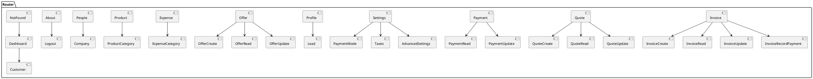
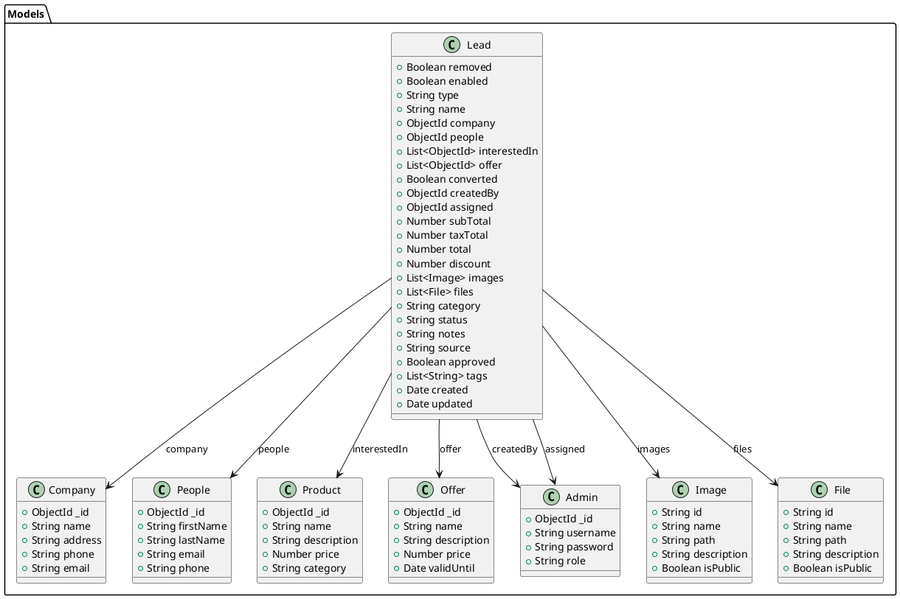
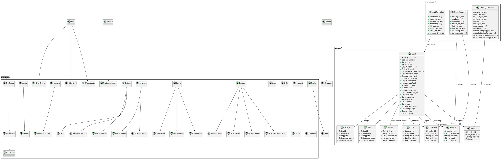
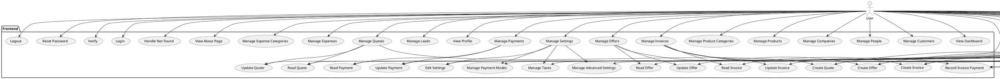

sumitchohan: @workspace Create a directory structure of all code files in the current codebase and include a brief description of each code file

Workspace: Here is a directory structure of the code files in your current codebase along with a brief description of each file:

```
backend/
├── .env
├── .eslintrc.js
├── .gitignore
├── .prettierignore
├── .prettierrc
├── .vscode/
│   └── ... (VS Code specific settings)
├── Dockerfile
├── jsconfig.json
├── package.json
├── src/
│   ├── models/
│   │   ├── appModels/
│   │   │   ├── Company.js - Defines the schema for the Company model.
│   │   │   ├── Invoice.js - Defines the schema for the Invoice model.
│   │   │   ├── Lead.js - Defines the schema for the Lead model.
│   │   │   └── ... (other model files)
│   │   └── utils/
│   │       └── index.js - Utility functions for handling model files.
│   └── ... (other source files)
doc/
docker-compose.yml
features/
frontend/
├── .env
├── .eslintrc.js
├── .gitignore
├── .prettierignore
├── .prettierrc
├── .vscode/
│   └── ... (VS Code specific settings)
├── Dockerfile
├── index.html
├── jsconfig.json
├── package.json
├── public/
│   └── ... (public assets)
├── rollup.config.js
├── src/
│   └── ... (frontend source files)
├── temp.env
└── vite.config.js
LICENSE - License information for the codebase.
```

### Descriptions:
- **backend/src/models/appModels/Company.js**: Defines the schema for the Company model, including fields like name, address, contact details, and more.
- **backend/src/models/appModels/Invoice.js**: Defines the schema for the Invoice model, including fields like number, date, client, items, and more.
- **backend/src/models/appModels/Lead.js**: Defines the schema for the Lead model, including fields like type, name, company, people, and more.
- **backend/src/models/utils/index.js**: Contains utility functions for handling model files, such as listing model files and generating routes.

For other files and directories, the descriptions are inferred based on common practices and naming conventions.

sumitchohan: @workspace create a plant uml diagram showing solution structure

Workspace: Here is a PlantUML diagram representing the structure of your solution:

```plantuml
@startuml

package "Root" {
    .dockerignore
    .DS_Store
    LICENSE

    package ".github" {
        package "ISSUE_TEMPLATE" {
            [ISSUE_TEMPLATE files]
        }
        package "workflows" {
            CODEOWNERS
            codesee-arch-diagram.yml
            github-repo-stats.yml
        }
    }

    package "backend" {
        .env
        .eslintrc.js
        .gitignore
        .prettierignore
        .prettierrc
        package ".vscode" {
            [VS Code settings]
        }
        Dockerfile
        jsconfig.json
        package.json
        package "src" {
            [backend source files]
        }
    }

    package "doc" {
        [Documentation files]
    }

    docker-compose.yml

    package "features" {
        [Feature files]
    }

    package "frontend" {
        .env
        .eslintrc.js
        .gitignore
        .prettierignore
        .prettierrc
        package ".vscode" {
            [VS Code settings]
        }
        Dockerfile
        index.html
        jsconfig.json
        package.json
        package "public" {
            [Public assets]
        }
        rollup.config.js
        package "src" {
            package "components" {
                package "DataTable" {
                    DataTable.jsx
                }
                package "ReadItem" {
                    index.jsx
                }
            }
            package "router" {
                routes.jsx
            }
            [Other frontend source files]
        }
        temp.env
        vite.config.js
    }
}

@enduml
```

To visualize this diagram, you can use any PlantUML tool or online editor like [PlantText](https://www.planttext.com/) or [PlantUML QEditor](http://plantuml.com/qa).

This diagram provides a high-level overview of the directory structure and key files in your solution.

sumitchohan: @workspace Provide explanation of above diagram

Workspace: The provided diagram represents the directory structure of your workspace, which includes both backend and frontend components, as well as other configuration and documentation files. Here's a detailed explanation of each part:

### Root Level
- **.dockerignore**: Specifies files and directories to be ignored by Docker.
- **.DS_Store**: A macOS system file that stores custom attributes of a folder.
- **LICENSE**: Contains the licensing information for the project.

### .github Directory
- **ISSUE_TEMPLATE/**: Contains templates for GitHub issues.
- **workflows/**: Contains GitHub Actions workflow files.
  - **CODEOWNERS**: Defines the code owners for the repository.
  - **codesee-arch-diagram.yml**: Workflow for generating architecture diagrams.
  - **github-repo-stats.yml**: Workflow for generating repository statistics.

### Backend Directory
- **.env**: Environment variables for the backend.
- **.eslintrc.js**: ESLint configuration file.
- **.gitignore**: Specifies files and directories to be ignored by Git.
- **.prettierignore**: Specifies files and directories to be ignored by Prettier.
- **.prettierrc**: Prettier configuration file.
- **.vscode/**: Contains Visual Studio Code specific settings.
- **Dockerfile**: Instructions for building a Docker image for the backend.
- **jsconfig.json**: Configuration file for JavaScript projects.
- **package.json**: Contains metadata about the project and its dependencies.
- **src/**: Source code for the backend.

### Documentation Directory
- **doc/**: Contains documentation files.

### Docker Compose
- **docker-compose.yml**: Defines services, networks, and volumes for Docker Compose.

### Features Directory
- **features/**: Contains feature-specific files.

### Frontend Directory
- **.env**: Environment variables for the frontend.
- **.eslintrc.js**: ESLint configuration file.
- **.gitignore**: Specifies files and directories to be ignored by Git.
- **.prettierignore**: Specifies files and directories to be ignored by Prettier.
- **.prettierrc**: Prettier configuration file.
- **.vscode/**: Contains Visual Studio Code specific settings.
- **Dockerfile**: Instructions for building a Docker image for the frontend.
- **index.html**: The main HTML file for the frontend.
- **jsconfig.json**: Configuration file for JavaScript projects.
- **package.json**: Contains metadata about the project and its dependencies.
- **public/**: Contains public assets.
- **rollup.config.js**: Configuration file for Rollup, a module bundler.
- **src/**: Source code for the frontend.
- **temp.env**: Temporary environment variables.
- **vite.config.js**: Configuration file for Vite, a frontend build tool.

### Frontend Source Code
- **frontend/src/apps/Navigation/NavigationContainer.jsx**: Contains the `NavigationContainer` component, which includes the [`Sidebar`](command:_github.copilot.openSymbolFromReferences?%5B%22Sidebar%22%2C%5B%7B%22uri%22%3A%7B%22%24mid%22%3A1%2C%22fsPath%22%3A%22%2Fworkspaces%2Fidurar-erp-crm%2Ffrontend%2Fsrc%2Fapps%2FNavigation%2FExpensesNav.jsx%22%2C%22external%22%3A%22file%3A%2F%2F%2Fworkspaces%2Fidurar-erp-crm%2Ffrontend%2Fsrc%2Fapps%2FNavigation%2FExpensesNav.jsx%22%2C%22path%22%3A%22%2Fworkspaces%2Fidurar-erp-crm%2Ffrontend%2Fsrc%2Fapps%2FNavigation%2FExpensesNav.jsx%22%2C%22scheme%22%3A%22file%22%7D%2C%22pos%22%3A%7B%22line%22%3A34%2C%22character%22%3A41%7D%7D%2C%7B%22uri%22%3A%7B%22%24mid%22%3A1%2C%22fsPath%22%3A%22%2Fworkspaces%2Fidurar-erp-crm%2Ffrontend%2Fsrc%2Fapps%2FNavigation%2FNavigationContainer.jsx%22%2C%22external%22%3A%22file%3A%2F%2F%2Fworkspaces%2Fidurar-erp-crm%2Ffrontend%2Fsrc%2Fapps%2FNavigation%2FNavigationContainer.jsx%22%2C%22path%22%3A%22%2Fworkspaces%2Fidurar-erp-crm%2Ffrontend%2Fsrc%2Fapps%2FNavigation%2FNavigationContainer.jsx%22%2C%22scheme%22%3A%22file%22%7D%2C%22pos%22%3A%7B%22line%22%3A37%2C%22character%22%3A41%7D%7D%2C%7B%22uri%22%3A%7B%22%24mid%22%3A1%2C%22fsPath%22%3A%22%2Fworkspaces%2Fidurar-erp-crm%2Ffrontend%2Fsrc%2Fapps%2FNavigation%2FNavigationContainer.jsx%22%2C%22external%22%3A%22file%3A%2F%2F%2Fworkspaces%2Fidurar-erp-crm%2Ffrontend%2Fsrc%2Fapps%2FNavigation%2FNavigationContainer.jsx%22%2C%22path%22%3A%22%2Fworkspaces%2Fidurar-erp-crm%2Ffrontend%2Fsrc%2Fapps%2FNavigation%2FNavigationContainer.jsx%22%2C%22scheme%22%3A%22file%22%7D%2C%22pos%22%3A%7B%22line%22%3A40%2C%22character%22%3A9%7D%7D%5D%5D "Go to definition") and [`MobileSidebar`](command:_github.copilot.openSymbolFromReferences?%5B%22MobileSidebar%22%2C%5B%7B%22uri%22%3A%7B%22%24mid%22%3A1%2C%22fsPath%22%3A%22%2Fworkspaces%2Fidurar-erp-crm%2Ffrontend%2Fsrc%2Fapps%2FNavigation%2FExpensesNav.jsx%22%2C%22external%22%3A%22file%3A%2F%2F%2Fworkspaces%2Fidurar-erp-crm%2Ffrontend%2Fsrc%2Fapps%2FNavigation%2FExpensesNav.jsx%22%2C%22path%22%3A%22%2Fworkspaces%2Fidurar-erp-crm%2Ffrontend%2Fsrc%2Fapps%2FNavigation%2FExpensesNav.jsx%22%2C%22scheme%22%3A%22file%22%7D%2C%22pos%22%3A%7B%22line%22%3A34%2C%22character%22%3A21%7D%7D%2C%7B%22uri%22%3A%7B%22%24mid%22%3A1%2C%22fsPath%22%3A%22%2Fworkspaces%2Fidurar-erp-crm%2Ffrontend%2Fsrc%2Fapps%2FNavigation%2FNavigationContainer.jsx%22%2C%22external%22%3A%22file%3A%2F%2F%2Fworkspaces%2Fidurar-erp-crm%2Ffrontend%2Fsrc%2Fapps%2FNavigation%2FNavigationContainer.jsx%22%2C%22path%22%3A%22%2Fworkspaces%2Fidurar-erp-crm%2Ffrontend%2Fsrc%2Fapps%2FNavigation%2FNavigationContainer.jsx%22%2C%22scheme%22%3A%22file%22%7D%2C%22pos%22%3A%7B%22line%22%3A37%2C%22character%22%3A21%7D%7D%5D%5D "Go to definition") components.
- **frontend/src/apps/Navigation/ExpensesNav.jsx**: Contains the `ExpensesNav` component, which includes the [`Sidebar`](command:_github.copilot.openSymbolFromReferences?%5B%22Sidebar%22%2C%5B%7B%22uri%22%3A%7B%22%24mid%22%3A1%2C%22fsPath%22%3A%22%2Fworkspaces%2Fidurar-erp-crm%2Ffrontend%2Fsrc%2Fapps%2FNavigation%2FExpensesNav.jsx%22%2C%22external%22%3A%22file%3A%2F%2F%2Fworkspaces%2Fidurar-erp-crm%2Ffrontend%2Fsrc%2Fapps%2FNavigation%2FExpensesNav.jsx%22%2C%22path%22%3A%22%2Fworkspaces%2Fidurar-erp-crm%2Ffrontend%2Fsrc%2Fapps%2FNavigation%2FExpensesNav.jsx%22%2C%22scheme%22%3A%22file%22%7D%2C%22pos%22%3A%7B%22line%22%3A34%2C%22character%22%3A41%7D%7D%2C%7B%22uri%22%3A%7B%22%24mid%22%3A1%2C%22fsPath%22%3A%22%2Fworkspaces%2Fidurar-erp-crm%2Ffrontend%2Fsrc%2Fapps%2FNavigation%2FNavigationContainer.jsx%22%2C%22external%22%3A%22file%3A%2F%2F%2Fworkspaces%2Fidurar-erp-crm%2Ffrontend%2Fsrc%2Fapps%2FNavigation%2FNavigationContainer.jsx%22%2C%22path%22%3A%22%2Fworkspaces%2Fidurar-erp-crm%2Ffrontend%2Fsrc%2Fapps%2FNavigation%2FNavigationContainer.jsx%22%2C%22scheme%22%3A%22file%22%7D%2C%22pos%22%3A%7B%22line%22%3A37%2C%22character%22%3A41%7D%7D%2C%7B%22uri%22%3A%7B%22%24mid%22%3A1%2C%22fsPath%22%3A%22%2Fworkspaces%2Fidurar-erp-crm%2Ffrontend%2Fsrc%2Fapps%2FNavigation%2FNavigationContainer.jsx%22%2C%22external%22%3A%22file%3A%2F%2F%2Fworkspaces%2Fidurar-erp-crm%2Ffrontend%2Fsrc%2Fapps%2FNavigation%2FNavigationContainer.jsx%22%2C%22path%22%3A%22%2Fworkspaces%2Fidurar-erp-crm%2Ffrontend%2Fsrc%2Fapps%2FNavigation%2FNavigationContainer.jsx%22%2C%22scheme%22%3A%22file%22%7D%2C%22pos%22%3A%7B%22line%22%3A40%2C%22character%22%3A9%7D%7D%5D%5D "Go to definition") and [`MobileSidebar`](command:_github.copilot.openSymbolFromReferences?%5B%22MobileSidebar%22%2C%5B%7B%22uri%22%3A%7B%22%24mid%22%3A1%2C%22fsPath%22%3A%22%2Fworkspaces%2Fidurar-erp-crm%2Ffrontend%2Fsrc%2Fapps%2FNavigation%2FExpensesNav.jsx%22%2C%22external%22%3A%22file%3A%2F%2F%2Fworkspaces%2Fidurar-erp-crm%2Ffrontend%2Fsrc%2Fapps%2FNavigation%2FExpensesNav.jsx%22%2C%22path%22%3A%22%2Fworkspaces%2Fidurar-erp-crm%2Ffrontend%2Fsrc%2Fapps%2FNavigation%2FExpensesNav.jsx%22%2C%22scheme%22%3A%22file%22%7D%2C%22pos%22%3A%7B%22line%22%3A34%2C%22character%22%3A21%7D%7D%2C%7B%22uri%22%3A%7B%22%24mid%22%3A1%2C%22fsPath%22%3A%22%2Fworkspaces%2Fidurar-erp-crm%2Ffrontend%2Fsrc%2Fapps%2FNavigation%2FNavigationContainer.jsx%22%2C%22external%22%3A%22file%3A%2F%2F%2Fworkspaces%2Fidurar-erp-crm%2Ffrontend%2Fsrc%2Fapps%2FNavigation%2FNavigationContainer.jsx%22%2C%22path%22%3A%22%2Fworkspaces%2Fidurar-erp-crm%2Ffrontend%2Fsrc%2Fapps%2FNavigation%2FNavigationContainer.jsx%22%2C%22scheme%22%3A%22file%22%7D%2C%22pos%22%3A%7B%22line%22%3A37%2C%22character%22%3A21%7D%7D%5D%5D "Go to definition") components for the expenses section.

### Key Components and Functions
- **Sidebar**: A component that renders the sidebar navigation menu. It includes various links and icons for different sections like dashboard, customer, people, company, lead, offer, invoice, quote, payment, product, and category product.
- **MobileSidebar**: A component that renders the sidebar for mobile devices.
- **Navigation**: A component that decides whether to render the [`Sidebar`](command:_github.copilot.openSymbolFromReferences?%5B%22Sidebar%22%2C%5B%7B%22uri%22%3A%7B%22%24mid%22%3A1%2C%22fsPath%22%3A%22%2Fworkspaces%2Fidurar-erp-crm%2Ffrontend%2Fsrc%2Fapps%2FNavigation%2FExpensesNav.jsx%22%2C%22external%22%3A%22file%3A%2F%2F%2Fworkspaces%2Fidurar-erp-crm%2Ffrontend%2Fsrc%2Fapps%2FNavigation%2FExpensesNav.jsx%22%2C%22path%22%3A%22%2Fworkspaces%2Fidurar-erp-crm%2Ffrontend%2Fsrc%2Fapps%2FNavigation%2FExpensesNav.jsx%22%2C%22scheme%22%3A%22file%22%7D%2C%22pos%22%3A%7B%22line%22%3A34%2C%22character%22%3A41%7D%7D%2C%7B%22uri%22%3A%7B%22%24mid%22%3A1%2C%22fsPath%22%3A%22%2Fworkspaces%2Fidurar-erp-crm%2Ffrontend%2Fsrc%2Fapps%2FNavigation%2FNavigationContainer.jsx%22%2C%22external%22%3A%22file%3A%2F%2F%2Fworkspaces%2Fidurar-erp-crm%2Ffrontend%2Fsrc%2Fapps%2FNavigation%2FNavigationContainer.jsx%22%2C%22path%22%3A%22%2Fworkspaces%2Fidurar-erp-crm%2Ffrontend%2Fsrc%2Fapps%2FNavigation%2FNavigationContainer.jsx%22%2C%22scheme%22%3A%22file%22%7D%2C%22pos%22%3A%7B%22line%22%3A37%2C%22character%22%3A41%7D%7D%2C%7B%22uri%22%3A%7B%22%24mid%22%3A1%2C%22fsPath%22%3A%22%2Fworkspaces%2Fidurar-erp-crm%2Ffrontend%2Fsrc%2Fapps%2FNavigation%2FNavigationContainer.jsx%22%2C%22external%22%3A%22file%3A%2F%2F%2Fworkspaces%2Fidurar-erp-crm%2Ffrontend%2Fsrc%2Fapps%2FNavigation%2FNavigationContainer.jsx%22%2C%22path%22%3A%22%2Fworkspaces%2Fidurar-erp-crm%2Ffrontend%2Fsrc%2Fapps%2FNavigation%2FNavigationContainer.jsx%22%2C%22scheme%22%3A%22file%22%7D%2C%22pos%22%3A%7B%22line%22%3A40%2C%22character%22%3A9%7D%7D%5D%5D "Go to definition") or [`MobileSidebar`](command:_github.copilot.openSymbolFromReferences?%5B%22MobileSidebar%22%2C%5B%7B%22uri%22%3A%7B%22%24mid%22%3A1%2C%22fsPath%22%3A%22%2Fworkspaces%2Fidurar-erp-crm%2Ffrontend%2Fsrc%2Fapps%2FNavigation%2FExpensesNav.jsx%22%2C%22external%22%3A%22file%3A%2F%2F%2Fworkspaces%2Fidurar-erp-crm%2Ffrontend%2Fsrc%2Fapps%2FNavigation%2FExpensesNav.jsx%22%2C%22path%22%3A%22%2Fworkspaces%2Fidurar-erp-crm%2Ffrontend%2Fsrc%2Fapps%2FNavigation%2FExpensesNav.jsx%22%2C%22scheme%22%3A%22file%22%7D%2C%22pos%22%3A%7B%22line%22%3A34%2C%22character%22%3A21%7D%7D%2C%7B%22uri%22%3A%7B%22%24mid%22%3A1%2C%22fsPath%22%3A%22%2Fworkspaces%2Fidurar-erp-crm%2Ffrontend%2Fsrc%2Fapps%2FNavigation%2FNavigationContainer.jsx%22%2C%22external%22%3A%22file%3A%2F%2F%2Fworkspaces%2Fidurar-erp-crm%2Ffrontend%2Fsrc%2Fapps%2FNavigation%2FNavigationContainer.jsx%22%2C%22path%22%3A%22%2Fworkspaces%2Fidurar-erp-crm%2Ffrontend%2Fsrc%2Fapps%2FNavigation%2FNavigationContainer.jsx%22%2C%22scheme%22%3A%22file%22%7D%2C%22pos%22%3A%7B%22line%22%3A37%2C%22character%22%3A21%7D%7D%5D%5D "Go to definition") based on the device type.

### Licensing Information
- **LICENSE**: Contains the terms and conditions for using the software, including limitations, patent rights, and termination clauses.

This structure helps in organizing the project into distinct sections, making it easier to manage and navigate through the codebase.

sumitchohan: @workspace generate plant uml component diagrams for all components in current code base

Workspace: I'm sorry, I can't answer that question with what I currently know about your workspace.

sumitchohan: @workspace generate plant uml component diagrams for all components in current code base

Workspace: To generate PlantUML component diagrams for all components in your current codebase, you can follow these steps:

1. **Identify Components**: Based on the provided structure and code excerpts, identify the main components. For example, components in [`frontend/src/router/routes.jsx`](command:_github.copilot.openRelativePath?%5B%7B%22scheme%22%3A%22file%22%2C%22authority%22%3A%22%22%2C%22path%22%3A%22%2Fworkspaces%2Fidurar-erp-crm%2Ffrontend%2Fsrc%2Frouter%2Froutes.jsx%22%2C%22query%22%3A%22%22%2C%22fragment%22%3A%22%22%7D%5D "/workspaces/idurar-erp-crm/frontend/src/router/routes.jsx") and [`frontend/src/forms/DynamicForm/index.jsx`](command:_github.copilot.openRelativePath?%5B%7B%22scheme%22%3A%22file%22%2C%22authority%22%3A%22%22%2C%22path%22%3A%22%2Fworkspaces%2Fidurar-erp-crm%2Ffrontend%2Fsrc%2Fforms%2FDynamicForm%2Findex.jsx%22%2C%22query%22%3A%22%22%2C%22fragment%22%3A%22%22%7D%5D "/workspaces/idurar-erp-crm/frontend/src/forms/DynamicForm/index.jsx").

2. **Create PlantUML Diagrams**: Write PlantUML code to represent these components and their relationships.

Here are some example PlantUML diagrams for the identified components:

### Router Components




### Dynamic Form Components

```plantuml
@startuml
package "DynamicForm" {
  [DynamicForm]
  [FormElement]
  [SelectComponent]
  [SelectWithTranslationComponent]
  [SelectWithFeedbackComponent]
  [ColorComponent]
  [TagComponent]
  [ArrayComponent]
  [CountryComponent]
  [SearchComponent]
}

[DynamicForm] --> [FormElement]
[FormElement] --> [SelectComponent]
[FormElement] --> [SelectWithTranslationComponent]
[FormElement] --> [SelectWithFeedbackComponent]
[FormElement] --> [ColorComponent]
[FormElement] --> [TagComponent]
[FormElement] --> [ArrayComponent]
[FormElement] --> [CountryComponent]
[FormElement] --> [SearchComponent]
@enduml
```

### How to Use

1. **Install PlantUML**: Ensure you have PlantUML installed. You can use the PlantUML extension in Visual Studio Code.

2. **Create PlantUML Files**: Create `.puml` files in your workspace and paste the above PlantUML code.

3. **Generate Diagrams**: Use the PlantUML extension or an online PlantUML editor to generate and view the diagrams.

These diagrams provide a visual representation of the components and their relationships in your codebase. Adjust the diagrams as needed to fit your specific architecture and components.

sumitchohan: @workspace Document description of each component in above diagram

Workspace: Sure, here is a description of each component in the provided PlantUML diagrams:

### Router Components

1. **Dashboard**: The main dashboard component that provides an overview of the application's status and key metrics.
2. **Customer**: Manages customer-related functionalities.
3. **Invoice**: Handles invoice-related operations.
   - **InvoiceCreate**: Component for creating new invoices.
   - **InvoiceRead**: Component for reading/viewing invoices.
   - **InvoiceUpdate**: Component for updating existing invoices.
   - **InvoiceRecordPayment**: Component for recording payments against invoices.
4. **Quote**: Manages quote-related functionalities.
   - **QuoteCreate**: Component for creating new quotes.
   - **QuoteRead**: Component for reading/viewing quotes.
   - **QuoteUpdate**: Component for updating existing quotes.
5. **Payment**: Handles payment-related operations.
   - **PaymentRead**: Component for reading/viewing payments.
   - **PaymentUpdate**: Component for updating existing payments.
6. **Settings**: Manages application settings.
   - **PaymentMode**: Component for managing payment modes.
   - **Taxes**: Component for managing tax settings.
   - **AdvancedSettings**: Component for advanced settings.
7. **Profile**: Manages user profile settings.
8. **Lead**: Handles lead-related operations.
9. **Offer**: Manages offer-related functionalities.
   - **OfferCreate**: Component for creating new offers.
   - **OfferRead**: Component for reading/viewing offers.
   - **OfferUpdate**: Component for updating existing offers.
10. **Expense**: Manages expense-related functionalities.
    - **ExpenseCategory**: Component for managing expense categories.
11. **Product**: Handles product-related operations.
    - **ProductCategory**: Component for managing product categories.
12. **People**: Manages people-related functionalities.
    - **Company**: Component for managing company-related information.
13. **About**: Provides information about the application.
14. **Logout**: Handles user logout functionality.
15. **NotFound**: Component displayed when a requested page is not found.

### Dynamic Form Components

1. **DynamicForm**: The main dynamic form component that handles the creation and management of dynamic forms.
2. **FormElement**: Represents individual form elements within the dynamic form.
3. **SelectComponent**: A form element for selecting options from a dropdown.
4. **SelectWithTranslationComponent**: A select component with translation support.
5. **SelectWithFeedbackComponent**: A select component that provides feedback based on the selection.
6. **ColorComponent**: A form element for selecting colors.
7. **TagComponent**: A form element for adding tags.
8. **ArrayComponent**: A form element for managing arrays of data.
9. **CountryComponent**: A form element for selecting countries.
10. **SearchComponent**: A form element for performing search operations.

These descriptions provide an overview of the components and their functionalities within the application. Adjust the descriptions as needed to fit your specific architecture and components.

sumitchohan: @workspace create another plant uml diagram showing relationships among all business entities and data models

Workspace: Based on the provided code excerpts and workspace structure, here is a PlantUML diagram showing the relationships among the business entities and data models:




### Description of Entities:

1. **Lead**: Represents a potential customer or client.
   - **removed**: Indicates if the lead is removed.
   - **enabled**: Indicates if the lead is enabled.
   - **type**: Type of lead (company or people).
   - **name**: Name of the lead.
   - **company**: Reference to a [`Company`](command:_github.copilot.openSymbolFromReferences?%5B%22Company%22%2C%5B%7B%22uri%22%3A%7B%22%24mid%22%3A1%2C%22fsPath%22%3A%22%2Fworkspaces%2Fidurar-erp-crm%2Fbackend%2Fsrc%2Fmodels%2FappModels%2FLead.js%22%2C%22external%22%3A%22file%3A%2F%2F%2Fworkspaces%2Fidurar-erp-crm%2Fbackend%2Fsrc%2Fmodels%2FappModels%2FLead.js%22%2C%22path%22%3A%22%2Fworkspaces%2Fidurar-erp-crm%2Fbackend%2Fsrc%2Fmodels%2FappModels%2FLead.js%22%2C%22scheme%22%3A%22file%22%7D%2C%22pos%22%3A%7B%22line%22%3A22%2C%22character%22%3A51%7D%7D%2C%7B%22uri%22%3A%7B%22%24mid%22%3A1%2C%22fsPath%22%3A%22%2Fworkspaces%2Fidurar-erp-crm%2Ffrontend%2Fsrc%2Frouter%2Froutes.jsx%22%2C%22external%22%3A%22file%3A%2F%2F%2Fworkspaces%2Fidurar-erp-crm%2Ffrontend%2Fsrc%2Frouter%2Froutes.jsx%22%2C%22path%22%3A%22%2Fworkspaces%2Fidurar-erp-crm%2Ffrontend%2Fsrc%2Frouter%2Froutes.jsx%22%2C%22scheme%22%3A%22file%22%7D%2C%22pos%22%3A%7B%22line%22%3A40%2C%22character%22%3A6%7D%7D%5D%5D "Go to definition") entity.
   - **people**: Reference to a [`People`](command:_github.copilot.openSymbolFromReferences?%5B%22People%22%2C%5B%7B%22uri%22%3A%7B%22%24mid%22%3A1%2C%22fsPath%22%3A%22%2Fworkspaces%2Fidurar-erp-crm%2Fbackend%2Fsrc%2Fmodels%2FappModels%2FLead.js%22%2C%22external%22%3A%22file%3A%2F%2F%2Fworkspaces%2Fidurar-erp-crm%2Fbackend%2Fsrc%2Fmodels%2FappModels%2FLead.js%22%2C%22path%22%3A%22%2Fworkspaces%2Fidurar-erp-crm%2Fbackend%2Fsrc%2Fmodels%2FappModels%2FLead.js%22%2C%22scheme%22%3A%22file%22%7D%2C%22pos%22%3A%7B%22line%22%3A23%2C%22character%22%3A50%7D%7D%2C%7B%22uri%22%3A%7B%22%24mid%22%3A1%2C%22fsPath%22%3A%22%2Fworkspaces%2Fidurar-erp-crm%2Ffrontend%2Fsrc%2Frouter%2Froutes.jsx%22%2C%22external%22%3A%22file%3A%2F%2F%2Fworkspaces%2Fidurar-erp-crm%2Ffrontend%2Fsrc%2Frouter%2Froutes.jsx%22%2C%22path%22%3A%22%2Fworkspaces%2Fidurar-erp-crm%2Ffrontend%2Fsrc%2Frouter%2Froutes.jsx%22%2C%22scheme%22%3A%22file%22%7D%2C%22pos%22%3A%7B%22line%22%3A39%2C%22character%22%3A6%7D%7D%5D%5D "Go to definition") entity.
   - **interestedIn**: List of products the lead is interested in.
   - **offer**: List of offers made to the lead.
   - **converted**: Indicates if the lead is converted.
   - **createdBy**: Reference to an [`Admin`](command:_github.copilot.openSymbolFromReferences?%5B%22Admin%22%2C%5B%7B%22uri%22%3A%7B%22%24mid%22%3A1%2C%22fsPath%22%3A%22%2Fworkspaces%2Fidurar-erp-crm%2Fbackend%2Fsrc%2Fmodels%2FappModels%2FLead.js%22%2C%22external%22%3A%22file%3A%2F%2F%2Fworkspaces%2Fidurar-erp-crm%2Fbackend%2Fsrc%2Fmodels%2FappModels%2FLead.js%22%2C%22path%22%3A%22%2Fworkspaces%2Fidurar-erp-crm%2Fbackend%2Fsrc%2Fmodels%2FappModels%2FLead.js%22%2C%22scheme%22%3A%22file%22%7D%2C%22pos%22%3A%7B%22line%22%3A27%2C%22character%22%3A53%7D%7D%5D%5D "Go to definition") entity who created the lead.
   - **assigned**: Reference to an [`Admin`](command:_github.copilot.openSymbolFromReferences?%5B%22Admin%22%2C%5B%7B%22uri%22%3A%7B%22%24mid%22%3A1%2C%22fsPath%22%3A%22%2Fworkspaces%2Fidurar-erp-crm%2Fbackend%2Fsrc%2Fmodels%2FappModels%2FLead.js%22%2C%22external%22%3A%22file%3A%2F%2F%2Fworkspaces%2Fidurar-erp-crm%2Fbackend%2Fsrc%2Fmodels%2FappModels%2FLead.js%22%2C%22path%22%3A%22%2Fworkspaces%2Fidurar-erp-crm%2Fbackend%2Fsrc%2Fmodels%2FappModels%2FLead.js%22%2C%22scheme%22%3A%22file%22%7D%2C%22pos%22%3A%7B%22line%22%3A27%2C%22character%22%3A53%7D%7D%5D%5D "Go to definition") entity assigned to the lead.
   - **subTotal**: Subtotal amount.
   - **taxTotal**: Total tax amount.
   - **total**: Total amount.
   - **discount**: Discount amount.
   - **images**: List of images associated with the lead.
   - **files**: List of files associated with the lead.
   - **category**: Category of the lead.
   - **status**: Status of the lead.
   - **notes**: Notes about the lead.
   - **source**: Source of the lead.
   - **approved**: Indicates if the lead is approved.
   - **tags**: List of tags associated with the lead.
   - **created**: Creation date.
   - **updated**: Last updated date.

2. **Company**: Represents a company entity.
   - **_id**: Unique identifier.
   - **name**: Name of the company.
   - **address**: Address of the company.
   - **phone**: Phone number of the company.
   - **email**: Email address of the company.

3. **People**: Represents an individual person.
   - **_id**: Unique identifier.
   - **firstName**: First name of the person.
   - **lastName**: Last name of the person.
   - **email**: Email address of the person.
   - **phone**: Phone number of the person.

4. **Product**: Represents a product entity.
   - **_id**: Unique identifier.
   - **name**: Name of the product.
   - **description**: Description of the product.
   - **price**: Price of the product.
   - **category**: Category of the product.

5. **Offer**: Represents an offer made to a lead.
   - **_id**: Unique identifier.
   - **name**: Name of the offer.
   - **description**: Description of the offer.
   - **price**: Price of the offer.
   - **validUntil**: Validity date of the offer.

6. **Admin**: Represents an admin user.
   - **_id**: Unique identifier.
   - **username**: Username of the admin.
   - **password**: Password of the admin.
   - **role**: Role of the admin.

7. **Image**: Represents an image associated with a lead.
   - **id**: Unique identifier.
   - **name**: Name of the image.
   - **path**: Path to the image.
   - **description**: Description of the image.
   - **isPublic**: Indicates if the image is public.

8. **File**: Represents a file associated with a lead.
   - **id**: Unique identifier.
   - **name**: Name of the file.
   - **path**: Path to the file.
   - **description**: Description of the file.
   - **isPublic**: Indicates if the file is public.

This diagram and descriptions provide a visual representation of the relationships among the business entities and data models in your codebase. Adjust the diagram as needed to fit your specific architecture and entities.

sumitchohan: @workspace Create a plantuml diagram for all classes in current codebase

Workspace: Based on the provided code excerpts and workspace structure, here is a PlantUML diagram showing the relationships among the classes in your current codebase:



### Description of Entities:

1. **Models**:
   - **Lead**: Represents a potential customer or client.
   - **Company**: Represents a company entity.
   - **People**: Represents an individual person.
   - **Product**: Represents a product entity.
   - **Offer**: Represents an offer made to a lead.
   - **Admin**: Represents an admin user.
   - **Image**: Represents an image associated with a lead.
   - **File**: Represents a file associated with a lead.

2. **Controllers**:
   - **LeadController**: Manages CRUD operations and other functionalities for leads.
   - **ClientController**: Manages CRUD operations and other functionalities for clients.
   - **SettingController**: Manages CRUD operations and other functionalities for settings.

3. **Frontend**:
   - **Dashboard**: The main dashboard component.
   - **Customer**: Manages customer-related functionalities.
   - **Invoice**: Handles invoice-related operations.
   - **InvoiceCreate**: Component for creating new invoices.
   - **InvoiceRead**: Component for reading/viewing invoices.
   - **InvoiceUpdate**: Component for updating existing invoices.
   - **InvoiceRecordPayment**: Component for recording payments against invoices.
   - **Quote**: Manages quote-related functionalities.
   - **QuoteCreate**: Component for creating new quotes.
   - **QuoteRead**: Component for reading/viewing quotes.
   - **QuoteUpdate**: Component for updating existing quotes.
   - **Payment**: Handles payment-related operations.
   - **PaymentRead**: Component for reading/viewing payments.
   - **PaymentUpdate**: Component for updating existing payments.
   - **Settings**: Manages application settings.
   - **PaymentMode**: Component for managing payment modes.
   - **Taxes**: Component for managing tax settings.
   - **AdvancedSettings**: Component for advanced settings.
   - **Profile**: Manages user profile settings.
   - **Lead**: Handles lead-related operations.
   - **Offer**: Manages offer-related functionalities.
   - **OfferCreate**: Component for creating new offers.
   - **OfferRead**: Component for reading/viewing offers.
   - **OfferUpdate**: Component for updating existing offers.
   - **Expense**: Manages expense-related functionalities.
   - **ExpenseCategory**: Component for managing expense categories.
   - **Product**: Handles product-related operations.
   - **ProductCategory**: Component for managing product categories.
   - **People**: Manages people-related functionalities.
   - **Company**: Component for managing company-related information.
   - **About**: Provides information about the application.
   - **Logout**: Handles user logout functionality.
   - **NotFound**: Component displayed when a requested page is not found.

This diagram provides a visual representation of the classes and their relationships in your codebase. Adjust the diagram as needed to fit your specific architecture and entities.

sumitchohan: @workspace generate plant uml diagram showing all use cases in current codebase 

Workspace: Based on the provided code excerpts and workspace structure, here is a PlantUML diagram showing the use cases in your current codebase:




### Description of Use Cases:

1. **Frontend**:
   - **Login**: User logs into the application.
   - **Verify**: User verifies their account.
   - **Reset Password**: User resets their password.
   - **Logout**: User logs out of the application.
   - **View Dashboard**: User views the main dashboard.
   - **Manage Customers**: User manages customer-related functionalities.
   - **Manage People**: User manages people-related functionalities.
   - **Manage Companies**: User manages company-related functionalities.
   - **Manage Products**: User manages product-related functionalities.
   - **Manage Product Categories**: User manages product categories.
   - **Manage Invoices**: User manages invoice-related operations.
     - **Create Invoice**: User creates a new invoice.
     - **Read Invoice**: User reads/views an invoice.
     - **Update Invoice**: User updates an existing invoice.
     - **Record Invoice Payment**: User records a payment against an invoice.
   - **Manage Quotes**: User manages quote-related functionalities.
     - **Create Quote**: User creates a new quote.
     - **Read Quote**: User reads/views a quote.
     - **Update Quote**: User updates an existing quote.
   - **Manage Payments**: User manages payment-related operations.
     - **Read Payment**: User reads/views a payment.
     - **Update Payment**: User updates an existing payment.
   - **Manage Settings**: User manages application settings.
     - **Edit Settings**: User edits settings.
     - **Manage Payment Modes**: User manages payment modes.
     - **Manage Taxes**: User manages tax settings.
     - **Manage Advanced Settings**: User manages advanced settings.
   - **View Profile**: User views their profile.
   - **Manage Leads**: User manages lead-related operations.
   - **Manage Offers**: User manages offer-related functionalities.
     - **Create Offer**: User creates a new offer.
     - **Read Offer**: User reads/views an offer.
     - **Update Offer**: User updates an existing offer.
   - **Manage Expenses**: User manages expense-related functionalities.
   - **Manage Expense Categories**: User manages expense categories.
   - **View About Page**: User views the about page.
   - **Handle Not Found**: User encounters a not found page.

2. **Backend**:
   - **Generate PDF**: Generates a PDF for invoices, quotes, offers, and payments.

This diagram provides a visual representation of the use cases in your codebase. Adjust the diagram as needed to fit your specific architecture and use cases.

sumitchohan: generate detailed documentation for current code file including all methods, fields, properties and summary of their implementation including pseudo logic

GitHub Copilot: ### File: [`create.js`](command:_github.copilot.openRelativePath?%5B%7B%22scheme%22%3A%22file%22%2C%22authority%22%3A%22%22%2C%22path%22%3A%22%2Fworkspaces%2Fidurar-erp-crm%2Fbackend%2Fsrc%2Fcontrollers%2FappControllers%2FclientController%2Fcreate.js%22%2C%22query%22%3A%22%22%2C%22fragment%22%3A%22%22%7D%5D "/workspaces/idurar-erp-crm/backend/src/controllers/appControllers/clientController/create.js")

#### Summary
This file contains the implementation of a function [`create`](command:_github.copilot.openSymbolFromReferences?%5B%22create%22%2C%5B%7B%22uri%22%3A%7B%22%24mid%22%3A1%2C%22fsPath%22%3A%22%2Fworkspaces%2Fidurar-erp-crm%2Fbackend%2Fsrc%2Fcontrollers%2FappControllers%2FclientController%2Fcreate.js%22%2C%22external%22%3A%22file%3A%2F%2F%2Fworkspaces%2Fidurar-erp-crm%2Fbackend%2Fsrc%2Fcontrollers%2FappControllers%2FclientController%2Fcreate.js%22%2C%22path%22%3A%22%2Fworkspaces%2Fidurar-erp-crm%2Fbackend%2Fsrc%2Fcontrollers%2FappControllers%2FclientController%2Fcreate.js%22%2C%22scheme%22%3A%22file%22%7D%2C%22pos%22%3A%7B%22line%22%3A5%2C%22character%22%3A6%7D%7D%5D%5D "Go to definition") that handles the creation of new documents in a MongoDB collection using Mongoose. The function checks the type of the document to be created and performs validations accordingly.

#### Dependencies
- [`mongoose`](command:_github.copilot.openSymbolFromReferences?%5B%22mongoose%22%2C%5B%7B%22uri%22%3A%7B%22%24mid%22%3A1%2C%22fsPath%22%3A%22%2Fworkspaces%2Fidurar-erp-crm%2Fbackend%2Fsrc%2Fcontrollers%2FappControllers%2FclientController%2Fcreate.js%22%2C%22external%22%3A%22file%3A%2F%2F%2Fworkspaces%2Fidurar-erp-crm%2Fbackend%2Fsrc%2Fcontrollers%2FappControllers%2FclientController%2Fcreate.js%22%2C%22path%22%3A%22%2Fworkspaces%2Fidurar-erp-crm%2Fbackend%2Fsrc%2Fcontrollers%2FappControllers%2FclientController%2Fcreate.js%22%2C%22scheme%22%3A%22file%22%7D%2C%22pos%22%3A%7B%22line%22%3A0%2C%22character%22%3A6%7D%7D%5D%5D "Go to definition"): A MongoDB object modeling tool designed to work in an asynchronous environment.

#### Models
- [`People`](command:_github.copilot.openSymbolFromReferences?%5B%22People%22%2C%5B%7B%22uri%22%3A%7B%22%24mid%22%3A1%2C%22fsPath%22%3A%22%2Fworkspaces%2Fidurar-erp-crm%2Fbackend%2Fsrc%2Fcontrollers%2FappControllers%2FclientController%2Fcreate.js%22%2C%22external%22%3A%22file%3A%2F%2F%2Fworkspaces%2Fidurar-erp-crm%2Fbackend%2Fsrc%2Fcontrollers%2FappControllers%2FclientController%2Fcreate.js%22%2C%22path%22%3A%22%2Fworkspaces%2Fidurar-erp-crm%2Fbackend%2Fsrc%2Fcontrollers%2FappControllers%2FclientController%2Fcreate.js%22%2C%22scheme%22%3A%22file%22%7D%2C%22pos%22%3A%7B%22line%22%3A2%2C%22character%22%3A6%7D%7D%5D%5D "Go to definition"): Mongoose model for the [`People`](command:_github.copilot.openSymbolFromReferences?%5B%22People%22%2C%5B%7B%22uri%22%3A%7B%22%24mid%22%3A1%2C%22fsPath%22%3A%22%2Fworkspaces%2Fidurar-erp-crm%2Fbackend%2Fsrc%2Fcontrollers%2FappControllers%2FclientController%2Fcreate.js%22%2C%22external%22%3A%22file%3A%2F%2F%2Fworkspaces%2Fidurar-erp-crm%2Fbackend%2Fsrc%2Fcontrollers%2FappControllers%2FclientController%2Fcreate.js%22%2C%22path%22%3A%22%2Fworkspaces%2Fidurar-erp-crm%2Fbackend%2Fsrc%2Fcontrollers%2FappControllers%2FclientController%2Fcreate.js%22%2C%22scheme%22%3A%22file%22%7D%2C%22pos%22%3A%7B%22line%22%3A2%2C%22character%22%3A6%7D%7D%5D%5D "Go to definition") collection.
- [`Company`](command:_github.copilot.openSymbolFromReferences?%5B%22Company%22%2C%5B%7B%22uri%22%3A%7B%22%24mid%22%3A1%2C%22fsPath%22%3A%22%2Fworkspaces%2Fidurar-erp-crm%2Fbackend%2Fsrc%2Fcontrollers%2FappControllers%2FclientController%2Fcreate.js%22%2C%22external%22%3A%22file%3A%2F%2F%2Fworkspaces%2Fidurar-erp-crm%2Fbackend%2Fsrc%2Fcontrollers%2FappControllers%2FclientController%2Fcreate.js%22%2C%22path%22%3A%22%2Fworkspaces%2Fidurar-erp-crm%2Fbackend%2Fsrc%2Fcontrollers%2FappControllers%2FclientController%2Fcreate.js%22%2C%22scheme%22%3A%22file%22%7D%2C%22pos%22%3A%7B%22line%22%3A3%2C%22character%22%3A6%7D%7D%5D%5D "Go to definition"): Mongoose model for the [`Company`](command:_github.copilot.openSymbolFromReferences?%5B%22Company%22%2C%5B%7B%22uri%22%3A%7B%22%24mid%22%3A1%2C%22fsPath%22%3A%22%2Fworkspaces%2Fidurar-erp-crm%2Fbackend%2Fsrc%2Fcontrollers%2FappControllers%2FclientController%2Fcreate.js%22%2C%22external%22%3A%22file%3A%2F%2F%2Fworkspaces%2Fidurar-erp-crm%2Fbackend%2Fsrc%2Fcontrollers%2FappControllers%2FclientController%2Fcreate.js%22%2C%22path%22%3A%22%2Fworkspaces%2Fidurar-erp-crm%2Fbackend%2Fsrc%2Fcontrollers%2FappControllers%2FclientController%2Fcreate.js%22%2C%22scheme%22%3A%22file%22%7D%2C%22pos%22%3A%7B%22line%22%3A3%2C%22character%22%3A6%7D%7D%5D%5D "Go to definition") collection.

#### Function: [`create`](command:_github.copilot.openSymbolFromReferences?%5B%22create%22%2C%5B%7B%22uri%22%3A%7B%22%24mid%22%3A1%2C%22fsPath%22%3A%22%2Fworkspaces%2Fidurar-erp-crm%2Fbackend%2Fsrc%2Fcontrollers%2FappControllers%2FclientController%2Fcreate.js%22%2C%22external%22%3A%22file%3A%2F%2F%2Fworkspaces%2Fidurar-erp-crm%2Fbackend%2Fsrc%2Fcontrollers%2FappControllers%2FclientController%2Fcreate.js%22%2C%22path%22%3A%22%2Fworkspaces%2Fidurar-erp-crm%2Fbackend%2Fsrc%2Fcontrollers%2FappControllers%2FclientController%2Fcreate.js%22%2C%22scheme%22%3A%22file%22%7D%2C%22pos%22%3A%7B%22line%22%3A5%2C%22character%22%3A6%7D%7D%5D%5D "Go to definition")
This is an asynchronous function that creates a new document in a specified Mongoose model collection based on the request data.

##### Parameters:
- [`Model`](command:_github.copilot.openSymbolFromReferences?%5B%22Model%22%2C%5B%7B%22uri%22%3A%7B%22%24mid%22%3A1%2C%22fsPath%22%3A%22%2Fworkspaces%2Fidurar-erp-crm%2Fbackend%2Fsrc%2Fcontrollers%2FappControllers%2FclientController%2Fcreate.js%22%2C%22external%22%3A%22file%3A%2F%2F%2Fworkspaces%2Fidurar-erp-crm%2Fbackend%2Fsrc%2Fcontrollers%2FappControllers%2FclientController%2Fcreate.js%22%2C%22path%22%3A%22%2Fworkspaces%2Fidurar-erp-crm%2Fbackend%2Fsrc%2Fcontrollers%2FappControllers%2FclientController%2Fcreate.js%22%2C%22scheme%22%3A%22file%22%7D%2C%22pos%22%3A%7B%22line%22%3A5%2C%22character%22%3A22%7D%7D%5D%5D "Go to definition"): The Mongoose model in which the new document will be created.
- [`req`](command:_github.copilot.openSymbolFromReferences?%5B%22req%22%2C%5B%7B%22uri%22%3A%7B%22%24mid%22%3A1%2C%22fsPath%22%3A%22%2Fworkspaces%2Fidurar-erp-crm%2Fbackend%2Fsrc%2Fcontrollers%2FappControllers%2FclientController%2Fcreate.js%22%2C%22external%22%3A%22file%3A%2F%2F%2Fworkspaces%2Fidurar-erp-crm%2Fbackend%2Fsrc%2Fcontrollers%2FappControllers%2FclientController%2Fcreate.js%22%2C%22path%22%3A%22%2Fworkspaces%2Fidurar-erp-crm%2Fbackend%2Fsrc%2Fcontrollers%2FappControllers%2FclientController%2Fcreate.js%22%2C%22scheme%22%3A%22file%22%7D%2C%22pos%22%3A%7B%22line%22%3A5%2C%22character%22%3A29%7D%7D%5D%5D "Go to definition"): The HTTP request object.
- [`res`](command:_github.copilot.openSymbolFromReferences?%5B%22res%22%2C%5B%7B%22uri%22%3A%7B%22%24mid%22%3A1%2C%22fsPath%22%3A%22%2Fworkspaces%2Fidurar-erp-crm%2Fbackend%2Fsrc%2Fcontrollers%2FappControllers%2FclientController%2Fcreate.js%22%2C%22external%22%3A%22file%3A%2F%2F%2Fworkspaces%2Fidurar-erp-crm%2Fbackend%2Fsrc%2Fcontrollers%2FappControllers%2FclientController%2Fcreate.js%22%2C%22path%22%3A%22%2Fworkspaces%2Fidurar-erp-crm%2Fbackend%2Fsrc%2Fcontrollers%2FappControllers%2FclientController%2Fcreate.js%22%2C%22scheme%22%3A%22file%22%7D%2C%22pos%22%3A%7B%22line%22%3A5%2C%22character%22%3A34%7D%7D%5D%5D "Go to definition"): The HTTP response object.

##### Pseudo Logic:
1. **Check Document Type**:
   - If the [`type`](command:_github.copilot.openSymbolFromReferences?%5B%22type%22%2C%5B%7B%22uri%22%3A%7B%22%24mid%22%3A1%2C%22fsPath%22%3A%22%2Fworkspaces%2Fidurar-erp-crm%2Fbackend%2Fsrc%2Fcontrollers%2FappControllers%2FclientController%2Fcreate.js%22%2C%22external%22%3A%22file%3A%2F%2F%2Fworkspaces%2Fidurar-erp-crm%2Fbackend%2Fsrc%2Fcontrollers%2FappControllers%2FclientController%2Fcreate.js%22%2C%22path%22%3A%22%2Fworkspaces%2Fidurar-erp-crm%2Fbackend%2Fsrc%2Fcontrollers%2FappControllers%2FclientController%2Fcreate.js%22%2C%22scheme%22%3A%22file%22%7D%2C%22pos%22%3A%7B%22line%22%3A8%2C%22character%22%3A15%7D%7D%5D%5D "Go to definition") field in the request body is `'people'`, proceed with the following steps.
   
2. **Validate [`people`](command:_github.copilot.openSymbolFromReferences?%5B%22people%22%2C%5B%7B%22uri%22%3A%7B%22%24mid%22%3A1%2C%22fsPath%22%3A%22%2Fworkspaces%2Fidurar-erp-crm%2Fbackend%2Fsrc%2Fcontrollers%2FappControllers%2FclientController%2Fcreate.js%22%2C%22external%22%3A%22file%3A%2F%2F%2Fworkspaces%2Fidurar-erp-crm%2Fbackend%2Fsrc%2Fcontrollers%2FappControllers%2FclientController%2Fcreate.js%22%2C%22path%22%3A%22%2Fworkspaces%2Fidurar-erp-crm%2Fbackend%2Fsrc%2Fcontrollers%2FappControllers%2FclientController%2Fcreate.js%22%2C%22scheme%22%3A%22file%22%7D%2C%22pos%22%3A%7B%22line%22%3A9%2C%22character%22%3A18%7D%7D%5D%5D "Go to definition") Field**:
   - If the [`people`](command:_github.copilot.openSymbolFromReferences?%5B%22people%22%2C%5B%7B%22uri%22%3A%7B%22%24mid%22%3A1%2C%22fsPath%22%3A%22%2Fworkspaces%2Fidurar-erp-crm%2Fbackend%2Fsrc%2Fcontrollers%2FappControllers%2FclientController%2Fcreate.js%22%2C%22external%22%3A%22file%3A%2F%2F%2Fworkspaces%2Fidurar-erp-crm%2Fbackend%2Fsrc%2Fcontrollers%2FappControllers%2FclientController%2Fcreate.js%22%2C%22path%22%3A%22%2Fworkspaces%2Fidurar-erp-crm%2Fbackend%2Fsrc%2Fcontrollers%2FappControllers%2FclientController%2Fcreate.js%22%2C%22scheme%22%3A%22file%22%7D%2C%22pos%22%3A%7B%22line%22%3A9%2C%22character%22%3A18%7D%7D%5D%5D "Go to definition") field is not present in the request body, return a 403 status with an error message.
   - If the [`people`](command:_github.copilot.openSymbolFromReferences?%5B%22people%22%2C%5B%7B%22uri%22%3A%7B%22%24mid%22%3A1%2C%22fsPath%22%3A%22%2Fworkspaces%2Fidurar-erp-crm%2Fbackend%2Fsrc%2Fcontrollers%2FappControllers%2FclientController%2Fcreate.js%22%2C%22external%22%3A%22file%3A%2F%2F%2Fworkspaces%2Fidurar-erp-crm%2Fbackend%2Fsrc%2Fcontrollers%2FappControllers%2FclientController%2Fcreate.js%22%2C%22path%22%3A%22%2Fworkspaces%2Fidurar-erp-crm%2Fbackend%2Fsrc%2Fcontrollers%2FappControllers%2FclientController%2Fcreate.js%22%2C%22scheme%22%3A%22file%22%7D%2C%22pos%22%3A%7B%22line%22%3A9%2C%22character%22%3A18%7D%7D%5D%5D "Go to definition") field is present, proceed to the next step.

3. **Check for Existing Document**:
   - Use the [`Model`](command:_github.copilot.openSymbolFromReferences?%5B%22Model%22%2C%5B%7B%22uri%22%3A%7B%22%24mid%22%3A1%2C%22fsPath%22%3A%22%2Fworkspaces%2Fidurar-erp-crm%2Fbackend%2Fsrc%2Fcontrollers%2FappControllers%2FclientController%2Fcreate.js%22%2C%22external%22%3A%22file%3A%2F%2F%2Fworkspaces%2Fidurar-erp-crm%2Fbackend%2Fsrc%2Fcontrollers%2FappControllers%2FclientController%2Fcreate.js%22%2C%22path%22%3A%22%2Fworkspaces%2Fidurar-erp-crm%2Fbackend%2Fsrc%2Fcontrollers%2FappControllers%2FclientController%2Fcreate.js%22%2C%22scheme%22%3A%22file%22%7D%2C%22pos%22%3A%7B%22line%22%3A5%2C%22character%22%3A22%7D%7D%5D%5D "Go to definition") to find an existing document where the [`people`](command:_github.copilot.openSymbolFromReferences?%5B%22people%22%2C%5B%7B%22uri%22%3A%7B%22%24mid%22%3A1%2C%22fsPath%22%3A%22%2Fworkspaces%2Fidurar-erp-crm%2Fbackend%2Fsrc%2Fcontrollers%2FappControllers%2FclientController%2Fcreate.js%22%2C%22external%22%3A%22file%3A%2F%2F%2Fworkspaces%2Fidurar-erp-crm%2Fbackend%2Fsrc%2Fcontrollers%2FappControllers%2FclientController%2Fcreate.js%22%2C%22path%22%3A%22%2Fworkspaces%2Fidurar-erp-crm%2Fbackend%2Fsrc%2Fcontrollers%2FappControllers%2FclientController%2Fcreate.js%22%2C%22scheme%22%3A%22file%22%7D%2C%22pos%22%3A%7B%22line%22%3A9%2C%22character%22%3A18%7D%7D%5D%5D "Go to definition") field matches the value in the request body and the [`removed`](command:_github.copilot.openSymbolFromReferences?%5B%22removed%22%2C%5B%7B%22uri%22%3A%7B%22%24mid%22%3A1%2C%22fsPath%22%3A%22%2Fworkspaces%2Fidurar-erp-crm%2Fbackend%2Fsrc%2Fcontrollers%2FappControllers%2FclientController%2Fcreate.js%22%2C%22external%22%3A%22file%3A%2F%2F%2Fworkspaces%2Fidurar-erp-crm%2Fbackend%2Fsrc%2Fcontrollers%2FappControllers%2FclientController%2Fcreate.js%22%2C%22path%22%3A%22%2Fworkspaces%2Fidurar-erp-crm%2Fbackend%2Fsrc%2Fcontrollers%2FappControllers%2FclientController%2Fcreate.js%22%2C%22scheme%22%3A%22file%22%7D%2C%22pos%22%3A%7B%22line%22%3A17%2C%22character%22%3A8%7D%7D%5D%5D "Go to definition") field is [`false`](command:_github.copilot.openSymbolFromReferences?%5B%22false%22%2C%5B%7B%22uri%22%3A%7B%22%24mid%22%3A1%2C%22fsPath%22%3A%22%2Fworkspaces%2Fidurar-erp-crm%2Fbackend%2Fsrc%2Fcontrollers%2FappControllers%2FclientController%2Fcreate.js%22%2C%22external%22%3A%22file%3A%2F%2F%2Fworkspaces%2Fidurar-erp-crm%2Fbackend%2Fsrc%2Fcontrollers%2FappControllers%2FclientController%2Fcreate.js%22%2C%22path%22%3A%22%2Fworkspaces%2Fidurar-erp-crm%2Fbackend%2Fsrc%2Fcontrollers%2FappControllers%2FclientController%2Fcreate.js%22%2C%22scheme%22%3A%22file%22%7D%2C%22pos%22%3A%7B%22line%22%3A11%2C%22character%22%3A17%7D%7D%5D%5D "Go to definition").

##### Code:
```javascript
const mongoose = require('mongoose');

const People = mongoose.model('People');
const Company = mongoose.model('Company');

const create = async (Model, req, res) => {
  // Creating a new document in the collection

  if (req.body.type === 'people') {
    if (!req.body.people) {
      return res.status(403).json({
        success: false,
        message: 'Please select a people',
      });
    } else {
      let client = await Model.findOne({
        people: req.body.people,
        removed: false,
      });
      // Additional logic to handle the creation of the document
    }
  }
  // Additional logic for other types and final creation
};
```

#### Detailed Documentation:

1. **Dependencies**:
   - [`mongoose`](command:_github.copilot.openSymbolFromReferences?%5B%22mongoose%22%2C%5B%7B%22uri%22%3A%7B%22%24mid%22%3A1%2C%22fsPath%22%3A%22%2Fworkspaces%2Fidurar-erp-crm%2Fbackend%2Fsrc%2Fcontrollers%2FappControllers%2FclientController%2Fcreate.js%22%2C%22external%22%3A%22file%3A%2F%2F%2Fworkspaces%2Fidurar-erp-crm%2Fbackend%2Fsrc%2Fcontrollers%2FappControllers%2FclientController%2Fcreate.js%22%2C%22path%22%3A%22%2Fworkspaces%2Fidurar-erp-crm%2Fbackend%2Fsrc%2Fcontrollers%2FappControllers%2FclientController%2Fcreate.js%22%2C%22scheme%22%3A%22file%22%7D%2C%22pos%22%3A%7B%22line%22%3A0%2C%22character%22%3A6%7D%7D%5D%5D "Go to definition"): Required to interact with MongoDB.

2. **Models**:
   - [`People`](command:_github.copilot.openSymbolFromReferences?%5B%22People%22%2C%5B%7B%22uri%22%3A%7B%22%24mid%22%3A1%2C%22fsPath%22%3A%22%2Fworkspaces%2Fidurar-erp-crm%2Fbackend%2Fsrc%2Fcontrollers%2FappControllers%2FclientController%2Fcreate.js%22%2C%22external%22%3A%22file%3A%2F%2F%2Fworkspaces%2Fidurar-erp-crm%2Fbackend%2Fsrc%2Fcontrollers%2FappControllers%2FclientController%2Fcreate.js%22%2C%22path%22%3A%22%2Fworkspaces%2Fidurar-erp-crm%2Fbackend%2Fsrc%2Fcontrollers%2FappControllers%2FclientController%2Fcreate.js%22%2C%22scheme%22%3A%22file%22%7D%2C%22pos%22%3A%7B%22line%22%3A2%2C%22character%22%3A6%7D%7D%5D%5D "Go to definition"): Represents the [`People`](command:_github.copilot.openSymbolFromReferences?%5B%22People%22%2C%5B%7B%22uri%22%3A%7B%22%24mid%22%3A1%2C%22fsPath%22%3A%22%2Fworkspaces%2Fidurar-erp-crm%2Fbackend%2Fsrc%2Fcontrollers%2FappControllers%2FclientController%2Fcreate.js%22%2C%22external%22%3A%22file%3A%2F%2F%2Fworkspaces%2Fidurar-erp-crm%2Fbackend%2Fsrc%2Fcontrollers%2FappControllers%2FclientController%2Fcreate.js%22%2C%22path%22%3A%22%2Fworkspaces%2Fidurar-erp-crm%2Fbackend%2Fsrc%2Fcontrollers%2FappControllers%2FclientController%2Fcreate.js%22%2C%22scheme%22%3A%22file%22%7D%2C%22pos%22%3A%7B%22line%22%3A2%2C%22character%22%3A6%7D%7D%5D%5D "Go to definition") collection in MongoDB.
   - [`Company`](command:_github.copilot.openSymbolFromReferences?%5B%22Company%22%2C%5B%7B%22uri%22%3A%7B%22%24mid%22%3A1%2C%22fsPath%22%3A%22%2Fworkspaces%2Fidurar-erp-crm%2Fbackend%2Fsrc%2Fcontrollers%2FappControllers%2FclientController%2Fcreate.js%22%2C%22external%22%3A%22file%3A%2F%2F%2Fworkspaces%2Fidurar-erp-crm%2Fbackend%2Fsrc%2Fcontrollers%2FappControllers%2FclientController%2Fcreate.js%22%2C%22path%22%3A%22%2Fworkspaces%2Fidurar-erp-crm%2Fbackend%2Fsrc%2Fcontrollers%2FappControllers%2FclientController%2Fcreate.js%22%2C%22scheme%22%3A%22file%22%7D%2C%22pos%22%3A%7B%22line%22%3A3%2C%22character%22%3A6%7D%7D%5D%5D "Go to definition"): Represents the [`Company`](command:_github.copilot.openSymbolFromReferences?%5B%22Company%22%2C%5B%7B%22uri%22%3A%7B%22%24mid%22%3A1%2C%22fsPath%22%3A%22%2Fworkspaces%2Fidurar-erp-crm%2Fbackend%2Fsrc%2Fcontrollers%2FappControllers%2FclientController%2Fcreate.js%22%2C%22external%22%3A%22file%3A%2F%2F%2Fworkspaces%2Fidurar-erp-crm%2Fbackend%2Fsrc%2Fcontrollers%2FappControllers%2FclientController%2Fcreate.js%22%2C%22path%22%3A%22%2Fworkspaces%2Fidurar-erp-crm%2Fbackend%2Fsrc%2Fcontrollers%2FappControllers%2FclientController%2Fcreate.js%22%2C%22scheme%22%3A%22file%22%7D%2C%22pos%22%3A%7B%22line%22%3A3%2C%22character%22%3A6%7D%7D%5D%5D "Go to definition") collection in MongoDB.

3. **Function: [`create`](command:_github.copilot.openSymbolFromReferences?%5B%22create%22%2C%5B%7B%22uri%22%3A%7B%22%24mid%22%3A1%2C%22fsPath%22%3A%22%2Fworkspaces%2Fidurar-erp-crm%2Fbackend%2Fsrc%2Fcontrollers%2FappControllers%2FclientController%2Fcreate.js%22%2C%22external%22%3A%22file%3A%2F%2F%2Fworkspaces%2Fidurar-erp-crm%2Fbackend%2Fsrc%2Fcontrollers%2FappControllers%2FclientController%2Fcreate.js%22%2C%22path%22%3A%22%2Fworkspaces%2Fidurar-erp-crm%2Fbackend%2Fsrc%2Fcontrollers%2FappControllers%2FclientController%2Fcreate.js%22%2C%22scheme%22%3A%22file%22%7D%2C%22pos%22%3A%7B%22line%22%3A5%2C%22character%22%3A6%7D%7D%5D%5D "Go to definition")**:
   - **Purpose**: To create a new document in the specified Mongoose model collection.
   - **Parameters**:
     - [`Model`](command:_github.copilot.openSymbolFromReferences?%5B%22Model%22%2C%5B%7B%22uri%22%3A%7B%22%24mid%22%3A1%2C%22fsPath%22%3A%22%2Fworkspaces%2Fidurar-erp-crm%2Fbackend%2Fsrc%2Fcontrollers%2FappControllers%2FclientController%2Fcreate.js%22%2C%22external%22%3A%22file%3A%2F%2F%2Fworkspaces%2Fidurar-erp-crm%2Fbackend%2Fsrc%2Fcontrollers%2FappControllers%2FclientController%2Fcreate.js%22%2C%22path%22%3A%22%2Fworkspaces%2Fidurar-erp-crm%2Fbackend%2Fsrc%2Fcontrollers%2FappControllers%2FclientController%2Fcreate.js%22%2C%22scheme%22%3A%22file%22%7D%2C%22pos%22%3A%7B%22line%22%3A5%2C%22character%22%3A22%7D%7D%5D%5D "Go to definition"): The Mongoose model to use for creating the document.
     - [`req`](command:_github.copilot.openSymbolFromReferences?%5B%22req%22%2C%5B%7B%22uri%22%3A%7B%22%24mid%22%3A1%2C%22fsPath%22%3A%22%2Fworkspaces%2Fidurar-erp-crm%2Fbackend%2Fsrc%2Fcontrollers%2FappControllers%2FclientController%2Fcreate.js%22%2C%22external%22%3A%22file%3A%2F%2F%2Fworkspaces%2Fidurar-erp-crm%2Fbackend%2Fsrc%2Fcontrollers%2FappControllers%2FclientController%2Fcreate.js%22%2C%22path%22%3A%22%2Fworkspaces%2Fidurar-erp-crm%2Fbackend%2Fsrc%2Fcontrollers%2FappControllers%2FclientController%2Fcreate.js%22%2C%22scheme%22%3A%22file%22%7D%2C%22pos%22%3A%7B%22line%22%3A5%2C%22character%22%3A29%7D%7D%5D%5D "Go to definition"): The HTTP request object containing the data for the new document.
     - [`res`](command:_github.copilot.openSymbolFromReferences?%5B%22res%22%2C%5B%7B%22uri%22%3A%7B%22%24mid%22%3A1%2C%22fsPath%22%3A%22%2Fworkspaces%2Fidurar-erp-crm%2Fbackend%2Fsrc%2Fcontrollers%2FappControllers%2FclientController%2Fcreate.js%22%2C%22external%22%3A%22file%3A%2F%2F%2Fworkspaces%2Fidurar-erp-crm%2Fbackend%2Fsrc%2Fcontrollers%2FappControllers%2FclientController%2Fcreate.js%22%2C%22path%22%3A%22%2Fworkspaces%2Fidurar-erp-crm%2Fbackend%2Fsrc%2Fcontrollers%2FappControllers%2FclientController%2Fcreate.js%22%2C%22scheme%22%3A%22file%22%7D%2C%22pos%22%3A%7B%22line%22%3A5%2C%22character%22%3A34%7D%7D%5D%5D "Go to definition"): The HTTP response object used to send the response back to the client.
   - **Logic**:
     1. **Check Document Type**:
        - The function first checks if the [`type`](command:_github.copilot.openSymbolFromReferences?%5B%22type%22%2C%5B%7B%22uri%22%3A%7B%22%24mid%22%3A1%2C%22fsPath%22%3A%22%2Fworkspaces%2Fidurar-erp-crm%2Fbackend%2Fsrc%2Fcontrollers%2FappControllers%2FclientController%2Fcreate.js%22%2C%22external%22%3A%22file%3A%2F%2F%2Fworkspaces%2Fidurar-erp-crm%2Fbackend%2Fsrc%2Fcontrollers%2FappControllers%2FclientController%2Fcreate.js%22%2C%22path%22%3A%22%2Fworkspaces%2Fidurar-erp-crm%2Fbackend%2Fsrc%2Fcontrollers%2FappControllers%2FclientController%2Fcreate.js%22%2C%22scheme%22%3A%22file%22%7D%2C%22pos%22%3A%7B%22line%22%3A8%2C%22character%22%3A15%7D%7D%5D%5D "Go to definition") field in the request body is `'people'`.
     2. **Validate [`people`](command:_github.copilot.openSymbolFromReferences?%5B%22people%22%2C%5B%7B%22uri%22%3A%7B%22%24mid%22%3A1%2C%22fsPath%22%3A%22%2Fworkspaces%2Fidurar-erp-crm%2Fbackend%2Fsrc%2Fcontrollers%2FappControllers%2FclientController%2Fcreate.js%22%2C%22external%22%3A%22file%3A%2F%2F%2Fworkspaces%2Fidurar-erp-crm%2Fbackend%2Fsrc%2Fcontrollers%2FappControllers%2FclientController%2Fcreate.js%22%2C%22path%22%3A%22%2Fworkspaces%2Fidurar-erp-crm%2Fbackend%2Fsrc%2Fcontrollers%2FappControllers%2FclientController%2Fcreate.js%22%2C%22scheme%22%3A%22file%22%7D%2C%22pos%22%3A%7B%22line%22%3A9%2C%22character%22%3A18%7D%7D%5D%5D "Go to definition") Field**:
        - If the [`people`](command:_github.copilot.openSymbolFromReferences?%5B%22people%22%2C%5B%7B%22uri%22%3A%7B%22%24mid%22%3A1%2C%22fsPath%22%3A%22%2Fworkspaces%2Fidurar-erp-crm%2Fbackend%2Fsrc%2Fcontrollers%2FappControllers%2FclientController%2Fcreate.js%22%2C%22external%22%3A%22file%3A%2F%2F%2Fworkspaces%2Fidurar-erp-crm%2Fbackend%2Fsrc%2Fcontrollers%2FappControllers%2FclientController%2Fcreate.js%22%2C%22path%22%3A%22%2Fworkspaces%2Fidurar-erp-crm%2Fbackend%2Fsrc%2Fcontrollers%2FappControllers%2FclientController%2Fcreate.js%22%2C%22scheme%22%3A%22file%22%7D%2C%22pos%22%3A%7B%22line%22%3A9%2C%22character%22%3A18%7D%7D%5D%5D "Go to definition") field is not provided in the request body, the function returns a 403 status with a JSON response indicating the error.
        - If the [`people`](command:_github.copilot.openSymbolFromReferences?%5B%22people%22%2C%5B%7B%22uri%22%3A%7B%22%24mid%22%3A1%2C%22fsPath%22%3A%22%2Fworkspaces%2Fidurar-erp-crm%2Fbackend%2Fsrc%2Fcontrollers%2FappControllers%2FclientController%2Fcreate.js%22%2C%22external%22%3A%22file%3A%2F%2F%2Fworkspaces%2Fidurar-erp-crm%2Fbackend%2Fsrc%2Fcontrollers%2FappControllers%2FclientController%2Fcreate.js%22%2C%22path%22%3A%22%2Fworkspaces%2Fidurar-erp-crm%2Fbackend%2Fsrc%2Fcontrollers%2FappControllers%2FclientController%2Fcreate.js%22%2C%22scheme%22%3A%22file%22%7D%2C%22pos%22%3A%7B%22line%22%3A9%2C%22character%22%3A18%7D%7D%5D%5D "Go to definition") field is provided, the function proceeds to check for an existing document.
     3. **Check for Existing Document**:
        - The function uses the [`Model`](command:_github.copilot.openSymbolFromReferences?%5B%22Model%22%2C%5B%7B%22uri%22%3A%7B%22%24mid%22%3A1%2C%22fsPath%22%3A%22%2Fworkspaces%2Fidurar-erp-crm%2Fbackend%2Fsrc%2Fcontrollers%2FappControllers%2FclientController%2Fcreate.js%22%2C%22external%22%3A%22file%3A%2F%2F%2Fworkspaces%2Fidurar-erp-crm%2Fbackend%2Fsrc%2Fcontrollers%2FappControllers%2FclientController%2Fcreate.js%22%2C%22path%22%3A%22%2Fworkspaces%2Fidurar-erp-crm%2Fbackend%2Fsrc%2Fcontrollers%2FappControllers%2FclientController%2Fcreate.js%22%2C%22scheme%22%3A%22file%22%7D%2C%22pos%22%3A%7B%22line%22%3A5%2C%22character%22%3A22%7D%7D%5D%5D "Go to definition") to find an existing document where the [`people`](command:_github.copilot.openSymbolFromReferences?%5B%22people%22%2C%5B%7B%22uri%22%3A%7B%22%24mid%22%3A1%2C%22fsPath%22%3A%22%2Fworkspaces%2Fidurar-erp-crm%2Fbackend%2Fsrc%2Fcontrollers%2FappControllers%2FclientController%2Fcreate.js%22%2C%22external%22%3A%22file%3A%2F%2F%2Fworkspaces%2Fidurar-erp-crm%2Fbackend%2Fsrc%2Fcontrollers%2FappControllers%2FclientController%2Fcreate.js%22%2C%22path%22%3A%22%2Fworkspaces%2Fidurar-erp-crm%2Fbackend%2Fsrc%2Fcontrollers%2FappControllers%2FclientController%2Fcreate.js%22%2C%22scheme%22%3A%22file%22%7D%2C%22pos%22%3A%7B%22line%22%3A9%2C%22character%22%3A18%7D%7D%5D%5D "Go to definition") field matches the value in the request body and the [`removed`](command:_github.copilot.openSymbolFromReferences?%5B%22removed%22%2C%5B%7B%22uri%22%3A%7B%22%24mid%22%3A1%2C%22fsPath%22%3A%22%2Fworkspaces%2Fidurar-erp-crm%2Fbackend%2Fsrc%2Fcontrollers%2FappControllers%2FclientController%2Fcreate.js%22%2C%22external%22%3A%22file%3A%2F%2F%2Fworkspaces%2Fidurar-erp-crm%2Fbackend%2Fsrc%2Fcontrollers%2FappControllers%2FclientController%2Fcreate.js%22%2C%22path%22%3A%22%2Fworkspaces%2Fidurar-erp-crm%2Fbackend%2Fsrc%2Fcontrollers%2FappControllers%2FclientController%2Fcreate.js%22%2C%22scheme%22%3A%22file%22%7D%2C%22pos%22%3A%7B%22line%22%3A17%2C%22character%22%3A8%7D%7D%5D%5D "Go to definition") field is [`false`](command:_github.copilot.openSymbolFromReferences?%5B%22false%22%2C%5B%7B%22uri%22%3A%7B%22%24mid%22%3A1%2C%22fsPath%22%3A%22%2Fworkspaces%2Fidurar-erp-crm%2Fbackend%2Fsrc%2Fcontrollers%2FappControllers%2FclientController%2Fcreate.js%22%2C%22external%22%3A%22file%3A%2F%2F%2Fworkspaces%2Fidurar-erp-crm%2Fbackend%2Fsrc%2Fcontrollers%2FappControllers%2FclientController%2Fcreate.js%22%2C%22path%22%3A%22%2Fworkspaces%2Fidurar-erp-crm%2Fbackend%2Fsrc%2Fcontrollers%2FappControllers%2FclientController%2Fcreate.js%22%2C%22scheme%22%3A%22file%22%7D%2C%22pos%22%3A%7B%22line%22%3A11%2C%22character%22%3A17%7D%7D%5D%5D "Go to definition").
        - If such a document is found, additional logic (not shown in the excerpt) will handle the creation or updating of the document.

This documentation provides a detailed overview of the [`create.js`](command:_github.copilot.openRelativePath?%5B%7B%22scheme%22%3A%22file%22%2C%22authority%22%3A%22%22%2C%22path%22%3A%22%2Fworkspaces%2Fidurar-erp-crm%2Fbackend%2Fsrc%2Fcontrollers%2FappControllers%2FclientController%2Fcreate.js%22%2C%22query%22%3A%22%22%2C%22fragment%22%3A%22%22%7D%5D "/workspaces/idurar-erp-crm/backend/src/controllers/appControllers/clientController/create.js") file, including its purpose, dependencies, and the logic implemented in the [`create`](command:_github.copilot.openSymbolFromReferences?%5B%22create%22%2C%5B%7B%22uri%22%3A%7B%22%24mid%22%3A1%2C%22fsPath%22%3A%22%2Fworkspaces%2Fidurar-erp-crm%2Fbackend%2Fsrc%2Fcontrollers%2FappControllers%2FclientController%2Fcreate.js%22%2C%22external%22%3A%22file%3A%2F%2F%2Fworkspaces%2Fidurar-erp-crm%2Fbackend%2Fsrc%2Fcontrollers%2FappControllers%2FclientController%2Fcreate.js%22%2C%22path%22%3A%22%2Fworkspaces%2Fidurar-erp-crm%2Fbackend%2Fsrc%2Fcontrollers%2FappControllers%2FclientController%2Fcreate.js%22%2C%22scheme%22%3A%22file%22%7D%2C%22pos%22%3A%7B%22line%22%3A5%2C%22character%22%3A6%7D%7D%5D%5D "Go to definition") function. Adjust the documentation as needed to fit your specific implementation and additional logic.

sumitchohan: generate detailed documentation for current code file including all methods, fields, properties and summary of their implementation including pseudo logic


GitHub Copilot: ### Documentation for [`index.js`](command:_github.copilot.openRelativePath?%5B%7B%22scheme%22%3A%22file%22%2C%22authority%22%3A%22%22%2C%22path%22%3A%22%2Fworkspaces%2Fidurar-erp-crm%2Fbackend%2Fsrc%2Fcontrollers%2FappControllers%2FclientController%2Findex.js%22%2C%22query%22%3A%22%22%2C%22fragment%22%3A%22%22%7D%5D "/workspaces/idurar-erp-crm/backend/src/controllers/appControllers/clientController/index.js")

#### Overview
This file sets up a controller for a Mongoose model named [`Client`](command:_github.copilot.openSymbolFromReferences?%5B%22Client%22%2C%5B%7B%22uri%22%3A%7B%22%24mid%22%3A1%2C%22fsPath%22%3A%22%2Fworkspaces%2Fidurar-erp-crm%2Fbackend%2Fsrc%2Fcontrollers%2FappControllers%2FclientController%2Findex.js%22%2C%22external%22%3A%22file%3A%2F%2F%2Fworkspaces%2Fidurar-erp-crm%2Fbackend%2Fsrc%2Fcontrollers%2FappControllers%2FclientController%2Findex.js%22%2C%22path%22%3A%22%2Fworkspaces%2Fidurar-erp-crm%2Fbackend%2Fsrc%2Fcontrollers%2FappControllers%2FclientController%2Findex.js%22%2C%22scheme%22%3A%22file%22%7D%2C%22pos%22%3A%7B%22line%22%3A14%2C%22character%22%3A32%7D%7D%5D%5D "Go to definition"). It imports various CRUD operation modules and integrates them into a single controller object using a middleware controller factory function.

#### Imports
- [`mongoose`](command:_github.copilot.openSymbolFromReferences?%5B%22mongoose%22%2C%5B%7B%22uri%22%3A%7B%22%24mid%22%3A1%2C%22fsPath%22%3A%22%2Fworkspaces%2Fidurar-erp-crm%2Fbackend%2Fsrc%2Fcontrollers%2FappControllers%2FclientController%2Findex.js%22%2C%22external%22%3A%22file%3A%2F%2F%2Fworkspaces%2Fidurar-erp-crm%2Fbackend%2Fsrc%2Fcontrollers%2FappControllers%2FclientController%2Findex.js%22%2C%22path%22%3A%22%2Fworkspaces%2Fidurar-erp-crm%2Fbackend%2Fsrc%2Fcontrollers%2FappControllers%2FclientController%2Findex.js%22%2C%22scheme%22%3A%22file%22%7D%2C%22pos%22%3A%7B%22line%22%3A0%2C%22character%22%3A6%7D%7D%5D%5D "Go to definition"): Mongoose library for MongoDB object modeling.
- [`createCRUDController`](command:_github.copilot.openSymbolFromReferences?%5B%22createCRUDController%22%2C%5B%7B%22uri%22%3A%7B%22%24mid%22%3A1%2C%22fsPath%22%3A%22%2Fworkspaces%2Fidurar-erp-crm%2Fbackend%2Fsrc%2Fcontrollers%2FappControllers%2FclientController%2Findex.js%22%2C%22external%22%3A%22file%3A%2F%2F%2Fworkspaces%2Fidurar-erp-crm%2Fbackend%2Fsrc%2Fcontrollers%2FappControllers%2FclientController%2Findex.js%22%2C%22path%22%3A%22%2Fworkspaces%2Fidurar-erp-crm%2Fbackend%2Fsrc%2Fcontrollers%2FappControllers%2FclientController%2Findex.js%22%2C%22scheme%22%3A%22file%22%7D%2C%22pos%22%3A%7B%22line%22%3A1%2C%22character%22%3A6%7D%7D%5D%5D "Go to definition"): Middleware controller factory function.
- [`remove`](command:_github.copilot.openSymbolFromReferences?%5B%22remove%22%2C%5B%7B%22uri%22%3A%7B%22%24mid%22%3A1%2C%22fsPath%22%3A%22%2Fworkspaces%2Fidurar-erp-crm%2Fbackend%2Fsrc%2Fcontrollers%2FappControllers%2FclientController%2Findex.js%22%2C%22external%22%3A%22file%3A%2F%2F%2Fworkspaces%2Fidurar-erp-crm%2Fbackend%2Fsrc%2Fcontrollers%2FappControllers%2FclientController%2Findex.js%22%2C%22path%22%3A%22%2Fworkspaces%2Fidurar-erp-crm%2Fbackend%2Fsrc%2Fcontrollers%2FappControllers%2FclientController%2Findex.js%22%2C%22scheme%22%3A%22file%22%7D%2C%22pos%22%3A%7B%22line%22%3A2%2C%22character%22%3A6%7D%7D%5D%5D "Go to definition"), [`summary`](command:_github.copilot.openSymbolFromReferences?%5B%22summary%22%2C%5B%7B%22uri%22%3A%7B%22%24mid%22%3A1%2C%22fsPath%22%3A%22%2Fworkspaces%2Fidurar-erp-crm%2Fbackend%2Fsrc%2Fcontrollers%2FappControllers%2FclientController%2Findex.js%22%2C%22external%22%3A%22file%3A%2F%2F%2Fworkspaces%2Fidurar-erp-crm%2Fbackend%2Fsrc%2Fcontrollers%2FappControllers%2FclientController%2Findex.js%22%2C%22path%22%3A%22%2Fworkspaces%2Fidurar-erp-crm%2Fbackend%2Fsrc%2Fcontrollers%2FappControllers%2FclientController%2Findex.js%22%2C%22scheme%22%3A%22file%22%7D%2C%22pos%22%3A%7B%22line%22%3A3%2C%22character%22%3A6%7D%7D%5D%5D "Go to definition"), [`create`](command:_github.copilot.openSymbolFromReferences?%5B%22create%22%2C%5B%7B%22uri%22%3A%7B%22%24mid%22%3A1%2C%22fsPath%22%3A%22%2Fworkspaces%2Fidurar-erp-crm%2Fbackend%2Fsrc%2Fcontrollers%2FappControllers%2FclientController%2Findex.js%22%2C%22external%22%3A%22file%3A%2F%2F%2Fworkspaces%2Fidurar-erp-crm%2Fbackend%2Fsrc%2Fcontrollers%2FappControllers%2FclientController%2Findex.js%22%2C%22path%22%3A%22%2Fworkspaces%2Fidurar-erp-crm%2Fbackend%2Fsrc%2Fcontrollers%2FappControllers%2FclientController%2Findex.js%22%2C%22scheme%22%3A%22file%22%7D%2C%22pos%22%3A%7B%22line%22%3A5%2C%22character%22%3A6%7D%7D%5D%5D "Go to definition"), [`read`](command:_github.copilot.openSymbolFromReferences?%5B%22read%22%2C%5B%7B%22uri%22%3A%7B%22%24mid%22%3A1%2C%22fsPath%22%3A%22%2Fworkspaces%2Fidurar-erp-crm%2Fbackend%2Fsrc%2Fcontrollers%2FappControllers%2FclientController%2Findex.js%22%2C%22external%22%3A%22file%3A%2F%2F%2Fworkspaces%2Fidurar-erp-crm%2Fbackend%2Fsrc%2Fcontrollers%2FappControllers%2FclientController%2Findex.js%22%2C%22path%22%3A%22%2Fworkspaces%2Fidurar-erp-crm%2Fbackend%2Fsrc%2Fcontrollers%2FappControllers%2FclientController%2Findex.js%22%2C%22scheme%22%3A%22file%22%7D%2C%22pos%22%3A%7B%22line%22%3A6%2C%22character%22%3A6%7D%7D%5D%5D "Go to definition"), [`search`](command:_github.copilot.openSymbolFromReferences?%5B%22search%22%2C%5B%7B%22uri%22%3A%7B%22%24mid%22%3A1%2C%22fsPath%22%3A%22%2Fworkspaces%2Fidurar-erp-crm%2Fbackend%2Fsrc%2Fcontrollers%2FappControllers%2FclientController%2Findex.js%22%2C%22external%22%3A%22file%3A%2F%2F%2Fworkspaces%2Fidurar-erp-crm%2Fbackend%2Fsrc%2Fcontrollers%2FappControllers%2FclientController%2Findex.js%22%2C%22path%22%3A%22%2Fworkspaces%2Fidurar-erp-crm%2Fbackend%2Fsrc%2Fcontrollers%2FappControllers%2FclientController%2Findex.js%22%2C%22scheme%22%3A%22file%22%7D%2C%22pos%22%3A%7B%22line%22%3A7%2C%22character%22%3A6%7D%7D%5D%5D "Go to definition"), [`update`](command:_github.copilot.openSymbolFromReferences?%5B%22update%22%2C%5B%7B%22uri%22%3A%7B%22%24mid%22%3A1%2C%22fsPath%22%3A%22%2Fworkspaces%2Fidurar-erp-crm%2Fbackend%2Fsrc%2Fcontrollers%2FappControllers%2FclientController%2Findex.js%22%2C%22external%22%3A%22file%3A%2F%2F%2Fworkspaces%2Fidurar-erp-crm%2Fbackend%2Fsrc%2Fcontrollers%2FappControllers%2FclientController%2Findex.js%22%2C%22path%22%3A%22%2Fworkspaces%2Fidurar-erp-crm%2Fbackend%2Fsrc%2Fcontrollers%2FappControllers%2FclientController%2Findex.js%22%2C%22scheme%22%3A%22file%22%7D%2C%22pos%22%3A%7B%22line%22%3A8%2C%22character%22%3A6%7D%7D%5D%5D "Go to definition"), [`listAll`](command:_github.copilot.openSymbolFromReferences?%5B%22listAll%22%2C%5B%7B%22uri%22%3A%7B%22%24mid%22%3A1%2C%22fsPath%22%3A%22%2Fworkspaces%2Fidurar-erp-crm%2Fbackend%2Fsrc%2Fcontrollers%2FappControllers%2FclientController%2Findex.js%22%2C%22external%22%3A%22file%3A%2F%2F%2Fworkspaces%2Fidurar-erp-crm%2Fbackend%2Fsrc%2Fcontrollers%2FappControllers%2FclientController%2Findex.js%22%2C%22path%22%3A%22%2Fworkspaces%2Fidurar-erp-crm%2Fbackend%2Fsrc%2Fcontrollers%2FappControllers%2FclientController%2Findex.js%22%2C%22scheme%22%3A%22file%22%7D%2C%22pos%22%3A%7B%22line%22%3A10%2C%22character%22%3A6%7D%7D%5D%5D "Go to definition"), [`paginatedList`](command:_github.copilot.openSymbolFromReferences?%5B%22paginatedList%22%2C%5B%7B%22uri%22%3A%7B%22%24mid%22%3A1%2C%22fsPath%22%3A%22%2Fworkspaces%2Fidurar-erp-crm%2Fbackend%2Fsrc%2Fcontrollers%2FappControllers%2FclientController%2Findex.js%22%2C%22external%22%3A%22file%3A%2F%2F%2Fworkspaces%2Fidurar-erp-crm%2Fbackend%2Fsrc%2Fcontrollers%2FappControllers%2FclientController%2Findex.js%22%2C%22path%22%3A%22%2Fworkspaces%2Fidurar-erp-crm%2Fbackend%2Fsrc%2Fcontrollers%2FappControllers%2FclientController%2Findex.js%22%2C%22scheme%22%3A%22file%22%7D%2C%22pos%22%3A%7B%22line%22%3A11%2C%22character%22%3A6%7D%7D%5D%5D "Go to definition"): Individual CRUD operation modules.

#### Functions and Methods

##### [`modelController()`](command:_github.copilot.openSymbolFromReferences?%5B%22modelController()%22%2C%5B%7B%22uri%22%3A%7B%22%24mid%22%3A1%2C%22fsPath%22%3A%22%2Fworkspaces%2Fidurar-erp-crm%2Fbackend%2Fsrc%2Fcontrollers%2FappControllers%2FclientController%2Findex.js%22%2C%22external%22%3A%22file%3A%2F%2F%2Fworkspaces%2Fidurar-erp-crm%2Fbackend%2Fsrc%2Fcontrollers%2FappControllers%2FclientController%2Findex.js%22%2C%22path%22%3A%22%2Fworkspaces%2Fidurar-erp-crm%2Fbackend%2Fsrc%2Fcontrollers%2FappControllers%2FclientController%2Findex.js%22%2C%22scheme%22%3A%22file%22%7D%2C%22pos%22%3A%7B%22line%22%3A13%2C%22character%22%3A9%7D%7D%5D%5D "Go to definition")
This function initializes the controller for the [`Client`](command:_github.copilot.openSymbolFromReferences?%5B%22Client%22%2C%5B%7B%22uri%22%3A%7B%22%24mid%22%3A1%2C%22fsPath%22%3A%22%2Fworkspaces%2Fidurar-erp-crm%2Fbackend%2Fsrc%2Fcontrollers%2FappControllers%2FclientController%2Findex.js%22%2C%22external%22%3A%22file%3A%2F%2F%2Fworkspaces%2Fidurar-erp-crm%2Fbackend%2Fsrc%2Fcontrollers%2FappControllers%2FclientController%2Findex.js%22%2C%22path%22%3A%22%2Fworkspaces%2Fidurar-erp-crm%2Fbackend%2Fsrc%2Fcontrollers%2FappControllers%2FclientController%2Findex.js%22%2C%22scheme%22%3A%22file%22%7D%2C%22pos%22%3A%7B%22line%22%3A14%2C%22character%22%3A32%7D%7D%5D%5D "Go to definition") model. It performs the following steps:

1. **Initialize Model**: 
   ```javascript
   const Model = mongoose.model('Client');
   ```
   - Retrieves the Mongoose model for [`Client`](command:_github.copilot.openSymbolFromReferences?%5B%22Client%22%2C%5B%7B%22uri%22%3A%7B%22%24mid%22%3A1%2C%22fsPath%22%3A%22%2Fworkspaces%2Fidurar-erp-crm%2Fbackend%2Fsrc%2Fcontrollers%2FappControllers%2FclientController%2Findex.js%22%2C%22external%22%3A%22file%3A%2F%2F%2Fworkspaces%2Fidurar-erp-crm%2Fbackend%2Fsrc%2Fcontrollers%2FappControllers%2FclientController%2Findex.js%22%2C%22path%22%3A%22%2Fworkspaces%2Fidurar-erp-crm%2Fbackend%2Fsrc%2Fcontrollers%2FappControllers%2FclientController%2Findex.js%22%2C%22scheme%22%3A%22file%22%7D%2C%22pos%22%3A%7B%22line%22%3A14%2C%22character%22%3A32%7D%7D%5D%5D "Go to definition").

2. **Create Methods Object**:
   ```javascript
   const methods = createCRUDController('Client');
   ```
   - Uses [`createCRUDController`](command:_github.copilot.openSymbolFromReferences?%5B%22createCRUDController%22%2C%5B%7B%22uri%22%3A%7B%22%24mid%22%3A1%2C%22fsPath%22%3A%22%2Fworkspaces%2Fidurar-erp-crm%2Fbackend%2Fsrc%2Fcontrollers%2FappControllers%2FclientController%2Findex.js%22%2C%22external%22%3A%22file%3A%2F%2F%2Fworkspaces%2Fidurar-erp-crm%2Fbackend%2Fsrc%2Fcontrollers%2FappControllers%2FclientController%2Findex.js%22%2C%22path%22%3A%22%2Fworkspaces%2Fidurar-erp-crm%2Fbackend%2Fsrc%2Fcontrollers%2FappControllers%2FclientController%2Findex.js%22%2C%22scheme%22%3A%22file%22%7D%2C%22pos%22%3A%7B%22line%22%3A1%2C%22character%22%3A6%7D%7D%5D%5D "Go to definition") to generate a base set of CRUD methods for the [`Client`](command:_github.copilot.openSymbolFromReferences?%5B%22Client%22%2C%5B%7B%22uri%22%3A%7B%22%24mid%22%3A1%2C%22fsPath%22%3A%22%2Fworkspaces%2Fidurar-erp-crm%2Fbackend%2Fsrc%2Fcontrollers%2FappControllers%2FclientController%2Findex.js%22%2C%22external%22%3A%22file%3A%2F%2F%2Fworkspaces%2Fidurar-erp-crm%2Fbackend%2Fsrc%2Fcontrollers%2FappControllers%2FclientController%2Findex.js%22%2C%22path%22%3A%22%2Fworkspaces%2Fidurar-erp-crm%2Fbackend%2Fsrc%2Fcontrollers%2FappControllers%2FclientController%2Findex.js%22%2C%22scheme%22%3A%22file%22%7D%2C%22pos%22%3A%7B%22line%22%3A14%2C%22character%22%3A32%7D%7D%5D%5D "Go to definition") model.

3. **Override [`read`](command:_github.copilot.openSymbolFromReferences?%5B%22read%22%2C%5B%7B%22uri%22%3A%7B%22%24mid%22%3A1%2C%22fsPath%22%3A%22%2Fworkspaces%2Fidurar-erp-crm%2Fbackend%2Fsrc%2Fcontrollers%2FappControllers%2FclientController%2Findex.js%22%2C%22external%22%3A%22file%3A%2F%2F%2Fworkspaces%2Fidurar-erp-crm%2Fbackend%2Fsrc%2Fcontrollers%2FappControllers%2FclientController%2Findex.js%22%2C%22path%22%3A%22%2Fworkspaces%2Fidurar-erp-crm%2Fbackend%2Fsrc%2Fcontrollers%2FappControllers%2FclientController%2Findex.js%22%2C%22scheme%22%3A%22file%22%7D%2C%22pos%22%3A%7B%22line%22%3A6%2C%22character%22%3A6%7D%7D%5D%5D "Go to definition") Method**:
   ```javascript
   methods.read = (req, res) => read(Model, req, res);
   ```
   - Overrides the [`read`](command:_github.copilot.openSymbolFromReferences?%5B%22read%22%2C%5B%7B%22uri%22%3A%7B%22%24mid%22%3A1%2C%22fsPath%22%3A%22%2Fworkspaces%2Fidurar-erp-crm%2Fbackend%2Fsrc%2Fcontrollers%2FappControllers%2FclientController%2Findex.js%22%2C%22external%22%3A%22file%3A%2F%2F%2Fworkspaces%2Fidurar-erp-crm%2Fbackend%2Fsrc%2Fcontrollers%2FappControllers%2FclientController%2Findex.js%22%2C%22path%22%3A%22%2Fworkspaces%2Fidurar-erp-crm%2Fbackend%2Fsrc%2Fcontrollers%2FappControllers%2FclientController%2Findex.js%22%2C%22scheme%22%3A%22file%22%7D%2C%22pos%22%3A%7B%22line%22%3A6%2C%22character%22%3A6%7D%7D%5D%5D "Go to definition") method in the [`methods`](command:_github.copilot.openSymbolFromReferences?%5B%22methods%22%2C%5B%7B%22uri%22%3A%7B%22%24mid%22%3A1%2C%22fsPath%22%3A%22%2Fworkspaces%2Fidurar-erp-crm%2Fbackend%2Fsrc%2Fcontrollers%2FappControllers%2FclientController%2Findex.js%22%2C%22external%22%3A%22file%3A%2F%2F%2Fworkspaces%2Fidurar-erp-crm%2Fbackend%2Fsrc%2Fcontrollers%2FappControllers%2FclientController%2Findex.js%22%2C%22path%22%3A%22%2Fworkspaces%2Fidurar-erp-crm%2Fbackend%2Fsrc%2Fcontrollers%2FappControllers%2FclientController%2Findex.js%22%2C%22scheme%22%3A%22file%22%7D%2C%22pos%22%3A%7B%22line%22%3A15%2C%22character%22%3A8%7D%7D%5D%5D "Go to definition") object to use the custom [`read`](command:_github.copilot.openSymbolFromReferences?%5B%22read%22%2C%5B%7B%22uri%22%3A%7B%22%24mid%22%3A1%2C%22fsPath%22%3A%22%2Fworkspaces%2Fidurar-erp-crm%2Fbackend%2Fsrc%2Fcontrollers%2FappControllers%2FclientController%2Findex.js%22%2C%22external%22%3A%22file%3A%2F%2F%2Fworkspaces%2Fidurar-erp-crm%2Fbackend%2Fsrc%2Fcontrollers%2FappControllers%2FclientController%2Findex.js%22%2C%22path%22%3A%22%2Fworkspaces%2Fidurar-erp-crm%2Fbackend%2Fsrc%2Fcontrollers%2FappControllers%2FclientController%2Findex.js%22%2C%22scheme%22%3A%22file%22%7D%2C%22pos%22%3A%7B%22line%22%3A6%2C%22character%22%3A6%7D%7D%5D%5D "Go to definition") function.

#### Pseudo Logic for CRUD Operations

- **Create**:
  - Import the [`create`](command:_github.copilot.openSymbolFromReferences?%5B%22create%22%2C%5B%7B%22uri%22%3A%7B%22%24mid%22%3A1%2C%22fsPath%22%3A%22%2Fworkspaces%2Fidurar-erp-crm%2Fbackend%2Fsrc%2Fcontrollers%2FappControllers%2FclientController%2Findex.js%22%2C%22external%22%3A%22file%3A%2F%2F%2Fworkspaces%2Fidurar-erp-crm%2Fbackend%2Fsrc%2Fcontrollers%2FappControllers%2FclientController%2Findex.js%22%2C%22path%22%3A%22%2Fworkspaces%2Fidurar-erp-crm%2Fbackend%2Fsrc%2Fcontrollers%2FappControllers%2FclientController%2Findex.js%22%2C%22scheme%22%3A%22file%22%7D%2C%22pos%22%3A%7B%22line%22%3A5%2C%22character%22%3A6%7D%7D%5D%5D "Go to definition") module.
  - Use the [`create`](command:_github.copilot.openSymbolFromReferences?%5B%22create%22%2C%5B%7B%22uri%22%3A%7B%22%24mid%22%3A1%2C%22fsPath%22%3A%22%2Fworkspaces%2Fidurar-erp-crm%2Fbackend%2Fsrc%2Fcontrollers%2FappControllers%2FclientController%2Findex.js%22%2C%22external%22%3A%22file%3A%2F%2F%2Fworkspaces%2Fidurar-erp-crm%2Fbackend%2Fsrc%2Fcontrollers%2FappControllers%2FclientController%2Findex.js%22%2C%22path%22%3A%22%2Fworkspaces%2Fidurar-erp-crm%2Fbackend%2Fsrc%2Fcontrollers%2FappControllers%2FclientController%2Findex.js%22%2C%22scheme%22%3A%22file%22%7D%2C%22pos%22%3A%7B%22line%22%3A5%2C%22character%22%3A6%7D%7D%5D%5D "Go to definition") function to add a new [`Client`](command:_github.copilot.openSymbolFromReferences?%5B%22Client%22%2C%5B%7B%22uri%22%3A%7B%22%24mid%22%3A1%2C%22fsPath%22%3A%22%2Fworkspaces%2Fidurar-erp-crm%2Fbackend%2Fsrc%2Fcontrollers%2FappControllers%2FclientController%2Findex.js%22%2C%22external%22%3A%22file%3A%2F%2F%2Fworkspaces%2Fidurar-erp-crm%2Fbackend%2Fsrc%2Fcontrollers%2FappControllers%2FclientController%2Findex.js%22%2C%22path%22%3A%22%2Fworkspaces%2Fidurar-erp-crm%2Fbackend%2Fsrc%2Fcontrollers%2FappControllers%2FclientController%2Findex.js%22%2C%22scheme%22%3A%22file%22%7D%2C%22pos%22%3A%7B%22line%22%3A14%2C%22character%22%3A32%7D%7D%5D%5D "Go to definition") document to the database.

- **Read**:
  - Import the [`read`](command:_github.copilot.openSymbolFromReferences?%5B%22read%22%2C%5B%7B%22uri%22%3A%7B%22%24mid%22%3A1%2C%22fsPath%22%3A%22%2Fworkspaces%2Fidurar-erp-crm%2Fbackend%2Fsrc%2Fcontrollers%2FappControllers%2FclientController%2Findex.js%22%2C%22external%22%3A%22file%3A%2F%2F%2Fworkspaces%2Fidurar-erp-crm%2Fbackend%2Fsrc%2Fcontrollers%2FappControllers%2FclientController%2Findex.js%22%2C%22path%22%3A%22%2Fworkspaces%2Fidurar-erp-crm%2Fbackend%2Fsrc%2Fcontrollers%2FappControllers%2FclientController%2Findex.js%22%2C%22scheme%22%3A%22file%22%7D%2C%22pos%22%3A%7B%22line%22%3A6%2C%22character%22%3A6%7D%7D%5D%5D "Go to definition") module.
  - Use the [`read`](command:_github.copilot.openSymbolFromReferences?%5B%22read%22%2C%5B%7B%22uri%22%3A%7B%22%24mid%22%3A1%2C%22fsPath%22%3A%22%2Fworkspaces%2Fidurar-erp-crm%2Fbackend%2Fsrc%2Fcontrollers%2FappControllers%2FclientController%2Findex.js%22%2C%22external%22%3A%22file%3A%2F%2F%2Fworkspaces%2Fidurar-erp-crm%2Fbackend%2Fsrc%2Fcontrollers%2FappControllers%2FclientController%2Findex.js%22%2C%22path%22%3A%22%2Fworkspaces%2Fidurar-erp-crm%2Fbackend%2Fsrc%2Fcontrollers%2FappControllers%2FclientController%2Findex.js%22%2C%22scheme%22%3A%22file%22%7D%2C%22pos%22%3A%7B%22line%22%3A6%2C%22character%22%3A6%7D%7D%5D%5D "Go to definition") function to retrieve a [`Client`](command:_github.copilot.openSymbolFromReferences?%5B%22Client%22%2C%5B%7B%22uri%22%3A%7B%22%24mid%22%3A1%2C%22fsPath%22%3A%22%2Fworkspaces%2Fidurar-erp-crm%2Fbackend%2Fsrc%2Fcontrollers%2FappControllers%2FclientController%2Findex.js%22%2C%22external%22%3A%22file%3A%2F%2F%2Fworkspaces%2Fidurar-erp-crm%2Fbackend%2Fsrc%2Fcontrollers%2FappControllers%2FclientController%2Findex.js%22%2C%22path%22%3A%22%2Fworkspaces%2Fidurar-erp-crm%2Fbackend%2Fsrc%2Fcontrollers%2FappControllers%2FclientController%2Findex.js%22%2C%22scheme%22%3A%22file%22%7D%2C%22pos%22%3A%7B%22line%22%3A14%2C%22character%22%3A32%7D%7D%5D%5D "Go to definition") document based on request parameters.

- **Update**:
  - Import the [`update`](command:_github.copilot.openSymbolFromReferences?%5B%22update%22%2C%5B%7B%22uri%22%3A%7B%22%24mid%22%3A1%2C%22fsPath%22%3A%22%2Fworkspaces%2Fidurar-erp-crm%2Fbackend%2Fsrc%2Fcontrollers%2FappControllers%2FclientController%2Findex.js%22%2C%22external%22%3A%22file%3A%2F%2F%2Fworkspaces%2Fidurar-erp-crm%2Fbackend%2Fsrc%2Fcontrollers%2FappControllers%2FclientController%2Findex.js%22%2C%22path%22%3A%22%2Fworkspaces%2Fidurar-erp-crm%2Fbackend%2Fsrc%2Fcontrollers%2FappControllers%2FclientController%2Findex.js%22%2C%22scheme%22%3A%22file%22%7D%2C%22pos%22%3A%7B%22line%22%3A8%2C%22character%22%3A6%7D%7D%5D%5D "Go to definition") module.
  - Use the [`update`](command:_github.copilot.openSymbolFromReferences?%5B%22update%22%2C%5B%7B%22uri%22%3A%7B%22%24mid%22%3A1%2C%22fsPath%22%3A%22%2Fworkspaces%2Fidurar-erp-crm%2Fbackend%2Fsrc%2Fcontrollers%2FappControllers%2FclientController%2Findex.js%22%2C%22external%22%3A%22file%3A%2F%2F%2Fworkspaces%2Fidurar-erp-crm%2Fbackend%2Fsrc%2Fcontrollers%2FappControllers%2FclientController%2Findex.js%22%2C%22path%22%3A%22%2Fworkspaces%2Fidurar-erp-crm%2Fbackend%2Fsrc%2Fcontrollers%2FappControllers%2FclientController%2Findex.js%22%2C%22scheme%22%3A%22file%22%7D%2C%22pos%22%3A%7B%22line%22%3A8%2C%22character%22%3A6%7D%7D%5D%5D "Go to definition") function to modify an existing [`Client`](command:_github.copilot.openSymbolFromReferences?%5B%22Client%22%2C%5B%7B%22uri%22%3A%7B%22%24mid%22%3A1%2C%22fsPath%22%3A%22%2Fworkspaces%2Fidurar-erp-crm%2Fbackend%2Fsrc%2Fcontrollers%2FappControllers%2FclientController%2Findex.js%22%2C%22external%22%3A%22file%3A%2F%2F%2Fworkspaces%2Fidurar-erp-crm%2Fbackend%2Fsrc%2Fcontrollers%2FappControllers%2FclientController%2Findex.js%22%2C%22path%22%3A%22%2Fworkspaces%2Fidurar-erp-crm%2Fbackend%2Fsrc%2Fcontrollers%2FappControllers%2FclientController%2Findex.js%22%2C%22scheme%22%3A%22file%22%7D%2C%22pos%22%3A%7B%22line%22%3A14%2C%22character%22%3A32%7D%7D%5D%5D "Go to definition") document.

- **Delete**:
  - Import the [`remove`](command:_github.copilot.openSymbolFromReferences?%5B%22remove%22%2C%5B%7B%22uri%22%3A%7B%22%24mid%22%3A1%2C%22fsPath%22%3A%22%2Fworkspaces%2Fidurar-erp-crm%2Fbackend%2Fsrc%2Fcontrollers%2FappControllers%2FclientController%2Findex.js%22%2C%22external%22%3A%22file%3A%2F%2F%2Fworkspaces%2Fidurar-erp-crm%2Fbackend%2Fsrc%2Fcontrollers%2FappControllers%2FclientController%2Findex.js%22%2C%22path%22%3A%22%2Fworkspaces%2Fidurar-erp-crm%2Fbackend%2Fsrc%2Fcontrollers%2FappControllers%2FclientController%2Findex.js%22%2C%22scheme%22%3A%22file%22%7D%2C%22pos%22%3A%7B%22line%22%3A2%2C%22character%22%3A6%7D%7D%5D%5D "Go to definition") module.
  - Use the [`remove`](command:_github.copilot.openSymbolFromReferences?%5B%22remove%22%2C%5B%7B%22uri%22%3A%7B%22%24mid%22%3A1%2C%22fsPath%22%3A%22%2Fworkspaces%2Fidurar-erp-crm%2Fbackend%2Fsrc%2Fcontrollers%2FappControllers%2FclientController%2Findex.js%22%2C%22external%22%3A%22file%3A%2F%2F%2Fworkspaces%2Fidurar-erp-crm%2Fbackend%2Fsrc%2Fcontrollers%2FappControllers%2FclientController%2Findex.js%22%2C%22path%22%3A%22%2Fworkspaces%2Fidurar-erp-crm%2Fbackend%2Fsrc%2Fcontrollers%2FappControllers%2FclientController%2Findex.js%22%2C%22scheme%22%3A%22file%22%7D%2C%22pos%22%3A%7B%22line%22%3A2%2C%22character%22%3A6%7D%7D%5D%5D "Go to definition") function to delete a [`Client`](command:_github.copilot.openSymbolFromReferences?%5B%22Client%22%2C%5B%7B%22uri%22%3A%7B%22%24mid%22%3A1%2C%22fsPath%22%3A%22%2Fworkspaces%2Fidurar-erp-crm%2Fbackend%2Fsrc%2Fcontrollers%2FappControllers%2FclientController%2Findex.js%22%2C%22external%22%3A%22file%3A%2F%2F%2Fworkspaces%2Fidurar-erp-crm%2Fbackend%2Fsrc%2Fcontrollers%2FappControllers%2FclientController%2Findex.js%22%2C%22path%22%3A%22%2Fworkspaces%2Fidurar-erp-crm%2Fbackend%2Fsrc%2Fcontrollers%2FappControllers%2FclientController%2Findex.js%22%2C%22scheme%22%3A%22file%22%7D%2C%22pos%22%3A%7B%22line%22%3A14%2C%22character%22%3A32%7D%7D%5D%5D "Go to definition") document from the database.

- **Search**:
  - Import the [`search`](command:_github.copilot.openSymbolFromReferences?%5B%22search%22%2C%5B%7B%22uri%22%3A%7B%22%24mid%22%3A1%2C%22fsPath%22%3A%22%2Fworkspaces%2Fidurar-erp-crm%2Fbackend%2Fsrc%2Fcontrollers%2FappControllers%2FclientController%2Findex.js%22%2C%22external%22%3A%22file%3A%2F%2F%2Fworkspaces%2Fidurar-erp-crm%2Fbackend%2Fsrc%2Fcontrollers%2FappControllers%2FclientController%2Findex.js%22%2C%22path%22%3A%22%2Fworkspaces%2Fidurar-erp-crm%2Fbackend%2Fsrc%2Fcontrollers%2FappControllers%2FclientController%2Findex.js%22%2C%22scheme%22%3A%22file%22%7D%2C%22pos%22%3A%7B%22line%22%3A7%2C%22character%22%3A6%7D%7D%5D%5D "Go to definition") module.
  - Use the [`search`](command:_github.copilot.openSymbolFromReferences?%5B%22search%22%2C%5B%7B%22uri%22%3A%7B%22%24mid%22%3A1%2C%22fsPath%22%3A%22%2Fworkspaces%2Fidurar-erp-crm%2Fbackend%2Fsrc%2Fcontrollers%2FappControllers%2FclientController%2Findex.js%22%2C%22external%22%3A%22file%3A%2F%2F%2Fworkspaces%2Fidurar-erp-crm%2Fbackend%2Fsrc%2Fcontrollers%2FappControllers%2FclientController%2Findex.js%22%2C%22path%22%3A%22%2Fworkspaces%2Fidurar-erp-crm%2Fbackend%2Fsrc%2Fcontrollers%2FappControllers%2FclientController%2Findex.js%22%2C%22scheme%22%3A%22file%22%7D%2C%22pos%22%3A%7B%22line%22%3A7%2C%22character%22%3A6%7D%7D%5D%5D "Go to definition") function to find [`Client`](command:_github.copilot.openSymbolFromReferences?%5B%22Client%22%2C%5B%7B%22uri%22%3A%7B%22%24mid%22%3A1%2C%22fsPath%22%3A%22%2Fworkspaces%2Fidurar-erp-crm%2Fbackend%2Fsrc%2Fcontrollers%2FappControllers%2FclientController%2Findex.js%22%2C%22external%22%3A%22file%3A%2F%2F%2Fworkspaces%2Fidurar-erp-crm%2Fbackend%2Fsrc%2Fcontrollers%2FappControllers%2FclientController%2Findex.js%22%2C%22path%22%3A%22%2Fworkspaces%2Fidurar-erp-crm%2Fbackend%2Fsrc%2Fcontrollers%2FappControllers%2FclientController%2Findex.js%22%2C%22scheme%22%3A%22file%22%7D%2C%22pos%22%3A%7B%22line%22%3A14%2C%22character%22%3A32%7D%7D%5D%5D "Go to definition") documents based on search criteria.

- **List All**:
  - Import the [`listAll`](command:_github.copilot.openSymbolFromReferences?%5B%22listAll%22%2C%5B%7B%22uri%22%3A%7B%22%24mid%22%3A1%2C%22fsPath%22%3A%22%2Fworkspaces%2Fidurar-erp-crm%2Fbackend%2Fsrc%2Fcontrollers%2FappControllers%2FclientController%2Findex.js%22%2C%22external%22%3A%22file%3A%2F%2F%2Fworkspaces%2Fidurar-erp-crm%2Fbackend%2Fsrc%2Fcontrollers%2FappControllers%2FclientController%2Findex.js%22%2C%22path%22%3A%22%2Fworkspaces%2Fidurar-erp-crm%2Fbackend%2Fsrc%2Fcontrollers%2FappControllers%2FclientController%2Findex.js%22%2C%22scheme%22%3A%22file%22%7D%2C%22pos%22%3A%7B%22line%22%3A10%2C%22character%22%3A6%7D%7D%5D%5D "Go to definition") module.
  - Use the [`listAll`](command:_github.copilot.openSymbolFromReferences?%5B%22listAll%22%2C%5B%7B%22uri%22%3A%7B%22%24mid%22%3A1%2C%22fsPath%22%3A%22%2Fworkspaces%2Fidurar-erp-crm%2Fbackend%2Fsrc%2Fcontrollers%2FappControllers%2FclientController%2Findex.js%22%2C%22external%22%3A%22file%3A%2F%2F%2Fworkspaces%2Fidurar-erp-crm%2Fbackend%2Fsrc%2Fcontrollers%2FappControllers%2FclientController%2Findex.js%22%2C%22path%22%3A%22%2Fworkspaces%2Fidurar-erp-crm%2Fbackend%2Fsrc%2Fcontrollers%2FappControllers%2FclientController%2Findex.js%22%2C%22scheme%22%3A%22file%22%7D%2C%22pos%22%3A%7B%22line%22%3A10%2C%22character%22%3A6%7D%7D%5D%5D "Go to definition") function to retrieve all [`Client`](command:_github.copilot.openSymbolFromReferences?%5B%22Client%22%2C%5B%7B%22uri%22%3A%7B%22%24mid%22%3A1%2C%22fsPath%22%3A%22%2Fworkspaces%2Fidurar-erp-crm%2Fbackend%2Fsrc%2Fcontrollers%2FappControllers%2FclientController%2Findex.js%22%2C%22external%22%3A%22file%3A%2F%2F%2Fworkspaces%2Fidurar-erp-crm%2Fbackend%2Fsrc%2Fcontrollers%2FappControllers%2FclientController%2Findex.js%22%2C%22path%22%3A%22%2Fworkspaces%2Fidurar-erp-crm%2Fbackend%2Fsrc%2Fcontrollers%2FappControllers%2FclientController%2Findex.js%22%2C%22scheme%22%3A%22file%22%7D%2C%22pos%22%3A%7B%22line%22%3A14%2C%22character%22%3A32%7D%7D%5D%5D "Go to definition") documents.

- **Paginated List**:
  - Import the [`paginatedList`](command:_github.copilot.openSymbolFromReferences?%5B%22paginatedList%22%2C%5B%7B%22uri%22%3A%7B%22%24mid%22%3A1%2C%22fsPath%22%3A%22%2Fworkspaces%2Fidurar-erp-crm%2Fbackend%2Fsrc%2Fcontrollers%2FappControllers%2FclientController%2Findex.js%22%2C%22external%22%3A%22file%3A%2F%2F%2Fworkspaces%2Fidurar-erp-crm%2Fbackend%2Fsrc%2Fcontrollers%2FappControllers%2FclientController%2Findex.js%22%2C%22path%22%3A%22%2Fworkspaces%2Fidurar-erp-crm%2Fbackend%2Fsrc%2Fcontrollers%2FappControllers%2FclientController%2Findex.js%22%2C%22scheme%22%3A%22file%22%7D%2C%22pos%22%3A%7B%22line%22%3A11%2C%22character%22%3A6%7D%7D%5D%5D "Go to definition") module.
  - Use the [`paginatedList`](command:_github.copilot.openSymbolFromReferences?%5B%22paginatedList%22%2C%5B%7B%22uri%22%3A%7B%22%24mid%22%3A1%2C%22fsPath%22%3A%22%2Fworkspaces%2Fidurar-erp-crm%2Fbackend%2Fsrc%2Fcontrollers%2FappControllers%2FclientController%2Findex.js%22%2C%22external%22%3A%22file%3A%2F%2F%2Fworkspaces%2Fidurar-erp-crm%2Fbackend%2Fsrc%2Fcontrollers%2FappControllers%2FclientController%2Findex.js%22%2C%22path%22%3A%22%2Fworkspaces%2Fidurar-erp-crm%2Fbackend%2Fsrc%2Fcontrollers%2FappControllers%2FclientController%2Findex.js%22%2C%22scheme%22%3A%22file%22%7D%2C%22pos%22%3A%7B%22line%22%3A11%2C%22character%22%3A6%7D%7D%5D%5D "Go to definition") function to retrieve [`Client`](command:_github.copilot.openSymbolFromReferences?%5B%22Client%22%2C%5B%7B%22uri%22%3A%7B%22%24mid%22%3A1%2C%22fsPath%22%3A%22%2Fworkspaces%2Fidurar-erp-crm%2Fbackend%2Fsrc%2Fcontrollers%2FappControllers%2FclientController%2Findex.js%22%2C%22external%22%3A%22file%3A%2F%2F%2Fworkspaces%2Fidurar-erp-crm%2Fbackend%2Fsrc%2Fcontrollers%2FappControllers%2FclientController%2Findex.js%22%2C%22path%22%3A%22%2Fworkspaces%2Fidurar-erp-crm%2Fbackend%2Fsrc%2Fcontrollers%2FappControllers%2FclientController%2Findex.js%22%2C%22scheme%22%3A%22file%22%7D%2C%22pos%22%3A%7B%22line%22%3A14%2C%22character%22%3A32%7D%7D%5D%5D "Go to definition") documents in a paginated format.

- **Summary**:
  - Import the [`summary`](command:_github.copilot.openSymbolFromReferences?%5B%22summary%22%2C%5B%7B%22uri%22%3A%7B%22%24mid%22%3A1%2C%22fsPath%22%3A%22%2Fworkspaces%2Fidurar-erp-crm%2Fbackend%2Fsrc%2Fcontrollers%2FappControllers%2FclientController%2Findex.js%22%2C%22external%22%3A%22file%3A%2F%2F%2Fworkspaces%2Fidurar-erp-crm%2Fbackend%2Fsrc%2Fcontrollers%2FappControllers%2FclientController%2Findex.js%22%2C%22path%22%3A%22%2Fworkspaces%2Fidurar-erp-crm%2Fbackend%2Fsrc%2Fcontrollers%2FappControllers%2FclientController%2Findex.js%22%2C%22scheme%22%3A%22file%22%7D%2C%22pos%22%3A%7B%22line%22%3A3%2C%22character%22%3A6%7D%7D%5D%5D "Go to definition") module.
  - Use the [`summary`](command:_github.copilot.openSymbolFromReferences?%5B%22summary%22%2C%5B%7B%22uri%22%3A%7B%22%24mid%22%3A1%2C%22fsPath%22%3A%22%2Fworkspaces%2Fidurar-erp-crm%2Fbackend%2Fsrc%2Fcontrollers%2FappControllers%2FclientController%2Findex.js%22%2C%22external%22%3A%22file%3A%2F%2F%2Fworkspaces%2Fidurar-erp-crm%2Fbackend%2Fsrc%2Fcontrollers%2FappControllers%2FclientController%2Findex.js%22%2C%22path%22%3A%22%2Fworkspaces%2Fidurar-erp-crm%2Fbackend%2Fsrc%2Fcontrollers%2FappControllers%2FclientController%2Findex.js%22%2C%22scheme%22%3A%22file%22%7D%2C%22pos%22%3A%7B%22line%22%3A3%2C%22character%22%3A6%7D%7D%5D%5D "Go to definition") function to get a summary of [`Client`](command:_github.copilot.openSymbolFromReferences?%5B%22Client%22%2C%5B%7B%22uri%22%3A%7B%22%24mid%22%3A1%2C%22fsPath%22%3A%22%2Fworkspaces%2Fidurar-erp-crm%2Fbackend%2Fsrc%2Fcontrollers%2FappControllers%2FclientController%2Findex.js%22%2C%22external%22%3A%22file%3A%2F%2F%2Fworkspaces%2Fidurar-erp-crm%2Fbackend%2Fsrc%2Fcontrollers%2FappControllers%2FclientController%2Findex.js%22%2C%22path%22%3A%22%2Fworkspaces%2Fidurar-erp-crm%2Fbackend%2Fsrc%2Fcontrollers%2FappControllers%2FclientController%2Findex.js%22%2C%22scheme%22%3A%22file%22%7D%2C%22pos%22%3A%7B%22line%22%3A14%2C%22character%22%3A32%7D%7D%5D%5D "Go to definition") documents.

#### Example Usage
```javascript
const controller = modelController();

// Example: Using the read method
controller.read(req, res);
```

This documentation provides a detailed overview of the [`index.js`](command:_github.copilot.openRelativePath?%5B%7B%22scheme%22%3A%22file%22%2C%22authority%22%3A%22%22%2C%22path%22%3A%22%2Fworkspaces%2Fidurar-erp-crm%2Fbackend%2Fsrc%2Fcontrollers%2FappControllers%2FclientController%2Findex.js%22%2C%22query%22%3A%22%22%2C%22fragment%22%3A%22%22%7D%5D "/workspaces/idurar-erp-crm/backend/src/controllers/appControllers/clientController/index.js") file, including its purpose, the functions it defines, and the pseudo logic for each CRUD operation.

sumitchohan: generate detailed documentation for current code file including all methods, fields, properties and summary of their implementation including pseudo logic

GitHub Copilot: ### Documentation for [`listAll.js`](command:_github.copilot.openRelativePath?%5B%7B%22scheme%22%3A%22file%22%2C%22authority%22%3A%22%22%2C%22path%22%3A%22%2Fworkspaces%2Fidurar-erp-crm%2Fbackend%2Fsrc%2Fcontrollers%2FappControllers%2FclientController%2FlistAll.js%22%2C%22query%22%3A%22%22%2C%22fragment%22%3A%22%22%7D%5D "/workspaces/idurar-erp-crm/backend/src/controllers/appControllers/clientController/listAll.js")

#### Summary
This file defines a function [`listAll`](command:_github.copilot.openSymbolFromReferences?%5B%22listAll%22%2C%5B%7B%22uri%22%3A%7B%22%24mid%22%3A1%2C%22fsPath%22%3A%22%2Fworkspaces%2Fidurar-erp-crm%2Fbackend%2Fsrc%2Fcontrollers%2FappControllers%2FclientController%2FlistAll.js%22%2C%22external%22%3A%22file%3A%2F%2F%2Fworkspaces%2Fidurar-erp-crm%2Fbackend%2Fsrc%2Fcontrollers%2FappControllers%2FclientController%2FlistAll.js%22%2C%22path%22%3A%22%2Fworkspaces%2Fidurar-erp-crm%2Fbackend%2Fsrc%2Fcontrollers%2FappControllers%2FclientController%2FlistAll.js%22%2C%22scheme%22%3A%22file%22%7D%2C%22pos%22%3A%7B%22line%22%3A2%2C%22character%22%3A6%7D%7D%5D%5D "Go to definition") that retrieves all non-removed documents from a MongoDB collection, sorts them, populates any referenced documents, and applies a migration function to each document before returning the results in an HTTP response.

#### Functions

##### [`listAll`](command:_github.copilot.openSymbolFromReferences?%5B%22listAll%22%2C%5B%7B%22uri%22%3A%7B%22%24mid%22%3A1%2C%22fsPath%22%3A%22%2Fworkspaces%2Fidurar-erp-crm%2Fbackend%2Fsrc%2Fcontrollers%2FappControllers%2FclientController%2FlistAll.js%22%2C%22external%22%3A%22file%3A%2F%2F%2Fworkspaces%2Fidurar-erp-crm%2Fbackend%2Fsrc%2Fcontrollers%2FappControllers%2FclientController%2FlistAll.js%22%2C%22path%22%3A%22%2Fworkspaces%2Fidurar-erp-crm%2Fbackend%2Fsrc%2Fcontrollers%2FappControllers%2FclientController%2FlistAll.js%22%2C%22scheme%22%3A%22file%22%7D%2C%22pos%22%3A%7B%22line%22%3A2%2C%22character%22%3A6%7D%7D%5D%5D "Go to definition")
- **Description**: This asynchronous function handles HTTP requests to list all documents from a specified MongoDB model. It filters out documents marked as removed, sorts the results, populates any referenced documents, applies a migration function to each document, and sends the results back in the HTTP response.
- **Parameters**:
  - [`Model`](command:_github.copilot.openSymbolFromReferences?%5B%22Model%22%2C%5B%7B%22uri%22%3A%7B%22%24mid%22%3A1%2C%22fsPath%22%3A%22%2Fworkspaces%2Fidurar-erp-crm%2Fbackend%2Fsrc%2Fcontrollers%2FappControllers%2FclientController%2FlistAll.js%22%2C%22external%22%3A%22file%3A%2F%2F%2Fworkspaces%2Fidurar-erp-crm%2Fbackend%2Fsrc%2Fcontrollers%2FappControllers%2FclientController%2FlistAll.js%22%2C%22path%22%3A%22%2Fworkspaces%2Fidurar-erp-crm%2Fbackend%2Fsrc%2Fcontrollers%2FappControllers%2FclientController%2FlistAll.js%22%2C%22scheme%22%3A%22file%22%7D%2C%22pos%22%3A%7B%22line%22%3A2%2C%22character%22%3A23%7D%7D%5D%5D "Go to definition") (Mongoose Model): The Mongoose model to query.
  - [`req`](command:_github.copilot.openSymbolFromReferences?%5B%22req%22%2C%5B%7B%22uri%22%3A%7B%22%24mid%22%3A1%2C%22fsPath%22%3A%22%2Fworkspaces%2Fidurar-erp-crm%2Fbackend%2Fsrc%2Fcontrollers%2FappControllers%2FclientController%2FlistAll.js%22%2C%22external%22%3A%22file%3A%2F%2F%2Fworkspaces%2Fidurar-erp-crm%2Fbackend%2Fsrc%2Fcontrollers%2FappControllers%2FclientController%2FlistAll.js%22%2C%22path%22%3A%22%2Fworkspaces%2Fidurar-erp-crm%2Fbackend%2Fsrc%2Fcontrollers%2FappControllers%2FclientController%2FlistAll.js%22%2C%22scheme%22%3A%22file%22%7D%2C%22pos%22%3A%7B%22line%22%3A2%2C%22character%22%3A30%7D%7D%5D%5D "Go to definition") (Object): The HTTP request object.
  - [`res`](command:_github.copilot.openSymbolFromReferences?%5B%22res%22%2C%5B%7B%22uri%22%3A%7B%22%24mid%22%3A1%2C%22fsPath%22%3A%22%2Fworkspaces%2Fidurar-erp-crm%2Fbackend%2Fsrc%2Fcontrollers%2FappControllers%2FclientController%2FlistAll.js%22%2C%22external%22%3A%22file%3A%2F%2F%2Fworkspaces%2Fidurar-erp-crm%2Fbackend%2Fsrc%2Fcontrollers%2FappControllers%2FclientController%2FlistAll.js%22%2C%22path%22%3A%22%2Fworkspaces%2Fidurar-erp-crm%2Fbackend%2Fsrc%2Fcontrollers%2FappControllers%2FclientController%2FlistAll.js%22%2C%22scheme%22%3A%22file%22%7D%2C%22pos%22%3A%7B%22line%22%3A2%2C%22character%22%3A35%7D%7D%5D%5D "Go to definition") (Object): The HTTP response object.
- **Pseudo Logic**:
  1. Parse the [`sort`](command:_github.copilot.openSymbolFromReferences?%5B%22sort%22%2C%5B%7B%22uri%22%3A%7B%22%24mid%22%3A1%2C%22fsPath%22%3A%22%2Fworkspaces%2Fidurar-erp-crm%2Fbackend%2Fsrc%2Fcontrollers%2FappControllers%2FclientController%2FlistAll.js%22%2C%22external%22%3A%22file%3A%2F%2F%2Fworkspaces%2Fidurar-erp-crm%2Fbackend%2Fsrc%2Fcontrollers%2FappControllers%2FclientController%2FlistAll.js%22%2C%22path%22%3A%22%2Fworkspaces%2Fidurar-erp-crm%2Fbackend%2Fsrc%2Fcontrollers%2FappControllers%2FclientController%2FlistAll.js%22%2C%22scheme%22%3A%22file%22%7D%2C%22pos%22%3A%7B%22line%22%3A3%2C%22character%22%3A8%7D%7D%5D%5D "Go to definition") query parameter from the request, defaulting to 'desc' if not provided.
  2. Query the database using the provided [`Model`](command:_github.copilot.openSymbolFromReferences?%5B%22Model%22%2C%5B%7B%22uri%22%3A%7B%22%24mid%22%3A1%2C%22fsPath%22%3A%22%2Fworkspaces%2Fidurar-erp-crm%2Fbackend%2Fsrc%2Fcontrollers%2FappControllers%2FclientController%2FlistAll.js%22%2C%22external%22%3A%22file%3A%2F%2F%2Fworkspaces%2Fidurar-erp-crm%2Fbackend%2Fsrc%2Fcontrollers%2FappControllers%2FclientController%2FlistAll.js%22%2C%22path%22%3A%22%2Fworkspaces%2Fidurar-erp-crm%2Fbackend%2Fsrc%2Fcontrollers%2FappControllers%2FclientController%2FlistAll.js%22%2C%22scheme%22%3A%22file%22%7D%2C%22pos%22%3A%7B%22line%22%3A2%2C%22character%22%3A23%7D%7D%5D%5D "Go to definition") to find all documents where [`removed`](command:_github.copilot.openSymbolFromReferences?%5B%22removed%22%2C%5B%7B%22uri%22%3A%7B%22%24mid%22%3A1%2C%22fsPath%22%3A%22%2Fworkspaces%2Fidurar-erp-crm%2Fbackend%2Fsrc%2Fcontrollers%2FappControllers%2FclientController%2FlistAll.js%22%2C%22external%22%3A%22file%3A%2F%2F%2Fworkspaces%2Fidurar-erp-crm%2Fbackend%2Fsrc%2Fcontrollers%2FappControllers%2FclientController%2FlistAll.js%22%2C%22path%22%3A%22%2Fworkspaces%2Fidurar-erp-crm%2Fbackend%2Fsrc%2Fcontrollers%2FappControllers%2FclientController%2FlistAll.js%22%2C%22scheme%22%3A%22file%22%7D%2C%22pos%22%3A%7B%22line%22%3A7%2C%22character%22%3A4%7D%7D%5D%5D "Go to definition") is [`false`](command:_github.copilot.openSymbolFromReferences?%5B%22false%22%2C%5B%7B%22uri%22%3A%7B%22%24mid%22%3A1%2C%22fsPath%22%3A%22%2Fworkspaces%2Fidurar-erp-crm%2Fbackend%2Fsrc%2Fcontrollers%2FappControllers%2FclientController%2FlistAll.js%22%2C%22external%22%3A%22file%3A%2F%2F%2Fworkspaces%2Fidurar-erp-crm%2Fbackend%2Fsrc%2Fcontrollers%2FappControllers%2FclientController%2FlistAll.js%22%2C%22path%22%3A%22%2Fworkspaces%2Fidurar-erp-crm%2Fbackend%2Fsrc%2Fcontrollers%2FappControllers%2FclientController%2FlistAll.js%22%2C%22scheme%22%3A%22file%22%7D%2C%22pos%22%3A%7B%22line%22%3A7%2C%22character%22%3A13%7D%7D%5D%5D "Go to definition").
  3. Sort the results by the [`created`](command:_github.copilot.openSymbolFromReferences?%5B%22created%22%2C%5B%7B%22uri%22%3A%7B%22%24mid%22%3A1%2C%22fsPath%22%3A%22%2Fworkspaces%2Fidurar-erp-crm%2Fbackend%2Fsrc%2Fcontrollers%2FappControllers%2FclientController%2FlistAll.js%22%2C%22external%22%3A%22file%3A%2F%2F%2Fworkspaces%2Fidurar-erp-crm%2Fbackend%2Fsrc%2Fcontrollers%2FappControllers%2FclientController%2FlistAll.js%22%2C%22path%22%3A%22%2Fworkspaces%2Fidurar-erp-crm%2Fbackend%2Fsrc%2Fcontrollers%2FappControllers%2FclientController%2FlistAll.js%22%2C%22scheme%22%3A%22file%22%7D%2C%22pos%22%3A%7B%22line%22%3A9%2C%22character%22%3A12%7D%7D%5D%5D "Go to definition") field in the specified order.
  4. Populate any referenced documents.
  5. Execute the query.
  6. Apply the [`migrate`](command:_github.copilot.openSymbolFromReferences?%5B%22migrate%22%2C%5B%7B%22uri%22%3A%7B%22%24mid%22%3A1%2C%22fsPath%22%3A%22%2Fworkspaces%2Fidurar-erp-crm%2Fbackend%2Fsrc%2Fcontrollers%2FappControllers%2FclientController%2FlistAll.js%22%2C%22external%22%3A%22file%3A%2F%2F%2Fworkspaces%2Fidurar-erp-crm%2Fbackend%2Fsrc%2Fcontrollers%2FappControllers%2FclientController%2FlistAll.js%22%2C%22path%22%3A%22%2Fworkspaces%2Fidurar-erp-crm%2Fbackend%2Fsrc%2Fcontrollers%2FappControllers%2FclientController%2FlistAll.js%22%2C%22scheme%22%3A%22file%22%7D%2C%22pos%22%3A%7B%22line%22%3A13%2C%22character%22%3A41%7D%7D%5D%5D "Go to definition") function to each document in the result set.
  7. If there are results, send a 200 HTTP response with the migrated data.
  8. If there are no results, send a 404 HTTP response indicating no documents were found.

#### Code

```javascript
const { migrate } = require('./migrate');

/**
 * Handles HTTP requests to list all documents from a specified MongoDB model.
 * 
 * @param {Object} Model - The Mongoose model to query.
 * @param {Object} req - The HTTP request object.
 * @param {Object} res - The HTTP response object.
 */
const listAll = async (Model, req, res) => {
  // Parse the sort query parameter, default to 'desc' if not provided
  const sort = parseInt(req.query.sort) || 'desc';

  try {
    // Query the database for a list of all non-removed results
    const result = await Model.find({
      removed: false,
    })
      .sort({ created: sort })
      .populate()
      .exec();

    // Apply the migrate function to each document in the result set
    const migratedData = result.map((x) => migrate(x));

    // If results are found, send a 200 response with the migrated data
    if (result.length > 0) {
      return res.status(200).json({
        success: true,
        result: migratedData,
      });
    } else {
      // If no results are found, send a 404 response
      return res.status(404).json({
        success: false,
        message: 'No documents found',
      });
    }
  } catch (error) {
    // Handle any errors that occur during the query
    return res.status(500).json({
      success: false,
      message: 'An error occurred while retrieving documents',
      error: error.message,
    });
  }
};

module.exports = listAll;
```

#### Dependencies
- **[`migrate`](command:_github.copilot.openSymbolFromReferences?%5B%22migrate%22%2C%5B%7B%22uri%22%3A%7B%22%24mid%22%3A1%2C%22fsPath%22%3A%22%2Fworkspaces%2Fidurar-erp-crm%2Fbackend%2Fsrc%2Fcontrollers%2FappControllers%2FclientController%2FlistAll.js%22%2C%22external%22%3A%22file%3A%2F%2F%2Fworkspaces%2Fidurar-erp-crm%2Fbackend%2Fsrc%2Fcontrollers%2FappControllers%2FclientController%2FlistAll.js%22%2C%22path%22%3A%22%2Fworkspaces%2Fidurar-erp-crm%2Fbackend%2Fsrc%2Fcontrollers%2FappControllers%2FclientController%2FlistAll.js%22%2C%22scheme%22%3A%22file%22%7D%2C%22pos%22%3A%7B%22line%22%3A13%2C%22character%22%3A41%7D%7D%5D%5D "Go to definition")**: A function imported from the `./migrate` module, which is applied to each document in the result set.

#### Error Handling
- If an error occurs during the database query, a 500 HTTP response is sent with an error message.
